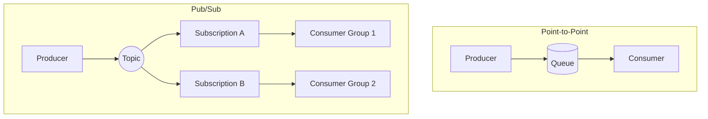
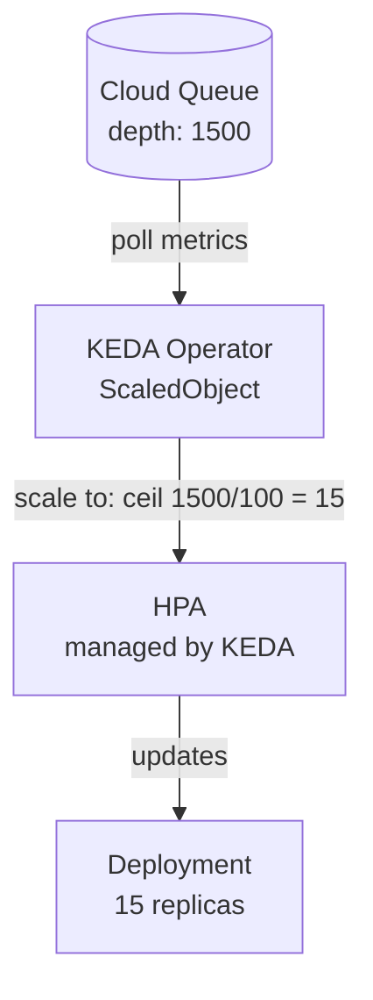
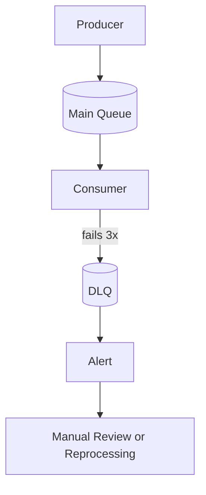
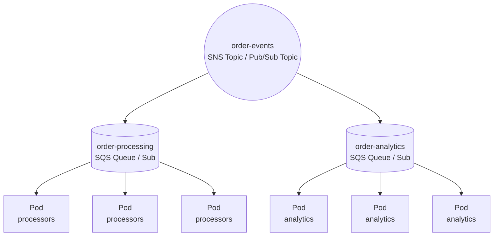
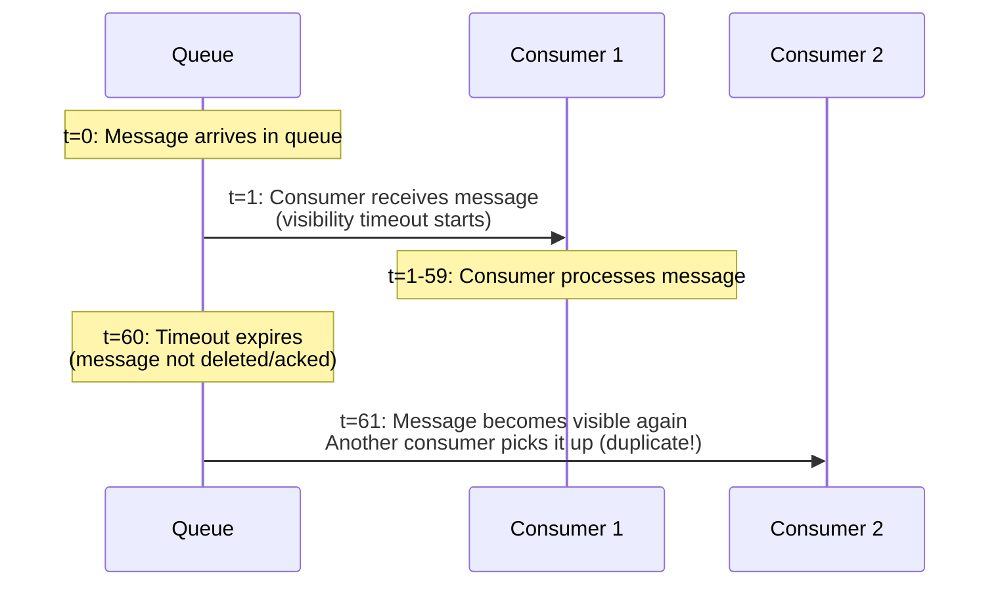

**Complexity**: [COMPLEX] | **Time to Complete**: 2.5h | **Prerequisites**: Module 9.1 (Relational Database Integration), Kubernetes Deployments and Services

## What You'll Be Able to Do

After completing this module, you will be able to:

- **Configure Kubernetes workloads to consume from managed message brokers (Amazon MQ, Cloud Pub/Sub, Azure Service Bus)**
- **Implement event-driven autoscaling using KEDA with message queue depth as the scaling trigger**
- **Deploy dead-letter queue patterns and retry logic for reliable message processing in Kubernetes applications**
- **Compare managed message brokers across clouds and evaluate when to use self-hosted (RabbitMQ, NATS) alternatives on Kubernetes**

---

## Why This Module Matters

In March 2023, a logistics company processing 2 million package-tracking events per day ran RabbitMQ as a StatefulSet inside their GKE cluster. The system worked flawlessly for eight months. Then Black Friday arrived. Event volume spiked to 11 million per day. RabbitMQ's memory alarm triggered, blocking all publishers. The three-node cluster entered a split-brain state during a simultaneous node reschedule. Queue mirroring fell behind, and 340,000 tracking events were lost. Customers could not track packages for six hours. The company's SLA penalties totaled $1.2 million.

The postmortem conclusion was blunt: "We were operating a distributed messaging system that required deep RabbitMQ expertise we did not have. We should have used a managed service." They migrated to Amazon SQS within two weeks. SQS does not have memory alarms, split-brain scenarios, or queue mirroring to configure. It scales to any volume without intervention.

This module teaches you how to integrate managed message brokers -- SQS/SNS, Google Pub/Sub, and Azure Service Bus -- with Kubernetes workloads. You will learn how to use KEDA to autoscale consumers based on queue depth, handle dead-letter queues, design for exactly-once versus at-least-once delivery, and manage consumer groups across multiple Kubernetes Deployments.

---

## Messaging Fundamentals for Kubernetes Engineers

Before diving into cloud services, let's establish the core messaging patterns that every integration uses.

### Point-to-Point vs Publish-Subscribe



### Delivery Guarantees

| Guarantee | Meaning | Risk | Used By |
|-----------|---------|------|---------|
| **At-most-once** | Message delivered 0 or 1 times | Data loss on failure | UDP-style telemetry |
| **At-least-once** | Message delivered 1+ times | Duplicates possible | SQS, Pub/Sub, Service Bus |
| **Exactly-once** | Message delivered exactly 1 time | Higher latency, complexity | Kafka transactions, Pub/Sub with dedup |

Most managed brokers provide **at-least-once** delivery by default. This means your consumer code must be **idempotent** -- processing the same message twice should produce the same result as processing it once.

```python
# BAD: Not idempotent -- double processing creates duplicate charges
def process_payment(message):
    charge_customer(message.customer_id, message.amount)

# GOOD: Idempotent -- uses a unique key to prevent duplicates
def process_payment(message):
    if not payment_exists(message.idempotency_key):
        charge_customer(message.customer_id, message.amount)
        record_payment(message.idempotency_key)
```

---

## Cloud Broker Comparison

| Feature | AWS SQS/SNS | Google Pub/Sub | Azure Service Bus |
|---------|-------------|----------------|-------------------|
| Queue model | SQS = queue, SNS = topic | Topic + Subscription | Queue or Topic + Subscription |
| Max message size | 256 KB (SQS), 256 KB (SNS) | 10 MB | 256 KB (Standard), 100 MB (Premium) |
| Retention | 1 min - 14 days | 7 days (configurable to 31) | Up to 14 days |
| Ordering | FIFO queues (strict per group) | Ordering keys | Sessions (strict per session) |
| Throughput | Nearly unlimited (Standard) | Unlimited | Depends on tier (Premium: 1000+ msg/s per unit) |
| Dead-letter | Built-in (maxReceiveCount) | Built-in (maxDeliveryAttempts) | Built-in (maxDeliveryCount) |
| Price per million | ~$0.40 (Standard) | ~$0.40 | ~$0.05 (Basic), varies by tier |

### Managed vs. Self-Hosted Brokers

When should you run your own broker (like RabbitMQ, Apache Kafka, or NATS) on Kubernetes versus using a managed cloud service? Use this framework:

| Decision Factor | Managed (SQS, Pub/Sub, Service Bus) | Self-Hosted on K8s (RabbitMQ, Kafka, NATS) |
|-----------------|--------------------------------------|-------------------------------------------|
| **Operational Expertise** | Zero maintenance. Broker handles scaling, patching, and replication. | Requires deep expertise in StatefulSets, PV I/O tuning, and split-brain recovery. |
| **Protocol Support** | Proprietary APIs (HTTP/gRPC) or limited standard protocol support. | Full support for AMQP, MQTT, STOMP, or specialized Kafka protocols. |
| **Feature Set** | Standardized, opinionated features. | Advanced routing, complex topologies, custom plugins, or massive message replay capabilities. |
| **Cost Structure** | Pay per message/API call. Expensive at massive, continuous throughput. | Fixed infrastructure cost (Compute/Storage). Cheaper at massive, predictable scale. |
| **Compliance/Data Locality**| Data leaves the cluster to the cloud provider's service. | Data stays entirely within your Kubernetes cluster/network boundary. |

**Rule of Thumb:** Default to managed brokers to focus on your application logic. Only self-host if you have a specific requirement (e.g., AMQP protocol requirement, strict air-gapped compliance, or sustained throughput exceeding millions of messages per second where managed costs become prohibitive) AND you have the dedicated engineering bandwidth to operate distributed stateful systems.

### AWS SQS/SNS: The Workhorse

SQS is the simplest managed queue -- no clusters, no partitions, no brokers. You create a queue and start sending messages.

```bash
# Create a standard queue
aws sqs create-queue --queue-name order-processing \
  --attributes '{
    "VisibilityTimeout": "300",
    "MessageRetentionPeriod": "1209600",
    "ReceiveMessageWaitTimeSeconds": "20"
  }'

# Create a dead-letter queue
aws sqs create-queue --queue-name order-processing-dlq

# Set up the redrive policy
DLQ_ARN=$(aws sqs get-queue-attributes \
  --queue-url $(aws sqs get-queue-url --queue-name order-processing-dlq --query QueueUrl --output text) \
  --attribute-names QueueArn --query 'Attributes.QueueArn' --output text)

aws sqs set-queue-attributes \
  --queue-url $(aws sqs get-queue-url --queue-name order-processing --query QueueUrl --output text) \
  --attributes "{\"RedrivePolicy\": \"{\\\"deadLetterTargetArn\\\":\\\"$DLQ_ARN\\\",\\\"maxReceiveCount\\\":\\\"3\\\"}\"}"

# Fan-out with SNS -> SQS
aws sns create-topic --name order-events
aws sns subscribe --topic-arn arn:aws:sns:us-east-1:123456789:order-events \
  --protocol sqs \
  --notification-endpoint arn:aws:sqs:us-east-1:123456789:order-processing
```

### Google Pub/Sub: The Scalable Option

```bash
# Create topic
gcloud pubsub topics create order-events

# Create subscription with dead-lettering
gcloud pubsub topics create order-events-dlq

gcloud pubsub subscriptions create order-processing \
  --topic=order-events \
  --ack-deadline=300 \
  --dead-letter-topic=order-events-dlq \
  --max-delivery-attempts=5 \
  --enable-exactly-once-delivery
```

### Azure Service Bus: The Enterprise Option

```bash
# Create namespace (Premium for VNET integration)
az servicebus namespace create \
  --resource-group myRG --name orders-bus \
  --sku Premium --capacity 1

# Create queue with dead-lettering
az servicebus queue create \
  --resource-group myRG --namespace-name orders-bus \
  --name order-processing \
  --max-delivery-count 3 \
  --default-message-time-to-live P14D \
  --dead-lettering-on-message-expiration true
```

---

## Kubernetes Consumer Deployments

The typical pattern is a Deployment running consumer pods that poll the queue.

### SQS Consumer Pod

```yaml
apiVersion: apps/v1
kind: Deployment
metadata:
  name: order-processor
  namespace: processing
spec:
  replicas: 3
  selector:
    matchLabels:
      app: order-processor
  template:
    metadata:
      labels:
        app: order-processor
    spec:
      serviceAccountName: sqs-consumer
      containers:
        - name: consumer
          image: mycompany/order-processor:1.5.0
          env:
            - name: SQS_QUEUE_URL
              value: "https://sqs.us-east-1.amazonaws.com/123456789/order-processing"
            - name: SQS_WAIT_TIME_SECONDS
              value: "20"
            - name: SQS_MAX_MESSAGES
              value: "10"
            - name: SQS_VISIBILITY_TIMEOUT
              value: "300"
          resources:
            requests:
              cpu: 200m
              memory: 256Mi
            limits:
              cpu: 500m
              memory: 512Mi
          livenessProbe:
            httpGet:
              path: /healthz
              port: 8081
            initialDelaySeconds: 10
            periodSeconds: 30
          readinessProbe:
            httpGet:
              path: /readyz
              port: 8081
            initialDelaySeconds: 5
            periodSeconds: 10
```

### IAM for Queue Access (IRSA / Workload Identity)

Pods should never use static credentials to access message brokers. Use cloud-native workload identity.

```yaml
# AWS: IRSA ServiceAccount
apiVersion: v1
kind: ServiceAccount
metadata:
  name: sqs-consumer
  namespace: processing
  annotations:
    eks.amazonaws.com/role-arn: arn:aws:iam::123456789:role/SQSConsumerRole
---
# The IAM policy attached to SQSConsumerRole:
# {
#   "Effect": "Allow",
#   "Action": [
#     "sqs:ReceiveMessage",
#     "sqs:DeleteMessage",
#     "sqs:GetQueueAttributes",
#     "sqs:ChangeMessageVisibility"
#   ],
#   "Resource": "arn:aws:sqs:us-east-1:123456789:order-processing"
# }
```

```yaml
# GCP: Workload Identity
apiVersion: v1
kind: ServiceAccount
metadata:
  name: pubsub-consumer
  namespace: processing
  annotations:
    iam.gke.io/gcp-service-account: pubsub-consumer@my-project.iam.gserviceaccount.com
```

---

## KEDA: Autoscaling on Queue Depth

KEDA (Kubernetes Event-Driven Autoscaling) is the missing piece that makes message-driven architectures elastic. Instead of scaling on CPU (which is meaningless for I/O-bound queue consumers), KEDA scales based on the number of messages waiting in the queue.

### How KEDA Works



### Installing KEDA

```bash
helm repo add kedacore https://kedacore.github.io/charts
helm repo update
helm install keda kedacore/keda \
  --namespace keda --create-namespace \
  --set serviceAccount.annotations."eks\.amazonaws\.com/role-arn"=arn:aws:iam::123456789:role/KEDARole
```

### KEDA ScaledObject for SQS

```yaml
apiVersion: keda.sh/v1alpha1
kind: ScaledObject
metadata:
  name: order-processor-scaler
  namespace: processing
spec:
  scaleTargetRef:
    name: order-processor
  minReplicaCount: 1
  maxReplicaCount: 50
  pollingInterval: 15
  cooldownPeriod: 120
  triggers:
    - type: aws-sqs-queue
      authenticationRef:
        name: keda-aws-credentials
      metadata:
        queueURL: https://sqs.us-east-1.amazonaws.com/123456789/order-processing
        queueLength: "100"
        awsRegion: us-east-1
        identityOwner: operator
---
apiVersion: keda.sh/v1alpha1
kind: TriggerAuthentication
metadata:
  name: keda-aws-credentials
  namespace: processing
spec:
  podIdentity:
    provider: aws-eks
```

The `queueLength: "100"` setting means KEDA will scale to ensure each pod handles at most 100 messages. If there are 1,500 messages in the queue, KEDA scales to 15 pods.

### KEDA ScaledObject for Pub/Sub

```yaml
apiVersion: keda.sh/v1alpha1
kind: ScaledObject
metadata:
  name: order-processor-scaler
  namespace: processing
spec:
  scaleTargetRef:
    name: order-processor
  minReplicaCount: 1
  maxReplicaCount: 30
  triggers:
    - type: gcp-pubsub
      metadata:
        subscriptionName: "projects/my-project/subscriptions/order-processing"
        mode: "SubscriptionSize"
        value: "50"
```

### KEDA ScaledObject for Azure Service Bus

```yaml
apiVersion: keda.sh/v1alpha1
kind: ScaledObject
metadata:
  name: order-processor-scaler
  namespace: processing
spec:
  scaleTargetRef:
    name: order-processor
  minReplicaCount: 0
  maxReplicaCount: 25
  triggers:
    - type: azure-servicebus
      metadata:
        queueName: order-processing
        namespace: orders-bus
        messageCount: "50"
      authenticationRef:
        name: azure-servicebus-auth
```

### Scale-to-Zero Considerations

KEDA can scale to zero (`minReplicaCount: 0`), which saves costs when queues are empty. But there is a latency cost: when the first message arrives, KEDA must detect it (on the next polling interval), create a pod, wait for the image pull, and wait for container startup. This can take 30-90 seconds.

**Use scale-to-zero when:**
- Processing is not latency-sensitive (batch jobs, analytics)
- Cost savings matter more than response time
- Queues are empty for long periods

**Keep minReplicaCount >= 1 when:**
- You need sub-second processing of new messages
- The application has expensive startup time (JVM, ML model loading)
- The queue always has some baseline traffic

> **Stop and think**: You configure a KEDA ScaledObject for a latency-sensitive fraud detection API queue with `minReplicaCount: 0`. During a low-traffic night, the queue empties and pods scale to zero. Suddenly, a high-priority transaction is flagged for review and enters the queue. What is the customer's experience for this specific transaction?
> *Answer*: The transaction will likely experience a 30-90 second delay. KEDA must first poll the queue, detect the message, scale the Deployment from 0 to 1, and Kubernetes must schedule the pod, pull the image, and start the application before the message is processed. For latency-sensitive paths, always keep `minReplicaCount: 1`.

---

## Dead-Letter Queues (DLQs)

A DLQ captures messages that fail processing repeatedly. Without a DLQ, poison messages -- messages that always fail -- block the queue forever as they are received, fail, become visible again, and repeat.

### DLQ Architecture



### DLQ Consumer for Alerting

```yaml
apiVersion: apps/v1
kind: Deployment
metadata:
  name: dlq-monitor
  namespace: processing
spec:
  replicas: 1
  selector:
    matchLabels:
      app: dlq-monitor
  template:
    metadata:
      labels:
        app: dlq-monitor
    spec:
      containers:
        - name: monitor
          image: mycompany/dlq-monitor:1.0.0
          env:
            - name: DLQ_QUEUE_URL
              value: "https://sqs.us-east-1.amazonaws.com/123456789/order-processing-dlq"
            - name: SLACK_WEBHOOK_URL
              valueFrom:
                secretKeyRef:
                  name: slack-config
                  key: webhook-url
            - name: ALERT_THRESHOLD
              value: "5"
```

### Reprocessing DLQ Messages

```bash
# AWS: Move messages from DLQ back to main queue
aws sqs start-message-move-task \
  --source-arn arn:aws:sqs:us-east-1:123456789:order-processing-dlq \
  --destination-arn arn:aws:sqs:us-east-1:123456789:order-processing \
  --max-number-of-messages-per-second 10
```

> **Stop and think**: A bug in your order-processing code causes 5,000 valid orders to fail and drop into the DLQ over a weekend. On Monday, you deploy a hotfix to the `order-processor` Deployment. If you simply use a script to immediately move all 5,000 messages from the DLQ back into the main `order-processing` queue at once, what risk do you introduce to your backend systems?
> *Answer*: Pushing 5,000 messages back into the main queue instantly could trigger KEDA to rapidly scale up your consumer pods to their maximum limit. This sudden "thundering herd" of concurrent consumers could overwhelm downstream systems, like exhausting the connections on your relational database or hitting rate limits on third-party APIs. When redriving large DLQs, always throttle the redrive rate or temporarily lower the HPA max replicas to protect downstream dependencies.

---

## Consumer Groups and Competing Consumers

When multiple pods consume from the same queue, they are "competing consumers." The broker ensures each message goes to only one consumer. This is automatic with SQS and Service Bus queues. For Pub/Sub, each subscription is an independent consumer group.

### Multi-Consumer Architecture



Each service gets its own subscription/queue. Messages fan out to all subscriptions, and within each subscription, competing consumers share the load.

```yaml
# Producer publishes to SNS topic from within a pod
apiVersion: batch/v1
kind: CronJob
metadata:
  name: order-publisher
  namespace: processing
spec:
  schedule: "*/5 * * * *"
  jobTemplate:
    spec:
      template:
        spec:
          restartPolicy: OnFailure
          serviceAccountName: sns-publisher
          containers:
            - name: publisher
              image: mycompany/order-publisher:1.0.0
              env:
                - name: SNS_TOPIC_ARN
                  value: "arn:aws:sns:us-east-1:123456789:order-events"
```

### Exactly-Once vs At-Least-Once in Practice

| Scenario | Recommended Guarantee | Why |
|----------|----------------------|-----|
| Payment processing | At-least-once + idempotency key | Exactly-once adds latency; idempotency is safer |
| Email notifications | At-least-once + deduplication window | Sending two emails is better than sending zero |
| Inventory updates | At-least-once + last-write-wins | Idempotent by nature (SET quantity = X) |
| Analytics events | At-least-once (duplicates acceptable) | Analytics pipelines handle dedup downstream |
| Financial ledger entries | Exactly-once (Kafka transactions) | Double-counting money is unacceptable |

For most Kubernetes workloads, **at-least-once with application-level idempotency** is the pragmatic choice. Exactly-once is expensive and complex -- only reach for it when the cost of a duplicate exceeds the cost of the complexity.

---

## Visibility Timeout and Message Lifecycle

One of the most misunderstood concepts in queue-based systems is the visibility timeout (SQS) or ack deadline (Pub/Sub).



### Setting the Right Timeout

The visibility timeout must be longer than your maximum processing time. But not too long -- if a consumer crashes, the message is stuck invisible until the timeout expires.

```python
# Good pattern: extend visibility during long processing
import boto3

sqs = boto3.client('sqs')

while True:
    response = sqs.receive_message(
        QueueUrl=QUEUE_URL,
        MaxNumberOfMessages=1,
        WaitTimeSeconds=20,
        VisibilityTimeout=60
    )

    for message in response.get('Messages', []):
        try:
            # Start processing
            result = process_order(message['Body'])

            # If still processing after 45s, extend the timeout
            if result.needs_more_time:
                sqs.change_message_visibility(
                    QueueUrl=QUEUE_URL,
                    ReceiptHandle=message['ReceiptHandle'],
                    VisibilityTimeout=120
                )
                finalize_order(result)

            # Delete on success
            sqs.delete_message(
                QueueUrl=QUEUE_URL,
                ReceiptHandle=message['ReceiptHandle']
            )
        except Exception as e:
            # Don't delete -- message will become visible again
            log.error(f"Failed to process: {e}")
```

> **Pause and predict**: A developer sets an SQS visibility timeout of 30 seconds. Their consumer pod takes 45 seconds to process a complex video encoding task. If three independent video encoding tasks are placed in the queue, and there are 10 consumer pods waiting, what will the system state look like after 35 seconds?
> *Answer*: The system will be processing duplicates. After 30 seconds, the original 3 messages will become visible in the queue again because they haven't been deleted yet (processing takes 45s). Three *other* idle consumer pods will pick them up and start encoding the exact same videos, wasting compute resources and potentially causing race conditions.

---

## Did You Know?

1. **Amazon SQS was one of the first AWS services ever launched** -- it went live in July 2004, two years before EC2 and S3. It has been processing messages for over 20 years and is one of the most battle-tested distributed systems in existence.

2. **Google Pub/Sub can handle over 500 million messages per second** across its global infrastructure. When YouTube processes upload events, comment notifications, and recommendation updates, Pub/Sub is the backbone carrying those events between services.

3. **KEDA has over 60 built-in scalers** as of 2025 -- not just cloud queues but also Kafka, RabbitMQ, PostgreSQL query results, Prometheus metrics, Cron schedules, and even GitHub runner queues. It has become the de facto standard for event-driven autoscaling in Kubernetes.

4. **The "visibility timeout" concept in SQS was inspired by the "lease" pattern** in distributed systems, where a resource is temporarily granted to a consumer with an expiration. This same pattern appears in Kubernetes itself -- node leases, leader election leases, and etcd TTLs all use the same fundamental idea.

---

## Common Mistakes

| Mistake | Why It Happens | How to Fix It |
|---------|---------------|---------------|
| Setting visibility timeout shorter than processing time | Estimated processing time was optimistic | Measure P99 processing time and add 50% buffer; implement dynamic extension |
| Not implementing idempotency in consumers | "At-least-once means delivered once, right?" | Use idempotency keys (message dedup ID or database unique constraints) |
| Scaling KEDA on CPU instead of queue depth | HPA defaults are CPU-based | Use KEDA ScaledObject with queue-specific triggers |
| Missing dead-letter queue configuration | DLQ feels like an edge case during development | Always create a DLQ and a monitoring/alerting consumer for it |
| Using SQS Standard when FIFO is needed | Standard is the default and cheaper | Use FIFO queues with MessageGroupId for ordering-sensitive workloads |
| Processing messages in the readiness probe thread | Trying to block traffic during processing | Keep health probes on a separate HTTP server from message processing |
| Not setting `WaitTimeSeconds` (long polling) | Default is short polling (returns immediately) | Always set `WaitTimeSeconds: 20` for SQS to reduce empty responses and cost |
| Deleting messages before processing completes | "Optimistic" deletion to avoid duplicates | Only delete/ack after successful processing and any downstream writes |

---

## Quiz

<details>
<summary>1. Your team is designing a payment processing service on Kubernetes that consumes messages from a broker. An engineer argues that the broker must be configured for "exactly-once" delivery so customers aren't double-charged. Why is relying on "at-least-once" delivery with an application-level idempotency key a safer and more resilient architectural choice?</summary>

Exactly-once delivery requires complex coordination between the broker and the consumer, often introducing significant latency and fragility. In a Kubernetes environment, pods can crash, lose network connectivity, or be rescheduled at any moment, meaning network failures will inevitably disrupt exactly-once handshakes. At-least-once delivery ensures the message is guaranteed to arrive, keeping the broker fast and simple. By designing your application to be idempotent (e.g., checking a database for a processed transaction ID before charging), you guarantee correct outcomes even if the broker delivers the message multiple times or a pod restarts mid-process.
</details>

<details>
<summary>2. During a sudden traffic spike, your SQS queue depth jumps to 1,500 messages. You have a KEDA ScaledObject configured with `queueLength: "100"`, `minReplicaCount: 2`, and `maxReplicaCount: 50`. How will KEDA respond to this scenario, and what factors control the pace of this scaling?</summary>

KEDA calculates the desired number of replicas by dividing the current queue depth by the target value. In this scenario, it divides 1,500 messages by the target of 100, resulting in a desired state of 15 replicas. Since 15 is within the bounds of your min (2) and max (50) replicas, KEDA will update the underlying HorizontalPodAutoscaler to scale the Deployment to 15 pods. KEDA polls the queue metrics based on the `pollingInterval` (default 30 seconds), meaning the scale-up will trigger on the next poll, and it will honor the `cooldownPeriod` before scaling back down once the queue is drained.
</details>

<details>
<summary>3. A worker pod is downloading and processing a large 5GB video file from an SQS message trigger. The processing takes 4 minutes, but the SQS queue's visibility timeout is set to 2 minutes. What specific failure state will this create in your cluster, and how will it impact other consumers?</summary>

Because the visibility timeout (2 minutes) is shorter than the processing time (4 minutes), the message will become visible in the queue again before the first pod finishes its work. Another idle consumer pod will pull the exact same message and begin downloading and processing the video from the beginning. This results in duplicate processing, wasted compute resources, and potential race conditions when both pods try to write the final result. To fix this, the application must either set a longer default visibility timeout or dynamically extend the timeout via API calls while the long-running task is still actively processing.
</details>

<details>
<summary>4. You need to route an "OrderCreated" event to both an Inventory Service and a Billing Service, each running 5 replicas. An engineer suggests having all 10 pods listen to a single SQS queue. Why will this fail to achieve the business requirement, and how does a fan-out architecture solve it?</summary>

If all 10 pods listen to a single SQS queue, they will act as competing consumers, meaning each "OrderCreated" message will be delivered to exactly one pod (either Inventory OR Billing, but not both). This breaks the requirement that both services need to process the event independently. By using a fan-out pattern (e.g., an SNS topic publishing to two separate SQS queues—one for Inventory, one for Billing), you create independent copies of the message. The 5 Inventory pods will compete for messages on their dedicated queue, and the 5 Billing pods will compete on theirs, ensuring both business domains process every order.
</details>

<details>
<summary>5. A healthcare application uses KEDA to scale a patient alert processing service. The developers set `minReplicaCount: 0` to save compute costs at night when alerts are rare. When a critical heart-rate alert arrives at 3 AM, why might the response time be unacceptably slow?</summary>

Because the service is scaled to zero, there are no running pods available to immediately process the incoming 3 AM alert. KEDA must first detect the message during its polling cycle, which introduces a slight delay. Then, it triggers a scale-up, requiring Kubernetes to schedule a new pod, pull the container image, and wait for the application to initialize and pass readiness probes. This cold-start sequence can take anywhere from 30 to 90 seconds, adding massive latency to a critical healthcare alert. For latency-sensitive workloads, always keep at least one replica running.
</details>

<details>
<summary>6. A developer deploys a new JSON parsing library in an SQS consumer pod, but it crashes whenever it encounters a null field. An upstream service starts sending payloads with null fields. If there is no Dead-Letter Queue (DLQ) configured, what will happen to the overall health of the messaging system?</summary>

Without a DLQ, the messages containing null fields become "poison messages." The consumer pod will receive the message, attempt to parse it, crash, and fail to delete the message. After the visibility timeout expires, the message will become visible again, another pod will pick it up, crash, and the cycle will repeat indefinitely. This infinite loop will consume cluster CPU, generate endless crash loop logs, and prevent healthy messages behind the poison messages from being processed. A DLQ automatically quarantines these failing messages after a set number of attempts, allowing normal processing to continue and giving engineers a place to inspect the bad data.
</details>

<details>
<summary>7. Your team is migrating a microservice architecture from AWS SQS to Google Cloud Pub/Sub. In AWS, you had 3 pods polling a single SQS queue to share the load. If you configure 3 pods to subscribe directly to a single Pub/Sub Topic without configuring a Subscription, what unexpected behavior will you encounter?</summary>

In Google Pub/Sub, a Topic only acts as a routing mechanism, and you cannot consume directly from it; you must create a Subscription. If you create three separate Subscriptions (one for each pod), Pub/Sub will treat them as distinct consumer groups, and every pod will receive a copy of every message (fan-out) rather than sharing the load. To replicate the SQS load-sharing behavior, you must create a single Subscription and configure all 3 pods to pull from that exact same Subscription. This explicit Subscription model gives Pub/Sub strict separation between fan-out and competing-consumer routing.
</details>

<details>
<summary>8. A startup is building a microservices platform on EKS. They process about 50,000 internal events per day. Their lead architect wants to deploy a 5-node Kafka cluster using Strimzi to handle this messaging, citing "better control over routing and future-proofing." Why might this be an architectural anti-pattern for their current state?</summary>

Deploying a self-hosted Kafka cluster for 50,000 messages a day introduces massive operational overhead for very little benefit. Kafka requires managing StatefulSets, Zookeeper/KRaft quorum, persistent volume I/O, and replication factors. For 50,000 messages/day, the cost of the EC2 instances alone will far exceed the cost of managed SQS or SNS, which would be pennies. Furthermore, the engineering time spent maintaining the broker distracts from building the actual product. Unless they have strict regulatory data-locality needs or require Kafka's specific log-replay semantics, a managed service is the correct choice until their scale or feature requirements mandate otherwise.
</details>

---

## Hands-On Exercise: Event-Driven Processing with KEDA

This exercise uses a local kind cluster with a simulated queue (Redis acting as a message broker) and KEDA for autoscaling.

### Setup

```bash
# Create kind cluster
kind create cluster --name event-lab

# Install KEDA
helm repo add kedacore https://kedacore.github.io/charts
helm repo update
helm install keda kedacore/keda --namespace keda --create-namespace
k wait --for=condition=ready pod -l app.kubernetes.io/name=keda-operator \
  --namespace keda --timeout=120s

# Install Redis (simulating a message queue)
helm repo add bitnami https://charts.bitnami.com/bitnami
helm install redis bitnami/redis --namespace messaging --create-namespace \
  --set architecture=standalone \
  --set auth.password=lab-redis-pass \
  --set master.persistence.enabled=false
k wait --for=condition=ready pod -l app.kubernetes.io/name=redis \
  --namespace messaging --timeout=120s
```

### Task 1: Deploy a Queue Consumer

Create a Deployment that processes messages from a Redis list (simulating an SQS queue).

<details>
<summary>Solution</summary>

```yaml
apiVersion: apps/v1
kind: Deployment
metadata:
  name: queue-consumer
  namespace: messaging
spec:
  replicas: 1
  selector:
    matchLabels:
      app: queue-consumer
  template:
    metadata:
      labels:
        app: queue-consumer
    spec:
      containers:
        - name: consumer
          image: redis:7
          command:
            - /bin/sh
            - -c
            - |
              while true; do
                MSG=$(redis-cli -h redis-master -a lab-redis-pass \
                  BRPOP order-queue 10 2>/dev/null)
                if [ -n "$MSG" ]; then
                  echo "Processed: $MSG"
                fi
              done
          resources:
            requests:
              cpu: 50m
              memory: 64Mi
```

```bash
k apply -f /tmp/consumer.yaml
```
</details>

### Task 2: Configure KEDA ScaledObject for Redis

Create a KEDA ScaledObject that scales the consumer based on Redis list length.

<details>
<summary>Solution</summary>

```yaml
apiVersion: v1
kind: Secret
metadata:
  name: redis-auth
  namespace: messaging
stringData:
  redis-url: redis://:lab-redis-pass@redis-master.messaging.svc:6379
---
apiVersion: keda.sh/v1alpha1
kind: TriggerAuthentication
metadata:
  name: redis-trigger-auth
  namespace: messaging
spec:
  secretTargetRef:
    - parameter: address
      name: redis-auth
      key: redis-url
---
apiVersion: keda.sh/v1alpha1
kind: ScaledObject
metadata:
  name: queue-consumer-scaler
  namespace: messaging
spec:
  scaleTargetRef:
    name: queue-consumer
  minReplicaCount: 1
  maxReplicaCount: 10
  pollingInterval: 5
  cooldownPeriod: 30
  triggers:
    - type: redis
      metadata:
        listName: order-queue
        listLength: "10"
      authenticationRef:
        name: redis-trigger-auth
```

```bash
k apply -f /tmp/keda-scaledobject.yaml
```
</details>

### Task 3: Generate Load and Watch Scaling

Push 200 messages into the queue and watch KEDA scale the consumer.

<details>
<summary>Solution</summary>

```bash
# Push 200 messages to the queue
k run redis-producer --rm -it --image=redis:7 --namespace=messaging --restart=Never -- \
  /bin/sh -c '
  for i in $(seq 1 200); do
    redis-cli -h redis-master -a lab-redis-pass LPUSH order-queue "{\"orderId\": \"order-$i\", \"amount\": $((RANDOM % 1000))}" > /dev/null 2>&1
  done
  echo "Pushed 200 messages"
  redis-cli -h redis-master -a lab-redis-pass LLEN order-queue
  '

# Watch KEDA scale the deployment
k get scaledobject -n messaging -w &
k get pods -n messaging -l app=queue-consumer -w
```
</details>

### Task 4: Implement a Dead-Letter Queue Pattern

Create a second Redis list as a DLQ and modify the consumer to move failed messages there.

<details>
<summary>Solution</summary>

```yaml
apiVersion: apps/v1
kind: Deployment
metadata:
  name: queue-consumer-dlq
  namespace: messaging
spec:
  replicas: 1
  selector:
    matchLabels:
      app: queue-consumer-dlq
  template:
    metadata:
      labels:
        app: queue-consumer-dlq
    spec:
      containers:
        - name: consumer
          image: redis:7
          command:
            - /bin/sh
            - -c
            - |
              RETRY_LIMIT=3
              while true; do
                MSG=$(redis-cli -h redis-master -a lab-redis-pass \
                  BRPOP order-queue 10 2>/dev/null | tail -1)
                if [ -n "$MSG" ]; then
                  # Simulate random failures (1 in 5 messages fail)
                  FAIL=$((RANDOM % 5))
                  if [ "$FAIL" -eq 0 ]; then
                    # Get retry count
                    RETRIES=$(redis-cli -h redis-master -a lab-redis-pass \
                      HGET "retries:$MSG" count 2>/dev/null)
                    RETRIES=${RETRIES:-0}
                    if [ "$RETRIES" -ge "$RETRY_LIMIT" ]; then
                      redis-cli -h redis-master -a lab-redis-pass \
                        LPUSH order-dlq "$MSG" > /dev/null 2>&1
                      redis-cli -h redis-master -a lab-redis-pass \
                        HDEL "retries:$MSG" count > /dev/null 2>&1
                      echo "DLQ: $MSG (exceeded $RETRY_LIMIT retries)"
                    else
                      redis-cli -h redis-master -a lab-redis-pass \
                        HINCRBY "retries:$MSG" count 1 > /dev/null 2>&1
                      redis-cli -h redis-master -a lab-redis-pass \
                        LPUSH order-queue "$MSG" > /dev/null 2>&1
                      echo "RETRY ($((RETRIES+1))/$RETRY_LIMIT): $MSG"
                    fi
                  else
                    echo "OK: $MSG"
                  fi
                fi
              done
```

```bash
k apply -f /tmp/consumer-dlq.yaml

# Check DLQ after some processing
k exec -n messaging deploy/queue-consumer-dlq -- \
  redis-cli -h redis-master -a lab-redis-pass LLEN order-dlq
```
</details>

### Task 5: Monitor DLQ with an Alert Consumer

Deploy a monitoring pod that watches the DLQ length.

<details>
<summary>Solution</summary>

```yaml
apiVersion: apps/v1
kind: Deployment
metadata:
  name: dlq-monitor
  namespace: messaging
spec:
  replicas: 1
  selector:
    matchLabels:
      app: dlq-monitor
  template:
    metadata:
      labels:
        app: dlq-monitor
    spec:
      containers:
        - name: monitor
          image: redis:7
          command:
            - /bin/sh
            - -c
            - |
              THRESHOLD=5
              while true; do
                DLQ_LEN=$(redis-cli -h redis-master -a lab-redis-pass \
                  LLEN order-dlq 2>/dev/null)
                echo "$(date): DLQ depth = $DLQ_LEN"
                if [ "$DLQ_LEN" -gt "$THRESHOLD" ]; then
                  echo "ALERT: DLQ depth $DLQ_LEN exceeds threshold $THRESHOLD!"
                fi
                sleep 15
              done
```

```bash
k apply -f /tmp/dlq-monitor.yaml
k logs -f -n messaging deploy/dlq-monitor
```
</details>

### Success Criteria

- [ ] KEDA ScaledObject is created and active
- [ ] Consumer pod count increases when 200 messages are pushed
- [ ] Pod count decreases after queue is drained
- [ ] Failed messages land in the DLQ (order-dlq Redis list)
- [ ] DLQ monitor detects and alerts on threshold breach

### Cleanup

```bash
kind delete cluster --name event-lab
```

---

**Next Module**: [Module 9.3: Serverless Interoperability (Lambda / Cloud Functions / Knative)](../module-9.3-serverless/) -- Learn when to use serverless alongside Kubernetes, how to trigger cloud functions from K8s events, and how Knative brings the serverless model directly into your cluster.