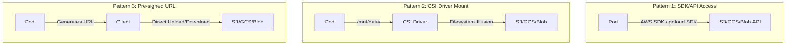
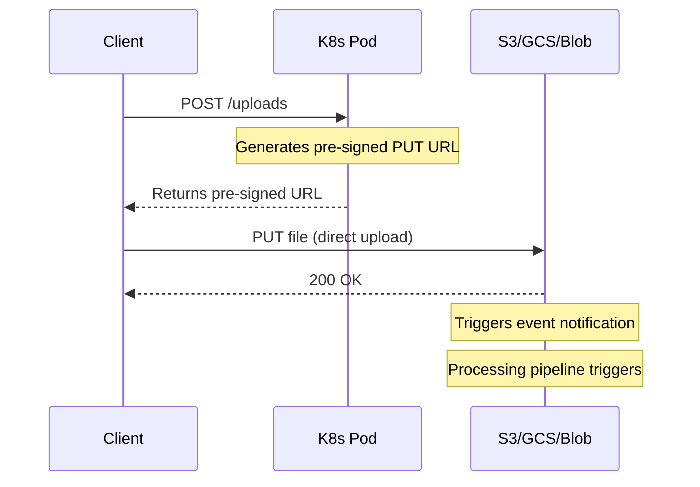

**Complexity**: [MEDIUM] | **Time to Complete**: 2h | **Prerequisites**: Module 9.1 (Databases), Kubernetes PersistentVolumes and CSI concepts

## What You'll Be Able to Do

After completing this module, you will be able to:

- **Implement CSI-based object storage mounting (Mountpoint for S3, GCS FUSE, Azure Blob CSI) for Kubernetes workloads**
- **Configure lifecycle policies and intelligent tiering across S3, GCS, and Azure Blob for cost-optimized data pipelines**
- **Deploy object storage access patterns using presigned URLs, workload identity, and IRSA/Workload Identity integration**
- **Design object storage replication, versioning, and lifecycle strategies for robust data protection and disaster recovery**

---

## Why This Module Matters

In January 2024, a media streaming company stored 4.2 petabytes of video content in Amazon S3. Their transcoding pipeline ran on EKS -- 60 pods processing uploaded videos into multiple formats. The architecture worked, but their S3 costs were $127,000 per month. A junior engineer noticed that 78% of the data had not been accessed in over 90 days. The team implemented S3 Lifecycle policies, moving cold content to S3 Glacier Instant Retrieval. Monthly costs dropped to $41,000 -- a $86,000/month saving from a 15-line configuration change.

In the same cluster, the application team was generating pre-signed URLs for video playback. A misconfiguration set the URL expiration to 30 days instead of 4 hours. A security audit discovered that shared URLs were being forwarded and reused across the internet, effectively giving unauthenticated users perpetual access to premium content. The fix took five minutes; the brand damage took months to recover from.

Object storage is deceptively simple -- "just upload a file." But from Kubernetes, the integration patterns are rich and the pitfalls are expensive. This module teaches you how to access S3, GCS, and Azure Blob from pods using workload identity, CSI drivers for filesystem-style access, pre-signed URLs for secure client-side access, lifecycle policies for cost optimization, cross-region replication for disaster recovery, and bucket security hardening.

---

## Pod-to-Storage Access Patterns

There are three primary ways Kubernetes pods interact with object storage:



### Pattern 1: SDK Access with Workload Identity

The most common and flexible pattern. Your application uses the cloud SDK to interact with the storage API directly.

```yaml
# AWS: Pod with IRSA for S3 access
apiVersion: v1
kind: ServiceAccount
metadata:
  name: storage-writer
  namespace: production
  annotations:
    eks.amazonaws.com/role-arn: arn:aws:iam::123456789:role/S3WriterRole
---
apiVersion: apps/v1
kind: Deployment
metadata:
  name: video-processor
  namespace: production
spec:
  replicas: 5
  selector:
    matchLabels:
      app: video-processor
  template:
    metadata:
      labels:
        app: video-processor
    spec:
      serviceAccountName: storage-writer
      containers:
        - name: processor
          image: mycompany/video-processor:3.1.0
          env:
            - name: S3_BUCKET
              value: video-content-prod
            - name: S3_REGION
              value: us-east-1
          resources:
            requests:
              cpu: "2"
              memory: 4Gi
```

The IAM policy for the role:

```json
{
  "Version": "2012-10-17",
  "Statement": [
    {
      "Effect": "Allow",
      "Action": [
        "s3:GetObject",
        "s3:PutObject",
        "s3:DeleteObject",
        "s3:ListBucket"
      ],
      "Resource": [
        "arn:aws:s3:::video-content-prod",
        "arn:aws:s3:::video-content-prod/*"
      ]
    }
  ]
}
```

### GCP Workload Identity for GCS

```yaml
apiVersion: v1
kind: ServiceAccount
metadata:
  name: gcs-writer
  namespace: production
  annotations:
    iam.gke.io/gcp-service-account: gcs-writer@my-project.iam.gserviceaccount.com
```

```bash
# Bind the Kubernetes SA to the GCP SA
gcloud iam service-accounts add-iam-policy-binding \
  gcs-writer@my-project.iam.gserviceaccount.com \
  --role roles/iam.workloadIdentityUser \
  --member "serviceAccount:my-project.svc.id.goog[production/gcs-writer]"

# Grant GCS access to the GCP SA
gcloud storage buckets add-iam-policy-binding gs://video-content-prod \
  --member="serviceAccount:gcs-writer@my-project.iam.gserviceaccount.com" \
  --role="roles/storage.objectUser"
```

### Azure Workload Identity for Blob

```yaml
apiVersion: v1
kind: ServiceAccount
metadata:
  name: blob-writer
  namespace: production
  annotations:
    azure.workload.identity/client-id: "a1b2c3d4-e5f6-7890-abcd-ef1234567890"
  labels:
    azure.workload.identity/use: "true"
```

```bash
# Create federated credential
az identity federated-credential create \
  --identity-name blob-writer-identity \
  --resource-group myRG \
  --issuer "https://oidc.eks.us-east-1.amazonaws.com/id/EXAMPLED539D4633E53DE1B716D3041E" \
  --subject system:serviceaccount:production:blob-writer

# Assign Storage Blob Data Contributor role
az role assignment create \
  --assignee-object-id $(az identity show -n blob-writer-identity -g myRG --query principalId -o tsv) \
  --role "Storage Blob Data Contributor" \
  --scope "/subscriptions/SUB_ID/resourceGroups/myRG/providers/Microsoft.Storage/storageAccounts/videostorage"
```

---

## CSI Drivers: Mounting Object Storage as a Filesystem

Sometimes your application expects a filesystem path, not an SDK. CSI drivers bridge this gap by presenting object storage as a POSIX-like mount.

### Mountpoint for Amazon S3 CSI Driver

```bash
# Install the driver as an EKS add-on
aws eks create-addon \
  --cluster-name my-cluster \
  --addon-name aws-mountpoint-s3-csi-driver \
  --service-account-role-arn arn:aws:iam::123456789:role/S3CSIDriverRole
```

```yaml
# StorageClass for S3
apiVersion: storage.k8s.io/v1
kind: StorageClass
metadata:
  name: s3-storage
provisioner: s3.csi.aws.com
parameters:
  bucketName: data-pipeline-prod
mountOptions:
  - allow-delete
  - region us-east-1
  - prefix data/
---
# PersistentVolumeClaim
apiVersion: v1
kind: PersistentVolumeClaim
metadata:
  name: s3-data
  namespace: production
spec:
  accessModes:
    - ReadWriteMany
  storageClassName: s3-storage
  resources:
    requests:
      storage: 1Ti    # Not enforced -- S3 is unlimited, but required by K8s API
---
# Pod using the mount
apiVersion: v1
kind: Pod
metadata:
  name: data-processor
  namespace: production
spec:
  serviceAccountName: storage-writer
  containers:
    - name: processor
      image: mycompany/data-processor:1.0.0
      volumeMounts:
        - name: s3-data
          mountPath: /mnt/data
      command:
        - /bin/sh
        - -c
        - |
          # Read files from S3 as if they were local
          ls /mnt/data/
          cat /mnt/data/config.json

          # Write files -- they appear in S3
          echo '{"processed": true}' > /mnt/data/output/result.json
  volumes:
    - name: s3-data
      persistentVolumeClaim:
        claimName: s3-data
```

### CSI Driver Limitations

| Feature | Mountpoint for S3 | GCS FUSE | Azure Blob CSI |
|---------|-------------------|----------|----------------|
| Read performance | Good (sequential) | Good | Good |
| Write performance | Good (new files) | Moderate | Good |
| Random I/O | Poor (not a block device) | Poor | Poor |
| Rename/move | Not atomic | Not atomic | Not atomic |
| Hard links | Not supported | Not supported | Not supported |
| File locking | Not supported | Not supported | Not supported |
| Best for | Data pipelines, ML training data | Data analytics | Batch processing |

**Critical warning**: Object storage CSI mounts are NOT suitable for databases, caches, or any workload requiring random I/O, atomic operations, or POSIX compliance. Use them for read-heavy data pipelines and write-once-read-many workloads.

> **Stop and think**: Your team is deploying a new PostgreSQL database to Kubernetes. A junior engineer suggests using the S3 CSI driver to store the data files "so we never run out of disk space." What is the technical reason you must reject this proposal, and what should you use instead?

### GCS FUSE CSI Driver

```yaml
# GKE: Enable GCS FUSE on the cluster
# gcloud container clusters update my-cluster \
#   --update-addons GcsFuseCsiDriver=ENABLED

apiVersion: v1
kind: Pod
metadata:
  name: ml-trainer
  namespace: ml
  annotations:
    gke-gcsfuse/volumes: "true"
    gke-gcsfuse/cpu-limit: "500m"
    gke-gcsfuse/memory-limit: "256Mi"
spec:
  serviceAccountName: gcs-writer
  containers:
    - name: trainer
      image: mycompany/ml-trainer:2.0.0
      volumeMounts:
        - name: training-data
          mountPath: /data
          readOnly: true
  volumes:
    - name: training-data
      csi:
        driver: gcsfuse.csi.storage.gke.io
        readOnly: true
        volumeAttributes:
          bucketName: ml-training-data
          mountOptions: "implicit-dirs"
```

---

## Pre-Signed URLs: Secure Direct Access

Pre-signed URLs allow clients to upload or download directly from object storage without passing through your Kubernetes pods. This offloads bandwidth from your cluster and reduces latency.

### Architecture



> **Pause and predict**: If a user uploads a 5GB video file directly through your Kubernetes API pod instead of using a pre-signed URL, what specific resource bottlenecks might occur in your cluster?

### Generating Pre-Signed URLs

```python
# AWS S3 pre-signed URL generation
import boto3
from datetime import timedelta

s3 = boto3.client('s3')

def generate_upload_url(filename, content_type):
    """Generate a pre-signed URL for direct client upload."""
    key = f"uploads/{filename}"

    url = s3.generate_presigned_url(
        'put_object',
        Params={
            'Bucket': 'user-uploads-prod',
            'Key': key,
            'ContentType': content_type,
            'ServerSideEncryption': 'aws:kms',
        },
        ExpiresIn=3600,  # 1 hour -- NOT 30 days!
        HttpMethod='PUT'
    )
    return url

def generate_download_url(key):
    """Generate a pre-signed URL for client download."""
    url = s3.generate_presigned_url(
        'get_object',
        Params={
            'Bucket': 'user-uploads-prod',
            'Key': key,
        },
        ExpiresIn=14400,  # 4 hours
    )
    return url
```

```python
# GCS pre-signed URL generation
from google.cloud import storage
from datetime import timedelta

client = storage.Client()
bucket = client.bucket('user-uploads-prod')

def generate_upload_url(filename, content_type):
    blob = bucket.blob(f"uploads/{filename}")
    url = blob.generate_signed_url(
        version="v4",
        expiration=timedelta(hours=1),
        method="PUT",
        content_type=content_type,
    )
    return url
```

### Pre-Signed URL Security Best Practices

| Practice | Why |
|----------|-----|
| Set short expiration (1-4 hours for downloads, 15-60 min for uploads) | Limits exposure window if URL is leaked |
| Restrict Content-Type in upload URLs | Prevents uploading unexpected file types |
| Use separate buckets for uploads vs processed content | Isolates raw uploads from verified content |
| Require server-side encryption in the URL parameters | Ensures all uploads are encrypted at rest |
| Log all pre-signed URL generations | Audit trail for access tracking |
| Never expose bucket credentials; only expose URLs | Pre-signed URLs are scoped and temporary |

---

## Lifecycle Policies for Cost Optimization

Object storage costs are dominated by storage volume, not access. Moving infrequently accessed data to cheaper tiers can save 60-90%.

### Storage Tier Comparison

| Tier | AWS | GCP | Azure | Cost (per GB/month) | Use Case |
|------|-----|-----|-------|-------------------|----------|
| Hot | S3 Standard | Standard | Hot | $0.023 | Frequently accessed |
| Infrequent | S3 Standard-IA | Nearline | Cool | $0.0125 | Monthly access |
| Archive | S3 Glacier IR | Coldline | Cold | $0.004 | Quarterly access |
| Deep archive | S3 Glacier Deep | Archive | Archive | $0.00099 | Yearly/compliance |

### AWS S3 Lifecycle Configuration

```json
{
  "Rules": [
    {
      "ID": "optimize-video-storage",
      "Status": "Enabled",
      "Filter": {
        "Prefix": "videos/"
      },
      "Transitions": [
        {
          "Days": 30,
          "StorageClass": "STANDARD_IA"
        },
        {
          "Days": 90,
          "StorageClass": "GLACIER_IR"
        },
        {
          "Days": 365,
          "StorageClass": "DEEP_ARCHIVE"
        }
      ]
    },
    {
      "ID": "cleanup-temp-uploads",
      "Status": "Enabled",
      "Filter": {
        "Prefix": "tmp-uploads/"
      },
      "Expiration": {
        "Days": 7
      },
      "AbortIncompleteMultipartUpload": {
        "DaysAfterInitiation": 1
      }
    }
  ]
}
```

```bash
aws s3api put-bucket-lifecycle-configuration \
  --bucket video-content-prod \
  --lifecycle-configuration file://lifecycle.json
```

### GCS Lifecycle

```bash
cat > /tmp/gcs-lifecycle.json << 'EOF'
{
  "lifecycle": {
    "rule": [
      {
        "action": {"type": "SetStorageClass", "storageClass": "NEARLINE"},
        "condition": {"age": 30, "matchesPrefix": ["videos/"]}
      },
      {
        "action": {"type": "SetStorageClass", "storageClass": "COLDLINE"},
        "condition": {"age": 90, "matchesPrefix": ["videos/"]}
      },
      {
        "action": {"type": "Delete"},
        "condition": {"age": 7, "matchesPrefix": ["tmp-uploads/"]}
      }
    ]
  }
}
EOF

gcloud storage buckets update gs://video-content-prod \
  --lifecycle-file=/tmp/gcs-lifecycle.json
```

### Incomplete Multipart Upload Cleanup

One of the most overlooked cost leaks: incomplete multipart uploads. When a large upload fails midway, the partial parts sit in S3 forever, incurring storage charges. The lifecycle rule `AbortIncompleteMultipartUpload` cleans these up automatically.

```bash
# Check for incomplete multipart uploads
aws s3api list-multipart-uploads --bucket video-content-prod

# You may be shocked at how many orphaned parts exist
```

---

## Cross-Region Replication

For disaster recovery or serving content from multiple regions, cross-region replication copies objects automatically.

### AWS S3 Cross-Region Replication

```bash
# Enable versioning (required for replication)
aws s3api put-bucket-versioning \
  --bucket video-content-prod \
  --versioning-configuration Status=Enabled

aws s3api put-bucket-versioning \
  --bucket video-content-dr \
  --versioning-configuration Status=Enabled

# Create replication configuration
cat > /tmp/replication.json << 'EOF'
{
  "Role": "arn:aws:iam::123456789:role/S3ReplicationRole",
  "Rules": [
    {
      "ID": "dr-replication",
      "Status": "Enabled",
      "Filter": {
        "Prefix": ""
      },
      "Destination": {
        "Bucket": "arn:aws:s3:::video-content-dr",
        "StorageClass": "STANDARD_IA",
        "ReplicationTime": {
          "Status": "Enabled",
          "Time": {"Minutes": 15}
        },
        "Metrics": {
          "Status": "Enabled",
          "EventThreshold": {"Minutes": 15}
        }
      },
      "DeleteMarkerReplication": {
        "Status": "Enabled"
      }
    }
  ]
}
EOF

aws s3api put-bucket-replication \
  --bucket video-content-prod \
  --replication-configuration file:///tmp/replication.json
```

### Multi-Region Access from Kubernetes

When pods in different regions need the closest bucket:

```yaml
# Region-specific ConfigMap
apiVersion: v1
kind: ConfigMap
metadata:
  name: storage-config
  namespace: production
data:
  BUCKET_NAME: "video-content-prod"     # US region
  # In EU cluster, this would be: "video-content-eu"
  BUCKET_REGION: "us-east-1"
```

For AWS, S3 Multi-Region Access Points provide a single endpoint that automatically routes to the nearest bucket:

```bash
aws s3control create-multi-region-access-point \
  --account-id 123456789 \
  --details '{
    "Name": "video-global",
    "Regions": [
      {"Bucket": "video-content-prod"},
      {"Bucket": "video-content-eu"},
      {"Bucket": "video-content-ap"}
    ]
  }'
```

---

## Bucket Security Hardening

### Defense-in-Depth Configuration

```bash
# 1. Block all public access (do this first, always)
aws s3api put-public-access-block \
  --bucket video-content-prod \
  --public-access-block-configuration \
    BlockPublicAcls=true,IgnorePublicAcls=true,BlockPublicPolicy=true,RestrictPublicBuckets=true

# 2. Enable default encryption with KMS
aws s3api put-bucket-encryption \
  --bucket video-content-prod \
  --server-side-encryption-configuration '{
    "Rules": [{"ApplyServerSideEncryptionByDefault": {
      "SSEAlgorithm": "aws:kms",
      "KMSMasterKeyID": "alias/s3-encryption-key"
    }, "BucketKeyEnabled": true}]
  }'

# 3. Enable access logging
aws s3api put-bucket-logging \
  --bucket video-content-prod \
  --bucket-logging-status '{
    "LoggingEnabled": {
      "TargetBucket": "access-logs-prod",
      "TargetPrefix": "s3/video-content-prod/"
    }
  }'

# 4. Enable versioning (protects against accidental deletion)
aws s3api put-bucket-versioning \
  --bucket video-content-prod \
  --versioning-configuration Status=Enabled

# 5. Require TLS (deny non-HTTPS requests)
aws s3api put-bucket-policy --bucket video-content-prod \
  --policy '{
    "Version": "2012-10-17",
    "Statement": [{
      "Sid": "DenyNonHTTPS",
      "Effect": "Deny",
      "Principal": "*",
      "Action": "s3:*",
      "Resource": [
        "arn:aws:s3:::video-content-prod",
        "arn:aws:s3:::video-content-prod/*"
      ],
      "Condition": {"Bool": {"aws:SecureTransport": "false"}}
    }]
  }'
```

### Bucket Security Checklist

| Control | AWS | GCP | Azure |
|---------|-----|-----|-------|
| Block public access | Public Access Block | Uniform bucket-level access | Disable anonymous access |
| Encryption at rest | SSE-S3/SSE-KMS | Google-managed/CMEK | Microsoft-managed/CMK |
| Encryption in transit | Enforce HTTPS via bucket policy | HTTPS by default | Require secure transfer |
| Access logging | Server access logging | Cloud Audit Logs | Diagnostic logs |
| Versioning | Bucket versioning | Object versioning | Blob versioning |
| Immutability | Object Lock | Retention policies | Immutable storage |

---

## Did You Know?

1. **Amazon S3 stores over 350 trillion objects** as of 2025 and handles tens of millions of requests per second. S3 was designed to provide 99.999999999% (11 nines) durability, meaning you would statistically lose one object per 10 million years if you stored 10 million objects.

2. **Incomplete multipart uploads are a hidden cost bomb.** A 2023 study by Vantage found that 15% of companies surveyed had over $10,000/month in charges from orphaned multipart upload parts. Most had no idea these partial uploads existed until they added lifecycle rules to clean them up.

3. **GCS FUSE can cache frequently-read files on local SSD**, reducing read latency from ~50ms (network) to ~1ms (local). This makes it practical for ML training workloads that read the same dataset files thousands of times per epoch. The cache is configured via annotations on the pod.

4. **Azure Blob Storage supports "immutable storage" with legal hold and time-based retention** that even a subscription owner cannot override. This is used by financial institutions for SEC 17a-4 compliance, where records must be stored in a non-erasable, non-rewritable format for specified retention periods.

---

## Common Mistakes

| Mistake | Why It Happens | How to Fix It |
|---------|---------------|---------------|
| Using CSI mount for database files | "It mounts like a disk, right?" | CSI object storage mounts lack POSIX semantics; use EBS/PD for databases |
| Setting pre-signed URL expiration to 30 days | Copy-pasted from example code | Use 1-4 hours for downloads, 15-60 minutes for uploads |
| Not blocking public access on new buckets | Default is private, but one wrong policy makes it public | Enable account-level public access block as a guardrail |
| Ignoring incomplete multipart uploads | Not visible in normal S3 listings | Add `AbortIncompleteMultipartUpload` lifecycle rule to every bucket |
| Using IAM user access keys instead of workload identity | "Quickest way to get it working" | Use IRSA (EKS), Workload Identity (GKE), or Workload Identity Federation (AKS) |
| Not enabling versioning before replication | Replication requires versioning, easy to forget | Script bucket creation to always enable versioning |
| Downloading large files through the pod when pre-signed URLs exist | Simpler code path | Generate pre-signed URLs to offload bandwidth; your pod should not proxy large files |
| No lifecycle policy on any bucket | "We will clean up later" | Define lifecycle rules at bucket creation time; "later" never comes |

---

## Quiz

<details>
<summary>1. Your team is migrating three workloads: a legacy log analyzer that requires local file paths, a new Go microservice, and a heavy video-upload portal. Which object storage access pattern should you choose for each, and why?</summary>

For the legacy log analyzer, use a CSI driver mount because the application expects a POSIX-like filesystem interface and rewriting it to use an SDK might not be feasible. For the new Go microservice, use SDK/API access with Workload Identity, as this is the most flexible, secure, and native way to interact with object storage APIs. For the video-upload portal, use pre-signed URLs to allow clients to upload directly to the bucket. This offloads massive bandwidth requirements from your Kubernetes cluster, preventing node network saturation and reducing latency.
</details>

<details>
<summary>2. A developer proposes using the Mountpoint for S3 CSI driver to host a MySQL database's `/var/lib/mysql` directory to save on EBS costs. Why will this deployment immediately fail or cause data corruption?</summary>

Object storage CSI drivers present a filesystem interface, but they fundamentally lack critical POSIX semantics required by database engines. They do not support random I/O (seeking and modifying within files), atomic rename operations, or file locking, which are all mandatory for write-ahead logs and concurrency control. When MySQL attempts to perform an atomic write or lock a row file, the operation will either fail outright or silently complete without actual atomicity, leading to instantaneous data corruption. You must use block storage like EBS or Persistent Disk for databases.
</details>

<details>
<summary>3. After six months in production, your cloud bill shows S3 storage costs are double what the actual total size of your active objects should dictate. What silent mechanism likely caused this, and how do you permanently fix it?</summary>

The hidden cost is almost certainly caused by incomplete multipart uploads. When large file uploads fail or are interrupted mid-transfer, the partial chunks remain stored in the bucket indefinitely but are completely invisible to standard `list-objects` API calls. Because they take up physical space, the cloud provider continues to charge you for them month over month. To fix this permanently, you must configure a bucket lifecycle rule such as `AbortIncompleteMultipartUpload` set to 1-7 days, which automatically purges any orphaned upload fragments.
</details>

<details>
<summary>4. Your mobile app needs to download user-specific avatars from a private GCS bucket. A junior developer suggests embedding a read-only service account key in the app code. Why is this a severe security risk, and why are pre-signed URLs the correct architectural choice?</summary>

Embedding service account keys in client code is a critical vulnerability because malicious actors can extract the key, granting them permanent, unrestricted read access to potentially the entire bucket or project. Pre-signed URLs eliminate this risk by delegating access dynamically without exposing credentials. The URL encodes a cryptographic signature valid for only a specific object and a strict, limited time window (e.g., 15 minutes). Even if a pre-signed URL is intercepted, the blast radius is contained to a single file, and the access automatically expires.
</details>

<details>
<summary>5. You operate active-active Kubernetes clusters in `us-east-1` and `eu-central-1`. Applications in both clusters need to read from the same globally replicated dataset. How does an S3 Multi-Region Access Point prevent you from having to maintain region-specific ConfigMaps?</summary>

Without a Multi-Region Access Point (MRAP), your deployment manifests would need region-specific ConfigMaps injected to tell the US cluster to use the US bucket and the EU cluster to use the EU bucket. An MRAP solves this by providing a single, global endpoint ARN that you can hardcode into your application's configuration. When a pod makes a request to the MRAP, AWS's global network automatically routes the request to the lowest-latency replica bucket behind the scenes. This decouples your Kubernetes configuration from your cloud storage topology, vastly simplifying multi-region deployments.
</details>

<details>
<summary>6. Your application code is explicitly configured to use `https://` for all S3 API calls. Why do security auditors still require you to implement a `DenyNonHTTPS` bucket policy statement?</summary>

Relying solely on application configuration violates the principle of defense-in-depth, as a simple configuration drift, typo, or new tool (like an admin running a local script) could accidentally use HTTP. By enforcing TLS at the bucket policy level, you create an infrastructure-enforced guardrail that actively denies any unencrypted request regardless of the client's configuration. This guarantees data in transit is protected and satisfies strict compliance frameworks (like HIPAA or PCI-DSS) that require systemic, rather than application-level, enforcement of encryption.
</details>

---

## Hands-On Exercise: Object Storage Access Patterns with MinIO

This exercise uses MinIO (S3-compatible) running locally in a kind cluster to practice all three access patterns.

### Setup

```bash
# Create kind cluster
kind create cluster --name storage-lab

# Install MinIO
helm repo add minio https://charts.min.io/
helm install minio minio/minio \
  --namespace storage --create-namespace \
  --set replicas=1 \
  --set persistence.enabled=false \
  --set rootUser=minioadmin \
  --set rootPassword=minioadmin123 \
  --set resources.requests.memory=256Mi \
  --set mode=standalone

k wait --for=condition=ready pod -l app=minio -n storage --timeout=120s
```

### Task 1: SDK-Style Access from a Pod

Create a pod that uses the AWS CLI (configured for MinIO) to create a bucket and upload files.

<details>
<summary>Solution</summary>

```bash
# Create a Secret with MinIO credentials
k create secret generic minio-creds -n storage \
  --from-literal=AWS_ACCESS_KEY_ID=minioadmin \
  --from-literal=AWS_SECRET_ACCESS_KEY=minioadmin123

# Run a pod with AWS CLI
cat <<'EOF' | k apply -f -
apiVersion: v1
kind: Pod
metadata:
  name: s3-client
  namespace: storage
spec:
  restartPolicy: Never
  containers:
    - name: aws-cli
      image: amazon/aws-cli:2.22.0
      command:
        - /bin/sh
        - -c
        - |
          # Configure endpoint
          export AWS_DEFAULT_REGION=us-east-1

          # Create bucket
          aws --endpoint-url http://minio:9000 s3 mb s3://test-bucket

          # Upload files
          echo "Hello from Kubernetes" > /tmp/hello.txt
          aws --endpoint-url http://minio:9000 s3 cp /tmp/hello.txt s3://test-bucket/hello.txt

          # Create multiple files
          for i in $(seq 1 10); do
            echo "File content $i - $(date)" > /tmp/file-$i.txt
            aws --endpoint-url http://minio:9000 s3 cp /tmp/file-$i.txt s3://test-bucket/data/file-$i.txt
          done

          # List bucket contents
          aws --endpoint-url http://minio:9000 s3 ls s3://test-bucket/ --recursive

          echo "Upload complete!"
          sleep 300
      envFrom:
        - secretRef:
            name: minio-creds
EOF

k wait --for=condition=ready pod/s3-client -n storage --timeout=60s
k logs s3-client -n storage
```
</details>

### Task 2: Generate Pre-Signed URLs

Create a pod that generates pre-signed download URLs for the uploaded files.

<details>
<summary>Solution</summary>

```bash
cat <<'EOF' | k apply -f -
apiVersion: v1
kind: Pod
metadata:
  name: url-generator
  namespace: storage
spec:
  restartPolicy: Never
  containers:
    - name: python
      image: python:3.12-slim
      command:
        - /bin/sh
        - -c
        - |
          pip install boto3 -q

          python3 << 'PYEOF'
          import boto3

          s3 = boto3.client(
              's3',
              endpoint_url='http://minio:9000',
              aws_access_key_id='minioadmin',
              aws_secret_access_key='minioadmin123',
              region_name='us-east-1'
          )

          # Generate pre-signed download URL
          url = s3.generate_presigned_url(
              'get_object',
              Params={'Bucket': 'test-bucket', 'Key': 'hello.txt'},
              ExpiresIn=3600
          )
          print(f"Download URL (1h expiry): {url}")

          # Generate pre-signed upload URL
          upload_url = s3.generate_presigned_url(
              'put_object',
              Params={
                  'Bucket': 'test-bucket',
                  'Key': 'uploads/new-file.txt',
                  'ContentType': 'text/plain'
              },
              ExpiresIn=900
          )
          print(f"Upload URL (15m expiry): {upload_url}")

          # List all objects and generate URLs
          response = s3.list_objects_v2(Bucket='test-bucket', Prefix='data/')
          for obj in response.get('Contents', []):
              url = s3.generate_presigned_url(
                  'get_object',
                  Params={'Bucket': 'test-bucket', 'Key': obj['Key']},
                  ExpiresIn=3600
              )
              print(f"{obj['Key']}: {url[:80]}...")
          PYEOF
      envFrom:
        - secretRef:
            name: minio-creds
EOF

k wait --for=condition=ready pod/url-generator -n storage --timeout=120s
k logs url-generator -n storage
```
</details>

### Task 3: Implement Lifecycle-Like Cleanup

Create a CronJob that cleans up files older than a specified age (simulating lifecycle policies).

<details>
<summary>Solution</summary>

```yaml
apiVersion: batch/v1
kind: CronJob
metadata:
  name: storage-cleanup
  namespace: storage
spec:
  schedule: "*/5 * * * *"
  jobTemplate:
    spec:
      template:
        spec:
          restartPolicy: OnFailure
          containers:
            - name: cleanup
              image: python:3.12-slim
              command:
                - /bin/sh
                - -c
                - |
                  pip install boto3 -q
                  python3 << 'PYEOF'
                  import boto3
                  from datetime import datetime, timezone, timedelta

                  s3 = boto3.client(
                      's3',
                      endpoint_url='http://minio:9000',
                      aws_access_key_id='minioadmin',
                      aws_secret_access_key='minioadmin123',
                      region_name='us-east-1'
                  )

                  MAX_AGE = timedelta(minutes=10)
                  now = datetime.now(timezone.utc)

                  response = s3.list_objects_v2(Bucket='test-bucket', Prefix='data/')
                  deleted = 0
                  for obj in response.get('Contents', []):
                      age = now - obj['LastModified']
                      if age > MAX_AGE:
                          s3.delete_object(Bucket='test-bucket', Key=obj['Key'])
                          print(f"Deleted: {obj['Key']} (age: {age})")
                          deleted += 1

                  print(f"Cleanup complete: {deleted} objects deleted")
                  PYEOF
```

```bash
k apply -f /tmp/cleanup-cronjob.yaml
```
</details>

### Task 4: Verify Bucket Security

Write a script that checks bucket security settings.

<details>
<summary>Solution</summary>

```bash
cat <<'EOF' | k apply -f -
apiVersion: v1
kind: Pod
metadata:
  name: security-audit
  namespace: storage
spec:
  restartPolicy: Never
  containers:
    - name: auditor
      image: python:3.12-slim
      command:
        - /bin/sh
        - -c
        - |
          pip install boto3 -q
          python3 << 'PYEOF'
          import boto3

          s3 = boto3.client(
              's3',
              endpoint_url='http://minio:9000',
              aws_access_key_id='minioadmin',
              aws_secret_access_key='minioadmin123',
              region_name='us-east-1'
          )

          bucket = 'test-bucket'
          print(f"=== Security Audit: {bucket} ===")

          # Check versioning
          try:
              v = s3.get_bucket_versioning(Bucket=bucket)
              status = v.get('Status', 'Disabled')
              print(f"Versioning: {status}")
              if status != 'Enabled':
                  print("  WARNING: Versioning is not enabled!")
          except Exception as e:
              print(f"  Versioning check failed: {e}")

          # Check encryption
          try:
              enc = s3.get_bucket_encryption(Bucket=bucket)
              print(f"Encryption: Enabled")
          except Exception:
              print("Encryption: Not configured")
              print("  WARNING: Default encryption not set!")

          # Check bucket policy
          try:
              policy = s3.get_bucket_policy(Bucket=bucket)
              print(f"Bucket policy: Present")
          except Exception:
              print("Bucket policy: None")
              print("  INFO: No bucket policy (relying on IAM only)")

          # List objects to verify access
          objects = s3.list_objects_v2(Bucket=bucket)
          count = objects.get('KeyCount', 0)
          print(f"Object count: {count}")

          print("=== Audit Complete ===")
          PYEOF
EOF

k wait --for=condition=ready pod/security-audit -n storage --timeout=120s
k logs security-audit -n storage
```
</details>

### Success Criteria

- [ ] S3 client pod creates bucket and uploads 11 files
- [ ] Pre-signed URL generator produces valid download and upload URLs
- [ ] CronJob runs and reports cleanup activity
- [ ] Security audit pod reports versioning and encryption status

### Cleanup

```bash
kind delete cluster --name storage-lab
```

---

**Next Module**: [Module 9.5: Advanced Caching Services (ElastiCache / Memorystore)](../module-9.5-caching/) -- Learn Redis and Memcached architectures for Kubernetes workloads, caching strategies, cache stampede prevention, and using Envoy as a sidecar cache.