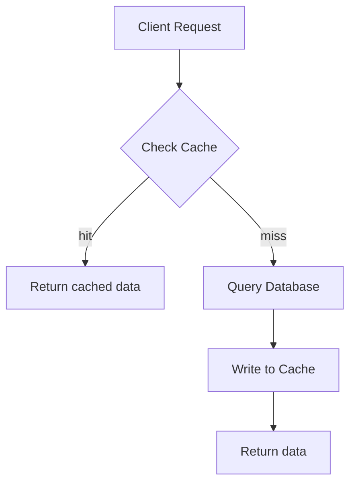
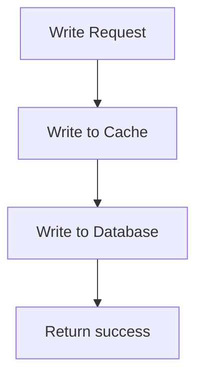
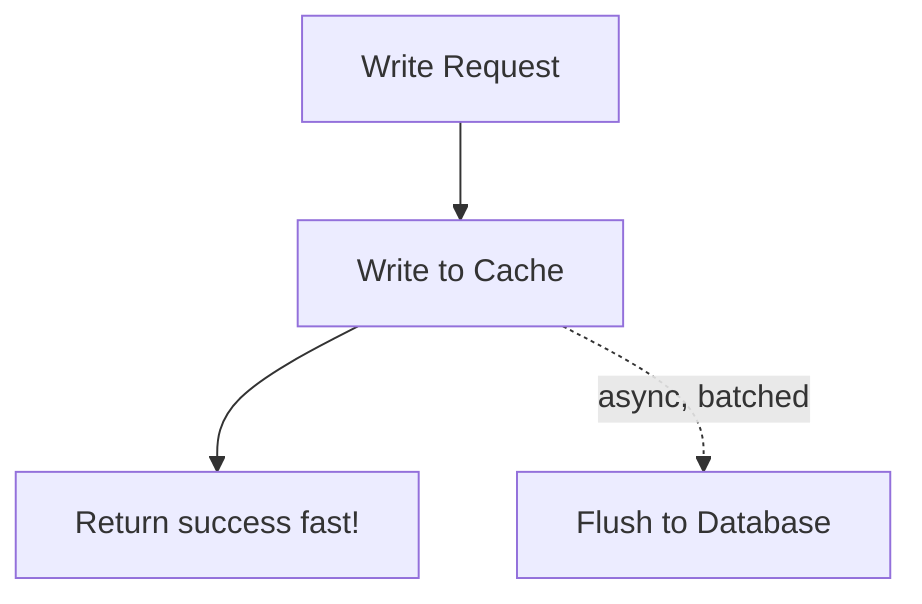
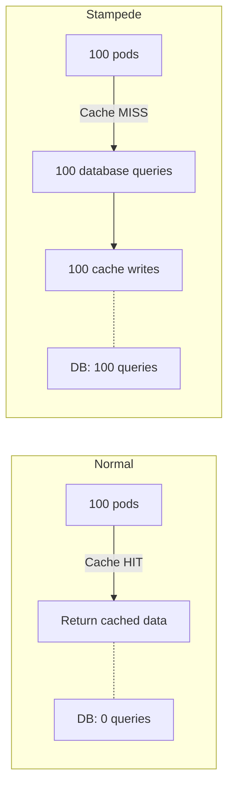
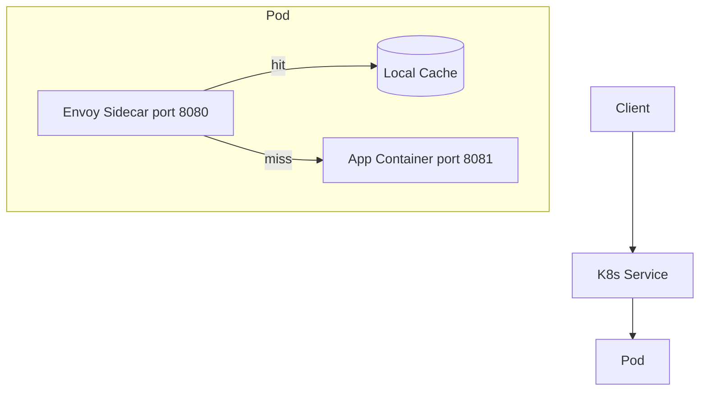

**Complexity**: [COMPLEX] | **Time to Complete**: 2h | **Prerequisites**: Module 9.1 (Databases), Module 9.4 (Object Storage), Redis fundamentals

## What You'll Be Able to Do

After completing this module, you will be able to:

- **Configure Kubernetes pods to connect to managed caching services (ElastiCache, Memorystore, Azure Cache for Redis)**
- **Implement cache-aside, write-through, and write-behind patterns for applications running on Kubernetes**
- **Deploy Redis Sentinel or Cluster mode configurations via managed services with private endpoint connectivity**
- **Diagnose cache performance issues including connection pooling, serialization overhead, and hot key distribution**

---

## Why This Module Matters

A flash-sale traffic spike can overwhelm a relational database when each request fans out into multiple queries and every newly scaled pod opens more database connections.

A self-managed cache with weak observability and poorly reviewed memory settings can silently evict data before peak traffic, pushing the full read load back onto the database.

After moving to a managed Redis service with deliberate sizing, connection limits, and eviction monitoring, teams can dramatically reduce database load during later traffic spikes.

---

## Redis vs Memcached: Choosing Your Engine

### Decision Matrix

| Factor | Redis | Memcached |
|--------|-------|-----------|
| Data structures | [Strings, hashes, lists, sets, sorted sets, streams](https://github.com/redis/redis) | [Strings only (key-value)](https://github.com/memcached/memcached) |
| Persistence | Optional (RDB snapshots, AOF) | None (pure cache) |
| Replication | Primary-replica with automatic failover | None (each node independent) |
| Clustering | Redis Cluster (data sharding) | Client-side sharding |
| Pub/Sub | Built-in | Not available |
| Lua scripting | Yes | No |
| Max item size | Supports much larger single values by default | Smaller default item limit |
| Multi-threaded | Mostly single-threaded command execution | Multi-threaded |
| Best for | Complex caching, sessions, leaderboards, pub/sub | Simple key-value, large working sets, multi-threaded reads |

**For many Kubernetes workloads, Redis is the more versatile choice.** Memcached is simpler but far less capable. Choose Memcached only when you need pure key-value caching at extremely high throughput with no need for data structures, persistence, or replication.

### Managed Service Comparison

| Feature | AWS ElastiCache Redis | GCP Memorystore Redis | Azure Cache for Redis |
|---------|----------------------|----------------------|----------------------|
| Max memory | Depends on node type and cluster shape | Depends on product and deployment model | Depends on tier and current Azure Redis offering |
| Cluster mode | Yes | Available through Memorystore for Redis Cluster | Tier-dependent; verify the current Azure Redis product and tier |
| Multi-AZ failover | Automatic | Automatic (Standard tier) | Automatic (Premium+) |
| Encryption at rest | Yes (KMS) | Yes (CMEK) | Yes (managed keys) |
| Encryption in transit | TLS | TLS | TLS |
| VPC integration | VPC subnets | VPC network | VNET injection |

---

## Caching Strategies

The "right" caching strategy depends on your read/write ratio and consistency requirements.

### Cache-Aside (Lazy Loading)

The most common pattern. The application checks the cache first; on a miss, it reads from the database and populates the cache.



```python
import redis
import json

r = redis.Redis(host='redis-master.cache.svc', port=6379, decode_responses=True)

def get_product(product_id):
    # Step 1: Check cache
    cache_key = f"product:{product_id}"
    cached = r.get(cache_key)
    if cached:
        return json.loads(cached)

    # Step 2: Cache miss -- query database
    product = db.query("SELECT * FROM products WHERE id = %s", product_id)

    # Step 3: Populate cache with TTL
    r.setex(cache_key, 300, json.dumps(product))  # 5-minute TTL

    return product
```

**Pros**: Only caches data that is actually requested. Simple to implement.
**Cons**: Cache miss penalty (extra latency on first request). Data can become stale until TTL expires.

### Write-Through

Every write goes to both the cache and the database simultaneously.



```python
def update_product_price(product_id, new_price):
    # Write to database first
    db.execute("UPDATE products SET price = %s WHERE id = %s", new_price, product_id)

    # Update cache (same transaction boundary)
    product = db.query("SELECT * FROM products WHERE id = %s", product_id)
    cache_key = f"product:{product_id}"
    r.setex(cache_key, 300, json.dumps(product))

    return product
```

**Pros**: Cache is typically consistent with the database. No stale reads after writes.
**Cons**: Write latency increases (two writes per operation). Caches data that may never be read.

### Write-Behind (Write-Back)

Writes go to the cache immediately and are asynchronously flushed to the database.



**Pros**: Extremely fast writes. Database load is smoothed by batching.
**Cons**: Risk of data loss if cache fails before flush. Complex to implement correctly. Not suitable for critical data.

### Strategy Selection Guide

| Scenario | Strategy | Why |
|----------|----------|-----|
| Product catalog (read-heavy) | Cache-aside | Most reads, occasional writes |
| User sessions | Write-through | Must be consistent after login/logout |
| Analytics counters | Write-behind | High write volume, eventual consistency OK |
| API rate limiting | Cache-aside + TTL | Natural expiration, no DB needed |
| Shopping cart | Write-through | Consistency critical for commerce |
| Leaderboard scores | Cache-aside + sorted sets | Redis sorted sets are purpose-built for this |

> **Stop and think**: You are designing a shopping cart service where every item added must be securely recorded, but users frequently refresh the page to view their cart. Which caching strategy provides the necessary consistency while handling the read traffic?

---

## Connecting Kubernetes to Managed Redis

### ElastiCache Redis from EKS

```bash
# Create ElastiCache Redis cluster
aws elasticache create-replication-group \
  --replication-group-id app-cache \
  --replication-group-description "App caching layer" \
  --engine redis --engine-version 7.1 \
  --cache-node-type cache.r7g.large \
  --num-cache-clusters 3 \
  --multi-az-enabled \
  --automatic-failover-enabled \
  --at-rest-encryption-enabled \
  --transit-encryption-enabled \
  --cache-subnet-group-name eks-cache-subnets \
  --security-group-ids sg-0abc123def456
```

```yaml
# Kubernetes Service for Redis endpoint
apiVersion: v1
kind: Service
metadata:
  name: redis-primary
  namespace: cache
spec:
  type: ExternalName
  externalName: app-cache.abc123.ng.0001.use1.cache.amazonaws.com
---
apiVersion: v1
kind: Service
metadata:
  name: redis-reader
  namespace: cache
spec:
  type: ExternalName
  externalName: app-cache-ro.abc123.ng.0001.use1.cache.amazonaws.com
```

### Application Deployment with Redis

```yaml
apiVersion: apps/v1
kind: Deployment
metadata:
  name: api-server
  namespace: production
spec:
  replicas: 10
  selector:
    matchLabels:
      app: api-server
  template:
    metadata:
      labels:
        app: api-server
    spec:
      containers:
        - name: api
          image: mycompany/api-server:3.0.0
          env:
            - name: REDIS_PRIMARY_HOST
              value: redis-primary.cache.svc.cluster.local
            - name: REDIS_READER_HOST
              value: redis-reader.cache.svc.cluster.local
            - name: REDIS_PORT
              value: "6379"
            - name: REDIS_TLS_ENABLED
              value: "true"
            - name: REDIS_AUTH_TOKEN
              valueFrom:
                secretKeyRef:
                  name: redis-auth
                  key: token
            - name: REDIS_MAX_CONNECTIONS
              value: "20"
            - name: REDIS_CONNECT_TIMEOUT_MS
              value: "2000"
            - name: REDIS_COMMAND_TIMEOUT_MS
              value: "500"
          resources:
            requests:
              cpu: 500m
              memory: 512Mi
```

> **Pause and predict**: If you provision an ElastiCache Redis cluster with 3 nodes (1 primary, 2 replicas), how should your Kubernetes application route write commands versus read commands?

---

## Cache Stampede Prevention

A cache stampede (also called "thundering herd") happens when a popular cache key expires and hundreds of pods simultaneously query the database to rebuild it.



### Prevention Strategies

#### 1. Probabilistic Early Expiration (PER)

Refresh the cache before it expires, with a probability that increases as the TTL decreases:

```python
import random
import time

def get_with_per(key, ttl=300, beta=1.0):
    """Probabilistic early refresh to prevent stampedes."""
    cached = r.get(key)
    if cached:
        data = json.loads(cached)
        remaining_ttl = r.ttl(key)
        # As TTL decreases, probability of refresh increases
        # beta controls aggressiveness (higher = earlier refresh)
        delta = ttl * beta * random.random()
        if remaining_ttl < delta:
            # This pod refreshes the cache early
            return refresh_cache(key, ttl)
        return data
    return refresh_cache(key, ttl)

def refresh_cache(key, ttl):
    data = db.query_product(key.split(':')[1])
    r.setex(key, ttl, json.dumps(data))
    return data
```

#### 2. Distributed Lock (Mutex)

Only one pod rebuilds the cache; others wait or serve stale data:

```python
def get_with_lock(key, ttl=300):
    cached = r.get(key)
    if cached:
        return json.loads(cached)

    lock_key = f"lock:{key}"
    # Try to acquire lock (NX = set if not exists, EX = expiry)
    acquired = r.set(lock_key, "1", nx=True, ex=10)

    if acquired:
        # This pod rebuilds the cache
        try:
            data = db.query_product(key.split(':')[1])
            r.setex(key, ttl, json.dumps(data))
            return data
        finally:
            r.delete(lock_key)
    else:
        # Another pod is rebuilding -- wait briefly, then retry
        time.sleep(0.1)
        cached = r.get(key)
        if cached:
            return json.loads(cached)
        # Fallback: query database directly (rare)
        return db.query_product(key.split(':')[1])
```

#### 3. Background Refresh (Never Expire)

Cache entries never expire. A background process refreshes them on a schedule:

```yaml
apiVersion: batch/v1
kind: CronJob
metadata:
  name: cache-warmer
  namespace: production
spec:
  schedule: "*/4 * * * *"
  jobTemplate:
    spec:
      template:
        spec:
          restartPolicy: OnFailure
          containers:
            - name: warmer
              image: mycompany/cache-warmer:1.0.0
              env:
                - name: REDIS_HOST
                  value: redis-primary.cache.svc.cluster.local
              command:
                - python
                - -c
                - |
                  import redis, json
                  r = redis.Redis(host='redis-primary.cache.svc.cluster.local')

                  # Refresh top 1000 products
                  products = db.query("SELECT id FROM products ORDER BY view_count DESC LIMIT 1000")
                  for p in products:
                      data = db.query_product(p['id'])
                      r.setex(f"product:{p['id']}", 600, json.dumps(data))
                  print(f"Warmed {len(products)} products")
```

---

## Diagnosing Hot Key Distribution

A "hot key" occurs when a single Redis key receives a disproportionate amount of traffic. Because Redis is single-threaded for command execution, a hot key on a clustered Redis setup will overwhelm a single shard, causing high CPU utilization on one node while other nodes remain idle.

### Diagnosis

1. **CPU Monitoring**: Monitor CPU utilization per shard. If one shard is at 99% CPU while others are at 10%, you likely have a hot key.
2. **Redis CLI**: Use `redis-cli --hotkeys` (requires the `maxmemory-policy` to be an LFU policy like `allkeys-lfu`).
3. **Command Monitoring**: Alternatively, use `OBJECT FREQ <key>` to check access frequencies. Avoid running the `MONITOR` command in production as it drastically reduces performance.

### Mitigation

- **Local Caching**: Cache the hot key in the application's memory (e.g., using a local in-memory cache variable) for a few seconds to absorb the read spike before it hits Redis.
- **Key Duplication**: Create copies of the key (e.g., `product:123:1`, `product:123:2`) and have clients randomly read from one of the copies to distribute load across multiple shards.

> **Stop and think**: If a celebrity tweets a link to a specific product, creating a sudden massive read spike on that single product's cache key, why won't simply adding more Redis cluster nodes solve the performance issue?

---

## Connection Limits and Pool Management

Managed Redis instances have maximum connection limits based on instance size. Exceeding them causes connection refused errors.

### Connection Budget

| Instance Type | Max Connections | With 50 pods (20 conn each) | Remaining |
|---------------|-----------------|------------------------------|-----------|
| cache.r7g.large | [65,000](https://docs.aws.amazon.com/AmazonElastiCache/latest/dg/TroubleshootingConnections.html) | 1,000 | 64,000 |
| cache.r7g.xlarge | 65,000 | 1,000 | 64,000 |
| cache.t4g.micro | 65,000 | 1,000 | 64,000 |

Redis connection limits are generous, but the bottleneck is often on the client side. Each connection consumes memory and a file descriptor in the pod.

### Redis Connection Pooling

```python
# Good: Connection pool (shared connections)
import redis

pool = redis.ConnectionPool(
    host='redis-primary.cache.svc.cluster.local',
    port=6379,
    max_connections=20,       # Per pod
    socket_timeout=2.0,       # Fail fast
    socket_connect_timeout=1.0,
    retry_on_timeout=True,
    health_check_interval=30,
    ssl=True,
)
r = redis.Redis(connection_pool=pool)

# Bad: New connection per request (connection leak)
# r = redis.Redis(host='redis-primary.cache.svc.cluster.local')  # DON'T
```

### Monitoring Connection Usage

```yaml
# PrometheusRule for Redis connection alerts
apiVersion: monitoring.coreos.com/v1
kind: PrometheusRule
metadata:
  name: redis-alerts
  namespace: monitoring
spec:
  groups:
    - name: redis
      rules:
        - alert: RedisConnectionsHigh
          expr: redis_connected_clients / redis_config_maxclients > 0.8
          for: 5m
          labels:
            severity: warning
          annotations:
            summary: "Redis connection usage above 80%"
        - alert: RedisCacheHitRateLow
          expr: |
            rate(redis_keyspace_hits_total[5m]) /
            (rate(redis_keyspace_hits_total[5m]) + rate(redis_keyspace_misses_total[5m])) < 0.9
          for: 10m
          labels:
            severity: warning
          annotations:
            summary: "Redis cache hit rate below 90%"
```

> **Pause and predict**: Your application is scaling up during a Black Friday event. If each of your 100 pods opens 50 concurrent Redis connections, and your Redis instance limit is 65,000, why might you still see connection errors during a rolling deployment?

---

## Envoy Sidecar Caching

### Architecture



### Envoy Cache Filter Configuration

```yaml
apiVersion: v1
kind: ConfigMap
metadata:
  name: envoy-cache-config
  namespace: production
data:
  envoy.yaml: |
    static_resources:
      listeners:
        - name: listener_0
          address:
            socket_address:
              address: 0.0.0.0
              port_value: 8080
          filter_chains:
            - filters:
                - name: envoy.filters.network.http_connection_manager
                  typed_config:
                    "@type": type.googleapis.com/envoy.extensions.filters.network.http_connection_manager.v3.HttpConnectionManager
                    stat_prefix: ingress
                    http_filters:
                      - name: envoy.filters.http.cache
                        typed_config:
                          "@type": type.googleapis.com/envoy.extensions.filters.http.cache.v3.CacheConfig
                          typed_config:
                            "@type": type.googleapis.com/envoy.extensions.http.cache.simple_http_cache.v3.SimpleHttpCacheConfig
                      - name: envoy.filters.http.router
                        typed_config:
                          "@type": type.googleapis.com/envoy.extensions.filters.http.router.v3.Router
                    route_config:
                      virtual_hosts:
                        - name: backend
                          domains: ["*"]
                          routes:
                            - match:
                                prefix: "/"
                              route:
                                cluster: local_app
      clusters:
        - name: local_app
          type: STATIC
          load_assignment:
            cluster_name: local_app
            endpoints:
              - lb_endpoints:
                  - endpoint:
                      address:
                        socket_address:
                          address: 127.0.0.1
                          port_value: 8081
```

Your application must return proper [`Cache-Control`](https://www.envoyproxy.io/docs/envoy/latest/configuration/http/http_filters/cache_filter) headers:

```python
from flask import Flask, jsonify

app = Flask(__name__)

@app.route('/api/products/<product_id>')
def get_product(product_id):
    product = fetch_product(product_id)
    response = jsonify(product)
    response.headers['Cache-Control'] = 'public, max-age=60'
    return response
```

> **Stop and think**: What HTTP headers are absolutely essential for the Envoy sidecar cache filter to know how long to retain a response?

---

## Did You Know?

1. **Redis can process very high request rates from memory.** Actual throughput depends heavily on command mix, data size, client behavior, hardware, and benchmark setup.

2. **Probabilistic early expiration is a documented cache-stampede prevention technique** described in the literature on preventing multiple clients from regenerating the same expired item at once.

3. **AWS ElastiCache Serverless automatically scales Redis workloads** and bills separately for stored data and request processing. For variable traffic patterns, it can sometimes be more cost-efficient than provisioned capacity.

4. **Google offers Memorystore for Redis Cluster as a managed clustered Redis service** for workloads that need sharding and replica support. Check the current product limits because they have expanded since launch.

---

## Common Mistakes

| Mistake | Why It Happens | How to Fix It |
|---------|---------------|---------------|
| Not setting TTL on cache entries | "We will invalidate manually" | Always set TTL as a safety net, even with manual invalidation |
| Using the same Redis for cache and persistent data | "One cluster is simpler" | Separate cache (can be flushed) from persistent data (sessions, queues) |
| Ignoring memory eviction policy | Default is `noeviction` (errors when full) | Set `maxmemory-policy allkeys-lru` for cache workloads |
| Opening new Redis connection per request | Framework default or developer habit | Use connection pooling; configure `max_connections` per pod |
| No monitoring of cache hit rate | "It is just a cache, it either works or it does not" | Track hit rate, memory usage, evictions, and connection count |
| Caching errors/null results | Cache miss returns null, null gets cached | Check for valid data before caching; use "negative cache" with short TTL only intentionally |
| No circuit breaker when Redis is down | Redis failure cascades to database overload | Implement circuit breaker; serve stale data or degrade gracefully |
| Storing very large serialized objects | Convenient to cache entire API responses | Cache individual fields or use Redis hashes; oversized values can increase latency and memory pressure |

---

## Quiz

<details>
<summary>1. An e-commerce site experiences heavy read traffic on its product catalog, but product details rarely change. They also have a shopping cart service that updates constantly. Which caching strategies should they apply to each service, and why?</summary>

For the product catalog, they should use the cache-aside (lazy loading) pattern. This pattern only caches data when it is requested, making it ideal for read-heavy workloads where most data is rarely accessed or updated, thus saving memory and reducing initial write overhead. For the shopping cart, they should use the write-through pattern. This pattern writes to both the cache and the database on every write operation. It ensures strict consistency between the cache and database, which is critical for commerce where reading stale cart data could lead to lost sales or customer frustration. The higher write latency is an acceptable trade-off for this consistency.
</details>

<details>
<summary>2. Your marketing team sends out a push notification to 5 million users about a 90% off flash sale on a specific gaming console. The console's cache key expires exactly as the notification lands. Your database is immediately overwhelmed. What caused this, and how could you have architected the application to prevent it?</summary>

This was caused by a cache stampede. When the popular cache key expired, thousands of concurrent requests all missed the cache and simultaneously queried the database to rebuild it, overwhelming its connection limits. To prevent this, you could implement a distributed locking strategy. When the cache miss occurs, the first request acquires a Redis lock and queries the database, while all other requests either wait briefly or return slightly stale data. Alternatively, you could use probabilistic early expiration, where requests have an increasing chance of refreshing the cache before it actually expires, spreading the database load over time.
</details>

<details>
<summary>3. A junior engineer proposes saving money by running the application's user session data and its rendered HTML page cache on the exact same Redis cluster, as "they both just store key-value pairs." Why is this architectural decision dangerous for production reliability?</summary>

This decision is dangerous because caches and persistent data stores have fundamentally different lifecycles and memory requirements. A cache is designed to be ephemeral and can be safely flushed or evicted without data loss, as the database remains the source of truth. User sessions, however, are persistent data that cannot be easily regenerated; losing them logs out users. If placed on the same cluster, the heavy memory pressure from the HTML page cache would trigger Redis's eviction policies (like `allkeys-lru`), potentially deleting active user sessions to make room for cached pages.
</details>

<details>
<summary>4. You are provisioning an ElastiCache Redis instance that supports up to 10,000 connections. Your application runs 100 pods in normal operation, each configured with a connection pool size of 80. During a standard Kubernetes rolling deployment, the database operations team suddenly alerts you that Redis connections are being refused, causing site outages. What went wrong with your connection budgeting, and how does the deployment process affect it?</summary>

Your connection budget failed to account for the overlapping pods that run simultaneously during a Kubernetes rolling deployment. While your normal operation requires 8,000 connections (100 pods × 80 connections), a rolling update can surge the number of pods significantly depending on your `maxSurge` setting, potentially doubling them to 200 pods. This spike would require 16,000 connections, quickly exceeding your 10,000 connection limit and causing the refusal errors. Furthermore, if applications leak connections or if timeouts are configured improperly, terminating pods may not release their connections promptly before new pods spin up. You must always calculate the budget based on the maximum possible simultaneous pods during the most aggressive deployment surge, plus overhead for monitoring and sidecars.
</details>

<details>
<summary>5. Your company acquired a startup running a monolithic legacy API written in a proprietary language that no one knows how to safely modify. The API is crushing its backend database under read load. How can you implement caching for this API without touching a single line of its code?</summary>

You can implement caching by injecting an Envoy sidecar proxy into the legacy application's Kubernetes pods. Envoy can be configured with an HTTP cache filter that intercepts incoming requests before they reach the application container. If a request matches a cached response, Envoy serves it directly, entirely bypassing the application and the database. This approach requires no code changes, relying instead on standard HTTP `Cache-Control` headers (if the app emits them) or custom routing rules defined in the Envoy configuration to cache the REST API responses at the network layer.
</details>

<details>
<summary>6. Your cache-aside implementation is throwing intermittent timeouts, and the database is seeing elevated load. You check the Redis cluster and see it is at 100% memory utilization with the `maxmemory-policy` set to `noeviction`. How is this policy directly causing your application's symptoms?</summary>

The `noeviction` policy tells Redis to return an Out of Memory (OOM) error for any write command when it is full, rather than making space. Because your application uses the cache-aside pattern, every cache miss results in a database query followed by an attempt to write the result to Redis. Since Redis rejects the write, the data is not cached on that attempt. Subsequent requests for the same data result in more cache misses and more database queries, causing the elevated database load. For a cache workload, you must use a policy like `allkeys-lru` or `volatile-lru` so Redis automatically deletes old entries to make room for new ones.
</details>

---

## Hands-On Exercise: Redis Caching with Stampede Prevention

### Setup

```bash
# Create kind cluster
kind create cluster --name cache-lab
```

### Task 1: Provision Managed Redis via CLI Simulation

Before deploying the application, let's practice provisioning a managed Redis instance. While we use Helm for local testing, the command syntax mirrors cloud CLI tools.

<details>
<summary>Solution</summary>

```bash
# In an AWS environment, you would use:
# aws elasticache create-replication-group \
#   --replication-group-id cache-lab-cluster \
#   --engine redis --cache-node-type cache.t4g.micro \
#   --num-cache-clusters 1

# For our local Kubernetes lab, we simulate the managed service via Helm:
helm repo add bitnami https://charts.bitnami.com/bitnami
helm install redis bitnami/redis \
  --namespace cache --create-namespace \
  --set architecture=standalone \
  --set auth.password=cache-lab-pass \
  --set master.persistence.enabled=false \
  --set master.resources.requests.memory=128Mi

k wait --for=condition=ready pod -l app.kubernetes.io/name=redis \
  --namespace cache --timeout=120s
```
</details>

### Task 2: Implement Cache-Aside Pattern

Deploy a pod that demonstrates cache-aside with Redis.

<details>
<summary>Solution</summary>

```bash
cat <<'EOF' | k apply -n cache -f -
apiVersion: v1
kind: Pod
metadata:
  name: cache-aside-demo
spec:
  restartPolicy: Never
  containers:
    - name: demo
      image: python:3.12-slim
      command:
        - /bin/sh
        - -c
        - |
          pip install redis -q
          python3 << 'PYEOF'
          import redis
          import json
          import time

          r = redis.Redis(
              host='redis-master.cache.svc.cluster.local',
              port=6379,
              password='cache-lab-pass',
              decode_responses=True,
              socket_timeout=2.0,
              max_connections=10,
          )

          # Simulated database
          DATABASE = {
              "prod-101": {"name": "Widget Pro", "price": 29.99, "stock": 150},
              "prod-102": {"name": "Gadget Max", "price": 49.99, "stock": 75},
              "prod-103": {"name": "Tool Kit", "price": 89.99, "stock": 200},
          }

          def get_product(product_id):
              """Cache-aside pattern."""
              cache_key = f"product:{product_id}"

              # Step 1: Check cache
              cached = r.get(cache_key)
              if cached:
                  print(f"  CACHE HIT: {product_id}")
                  return json.loads(cached)

              # Step 2: Cache miss -- "query database"
              print(f"  CACHE MISS: {product_id} (querying DB)")
              time.sleep(0.05)  # Simulate DB latency
              product = DATABASE.get(product_id)

              if product:
                  # Step 3: Populate cache (TTL = 60 seconds)
                  r.setex(cache_key, 60, json.dumps(product))

              return product

          # Demo: First call is a miss, second is a hit
          print("=== Cache-Aside Demo ===")
          for round_num in range(1, 4):
              print(f"\nRound {round_num}:")
              for pid in ["prod-101", "prod-102", "prod-103"]:
                  result = get_product(pid)

          # Show cache stats
          info = r.info("stats")
          print(f"\nHits: {info['keyspace_hits']}, Misses: {info['keyspace_misses']}")
          hit_rate = info['keyspace_hits'] / (info['keyspace_hits'] + info['keyspace_misses']) * 100
          print(f"Hit rate: {hit_rate:.1f}%")
          PYEOF
EOF

k wait --for=condition=ready pod/cache-aside-demo -n cache --timeout=60s
sleep 5
k logs cache-aside-demo -n cache
```
</details>

### Task 3: Demonstrate Cache Stampede

Simulate a stampede by launching many concurrent requests after a cache key expires.

<details>
<summary>Solution</summary>

```bash
cat <<'EOF' | k apply -n cache -f -
apiVersion: v1
kind: Pod
metadata:
  name: stampede-demo
spec:
  restartPolicy: Never
  containers:
    - name: demo
      image: python:3.12-slim
      command:
        - /bin/sh
        - -c
        - |
          pip install redis -q
          python3 << 'PYEOF'
          import redis
          import json
          import time
          import threading

          r = redis.Redis(
              host='redis-master.cache.svc.cluster.local',
              port=6379,
              password='cache-lab-pass',
              decode_responses=True,
          )

          db_queries = {"count": 0}
          lock = threading.Lock()

          def simulate_db_query():
              """Simulate an expensive database query."""
              with lock:
                  db_queries["count"] += 1
              time.sleep(0.1)  # 100ms DB latency
              return {"name": "Popular Product", "price": 99.99}

          def get_without_protection(product_id):
              """No stampede protection -- every miss hits DB."""
              cached = r.get(f"product:{product_id}")
              if cached:
                  return json.loads(cached)
              data = simulate_db_query()
              r.setex(f"product:{product_id}", 5, json.dumps(data))
              return data

          def get_with_lock_protection(product_id):
              """Distributed lock prevents stampede."""
              cache_key = f"product:{product_id}"
              cached = r.get(cache_key)
              if cached:
                  return json.loads(cached)

              lock_key = f"lock:{cache_key}"
              acquired = r.set(lock_key, "1", nx=True, ex=5)

              if acquired:
                  try:
                      data = simulate_db_query()
                      r.setex(cache_key, 5, json.dumps(data))
                      return data
                  finally:
                      r.delete(lock_key)
              else:
                  time.sleep(0.15)  # Wait for rebuilder
                  cached = r.get(cache_key)
                  return json.loads(cached) if cached else simulate_db_query()

          # Test 1: Without protection
          r.flushall()
          db_queries["count"] = 0
          threads = []
          for i in range(50):
              t = threading.Thread(target=get_without_protection, args=("hot-product",))
              threads.append(t)
              t.start()
          for t in threads:
              t.join()
          print(f"WITHOUT protection: {db_queries['count']} DB queries from 50 requests")

          # Test 2: With lock protection
          r.flushall()
          db_queries["count"] = 0
          threads = []
          for i in range(50):
              t = threading.Thread(target=get_with_lock_protection, args=("hot-product",))
              threads.append(t)
              t.start()
          for t in threads:
              t.join()
          print(f"WITH lock protection: {db_queries['count']} DB queries from 50 requests")
          PYEOF
EOF

k wait --for=condition=ready pod/stampede-demo -n cache --timeout=60s
sleep 10
k logs stampede-demo -n cache
```
</details>

### Task 4: Monitor Redis Metrics

Create a pod that reports Redis statistics.

<details>
<summary>Solution</summary>

```bash
cat <<'EOF' | k apply -n cache -f -
apiVersion: v1
kind: Pod
metadata:
  name: redis-monitor
spec:
  restartPolicy: Never
  containers:
    - name: monitor
      image: redis:7
      command:
        - /bin/sh
        - -c
        - |
          echo "=== Redis Health Report ==="
          echo ""

          echo "--- Memory ---"
          redis-cli -h redis-master -a cache-lab-pass INFO memory 2>/dev/null | grep -E "used_memory_human|maxmemory_human|mem_fragmentation"

          echo ""
          echo "--- Clients ---"
          redis-cli -h redis-master -a cache-lab-pass INFO clients 2>/dev/null | grep -E "connected_clients|blocked_clients|maxclients"

          echo ""
          echo "--- Stats ---"
          redis-cli -h redis-master -a cache-lab-pass INFO stats 2>/dev/null | grep -E "keyspace_hits|keyspace_misses|evicted_keys|total_commands"

          echo ""
          echo "--- Keyspace ---"
          redis-cli -h redis-master -a cache-lab-pass INFO keyspace 2>/dev/null

          echo ""
          echo "--- Eviction Policy ---"
          redis-cli -h redis-master -a cache-lab-pass CONFIG GET maxmemory-policy 2>/dev/null

          echo ""
          echo "=== Report Complete ==="
EOF

k wait --for=condition=ready pod/redis-monitor -n cache --timeout=30s
sleep 3
k logs redis-monitor -n cache
```
</details>

### Task 5: Configure Eviction Policy

Change the Redis eviction policy and demonstrate eviction behavior.

<details>
<summary>Solution</summary>

```bash
cat <<'EOF' | k apply -n cache -f -
apiVersion: v1
kind: Pod
metadata:
  name: eviction-demo
spec:
  restartPolicy: Never
  containers:
    - name: demo
      image: python:3.12-slim
      command:
        - /bin/sh
        - -c
        - |
          pip install redis -q
          python3 << 'PYEOF'
          import redis

          r = redis.Redis(
              host='redis-master.cache.svc.cluster.local',
              port=6379,
              password='cache-lab-pass',
              decode_responses=True,
          )

          # Set a small maxmemory for demonstration
          r.config_set('maxmemory', '1mb')
          r.config_set('maxmemory-policy', 'allkeys-lru')
          print("Set maxmemory=1MB, policy=allkeys-lru")

          # Fill cache until evictions happen
          evicted_before = int(r.info('stats')['evicted_keys'])
          for i in range(5000):
              r.set(f"item:{i}", "x" * 200)  # ~200 bytes each

          evicted_after = int(r.info('stats')['evicted_keys'])
          total_keys = r.dbsize()

          print(f"Attempted to write 5000 keys")
          print(f"Keys in Redis: {total_keys}")
          print(f"Keys evicted: {evicted_after - evicted_before}")
          print(f"Eviction policy working correctly: {evicted_after > evicted_before}")

          # Reset maxmemory
          r.config_set('maxmemory', '0')
          r.flushall()
          PYEOF
EOF

k wait --for=condition=ready pod/eviction-demo -n cache --timeout=60s
sleep 8
k logs eviction-demo -n cache
```
</details>

### Success Criteria

- [ ] Redis cluster is successfully provisioned via CLI simulation
- [ ] Cache-aside demo shows cache hits on second and third rounds
- [ ] Stampede demo shows fewer DB queries with lock protection
- [ ] Redis monitor reports memory, clients, and keyspace stats
- [ ] Eviction demo shows allkeys-lru evicting keys when memory is full

### Cleanup

```bash
kind delete cluster --name cache-lab
```

---

**Next Module**: [Module 9.6: Search & Analytics Engines (OpenSearch / Elasticsearch)](../module-9.6-search/) -- Learn how to ingest Kubernetes logs into managed search engines, configure index lifecycle management, and optimize queries for operational analytics.

## Sources

- [github.com: redis](https://github.com/redis/redis) — The Redis upstream repository overview explicitly describes Redis data structures and messaging/scripting capabilities.
- [github.com: memcached](https://github.com/memcached/memcached) — The upstream Memcached repository describes Memcached as a multithreaded key/value cache store.
- [docs.aws.amazon.com: TroubleshootingConnections.html](https://docs.aws.amazon.com/AmazonElastiCache/latest/dg/TroubleshootingConnections.html) — AWS documents a hard limit of up to 65,000 simultaneous connections per ElastiCache node.
- [envoyproxy.io: cache filter](https://www.envoyproxy.io/docs/envoy/latest/configuration/http/http_filters/cache_filter) — The Envoy cache-filter documentation explicitly describes freshness calculation and `Cache-Control` behavior.
- [aws.amazon.com: pricing](https://aws.amazon.com/elasticache/pricing/?loc=ft) — General lesson point for an illustrative rewrite.
- [Managing Clusters in ElastiCache](https://docs.aws.amazon.com/AmazonElastiCache/latest/dg/Clusters.html) — Covers shard limits, replication-group structure, and how AWS models clustered Redis deployments.
- [Memorystore for Redis Tier Capabilities](https://cloud.google.com/memorystore/docs/redis/redis-tiers) — Explains the Basic and Standard tier behavior, read replicas, and failover model for non-cluster Memorystore.
- [Memorystore for Redis Cluster Overview](https://cloud.google.com/memorystore/docs/cluster/memorystore-for-redis-cluster-overview) — Shows the separate clustered Redis product on Google Cloud and its shard-and-replica architecture.
