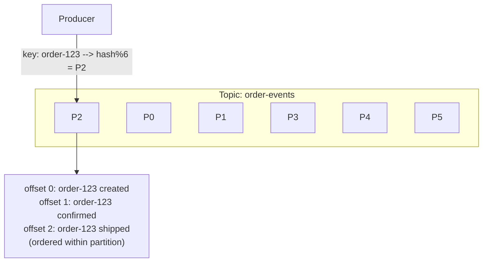
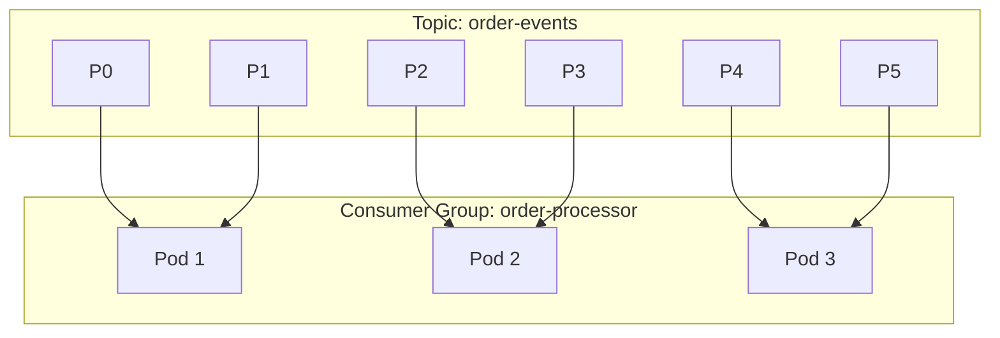
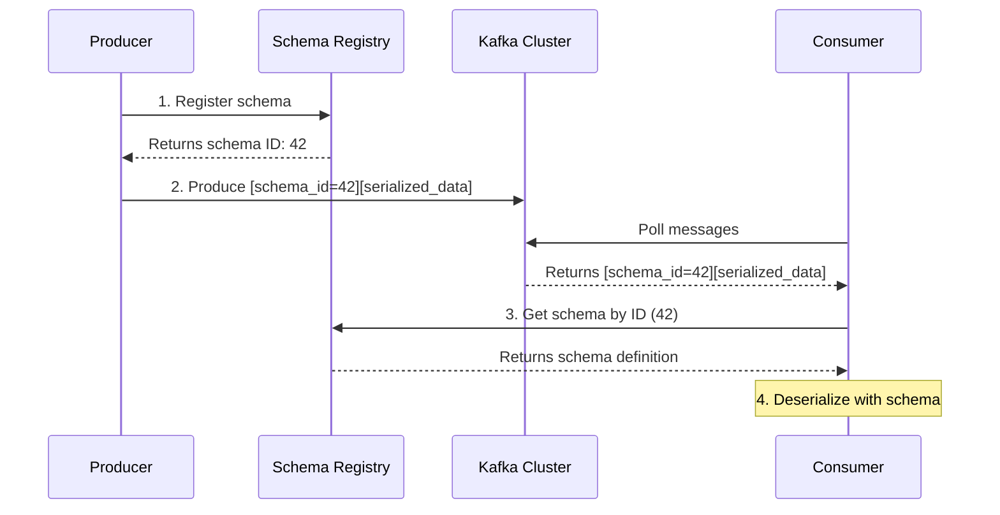

**Complexity**: [COMPLEX] | **Time to Complete**: 3h | **Prerequisites**: Module 9.2 (Message Brokers), Module 9.6 (Search & Analytics), distributed systems basics

## What You'll Be Able to Do

After completing this module, you will be able to:

- **Configure Kubernetes consumers for managed streaming platforms (Amazon MSK, Confluent Cloud, [Azure Event Hubs with Kafka protocol](https://learn.microsoft.com/en-us/azure/event-hubs/azure-event-hubs-apache-kafka-overview))**
- **Implement exactly-once processing patterns with Kafka transactions and Kubernetes StatefulSet consumer groups**
- **Deploy stream processing applications (Kafka Streams, Flink) on Kubernetes with managed streaming backends**
- **Design data pipeline architectures that combine managed streaming with Kubernetes batch and real-time processing workloads**

---

## Why This Module Matters

A team running a self-managed Kafka cluster on Kubernetes can spend significant engineering time on broker maintenance, storage operations, and version upgrades.

A broker or storage failure in a self-managed Kafka cluster can degrade producers and delay downstream processing if replication health drops and recovery is slow.

Managed Kafka services can materially reduce day-to-day operational work compared with self-managing brokers, but migration timelines and cost outcomes depend on workload, retention, region, and service choice. ZooKeeper is gone ([MSK uses KRaft since 2024](https://aws.amazon.com/about-aws/whats-new/2024/05/amazon-msk-kraft-mode-apache-kafka-clusters/)). The operational difference is transformative.

This module teaches you when to use managed Kafka versus running Strimzi in-cluster, how partitioning and consumer groups work at scale, how exactly-once semantics prevent duplicate processing, how to monitor consumer lag and prevent data loss, how schema registries maintain data contracts, and how to build stream processing pipelines on Kubernetes.

---

## Managed Kafka vs In-Cluster Strimzi

### Decision Framework

| Factor | Managed (MSK/Confluent) | In-Cluster (Strimzi on K8s) |
|--------|------------------------|-----------------------------|
| Operational burden | Provider handles brokers, patching, storage | You handle everything |
| Cost at small scale | Often higher, depending on the managed offering and pricing model | Lower if you can efficiently share cluster resources |
| Cost at large scale | Often cheaper (no ops engineer time) | Higher (hidden ops costs) |
| Network latency | Typically low, but depends on network path and deployment topology | Often lowest when producers and consumers stay in-cluster |
| Customization | Limited (provider-defined configs) | Full control |
| Multi-cluster | Each cluster is independent | Strimzi MirrorMaker2 for replication |
| Kafka version | Provider-supported versions on the provider's release cadence | You choose and operate the version yourself |
| ZooKeeper | Gone (KRaft mode on MSK since 2024) | Strimzi manages for you |

### When to Choose Each

**Choose managed Kafka when:**
- Your team does not have Kafka expertise
- You process more than 100 MB/s sustained
- You need guaranteed durability (financial, healthcare)
- You want to focus on producers/consumers, not broker operations

**Choose Strimzi when:**
- Sub-millisecond latency matters (in-cluster communication)
- You are on a tight budget with low volume
- You need full control over Kafka configuration
- You are running in environments without managed services (on-prem, edge)

### Strimzi Quick Setup (for comparison)

```yaml
# Strimzi Kafka cluster in Kubernetes
apiVersion: kafka.strimzi.io/v1beta2
kind: Kafka
metadata:
  name: event-cluster
  namespace: kafka
spec:
  kafka:
    version: 3.8.0
    replicas: 3
    listeners:
      - name: plain
        port: 9092
        type: internal
        tls: false
      - name: tls
        port: 9093
        type: internal
        tls: true
    config:
      offsets.topic.replication.factor: 3
      transaction.state.log.replication.factor: 3
      transaction.state.log.min.isr: 2
      default.replication.factor: 3
      min.insync.replicas: 2
      num.partitions: 12
    storage:
      type: jbod
      volumes:
        - id: 0
          type: persistent-claim
          size: 500Gi
          class: gp3-encrypted
    resources:
      requests:
        memory: 4Gi
        cpu: "2"
  zookeeper:
    replicas: 3
    storage:
      type: persistent-claim
      size: 50Gi
      class: gp3-encrypted
  entityOperator:
    topicOperator: {}
    userOperator: {}
```

---

## Partitioning: The Foundation of Kafka Scalability

A Kafka topic is divided into partitions. Partitions are the unit of parallelism -- more partitions means more consumers can process data concurrently.

### How Partitions Work



### Partition Count Guidelines

| Throughput | Partitions | Reasoning |
|-----------|-----------|-----------|
| < 10 MB/s | 6 | Enough for small workloads, easy to manage |
| 10-100 MB/s | 12-24 | Allows 12-24 parallel consumers |
| 100 MB/s - 1 GB/s | 50-100 | Match consumer count to partition count |
| > 1 GB/s | 100+ | Carefully test; more partitions = more overhead |

**Rule of thumb**: partitions should equal or exceed the maximum number of consumers in your largest consumer group.

### Partition Key Design

The partition key determines which partition a message lands in. All messages with the same key go to the same partition (in order).

```python
from confluent_kafka import Producer

producer = Producer({
    'bootstrap.servers': 'msk-broker1:9092,msk-broker2:9092',
    'acks': 'all',
    'enable.idempotence': True,
    'max.in.flight.requests.per.connection': 5,
})

# Key by order_id -- all events for one order are in the same partition
def publish_order_event(order_id, event_type, payload):
    producer.produce(
        topic='order-events',
        key=str(order_id).encode('utf-8'),
        value=json.dumps({
            'order_id': order_id,
            'event_type': event_type,
            'payload': payload,
            'timestamp': datetime.utcnow().isoformat()
        }).encode('utf-8'),
        callback=delivery_report,
    )
    producer.flush()

def delivery_report(err, msg):
    if err:
        print(f"Delivery failed: {err}")
    else:
        print(f"Delivered to {msg.topic()} [{msg.partition()}] @ offset {msg.offset()}")
```

**Common key strategies:**
- **Customer ID**: All events for one customer in order
- **Order ID**: All order lifecycle events in order
- **Null key**: Round-robin across partitions (maximum throughput, no ordering)
- **Tenant ID**: Multi-tenant isolation per partition

> **Pause and predict**: If you have a topic with 12 partitions and a consumer deployment with 15 replicas, what exactly happens to the last 3 pods? How will Kubernetes metrics report their status compared to their actual utility?

---

## Consumer Groups and Lag Monitoring

### Consumer Group Mechanics



Each pod gets an equal share of partitions. Adding a 4th pod triggers rebalancing. [A 7th pod would be idle (6 partitions, 7 consumers)](https://kafka.apache.org/10/getting-started/introduction/).

### Kubernetes Consumer Deployment

```yaml
apiVersion: apps/v1
kind: Deployment
metadata:
  name: order-processor
  namespace: streaming
spec:
  replicas: 6    # Match partition count
  selector:
    matchLabels:
      app: order-processor
  template:
    metadata:
      labels:
        app: order-processor
    spec:
      serviceAccountName: kafka-consumer
      containers:
        - name: consumer
          image: mycompany/order-processor:2.3.0
          env:
            - name: KAFKA_BROKERS
              value: "b-1.msk-cluster.abc123.kafka.us-east-1.amazonaws.com:9092,b-2.msk-cluster.abc123.kafka.us-east-1.amazonaws.com:9092"
            - name: KAFKA_TOPIC
              value: "order-events"
            - name: KAFKA_GROUP_ID
              value: "order-processor"
            - name: KAFKA_AUTO_OFFSET_RESET
              value: "earliest"
            - name: KAFKA_SECURITY_PROTOCOL
              value: "SASL_SSL"
            - name: KAFKA_SASL_MECHANISM
              value: "AWS_MSK_IAM"
          resources:
            requests:
              cpu: 500m
              memory: 512Mi
```

### Consumer Lag Monitoring

Consumer lag is the difference between the latest message in a partition and the last message processed by a consumer. High lag means consumers are falling behind.

```
Partition 3:
  Latest offset:    1,000,000
  Consumer offset:    985,000
  Lag:                 15,000 messages
```

### Monitoring with Prometheus and Kafka Exporter

```yaml
# Deploy kafka-exporter for Prometheus metrics
apiVersion: apps/v1
kind: Deployment
metadata:
  name: kafka-exporter
  namespace: monitoring
spec:
  replicas: 1
  selector:
    matchLabels:
      app: kafka-exporter
  template:
    metadata:
      labels:
        app: kafka-exporter
      annotations:
        prometheus.io/scrape: "true"
        prometheus.io/port: "9308"
    spec:
      containers:
        - name: exporter
          image: danielqsj/kafka-exporter:v1.8.0
          args:
            - --kafka.server=b-1.msk-cluster.abc123.kafka.us-east-1.amazonaws.com:9092
            - --kafka.server=b-2.msk-cluster.abc123.kafka.us-east-1.amazonaws.com:9092
            - --topic.filter=order-.*
            - --group.filter=.*
          ports:
            - containerPort: 9308
```

```yaml
# PrometheusRule for consumer lag alerts
apiVersion: monitoring.coreos.com/v1
kind: PrometheusRule
metadata:
  name: kafka-lag-alerts
  namespace: monitoring
spec:
  groups:
    - name: kafka-consumer-lag
      rules:
        - alert: KafkaConsumerLagHigh
          expr: |
            sum by (consumergroup, topic) (kafka_consumergroup_lag) > 50000
          for: 10m
          labels:
            severity: warning
          annotations:
            summary: "Consumer group {{ $labels.consumergroup }} has high lag on {{ $labels.topic }}"
        - alert: KafkaConsumerLagCritical
          expr: |
            sum by (consumergroup, topic) (kafka_consumergroup_lag) > 500000
          for: 5m
          labels:
            severity: critical
          annotations:
            summary: "Consumer group {{ $labels.consumergroup }} critically behind on {{ $labels.topic }}"
```

### KEDA Scaling on Consumer Lag

```yaml
apiVersion: keda.sh/v1alpha1
kind: ScaledObject
metadata:
  name: order-processor-scaler
  namespace: streaming
spec:
  scaleTargetRef:
    name: order-processor
  minReplicaCount: 3
  maxReplicaCount: 12    # Never exceed partition count
  pollingInterval: 10
  triggers:
    - type: kafka
      metadata:
        bootstrapServers: b-1.msk-cluster.abc123.kafka.us-east-1.amazonaws.com:9092
        consumerGroup: order-processor
        topic: order-events
        lagThreshold: "1000"
        offsetResetPolicy: earliest
```

---

## Exactly-Once Processing and Stateful Consumers

For financial transactions or inventory updates, processing a message more than once (at-least-once semantics) or dropping it (at-most-once) is unacceptable. [Kafka achieves exactly-once semantics (EOS) through the combination of idempotent producers and transactional APIs.](https://kafka.apache.org/41/design/design/)

### The Transactional Pipeline

When a stream processing application consumes from Topic A, processes the event, and writes to Topic B, the consumer offset commitment and the producer write must happen atomically.

```python
from confluent_kafka import Producer, Consumer

# 1. Producer requires a transactional.id
producer = Producer({
    'bootstrap.servers': 'msk-cluster:9092',
    'transactional.id': 'order-processor-txn-1',
    'enable.idempotence': True
})
producer.init_transactions()

# 2. Consume an event
msg = consumer.poll(timeout=1.0)
if msg:
    producer.begin_transaction()
    try:
        # 3. Process and produce derived event
        producer.produce('enriched-orders', key=msg.key(), value=enrich(msg.value()))
        
        # 4. Send the consumer offsets as part of the transaction
        producer.send_offsets_to_transaction(
            consumer.position(consumer.assignment()), 
            consumer.consumer_group_metadata()
        )
        # 5. Commit atomically
        producer.commit_transaction()
    except Exception:
        producer.abort_transaction()
```

### Why StatefulSets for Kafka Streams?

> **Stop and think**: What happens to a stream processing application's local state (like a RocksDB cache) if it is deployed as a standard Kubernetes Deployment instead of a StatefulSet during a pod restart? How would this affect recovery time?

When a stream processor keeps local state on ephemeral pod storage, a restarted pod loses that local state and must restore it from the changelog before normal processing resumes.

Instead, stream processors with local state should be deployed as a `StatefulSet` with persistent volume claims:

```yaml
apiVersion: apps/v1
kind: StatefulSet
metadata:
  name: payment-aggregator
  namespace: streaming
spec:
  serviceName: "payment-aggregator"
  replicas: 6
  selector:
    matchLabels:
      app: payment-aggregator
  template:
    metadata:
      labels:
        app: payment-aggregator
    spec:
      containers:
        - name: processor
          image: mycompany/payment-aggregator:1.2.0
          volumeMounts:
            - name: state-store
              mountPath: /var/lib/kafka-streams
  volumeClaimTemplates:
    - metadata:
        name: state-store
      spec:
        accessModes: [ "ReadWriteOnce" ]
        resources:
          requests:
            storage: 50Gi
```

By using a `StatefulSet`, `payment-aggregator-0` maintains its stable network identity and keeps its `state-store` volume across restarts. When the pod comes back up, its RocksDB cache is already populated, requiring only a minimal delta update before processing resumes.

---

## Schema Registry: Data Contracts for Events

Without schema management, producers can change the event structure without warning, breaking consumers.

### The Problem

```
Week 1: {"order_id": "123", "amount": 49.99, "currency": "USD"}
Week 2: {"orderId": "123", "total": 49.99}  <-- broke every consumer
```

### Schema Registry Architecture



### Confluent Schema Registry on Kubernetes

```yaml
apiVersion: apps/v1
kind: Deployment
metadata:
  name: schema-registry
  namespace: streaming
spec:
  replicas: 2
  selector:
    matchLabels:
      app: schema-registry
  template:
    metadata:
      labels:
        app: schema-registry
    spec:
      containers:
        - name: schema-registry
          image: confluentinc/cp-schema-registry:7.7.0
          ports:
            - containerPort: 8081
          env:
            - name: SCHEMA_REGISTRY_HOST_NAME
              valueFrom:
                fieldRef:
                  fieldPath: status.podIP
            - name: SCHEMA_REGISTRY_KAFKASTORE_BOOTSTRAP_SERVERS
              value: "b-1.msk-cluster.abc123.kafka.us-east-1.amazonaws.com:9092"
            - name: SCHEMA_REGISTRY_KAFKASTORE_SECURITY_PROTOCOL
              value: "SASL_SSL"
          resources:
            requests:
              cpu: 250m
              memory: 512Mi
---
apiVersion: v1
kind: Service
metadata:
  name: schema-registry
  namespace: streaming
spec:
  selector:
    app: schema-registry
  ports:
    - port: 8081
```

### Registering and Using Schemas

```bash
# Register an Avro schema for order events
curl -XPOST "http://schema-registry:8081/subjects/order-events-value/versions" \
  -H "Content-Type: application/vnd.schemaregistry.v1+json" \
  -d '{
  "schema": "{\"type\":\"record\",\"name\":\"OrderEvent\",\"namespace\":\"com.example\",\"fields\":[{\"name\":\"order_id\",\"type\":\"string\"},{\"name\":\"event_type\",\"type\":{\"type\":\"enum\",\"name\":\"EventType\",\"symbols\":[\"CREATED\",\"CONFIRMED\",\"SHIPPED\",\"DELIVERED\",\"CANCELLED\"]}},{\"name\":\"amount\",\"type\":\"double\"},{\"name\":\"currency\",\"type\":\"string\"},{\"name\":\"timestamp\",\"type\":\"long\",\"logicalType\":\"timestamp-millis\"}]}"
}'

# Set compatibility mode (BACKWARD = new schema can read old data)
curl -XPUT "http://schema-registry:8081/config/order-events-value" \
  -H "Content-Type: application/vnd.schemaregistry.v1+json" \
  -d '{"compatibility": "BACKWARD"}'
```

### Schema Compatibility Modes

| Mode | Rule | Example |
|------|------|---------|
| **BACKWARD** | New schema can read old data | Adding optional field with default |
| **FORWARD** | Old schema can read new data | Removing optional field |
| **FULL** | Both backward and forward | Only adding/removing optional fields with defaults |
| **NONE** | No compatibility checking | Any change allowed (dangerous) |

For many event pipelines, **BACKWARD** compatibility is a common default because it lets newer consumers read messages produced by older producers.

> **Stop and think**: Your team decides to deploy a new schema that changes an integer field `quantity` to a string field `quantity_str` to support formats like "1 dozen". If you are using BACKWARD compatibility, what will the schema registry do when the producer tries to register this schema?

---

## Stream Processing on Kubernetes

### Architecture Options

| Tool | Deployment Model | Best For | Complexity |
|------|-----------------|----------|------------|
| Kafka Streams | Library (runs in your pods) | Simple transformations, joins | Low |
| Apache Flink | Operator (FlinkDeployment) | Complex event processing, windows | High |
| ksqlDB | Deployment | SQL-like stream processing | Medium |
| [Google Dataflow](https://docs.cloud.google.com/dataflow/docs/overview) | Managed (GCP only) | Batch + stream unified | Medium |

### Kafka Streams Application on Kubernetes

```yaml
apiVersion: apps/v1
kind: Deployment
metadata:
  name: order-enricher
  namespace: streaming
spec:
  replicas: 6
  selector:
    matchLabels:
      app: order-enricher
  template:
    metadata:
      labels:
        app: order-enricher
    spec:
      containers:
        - name: enricher
          image: mycompany/order-enricher:1.0.0
          env:
            - name: KAFKA_BROKERS
              value: "b-1.msk-cluster.abc123.kafka.us-east-1.amazonaws.com:9092"
            - name: APPLICATION_ID
              value: "order-enricher"
            - name: INPUT_TOPIC
              value: "raw-orders"
            - name: OUTPUT_TOPIC
              value: "enriched-orders"
            - name: SCHEMA_REGISTRY_URL
              value: "http://schema-registry:8081"
            - name: STATE_DIR
              value: "/tmp/kafka-streams"
          resources:
            requests:
              cpu: "1"
              memory: 2Gi
          volumeMounts:
            - name: state-store
              mountPath: /tmp/kafka-streams
      volumes:
        - name: state-store
          emptyDir:
            sizeLimit: 10Gi
```

### Flink on Kubernetes (Flink Operator)

```yaml
apiVersion: flink.apache.org/v1beta1
kind: FlinkDeployment
metadata:
  name: order-analytics
  namespace: streaming
spec:
  image: mycompany/flink-order-analytics:1.0.0
  flinkVersion: v1_19
  flinkConfiguration:
    taskmanager.numberOfTaskSlots: "2"
    state.backend: rocksdb
    state.checkpoints.dir: s3://flink-checkpoints/order-analytics
    execution.checkpointing.interval: "60000"
  serviceAccount: flink-sa
  jobManager:
    resource:
      memory: "2048m"
      cpu: 1
  taskManager:
    resource:
      memory: "4096m"
      cpu: 2
    replicas: 3
  job:
    jarURI: local:///opt/flink/usrlib/order-analytics.jar
    parallelism: 6
    upgradeMode: savepoint
```

---

## Setting Up Amazon MSK

```bash
# Create MSK Serverless cluster (simplest option)
aws kafka create-cluster-v2 \
  --cluster-name orders-streaming \
  --serverless '{
    "vpcConfigs": [{
      "subnetIds": ["subnet-aaa", "subnet-bbb", "subnet-ccc"],
      "securityGroupIds": ["sg-kafka"]
    }],
    "clientAuthentication": {
      "sasl": {"iam": {"enabled": true}}
    }
  }'

# Or create a provisioned cluster for predictable costs
aws kafka create-cluster \
  --cluster-name orders-streaming \
  --kafka-version 3.7.0 \
  --number-of-broker-nodes 3 \
  --broker-node-group-info '{
    "InstanceType": "kafka.m7g.large",
    "ClientSubnets": ["subnet-aaa", "subnet-bbb", "subnet-ccc"],
    "SecurityGroups": ["sg-kafka"],
    "StorageInfo": {
      "EbsStorageInfo": {"VolumeSize": 500}
    }
  }' \
  --encryption-info '{
    "EncryptionInTransit": {"ClientBroker": "TLS", "InCluster": true},
    "EncryptionAtRest": {"DataVolumeKMSKeyId": "alias/msk-key"}
  }'
```

---

## Did You Know?

1. **Apache Kafka originated at LinkedIn and has been used there at very large scale**. Exact throughput, footprint, and adoption figures should be cited to current primary sources.

2. **Amazon MSK Serverless eliminates cluster capacity planning entirely**. You create a topic, produce and consume data, and [AWS automatically provisions and scales the underlying infrastructure](https://docs.aws.amazon.com/msk/latest/developerguide/serverless.html). [Pricing is per-partition-hour and per-GB of data](https://aws.amazon.com/msk/pricing/), which can be cost-effective for variable workloads compared with provisioned clusters, depending on usage patterns, retention, and region.

3. **KRaft replaces ZooKeeper-based metadata management with a controller quorum inside Kafka**. Kafka's 3.x releases progressively moved production deployments toward KRaft and away from ZooKeeper.

4. **Schema Registry compatibility checks help catch incompatible schema changes before producers publish data that downstream consumers cannot safely read**. The registry acts as a gatekeeper by rejecting incompatible schemas at registration time.

---

## Common Mistakes

| Mistake | Why It Happens | How to Fix It |
|---------|---------------|---------------|
| More consumers than partitions | "More pods = more throughput" | Extra consumers sit idle; scale partitions first, then consumers |
| Not using a partition key when ordering matters | Null key gives best throughput | Use customer/order ID as key for ordered event processing |
| Setting `auto.offset.reset=latest` in production | "We only want new messages" | Use an explicit offset strategy for your use case; `latest` can skip earlier data when no committed offset exists or when partitions are added |
| Not monitoring consumer lag | "If messages are flowing, everything is fine" | Deploy kafka-exporter and alert on lag > threshold |
| Skipping schema registry | "We will coordinate schema changes manually" | Manual coordination fails at scale; registry enforces compatibility |
| Under-replicating topics (replication factor = 1) | Testing configuration leaked to production | [For most production topics, use replication factor >= 3 and `min.insync.replicas >= 2` where the cluster size supports it](https://kafka.apache.org/41/configuration/topic-configs/) |
| Running Kafka Streams without persistent state store volumes | Using `emptyDir` for state | State is lost on pod restart, causing full reprocessing; use PVCs for state stores |
| Not setting producer `acks=all` for critical data | [Default was `acks=1` before Kafka 3.0](https://kafka.apache.org/42/streams/developer-guide/config-streams/) | Always set `acks=all` and `enable.idempotence=true` for data safety |

---

## Quiz

<details>
<summary>1. Your team deploys an e-commerce order processing service scaling via HPA. During a flash sale, the HPA scales the consumer Deployment to 20 pods to handle a massive spike in CPU usage. However, the Kafka topic `orders-raw` only has 12 partitions. Despite having 20 pods running, processing throughput hits a hard ceiling. What is happening to pods 13-20, and how should you re-architect to handle this scale?</summary>

In a Kafka consumer group, each partition is exclusively assigned to a single consumer to guarantee ordering. Because there are only 12 partitions, pods 13 through 20 are completely starved of data; they sit entirely idle, receiving zero messages and processing nothing, while consuming cluster resources. The hard throughput ceiling is bound by the 12 active pods. To handle this scale, you must first increase the partition count of the `orders-raw` topic to at least 20 (or higher, like 50) so that the incoming data stream can be fanned out. Only then can the additional pods take ownership of the new partitions and begin contributing to the overall throughput.
</details>

<details>
<summary>2. You are designing an architecture for a healthcare startup that processes 500 MB/s of patient telemetry data across three AWS regions. The team is small, consisting of four application developers and zero dedicated database administrators. They are debating between deploying Strimzi on EKS or paying for Amazon MSK. Which solution should they choose, and what operational realities drive this decision?</summary>

The startup should unequivocally choose Amazon MSK (or Confluent Cloud). At 500 MB/s of sustained throughput, a Kafka cluster is a massive, IO-heavy distributed system requiring continuous tuning, disk monitoring, partition rebalancing, and failover management. Deploying Strimzi means the four application developers become part-time Kafka administrators. When a broker disk fails at 3 AM or ZooKeeper/KRaft desynchronizes, the developers are responsible for the repair, directly detracting from product velocity. While MSK carries a higher line-item cost on the AWS bill, it absorbs the operational burden of node replacements, patching, and control-plane management, ensuring data durability for critical healthcare telemetry without requiring the team to hire a dedicated infrastructure engineer.
</details>

<details>
<summary>3. At 3:00 AM on Black Friday, your alerting system triggers. CPU and memory metrics for your payment processing pods are well within normal limits, and pod logs show zero error messages. However, the `kafka_consumergroup_lag` metric has spiked from 50 to 85,000 for the `payment-events` topic. What is happening in your system, and why is this metric catching an issue that standard Kubernetes metrics missed?</summary>

Your payment processing pods are failing to keep pace with the incoming surge of payment events. The producers are writing messages to the topic much faster than the consumers can process and acknowledge them, resulting in a rapidly growing backlog (lag). This situation often occurs when consumers become bottlenecked by a downstream system, such as a sluggish database or external API. In these scenarios, the consumer pods are simply blocked waiting for I/O; they aren't crashing, generating errors, or maxing out CPU/memory. Standard Kubernetes metrics indicate the pods are "healthy" because they are running, but only the `kafka_consumergroup_lag` metric reveals the true business reality: the data pipeline is silently falling dangerously behind.
</details>

<details>
<summary>4. The data engineering team proposes changing the schema compatibility mode from BACKWARD to FORWARD in the Confluent Schema Registry. They argue this will force producers to update their applications before consumers can read the new data formats. In a decoupled microservices architecture where you manage the consumer but another team manages the producer, why is switching away from BACKWARD compatibility a dangerous anti-pattern?</summary>

Switching away from BACKWARD compatibility severely jeopardizes deployment safety because it destroys the guarantee that an updated consumer can read historical data. In event-driven architectures, topics act as ledgers containing older messages. If the producer team introduces a schema change and you deploy a new version of your consumer, your consumer may soon encounter older messages on the topic that were serialized with the previous schema. If the new schema is not backward compatible, your consumer will fail to deserialize those older messages, resulting in a catastrophic pipeline crash or a poison-pill loop. BACKWARD compatibility is strictly required to ensure that consumers can be safely upgraded at any time without coordinating downtime with the producers.
</details>

<details>
<summary>5. You configured a standard Kubernetes HPA targeting 80% CPU utilization for a legacy inventory syncing consumer. During a database slowdown, the inventory consumers spend all their time waiting for the database to respond (I/O bound). The Kafka topic backs up with 200,000 unprocessed messages, but the HPA does not scale up the deployment. Why did the CPU-based HPA fail to scale, and how would replacing it with KEDA solve this exact problem?</summary>

The CPU-based HPA failed because threads blocked on network I/O (waiting for a database response) do not consume CPU cycles. The pods appeared idle to the Kubernetes metrics server, hovering well below the 80% threshold, so the HPA saw no reason to scale out, despite the massive backlog of work. Replacing the standard HPA with KEDA solves this by shifting the scaling metric from internal resource utilization (CPU) to external queue depth (Kafka lag). KEDA directly queries the Kafka cluster for the consumer group lag and scales the deployment proportionally. If the lag crosses the configured threshold, KEDA will scale out the deployment based on lag to help chew through the backlog, bypassing the misleading CPU metrics.
</details>

<details>
<summary>6. An SRE configures a critical financial ledger topic with a replication factor of 3, `min.insync.replicas=1`, and instructs developers to use `acks=all` in their producers. Later that day, broker 2 crashes, followed shortly by broker 3. The producer successfully writes a deposit event to the remaining broker 1, but then broker 1's disk fails before any other broker recovers. Why did `acks=all` fail to prevent data loss in this scenario, and how would changing `min.insync.replicas` have changed the outcome?</summary>

The `acks=all` setting guarantees that the producer will wait for all *currently in-sync* replicas to acknowledge the write. However, because `min.insync.replicas` was set to 1, the cluster was perfectly willing to accept writes even when only a single broker (broker 1) was alive and in-sync. The producer received a success acknowledgment after writing solely to broker 1. When broker 1's disk failed, that un-replicated data was permanently lost. If `min.insync.replicas` had been configured to 2, the cluster would have proactively rejected the producer's write attempt once brokers 2 and 3 went down. The producer would have received an error instead of a false confirmation, allowing the application to safely retry or alert, thereby preserving data integrity at the cost of temporary unavailability.
</details>

---

## Hands-On Exercise: Kafka Pipeline with Strimzi

### Setup

```bash
# Create kind cluster with extra resources
cat > /tmp/kind-kafka.yaml << 'EOF'
kind: Cluster
apiVersion: kind.x-k8s.io/v1alpha4
nodes:
  - role: control-plane
  - role: worker
  - role: worker
  - role: worker
EOF

kind create cluster --name kafka-lab --config /tmp/kind-kafka.yaml

# Install Strimzi operator
k create namespace kafka
k apply -f https://strimzi.io/install/latest?namespace=kafka

k wait --for=condition=ready pod -l name=strimzi-cluster-operator \
  --namespace kafka --timeout=180s
```

### Task 1: Create a Kafka Cluster

Deploy a 3-broker Kafka cluster using Strimzi.

<details>
<summary>Solution</summary>

```yaml
apiVersion: kafka.strimzi.io/v1beta2
kind: Kafka
metadata:
  name: lab-cluster
  namespace: kafka
spec:
  kafka:
    version: 3.8.0
    replicas: 3
    listeners:
      - name: plain
        port: 9092
        type: internal
        tls: false
    config:
      offsets.topic.replication.factor: 3
      transaction.state.log.replication.factor: 3
      transaction.state.log.min.isr: 2
      default.replication.factor: 3
      min.insync.replicas: 2
      num.partitions: 6
    storage:
      type: ephemeral
    resources:
      requests:
        memory: 1Gi
        cpu: 500m
  zookeeper:
    replicas: 3
    storage:
      type: ephemeral
    resources:
      requests:
        memory: 512Mi
        cpu: 250m
  entityOperator:
    topicOperator: {}
```

```bash
k apply -f /tmp/kafka-cluster.yaml
# This takes 3-5 minutes
k wait kafka/lab-cluster --for=condition=Ready --timeout=300s -n kafka
```
</details>

### Task 2: Create a Topic and Produce Messages

Create an `order-events` topic and publish messages.

<details>
<summary>Solution</summary>

```yaml
apiVersion: kafka.strimzi.io/v1beta2
kind: KafkaTopic
metadata:
  name: order-events
  namespace: kafka
  labels:
    strimzi.io/cluster: lab-cluster
spec:
  partitions: 6
  replicas: 3
  config:
    retention.ms: 86400000
    min.insync.replicas: 2
```

```bash
k apply -f /tmp/topic.yaml

# Produce messages
k run kafka-producer --rm -it --image=quay.io/strimzi/kafka:0.44.0-kafka-3.8.0 \
  -n kafka --restart=Never -- \
  bin/kafka-console-producer.sh \
  --broker-list lab-cluster-kafka-bootstrap:9092 \
  --topic order-events \
  --property "parse.key=true" \
  --property "key.separator=:" << 'EOF'
order-001:{"order_id":"001","event":"created","amount":29.99}
order-002:{"order_id":"002","event":"created","amount":49.99}
order-001:{"order_id":"001","event":"confirmed","amount":29.99}
order-003:{"order_id":"003","event":"created","amount":99.99}
order-002:{"order_id":"002","event":"confirmed","amount":49.99}
order-001:{"order_id":"001","event":"shipped","amount":29.99}
order-003:{"order_id":"003","event":"confirmed","amount":99.99}
order-002:{"order_id":"002","event":"shipped","amount":49.99}
order-003:{"order_id":"003","event":"shipped","amount":99.99}
order-001:{"order_id":"001","event":"delivered","amount":29.99}
EOF
```
</details>

### Task 3: Deploy Consumer Group and Observe Partition Assignment

Create a consumer Deployment with 3 replicas and verify partition distribution.

<details>
<summary>Solution</summary>

```yaml
apiVersion: apps/v1
kind: Deployment
metadata:
  name: order-consumer
  namespace: kafka
spec:
  replicas: 3
  selector:
    matchLabels:
      app: order-consumer
  template:
    metadata:
      labels:
        app: order-consumer
    spec:
      containers:
        - name: consumer
          image: quay.io/strimzi/kafka:0.44.0-kafka-3.8.0
          command:
            - /bin/sh
            - -c
            - |
              bin/kafka-console-consumer.sh \
                --bootstrap-server lab-cluster-kafka-bootstrap:9092 \
                --topic order-events \
                --group order-processor \
                --from-beginning \
                --property print.key=true \
                --property print.partition=true
          resources:
            requests:
              cpu: 100m
              memory: 256Mi
```

```bash
k apply -f /tmp/consumer-deployment.yaml
sleep 15

# Check consumer group partition assignments
k run check-group --rm -it --image=quay.io/strimzi/kafka:0.44.0-kafka-3.8.0 \
  -n kafka --restart=Never -- \
  bin/kafka-consumer-groups.sh \
  --bootstrap-server lab-cluster-kafka-bootstrap:9092 \
  --describe --group order-processor
```
</details>

### Task 4: Monitor Consumer Lag

Produce more messages and observe lag building up.

<details>
<summary>Solution</summary>

```bash
# Produce 1000 messages rapidly
k run bulk-producer --rm -it --image=quay.io/strimzi/kafka:0.44.0-kafka-3.8.0 \
  -n kafka --restart=Never -- \
  /bin/sh -c '
  for i in $(seq 1 1000); do
    echo "order-$((i % 100)):$(printf "{\"order_id\":\"%03d\",\"event\":\"created\",\"amount\":%d.%02d}" $i $((RANDOM % 100)) $((RANDOM % 100)))"
  done | bin/kafka-console-producer.sh \
    --broker-list lab-cluster-kafka-bootstrap:9092 \
    --topic order-events \
    --property "parse.key=true" \
    --property "key.separator=:"
  echo "Produced 1000 messages"
  '

# Check lag
k run check-lag --rm -it --image=quay.io/strimzi/kafka:0.44.0-kafka-3.8.0 \
  -n kafka --restart=Never -- \
  bin/kafka-consumer-groups.sh \
  --bootstrap-server lab-cluster-kafka-bootstrap:9092 \
  --describe --group order-processor
```
</details>

### Task 5: Verify Ordering Within Partitions

Confirm that messages with the same key always appear in order.

<details>
<summary>Solution</summary>

```bash
# Consume from a specific partition to verify ordering
k run partition-check --rm -it --image=quay.io/strimzi/kafka:0.44.0-kafka-3.8.0 \
  -n kafka --restart=Never -- \
  bin/kafka-console-consumer.sh \
  --bootstrap-server lab-cluster-kafka-bootstrap:9092 \
  --topic order-events \
  --partition 0 \
  --from-beginning \
  --max-messages 20 \
  --property print.key=true \
  --property print.offset=true

# All messages with the same key will have increasing offsets
# within the same partition, confirming order is preserved
```
</details>

### Success Criteria

- [ ] 3-broker Kafka cluster is running and Ready
- [ ] order-events topic has 6 partitions with replication factor 3
- [ ] Consumer group shows 3 consumers with 2 partitions each
- [ ] Consumer lag is visible after bulk production
- [ ] Messages with the same key appear in order within their partition

### Cleanup

```bash
kind delete cluster --name kafka-lab
```

---

**Next Module**: [Module 9.8: Secrets Management Deep Dive](../module-9.8-secrets-deep/) -- Learn how External Secrets Operator, Secrets Store CSI, and HashiCorp Vault integrate with Kubernetes to manage dynamic secrets, TTLs, and credential rotation at scale.

## Sources

- [aws.amazon.com: amazon msk kraft mode apache kafka clusters](https://aws.amazon.com/about-aws/whats-new/2024/05/amazon-msk-kraft-mode-apache-kafka-clusters/) — AWS's launch announcement directly states that Amazon MSK began supporting KRaft mode for new clusters on May 29, 2024.
- [learn.microsoft.com: azure event hubs apache kafka overview](https://learn.microsoft.com/en-us/azure/event-hubs/azure-event-hubs-apache-kafka-overview) — Microsoft Learn explicitly documents Azure Event Hubs' Kafka endpoint and Kafka-protocol compatibility.
- [kafka.apache.org: introduction](https://kafka.apache.org/intro) — Apache Kafka's introduction explains that partitions are exclusively assigned within a consumer group and that there cannot be more active consumer instances than partitions.
- [kafka.apache.org: design](https://kafka.apache.org/41/design/design/) — Kafka's design documentation directly describes transactions, idempotence, and offset updates as the basis for exactly-once processing.
- [docs.cloud.google.com: overview](https://docs.cloud.google.com/dataflow/docs/overview) — Google Cloud's Dataflow overview directly describes Dataflow as a managed service for unified stream and batch processing.
- [docs.aws.amazon.com: serverless.html](https://docs.aws.amazon.com/msk/latest/developerguide/serverless.html) — The MSK Serverless developer guide explicitly says the service automatically provisions and scales capacity.
- [aws.amazon.com: pricing](https://aws.amazon.com/msk/pricing/) — AWS pricing documentation directly lists partition-hour and per-GB pricing dimensions for MSK Serverless.
- [kafka.apache.org: topic configs](https://kafka.apache.org/41/configuration/topic-configs/) — Apache Kafka topic configuration docs explicitly describe replication factor 3 plus `min.insync.replicas=2` with `acks=all` as a typical stronger-durability scenario.
- [kafka.apache.org: config streams](https://kafka.apache.org/42/streams/developer-guide/config-streams/) — Kafka's Streams configuration guide explicitly notes that `acks=all` has been the default since the 3.0 release.
