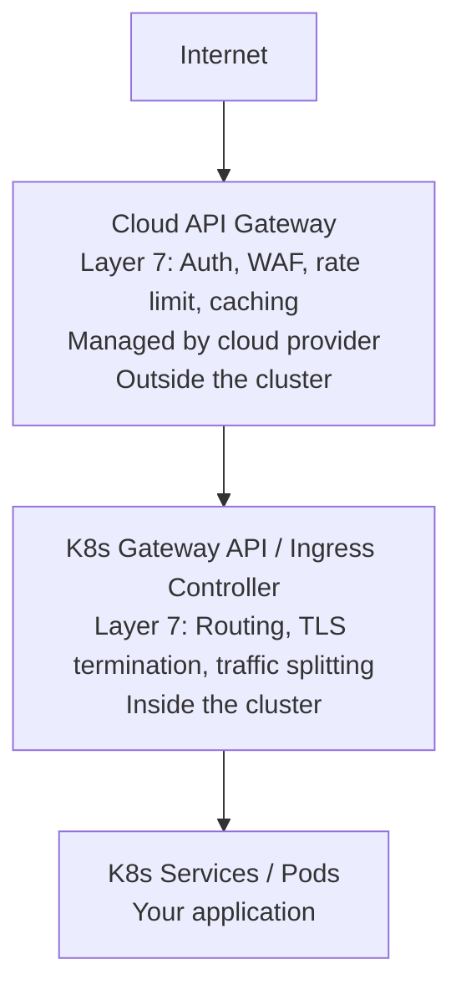
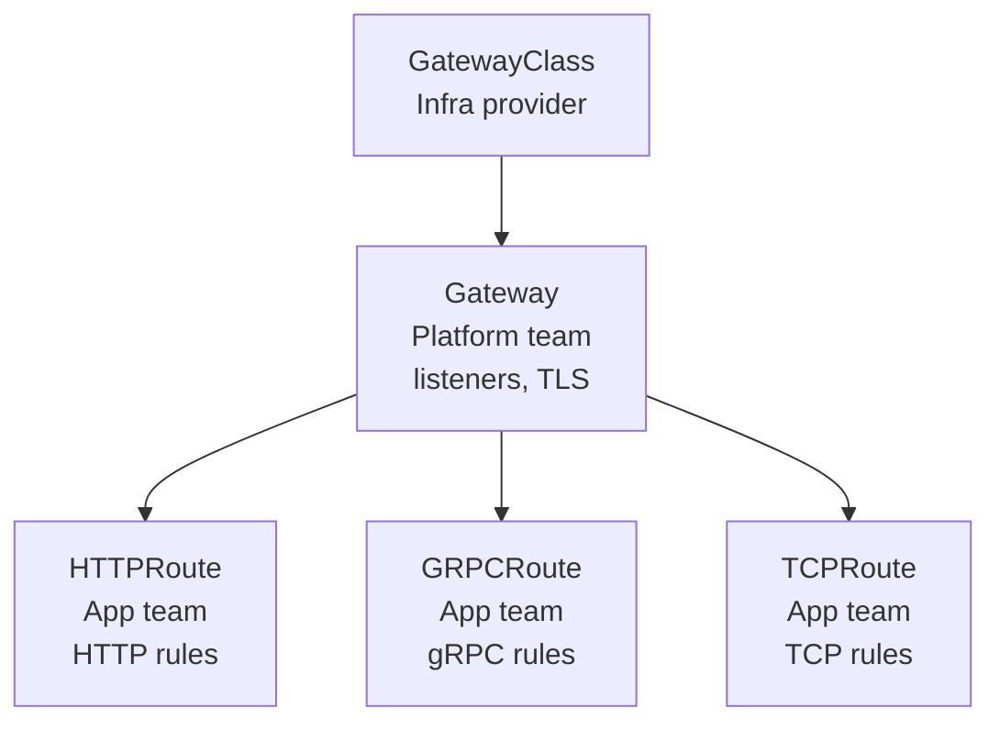
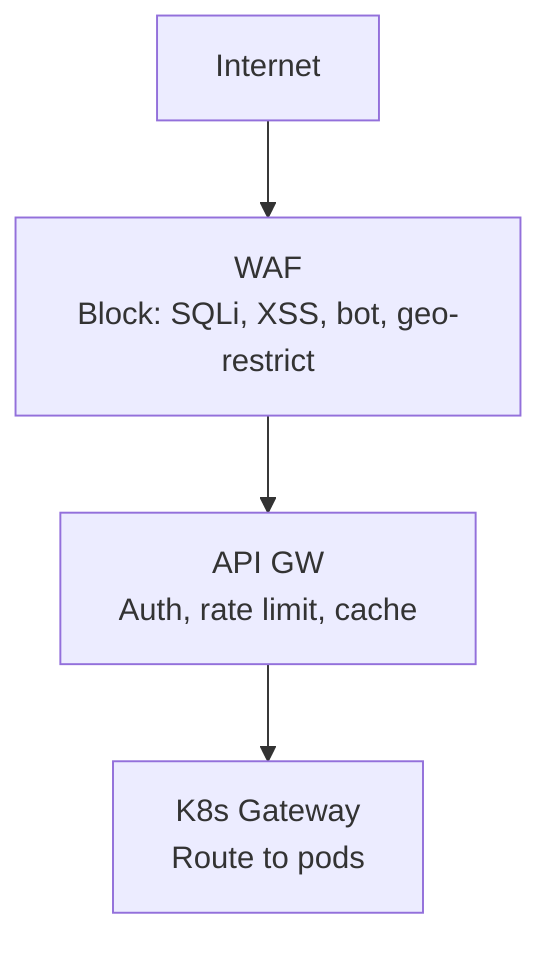
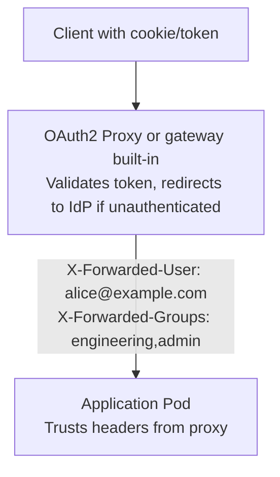
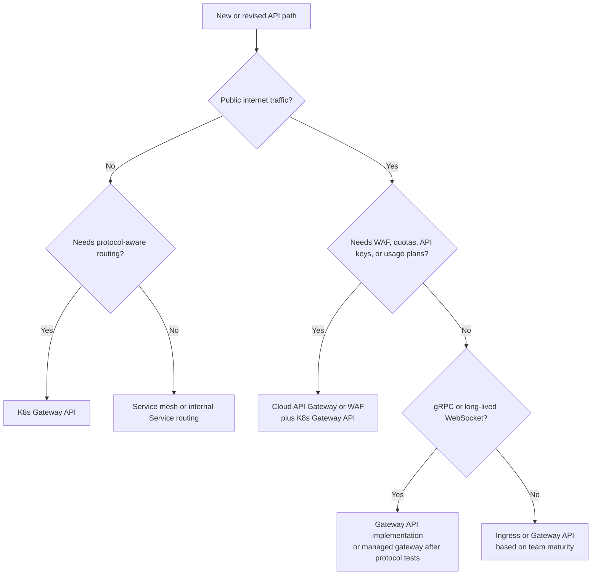

# Module 9.9: Cloud-Native API Gateways & WAF

**Complexity**: [COMPLEX] | **Time to Complete**: 2.5h | **Prerequisites**: Module 9.3 (Serverless Interoperability), Kubernetes Ingress and Services, HTTP/TLS basics

## What You'll Be Able to Do

After completing this module, you will be able to:

- **Design layered cloud API gateway and Kubernetes Gateway API architectures for public APIs that need edge controls and cluster-native routing**
- **Implement WAF, authentication, request transformation, and rate limiting controls before traffic reaches Kubernetes workloads**
- **Diagnose gateway bypass, false positives, protocol mismatch, and distributed abuse failures in Kubernetes-hosted APIs**
- **Compare managed gateways, Kubernetes Gateway API implementations, and legacy Ingress controllers for REST, gRPC, and WebSocket workloads**

## Why This Module Matters

At 02:18 on a Monday morning, a marketplace company's checkout API began returning intermittent 502 errors during what should have been a routine campaign launch. The cluster autoscaler added nodes, the database pool expanded, and the NGINX Ingress controller showed no single client violating its per-IP limit. By sunrise, the support queue had hundreds of angry merchants, the promotion budget was wasted, and the post-incident review estimated six figures of lost gross merchandise value from carts that never completed.

The uncomfortable discovery was that nothing "broke" in the simple routing layer. The attacker used residential proxies, rotated account tokens, and targeted one expensive endpoint with enough aggregate concurrency to exhaust the database before any one IP address looked suspicious. The team had confused an ingress controller with an API security boundary, so authentication, bot-aware filtering, quota management, and endpoint-level throttling all happened too late or not at all.

This module teaches the architecture that would have changed that incident. You will separate cloud edge gateways from Kubernetes-native routing, decide where a WAF should sit, apply rate limits that survive distributed abuse, and choose authentication patterns that match browser, mobile, and machine clients. The goal is not to add every gateway product to every request path; the goal is to design a request path where each layer has a clear job and no layer is pretending to solve a problem it was not built to solve.

## Cloud API Gateways vs Kubernetes Gateway API

Cloud API gateways and the Kubernetes Gateway API sound similar because both route HTTP traffic, but they live in different operational domains. A managed cloud gateway is an edge or regional service that can enforce customer-facing controls before a packet ever reaches a cluster. Kubernetes Gateway API resources, by contrast, are Kubernetes objects that describe how traffic should enter and move inside the cluster after the platform team has provided a gateway implementation.

The distinction matters because a public API has two separate contracts. The outside contract is about who may call the API, how much they may consume, which attack patterns are blocked, and how usage is measured for billing or abuse response. The inside contract is about which service receives `/api/v1/orders`, whether premium traffic routes to a dedicated backend, how a canary receives part of the traffic, and which teams are allowed to attach routes to a shared listener.



Think of the cloud API gateway as the front desk of a secure building and the Kubernetes Gateway API as the internal directory and hallway signs. The front desk checks identity, enforces visiting hours, and refuses obviously dangerous packages. The internal directory sends an approved visitor to the right floor and room. If the directory tries to become the front desk, it will lack the business records and perimeter visibility it needs; if the front desk tries to replace every hallway sign, it will become brittle and expensive.

| Feature | Cloud API Gateway | K8s Gateway API | K8s Ingress |
|---------|------------------|-----------------|-------------|
| WAF integration | Native on managed edge services | Implementation-specific or external | Not native to the Ingress API |
| Global rate limiting | Built-in (per key, per plan) | Via extension (e.g., Envoy RLS) | Basic (per-IP annotation) |
| OAuth2/OIDC | Managed JWT/OIDC features vary by provider | Via implementation-specific policies or middleware | Commonly paired with an external auth proxy or middleware |
| API versioning | Path/header-based routing | HTTPRoute path matching | Path-based only |
| Usage plans / throttling | Built-in (API keys, quotas) | Not native | Not available |
| WebSocket support | Yes (with limitations) | Full | Full |
| gRPC support | Varies by product and requires gateway-specific configuration | Full via GRPCRoute in supporting implementations | Controller-specific and often annotation- or config-dependent |
| Cost | Per-request pricing | Compute cost of controller | Compute cost of controller |
| Custom domain + TLS | Managed certificates | cert-manager integration | cert-manager integration |

The comparison table is not a scoreboard where one column always wins. Managed gateways usually win when the organization needs customer API keys, usage plans, centralized WAF attachment, request metering, developer portals, or an identity check before cluster networking is involved. Kubernetes Gateway API implementations usually win when the platform team needs expressive in-cluster routing, shared listener ownership, GRPCRoute support, weighted traffic splitting, and a Kubernetes-native workflow that application teams can manage through GitOps.

| Scenario | Recommended Approach |
|----------|---------------------|
| [Public API with usage plans, API keys, monetization](https://aws.amazon.com/documentation-overview/api-gateway/) | Cloud API Gateway |
| Internal service-to-service routing | K8s Gateway API |
| Public-facing web application | Cloud API Gateway (WAF) + K8s Gateway API (routing) |
| Multi-protocol (HTTP + gRPC + WebSocket) | K8s Gateway API |
| Simple path-based routing, small team | K8s Ingress (sufficient) |

A common mature design layers both systems. The cloud gateway owns the public hostname, certificates, WAF association, API key enforcement, JWT authorizers, request logging at the edge, and customer-level throttles. The Kubernetes Gateway API owns namespace delegation, service routing, internal canaries, protocol-specific routes, and platform policy attachment. That layering looks more complex on a diagram, but it reduces hidden coupling because edge business policy can change without forcing every application team to rewrite route manifests.

Pause and predict: if a public DNS record points directly at a Kubernetes LoadBalancer service while a separate cloud gateway also exists, which path will an attacker test first, and what log source would prove the bypass happened? The important clue is whether the suspicious request appears in WAF or cloud gateway logs. If it appears only in load balancer or pod logs, the gateway was not the only reachable entrance.

The historical Ingress API still works for many simple applications, and there is no virtue in migrating stable low-risk workloads purely because a newer API exists. Its limits appear when teams pile policy into annotations: one annotation for header matching, another for rewrite behavior, another for timeouts, another for authentication, and another for a controller-specific canary feature. Those annotations are easy to copy, hard to validate, and usually non-portable across controllers.

## Kubernetes Gateway API

The Kubernetes Gateway API is the successor to the Ingress resource. It provides [more expressive routing, protocol support, and role separation](https://kubernetes.io/docs/concepts/services-networking/gateway/). Its biggest design improvement is ownership separation: infrastructure teams define which gateway classes exist, platform teams provision concrete Gateways with listeners and TLS settings, and application teams attach routes from approved namespaces.



That role split is more than administrative neatness. In a shared cluster, the team running the ingress infrastructure should not need to edit every application route, and application teams should not be able to bind arbitrary hostnames or certificates without approval. Gateway API models this directly with `GatewayClass`, `Gateway`, `HTTPRoute`, `GRPCRoute`, and route attachment rules instead of expecting one overloaded Ingress object to express all relationships.

The following manifest shows the platform team creating a shared HTTPS gateway, while application teams create routes in a namespace labeled for gateway access. The important detail is `allowedRoutes`, because it prevents an accidental or malicious route in an unrelated namespace from attaching itself to the production listener. Kubernetes version 1.35+ keeps these APIs stable for common HTTP routing, although individual implementations still differ in how they expose advanced policies.

```yaml
# Platform team creates the Gateway
apiVersion: gateway.networking.k8s.io/v1
kind: Gateway
metadata:
  name: production-gateway
  namespace: gateway-system
spec:
  gatewayClassName: envoy
  listeners:
    - name: https
      protocol: HTTPS
      port: 443
      tls:
        mode: Terminate
        certificateRefs:
          - name: wildcard-tls
            kind: Secret
      allowedRoutes:
        namespaces:
          from: Selector
          selector:
            matchLabels:
              gateway-access: "true"
    - name: http-redirect
      protocol: HTTP
      port: 80
---
# App team creates HTTPRoutes in their namespace
apiVersion: gateway.networking.k8s.io/v1
kind: HTTPRoute
metadata:
  name: api-routes
  namespace: production
spec:
  parentRefs:
    - name: production-gateway
      namespace: gateway-system
  hostnames:
    - "api.example.com"
  rules:
    - matches:
        - path:
            type: PathPrefix
            value: /api/v1/orders
      backendRefs:
        - name: order-service
          port: 8080
          weight: 100
    - matches:
        - path:
            type: PathPrefix
            value: /api/v1/products
      backendRefs:
        - name: product-service
          port: 8080
          weight: 90
        - name: product-service-canary
          port: 8080
          weight: 10
    - matches:
        - path:
            type: PathPrefix
            value: /api/v2/products
          headers:
            - name: X-Beta-User
              value: "true"
      backendRefs:
        - name: product-service-v2
          port: 8080
```

Notice how the same `HTTPRoute` can express both a weighted canary and a header-based beta route. With legacy Ingress, those features usually depended on annotations that behaved differently in each controller. With Gateway API, the route shape is explicit, reviewable, and easier to test because the Kubernetes API server can validate the resource structure before the controller attempts to program the dataplane.

```yaml
apiVersion: gateway.networking.k8s.io/v1
kind: GRPCRoute
metadata:
  name: grpc-services
  namespace: production
spec:
  parentRefs:
    - name: production-gateway
      namespace: gateway-system
  hostnames:
    - "grpc.example.com"
  rules:
    - matches:
        - method:
            service: orders.OrderService
      backendRefs:
        - name: order-grpc-service
          port: 9090
    - matches:
        - method:
            service: products.ProductService
      backendRefs:
        - name: product-grpc-service
          port: 9090
```

GRPCRoute is a good example of why protocol-aware APIs matter. A gRPC service is not just "HTTP with a different port"; it relies on HTTP/2 semantics, method names, metadata, deadlines, and streaming behavior that can be damaged by an HTTP/1.1 default. When the route type describes gRPC directly, the gateway implementation has a clearer contract for listener protocol, upstream protocol, health checks, and observability.

Before running this in a lab, what output would you expect if an application team creates an `HTTPRoute` in a namespace that lacks the `gateway-access: "true"` label? The route object may exist, but it should not successfully attach to the listener. The practical troubleshooting move is to inspect route status conditions and look for accepted or resolved reference states rather than assuming that applying YAML means traffic is flowing.

## WAF Integration

A Web Application Firewall inspects HTTP traffic and blocks known attack patterns ([SQL injection, XSS, path traversal](https://cloud.google.com/armor/docs/waf-rules), [bot traffic](https://docs.aws.amazon.com/waf/latest/developerguide/waf-bot-control.html)). A WAF is not a substitute for application security, input validation, authorization checks, or secure database access, but it is an effective compensating control at the point where malicious traffic is still cheap to reject.



The operational trap is assuming that deploying a WAF automatically makes every backend protected. A WAF only protects traffic that traverses it, so the cluster load balancer, ingress controller, and backend services must not remain independently reachable from the public internet. Security groups, firewall rules, private load balancers, CloudFront origin restrictions, or provider-specific controls must enforce the intended path.

In AWS, one common pattern is an internet-facing Application Load Balancer managed by the AWS Load Balancer Controller with an AWS WAF web ACL associated to the ALB. This works well when Kubernetes services need HTTP routing through ALB and the team wants regional WAF enforcement. It still requires careful origin exposure checks, because the ALB itself is the protected resource and any parallel public entry path can bypass the web ACL entirely.

```bash
# Create WAF Web ACL
aws wafv2 create-web-acl \
  --name k8s-api-protection \
  --scope REGIONAL \
  --default-action '{"Allow":{}}' \
  --rules '[
    {
      "Name": "AWS-AWSManagedRulesCommonRuleSet",
      "Priority": 1,
      "Statement": {
        "ManagedRuleGroupStatement": {
          "VendorName": "AWS",
          "Name": "AWSManagedRulesCommonRuleSet"
        }
      },
      "OverrideAction": {"None": {}},
      "VisibilityConfig": {
        "SampledRequestsEnabled": true,
        "CloudWatchMetricsEnabled": true,
        "MetricName": "CommonRuleSet"
      }
    },
    {
      "Name": "AWS-AWSManagedRulesSQLiRuleSet",
      "Priority": 2,
      "Statement": {
        "ManagedRuleGroupStatement": {
          "VendorName": "AWS",
          "Name": "AWSManagedRulesSQLiRuleSet"
        }
      },
      "OverrideAction": {"None": {}},
      "VisibilityConfig": {
        "SampledRequestsEnabled": true,
        "CloudWatchMetricsEnabled": true,
        "MetricName": "SQLiRuleSet"
      }
    },
    {
      "Name": "RateLimit-Global",
      "Priority": 3,
      "Statement": {
        "RateBasedStatement": {
          "Limit": 2000,
          "AggregateKeyType": "IP"
        }
      },
      "Action": {"Block": {}},
      "VisibilityConfig": {
        "SampledRequestsEnabled": true,
        "CloudWatchMetricsEnabled": true,
        "MetricName": "RateLimit"
      }
    }
  ]' \
  --visibility-config '{
    "SampledRequestsEnabled": true,
    "CloudWatchMetricsEnabled": true,
    "MetricName": "k8s-api-waf"
  }'

# Associate WAF with ALB (used by AWS Load Balancer Controller)
aws wafv2 associate-web-acl \
  --web-acl-arn arn:aws:wafv2:us-east-1:123456789:regional/webacl/k8s-api-protection/abc123 \
  --resource-arn arn:aws:elasticloadbalancing:us-east-1:123456789:loadbalancer/app/k8s-alb/abc123
```

The rule set above combines managed common web protections, SQL injection detection, and a rate-based rule. In production, a team would usually start managed rule groups in count mode or with carefully scoped exceptions, review sampled requests, and then move to blocking after false positives are understood. That review process is not bureaucratic delay; it is how you avoid turning a WAF rollout into a customer-facing outage.

```yaml
apiVersion: networking.k8s.io/v1
kind: Ingress
metadata:
  name: api-ingress
  namespace: production
  annotations:
    kubernetes.io/ingress.class: alb
    alb.ingress.kubernetes.io/scheme: internet-facing
    alb.ingress.kubernetes.io/target-type: ip
    alb.ingress.kubernetes.io/wafv2-acl-arn: arn:aws:wafv2:us-east-1:123456789:regional/webacl/k8s-api-protection/abc123
    alb.ingress.kubernetes.io/listen-ports: '[{"HTTPS":443}]'
    alb.ingress.kubernetes.io/certificate-arn: arn:aws:acm:us-east-1:123456789:certificate/abc123
    alb.ingress.kubernetes.io/ssl-redirect: "443"
spec:
  rules:
    - host: api.example.com
      http:
        paths:
          - path: /
            pathType: Prefix
            backend:
              service:
                name: api-service
                port:
                  number: 8080
```

GCP's common pattern is to attach Cloud Armor to the backend service used by GKE Ingress through `BackendConfig`. The shape is different from AWS, but the architecture question is the same: which resource receives public traffic, where is the WAF policy attached, and can a client bypass that resource? If those answers are unclear, do not treat the WAF as deployed just because a policy object exists.

```bash
# Create Cloud Armor security policy
gcloud compute security-policies create api-protection \
  --description "WAF for K8s API"

# Add OWASP rules
gcloud compute security-policies rules create 1000 \
  --security-policy api-protection \
  --expression "evaluatePreconfiguredExpr('sqli-v33-stable')" \
  --action deny-403

gcloud compute security-policies rules create 1001 \
  --security-policy api-protection \
  --expression "evaluatePreconfiguredExpr('xss-v33-stable')" \
  --action deny-403

# Rate limiting
gcloud compute security-policies rules create 1002 \
  --security-policy api-protection \
  --expression "true" \
  --action throttle \
  --rate-limit-threshold-count 100 \
  --rate-limit-threshold-interval-sec 60 \
  --conform-action allow \
  --exceed-action deny-429 \
  --enforce-on-key IP
```

```yaml
# GKE BackendConfig for Cloud Armor
apiVersion: cloud.google.com/v1
kind: BackendConfig
metadata:
  name: api-backend-config
  namespace: production
spec:
  securityPolicy:
    name: api-protection
---
apiVersion: v1
kind: Service
metadata:
  name: api-service
  namespace: production
  annotations:
    cloud.google.com/backend-config: '{"default": "api-backend-config"}'
spec:
  selector:
    app: api-server
  ports:
    - port: 8080
```

Pause and predict: you deployed a WAF in front of your Kubernetes API, and it blocks a known SQL injection payload, but the same payload succeeds the next day when sent directly to the Ingress controller's public IP address. The likely failure is not a missing signature; it is an architecture bypass where the protected edge and the cluster ingress are both reachable. The fix is to restrict the ingress resource so it only accepts traffic from the intended edge, or to make the backend load balancer private and reachable only through the gateway path.

## Rate Limiting That Actually Works

Per-IP rate limiting is attractive because it is easy to explain, but it is also the first rate limit attackers learn to evade. A single-source flood is noisy, obvious, and cheap to block, while modern scraping, credential stuffing, checkout abuse, and inventory attacks distribute requests across proxies, devices, accounts, and tokens. If your only policy asks "how many requests came from this IP," it ignores the business identity and endpoint cost that usually matter most.

| Strategy | Blocks | Does Not Block |
|----------|--------|---------------|
| Per-IP | Single-source floods | Distributed attacks (botnet) |
| Per-API-key | Abusive API consumers | Unauthenticated attacks |
| Per-user (JWT claim) | Abusive authenticated users | Bot traffic |
| Global (total RPS) | DDoS beyond capacity | Targeted abuse within limits |
| Per-path | Abuse of expensive endpoints | Wide-spectrum attacks |

Effective rate limiting is layered because each key answers a different operational question. Per-IP protects against simple floods and broken clients. Per-API-key maps usage to a customer contract. Per-user limits control authenticated abuse even when network addresses rotate. Global limits protect shared dependencies from aggregate collapse, and per-path limits recognize that `GET /catalog` and `POST /checkout` do not have the same backend cost.

The following Envoy rate limit service example demonstrates how a Kubernetes-native gateway can call an external rate limit service. The exact integration point varies by gateway implementation, but the design principle is stable: put counters in a shared service backed by Redis or another store, key the counters by meaningful descriptors, and make the gateway reject requests before expensive application code starts running.

```yaml
apiVersion: apps/v1
kind: Deployment
metadata:
  name: ratelimit
  namespace: gateway-system
spec:
  replicas: 2
  selector:
    matchLabels:
      app: ratelimit
  template:
    metadata:
      labels:
        app: ratelimit
    spec:
      containers:
        - name: ratelimit
          image: envoyproxy/ratelimit:master
          ports:
            - containerPort: 8080
            - containerPort: 8081
            - containerPort: 6070
          env:
            - name: RUNTIME_ROOT
              value: /data
            - name: RUNTIME_SUBDIRECTORY
              value: ratelimit
            - name: REDIS_SOCKET_TYPE
              value: tcp
            - name: REDIS_URL
              value: redis-master.cache.svc:6379
            - name: USE_STATSD
              value: "false"
          volumeMounts:
            - name: config
              mountPath: /data/ratelimit/config
      volumes:
        - name: config
          configMap:
            name: ratelimit-config
---
apiVersion: v1
kind: ConfigMap
metadata:
  name: ratelimit-config
  namespace: gateway-system
data:
  config.yaml: |
    domain: production
    descriptors:
      # Global rate limit: 10,000 RPS total
      - key: generic_key
        value: global
        rate_limit:
          unit: second
          requests_per_unit: 10000
      # Per-API-key limit: 100 RPS
      - key: header_match
        value: api-key
        rate_limit:
          unit: second
          requests_per_unit: 100
      # Expensive endpoint: 10 RPS per user
      - key: header_match
        value: expensive-endpoint
        descriptors:
          - key: user_id
            rate_limit:
              unit: second
              requests_per_unit: 10
---
apiVersion: v1
kind: Service
metadata:
  name: ratelimit
  namespace: gateway-system
spec:
  selector:
    app: ratelimit
  ports:
    - name: grpc
      port: 8081
```

The tricky part is not writing a counter configuration; it is choosing descriptors that match the threat model. A checkout endpoint might need a global cap, a per-user cap, and a per-payment-method velocity control. A public search endpoint might need per-IP and per-session throttles, but a customer integration endpoint probably needs per-API-key quotas and burst allowances that match the customer's paid plan.

Stop and think: your e-commerce API sees a spike of 50,000 requests per second to `/api/v1/checkout`, the traffic comes from thousands of residential IP addresses, and each request has a valid user JWT. A per-IP rule is almost irrelevant here because the aggregate attack is intentionally spread out. You need a per-path or global ceiling to protect the checkout dependency, and you also need identity-aware limits that reduce how much each account can consume regardless of IP rotation.

There is a hard tradeoff between protection and availability. A global limit that is too low can reject legitimate surge traffic during a product launch, while a limit that is too high may allow the database to collapse before the gateway intervenes. Senior teams tune these limits from capacity tests, SLO budgets, and business priorities, then monitor both allowed and rejected traffic so they can tell the difference between a healthy surge and a harmful one.

## OAuth2/OIDC Proxying and Gateway Authentication

Authentication at the gateway layer exists because repeating token validation, redirect handling, group extraction, and header normalization in every service creates inconsistent security. A centralized gateway or authentication proxy can validate the user's identity once, attach trusted identity headers, and keep unauthenticated requests away from application pods. The danger is that downstream services must only trust those headers from the gateway, never from arbitrary clients.



OAuth2 Proxy is useful when the client is a browser and the application wants an interactive login experience without implementing the full authorization flow. It can redirect unauthenticated users to an identity provider, manage secure cookies, pass selected headers upstream, and keep the application focused on business logic. That simplicity comes with a responsibility: the proxy must be the only route to the application, and applications must reject spoofed identity headers if a direct path exists.

```yaml
apiVersion: apps/v1
kind: Deployment
metadata:
  name: oauth2-proxy
  namespace: auth
spec:
  replicas: 2
  selector:
    matchLabels:
      app: oauth2-proxy
  template:
    metadata:
      labels:
        app: oauth2-proxy
    spec:
      containers:
        - name: oauth2-proxy
          image: quay.io/oauth2-proxy/oauth2-proxy:v7.7.0
          args:
            - --provider=oidc
            - --oidc-issuer-url=https://accounts.google.com
            - --client-id=$(CLIENT_ID)
            - --client-secret=$(CLIENT_SECRET)
            - --cookie-secret=$(COOKIE_SECRET)
            - --email-domain=example.com
            - --upstream=http://api-service.production.svc:8080
            - --http-address=0.0.0.0:4180
            - --pass-authorization-header=true
            - --set-xauthrequest=true
            - --cookie-secure=true
            - --cookie-samesite=lax
          env:
            - name: CLIENT_ID
              valueFrom:
                secretKeyRef:
                  name: oauth2-proxy-config
                  key: client-id
            - name: CLIENT_SECRET
              valueFrom:
                secretKeyRef:
                  name: oauth2-proxy-config
                  key: client-secret
            - name: COOKIE_SECRET
              valueFrom:
                secretKeyRef:
                  name: oauth2-proxy-config
                  key: cookie-secret
          ports:
            - containerPort: 4180
          resources:
            requests:
              cpu: 100m
              memory: 128Mi
---
apiVersion: v1
kind: Service
metadata:
  name: oauth2-proxy
  namespace: auth
spec:
  selector:
    app: oauth2-proxy
  ports:
    - port: 4180
```

Gateway-side JWT validation is a better fit when the client already has a bearer token, such as mobile apps, service integrations, or machine-to-machine clients. The gateway verifies issuer, audience, signature, expiry, and sometimes claims before forwarding the request. It cannot magically perform an interactive browser login by itself unless the gateway product includes that specific flow, so choosing JWT validation for a single-page application often leaves a missing session story.

Cloud API Gateways can [validate JWT tokens directly without a separate proxy](https://docs.aws.amazon.com/apigateway/latest/developerguide/http-api-jwt-authorizer.html):

```bash
# AWS API Gateway: JWT Authorizer
aws apigatewayv2 create-authorizer \
  --api-id $API_ID \
  --authorizer-type JWT \
  --name oidc-auth \
  --identity-source '$request.header.Authorization' \
  --jwt-configuration '{
    "Audience": ["api.example.com"],
    "Issuer": "https://login.microsoftonline.com/TENANT_ID/v2.0"
  }'

# Attach to route
aws apigatewayv2 update-route \
  --api-id $API_ID \
  --route-id $ROUTE_ID \
  --authorization-type JWT \
  --authorizer-id $AUTH_ID
```

### Envoy Gateway JWT Authentication

Envoy Gateway exposes JWT authentication through its [SecurityPolicy](https://gateway.envoyproxy.io/latest/concepts/gateway_api_extensions/security-policy/) extension. This is not part of the core Kubernetes Gateway API, which is an important portability point. The route is standard, but the policy object is implementation-specific, so a migration to another gateway implementation requires mapping the authentication policy as well as the traffic route.

```yaml
apiVersion: gateway.envoyproxy.io/v1alpha1
kind: SecurityPolicy
metadata:
  name: jwt-auth
  namespace: gateway-system
spec:
  targetRef:
    group: gateway.networking.k8s.io
    kind: HTTPRoute
    name: api-routes
  jwt:
    providers:
      - name: google
        issuer: https://accounts.google.com
        audiences:
          - api.example.com
        remoteJWKS:
          uri: https://www.googleapis.com/oauth2/v3/certs
        claimToHeaders:
          - claim: email
            header: X-User-Email
          - claim: groups
            header: X-User-Groups
```

When you pass identity headers downstream, treat them as privileged data. The application should either receive traffic only from the gateway network path or validate a signed internal assertion instead of trusting plain headers from any source. Many real incidents come from a test service, debug load balancer, or forgotten NodePort that lets clients set `X-User-Email` themselves and impersonate another user.

## gRPC and WebSocket Through Gateways

gRPC and WebSocket traffic expose assumptions that ordinary REST traffic often hides. REST calls are usually short-lived request-response exchanges over HTTP, so a gateway can terminate TLS, inspect headers, and open a backend connection without caring about long stream lifetimes. gRPC requires HTTP/2 behavior end to end, while WebSockets require a successful connection upgrade and timeouts that do not kill idle-but-valid sessions.

| Gateway | gRPC Support | Configuration |
|---------|-------------|---------------|
| AWS ALB | Yes (HTTP/2) | Target group protocol: gRPC |
| AWS API Gateway | Yes (HTTP API) | Integration type: HTTP_PROXY with gRPC |
| GCP GCLB | Yes (HTTP/2) | Backend service protocol: HTTP2 |
| Azure App Gateway v2 | Yes (HTTP/2) | Backend protocol: HTTP/2 |
| Envoy Gateway | Yes (native) | GRPCRoute resource |
| NGINX Ingress | Yes | `nginx.org/grpc-services` annotation |

The most common gRPC failure is a silent protocol downgrade. A gateway listener accepts TLS from the client, but the upstream connection to the service defaults to HTTP/1.1. The result can look like mysterious protocol errors, failed streams, or application-level timeouts even though the service is healthy. Fixing it means configuring the gateway to use gRPC or HTTP/2 on the backend connection, not just opening the right port.

```yaml
# ALB Ingress for gRPC
apiVersion: networking.k8s.io/v1
kind: Ingress
metadata:
  name: grpc-ingress
  annotations:
    kubernetes.io/ingress.class: alb
    alb.ingress.kubernetes.io/backend-protocol-version: GRPC
    alb.ingress.kubernetes.io/listen-ports: '[{"HTTPS":443}]'
    alb.ingress.kubernetes.io/target-type: ip
spec:
  rules:
    - host: grpc.example.com
      http:
        paths:
          - path: /
            pathType: Prefix
            backend:
              service:
                name: grpc-service
                port:
                  number: 9090
```

WebSockets fail differently. The initial request looks like HTTP, but the client asks the server to upgrade the connection, and then the connection may stay open for minutes or hours. If the gateway or ingress controller has a short default read timeout, a perfectly healthy chat, trading, telemetry, or collaboration session can be severed because no message crossed the connection during the default idle window.

```yaml
# Gateway API: WebSocket works with HTTPRoute (connection upgrade is automatic)
apiVersion: gateway.networking.k8s.io/v1
kind: HTTPRoute
metadata:
  name: websocket-route
  namespace: production
spec:
  parentRefs:
    - name: production-gateway
      namespace: gateway-system
  hostnames:
    - "ws.example.com"
  rules:
    - matches:
        - path:
            type: PathPrefix
            value: /ws
      backendRefs:
        - name: websocket-service
          port: 8080
```

```yaml
# NGINX Ingress: Requires explicit timeout configuration
apiVersion: networking.k8s.io/v1
kind: Ingress
metadata:
  name: websocket-ingress
  annotations:
    nginx.ingress.kubernetes.io/proxy-read-timeout: "3600"
    nginx.ingress.kubernetes.io/proxy-send-timeout: "3600"
    nginx.ingress.kubernetes.io/connection-proxy-header: "keep-alive"
    nginx.ingress.kubernetes.io/upstream-hash-by: "$request_uri"
spec:
  rules:
    - host: ws.example.com
      http:
        paths:
          - path: /ws
            pathType: Prefix
            backend:
              service:
                name: websocket-service
                port:
                  number: 8080
```

Which approach would you choose here and why: a managed cloud API gateway for all gRPC streams, or a Kubernetes Gateway API implementation with native GRPCRoute support? If the workload is mostly public REST plus a few customer-facing unary gRPC calls, a managed gateway may be acceptable after compatibility testing. If the workload depends on long-lived bidirectional streams, internal service routing, or protocol-specific observability, a Gateway API implementation that treats gRPC as a first-class route usually gives the platform team more control.

## Request Transformation, Observability, and Failure Boundaries

Request transformation is one of the most useful and most dangerous gateway features. A gateway can normalize paths, inject correlation IDs, translate legacy headers, strip untrusted identity fields, rewrite versioned routes, and add metadata that helps downstream services make decisions. The danger is that transformations can hide what the client actually sent, make debugging harder, or create an undocumented contract that every backend quietly depends on.

The safest gateway transformations are boring and explicit. Adding `X-Request-ID` when a client did not provide one is usually safe because it improves traceability without changing business meaning. Removing client-supplied `X-User-Email` before the authentication layer writes a verified version is also safe because it prevents spoofing. Rewriting `/v1/orders` into `/orders` might be reasonable during a migration, but only if the team documents the source and target paths and monitors both for unexpected drift.

Transformations become risky when they perform business logic. A gateway should not decide whether an order may ship, whether a discount is valid, or whether a user can see another tenant's data. Those decisions require application context, database state, and audit trails that belong in services. The gateway can authenticate the caller and reject malformed traffic, but authorization for domain-specific actions should remain close to the domain model.

There is also a failure-boundary issue. If a transformation is required for every request to succeed, the gateway becomes part of the application API contract, not just infrastructure. That may be acceptable, but it must be versioned and tested like application code. A casual header rename in a gateway policy can break dozens of services faster than a normal deployment because it changes behavior before requests reach any service-level rollback mechanism.

Consider a payments platform that migrates from a legacy monolith to Kubernetes services. During the migration, the cloud API gateway maps `/api/payments/charge` to `/v1/charges`, injects a customer plan header from the API key record, and removes all client-supplied internal headers. That design buys time because clients do not need to change immediately, but it creates a contract between the gateway configuration and the new service. The team should test that contract with the same seriousness as application code.

Observability is the counterweight that keeps these layers understandable. Edge gateways, WAF services, Kubernetes gateways, and application pods all see the request from different angles. The edge knows the client identity, source geography, WAF decision, API key, and public path. The cluster gateway knows the selected route, backend reference, route status, and upstream latency. The application knows business identifiers, authorization decisions, and database behavior.

A useful production request path carries one correlation value across all of those layers. The name can vary by organization, but the concept should not. If the WAF blocks a request, the security team should be able to find the request ID in edge logs. If the Kubernetes gateway returns a 503, the platform team should be able to find the route and backend service associated with the same ID. If the application returns a domain error, the service team should not have to guess which public API key or WAF rule was involved.

War story: a platform team once spent a full incident bridge arguing about whether 401 responses came from the application, the OAuth2 proxy, or the cloud API gateway. Each layer logged a different generated request ID, and one layer stripped the incoming value during a rewrite. The fix was technically small but operationally important: the edge generated a canonical ID when missing, every gateway preserved it, and each service logged it without overwriting. The next incident was shorter because the team could follow one request across the entire path.

Metrics need similar discipline. A gateway success rate can look healthy while one backend route is burning down, because aggregate HTTP 200 rates hide expensive endpoints and low-volume customers. Track status codes and latency by route, backend, authentication result, WAF action, and rate limit descriptor. The labels should be low-cardinality enough for your metrics system, but specific enough to answer whether `/api/v1/checkout` is failing because of auth, routing, throttling, or application errors.

Logs and metrics should also distinguish intentional rejections from infrastructure failures. A 401 from a missing token, a 403 from a WAF rule, a 429 from a rate limit, and a 503 from no healthy backend are all very different operational signals. If dashboards treat them as one generic error rate, teams will either ignore important security events or page application engineers for traffic the gateway correctly rejected.

Alerting on gateway behavior works best when it follows user impact and dependency protection. Alerting on every increase in WAF blocks will create noise during harmless scans, but alerting on a sudden rise in blocked authenticated requests to a checkout endpoint may be valuable. Alerting on every 429 can punish a healthy rate limiter, but alerting when legitimate paid customers hit quota unexpectedly may reveal a bad plan configuration or a traffic shift.

Transformations require auditability because they affect evidence. If the gateway rewrites paths or headers, logs should record the original value and the transformed value where privacy policy allows. Without that record, debugging becomes guesswork, and forensic review after an incident may not know whether the client sent a malicious header or the gateway generated it. This is especially important for identity headers, tenant identifiers, and API version routing.

Header trust is the simplest place to apply a hard rule. Anything that can be sent by an internet client must be considered untrusted until a gateway or service verifies it. A gateway can strip headers with names like `X-User`, `X-Forwarded-Groups`, or `X-Tenant-ID` before writing verified values from JWT claims, mTLS identities, or API key metadata. Downstream services should document which headers they trust and from which network path those headers are allowed to arrive.

Caching is another gateway feature that needs careful boundaries. Managed API gateways and CDNs can reduce latency and protect backends when responses are public, idempotent, and properly keyed. They can also leak data if cache keys ignore authorization, tenant, language, or query parameters. For Kubernetes-hosted APIs, cache only when you can name the exact inputs that change the response and prove that private data cannot be served to another caller.

Request body transformation should be rare for high-risk APIs. Changing JSON payloads, converting field names, or inserting defaults at the gateway can help with client migrations, but it also means the application no longer sees exactly what the client sent. If the service validates a field after the gateway modified it, responsibility for correctness is split. Prefer explicit versioned endpoints or service-side adapters unless the gateway transformation is temporary, tested, and observable.

Response transformation has similar tradeoffs. Adding security headers, normalizing CORS behavior, or removing internal headers is usually appropriate at the gateway. Rewriting application errors into generic responses can be useful for security, but it can also remove diagnostic information that clients need. The mature approach is to define which errors are safe to expose, which are mapped to standard API responses, and where the full internal error remains available for operators.

Failure injection is a practical way to test these assumptions. Disable one backend service and verify that the gateway returns the expected status without leaking internal hostnames. Send requests with forged identity headers and confirm that the gateway strips them. Exceed the rate limit from a test client and confirm that the backend does not receive rejected requests. Send a known WAF test payload through the public hostname and then try any direct ingress address to prove bypass prevention.

The most valuable gateway runbooks are organized by symptom rather than product feature. For "clients receive 401," the runbook should tell operators to check token issuer, audience, authorizer logs, clock skew, proxy session state, and route policy attachment. For "clients receive 429," it should check which descriptor triggered, whether a paid plan changed, whether a bot surge is active, and whether backend saturation forced emergency throttling. For "clients receive 503," it should move from route status to endpoint health and upstream connection settings.

During design reviews, ask what happens when each layer fails open or fails closed. A WAF service outage might block all traffic, allow all traffic, or route around inspection depending on provider and configuration. An authentication proxy outage might deny users or accidentally expose a backend if a bypass path exists. A rate limit store outage might reject all requests or allow unlimited traffic. These choices should be conscious because they directly shape security and availability during degraded conditions.

Timeouts and retries deserve the same explicit treatment. A cloud gateway may retry a failed upstream request, a Kubernetes gateway may also retry, and the client library may retry again, turning one user action into several backend attempts. That behavior can be helpful for transient network errors, but it can multiply load during partial outages or duplicate unsafe operations if idempotency keys are missing. For write paths, set retry policy deliberately and make the application capable of recognizing repeated attempts.

Size limits are another quiet gateway contract. Managed gateways, WAF services, ingress controllers, and application servers may each enforce different maximum header sizes, body sizes, and upload durations. If the gateway accepts a request body that the service rejects, clients see confusing failures late in the path. If the gateway rejects too early without a documented error shape, clients may treat the response as a transient outage. Production APIs should publish limits and test them through the same hostname customers use.

Versioning policy should also be visible at the gateway boundary. Header-based beta routing is useful, but a permanent hidden header contract can confuse customers and support engineers. Path-based versioning is easier to observe, while header-based and content-negotiated versioning can reduce URL churn but require stronger documentation and logging. Whichever approach you choose, the gateway should make deprecated paths measurable so teams can see whether clients are actually ready for removal.

Cost is the last practical boundary. Managed API gateways, WAF inspection, logging, and request transformations can all add per-request charges, while self-managed gateway controllers consume cluster CPU and operational time. A low-volume enterprise API may justify rich managed features because correctness and customer contracts matter more than request cost. A high-volume internal telemetry stream may be better served by a lean Kubernetes-native path with carefully scoped security controls.

Finally, keep gateway policy close to the teams that understand its risk. Platform teams can provide reusable templates for WAF attachment, request IDs, timeout defaults, and route policies, but application teams should participate when a policy changes path rewrites, authentication requirements, rate limits, or cache behavior for their API. A gateway is shared infrastructure, yet the consequences of its decisions are often application-specific. Treat that shared boundary as a product interface, not a bag of annotations.

## Patterns & Anti-Patterns

The patterns that work in production are usually boring because they make ownership explicit. The edge layer owns customer-facing controls, the cluster gateway owns Kubernetes routing, the application owns business authorization, and the observability system correlates the same request across all three layers. When one layer starts accepting responsibility for everything, the architecture becomes easier to draw but harder to operate under stress.

| Pattern | When to Use | Why It Works | Scaling Consideration |
|---------|-------------|--------------|-----------------------|
| Edge gateway plus cluster gateway | Public APIs hosted on Kubernetes need WAF, quotas, and service routing | Edge controls reject bad traffic early while Gateway API handles team-owned routes | Standardize headers and request IDs so logs correlate across both layers |
| Gateway API route delegation | Multiple teams share listeners and hostnames | Platform teams own Gateways while app teams own routes in approved namespaces | Use namespace selectors and admission checks to prevent accidental attachment |
| Layered rate limits | Endpoints have different business cost or abuse patterns | Per-IP, per-user, per-key, per-path, and global limits protect different failure modes | Tune limits from capacity tests and expose reject metrics by descriptor |
| Count-before-block WAF rollout | New WAF rules protect high-value or legacy apps | False positives are visible before they become outages | Promote to block mode only after sampled requests and exclusions are reviewed |

Anti-patterns often start from a reasonable shortcut. A team begins with a single ingress controller because it is fast, adds annotations because the first extra requirement is small, then adds authentication middleware, ad hoc IP rules, and custom rewrites until nobody can predict how a request is handled. The better alternative is not always a bigger product; it is a deliberate boundary between edge policy, routing policy, and application policy.

| Anti-Pattern | What Goes Wrong | Better Alternative |
|--------------|-----------------|--------------------|
| Treating Ingress as a security perimeter | Attackers bypass weak per-IP controls and reach expensive endpoints | Put WAF, identity, and quotas at a managed edge or gateway layer before the cluster |
| Trusting identity headers from any source | A direct path lets clients spoof `X-User-Email` or group headers | Restrict network paths and strip or reissue identity headers at the gateway |
| One global rate limit for every endpoint | Cheap reads and expensive writes consume the same budget | Set endpoint-aware limits tied to dependency cost and business priority |
| Blocking WAF rules on day one | Legitimate uploads, searches, or encoded payloads trigger false positives | Run in count mode, review samples, tune exclusions, then block |

## Decision Framework

Choosing the gateway architecture is a risk decision, not a brand decision. Start with the public contract: who calls the API, how they authenticate, what quotas or monetization rules exist, which protocols they use, and what happens if the backend is overloaded. Then map those requirements to the layer that can enforce them earliest without making every application team dependent on a central ticket queue.



Use a managed cloud API gateway when customer identity, API keys, usage plans, developer onboarding, request metering, or managed WAF controls are part of the product contract. Use Kubernetes Gateway API when the main problem is in-cluster HTTP, gRPC, or TCP routing across services and teams. Use legacy Ingress only when the routing needs are simple enough that annotations will not become the policy language for the platform.

| Requirement | Prefer | Reason |
|-------------|--------|--------|
| Customer usage plans and API keys | Cloud API Gateway | Native quotas, throttles, and metering align with external consumers |
| Namespace-owned routes on a shared listener | K8s Gateway API | Parent references and allowed routes model team boundaries |
| Regional WAF for public Kubernetes API | Cloud WAF with managed load balancer or API gateway | Blocks known web attacks before cluster resources are consumed |
| Complex gRPC service routing | K8s Gateway API with GRPCRoute | Protocol is explicit and less dependent on annotation behavior |
| Small internal web app with one path | Ingress or simple Gateway API | Avoids unnecessary managed gateway cost and operational overhead |

For production design reviews, require a request-path proof. The diagram should identify the public DNS name, edge resource, WAF policy, authentication decision, rate limit key, cluster gateway, route object, service, and pod. It should also state which components are private, which logs record rejected requests, and which team owns each policy. If the design cannot answer those questions, it is not ready for an internet-facing API.

## Did You Know?

1. **Managed WAF services process very large traffic volumes and provide managed rules for common web attacks such as SQL injection and XSS.** Exact fleet-wide request counts, attack-mix percentages, and update cadences should be cited from a dated primary source.

2. **The Kubernetes Gateway API reached v1.0 (GA) on October 31, 2023** and is the successor to Ingress, whose API is frozen rather than removed. A key motivation was to reduce reliance on vendor-specific annotations by providing a more expressive standard API.

3. **gRPC, introduced by Google, uses Protocol Buffers and HTTP/2-based transport.** Its performance characteristics depend on workload, payload shape, and implementation, so avoid universal speed multipliers or internal adoption percentages unless they are cited from a primary source.

4. **OAuth2 Proxy began as Bitly's `oauth2_proxy` project** and later moved to the community-maintained `oauth2-proxy/oauth2-proxy` project, which supports many providers including OIDC.

## Common Mistakes

| Mistake | Why It Happens | How to Fix It |
|---------|---------------|---------------|
| Using only per-IP rate limiting | It is the simplest control to configure and explain during a rushed launch | Layer multiple strategies: per-IP, per-API-key, per-user, per-path, and a global ceiling for critical endpoints |
| Not putting WAF in front of the only public path | Teams attach a WAF policy but leave a direct ingress address reachable | Restrict ingress firewall rules or make the backend private so all public traffic traverses the WAF |
| Implementing auth in every microservice | Each service team wants autonomy and copies token logic locally | Centralize authentication at the gateway, strip untrusted headers, and pass verified identity downstream |
| Using Ingress annotations for complex routing | Ingress was designed for simpler routing and teams keep adding controller-specific features | [Migrate to Gateway API for path/header matching, traffic splitting, cross-namespace routing](https://kubernetes.io/docs/concepts/services-networking/ingress/) |
| Setting WebSocket timeouts too low | Default proxy timeout values are tuned for short HTTP requests | Increase `proxy-read-timeout` and `proxy-send-timeout`, then test idle and reconnect behavior under realistic clients |
| Exposing gRPC without TLS or protocol-aware upstreams | Teams assume internal traffic is safe and HTTP routing is generic | Use TLS where appropriate and configure HTTP/2 or GRPCRoute so metadata and streams are handled correctly |
| Not testing WAF rules in count mode first | Security teams want immediate blocking after an audit finding | Deploy WAF rules in count or monitor mode, review false positives, tune exceptions, then switch to block |
| Putting cloud API Gateway and K8s Ingress on the same path without understanding the layers | "One gateway is enough" becomes a vague design rule | Assign edge concerns to the cloud gateway and in-cluster routing concerns to Gateway API or Ingress |

## Quiz

<details>
<summary>1. You are designing an architecture for a new B2B SaaS platform. The product team wants tiered API access with different rate limits, generated API keys for customers, and monetized usage. The engineering team also wants Kubernetes Gateway API for internal service-to-service routing. Which layer should handle customer-facing API key management and usage plans, and why?</summary>

The Cloud API Gateway should handle customer-facing API key management and usage plans. Managed cloud gateways are built for external API contracts such as keys, quotas, throttles, usage analytics, and developer onboarding. Kubernetes Gateway API should still handle internal routing, canaries, namespace delegation, and protocol-specific service routes inside the cluster. Splitting the responsibilities lets business-facing access policy change without forcing every application route to become a billing artifact.
</details>

<details>
<summary>2. During a marketing campaign, your Kubernetes-hosted application is targeted by a distributed scraping botnet using 20,000 rotating IP addresses. You implement a strict per-IP rate limit on the Ingress controller, but the backend database still crashes from load. Why did the limit fail, and what combination of rate limiting strategies would be effective?</summary>

The per-IP limit failed because no single source address crossed the threshold, even though the aggregate request volume overwhelmed the backend. A better design would combine a global ceiling for the expensive endpoint, a per-path limit for checkout or search, and identity-aware limits based on API keys or JWT claims. The global limit protects shared dependencies from collapse, while identity-aware limits prevent one actor from consuming unlimited capacity through address rotation. Per-IP limits can remain as a basic control, but they cannot be the only defense.
</details>

<details>
<summary>3. A security auditor recommends deploying a WAF to protect a legacy monolithic API running in Kubernetes. The development team deploys managed rules in strict block mode, and the next morning file uploads return 403 Forbidden for many customers. Why did this happen, and what is the standard operational practice?</summary>

The WAF probably matched legitimate file upload payloads against a generic exploit signature, creating false positives. WAF rules inspect patterns, encodings, and request shapes; they do not understand every application-specific workflow automatically. The standard practice is to start new or risky rules in count or monitor mode, review sampled requests, tune exclusions, and then promote the rule to block mode. This preserves the security benefit without turning a protective control into an availability incident.
</details>

<details>
<summary>4. Your platform team is migrating from legacy Ingress to Gateway API. An application team wants to route requests with `X-Customer-Tier: premium` to high-performance pods and all other traffic to standard pods. Why does Gateway API make this easier to implement and manage?</summary>

Gateway API provides structured header matching directly in `HTTPRoute`, so the route expresses the desired behavior without controller-specific annotation tricks. The API server can validate the object shape, reviewers can read the rule clearly, and the platform team can separate listener ownership from application route ownership. With legacy Ingress, the team would often rely on annotations whose syntax and behavior vary by controller. That makes the route harder to test and more expensive to migrate later.
</details>

<details>
<summary>5. Your architecture includes a React single-page application and a backend API, and users must authenticate with Google Workspace. You are choosing between OAuth2 Proxy and direct gateway JWT validation. Which component should secure browser access to the API, and why?</summary>

OAuth2 Proxy is usually the better fit for the browser flow because it handles redirects to the identity provider, session cookies, and the interactive authorization process. Direct gateway JWT validation assumes the client already has a valid bearer token, which is ideal for many machine or mobile clients but incomplete for a browser application that still needs a login session. The proxy can pass verified identity headers upstream after authentication. The application must still ensure those headers are trusted only when they come through the proxy path.
</details>

<details>
<summary>6. A microservices team replaces REST APIs with gRPC. They update their Ingress rules, but external calls fail with protocol errors because the gateway uses standard HTTP/1.1 backend connections. Why are the calls failing, and what must change at the gateway layer?</summary>

The calls fail because gRPC depends on HTTP/2 semantics, including multiplexed streams and metadata handling that HTTP/1.1 cannot provide. The gateway may accept the client connection but then downgrade or mis-handle the upstream connection to the pod. The fix is to configure the gateway explicitly for gRPC or HTTP/2 on the backend connection, such as ALB's `backend-protocol-version: GRPC` or Gateway API `GRPCRoute` where supported. Testing must verify the full client-to-gateway and gateway-to-service path.
</details>

<details>
<summary>7. A penetration test finds that requests with forged `X-User-Email` headers can reach an internal service and impersonate other users. The team already has OAuth2 Proxy deployed. What architecture mistake should you diagnose first, and what fix should you implement?</summary>

The first thing to diagnose is whether there is a direct network path to the service that bypasses OAuth2 Proxy or the gateway. If clients can reach the application through a debug load balancer, NodePort, or permissive ingress, they can set identity headers themselves. The fix is to restrict the service so only the trusted gateway path can reach it, and to strip or overwrite identity headers at the gateway before forwarding. For higher assurance, downstream services can validate a signed internal assertion instead of trusting plain headers.
</details>

## Hands-On Exercise: Gateway API with Rate Limiting

In this exercise, you will build a small Gateway API lab, route traffic between two versions of a backend, add header-based routing, apply a rate limit, and enforce JWT authentication. The commands assume a local kind cluster and Kubernetes 1.35+ client behavior. The repository standard uses `k` as the short alias for `kubectl`; if your shell does not already define it, run `alias k=kubectl` before starting.

### Setup

```bash
# Create kind cluster with extra ports
cat > /tmp/kind-gateway.yaml << 'EOF'
kind: Cluster
apiVersion: kind.x-k8s.io/v1alpha4
nodes:
  - role: control-plane
    extraPortMappings:
      - containerPort: 80
        hostPort: 8080
      - containerPort: 443
        hostPort: 8443
  - role: worker
  - role: worker
EOF

kind create cluster --name gateway-lab --config /tmp/kind-gateway.yaml

# Install Gateway API CRDs
k apply -f https://github.com/kubernetes-sigs/gateway-api/releases/download/v1.2.0/standard-install.yaml

# Install Envoy Gateway
helm install eg oci://docker.io/envoyproxy/gateway-helm \
  --version v1.2.0 \
  --namespace envoy-gateway-system --create-namespace

k wait --for=condition=ready pod -l control-plane=envoy-gateway \
  --namespace envoy-gateway-system --timeout=120s
```

### Task 1: Create a Gateway and Backend Services

Deploy two backend services and a Gateway. This first step gives you a known dataplane before you add policy, which is the same order you should use in production. Prove that routing works before adding rate limits or authentication, otherwise you will not know whether a later 401, 404, or 429 came from policy or from a broken route.

<details>
<summary>Solution</summary>

```yaml
# Backend services
apiVersion: apps/v1
kind: Deployment
metadata:
  name: echo-v1
  namespace: default
spec:
  replicas: 2
  selector:
    matchLabels:
      app: echo
      version: v1
  template:
    metadata:
      labels:
        app: echo
        version: v1
    spec:
      containers:
        - name: echo
          image: hashicorp/http-echo
          args: ["-text=Hello from v1", "-listen=:8080"]
          ports:
            - containerPort: 8080
---
apiVersion: v1
kind: Service
metadata:
  name: echo-v1
spec:
  selector:
    app: echo
    version: v1
  ports:
    - port: 8080
---
apiVersion: apps/v1
kind: Deployment
metadata:
  name: echo-v2
  namespace: default
spec:
  replicas: 1
  selector:
    matchLabels:
      app: echo
      version: v2
  template:
    metadata:
      labels:
        app: echo
        version: v2
    spec:
      containers:
        - name: echo
          image: hashicorp/http-echo
          args: ["-text=Hello from v2 (canary)", "-listen=:8080"]
          ports:
            - containerPort: 8080
---
apiVersion: v1
kind: Service
metadata:
  name: echo-v2
spec:
  selector:
    app: echo
    version: v2
  ports:
    - port: 8080
---
# Gateway
apiVersion: gateway.networking.k8s.io/v1
kind: GatewayClass
metadata:
  name: eg
spec:
  controllerName: gateway.envoyproxy.io/gatewayclass-controller
---
apiVersion: gateway.networking.k8s.io/v1
kind: Gateway
metadata:
  name: lab-gateway
  namespace: default
spec:
  gatewayClassName: eg
  listeners:
    - name: http
      protocol: HTTP
      port: 80
```

```bash
k apply -f /tmp/gateway-setup.yaml
k wait --for=condition=programmed gateway/lab-gateway --timeout=60s
```
</details>

### Task 2: Configure HTTPRoutes with Traffic Splitting

Create an HTTPRoute that sends 80% of traffic to v1 and 20% to v2. Weighted routing is useful for canaries only when you can observe the split and roll back quickly. In a real environment, you would pair this with service-level metrics, error budgets, and a clear owner for changing the weight.

<details>
<summary>Solution</summary>

```yaml
apiVersion: gateway.networking.k8s.io/v1
kind: HTTPRoute
metadata:
  name: echo-route
  namespace: default
spec:
  parentRefs:
    - name: lab-gateway
  rules:
    - matches:
        - path:
            type: PathPrefix
            value: /
      backendRefs:
        - name: echo-v1
          port: 8080
          weight: 80
        - name: echo-v2
          port: 8080
          weight: 20
```

```bash
k apply -f /tmp/httproute.yaml

# Get the gateway's external address
GW_IP=$(k get gateway lab-gateway -o jsonpath='{.status.addresses[0].value}')
echo "Gateway IP: $GW_IP"

# Test traffic splitting (send 20 requests)
for i in $(seq 1 20); do
  k run curl-$i --rm -it --image=curlimages/curl --restart=Never -- \
    curl -s http://$GW_IP/ 2>/dev/null
done
```
</details>

### Task 3: Add Header-Based Routing

Add a rule that routes requests with `X-Version: v2` header to the v2 service. Header routing is a practical way to support beta users, internal testers, or premium tenants without changing public paths. It also demonstrates why Gateway API is easier to reason about than a collection of controller-specific annotations for equivalent behavior.

<details>
<summary>Solution</summary>

```yaml
apiVersion: gateway.networking.k8s.io/v1
kind: HTTPRoute
metadata:
  name: echo-route
  namespace: default
spec:
  parentRefs:
    - name: lab-gateway
  rules:
    # Header-based routing (higher priority)
    - matches:
        - headers:
            - name: X-Version
              value: v2
      backendRefs:
        - name: echo-v2
          port: 8080
    # Default: traffic split
    - matches:
        - path:
            type: PathPrefix
            value: /
      backendRefs:
        - name: echo-v1
          port: 8080
          weight: 80
        - name: echo-v2
          port: 8080
          weight: 20
```

```bash
k apply -f /tmp/httproute-headers.yaml

GW_IP=$(k get gateway lab-gateway -o jsonpath='{.status.addresses[0].value}')

# Test header-based routing
k run header-test --rm -it --image=curlimages/curl --restart=Never -- \
  curl -s -H "X-Version: v2" http://$GW_IP/
# Should always return "Hello from v2 (canary)"
```
</details>

### Task 4: Apply Rate Limiting at the Gateway

Configure an Envoy Extension Policy to limit requests sent through the Gateway. The lab uses a tiny limit so the behavior is visible with a few requests, but production limits should come from capacity tests and dependency budgets. The point is to observe that the gateway can reject excess traffic before the backend deployment spends CPU on it.

<details>
<summary>Solution</summary>

```yaml
# Apply Envoy Gateway ClientTrafficPolicy
apiVersion: gateway.envoyproxy.io/v1alpha1
kind: ClientTrafficPolicy
metadata:
  name: rate-limit-policy
  namespace: default
spec:
  targetRef:
    group: gateway.networking.k8s.io
    kind: HTTPRoute
    name: echo-route
  rateLimit:
    type: Global
    global:
      rules:
        - limit:
            requests: 2
            unit: Second
```

```bash
k apply -f /tmp/rate-limit.yaml

# Test the rate limit through the gateway
GW_IP=$(k get gateway lab-gateway -o jsonpath='{.status.addresses[0].value}')

echo "Sending 10 rapid requests to Gateway IP: $GW_IP..."
for i in $(seq 1 10); do
  STATUS=$(k run rate-test-$i --rm -i --image=curlimages/curl --restart=Never -- curl -s -o /dev/null -w '%{http_code}' http://$GW_IP/ 2>/dev/null)
  echo "Request $i returned HTTP $STATUS"
done
# You should see HTTP 200 for the first few requests, followed by HTTP 429 (Too Many Requests)
```
</details>

### Task 5: Enforce JWT Authentication

Apply a SecurityPolicy to the HTTPRoute to require a valid JWT for access. This intentionally demonstrates route-targeted policy rather than application code changes. In a real deployment, you would also decide which claims become headers, how services validate authorization after authentication, and whether unauthenticated health checks need a separate route.

<details>
<summary>Solution</summary>

```yaml
# Apply Envoy Gateway SecurityPolicy
apiVersion: gateway.envoyproxy.io/v1alpha1
kind: SecurityPolicy
metadata:
  name: jwt-auth
  namespace: default
spec:
  targetRef:
    group: gateway.networking.k8s.io
    kind: HTTPRoute
    name: echo-route
  jwt:
    providers:
      - name: example
        remoteJWKS:
          uri: https://raw.githubusercontent.com/envoyproxy/gateway/main/examples/kubernetes/jwt/jwks.json
```

```bash
k apply -f /tmp/security-policy.yaml

GW_IP=$(k get gateway lab-gateway -o jsonpath='{.status.addresses[0].value}')

# Test without a token (should return 401 Unauthorized)
k run auth-test --rm -i --image=curlimages/curl --restart=Never -- \
  curl -s -o /dev/null -w '%{http_code}' http://$GW_IP/
```
</details>

### Success Criteria

- [ ] Gateway is created and programmed
- [ ] HTTPRoute splits traffic ~80/20 between v1 and v2
- [ ] Header-based routing sends X-Version: v2 requests to v2
- [ ] Rate limiting policy correctly returns 429 Too Many Requests under load
- [ ] Security policy blocks unauthenticated requests with 401 Unauthorized

### Cleanup

```bash
kind delete cluster --name gateway-lab
```

## Next Module

[Module 9.10: Data Warehousing & Analytics from Kubernetes](../module-9.10-analytics/) shows how to connect Kubernetes workloads to BigQuery, Redshift, and Snowflake, orchestrate data pipelines with Airflow, and control analytics costs.

## Sources

- [kubernetes.io: gateway](https://kubernetes.io/docs/concepts/services-networking/gateway/) — The Kubernetes Gateway API concept page directly describes it as extensible, role-oriented, and protocol-aware.
- [kubernetes.io: ingress](https://kubernetes.io/docs/concepts/services-networking/ingress/) — The Ingress concept page explicitly says the API is frozen and recommends Gateway instead.
- [aws.amazon.com: api gateway](https://aws.amazon.com/documentation-overview/api-gateway/) — The API Gateway product documentation directly covers API keys, usage plans, throttling, and WebSocket APIs.
- [docs.cloud.google.com: ingress configuration](https://docs.cloud.google.com/kubernetes-engine/docs/how-to/ingress-configuration) — The GKE ingress configuration docs explicitly describe Cloud Armor attachment through BackendConfig.
- [cloud.google.com: waf rules](https://cloud.google.com/armor/docs/waf-rules) — Cloud Armor's preconfigured WAF rules page directly lists SQL injection, XSS, and path traversal-related protections.
- [docs.aws.amazon.com: waf bot control.html](https://docs.aws.amazon.com/waf/latest/developerguide/waf-bot-control.html) — AWS WAF Bot Control directly documents bot monitoring, blocking, and rate limiting capabilities.
- [docs.aws.amazon.com: http api jwt authorizer.html](https://docs.aws.amazon.com/apigateway/latest/developerguide/http-api-jwt-authorizer.html) — API Gateway's JWT authorizer docs directly support gateway-side JWT validation.
- [gateway.envoyproxy.io: security policy](https://gateway.envoyproxy.io/latest/concepts/gateway_api_extensions/security-policy/) — Envoy Gateway's SecurityPolicy documentation explicitly lists JWT auth and route targets including HTTPRoute and GRPCRoute.
- [gateway-api.sigs.k8s.io: GRPCRoute](https://gateway-api.sigs.k8s.io/api-types/grpcroute/) — The Gateway API GRPCRoute reference documents method matching and backend routing for gRPC services.
- [kubernetes-sigs.github.io: aws load balancer controller ingress annotations](https://kubernetes-sigs.github.io/aws-load-balancer-controller/latest/guide/ingress/annotations/) — The AWS Load Balancer Controller annotations reference documents WAF and backend protocol annotations.
- [learn.microsoft.com: Azure API Management](https://learn.microsoft.com/azure/api-management/api-management-key-concepts) — Azure API Management key concepts describe gateways, products, subscriptions, and policies.
- [cloud.google.com: Apigee API proxies](https://cloud.google.com/apigee/docs/api-platform/fundamentals/understanding-apis-and-api-proxies) — Apigee documentation explains API proxy responsibilities and policy placement for managed API programs.
- [oauth2-proxy.github.io: overview](https://oauth2-proxy.github.io/oauth2-proxy/) — OAuth2 Proxy documentation describes reverse proxy authentication with OAuth2 and OIDC providers.
