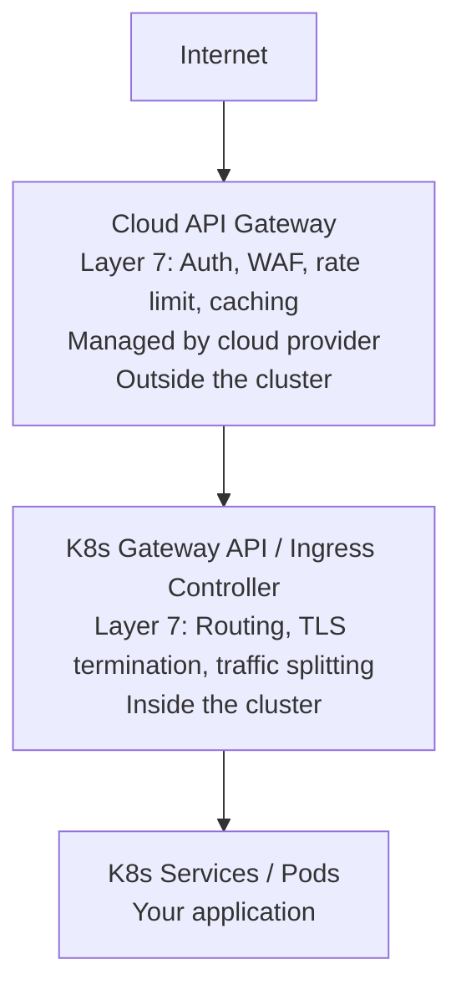
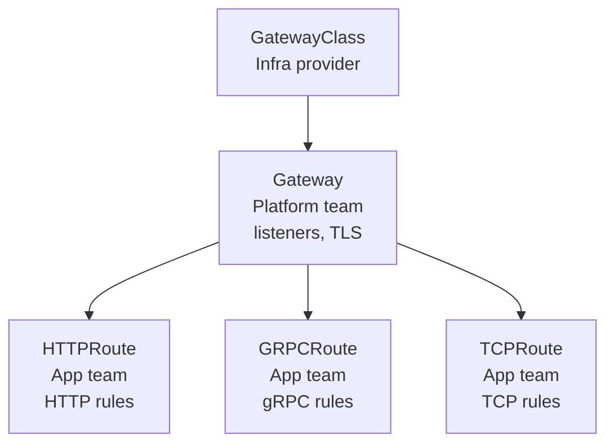
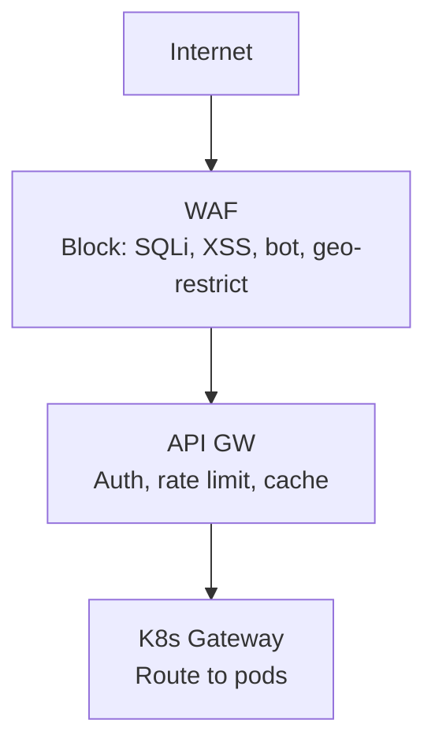
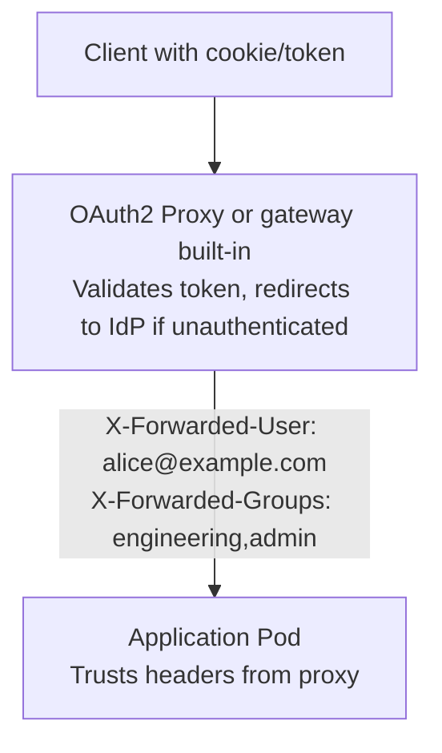

**Complexity**: [COMPLEX] | **Time to Complete**: 2.5h | **Prerequisites**: Module 9.3 (Serverless Interoperability), Kubernetes Ingress and Services, HTTP/TLS basics

## What You'll Be Able to Do

After completing this module, you will be able to:

- **Configure cloud-native API gateways (Amazon API Gateway, Apigee, Azure API Management) to front Kubernetes services**
- **Implement rate limiting, authentication, and request transformation at the gateway layer for Kubernetes backends**
- **Deploy WAF (Web Application Firewall) rules to protect Kubernetes-hosted APIs from OWASP Top 10 attacks**
- **Compare cloud API gateways with Kubernetes-native ingress controllers (Kong, Ambassador, Envoy Gateway) for different architectures**

---

## Why This Module Matters

In October 2023, a B2B SaaS company exposed their API through a Kubernetes NGINX Ingress controller. They had rate limiting configured in NGINX annotations and felt secure. During a product launch, a competitor's automated scraping bot hit their pricing API at 50,000 requests per second from 12,000 different IP addresses -- a distributed scraping attack that looked like legitimate traffic. The NGINX rate limiter, configured per-IP, was useless against distributed attacks. The API pods were overwhelmed, legitimate customers got 503 errors for 45 minutes, and three enterprise deals fell through.

The postmortem identified the missing layer: a Web Application Firewall (WAF) with bot detection, combined with an API gateway that could enforce global rate limits (not just per-IP), authenticate requests before they reach the cluster, and block known attack patterns. The NGINX Ingress was doing routing -- but routing alone is not security.

This module teaches you the difference between cloud API gateways and the Kubernetes Gateway API, how to integrate WAF protection with your cluster, rate limiting strategies that actually work against distributed attacks, OAuth2/OIDC integration for API authentication, and how to handle gRPC and WebSocket traffic through gateways.

---

## Cloud API Gateways vs Kubernetes Gateway API

These are not competing technologies. They operate at different layers and solve different problems.

### Where Each Lives



### Feature Comparison

| Feature | Cloud API Gateway | K8s Gateway API | K8s Ingress |
|---------|------------------|-----------------|-------------|
| WAF integration | Native | Manual (requires sidecar) | Not available |
| Global rate limiting | Built-in (per key, per plan) | Via extension (e.g., Envoy RLS) | Basic (per-IP annotation) |
| OAuth2/OIDC | Built-in (JWT validation) | Via extension or middleware | OAuth2 Proxy sidecar |
| API versioning | Path/header-based routing | HTTPRoute path matching | Path-based only |
| Usage plans / throttling | Built-in (API keys, quotas) | Not native | Not available |
| WebSocket support | Yes (with limitations) | Full | Full |
| gRPC support | Yes (AWS, GCP) | Full (GRPCRoute) | Annotation-dependent |
| Cost | Per-request pricing | Compute cost of controller | Compute cost of controller |
| Custom domain + TLS | Managed certificates | cert-manager integration | cert-manager integration |

### When to Use Each

| Scenario | Recommended Approach |
|----------|---------------------|
| Public API with usage plans, API keys, monetization | Cloud API Gateway |
| Internal service-to-service routing | K8s Gateway API |
| Public-facing web application | Cloud API Gateway (WAF) + K8s Gateway API (routing) |
| Multi-protocol (HTTP + gRPC + WebSocket) | K8s Gateway API |
| Simple path-based routing, small team | K8s Ingress (sufficient) |

---

## Kubernetes Gateway API

The Gateway API is the successor to the Ingress resource. It provides more expressive routing, protocol support, and role separation.

### Core Resources



### Gateway and HTTPRoute

```yaml
# Platform team creates the Gateway
apiVersion: gateway.networking.k8s.io/v1
kind: Gateway
metadata:
  name: production-gateway
  namespace: gateway-system
spec:
  gatewayClassName: envoy
  listeners:
    - name: https
      protocol: HTTPS
      port: 443
      tls:
        mode: Terminate
        certificateRefs:
          - name: wildcard-tls
            kind: Secret
      allowedRoutes:
        namespaces:
          from: Selector
          selector:
            matchLabels:
              gateway-access: "true"
    - name: http-redirect
      protocol: HTTP
      port: 80
---
# App team creates HTTPRoutes in their namespace
apiVersion: gateway.networking.k8s.io/v1
kind: HTTPRoute
metadata:
  name: api-routes
  namespace: production
spec:
  parentRefs:
    - name: production-gateway
      namespace: gateway-system
  hostnames:
    - "api.example.com"
  rules:
    - matches:
        - path:
            type: PathPrefix
            value: /api/v1/orders
      backendRefs:
        - name: order-service
          port: 8080
          weight: 100
    - matches:
        - path:
            type: PathPrefix
            value: /api/v1/products
      backendRefs:
        - name: product-service
          port: 8080
          weight: 90
        - name: product-service-canary
          port: 8080
          weight: 10
    - matches:
        - path:
            type: PathPrefix
            value: /api/v2/products
          headers:
            - name: X-Beta-User
              value: "true"
      backendRefs:
        - name: product-service-v2
          port: 8080
```

### GRPCRoute

```yaml
apiVersion: gateway.networking.k8s.io/v1
kind: GRPCRoute
metadata:
  name: grpc-services
  namespace: production
spec:
  parentRefs:
    - name: production-gateway
      namespace: gateway-system
  hostnames:
    - "grpc.example.com"
  rules:
    - matches:
        - method:
            service: orders.OrderService
      backendRefs:
        - name: order-grpc-service
          port: 9090
    - matches:
        - method:
            service: products.ProductService
      backendRefs:
        - name: product-grpc-service
          port: 9090
```

---

## WAF Integration

A Web Application Firewall inspects HTTP traffic and blocks known attack patterns (SQL injection, XSS, path traversal, bot traffic).

### Cloud WAF Architecture



### AWS WAF with ALB Ingress

```bash
# Create WAF Web ACL
aws wafv2 create-web-acl \
  --name k8s-api-protection \
  --scope REGIONAL \
  --default-action '{"Allow":{}}' \
  --rules '[
    {
      "Name": "AWS-AWSManagedRulesCommonRuleSet",
      "Priority": 1,
      "Statement": {
        "ManagedRuleGroupStatement": {
          "VendorName": "AWS",
          "Name": "AWSManagedRulesCommonRuleSet"
        }
      },
      "OverrideAction": {"None": {}},
      "VisibilityConfig": {
        "SampledRequestsEnabled": true,
        "CloudWatchMetricsEnabled": true,
        "MetricName": "CommonRuleSet"
      }
    },
    {
      "Name": "AWS-AWSManagedRulesSQLiRuleSet",
      "Priority": 2,
      "Statement": {
        "ManagedRuleGroupStatement": {
          "VendorName": "AWS",
          "Name": "AWSManagedRulesSQLiRuleSet"
        }
      },
      "OverrideAction": {"None": {}},
      "VisibilityConfig": {
        "SampledRequestsEnabled": true,
        "CloudWatchMetricsEnabled": true,
        "MetricName": "SQLiRuleSet"
      }
    },
    {
      "Name": "RateLimit-Global",
      "Priority": 3,
      "Statement": {
        "RateBasedStatement": {
          "Limit": 2000,
          "AggregateKeyType": "IP"
        }
      },
      "Action": {"Block": {}},
      "VisibilityConfig": {
        "SampledRequestsEnabled": true,
        "CloudWatchMetricsEnabled": true,
        "MetricName": "RateLimit"
      }
    }
  ]' \
  --visibility-config '{
    "SampledRequestsEnabled": true,
    "CloudWatchMetricsEnabled": true,
    "MetricName": "k8s-api-waf"
  }'

# Associate WAF with ALB (used by AWS Load Balancer Controller)
aws wafv2 associate-web-acl \
  --web-acl-arn arn:aws:wafv2:us-east-1:123456789:regional/webacl/k8s-api-protection/abc123 \
  --resource-arn arn:aws:elasticloadbalancing:us-east-1:123456789:loadbalancer/app/k8s-alb/abc123
```

### AWS Load Balancer Controller Ingress with WAF

```yaml
apiVersion: networking.k8s.io/v1
kind: Ingress
metadata:
  name: api-ingress
  namespace: production
  annotations:
    kubernetes.io/ingress.class: alb
    alb.ingress.kubernetes.io/scheme: internet-facing
    alb.ingress.kubernetes.io/target-type: ip
    alb.ingress.kubernetes.io/wafv2-acl-arn: arn:aws:wafv2:us-east-1:123456789:regional/webacl/k8s-api-protection/abc123
    alb.ingress.kubernetes.io/listen-ports: '[{"HTTPS":443}]'
    alb.ingress.kubernetes.io/certificate-arn: arn:aws:acm:us-east-1:123456789:certificate/abc123
    alb.ingress.kubernetes.io/ssl-redirect: "443"
spec:
  rules:
    - host: api.example.com
      http:
        paths:
          - path: /
            pathType: Prefix
            backend:
              service:
                name: api-service
                port:
                  number: 8080
```

### GCP Cloud Armor with GKE Ingress

```bash
# Create Cloud Armor security policy
gcloud compute security-policies create api-protection \
  --description "WAF for K8s API"

# Add OWASP rules
gcloud compute security-policies rules create 1000 \
  --security-policy api-protection \
  --expression "evaluatePreconfiguredExpr('sqli-v33-stable')" \
  --action deny-403

gcloud compute security-policies rules create 1001 \
  --security-policy api-protection \
  --expression "evaluatePreconfiguredExpr('xss-v33-stable')" \
  --action deny-403

# Rate limiting
gcloud compute security-policies rules create 1002 \
  --security-policy api-protection \
  --expression "true" \
  --action throttle \
  --rate-limit-threshold-count 100 \
  --rate-limit-threshold-interval-sec 60 \
  --conform-action allow \
  --exceed-action deny-429 \
  --enforce-on-key IP
```

```yaml
# GKE BackendConfig for Cloud Armor
apiVersion: cloud.google.com/v1
kind: BackendConfig
metadata:
  name: api-backend-config
  namespace: production
spec:
  securityPolicy:
    name: api-protection
---
apiVersion: v1
kind: Service
metadata:
  name: api-service
  namespace: production
  annotations:
    cloud.google.com/backend-config: '{"default": "api-backend-config"}'
spec:
  selector:
    app: api-server
  ports:
    - port: 8080
```

> **Pause and predict**: You deployed a WAF in front of your Kubernetes API. The WAF successfully blocks a known SQL injection payload. However, the next day, an attacker sends the exact same payload directly to the Ingress controller's public IP address, bypassing the WAF entirely, and successfully compromises the database. How did this happen, and how should the architecture be modified to prevent it?
> <details>
> <summary>Answer</summary>
>
> This happened because the Ingress controller was exposed directly to the internet (likely via a LoadBalancer service) without restricting incoming traffic. The attacker discovered the Ingress IP (e.g., using Shodan or checking DNS history) and bypassed the WAF completely. To fix this, you must configure the Ingress controller's security group or firewall rules to *only* accept traffic originating from the WAF's IP ranges. Alternatively, for AWS ALB, ensure the ALB is private or uses security group rules that only allow the CloudFront/WAF IP ranges to connect to it.
> </details>

---

## Rate Limiting That Actually Works

Per-IP rate limiting fails against distributed attacks. Effective rate limiting requires multiple strategies.

### Rate Limiting Strategies

| Strategy | Blocks | Does Not Block |
|----------|--------|---------------|
| Per-IP | Single-source floods | Distributed attacks (botnet) |
| Per-API-key | Abusive API consumers | Unauthenticated attacks |
| Per-user (JWT claim) | Abusive authenticated users | Bot traffic |
| Global (total RPS) | DDoS beyond capacity | Targeted abuse within limits |
| Per-path | Abuse of expensive endpoints | Wide-spectrum attacks |

### Envoy Rate Limit Service

For Kubernetes-native rate limiting, deploy an Envoy rate limit service:

```yaml
apiVersion: apps/v1
kind: Deployment
metadata:
  name: ratelimit
  namespace: gateway-system
spec:
  replicas: 2
  selector:
    matchLabels:
      app: ratelimit
  template:
    metadata:
      labels:
        app: ratelimit
    spec:
      containers:
        - name: ratelimit
          image: envoyproxy/ratelimit:master
          ports:
            - containerPort: 8080
            - containerPort: 8081
            - containerPort: 6070
          env:
            - name: RUNTIME_ROOT
              value: /data
            - name: RUNTIME_SUBDIRECTORY
              value: ratelimit
            - name: REDIS_SOCKET_TYPE
              value: tcp
            - name: REDIS_URL
              value: redis-master.cache.svc:6379
            - name: USE_STATSD
              value: "false"
          volumeMounts:
            - name: config
              mountPath: /data/ratelimit/config
      volumes:
        - name: config
          configMap:
            name: ratelimit-config
---
apiVersion: v1
kind: ConfigMap
metadata:
  name: ratelimit-config
  namespace: gateway-system
data:
  config.yaml: |
    domain: production
    descriptors:
      # Global rate limit: 10,000 RPS total
      - key: generic_key
        value: global
        rate_limit:
          unit: second
          requests_per_unit: 10000
      # Per-API-key limit: 100 RPS
      - key: header_match
        value: api-key
        rate_limit:
          unit: second
          requests_per_unit: 100
      # Expensive endpoint: 10 RPS per user
      - key: header_match
        value: expensive-endpoint
        descriptors:
          - key: user_id
            rate_limit:
              unit: second
              requests_per_unit: 10
---
apiVersion: v1
kind: Service
metadata:
  name: ratelimit
  namespace: gateway-system
spec:
  selector:
    app: ratelimit
  ports:
    - name: grpc
      port: 8081
```

> **Stop and think**: Your e-commerce API is experiencing a sudden spike of 50,000 requests per second to the `/api/v1/checkout` endpoint. The traffic originates from thousands of residential IP addresses, and every request contains a valid, distinct user JWT. Your per-IP rate limit of 100 req/sec is not triggering. What type of rate limiting strategy is missing, and why is it necessary here?
> <details>
> <summary>Answer</summary>
>
> You are missing a global or per-path rate limit, as well as potentially a per-user limit. Because the attack is distributed across thousands of IPs (such as a botnet using residential proxies), no single IP hits the 100 req/sec threshold, making per-IP limiting entirely useless. Since the attackers are using valid JWTs, they might be using compromised accounts or have registered thousands of free accounts. Implementing a global ceiling on the `/checkout` path (e.g., 2,000 req/sec total) would protect the backend service from catastrophic failure, while a per-user rate limit (extracted from the JWT) would effectively throttle the individual abusive accounts even if they continuously rotate their IP addresses.
> </details>

---

## OAuth2/OIDC Proxying

Instead of implementing authentication in every service, use an authentication proxy at the gateway level.

### OAuth2 Proxy Architecture



### OAuth2 Proxy Deployment

```yaml
apiVersion: apps/v1
kind: Deployment
metadata:
  name: oauth2-proxy
  namespace: auth
spec:
  replicas: 2
  selector:
    matchLabels:
      app: oauth2-proxy
  template:
    metadata:
      labels:
        app: oauth2-proxy
    spec:
      containers:
        - name: oauth2-proxy
          image: quay.io/oauth2-proxy/oauth2-proxy:v7.7.0
          args:
            - --provider=oidc
            - --oidc-issuer-url=https://accounts.google.com
            - --client-id=$(CLIENT_ID)
            - --client-secret=$(CLIENT_SECRET)
            - --cookie-secret=$(COOKIE_SECRET)
            - --email-domain=example.com
            - --upstream=http://api-service.production.svc:8080
            - --http-address=0.0.0.0:4180
            - --pass-authorization-header=true
            - --set-xauthrequest=true
            - --cookie-secure=true
            - --cookie-samesite=lax
          env:
            - name: CLIENT_ID
              valueFrom:
                secretKeyRef:
                  name: oauth2-proxy-config
                  key: client-id
            - name: CLIENT_SECRET
              valueFrom:
                secretKeyRef:
                  name: oauth2-proxy-config
                  key: client-secret
            - name: COOKIE_SECRET
              valueFrom:
                secretKeyRef:
                  name: oauth2-proxy-config
                  key: cookie-secret
          ports:
            - containerPort: 4180
          resources:
            requests:
              cpu: 100m
              memory: 128Mi
---
apiVersion: v1
kind: Service
metadata:
  name: oauth2-proxy
  namespace: auth
spec:
  selector:
    app: oauth2-proxy
  ports:
    - port: 4180
```

### JWT Validation at the Gateway (Without Proxy)

Cloud API Gateways can validate JWT tokens directly without a separate proxy:

```bash
# AWS API Gateway: JWT Authorizer
aws apigatewayv2 create-authorizer \
  --api-id $API_ID \
  --authorizer-type JWT \
  --name oidc-auth \
  --identity-source '$request.header.Authorization' \
  --jwt-configuration '{
    "Audience": ["api.example.com"],
    "Issuer": "https://login.microsoftonline.com/TENANT_ID/v2.0"
  }'

# Attach to route
aws apigatewayv2 update-route \
  --api-id $API_ID \
  --route-id $ROUTE_ID \
  --authorization-type JWT \
  --authorizer-id $AUTH_ID
```

### Envoy Gateway JWT Authentication

```yaml
apiVersion: gateway.envoyproxy.io/v1alpha1
kind: SecurityPolicy
metadata:
  name: jwt-auth
  namespace: gateway-system
spec:
  targetRef:
    group: gateway.networking.k8s.io
    kind: HTTPRoute
    name: api-routes
  jwt:
    providers:
      - name: google
        issuer: https://accounts.google.com
        audiences:
          - api.example.com
        remoteJWKS:
          uri: https://www.googleapis.com/oauth2/v3/certs
        claimToHeaders:
          - claim: email
            header: X-User-Email
          - claim: groups
            header: X-User-Groups
```

---

## gRPC and WebSocket Through Gateways

### gRPC Requirements

gRPC uses HTTP/2 with long-lived streams. Not all gateways handle this correctly.

| Gateway | gRPC Support | Configuration |
|---------|-------------|---------------|
| AWS ALB | Yes (HTTP/2) | Target group protocol: gRPC |
| AWS API Gateway | Yes (HTTP API) | Integration type: HTTP_PROXY with gRPC |
| GCP GCLB | Yes (HTTP/2) | Backend service protocol: HTTP2 |
| Azure App Gateway v2 | Yes (HTTP/2) | Backend protocol: HTTP/2 |
| Envoy Gateway | Yes (native) | GRPCRoute resource |
| NGINX Ingress | Yes | `nginx.org/grpc-services` annotation |

```yaml
# ALB Ingress for gRPC
apiVersion: networking.k8s.io/v1
kind: Ingress
metadata:
  name: grpc-ingress
  annotations:
    kubernetes.io/ingress.class: alb
    alb.ingress.kubernetes.io/backend-protocol-version: GRPC
    alb.ingress.kubernetes.io/listen-ports: '[{"HTTPS":443}]'
    alb.ingress.kubernetes.io/target-type: ip
spec:
  rules:
    - host: grpc.example.com
      http:
        paths:
          - path: /
            pathType: Prefix
            backend:
              service:
                name: grpc-service
                port:
                  number: 9090
```

### WebSocket Support

WebSockets require connection upgrades that some gateways handle differently:

```yaml
# Gateway API: WebSocket works with HTTPRoute (connection upgrade is automatic)
apiVersion: gateway.networking.k8s.io/v1
kind: HTTPRoute
metadata:
  name: websocket-route
  namespace: production
spec:
  parentRefs:
    - name: production-gateway
      namespace: gateway-system
  hostnames:
    - "ws.example.com"
  rules:
    - matches:
        - path:
            type: PathPrefix
            value: /ws
      backendRefs:
        - name: websocket-service
          port: 8080
```

```yaml
# NGINX Ingress: Requires explicit timeout configuration
apiVersion: networking.k8s.io/v1
kind: Ingress
metadata:
  name: websocket-ingress
  annotations:
    nginx.ingress.kubernetes.io/proxy-read-timeout: "3600"
    nginx.ingress.kubernetes.io/proxy-send-timeout: "3600"
    nginx.ingress.kubernetes.io/connection-proxy-header: "keep-alive"
    nginx.ingress.kubernetes.io/upstream-hash-by: "$request_uri"
spec:
  rules:
    - host: ws.example.com
      http:
        paths:
          - path: /ws
            pathType: Prefix
            backend:
              service:
                name: websocket-service
                port:
                  number: 8080
```

---

## Did You Know?

1. **AWS WAF processes over 1.5 trillion web requests per month** across all its customers. The top three attack types blocked are SQL injection (34%), cross-site scripting (28%), and path traversal (19%). AWS maintains a team of security researchers who update managed rule sets weekly based on emerging threats.

2. **The Kubernetes Gateway API was released as v1.0 (GA) in October 2023** after three years of development. It replaced the Ingress resource, which had been the standard since Kubernetes 1.1 (2015). The main motivation was that Ingress relied heavily on non-standard annotations, making configurations vendor-specific and non-portable.

3. **gRPC was created by Google in 2015** and uses Protocol Buffers for serialization. It is 5-10x faster than REST/JSON for structured data exchange because Protobuf is a binary format (smaller payloads) and HTTP/2 enables multiplexing (multiple requests on one connection). Over 60% of inter-service communication at Google uses gRPC.

4. **OAuth2 Proxy was originally created by Bitly** (the URL shortening company) in 2014 as "Google Auth Proxy." It was renamed and expanded to support OIDC, GitHub, Azure AD, and other providers. It is now the most widely used authentication proxy in Kubernetes, with over 9,000 GitHub stars and millions of downloads.

---

## Common Mistakes

| Mistake | Why It Happens | How to Fix It |
|---------|---------------|---------------|
| Using only per-IP rate limiting | Simplest to configure | Layer multiple strategies: per-IP, per-API-key, per-user, global ceiling |
| Not putting WAF in front of the cluster | "Our API validates input" | WAF catches attacks that bypass application validation; defense in depth |
| Implementing auth in every microservice | "Each service should be independent" | Centralize auth at the gateway; pass identity headers downstream |
| Using Ingress annotations for complex routing | Ingress was designed for simple routing | Migrate to Gateway API for path/header matching, traffic splitting, cross-namespace routing |
| Setting WebSocket timeouts too low | Default NGINX proxy timeout is 60 seconds | Increase `proxy-read-timeout` and `proxy-send-timeout` to 3600+ for WebSocket |
| Exposing gRPC without TLS | "It is internal" | gRPC metadata (headers) can contain sensitive data; always use TLS |
| Not testing WAF rules in count mode first | Eager to block attacks | Deploy WAF rules in count/monitor mode, review false positives, then switch to block |
| Putting cloud API Gateway and K8s Ingress on the same path without understanding the layers | "One gateway is enough" | Understand that cloud API GW handles edge concerns (WAF, auth, rate limit) and K8s Gateway handles internal routing |

---

## Quiz

<details>
<summary>1. You are designing an architecture for a new B2B SaaS platform. The product team wants to offer tiered API access (Free, Pro, Enterprise) with different rate limits, generate API keys for customers, and monetize API usage. The engineering team wants to use the Kubernetes Gateway API for internal service-to-service routing. Which layer (Cloud API Gateway or K8s Gateway API) should handle the customer-facing API key management and usage plans, and why?</summary>

The Cloud API Gateway should handle the customer-facing API key management and usage plans. Cloud API gateways (like AWS API Gateway or Azure APIM) have built-in, managed features specifically designed for API monetization, usage quotas, and developer portal integration. The Kubernetes Gateway API runs inside the cluster and is focused on Layer 7 routing, traffic splitting, and protocol translation, but lacks native constructs for API billing or plan management. By layering them, the Cloud API Gateway handles the business logic of API access at the edge, while the Kubernetes Gateway API handles the technical routing within the cluster. This separation of concerns allows platform teams to evolve internal routing independently of external business requirements.
</details>

<details>
<summary>2. During a marketing campaign, your Kubernetes-hosted application is targeted by a distributed scraping botnet. The attackers use a pool of 20,000 rotating IP addresses. You implement a strict per-IP rate limit on your Ingress controller, but the backend database still crashes from the load. Why did the per-IP rate limit failed, and what combination of rate limiting strategies would be effective here?</summary>

The per-IP rate limit failed because the attack was distributed across so many addresses that no single IP ever crossed the threshold. If your limit is 50 requests per second per IP, 20,000 IPs can generate 1,000,000 requests per second without triggering the rule. To effectively mitigate this, you need a layered rate limiting approach. A global rate limit establishes a total ceiling for the endpoint, protecting the backend from being overwhelmed by aggregate volume. Additionally, a per-user or per-API-key limit restricts the total capacity any single authenticated actor can consume, neutralizing the attack regardless of how many IP addresses they cycle through.
</details>

<details>
<summary>3. A security auditor recommends deploying a WAF to protect your legacy monolithic API running in Kubernetes. The development team immediately deploys the WAF rules in strict "block" mode. The next morning, the customer support queue is flooded with complaints that the main file upload feature is returning 403 Forbidden errors. Why did this happen, and what is the standard operational practice for deploying new WAF rules?</summary>

The WAF likely blocked the file uploads because the payload contained byte sequences or file metadata that matched a known exploit signature, resulting in a false positive. WAF rules rely on pattern matching and do not inherently understand the application's intended context. The standard operational practice is to always deploy new WAF rules in "count" or "monitor" mode first. This allows the security team to observe which requests would be blocked and identify false positives in legitimate traffic. After tuning the rules and adding necessary exceptions, the team can safely switch to "block" mode without causing a self-inflicted outage.
</details>

<details>
<summary>4. Your platform team is migrating from the legacy Ingress controller to the Gateway API. An application team wants to route HTTP requests with the header `X-Customer-Tier: premium` to a dedicated set of high-performance pods, and all other traffic to the standard pods. Why does the Gateway API make this significantly easier to implement and manage than the old Ingress resource?</summary>

The Gateway API makes this easier because it provides native, structured support for header-based routing within the `HTTPRoute` resource. You simply define a rule with a `matches` block specifying the required header, and then route those requests to the premium backend service. In contrast, the legacy Ingress resource only natively supported path-based routing, forcing administrators to use complex, vendor-specific annotations. These annotations were difficult to test, highly prone to syntax errors, and locked the architecture into a specific Ingress controller implementation.
</details>

<details>
<summary>5. Your architecture includes a React single-page application (SPA) and a backend API. You need to implement user authentication using Google Workspace. You are deciding between using OAuth2 Proxy or having the API Gateway directly validate JWTs. Which component should you use to secure the SPA's access to the API, and why?</summary>

You should use OAuth2 Proxy for the single-page application. A React application running in a browser needs to perform the OAuth2 Authorization Code flow to securely authenticate users and establish a session, which involves redirects to the identity provider and managing secure cookies. OAuth2 Proxy is explicitly designed to handle this entire interactive flow and abstract the complexity away from the frontend application. Direct gateway JWT validation assumes the client already possesses a valid token, making it suitable for machine-to-machine communication but incapable of performing the interactive login redirects required by browser-based users.
</details>

<details>
<summary>6. A microservices team replaces their REST APIs with gRPC for better performance. They update their Ingress rules, but suddenly all external gRPC calls start failing with protocol errors. Their Ingress controller is configured with standard HTTP/1.1 backend connections. Why are the gRPC calls failing, and what must be changed at the gateway layer?</summary>

The gRPC calls are failing because gRPC fundamentally requires HTTP/2, which provides the multiplexing and long-lived stream capabilities it relies on. Standard HTTP/1.1 connections cannot carry gRPC traffic, causing the gateway to drop or misinterpret the requests. To fix this, the gateway layer must be explicitly configured to use HTTP/2 for its upstream connections to the backend pods. Depending on the controller, this involves setting specific annotations (like `alb.ingress.kubernetes.io/backend-protocol-version: GRPC` for AWS ALB) or using the native `GRPCRoute` resource in the Gateway API to ensure the controller negotiates the correct protocol end-to-end.
</details>

---

## Hands-On Exercise: Gateway API with Rate Limiting

### Setup

```bash
# Create kind cluster with extra ports
cat > /tmp/kind-gateway.yaml << 'EOF'
kind: Cluster
apiVersion: kind.x-k8s.io/v1alpha4
nodes:
  - role: control-plane
    extraPortMappings:
      - containerPort: 80
        hostPort: 8080
      - containerPort: 443
        hostPort: 8443
  - role: worker
  - role: worker
EOF

kind create cluster --name gateway-lab --config /tmp/kind-gateway.yaml

# Install Gateway API CRDs
k apply -f https://github.com/kubernetes-sigs/gateway-api/releases/download/v1.2.0/standard-install.yaml

# Install Envoy Gateway
helm install eg oci://docker.io/envoyproxy/gateway-helm \
  --version v1.2.0 \
  --namespace envoy-gateway-system --create-namespace

k wait --for=condition=ready pod -l control-plane=envoy-gateway \
  --namespace envoy-gateway-system --timeout=120s
```

### Task 1: Create a Gateway and Backend Services

Deploy two backend services and a Gateway.

<details>
<summary>Solution</summary>

```yaml
# Backend services
apiVersion: apps/v1
kind: Deployment
metadata:
  name: echo-v1
  namespace: default
spec:
  replicas: 2
  selector:
    matchLabels:
      app: echo
      version: v1
  template:
    metadata:
      labels:
        app: echo
        version: v1
    spec:
      containers:
        - name: echo
          image: hashicorp/http-echo
          args: ["-text=Hello from v1", "-listen=:8080"]
          ports:
            - containerPort: 8080
---
apiVersion: v1
kind: Service
metadata:
  name: echo-v1
spec:
  selector:
    app: echo
    version: v1
  ports:
    - port: 8080
---
apiVersion: apps/v1
kind: Deployment
metadata:
  name: echo-v2
  namespace: default
spec:
  replicas: 1
  selector:
    matchLabels:
      app: echo
      version: v2
  template:
    metadata:
      labels:
        app: echo
        version: v2
    spec:
      containers:
        - name: echo
          image: hashicorp/http-echo
          args: ["-text=Hello from v2 (canary)", "-listen=:8080"]
          ports:
            - containerPort: 8080
---
apiVersion: v1
kind: Service
metadata:
  name: echo-v2
spec:
  selector:
    app: echo
    version: v2
  ports:
    - port: 8080
---
# Gateway
apiVersion: gateway.networking.k8s.io/v1
kind: GatewayClass
metadata:
  name: eg
spec:
  controllerName: gateway.envoyproxy.io/gatewayclass-controller
---
apiVersion: gateway.networking.k8s.io/v1
kind: Gateway
metadata:
  name: lab-gateway
  namespace: default
spec:
  gatewayClassName: eg
  listeners:
    - name: http
      protocol: HTTP
      port: 80
```

```bash
k apply -f /tmp/gateway-setup.yaml
k wait --for=condition=programmed gateway/lab-gateway --timeout=60s
```
</details>

### Task 2: Configure HTTPRoutes with Traffic Splitting

Create an HTTPRoute that sends 80% of traffic to v1 and 20% to v2.

<details>
<summary>Solution</summary>

```yaml
apiVersion: gateway.networking.k8s.io/v1
kind: HTTPRoute
metadata:
  name: echo-route
  namespace: default
spec:
  parentRefs:
    - name: lab-gateway
  rules:
    - matches:
        - path:
            type: PathPrefix
            value: /
      backendRefs:
        - name: echo-v1
          port: 8080
          weight: 80
        - name: echo-v2
          port: 8080
          weight: 20
```

```bash
k apply -f /tmp/httproute.yaml

# Get the gateway's external address
GW_IP=$(k get gateway lab-gateway -o jsonpath='{.status.addresses[0].value}')
echo "Gateway IP: $GW_IP"

# Test traffic splitting (send 20 requests)
for i in $(seq 1 20); do
  k run curl-$i --rm -it --image=curlimages/curl --restart=Never -- \
    curl -s http://$GW_IP/ 2>/dev/null
done
```
</details>

### Task 3: Add Header-Based Routing

Add a rule that routes requests with `X-Version: v2` header to the v2 service.

<details>
<summary>Solution</summary>

```yaml
apiVersion: gateway.networking.k8s.io/v1
kind: HTTPRoute
metadata:
  name: echo-route
  namespace: default
spec:
  parentRefs:
    - name: lab-gateway
  rules:
    # Header-based routing (higher priority)
    - matches:
        - headers:
            - name: X-Version
              value: v2
      backendRefs:
        - name: echo-v2
          port: 8080
    # Default: traffic split
    - matches:
        - path:
            type: PathPrefix
            value: /
      backendRefs:
        - name: echo-v1
          port: 8080
          weight: 80
        - name: echo-v2
          port: 8080
          weight: 20
```

```bash
k apply -f /tmp/httproute-headers.yaml

GW_IP=$(k get gateway lab-gateway -o jsonpath='{.status.addresses[0].value}')

# Test header-based routing
k run header-test --rm -it --image=curlimages/curl --restart=Never -- \
  curl -s -H "X-Version: v2" http://$GW_IP/
# Should always return "Hello from v2 (canary)"
```
</details>

### Task 4: Apply Rate Limiting at the Gateway

Configure an Envoy Extension Policy to limit requests sent through the Gateway.

<details>
<summary>Solution</summary>

```yaml
# Apply Envoy Gateway ClientTrafficPolicy
apiVersion: gateway.envoyproxy.io/v1alpha1
kind: ClientTrafficPolicy
metadata:
  name: rate-limit-policy
  namespace: default
spec:
  targetRef:
    group: gateway.networking.k8s.io
    kind: HTTPRoute
    name: echo-route
  rateLimit:
    type: Global
    global:
      rules:
        - limit:
            requests: 2
            unit: Second
```

```bash
k apply -f /tmp/rate-limit.yaml

# Test the rate limit through the gateway
GW_IP=$(k get gateway lab-gateway -o jsonpath='{.status.addresses[0].value}')

echo "Sending 10 rapid requests to Gateway IP: $GW_IP..."
for i in $(seq 1 10); do
  STATUS=$(k run rate-test-$i --rm -i --image=curlimages/curl --restart=Never -- curl -s -o /dev/null -w '%{http_code}' http://$GW_IP/ 2>/dev/null)
  echo "Request $i returned HTTP $STATUS"
done
# You should see HTTP 200 for the first few requests, followed by HTTP 429 (Too Many Requests)
```
</details>

### Task 5: Enforce JWT Authentication

Apply a SecurityPolicy to the HTTPRoute to require a valid JWT for access.

<details>
<summary>Solution</summary>

```yaml
# Apply Envoy Gateway SecurityPolicy
apiVersion: gateway.envoyproxy.io/v1alpha1
kind: SecurityPolicy
metadata:
  name: jwt-auth
  namespace: default
spec:
  targetRef:
    group: gateway.networking.k8s.io
    kind: HTTPRoute
    name: echo-route
  jwt:
    providers:
      - name: example
        remoteJWKS:
          uri: https://raw.githubusercontent.com/envoyproxy/gateway/main/examples/kubernetes/jwt/jwks.json
```

```bash
k apply -f /tmp/security-policy.yaml

GW_IP=$(k get gateway lab-gateway -o jsonpath='{.status.addresses[0].value}')

# Test without a token (should return 401 Unauthorized)
k run auth-test --rm -i --image=curlimages/curl --restart=Never -- \
  curl -s -o /dev/null -w '%{http_code}' http://$GW_IP/
```
</details>

### Success Criteria

- [ ] Gateway is created and programmed
- [ ] HTTPRoute splits traffic ~80/20 between v1 and v2
- [ ] Header-based routing sends X-Version: v2 requests to v2
- [ ] Rate limiting policy correctly returns 429 Too Many Requests under load
- [ ] Security policy blocks unauthenticated requests with 401 Unauthorized

### Cleanup

```bash
kind delete cluster --name gateway-lab
```

---

**Next Module**: [Module 9.10: Data Warehousing & Analytics from Kubernetes](../module-9.10-analytics/) -- Learn how to connect Kubernetes workloads to BigQuery, Redshift, and Snowflake, orchestrate data pipelines with Airflow, and control analytics costs.