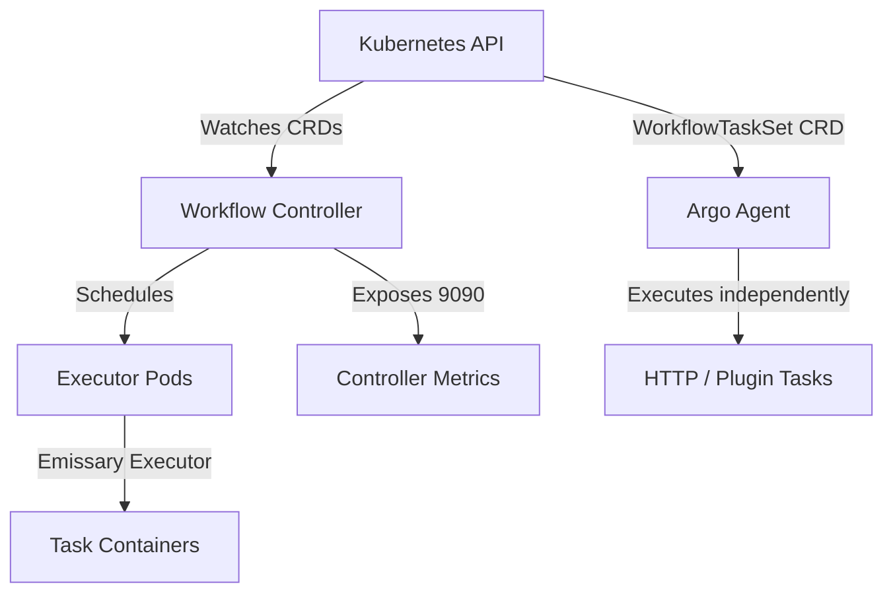
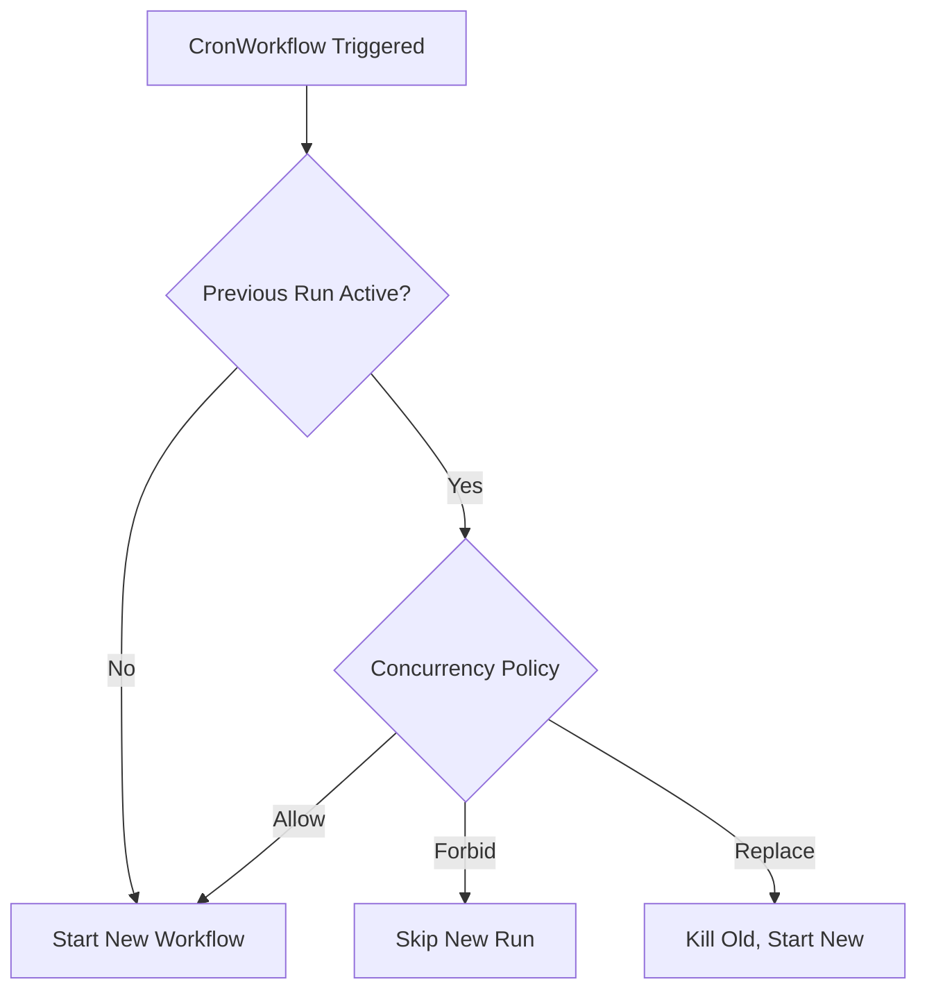
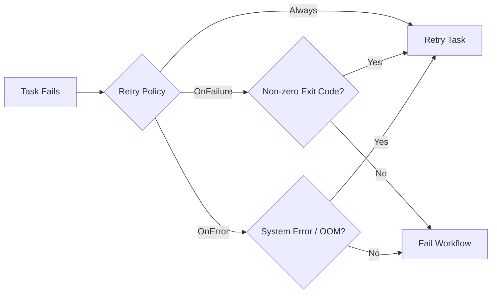

> **CAPA Track -- Domain 1 (36%)** | Complexity: `[COMPLEX]` | Time: 50-60 min

The platform team at a major global fintech company, responsible for clearing millions in daily transactions, had a systemic problem. Their nightly reconciliation workflow ran 14 steps sequentially, took over 3 hours to execute, and failed silently twice a week. Because there was no automated feedback loop, nobody knew about the failures until morning standup, which meant financial discrepancies impacted actual end users before engineers could intervene. 

After migrating their legacy pipeline to Argo Workflows using exit handlers for immediate Slack alerts, `CronWorkflows` for precise scheduling, memoization to dynamically skip unchanged steps, and lifecycle hooks for strict audit logging, the pipeline execution time shrank to a mere 40 minutes. Failures triggered immediate notifications with embedded logs, and transient infrastructure errors retried automatically without human intervention. The team went from dedicating 12 hours per week to pipeline babysitting down to zero.

This transformation is the power of advanced Argo Workflows. Once you move beyond basic linear pipelines, Argo provides a comprehensive, declarative toolkit for building self-healing, concurrency-safe, and highly optimized automation engines.

## Prerequisites

- [Module 3.3: Argo Workflows](/platform/toolkits/cicd-delivery/ci-cd-pipelines/module-3.3-argo-workflows/) -- Foundations: Container, Script, Steps, DAG, Artifacts.
- Kubernetes RBAC basics (ServiceAccounts, Roles, RoleBindings).
- Familiarity with standard Kubernetes CronJob scheduling syntax.

## What You'll Be Able to Do

After completing this module, you will be able to reason about Argo Workflows as an operations platform rather than a YAML wrapper around shell scripts, and you will have enough practice to recognize exam questions that hide scheduling, retry, template resolution, or security constraints inside realistic workflow scenarios.

1. **Design** advanced Argo Workflows leveraging all 9 template types, including `Resource` templates for direct API manipulation and `ContainerSet` for tightly-coupled execution.
2. **Implement** sophisticated dependency logic in Directed Acyclic Graphs (DAGs) using boolean expressions, fail-fast controls, and expression-based conditionals.
3. **Evaluate** and **configure** workflow resiliency through targeted retry strategies, lifecycle hooks, and comprehensive exit handlers.
4. **Deploy** concurrency-safe pipelines using `CronWorkflows` and database-backed synchronization primitives (mutexes and semaphores).
5. **Diagnose** common workflow failures by understanding the `emissary` executor architecture, Argo Agent tasks, and controller metrics.

## Why This Module Matters

The Certified Argo Project Associate (CAPA) exam dedicates a massive 36% of its weight to Domain 1, which covers Argo Workflows in extensive depth. While Module 3.3 taught the foundational concepts of running basic scripts and containers, the real world—and the exam—demands mastery of the complex features.

Enterprise pipelines do not operate in a vacuum. They must handle API rate limits, transient network failures, parallel job constraints, and strict security compliance. This module covers everything required to elevate a script into a robust platform product: remaining template types, scheduled workflows, reusable templates, exit handlers, synchronization, memoization, lifecycle hooks, variables, retry strategies, and security.

## Did You Know?

- **Hera is the official Python SDK:** The old `argo-workflows` PyPI package was officially removed in v4.0 because it failed to build reliably. The recommended replacement is **Hera**, which is maintained under the `argoproj-labs` GitHub organization.
- **Workflow Archival does NOT save logs:** When you enable workflow archival, completed workflow states are persisted to PostgreSQL (>=9.4) or MySQL (>=5.7.8), but pod execution logs are explicitly not archived. You must rely on standard Kubernetes log aggregation (like Promtail/Loki) for log retention.
- **CEL-based validation blocks bad manifests instantly:** Version 4.0.0 (released February 4, 2026) introduced comprehensive Common Expression Language (CEL) validation rules embedded directly into the CRDs, enforcing structural integrity at cluster admission time.
- **The singular `schedule` field is gone:** As of Argo Workflows v4.0, the singular `schedule` field for `CronWorkflows` was hard-removed. You must use the `schedules` field, which accepts a required non-empty list of cron strings.

## Section 1: Architecture & The Emissary Executor

Argo Workflows is an open-source, container-native workflow engine implemented as a Kubernetes CRD (Custom Resource Definition). It was accepted to the CNCF in 2020 and became a Graduated project on December 6, 2022. Because it runs natively on Kubernetes, every step in your workflow corresponds to a Pod (or a direct API call), leveraging native Kubernetes scheduling.



### The Executor Evolution
To run commands inside containers, Argo injects an "executor." Historically, Argo supported multiple executors (`docker`, `pns`, `k8sapi`, `kubelet`). However, **since Argo Workflows v3.4, `emissary` is the sole supported executor**, and the others were completely removed from the codebase. The `emissary` executor injects an initialization container that copies the `argoexec` binary into a shared volume, and overrides the main container's entrypoint to run the command safely.

> **Pause and predict**: If the controller metrics are exposed at port 9090 by default, how do you scrape them? 
> *Answer:* The metrics are exposed at `<host>:9090/metrics` via the `workflow-controller-metrics` service. However, a ServiceMonitor is not installed by default; you must add it separately for Prometheus to begin scraping.

## Section 2: The 9 Template Types

Argo Workflows officially supports **nine** template types. You already know `container`, `script`, `steps`, and `dag`; the advanced types matter because they let you remove unnecessary Pods, pause safely for approvals, call APIs through the controller-side agent path, co-locate tightly coupled containers, and extend the system without turning every operation into a bespoke image.

### 1. Resource Template
The Resource template performs CRUD operations on Kubernetes resources directly through the API server, so no `kubectl` container or image pull is required. This is especially useful when the workflow should create a ConfigMap, patch a Deployment, wait for a Job-like status field, or delete temporary infrastructure while still letting Argo evaluate success and failure conditions declaratively.

```yaml
- name: create-configmap
  resource:
    action: create          # create | patch | apply | delete | get
    manifest: |
      apiVersion: v1
      kind: ConfigMap
      metadata:
        name: output-{{workflow.name}}
      data:
        result: "done"
    successCondition: "status.phase == Active"
    failureCondition: "status.phase == Failed"
```

### 2. Suspend Template
The Suspend template pauses execution until a human resumes the workflow or a specified duration elapses. It is the primary mechanism for approval gates because the workflow remains visible in Kubernetes, preserves its parameters and node graph, and avoids inventing an external state machine that operations teams must reconcile after every restart.

```yaml
- name: approval-gate
  suspend:
    duration: "0"     # Wait indefinitely until resumed
- name: timed-pause
  suspend:
    duration: "30m"   # Auto-resume after 30 minutes
```

### 3. HTTP Template
The HTTP template makes web requests without spinning up a container. Instead of creating a Pod, it uses the **Argo Agent** process, which communicates with the controller through a `WorkflowTaskSet` CRD created per running workflow.

```yaml
- name: call-webhook
  http:
    url: "https://httpbin.org/post"
    method: POST
    headers:
      - name: Authorization
        valueFrom:
          secretKeyRef: {name: api-creds, key: token}
    body: '{"workflow": "{{workflow.name}}", "status": "{{workflow.status}}"}'
    successCondition: "response.statusCode >= 200 && response.statusCode < 300"
```

### 4. ContainerSet Template
A `ContainerSet` template runs multiple containers in a single Pod. The workflow executor starts each container only after its declared dependencies complete, which is ideal when a clone, build, test, and package sequence must share one local workspace and would otherwise waste time uploading artifacts between separately scheduled Pods.

```yaml
- name: multi-container
  containerSet:
    volumeMounts:
      - name: workspace
        mountPath: /workspace
    containers:
      - name: clone
        image: alpine/git
        command: [sh, -c, "git clone https://github.com/argoproj/argo-workflows /workspace/repo"]
      - name: build
        image: golang:1.26
        command: [sh, -c, "cd /workspace/repo && go build ./..."]
        dependencies: [clone]
      - name: test
        image: golang:1.26
        command: [sh, -c, "cd /workspace/repo && go test ./..."]
        dependencies: [clone]
  volumes:
    - name: workspace
      emptyDir: {}
```
*Limitation:* While it offers DAG-style ordering within a single Pod, it **cannot** use enhanced boolean `depends` logic. Treat `ContainerSet` as a locality optimization for tightly related steps, not as a replacement for a full DAG that needs branching, partial failure semantics, or independent resource requests.

### 5. Plugin Template
Like HTTP templates, Plugin templates execute via the Argo Agent process. They allow you to extend Argo with custom executors. As of v4.0, artifact streaming for Plugin artifact drivers is fully supported, joining S3, Azure Blob, HTTP, Artifactory, and OSS.

## Section 3: Advanced DAGs and Conditionals

### Enhanced Dependency Logic
DAG tasks support a `depends` field for enhanced dependency logic with boolean expressions. Rather than simply waiting for a previous task to finish, you can branch based on the specific status of multiple predecessors.

```yaml
depends: "task-A.Succeeded || task-B.Failed"
```

### FailFast
By default, DAG templates have a `failFast` field that defaults to `true`. When one task fails, no new tasks are scheduled. Setting `failFast: false` allows all independent branches to run to completion even if one branch fails.

### Conditional Execution & Loops
The template-level `when` field enables conditional step execution using expression-based conditions, but it should remain readable enough that an operator can tell why a branch skipped. If the expression is carrying business logic that belongs in code, move that logic into a preceding task and pass a simple output parameter into the workflow graph.

```yaml
when: "{{tasks.check-data.outputs.result}} == true"
```

For fanning out workflows, you use loops, and the exam often checks whether you understand when the list is known. Static lists fit `withItems`, while runtime lists should be emitted as JSON by one step and consumed with `withParam` by the next step.
- `withItems` accepts a hardcoded YAML list for looping.
- `withParam` accepts a JSON string, typically passed dynamically by a prior step's output.

> **Stop and think**: If `withItems` fans out both the task and its dependencies, and `withParam` fans out only the current task, which one would you use for dynamically generated parallel builds?
> *Answer:* You must use `withParam` because the array of targets is only known at runtime as a JSON output from a previous step.

## Section 4: Scheduled Executions with CronWorkflows

`CronWorkflows` are a dedicated CRD that create `Workflow` objects on a schedule. They are entirely separate from Kubernetes `CronJobs`, which matters because the Argo controller, not the Kubernetes CronJob controller, owns workflow-specific history, concurrency policy, workflow template expansion, missed schedule behavior, and lifecycle status.

In v4.0, the singular `schedule` field was removed. The replacement `schedules` field is a required non-empty list, allowing complex multi-schedule definitions. Furthermore, the `timezone` field accepts an IANA timezone string (e.g., `America/New_York`) and defaults to the machine's local time, handling DST transitions automatically per IANA rules.

```yaml
apiVersion: argoproj.io/v1alpha1
kind: CronWorkflow
metadata:
  name: nightly-etl
spec:
  schedules: 
    - "0 2 * * *"                 # 2 AM daily
  timezone: "America/New_York"    # Default: local time
  startingDeadlineSeconds: 300    # Skip if missed by >5min
  concurrencyPolicy: Replace      # Kill previous if still running
  successfulJobsHistoryLimit: 3
  failedJobsHistoryLimit: 5
  workflowSpec:
    entrypoint: main
    templates:
      - name: main
        dag:
          tasks:
            - name: extract
              template: run-etl
            - name: load
              template: run-etl
              dependencies: [extract]
      - name: run-etl
        container:
          image: etl-runner:v1.35.0
          command: [python, run.py]
```

### Concurrency Policies



*Note:* `CronWorkflows` do not backfill missed runs, so delayed controller recovery must be managed with `startingDeadlineSeconds`, alerting, and business-aware runbooks. If a missed run is business critical, design a separate reconciliation workflow that can be triggered manually and audited explicitly.

## Section 5: Reusability, Synchronization, and Variables

### WorkflowTemplates
To achieve DRY pipelines, use `WorkflowTemplate` for namespace-scoped reuse and `ClusterWorkflowTemplate` for organization-wide patterns. The important mental model is that reusable templates are API objects with RBAC, review, and versioning concerns, not copy-paste snippets that can be changed casually after teams depend on them.

```yaml
apiVersion: argoproj.io/v1alpha1
kind: Workflow
metadata:
  generateName: ci-run-
spec:
  workflowTemplateRef:
    name: build-test-deploy       # References a WorkflowTemplate
  # clusterScope: true            # Required if referencing a ClusterWorkflowTemplate
  arguments:
    parameters:
      - name: image-tag
        value: ghcr.io/org/app:v1.35.0
```

Referencing individual templates within a DAG requires the `templateRef` field, and cluster-scoped references require the extra `clusterScope: true` marker. That small field is a common source of production incidents because the manifest looks valid while the controller cannot resolve the referenced template at runtime.

```yaml
dag:
  tasks:
    - name: scan
      templateRef:
        name: org-standard-ci
        template: security-scan
        clusterScope: true
      arguments:
        parameters: [{name: image, value: "myapp:v1.35.0"}]
```

### Variables: Simple vs Expression Tags

Global workflow parameters set in `spec.arguments.parameters` are accessible throughout the workflow via `{{workflow.parameters.<name>}}`, making them appropriate for values like image tags, environment names, build IDs, and feature flags. Keep secrets in Kubernetes Secrets and reference them through supported value sources rather than embedding sensitive values into workflow parameters.

```yaml
variables:
  - "{{workflow.name}}"
  - "{{workflow.status}}"
  - "{{inputs.parameters.my-param}}"
  - "{{tasks.task-a.outputs.result}}"
```

Expression tags evaluate logic using `expr-lang`. Always quote them to avoid breaking the YAML parser, and prefer small expressions that transform or compare already computed values instead of hiding a full policy engine inside a string interpolation field.

```yaml
expressions:
  - "{{=workflow.status == 'Succeeded' ? 'PASS' : 'FAIL'}}"
  - "{{=asInt(inputs.parameters.replicas) + 1}}"
  - "{{=sprig.upper(workflow.name)}}"
```

### Synchronization & Mutexes

Synchronization controls concurrency. Since v4.0, the singular `mutex` and `semaphore` fields were removed in favor of plural `mutexes` and `semaphores`. While local mutexes require no configuration, local semaphores are backed by a ConfigMap. Since v4.0, database-backed multi-controller locks are also supported.

**Mutex (Exclusive Lock):** use a mutex when exactly one workflow may enter a critical section at a time, such as a production deployment window or a shared database migration path where parallel execution would corrupt state.
```yaml
spec:
  synchronization:
    mutexes:
      - name: deploy-production
```

**Semaphore (Concurrent Limit):** use a semaphore when limited concurrency is acceptable, such as allowing three GPU training jobs, five integration-test environments, or a bounded number of API-heavy tasks to run while the rest queue behind the controller.
```yaml
# ConfigMap: data: { gpu-jobs: "3" }
spec:
  synchronization:
    semaphores:
      - configMapKeyRef:
          name: semaphore-config
          key: gpu-jobs
```

## Section 6: Resiliency, Retries, and Memoization

Failures happen, and advanced Argo design is mostly about deciding which failures should retry automatically, which failures should stop immediately, and which failures should trigger a human review. Argo provides several mechanisms to build self-healing pipelines, but they only work when each task is idempotent enough to tolerate a retry without duplicating external side effects.

### Retry Strategies
The `retryStrategy` supports `retryPolicy` values including `OnFailure` for container failures, `OnError` for controller or infrastructure errors, and `OnTransientError` for recognized transient patterns such as timeouts. Expression-based control uses variables like `lastRetry.exitCode`, so you can retry a known flaky exit code while refusing to repeat a deterministic validation failure.

Backoff is configured via `duration` for the initial delay, `factor` for the exponential multiplier, and `maxDuration` for the upper cap. Good backoff protects dependencies from retry storms while still giving short-lived network or node failures enough time to recover before the workflow is marked failed.

```yaml
- name: call-api
  retryStrategy:
    limit: 5
    retryPolicy: OnError         
    backoff:
      duration: 10s              
      factor: 2                  
      maxDuration: 5m            
    affinity:
      nodeAntiAffinity: {}       # Retry on a different node
  container:
    image: curlimages/curl
    command: [curl, -f, "https://httpbin.org/status/200"]
```



### Memoization
Memoization caches step output parameters in a ConfigMap. If inputs match an existing key, the step is skipped and the cached output parameter is returned, which makes it excellent for deterministic metadata calculations and unsuitable for pretending that a ConfigMap can store large artifacts or mutable business state.

```yaml
- name: expensive-step
  memoize:
    key: "{{inputs.parameters.dataset}}-{{inputs.parameters.version}}"
    maxAge: "24h"
    cache:
      configMap:
        name: memo-cache
  inputs:
    parameters: [{name: dataset}, {name: version}]
  container:
    image: processor:v1.35.0
    command: [python, process.py]
  outputs:
    parameters:
      - name: result
        valueFrom:
          path: /tmp/result.json
```
*Crucial Constraint:* ConfigMap values have a strict **1MB limit per entry**. Memoization only caches output parameters, not artifacts, so large datasets, model files, compiled binaries, and reports should live in artifact storage while the memoized parameter stores a hash, URI, or manifest reference.

### Exit Handlers
Exit handlers are declared via `spec.onExit` or template-level `onExit`. They run at the end of the execution regardless of success or failure. The `{{workflow.status}}` variable is set to Succeeded, Failed, or Error.

```yaml
spec:
  entrypoint: main
  onExit: exit-handler
  templates:
    - name: main
      container:
        image: alpine:3.20
        command: [sh, -c, "echo 'working'"]
    - name: exit-handler
      steps:
        - - name: success-notify
            template: notify
            when: "{{workflow.status}} == Succeeded"
          - name: failure-notify
            template: alert
            when: "{{workflow.status}} != Succeeded"
```

### Lifecycle Hooks
Hooks execute actions when a template starts (`running`) or finishes (`exit`), independently of the main container logic. Use them for operational side effects like audit events or short notifications, and keep the hook resilient because a broken hook can change how operators interpret the final workflow result.

```yaml
- name: deploy
  hooks:
    running:
      template: log-start
    exit:
      template: log-completion
      expression: "steps['deploy'].status == 'Failed'"  # Conditional hook
  container:
    image: bitnami/kubectl:1.35
    command: [kubectl, apply, -f, /manifests/]
```

### Artifacts and Garbage Collection
Argo Workflows supports artifact storage in S3-compatible stores (AWS S3, GCS, MinIO), Azure Blob, Artifactory, HTTP, and OSS. To prevent storage bloat, Artifact Garbage Collection (`artifactGC`) is available, supporting `OnWorkflowDeletion` and `OnWorkflowCompletion` strategies.

## Section 7: Operations and Upgrades

### Argo Server Auth Modes
The Argo Server supports three authentication modes, and the CAPA exam expects you to distinguish where identity is evaluated. `client` mode forwards the user identity to Kubernetes, `server` mode uses the server ServiceAccount, and `sso` integrates an external identity provider for browser and CLI workflows.
- `client`: Uses the Kubernetes bearer token of the client (default since v3.0).
- `server`: Uses the server's service account.
- `sso`: Uses OIDC single sign-on.

### Security Contexts and RBAC
Always apply least privilege using workflow-level and template-level ServiceAccounts because a workflow is executable infrastructure. A build step that only reads source artifacts should not share the same permissions as a deployment step that patches production Deployments or rotates credentials.

```yaml
spec:
  serviceAccountName: argo-deployer       # Workflow-level
  templates:
    - name: build-step
      serviceAccountName: argo-builder    # Template-level override
```

Lock down your containers with strict security contexts so the executor and task container run with the minimum privileges needed. For exam scenarios, connect security context choices to the threat model: untrusted build input, shared worker nodes, writable root filesystems, and accidental privilege escalation.
```yaml
- name: secure-step
  securityContext:
    runAsUser: 1000
    runAsNonRoot: true
  container:
    image: my-app:v1.35.0
    securityContext:
      allowPrivilegeEscalation: false
      readOnlyRootFilesystem: true
      capabilities:
        drop: [ALL]
```

### Upgrades and Versioning
The latest stable release is **v4.0.4 (released 2026-04-02)**. Argo Workflows maintains release branches for only the two most recent minor versions, shipping new minor versions approximately every 6 months. Furthermore, they only test two minor Kubernetes versions per release. 

When upgrading, use the `argo convert` command. Added in v4.0, this CLI tool automatically upgrades `Workflow`, `WorkflowTemplate`, `ClusterWorkflowTemplate`, and `CronWorkflow` manifests to the v4.0 syntax, handling renaming like `schedule` to `schedules`.

## Exam Design Notes for Advanced Workflow Scenarios

The CAPA exam rarely asks about advanced Argo Workflows as isolated vocabulary. It usually presents a platform story: a team has a long-running pipeline, an external dependency fails intermittently, a nightly run overlaps with a previous run, or a shared environment can only support a few concurrent jobs. Your task is to map the operational symptom to the Argo feature that changes controller behavior instead of adding more imperative shell inside a container.

Start every design question by identifying which component owns the decision. If the question is about scheduling a workflow every weekday at a particular time, the `CronWorkflow` controller behavior is the center of the answer. If the question is about sequencing tasks after partial failures, the DAG and its dependency expressions are central. If the question is about calling an external HTTP endpoint without launching a Pod, the Argo Agent and HTTP template path are central.

The second question is whether the workflow should create a Pod. A `container` or `script` template is appropriate when you need an image, filesystem, package, or runtime. A `resource` template is more appropriate when the workflow is creating or patching Kubernetes objects. An `http` template is more appropriate when the action is a request and response against a web API. Avoiding unnecessary Pods reduces image pull latency, cluster scheduling noise, and security surface area.

The third question is whether state should be stored inside Kubernetes or outside it. Workflow node status, parameters, memoization keys, synchronization locks, and template references all live in Kubernetes API objects or controller-backed stores. Large artifacts, logs, datasets, binaries, and reports should live in object storage or log aggregation systems. Mixing those boundaries is a common way to create fragile workflows that pass a demo but fail under production load.

For DAG questions, pay attention to the words "independent," "must continue," and "only if." Independent branches should usually be modeled as separate DAG tasks rather than steps, because DAGs expose the graph directly and let the controller schedule ready nodes in parallel. If later tasks must continue after one branch fails, `failFast: false` is relevant. If a branch should run only after a specific predecessor status, enhanced `depends` expressions are relevant.

For loop questions, identify when the list exists. `withItems` works when the author knows the item list at submission time, such as three fixed regions or two static image variants. `withParam` works when an earlier task discovers the list at runtime, such as changed packages in a repository or tenant IDs returned by an API. The distinction is important because dynamic fan-out depends on passing valid JSON from one task to another.

For retry questions, do not answer with a blanket retry limit. First classify the failure. A container process returning a nonzero exit code may indicate a business rule failure, a flaky command, or a dependency problem. A controller, Pod scheduling, node eviction, or transient network issue is a better fit for `OnError` or `OnTransientError`. Retrying the wrong failure class can hide broken application logic and produce duplicate writes to external systems.

A retry strategy is only safe when the task is idempotent or when its side effects are protected. A task that uploads a report using a content-addressed key can usually retry safely. A task that charges a customer, opens a ticket, or mutates production data needs a deduplication key, external transaction guard, or a different workflow shape. The exam may not use the word idempotent, but it often describes the risk in plain language.

Backoff settings are part of dependency protection, not just user convenience. A zero-delay retry loop against a throttled API can turn one failure into an outage. A long backoff on a human-facing deployment can make a small transient failure look like a stuck pipeline. Choose initial delay, multiplier, and maximum duration based on the dependency being protected, the expected recovery time, and the operational cost of waiting.

Exit handlers are useful because they centralize final cleanup and notification logic, but they are also dangerous because they run when the workflow is already trying to conclude. A brittle exit handler can make a successful business workflow appear broken or mask the original problem. Keep exit handlers short, give them their own retry strategy, and avoid placing essential business outputs exclusively inside the handler.

Lifecycle hooks are different from exit handlers because they attach to a template's lifecycle rather than the whole workflow. A running hook can emit an audit event when a deployment starts, while an exit hook can record completion metadata for a particular task. Use hooks for operational visibility around specific steps, and use workflow-level exit handlers for final reporting, cleanup, and status-dependent notifications.

For CronWorkflow questions, read the concurrency requirement closely. `Allow` is appropriate when overlapping runs are harmless or desired, such as independent telemetry snapshots. `Forbid` is appropriate when a missed overlapping run is safer than running two copies at once, such as backups or migration checks. `Replace` is appropriate when the newest run should supersede the old one, such as refreshing a generated preview environment.

The missed-schedule setting is not a backfill tool. `startingDeadlineSeconds` defines how late a scheduled run may start before the controller skips it. If a business process requires replaying all missed periods, build a separate reconciliation workflow that accepts a date range, records what it processed, and can be approved or audited. Cron scheduling should trigger normal work, not silently invent historical catch-up behavior.

Synchronization questions are often resource-governance questions in disguise. A mutex protects one critical section from all parallel execution. A semaphore allows a bounded number of workflows to proceed while queueing the rest. Local locks are enough for simple controller setups, while database-backed synchronization matters when controller high availability or multi-controller coordination is part of the scenario.

Choose lock names as part of the API contract. A generic mutex called `deploy` can accidentally serialize unrelated teams, while a name like `payments-prod-rollout` communicates intent and scope. When teams share a cluster, synchronization primitives should be named, documented, and reviewed just like ServiceAccounts or NetworkPolicies. Hidden lock coupling is one of the hardest workflow problems to debug after it reaches production.

Memoization questions test whether you understand what is cached. Argo memoization skips a step when the key matches and returns cached output parameters. It does not store arbitrary filesystem trees, log streams, datasets, or artifacts inside the ConfigMap. The safe pattern is to store large outputs in artifact storage and memoize a small reference, checksum, manifest, or object path that later tasks can validate.

A memoization key must include every input that changes the result. If the key only includes the dataset name but not the transform version, a later workflow may reuse stale output after the code changes. If the key includes a timestamp by default, the cache may never hit. Good keys are deterministic, complete, and human-readable enough that an operator can understand why a task was skipped.

Template reuse questions require you to separate reference time from runtime. When a workflow is submitted from a `WorkflowTemplate`, the resulting `Workflow` should be treated as the concrete execution object. Updating the reusable template later affects future submissions, not the mental model of an already running workflow. This protects in-flight workflows from changing unexpectedly during long executions.

Namespace scope is a security boundary as much as a convenience boundary. A namespace-scoped `WorkflowTemplate` is appropriate for team-owned patterns that only one tenant should use. A `ClusterWorkflowTemplate` is appropriate for platform-owned standards that many namespaces can reference. Cluster-scoped reuse should come with stricter review because a bad template can spread mistakes across the organization.

Variables are powerful because they make workflow definitions generic, but they also make manifests harder to review. Prefer clear parameter names and keep expression tags small. A manifest where the deployment target, retry limit, artifact path, and branch condition all hide inside nested expressions is difficult to audit. The best workflows expose the variable parts without obscuring the operational shape.

Quote expression tags consistently. YAML parsing failures are frustrating because the error often appears before Argo has a chance to validate the workflow semantics. Quoting also makes reviews easier because readers can distinguish an expression string from a YAML object. On the exam, if a scenario describes a condition or arithmetic transformation that simple substitution cannot perform, expression tags are the likely answer.

Security questions should push you toward ServiceAccounts, RBAC, and container security contexts before clever workflow logic. A workflow that can patch Deployments, read Secrets, or create Pods is a privileged actor. Give the whole workflow the least common permission it needs, override template ServiceAccounts for privileged steps, and keep build or test steps away from production mutation rights.

The executor model matters because troubleshooting often starts at the Pod boundary. With the emissary executor, Argo injects its execution support and coordinates task status without relying on older executor modes. When a task appears stuck, inspect the Workflow nodes, Pods, init behavior, main container logs, and controller logs before assuming the YAML logic is wrong. Controller metrics help separate workflow design issues from cluster-level pressure.

HTTP and Plugin templates introduce the Argo Agent into the troubleshooting path. If an HTTP template does not behave like a normal Pod-based task, that is expected: the action is not running in a user container. Look for `WorkflowTaskSet` behavior, agent availability, response status conditions, and authentication configuration. This distinction is an exam favorite because it tests architecture rather than memorized field names.

Observability is not optional for advanced workflows. A production workflow should make it easy to answer which task is running, which input produced a cached result, why a branch skipped, which lock blocked execution, and what external system received notification. Labels, parameters, node messages, artifacts, logs, and metrics all contribute to that story. A workflow that only succeeds when watched manually is not operationally mature.

When debugging a failed workflow, move from controller-owned state to task-owned state. First inspect the Workflow phase, node graph, and messages. Then inspect the Pods or agent-driven task records. Then inspect external dependencies such as object storage, webhooks, registries, and Kubernetes API permissions. This order prevents you from chasing container logs when the controller never scheduled the task because a dependency expression was false.

Operational maturity also means designing for cleanup. Artifact garbage collection, history limits, TTL strategies, and exit handlers prevent the cluster from accumulating old workflow objects, orphaned artifacts, and temporary resources. Cleanup should be explicit enough to pass audit review but automatic enough that routine failures do not leave expensive infrastructure behind. Treat cleanup as part of the workflow contract, not as after-hours housekeeping.

In a certification scenario, the best answer is usually the smallest native Argo feature that directly addresses the requirement. Do not add a custom controller when a `CronWorkflow` concurrency policy solves the overlap. Do not wrap `kubectl` in a container when a `resource` template can patch the object. Do not add an external queue when a semaphore controls cluster-local concurrency. Native features are easier to inspect, secure, and explain.

Finally, practice translating business language into workflow semantics. "Do not run two backups at once" means `concurrencyPolicy: Forbid` or a synchronization lock. "Retry only if the node died" points toward infrastructure-aware retry policy. "Skip work when inputs did not change" points toward memoization with a complete key. "Notify regardless of outcome" points toward an exit handler. This translation skill is the real target of the advanced workflow domain.

Another useful study pattern is to compare a basic implementation with an advanced one. A basic workflow runs a shell command, waits for success, and leaves a human to interpret the result. An advanced workflow declares the retry class, limits concurrency, records audit information, cleans up temporary resources, and exposes enough status for another engineer to troubleshoot it later. The YAML may look longer, but the operational burden is lower because the controller can enforce the rules repeatedly.

When reading manifests, trace the workflow from the entrypoint outward. Identify the first template, then identify whether it is a DAG, steps template, or single executable template. From there, trace arguments, outputs, retry strategies, hooks, synchronization, and template references. This disciplined reading order prevents you from jumping straight to the largest code block and missing a small field that determines scheduling or final status.

For production reviews, ask what happens during controller restart, node eviction, API throttling, image pull delay, and external service outage. A good workflow has explicit behavior for common failure modes and avoids depending on an operator noticing an event in real time. CAPA scenarios often compress those concerns into a single paragraph, so train yourself to underline each failure mode and map it to an Argo feature.

For platform teams, advanced workflows also become product interfaces. Other teams submit parameters, consume artifacts, read status, and depend on consistent behavior across releases. That means a reusable workflow needs documentation, stable parameter names, versioned templates, RBAC boundaries, and migration planning. Treating workflows as internal products changes the design from "make this command run" to "make this automation dependable for other teams."

For audit-heavy environments, prefer explicit status recording over clever log parsing. A resource template can create an audit ConfigMap or Kubernetes event, an exit handler can send a final status payload, and labels can connect a workflow to a ticket, commit, environment, or release. These records should not require reading every container log. Logs explain details, but structured workflow metadata explains what happened at the platform level.

For performance-sensitive pipelines, separate orchestration overhead from compute time. A long machine learning training task may spend most of its time inside one container, while a CI pipeline with dozens of tiny steps may spend too much time scheduling Pods and moving artifacts. `ContainerSet`, memoization, DAG parallelism, and HTTP templates each reduce different forms of overhead. Choose the optimization that matches the bottleneck, not the newest feature.

For reliability-sensitive pipelines, define the acceptable duplicate behavior before adding retries. If a task sends a notification twice, that may be acceptable. If it creates a cloud database twice, that may be expensive. If it migrates a schema twice, that may be destructive. The workflow should either make the task idempotent, guard the side effect with a unique key, or avoid automatic retry for that class of action.

For multi-tenant clusters, consider fairness as much as speed. A workflow that fans out hundreds of Pods can starve other teams, and a workflow that holds a mutex for an hour can block unrelated work if the lock name is too broad. Synchronization, priority, namespaces, resource quotas, and controller settings all shape the platform experience. Advanced Argo knowledge includes knowing when a workflow is being a bad cluster citizen.

For troubleshooting practice, intentionally break one feature at a time in a lab. Remove a referenced template, use the wrong namespace, break an expression tag, exceed a memoization value, deny a ServiceAccount permission, and force an HTTP template to return a bad status. Observing the resulting Workflow messages teaches faster than memorizing field lists, and it prepares you for exam questions that describe symptoms instead of naming the broken field.

For exam pacing, eliminate answers that move responsibility to the wrong layer. If the controller already has a native field for the behavior, a custom shell loop is probably not the best answer. If Kubernetes RBAC controls access, a workflow parameter is not a security boundary. If object storage holds artifacts, memoization should not hold large payloads. The correct option usually keeps responsibility near the component designed to own it.

The final mental model is that Argo Workflows gives you a Kubernetes-native control plane for repeatable work. Templates define the units of work, DAGs and steps define relationships, CronWorkflows define time, synchronization defines shared limits, retries define recovery, memoization defines reuse, and exit handlers define finalization. Once you can place each requirement into one of those control-plane categories, advanced scenarios become much easier to reason about.

When you write or review an advanced workflow, make the contract explicit in plain language before you trust the manifest. State when the workflow starts, what input parameters are required, which templates may mutate external systems, which failures retry, which locks or semaphores may block execution, where artifacts and logs are retained, and what final notification or cleanup must happen. This written contract helps you catch missing fields before runtime, and it gives operators a checklist for deciding whether a workflow is merely valid YAML or a dependable automation product.

This contract also gives reviewers a neutral way to challenge risky automation. Instead of arguing about style, they can ask whether the manifest proves the stated concurrency rule, retry rule, security boundary, and cleanup rule. That keeps review focused on observable behavior, which is exactly how production workflow reviews and certification scenarios should be approached by platform engineers responsible for shared clusters and repeatable release operations.

## Common Mistakes

| Mistake | Why It Hurts | Better Approach |
|---|---|---|
| `Always` retry for logic errors | Bad code retries forever | `OnError` for infra, `OnFailure` for self-healing bugs |
| Memoized outputs > 1MB | ConfigMap silently fails | Keep memoized outputs small; artifacts for large data |
| CronWorkflow without `startingDeadlineSeconds` | Missed runs vanish silently | Set deadline, monitor for skips |
| Single SA for all workflows | One compromise = full access | Least-privilege SA per workflow |
| Missing `clusterScope: true` in templateRef | ClusterWorkflowTemplate ref fails | Always set when referencing cluster-scoped |
| Exit handler uses artifacts | Artifacts may not be available | Pass data via parameters or external store |
| Mutex name collisions across teams | Unrelated workflows block each other | Namespace mutex names: `team-a/deploy-prod` |
| Unquoted expression tags | YAML parser breaks on `{{=...}}` | Always quote: `variables: ["{{=expr}}"]` |

## Quiz

### Question 1: Your team needs a workflow step that creates a Kubernetes ConfigMap containing summary data from a previous step. You are debating between using a standard `container` template with a `kubectl` image or a `resource` template. Which approach should you choose and why?
<details><summary>Show Answer</summary>
The <code>resource</code> template is the more efficient choice for this scenario. A <code>container</code> template requires the cluster to pull an image, schedule a Pod, and execute a shell process, which consumes unnecessary compute and time. In contrast, a <code>resource</code> template interacts directly with the Kubernetes API server to perform CRUD operations without spinning up a Pod or pulling an image. Furthermore, the <code>resource</code> template provides native fields like <code>successCondition</code> to explicitly wait and verify the resource's state, making your pipeline faster and more reliable.
</details>

### Question 2: You are migrating a legacy nightly database backup script to Argo Workflows v4.0 and need to deploy concurrency-safe pipelines using CronWorkflows and synchronization-aware scheduling. The backup must run at 3 AM UTC Monday through Friday. If the cluster control plane goes down and the scheduled time is missed by more than 10 minutes, the run should be skipped entirely to avoid running during peak business hours. Furthermore, overlapping backups must never occur. How do you configure the CronWorkflow to meet these requirements?
<details><summary>Show Answer</summary>
You must configure the <code>spec</code> using the plural <code>schedules</code> field, as the singular <code>schedule</code> field was removed in v4.0. Set the schedule to <code>["0 3 * * 1-5"]</code> and the <code>timezone</code> to <code>UTC</code>. To handle the missed run scenario, set <code>startingDeadlineSeconds: 600</code>, which ensures the run is skipped if delayed by more than 10 minutes. Finally, to prevent stampedes or overlapping backups if a previous run is still active, you should set <code>concurrencyPolicy: Forbid</code>. If the same design also needed cross-workflow deploy safety, you would add database-backed synchronization primitives such as mutexes or semaphores; the core goal is to deploy concurrency-safe pipeline behavior instead of relying on a human to notice overlap.
</details>

### Question 3: A data science team has a workflow step that cleans a 50GB dataset. Because this step takes two hours, they want to use Argo's memoization feature to skip the step if the same raw dataset is processed again. They configure the step to memoize the entire 50GB cleaned dataset directly as an output parameter. Why will this approach fail, and how should it be redesigned?
<details><summary>Show Answer</summary>
This approach will fail because memoization caches the step's output parameters in a Kubernetes ConfigMap, which has a strict 1MB size limit per entry. It cannot be used to cache massive data payloads or artifacts directly. To resolve this, you must redesign the step to output the 50GB cleaned dataset as an Argo Artifact stored in an S3-compatible backend. You then configure memoization to cache only the storage path or a lightweight manifest of the artifact as an output parameter, allowing subsequent steps to retrieve the data from S3 without re-running the heavy computation.
</details>

### Question 4: While designing a workflow that dynamically scales a deployment based on an input parameter, you need to calculate the replica count by adding 1 to the input value. You attempt to use a simple variable tag, but the math is not evaluated. Why are expression tags necessary in this scenario, and how do they differ from simple tags?
<details><summary>Show Answer</summary>
Simple tags like <code>{{inputs.parameters.replicas}}</code> only perform basic string substitution, replacing the tag with its literal string value. Expression tags, denoted by the <code>{{=</code> prefix (e.g., <code>{{=asInt(inputs.parameters.replicas) + 1}}</code>), invoke the <code>expr-lang</code> engine to evaluate boolean logic, arithmetic, and string manipulation directly within the YAML. In this scenario, evaluating a mathematical condition requires arithmetic logic, so you must use an expression tag to resolve the addition safely. Always remember to quote your expression tags in the manifest so the YAML parser does not misinterpret the curly braces as a dictionary definition.
</details>

### Question 5: Your machine learning platform uses Argo Workflows to schedule training jobs on a cluster that has only 4 GPU nodes. During peak hours, 20 different researchers might submit their training workflows simultaneously. If all workflows start at once, they will endlessly wait in a pending state, causing scheduler thrashing and workflow starvation. How can you prevent this using Argo's native synchronization features?
<details><summary>Show Answer</summary>
You must implement a synchronization semaphore backed by a Kubernetes ConfigMap. First, create a ConfigMap in the workflow's namespace with a key-value pair like <code>data: { gpu-limit: "4" }</code>. Then, in your workflow or workflow template specification, add a <code>synchronization.semaphores</code> block that references this ConfigMap and key. Argo Workflows will natively queue any workflows beyond the limit of 4, ensuring they wait for a "lock" to release before scheduling their Pods, completely preventing the cluster scheduler from being overwhelmed.
</details>

### Question 6: You have configured a massive data processing workflow and need to evaluate and configure workflow resiliency through targeted retry strategies, lifecycle hooks, and comprehensive exit handlers. The main workflow tasks complete successfully, but the exit handler step fails due to a transient DNS resolution network timeout when contacting the Slack API. What is the overall impact on the workflow's final status, and how can you mitigate this risk?
<details><summary>Show Answer</summary>
If the exit handler fails, the entire workflow's final status will be marked as <code>Error</code>, potentially triggering false alarms and masking the fact that the primary business logic succeeded. Exit handlers must be designed with extreme resilience because their failure dictates the final state of the pipeline. To prevent this, you should configure a <code>retryStrategy</code> specifically on the exit handler's template to gracefully handle transient network errors (<code>OnError</code> or <code>OnTransientError</code>). This is how you evaluate workflow resiliency and apply targeted retry strategies to lifecycle hooks and exit handlers instead of retrying every task indiscriminately. Additionally, keep exit handler logic as minimal as possible, avoiding heavy container startups by using lightweight <code>http</code> templates where feasible.
</details>

### Question 7: A developer submits a long-running workflow that references a `WorkflowTemplate` named `build-pipeline` using the `v1.0.0` image tag. While the workflow is executing its first step, another engineer updates the `build-pipeline` `WorkflowTemplate` in the cluster to use the `v1.1.0` image tag. When the executing workflow reaches the next step defined in the template, which version of the image will it use, and why?
<details><summary>Show Answer</summary>
The running workflow will use the older image tag. When an Argo workflow is submitted, the controller resolves all referenced <code>WorkflowTemplates</code> at submission time and embeds their exact specifications into the live <code>Workflow</code> object. Consequently, any subsequent updates to the template in the cluster will only apply to new workflows submitted after the change. This design ensures that in-flight workflows remain deterministic and do not unexpectedly change behavior mid-execution.
</details>

### Question 8: Your cluster occasionally experiences sudden node evictions or kernel panics that cause running pods to fail. You have an Argo task that is idempotent and can be safely retried. How do you design a retry strategy for this task that maximizes the chance of recovery specifically from these node-level infrastructure issues?
<details><summary>Show Answer</summary>
You implement a <code>retryStrategy</code> block on the task's template. Set <code>limit: 3</code> and use <code>retryPolicy: OnError</code> to specifically target infrastructure or transient failures rather than application logic bugs. Under the <code>backoff</code> field, define <code>duration: 30s</code>, <code>factor: 2</code>, and <code>maxDuration: 5m</code> to enforce the exponential delay. Finally, use the <code>affinity.nodeAntiAffinity</code> configuration block within the retry strategy; Argo will automatically inject the necessary pod anti-affinity rules to ensure each retry is scheduled on a different node than the previous attempts.
</details>

## Hands-On Exercise: Production-Ready Scheduled Pipeline

### Setup

```bash
kind create cluster --name capa-lab
kubectl create namespace argo
kubectl apply -n argo -f https://github.com/argoproj/argo-workflows/releases/download/v4.0.4/install.yaml
kubectl -n argo wait --for=condition=ready pod -l app=workflow-controller --timeout=120s
```

### Step 1: Create supporting ConfigMaps

```bash
kubectl apply -n argo -f - <<'EOF'
apiVersion: v1
kind: ConfigMap
metadata:
  name: deploy-semaphore
data:
  limit: "1"
---
apiVersion: v1
kind: ConfigMap
metadata:
  name: build-cache
data: {}
EOF
```

### Step 2: Create WorkflowTemplate and CronWorkflow

Create your `WorkflowTemplate` next; this reusable template keeps the build logic separate from the schedule so you can reason about template reference behavior, memoization behavior, and runtime arguments independently during the lab.
```yaml
# Save as build-step.yaml
apiVersion: argoproj.io/v1alpha1
kind: WorkflowTemplate
metadata:
  name: build-step
  namespace: argo
spec:
  templates:
    - name: build
      inputs:
        parameters: [{name: app-name}]
      memoize:
        key: "build-{{inputs.parameters.app-name}}"
        maxAge: "1h"
        cache:
          configMap: {name: build-cache}
      container:
        image: alpine:3.20
        command: [sh, -c]
        args: ["echo 'Building {{inputs.parameters.app-name}}' && sleep 3 && echo 'done' > /tmp/result.txt"]
      outputs:
        parameters:
          - name: build-id
            valueFrom: {path: /tmp/result.txt}
```

Create your scheduled pipeline after the reusable template exists; this manifest combines CronWorkflow scheduling, a semaphore, template reference, suspend gate, retry strategy, and exit handler so every advanced feature has one visible place in the execution graph.
```yaml
# Save as scheduled-pipeline.yaml
apiVersion: argoproj.io/v1alpha1
kind: CronWorkflow
metadata:
  name: scheduled-pipeline
  namespace: argo
spec:
  schedules:
    - "*/5 * * * *"
  startingDeadlineSeconds: 120
  concurrencyPolicy: Forbid
  workflowSpec:
    entrypoint: main
    onExit: cleanup
    synchronization:
      semaphores:
        - configMapKeyRef: {name: deploy-semaphore, key: limit}
    templates:
      - name: main
        dag:
          tasks:
            - name: build-app
              templateRef: {name: build-step, template: build}
              arguments:
                parameters: [{name: app-name, value: my-service}]
            - name: approval
              template: pause
              dependencies: [build-app]
            - name: deploy
              template: deploy-step
              dependencies: [approval]
      - name: pause
        suspend: {duration: "10s"}
      - name: deploy-step
        retryStrategy: {limit: 2, retryPolicy: OnError, backoff: {duration: 5s, factor: 2}}
        container:
          image: alpine:3.20
          command: [sh, -c, "echo 'Deploying...' && sleep 2 && echo 'Done'"]
      - name: cleanup
        container:
          image: alpine:3.20
          command: [sh, -c]
          args: ["echo 'Exit handler: {{workflow.name}} status={{workflow.status}}'"]
```

Apply and trigger the resources manually after the manifests are accepted; submitting from the CronWorkflow lets you test the schedule-owned workflow specification immediately instead of waiting for the next clock tick.
```bash
kubectl apply -n argo -f build-step.yaml
kubectl apply -n argo -f scheduled-pipeline.yaml
# Manually trigger instead of waiting 5 min
argo submit -n argo --from cronwf/scheduled-pipeline --watch
# Run again to verify memoization (build step should be cached)
argo submit -n argo --from cronwf/scheduled-pipeline --watch
```

### Success Criteria

- [ ] CronWorkflow is accepted by the admission controller.
- [ ] WorkflowTemplate is dynamically referenced via `templateRef`.
- [ ] Memoization successfully caches the build on the second run.
- [ ] Suspend template pauses execution and auto-resumes after 10s.
- [ ] Exit handler correctly reports the final workflow status.
- [ ] Semaphore prevents concurrent runs of the exact same workflow phase.

### Cleanup

```bash
kind delete cluster --name capa-lab
```

## Sources

- [Argo Workflows: Workflow concepts](https://argo-workflows.readthedocs.io/en/latest/workflow-concepts/)
- [Argo Workflows: Workflow templates](https://argo-workflows.readthedocs.io/en/latest/workflow-templates/)
- [Argo Workflows: CronWorkflows](https://argo-workflows.readthedocs.io/en/latest/cron-workflows/)
- [Argo Workflows: DAG walkthrough](https://argo-workflows.readthedocs.io/en/latest/walk-through/dag/)
- [Argo Workflows: Retry strategy walkthrough](https://argo-workflows.readthedocs.io/en/latest/walk-through/retrying-failed-or-errored-steps/)
- [Argo Workflows: Exit handlers](https://argo-workflows.readthedocs.io/en/latest/walk-through/exit-handlers/)
- [Argo Workflows: Synchronization](https://argo-workflows.readthedocs.io/en/latest/synchronization/)
- [Argo Workflows: Memoization](https://argo-workflows.readthedocs.io/en/latest/memoization/)
- [Argo Workflows: Workflow executors](https://argo-workflows.readthedocs.io/en/latest/workflow-executors/)
- [Argo Workflows: Variables](https://argo-workflows.readthedocs.io/en/latest/variables/)
- [Argo Workflows: Workflow controller ConfigMap](https://argo-workflows.readthedocs.io/en/latest/workflow-controller-configmap/)
- [Argo Workflows: Security](https://argo-workflows.readthedocs.io/en/latest/security/)

## Next Module

Now that you have mastered workflow orchestration, resiliency, and synchronization, it's time to extend Argo beyond basic execution. In **[Module 1.2: Argo Events](/k8s/capa/module-1.2-argo-events/)**, we will dive into event-driven architecture, learning how to trigger these advanced workflows automatically based on webhook payloads, S3 bucket drops, and Kafka messages.

---

*"Advanced workflows are not about complexity for its own sake. They are about making failure visible, recovery automatic, and operations predictable, so the controller can enforce the same operational contract every time the workflow runs."*
