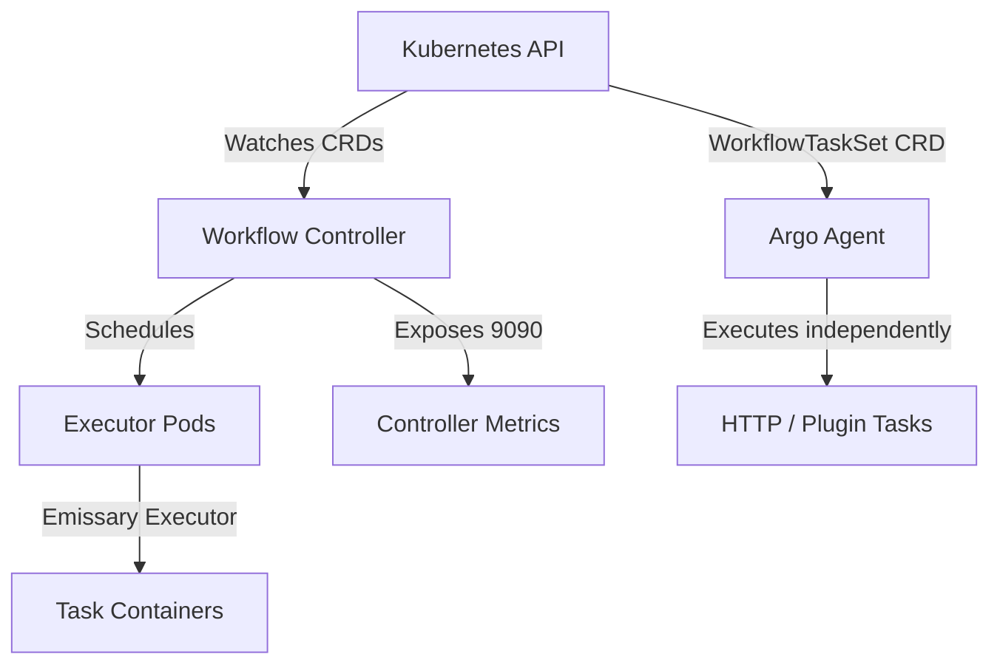
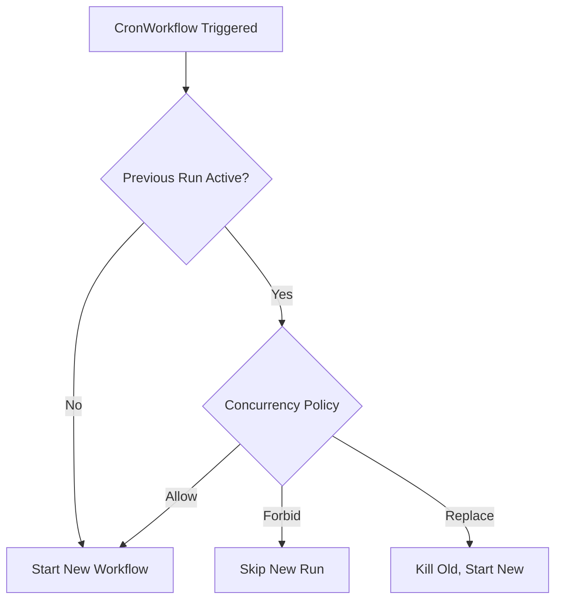
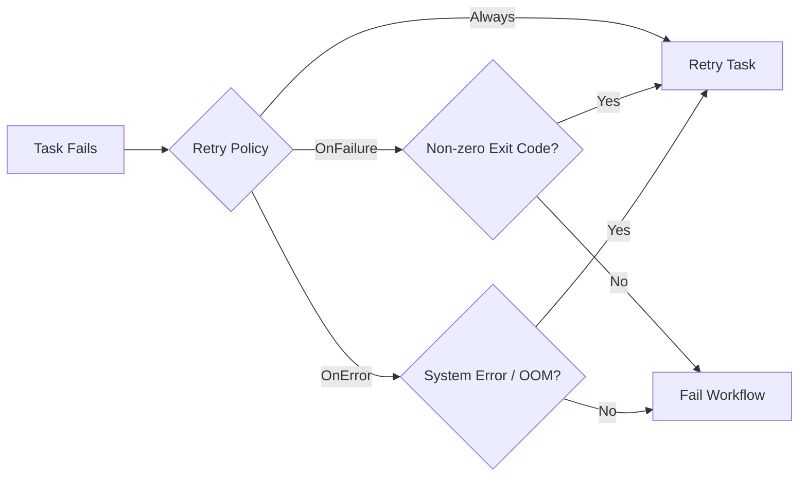

> **CAPA Track -- Domain 1 (36%)** | Complexity: `[COMPLEX]` | Time: 50-60 min

The platform team at a major global fintech company, responsible for clearing millions in daily transactions, had a systemic problem. Their nightly reconciliation workflow ran 14 steps sequentially, took over 3 hours to execute, and failed silently twice a week. Because there was no automated feedback loop, nobody knew about the failures until morning standup, which meant financial discrepancies impacted actual end users before engineers could intervene. 

After migrating their legacy pipeline to Argo Workflows using exit handlers for immediate Slack alerts, `CronWorkflows` for precise scheduling, memoization to dynamically skip unchanged steps, and lifecycle hooks for strict audit logging, the pipeline execution time shrank to a mere 40 minutes. Failures triggered immediate notifications with embedded logs, and transient infrastructure errors retried automatically without human intervention. The team went from dedicating 12 hours per week to pipeline babysitting down to zero.

This transformation is the power of advanced Argo Workflows. Once you move beyond basic linear pipelines, Argo provides a comprehensive, declarative toolkit for building self-healing, concurrency-safe, and highly optimized automation engines.

## Prerequisites

- [Module 3.3: Argo Workflows](/platform/toolkits/cicd-delivery/ci-cd-pipelines/module-3.3-argo-workflows/) -- Foundations: Container, Script, Steps, DAG, Artifacts.
- Kubernetes RBAC basics (ServiceAccounts, Roles, RoleBindings).
- Familiarity with standard Kubernetes CronJob scheduling syntax.

## What You'll Be Able to Do

After completing this exhaustive module, you will be able to:

1. **Design** advanced Argo Workflows leveraging all 9 template types, including `Resource` templates for direct API manipulation and `ContainerSet` for tightly-coupled execution.
2. **Implement** sophisticated dependency logic in Directed Acyclic Graphs (DAGs) using boolean expressions, fail-fast controls, and expression-based conditionals.
3. **Evaluate** and **configure** workflow resiliency through targeted retry strategies, lifecycle hooks, and comprehensive exit handlers.
4. **Deploy** concurrency-safe pipelines using `CronWorkflows` and database-backed synchronization primitives (mutexes and semaphores).
5. **Diagnose** common workflow failures by understanding the `emissary` executor architecture, Argo Agent tasks, and controller metrics.

## Why This Module Matters

The Certified Argo Project Associate (CAPA) exam dedicates a massive 36% of its weight to Domain 1, which covers Argo Workflows in extensive depth. While Module 3.3 taught the foundational concepts of running basic scripts and containers, the real world—and the exam—demands mastery of the complex features.

Enterprise pipelines do not operate in a vacuum. They must handle API rate limits, transient network failures, parallel job constraints, and strict security compliance. This module covers everything required to elevate a script into a robust platform product: remaining template types, scheduled workflows, reusable templates, exit handlers, synchronization, memoization, lifecycle hooks, variables, retry strategies, and security.

## Did You Know?

- **Hera is the official Python SDK:** The old `argo-workflows` PyPI package was officially removed in v4.0 because it failed to build reliably. The recommended replacement is **Hera**, which is maintained under the `argoproj-labs` GitHub organization.
- **Workflow Archival does NOT save logs:** When you enable workflow archival, completed workflow states are persisted to PostgreSQL (>=9.4) or MySQL (>=5.7.8), but pod execution logs are explicitly not archived. You must rely on standard Kubernetes log aggregation (like Promtail/Loki) for log retention.
- **CEL-based validation blocks bad manifests instantly:** Version 4.0.0 (released February 4, 2026) introduced comprehensive Common Expression Language (CEL) validation rules embedded directly into the CRDs, enforcing structural integrity at cluster admission time.
- **The singular `schedule` field is gone:** As of Argo Workflows v4.0, the singular `schedule` field for `CronWorkflows` was hard-removed. You must use the `schedules` field, which accepts a required non-empty list of cron strings.

## Section 1: Architecture & The Emissary Executor

Argo Workflows is an open-source, container-native workflow engine implemented as a Kubernetes CRD (Custom Resource Definition). It was accepted to the CNCF in 2020 and became a Graduated project on December 6, 2022. Because it runs natively on Kubernetes, every step in your workflow corresponds to a Pod (or a direct API call), leveraging native Kubernetes scheduling.



### The Executor Evolution
To run commands inside containers, Argo injects an "executor." Historically, Argo supported multiple executors (`docker`, `pns`, `k8sapi`, `kubelet`). However, **since Argo Workflows v3.4, `emissary` is the sole supported executor**, and the others were completely removed from the codebase. The `emissary` executor injects an initialization container that copies the `argoexec` binary into a shared volume, and overrides the main container's entrypoint to run the command safely.

> **Pause and predict**: If the controller metrics are exposed at port 9090 by default, how do you scrape them? 
> *Answer:* The metrics are exposed at `<host>:9090/metrics` via the `workflow-controller-metrics` service. However, a ServiceMonitor is not installed by default; you must add it separately for Prometheus to begin scraping.

## Section 2: The 9 Template Types

Argo Workflows officially supports **nine** template types. You already know `container`, `script`, `steps`, and `dag`. Let's explore the advanced five.

### 1. Resource Template
The Resource template performs CRUD operations on Kubernetes resources directly through the API server—no `kubectl` container or image pull is required.

```yaml
- name: create-configmap
  resource:
    action: create          # create | patch | apply | delete | get
    manifest: |
      apiVersion: v1
      kind: ConfigMap
      metadata:
        name: output-{{workflow.name}}
      data:
        result: "done"
    successCondition: "status.phase == Active"
    failureCondition: "status.phase == Failed"
```

### 2. Suspend Template
This template pauses execution until manually resumed or a specified duration elapses. It is the primary mechanism for building manual approval gates.

```yaml
- name: approval-gate
  suspend:
    duration: "0"     # Wait indefinitely until resumed
- name: timed-pause
  suspend:
    duration: "30m"   # Auto-resume after 30 minutes
```

### 3. HTTP Template
The HTTP template makes web requests without spinning up a container. Instead of creating a Pod, it uses the **Argo Agent** process, which communicates with the controller through a `WorkflowTaskSet` CRD created per running workflow.

```yaml
- name: call-webhook
  http:
    url: "https://httpbin.org/post"
    method: POST
    headers:
      - name: Authorization
        valueFrom:
          secretKeyRef: {name: api-creds, key: token}
    body: '{"workflow": "{{workflow.name}}", "status": "{{workflow.status}}"}'
    successCondition: "response.statusCode >= 200 && response.statusCode < 300"
```

### 4. ContainerSet Template
A `ContainerSet` template runs multiple containers in a single Pod. The workflow executor starts each container only after its declared dependencies complete. 

```yaml
- name: multi-container
  containerSet:
    volumeMounts:
      - name: workspace
        mountPath: /workspace
    containers:
      - name: clone
        image: alpine/git
        command: [sh, -c, "git clone https://github.com/argoproj/argo-workflows /workspace/repo"]
      - name: build
        image: golang:1.35.0
        command: [sh, -c, "cd /workspace/repo && go build ./..."]
        dependencies: [clone]
      - name: test
        image: golang:1.35.0
        command: [sh, -c, "cd /workspace/repo && go test ./..."]
        dependencies: [clone]
  volumes:
    - name: workspace
      emptyDir: {}
```
*Limitation:* While it offers DAG-style ordering within a single Pod, it **cannot** use enhanced boolean `depends` logic.

### 5. Plugin Template
Like HTTP templates, Plugin templates execute via the Argo Agent process. They allow you to extend Argo with custom executors. As of v4.0, artifact streaming for Plugin artifact drivers is fully supported, joining S3, Azure Blob, HTTP, Artifactory, and OSS.

## Section 3: Advanced DAGs and Conditionals

### Enhanced Dependency Logic
DAG tasks support a `depends` field for enhanced dependency logic with boolean expressions. Rather than simply waiting for a previous task to finish, you can branch based on the specific status of multiple predecessors.

```yaml
depends: "task-A.Succeeded || task-B.Failed"
```

### FailFast
By default, DAG templates have a `failFast` field that defaults to `true`. When one task fails, no new tasks are scheduled. Setting `failFast: false` allows all independent branches to run to completion even if one branch fails.

### Conditional Execution & Loops
The template-level `when` field enables conditional step execution using expression-based conditions.

```yaml
when: "{{tasks.check-data.outputs.result}} == true"
```

For fanning out workflows, you use loops. 
- `withItems` accepts a hardcoded YAML list for looping.
- `withParam` accepts a JSON string, typically passed dynamically by a prior step's output.

> **Stop and think**: If `withItems` fans out both the task and its dependencies, and `withParam` fans out only the current task, which one would you use for dynamically generated parallel builds?
> *Answer:* You must use `withParam` because the array of targets is only known at runtime as a JSON output from a previous step.

## Section 4: Scheduled Executions with CronWorkflows

`CronWorkflows` are a dedicated CRD that create `Workflow` objects on a schedule. They are entirely separate from Kubernetes `CronJobs`.

In v4.0, the singular `schedule` field was removed. The replacement `schedules` field is a required non-empty list, allowing complex multi-schedule definitions. Furthermore, the `timezone` field accepts an IANA timezone string (e.g., `America/New_York`) and defaults to the machine's local time, handling DST transitions automatically per IANA rules.

```yaml
apiVersion: argoproj.io/v1alpha1
kind: CronWorkflow
metadata:
  name: nightly-etl
spec:
  schedules: 
    - "0 2 * * *"                 # 2 AM daily
  timezone: "America/New_York"    # Default: local time
  startingDeadlineSeconds: 300    # Skip if missed by >5min
  concurrencyPolicy: Replace      # Kill previous if still running
  successfulJobsHistoryLimit: 3
  failedJobsHistoryLimit: 5
  workflowSpec:
    entrypoint: main
    templates:
      - name: main
        dag:
          tasks:
            - name: extract
              template: run-etl
            - name: load
              template: run-etl
              dependencies: [extract]
      - name: run-etl
        container:
          image: etl-runner:v1.35.0
          command: [python, run.py]
```

### Concurrency Policies



*Note:* `CronWorkflows` do not backfill missed runs. 

## Section 5: Reusability, Synchronization, and Variables

### WorkflowTemplates
To achieve DRY (Don't Repeat Yourself) pipelines, use `WorkflowTemplate` (namespace-scoped) and `ClusterWorkflowTemplate` (cluster-scoped).

```yaml
apiVersion: argoproj.io/v1alpha1
kind: Workflow
metadata:
  generateName: ci-run-
spec:
  workflowTemplateRef:
    name: build-test-deploy       # References a WorkflowTemplate
  # clusterScope: true            # Required if referencing a ClusterWorkflowTemplate
  arguments:
    parameters:
      - name: image-tag
        value: ghcr.io/org/app:v1.35.0
```

Referencing individual templates within a DAG requires the `templateRef` field:

```yaml
dag:
  tasks:
    - name: scan
      templateRef:
        name: org-standard-ci
        template: security-scan
        clusterScope: true
      arguments:
        parameters: [{name: image, value: "myapp:v1.35.0"}]
```

### Variables: Simple vs Expression Tags

Global workflow parameters set in `spec.arguments.parameters` are accessible throughout the workflow via `{{workflow.parameters.<name>}}`.

```yaml
variables:
  - "{{workflow.name}}"
  - "{{workflow.status}}"
  - "{{inputs.parameters.my-param}}"
  - "{{tasks.task-a.outputs.result}}"
```

Expression tags evaluate logic using `expr-lang`. Always quote them to avoid breaking the YAML parser!

```yaml
expressions:
  - "{{=workflow.status == 'Succeeded' ? 'PASS' : 'FAIL'}}"
  - "{{=asInt(inputs.parameters.replicas) + 1}}"
  - "{{=sprig.upper(workflow.name)}}"
```

### Synchronization & Mutexes

Synchronization controls concurrency. Since v4.0, the singular `mutex` and `semaphore` fields were removed in favor of plural `mutexes` and `semaphores`. While local mutexes require no configuration, local semaphores are backed by a ConfigMap. Since v4.0, database-backed multi-controller locks are also supported.

**Mutex (Exclusive Lock):**
```yaml
spec:
  synchronization:
    mutexes:
      - name: deploy-production
```

**Semaphore (Concurrent Limit):**
```yaml
# ConfigMap: data: { gpu-jobs: "3" }
spec:
  synchronization:
    semaphores:
      - configMapKeyRef:
          name: semaphore-config
          key: gpu-jobs
```

## Section 6: Resiliency, Retries, and Memoization

Failures happen. Argo provides several mechanisms to build self-healing pipelines.

### Retry Strategies
The `retryStrategy` supports `retryPolicy` values including `OnFailure` (default, retries on container failure), `OnError` (infrastructure errors), and `OnTransientError` (transient errors like timeouts). Expression-based control uses variables like `lastRetry.exitCode`.

Backoff is configured via `duration` (initial delay), `factor` (exponential multiplier), and `maxDuration` (cap).

```yaml
- name: call-api
  retryStrategy:
    limit: 5
    retryPolicy: OnError         
    backoff:
      duration: 10s              
      factor: 2                  
      maxDuration: 5m            
    affinity:
      nodeAntiAffinity: {}       # Retry on a different node
  container:
    image: curlimages/curl
    command: [curl, -f, "https://httpbin.org/status/200"]
```



### Memoization
Memoization caches step outputs in a ConfigMap. If inputs match an existing key, the step is skipped, returning the cached output.

```yaml
- name: expensive-step
  memoize:
    key: "{{inputs.parameters.dataset}}-{{inputs.parameters.version}}"
    maxAge: "24h"
    cache:
      configMap:
        name: memo-cache
  inputs:
    parameters: [{name: dataset}, {name: version}]
  container:
    image: processor:v1.35.0
    command: [python, process.py]
  outputs:
    parameters:
      - name: result
        valueFrom:
          path: /tmp/result.json
```
*Crucial Constraint:* ConfigMap values have a strict **1MB limit per entry**. Memoization only caches output parameters, not artifacts.

### Exit Handlers
Exit handlers are declared via `spec.onExit` or template-level `onExit`. They run at the end of the execution regardless of success or failure. The `{{workflow.status}}` variable is set to Succeeded, Failed, or Error.

```yaml
spec:
  entrypoint: main
  onExit: exit-handler
  templates:
    - name: main
      container:
        image: alpine:3.20
        command: [sh, -c, "echo 'working'"]
    - name: exit-handler
      steps:
        - - name: success-notify
            template: notify
            when: "{{workflow.status}} == Succeeded"
          - name: failure-notify
            template: alert
            when: "{{workflow.status}} != Succeeded"
```

### Lifecycle Hooks
Hooks execute actions when a template starts (`running`) or finishes (`exit`), independently of the main container logic.

```yaml
- name: deploy
  hooks:
    running:
      template: log-start
    exit:
      template: log-completion
      expression: "steps['deploy'].status == 'Failed'"  # Conditional hook
  container:
    image: bitnami/kubectl:1.35
    command: [kubectl, apply, -f, /manifests/]
```

### Artifacts and Garbage Collection
Argo Workflows supports artifact storage in S3-compatible stores (AWS S3, GCS, MinIO), Azure Blob, Artifactory, HTTP, and OSS. To prevent storage bloat, Artifact Garbage Collection (`artifactGC`) is available, supporting `OnWorkflowDeletion` and `OnWorkflowCompletion` strategies.

## Section 7: Operations and Upgrades

### Argo Server Auth Modes
The Argo Server supports three authentication modes:
- `client`: Uses the Kubernetes bearer token of the client (default since v3.0).
- `server`: Uses the server's service account.
- `sso`: Uses OIDC single sign-on.

### Security Contexts and RBAC
Always apply least privilege using workflow-level and template-level ServiceAccounts.

```yaml
spec:
  serviceAccountName: argo-deployer       # Workflow-level
  templates:
    - name: build-step
      serviceAccountName: argo-builder    # Template-level override
```

Lock down your containers with strict security contexts:
```yaml
- name: secure-step
  securityContext:
    runAsUser: 1000
    runAsNonRoot: true
  container:
    image: my-app:v1.35.0
    securityContext:
      allowPrivilegeEscalation: false
      readOnlyRootFilesystem: true
      capabilities:
        drop: [ALL]
```

### Upgrades and Versioning
The latest stable release is **v4.0.4 (released 2026-04-02)**. Argo Workflows maintains release branches for only the two most recent minor versions, shipping new minor versions approximately every 6 months. Furthermore, they only test two minor Kubernetes versions per release. 

When upgrading, use the `argo convert` command. Added in v4.0, this CLI tool automatically upgrades `Workflow`, `WorkflowTemplate`, `ClusterWorkflowTemplate`, and `CronWorkflow` manifests to the v4.0 syntax, handling renaming like `schedule` to `schedules`.

## Common Mistakes

| Mistake | Why It Hurts | Better Approach |
|---|---|---|
| `Always` retry for logic errors | Bad code retries forever | `OnError` for infra, `OnFailure` for self-healing bugs |
| Memoized outputs > 1MB | ConfigMap silently fails | Keep memoized outputs small; artifacts for large data |
| CronWorkflow without `startingDeadlineSeconds` | Missed runs vanish silently | Set deadline, monitor for skips |
| Single SA for all workflows | One compromise = full access | Least-privilege SA per workflow |
| Missing `clusterScope: true` in templateRef | ClusterWorkflowTemplate ref fails | Always set when referencing cluster-scoped |
| Exit handler uses artifacts | Artifacts may not be available | Pass data via parameters or external store |
| Mutex name collisions across teams | Unrelated workflows block each other | Namespace mutex names: `team-a/deploy-prod` |
| Unquoted expression tags | YAML parser breaks on `{{=...}}` | Always quote: `variables: ["{{=expr}}"]` |

## Quiz

### Question 1: What is the difference between a Resource template and a Container running kubectl?
<details><summary>Show Answer</summary>
The <code>resource</code> template is the more efficient choice for this scenario. A <code>container</code> template requires the cluster to pull an image, schedule a Pod, and execute a shell process, which consumes unnecessary compute and time. In contrast, a <code>resource</code> template interacts directly with the Kubernetes API server to perform CRUD operations without spinning up a Pod or pulling an image. Furthermore, the <code>resource</code> template provides native fields like <code>successCondition</code> to explicitly wait and verify the resource's state, making your pipeline faster and more reliable.
</details>

### Question 2: How do you configure a CronWorkflow for 3 AM UTC on weekdays that skips delayed runs?
<details><summary>Show Answer</summary>
You must configure the <code>spec</code> using the plural <code>schedules</code> field, as the singular <code>schedule</code> field was removed in v4.0. Set the schedule to <code>["0 3 * * 1-5"]</code> and the <code>timezone</code> to <code>UTC</code>. To handle the missed run scenario, set <code>startingDeadlineSeconds: 600</code>, which ensures the run is skipped if delayed by more than 10 minutes. Finally, to prevent stampedes or overlapping backups if a previous run is still active, you should set <code>concurrencyPolicy: Forbid</code>.
</details>

### Question 3: Why would memoizing a 50GB dataset directly in an output parameter fail?
<details><summary>Show Answer</summary>
This approach will fail because memoization caches the step's output parameters in a Kubernetes ConfigMap, which has a strict 1MB size limit per entry. It cannot be used to cache massive data payloads or artifacts directly. To resolve this, you must redesign the step to output the 50GB cleaned dataset as an Argo Artifact stored in an S3-compatible backend. You then configure memoization to cache only the storage path or a lightweight manifest of the artifact as an output parameter, allowing subsequent steps to retrieve the data from S3 without re-running the heavy computation.
</details>

### Question 4: Why are expression tags necessary for conditional logic in workflows?
<details><summary>Show Answer</summary>
Simple tags like <code>{{inputs.parameters.environment}}</code> only perform basic string substitution, replacing the tag with its value. Expression tags, denoted by the <code>{{=</code> prefix (e.g., <code>{{=inputs.parameters.environment == 'production'}}</code>), invoke the <code>expr-lang</code> engine to evaluate boolean logic, arithmetic, and string manipulation directly within the YAML. In this scenario, evaluating a condition requires boolean logic, so you must use an expression tag to resolve the comparison safely. Always remember to quote your expression tags in the manifest so the YAML parser does not misinterpret the curly braces as a dictionary definition.
</details>

### Question 5: How can you prevent workflow starvation when sharing a small pool of GPU nodes?
<details><summary>Show Answer</summary>
You must implement a synchronization semaphore backed by a Kubernetes ConfigMap. First, create a ConfigMap in the workflow's namespace with a key-value pair like <code>data: { gpu-limit: "4" }</code>. Then, in your workflow or workflow template specification, add a <code>synchronization.semaphores</code> block that references this ConfigMap and key. Argo Workflows will natively queue any workflows beyond the limit of 4, ensuring they wait for a "lock" to release before scheduling their Pods, completely preventing the cluster scheduler from being overwhelmed.
</details>

### Question 6: What is the overall impact if a workflow's exit handler step fails due to a network timeout?
<details><summary>Show Answer</summary>
If the exit handler fails, the entire workflow's final status will be marked as <code>Error</code>, potentially triggering false alarms and masking the fact that the primary business logic succeeded. Exit handlers must be designed with extreme resilience because their failure dictates the final state of the pipeline. To prevent this, you should configure a <code>retryStrategy</code> specifically on the exit handler's template to gracefully handle transient network errors (<code>OnError</code> or <code>OnTransientError</code>). Additionally, keep exit handler logic as minimal as possible, avoiding heavy container startups by using lightweight <code>http</code> templates where feasible.
</details>

### Question 7: Which version of a WorkflowTemplate runs if the template is modified mid-execution?
<details><summary>Show Answer</summary>
The running workflow will use the older image tag. When an Argo workflow is submitted, the controller resolves all referenced <code>WorkflowTemplates</code> at submission time and embeds their exact specifications into the live <code>Workflow</code> object. Consequently, any subsequent updates to the template in the cluster will only apply to new workflows submitted after the change. This design ensures that in-flight workflows remain deterministic and do not unexpectedly change behavior mid-execution.
</details>

### Question 8: How do you design a retry strategy that maximizes recovery from node-level issues?
<details><summary>Show Answer</summary>
You implement a <code>retryStrategy</code> block on the task's template. Set <code>limit: 3</code> and use <code>retryPolicy: OnError</code> to specifically target infrastructure or transient failures rather than application logic bugs. Under the <code>backoff</code> field, define <code>duration: 30s</code>, <code>factor: 2</code>, and <code>maxDuration: 5m</code> to enforce the exponential delay. Finally, use the <code>affinity.nodeAntiAffinity</code> configuration block within the retry strategy; Argo will automatically inject the necessary pod anti-affinity rules to ensure each retry is scheduled on a different node than the previous attempts.
</details>

### Question 9: Why use a ContainerSet instead of a DAG for tightly coupled build steps?
<details><summary>Show Answer</summary>
You would choose a <code>containerSet</code> because these three steps are tightly coupled and operate on the exact same files. A <code>containerSet</code> runs all the steps as separate containers within a single Kubernetes Pod, allowing them to share a local <code>emptyDir</code> volume for the workspace. This eliminates the need to upload and download heavy artifacts to S3 between steps, and drastically reduces the overhead of scheduling multiple Pods. However, the trade-off is that you cannot use enhanced boolean dependency logic, and the total resource request is the sum of all containers, which could make the Pod harder to schedule if it grows too large.
</details>

## Hands-On Exercise: Production-Ready Scheduled Pipeline

### Setup

```bash
kind create cluster --name capa-lab
kubectl create namespace argo
kubectl apply -n argo -f https://github.com/argoproj/argo-workflows/releases/download/v4.0.4/install.yaml
kubectl -n argo wait --for=condition=ready pod -l app=workflow-controller --timeout=120s
```

### Step 1: Create supporting ConfigMaps

```bash
kubectl apply -n argo -f - <<'EOF'
apiVersion: v1
kind: ConfigMap
metadata:
  name: deploy-semaphore
data:
  limit: "1"
---
apiVersion: v1
kind: ConfigMap
metadata:
  name: build-cache
data: {}
EOF
```

### Step 2: Create WorkflowTemplate and CronWorkflow

Create your `WorkflowTemplate`:
```yaml
# Save as build-step.yaml
apiVersion: argoproj.io/v1alpha1
kind: WorkflowTemplate
metadata:
  name: build-step
  namespace: argo
spec:
  templates:
    - name: build
      inputs:
        parameters: [{name: app-name}]
      memoize:
        key: "build-{{inputs.parameters.app-name}}"
        maxAge: "1h"
        cache:
          configMap: {name: build-cache}
      container:
        image: alpine:3.20
        command: [sh, -c]
        args: ["echo 'Building {{inputs.parameters.app-name}}' && sleep 3 && echo 'done' > /tmp/result.txt"]
      outputs:
        parameters:
          - name: build-id
            valueFrom: {path: /tmp/result.txt}
```

Create your scheduled pipeline:
```yaml
# Save as scheduled-pipeline.yaml
apiVersion: argoproj.io/v1alpha1
kind: CronWorkflow
metadata:
  name: scheduled-pipeline
  namespace: argo
spec:
  schedules:
    - "*/5 * * * *"
  startingDeadlineSeconds: 120
  concurrencyPolicy: Forbid
  workflowSpec:
    entrypoint: main
    onExit: cleanup
    synchronization:
      semaphores:
        - configMapKeyRef: {name: deploy-semaphore, key: limit}
    templates:
      - name: main
        dag:
          tasks:
            - name: build-app
              templateRef: {name: build-step, template: build}
              arguments:
                parameters: [{name: app-name, value: my-service}]
            - name: approval
              template: pause
              dependencies: [build-app]
            - name: deploy
              template: deploy-step
              dependencies: [approval]
      - name: pause
        suspend: {duration: "10s"}
      - name: deploy-step
        retryStrategy: {limit: 2, retryPolicy: OnError, backoff: {duration: 5s, factor: 2}}
        container:
          image: alpine:3.20
          command: [sh, -c, "echo 'Deploying...' && sleep 2 && echo 'Done'"]
      - name: cleanup
        container:
          image: alpine:3.20
          command: [sh, -c]
          args: ["echo 'Exit handler: {{workflow.name}} status={{workflow.status}}'"]
```

Apply and trigger:
```bash
kubectl apply -n argo -f build-step.yaml
kubectl apply -n argo -f scheduled-pipeline.yaml
# Manually trigger instead of waiting 5 min
argo submit -n argo --from cronwf/scheduled-pipeline --watch
# Run again to verify memoization (build step should be cached)
argo submit -n argo --from cronwf/scheduled-pipeline --watch
```

### Success Criteria

- [ ] CronWorkflow is accepted by the admission controller.
- [ ] WorkflowTemplate is dynamically referenced via `templateRef`.
- [ ] Memoization successfully caches the build on the second run.
- [ ] Suspend template pauses execution and auto-resumes after 10s.
- [ ] Exit handler correctly reports the final workflow status.
- [ ] Semaphore prevents concurrent runs of the exact same workflow phase.

### Cleanup

```bash
kind delete cluster --name capa-lab
```

## Next Module

Now that you have mastered workflow orchestration, resiliency, and synchronization, it's time to extend Argo beyond basic execution. In **[Module 1.2: Argo Events](/k8s/capa/module-1.2-argo-events/)**, we will dive into event-driven architecture, learning how to trigger these advanced workflows automatically based on webhook payloads, S3 bucket drops, and Kafka messages.

---

*"Advanced workflows are not about complexity for its own sake. They are about making failure visible, recovery automatic, and operations predictable."*