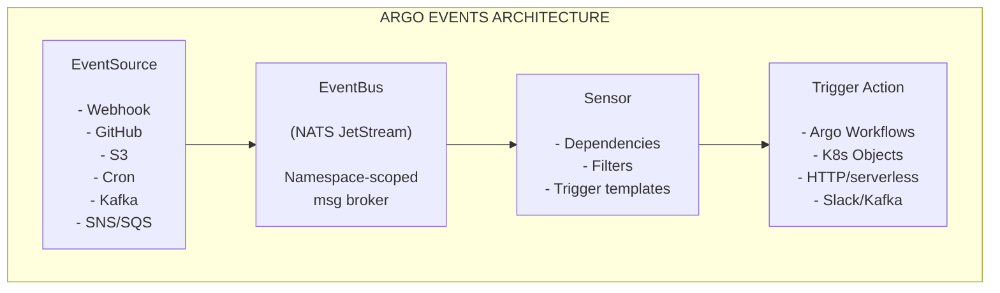

> **Complexity**: `[COMPLEX]` — Multiple interacting CRDs and integration patterns
>
> **Time to Complete**: 50-60 minutes
>
> **Prerequisites**: Module 1 (Argo Workflows basics), familiarity with Kubernetes CRDs
>
> **CAPA Domain**: 4 — Argo Events (12% of exam)

## What You'll Be Able to Do

After completing this highly detailed module, you will be able to:

1. **Design** comprehensive event-driven architectures using Argo Events' core Custom Resource Definitions: EventSource, Sensor, and EventBus.
2. **Configure** complex EventSources for webhooks, S3/MinIO, calendars, and Kafka, explicitly routing events through NATS or JetStream EventBus implementations.
3. **Implement** sophisticated Sensor triggers that evaluate AND/OR dependency logic to conditionally execute Argo Workflows, create Kubernetes objects, or dispatch HTTP requests.
4. **Evaluate** and **diagnose** event flow failures by systematically tracing events from their external origin through the EventSource status, into the EventBus metrics, and finally reviewing Sensor logs and Trigger outputs.

## Why This Module Matters

Consider a well-documented 2021 incident at a major global financial institution—a scenario often mirrored by massive enterprise deployments at companies like BlackRock or Intuit, who process millions of daily events. Before adopting a modern Event-Driven Architecture (EDA), their platform engineering team relied heavily on over 500 distinct polling scripts. These scripts consisted of legacy bash loops and Kubernetes CronJobs running every 60 seconds, constantly querying GitHub repositories, internal S3 buckets, and various external webhook providers just to check if a new file or code commit had arrived. 

The operational and financial impacts of this polling model were staggering. The company was aggressively burning through external API rate limits, which frequently caused legitimate, business-critical deployments to fail entirely. On one notorious Friday, a race condition in a custom GitHub poller caused it to incorrectly parse a Git SHA. This resulted in an unbounded continuous loop that triggered over 10,000 duplicate database migration workflows. This single incident saturated and locked up their entire production Kubernetes cluster, delayed external transaction processing by 6 hours, and cost the company an estimated $1.2 million in missed SLAs, SLA penalties, and engineering downtime. 

By migrating to Argo Events, the platform team replaced thousands of lines of fragile, imperative glue code with a clean, declarative, native nervous system for Kubernetes. Argo Events allowed them to entirely eliminate polling. Events now flow instantaneously into their cluster, decision logic is explicitly defined and version-controlled via YAML, and actions are triggered immediately. When you master Argo Events, you are learning how to build resilient, highly scalable automation that protects organizations from catastrophic polling failures, API bottlenecks, and fragile continuous integration loops.

## Did You Know?

- **Argo was accepted to CNCF on March 26, 2020** and moved to graduated maturity on December 6, 2022, proving it is a battle-tested and foundational cloud-native technology.
- **Argo Events supports 20+ event sources and 10+ triggers natively**, making it versatile enough to integrate with almost any enterprise toolchain out of the box without writing custom integration code.
- **The Argo Helm chart metadata** currently defines `version: 2.4.21` and `appVersion: 1.9.10` for argo-events, which is critical to verify when configuring automated deployments to ensure version drift does not occur.
- **Argo Events installation docs** historically outline a baseline requirement of Kubernetes >= v1.11 and kubectl > v1.11.0, though all modern production clusters must run Kubernetes v1.35 or higher to maintain strict security and ongoing vendor support.

---

## Part 1: Event-Driven Architecture (EDA) Fundamentals

### 1.1 Why Events?

There are two fundamental ways to detect that a state change has occurred in an external system: polling and event-driven reactions. 

| Approach | How It Works | Downside |
|----------|-------------|----------|
| **Polling** | Ask "did anything change?" on a timer | Wastes resources, delayed detection, API rate limits |
| **Reactive (events)** | Get notified the instant something changes | Requires event infrastructure |

Events drastically outperform polling because they are **immediate**, **efficient**, and completely **decoupled**. In an Event-Driven Architecture, the producer generating the event does not know or care who consumes it. Similarly, the consumer reacting to the event does not need to understand the internal mechanisms of the producer. Argo Events is precisely an event-driven workflow automation framework for Kubernetes that codifies this exact decoupling paradigm.

### 1.2 The CloudEvents Specification

To ensure compatibility across a vast, heterogeneous ecosystem, Argo Events relies heavily on the CloudEvents specification. CloudEvents is a CNCF graduated specification that provides a standardized envelope for any event data format.

Whenever an EventSource receives an external trigger, it converts that raw external input into a standardized CloudEvent and dispatches it through the EventBus. 

Here is what a standard CloudEvent payload looks like in practice:

```json
{
  "specversion": "1.0",
  "type": "com.github.push",
  "source": "https://github.com/myorg/myrepo",
  "id": "A234-1234-1234",
  "time": "2025-11-05T17:31:00Z",
  "datacontenttype": "application/json",
  "data": {
    "ref": "refs/heads/main",
    "commits": [{"message": "fix: update config"}]
  }
}
```

The key top-level fields (`specversion`, `type`, `source`, `id`, `time`) act as the universal routing header, while the nested `data` field contains the specific, domain-relevant payload that your pipelines care about.

> **Pause and predict**: If you wanted to extract the Git branch name from the event above to pass into a dynamic Argo Workflow parameter, what precise JSON path string would you define in your dependency mapping? (Consider this before we cover parameter injection in Part 8).

---

## Part 2: Argo Events Architecture

The comprehensive architecture of Argo Events is built entirely around four logical components, which are realized as native Kubernetes Custom Resource Definitions (CRDs). 

1. **EventSource**: The gateway. An EventSource definition converts external inputs into CloudEvents and dispatches them through EventBus. 
2. **EventBus**: The transport layer. The default EventBus is a namespaced Kubernetes custom resource requiring one per namespace for EventSources and Sensors to interact over.
3. **Sensor**: The intelligent routing brain. Sensors define event dependencies, subscribe to EventBus, and execute triggers when dependencies resolve.
4. **Trigger**: The action payload. Trigger resources executed by a Sensor include Argo Workflows, Kubernetes object creation, HTTP/serverless, NATS/Kafka messages, Slack, Azure Event Hubs, Custom triggers, and OpenWhisk.

### Architecture Diagram

To visualize the system, here is the architectural diagram mapping the journey from EventSource to Trigger Action. 



### 2.1 The Components in Detail

**EventSource**
The EventSource catalog currently includes AMQP, AWS SNS, AWS SQS, Azure Events Hub, Azure Queue Storage, Calendar, File, GCP PubSub, GitHub, GitLab, Kafka, NATS, Slack, Stripe, Webhooks, and other named connectors. EventSources sit at the edge of your cluster and listen for these specific external payloads.

**EventBus**
Argo Events supports three EventBus implementations (NATS, JetStream, and Kafka), with NATS Streaming (STAN) explicitly noted as deprecated. A NATS-backed EventBus is documented as supported via either NATS Streaming or JetStream, but modern deployments should always favor JetStream. The EventBus acts as the internal transport layer within a given namespace.

> **Stop and think**: If STAN is deprecated, what operational risks do you take by deploying it on a modern Kubernetes cluster? Consider the support lifecycle of both Argo Events and the underlying message broker.

**Sensor and Triggers**
Sensors define event dependencies, subscribe to the EventBus, and execute triggers when those dependencies resolve. Trigger resources executed by a Sensor include Argo Workflows, Kubernetes object creation, HTTP/serverless, NATS/Kafka messages, Slack, Azure Event Hubs, Custom triggers, and OpenWhisk.

---

## Part 3: Installation and Lifecycle Management

### 3.1 Installation Flow

The documented installation flow requires creating the `argo-events` namespace, applying the core installation manifests, and then creating the EventBus via the native example manifest.

```bash
# Note: Always execute these against a modern Kubernetes v1.35+ cluster
kubectl create namespace argo-events
kubectl apply -f https://raw.githubusercontent.com/argoproj/argo-events/stable/manifests/install.yaml
kubectl apply -f https://raw.githubusercontent.com/argoproj/argo-events/stable/examples/eventbus/native.yaml -n argo-events
```

### 3.2 Namespace Scoping and Architecture

For Argo Events v1.7 and above, namespace-scoped installs must use the `--namespaced` flag on the unified controller deployment, with an optional `--managed-namespace` flag if you want to watch a specific target namespace. Historically, pre-v1.7 setups required you to deploy three separate controllers with per-controller `--namespaced` flags, but the architecture is now effectively consolidated.

### 3.3 Versioning and Helm Considerations

When operating Argo Events in production, version drift can cause controller failures. The project's release policy requires matching image versions across all components: `eventsource`, `sensor`, `eventbus-controller`, `eventsource-controller`, `sensor-controller`, and `events-webhook`. 

Furthermore, the release policy strictly follows semantic versioning (x.y.z) with only the two most recent minor branches maintained. If you manage your deployments using Helm, be aware that the Argo Helm chart documentation explicitly states that only the latest upstream versions are officially supported; older versions are not guaranteed to receive bug or security patching.

---

## Part 4: Knowledge Check

**Quiz 1**
**Scenario:** You are tasked with migrating a legacy polling application to an event-driven architecture on a Kubernetes v1.35 cluster. You decide to use Argo Events. The application needs to process incoming webhooks from Stripe, filter the events based on the payload, and launch an Argo Workflow only if the payment is successful. Which combination of Argo Events Custom Resources will you need to deploy?
A) EventSource, Sensor, and Trigger
B) WebhookSource, EventBus, and WorkflowTrigger
C) EventSource, EventBus, and Sensor
D) EventBus, EventSource, and Trigger template

**Answer:** C
**Explanation:** To build a complete event-driven pipeline in Argo Events, you must deploy an EventSource, an EventBus, and a Sensor. The EventSource is responsible for receiving the external Stripe webhooks and converting them into standardized CloudEvents. The EventBus acts as the transport layer (often backed by JetStream) that routes these events within the namespace. Finally, the Sensor defines the dependency logic (e.g., filtering for successful payments) and contains the embedded Trigger template that actually launches the Argo Workflow.

**Quiz 2**
**Scenario:** Your platform engineering team is upgrading an older Kubernetes cluster to v1.35. During the upgrade, they notice that the Argo Events installation is using a NATS Streaming (STAN) EventBus. According to current Argo Events architecture guidelines, what action should the team take regarding the EventBus?
A) No action is needed; STAN is the recommended default for v1.35.
B) Migrate the EventBus from STAN to JetStream or Kafka, as STAN is deprecated.
C) Downgrade the cluster to Kubernetes v1.33 to maintain STAN compatibility.
D) Replace the EventBus with an EventSource configured for NATS.

**Answer:** B
**Explanation:** The team must migrate the EventBus to either JetStream or Kafka. Argo Events supports three EventBus implementations (NATS, JetStream, and Kafka), but explicitly notes that NATS Streaming (STAN) is deprecated. JetStream is the modern, supported NATS-backed implementation designed to replace STAN, offering better performance and reliability. Keeping a deprecated technology in a freshly upgraded cluster poses operational and support risks, particularly since Argo only maintains the two most recent minor release branches.

**Quiz 3**
**Scenario:** You are deploying Argo Events v1.9.10 to a locked-down enterprise cluster where administrators enforce strict namespace isolation. You need the Argo Events controllers to only watch and process resources within a specific tenant namespace (`tenant-a`), rather than at the cluster scope. How should you configure the installation?
A) Deploy three separate controllers and pass `--namespaced` to each.
B) Apply the standard cluster-wide manifests and use RBAC to restrict access.
C) Use the `--namespaced` flag on the controller, optionally along with `--managed-namespace`.
D) Install a dedicated EventBus in `tenant-a` and disable the controller.

**Answer:** C
**Explanation:** For Argo Events v1.7 and newer, namespace-scoped installations are handled by applying the `--namespaced` flag to the unified controller deployment. You can also specify `--managed-namespace` if the controller needs to watch a different specific namespace. Earlier versions (pre-v1.7) required deploying three separate controllers with individual flags, but the modern architecture consolidates this into a single deployment. Relying solely on cluster-wide manifests and RBAC (Option B) violates the requirement for strict controller-level namespace isolation, and an EventBus alone (Option D) cannot process resources without an active controller.