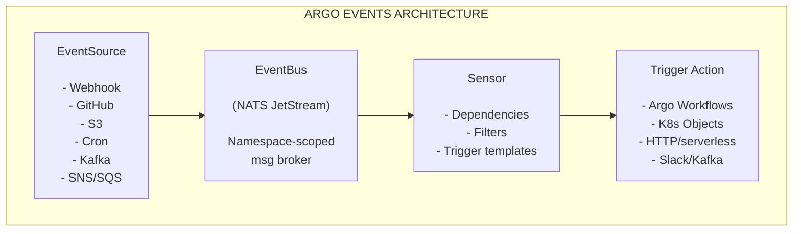

> **Complexity**: `[COMPLEX]` — Multiple interacting CRDs, RBAC dependencies, and cross-component debugging
>
> **Time to Complete**: 60-75 minutes
>
> **Prerequisites**: Module 1.1 (Argo Workflows basics), familiarity with Kubernetes CRDs, basic understanding of message brokers
>
> **CAPA Domain**: 4 — [Argo Events (12% of exam)](https://training.linuxfoundation.org/certification/certified-argo-project-associate-capa/)

## What You'll Be Able to Do

After completing this module, you will be able to design, configure, implement, diagnose, and evaluate Argo Events pipelines using the same primitives the CAPA exam tests — not merely recognize CRD names in isolation. The outcomes below map directly to hands-on exercises, quiz scenarios, and the diagnostic ladder in Part 6.

1. **Design** event-driven automation pipelines by selecting and connecting EventSource, EventBus, and Sensor CRDs appropriate for a given integration scenario.
2. **Configure** EventSources for webhooks, calendars, and message queues, routing events through a JetStream-backed EventBus.
3. **Implement** Sensors with conditional AND/OR dependency logic, data filters, and parameter injection that launch Argo Workflows based on specific event payloads.
4. **Diagnose** broken event pipelines by systematically tracing failures from EventSource status through EventBus transport to Sensor logs and Trigger audit output.
5. **Evaluate** the tradeoffs between Argo Events and alternative Kubernetes-native automation primitives like CronJobs, Kubernetes controllers, and admission webhooks.

Argo Events shines when external systems already emit notifications or when you must react immediately without polling. CronJobs remain appropriate for fixed schedules that do not depend on external state. Custom controllers fit when you need deep Kubernetes watch semantics across many resource types. Admission webhooks enforce policy at API admission time rather than orchestrating multi-step workflows. CAPA may contrast these options in scenario questions; your job is to match the integration shape to the tool, not to treat Argo Events as the answer to every automation problem.

## Why This Module Matters

In large enterprise environments, platform teams often accumulate many polling scripts and Kubernetes CronJobs that repeatedly check external systems for changes. Polling-based automation creates real operational problems — wasted API calls, delayed detection, and duplicate or runaway jobs when custom polling logic fails — because every consumer must implement its own schedule, retry policy, and deduplication against APIs that were never designed to be interrogated on a fixed interval.

By migrating to Argo Events, platform teams replace thousands of lines of fragile imperative glue code with a clean, declarative, version-controlled nervous system for Kubernetes. Events flow instantaneously into the cluster, decision logic is defined explicitly in YAML and enforced by controllers, and actions fire immediately when the right conditions are met rather than on the next poll tick. That shift matters for CAPA because the exam expects you to reason about *when* automation should react, not only which CRD fields exist.

Mastering Argo Events means learning to build resilient, scalable automation that eliminates polling failures, API bottlenecks, and fragile CI loops. This module builds that knowledge from the ground up — EventSource, EventBus, Sensor, and Trigger — then teaches you to diagnose the pipeline layer by layer when it breaks silently.

---

## Part 1: Event-Driven Architecture Fundamentals

### 1.1 Why Events Change the Architecture

There are two fundamental strategies for detecting that a state change has occurred in an external system: polling and event-driven reaction. Understanding why one outperforms the other is not just academic — it determines whether your automation scales to thousands of events per day or collapses under load.

| Approach | How It Works | Downside |
|----------|-------------|----------|
| **Polling** | Ask "did anything change?" on a timer | Wastes resources, delayed detection, API rate limits |
| **Reactive (events)** | Get notified the instant something changes | Requires event infrastructure |

The deeper architectural difference is about coupling. In a polling model, every consumer must know the address and API contract of every producer. The consumer owns the detection logic, the scheduling, the retry, and the deduplication. When the producer's API changes or enforces rate limits, every consumer breaks simultaneously.

In an event-driven model, the producer emits a notification without knowing who listens. The consumer subscribes to the notification channel without knowing who produces. Each side evolves independently. This is the decoupling that makes event-driven systems composable — you can add a new consumer without touching the producer, and retire an old one without reconfiguring anything else.

Argo Events codifies this decoupling as native Kubernetes objects. The coupling between external systems and your internal workflows is managed entirely through declarative YAML, not through custom scripts that live outside your GitOps lifecycle.

### 1.2 The CloudEvents Specification

To ensure compatibility across a heterogeneous ecosystem, Argo Events relies on the CloudEvents specification. [CloudEvents is a CNCF graduated specification that provides a standardized envelope for any event data, regardless of origin.](https://www.cncf.io/announcements/2024/01/25/cloud-native-computing-foundation-announces-the-graduation-of-cloudevents/) This matters because a GitHub push webhook looks completely different from an SNS notification, which looks completely different from a Kafka message. CloudEvents imposes a common structure on the envelope so that downstream consumers — your Sensors — can reason about events from any source using the same filtering and parameter extraction mechanisms.

Whenever an EventSource receives an external trigger, [it converts that raw external input into a standardized CloudEvent and dispatches it through the EventBus](https://argoproj.github.io/argo-events/concepts/event_source/). Here is what a standard CloudEvent payload looks like in practice:

```json
{
  "specversion": "1.0",
  "type": "com.github.push",
  "source": "https://github.com/myorg/myrepo",
  "id": "A234-1234-1234",
  "time": "2025-11-05T17:31:00Z",
  "datacontenttype": "application/json",
  "data": {
    "ref": "refs/heads/main",
    "after": "abc123def456",
    "commits": [{"message": "fix: update config"}]
  }
}
```

The top-level fields (`specversion`, `type`, `source`, `id`, `time`) act as the universal routing header. Your Sensor's filters can match against these fields using context filters when you need to distinguish repositories or event types without parsing nested JSON. The nested `data` field contains the domain-specific payload your pipelines care about — the Git branch, the commit SHA, the S3 bucket name — and data filters navigate inside that payload using path expressions such as `body.ref` for webhook EventSources. On the exam, expect questions that show a CloudEvent snippet and ask which filter type or path would select a subset of events, so practice reading the envelope separately from the payload before you write Sensor YAML.

> **Pause and predict**: If you want to extract the Git commit SHA from the event above (`data.after`) and pass it as a parameter to an Argo Workflow, you need a JSON path expression that navigates into the `data` object. What path string would you write in a Sensor parameter `src.dataKey`? Sketch your answer before reading Part 4, then verify it against the worked example.

---

## Part 2: Argo Events Architecture

The architecture of Argo Events is built around four logical components realized as native Kubernetes Custom Resource Definitions. Each component owns a specific responsibility, and events must pass through each layer in sequence — you cannot skip the EventBus and wire an EventSource directly to a Sensor, because the broker is what decouples producers from consumers and absorbs bursts when Sensors restart. Understanding the handoff between layers is what allows you to diagnose failures systematically on the CAPA exam and in production, where symptoms at the Workflow layer often originate two hops earlier at the broker.

1. **EventSource**: The gateway. An EventSource pod listens for a specific type of external input — a webhook call, a calendar tick, a Kafka message — and converts it into a CloudEvent dispatched to the EventBus.
2. **EventBus**: The transport layer. [A namespaced Kubernetes resource backed by a message broker (JetStream, NATS, or Kafka). A namespace conventionally uses a `default` EventBus, but multiple EventBuses per namespace are supported and selected via the `eventBusName` field on EventSource and Sensor. In the common single-bus case, that `default` EventBus must exist and reach `Running` before producers or consumers can communicate.](https://argoproj.github.io/argo-events/eventbus/eventbus/)
3. **Sensor**: The decision layer. A Sensor declares which events it cares about as named dependencies, defines filter conditions those events must satisfy, and specifies trigger templates to execute when all conditions resolve.
4. **Trigger**: The action payload embedded inside a Sensor template. [Trigger types include Argo Workflows, raw Kubernetes object creation, HTTP requests, NATS or Kafka messages, Slack notifications, Azure Event Hubs, and OpenWhisk actions.](https://argoproj.github.io/argo-events/concepts/trigger/)

### Architecture Diagram

The following diagram maps the full journey from an external event source through each Argo Events layer to the final action:


```mermaid
flowchart LR
    subgraph ARGO EVENTS ARCHITECTURE
        direction LR
        ES["EventSource<br/><br/>- Webhook<br/>- GitHub<br/>- S3<br/>- Cron<br/>- Kafka<br/>- SNS/SQS"]
        EB["EventBus<br/><br/>(NATS JetStream)<br/><br/>Namespace-scoped<br/>msg broker"]
        S["Sensor<br/><br/>- Dependencies<br/>- Filters<br/>- Trigger templates"]
        T["Trigger Action<br/><br/>- Argo Workflows<br/>- K8s Objects<br/>- HTTP/serverless<br/>- Slack/Kafka"]
        
        ES --> EB
        EB --> S
        S --> T
    end
```

### 2.1 EventSource in Depth

[The EventSource catalog includes over twenty named connectors: AMQP, AWS SNS, AWS SQS, Azure Events Hub, Azure Queue Storage, Calendar, File, GCP PubSub, GitHub, GitLab, Kafka, NATS, Slack, Stripe, Webhooks, and more. A single `EventSource` resource can configure multiple named event streams simultaneously.](https://argoproj.github.io/argo-events/eventsources/multiple-events/) A single resource named `ci-sources` could define a `github-push` webhook listener and a `release-timer` calendar entry in the same spec, each producing events independently through the same EventBus.

When the EventSource controller processes an EventSource resource, [it creates a dedicated pod for that EventSource](https://argoproj.github.io/argo-events/eventsources/ha/). That pod runs the actual listening logic — opening a port for webhooks, polling an S3 bucket for new objects, or subscribing to a Kafka partition. This pod-per-EventSource pattern isolates faults: a misbehaving webhook listener cannot destabilize a calendar EventSource running in a separate pod. From an operations perspective, that means your first diagnostic step for "webhooks stopped working" is almost always the EventSource pod logs and Service endpoints, not the Sensor or Workflow layer, because the EventSource is the only component that speaks the external protocol. CAPA questions often describe a healthy Sensor and missing Workflows when the real failure is that the EventSource never published to the bus.

Beyond webhooks, the same EventSource CRD configures other connectors with type-specific field blocks. A **Calendar** EventSource fires on a schedule without external input:

```yaml
spec:
  calendar:
    heartbeat:
      schedule: "*/5 * * * *"   # Every 5 minutes (cron syntax)
      # interval: "10s"         # Alternative: fixed interval instead of cron
```

A **Kafka** EventSource subscribes to a topic partition:

```yaml
spec:
  kafka:
    pipeline-events:
      url: "kafka-broker:9092"
      topic: "deployments"
      partition: "0"
      consumerGroup: "argo-events-sensor"
```

The event name keys (`heartbeat`, `pipeline-events`) become the `eventName` values Sensors reference in dependency declarations — the same naming contract as the webhook `push` example in Part 4.

### 2.2 EventBus in Depth

[Argo Events supports three EventBus implementations: NATS JetStream, NATS Streaming (STAN), and Kafka. NATS Streaming is explicitly deprecated — do not use it in new deployments.](https://argoproj.github.io/argo-events/eventbus/eventbus/) JetStream is the recommended default for new clusters because it offers persistent message storage, consumer acknowledgment, and replay semantics that STAN never provided.

An EventBus resource named `default` in a given namespace is what most EventSources and Sensors look for unless you configure a different name explicitly. This default-name assumption is a common source of confusion and is addressed in the Common Mistakes section. The EventBus controller provisions the underlying broker infrastructure automatically — when you create the EventBus resource, the controller creates the StatefulSets and Services for the JetStream cluster. Until that StatefulSet is ready, EventSources may log publish errors and Sensors may log subscription failures that look like application bugs but are actually transport startup ordering. Treat EventBus readiness as a hard gate in every environment, not as an optional performance optimization.

> **Stop and think**: STAN is deprecated. What operational risks does leaving it in place actually create — not just in theory, but in terms of what happens when you file a bug report against Argo Events, when a security CVE is published against the STAN broker, and when a newer Kubernetes version changes an API the STAN StatefulSet depends on? Consider all three before reading on.

### 2.3 Sensor and Dependency Resolution

A Sensor does not subscribe to an EventBus "topic" in the traditional sense. Instead, it declares named dependencies — each dependency points to a specific EventSource name and event name pair. The Sensor controller subscribes to the EventBus on behalf of the Sensor and holds received events in memory until the dependency resolution logic determines whether to fire a trigger. That in-memory staging is why a Sensor can apply filters per dependency before it decides the pipeline is ready: each dependency can carry its own `filters` block, and only when the configured boolean logic across dependencies is satisfied does the controller evaluate trigger templates.

The resolution logic supports both AND and OR semantics across dependencies. [By default, all listed dependencies must resolve (AND).](https://argoproj.github.io/argo-events/sensors/trigger-conditions/) You can use per-trigger `conditions` with boolean expressions such as `A || B` and `(A || B) && C` to model OR and more complex combinations. This allows patterns like "fire if either a GitHub push OR a manual webhook arrives" without requiring two separate Sensor resources.

---

## Part 3: Installation and Lifecycle Management

### 3.1 Installation Flow

The installation flow creates the `argo-events` namespace, applies the core manifests (controllers, RBAC, and CRDs), then creates the JetStream EventBus. Execute these against a supported Kubernetes cluster:

```bash
kubectl create namespace argo-events
kubectl apply -f https://raw.githubusercontent.com/argoproj/argo-events/stable/manifests/install.yaml
kubectl apply -f eventbus.yaml   # JetStream EventBus from Part 4 Step 1 — not legacy native.yaml
```

After applying these manifests, verify the controllers reach `Running` state before creating EventSources or Sensors. Creating a Sensor before the controller is ready leaves the Sensor stuck in a pending reconciliation state with no error message — a common confusion during initial setup. The same ordering discipline applies on exam questions about greenfield installs: EventBus before EventSource before Sensor, with RBAC for Workflow creation in place before you declare a Sensor that triggers Workflows. Skipping that ordering produces components that look healthy in isolation while the end-to-end path cannot function.

```bash
kubectl get deploy,po -n argo-events
# Expect: deployment/controller-manager Running (it reconciles EventSource, Sensor, and EventBus)
```

### 3.2 Namespace Scoping

[For Argo Events v1.7 and above, namespace-scoped installs use the `--namespaced` flag on the unified controller deployment, with an optional `--managed-namespace` flag to target a specific tenant namespace. Earlier architectures (pre-v1.7) required deploying three separate controllers with per-controller namespace flags.](https://argoproj.github.io/argo-events/managed-namespace/) The modern architecture consolidates this into a single deployment.

In a multi-tenant cluster where multiple teams each want isolated Argo Events namespaces, deploy one namespaced controller per tenant namespace. Each controller only watches and acts on resources within its designated namespace, preventing cross-tenant interference. When you study for CAPA, contrast this controller watch scope with RBAC alone: RBAC answers whether a ServiceAccount may create a Workflow, while namespaced controller flags answer which namespace's EventSource and Sensor objects are even visible to reconciliation loops.

### 3.3 RBAC for Sensors

[A Sensor that triggers Argo Workflows must have a ServiceAccount with permission to create Workflow resources in the target namespace.](https://argoproj.github.io/argo-events/service-accounts/) This requirement is frequently overlooked, and the resulting failures are silent — Sensor logs show a trigger attempt, then nothing. The Workflow never appears. Create the RBAC before creating the Sensor:

```yaml
apiVersion: v1
kind: ServiceAccount
metadata:
  name: operate-workflow-sa
  namespace: argo-events
---
apiVersion: rbac.authorization.k8s.io/v1
kind: Role
metadata:
  name: operate-workflow-role
  namespace: argo-events
rules:
  - apiGroups: ["argoproj.io"]
    resources: ["workflows"]
    verbs: ["create"]
---
apiVersion: rbac.authorization.k8s.io/v1
kind: RoleBinding
metadata:
  name: operate-workflow-rolebinding
  namespace: argo-events
roleRef:
  apiGroup: rbac.authorization.k8s.io
  kind: Role
  name: operate-workflow-role
subjects:
  - kind: ServiceAccount
    name: operate-workflow-sa
    namespace: argo-events
```

Reference this ServiceAccount in your Sensor's `spec.template.serviceAccountName`. Without it, the Sensor cannot create the Workflow resource and the Kubernetes API returns a `Forbidden` response.

### 3.4 Versioning and Version Drift

Version drift between Argo Events components causes subtle controller failures that are hard to diagnose. [The release policy requires matching image versions across all components: `eventsource-controller`, `sensor-controller`, `eventbus-controller`, and `events-webhook`. The project maintains only the two most recent minor branches — if your cluster runs an unsupported version, do not expect bug fixes or security patches.](https://argoproj.github.io/argo-events/releases/)

When using Helm, verify that the chart's `appVersion` matches your intended Argo Events release. Mismatches between chart version and appVersion are a common source of "it worked in staging" failures when different teams apply different chart versions. In exam questions, version drift often appears as subtle symptoms — a Sensor feature documented in the study guide but missing from your cluster — rather than as an explicit "wrong version" answer choice, so always correlate unexpected CRD behavior with the release notes for the version you actually installed.

---

## Part 4: Complete End-to-End Worked Example

This section builds a complete, working event pipeline from scratch. Read through the full scenario before applying any manifests — the sequence of decisions and the reasons behind each YAML field are as important as the fields themselves. By the end you will have verified that every layer from external HTTP call to running Argo Workflow functions correctly.

### The Scenario

Your platform team needs to automatically run integration tests every time a developer pushes to the `main` branch of the `acme/backend-service` repository. GitHub sends a push event to a webhook endpoint in your cluster. In production you would register that endpoint in the GitHub repository settings and protect it with a shared secret; for learning and CAPA-style reasoning, simulating the same JSON with `curl` through a port-forward exercises the identical EventSource → EventBus → Sensor path without external dependencies. The pipeline must:

1. Receive the push event via a webhook EventSource
2. Filter for pushes to `refs/heads/main` only — ignore all feature branches
3. Extract the commit SHA from the event payload
4. Launch an Argo Workflow with that commit SHA as a runtime parameter

This is a representative CI automation pattern. Once you understand every field here, you can adapt the pattern to S3 uploads, Kafka messages, calendar triggers, or any other EventSource type.

### Step 1: Create the EventBus

Before any EventSource or Sensor can function, the EventBus must exist in the target namespace. This is analogous to starting the message broker before connecting producers or consumers — the ordering is not optional. The name `default` is significant: EventSources and Sensors look for an EventBus named `default` unless you explicitly configure a different name in their specs.

```yaml
apiVersion: argoproj.io/v1alpha1
kind: EventBus
metadata:
  name: default
  namespace: argo-events
spec:
  jetstream:
    version: "2.10.11"
    replicas: 3
```

The `replicas: 3` gives you a JetStream cluster with quorum-based availability, whereas a single-replica EventBus loses all in-flight events if its pod is evicted or rescheduled. In a development environment `replicas: 1` is acceptable, but understand that tradeoff explicitly rather than inheriting it from a copied example. Apply the manifest below and wait for the EventBus to reach `Running` phase before creating any EventSource or Sensor, because both components assume a live broker endpoint in the same namespace:

```bash
kubectl apply -f eventbus.yaml
kubectl get eventbus default -n argo-events -w
# Wait until STATUS column shows "running"
```

### Step 2: Create the EventSource

The EventSource defines a webhook listener. When GitHub POSTs to `/push`, the EventSource pod receives the HTTP request, wraps the body in a CloudEvent, and publishes it to the EventBus under the event name `push`. That event name is the identifier your Sensor will reference in its dependency declaration.

```yaml
apiVersion: argoproj.io/v1alpha1
kind: EventSource
metadata:
  name: github-eventsource
  namespace: argo-events
spec:
  service:
    ports:
      - port: 12000
        targetPort: 12000
  webhook:
    push:
      port: "12000"
      endpoint: /push
      method: POST
```

Two fields here are responsible for the majority of beginner wiring mistakes. First, the `service` stanza instructs the EventSource controller to create a Kubernetes Service alongside the EventSource pod. [Without this stanza, no Service is created.](https://argoproj.github.io/argo-events/eventsources/services/) Port-forward works fine without it because port-forward targets the pod directly, but an Ingress backend or external traffic has no path in. Second, [the name `push` inside the `webhook` block becomes the `eventName` that Sensors reference in their dependency declarations. This string must match exactly](https://argoproj.github.io/argo-events/eventsources/naming/) — a single character difference means the Sensor subscribes to an event that never arrives. After you apply the manifest, verify the EventSource resource, its listening pod, and the backing Service all exist; the Service name follows the pattern `<eventsource-name>-eventsource-svc`, which you will need for port-forward and for any Ingress backend you configure later:

```bash
kubectl get eventsource github-eventsource -n argo-events
kubectl get pod -l eventsource-name=github-eventsource -n argo-events
kubectl get svc -n argo-events | grep eventsource
```

### Step 3: Create the Sensor

The Sensor declares one dependency named `push-dep` that points to the `github-eventsource` EventSource and the `push` event. A data filter checks the `body.ref` field, restricting the pipeline to `main`-branch pushes. The trigger template defines the Argo Workflow to create, and the parameter binding copies the commit SHA from `body.after` into the Workflow's `commit-sha` argument.

```yaml
apiVersion: argoproj.io/v1alpha1
kind: Sensor
metadata:
  name: github-sensor
  namespace: argo-events
spec:
  template:
    serviceAccountName: operate-workflow-sa
  dependencies:
    - name: push-dep
      eventSourceName: github-eventsource
      eventName: push
      filters:
        data:
          - path: body.ref
            type: string
            value:
              - refs/heads/main
  triggers:
    - template:
        name: trigger-ci-workflow
        argoWorkflow:
          operation: submit
          source:
            resource:
              apiVersion: argoproj.io/v1alpha1
              kind: Workflow
              metadata:
                generateName: ci-build-
                namespace: argo-events
              spec:
                entrypoint: run-tests
                arguments:
                  parameters:
                    - name: commit-sha
                      value: placeholder
                templates:
                  - name: run-tests
                    inputs:
                      parameters:
                        - name: commit-sha
                    container:
                      image: alpine:3.18
                      command: [sh, -c]
                      args:
                        - |
                          echo "Running tests for commit {{inputs.parameters.commit-sha}}"
                          sleep 5
                          echo "Tests passed"
          parameters:
            - src:
                dependencyName: push-dep
                dataKey: body.after
              dest: spec.arguments.parameters.0.value
```

Several structural decisions in this Sensor YAML deserve explicit attention before you move on, because misconfigured filters and parameter destinations produce pipelines that appear healthy while never launching the Workflow you expect.

**`filters.data` path notation**: The path `body.ref` navigates the webhook HTTP request body that the EventSource wraps inside the CloudEvent's `data` field. In the raw CloudEvent structure it would appear as `data.body.ref`, but [Argo Events data filters implicitly navigate within `data`, so the prefix is just `body`.](https://argoproj.github.io/argo-events/sensors/filters/data/) When working with non-webhook EventSources (Kafka, SNS), the path structure differs — always inspect a raw event from your EventSource before writing filters.

**`parameters` index zero**: The parameter binding sets `spec.arguments.parameters.0.value`, where `0` is the zero-based index into the Workflow's `arguments.parameters` array. If you inject multiple parameters, add multiple entries to the `parameters` list, each with a different destination index. Injecting into the wrong index silently uses the `placeholder` string from the template.

**`generateName` vs `name`**: [Using `generateName` means each triggered Workflow gets a unique name like `ci-build-k29xr`. A fixed `name` causes the second trigger attempt to fail with an `AlreadyExists` conflict](https://kubernetes.io/docs/concepts/overview/working-with-objects/names), making your pipeline appear to fire only once. Always use `generateName` for dynamically triggered Workflows.

### Step 4: Test the Pipeline End-to-End

To test without configuring a real GitHub webhook, port-forward the EventSource Service so your workstation can reach the listener, then simulate a main-branch push with `curl` using the same JSON shape GitHub would send:

```bash
kubectl port-forward svc/github-eventsource-eventsource-svc 12000:12000 -n argo-events &

curl -X POST http://localhost:12000/push \
  -H "Content-Type: application/json" \
  -d '{
    "ref": "refs/heads/main",
    "after": "abc123def456789",
    "commits": [{"message": "fix: update config"}]
  }'

kubectl get workflows -n argo-events -w
```

A Workflow named like `ci-build-k29xr` should appear and reach `Running` state within a few seconds. Confirm the commit SHA parameter was injected correctly with `kubectl get workflow -n argo-events -o jsonpath='{.items[0].spec.arguments.parameters[0].value}'` — you should see `abc123def456789`. If nothing appears after 15 seconds, do not restart components at random; proceed to Part 6 and walk the diagnostic ladder from EventSource receipt through EventBus publish to Sensor filter evaluation.

### What Just Happened: Tracing the Full Event Flow

Stepping through the pipeline in sequence builds the mental model you need to debug it later, because each hop corresponds to a distinct layer in Part 6's diagnostic ladder. First, `curl` POSTed JSON to the EventSource pod on port 12000 at the `/push` endpoint. The EventSource pod wrapped that body in a CloudEvent and published it to the JetStream EventBus on the subject bound to the `push` event name. The Sensor's subscriber goroutine received the message, evaluated the `filters.data` condition against `body.ref`, and because `refs/heads/main` matched, dependency `push-dep` resolved. With all dependencies resolved, the Sensor instantiated the trigger template, applied parameter substitution to replace `placeholder` with `abc123def456789` from `body.after`, and its ServiceAccount called the Kubernetes API to create the Workflow resource that the Argo Workflows controller then scheduled. Each of these steps is independently observable in logs or `kubectl` output, which is the architectural property that makes systematic debugging tractable instead of guessing which component failed.

---

## Part 5: Sensor Dependency Logic and Filters

### 5.1 AND vs. OR Dependency Resolution

The default behavior in Argo Events is AND resolution: every dependency listed in the Sensor must resolve before any trigger fires. This is appropriate for precondition enforcement — "only run the deployment workflow when BOTH the test result event AND the security scan event have arrived and passed." AND semantics are the safe default because they prevent partial pipelines from acting on incomplete signal, which is why many exam scenarios describe a Sensor that never fires until a second dependency that never arrives is satisfied.

For OR semantics, write a boolean `conditions` expression on the trigger template referencing dependency names directly — for example `conditions: "github-push || manual-trigger"`. Omit `conditions` entirely when all dependencies must resolve (AND-of-all). Multiple triggers in one Sensor can each carry a different `conditions` expression to route different events to different Workflows. The following example fires the trigger when either a GitHub push or a manual webhook arrives:

```yaml
spec:
  dependencies:
    - name: github-push
      eventSourceName: github-eventsource
      eventName: push
    - name: manual-trigger
      eventSourceName: webhook-eventsource
      eventName: manual
  triggers:
    - template:
        conditions: "github-push || manual-trigger"
        name: deploy-trigger
        argoWorkflow:
          operation: submit
          source:
            resource:
              apiVersion: argoproj.io/v1alpha1
              kind: Workflow
              metadata:
                generateName: deploy-
              spec:
                entrypoint: main
                templates:
                  - name: main
                    container:
                      image: alpine:3.18
                      command: [echo, deployed]
```

Each trigger template's `conditions` field determines which dependency resolution pattern fires that specific trigger. This allows a single Sensor to contain multiple triggers that each fire under different boolean logic — a useful pattern for routing events to different Workflows based on which dependencies resolved. When you read CAPA scenarios about "manual approval OR automated push," map "manual" and "push" to separate dependencies and express the OR in per-trigger `conditions` rather than duplicating entire Sensors that differ only in which Workflow template they launch.

### 5.2 Filter Types

Argo Events supports several filter types. The ones used most often in practice are data, time, context, and expression filters:

**Data filters** match against specific fields in the event payload using JSON path expressions. The `type` field must be `string`, `number`, or `bool`, and the filter performs an equality check against the `value` list. Multiple values in the list are combined with OR logic — the event passes if the field matches any listed value. Data filters are the most commonly used and should be your first choice when a field equality check suffices, because their pass/fail reasons show up clearly in Sensor logs with the observed value attached. When a CAPA item describes "only main branch deployments," translate that requirement into a `filters.data` entry on the dependency that owns the Git push event, not into a second Sensor, unless the routing logic genuinely diverges at the trigger template level.

**Time filters** restrict event processing to specific windows within a 24-hour period, using `HH:MM:SS` start and stop times with an optional timezone. This is useful for "only process events during business hours" patterns or for limiting high-frequency event sources to maintenance windows when downstream workflows are permitted to run.

**Context filters** match against CloudEvents envelope fields like `source`, `type`, or `subject` — the fields outside the `data` block. If multiple repositories send events to the same endpoint, inspect repository-specific fields in the event payload and use data or expression filters to route them.

**Expression filters** use the `expr` library syntax to write arbitrary boolean expressions against event fields. This is the most flexible option but also the hardest to read and debug — prefer data filters when a simple equality check or list match is sufficient.

> **Stop and think**: Your Sensor is receiving events from two different GitHub repositories, both pushing to `refs/heads/main`. You want Workflow A to fire for `myorg/service-alpha` and Workflow B for `myorg/service-beta`. Without writing YAML yet, sketch the combination of filter type, dependency names, and trigger conditions you would use. Consider whether you need one Sensor or two. Then compare your approach against the architecture described in Quiz Question 8.

### 5.3 Parameter Injection in Depth

Parameter injection transforms a generic event into a Workflow with meaningful, event-specific inputs. The `parameters` list in a trigger template defines mappings, each with a `src` (extraction source) and a `dest` (injection target). Think of the embedded Workflow manifest inside the trigger as a stencil: you declare placeholder values in the template, and Argo Events overwrites specific JSON paths in that stencil immediately before the create call reaches the Kubernetes API. When injection fails, the stencil is still applied — which is why a misconfigured `dataKey` produces a running Workflow with the literal string `placeholder` rather than failing early at the Sensor.

The `src` block supports several extraction strategies. `dataKey` takes a JSON path into the CloudEvent's `data` field — use this for payload fields like commit SHAs, file names, or user IDs. `dataTemplate` takes a Go template expression evaluated against the entire CloudEvent — use this when you need to transform or combine fields rather than extract a single value. `contextKey` navigates the CloudEvent envelope rather than the data payload — use this for envelope metadata like `type` or `source`. `value` injects a static string regardless of event content — use this for constants like environment names or cluster identifiers.

The `dest` field is a JSON path into the trigger resource's spec. For Argo Workflow triggers, the path must start with `spec.` and navigate the Workflow spec structure. The pattern `spec.arguments.parameters.0.value` sets the first entry in the Workflow's top-level `arguments.parameters` array. Template parameter injection (inside `templates[].inputs.parameters`) is handled by the Workflow itself via `{{inputs.parameters.name}}` references — you do not inject there from Argo Events.

---

## Part 6: Diagnosing Event Flow Failures

Event pipelines fail silently more often than they fail loudly. An EventSource can return HTTP 200 to an incoming webhook while the event never reaches the Sensor, because HTTP success only proves the listener received bytes — not that JetStream accepted a publish. A Sensor can log "trigger executed" while the Workflow never appears, because that log line records the attempt to call the Kubernetes API, not the API server's admission decision. Effective diagnosis therefore requires knowing what each component observes and what its silence means, and it requires resisting the urge to restart pods until you have evidence about which layer dropped the event.

Compared with debugging a single CronJob or Deployment, Argo Events adds a message bus between producer and consumer, which is the price of decoupling. The benefit is that you can inspect each hop independently: EventSource logs for ingress, EventBus status for transport health, Sensor logs for filter and trigger decisions, and namespace events for RBAC denials. The sections below turn that mental model into concrete commands.

### 6.1 The Diagnostic Ladder

When events are not flowing as expected, work down this ladder from source to action. Each layer isolates a different component's responsibility:

```
Layer 1: Did the event reach the EventSource pod?
    └── EventSource pod logs for HTTP request receipt and dispatch attempts

Layer 2: Did the EventSource publish to the EventBus?
    └── EventSource logs for "Dispatching event" or broker publish errors
    └── EventBus pod health and StatefulSet readiness

Layer 3: Did the Sensor receive the event from the EventBus?
    └── Sensor pod logs for dependency receipt traces

Layer 4: Did the filter evaluate and pass?
    └── Sensor pod logs for filter evaluation results (PASSED or FAILED with reason)

Layer 5: Did the trigger execute?
    └── Sensor pod logs for "trigger executed" and downstream API call results

Layer 6: Was the Workflow created successfully?
    └── kubectl get workflows and kubectl get events for Forbidden entries
```

Never skip layers. A failure at layer 2 will look the same as a filter failure at layer 4 if you only check the final output at layer 6.

### 6.2 Diagnostic Commands by Layer

Use the commands below at each layer of the ladder. Start with EventSource status and Kubernetes events, then inspect EventSource pod logs for HTTP receipt and broker publish lines, then Sensor logs for dependency and filter traces, and finally Workflow objects plus namespace events when triggers appear to fire but no Workflow is created:

```bash
kubectl describe eventsource github-eventsource -n argo-events
# Look for: status.conditions with type "Ready" = True
# Look for: events section with controller reconciliation errors

kubectl logs -l eventsource-name=github-eventsource -n argo-events --tail=50
# Look for: lines showing "Dispatching event" after your HTTP call
# A missing dispatch line means the HTTP request never reached the pod

kubectl logs -l sensor-name=github-sensor -n argo-events --tail=50
# Look for: dependency resolution trace messages
# Look for: filter evaluation results with PASSED or FAILED and the reason
# Look for: trigger execution attempts and their outcomes

kubectl get workflows -n argo-events
kubectl get events -n argo-events --sort-by='.lastTimestamp' | tail -20
# RBAC failures appear as Warning events with "Forbidden" in the message
```

### 6.3 Common Failure Signatures and Their Meaning

**Symptom: EventSource pod is Running but nothing appears in Sensor logs** — This almost always means the EventBus is unreachable. Both the EventSource and Sensor pods can start and appear healthy in their own status conditions while having no working connection to the message broker. Verify that an EventBus named `default` exists in the same namespace and has reached `Running` phase: `kubectl get eventbus -n argo-events`. A missing or failed EventBus is silent at the component level but fatal to the pipeline.

**Symptom: Sensor logs show "trigger executed" but no Workflow appears** — This is a trigger execution failure after the Sensor successfully decided to fire. The most common cause is an RBAC misconfiguration — the Sensor's ServiceAccount lacks `create` permission on `argoproj.io/workflows`. The Kubernetes API returns a `Forbidden` response, which appears in `kubectl get events` but not in Sensor logs. Fix the Role and RoleBinding, then resend a test event.

**Symptom: Some events trigger the Workflow, others do not** — The filter condition is passing for some events and failing for others. This is expected behavior if the filter is correct. If unexpected events are being dropped, check Sensor logs immediately after a push that should have triggered. The filter evaluation trace shows the actual field value observed versus the expected value. A common mistake is writing `body.ref` when the actual JSON path for the specific EventSource type places the field at a different location.

**Symptom: Workflow is created but runs with placeholder values instead of real commit SHAs** — The parameter injection path is incorrect. The `dataKey` expression does not resolve to a populated field in the event payload. Add a debug HTTP trigger to the Sensor that sends the raw event body to a `requestbin`-style endpoint or an in-cluster debug service. Inspect the actual JSON structure, confirm the correct path, and update the `dataKey` value.

> **Active learning**: You receive a report: "The CI workflow fires for every push, including feature branches. I thought the filter was supposed to restrict it to main." Before checking the YAML, name three distinct places in the pipeline where this misconfiguration could originate, and describe the specific kubectl command you would run at each layer to confirm or rule out each cause. Write your answer before reading the Common Mistakes table below.

---

## Did You Know?

- [**Argo was accepted to the CNCF on March 26, 2020** and graduated on December 6, 2022](https://www.cncf.io/projects/argo/), marking a major maturity milestone for the project.
- [**Argo Events supports over 20 native event sources and 10 trigger types**](https://github.com/argoproj/argo-events), covering the majority of enterprise integration patterns without requiring custom connector code — from AWS SNS and GCP PubSub to Stripe and Azure Event Hubs.
- **The JetStream EventBus provides message persistence with acknowledgment semantics**, meaning events are not lost if the Sensor pod is temporarily unavailable during a rolling restart — JetStream holds unacknowledged messages until a consumer reconnects and acknowledges delivery.
- **Argo Events provides a validating admission webhook** for resource validation ([see the upstream install manifests](https://github.com/argoproj/argo-events/tree/stable/manifests)), so the webhook infrastructure must be reachable from the API server if you install it.

---

## Common Mistakes

| Mistake | Symptom | Fix |
|---------|---------|-----|
| **No EventBus in the target namespace** | EventSource and Sensor pods start normally but no events flow between them; Sensor logs show broker connection refused | Create an `EventBus` resource named `default` in the same namespace as your EventSource and Sensor before deploying either |
| **EventSource event name and Sensor dependency event name mismatch** | Sensor logs show no dependency resolution; EventSource appears healthy and publishes events | Compare the string key inside the EventSource webhook block (`push:`) exactly against the `eventName` field in the Sensor dependency — one character difference breaks the subscription |
| **Missing `spec.service` stanza in webhook EventSource** | EventSource pod runs; local `curl` via port-forward succeeds; Ingress or external traffic fails with connection refused | Add `spec.service.ports` to the EventSource so the controller creates a backing Kubernetes Service |
| **Sensor ServiceAccount lacks Workflow create permission** | Sensor logs show trigger execution; no Workflow appears; `kubectl get events` shows Forbidden warning | Create a Role granting `create` on `argoproj.io/workflows`, bind it to the Sensor's ServiceAccount, and reference the ServiceAccount in `spec.template.serviceAccountName` |
| **Using fixed `metadata.name` instead of `generateName` in the embedded Workflow** | Pipeline fires correctly the first time; second trigger fails with AlreadyExists; appears to work only once | Use `metadata.generateName` in the Workflow template inside the trigger source so each execution creates a uniquely named Workflow object |
| **Incorrect `dataKey` path for parameter injection** | Workflow is created and runs but uses the literal string `placeholder` for all parameters | Log the raw event payload using a debug HTTP trigger, confirm the actual JSON path, and update the `dataKey` field — remember that webhook EventSources nest the request body under `body` |
| **Deploying NATS Streaming (STAN) instead of JetStream** | Broker functions initially; no security patches applied; eventual incompatibility with newer Kubernetes or Argo Events releases | Migrate the EventBus spec to `jetstream`, verify the JetStream StatefulSet reaches Ready, and confirm EventSources and Sensors reconnect before decommissioning STAN |
| **EventSource and Sensor in different namespaces without explicit cross-namespace wiring** | Events published by the EventSource never reach the Sensor; neither component shows an error in its own status | Place both resources in the same namespace, or consult the Argo Events cross-namespace event routing documentation for your version if cross-namespace is architecturally required |

---

## Quiz

### Question 1: Your team is migrating a legacy system that polls GitHub every 60 seconds for new push events. You deploy a webhook EventSource with a data filter on `body.ref` matching `refs/heads/main` only. A developer pushes to `feature/dark-mode`, waits, then pushes to `main`. Describe exactly which events trigger the downstream Argo Workflow, which do not, and explain what the Sensor logs would show at each evaluation.

<details>
<summary>Answer</summary>

Only the push to `main` triggers the Workflow. When the push to `feature/dark-mode` arrives, the Sensor evaluates the data filter against `body.ref`. The value `refs/heads/feature/dark-mode` does not match the filter value `refs/heads/main`, so the dependency does not resolve. The Sensor logs will show a filter evaluation entry with a result indicating the filter failed, including the observed value. No trigger is attempted.

When the push to `main` arrives, the filter evaluates `body.ref: refs/heads/main` against the configured value, finds a match, and the dependency resolves. The Sensor logs will show a filter passed entry, then a trigger execution entry, and the Workflow will appear in `kubectl get workflows` within seconds.

The polling system the team is replacing would have processed both pushes identically — filter logic lived in custom application code, not in infrastructure. Moving the filter into the Sensor makes the intent version-controlled and auditable.

</details>

---

### Question 2: You deploy Argo Events to a new namespace called `team-alpha`. You create an EventSource and a Sensor. Both pods reach `Running` state. You send a webhook request that returns HTTP 200. No Workflow is created. You check Sensor logs and see no dependency resolution entries at all — not even a failed filter. What is the most likely cause, and what is the specific kubectl command sequence that confirms it?

<details>
<summary>Answer</summary>

The most likely cause is a missing EventBus in the `team-alpha` namespace. Both the EventSource and Sensor pods can start and pass their own health checks while having no working connection to a message broker. HTTP 200 from the EventSource confirms the pod received the request, but it does not confirm the event was published to the EventBus. Without the EventBus, the publish silently fails or is dropped.

Confirm with: `kubectl get eventbus -n team-alpha`

If no EventBus exists, create one and wait for it to reach `Running` phase. Then resend the webhook event and watch Sensor logs: `kubectl logs -l sensor-name=<name> -n team-alpha -f`

If the EventBus exists but shows a non-Running phase, run `kubectl describe eventbus default -n team-alpha` to find the controller error, then address it before retesting.

</details>

---

### Question 3: Your platform team is upgrading a production cluster from v1.31 to v1.35. The existing Argo Events installation uses a NATS Streaming (STAN) EventBus. A colleague argues that STAN still works today, so the migration can wait until next quarter. What specific risks does this position ignore? What is the correct migration sequence?

<details>
<summary>Answer</summary>

The colleague's argument ignores three distinct risk categories. First, STAN is explicitly deprecated in Argo Events, which means any STAN-specific bugs filed against the Argo Events project will be closed without a fix. Second, the Argo project maintains only the two most recent minor release branches, so an organization running an older Argo Events version that still supported STAN will eventually fall off the support window entirely, leaving them with unpatched CVEs. Third, the STAN broker itself has a separate support lifecycle from Argo Events — security vulnerabilities in the STAN process or its dependencies will not be patched.

The correct migration sequence: update the EventBus resource spec from `nats` or the deprecated STAN configuration to `jetstream` with the desired replica count. The EventBus controller will provision the JetStream StatefulSet. Verify the StatefulSet reaches full readiness with `kubectl get statefulset -n argo-events`. Confirm all dependent EventSources and Sensors reconnect — check their status conditions and test the full pipeline with a simulated event before declaring migration complete. Only then decommission the STAN StatefulSet.

</details>

---

### Question 4: You are deploying Argo Events v1.9.10 to an enterprise cluster where security policy requires that controllers only watch resources within a specific tenant namespace, `tenant-a`. A colleague proposes using the default cluster-wide installation and restricting access via RBAC instead. Why is this insufficient, and how should the installation be configured?

<details>
<summary>Answer</summary>

RBAC restricts what the controller's ServiceAccount can do, but does not restrict which namespaces the controller watches for CRD resources. The cluster-wide installation deploys a controller with a ClusterRole that watches all namespaces by default. Even with RBAC restrictions on write operations, the controller still observes EventSource and Sensor resources across all namespaces, which violates the isolation requirement at the observation layer.

The correct configuration for v1.7 and above is to apply the `--namespaced` flag to the unified controller deployment and specify `--managed-namespace tenant-a`. This restricts the watch scope at the controller level, not just the permissions level. The controller will only reconcile EventSource and Sensor resources that exist in `tenant-a`, and any resources in other namespaces are invisible to it.

In a multi-tenant cluster with multiple teams, deploy one namespaced controller per tenant namespace. Each controller is fully isolated. A bug or misconfiguration in one team's controller cannot affect another team's event pipeline.

</details>

---

### Question 5: A Sensor has two dependencies: `test-passed` (from a test result EventSource) and `scan-passed` (from a security scan EventSource). Default AND resolution is active. Tests complete and emit an event. The security scan times out and never emits. The deployment Workflow never fires. A developer asks you to change the Sensor so the Workflow fires as soon as tests pass, with the scan being optional. What architectural change do you make, and what security tradeoff does it introduce?

<details>
<summary>Answer</summary>

With default AND resolution, both dependencies must resolve before any trigger fires. Since `scan-passed` never arrives, the pipeline is permanently blocked for that event cycle.

To make the scan optional, add a trigger with `conditions: "test-passed"` that fires as soon as tests complete, without waiting for the scan dependency. Alternatively, define two triggers in the same Sensor: one with `conditions: "test-passed"` for fast deployment, and another with `conditions: "test-passed && scan-passed"` for the full gated path when both events arrive.

The tradeoff: you are now allowing deployments without a completed security scan. This may be acceptable if the scan is advisory rather than enforced, but it weakens your security posture. Make this decision consciously with your security team rather than as a convenience default. Consider an alternative: set a timeout on the scan dependency so the Sensor waits a bounded period for both, falls back to deploying without scan completion, but generates a security event or metric so the team knows a scan was skipped.

</details>

---

### Question 6: Your Sensor logs show the message "trigger executed" for every incoming webhook event. Running `kubectl get workflows -n argo-events` shows no Workflows have been created. A junior engineer suggests restarting the Sensor pod. Will this help? What is the actual root cause and how do you diagnose it?

<details>
<summary>Answer</summary>

Restarting the Sensor pod will not help. "Trigger executed" in the Sensor logs confirms the Sensor called the Kubernetes API to create the Workflow resource. The failure is in the API server's response to that call, not in the Sensor itself — a restart does not change the RBAC configuration that caused the API call to fail.

The actual root cause is almost certainly a missing or incorrect RBAC binding. The Sensor's ServiceAccount does not have `create` permission on `argoproj.io/workflows`. The Kubernetes API server returns a `Forbidden` response, which is recorded as a Warning event in the namespace but does not appear in Sensor logs.

Diagnose with: `kubectl get events -n argo-events --sort-by='.lastTimestamp' | grep -i forbidden`

The event message will identify the ServiceAccount and the resource type that was denied. Fix by creating or updating a Role that grants `create` on `argoproj.io/workflows` in the target namespace and binding it to the Sensor's ServiceAccount via a RoleBinding. Then resend a test event to confirm Workflows appear.

</details>

---

### Question 7: Your EventSource has been working correctly with port-forward testing. After the team configures a real Ingress pointing to the EventSource, GitHub webhook deliveries begin failing with "connection refused." No configuration change was made to the EventSource itself. What is the most likely cause and how do you confirm it?

<details>
<summary>Answer</summary>

The most likely cause is a missing `spec.service` stanza in the EventSource definition. When this stanza is absent, the EventSource controller does not create a Kubernetes Service for the EventSource pod. Port-forward bypasses the Service layer entirely by targeting the pod directly, which is why local testing worked. An Ingress, however, requires a Service as its backend target. With no Service, the Ingress has nothing to route to and GitHub connections are refused.

Confirm with: `kubectl get svc -n argo-events | grep eventsource`

If no Service appears, add `spec.service.ports` to the EventSource manifest and reapply. The controller will create the Service on the next reconciliation. Then update the Ingress backend reference to point to the new Service name and port, verify GitHub can deliver a test payload, and confirm Workflows appear as expected.

</details>

---

### Question 8: Two GitHub repositories, `myorg/service-alpha` and `myorg/service-beta`, both push to `refs/heads/main` and send webhooks to the same EventSource endpoint. You need Workflow A to fire for `service-alpha` and Workflow B for `service-beta`. Describe a single-Sensor architecture that handles this routing, specifying which filter type you use and how the trigger conditions are structured.

<details>
<summary>Answer</summary>

Define two dependencies in the same Sensor: `dep-alpha` and `dep-beta`. Both reference the same EventSource name and event name. Add a data filter to `dep-alpha` matching `body.repository.full_name` against `myorg/service-alpha`. Add a data filter to `dep-beta` matching `body.repository.full_name` against `myorg/service-beta`. The GitHub push webhook payload carries the repository name in `repository.full_name`, which the EventSource nests under `body` in the CloudEvent data.

Define two trigger templates in the same Sensor: the first with `conditions: "dep-alpha"` pointing to Workflow A's template, and the second with `conditions: "dep-beta"` pointing to Workflow B's template. Each trigger's `conditions` expression references the dependency name directly — when that dependency's filters pass, only the matching trigger fires.

A dedicated `github` EventSource type populates richer CloudEvents context (including repository URL in the `source` field), but for a generic webhook EventSource the payload `body.repository.full_name` data filter is the reliable routing key.

This keeps all routing logic in one Sensor resource rather than two. If you later add a third repository, you add one dependency, one filter, and one trigger template — the change is localized. If you had two separate Sensors, adding shared configuration like a common parameter mapping or a shared filter would require updating both, introducing maintenance drift.

</details>

---

## Hands-On Exercise

### Objective

Wire a complete Argo Events pipeline on a local cluster. A webhook EventSource receives a simulated push event, a JetStream EventBus transports it, a Sensor filters for `main`-branch pushes and injects the commit SHA, and an Argo Workflow executes with that parameter. Then introduce a deliberate misconfiguration and practice diagnosing it. The tasks intentionally reuse the manifests from Part 4 so you reinforce field names and ordering under time pressure, which is how CAPA scenarios test whether you understand dependencies rather than whether you memorized a single YAML file verbatim.

### Prerequisites

- A running `kind` or `minikube` cluster with Kubernetes v1.35+
- `kubectl` configured and pointing at that cluster
- Argo Workflows installed in the `argo-events` namespace
- `curl` available locally

Keep your kube-context pointed at the exercise cluster for the entire hands-on block so port-forward PIDs and Workflow objects you create remain in the same namespace you configured in Part 4.

### Setup

If your cluster does not already run Argo Events, create the `argo-events` namespace, apply the upstream install manifest, and watch the controller deployment until it reports Ready before you create an EventBus or any EventSource — otherwise resources reconcile into a half-ready state with few obvious errors:

```bash
kubectl create namespace argo-events
kubectl apply -f https://raw.githubusercontent.com/argoproj/argo-events/stable/manifests/install.yaml
kubectl get deploy,po -n argo-events -w
```

- [ ] `deployment/controller-manager` shows Ready/Available.

---

### Task 1: Create RBAC and EventBus

Save the RBAC manifest from Part 3.3 to `rbac.yaml` and the EventBus manifest from Part 4 Step 1 to `eventbus.yaml`, then apply both in that order so the ServiceAccount exists before the Sensor references it. Watch the EventBus until it reaches a healthy phase before continuing to Task 2:

```bash
kubectl apply -f rbac.yaml
kubectl apply -f eventbus.yaml
kubectl get eventbus default -n argo-events -w
```

- [ ] EventBus `default` shows phase `running`.
- [ ] The JetStream StatefulSet shows all replicas ready: `kubectl get statefulset -n argo-events`.
- [ ] ServiceAccount `operate-workflow-sa` exists in `argo-events`: `kubectl get sa operate-workflow-sa -n argo-events`.

---

### Task 2: Deploy the EventSource

Save the EventSource manifest from Part 4 Step 2 to `eventsource.yaml`, apply it, and confirm the controller created both the listening pod and the backing Service (the Service name is what you port-forward in later tasks):

```bash
kubectl apply -f eventsource.yaml
kubectl get eventsource github-eventsource -n argo-events
kubectl get pod -l eventsource-name=github-eventsource -n argo-events
kubectl get svc -n argo-events | grep eventsource
```

- [ ] EventSource shows phase `running`.
- [ ] An EventSource pod shows `Running` status.
- [ ] A Service matching `*-eventsource-svc` exists in the namespace.

---

### Task 3: Deploy the Sensor

Save the Sensor manifest from Part 4 Step 3 to `sensor.yaml`, apply it, and inspect the Sensor pod logs for broker connection errors before you send any test events — connection failures here predict silent pipeline failures later:

```bash
kubectl apply -f sensor.yaml
kubectl get sensor github-sensor -n argo-events
kubectl logs -l sensor-name=github-sensor -n argo-events --tail=20
```

- [ ] Sensor shows phase `running`.
- [ ] Sensor logs contain no broker connection errors.

---

### Task 4: Trigger the Pipeline with a Main-Branch Event

Port-forward the EventSource Service, send a simulated main-branch push with the JSON shape from Part 4, and watch for a uniquely named Workflow created by `generateName`:

```bash
kubectl port-forward svc/github-eventsource-eventsource-svc 12000:12000 -n argo-events &

curl -X POST http://localhost:12000/push \
  -H "Content-Type: application/json" \
  -d '{"ref": "refs/heads/main", "after": "abc123def456789", "commits": [{"message": "feat: add login"}]}'

kubectl get workflows -n argo-events -w
```

- [ ] `curl` returns HTTP 200.
- [ ] A `ci-build-k29xr`-style Workflow appears within 10 seconds (name suffix varies).
- [ ] The Workflow reaches `Succeeded` state.
- [ ] The Workflow's commit SHA parameter equals `abc123def456789`: `kubectl get workflow -n argo-events -o jsonpath='{.items[-1].spec.arguments.parameters[0].value}'`.

---

### Task 5: Verify the Filter Rejects Feature-Branch Events

Send a second push whose `ref` targets a feature branch; the Sensor should evaluate the filter, fail the match, and not create a Workflow even though the EventSource still returns HTTP 200:

```bash
curl -X POST http://localhost:12000/push \
  -H "Content-Type: application/json" \
  -d '{"ref": "refs/heads/feature/dark-mode", "after": "xyz987654321", "commits": [{"message": "wip: dark mode"}]}'
```

- [ ] No new Workflow appears after this event (wait 15 seconds).
- [ ] Sensor logs show a filter evaluation entry that did not result in a trigger: `kubectl logs -l sensor-name=github-sensor -n argo-events --tail=30`.

---

### Task 6: Introduce and Diagnose a Misconfiguration

Copy `sensor.yaml` to `sensor-broken.yaml`, change `eventSourceName: github-eventsource` to `eventSourceName: github-eventsource-typo`, apply the broken manifest, and send another valid main-branch push — you should see HTTP success at the EventSource with zero Sensor dependency activity, which is the signature of a name mismatch rather than a filter failure:

```bash
kubectl apply -f sensor-broken.yaml

curl -X POST http://localhost:12000/push \
  -H "Content-Type: application/json" \
  -d '{"ref": "refs/heads/main", "after": "deadbeef12345", "commits": [{"message": "fix: urgent patch"}]}'
```

- [ ] No Workflow is created despite sending a valid main-branch event.
- [ ] Sensor logs show no dependency resolution activity after the event.
- [ ] You identify the misconfiguration by comparing the Sensor's `spec.dependencies[0].eventSourceName` against the actual EventSource name in `kubectl get eventsource -n argo-events`.
- [ ] Revert the typo by reapplying the original `sensor.yaml`, send another push event, and confirm a Workflow appears.

---

### Task 7: Add OR Dependency Logic

Extend the Sensor to also accept a manual trigger from a second webhook endpoint. Create a second EventSource with an event named `manual` at endpoint `/trigger`, then update the Sensor with a boolean `conditions` expression on the trigger template — `conditions: "push-dep || manual-dep"` — so that either `push-dep` resolving against `refs/heads/main` OR `manual-dep` resolving from the second EventSource fires the same Workflow trigger. This exercise mirrors production patterns where automated CI events and human-driven hotfix buttons share one deployment Workflow template but enter the pipeline through different EventSources.

- [ ] Sending a push to `/push` with `ref: refs/heads/main` triggers the Workflow.
- [ ] Sending a POST to `/trigger` on the second EventSource's port also triggers the Workflow.
- [ ] Sending a push to `/push` with `ref: refs/heads/feature/x` triggers nothing.
- [ ] Sensor logs confirm which dependency resolved for each test event.

---

## Next Module

Continue to [Argo CD — GitOps Continuous Delivery](../../../platform/toolkits/cicd-delivery/gitops-deployments/module-2.1-argocd/) to connect the event-driven pipeline you built here to a GitOps deployment controller. A verified commit SHA from Argo Events becomes the source of truth for a production deployment, completing the path from code push to running workload without manual intervention.

## Sources

- [Argo Events Overview](https://argoproj.github.io/argo-events/) — Main upstream documentation hub for EventBus, EventSource, Sensor, filters, and triggers.
- [EventSource Concepts](https://argoproj.github.io/argo-events/concepts/event_source/) — How EventSources convert external input into CloudEvents and publish to the EventBus.
- [EventBus](https://argoproj.github.io/argo-events/eventbus/eventbus/) — JetStream, NATS, and Kafka broker configurations and namespace scoping.
- [Trigger Concepts](https://argoproj.github.io/argo-events/concepts/trigger/) — Trigger types including Argo Workflow, Kubernetes, HTTP, and messaging integrations.
- [EventSource Services](https://argoproj.github.io/argo-events/eventsources/services/) — When and how the controller creates backing Kubernetes Services for EventSources.
- [EventSource Naming](https://argoproj.github.io/argo-events/eventsources/naming/) — How event name keys in EventSource specs map to Sensor dependency `eventName` fields.
- [Data Filters](https://argoproj.github.io/argo-events/sensors/filters/data/) — JSON path filtering on CloudEvent payload fields.
- [Trigger Conditions](https://argoproj.github.io/argo-events/sensors/trigger-conditions/) — AND/OR-style dependency logic via per-trigger `conditions` expressions.
- [Service Accounts](https://argoproj.github.io/argo-events/service-accounts/) — RBAC requirements for Sensors that create Workflows or other cluster resources.
- [Managed Namespace](https://argoproj.github.io/argo-events/managed-namespace/) — Namespaced controller installs and multi-tenant watch scope.
- [Parameterization Tutorial](https://argoproj.github.io/argo-events/tutorials/02-parameterization/) — `dataKey`, `contextKey`, templates, and destination paths for parameter injection.
- [Argo CNCF Graduation](https://www.cncf.io/projects/argo/) — Argo graduated as a CNCF project in December 2022.
