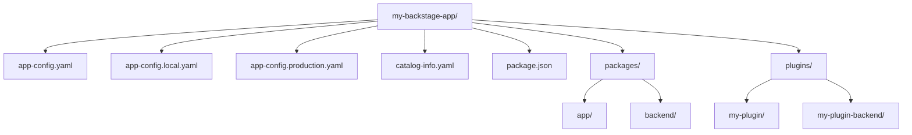

> **Complexity**: `[COMPLEX]` - Full-stack TypeScript project with monorepo tooling
>
> **Time to Complete**: 60-75 minutes
>
> **Prerequisites**: Node.js 18+, Docker, basic TypeScript familiarity
>
> **CBA Domain**: Domain 1 - Backstage Developer Workflow (24% of exam)

---

## What You'll Be Able to Do

After completing this module, you will be able to:

1. **Implement** a Backstage project from scratch using `@backstage/create-app`, configuring `app-config.yaml` layering and the local development loop.
2. **Evaluate** the Backstage monorepo structure to correctly place packages, plugins, and the app shell.
3. **Design** configuration strategies for authentication providers, PostgreSQL backends, and environment-specific overrides for staging and production deployments.
4. **Diagnose** common Backstage startup failures by interpreting build errors, dependency conflicts, and configuration validation messages.
5. **Compare** the roles of the New Backend System and New Frontend System when evaluating architectural decisions for custom plugin development.

---

## Why This Module Matters

In late 2021, a major aviation enterprise—facing scale challenges similar to those of American Airlines, a known early adopter of Backstage—suffered a severe service disruption during the holiday travel surge. The root cause was not a complex network failure, but a simple configuration drift. A legacy microservice had its database credentials hardcoded in a local configuration file that was accidentally merged into the production branch. The resulting database lockout grounded flights and cost the company an estimated $3.2 million in lost revenue and customer compensation over a single afternoon. 

This incident highlights why mastering the Backstage developer workflow is non-negotiable. Backstage is the central nervous system of modern internal developer platforms (IDPs). If you do not deeply understand how configuration files layer, how environment variables are injected, or how the monorepo structure isolates dependencies, you risk orchestrating platform-wide failures. The tooling is powerful, but it requires strict adherence to its prescribed workflows to maintain stability.

Domain 1 of the Certified Backstage Associate (CBA) exam tests these exact foundational principles. You must be able to evaluate architectural decisions within the workspace, diagnose dependency conflicts, and implement secure configuration pipelines before you even write your first line of plugin code. Candidates who skip this section tend to stumble on questions about project structure and dependency management—topics that feel "too basic" until you get them wrong under time pressure.

> **The Recording Studio Analogy**
>
> Think of Backstage like a recording studio. The monorepo is the building—it houses every room (package) under one roof. The `packages/app` directory is the mixing console where everything comes together for the listener. The `packages/backend` directory is the sound booth where the real processing happens. Each plugin in `plugins/` is a separate instrument track. Yarn workspaces are the wiring that connects every room so signals flow correctly. The app-config files are the mixing board presets—one for rehearsal (local), one for the live show (production). You would not perform live without a sound check, and you should not deploy Backstage without understanding the studio layout first.

---

## What You'll Learn

By the end of this module, you will understand:

- How the Backstage monorepo is organized and why Yarn workspaces are essential.
- The evolution of the core architecture, including the New Backend and New Frontend systems.
- TypeScript patterns that appear repeatedly in Backstage plugins.
- How to scaffold, run, and debug a Backstage app locally.
- How to build optimized Docker images for Backstage deployments.
- The Backstage CLI and its most critical commands for version management.
- Configuration layering with `app-config.yaml` and runtime secret injection.

---

## Did You Know?

- **Hardware & OS Limits:** Backstage has a minimum hardware requirement of 20 GB disk space and 6 GB RAM for a standalone installation. Furthermore, it can only run on Linux, macOS, and Windows Subsystem for Linux (WSL)—native Windows environments are strictly not supported.
- **Scale & Adoption:** The project boasts over 3,400 adopters, 31,000 GitHub stars, and 1,800 contributors. Furthermore, according to a third-party survey cited by the maintainers, Backstage holds an unverified 89% market share among IDP tools versus SaaS competitors. The `ADOPTERS.md` file alone lists over 150 named organizations.
- **Spotify Origins:** Spotify internally used Backstage to manage over 2,000 backend services before officially open-sourcing the project on March 16, 2020 under the Apache License, Version 2.0.
- **CNCF Status:** Contrary to common misconceptions that it has graduated, Backstage is currently a CNCF Incubating project. It joined the Sandbox on September 8, 2020, and officially moved to Incubating status on March 15, 2022.

---

## Part 1: Backstage Monorepo Structure

### 1.1 The Top-Level Layout

When you create a new Backstage app, you get a heavily structured monorepo. Backstage relies on this structure to ensure that all internal dependencies, plugins, and the core application shell can be versioned and built together synchronously.



The underlying code representation of this layout looks like this:

```
my-backstage-app/
├── app-config.yaml                 # Base configuration
├── app-config.local.yaml           # Local overrides (gitignored)
├── app-config.production.yaml      # Production overrides
├── catalog-info.yaml               # Self-registration in the catalog
├── package.json                    # Root workspace config
├── packages/
│   ├── app/                        # Frontend React application
│   │   ├── package.json
│   │   ├── src/
│   │   │   ├── App.tsx             # Plugin registration & routes
│   │   │   └── components/
│   │   └── public/
│   └── backend/                    # Backend Express application
│       ├── package.json
│       ├── src/
│       │   └── index.ts            # Backend startup & plugin wiring
│       └── Dockerfile              # Production image build
├── plugins/                        # Custom plugins live here
│   ├── my-plugin/                  # Frontend plugin
│   │   ├── package.json
│   │   ├── src/
│   │   └── dev/                    # Isolated dev setup
│   └── my-plugin-backend/          # Corresponding backend plugin
│       ├── package.json
│       └── src/
├── yarn.lock                       # Locked dependency tree
└── tsconfig.json                   # Root TypeScript config
```

### 1.2 Understanding Each Directory

Each top-level directory serves a specific role in the build and execution lifecycle:

| Directory | Purpose | Key Files |
|-----------|---------|-----------|
| `packages/app` | Frontend SPA that end-users interact with | `App.tsx` registers routes and plugins |
| `packages/backend` | API server, proxies, catalog ingestion | `index.ts` wires backend plugins together |
| `plugins/` | Custom and forked plugins for your org | Each plugin is its own workspace package |
| Root | Workspace config, shared tooling, configs | `package.json` with `workspaces` field |

### 1.3 Yarn Workspaces in Detail

The root `package.json` declares which directories participate in the workspace. Note that Backstage requires Node.js Active LTS (Node 22 or 24) and Yarn 4.x.

```json
{
  "name": "root",
  "version": "1.0.0",
  "private": true,
  "workspaces": {
    "packages": [
      "packages/*",
      "plugins/*"
    ]
  }
}
```

This configuration means every `package.json` inside `packages/` and `plugins/` is treated as a linked local dependency. If `packages/app` depends on `@internal/plugin-my-feature`, Yarn resolves it directly to the local `plugins/my-feature` directory instead of attempting to fetch it from an external npm registry. 

**Why workspaces matter for the exam**: You need to know that running `yarn install` at the root automatically installs and links dependencies for every package across the monorepo, and that workspace packages reference each other using the `workspace:^` protocol.

### 1.4 Evolution of the Core Systems

Backstage has a two-tier architecture: a React frontend and a Node.js backend, connected by a robust plugin system. However, the exact wiring of this architecture has evolved to reduce boilerplate and improve scalability. The Backstage roadmap is updated every 6 months to guide these transitions.

- **The New Backend System**: Reached stable 1.0 in 2024. It introduced a more declarative dependency injection pattern for backend plugins, eliminating the need to manually pass logging and database instances to every router.
- **The New Frontend System**: Became adoption-ready at Backstage v1.42.0 in 2025. It moves away from imperative routing in `App.tsx` toward a more declarative, composition-based extension model.

When interacting with legacy plugins (many of the 250+ open-source plugins available in the directory), you may still see the older imperative wiring patterns. 

---

## Part 2: TypeScript Fundamentals for Backstage

Backstage is primarily written in TypeScript (accounting for approximately 93.9% of the open-source codebase). While you do not need to be a TypeScript wizard, you must recognize the core patterns utilized by the framework.

### 2.1 Types and Interfaces in Plugin Code

Before diving into code, remember that Backstage has three core built-in features: **Software Catalog** (tracks ownership and metadata for all software), **Software Templates / Scaffolder** (creates new projects by loading code skeletons), and **TechDocs** (a 'docs-like-code' solution built on MkDocs that reached v1.0 recently).

Plugin API surfaces for these features are strictly defined via interfaces:

```typescript
// A plugin's API surface is defined via an interface
export interface CatalogApi {
  getEntityByRef(ref: string): Promise<Entity | undefined>;
  getEntities(request?: GetEntitiesRequest): Promise<GetEntitiesResponse>;
}

// Utility references tie an interface to a plugin
export const catalogApiRef = createApiRef<CatalogApi>({
  id: 'plugin.catalog.service',
});
```

Type aliases define the data structures traversing the system:

```typescript
type EntityKind = 'Component' | 'API' | 'Resource' | 'System' | 'Domain';

type Entity = {
  apiVersion: string;
  kind: EntityKind;
  metadata: EntityMetadata;
  spec?: Record<string, unknown>;
};
```

### 2.2 Async/Await Patterns

Almost every backend operation in Backstage is asynchronous. Plugin routers, catalog processors, and scaffolder actions all use `async/await` to handle I/O without blocking the Node.js event loop:

```typescript
// Backend plugin router pattern
import { Router } from 'express';

export async function createRouter(
  options: RouterOptions,
): Promise<Router> {
  const { logger, config, database } = options;

  const router = Router();

  router.get('/health', async (_req, res) => {
    const db = await database.getClient();
    const result = await db.select().from('my_table').limit(1);
    res.json({ status: 'ok', rows: result.length });
  });

  return router;
}
```

### 2.3 Generics in API Refs

The `createApiRef<T>` function is generic—it ties a type `T` to a reference string so the dependency injection system knows exactly what type to return at runtime:

```typescript
// When you call useApi(catalogApiRef), TypeScript knows the return
// type is CatalogApi, not just "any".
const catalogApiRef = createApiRef<CatalogApi>({
  id: 'plugin.catalog.service',
});
```

> **Pause and predict**: If you call `createApiRef` without providing a generic type parameter, what TypeScript type will the dependency injection system infer when another plugin consumes it? It will infer `unknown` or `any`, effectively breaking type safety for downstream consumers.

---

## Part 3: Local Development

### 3.1 Scaffolding a New App

The official way to create a Backstage app ensures you get the latest stable release (currently v1.49.4):

```bash
# Create a new Backstage app
npx @backstage/create-app@latest

# You'll be prompted for an app name
# This generates the full monorepo structure
```

Once the scaffolding completes, you navigate into the directory and initialize the local environment:

```bash
cd my-backstage-app
yarn install    # Install all workspace dependencies
yarn dev        # Start frontend AND backend in parallel
```

### 3.2 What `yarn dev` Actually Does

The `yarn dev` command concurrently executes both the frontend dev server (typically on port 3000) and the backend dev server (port 7007).

```json
{
  "scripts": {
    "dev": "concurrently \"yarn start\" \"yarn start-backend\"",
    "start": "yarn workspace app start",
    "start-backend": "yarn workspace backend start"
  }
}
```

The frontend dev server provides hot module replacement (HMR), automatically updating the browser without a full reload when React components are modified. The backend uses a watcher mechanism to restart the Express application when server-side files change.

### 3.3 Debugging

For deep diagnostics, you can attach standard debugging tools.

**Frontend debugging**: Open your browser's DevTools, navigate to the Sources tab, and locate your plugin code under the `webpack://` protocol to set breakpoints directly in the TypeScript source.

**Backend debugging**: Execute the backend with the Node.js inspector flag:

```bash
# Start backend with Node.js inspector
yarn workspace backend start --inspect
```

For a streamlined IDE experience, you can add a `.vscode/launch.json` configuration:

```json
{
  "version": "0.2.0",
  "configurations": [
    {
      "type": "node",
      "request": "attach",
      "name": "Attach to Backend",
      "port": 9229,
      "restart": true,
      "skipFiles": ["<node_internals>/**"]
    }
  ]
}
```

---

## Part 4: Docker Builds

### 4.1 Multi-Stage Dockerfile

Deploying Backstage requires building an optimized container. The generated `packages/backend/Dockerfile` utilizes a multi-stage process to exclude development tooling from the final production artifact.

```dockerfile
# Stage 1 - Build
FROM node:18-bookworm-slim AS build

WORKDIR /app

# Copy root workspace files
COPY package.json yarn.lock ./
COPY packages/backend/package.json packages/backend/
COPY plugins/ plugins/

# Install ALL dependencies (including devDependencies for build)
RUN yarn install --frozen-lockfile

# Copy source and build
COPY packages/backend/ packages/backend/
COPY app-config*.yaml ./
RUN yarn workspace backend build

# Stage 2 - Production
FROM node:18-bookworm-slim

WORKDIR /app

# Copy only the built output and production dependencies
COPY --from=build /app/packages/backend/dist ./dist
COPY --from=build /app/node_modules ./node_modules
COPY app-config.yaml app-config.production.yaml ./

# Run as non-root
USER node

CMD ["node", "dist/index.cjs.js"]
```

### 4.2 Optimizing Image Size

Optimizing your Backstage image is critical for rapid scaling and deployment.

| Technique | Impact | How |
|-----------|--------|-----|
| Multi-stage builds | High | Separate build and runtime stages |
| `--frozen-lockfile` | Medium | Ensures reproducible installs |
| `.dockerignore` | Medium | Exclude `node_modules/`, `.git/`, `*.md` |
| Slim base image | Medium | Use `node:18-bookworm-slim` not `node:18` |
| Non-root user | Security | `USER node` in final stage |

### 4.3 Building and Running

Because the Dockerfile requires context from the root workspace (such as the `yarn.lock` file), you must run the build command from the root of the repository.

```bash
# Build the image
docker build -t backstage:latest -f packages/backend/Dockerfile .

# Run with config overrides via environment variables
docker run -p 7007:7007 \
  -e POSTGRES_HOST=host.docker.internal \
  -e POSTGRES_PORT=5432 \
  backstage:latest
```

---

## Part 5: NPM/Yarn Dependency Management

### 5.1 Lock Files

The `yarn.lock` file acts as a deterministic blueprint of your entire dependency tree. It guarantees that CI/CD pipelines and local developers compile against the exact same package versions. You must never delete `yarn.lock` to bypass a conflict—always resolve the conflict via `yarn install`.

### 5.2 Workspace Protocol

To link packages internally without relying on external registries, Backstage utilizes the `workspace:` protocol.

```json
{
  "name": "@internal/plugin-my-feature",
  "dependencies": {
    "@backstage/core-plugin-api": "^1.9.0",
    "@internal/plugin-my-feature-common": "workspace:^"
  }
}
```

During local development, `workspace:^` maps directly to the local file system. If the package is eventually published, Yarn dynamically replaces the protocol with the semantic version.

### 5.3 Adding Dependencies

When injecting new libraries, you must target the correct workspace to prevent polluting the global root.

```bash
# Add a dependency to a specific workspace package
yarn workspace app add @backstage/plugin-catalog

# Add a dev dependency
yarn workspace backend add --dev @types/express

# Add a dependency to the root (shared tooling)
yarn add -W eslint prettier
```

> **Stop and think**: If you attempt to run `yarn add eslint prettier` without the `-W` flag at the root directory, what happens? Yarn will immediately throw an error and refuse the installation. The `-W` flag forces you to acknowledge that you are deliberately modifying the global workspace context.

---

## Part 6: Backstage CLI

### 6.1 Core Commands

The `@backstage/cli` package exposes the `backstage-cli` executable, which standardizes linting, testing, and lifecycle management across the monorepo.

| Command | Purpose |
|---------|---------|
| `backstage-cli package build` | Build a single package for production |
| `backstage-cli package lint` | Run ESLint on a package |
| `backstage-cli package test` | Run Jest tests for a package |
| `backstage-cli package start` | Start a package in dev mode |
| `backstage-cli versions:bump` | Bump all `@backstage/*` dependencies to latest |
| `backstage-cli versions:check` | Verify all `@backstage/*` versions are compatible |
| `backstage-cli new` | Scaffold a new plugin or package |

### 6.2 Creating a New Plugin

To generate the scaffolding for a custom extension, leverage the `new` command:

```bash
# From the repo root, scaffold a frontend plugin
yarn new --select plugin

# Scaffold a backend plugin
yarn new --select backend-plugin
```

### 6.3 Version Management

Backstage components are engineered to operate concurrently on specific release milestones. Manually upgrading a single package is a primary cause of platform instability.

```bash
# Check for version mismatches
yarn backstage-cli versions:check

# Bump everything to the latest release
yarn backstage-cli versions:bump
```

**War Story**: A platform team once spent three days diagnosing a catastrophic catalog ingestion failure. The core backend was operating on an older release, but an engineer had manually upgraded `@backstage/plugin-catalog-backend` via npm to test a new feature. The resulting database schema migrations were completely incompatible. The fix took five minutes once `versions:check` flagged the drift. Always upgrade your dependencies holistically.

---

## Part 7: Project Configuration

### 7.1 Configuration Files

Configuration in Backstage is heavily layered, allowing seamless transitions between local testing and production deployments.

```
app-config.yaml                # Base config (committed to git)
app-config.local.yaml          # Local developer overrides (gitignored)
app-config.production.yaml     # Production overrides (committed or injected)
```

### 7.2 Configuration Structure

The configuration files dictate core behaviors such as listening ports, database connections, and catalog ingestion targets.

```yaml
# app-config.yaml
app:
  title: My Backstage Portal
  baseUrl: http://localhost:3000

backend:
  baseUrl: http://localhost:7007
  listen:
    port: 7007
  database:
    client: better-sqlite3
    connection: ':memory:'

catalog:
  locations:
    - type: file
      target: ../../catalog-info.yaml

integrations:
  github:
    - host: github.com
      token: ${GITHUB_TOKEN}  # Environment variable substitution
```

### 7.3 Environment Variable Substitution

Securing credentials requires strict adherence to environment variable substitution. Hardcoding tokens within YAML files is a critical vulnerability.

```yaml
# Never do this:
integrations:
  github:
    - host: github.com
      token: ghp_abc123hardcoded    # BAD: secret in git

# Always do this:
integrations:
  github:
    - host: github.com
      token: ${GITHUB_TOKEN}        # GOOD: injected at runtime
```

### 7.4 Config Includes and Overrides

You instruct the application which configuration files to evaluate at runtime.

```bash
# Load base + production configs
yarn start-backend --config app-config.yaml --config app-config.production.yaml

# In Docker, use environment variables
APP_CONFIG_app_baseUrl=https://backstage.example.com
```

### 7.5 Database, Auth, and Advanced Integrations

Backstage defaults to SQLite for local development, but PostgreSQL is strictly required for production to handle concurrent connections and persistent state reliably.

```yaml
backend:
  database:
    client: pg
    connection:
      host: ${POSTGRES_HOST}
      port: ${POSTGRES_PORT}
      user: ${POSTGRES_USER}
      password: ${POSTGRES_PASSWORD}
```

Authentication is securely routed through established OAuth providers:

```yaml
auth:
  environment: production
  providers:
    github:
      production:
        clientId: ${GITHUB_CLIENT_ID}
        clientSecret: ${GITHUB_CLIENT_SECRET}
```

**Advanced Integration Notes:**
- **Kubernetes**: The Backstage Kubernetes plugin is explicitly split into two separate packages: `@backstage/plugin-kubernetes` (the frontend component) and `@backstage/plugin-kubernetes-backend`. They are not bundled and must be provisioned separately.
- **AI Tooling**: As of 2025, Backstage natively supports MCP (Model Context Protocol) server integration, allowing AI agents to securely query platform metadata.
- **TechDocs Storage**: TechDocs supports highly scalable backends including GCS, AWS S3, and Azure Blob Storage. While local filesystem storage is supported, it is discouraged for production.
- **Scaffolder Action IDs**: When authoring Software Templates, action IDs **must** be formatted in `camelCase`. Utilizing `kebab-case` causes template expression engines to evaluate the dashes as subtraction operators, returning `NaN`.

---

## Common Mistakes

| Mistake | What Goes Wrong | Fix |
|---------|----------------|-----|
| Running `npm install` instead of `yarn install` | Generates `package-lock.json`, conflicts with `yarn.lock` | Always use `yarn`; delete `package-lock.json` if created |
| Editing `yarn.lock` by hand | Corrupts dependency resolution | Run `yarn install` to regenerate after `package.json` changes |
| Upgrading a single `@backstage/*` package | Version mismatch causes runtime errors | Use `backstage-cli versions:bump` to upgrade all together |
| Committing `app-config.local.yaml` | Leaks developer tokens and credentials | Ensure `.gitignore` includes `app-config.local.yaml` |
| Docker build context set to `packages/backend/` | Build fails because `yarn.lock` and workspace packages are not available | Set build context to repo root: `docker build -f packages/backend/Dockerfile .` |
| Forgetting `--frozen-lockfile` in CI | Non-deterministic builds; CI installs different versions than local | Always use `yarn install --frozen-lockfile` in CI pipelines |
| Hardcoding secrets in `app-config.yaml` | Secrets pushed to git | Use `${ENV_VAR}` substitution and inject at runtime |

---

## Quiz

Test your knowledge of the Backstage developer workflow.

**Q1: Your team wants to add a new custom UI widget to the Backstage homepage. Which directory must they modify, and why?**

<details>
<summary>Show Answer</summary>

They must modify the `packages/app` directory, as it contains the frontend React application where the UI shell and plugin routes are registered.
</details>

**Q2: A developer proposes moving custom plugins to separate Git repositories to speed up their individual CI builds. What major trade-off of abandoning the Backstage workspace structure are they ignoring?**

<details>
<summary>Show Answer</summary>

They are ignoring the increased risk of version drift and "dependency hell." The Yarn workspace monorepo allows all plugins to be versioned, tested, and updated together using the `workspace:^` protocol.
</details>

**Q3: What happens if you run `docker build` with the build context set to `packages/backend/` instead of the repo root?**

<details>
<summary>Show Answer</summary>

The build **fails** because the Dockerfile copies `yarn.lock` and workspace packages from the repo root. With the wrong context, those files are outside the build context and Docker cannot access them.
</details>

**Q4: During a code review, you notice a developer added a database password directly to `app-config.production.yaml`. How should you instruct them to fix this for security?**

<details>
<summary>Show Answer</summary>

Instruct them to use environment variable substitution (e.g., `${POSTGRES_PASSWORD}`) in the YAML file and inject the actual secret at runtime via the process environment.
</details>

**Q5: After a developer manually upgraded `@backstage/plugin-catalog` to `1.21.0` while the rest of the project is on `1.18.0`, the catalog stops ingesting data. What CLI command should you run to fix this, and why?**

<details>
<summary>Show Answer</summary>

Run `yarn backstage-cli versions:bump` to upgrade all Backstage packages together. Individual packages should never be upgraded manually as they are designed to work as a coordinated set within each monthly release.
</details>

**Q6: Your organization wants to integrate an AI agent with the Backstage catalog to answer developer queries. Based on the 2025 platform updates, what native protocol integration should you implement?**

<details>
<summary>Show Answer</summary>

You should implement an MCP (Model Context Protocol) server integration. This capability was introduced in 2025 and natively supports securely connecting AI tooling to Backstage's core metadata APIs without building custom extraction pipelines.
</details>

**Q7: A platform engineer writes a new Scaffolder template but complains that expressions like `${{ steps.fetch-component-id.output.componentId }}` are returning `NaN`. What is the architectural root cause?**

<details>
<summary>Show Answer</summary>

The Scaffolder action ID was likely written in `kebab-case` (e.g., `fetch-component-id`). The template expression engine evaluates dashes as subtraction operators. Action IDs must always be written in `camelCase` to prevent these evaluation bugs.
</details>

**Q8: You are attempting to deploy Backstage on a Windows Server VM for your enterprise. The installation consistently fails during the native dependency build step. What is the fundamental compatibility issue?**

<details>
<summary>Show Answer</summary>

Backstage does not natively support Windows environments for direct execution. It can only run on Linux, macOS, or Windows via the Windows Subsystem for Linux (WSL). You must provision a Linux-based VM or utilize WSL to achieve a successful build.
</details>

---

## Hands-On Exercise: Create and Explore a Backstage App

**Objective**: Scaffold a Backstage app, verify the monorepo structure, run it locally, and build a Docker image.

**Estimated time**: 30-40 minutes

### Prerequisites

- Node.js 18+ installed (`node -v`)
- Yarn 4.x installed (`corepack enable`)
- Docker installed (`docker --version`)

### Tasks and Solutions

**Task 1: Scaffold the Application**

Create a new application named `cba-lab`. Note: if you are running this within an automated CI/CD pipeline, you must utilize the non-interactive execution flags to prevent the prompt from blocking the process:

```bash
npx @backstage/create-app@latest --skip-install --no-interactive --app-name cba-lab
```

For standard local development, execute the command interactively as shown below.

<details>
<summary>Solution</summary>

```bash
npx @backstage/create-app@latest
# When prompted, name it: cba-lab
cd cba-lab
```
</details>

**Task 2: Verify Monorepo Structure and Configuration**

Examine the generated workspace. Ensure `packages/app` and `packages/backend` exist, and confirm that the frontend entry point successfully registers plugin routes.

<details>
<summary>Solution</summary>

First, verify the workspace structure:
```bash
# List the top-level directories
ls -la

# Confirm workspace configuration
cat package.json | grep -A 5 '"workspaces"'

# Check that packages/app and packages/backend exist
ls packages/
```

Then, inspect the frontend routing logic:
```bash
cat packages/app/src/App.tsx | head -40
```
</details>

**Task 3: Start the Development Servers**

Boot the frontend and backend in parallel, then inspect the base configuration to identify the default database engine in use.

<details>
<summary>Solution</summary>

Start the application:
```bash
yarn dev
```

In a separate terminal window, inspect the configuration:
```bash
# View the base config
cat app-config.yaml

# Check which database is configured (default: SQLite in-memory)
grep -A 3 'database:' app-config.yaml
```
</details>

**Task 4: Create a Local Config Override**

Simulate configuring a developer-specific environment by creating a `.local.yaml` file that overrides the application title and sets up a GitHub integration token.

<details>
<summary>Solution</summary>

```bash
cat > app-config.local.yaml << 'EOF'
app:
  title: CBA Lab Portal
integrations:
  github:
    - host: github.com
      token: ${GITHUB_TOKEN}
EOF
```
</details>

**Task 5: Build and Run the Production Docker Image**

Compile the backend for production, execute a multi-stage Docker build from the repository root, and deploy the resulting container locally.

<details>
<summary>Solution</summary>

Build the assets:
```bash
# Build the backend for production
yarn workspace backend build

# Build the Docker image from the repo root
docker build -t cba-lab:latest -f packages/backend/Dockerfile .

# Verify image size
docker images cba-lab:latest
```

Run the container:
```bash
docker run -p 7007:7007 cba-lab:latest
```
</details>

**Task 6: Clean Up Resources**

Ensure no orphaned containers are left running and optionally delete the repository.

<details>
<summary>Solution</summary>

```bash
# Stop any running containers
docker rm -f $(docker ps -q --filter ancestor=cba-lab:latest) 2>/dev/null

# Remove the test app (optional)
cd .. && rm -rf cba-lab
```
</details>

### Success Checklist
- [ ] You successfully scaffolded the application via the Backstage CLI.
- [ ] You identified the `packages/app` and `packages/backend` directories.
- [ ] You observed hot module replacement (HMR) while `yarn dev` was running.
- [ ] You successfully built a Docker image under 1 GB using the multi-stage Dockerfile.

---

## Summary

| Topic | Key Takeaway |
|-------|-------------|
| Monorepo structure | `packages/app` (frontend), `packages/backend` (backend), `plugins/` (extensions) |
| TypeScript patterns | Interfaces for APIs, `createApiRef<T>` for DI, `async/await` everywhere |
| Local development | `npx @backstage/create-app`, `yarn dev`, HMR for frontend |
| Docker builds | Multi-stage from repo root, slim base image, non-root user |
| Dependencies | Yarn workspaces, `workspace:^` protocol, `--frozen-lockfile` in CI |
| Backstage CLI | `versions:bump`, `versions:check`, `package build`, `new` |
| Configuration | Layered YAML files, `${ENV_VAR}` substitution, `--config` flag ordering |

---

## Next Module

[Module 2: Backstage Plugins and Extensions](../module-1.2-backstage-plugin-development/) - Build your first frontend and backend plugin, understand the declarative plugin API system, and learn how Backstage's dependency injection resolves API references seamlessly.