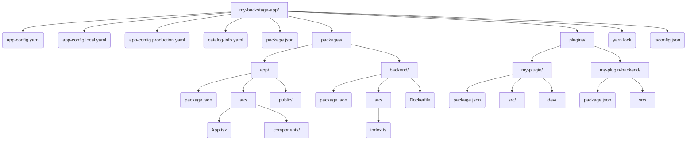

> **Complexity**: `[COMPLEX]` - Full-stack TypeScript project with monorepo tooling
>
> **Time to Complete**: 60-75 minutes
>
> **Prerequisites**: Node.js 22+, Yarn 4.x, Docker, basic TypeScript familiarity
>
> **CBA Domain**: Domain 1 - Backstage Developer Workflow (24% of exam)

---

## What You'll Be Able to Do

After completing this module, you will be able to explain and operate the Backstage developer workflow as a complete platform engineering loop: scaffold the app, understand the workspace layout, run and debug local services, build production artifacts, manage dependency alignment, and apply configuration safely across environments.

1. **Design** a Backstage monorepo architecture by correctly structuring workspace packages, plugins, and the application shell.
2. **Evaluate** multi-stage Docker builds to optimize container image sizes and security profiles for production deployments.
3. **Implement** layered configuration overrides for secure environment variable substitution across staging and production.
4. **Diagnose** dependency version drift using the Backstage CLI and Yarn workspace protocols to resolve package conflicts.
5. **Compare** the New Backend System against legacy imperative wiring to understand modern declarative plugin registration.

## Why This Module Matters

In 2012, Knight Capital Group lost $460 million in exactly 45 minutes. The root cause was a manual deployment error where a retired codebase was accidentally reactivated on a single server because an engineer forgot to copy a configuration file. While this was not a Backstage failure, it illustrates why automated, standardized developer platforms and rigorous configuration layering are non-negotiable in modern engineering environments. When teams manually juggle environment overrides or bypass automated scaffolding, operational risks can become expensive very quickly.

Backstage is the backbone of the Certified Backstage Associate certification. Before you can build custom plugins, design complex software catalogs, or integrate securely with modern Kubernetes v1.35 clusters, you need to understand how the Backstage project itself works. You must master its monorepo layout, multi-stage build pipeline, dependency management system, and local development loop. Without this foundation, attempts to extend the platform tend to produce broken builds, insecure configuration, and hard-to-debug plugin behavior.

Domain 1 accounts for nearly a quarter of the exam. Candidates who skip this foundational section tend to stumble on questions about project structure, dependency version drift, and configuration file precedence, which feel deceptively simple until you get them wrong under time pressure. This module builds the mental model you need to work confidently in enterprise-grade Backstage environments where plugins, application shell code, backend services, Docker images, and configuration files all move together.

---

## Did You Know?

- Backstage was created at Spotify and open-sourced under the Apache License, Version 2.0, which is why many examples still reflect the needs of large internal developer platforms rather than small single-service applications.
- A generated Backstage app is a monorepo, not a single package. The app shell, backend, plugins, configuration, lockfile, and Docker build all depend on workspace-level coordination.
- Backstage configuration is layered deliberately. Base config, local developer overrides, production config, and environment substitution are separate mechanisms with different security and review expectations.
- The New Backend System changes plugin registration from manual imperative wiring toward declarative module registration, so CBA candidates must recognize both patterns when reading real enterprise repositories.

---

## Part 1: Backstage Monorepo Structure

### 1.1 The Top-Level Layout

When you create a new Backstage app, you are not just creating a single Node.js application; you are generating an entire monorepo designed to house dozens or hundreds of custom internal plugins. This architecture prevents dependency hell and ensures that your frontend, backend, and plugins are always versioned and built together.

Here is the structure of the monorepo visualized using Mermaid for better accessibility:



### 1.2 Understanding Each Directory

The monorepo separates concerns strictly. The root manages tooling, while subdirectories manage executable code.

| Directory | Purpose | Key Files |
|-----------|---------|-----------|
| `packages/app` | Frontend SPA that end-users interact with | `App.tsx` registers routes and plugins |
| `packages/backend` | API server, proxies, catalog ingestion | `index.ts` wires backend plugins together |
| `plugins/` | Custom and forked plugins for your org | Each plugin is its own workspace package |
| Root | Workspace config, shared tooling, configs | `package.json` with `workspaces` field |

The `packages/app` directory is essentially the "shell" that weaves together individual frontend plugins into a unified React application. Conversely, `packages/backend` serves as the API gateway and persistent storage layer, managing database connections and proxying requests to external systems.

### 1.3 Yarn Workspaces in Detail

The Backstage monorepo relies on Yarn workspaces to manage dependencies. The root `package.json` declares which directories participate in the workspace:

```json
{
  "name": "root",
  "version": "1.0.0",
  "private": true,
  "workspaces": {
    "packages": [
      "packages/*",
      "plugins/*"
    ]
  }
}
```

This configuration means every `package.json` inside the `packages/` and `plugins/` directories is treated as a linked local dependency. If the frontend app depends on a custom plugin, Yarn resolves it to the local directory instead of fetching it from an external registry. This process, known as dependency hoisting, significantly reduces disk usage and installation time by placing shared modules in a single root `node_modules` folder.

### 1.4 Evolution of the Core Systems

Backstage has evolved significantly since its inception. The New Backend System reached stable 1.0 status in 2024, providing a more modular, declarative architecture for backend plugins compared to the legacy imperative wiring. Instead of manually passing Express routers, the new system relies on declarative dependency injection. 

Meanwhile, the New Frontend System became adoption-ready at Backstage v1.42.0 in 2025, offering a simplified and more extensible UI composition model using declarative extensions. Knowing these milestones is critical because you will frequently encounter both legacy and modern patterns in older enterprise deployments. When upgrading systems, recognizing whether a plugin uses the legacy router pattern or the new declarative system is the first step in debugging integration failures.

---

## Part 2: TypeScript Fundamentals for Backstage

### 2.1 Types and Interfaces in Plugin Code

Before writing any code, you must understand the three core built-in features of Backstage that you will interact with:
1. **Software Catalog**: Tracks ownership and metadata for all software in an organization's ecosystem (services, websites, libraries, data pipelines, ML models, etc.).
2. **Software Templates (Scaffolder)**: Creates new projects/components by loading code skeletons, templating variables, and publishing to locations like GitHub or GitLab.
3. **TechDocs**: Backstage's 'docs-like-code' solution built on MkDocs, using Markdown files that live alongside your source code. It supports storage backends like GCS, AWS S3, Azure Blob Storage, and the local filesystem.

Backstage plugins are heavily typed using TypeScript. Interfaces define the precise shape of plugin APIs, ensuring components communicate predictably:

```typescript
// A plugin's API surface is defined via an interface
export interface CatalogApi {
  getEntityByRef(ref: string): Promise<Entity | undefined>;
  getEntities(request?: GetEntitiesRequest): Promise<GetEntitiesResponse>;
}

// Utility references tie an interface to a plugin
export const catalogApiRef = createApiRef<CatalogApi>({
  id: 'plugin.catalog.service',
});
```

Type aliases are extensively used to define data structures, particularly for the Software Catalog entities:

```typescript
type EntityKind = 'Component' | 'API' | 'Resource' | 'System' | 'Domain';

type Entity = {
  apiVersion: string;
  kind: EntityKind;
  metadata: EntityMetadata;
  spec?: Record<string, unknown>;
};
```

### 2.2 Async/Await Patterns

Almost every backend operation in Backstage is asynchronous. Plugin routers, catalog processors, and scaffolder actions all use `async/await` to prevent blocking the Node.js event loop during heavy I/O operations.

```typescript
// Backend plugin router pattern
import { Router } from 'express';

export async function createRouter(
  options: RouterOptions,
): Promise<Router> {
  const { logger, config, database } = options;

  const router = Router();

  router.get('/health', async (_req, res) => {
    const db = await database.getClient();
    const result = await db.select().from('my_table').limit(1);
    res.json({ status: 'ok', rows: result.length });
  });

  return router;
}
```

This pattern ensures that database queries, external API calls, and file system reads are handled concurrently. The `RouterOptions` object acts as a dependency injection container, passing essential services like logging and configuration down into the plugin routes.

### 2.3 Generics in API Refs

The `createApiRef<T>` function is a generic utility. It ties a specific TypeScript type `T` to a reference string, allowing the dependency injection system to know exactly what type of object it should return when requested by a component.

```typescript
// When you call useApi(catalogApiRef), TypeScript knows the return
// type is CatalogApi, not just "any".
const catalogApiRef = createApiRef<CatalogApi>({
  id: 'plugin.catalog.service',
});
```

> **Pause and predict**: If `createApiRef` was not generic (i.e., it lacked the `<CatalogApi>` type parameter), what would the TypeScript compiler infer when you call `useApi(catalogApiRef)`?
> 
> *Prediction*: The compiler would be forced to infer the return type as `any` or `unknown`. This would completely break IDE autocompletion, eliminate compile-time type safety, and allow developers to call non-existent methods on the Catalog API without any warnings.

---

## Part 3: Local Development

### 3.1 Scaffolding a New App

The official way to create a Backstage app is via the `@backstage/create-app` CLI package. To ensure reproducible scaffolding, especially in CI/CD environments, it is best to use non-interactive flags.

```bash
# Create a new Backstage app (non-interactive)
npx @backstage/create-app@latest --skip-install --path my-backstage-app

# You'll be prompted for an app name unless provided via env or flags
# This generates the full monorepo structure
```

After scaffolding completes, you navigate into the directory and initiate the installation and development processes:

```bash
cd my-backstage-app
yarn install    # Install all workspace dependencies
yarn dev        # Start frontend AND backend in parallel
```

### 3.2 What `yarn dev` Actually Does

The `yarn dev` command is your primary workflow engine. It runs both the frontend dev server (typically on port 3000) and the backend dev server (typically on port 7007) concurrently. Under the hood, the root `package.json` defines this orchestration:

```json
{
  "scripts": {
    "dev": "concurrently \"yarn start\" \"yarn start-backend\"",
    "start": "yarn workspace app start",
    "start-backend": "yarn workspace backend start"
  }
}
```

The frontend development server provides Hot Module Replacement (HMR). When you change a React component, Webpack injects the updated module into the browser seamlessly without requiring a full page reload. Simultaneously, the backend proxy routes API requests to the Node.js server to circumvent CORS issues, while utilities like `nodemon` automatically restart the backend process upon detecting file changes.

### 3.3 Debugging

Complex plugin interactions often require deep inspection. For frontend debugging, you can utilize Chrome DevTools to locate your plugin code under the `webpack://` source map tree and set breakpoints directly. For backend debugging, you must expose the Node.js inspector port:

```bash
# Start backend with Node.js inspector
yarn workspace backend start --inspect
```

Once running, you can attach VS Code directly to the inspector process by adding a `.vscode/launch.json` configuration to your workspace:

```json
{
  "version": "0.2.0",
  "configurations": [
    {
      "type": "node",
      "request": "attach",
      "name": "Attach to Backend",
      "port": 9229,
      "restart": true,
      "skipFiles": ["<node_internals>/**"]
    }
  ]
}
```

---

## Part 4: Docker Builds

### 4.1 Multi-Stage Dockerfile

Deploying Backstage efficiently requires a multi-stage Dockerfile. The generated `packages/backend/Dockerfile` separates the heavy build tools from the final runtime environment to keep the production image strictly minimized.

```dockerfile
# Stage 1 - Build
FROM node:22-bookworm-slim AS build

WORKDIR /app

# Copy root workspace files
COPY package.json yarn.lock ./
COPY packages/backend/package.json packages/backend/
COPY plugins/ plugins/

# Install ALL dependencies (including devDependencies for build)
RUN yarn install --immutable

# Copy source and build
COPY packages/backend/ packages/backend/
COPY app-config*.yaml ./
RUN yarn workspace backend build

# Stage 2 - Production
FROM node:22-bookworm-slim

WORKDIR /app

# Copy only the built output and production dependencies
COPY --from=build /app/packages/backend/dist ./dist
COPY --from=build /app/node_modules ./node_modules
COPY app-config.yaml app-config.production.yaml ./

# Run as non-root
USER node

CMD ["node", "dist/index.cjs.js"]
```

### 4.2 Optimizing Image Size

Optimizing container images is crucial for deployment speed and reducing the attack surface. 

| Technique | Impact | How |
|-----------|--------|-----|
| Multi-stage builds | High | Separate build and runtime stages |
| `--immutable` | Medium | Ensures reproducible installs (Yarn 4.x) |
| `.dockerignore` | Medium | Exclude `node_modules/`, `.git/`, `*.md` |
| Slim base image | Medium | Use `node:22-bookworm-slim` not `node:22` |
| Non-root user | Security | `USER node` in final stage |

Using the slim base image strips out unnecessary operating system utilities, while enforcing a non-root user prevents privilege escalation attacks if the container is compromised.

### 4.3 Building and Running

Because Backstage relies on a monorepo structure, the Docker build context must be the repository root, not the `packages/backend` folder. This ensures the Docker daemon can access the shared `yarn.lock` and all internal plugins.

```bash
# Build the image
docker build -t backstage:latest -f packages/backend/Dockerfile .

# Run with config overrides via environment variables
docker run -p 7007:7007 \
  -e POSTGRES_HOST=host.docker.internal \
  -e POSTGRES_PORT=5432 \
  backstage:latest
```

---

## Part 5: NPM/Yarn Dependency Management

### 5.1 Lock Files

The `yarn.lock` file is arguably the most important operational file in the repository. It pins every dependency—and its transitive dependencies—to an exact cryptographic version. This guarantees that your CI/CD pipeline builds the exact same artifact that you tested locally. Never delete the lockfile to resolve conflicts; doing so destroys your deterministic build guarantees.

### 5.2 Workspace Protocol

When one package depends on another within the same monorepo, Backstage utilizes the `workspace:` protocol to enforce local resolution:

```json
{
  "name": "@internal/plugin-my-feature",
  "dependencies": {
    "@backstage/core-plugin-api": "^1.9.0",
    "@internal/plugin-my-feature-common": "workspace:^"
  }
}
```

The `workspace:^` syntax instructs Yarn to symlink the local directory during development. If the package is eventually published to a registry, Yarn automatically rewrites this protocol to the exact semantic version before publication.

### 5.3 Adding Dependencies

Adding dependencies requires targeting the correct workspace package to maintain strict boundaries. 

```bash
# Add a dependency to a specific workspace package
yarn workspace app add @backstage/plugin-catalog

# Add a dev dependency
yarn workspace backend add --dev @types/express

# Add a dependency to the root (shared tooling)
yarn add -W eslint prettier
```

The `-W` flag explicitly confirms your intent to install a package at the workspace root, which should be reserved strictly for shared development tooling like linters and formatters.

> **Stop and think**: You are building a backend plugin that needs the `pg` (PostgreSQL) package. Should you install it using `yarn workspace backend add pg` or `yarn workspace my-plugin-backend add pg`?
> 
> *Answer*: You must install it in the specific workspace that requires it. If your custom plugin needs it, use `yarn workspace my-plugin-backend add pg`. Do not pollute the main `packages/backend` layer with plugin-specific dependencies; maintaining strict isolation is critical for the long-term maintainability of the monorepo.

---

## Part 6: Backstage CLI

### 6.1 Core Commands

The `@backstage/cli` package provides the `backstage-cli` binary, which acts as the operational Swiss Army knife for the platform.

| Command | Purpose |
|---------|---------|
| `backstage-cli package build` | Build a single package for production |
| `backstage-cli package lint` | Run ESLint on a package |
| `backstage-cli package test` | Run Jest tests for a package |
| `backstage-cli package start` | Start a package in dev mode |
| `backstage-cli versions:bump` | Bump all `@backstage/*` dependencies to latest |
| `backstage-cli versions:check` | Verify all `@backstage/*` versions are compatible |
| `backstage-cli new` | Scaffold a new plugin or package |

### 6.2 Creating a New Plugin

Rather than manually creating directories and configuring TypeScript, the CLI automates plugin scaffolding perfectly:

```bash
# From the repo root, scaffold a frontend plugin
yarn new --select plugin

# Scaffold a backend plugin
yarn new --select backend-plugin
```

This generates a comprehensive skeleton inside the `plugins/` directory, establishing the `package.json`, source files, isolated development setup, and boilerplate testing frameworks.

### 6.3 Version Management

Backstage releases follow a strict monthly cadence. All `@backstage/*` packages within a release are integration-tested to work exclusively with one another.

```bash
# Check for version mismatches
yarn backstage-cli versions:check

# Bump everything to the latest release
yarn backstage-cli versions:bump
```

**War story**: An enterprise team once spent three full days debugging a mysterious catalog ingestion failure. The core backend was running Backstage 1.18, but a junior developer had manually upgraded `@backstage/plugin-catalog-backend` to 1.21 via npm to access a newly released feature. The underlying schema migrations were entirely incompatible, causing silent database deadlocks. The fix took exactly five minutes once they ran `versions:check`, which immediately flagged the drift. The lesson is absolute: never upgrade individual packages. Always bump them as a unified release.

---

## Part 7: Project Configuration and Advanced Integrations

### 7.1 Configuration Files

Backstage employs a layered configuration system, merging YAML files sequentially.

```
app-config.yaml                # Base config (committed to git)
app-config.local.yaml          # Local developer overrides (gitignored)
app-config.production.yaml     # Production overrides (committed or injected)
```

Later files in the loading sequence aggressively override keys from earlier files. The `app-config.local.yaml` file is designed for developer-specific settings and must rigorously remain excluded from version control via `.gitignore`.

### 7.2 Configuration Structure

The configuration schema is strictly typed, organizing settings into distinct domains:

```yaml
# app-config.yaml
app:
  title: My Backstage Portal
  baseUrl: http://localhost:3000

backend:
  baseUrl: http://localhost:7007
  listen:
    port: 7007
  database:
    client: better-sqlite3
    connection: ':memory:'

catalog:
  locations:
    - type: file
      target: ../../catalog-info.yaml

integrations:
  github:
    - host: github.com
      token: ${GITHUB_TOKEN}  # Environment variable substitution
```

### 7.3 Environment Variable Substitution

Managing secrets securely is a mandatory compliance requirement. The `${VAR}` syntax dynamically reads from the process environment at startup.

```yaml
# Never do this:
integrations:
  github:
    - host: github.com
      token: ghp_abc123hardcoded    # BAD: secret in git

# Always do this:
integrations:
  github:
    - host: github.com
      token: ${GITHUB_TOKEN}        # GOOD: injected at runtime
```

### 7.4 Config Includes and Overrides

You can explicitly direct the application on which configurations to load using targeted CLI flags or environment variables:

```bash
# Load base + production configs
yarn start-backend --config app-config.yaml --config app-config.production.yaml

# In Docker, use environment variables
APP_CONFIG_app_baseUrl=https://backstage.example.com
```

### 7.5 Database and Authentication Configuration

Backstage utilizes SQLite for lightweight local development but strictly mandates PostgreSQL for resilient production deployments. Overriding the database configuration ensures plugins receive isolated, persistent logical databases:

```yaml
backend:
  database:
    client: pg
    connection:
      host: ${POSTGRES_HOST}
      port: ${POSTGRES_PORT}
      user: ${POSTGRES_USER}
      password: ${POSTGRES_PASSWORD}
```

Authentication configurations define how users access the platform via external Identity Providers:

```yaml
auth:
  environment: production
  providers:
    github:
      production:
        clientId: ${GITHUB_CLIENT_ID}
        clientSecret: ${GITHUB_CLIENT_SECRET}
```

Beyond basic configurations, be aware of advanced platform integrations. For example, the Backstage Kubernetes plugin consists of two entirely separate packages: `@backstage/plugin-kubernetes` (the UI component) and `@backstage/plugin-kubernetes-backend` (the cluster API connector). Both must be installed and configured independently. Additionally, as of 2025, Backstage natively supports MCP (Model Context Protocol) server integration, facilitating AI tooling connectivity. Finally, when building Software Templates, always ensure your Scaffolder action IDs use strict `camelCase` (e.g., `fetchComponent`); using `kebab-case` causes the template parser to interpret hyphens as subtraction operators, returning fatal `NaN` evaluation errors.

## Exam Design Notes for the Backstage Developer Workflow

The CBA exam treats the developer workflow as the foundation for every later Backstage topic. If you cannot identify where frontend routes live, where backend modules are registered, where plugin code belongs, how configuration is layered, and how dependencies stay aligned, you will struggle with catalog, scaffolder, TechDocs, and Kubernetes plugin questions. Backstage is a platform framework, so its first skill is understanding the repository shape that lets many teams build safely inside one portal.

Begin each scenario by separating the application shell from the plugin. The `packages/app` workspace is the browser-facing shell that composes routes, themes, APIs, and plugin pages. A frontend plugin contributes features, but it does not automatically become visible unless the application shell registers it. This distinction explains many "plugin installed but not visible" failures, because dependency installation and UI composition are separate steps in Backstage development.

Then separate the backend host from backend plugins. The `packages/backend` workspace starts the Node.js backend and loads backend features, but each backend plugin should still own its own package boundaries, dependencies, routes, and services. The New Backend System makes this more declarative, yet the architectural question remains the same: which package owns the feature, and which host process loads it at runtime?

Monorepo structure is not just a convenience. It is the mechanism that lets Backstage upgrades, plugin development, test tooling, and dependency checks happen consistently across the portal. When a team pulls one custom plugin into a separate repository, they may make that plugin's CI faster, but they also create a version-alignment problem that returns during every Backstage upgrade. The exam often frames this as a trade-off between local autonomy and platform consistency.

Yarn workspaces are central because Backstage projects contain many packages that must resolve local dependencies predictably. A plugin can depend on a shared common package through the `workspace:` protocol, and Yarn resolves that dependency to the local package during development. This local linking means changes can be tested together before publishing, which is exactly what an internal developer platform needs when teams evolve shared APIs and UI components.

The lockfile is part of the platform contract. A Backstage app usually has a large transitive dependency tree, and small version drift can produce runtime mismatches that look unrelated to the package that changed. The correct response is not to hand-edit `yarn.lock` or mix package managers. Use the Backstage CLI and Yarn commands so package versions move as a tested set and the repository remains reproducible in CI.

When evaluating dependency drift, look for two separate problems. General JavaScript drift happens when the lockfile and package manifests disagree or when someone uses `npm install` and creates a competing lockfile. Backstage-specific drift happens when one `@backstage/*` package moves ahead of the coordinated release set while others remain behind. The second class is especially dangerous because plugins may compile yet fail through API, schema, or runtime expectations.

Configuration questions are usually security questions disguised as YAML questions. `app-config.yaml` belongs in source control and should contain safe defaults. `app-config.local.yaml` is for developer-specific overrides and should stay out of version control. Production values can come from production config files, command-line `--config` ordering, or environment variables. Secrets should be substituted at runtime, not committed into a file that becomes part of the repository history.

Layering matters because later configuration files override earlier ones. If a production deployment loads files in the wrong order, a safe default may override the intended production value, or a local value may accidentally survive into an environment where it does not belong. A good Backstage operator can explain not only which key is set, but also which file set it and why that file is loaded later than the base config.

Environment variable substitution is powerful, but it does not make every config value safe. The secret itself must come from a secure runtime mechanism such as a deployment platform, Kubernetes Secret, or external secret manager. The config file should contain placeholders like `${POSTGRES_PASSWORD}` rather than literal credentials. During review, ask whether a future reader of the repository can learn a secret from git history. If the answer is yes, the configuration is wrong.

Local development questions tend to test process boundaries. `yarn dev` commonly starts both frontend and backend development services, but the browser still talks to a backend API and the backend still talks to databases, integrations, and plugin services. When something fails locally, first identify whether the failure is in browser routing, frontend compilation, backend startup, configuration loading, database connectivity, or an external integration.

Debugging Backstage is easier when you keep source maps, logs, and service ownership separate. Frontend problems are usually visible in the browser console, React route tree, or compiled bundle. Backend problems are usually visible in Node logs, plugin initialization errors, or failed requests to external systems. Configuration problems often appear early during process startup. Dependency problems often appear during install, build, or plugin registration.

Docker build questions are about build context as much as Dockerfile syntax. The backend Dockerfile often needs files from the repository root, including `package.json`, `yarn.lock`, workspace package manifests, app config, and plugin code. If the build context is `packages/backend`, Docker cannot copy files that live outside that directory. The correct context is the repository root, with the Dockerfile selected explicitly by path.

Multi-stage Docker builds separate tool-heavy compilation from runtime execution. The build stage can include development dependencies, TypeScript compilation, and workspace packaging. The runtime stage should contain only what the backend process needs to start. This pattern reduces image size and attack surface, but only if the final stage avoids unnecessary tools, runs as a non-root user, and receives secrets through runtime configuration rather than baked image layers.

Image-size optimization should not break reproducibility. A smaller image is useful, but not if it silently omits a workspace package or relies on a dependency being present on the builder machine. Use `.dockerignore` to exclude obvious noise, keep the root lockfile available, and verify the container with realistic production config. The exam may describe a failed image build, and the clue is often a missing root-level file.

Backstage CLI commands exist to make the monorepo operable. Package build, lint, test, start, plugin generation, and version-management commands encode project conventions that would be error-prone to reproduce manually. A candidate should recognize when the right answer is to use the CLI instead of manually creating directories, editing generated wiring, or upgrading one package at a time.

Plugin scaffolding is valuable because it creates the expected package boundaries. A generated plugin includes package metadata, source layout, isolated development setup, and test conventions that match Backstage tooling. Hand-building a plugin directory can work, but it increases the chance that package naming, exports, routes, or workspace registration are inconsistent. In a platform team, consistency is a feature because many engineers need to read and maintain plugins.

The New Backend System changes the shape of integration work. Legacy backend code often wires routers imperatively through service factories, Express routers, and manual plugin setup. The newer system favors backend features and modules that declare what they need. In an exam question, the key is not whether you prefer one style; the key is recognizing which style the repository uses and applying the correct registration pattern.

The same comparison applies during migrations. A mixed repository may contain older plugins using legacy router creation alongside newer backend modules. Migration work should proceed deliberately: identify plugin ownership, replace imperative wiring with declarative modules where supported, test configuration and permissions, and avoid changing multiple unrelated plugins in one release. The safest migration is visible, incremental, and backed by dependency checks.

TypeScript is not ornamental in Backstage. API refs, entity types, scaffolder actions, plugin route refs, and service interfaces all use types to make integration boundaries explicit. When a developer bypasses types with `any`, they remove the compiler's ability to detect mismatched API calls between plugins. In platform code, type safety protects many teams from each other's assumptions.

Software Catalog concepts appear early because they define what the portal is organizing. Components, APIs, resources, systems, domains, owners, and relations are not just UI labels. They are the data model that many plugins use to connect documentation, templates, Kubernetes resources, scorecards, and ownership metadata. A developer workflow module should make clear that code structure and catalog metadata eventually meet in production.

Software Templates introduce another workflow boundary. Template authors write YAML and actions, but the generated projects depend on repository integrations, authentication, parameter validation, and action IDs that parse correctly. A small naming mistake can produce a confusing template runtime error. For CBA purposes, remember that scaffolder behavior combines frontend forms, backend actions, catalog registration, and external source-control operations.

TechDocs demonstrates the same platform pattern. Documentation source may live with code, but generated documentation can be stored in local filesystem storage, cloud object storage, or another supported backend depending on the environment. Local filesystem storage is fine for development, while production deployments usually need durable shared storage so multiple backend instances and restarts do not lose generated docs.

Kubernetes integration in Backstage also crosses the frontend/backend boundary. Installing a frontend plugin gives users a page or entity tab, but the backend plugin is what talks to cluster APIs and handles credentials. If the UI shows no data, the missing piece is often backend installation, cluster locator configuration, auth setup, or permissions. The exam may phrase this as a user-facing symptom rather than a package name.

For review practice, read a Backstage change by asking which workspace changed and why. A UI route change belongs in `packages/app` or a frontend plugin. A server-side API integration belongs in `packages/backend` or a backend plugin. A dependency change belongs in the specific workspace that needs it. A production secret belongs outside source control. This ownership map catches many mistakes before you run the code.

For exam pacing, translate each requirement into an ownership boundary. "Add a homepage widget" points to the app shell or frontend plugin registration. "Connect to a Kubernetes cluster" points to backend plugin configuration and credentials. "Fix version mismatch" points to Backstage CLI version checks and coordinated bumps. "Secure production database password" points to environment substitution and deployment-time secret injection.

The most important habit is to avoid solving Backstage problems at the wrong layer. Do not modify the backend package to fix a missing frontend route. Do not commit a local config file to fix a production secret. Do not delete the lockfile to fix a version conflict. Do not split plugins into separate repositories without planning upgrade coordination. Backstage rewards clear ownership because the portal is designed to grow across many teams.

Finally, remember that the developer workflow is not just "how to run the app." It is the set of practices that keep the portal extensible after dozens of plugins, hundreds of catalog entities, and many production integrations exist. The workflow lets platform engineers change the portal without losing reproducibility, security, or team ownership. That is why CBA starts here before moving into deeper catalog and infrastructure topics.

When you evaluate a new plugin request, trace the full delivery path before touching code. A frontend page may need a route in the app shell, an API ref, a backend plugin, configuration keys, authentication provider settings, catalog annotations, and documentation. Writing that path down prevents partial installations where a package exists in `package.json` but no user can reach it or no backend service can supply data.

The same delivery-path thinking applies to upgrades. A Backstage upgrade is not just a package bump; it may touch generated app code, backend registration style, plugin APIs, catalog processors, configuration schema, and Docker image behavior. The safest teams upgrade in small increments, run version checks, read migration notes, and avoid unrelated feature work in the same pull request. That habit keeps platform upgrades boring.

For local development, keep a clean distinction between sample data and production-like behavior. The default catalog, in-memory database, and local filesystem storage are excellent for learning how the portal starts. They are not proof that production integrations are correct. Before shipping, validate PostgreSQL configuration, authentication, external integrations, durable TechDocs storage, and Kubernetes access with the same config layering that production will use.

For Docker work, remember that the image is only one part of the deployment contract. The container also needs runtime configuration, database connectivity, auth provider secrets, base URLs that match the public hostname, and network access to integrations. A container that starts locally with SQLite may still fail in production if `backend.baseUrl`, `app.baseUrl`, or auth callback configuration points to the wrong environment.

For workspace hygiene, avoid installing dependencies at the root unless they truly are shared development tooling. A backend plugin that needs a database driver should declare that dependency in its own workspace package, not in the app shell and not casually at the root. Correct placement keeps package ownership visible, reduces accidental coupling, and makes plugin removal or extraction less risky later.

For configuration review, ask what should be committed and what should be injected. Safe defaults, public URLs, catalog locations, and non-secret feature flags can usually live in versioned config. Tokens, passwords, private keys, OAuth client secrets, and environment-specific credentials should come from runtime secret systems. This question is simple, but it catches many severe Backstage deployment mistakes.

For TypeScript review, watch for boundaries where plugin APIs cross package lines. An API ref should describe a stable interface, while implementation details should remain inside the plugin or backend module that owns them. If a component imports deep internals from another plugin to avoid defining a proper API, it may work today but break during the next plugin refactor or Backstage upgrade.

For catalog-aware development, remember that Backstage features often activate through entity metadata. A plugin may be installed correctly but remain invisible for an entity if the entity lacks the expected annotation, relation, kind, or owner field. Troubleshooting should therefore include both code wiring and catalog data. This is why a developer workflow module belongs before deeper catalog modules in the course sequence.

For templates, validate both the author experience and the generated output. A Software Template can look good in the UI while generating repositories with bad package names, missing catalog metadata, or unsafe default config. The developer workflow mindset asks whether the generated project fits the same workspace, dependency, Docker, and configuration standards as hand-written Backstage code.

For platform governance, treat Backstage changes as shared infrastructure changes. A plugin can affect navigation, identity, catalog ownership, CI templates, Kubernetes visibility, and documentation workflows for many teams. Require clear ownership, focused pull requests, repeatable local verification, and independent review for changes that alter core platform behavior. The portal is most valuable when teams trust it as a stable source of truth.

For certification practice, narrate your answer in the language of ownership. Say which workspace changes, which config layer changes, which command checks versions, which Docker context is correct, and which backend registration style applies. That level of precision turns broad Backstage familiarity into exam-ready reasoning and prevents answers that sound plausible while operating at the wrong layer.

When you inspect a generated Backstage repository, resist the urge to treat every directory as interchangeable TypeScript code. The root package controls the workspace, `packages/app` controls browser composition, `packages/backend` controls server startup, and `plugins` contains extension packages that may have frontend, backend, common, and node-specific pieces. This structure exists so platform teams can reason about ownership before they reason about implementation details.

When you troubleshoot a broken local app, collect evidence in a fixed order. Check the install and lockfile first, then verify which workspace command is running, then inspect configuration loading, then inspect browser or backend logs based on the symptom. A random walk through files wastes time because many Backstage failures look similar at first glance. A fixed order turns broad monorepo complexity into a repeatable debugging workflow.

When you review production readiness, ask whether the same artifact can move through environments without editing source-controlled files. The image should be built from the repository root, the runtime should receive environment-specific config and secrets externally, and the app URLs should match the deployment hostname. This separation is what lets a Backstage portal move from laptop to staging to production without creating hidden forks of the platform.

When you compare old and new backend patterns, focus on the migration surface rather than terminology. Legacy wiring often exposes explicit router creation and manual service passing, while modern backend modules declare features and dependencies for the backend system to load. A team can run both during migration, but each plugin must be understood in its own style before you change registration, permissions, or configuration.

That careful reading habit is the difference between knowing Backstage as a demo app and operating it as a shared engineering platform under real delivery pressure, especially when many teams depend on one portal for reliable daily delivery workflows, secure platform operations, and consistent upgrade paths over time.

---

## Common Mistakes

| Mistake | What Goes Wrong | Fix |
|---------|----------------|-----|
| Running `npm install` instead of `yarn install` | Generates `package-lock.json`, conflicts with `yarn.lock` | Always use `yarn`; delete `package-lock.json` if created |
| Editing `yarn.lock` by hand | Corrupts dependency resolution | Run `yarn install` to regenerate after `package.json` changes |
| Upgrading a single `@backstage/*` package | Version mismatch causes runtime errors | Use `backstage-cli versions:bump` to upgrade all together |
| Committing `app-config.local.yaml` | Leaks developer tokens and credentials | Ensure `.gitignore` includes `app-config.local.yaml` |
| Docker build context set to `packages/backend/` | Build fails because `yarn.lock` and workspace packages are not available | Set build context to repo root: `docker build -f packages/backend/Dockerfile .` |
| Forgetting `--immutable` in CI | Non-deterministic builds; CI installs different versions than local | Always use `yarn install --immutable` in CI pipelines |
| Hardcoding secrets in `app-config.yaml` | Secrets pushed to git | Use `${ENV_VAR}` substitution and inject at runtime |

---

## Quiz

Test your mastery of the Backstage developer workflow.

**Q1: Your team wants to add a new custom UI widget to the Backstage homepage. Which directory must they modify, and why?**
<details>
<summary>Show Answer</summary>

They must modify the `packages/app` directory, as it contains the frontend React application where the UI shell and plugin routes are registered. The backend directory only serves APIs, while individual plugins provide the distinct components. Modifying the app package directly ensures the widget is integrated securely into the primary user interface layout. This centralized architectural approach guarantees the widget is correctly rendered across all user sessions.
</details>

**Q2: A developer proposes moving custom plugins to separate Git repositories to speed up their individual CI builds. What major trade-off of abandoning the Backstage workspace structure are they ignoring?**
<details>
<summary>Show Answer</summary>

They are ignoring the severe risk of version drift and dependency hell. The Yarn workspace monorepo fundamentally allows all plugins to be versioned, tested, and updated together using the `workspace:^` protocol. Moving plugins to entirely separate repositories means each plugin must independently manage its own `@backstage/core-plugin-api` version, leading to inevitable conflicts during platform upgrades. This fragmentation ultimately slows down development speed and drastically increases operational maintenance overhead.
</details>

**Q3: A junior engineer runs `docker build -t cba-lab:latest -f packages/backend/Dockerfile packages/backend/` to build the backend image. The build immediately fails. Why does this happen, and what is the correct approach?**
<details>
<summary>Show Answer</summary>

The build fails immediately because the Dockerfile attempts to copy `yarn.lock` and workspace packages from the repository root. With the wrong context applied, those critical files remain outside the Docker daemon's accessible build context. The Docker engine strictly requires the context to be set to the repository root so it can resolve relative paths for all workspace packages. Without the root context, the multi-stage build simply cannot resolve the necessary dependencies to compile the backend application.
</details>

**Q4: During a code review, you notice a developer added a database password directly to `app-config.production.yaml`. How should you instruct them to fix this for security?**
<details>
<summary>Show Answer</summary>

Instruct them to use dynamic environment variable substitution directly in the YAML file to maintain security compliance. You should configure the file to use a placeholder string like `${POSTGRES_PASSWORD}` and inject the actual secret at runtime via the secure process environment. Hardcoding plaintext secrets in the configuration file causes them to be permanently committed to version control, which is a catastrophic security vulnerability. By injecting variables at runtime, you successfully decouple sensitive credentials from the immutable source code.
</details>

**Q5: After a developer manually upgraded `@backstage/plugin-catalog` to `1.21.0` while the rest of the project is on `1.18.0`, the catalog stops ingesting data. What CLI command should you run to fix this, and why?**
<details>
<summary>Show Answer</summary>

Run `yarn backstage-cli versions:bump` from the repository root to automatically upgrade all Backstage packages together. Individual packages should never be upgraded manually because they are strictly designed to work as a coordinated set within each monthly release cycle. Upgrading a single package independently causes schema and API mismatches that lead to unpredictable runtime failures. The `versions:bump` command ensures the entire workspace dependency tree remains perfectly aligned with the target release version.
</details>

**Q6: A developer installs `@backstage/plugin-kubernetes` to view cluster health but reports the UI shows no data. What architectural component did they likely forget to install?**
<details>
<summary>Show Answer</summary>

They likely forgot to install the `@backstage/plugin-kubernetes-backend` package into the backend workspace. The Backstage Kubernetes plugin architecture strictly requires two separate packages to function properly across the network boundary. The frontend package provides the UI components for the browser, while the backend package securely connects to the Kubernetes cluster APIs to fetch the live metrics. Without the backend connector installed and configured, the frontend UI has no underlying data source to display, resulting in empty or persistent error-state dashboards.

This is also a registration-style question. In older repositories you may see legacy imperative wiring for the backend router, while newer repositories use the New Backend System and modern declarative plugin registration. You must compare the New Backend System against legacy imperative wiring before deciding where and how the Kubernetes backend feature should be loaded.
</details>

**Q7: A team writes a custom Scaffolder action named `deploy-to-prod`. When they try to reference its output via `${{ steps.deploy-to-prod.output.url }}`, the template engine throws a `NaN` error. Why does this happen and how should it be fixed?**
<details>
<summary>Show Answer</summary>

The Backstage template engine evaluates the hyphens in the action name `deploy-to-prod` as mathematical subtraction operators. Because it forcefully attempts to subtract string values, the mathematical operation fails and returns a `Not a Number` (NaN) error state. To fix this specific issue and prevent deep template evaluation bugs, Scaffolder template action IDs must always be written in strict `camelCase`. The team should rename their action to `deployToProd` to ensure the template engine parses the reference correctly as an object property rather than a mathematical equation.
</details>

**Q8: Your organization wants to deploy TechDocs to production but is currently using the local filesystem as the storage backend. Why is this problematic, and what are the supported alternatives?**
<details>
<summary>Show Answer</summary>

Using the local filesystem for TechDocs is strongly discouraged for production because it fundamentally does not scale horizontally. If you run multiple instances of the Backstage backend behind a load balancer, files written to one instance's local disk will simply not be accessible to the other instances, leading to inconsistent documentation visibility and inevitable data loss on pod restarts. To ensure robust high availability and persistence, you must implement a supported cloud storage backend. The officially supported, production-ready storage alternatives include Google Cloud Storage (GCS), AWS S3, and Azure Blob Storage.
</details>

---

## Hands-On Exercise: Create and Explore a Backstage App

**Objective**: Scaffold a Backstage application, verify its complex monorepo structure, run it locally, and construct a multi-stage Docker image.

**Estimated time**: 30-40 minutes

### Prerequisites

- Node.js 22+ installed (`node -v`)
- Yarn 4.x installed via corepack (`corepack enable`)
- Docker installed (`docker --version`)

### Task 1: Scaffold the Application

Begin by generating a fresh Backstage repository. We use specific flags to ensure the process runs deterministically and without interactive prompts.

```bash
npx @backstage/create-app@latest --skip-install --path cba-lab
# When prompted, name it: cba-lab (bypassed by --path flag)
cd cba-lab
```

Next, verify that the scaffolding successfully generated the complete workspace structure:

```bash
# List the top-level directories
ls -la

# Confirm workspace configuration
cat package.json | grep -A 5 '"workspaces"'

# Check that packages/app and packages/backend exist
ls packages/
```

### Task 2: Start the Development Server

Before booting the system, examine the React entry point to understand how frontend plugins are registered directly into the router:

```bash
cat packages/app/src/App.tsx | head -40
```

Now, launch the dual frontend and backend development servers concurrently:

```bash
yarn dev
```

Open your browser to `http://localhost:3000`. You should successfully load the Backstage UI displaying the default software catalog entities.

### Task 3: Configure Local Overrides

Leave the development server running in your first terminal. Open a **new terminal window**, navigate to your `cba-lab` directory, and inspect the default configuration:

```bash
# View the base config
cat app-config.yaml

# Check which database is configured (default: SQLite in-memory)
grep -A 3 'database:' app-config.yaml
```

Create a local developer override file to safely inject your custom portal settings without risking a git commit:

```bash
cat > app-config.local.yaml << 'EOF'
app:
  title: CBA Lab Portal
integrations:
  github:
    - host: github.com
      token: ${GITHUB_TOKEN}
EOF
```

Restart the `yarn dev` process in your first terminal. Refresh the browser and verify the application title has dynamically updated to "CBA Lab Portal".

### Task 4: Build the Docker Image

Compile the TypeScript backend and construct the multi-stage production Docker container:

```bash
# Build the backend for production
yarn workspace backend build

# Build the Docker image from the repo root
docker build -t cba-lab:latest -f packages/backend/Dockerfile .

# Verify image size
docker images cba-lab:latest
```

### Task 5: Run the Container

Execute the freshly built container image locally, mapping the required backend port:

```bash
docker run -p 7007:7007 cba-lab:latest
```

Navigate to `http://localhost:7007` to verify the backend health endpoints are responding correctly. Once confirmed, clean up your system resources:

```bash
# Stop any running containers
docker rm -f $(docker ps -q --filter ancestor=cba-lab:latest) 2>/dev/null

# Remove the test app (optional)
cd .. && rm -rf cba-lab
```

### Success Checklist
- [ ] Successfully generated the Backstage monorepo using the non-interactive CLI flag.
- [ ] Verified the presence of the `packages/app` and `packages/backend` directories.
- [ ] Started the local development server and accessed the catalog at `localhost:3000`.
- [ ] Applied a local configuration override and verified the updated application title.
- [ ] Built a multi-stage Docker image from the repository root context.
- [ ] Deployed the local container and successfully reached the backend health endpoint.

---

## Summary

| Topic | Key Takeaway |
|-------|-------------|
| Monorepo structure | `packages/app` (frontend), `packages/backend` (backend), `plugins/` (extensions) |
| TypeScript patterns | Interfaces for APIs, `createApiRef<T>` for DI, `async/await` everywhere |
| Local development | `npx @backstage/create-app`, `yarn dev`, HMR for frontend |
| Docker builds | Multi-stage from repo root, slim base image, non-root user |
| Dependencies | Yarn workspaces, `workspace:^` protocol, `--immutable` in CI |
| Backstage CLI | `versions:bump`, `versions:check`, `package build`, `new` |
| Configuration | Layered YAML files, `${ENV_VAR}` substitution, `--config` flag ordering |

---

## Sources

- [Backstage Docs: Getting started](https://backstage.io/docs/getting-started/)
- [Backstage Docs: Create an app](https://backstage.io/docs/getting-started/create-an-app)
- [Backstage Docs: Configuration](https://backstage.io/docs/conf/)
- [Backstage Docs: Docker deployment](https://backstage.io/docs/deployment/docker/)
- [Backstage Docs: Backend system](https://backstage.io/docs/backend-system/)
- [Backstage Docs: Plugins](https://backstage.io/docs/plugins/)
- [Backstage Docs: Software Catalog](https://backstage.io/docs/features/software-catalog/)
- [Backstage Docs: Software Templates](https://backstage.io/docs/features/software-templates/)
- [Backstage Docs: TechDocs](https://backstage.io/docs/features/techdocs/)
- [Backstage Docs: CLI build system](https://backstage.io/docs/local-dev/cli-build-system/)
- [Backstage Docs: Authentication](https://backstage.io/docs/auth/)
- [Yarn Docs: Workspaces](https://yarnpkg.com/features/workspaces)

---

## Next Module

[Module 2: Backstage Plugins and Extensions](../module-1.2-backstage-plugin-development/) - Build your first frontend and backend plugin, understand the powerful plugin API system, and learn exactly how Backstage's sophisticated dependency injection framework connects isolated components at runtime.
