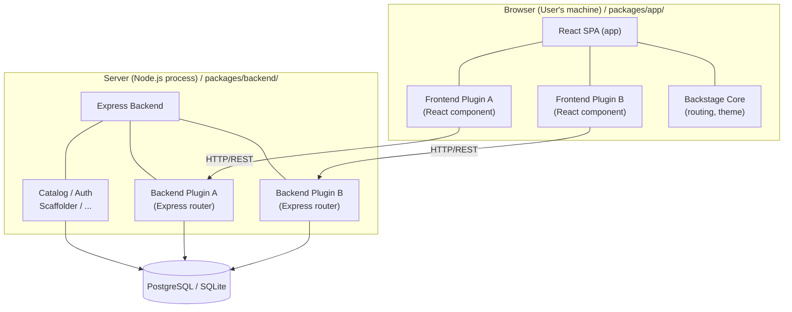

> **Complexity**: `[COMPLEX]` — Heaviest exam domain (32%)
>
> **Time to Complete**: 90-120 minutes
>
> **Prerequisites**: Module 1 (Backstage Development Workflow), familiarity with TypeScript, React basics, npm/yarn
>
> **CBA Domain**: Domain 4 — Customizing Backstage (32% of exam)

---

## What You'll Be Able to Do

After completing this module, you will be able to:

1. **Design** a Backstage frontend plugin with React components, Material UI theming, and route registration in the app shell.
2. **Implement** a backend plugin with Express routes, database migrations, and secure service-to-service authentication.
3. **Evaluate** Software Templates to scaffold new services using Nunjucks, robust CI/CD pipelines, and catalog registration logic.
4. **Diagnose** common plugin communication failures, extension point misconfigurations, and authentication provider integration issues by analyzing Backstage TypeScript code.

---

## Why This Module Matters

This is the single most important module for the Certified Backstage Associate (CBA) exam. **Domain 4 is worth 32%** of your total score — meaning nearly one in three questions will rigorously test your understanding of plugin development, Material UI integration, Software Templates, theming, and authentication providers. Backstage without plugins is just an empty shell. The entire value proposition of a developer portal — the software catalog, TechDocs, CI/CD visibility, and automated scaffolding — is delivered exclusively through plugins. Understanding how plugins function architecturally is synonymous with understanding how Backstage itself operates.

In 2024, a major European financial institution experienced a severe, multi-day production incident tied directly to an improperly designed Backstage plugin. A platform team had built a custom frontend plugin that polled an internal Kubernetes cluster API directly from the browser to display real-time pod metrics. Because they did not route the request securely through a Backstage backend plugin, the frontend inadvertently exposed raw, long-lived cluster tokens to the client environment. A compromised third-party browser extension harvested these tokens, leading to an unauthorized lateral movement incident. The resulting breach cost the company millions in regulatory fines, mandatory security audits, and lost engineering velocity.

The crucial lesson from this outage is that Backstage plugin development is not standard React development. It requires a deep, uncompromising understanding of the boundary between the browser and the server. You must know exactly where your code executes, how it authenticates, and how it handles resource limits. That architectural discipline is exactly what the CBA certification tests.

> **The Restaurant Analogy**
>
> Backstage is a restaurant kitchen. The core framework is the physical building — the walls, plumbing, and electricity. Frontend plugins are the distinct dishes on the menu that the customer interacts with. Backend plugins are the specialized kitchen stations (the grill, the prep line, the dessert station). Software Templates are the rigid recipes that allow line cooks to produce consistent meals at scale. Auth providers are the bouncers verifying identity at the door. You do not run a restaurant by staring at the building; you run it by cooking.

---

## Did You Know?

1. **Massive Ecosystem**: The Backstage community maintains a public directory at `backstage.io/plugins` and a dedicated `backstage/community-plugins` repository governed strictly under the Apache License 2.0.
2. **Strict Release Cadence**: As a CNCF Incubating project, Backstage follows a monthly main release line (shipping the Tuesday before the third Wednesday of each month) and a weekly `next` release line for early access.
3. **Runtime Support Windows**: Backstage strictly supports exactly two adjacent even-numbered Node.js LTS releases (e.g., Node.js 22 and 24) and the last three major TypeScript versions at any given time.
4. **The New Default**: As of v1.49.0, newly created Backstage apps use the New Frontend System by default. The old `--next` CLI flag has been removed and replaced by a `--legacy` flag.

---

## Part 1: Frontend vs Backend Plugin Architecture

Before writing a single line of code, you must fundamentally understand where Backstage plugins execute. This architectural separation is one of the most frequently tested concepts on the CBA exam.



> **Pause and predict**: If a frontend plugin needs to read a configuration file from the server's local disk, how would you design the data flow? (Hint: The browser cannot read the server's disk directly.)

### Key Differences

| Aspect | Frontend Plugin | Backend Plugin |
|--------|----------------|----------------|
| **Language** | TypeScript + React + JSX | TypeScript + Express |
| **Runs in** | Browser | Node.js server |
| **Access to** | DOM, browser APIs, user session | Filesystem, database, secrets, network |
| **Package location** | `plugins/my-plugin/` | `plugins/my-plugin-backend/` |
| **Entry point** | `createPlugin()` | `createBackendPlugin()` |
| **Communicates via** | Backstage API client (`fetchApiRef`) | Express routes mounted at `/api/my-plugin` |
| **Testing** | `@testing-library/react` | Supertest + backend test utils |

---

## Part 2: Frontend Plugin Development

Backstage is actively transitioning between two frontend architectures. While the New Frontend System (utilizing `createFrontendPlugin`) is the default as of v1.49.0, the legacy system (`createPlugin` from `@backstage/core-plugin-api`) remains fully supported, heavily utilized in enterprise environments, and widely tested. We focus heavily on these foundational patterns.

### 2.1 Creating a Frontend Plugin

Backstage provides a CLI command to scaffold a new plugin efficiently:

```bash
# From the Backstage root directory
yarn new --select plugin

# You'll be prompted for a plugin ID, e.g., "my-dashboard"
# This creates: plugins/my-dashboard/
```

The generated frontend plugin assumes a predictable, structured directory tree:

```text
plugins/my-dashboard/
├── src/
│   ├── index.ts              # Public API exports
│   ├── plugin.ts             # Plugin definition (createPlugin)
│   ├── routes.ts             # Route references
│   ├── components/
│   │   ├── MyDashboardPage/
│   │   │   ├── MyDashboardPage.tsx
│   │   │   └── index.ts
│   │   └── ExampleFetchComponent/
│   ├── api/                  # API client definitions
│   └── setupTests.ts
├── package.json
├── README.md
└── dev/                      # Standalone dev setup
    └── index.tsx
```

*Note: Plugin IDs heavily rely on kebab-case naming conventions, yielding package names like `@internal/plugin-my-dashboard`.*

### 2.2 The Plugin Definition — `createPlugin`

Every frontend plugin requires a central identity definition. This defines how Backstage registers the plugin, maps its routes, and exposes its extensions.

```typescript
// plugins/my-dashboard/src/plugin.ts
import {
  createPlugin,
  createRoutableExtension,
} from '@backstage/core-plugin-api';
import { rootRouteRef } from './routes';

export const myDashboardPlugin = createPlugin({
  id: 'my-dashboard',
  routes: {
    root: rootRouteRef,
  },
});

export const MyDashboardPage = myDashboardPlugin.provide(
  createRoutableExtension({
    name: 'MyDashboardPage',
    component: () =>
      import('./components/MyDashboardPage').then(m => m.MyDashboardPage),
    mountPoint: rootRouteRef,
  }),
);
```

What this code does, line by line:
- `createPlugin({ id: 'my-dashboard' })` — Registers the plugin globally using a unique ID.
- `routes: { root: rootRouteRef }` — Ties internal navigational routes to the plugin.
- `createRoutableExtension()` — Wraps your React component so it can be safely mounted into the Backstage application shell. It utilizes dynamic `import()` statements for aggressive code splitting.

### 2.3 Route References

```typescript
// plugins/my-dashboard/src/routes.ts
import { createRouteRef } from '@backstage/core-plugin-api';

export const rootRouteRef = createRouteRef({
  id: 'my-dashboard',
});
```

Route references represent abstract routing destinations. They do not dictate actual URL paths—those are assigned strictly when the plugin is mounted inside the main application.

### 2.4 Writing a Frontend Plugin Page

A Backstage frontend plugin page typically fetches data via the Backstage API layer and formats it using standard UI components.

```tsx
// plugins/my-dashboard/src/components/MyDashboardPage/MyDashboardPage.tsx
import React from 'react';
import { useApi, fetchApiRef } from '@backstage/core-plugin-api';
import {
  Header,
  Page,
  Content,
  ContentHeader,
  SupportButton,
  Table,
  TableColumn,
  InfoCard,
  Progress,
  ResponseErrorPanel,
} from '@backstage/core-components';
import { Grid } from '@mui/material';
import useAsync from 'react-use/lib/useAsync';

// Define the shape of data we expect from our backend
interface ServiceHealth {
  name: string;
  status: 'healthy' | 'degraded' | 'down';
  lastChecked: string;
  responseTimeMs: number;
}

// Table column definitions — Backstage's Table component uses this pattern
const columns: TableColumn<ServiceHealth>[] = [
  { title: 'Service', field: 'name' },
  {
    title: 'Status',
    field: 'status',
    render: (row: ServiceHealth) => {
      const colors: Record<string, string> = {
        healthy: '#4caf50',
        degraded: '#ff9800',
        down: '#f44336',
      };
      return (
        <span style={{ color: colors[row.status], fontWeight: 'bold' }}>
          {row.status.toUpperCase()}
        </span>
      );
    },
  },
  { title: 'Response Time (ms)', field: 'responseTimeMs', type: 'numeric' },
  { title: 'Last Checked', field: 'lastChecked' },
];

export const MyDashboardPage = () => {
  // useApi hook retrieves a Backstage API implementation by its ref
  const fetchApi = useApi(fetchApiRef);

  // useAsync handles loading/error states for async operations
  const {
    value: services,
    loading,
    error,
  } = useAsync(async (): Promise<ServiceHealth[]> => {
    const response = await fetchApi.fetch(
      '/api/my-dashboard/services/health',
    );
    if (!response.ok) {
      throw new Error(`Failed to fetch: ${response.statusText}`);
    }
    return response.json();
  }, []);

  if (loading) return <Progress />;
  if (error) return <ResponseErrorPanel error={error} />;

  return (
    <Page themeId="tool">
      <Header title="Service Health Dashboard" subtitle="Real-time status" />
      <Content>
        <ContentHeader title="Overview">
          <SupportButton>
            This dashboard shows the health of all registered services.
          </SupportButton>
        </ContentHeader>
        <Grid container spacing={3}>
          <Grid item xs={12}>
            <InfoCard title="Service Count">
              {services?.length ?? 0} services monitored
            </InfoCard>
          </Grid>
          <Grid item xs={12}>
            <Table
              title="Service Health"
              options={{ search: true, paging: true, pageSize: 10 }}
              columns={columns}
              data={services ?? []}
            />
          </Grid>
        </Grid>
      </Content>
    </Page>
  );
};
```

### Key Backstage Components Used Above

| Component | Package | Purpose |
|-----------|---------|---------|
| `Page` | `@backstage/core-components` | Top-level layout with sidebar support |
| `Header` | `@backstage/core-components` | Page header with title and subtitle |
| `Content` | `@backstage/core-components` | Main content area with padding |
| `InfoCard` | `@backstage/core-components` | A Material Design card with title |
| `Table` | `@backstage/core-components` | Data table with search, sort, pagination |
| `Progress` | `@backstage/core-components` | Loading spinner |
| `ResponseErrorPanel` | `@backstage/core-components` | Styled error display |
| `Grid` | `@mui/material` | MUI responsive grid layout |

### 2.5 Mounting the Plugin in the App

To make the plugin accessible, you must wire it into the core application router:

```tsx
// packages/app/src/App.tsx
import { MyDashboardPage } from '@internal/plugin-my-dashboard';

// Inside the <FlatRoutes> component:
<Route path="/my-dashboard" element={<MyDashboardPage />} />
```

And finally, add a navigation entry to the sidebar:

```tsx
// packages/app/src/components/Root/Root.tsx
import DashboardIcon from '@mui/icons-material/Dashboard';

// Inside the <Sidebar> component:
<SidebarItem icon={DashboardIcon} to="my-dashboard" text="Health" />
```

---

## Part 3: Backend Plugin Development

The New Backend System represents a massive leap forward in stability and composability, having reached stable 1.0 status. It completely replaces the older manual backend wiring with an elegant dependency injection system.

### 3.1 Creating a Backend Plugin

```bash
yarn new --select backend-plugin

# Enter plugin ID: "my-dashboard"
# This creates: plugins/my-dashboard-backend/
```

### 3.2 Backend Plugin Structure (New Backend System)

Here is the exact structure of a backend plugin leveraging the new architectural pattern:

```typescript
// plugins/my-dashboard-backend/src/plugin.ts
import {
  coreServices,
  createBackendPlugin,
} from '@backstage/backend-plugin-api';
import { createRouter } from './router';

export const myDashboardPlugin = createBackendPlugin({
  pluginId: 'my-dashboard',
  register(env) {
    env.registerInit({
      deps: {
        logger: coreServices.logger,
        http: coreServices.httpRouter,
        database: coreServices.database,
        config: coreServices.rootConfig,
      },
      async init({ logger, http, database, config }) {
        logger.info('Initializing my-dashboard backend plugin');

        const router = await createRouter({
          logger,
          database,
          config,
        });

        // Mount the Express router at /api/my-dashboard
        http.use(router);
      },
    });
  },
});
```

Key technical concepts for the New Backend System:
- **`createBackendPlugin`**: Declares a backend plugin mapped securely to `pluginId`.
- **Dependency Injection**: Through `coreServices`, you implicitly request services. Backstage orchestrates injecting the logger, the specific isolated database client, and the properly scoped HTTP router automatically.

### 3.3 Writing an Express Router

Backstage delegates complex logic to standard Express routers.

```typescript
// plugins/my-dashboard-backend/src/router.ts
import { Router } from 'express';
import { Logger } from 'winston';
import { DatabaseService } from '@backstage/backend-plugin-api';
import { Config } from '@backstage/config';

interface RouterOptions {
  logger: Logger;
  database: DatabaseService;
  config: Config;
}

interface ServiceHealthRecord {
  name: string;
  status: string;
  last_checked: string;
  response_time_ms: number;
}

export async function createRouter(
  options: RouterOptions,
): Promise<Router> {
  const { logger, database } = options;
  const router = Router();

  // Get a Knex database client from Backstage's database service
  const dbClient = await database.getClient();

  // Run migrations on startup (create tables if they don't exist)
  if (!await dbClient.schema.hasTable('service_health')) {
    await dbClient.schema.createTable('service_health', table => {
      table.string('name').primary();
      table.string('status').notNullable();
      table.timestamp('last_checked').defaultTo(dbClient.fn.now());
      table.integer('response_time_ms');
    });
    logger.info('Created service_health table');
  }

  // GET /api/my-dashboard/services/health
  router.get('/services/health', async (_req, res) => {
    try {
      const services = await dbClient<ServiceHealthRecord>(
        'service_health',
      ).select('*');

      res.json(
        services.map(s => ({
          name: s.name,
          status: s.status,
          lastChecked: s.last_checked,
          responseTimeMs: s.response_time_ms,
        })),
      );
    } catch (err) {
      logger.error('Failed to fetch service health', err);
      res.status(500).json({ error: 'Internal server error' });
    }
  });

  // POST /api/my-dashboard/services/health
  router.post('/services/health', async (req, res) => {
    const { name, status, responseTimeMs } = req.body;

    if (!name || !status) {
      res.status(400).json({ error: 'name and status are required' });
      return;
    }

    try {
      await dbClient('service_health')
        .insert({
          name,
          status,
          response_time_ms: responseTimeMs ?? 0,
          last_checked: new Date().toISOString(),
        })
        .onConflict('name')
        .merge(); // Upsert: update if exists

      res.status(201).json({ message: 'Service health recorded' });
    } catch (err) {
      logger.error('Failed to record service health', err);
      res.status(500).json({ error: 'Internal server error' });
    }
  });

  return router;
}
```

### 3.4 Registering the Backend Plugin

Thanks to the New Backend System, integrating this plugin takes precisely one line:

```typescript
// packages/backend/src/index.ts
import { myDashboardPlugin } from '@internal/plugin-my-dashboard-backend';

// In the backend builder:
backend.add(myDashboardPlugin);
```

---

## Part 4: Service-to-Service Authentication

When operating in the Backstage backend ecosystem, your custom plugin will frequently need to communicate with *other* Backstage backend plugins—for example, verifying an entity's existence in the Catalog before taking action. Because these routes are strictly protected by Backstage's core authentication policies, you cannot simply make raw, unauthenticated HTTP calls.

Backstage manages service-to-service communication via internally generated plugin tokens.

### Requesting a Plugin Token

In the New Backend System, you leverage the built-in `coreServices.auth` and `coreServices.httpAuth` modules to request authorization.

```typescript
// Example snippet demonstrating service-to-service auth
import { coreServices } from '@backstage/backend-plugin-api';

// Inside your plugin's init method:
async init({ logger, http, auth, httpAuth }) {
  http.get('/dependent-data', async (req, res) => {
    try {
      // 1. Extract the credentials of the user making the request
      const credentials = await httpAuth.credentials(req);
      
      // 2. Request a service-to-service token acting on behalf of the user
      const { token } = await auth.getPluginRequestToken({
        onBehalfOf: credentials,
        targetPluginId: 'catalog',
      });

      // 3. Attach the generated token to the downstream API call
      const response = await fetch('http://localhost:7007/api/catalog/entities', {
        headers: {
          Authorization: `Bearer ${token}`,
        }
      });
      
      const data = await response.json();
      res.json(data);
    } catch (error) {
      logger.error('Failed to communicate securely with the catalog', error);
      res.status(500).send('Internal Error');
    }
  });
}
```

> **Stop and think**: Why does Backstage require a distinct plugin token for backend-to-backend communication instead of directly reusing the user's initial session token? (Hint: Consider the security blast radius if a malicious plugin successfully intercepted a universal user session token).

---

## Part 5: Material UI (MUI) and Theming

### 5.1 Backstage's Relationship with MUI

Backstage relies heavily on Material UI v5 (`@mui/material`). The visual consistency across Backstage depends entirely on utilizing these primitives correctly. Ensure you do not accidentally use MUI v4 packages (`@material-ui/core`) when building new features. Backstage currently actively supports React 18, with React 19 currently under strict evaluation.

| MUI Component | Backstage Usage |
|---------------|-----------------|
| `Grid` | Page layouts, responsive design |
| `Card` / `CardContent` | Content grouping (wrapped by `InfoCard`) |
| `Typography` | Text with semantic meaning (h1-h6, body, caption) |
| `Button` | Actions, form submissions |
| `TextField` | Form inputs in template forms |
| `Table` / `TableBody` / `TableRow` | Data display (Backstage wraps this in its own `Table`) |
| `Tabs` / `Tab` | Entity page tab navigation |
| `Chip` | Status badges, tags |
| `Dialog` | Modal dialogs for confirmations |

### 5.2 Custom Themes

Backstage portals use `createUnifiedTheme` to unify MUI styling with Backstage-specific palettes.

```typescript
// packages/app/src/theme.ts
import { createUnifiedTheme, palettes } from '@backstage/theme';

export const myCustomTheme = createUnifiedTheme({
  palette: {
    ...palettes.light,
    primary: {
      main: '#1565c0',       // Your brand blue
    },
    secondary: {
      main: '#f57c00',       // Your brand orange
    },
    navigation: {
      background: '#171717', // Dark sidebar
      indicator: '#1565c0',  // Active item highlight
      color: '#ffffff',      // Sidebar text
      selectedColor: '#ffffff',
    },
  },
  defaultPageTheme: 'home',
  fontFamily: '"Inter", "Helvetica", "Arial", sans-serif',
  components: {
    // Override specific MUI component styles globally
    MuiButton: {
      styleOverrides: {
        root: {
          textTransform: 'none', // No ALL CAPS buttons
          borderRadius: 8,
        },
      },
    },
    MuiCard: {
      styleOverrides: {
        root: {
          borderRadius: 12,
        },
      },
    },
  },
});
```

Register the exact theme safely at the root level:

```tsx
// packages/app/src/App.tsx
import { myCustomTheme } from './theme';
import { UnifiedThemeProvider } from '@backstage/theme';

// In the app root:
<UnifiedThemeProvider theme={myCustomTheme}>
  <AppRouter>
    {/* ... routes ... */}
  </AppRouter>
</UnifiedThemeProvider>
```

### 5.3 Using the `sx` Prop

MUI v5 aggressively uses the `sx` property for component-level styling logic. 

```tsx
import { Box, Typography, Chip } from '@mui/material';

export const StatusBanner = ({ status }: { status: string }) => (
  <Box
    sx={{
      display: 'flex',
      alignItems: 'center',
      gap: 2,
      p: 2,                         // padding: theme.spacing(2)
      bgcolor: 'background.paper',  // uses theme palette
      borderRadius: 1,
    }}
  >
    <Typography variant="h6">Current Status</Typography>
    <Chip
      label={status}
      color={status === 'healthy' ? 'success' : 'error'}
      sx={{ fontWeight: 'bold' }}
    />
  </Box>
);
```

---

## Part 6: Installing Existing Plugins

You do not need to build everything natively. The Backstage ecosystem houses extensive open-source solutions.

### 6.1 Installation Pattern

Installing a robust external plugin follows this strict workflow:

```bash
# 1. Install the frontend package
yarn --cwd packages/app add @backstage/plugin-tech-radar

# 2. Install the backend package (if the plugin has one)
yarn --cwd packages/backend add @backstage/plugin-tech-radar-backend
```

Wire the frontend React elements:

```tsx
// 3. Wire frontend into packages/app/src/App.tsx
import { TechRadarPage } from '@backstage/plugin-tech-radar';

<Route path="/tech-radar" element={<TechRadarPage />} />
```

Bind the backend execution context:

```typescript
// 4. Wire backend into packages/backend/src/index.ts
backend.add(import('@backstage/plugin-tech-radar-backend'));
```

Provide explicit configuration values:

```yaml
# 5. Configure in app-config.yaml (if needed)
techRadar:
  url: https://your-org.com/tech-radar-data.json
```

### 6.2 Overriding Plugin Components

A critical customization strategy is overriding specific elements within an external plugin without resorting to forking the code:

```tsx
// packages/app/src/App.tsx
import { createApp } from '@backstage/app-defaults';
import { catalogPlugin } from '@backstage/plugin-catalog';

const app = createApp({
  // ...
  bindRoutes({ bind }) {
    bind(catalogPlugin.externalRoutes, {
      createComponent: scaffolderPlugin.routes.root,
    });
  },
});
```

---

## Part 7: Software Templates and Scaffolder

Software Templates enforce organizational golden paths. They are heavily tested on the exam.

### 7.1 Template Structure

Templates are standard YAML definitions utilizing `kind: Template`:

```yaml
apiVersion: scaffolder.backstage.io/v1beta3
kind: Template
metadata:
  name: create-nodejs-service
  title: Create a Node.js Microservice
  description: Creates a new Node.js service with CI/CD, monitoring, and docs
  tags:
    - nodejs
    - recommended
spec:
  owner: platform-team
  type: service

  # Step 1: Collect user input
  parameters:
    - title: Service Details
      required:
        - name
        - owner
      properties:
        name:
          title: Service Name
          type: string
          description: Unique name for the service
          pattern: '^[a-z0-9-]+$'
          ui:autofocus: true
        owner:
          title: Owner
          type: string
          description: Team that owns this service
          ui:field: OwnerPicker
          ui:options:
            catalogFilter:
              kind: Group
        description:
          title: Description
          type: string

    - title: Infrastructure
      properties:
        database:
          title: Database
          type: string
          enum: ['none', 'postgresql', 'mongodb']
          default: 'none'
        port:
          title: Port
          type: number
          default: 3000

  # Step 2: Execute actions
  steps:
    - id: fetch-template
      name: Fetch Skeleton
      action: fetch:template
      input:
        url: ./skeleton     # Directory containing template files
        values:
          name: ${{ parameters.name }}
          owner: ${{ parameters.owner }}
          description: ${{ parameters.description }}
          database: ${{ parameters.database }}
          port: ${{ parameters.port }}

    - id: publish
      name: Publish to GitHub
      action: publish:github
      input:
        allowedHosts: ['github.com']
        repoUrl: github.com?owner=my-org&repo=${{ parameters.name }}
        description: ${{ parameters.description }}
        defaultBranch: main
        repoVisibility: internal

    - id: register
      name: Register in Catalog
      action: catalog:register
      input:
        repoContentsUrl: ${{ steps['publish'].output.repoContentsUrl }}
        catalogInfoPath: '/catalog-info.yaml'

  # What to show the user when done
  output:
    links:
      - title: Repository
        url: ${{ steps['publish'].output.remoteUrl }}
      - title: Open in Backstage
        icon: catalog
        entityRef: ${{ steps['register'].output.entityRef }}
```

### 7.2 Built-in Template Actions

| Action | Purpose |
|--------|---------|
| `fetch:template` | Copy and render template files (Nunjucks syntax) |
| `fetch:plain` | Copy files without templating |
| `publish:github` | Create a GitHub repository |
| `publish:gitlab` | Create a GitLab project |
| `publish:bitbucket` | Create a Bitbucket repository |
| `catalog:register` | Register the new entity in the Backstage catalog |
| `catalog:write` | Write a `catalog-info.yaml` file |
| `debug:log` | Log a message (useful for debugging templates) |

### 7.3 Writing a Custom Template Action

Custom template actions execute purely on the backend, allowing them to communicate securely with third-party systems like Jira.

```typescript
// plugins/scaffolder-backend-custom/src/actions/createJiraTicket.ts
import { createTemplateAction } from '@backstage/plugin-scaffolder-node';
import { Config } from '@backstage/config';

export function createJiraTicketAction(options: { config: Config }) {
  const { config } = options;

  return createTemplateAction<{
    projectKey: string;
    summary: string;
    description: string;
    issueType: string;
  }>({
    id: 'jira:create-ticket',
    description: 'Creates a Jira ticket for tracking the new service',
    schema: {
      input: {
        type: 'object',
        required: ['projectKey', 'summary'],
        properties: {
          projectKey: {
            type: 'string',
            title: 'Jira Project Key',
            description: 'e.g., PLATFORM',
          },
          summary: {
            type: 'string',
            title: 'Ticket Summary',
          },
          description: {
            type: 'string',
            title: 'Ticket Description',
          },
          issueType: {
            type: 'string',
            title: 'Issue Type',
            enum: ['Task', 'Story', 'Bug'],
            default: 'Task',
          },
        },
      },
      output: {
        type: 'object',
        properties: {
          ticketUrl: {
            type: 'string',
            title: 'URL of the created Jira ticket',
          },
          ticketKey: {
            type: 'string',
            title: 'Jira ticket key (e.g., PLATFORM-123)',
          },
        },
      },
    },
    async handler(ctx) {
      const { projectKey, summary, description, issueType } = ctx.input;
      const jiraUrl = config.getString('jira.url');
      const jiraToken = config.getString('jira.apiToken');

      ctx.logger.info(
        `Creating Jira ticket in project ${projectKey}: ${summary}`,
      );

      const response = await fetch(`${jiraUrl}/rest/api/3/issue`, {
        method: 'POST',
        headers: {
          'Content-Type': 'application/json',
          Authorization: `Basic ${jiraToken}`,
        },
        body: JSON.stringify({
          fields: {
            project: { key: projectKey },
            summary,
            description: {
              type: 'doc',
              version: 1,
              content: [
                {
                  type: 'paragraph',
                  content: [{ type: 'text', text: description || summary }],
                },
              ],
            },
            issuetype: { name: issueType || 'Task' },
          },
        }),
      });

      if (!response.ok) {
        const errorBody = await response.text();
        throw new Error(`Jira API error (${response.status}): ${errorBody}`);
      }

      const data = await response.json();

      ctx.logger.info(`Created Jira ticket: ${data.key}`);

      // Output values can be referenced by later template steps
      ctx.output('ticketKey', data.key);
      ctx.output('ticketUrl', `${jiraUrl}/browse/${data.key}`);
    },
  });
}
```

Wiring the action module into the New Backend System using dependency injection:

```typescript
// plugins/scaffolder-backend-custom/src/plugin.ts
import { scaffolderActionsExtensionPoint } from '@backstage/plugin-scaffolder-node/alpha';
import { createBackendModule } from '@backstage/backend-plugin-api';
import { createJiraTicketAction } from './actions/createJiraTicket';

export const scaffolderModuleJiraAction = createBackendModule({
  pluginId: 'scaffolder',
  moduleId: 'jira-action',
  register(env) {
    env.registerInit({
      deps: {
        scaffolder: scaffolderActionsExtensionPoint,
        config: coreServices.rootConfig,
      },
      async init({ scaffolder, config }) {
        scaffolder.addActions(createJiraTicketAction({ config }));
      },
    });
  },
});
```

Using the custom action seamlessly in YAML:

```yaml
steps:
  # ... other steps ...
  - id: create-jira-ticket
    name: Create Tracking Ticket
    action: jira:create-ticket
    input:
      projectKey: PLATFORM
      summary: 'New service: ${{ parameters.name }}'
      description: 'Service created via Backstage template by ${{ user.entity.metadata.name }}'
      issueType: Task
```

---

## Part 8: Auth Providers

Authentication configuration heavily influences internal Backstage identity resolution.

### 8.1 GitHub App Auth

```yaml
# app-config.yaml
auth:
  environment: production
  providers:
    github:
      production:
        clientId: ${GITHUB_CLIENT_ID}
        clientSecret: ${GITHUB_CLIENT_SECRET}
        signIn:
          resolvers:
            - resolver: usernameMatchingUserEntityName
```

### 8.2 Okta / OIDC

```yaml
# app-config.yaml
auth:
  providers:
    okta:
      production:
        clientId: ${OKTA_CLIENT_ID}
        clientSecret: ${OKTA_CLIENT_SECRET}
        audience: ${OKTA_AUDIENCE}
        authServerId: ${OKTA_AUTH_SERVER_ID}  # 'default' for org auth server
        signIn:
          resolvers:
            - resolver: emailMatchingUserEntityProfileEmail
```

### 8.3 Sign-in Resolvers

Resolvers securely map an incoming external identity (GitHub payload, Okta token) directly to an internal Catalog User Entity.

| Resolver | What it does |
|----------|-------------|
| `usernameMatchingUserEntityName` | Matches the provider's username to the `metadata.name` of a User entity |
| `emailMatchingUserEntityProfileEmail` | Matches the provider's email to `spec.profile.email` of a User entity |
| `emailLocalPartMatchingUserEntityName` | Matches the part before `@` in the email to `metadata.name` |

Custom backend modules allow overriding this behavior dynamically:

```typescript
// packages/backend/src/auth.ts
import { createBackendModule } from '@backstage/backend-plugin-api';
import {
  authProvidersExtensionPoint,
  createOAuthProviderFactory,
} from '@backstage/plugin-auth-node';
import { githubAuthenticator } from '@backstage/plugin-auth-backend-module-github-provider';

export const authModuleGithubCustom = createBackendModule({
  pluginId: 'auth',
  moduleId: 'github-custom-resolver',
  register(reg) {
    reg.registerInit({
      deps: {
        providers: authProvidersExtensionPoint,
      },
      async init({ providers }) {
        providers.registerProvider({
          providerId: 'github',
          factory: createOAuthProviderFactory({
            authenticator: githubAuthenticator,
            async signInResolver(info, ctx) {
              // info.result contains the GitHub profile
              const { fullProfile } = info.result;
              const userId = fullProfile.username;

              if (!userId) {
                throw new Error('GitHub username is required');
              }

              // Issue a Backstage token for this user
              return ctx.signInWithCatalogUser({
                entityRef: { name: userId },
              });
            },
          }),
        });
      },
    });
  },
});
```

---

## Part 9: Testing Plugins

The Backstage framework utilizes `Jest` extensively for plugin testing validation routines.

### 9.1 Frontend Plugin Tests

```tsx
// plugins/my-dashboard/src/components/MyDashboardPage/MyDashboardPage.test.tsx
import React from 'react';
import { screen } from '@testing-library/react';
import { renderInTestApp } from '@backstage/test-utils';
import { MyDashboardPage } from './MyDashboardPage';
import { rest } from 'msw';
import { setupServer } from 'msw/node';

// Mock the backend API using MSW (Mock Service Worker)
const server = setupServer(
  rest.get('/api/my-dashboard/services/health', (_req, res, ctx) => {
    return res(
      ctx.json([
        {
          name: 'auth-service',
          status: 'healthy',
          lastChecked: '2025-01-15T10:30:00Z',
          responseTimeMs: 42,
        },
        {
          name: 'payment-service',
          status: 'degraded',
          lastChecked: '2025-01-15T10:30:00Z',
          responseTimeMs: 1500,
        },
      ]),
    );
  }),
);

beforeAll(() => server.listen());
afterEach(() => server.resetHandlers());
afterAll(() => server.close());

describe('MyDashboardPage', () => {
  it('should render the service health table', async () => {
    await renderInTestApp(<MyDashboardPage />);

    // Wait for async data to load
    expect(
      await screen.findByText('Service Health Dashboard'),
    ).toBeInTheDocument();
    expect(await screen.findByText('auth-service')).toBeInTheDocument();
    expect(await screen.findByText('DEGRADED')).toBeInTheDocument();
  });

  it('should show an error panel when the API fails', async () => {
    server.use(
      rest.get('/api/my-dashboard/services/health', (_req, res, ctx) => {
        return res(ctx.status(500));
      }),
    );

    await renderInTestApp(<MyDashboardPage />);

    expect(await screen.findByText(/failed to fetch/i)).toBeInTheDocument();
  });
});
```

### 9.2 Backend Plugin Tests

```typescript
// plugins/my-dashboard-backend/src/router.test.ts
import { createRouter } from './router';
import express from 'express';
import request from 'supertest';
import { getVoidLogger } from '@backstage/backend-common';
import Knex from 'knex';

describe('createRouter', () => {
  let app: express.Express;

  beforeAll(async () => {
    // Create an in-memory SQLite database for testing
    const knex = Knex({
      client: 'better-sqlite3',
      connection: ':memory:',
      useNullAsDefault: true,
    });

    const router = await createRouter({
      logger: getVoidLogger(),
      database: {
        getClient: async () => knex,
      } as any,
      config: {} as any,
    });

    app = express();
    app.use(express.json());
    app.use(router);
  });

  it('GET /services/health returns empty array initially', async () => {
    const response = await request(app).get('/services/health');
    expect(response.status).toBe(200);
    expect(response.body).toEqual([]);
  });

  it('POST /services/health creates a record', async () => {
    const response = await request(app)
      .post('/services/health')
      .send({ name: 'test-svc', status: 'healthy', responseTimeMs: 50 });

    expect(response.status).toBe(201);
  });

  it('GET /services/health returns the created record', async () => {
    const response = await request(app).get('/services/health');
    expect(response.status).toBe(200);
    expect(response.body).toHaveLength(1);
    expect(response.body[0].name).toBe('test-svc');
  });

  it('POST /services/health rejects missing fields', async () => {
    const response = await request(app)
      .post('/services/health')
      .send({ status: 'healthy' }); // Missing 'name'

    expect(response.status).toBe(400);
  });
});
```

---

## Common Mistakes

| Mistake | Why It Happens | Fix |
|---------|---------------|-----|
| Importing backend code in a frontend plugin | Looks like regular TypeScript imports | Frontend runs in the browser. It cannot access Node.js APIs, the filesystem, or the database. Use `fetchApiRef` to call your backend plugin over HTTP. |
| Using MUI v4 syntax (`makeStyles`, `@material-ui/core`) | Following outdated tutorials | Backstage uses MUI v5. Use `sx` prop, `styled()`, or `@mui/material` imports. |
| Hardcoding API URLs (`fetch('http://localhost:7007/...')`) | Works in local dev | Use `fetchApiRef` from `@backstage/core-plugin-api`. Backstage handles base URL resolution, auth headers, and proxy routing. |
| Forgetting to register the backend plugin | Plugin code exists but is never loaded | Add `backend.add(myPlugin)` in `packages/backend/src/index.ts`. No registration = no routes mounted. |
| Template actions with no error handling | Happy-path development | If a template action throws, the entire scaffolder run fails with a cryptic error. Always wrap external API calls in try/catch and provide meaningful error messages. |
| Using `getBy*` in tests for async content | Unfamiliar with testing-library patterns | Data that loads from an API is async. Use `findBy*` (which retries) instead of `getBy*` (which asserts immediately). |
| Creating custom themes with `createTheme` | Mixing MUI's `createTheme` with Backstage | Use `createUnifiedTheme` from `@backstage/theme`, not `createTheme` from `@mui/material`. Backstage's version adds page themes, navigation palette, and plugin integration. |
| Not setting `pluginId` on backend plugins | Copy-paste errors | The `pluginId` determines the API route prefix (`/api/<pluginId>`). If two plugins share an ID, routes collide. |

---

## Quiz

Test your understanding of deep plugin architecture. These scenario-based questions heavily mirror the difficulty and format of the actual CBA exam.

**Q1**: Your team is migrating an older React application into Backstage. You need to register the new feature within the Backstage legacy frontend system so it can expose routes and APIs. What specific function do you invoke to establish this initial plugin definition?

<details>
<summary>Answer</summary>

`createPlugin()` from `@backstage/core-plugin-api`. It takes an object with `id`, `routes`, `apis`, and other configuration. It returns a plugin instance that can provide extensions via `.provide()`.
</details>

**Q2**: A junior developer submits a PR for a new frontend plugin. In their component, they retrieve data using `const res = await window.fetch('http://localhost:7007/api/inventory/data');`. During code review, you explicitly reject this approach. How should the developer modify their code to correctly make authenticated requests to the backend plugin?

<details>
<summary>Answer</summary>

Use `useApi(fetchApiRef)` to get the Backstage fetch API, then call `fetchApi.fetch('/api/my-plugin/endpoint')`. This ensures the request includes proper auth headers and uses the correct base URL. Never use `window.fetch` or hardcode URLs.
</details>

**Q3**: You are designing a backend plugin for the New Backend System. You declare a dependency on `coreServices.httpRouter` in your plugin initialization. When you pass this service to your router factory, what exactly are you receiving and how is its routing path determined?

<details>
<summary>Answer</summary>

An Express router that is automatically mounted at `/api/<pluginId>`. Routes you add to this router are accessible at `/api/<pluginId>/your-route`. You do not need to manually configure the mount path.
</details>

**Q4**: Your platform team maintains a Software Template that scaffolds a Java Spring Boot application. Developers report that the generated `.jar` wrapper files and certain Spring XML configurations are severely corrupted upon generation. What scaffolder action is likely causing this, and how should you adjust your template steps to resolve it?

<details>
<summary>Answer</summary>

`fetch:template` copies files and processes them through the Nunjucks templating engine, replacing `${{ values.name }}` placeholders with actual values. `fetch:plain` copies files as-is without any template processing. Use `fetch:plain` for binary files or when template syntax would conflict with the file content.
</details>

**Q5**: The design team provides a comprehensive Material UI theme configuration and instructs you to apply it to your Backstage portal. A developer attempts to integrate it using MUI's standard `createTheme` function, but notices that the sidebar navigation styling is broken and page backgrounds do not render correctly. What function must be used instead, and why?

<details>
<summary>Answer</summary>

`createUnifiedTheme` from `@backstage/theme`. This function extends MUI's theme with Backstage-specific features: page themes (`themeId`), navigation palette colors, and plugin-aware component overrides. Using MUI's `createTheme` directly will produce a theme that is missing Backstage-specific properties.
</details>

**Q6**: You are implementing a custom scaffolder action that creates a PagerDuty project. A developer asks if they can use the browser's `localStorage` within the action handler to cache the PagerDuty API token to speed up subsequent template runs. How do you explain the execution environment of this action?

<details>
<summary>Answer</summary>

On the server (Node.js backend). All scaffolder actions run server-side in the backend scaffolder process. This is why they can access secrets from `app-config.yaml`, make authenticated API calls, and interact with the filesystem. The browser only collects form input and displays progress.
</details>

**Q7**: In your frontend plugin's test suite, you mock an API endpoint using MSW. You then render the component and assert `expect(screen.getByText('Service Analytics')).toBeInTheDocument();`. The test fails consistently, stating the element cannot be found, even though it appears correctly in the browser instance. How should you modify your assertion logic?

<details>
<summary>Answer</summary>

Use `findByText('Loading...')` or more commonly `findByText('expected content after load')`. The `findBy*` queries from `@testing-library/react` retry until the element appears (with a default timeout). `getBy*` queries assert immediately and fail if the element is not in the DOM yet.
</details>

**Q8**: Your organization has authored a custom template action to register infrastructure in ServiceNow. Under the New Backend System, how do you correctly inject this specific custom action into the existing scaffolder backend plugin so that templates can broadly reference it?

<details>
<summary>Answer</summary>

Create a backend module using `createBackendModule` with `pluginId: 'scaffolder'`. In the module's `register` function, declare a dependency on `scaffolderActionsExtensionPoint` and call `scaffolder.addActions(yourCustomAction())` in the `init` function. Then add the module to the backend with `backend.add(yourModule)`. This pattern uses Backstage's dependency injection rather than manual wiring.
</details>

**Q9**: During a hackathon, an engineer attempts to speed up development by directly querying the PostgreSQL catalog database from their frontend React component. They import `DatabaseService` from `@backstage/backend-plugin-api`. What will be the exact result of this architectural decision during the build phase and at runtime?

<details>
<summary>Answer</summary>

The build will likely succeed (TypeScript types are just types), but the plugin will fail at runtime. `DatabaseService` and other backend APIs have no implementation in the browser environment. Frontend plugins cannot access the database directly. The author needs to create a backend plugin that exposes the data over an HTTP API and have the frontend plugin call that API using `fetchApiRef`.
</details>

**Q10**: A Software Template executes a `publish:gitlab` step (assigned the ID `create-repo`) which successfully returns the URL of the newly created repository. In the subsequent `catalog:register` step, how do you correctly pass this generated repository URL dynamically as the input parameter?

<details>
<summary>Answer</summary>

Use the syntax `${{ steps['step-id'].output.outputName }}`. For example, if a `publish:github` step with `id: publish` outputs `remoteUrl`, you reference it as `${{ steps['publish'].output.remoteUrl }}`. Each action defines its own output schema, and outputs are set in the action handler via `ctx.output('key', value)`.
</details>

---

## Hands-On Exercise: Build a Full-Stack Backstage Plugin

**Objective**: Build a robust "Team Links" plugin that displays and manages useful navigational links for specific teams. This comprehensive exercise covers frontend scaffolding, backend database routing, and component wiring.

### Task 1: Scaffolding the Workspace Environment

You cannot build plugins without a host application. Scaffold a fresh Backstage instance utilizing supported Node.js 22/24 environments.

<details>
<summary>Solution</summary>

Open your terminal and bootstrap the central application:

```bash
# Ensure you have a Backstage app (if not, create one)
npx @backstage/create-app@latest

cd my-backstage-app
```
</details>

### Task 2: Create the Backend Data Plugin

Construct the backend plugin responsible for managing the link data securely.

<details>
<summary>Solution</summary>

Use the built-in generator to construct the node package:

```bash
yarn new --select backend-plugin
# Name it: team-links
```

Navigate to `plugins/team-links-backend/src/router.ts`. The generator automatically creates the Express router wrapper and boilerplate health endpoint that you will expand upon.
</details>

### Task 3: Create the Frontend Visual Plugin

Scaffold the React user interface that users will interact with.

<details>
<summary>Solution</summary>

Run the generator again, selecting the frontend option:

```bash
yarn new --select plugin
# Name it: team-links
```

Explore `plugins/team-links/src/components/ExampleComponent` to observe how Backstage automatically wires its testing libraries and base React components.
</details>

### Task 4: Implement Explicit Backend Routing

Modify the scaffolded backend router to intercept HTTP requests, store data (using an in-memory mock for brevity), and return it.

<details>
<summary>Solution</summary>

Open `plugins/team-links-backend/src/router.ts` and modify the Express router block to map a specific GET route returning a simulated array:

```typescript
const links = [{ team: 'platform', title: 'Platform Docs', url: 'https://docs.example.com' }];

router.get('/links/:teamName', (req, res) => {
  const teamLinks = links.filter(l => l.team === req.params.teamName);
  res.json(teamLinks);
});
```
</details>

### Task 5: Connect the Frontend Interface via `fetchApiRef`

Wire the frontend React element to securely poll the backend route you established in Task 4.

<details>
<summary>Solution</summary>

Open `plugins/team-links/src/components/ExampleComponent/ExampleFetchComponent.tsx`. Locate the existing `useAsync` hook and adjust the fetch destination to point specifically to your new backend API namespace:

```tsx
const { value, loading, error } = useAsync(async (): Promise<any> => {
  const response = await fetchApi.fetch('/api/team-links/links/platform');
  return await response.json();
}, []);
```
</details>

### Success Checkpoint Criteria

- [ ] `yarn dev` boots both the frontend static site and the node backend server without terminal compilation errors.
- [ ] Navigating explicitly to `/team-links` securely displays the plugin page.
- [ ] Links fetched from the backend API successfully populate the frontend table.
- [ ] `yarn test` passes reliably for both `plugins/team-links` and `plugins/team-links-backend`.
- [ ] Code review confirms absolutely zero direct `window.fetch` implementations — ensuring all networking routes through `fetchApiRef`.

---

## Summary

This module thoroughly covered the core architectural primitives of CBA Domain 4 — the largest and most critical domain representing 32% of the total exam score.

| Topic | Key Takeaway |
|-------|-------------|
| Frontend plugins | `createPlugin` + `createRoutableExtension`, mounted in `App.tsx` |
| Backend plugins | `createBackendPlugin` with dependency injection via `coreServices` |
| Communication | Frontend calls backend over HTTP using `fetchApiRef`, never direct imports |
| MUI / Theming | MUI v5 components, `sx` prop, `createUnifiedTheme` for custom branding |
| Software Templates | YAML-defined workflows with `fetch:template`, `publish:github`, `catalog:register` |
| Custom actions | `createTemplateAction` with typed input/output schemas, runs server-side |
| Auth providers | YAML config + sign-in resolvers that map external identity to catalog User entity |
| Testing | `renderInTestApp` + MSW for frontend, supertest + in-memory DB for backend |
| Plugin installation | Install package, wire into app/backend, configure in `app-config.yaml` |

---

## Next Steps

- **Module 3**: [Backstage Catalog Deep Dive](../module-1.3-backstage-catalog-infrastructure/) — Explore entity processors, validation providers, structured annotations, and architectural troubleshooting (Domain 3, 22%).
- **Module 1**: [Backstage Development Workflow](../module-1.1-backstage-dev-workflow/) — Review the monorepo structure, Docker orchestration builds, and CLI commands (Domain 1, 24%).
- Examine the [Backstage Official Plugin Development Guide](https://backstage.io/docs/plugins/) to internalize complex edge-cases and routing patterns prior to the exam.