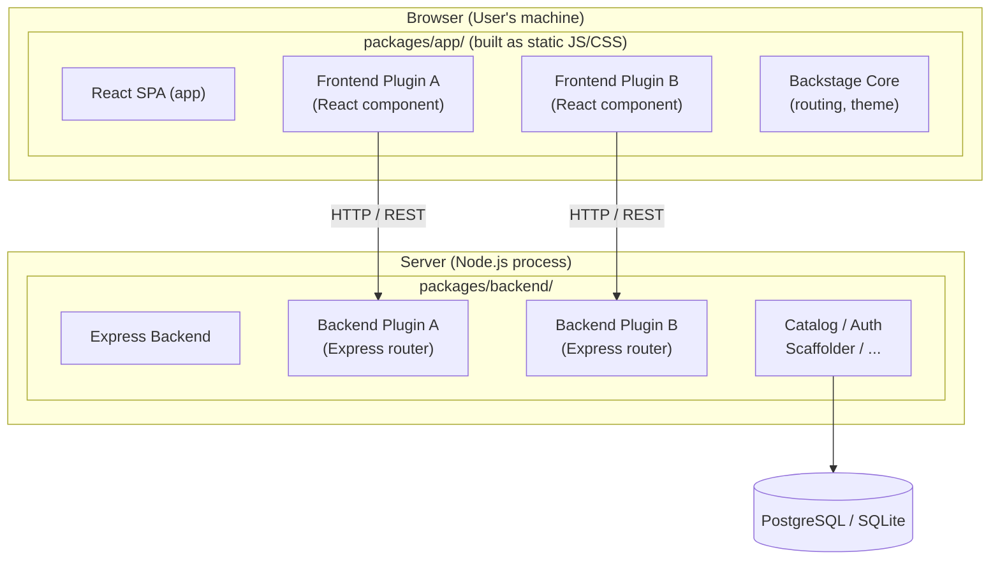

> **Complexity**: `[COMPLEX]` — Heaviest exam domain (32%)
>
> **Time to Complete**: 90-120 minutes
>
> **Prerequisites**: Module 1 (Backstage Development Workflow), familiarity with TypeScript, React basics, npm/yarn
>
> **CBA Domain**: Domain 4 — Customizing Backstage (32% of exam)

---

## What You'll Be Able to Do

After completing this module, you will be able to:

1. **Build** a Backstage frontend plugin with React components, Material UI theming, and route registration in the app shell
2. **Build** a backend plugin with Express routes, database migrations, and service-to-service authentication
3. **Create** Software Templates that scaffold new services with cookiecutter/Nunjucks, including CI/CD pipelines and catalog registration
4. **Analyze** plugin extension points, composability APIs, and auth provider integration by reading Backstage TypeScript code

---

## Why This Module Matters

This is the single most important module for the CBA exam. **Domain 4 is worth 32%** — nearly one in three questions will test your understanding of plugin development, Material UI, Software Templates, theming, and auth providers.

Backstage without plugins is an empty shell. The entire value proposition — the software catalog, TechDocs, CI/CD visibility, scaffolding — all of it is delivered through plugins. When Spotify built Backstage, they designed it as a plugin platform first and a portal second. Understanding how plugins work is understanding how Backstage works.

This module is code-heavy by design. The exam shows you TypeScript and React snippets and asks what they do. You will not write code during the exam, but you absolutely need to *read* code fluently.

> **The Restaurant Analogy**
>
> Backstage is a restaurant kitchen. The core framework is the building — walls, plumbing, electricity. Frontend plugins are the dishes on the menu. Backend plugins are the kitchen stations (grill, prep, dessert). Software Templates are the recipes that let line cooks produce consistent meals. Auth providers are the bouncers at the door. You do not run a restaurant by staring at the building — you run it by cooking.

---

## War Story: The Plugin That Broke Production

In 2024, a major European financial institution experienced a severe, multi-day production incident tied directly to an improperly designed Backstage plugin. A platform team had built a custom frontend plugin that polled an internal Kubernetes cluster API directly from the browser to display real-time pod metrics. Because they did not route the request securely through a Backstage backend plugin, the frontend inadvertently exposed raw, long-lived cluster tokens to the client environment. A compromised third-party browser extension harvested these tokens, leading to an unauthorized lateral movement incident. The resulting breach cost the company millions in regulatory fines, mandatory security audits, and lost engineering velocity.

The crucial lesson from this outage is that Backstage plugin development is not standard React development. It requires a deep, uncompromising understanding of the boundary between the browser and the server. You must know exactly where your code executes, how it authenticates, and how it handles resource limits. That architectural discipline is exactly what the CBA certification tests.

---

## Did You Know?

1. **Massive Ecosystem**: The Backstage community maintains a public directory at `backstage.io/plugins` and a dedicated `backstage/community-plugins` repository governed strictly under the Apache License 2.0.
2. **Strict Release Cadence**: As a CNCF Incubating project, Backstage follows a monthly main release line (shipping the Tuesday before the third Wednesday of each month) and a weekly `next` release line for early access.
3. **Runtime Support Windows**: Backstage strictly supports exactly two adjacent even-numbered Node.js LTS releases (e.g., Node.js 22 and 24) and the last three major TypeScript versions at any given time.
4. **The New Default**: As of v1.49.0 (the latest confirmed stable release in early 2026), newly created Backstage apps use the New Frontend System by default. The old `--next` CLI flag has been removed and replaced by a `--legacy` flag.

---

## Part 1: Frontend vs Backend Plugin Architecture

Before writing any code, you need to understand where plugins run. This is one of the most commonly tested concepts on the CBA.

> **Pause and predict**: If a frontend plugin makes a network request to an external SaaS API directly from the browser, what security vulnerabilities might this expose compared to routing the request through a backend plugin?



### Key Differences

| Aspect | Frontend Plugin | Backend Plugin |
|--------|----------------|----------------|
| **Language** | TypeScript + React + JSX | TypeScript + Express |
| **Runs in** | Browser | Node.js server |
| **Access to** | DOM, browser APIs, user session | Filesystem, database, secrets, network |
| **Package location** | `plugins/my-plugin/` | `plugins/my-plugin-backend/` |
| **Entry point** | `createPlugin()` | `createBackendPlugin()` |
| **Communicates via** | Backstage API client (`fetchApiRef`) | Express routes mounted at `/api/my-plugin` |
| **Testing** | `@testing-library/react` | Supertest + backend test utils |

---

## Part 2: Frontend Plugin Development

### 2.1 Creating a Frontend Plugin

Backstage provides a CLI command to scaffold a new plugin:

```bash
# From the Backstage root directory
yarn new --select plugin

# You'll be prompted for a plugin ID, e.g., "my-dashboard"
# This creates: plugins/my-dashboard/
```

The generated plugin structure:

```
plugins/my-dashboard/
├── src/
│   ├── index.ts              # Public API exports
│   ├── plugin.ts             # Plugin definition (createPlugin)
│   ├── routes.ts             # Route references
│   ├── components/
│   │   ├── MyDashboardPage/
│   │   │   ├── MyDashboardPage.tsx
│   │   │   └── index.ts
│   │   └── ExampleFetchComponent/
│   ├── api/                  # API client definitions
│   └── setupTests.ts
├── package.json
├── README.md
└── dev/                      # Standalone dev setup
    └── index.tsx
```

### 2.2 The Plugin Definition — `createPlugin`

Every frontend plugin starts with `createPlugin`. This is the plugin's identity — it registers the plugin with Backstage and declares its routes, APIs, and extensions.

```typescript
// plugins/my-dashboard/src/plugin.ts
import {
  createPlugin,
  createRoutableExtension,
} from '@backstage/core-plugin-api';
import { rootRouteRef } from './routes';

export const myDashboardPlugin = createPlugin({
  id: 'my-dashboard',
  routes: {
    root: rootRouteRef,
  },
});

export const MyDashboardPage = myDashboardPlugin.provide(
  createRoutableExtension({
    name: 'MyDashboardPage',
    component: () =>
      import('./components/MyDashboardPage').then(m => m.MyDashboardPage),
    mountPoint: rootRouteRef,
  }),
);
```

What this code does, line by line:

- `createPlugin({ id: 'my-dashboard' })` — Registers a plugin with a unique ID. Backstage uses this ID for routing, configuration, and analytics.
- `routes: { root: rootRouteRef }` — Associates named routes with the plugin. `rootRouteRef` is a reference created elsewhere (see below).
- `createRoutableExtension()` — Creates a React component that Backstage can mount at a URL path. The `component` field uses dynamic `import()` for code splitting — the plugin code is only loaded when a user navigates to its page.
- `mountPoint: rootRouteRef` — Ties this component to the route reference.

### 2.3 Route References

```typescript
// plugins/my-dashboard/src/routes.ts
import { createRouteRef } from '@backstage/core-plugin-api';

export const rootRouteRef = createRouteRef({
  id: 'my-dashboard',
});
```

Route references are abstract — they do not contain actual URL paths. The path is assigned when the plugin is mounted in the app (see Section 2.5).

### 2.4 Writing a Frontend Plugin Page

Here is a complete frontend plugin page that fetches data from a backend API and displays it using Backstage's built-in components:

```tsx
// plugins/my-dashboard/src/components/MyDashboardPage/MyDashboardPage.tsx
import React from 'react';
import { useApi, fetchApiRef } from '@backstage/core-plugin-api';
import {
  Header,
  Page,
  Content,
  ContentHeader,
  SupportButton,
  Table,
  TableColumn,
  InfoCard,
  Progress,
  ResponseErrorPanel,
} from '@backstage/core-components';
import { Grid } from '@mui/material';
import useAsync from 'react-use/lib/useAsync';

// Define the shape of data we expect from our backend
interface ServiceHealth {
  name: string;
  status: 'healthy' | 'degraded' | 'down';
  lastChecked: string;
  responseTimeMs: number;
}

// Table column definitions — Backstage's Table component uses this pattern
const columns: TableColumn<ServiceHealth>[] = [
  { title: 'Service', field: 'name' },
  {
    title: 'Status',
    field: 'status',
    render: (row: ServiceHealth) => {
      const colors: Record<string, string> = {
        healthy: '#4caf50',
        degraded: '#ff9800',
        down: '#f44336',
      };
      return (
        <span style={{ color: colors[row.status], fontWeight: 'bold' }}>
          {row.status.toUpperCase()}
        </span>
      );
    },
  },
  { title: 'Response Time (ms)', field: 'responseTimeMs', type: 'numeric' },
  { title: 'Last Checked', field: 'lastChecked' },
];

export const MyDashboardPage = () => {
  // useApi hook retrieves a Backstage API implementation by its ref
  const fetchApi = useApi(fetchApiRef);

  // useAsync handles loading/error states for async operations
  const {
    value: services,
    loading,
    error,
  } = useAsync(async (): Promise<ServiceHealth[]> => {
    const response = await fetchApi.fetch(
      '/api/my-dashboard/services/health',
    );
    if (!response.ok) {
      throw new Error(`Failed to fetch: ${response.statusText}`);
    }
    return response.json();
  }, []);

  if (loading) return <Progress />;
  if (error) return <ResponseErrorPanel error={error} />;

  return (
    <Page themeId="tool">
      <Header title="Service Health Dashboard" subtitle="Real-time status" />
      <Content>
        <ContentHeader title="Overview">
          <SupportButton>
            This dashboard shows the health of all registered services.
          </SupportButton>
        </ContentHeader>
        <Grid container spacing={3}>
          <Grid item xs={12}>
            <InfoCard title="Service Count">
              {services?.length ?? 0} services monitored
            </InfoCard>
          </Grid>
          <Grid item xs={12}>
            <Table
              title="Service Health"
              options={{ search: true, paging: true, pageSize: 10 }}
              columns={columns}
              data={services ?? []}
            />
          </Grid>
        </Grid>
      </Content>
    </Page>
  );
};
```

### Key Backstage Components Used Above

| Component | Package | Purpose |
|-----------|---------|---------|
| `Page` | `@backstage/core-components` | Top-level layout with sidebar support |
| `Header` | `@backstage/core-components` | Page header with title and subtitle |
| `Content` | `@backstage/core-components` | Main content area with padding |
| `InfoCard` | `@backstage/core-components` | A Material Design card with title |
| `Table` | `@backstage/core-components` | Data table with search, sort, pagination |
| `Progress` | `@backstage/core-components` | Loading spinner |
| `ResponseErrorPanel` | `@backstage/core-components` | Styled error display |
| `Grid` | `@mui/material` | MUI responsive grid layout |

### 2.5 Mounting the Plugin in the App

After building the plugin, you wire it into the app:

```tsx
// packages/app/src/App.tsx
import { MyDashboardPage } from '@internal/plugin-my-dashboard';

// Inside the <FlatRoutes> component:
<Route path="/my-dashboard" element={<MyDashboardPage />} />
```

And add a sidebar entry:

```tsx
// packages/app/src/components/Root/Root.tsx
import DashboardIcon from '@mui/icons-material/Dashboard';

// Inside the <Sidebar> component:
<SidebarItem icon={DashboardIcon} to="my-dashboard" text="Health" />
```

---

## Part 3: Backend Plugin Development

### 3.1 Creating a Backend Plugin

```bash
yarn new --select backend-plugin

# Enter plugin ID: "my-dashboard"
# This creates: plugins/my-dashboard-backend/
```

### 3.2 Backend Plugin Structure (New Backend System)

Backstage has migrated to a "new backend system" (introduced in Backstage 1.x). The exam tests the new pattern. Here is the full structure of a backend plugin:

```typescript
// plugins/my-dashboard-backend/src/plugin.ts
import {
  coreServices,
  createBackendPlugin,
} from '@backstage/backend-plugin-api';
import { createRouter } from './router';

export const myDashboardPlugin = createBackendPlugin({
  pluginId: 'my-dashboard',
  register(env) {
    env.registerInit({
      deps: {
        logger: coreServices.logger,
        http: coreServices.httpRouter,
        database: coreServices.database,
        config: coreServices.rootConfig,
      },
      async init({ logger, http, database, config }) {
        logger.info('Initializing my-dashboard backend plugin');

        const router = await createRouter({
          logger,
          database,
          config,
        });

        // Mount the Express router at /api/my-dashboard
        http.use(router);
      },
    });
  },
});
```

Key concepts:

- **`createBackendPlugin`** — Declares a backend plugin with a unique `pluginId`.
- **`coreServices`** — Dependency injection. Instead of constructing dependencies yourself, you declare what you need and Backstage provides them.
- **`coreServices.httpRouter`** — An Express router scoped to `/api/<pluginId>`.
- **`coreServices.database`** — A Knex.js database client. Backstage manages the connection.
- **`coreServices.logger`** — A Winston logger scoped to the plugin.

### 3.3 Writing an Express Router

```typescript
// plugins/my-dashboard-backend/src/router.ts
import { Router } from 'express';
import { Logger } from 'winston';
import { DatabaseService } from '@backstage/backend-plugin-api';
import { Config } from '@backstage/config';

interface RouterOptions {
  logger: Logger;
  database: DatabaseService;
  config: Config;
}

interface ServiceHealthRecord {
  name: string;
  status: string;
  last_checked: string;
  response_time_ms: number;
}

export async function createRouter(
  options: RouterOptions,
): Promise<Router> {
  const { logger, database } = options;
  const router = Router();

  // Get a Knex database client from Backstage's database service
  const dbClient = await database.getClient();

  // Run migrations on startup (create tables if they don't exist)
  if (!await dbClient.schema.hasTable('service_health')) {
    await dbClient.schema.createTable('service_health', table => {
      table.string('name').primary();
      table.string('status').notNullable();
      table.timestamp('last_checked').defaultTo(dbClient.fn.now());
      table.integer('response_time_ms');
    });
    logger.info('Created service_health table');
  }

  // GET /api/my-dashboard/services/health
  router.get('/services/health', async (_req, res) => {
    try {
      const services = await dbClient<ServiceHealthRecord>(
        'service_health',
      ).select('*');

      res.json(
        services.map(s => ({
          name: s.name,
          status: s.status,
          lastChecked: s.last_checked,
          responseTimeMs: s.response_time_ms,
        })),
      );
    } catch (err) {
      logger.error('Failed to fetch service health', err);
      res.status(500).json({ error: 'Internal server error' });
    }
  });

  // POST /api/my-dashboard/services/health
  router.post('/services/health', async (req, res) => {
    const { name, status, responseTimeMs } = req.body;

    if (!name || !status) {
      res.status(400).json({ error: 'name and status are required' });
      return;
    }

    try {
      await dbClient('service_health')
        .insert({
          name,
          status,
          response_time_ms: responseTimeMs ?? 0,
          last_checked: new Date().toISOString(),
        })
        .onConflict('name')
        .merge(); // Upsert: update if exists

      res.status(201).json({ message: 'Service health recorded' });
    } catch (err) {
      logger.error('Failed to record service health', err);
      res.status(500).json({ error: 'Internal server error' });
    }
  });

  return router;
}
```

### 3.4 Registering the Backend Plugin

```typescript
// packages/backend/src/index.ts
import { myDashboardPlugin } from '@internal/plugin-my-dashboard-backend';

// In the backend builder:
backend.add(myDashboardPlugin);
```

That single line is all it takes. The new backend system handles dependency injection, router mounting, and lifecycle management automatically.

---

## Service-to-Service Authentication

When operating in the Backstage backend ecosystem, your custom plugin will frequently need to communicate with *other* Backstage backend plugins—for example, verifying an entity's existence in the Catalog before taking action. Because these routes are strictly protected by Backstage's core authentication policies, you cannot simply make raw, unauthenticated HTTP calls.

Backstage manages service-to-service communication via internally generated plugin tokens.

### Requesting a Plugin Token

In the New Backend System, you leverage the built-in `coreServices.auth` and `coreServices.httpAuth` modules to request authorization.

```typescript
// Example snippet demonstrating service-to-service auth
import { coreServices } from '@backstage/backend-plugin-api';

// Inside your plugin's init method:
async init({ logger, http, auth, httpAuth }) {
  http.get('/dependent-data', async (req, res) => {
    try {
      // 1. Extract the credentials of the user making the request
      const credentials = await httpAuth.credentials(req);
      
      // 2. Request a service-to-service token acting on behalf of the user
      const { token } = await auth.getPluginRequestToken({
        onBehalfOf: credentials,
        targetPluginId: 'catalog',
      });

      // 3. Attach the generated token to the downstream API call
      const response = await fetch('http://localhost:7007/api/catalog/entities', {
        headers: {
          Authorization: `Bearer ${token}`,
        }
      });
      
      const data = await response.json();
      res.json(data);
    } catch (error) {
      logger.error('Failed to communicate securely with the catalog', error);
      res.status(500).send('Internal Error');
    }
  });
}
```

> **Stop and think**: Why does Backstage require a distinct plugin token for backend-to-backend communication instead of directly reusing the user's initial session token? (Hint: Consider the security blast radius if a malicious plugin successfully intercepted a universal user session token).

## Part 4: Material UI (MUI) and Theming

### 4.1 Backstage's Relationship with MUI

Backstage uses Material UI v5 (`@mui/material`) as its component library. Every visual element — buttons, cards, tables, dialogs — comes from MUI. The exam tests your ability to recognize MUI components and understand Backstage's theming system.

Commonly tested MUI components in a Backstage context:

| MUI Component | Backstage Usage |
|---------------|-----------------|
| `Grid` | Page layouts, responsive design |
| `Card` / `CardContent` | Content grouping (wrapped by `InfoCard`) |
| `Typography` | Text with semantic meaning (h1-h6, body, caption) |
| `Button` | Actions, form submissions |
| `TextField` | Form inputs in template forms |
| `Table` / `TableBody` / `TableRow` | Data display (Backstage wraps this in its own `Table`) |
| `Tabs` / `Tab` | Entity page tab navigation |
| `Chip` | Status badges, tags |
| `Dialog` | Modal dialogs for confirmations |

### 4.2 Custom Themes

Backstage supports custom themes via `createUnifiedTheme`. This lets organizations brand the portal with their own colors, fonts, and component styles.

```typescript
// packages/app/src/theme.ts
import { createUnifiedTheme, palettes } from '@backstage/theme';

export const myCustomTheme = createUnifiedTheme({
  palette: {
    ...palettes.light,
    primary: {
      main: '#1565c0',       // Your brand blue
    },
    secondary: {
      main: '#f57c00',       // Your brand orange
    },
    navigation: {
      background: '#171717', // Dark sidebar
      indicator: '#1565c0',  // Active item highlight
      color: '#ffffff',      // Sidebar text
      selectedColor: '#ffffff',
    },
  },
  defaultPageTheme: 'home',
  fontFamily: '"Inter", "Helvetica", "Arial", sans-serif',
  components: {
    // Override specific MUI component styles globally
    MuiButton: {
      styleOverrides: {
        root: {
          textTransform: 'none', // No ALL CAPS buttons
          borderRadius: 8,
        },
      },
    },
    MuiCard: {
      styleOverrides: {
        root: {
          borderRadius: 12,
        },
      },
    },
  },
});
```

Register the theme in the app:

```tsx
// packages/app/src/App.tsx
import { myCustomTheme } from './theme';
import { UnifiedThemeProvider } from '@backstage/theme';

// In the app root:
<UnifiedThemeProvider theme={myCustomTheme}>
  <AppRouter>
    {/* ... routes ... */}
  </AppRouter>
</UnifiedThemeProvider>
```

### 4.3 Using the `sx` prop

MUI v5 uses the `sx` prop for one-off styling. You will see this pattern on the exam:

```tsx
import { Box, Typography, Chip } from '@mui/material';

export const StatusBanner = ({ status }: { status: string }) => (
  <Box
    sx={{
      display: 'flex',
      alignItems: 'center',
      gap: 2,
      p: 2,                         // padding: theme.spacing(2)
      bgcolor: 'background.paper',  // uses theme palette
      borderRadius: 1,
    }}
  >
    <Typography variant="h6">Current Status</Typography>
    <Chip
      label={status}
      color={status === 'healthy' ? 'success' : 'error'}
      sx={{ fontWeight: 'bold' }}
    />
  </Box>
);
```

---

## Part 5: Installing Existing Plugins

Not every plugin needs to be built from scratch. The Backstage plugin marketplace at [backstage.io/plugins](https://backstage.io/plugins) has 200+ community plugins.

### 5.1 Installation Pattern

Most plugins follow this pattern:

```bash
# 1. Install the frontend package
yarn --cwd packages/app add @backstage/plugin-tech-radar

# 2. Install the backend package (if the plugin has one)
yarn --cwd packages/backend add @backstage/plugin-tech-radar-backend
```

```tsx
// 3. Wire frontend into packages/app/src/App.tsx
import { TechRadarPage } from '@backstage/plugin-tech-radar';

<Route path="/tech-radar" element={<TechRadarPage />} />
```

```typescript
// 4. Wire backend into packages/backend/src/index.ts
backend.add(import('@backstage/plugin-tech-radar-backend'));
```

```yaml
# 5. Configure in app-config.yaml (if needed)
techRadar:
  url: https://your-org.com/tech-radar-data.json
```

### 5.2 Overriding Plugin Components

You can replace the default implementation of any plugin component. This is how you customize third-party plugins without forking them:

```tsx
// packages/app/src/App.tsx
import { createApp } from '@backstage/app-defaults';
import { catalogPlugin } from '@backstage/plugin-catalog';

const app = createApp({
  // ...
  bindRoutes({ bind }) {
    bind(catalogPlugin.externalRoutes, {
      createComponent: scaffolderPlugin.routes.root,
    });
  },
});
```

---

## Part 6: Software Templates

Software Templates are one of Backstage's most powerful features. They let platform teams define "golden paths" — standardized workflows for creating new services, libraries, or infrastructure.

### 6.1 Template Structure

A Software Template is a YAML file registered in the catalog with `kind: Template`:

```yaml
apiVersion: scaffolder.backstage.io/v1beta3
kind: Template
metadata:
  name: create-nodejs-service
  title: Create a Node.js Microservice
  description: Creates a new Node.js service with CI/CD, monitoring, and docs
  tags:
    - nodejs
    - recommended
spec:
  owner: platform-team
  type: service

  # Step 1: Collect user input
  parameters:
    - title: Service Details
      required:
        - name
        - owner
      properties:
        name:
          title: Service Name
          type: string
          description: Unique name for the service
          pattern: '^[a-z0-9-]+$'
          ui:autofocus: true
        owner:
          title: Owner
          type: string
          description: Team that owns this service
          ui:field: OwnerPicker
          ui:options:
            catalogFilter:
              kind: Group
        description:
          title: Description
          type: string

    - title: Infrastructure
      properties:
        database:
          title: Database
          type: string
          enum: ['none', 'postgresql', 'mongodb']
          default: 'none'
        port:
          title: Port
          type: number
          default: 3000

  # Step 2: Execute actions
  steps:
    - id: fetch-template
      name: Fetch Skeleton
      action: fetch:template
      input:
        url: ./skeleton     # Directory containing template files
        values:
          name: ${{ parameters.name }}
          owner: ${{ parameters.owner }}
          description: ${{ parameters.description }}
          database: ${{ parameters.database }}
          port: ${{ parameters.port }}

    - id: publish
      name: Publish to GitHub
      action: publish:github
      input:
        allowedHosts: ['github.com']
        repoUrl: github.com?owner=my-org&repo=${{ parameters.name }}
        description: ${{ parameters.description }}
        defaultBranch: main
        repoVisibility: internal

    - id: register
      name: Register in Catalog
      action: catalog:register
      input:
        repoContentsUrl: ${{ steps['publish'].output.repoContentsUrl }}
        catalogInfoPath: '/catalog-info.yaml'

  # What to show the user when done
  output:
    links:
      - title: Repository
        url: ${{ steps['publish'].output.remoteUrl }}
      - title: Open in Backstage
        icon: catalog
        entityRef: ${{ steps['register'].output.entityRef }}
```

### 6.2 Built-in Template Actions

| Action | Purpose |
|--------|---------|
| `fetch:template` | Copy and render template files (Nunjucks syntax) |
| `fetch:plain` | Copy files without templating |
| `publish:github` | Create a GitHub repository |
| `publish:gitlab` | Create a GitLab project |
| `publish:bitbucket` | Create a Bitbucket repository |
| `catalog:register` | Register the new entity in the Backstage catalog |
| `catalog:write` | Write a `catalog-info.yaml` file |
| `debug:log` | Log a message (useful for debugging templates) |

### 6.3 Writing a Custom Template Action

When built-in actions are not enough, you write custom actions. This is a heavily tested topic on the CBA.

> **Pause and predict**: If a built-in scaffolder action fails, how does the Backstage UI communicate that failure to the user? What happens if your custom action throws an unhandled exception?

```typescript
// plugins/scaffolder-backend-custom/src/actions/createJiraTicket.ts
import { createTemplateAction } from '@backstage/plugin-scaffolder-node';
import { Config } from '@backstage/config';

export function createJiraTicketAction(options: { config: Config }) {
  const { config } = options;

  return createTemplateAction<{
    projectKey: string;
    summary: string;
    description: string;
    issueType: string;
  }>({
    id: 'jira:create-ticket',
    description: 'Creates a Jira ticket for tracking the new service',
    schema: {
      input: {
        type: 'object',
        required: ['projectKey', 'summary'],
        properties: {
          projectKey: {
            type: 'string',
            title: 'Jira Project Key',
            description: 'e.g., PLATFORM',
          },
          summary: {
            type: 'string',
            title: 'Ticket Summary',
          },
          description: {
            type: 'string',
            title: 'Ticket Description',
          },
          issueType: {
            type: 'string',
            title: 'Issue Type',
            enum: ['Task', 'Story', 'Bug'],
            default: 'Task',
          },
        },
      },
      output: {
        type: 'object',
        properties: {
          ticketUrl: {
            type: 'string',
            title: 'URL of the created Jira ticket',
          },
          ticketKey: {
            type: 'string',
            title: 'Jira ticket key (e.g., PLATFORM-123)',
          },
        },
      },
    },
    async handler(ctx) {
      const { projectKey, summary, description, issueType } = ctx.input;
      const jiraUrl = config.getString('jira.url');
      const jiraToken = config.getString('jira.apiToken');

      ctx.logger.info(
        `Creating Jira ticket in project ${projectKey}: ${summary}`,
      );

      const response = await fetch(`${jiraUrl}/rest/api/3/issue`, {
        method: 'POST',
        headers: {
          'Content-Type': 'application/json',
          Authorization: `Basic ${jiraToken}`,
        },
        body: JSON.stringify({
          fields: {
            project: { key: projectKey },
            summary,
            description: {
              type: 'doc',
              version: 1,
              content: [
                {
                  type: 'paragraph',
                  content: [{ type: 'text', text: description || summary }],
                },
              ],
            },
            issuetype: { name: issueType || 'Task' },
          },
        }),
      });

      if (!response.ok) {
        const errorBody = await response.text();
        throw new Error(`Jira API error (${response.status}): ${errorBody}`);
      }

      const data = await response.json();

      ctx.logger.info(`Created Jira ticket: ${data.key}`);

      // Output values can be referenced by later template steps
      ctx.output('ticketKey', data.key);
      ctx.output('ticketUrl', `${jiraUrl}/browse/${data.key}`);
    },
  });
}
```

Register the custom action:

```typescript
// plugins/scaffolder-backend-custom/src/plugin.ts
import { scaffolderActionsExtensionPoint } from '@backstage/plugin-scaffolder-node/alpha';
import { createBackendModule, coreServices } from '@backstage/backend-plugin-api';
import { createJiraTicketAction } from './actions/createJiraTicket';

export const scaffolderModuleJiraAction = createBackendModule({
  pluginId: 'scaffolder',
  moduleId: 'jira-action',
  register(env) {
    env.registerInit({
      deps: {
        scaffolder: scaffolderActionsExtensionPoint,
        config: coreServices.rootConfig,
      },
      async init({ scaffolder, config }) {
        scaffolder.addActions(createJiraTicketAction({ config }));
      },
    });
  },
});
```

Use it in a template:

```yaml
steps:
  # ... other steps ...
  - id: create-jira-ticket
    name: Create Tracking Ticket
    action: jira:create-ticket
    input:
      projectKey: PLATFORM
      summary: 'New service: ${{ parameters.name }}'
      description: 'Service created via Backstage template by ${{ user.entity.metadata.name }}'
      issueType: Task
```

---

## Part 7: Auth Providers

Backstage supports multiple authentication providers out of the box. The exam tests configuration patterns for the most common ones.

### 7.1 GitHub App Auth

```yaml
# app-config.yaml
auth:
  environment: production
  providers:
    github:
      production:
        clientId: ${GITHUB_CLIENT_ID}
        clientSecret: ${GITHUB_CLIENT_SECRET}
        signIn:
          resolvers:
            - resolver: usernameMatchingUserEntityName
```

### 7.2 Okta / OIDC

```yaml
# app-config.yaml
auth:
  providers:
    okta:
      production:
        clientId: ${OKTA_CLIENT_ID}
        clientSecret: ${OKTA_CLIENT_SECRET}
        audience: ${OKTA_AUDIENCE}
        authServerId: ${OKTA_AUTH_SERVER_ID}  # 'default' for org auth server
        signIn:
          resolvers:
            - resolver: emailMatchingUserEntityProfileEmail
```

### 7.3 Sign-in Resolvers

Sign-in resolvers map an external identity (GitHub user, Okta user) to a Backstage user entity in the catalog. The exam commonly tests these resolvers:

| Resolver | What it does |
|----------|-------------|
| `usernameMatchingUserEntityName` | Matches the provider's username to the `metadata.name` of a User entity |
| `emailMatchingUserEntityProfileEmail` | Matches the provider's email to `spec.profile.email` of a User entity |
| `emailLocalPartMatchingUserEntityName` | Matches the part before `@` in the email to `metadata.name` |

Custom sign-in resolver:

```typescript
// packages/backend/src/auth.ts
import { createBackendModule } from '@backstage/backend-plugin-api';
import {
  authProvidersExtensionPoint,
  createOAuthProviderFactory,
} from '@backstage/plugin-auth-node';
import { githubAuthenticator } from '@backstage/plugin-auth-backend-module-github-provider';

export const authModuleGithubCustom = createBackendModule({
  pluginId: 'auth',
  moduleId: 'github-custom-resolver',
  register(reg) {
    reg.registerInit({
      deps: {
        providers: authProvidersExtensionPoint,
      },
      async init({ providers }) {
        providers.registerProvider({
          providerId: 'github',
          factory: createOAuthProviderFactory({
            authenticator: githubAuthenticator,
            async signInResolver(info, ctx) {
              // info.result contains the GitHub profile
              const { fullProfile } = info.result;
              const userId = fullProfile.username;

              if (!userId) {
                throw new Error('GitHub username is required');
              }

              // Issue a Backstage token for this user
              return ctx.signInWithCatalogUser({
                entityRef: { name: userId },
              });
            },
          }),
        });
      },
    });
  },
});
```

---

## Part 8: Testing Plugins

### 8.1 Frontend Plugin Tests

Backstage provides test utilities that wrap `@testing-library/react`:

```tsx
// plugins/my-dashboard/src/components/MyDashboardPage/MyDashboardPage.test.tsx
import React from 'react';
import { screen } from '@testing-library/react';
import { renderInTestApp } from '@backstage/test-utils';
import { MyDashboardPage } from './MyDashboardPage';
import { rest } from 'msw';
import { setupServer } from 'msw/node';

// Mock the backend API using MSW (Mock Service Worker)
const server = setupServer(
  rest.get('/api/my-dashboard/services/health', (_req, res, ctx) => {
    return res(
      ctx.json([
        {
          name: 'auth-service',
          status: 'healthy',
          lastChecked: '2025-01-15T10:30:00Z',
          responseTimeMs: 42,
        },
        {
          name: 'payment-service',
          status: 'degraded',
          lastChecked: '2025-01-15T10:30:00Z',
          responseTimeMs: 1500,
        },
      ]),
    );
  }),
);

beforeAll(() => server.listen());
afterEach(() => server.resetHandlers());
afterAll(() => server.close());

describe('MyDashboardPage', () => {
  it('should render the service health table', async () => {
    await renderInTestApp(<MyDashboardPage />);

    // Wait for async data to load
    expect(
      await screen.findByText('Service Health Dashboard'),
    ).toBeInTheDocument();
    expect(await screen.findByText('auth-service')).toBeInTheDocument();
    expect(await screen.findByText('DEGRADED')).toBeInTheDocument();
  });

  it('should show an error panel when the API fails', async () => {
    server.use(
      rest.get('/api/my-dashboard/services/health', (_req, res, ctx) => {
        return res(ctx.status(500));
      }),
    );

    await renderInTestApp(<MyDashboardPage />);

    expect(await screen.findByText(/failed to fetch/i)).toBeInTheDocument();
  });
});
```

Key testing patterns:

- **`renderInTestApp`** — Wraps your component in the full Backstage app context (theme, API providers, routing). Always use this instead of plain `render` from `@testing-library/react`.
- **MSW (Mock Service Worker)** — The standard way to mock backend API calls in Backstage frontend tests.
- **`screen.findByText`** — Use `findBy*` (not `getBy*`) for async content that loads after a fetch.

### 8.2 Backend Plugin Tests

```typescript
// plugins/my-dashboard-backend/src/router.test.ts
import { createRouter } from './router';
import express from 'express';
import request from 'supertest';
import { getVoidLogger } from '@backstage/backend-common';
import Knex from 'knex';

describe('createRouter', () => {
  let app: express.Express;

  beforeAll(async () => {
    // Create an in-memory SQLite database for testing
    const knex = Knex({
      client: 'better-sqlite3',
      connection: ':memory:',
      useNullAsDefault: true,
    });

    const router = await createRouter({
      logger: getVoidLogger(),
      database: {
        getClient: async () => knex,
      } as any,
      config: {} as any,
    });

    app = express();
    app.use(express.json());
    app.use(router);
  });

  it('GET /services/health returns empty array initially', async () => {
    const response = await request(app).get('/services/health');
    expect(response.status).toBe(200);
    expect(response.body).toEqual([]);
  });

  it('POST /services/health creates a record', async () => {
    const response = await request(app)
      .post('/services/health')
      .send({ name: 'test-svc', status: 'healthy', responseTimeMs: 50 });

    expect(response.status).toBe(201);
  });

  it('GET /services/health returns the created record', async () => {
    const response = await request(app).get('/services/health');
    expect(response.status).toBe(200);
    expect(response.body).toHaveLength(1);
    expect(response.body[0].name).toBe('test-svc');
  });

  it('POST /services/health rejects missing fields', async () => {
    const response = await request(app)
      .post('/services/health')
      .send({ status: 'healthy' }); // Missing 'name'

    expect(response.status).toBe(400);
  });
});
```

---

## Common Mistakes

| Mistake | Why It Happens | Fix |
|---------|---------------|-----|
| Importing backend code in a frontend plugin | Looks like regular TypeScript imports | Frontend runs in the browser. It cannot access Node.js APIs, the filesystem, or the database. Use `fetchApiRef` to call your backend plugin over HTTP. |
| Using MUI v4 syntax (`makeStyles`, `@material-ui/core`) | Following outdated tutorials | Backstage uses MUI v5. Use `sx` prop, `styled()`, or `@mui/material` imports. |
| Hardcoding API URLs (`fetch('http://localhost:7007/...')`) | Works in local dev | Use `fetchApiRef` from `@backstage/core-plugin-api`. Backstage handles base URL resolution, auth headers, and proxy routing. |
| Forgetting to register the backend plugin | Plugin code exists but is never loaded | Add `backend.add(myPlugin)` in `packages/backend/src/index.ts`. No registration = no routes mounted. |
| Template actions with no error handling | Happy-path development | If a template action throws, the entire scaffolder run fails with a cryptic error. Always wrap external API calls in try/catch and provide meaningful error messages. |
| Using `getBy*` in tests for async content | Unfamiliar with testing-library patterns | Data that loads from an API is async. Use `findBy*` (which retries) instead of `getBy*` (which asserts immediately). |
| Creating custom themes with `createTheme` | Mixing MUI's `createTheme` with Backstage | Use `createUnifiedTheme` from `@backstage/theme`, not `createTheme` from `@mui/material`. Backstage's version adds page themes, navigation palette, and plugin integration. |
| Not setting `pluginId` on backend plugins | Copy-paste errors | The `pluginId` determines the API route prefix (`/api/<pluginId>`). If two plugins share an ID, routes collide. |

---

## Quiz

Test your understanding of deep plugin architecture. These scenario-based questions heavily mirror the difficulty and format of the actual CBA exam.

**Q1**: Scenario: Your team is rushing to deploy a new internal developer portal. A frontend engineer builds a highly interactive React component to display build metrics and wraps it using `createRoutableExtension`. They then import this extension and mount it directly inside the `<FlatRoutes>` block of `App.tsx`. When testing the deployment, the application crashes on load with obscure routing and analytics errors, complaining that the component is orphaned. What critical architectural pattern was violated, and how should it be corrected?

<details>
<summary>Answer</summary>

The developer bypassed the strict plugin encapsulation boundary by failing to bind the extension to a registered plugin instance. In Backstage, extensions cannot exist in a vacuum; they must be provided by a plugin that defines a global identity. The engineer must first use `createPlugin()` from `@backstage/core-plugin-api` to establish the plugin's `id`, and then use that specific instance's `.provide()` method to wrap the routable extension. This ensures the core framework can correctly track analytics, resolve route references, and apply plugin-specific configuration.
</details>

**Q2**: Scenario: A junior developer submits a PR for a new frontend plugin. In their component, they retrieve data using `const res = await window.fetch('http://localhost:7007/api/inventory/data');`. During code review, you explicitly reject this approach. How should the developer modify their code to correctly make authenticated requests to the backend plugin?

<details>
<summary>Answer</summary>

The developer must refactor the code to utilize the `useApi` hook in conjunction with `fetchApiRef` from `@backstage/core-plugin-api`. Calling `fetchApi.fetch('/api/my-plugin/endpoint')` allows the Backstage framework to intercept the request and inject the necessary authentication headers automatically. Furthermore, this approach abstracts away the base URL, preventing hardcoded references like `localhost:7007` from breaking when deployed to staging or production environments. Directly using `window.fetch` bypasses the entire Backstage network and security proxy layer.
</details>

**Q3**: Scenario: A backend engineer is migrating an external standalone Express application into a Backstage backend plugin (ID: `inventory`) utilizing the New Backend System. During the migration, they retain their original initialization logic inside the router factory, explicitly configuring Express to listen on port 7007 and hardcoding their route mounts to `/api/custom-inventory`. They submit the pull request stating that the plugin runs perfectly when tested locally. As the technical reviewer, you must reject this pull request immediately. What architectural violation occurred, and what is the correct approach?

<details>
<summary>Answer</summary>

The pull request violates the core lifecycle and routing management principles of the New Backend System. In Backstage, individual plugins are not responsible for binding to ports or establishing their own standalone server instances. The framework orchestrates a single global Express application. The engineer must declare a dependency on `coreServices.httpRouter` within their plugin initialization, which automatically injects an Express router that is correctly scoped and mounted at `/api/inventory` based on the defined `pluginId`. This guarantees that all plugins share a unified server configuration, port, and middleware stack without port conflicts or inconsistent routing paths.
</details>

**Q4**: Scenario: Your platform team maintains a Software Template that scaffolds a Java Spring Boot application. Developers report that the generated `.jar` wrapper files and certain Spring XML configurations are severely corrupted upon generation. What scaffolder action is likely causing this, and how should you adjust your template steps to resolve it?

<details>
<summary>Answer</summary>

The corruption is highly likely caused by the `fetch:template` action attempting to parse the binary `.jar` files and complex Spring XML configurations as Nunjucks templates. When the templating engine encounters syntax that inadvertently resembles its own tags, or attempts to read binary data as text, it mangles the output. To resolve this, the template steps should be bifurcated. The team must use the `fetch:plain` action specifically for the binary dependencies and static XML files to ensure they are copied exactly as-is without any processing, reserving `fetch:template` strictly for source code files requiring dynamic variable interpolation.
</details>

**Q5**: Scenario: The design team provides a comprehensive Material UI theme configuration and instructs you to apply it to your Backstage portal. A developer attempts to integrate it using MUI's standard `createTheme` function, but notices that the sidebar navigation styling is broken and page backgrounds do not render correctly. What function must be used instead, and why?

<details>
<summary>Answer</summary>

The developer must replace the standard MUI `createTheme` function with `createUnifiedTheme` imported from `@backstage/theme`. Backstage relies on a heavily augmented theme object that includes specialized configurations such as `pageTheme` layouts, sidebar navigation palettes, and deeply integrated plugin component overrides. When `createTheme` is used in isolation, these custom properties are omitted from the context, causing specialized layout components to fall back to undefined or broken states. Utilizing `createUnifiedTheme` ensures that the standard Material UI foundational styling is properly merged with Backstage's extended architectural requirements.
</details>

**Q6**: Scenario: You are implementing a custom scaffolder action that creates a PagerDuty project. A developer asks if they can use the browser's `localStorage` within the action handler to cache the PagerDuty API token to speed up subsequent template runs. How do you explain the execution environment of this action?

<details>
<summary>Answer</summary>

You must clarify that all custom scaffolder actions execute exclusively on the server within the Node.js backend process, completely isolated from the user's browser. Because the execution environment is server-side, browser-native APIs such as `localStorage` or `sessionStorage` are fundamentally unavailable and will throw reference errors if invoked. The server-side execution model is what allows these actions to securely access sensitive credentials mapped in `app-config.yaml`, interact with the host filesystem, and execute trusted API calls without exposing tokens to the client. Any caching mechanisms must be implemented using backend memory or a dedicated caching service rather than client-side storage.
</details>

**Q7**: Scenario: In your frontend plugin's test suite, you mock an API endpoint using MSW. You then render the component and assert `expect(screen.getByText('Service Analytics')).toBeInTheDocument();`. The test fails consistently, stating the element cannot be found, even though it appears correctly in the browser instance. How should you modify your assertion logic?

<details>
<summary>Answer</summary>

The developer must refactor the assertion to utilize the asynchronous `findByText` query rather than the synchronous `getByText` query. Backstage frontend components that fetch data inherently render asynchronously, meaning the requested DOM elements do not exist at the exact moment the initial render cycle completes. The `getBy*` query evaluates the DOM instantly and throws an error if the element is absent. Conversely, the `findBy*` query automatically wraps the assertion in a localized retry loop, waiting for the component's internal state to resolve the API mock and paint the expected text to the screen before timing out.
</details>

**Q8**: Scenario: Your platform engineering team has developed a custom Software Template action to orchestrate complex infrastructure provisioning in ServiceNow. A developer integrates this action into the New Backend System by directly importing the core scaffolder plugin instance into `packages/backend/src/index.ts` and attempting to mutate its internal action array. Upon starting the backend process, the application immediately throws a fatal initialization error stating that the scaffolder plugin is already locked and cannot be modified. How should the developer refactor the code to correctly inject this custom action?

<details>
<summary>Answer</summary>

The developer attempted to manually mutate a plugin instance after registration, which is strictly prohibited by the immutable lifecycle design of the New Backend System. All cross-plugin modifications must be handled through typed extension points rather than direct object mutation. The correct approach is to author a dedicated backend module using `createBackendModule`, setting the target `pluginId` to `'scaffolder'`. Within this module's initialization phase, the developer must declare a dependency on `scaffolderActionsExtensionPoint` and use its provided `addActions` method to safely register the ServiceNow integration without violating the framework's startup sequence.
</details>

**Q9**: Scenario: During a hackathon, an engineer attempts to speed up development by directly querying the PostgreSQL catalog database from their frontend React component. They import `DatabaseService` from `@backstage/backend-plugin-api`. What will be the exact result of this architectural decision during the build phase and at runtime?

<details>
<summary>Answer</summary>

During the TypeScript build phase, the compilation will likely succeed because the interfaces and type definitions are valid constructs. However, when the plugin is loaded in the browser at runtime, it will experience a catastrophic failure because backend primitives like `DatabaseService` rely on Node.js-specific modules (such as `fs` or `net`) that simply do not exist in a browser environment. This violates the fundamental security and architectural boundary separating the frontend SPA from the backend database. To achieve the desired functionality, the engineer must author a dedicated backend plugin to interface with PostgreSQL, expose the queried data via an Express route, and then securely consume that endpoint from the React component utilizing `fetchApiRef`.
</details>

**Q10**: Scenario: A developer's Software Template fails during the `catalog:register` step. The template successfully runs `publish:gitlab` (id: `create-repo`), but the register step uses `repoContentsUrl: ${{ parameters.repoUrl }}` and throws an error that the URL is invalid. The user did not input a URL; it was generated. What is the conceptual flaw in the template's variable referencing?

<details>
<summary>Answer</summary>

The conceptual flaw lies in the template attempting to pull execution data directly from the user's initial input rather than the contextual output generated by a preceding step. The `parameters` object exclusively stores the static values collected from the initial UI form, which did not include the finalized URL. To correctly chain the actions together, the developer must alter the reference to point to `${{ steps['create-repo'].output.repoContentsUrl }}`. This ensures the registration step waits for the `publish:gitlab` action to successfully conclude and dynamically passes the newly created repository's location into the catalog registration payload.
</details>

---

## Hands-On Exercise: Build a Full-Stack Backstage Plugin

**Objective**: Build a robust "Team Links" plugin that displays and manages useful navigational links for specific teams. This comprehensive exercise covers frontend scaffolding, backend database routing, component wiring, and includes a bonus scaffolding challenge.

> **Stop and think**: Before you begin, ensure you have a clean Backstage instance running. What two core Node.js versions are officially supported by Backstage right now? (Hint: check the *Did You Know?* section).

### Task 1: Scaffolding the Workspace Environment

You cannot build plugins without a host application. Scaffold a fresh Backstage instance utilizing supported Node.js environments (v22 or v24).

**Execution:**
Open your terminal and bootstrap the central application:

```bash
# Generate the core Backstage application
npx @backstage/create-app@latest
# When prompted, name the app "my-backstage-app" and select SQLite as the database.
cd my-backstage-app
```

**Checkpoint Verification:**
Ensure the base application starts successfully before proceeding.
```bash
yarn dev
```
*Verify that the Backstage frontend loads at `http://localhost:3000` and the backend is healthy at `http://localhost:7007`.*

### Task 2: Create the Backend Data Plugin

Construct the backend plugin responsible for managing the link data securely.

**Execution:**
Use the built-in generator to construct the node package:

```bash
yarn new --select backend-plugin
# Name the plugin: team-links
```

The generator automatically creates the Express router wrapper. We need to implement the actual routing logic to serve link data. Open `plugins/team-links-backend/src/router.ts` and replace its entire contents with the following code:

```typescript
import { Router } from 'express';
import { Logger } from 'winston';

export interface RouterOptions {
  logger: Logger;
}

const mockLinks = [
  { team: 'platform', title: 'Platform Architecture Docs', url: 'https://docs.example.com/platform' },
  { team: 'platform', title: 'Kubernetes Runbooks', url: 'https://docs.example.com/k8s' },
  { team: 'frontend', title: 'Design System', url: 'https://docs.example.com/design' },
];

export async function createRouter(
  options: RouterOptions,
): Promise<Router> {
  const { logger } = options;
  const router = Router();

  router.get('/health', (_, res) => {
    res.json({ status: 'ok' });
  });

  router.get('/links/:teamName', (req, res) => {
    const teamName = req.params.teamName;
    logger.info(`Fetching links for team: ${teamName}`);
    const teamLinks = mockLinks.filter(l => l.team === teamName);
    res.json(teamLinks);
  });

  return router;
}
```

Register the backend plugin by modifying `packages/backend/src/index.ts`. Add the following line to the backend builder sequence:

```typescript
backend.add(import('@internal/plugin-team-links-backend'));
```

**Checkpoint Verification:**
Restart the backend server and verify the new API endpoint is operational.
```bash
curl http://localhost:7007/api/team-links/links/platform
```
*You should see a JSON array containing the 'Platform Architecture Docs' and 'Kubernetes Runbooks'.*

### Task 3: Create the Frontend Visual Plugin

Scaffold the React user interface that users will interact with.

**Execution:**
Run the generator again, selecting the frontend option:

```bash
yarn new --select plugin
# Name the plugin: team-links
```

Now, wire the frontend React element to securely poll the backend route you established in Task 2. Open `plugins/team-links/src/components/ExampleFetchComponent/ExampleFetchComponent.tsx` and replace its contents:

```tsx
import React from 'react';
import { Table, TableColumn, Progress, ResponseErrorPanel } from '@backstage/core-components';
import useAsync from 'react-use/lib/useAsync';
import { useApi, fetchApiRef } from '@backstage/core-plugin-api';

interface TeamLink {
  title: string;
  url: string;
}

export const ExampleFetchComponent = () => {
  const fetchApi = useApi(fetchApiRef);

  const { value, loading, error } = useAsync(async (): Promise<TeamLink[]> => {
    const response = await fetchApi.fetch('/api/team-links/links/platform');
    if (!response.ok) {
      throw new Error(`Failed to fetch links: ${response.statusText}`);
    }
    return await response.json();
  }, []);

  if (loading) {
    return <Progress />;
  } else if (error) {
    return <ResponseErrorPanel error={error} />;
  }

  const columns: TableColumn[] = [
    { title: 'Title', field: 'title' },
    { title: 'URL', field: 'url' },
  ];

  return <Table title="Platform Team Links" options={{ search: false, paging: false }} columns={columns} data={value || []} />;
};
```

Register the frontend plugin in the main app routing table. Open `packages/app/src/App.tsx` and add the route:

```tsx
import { ExampleFetchComponent } from '@internal/plugin-team-links';

// Inside <FlatRoutes>:
<Route path="/team-links" element={<ExampleFetchComponent />} />
```

**Checkpoint Verification:**
Restart the frontend development server and navigate to your new plugin.
```bash
yarn --cwd packages/app start
```
*Visit `http://localhost:3000/team-links`. The table should render with the two platform links fetched securely from your backend plugin.*

### Task 4: Bonus Challenge — Custom Scaffolder Action (`team-links:seed`)

Platform engineers frequently need to seed initial data when scaffolding new projects. Write a custom backend module that adds a `team-links:seed` action to the Backstage Scaffolder. This action will theoretically inject a new predefined link into your team's tracking database whenever a developer uses a Software Template to create a new service.

**Execution:**

1. Create a new backend module that extends the scaffolder.
2. Define the custom action utilizing `createTemplateAction`.
3. Register it to the `scaffolderActionsExtensionPoint`.

Create a new file at `packages/backend/src/actions/teamLinksSeed.ts`:

```typescript
import { createTemplateAction } from '@backstage/plugin-scaffolder-node';

export const createTeamLinksSeedAction = () => {
  return createTemplateAction<{
    team: string;
    title: string;
    url: string;
  }>({
    id: 'team-links:seed',
    description: 'Seeds a new team link into the registry.',
    schema: {
      input: {
        type: 'object',
        required: ['team', 'title', 'url'],
        properties: {
          team: { type: 'string', title: 'Team Name' },
          title: { type: 'string', title: 'Link Title' },
          url: { type: 'string', title: 'Link URL' },
        },
      },
    },
    async handler(ctx) {
      const { team, title, url } = ctx.input;
      ctx.logger.info(`Seeding link for team ${team}: ${title} -> ${url}`);
      
      // In a real scenario, this would execute an INSERT against the database via coreServices.database
      // For this lab, we mock the insertion.
      
      ctx.output('seededUrl', url);
    },
  });
};
```

Register this action as a backend module in `packages/backend/src/index.ts`:

```typescript
import { createBackendModule } from '@backstage/backend-plugin-api';
import { scaffolderActionsExtensionPoint } from '@backstage/plugin-scaffolder-node/alpha';
import { createTeamLinksSeedAction } from './actions/teamLinksSeed';

const teamLinksScaffolderModule = createBackendModule({
  pluginId: 'scaffolder',
  moduleId: 'team-links-seed',
  register(env) {
    env.registerInit({
      deps: {
        scaffolder: scaffolderActionsExtensionPoint,
      },
      async init({ scaffolder }) {
        scaffolder.addActions(createTeamLinksSeedAction());
      },
    });
  },
});

backend.add(teamLinksScaffolderModule);
```

**Checkpoint Verification:**
Restart the backend process and verify that the Software Templates engine has loaded your custom action.
```bash
yarn --cwd packages/backend start
```
*Navigate to `http://localhost:3000/create/actions` (the installed actions documentation page). Search the page for `team-links:seed` to verify it has been successfully registered and its schema is displayed.*

---

## Summary

This module covered the core of CBA Domain 4 — the largest domain on the exam at 32%. Here is what you should be able to do:

| Topic | Key Takeaway |
|-------|-------------|
| Frontend plugins | `createPlugin` + `createRoutableExtension`, mounted in `App.tsx` |
| Backend plugins | `createBackendPlugin` with dependency injection via `coreServices` |
| Communication | Frontend calls backend over HTTP using `fetchApiRef`, never direct imports |
| MUI / Theming | MUI v5 components, `sx` prop, `createUnifiedTheme` for custom branding |
| Software Templates | YAML-defined workflows with `fetch:template`, `publish:github`, `catalog:register` |
| Custom actions | `createTemplateAction` with typed input/output schemas, runs server-side |
| Auth providers | YAML config + sign-in resolvers that map external identity to catalog User entity |
| Testing | `renderInTestApp` + MSW for frontend, supertest + in-memory DB for backend |
| Plugin installation | Install package, wire into app/backend, configure in `app-config.yaml` |

---

## Next Steps

- **Module 3**: [Backstage Catalog Deep Dive](../module-1.3-backstage-catalog-infrastructure/) — Entity processors, providers, annotations, and troubleshooting (Domain 3, 22%)
- **Module 1**: [Backstage Development Workflow](../module-1.1-backstage-dev-workflow/) — Monorepo structure, Docker builds, CLI commands (Domain 1, 24%)
- Review the [Backstage Official Plugin Development Guide](https://backstage.io/docs/plugins/) for additional depth