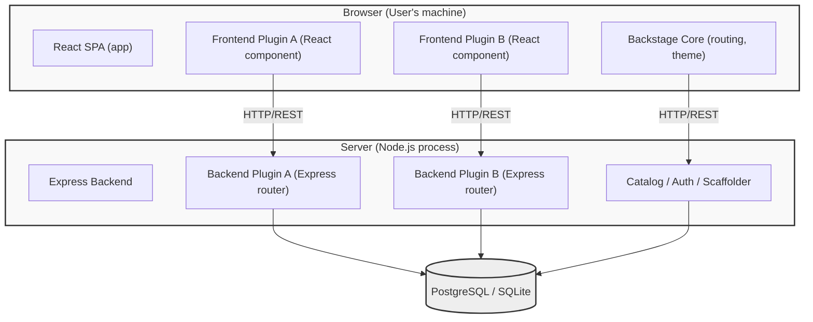

> **Complexity**: `[COMPLEX]` — Heaviest exam domain (32%)
>
> **Time to Complete**: 90-120 minutes
>
> **Prerequisites**: Module 1 (Backstage Development Workflow), familiarity with TypeScript, React basics, npm/yarn
>
> **CBA Domain**: Domain 4 — Customizing Backstage (32% of exam)

---

## What You'll Be Able to Do

After completing this module, you will be able to:

1. **Build** a Backstage frontend plugin with React components, Material UI theming, and route registration in the app shell
2. **Build** a backend plugin with Express routes, database migrations, and service-to-service authentication
3. **Create** Software Templates that scaffold new services with cookiecutter/Nunjucks, including CI/CD pipelines and catalog registration
4. **Analyze** plugin extension points, composability APIs, and auth provider integration by reading Backstage TypeScript code

---

## Why This Module Matters

This is the single most important module for the CBA exam. [**Domain 4 is worth 32%**](https://www.cncf.io/training/certification/cba/) — nearly one in three questions will test your understanding of plugin development, Material UI, Software Templates, theming, and auth providers.

Backstage without plugins is an empty shell. The entire value proposition — the software catalog, TechDocs, CI/CD visibility, scaffolding — all of it is delivered through plugins. [When Spotify built Backstage](https://github.com/backstage/backstage), they designed it as a plugin platform first and a portal second. Understanding how plugins work is understanding how Backstage works.

This module is code-heavy by design. The exam shows you TypeScript and React snippets and asks what they do. You will not write code during the exam, but you absolutely need to *read* code fluently.

> **The Restaurant Analogy**
>
> Backstage is a restaurant kitchen. The core framework is the building — walls, plumbing, electricity. Frontend plugins are the dishes on the menu. Backend plugins are the kitchen stations (grill, prep, dessert). Software Templates are the recipes that let line cooks produce consistent meals. Auth providers are the bouncers at the door. You do not run a restaurant by staring at the building — you run it by cooking.

---

## War Story: The Plugin That Broke Production

A misdesigned Backstage plugin can expose long-lived cluster credentials in the browser. If browser-exposed credentials are harvested, they can enable unauthorized access and trigger expensive incident response, remediation, and compliance work.

The crucial lesson from this outage is that Backstage plugin development is not standard React development. It requires a deep, uncompromising understanding of the boundary between the browser and the server. You must know exactly where your code executes, how it authenticates, and how it handles resource limits. That architectural discipline is exactly what the CBA certification tests.

---

## Did You Know?

1. **Massive Ecosystem**: The Backstage community maintains a public directory at `backstage.io/plugins` and a dedicated [`backstage/community-plugins` repository governed strictly under the Apache License 2.0](https://github.com/backstage/community-plugins). The [Certified Backstage Associate (CBA) certification itself is officially offered by the CNCF](https://www.cncf.io/training/certification/cba/).
2. **Strict Release Cadence**: As a CNCF Incubating project (not yet Graduated), Backstage follows [a monthly main release line (shipping the Tuesday before the third Wednesday of each month) and a weekly `next` release line on Tuesdays for early access](https://github.com/backstage/backstage/blob/master/docs/overview/versioning-policy.md). The `next` release line offers early access to upcoming features with fewer stability guarantees.
3. **Runtime Support Windows**: Backstage strictly supports [exactly two adjacent even-numbered Node.js LTS releases (e.g., Node.js 22 and 24 as of v1.46.0)](https://github.com/backstage/backstage/releases/tag/v1.46.0) and the [last three major TypeScript versions](https://github.com/backstage/backstage/blob/master/docs/overview/versioning-policy.md) at any given time. React 18 is currently supported, with React 19 under evaluation.
4. **The New Default**: The Backstage GitHub releases confirm v1.49.0 as the stable release as of 2026-01-28. v1.49.0 is the verified baseline referenced here; check the Backstage releases page for any newer versions before relying on release-specific behavior. [As of v1.49.0, newly created Backstage apps use the New Frontend System by default. The old `--next` CLI flag has been removed and replaced by a `--legacy` flag.](https://github.com/backstage/backstage/releases/tag/v1.49.0)

---

## Part 1: Frontend vs Backend Plugin Architecture

Before writing any code, you need to understand where plugins run. This is one of the most commonly tested concepts on the CBA.



### Key Differences

| Aspect | Frontend Plugin | Backend Plugin |
|--------|----------------|----------------|
| **Language** | TypeScript + React + JSX | TypeScript + Express |
| **Runs in** | Browser | Node.js server |
| **Access to** | DOM, browser APIs, user session | Filesystem, database, secrets, network |
| **Package location** | `plugins/my-plugin/` | `plugins/my-plugin-backend/` |
| **Entry point** | `createPlugin()` / `createFrontendPlugin()` | `createBackendPlugin()` |
| **Communicates via** | Backstage API client (`fetchApiRef`) | Express routes mounted at `/api/my-plugin` |
| **Testing** | `@testing-library/react` | Supertest + backend test utils |

---

## Part 2: Frontend Plugin Development

### 2.1 Creating a Frontend Plugin

Backstage provides a CLI command to scaffold a new plugin:

```bash
# From the Backstage root directory
yarn new --select plugin

# You'll be prompted for a plugin ID, e.g., "my-dashboard"
# This creates: plugins/my-dashboard/
```

> **Pause and predict**: What package naming convention does the CLI follow for new plugins?
>
> The generated package follows the convention `@<scope>/plugin-<pluginId>` for the main package. If your plugin requires additional roles, those packages use suffixes like `-react`, `-common`, `-backend`, `-node`, or `-backend-module-<moduleId>`.

The generated plugin structure:

```
plugins/my-dashboard/
├── src/
│   ├── index.ts              # Public API exports
│   ├── plugin.ts             # Plugin definition (createPlugin)
│   ├── routes.ts             # Route references
│   ├── components/
│   │   ├── MyDashboardPage/
│   │   │   ├── MyDashboardPage.tsx
│   │   │   └── index.ts
│   │   └── ExampleFetchComponent/
│   ├── api/                  # API client definitions
│   └── setupTests.ts
├── package.json
├── README.md
└── dev/                      # Standalone dev setup
    └── index.tsx
```

### 2.2 The Plugin Definition — `createPlugin`

Every frontend plugin starts with a plugin definition. While the New Frontend System utilizes `createFrontendPlugin` from `@backstage/frontend-plugin-api`, the extensively tested legacy API relies on `createPlugin` from `@backstage/core-plugin-api`. This defines the plugin's identity — it registers the plugin with Backstage and declares its routes, APIs, and extensions. The New Frontend System also provides extension blueprints such as `PageBlueprint` and `NavItemBlueprint` from `@backstage/frontend-plugin-api` to standardize definitions.

```typescript
// plugins/my-dashboard/src/plugin.ts
import {
  createPlugin,
  createRoutableExtension,
} from '@backstage/core-plugin-api';
import { rootRouteRef } from './routes';

export const myDashboardPlugin = createPlugin({
  id: 'my-dashboard',
  routes: {
    root: rootRouteRef,
  },
});

export const MyDashboardPage = myDashboardPlugin.provide(
  createRoutableExtension({
    name: 'MyDashboardPage',
    component: () =>
      import('./components/MyDashboardPage').then(m => m.MyDashboardPage),
    mountPoint: rootRouteRef,
  }),
);
```

What this code does, line by line:

- `createPlugin({ id: 'my-dashboard' })` — Registers a plugin with a unique ID. Backstage uses this ID for routing, configuration, and analytics. Plugin IDs must use kebab-case (e.g., `my-dashboard`). The plugin instance variable uses the camelCase version with a `Plugin` suffix (e.g., `myDashboardPlugin`).
- `routes: { root: rootRouteRef }` — Associates named routes with the plugin. `rootRouteRef` is a reference created elsewhere (see below).
- `createRoutableExtension()` — Creates a React component that Backstage can mount at a URL path. The `component` field uses dynamic `import()` for code splitting — the plugin code is only loaded when a user navigates to its page.
- `mountPoint: rootRouteRef` — Ties this component to the route reference.

### 2.3 Route References

```typescript
// plugins/my-dashboard/src/routes.ts
import { createRouteRef } from '@backstage/core-plugin-api';

export const rootRouteRef = createRouteRef({
  id: 'my-dashboard',
});
```

Route references are abstract — they do not contain actual URL paths. The path is assigned when the plugin is mounted in the app (see Section 2.5).

### 2.4 Writing a Frontend Plugin Page

Here is a complete frontend plugin page that fetches data from a backend API and displays it using Backstage's built-in components:

```tsx
// plugins/my-dashboard/src/components/MyDashboardPage/MyDashboardPage.tsx
import React from 'react';
import { useApi, fetchApiRef } from '@backstage/core-plugin-api';
import {
  Header,
  Page,
  Content,
  ContentHeader,
  SupportButton,
  Table,
  TableColumn,
  InfoCard,
  Progress,
  ResponseErrorPanel,
} from '@backstage/core-components';
import { Grid } from '@mui/material';
import useAsync from 'react-use/lib/useAsync';

// Define the shape of data we expect from our backend
interface ServiceHealth {
  name: string;
  status: 'healthy' | 'degraded' | 'down';
  lastChecked: string;
  responseTimeMs: number;
}

// Table column definitions — Backstage's Table component uses this pattern
const columns: TableColumn<ServiceHealth>[] = [
  { title: 'Service', field: 'name' },
  {
    title: 'Status',
    field: 'status',
    render: (row: ServiceHealth) => {
      const colors: Record<string, string> = {
        healthy: '#4caf50',
        degraded: '#ff9800',
        down: '#f44336',
      };
      return (
        <span style={{ color: colors[row.status], fontWeight: 'bold' }}>
          {row.status.toUpperCase()}
        </span>
      );
    },
  },
  { title: 'Response Time (ms)', field: 'responseTimeMs', type: 'numeric' },
  { title: 'Last Checked', field: 'lastChecked' },
];

export const MyDashboardPage = () => {
  // useApi hook retrieves a Backstage API implementation by its ref
  const fetchApi = useApi(fetchApiRef);

  // useAsync handles loading/error states for async operations
  const {
    value: services,
    loading,
    error,
  } = useAsync(async (): Promise<ServiceHealth[]> => {
    const response = await fetchApi.fetch(
      '/api/my-dashboard/services/health',
    );
    if (!response.ok) {
      throw new Error(`Failed to fetch: ${response.statusText}`);
    }
    return response.json();
  }, []);

  if (loading) return <Progress />;
  if (error) return <ResponseErrorPanel error={error} />;

  return (
    <Page themeId="tool">
      <Header title="Service Health Dashboard" subtitle="Real-time status" />
      <Content>
        <ContentHeader title="Overview">
          <SupportButton>
            This dashboard shows the health of all registered services.
          </SupportButton>
        </ContentHeader>
        <Grid container spacing={3}>
          <Grid item xs={12}>
            <InfoCard title="Service Count">
              {services?.length ?? 0} services monitored
            </InfoCard>
          </Grid>
          <Grid item xs={12}>
            <Table
              title="Service Health"
              options={{ search: true, paging: true, pageSize: 10 }}
              columns={columns}
              data={services ?? []}
            />
          </Grid>
        </Grid>
      </Content>
    </Page>
  );
};
```

### Key Backstage Components Used Above

| Component | Package | Purpose |
|-----------|---------|---------|
| `Page` | `@backstage/core-components` | Top-level layout with sidebar support |
| `Header` | `@backstage/core-components` | Page header with title and subtitle |
| `Content` | `@backstage/core-components` | Main content area with padding |
| `InfoCard` | `@backstage/core-components` | A Material Design card with title |
| `Table` | `@backstage/core-components` | Data table with search, sort, pagination |
| `Progress` | `@backstage/core-components` | Loading spinner |
| `ResponseErrorPanel` | `@backstage/core-components` | Styled error display |
| `Grid` | `@mui/material` | MUI responsive grid layout |

### 2.5 Mounting the Plugin in the App

After building the plugin, you wire it into the app:

```tsx
// packages/app/src/App.tsx
import { MyDashboardPage } from '@internal/plugin-my-dashboard';

// Inside the <FlatRoutes> component:
<Route path="/my-dashboard" element={<MyDashboardPage />} />
```

And add a sidebar entry:

```tsx
// packages/app/src/components/Root/Root.tsx
import DashboardIcon from '@mui/icons-material/Dashboard';

// Inside the <Sidebar> component:
<SidebarItem icon={DashboardIcon} to="my-dashboard" text="Health" />
```

---

## Part 3: Backend Plugin Development

### 3.1 Creating a Backend Plugin

```bash
yarn new --select backend-plugin

# Enter plugin ID: "my-dashboard"
# This creates: plugins/my-dashboard-backend/
```

### 3.2 Backend Plugin Structure (New Backend System)

Backstage has migrated to a "new backend system" (introduced in Backstage 1.x). [It reached stable 1.0 and is highly recommended for all new plugin development.](https://github.com/backstage/backstage/releases/tag/v1.31.0) The exam strongly tests the new pattern. Here is the full structure of a backend plugin using `createBackendPlugin` from `@backstage/backend-plugin-api`:

```typescript
// plugins/my-dashboard-backend/src/plugin.ts
import {
  coreServices,
  createBackendPlugin,
} from '@backstage/backend-plugin-api';
import { createRouter } from './router';

export const myDashboardPlugin = createBackendPlugin({
  pluginId: 'my-dashboard',
  register(env) {
    env.registerInit({
      deps: {
        logger: coreServices.logger,
        http: coreServices.httpRouter,
        database: coreServices.database,
        config: coreServices.rootConfig,
      },
      async init({ logger, http, database, config }) {
        logger.info('Initializing my-dashboard backend plugin');

        const router = await createRouter({
          logger,
          database,
          config,
        });

        // Mount the Express router at /api/my-dashboard
        http.use(router);
      },
    });
  },
});
```

Key concepts:

- **`createBackendPlugin`** — Declares a backend plugin with a unique `pluginId`.
- **`coreServices`** — Dependency injection. Instead of constructing dependencies yourself, you declare what you need and Backstage provides them.
- **`coreServices.httpRouter`** — An Express router scoped to `/api/<pluginId>`.
- **`coreServices.database`** — A Knex.js database client. Backstage manages the connection.
- **`coreServices.logger`** — A Winston logger scoped to the plugin.

Additionally, backend extension points are created with `createExtensionPoint` from `@backstage/backend-plugin-api`. A backend module may only extend a single plugin and must be installed in the same backend instance as that plugin.

### 3.3 Writing an Express Router

```typescript
// plugins/my-dashboard-backend/src/router.ts
import { Router } from 'express';
import { Logger } from 'winston';
import { DatabaseService } from '@backstage/backend-plugin-api';
import { Config } from '@backstage/config';

interface RouterOptions {
  logger: Logger;
  database: DatabaseService;
  config: Config;
}

interface ServiceHealthRecord {
  name: string;
  status: string;
  last_checked: string;
  response_time_ms: number;
}

export async function createRouter(
  options: RouterOptions,
): Promise<Router> {
  const { logger, database } = options;
  const router = Router();

  // Get a Knex database client from Backstage's database service
  const dbClient = await database.getClient();

  // Run migrations on startup (create tables if they don't exist)
  if (!await dbClient.schema.hasTable('service_health')) {
    await dbClient.schema.createTable('service_health', table => {
      table.string('name').primary();
      table.string('status').notNullable();
      table.timestamp('last_checked').defaultTo(dbClient.fn.now());
      table.integer('response_time_ms');
    });
    logger.info('Created service_health table');
  }

  // GET /api/my-dashboard/services/health
  router.get('/services/health', async (_req, res) => {
    try {
      const services = await dbClient<ServiceHealthRecord>(
        'service_health',
      ).select('*');

      res.json(
        services.map(s => ({
          name: s.name,
          status: s.status,
          lastChecked: s.last_checked,
          responseTimeMs: s.response_time_ms,
        })),
      );
    } catch (err) {
      logger.error('Failed to fetch service health', err);
      res.status(500).json({ error: 'Internal server error' });
    }
  });

  // POST /api/my-dashboard/services/health
  router.post('/services/health', async (req, res) => {
    const { name, status, responseTimeMs } = req.body;

    if (!name || !status) {
      res.status(400).json({ error: 'name and status are required' });
      return;
    }

    try {
      await dbClient('service_health')
        .insert({
          name,
          status,
          response_time_ms: responseTimeMs ?? 0,
          last_checked: new Date().toISOString(),
        })
        .onConflict('name')
        .merge(); // Upsert: update if exists

      res.status(201).json({ message: 'Service health recorded' });
    } catch (err) {
      logger.error('Failed to record service health', err);
      res.status(500).json({ error: 'Internal server error' });
    }
  });

  return router;
}
```

### 3.4 Registering the Backend Plugin

```typescript
// packages/backend/src/index.ts
import { myDashboardPlugin } from '@internal/plugin-my-dashboard-backend';

// In the backend builder:
backend.add(myDashboardPlugin);
```

That single line is all it takes. The new backend system handles dependency injection, router mounting, and lifecycle management automatically.

---

## Service-to-Service Authentication

When operating in the Backstage backend ecosystem, your custom plugin will frequently need to communicate with *other* Backstage backend plugins—for example, verifying an entity's existence in the Catalog before taking action. Because these routes are strictly protected by Backstage's core authentication policies, you cannot simply make raw, unauthenticated HTTP calls.

Backstage manages service-to-service communication via internally generated plugin tokens.

### Requesting a Plugin Token

In the New Backend System, you leverage the [built-in `coreServices.auth` and `coreServices.httpAuth` modules to request authorization](https://raw.githubusercontent.com/backstage/backstage/master/docs/auth/service-to-service-auth.md).

```typescript
// Example snippet demonstrating service-to-service auth
import { coreServices } from '@backstage/backend-plugin-api';

// Inside your plugin's init method:
async init({ logger, http, auth, httpAuth }) {
  http.get('/dependent-data', async (req, res) => {
    try {
      // 1. Extract the credentials of the user making the request
      const credentials = await httpAuth.credentials(req);
      
      // 2. Request a service-to-service token acting on behalf of the user
      const { token } = await auth.getPluginRequestToken({
        onBehalfOf: credentials,
        targetPluginId: 'catalog',
      });

      // 3. Attach the generated token to the downstream API call
      const response = await fetch('http://localhost:7007/api/catalog/entities', {
        headers: {
          Authorization: `Bearer ${token}`,
        }
      });
      
      const data = await response.json();
      res.json(data);
    } catch (error) {
      logger.error('Failed to communicate securely with the catalog', error);
      res.status(500).send('Internal Error');
    }
  });
}
```

> **Stop and think**: Why does Backstage require a distinct plugin token for backend-to-backend communication instead of directly reusing the user's initial session token? (Hint: Consider the security blast radius if a malicious plugin successfully intercepted a universal user session token).

## Part 4: Material UI (MUI) and Theming

### 4.1 Backstage's Relationship with MUI

Legacy Backstage frontend code commonly uses Material UI v5 (`@mui/material`), but current Backstage also ships Backstage UI components and is gradually moving some surfaces away from MUI-only primitives. The exam tests your ability to recognize MUI components and understand Backstage's theming system.

Commonly tested MUI components in a Backstage context:

| MUI Component | Backstage Usage |
|---------------|-----------------|
| `Grid` | Page layouts, responsive design |
| `Card` / `CardContent` | Content grouping (wrapped by `InfoCard`) |
| `Typography` | Text with semantic meaning (h1-h6, body, caption) |
| `Button` | Actions, form submissions |
| `TextField` | Form inputs in template forms |
| `Table` / `TableBody` / `TableRow` | Data display (Backstage wraps this in its own `Table`) |
| `Tabs` / `Tab` | Entity page tab navigation |
| `Chip` | Status badges, tags |
| `Dialog` | Modal dialogs for confirmations |

### 4.2 Custom Themes

Backstage supports custom themes via `createUnifiedTheme`. This lets organizations brand the portal with their own colors, fonts, and component styles.

```typescript
// packages/app/src/theme.ts
import { createUnifiedTheme, palettes } from '@backstage/theme';

export const myCustomTheme = createUnifiedTheme({
  palette: {
    ...palettes.light,
    primary: {
      main: '#1565c0',       // Your brand blue
    },
    secondary: {
      main: '#f57c00',       // Your brand orange
    },
    navigation: {
      background: '#171717', // Dark sidebar
      indicator: '#1565c0',  // Active item highlight
      color: '#ffffff',      // Sidebar text
      selectedColor: '#ffffff',
    },
  },
  defaultPageTheme: 'home',
  fontFamily: '"Inter", "Helvetica", "Arial", sans-serif',
  components: {
    // Override specific MUI component styles globally
    MuiButton: {
      styleOverrides: {
        root: {
          textTransform: 'none', // No ALL CAPS buttons
          borderRadius: 8,
        },
      },
    },
    MuiCard: {
      styleOverrides: {
        root: {
          borderRadius: 12,
        },
      },
    },
  },
});
```

Register the theme in the app:

```tsx
// packages/app/src/App.tsx
import { myCustomTheme } from './theme';
import { UnifiedThemeProvider } from '@backstage/theme';

// In the app root:
<UnifiedThemeProvider theme={myCustomTheme}>
  <AppRouter>
    {/* ... routes ... */}
  </AppRouter>
</UnifiedThemeProvider>
```

### 4.3 Using the `sx` Prop

MUI v5 uses the `sx` prop for one-off styling. You will see this pattern on the exam:

```tsx
import { Box, Typography, Chip } from '@mui/material';

export const StatusBanner = ({ status }: { status: string }) => (
  <Box
    sx={{
      display: 'flex',
      alignItems: 'center',
      gap: 2,
      p: 2,                         // padding: theme.spacing(2)
      bgcolor: 'background.paper',  // uses theme palette
      borderRadius: 1,
    }}
  >
    <Typography variant="h6">Current Status</Typography>
    <Chip
      label={status}
      color={status === 'healthy' ? 'success' : 'error'}
      sx={{ fontWeight: 'bold' }}
    />
  </Box>
);
```

---

## Part 5: Installing Existing Plugins

Not every plugin needs to be built from scratch. The Backstage plugin marketplace at [backstage.io/plugins](https://backstage.io/plugins) has 200+ community plugins.

### 5.1 Installation Pattern

Most plugins follow this pattern:

```bash
# 1. Install the frontend package
yarn --cwd packages/app add @backstage/plugin-tech-radar

# 2. Install the backend package (if the plugin has one)
yarn --cwd packages/backend add @backstage/plugin-tech-radar-backend
```

```tsx
// 3. Wire frontend into packages/app/src/App.tsx
import { TechRadarPage } from '@backstage/plugin-tech-radar';

<Route path="/tech-radar" element={<TechRadarPage />} />
```

```typescript
// 4. Wire backend into packages/backend/src/index.ts
backend.add(import('@backstage/plugin-tech-radar-backend'));
```

```yaml
# 5. Configure in app-config.yaml (if needed)
techRadar:
  url: https://your-org.com/tech-radar-data.json
```

### 5.2 Overriding Plugin Components

You can replace the default implementation of any plugin component. This is how you customize third-party plugins without forking them:

```tsx
// packages/app/src/App.tsx
import { createApp } from '@backstage/app-defaults';
import { catalogPlugin } from '@backstage/plugin-catalog';

const app = createApp({
  // ...
  bindRoutes({ bind }) {
    bind(catalogPlugin.externalRoutes, {
      createComponent: scaffolderPlugin.routes.root,
    });
  },
});
```

---

## Part 6: Software Templates

Software Templates are one of Backstage's most powerful features. They let platform teams define "golden paths" — standardized workflows for creating new services, libraries, or infrastructure.

### 6.1 Template Structure

A Software Template is a YAML file registered in the catalog with `kind: Template`:

```yaml
apiVersion: scaffolder.backstage.io/v1beta3
kind: Template
metadata:
  name: create-nodejs-service
  title: Create a Node.js Microservice
  description: Creates a new Node.js service with CI/CD, monitoring, and docs
  tags:
    - nodejs
    - recommended
spec:
  owner: platform-team
  type: service

  # Step 1: Collect user input
  parameters:
    - title: Service Details
      required:
        - name
        - owner
      properties:
        name:
          title: Service Name
          type: string
          description: Unique name for the service
          pattern: '^[a-z0-9-]+$'
          ui:autofocus: true
        owner:
          title: Owner
          type: string
          description: Team that owns this service
          ui:field: OwnerPicker
          ui:options:
            catalogFilter:
              kind: Group
        description:
          title: Description
          type: string

    - title: Infrastructure
      properties:
        database:
          title: Database
          type: string
          enum: ['none', 'postgresql', 'mongodb']
          default: 'none'
        port:
          title: Port
          type: number
          default: 3000

  # Step 2: Execute actions
  steps:
    - id: fetch-template
      name: Fetch Skeleton
      action: fetch:template
      input:
        url: ./skeleton     # Directory containing template files
        values:
          name: ${{ parameters.name }}
          owner: ${{ parameters.owner }}
          description: ${{ parameters.description }}
          database: ${{ parameters.database }}
          port: ${{ parameters.port }}

    - id: publish
      name: Publish to GitHub
      action: publish:github
      input:
        allowedHosts: ['github.com']
        repoUrl: github.com?owner=my-org&repo=${{ parameters.name }}
        description: ${{ parameters.description }}
        defaultBranch: main
        repoVisibility: internal

    - id: register
      name: Register in Catalog
      action: catalog:register
      input:
        repoContentsUrl: ${{ steps['publish'].output.repoContentsUrl }}
        catalogInfoPath: '/catalog-info.yaml'

  # What to show the user when done
  output:
    links:
      - title: Repository
        url: ${{ steps['publish'].output.remoteUrl }}
      - title: Open in Backstage
        icon: catalog
        entityRef: ${{ steps['register'].output.entityRef }}
```

### 6.2 Built-in Template Actions

| Action | Purpose |
|--------|---------|
| `fetch:template` | Copy and render template files (Nunjucks syntax) |
| `fetch:plain` | Copy files without templating |
| `publish:github` | Create a GitHub repository |
| `publish:gitlab` | Create a GitLab project |
| `publish:bitbucket` | Create a Bitbucket repository |
| `catalog:register` | Register the new entity in the Backstage catalog |
| `catalog:write` | Write a `catalog-info.yaml` file |
| `debug:log` | Log a message (useful for debugging templates) |

### 6.3 Writing a Custom Template Action

When built-in actions are not enough, you write custom actions. This is a heavily tested topic on the CBA.

```typescript
// plugins/scaffolder-backend-custom/src/actions/createJiraTicket.ts
import { createTemplateAction } from '@backstage/plugin-scaffolder-node';
import { Config } from '@backstage/config';

export function createJiraTicketAction(options: { config: Config }) {
  const { config } = options;

  return createTemplateAction<{
    projectKey: string;
    summary: string;
    description: string;
    issueType: string;
  }>({
    id: 'jira:create-ticket',
    description: 'Creates a Jira ticket for tracking the new service',
    schema: {
      input: {
        type: 'object',
        required: ['projectKey', 'summary'],
        properties: {
          projectKey: {
            type: 'string',
            title: 'Jira Project Key',
            description: 'e.g., PLATFORM',
          },
          summary: {
            type: 'string',
            title: 'Ticket Summary',
          },
          description: {
            type: 'string',
            title: 'Ticket Description',
          },
          issueType: {
            type: 'string',
            title: 'Issue Type',
            enum: ['Task', 'Story', 'Bug'],
            default: 'Task',
          },
        },
      },
      output: {
        type: 'object',
        properties: {
          ticketUrl: {
            type: 'string',
            title: 'URL of the created Jira ticket',
          },
          ticketKey: {
            type: 'string',
            title: 'Jira ticket key (e.g., PLATFORM-123)',
          },
        },
      },
    },
    async handler(ctx) {
      const { projectKey, summary, description, issueType } = ctx.input;
      const jiraUrl = config.getString('jira.url');
      const jiraToken = config.getString('jira.apiToken');

      ctx.logger.info(
        `Creating Jira ticket in project ${projectKey}: ${summary}`,
      );

      const response = await fetch(`${jiraUrl}/rest/api/3/issue`, {
        method: 'POST',
        headers: {
          'Content-Type': 'application/json',
          Authorization: `Basic ${jiraToken}`,
        },
        body: JSON.stringify({
          fields: {
            project: { key: projectKey },
            summary,
            description: {
              type: 'doc',
              version: 1,
              content: [
                {
                  type: 'paragraph',
                  content: [{ type: 'text', text: description || summary }],
                },
              ],
            },
            issuetype: { name: issueType || 'Task' },
          },
        }),
      });

      if (!response.ok) {
        const errorBody = await response.text();
        throw new Error(`Jira API error (${response.status}): ${errorBody}`);
      }

      const data = await response.json();

      ctx.logger.info(`Created Jira ticket: ${data.key}`);

      // Output values can be referenced by later template steps
      ctx.output('ticketKey', data.key);
      ctx.output('ticketUrl', `${jiraUrl}/browse/${data.key}`);
    },
  });
}
```

Register the custom action:

```typescript
// plugins/scaffolder-backend-custom/src/plugin.ts
import { scaffolderActionsExtensionPoint } from '@backstage/plugin-scaffolder-node/alpha';
import { createBackendModule } from '@backstage/backend-plugin-api';
import { createJiraTicketAction } from './actions/createJiraTicket';

export const scaffolderModuleJiraAction = createBackendModule({
  pluginId: 'scaffolder',
  moduleId: 'jira-action',
  register(env) {
    env.registerInit({
      deps: {
        scaffolder: scaffolderActionsExtensionPoint,
        config: coreServices.rootConfig,
      },
      async init({ scaffolder, config }) {
        scaffolder.addActions(createJiraTicketAction({ config }));
      },
    });
  },
});
```

Use it in a template:

```yaml
steps:
  # ... other steps ...
  - id: create-jira-ticket
    name: Create Tracking Ticket
    action: jira:create-ticket
    input:
      projectKey: PLATFORM
      summary: 'New service: ${{ parameters.name }}'
      description: 'Service created via Backstage template by ${{ user.entity.metadata.name }}'
      issueType: Task
```

---

## Part 7: Auth Providers

Backstage supports multiple authentication providers out of the box. The exam tests configuration patterns for the most common ones.

### 7.1 GitHub App Auth

```yaml
# app-config.yaml
auth:
  environment: production
  providers:
    github:
      production:
        clientId: ${GITHUB_CLIENT_ID}
        clientSecret: ${GITHUB_CLIENT_SECRET}
        signIn:
          resolvers:
            - resolver: usernameMatchingUserEntityName
```

### 7.2 Okta / OIDC

```yaml
# app-config.yaml
auth:
  providers:
    okta:
      production:
        clientId: ${OKTA_CLIENT_ID}
        clientSecret: ${OKTA_CLIENT_SECRET}
        audience: ${OKTA_AUDIENCE}
        authServerId: ${OKTA_AUTH_SERVER_ID}  # 'default' for org auth server
        signIn:
          resolvers:
            - resolver: emailMatchingUserEntityProfileEmail
```

### 7.3 Sign-in Resolvers

Sign-in resolvers map an external identity (GitHub user, Okta user) to a Backstage user entity in the catalog. The exam commonly tests these resolvers:

| Resolver | What it does |
|----------|-------------|
| `usernameMatchingUserEntityName` | Matches the provider's username to the `metadata.name` of a User entity |
| `emailMatchingUserEntityProfileEmail` | Matches the provider's email to `spec.profile.email` of a User entity |
| `emailLocalPartMatchingUserEntityName` | Matches the part before `@` in the email to `metadata.name` |

Custom sign-in resolver:

```typescript
// packages/backend/src/auth.ts
import { createBackendModule } from '@backstage/backend-plugin-api';
import {
  authProvidersExtensionPoint,
  createOAuthProviderFactory,
} from '@backstage/plugin-auth-node';
import { githubAuthenticator } from '@backstage/plugin-auth-backend-module-github-provider';

export const authModuleGithubCustom = createBackendModule({
  pluginId: 'auth',
  moduleId: 'github-custom-resolver',
  register(reg) {
    reg.registerInit({
      deps: {
        providers: authProvidersExtensionPoint,
      },
      async init({ providers }) {
        providers.registerProvider({
          providerId: 'github',
          factory: createOAuthProviderFactory({
            authenticator: githubAuthenticator,
            async signInResolver(info, ctx) {
              // info.result contains the GitHub profile
              const { fullProfile } = info.result;
              const userId = fullProfile.username;

              if (!userId) {
                throw new Error('GitHub username is required');
              }

              // Issue a Backstage token for this user
              return ctx.signInWithCatalogUser({
                entityRef: { name: userId },
              });
            },
          }),
        });
      },
    });
  },
});
```

---

## Part 8: Testing Plugins

### 8.1 Frontend Plugin Tests

Backstage provides test utilities that wrap `@testing-library/react`. `renderInTestApp` is available from `@backstage/test-utils` (legacy system) and from `@backstage/frontend-test-utils` (new frontend system). Additionally, `createDevApp` from `@backstage/frontend-dev-utils` simplifies setting up a local plugin development app. Jest is the primary testing framework used throughout the Backstage ecosystem.

```tsx
// plugins/my-dashboard/src/components/MyDashboardPage/MyDashboardPage.test.tsx
import React from 'react';
import { screen } from '@testing-library/react';
import { renderInTestApp } from '@backstage/test-utils';
import { MyDashboardPage } from './MyDashboardPage';
import { rest } from 'msw';
import { setupServer } from 'msw/node';

// Mock the backend API using MSW (Mock Service Worker)
const server = setupServer(
  rest.get('/api/my-dashboard/services/health', (_req, res, ctx) => {
    return res(
      ctx.json([
        {
          name: 'auth-service',
          status: 'healthy',
          lastChecked: '2025-01-15T10:30:00Z',
          responseTimeMs: 42,
        },
        {
          name: 'payment-service',
          status: 'degraded',
          lastChecked: '2025-01-15T10:30:00Z',
          responseTimeMs: 1500,
        },
      ]),
    );
  }),
);

beforeAll(() => server.listen());
afterEach(() => server.resetHandlers());
afterAll(() => server.close());

describe('MyDashboardPage', () => {
  it('should render the service health table', async () => {
    await renderInTestApp(<MyDashboardPage />);

    // Wait for async data to load
    expect(
      await screen.findByText('Service Health Dashboard'),
    ).toBeInTheDocument();
    expect(await screen.findByText('auth-service')).toBeInTheDocument();
    expect(await screen.findByText('DEGRADED')).toBeInTheDocument();
  });

  it('should show an error panel when the API fails', async () => {
    server.use(
      rest.get('/api/my-dashboard/services/health', (_req, res, ctx) => {
        return res(ctx.status(500));
      }),
    );

    await renderInTestApp(<MyDashboardPage />);

    expect(await screen.findByText(/failed to fetch/i)).toBeInTheDocument();
  });
});
```

Key testing patterns:

- **`renderInTestApp`** — Wraps your component in the full Backstage app context (theme, API providers, routing). In most Backstage component tests, use this instead of plain `render` from `@testing-library/react`.
- **MSW (Mock Service Worker)** — The standard way to mock backend API calls in Backstage frontend tests.
- **`screen.findByText`** — Use `findBy*` (not `getBy*`) for async content that loads after a fetch.

### 8.2 Backend Plugin Tests

```typescript
// plugins/my-dashboard-backend/src/router.test.ts
import { createRouter } from './router';
import express from 'express';
import request from 'supertest';
import { getVoidLogger } from '@backstage/backend-common';
import Knex from 'knex';

describe('createRouter', () => {
  let app: express.Express;

  beforeAll(async () => {
    // Create an in-memory SQLite database for testing
    const knex = Knex({
      client: 'better-sqlite3',
      connection: ':memory:',
      useNullAsDefault: true,
    });

    const router = await createRouter({
      logger: getVoidLogger(),
      database: {
        getClient: async () => knex,
      } as any,
      config: {} as any,
    });

    app = express();
    app.use(express.json());
    app.use(router);
  });

  it('GET /services/health returns empty array initially', async () => {
    const response = await request(app).get('/services/health');
    expect(response.status).toBe(200);
    expect(response.body).toEqual([]);
  });

  it('POST /services/health creates a record', async () => {
    const response = await request(app)
      .post('/services/health')
      .send({ name: 'test-svc', status: 'healthy', responseTimeMs: 50 });

    expect(response.status).toBe(201);
  });

  it('GET /services/health returns the created record', async () => {
    const response = await request(app).get('/services/health');
    expect(response.status).toBe(200);
    expect(response.body).toHaveLength(1);
    expect(response.body[0].name).toBe('test-svc');
  });

  it('POST /services/health rejects missing fields', async () => {
    const response = await request(app)
      .post('/services/health')
      .send({ status: 'healthy' }); // Missing 'name'

    expect(response.status).toBe(400);
  });
});
```

---

## Common Mistakes

| Mistake | Why It Happens | Fix |
|---------|---------------|-----|
| Importing backend code in a frontend plugin | Looks like regular TypeScript imports | Frontend runs in the browser. It cannot access Node.js APIs, the filesystem, or the database. Use `fetchApiRef` to call your backend plugin over HTTP. |
| Using MUI v4 syntax (`makeStyles`, `@material-ui/core`) | Following outdated tutorials | Backstage uses MUI v5. Use `sx` prop, `styled()`, or `@mui/material` imports. |
| Hardcoding API URLs (`fetch('http://localhost:7007/...')`) | Works in local dev | Use `fetchApiRef` from `@backstage/core-plugin-api`. Backstage handles base URL resolution, auth headers, and proxy routing. |
| Forgetting to register the backend plugin | Plugin code exists but is not loaded by the backend | Add `backend.add(myPlugin)` in `packages/backend/src/index.ts`. No registration = no routes mounted. |
| Template actions with no error handling | Happy-path development | If a template action throws, the entire scaffolder run fails with a cryptic error. Wrap external API calls in try/catch and provide meaningful error messages. |
| Using `getBy*` in tests for async content | Unfamiliar with testing-library patterns | Data that loads from an API is async. Use `findBy*` (which retries) instead of `getBy*` (which asserts immediately). |
| Creating custom themes with `createTheme` | Mixing MUI's `createTheme` with Backstage | Use `createUnifiedTheme` from `@backstage/theme`, not `createTheme` from `@mui/material`. Backstage's version adds page themes, navigation palette, and plugin integration. |
| Not setting `pluginId` on backend plugins | Copy-paste errors | The `pluginId` determines the API route prefix (`/api/<pluginId>`). If two plugins share an ID, routes collide. |

---

## Quiz

Test your understanding of deep plugin architecture. These scenario-based questions heavily mirror the difficulty and format of the actual CBA exam.

**Q1**: You are debugging a new Backstage portal deployment. A developer created a custom dashboard component and mounted it directly inside `App.tsx` using a plain React `<Route>` wrapping their custom component. While the page renders successfully when navigating to the URL, the Backstage global search cannot index the page's contents, and the routing system fails to resolve links generated from other plugins pointing to this dashboard. Why is the portal failing to integrate this component properly, and how should it be structured to resolve these issues?

<details>
<summary>Answer</summary>

They failed to bind the extension to a plugin instance using `createPlugin()`. A Backstage plugin must have a global identity registered with the system so that its APIs, routes, and extensions can be tracked and managed. Without this foundational identity, the Backstage routing tree cannot associate the component with a specific domain, causing deep links and global search indexing to fail. By wrapping the routable extension with `myPlugin.provide()`, the developer explicitly ties the React component to the plugin's ecosystem context.
</details>

**Q2**: A junior developer submits a PR for a new frontend plugin. In their component, they retrieve data using `const res = await window.fetch('http://localhost:7007/api/inventory/data');`. During code review, you explicitly reject this approach. How should the developer modify their code to correctly make authenticated requests to the backend plugin?

<details>
<summary>Answer</summary>

The developer should use `useApi(fetchApiRef)` to retrieve the Backstage fetch API, and then make the request using `fetchApi.fetch('/api/my-plugin/endpoint')`. The standard `window.fetch` does not automatically know the backend's base URL and fails to append the required authorization headers for Backstage's security perimeter. By using the framework's API reference, the frontend safely delegates base URL resolution, proxy routing, and token injection to Backstage core. Hardcoding URLs also guarantees the plugin will break when deployed to different environments like staging or production.
</details>

**Q3**: Your organization is migrating custom legacy backend plugins to the New Backend System. An engineer submits a pull request for the `inventory` plugin. Inside the plugin's initialization logic, they instantiate a new Express application, configure it to listen on an available port, and bind their domain-specific routes to `/api/custom-inventory`. Why does this architectural approach violate the design principles of the New Backend System, and what risk does it introduce to the broader Backstage deployment?

<details>
<summary>Answer</summary>

The New Backend System strictly manages routing, port binding, and dependency injection globally across the entire Backstage instance. By instantiating their own Express application, the developer bypasses Backstage's centralized HTTP server, preventing the framework from applying essential middleware such as logging, error handling, and authentication. Furthermore, binding to a custom port creates an isolated service rather than an integrated plugin, breaking API discovery. The correct approach is to declare a dependency on `coreServices.httpRouter`, which safely injects an Express router already scoped to the plugin's namespace.
</details>

**Q4**: Your platform team maintains a Software Template that scaffolds a Java Spring Boot application. Developers report that the generated `.jar` wrapper files and certain Spring XML configurations are severely corrupted upon generation. What scaffolder action is likely causing this, and how should you adjust your template steps to resolve it?

<details>
<summary>Answer</summary>

The `fetch:template` action processes files through the Nunjucks templating engine, which attempts to evaluate any syntax resembling `${{ ... }}`. Since Java Spring `.jar` files and many XML configurations contain syntax that conflicts with Nunjucks, the templating engine corrupts their contents during processing. To resolve this, the developer should split the skeleton fetching into two steps. They must use `fetch:plain` to safely copy the binary and conflicting files without modification, and reserve `fetch:template` exclusively for source code files that actually require variable substitution.
</details>

**Q5**: The design team provides a comprehensive Material UI theme configuration and instructs you to apply it to your Backstage portal. A developer attempts to integrate it using MUI's standard `createTheme` function, but notices that the sidebar navigation styling is broken and page backgrounds do not render correctly. What function must be used instead, and why?

<details>
<summary>Answer</summary>

The developer must use `createUnifiedTheme` from `@backstage/theme` rather than standard MUI tools. Backstage extends the base Material UI theme with custom properties specifically designed for its plugin ecosystem, such as page themes (`themeId`), dedicated navigation palettes, and standardized component overrides. Using MUI's standard `createTheme` drops these crucial extensions, causing the sidebar and application shell to render with default, unstyled fallbacks. Only `createUnifiedTheme` correctly bridges standard MUI styling with Backstage's internal visual architecture.
</details>

**Q6**: You are implementing a custom scaffolder action that creates a PagerDuty project. A developer asks if they can use the browser's `localStorage` within the action handler to cache the PagerDuty API token to speed up subsequent template runs. How do you explain the execution environment of this action?

<details>
<summary>Answer</summary>

All scaffolder actions execute entirely on the server within the Node.js backend process, not in the user's browser. The frontend UI merely collects the input parameters and streams the execution logs back to the client. Because the action runs server-side, it cannot access browser-specific APIs like `localStorage` or `sessionStorage`. However, this server-side execution is exactly what allows the action to securely access sensitive configurations, read secrets from `app-config.yaml`, and communicate directly with the PagerDuty API without exposing credentials to the client.
</details>

**Q7**: In your frontend plugin's test suite, you mock an API endpoint using MSW. You then render the component and assert `expect(screen.getByText('Service Analytics')).toBeInTheDocument();`. The test fails consistently, stating the element cannot be found, even though it appears correctly in the browser instance. How should you modify your assertion logic?

<details>
<summary>Answer</summary>

The assertion fails because the API data is fetched asynchronously, but `getByText` executes its assertion immediately upon the initial render before the mock API responds. To handle asynchronous state changes, the developer must use the `findByText` query from `@testing-library/react`. This function returns a promise that continually retries the assertion against the DOM until the element appears or the default timeout expires. Transitioning to `findBy*` queries is the standard pattern for testing components that rely on MSW and network requests.
</details>

**Q8**: A platform team wants to extend the built-in Scaffolder to integrate with a proprietary internal ticketing system. They write a custom action and attempt to inject it by importing the core Scaffolder plugin and mutating its configuration object before registering it with the backend builder. When the backend starts, it crashes with an initialization lifecycle error. Why does the New Backend System reject this pattern, and what is the structurally safe mechanism for augmenting existing plugins?

<details>
<summary>Answer</summary>

The New Backend System explicitly prohibits manual mutation of plugin instances after they are registered to ensure predictable initialization and dependency resolution. Direct modification circumvents the framework's lifecycle hooks and can cause race conditions or unresolvable dependencies during startup. Instead, the team must construct a dedicated backend module using `createBackendModule` that targets the `scaffolder` plugin ID. This module should declare a dependency on the `scaffolderActionsExtensionPoint` and safely inject the custom action through the provided `addActions` method.
</details>

**Q9**: During a hackathon, an engineer attempts to speed up development by directly querying the PostgreSQL catalog database from their frontend React component. They import `DatabaseService` from `@backstage/backend-plugin-api`. What will be the exact result of this architectural decision during the build phase and at runtime?

<details>
<summary>Answer</summary>

The build step will succeed because TypeScript only checks type definitions during compilation, and the backend typings are valid syntax. However, at runtime in the browser, the plugin will fail when it tries to use Node.js APIs like `DatabaseService` and the underlying Knex client, because they have no implementation in a browser environment. Backstage enforces a strict architectural boundary where frontend plugins cannot establish direct database connections. The developer must build a corresponding backend plugin to retrieve the catalog data and expose it securely via a REST endpoint that the frontend can consume.
</details>

**Q10**: A developer's Software Template fails during the `catalog:register` step. The template successfully runs `publish:gitlab` (id: `create-repo`), but the register step uses `repoContentsUrl: ${{ parameters.repoUrl }}` and throws an error that the URL is invalid. The user did not input a URL; it was generated. What is the conceptual flaw in the template's variable referencing?

<details>
<summary>Answer</summary>

The template is structurally flawed because it attempts to reference generated infrastructure values from the user input `parameters` object. User parameters only contain data explicitly entered in the initial frontend form, not data generated during the execution of subsequent template steps. To access the URL of the newly created repository, the developer must read from the execution context of the specific step that created it. Changing the reference to `${{ steps['create-repo'].output.repoContentsUrl }}` properly extracts the runtime output from the Git publishing action.
</details>

---

## Hands-On Exercise: Build a Full-Stack Backstage Plugin

**Objective**: Build a robust "Team Links" plugin that displays and manages useful navigational links for specific teams. This comprehensive exercise covers frontend scaffolding, backend database routing, component wiring, and includes a bonus challenge to create a custom scaffolder action.

### Task 1: Scaffolding the Workspace Environment

You cannot build plugins without a host application. Scaffold a fresh Backstage instance utilizing supported Node.js 22/24 environments.

**Action**:
Open your terminal and bootstrap the central application:
```bash
npx @backstage/create-app@latest --legacy
cd my-backstage-app
```

> **Pause and predict**: Why did we use the `--legacy` flag here? 
>
> As of Backstage v1.49.0, the New Frontend System is the default. Since this exercise focuses on the extensively-tested core API (`createPlugin`), we scaffold using the legacy frontend flag.

**Checkpoint**: Verify the app was created successfully by checking the directory structure.
```bash
ls -la packages/app/src/
```

### Task 2: Create the Backend Data Plugin

Construct the backend plugin responsible for managing the link data securely.

**Action**:
Use the built-in generator to construct the node package:
```bash
yarn new --select backend-plugin
# Name it: team-links
```

Next, open `plugins/team-links-backend/src/router.ts` and replace its contents with the following Express router implementation to manage our links:
```typescript
import { Router } from 'express';
import { Logger } from 'winston';

export interface RouterOptions {
  logger: Logger;
}

const links = [
  { team: 'platform', title: 'Platform Docs', url: 'https://docs.example.com' },
  { team: 'platform', title: 'ArgoCD', url: 'https://argo.example.com' },
  { team: 'frontend', title: 'Storybook', url: 'https://storybook.example.com' }
];

export async function createRouter(
  options: RouterOptions,
): Promise<Router> {
  const { logger } = options;
  const router = Router();

  router.get('/health', (_, res) => {
    res.json({ status: 'ok' });
  });

  router.get('/links/:teamName', (req, res) => {
    const teamName = req.params.teamName;
    logger.info(`Fetching links for team: ${teamName}`);
    const teamLinks = links.filter(l => l.team === teamName);
    res.json(teamLinks);
  });

  return router;
}
```

**Checkpoint**: Verify the backend code compiles without errors.
```bash
yarn --cwd plugins/team-links-backend tsc
```

### Task 3: Create the Frontend Visual Plugin

Scaffold the React user interface that users will interact with.

**Action**:
Run the generator again, selecting the frontend option:
```bash
yarn new --select plugin
# Name it: team-links
```

Navigate to `plugins/team-links/src/components/ExampleComponent/ExampleComponent.tsx` and replace it with this React component that fetches and displays the data:
```tsx
import React from 'react';
import { useApi, fetchApiRef } from '@backstage/core-plugin-api';
import useAsync from 'react-use/lib/useAsync';
import {
  Header,
  Page,
  Content,
  ContentHeader,
  Table,
  TableColumn,
  Progress,
  ResponseErrorPanel,
} from '@backstage/core-components';

interface TeamLink {
  team: string;
  title: string;
  url: string;
}

const columns: TableColumn<TeamLink>[] = [
  { title: 'Team', field: 'team' },
  { title: 'Title', field: 'title' },
  { 
    title: 'URL', 
    field: 'url',
    render: (row) => <a href={row.url} target="_blank" rel="noopener noreferrer">{row.url}</a>
  },
];

export const ExampleComponent = () => {
  const fetchApi = useApi(fetchApiRef);

  const { value, loading, error } = useAsync(async (): Promise<TeamLink[]> => {
    const response = await fetchApi.fetch('/api/team-links/links/platform');
    if (!response.ok) {
      throw new Error(`Failed to fetch links: ${response.statusText}`);
    }
    return await response.json();
  }, []);

  if (loading) {
    return <Progress />;
  } else if (error) {
    return <ResponseErrorPanel error={error} />;
  }

  return (
    <Page themeId="tool">
      <Header title="Team Links" subtitle="Useful resources for your team" />
      <Content>
        <ContentHeader title="Platform Team Links" />
        <Table
          title="Links"
          options={{ search: false, paging: false }}
          columns={columns}
          data={value || []}
        />
      </Content>
    </Page>
  );
};
```

**Checkpoint**: Ensure the frontend code compiles successfully.
```bash
yarn --cwd plugins/team-links tsc
```

### Task 4: Register the Plugins in the App

Plugins will not be loaded unless you register them in the main frontend and backend entry points.

**Action**:
1. **Backend Registration:** Open `packages/backend/src/index.ts` and add your backend plugin to the builder, just before `backend.start()`:
```typescript
backend.add(import('@internal/plugin-team-links-backend'));
```

2. **Frontend Registration:** Open `packages/app/src/App.tsx` and add a route for your plugin inside the `<FlatRoutes>` block:
```tsx
import { ExampleComponent } from '@internal/plugin-team-links';

// Inside <FlatRoutes>:
<Route path="/team-links" element={<ExampleComponent />} />
```

**Checkpoint**: Start the application to verify everything is wired up.
```bash
yarn dev
```
Navigate to `http://localhost:3000/team-links`. You should see the table populated with the "Platform Docs" and "ArgoCD" links.

### Bonus Challenge: Custom Scaffolder Action (`team-links:seed`)

Write a custom scaffolder action that allows a Software Template to automatically add a new link to the `team-links-backend` when a new project is generated.

**Action**:
1. In the `packages/backend` directory, create a new file `src/actions/seedTeamLink.ts`:
```typescript
import { createTemplateAction } from '@backstage/plugin-scaffolder-node';

export const createSeedTeamLinkAction = () => {
  return createTemplateAction<{ team: string; title: string; url: string }>({
    id: 'team-links:seed',
    description: 'Seeds a new link into the team-links plugin',
    schema: {
      input: {
        type: 'object',
        required: ['team', 'title', 'url'],
        properties: {
          team: { type: 'string', title: 'Team Name' },
          title: { type: 'string', title: 'Link Title' },
          url: { type: 'string', title: 'URL' },
        },
      },
    },
    async handler(ctx) {
      ctx.logger.info(`Seeding link for ${ctx.input.team}: ${ctx.input.title} -> ${ctx.input.url}`);
      // In a real implementation, you would make an HTTP POST request to your backend plugin here.
      // e.g., await fetch('http://localhost:7007/api/team-links/links', { method: 'POST', ... });
      ctx.output('seededUrl', ctx.input.url);
    },
  });
};
```
2. Register it by creating a backend module for the scaffolder in `packages/backend/src/index.ts`.

---

## Summary

This module covered the core of CBA Domain 4 — the largest domain on the exam at 32%. Here is what you should be able to do:

| Topic | Key Takeaway |
|-------|-------------|
| Frontend plugins | `createPlugin` + `createRoutableExtension`, mounted in `App.tsx` |
| Backend plugins | `createBackendPlugin` with dependency injection via `coreServices` |
| Communication | Frontend calls backend over HTTP using `fetchApiRef`, never direct imports |
| MUI / Theming | MUI v5 components, `sx` prop, `createUnifiedTheme` for custom branding |
| Software Templates | YAML-defined workflows with `fetch:template`, `publish:github`, `catalog:register` |
| Custom actions | `createTemplateAction` with typed input/output schemas, runs server-side |
| Auth providers | YAML config + sign-in resolvers that map external identity to catalog User entity |
| Testing | `renderInTestApp` + MSW for frontend, supertest + in-memory DB for backend |
| Plugin installation | Install package, wire into app/backend, configure in `app-config.yaml` |

---

## Next Steps

- **Module 3**: [Backstage Catalog Deep Dive](../module-1.3-backstage-catalog-infrastructure/) — Entity processors, providers, annotations, and troubleshooting (Domain 3, 22%)
- **Module 1**: [Backstage Development Workflow](../module-1.1-backstage-dev-workflow/) — Monorepo structure, Docker builds, CLI commands (Domain 1, 24%)
- Review the [Backstage Official Plugin Development Guide](https://backstage.io/docs/plugins/) for additional depth

## Sources

- [CNCF Certified Backstage Associate (CBA)](https://www.cncf.io/training/certification/cba/) — Official certification page covering the CBA exam and its published domain weighting.
- [Backstage GitHub Repository](https://github.com/backstage/backstage) — Upstream repository showing Backstage’s project origin and CNCF incubation status.
- [Backstage Community Plugins Repository](https://github.com/backstage/community-plugins) — Official community-plugins repository documenting the project and its Apache 2.0 licensing.
- [Backstage Release and Versioning Policy](https://github.com/backstage/backstage/blob/master/docs/overview/versioning-policy.md) — Defines the main and next release cadence plus Node.js and TypeScript support windows referenced in the module.
- [Backstage v1.46.0 Release Notes](https://github.com/backstage/backstage/releases/tag/v1.46.0) — Release notes confirming the Node.js support window cited in the runtime support section.
- [Backstage v1.49.0 Release Notes](https://github.com/backstage/backstage/releases/tag/v1.49.0) — Release notes for the module’s baseline version, including the New Frontend System default and `--legacy` flag behavior.
- [Backstage v1.31.0 Release Notes](https://github.com/backstage/backstage/releases/tag/v1.31.0) — Release notes marking the new backend system as stable 1.0 and the recommended development path.
- [Backstage Service-to-Service Auth](https://raw.githubusercontent.com/backstage/backstage/master/docs/auth/service-to-service-auth.md) — Upstream documentation for plugin-to-plugin authentication flows and plugin request tokens.
