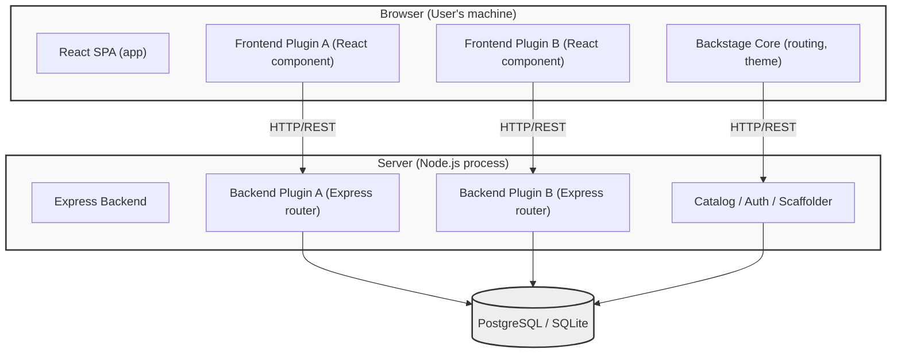

> **Complexity**: `[COMPLEX]` — Heaviest exam domain (32%)
>
> **Time to Complete**: 90-120 minutes
>
> **Prerequisites**: Module 1 (Backstage Development Workflow), familiarity with TypeScript, React basics, npm/yarn
>
> **CBA Domain**: Domain 4 — Customizing Backstage (32% of exam)

---

## What You'll Be Able to Do

- **Build** a Backstage frontend plugin with routable extensions and a dedicated API ref.
- **Implement** a backend plugin on the new backend system using `createBackendPlugin` and core services.
- **Design** Material UI theming that respects the Backstage theme and dark/light modes.
- **Create** a software template (scaffolder) with parameters and built-in actions.
- **Test** frontend and backend plugins with `@backstage/test-utils` and integration harnesses.

---

## Why This Module Matters

This is the single most important module for the CBA exam. [**Domain 4 is worth 32%**](https://www.cncf.io/training/certification/cba/) — nearly one in three questions will test your understanding of plugin development, Material UI, Software Templates, theming, and auth providers.

Backstage without plugins is an empty shell. The entire value proposition — the software catalog, TechDocs, CI/CD visibility, scaffolding — all of it is delivered through plugins. [When Spotify built Backstage](https://github.com/backstage/backstage), they designed it as a plugin platform first and a portal second. Understanding how plugins work is understanding how Backstage works.

This module is code-heavy by design. The exam shows you TypeScript and React snippets and asks what they do. You will not write code during the exam, but you absolutely need to *read* code fluently.

**Hypothetical scenario:** A platform team ships a custom dashboard plugin that calls a cluster API directly from the browser using credentials embedded in frontend configuration. An attacker who inspects network traffic or bundled JavaScript could harvest those credentials and use them outside Backstage's auth perimeter. Remediation would require rotating secrets, auditing access logs, and redesigning the plugin so sensitive calls flow through a backend plugin with proper service-to-service authentication. The lesson is architectural: Backstage plugin development is not standard React development. You must know exactly where code executes, how it authenticates, and which APIs belong on which side of the browser boundary.

> **The Restaurant Analogy**
>
> Backstage is a restaurant kitchen. The core framework is the building — walls, plumbing, electricity. Frontend plugins are the dishes on the menu. Backend plugins are the kitchen stations (grill, prep, dessert). Software Templates are the recipes that let line cooks produce consistent meals. Auth providers are the bouncers at the door. You do not run a restaurant by staring at the building — you run it by cooking.

---

## Did You Know?

1. **Massive Ecosystem**: The Backstage community maintains a public directory at `backstage.io/plugins` and a dedicated [`backstage/community-plugins` repository governed strictly under the Apache License 2.0](https://github.com/backstage/community-plugins). The [Certified Backstage Associate (CBA) certification itself is officially offered by the CNCF](https://www.cncf.io/training/certification/cba/).
2. **Strict Release Cadence**: As a CNCF Incubating project (not yet Graduated), Backstage follows [a monthly main release line (shipping the Tuesday before the third Wednesday of each month) and a weekly `next` release line on Tuesdays for early access](https://github.com/backstage/backstage/blob/master/docs/overview/versioning-policy.md). The `next` release line offers early access to upcoming features with fewer stability guarantees.
3. **Runtime Support Windows**: Backstage strictly supports [exactly two adjacent even-numbered Node.js LTS releases (e.g., Node.js 22 and 24 as of v1.46.0)](https://github.com/backstage/backstage/releases/tag/v1.46.0) and the [last three major TypeScript versions](https://github.com/backstage/backstage/blob/master/docs/overview/versioning-policy.md) at any given time. React 18 is currently supported, with React 19 under evaluation.
4. **The New Default**: The Backstage GitHub releases confirm v1.49.0 as the stable release as of 2026-01-28. v1.49.0 is the verified baseline referenced here; check the Backstage releases page for any newer versions before relying on release-specific behavior. [As of v1.49.0, newly created Backstage apps use the New Frontend System by default. The old `--next` CLI flag has been removed and replaced by a `--legacy` flag.](https://github.com/backstage/backstage/releases/tag/v1.49.0)

---

## Part 1: Frontend vs Backend Plugin Architecture

Before writing any code, you need to understand where plugins run. This is one of the most commonly tested concepts on the CBA. The CBA does not ask you to memorize every file in a plugin scaffold; it asks you to look at a snippet and decide whether it belongs in the browser or on the server, and what breaks when you put it on the wrong side.

Choosing a frontend plugin versus a backend plugin is a security and capability decision, not a packaging preference. If the feature only needs to render data the user already has permission to see, and all sensitive work happens through existing Backstage APIs, a frontend plugin is usually enough. If the feature needs database access, long-lived secrets, filesystem reads, or calls to systems that must never be exposed to browsers, you need a backend plugin (often paired with a thin frontend UI). Many real features — catalog views, custom dashboards, template wizards — use both: React in the browser, Express routes and injected services in Node.js.

When you read exam code, trace the import graph first. Browser bundles cannot safely import `@backstage/backend-plugin-api`, Knex, or Node-only SDKs. Conversely, backend plugins do not render JSX. The HTTP boundary between them is deliberate: the frontend uses `fetchApiRef` so Backstage can attach auth headers, resolve proxy base URLs, and keep credentials out of client-side code.

On newer Backstage versions, you may also see references to the New Frontend System (`createFrontendPlugin`, extension blueprints). The legacy `createPlugin` API remains heavily represented in exam material and existing apps. Regardless of which API a snippet uses, the split remains the same: UI and routing in the frontend package, data and secrets in the backend package.

Reading the architecture diagram above, follow the arrows: browser plugins never touch PostgreSQL directly; they call HTTP endpoints on backend plugins. Backend plugins share a single Node process in typical deployments, which is why service-to-service auth and centralized middleware matter — you are not deploying microservices per plugin, you are composing routers inside one trusted backend.


```mermaid
flowchart TD
    subgraph Browser["Browser (User's machine)"]
        SPA["React SPA (app)"]
        FP_A["Frontend Plugin A (React component)"]
        FP_B["Frontend Plugin B (React component)"]
        Core["Backstage Core (routing, theme)"]
    end

    subgraph Server["Server (Node.js process)"]
        Backend["Express Backend"]
        BP_A["Backend Plugin A (Express router)"]
        BP_B["Backend Plugin B (Express router)"]
        BCore["Catalog / Auth / Scaffolder"]
    end

    FP_A -- "HTTP/REST" --> BP_A
    FP_B -- "HTTP/REST" --> BP_B
    Core -- "HTTP/REST" --> BCore

    DB[("PostgreSQL / SQLite")]
    BP_A --> DB
    BP_B --> DB
    BCore --> DB

    style Browser fill:#f9f9f9,stroke:#333,stroke-width:2px
    style Server fill:#f9f9f9,stroke:#333,stroke-width:2px
    style DB fill:#eee,stroke:#333,stroke-width:2px
```

### Key Differences

| Aspect | Frontend Plugin | Backend Plugin |
|--------|----------------|----------------|
| **Language** | TypeScript + React + JSX | TypeScript + Express |
| **Runs in** | Browser | Node.js server |
| **Access to** | DOM, browser APIs, user session | Filesystem, database, secrets, network |
| **Package location** | `plugins/my-plugin/` | `plugins/my-plugin-backend/` |
| **Entry point** | `createPlugin()` / `createFrontendPlugin()` | `createBackendPlugin()` |
| **Communicates via** | Backstage API client (`fetchApiRef`) | Express routes mounted at `/api/my-plugin` |
| **Testing** | `@testing-library/react` | Supertest + backend test utils |

When the CBA shows a code block, ask three questions before picking an answer: Does this import belong in a browser bundle? Does it touch secrets or persistence? Does it integrate with Backstage APIs (`fetchApiRef`, `coreServices`, template actions)? Frontend plugins may orchestrate UX and call HTTP endpoints; they must not embed service account keys or open raw database sockets. Backend plugins may persist state and broker trust between Backstage and external systems, but they never render React trees directly to users.

Teams often split work across two packages in the same feature: `@org/plugin-feature` and `@org/plugin-feature-backend`. Shared types and constants sometimes live in `@org/plugin-feature-common` so both sides agree on DTO shapes without importing implementation code across the boundary. On the exam, package naming suffixes (`-backend`, `-common`, `-react`) are clues about which runtime owns the snippet.

---

## Part 2: Frontend Plugin Development

Frontend plugins are how Backstage feels like a single product instead of a collection of iframes. They register routes, expose React pages, declare API refs for typed clients, and integrate with the app shell (sidebar, themes, error boundaries). On the exam, expect to interpret `createPlugin`, route refs, and `createRoutableExtension` — these three pieces together answer "how does this page become a first-class Backstage feature?"

A dedicated API ref (for example, a custom client interface registered with `createApiRef`) is the idiomatic way for plugin code to stay testable and decoupled from fetch details. Components call `useApi(myApiRef)` instead of hardcoding URLs. That pattern mirrors how core plugins expose catalog, scaffolder, and permission clients, and it is the detail reviewers look for when distinguishing "React page pasted into App.tsx" from a real plugin.

Dynamic imports in `createRoutableExtension` are not optional polish. They keep initial bundle size manageable in large monorepos with dozens of plugins. When a user opens your page, Backstage loads that plugin chunk on demand. Exam questions sometimes show a static import and ask why lazy loading matters — the answer ties to performance and the plugin platform model, not generic React trivia.

### 2.1 Creating a Frontend Plugin

Backstage provides a CLI command to scaffold a new plugin, and the generated plugin structure looks like this:

```bash
# From the Backstage root directory
yarn new --select plugin

# You'll be prompted for a plugin ID, e.g., "my-dashboard"
# This creates: plugins/my-dashboard/
```

> **Pause and predict**: What package naming convention does the CLI follow for new plugins?
>
> The generated package follows the convention `@<scope>/plugin-<pluginId>` for the main package. If your plugin requires additional roles, those packages use suffixes like `-react`, `-common`, `-backend`, `-node`, or `-backend-module-<moduleId>`.

```
plugins/my-dashboard/
├── src/
│   ├── index.ts              # Public API exports
│   ├── plugin.ts             # Plugin definition (createPlugin)
│   ├── routes.ts             # Route references
│   ├── components/
│   │   ├── MyDashboardPage/
│   │   │   ├── MyDashboardPage.tsx
│   │   │   └── index.ts
│   │   └── ExampleFetchComponent/
│   ├── api/                  # API client definitions
│   └── setupTests.ts
├── package.json
├── README.md
└── dev/                      # Standalone dev setup
    └── index.tsx
```

### 2.2 The Plugin Definition — `createPlugin`

Every frontend plugin starts with a plugin definition. While the New Frontend System utilizes `createFrontendPlugin` from `@backstage/frontend-plugin-api`, the extensively tested legacy API relies on `createPlugin` from `@backstage/core-plugin-api`. This defines the plugin's identity — it registers the plugin with Backstage and declares its routes, APIs, and extensions. The New Frontend System also provides extension blueprints such as `PageBlueprint` and `NavItemBlueprint` from `@backstage/frontend-plugin-api` to standardize definitions.

```typescript
// plugins/my-dashboard/src/plugin.ts
import {
  createPlugin,
  createRoutableExtension,
} from '@backstage/core-plugin-api';
import { rootRouteRef } from './routes';

export const myDashboardPlugin = createPlugin({
  id: 'my-dashboard',
  routes: {
    root: rootRouteRef,
  },
});

export const MyDashboardPage = myDashboardPlugin.provide(
  createRoutableExtension({
    name: 'MyDashboardPage',
    component: () =>
      import('./components/MyDashboardPage').then(m => m.MyDashboardPage),
    mountPoint: rootRouteRef,
  }),
);
```

What this code does, line by line: `createPlugin({ id: 'my-dashboard' })` registers a plugin with a unique ID — Backstage uses this ID for routing, configuration, and analytics, plugin IDs must use kebab-case (e.g., `my-dashboard`), and the plugin instance variable uses the camelCase version with a `Plugin` suffix (e.g., `myDashboardPlugin`). `routes: { root: rootRouteRef }` associates named routes with the plugin, and `rootRouteRef` is a reference created elsewhere (see below). `createRoutableExtension()` creates a React component that Backstage can mount at a URL path; the `component` field uses dynamic `import()` for code splitting, so the plugin code is only loaded when a user navigates to its page. `mountPoint: rootRouteRef` ties this component to the route reference.

Exam questions sometimes show a plugin that exports a page component but never calls `createRoutableExtension`. That component renders when imported directly, yet it is invisible to Backstage's extension catalog and cannot participate in composable UI experiments. The fix is always to route page exports through the plugin instance so Backstage knows which package owns the surface area. Similarly, if a snippet registers APIs with `createApiRef` but never provides an implementation via `createApiFactory` in the plugin definition, consuming components will throw at runtime when `useApi` cannot resolve the ref.

### 2.3 Route References

```typescript
// plugins/my-dashboard/src/routes.ts
import { createRouteRef } from '@backstage/core-plugin-api';

export const rootRouteRef = createRouteRef({
  id: 'my-dashboard',
});
```

Route references are abstract — they do not contain actual URL paths. The path is assigned when the plugin is mounted in the app (see Section 2.5).

### 2.4 Writing a Frontend Plugin Page

Here is a complete frontend plugin page that fetches data from a backend API and displays it using Backstage's built-in components:

```tsx
// plugins/my-dashboard/src/components/MyDashboardPage/MyDashboardPage.tsx
import React from 'react';
import { useApi, fetchApiRef } from '@backstage/core-plugin-api';
import {
  Header,
  Page,
  Content,
  ContentHeader,
  SupportButton,
  Table,
  TableColumn,
  InfoCard,
  Progress,
  ResponseErrorPanel,
} from '@backstage/core-components';
import { Grid } from '@mui/material';
import useAsync from 'react-use/lib/useAsync';

// Define the shape of data we expect from our backend
interface ServiceHealth {
  name: string;
  status: 'healthy' | 'degraded' | 'down';
  lastChecked: string;
  responseTimeMs: number;
}

// Table column definitions — Backstage's Table component uses this pattern
const columns: TableColumn<ServiceHealth>[] = [
  { title: 'Service', field: 'name' },
  {
    title: 'Status',
    field: 'status',
    render: (row: ServiceHealth) => {
      const colors: Record<string, string> = {
        healthy: '#4caf50',
        degraded: '#ff9800',
        down: '#f44336',
      };
      return (
        <span style={{ color: colors[row.status], fontWeight: 'bold' }}>
          {row.status.toUpperCase()}
        </span>
      );
    },
  },
  { title: 'Response Time (ms)', field: 'responseTimeMs', type: 'numeric' },
  { title: 'Last Checked', field: 'lastChecked' },
];

export const MyDashboardPage = () => {
  // useApi hook retrieves a Backstage API implementation by its ref
  const fetchApi = useApi(fetchApiRef);

  // useAsync handles loading/error states for async operations
  const {
    value: services,
    loading,
    error,
  } = useAsync(async (): Promise<ServiceHealth[]> => {
    const response = await fetchApi.fetch(
      '/api/my-dashboard/services/health',
    );
    if (!response.ok) {
      throw new Error(`Failed to fetch: ${response.statusText}`);
    }
    return response.json();
  }, []);

  if (loading) return <Progress />;
  if (error) return <ResponseErrorPanel error={error} />;

  return (
    <Page themeId="tool">
      <Header title="Service Health Dashboard" subtitle="Real-time status" />
      <Content>
        <ContentHeader title="Overview">
          <SupportButton>
            This dashboard shows the health of all registered services.
          </SupportButton>
        </ContentHeader>
        <Grid container spacing={3}>
          <Grid item xs={12}>
            <InfoCard title="Service Count">
              {services?.length ?? 0} services monitored
            </InfoCard>
          </Grid>
          <Grid item xs={12}>
            <Table
              title="Service Health"
              options={{ search: true, paging: true, pageSize: 10 }}
              columns={columns}
              data={services ?? []}
            />
          </Grid>
        </Grid>
      </Content>
    </Page>
  );
};
```

### Key Backstage Components Used Above

| Component | Package | Purpose |
|-----------|---------|---------|
| `Page` | `@backstage/core-components` | Top-level layout with sidebar support |
| `Header` | `@backstage/core-components` | Page header with title and subtitle |
| `Content` | `@backstage/core-components` | Main content area with padding |
| `InfoCard` | `@backstage/core-components` | A Material Design card with title |
| `Table` | `@backstage/core-components` | Data table with search, sort, pagination |
| `Progress` | `@backstage/core-components` | Loading spinner |
| `ResponseErrorPanel` | `@backstage/core-components` | Styled error display |
| `Grid` | `@mui/material` | MUI responsive grid layout |

### 2.5 Mounting the Plugin in the App

After building the plugin, you wire it into the app and add a sidebar entry, as shown in the following examples:

```tsx
// packages/app/src/App.tsx
import { MyDashboardPage } from '@internal/plugin-my-dashboard';

// Inside the <FlatRoutes> component:
<Route path="/my-dashboard" element={<MyDashboardPage />} />
```

```tsx
// packages/app/src/components/Root/Root.tsx
import DashboardIcon from '@mui/icons-material/Dashboard';

// Inside the <Sidebar> component:
<SidebarItem icon={DashboardIcon} to="my-dashboard" text="Health" />
```

Mounting is where many custom pages die quietly. A React route alone renders HTML; Backstage integration requires exporting a routable extension from the plugin package and importing that symbol in `App.tsx`. Sidebar entries use route refs or string paths consistent with your router configuration. If global search or cross-plugin deep links fail, the bug is usually missing `createPlugin` registration, not the React component itself. Keep plugin IDs stable — changing `id: 'my-dashboard'` breaks analytics, config keys, and bookmarked entity URLs that reference plugin-owned routes.

The `dev/` folder in generated plugins exists so you can iterate on UI without booting the entire monorepo. For exam purposes, remember that production wiring always flows through `packages/app` and `packages/backend`, not the standalone dev entry alone.

---

## Part 3: Backend Plugin Development

Backend plugins are the trust boundary of your Backstage deployment. They hold database connections, read `app-config.yaml` secrets, and call internal APIs on behalf of signed-in users. The new backend system (`createBackendPlugin`, `coreServices`, backend modules) replaced the older pattern where each plugin manually constructed Express apps and fought over ports. On the CBA, if a snippet creates its own `express()` listener or binds a custom port, that is a red flag — integrated plugins mount routers through `coreServices.httpRouter`.

Dependency injection via `coreServices` is more than convenience. It guarantees consistent logging, config, database migrations, and auth middleware across plugins. When you declare `deps: { database: coreServices.database }`, Backstage supplies a Knex client with the same lifecycle as catalog and scaffolder. That is why `backend.add(myPlugin)` is sufficient registration: the framework wires init order, health checks, and route prefixes (`/api/<pluginId>`) for you.

Legacy backends used a `createRouter` factory passed to a plugin builder; the new system inverts control. Your plugin describes what it needs; the backend host calls `registerInit` when dependencies are ready. Exam questions often contrast these styles — know that `createBackendPlugin` + `env.registerInit` is the recommended pattern for new code, and that backend modules (`createBackendModule`) extend existing plugins (for example, adding scaffolder actions) without forking core packages.

### 3.1 Creating a Backend Plugin

```bash
yarn new --select backend-plugin

# Enter plugin ID: "my-dashboard"
# This creates: plugins/my-dashboard-backend/
```

### 3.2 Backend Plugin Structure (New Backend System)

Backstage has migrated to a "new backend system" (introduced in Backstage 1.x). [It reached stable 1.0 and is highly recommended for all new plugin development.](https://github.com/backstage/backstage/releases/tag/v1.31.0) The exam strongly tests the new pattern. Here is the full structure of a backend plugin using `createBackendPlugin` from `@backstage/backend-plugin-api`:

```typescript
// plugins/my-dashboard-backend/src/plugin.ts
import {
  coreServices,
  createBackendPlugin,
} from '@backstage/backend-plugin-api';
import { createRouter } from './router';

export const myDashboardPlugin = createBackendPlugin({
  pluginId: 'my-dashboard',
  register(env) {
    env.registerInit({
      deps: {
        logger: coreServices.logger,
        http: coreServices.httpRouter,
        database: coreServices.database,
        config: coreServices.rootConfig,
      },
      async init({ logger, http, database, config }) {
        logger.info('Initializing my-dashboard backend plugin');

        const router = await createRouter({
          logger,
          database,
          config,
        });

        // Mount the Express router at /api/my-dashboard
        http.use(router);
      },
    });
  },
});
```

Key concepts: **`createBackendPlugin`** declares a backend plugin with a unique `pluginId`; **`coreServices`** provides dependency injection — instead of constructing dependencies yourself, you declare what you need and Backstage provides them; **`coreServices.httpRouter`** is an Express router scoped to `/api/<pluginId>`; **`coreServices.database`** is a Knex.js database client that Backstage manages; and **`coreServices.logger`** is a Winston logger scoped to the plugin. Additionally, backend extension points are created with `createExtensionPoint` from `@backstage/backend-plugin-api`. A backend module may only extend a single plugin and must be installed in the same backend instance as that plugin.

Compare this to legacy backends where each plugin exported a `createRouter` function and the host called it manually. The new system's `registerInit` hook runs after dependency graph resolution, which prevents plugins from touching the database before migrations run. When you see exam code listing `deps: { logger, http, database, config }`, treat it as the canonical pattern — missing `httpAuth` or `auth` in a snippet that calls other plugins is a hint the question is about service-to-service auth gaps.

### 3.3 Writing an Express Router

```typescript
// plugins/my-dashboard-backend/src/router.ts
import { Router } from 'express';
import { Logger } from 'winston';
import { DatabaseService } from '@backstage/backend-plugin-api';
import { Config } from '@backstage/config';

interface RouterOptions {
  logger: Logger;
  database: DatabaseService;
  config: Config;
}

interface ServiceHealthRecord {
  name: string;
  status: string;
  last_checked: string;
  response_time_ms: number;
}

export async function createRouter(
  options: RouterOptions,
): Promise<Router> {
  const { logger, database } = options;
  const router = Router();

  // Get a Knex database client from Backstage's database service
  const dbClient = await database.getClient();

  // Run migrations on startup (create tables if they don't exist)
  if (!await dbClient.schema.hasTable('service_health')) {
    await dbClient.schema.createTable('service_health', table => {
      table.string('name').primary();
      table.string('status').notNullable();
      table.timestamp('last_checked').defaultTo(dbClient.fn.now());
      table.integer('response_time_ms');
    });
    logger.info('Created service_health table');
  }

  // GET /api/my-dashboard/services/health
  router.get('/services/health', async (_req, res) => {
    try {
      const services = await dbClient<ServiceHealthRecord>(
        'service_health',
      ).select('*');

      res.json(
        services.map(s => ({
          name: s.name,
          status: s.status,
          lastChecked: s.last_checked,
          responseTimeMs: s.response_time_ms,
        })),
      );
    } catch (err) {
      logger.error('Failed to fetch service health', err);
      res.status(500).json({ error: 'Internal server error' });
    }
  });

  // POST /api/my-dashboard/services/health
  router.post('/services/health', async (req, res) => {
    const { name, status, responseTimeMs } = req.body;

    if (!name || !status) {
      res.status(400).json({ error: 'name and status are required' });
      return;
    }

    try {
      await dbClient('service_health')
        .insert({
          name,
          status,
          response_time_ms: responseTimeMs ?? 0,
          last_checked: new Date().toISOString(),
        })
        .onConflict('name')
        .merge(); // Upsert: update if exists

      res.status(201).json({ message: 'Service health recorded' });
    } catch (err) {
      logger.error('Failed to record service health', err);
      res.status(500).json({ error: 'Internal server error' });
    }
  });

  return router;
}
```

Express routers in Backstage plugins should stay thin: validate input, call services, map errors to HTTP status codes, and log with the injected Winston logger. Heavy business logic belongs in separate modules so you can unit test without standing up HTTP. Database migrations inside route handlers (as shown above) are acceptable for teaching examples; production plugins often use dedicated migration files executed by Backstage's database service on startup. The exam cares that you recognize Knex access through `database.getClient()` rather than constructing your own connection pool from raw `app-config` passwords.

Route paths are relative to the plugin mount point. A handler registered as `router.get('/services/health')` is reachable at `/api/my-dashboard/services/health` when `pluginId` is `my-dashboard`. Mixing absolute paths or duplicate plugin IDs across teams causes subtle 404s that look like auth failures in the browser network tab.

---

```typescript
// packages/backend/src/index.ts
import { myDashboardPlugin } from '@internal/plugin-my-dashboard-backend';

// In the backend builder:
backend.add(myDashboardPlugin);
```

That single line is all it takes. The new backend system handles dependency injection, router mounting, and lifecycle management automatically.

### 3.5 Service-to-Service Authentication

When operating in the Backstage backend ecosystem, your custom plugin will frequently need to communicate with *other* Backstage backend plugins—for example, verifying an entity's existence in the Catalog before taking action. Because these routes are strictly protected by Backstage's core authentication policies, you cannot simply make raw, unauthenticated HTTP calls, so Backstage manages service-to-service communication via internally generated plugin tokens.

The security model here is delegation, not sharing one super-token. A user's browser session is scoped to what that user may do in the UI. When your backend plugin calls the catalog on the user's behalf, Backstage issues a **plugin request token** that is limited to the target plugin and carries the user's identity forward. If a malicious or buggy plugin were given a universal session secret, compromise of that plugin would expose every API in the cluster. Plugin tokens shrink the blast radius: a flaw in your dashboard plugin should not automatically grant catalog admin powers unless policy explicitly allows it.

In the New Backend System, you leverage the [built-in `coreServices.auth` and `coreServices.httpAuth` modules to request authorization](https://raw.githubusercontent.com/backstage/backstage/master/docs/auth/service-to-service-auth.md). The typical flow extracts credentials from the incoming request with `httpAuth.credentials(req)`, requests a token with `auth.getPluginRequestToken({ onBehalfOf, targetPluginId })`, and attaches `Authorization: Bearer` on the downstream fetch. Exam snippets often omit step two — if you see a backend route calling `/api/catalog` with no token, assume it will fail in production even if localhost appears to work behind relaxed dev settings.

When designing backend plugins, treat every outbound call as two decisions: **which plugin owns the data**, and **whose identity should the call use**. Service accounts, user delegation, and plugin-to-plugin calls have different resolver paths. The CBA favors questions where the fix is "use `getPluginRequestToken`" rather than "disable auth in app-config," because the latter violates enterprise deployment patterns.

#### Requesting a Plugin Token

In the New Backend System, you leverage the built-in `coreServices.auth` and `coreServices.httpAuth` modules to request authorization, as shown in the example below.

```typescript
// Example snippet demonstrating service-to-service auth
import { coreServices } from '@backstage/backend-plugin-api';

// Inside your plugin's init method:
async init({ logger, http, auth, httpAuth }) {
  http.get('/dependent-data', async (req, res) => {
    try {
      // 1. Extract the credentials of the user making the request
      const credentials = await httpAuth.credentials(req);
      
      // 2. Request a service-to-service token acting on behalf of the user
      const { token } = await auth.getPluginRequestToken({
        onBehalfOf: credentials,
        targetPluginId: 'catalog',
      });

      // 3. Attach the generated token to the downstream API call
      const response = await fetch('http://localhost:7007/api/catalog/entities', {
        headers: {
          Authorization: `Bearer ${token}`,
        }
      });
      
      const data = await response.json();
      res.json(data);
    } catch (error) {
      logger.error('Failed to communicate securely with the catalog', error);
      res.status(500).send('Internal Error');
    }
  });
}
```

> **Stop and think**: Why does Backstage require a distinct plugin token for backend-to-backend communication instead of directly reusing the user's initial session token? (Hint: Consider the security blast radius if a malicious plugin successfully intercepted a universal user session token).

---

## Part 4: Material UI (MUI) and Theming

Backstage's visual layer is Material UI under a curated theme contract. Plugins should look native in both light and dark modes without hardcoding hex colors on every component. The exam tests whether you recognize MUI v5 patterns (`sx`, `Grid`, `Typography`) and whether you know Backstage-specific theming APIs — mixing generic MUI `createTheme` with Backstage shell components is a common failure mode.

`createUnifiedTheme` extends MUI's palette with navigation colors, page themes (`themeId` on `<Page themeId="tool">`), and component overrides that core plugins rely on. When you design custom branding, you are not just changing primary blue — you are aligning sidebar contrast, active nav indicators, and default page backgrounds so third-party plugins inherit the same look. Dark mode support flows from the unified palette; one-off inline styles often break when users toggle themes.

The `sx` prop is the preferred styling surface in MUI v5 inside Backstage. It reads theme tokens (`bgcolor: 'background.paper'`, spacing units) so components respond to org-wide theme changes. Exam snippets may show `makeStyles` or `@material-ui/core` imports — those indicate outdated tutorials, not current Backstage defaults.

### 4.1 Backstage's Relationship with MUI

Legacy Backstage frontend code commonly uses Material UI v5 (`@mui/material`), but current Backstage also ships Backstage UI components and is gradually moving some surfaces away from MUI-only primitives. The exam tests your ability to recognize MUI components and understand Backstage's theming system, including the commonly tested MUI components in a Backstage context:

| MUI Component | Backstage Usage |
|---------------|-----------------|
| `Grid` | Page layouts, responsive design |
| `Card` / `CardContent` | Content grouping (wrapped by `InfoCard`) |
| `Typography` | Text with semantic meaning (h1-h6, body, caption) |
| `Button` | Actions, form submissions |
| `TextField` | Form inputs in template forms |
| `Table` / `TableBody` / `TableRow` | Data display (Backstage wraps this in its own `Table`) |
| `Tabs` / `Tab` | Entity page tab navigation |
| `Chip` | Status badges, tags |
| `Dialog` | Modal dialogs for confirmations |

### 4.2 Custom Themes

Backstage supports custom themes via `createUnifiedTheme`. This lets organizations brand the portal with their own colors, fonts, and component styles.

```typescript
// packages/app/src/theme.ts
import { createUnifiedTheme, palettes } from '@backstage/theme';

export const myCustomTheme = createUnifiedTheme({
  palette: {
    ...palettes.light,
    primary: {
      main: '#1565c0',       // Your brand blue
    },
    secondary: {
      main: '#f57c00',       // Your brand orange
    },
    navigation: {
      background: '#171717', // Dark sidebar
      indicator: '#1565c0',  // Active item highlight
      color: '#ffffff',      // Sidebar text
      selectedColor: '#ffffff',
    },
  },
  defaultPageTheme: 'home',
  fontFamily: '"Inter", "Helvetica", "Arial", sans-serif',
  components: {
    // Override specific MUI component styles globally
    MuiButton: {
      styleOverrides: {
        root: {
          textTransform: 'none', // No ALL CAPS buttons
          borderRadius: 8,
        },
      },
    },
    MuiCard: {
      styleOverrides: {
        root: {
          borderRadius: 12,
        },
      },
    },
  },
});
```

Register the theme in the app as shown below, then apply one-off styling with the `sx` prop — MUI v5 uses `sx` for this pattern, and you will see it on the exam:

```tsx
// packages/app/src/App.tsx
import { myCustomTheme } from './theme';
import { UnifiedThemeProvider } from '@backstage/theme';

// In the app root:
<UnifiedThemeProvider theme={myCustomTheme}>
  <AppRouter>
    {/* ... routes ... */}
  </AppRouter>
</UnifiedThemeProvider>
```

### 4.3 Using the `sx` Prop

```tsx
import { Box, Typography, Chip } from '@mui/material';

export const StatusBanner = ({ status }: { status: string }) => (
  <Box
    sx={{
      display: 'flex',
      alignItems: 'center',
      gap: 2,
      p: 2,                         // padding: theme.spacing(2)
      bgcolor: 'background.paper',  // uses theme palette
      borderRadius: 1,
    }}
  >
    <Typography variant="h6">Current Status</Typography>
    <Chip
      label={status}
      color={status === 'healthy' ? 'success' : 'error'}
      sx={{ fontWeight: 'bold' }}
    />
  </Box>
);
```

Custom themes should be validated in both light and dark modes before rollout. Navigation contrast failures are the most common visual regression — white text on pale sidebar backgrounds looks fine in Storybook but fails WCAG in production. Prefer theme tokens in `sx` (`primary.main`, `text.secondary`) over literal hex in feature code so org rebrands do not require editing every plugin. Entity pages use `themeId` values like `home`, `tool`, and `service` to shift accent colors; your custom pages should pick a `themeId` consistent with similar core plugins so users perceive them as native.

When exam snippets import from `@material-ui/core` or use `makeStyles`, flag them as legacy. Current Backstage frontend code uses `@mui/material` and the `sx` prop pattern shown above.

---

## Part 5: Installing Existing Plugins

Not every plugin needs to be built from scratch. The Backstage plugin marketplace at [backstage.io/plugins](https://backstage.io/plugins) has 200+ community plugins, and most installed plugins follow this pattern. Installation is a three-layer problem: npm packages (frontend and optional backend), wiring in `packages/app` and `packages/backend`, and configuration in `app-config.yaml`. Skipping any layer produces the classic "route renders but API 404s" failure.

When evaluating community plugins, check whether they target the new backend system and your Backstage release line. A plugin that only ships legacy backend code may still work via compatibility shims, but exam questions increasingly assume `backend.add(import('...'))` and module-based configuration. Prefer CNCF/community-plugins entries when available — they follow naming and licensing conventions that enterprise legal teams expect.

Overriding components without forking is a platform-engineering skill the CBA rewards. `bindRoutes` and extension overrides let you redirect "Create Component" flows to your golden-path template instead of the default scaffolder entry point. That is customization at the composition layer rather than copy-pasting vendor code.

### 5.1 Installation Pattern

```bash
# 1. Install the frontend package
yarn --cwd packages/app add @backstage/plugin-tech-radar

# 2. Install the backend package (if the plugin has one)
yarn --cwd packages/backend add @backstage/plugin-tech-radar-backend
```

```tsx
// 3. Wire frontend into packages/app/src/App.tsx
import { TechRadarPage } from '@backstage/plugin-tech-radar';

<Route path="/tech-radar" element={<TechRadarPage />} />
```

```typescript
// 4. Wire backend into packages/backend/src/index.ts
backend.add(import('@backstage/plugin-tech-radar-backend'));
```

```yaml
# 5. Configure in app-config.yaml (if needed)
techRadar:
  url: https://your-org.com/tech-radar-data.json
```

### 5.2 Overriding Plugin Components

You can replace the default implementation of any plugin component. This is how you customize third-party plugins without forking them:

```tsx
// packages/app/src/App.tsx
import { createApp } from '@backstage/app-defaults';
import { catalogPlugin } from '@backstage/plugin-catalog';

const app = createApp({
  // ...
  bindRoutes({ bind }) {
    bind(catalogPlugin.externalRoutes, {
      createComponent: scaffolderPlugin.routes.root,
    });
  },
});
```

Installing third-party plugins is an operational checklist, not a single `yarn add`. After wiring frontend routes and backend modules, read the plugin README for required `app-config.yaml` keys and optional permission policies. Missing config often surfaces as runtime 500 errors with generic messages while the UI shell still loads. Version skew between frontend and backend packages of the same plugin produces especially painful failures — always upgrade both packages to compatible release lines listed in the plugin changelog.

For the CBA, recognize the install sequence: dependency install → app route → backend registration → config. Questions may show a correct npm install but omit backend wiring; the fix is `backend.add(...)`, not reinstalling the frontend package.

---

## Part 6: Software Templates

Software Templates are one of Backstage's most powerful features. They let platform teams define "golden paths" — standardized workflows for creating new services, libraries, or infrastructure. A Software Template is a YAML file registered in the catalog with `kind: Template`, as shown below.

Templates trade flexibility for consistency. Parameters should collect only what humans must decide (service name, owner, repo visibility); everything repetitive belongs in `steps` as actions. Poor parameter design — vague enums, missing validation patterns — produces failed scaffolder runs and angry developers. The `pattern` field on string parameters and UI fields like `OwnerPicker` exist so invalid input fails fast in the form instead of halfway through `publish:github`.

Action choice matters. `fetch:template` runs Nunjucks over skeleton files; binary assets and Java/XML files with `${{`-like syntax get corrupted. Split binary copies into `fetch:plain` steps. Built-in actions (`publish:github`, `catalog:register`) cover most golden paths; custom actions (`createTemplateAction`) integrate ticketing, secrets, or internal APIs. Custom actions always run server-side in the scaffolder backend — never in the browser — which is why they can read `app-config.yaml` secrets safely.

Template outputs (`steps['publish'].output.repoContentsUrl`) are how later steps reference generated infrastructure. A frequent exam trap is reading `${{ parameters.repoUrl }}` when the URL was produced by an earlier step — user parameters never contain step outputs. When reviewing a template YAML on the exam, underline every `${{` reference and label it as either `parameters`, `steps`, or `user` context before choosing an answer. That simple labeling habit prevents most variable-scope mistakes on scaffolder template questions during the CBA exam.

### 6.1 Template Structure

```yaml
apiVersion: scaffolder.backstage.io/v1beta3
kind: Template
metadata:
  name: create-nodejs-service
  title: Create a Node.js Microservice
  description: Creates a new Node.js service with CI/CD, monitoring, and docs
  tags:
    - nodejs
    - recommended
spec:
  owner: platform-team
  type: service

  # Step 1: Collect user input
  parameters:
    - title: Service Details
      required:
        - name
        - owner
      properties:
        name:
          title: Service Name
          type: string
          description: Unique name for the service
          pattern: '^[a-z0-9-]+$'
          ui:autofocus: true
        owner:
          title: Owner
          type: string
          description: Team that owns this service
          ui:field: OwnerPicker
          ui:options:
            catalogFilter:
              kind: Group
        description:
          title: Description
          type: string

    - title: Infrastructure
      properties:
        database:
          title: Database
          type: string
          enum: ['none', 'postgresql', 'mongodb']
          default: 'none'
        port:
          title: Port
          type: number
          default: 3000

  # Step 2: Execute actions
  steps:
    - id: fetch-template
      name: Fetch Skeleton
      action: fetch:template
      input:
        url: ./skeleton     # Directory containing template files
        values:
          name: ${{ parameters.name }}
          owner: ${{ parameters.owner }}
          description: ${{ parameters.description }}
          database: ${{ parameters.database }}
          port: ${{ parameters.port }}

    - id: publish
      name: Publish to GitHub
      action: publish:github
      input:
        allowedHosts: ['github.com']
        repoUrl: github.com?owner=my-org&repo=${{ parameters.name }}
        description: ${{ parameters.description }}
        defaultBranch: main
        repoVisibility: internal

    - id: register
      name: Register in Catalog
      action: catalog:register
      input:
        repoContentsUrl: ${{ steps['publish'].output.repoContentsUrl }}
        catalogInfoPath: '/catalog-info.yaml'

  # What to show the user when done
  output:
    links:
      - title: Repository
        url: ${{ steps['publish'].output.remoteUrl }}
      - title: Open in Backstage
        icon: catalog
        entityRef: ${{ steps['register'].output.entityRef }}
```

### 6.2 Built-in Template Actions

| Action | Purpose |
|--------|---------|
| `fetch:template` | Copy and render template files (Nunjucks syntax) |
| `fetch:plain` | Copy files without templating |
| `publish:github` | Create a GitHub repository |
| `publish:gitlab` | Create a GitLab project |
| `publish:bitbucket` | Create a Bitbucket repository |
| `catalog:register` | Register the new entity in the Backstage catalog |
| `catalog:write` | Write a `catalog-info.yaml` file |
| `debug:log` | Log a message (useful for debugging templates) |

Parameters render as multi-step forms when you provide multiple entries under `spec.parameters`. Each array element becomes a wizard step with its own title and field group. Use `ui:field` extensions (like `OwnerPicker`) to connect form inputs to catalog entities instead of free-text team names that drift from reality. Validation patterns (`pattern`, `enum`, `required`) belong in the parameter schema so the scaffolder UI blocks bad input before any action runs — cheaper than failed GitHub repo creation halfway through a template.

The `output` section controls what links and entity refs users see in the success panel. Omitting outputs does not break execution, but it hurts adoption because developers cannot jump directly to the repo or catalog entry they just created.

### 6.3 Writing a Custom Template Action

When built-in actions are not enough, you write custom actions — this is a heavily tested topic on the CBA. The example below defines a custom action; you then register it in a backend module and use it in a template.

```typescript
// plugins/scaffolder-backend-custom/src/actions/createJiraTicket.ts
import { createTemplateAction } from '@backstage/plugin-scaffolder-node';
import { Config } from '@backstage/config';

export function createJiraTicketAction(options: { config: Config }) {
  const { config } = options;

  return createTemplateAction<{
    projectKey: string;
    summary: string;
    description: string;
    issueType: string;
  }>({
    id: 'jira:create-ticket',
    description: 'Creates a Jira ticket for tracking the new service',
    schema: {
      input: {
        type: 'object',
        required: ['projectKey', 'summary'],
        properties: {
          projectKey: {
            type: 'string',
            title: 'Jira Project Key',
            description: 'e.g., PLATFORM',
          },
          summary: {
            type: 'string',
            title: 'Ticket Summary',
          },
          description: {
            type: 'string',
            title: 'Ticket Description',
          },
          issueType: {
            type: 'string',
            title: 'Issue Type',
            enum: ['Task', 'Story', 'Bug'],
            default: 'Task',
          },
        },
      },
      output: {
        type: 'object',
        properties: {
          ticketUrl: {
            type: 'string',
            title: 'URL of the created Jira ticket',
          },
          ticketKey: {
            type: 'string',
            title: 'Jira ticket key (e.g., PLATFORM-123)',
          },
        },
      },
    },
    async handler(ctx) {
      const { projectKey, summary, description, issueType } = ctx.input;
      const jiraUrl = config.getString('jira.url');
      const jiraToken = config.getString('jira.apiToken');

      ctx.logger.info(
        `Creating Jira ticket in project ${projectKey}: ${summary}`,
      );

      const response = await fetch(`${jiraUrl}/rest/api/3/issue`, {
        method: 'POST',
        headers: {
          'Content-Type': 'application/json',
          Authorization: `Basic ${jiraToken}`,
        },
        body: JSON.stringify({
          fields: {
            project: { key: projectKey },
            summary,
            description: {
              type: 'doc',
              version: 1,
              content: [
                {
                  type: 'paragraph',
                  content: [{ type: 'text', text: description || summary }],
                },
              ],
            },
            issuetype: { name: issueType || 'Task' },
          },
        }),
      });

      if (!response.ok) {
        const errorBody = await response.text();
        throw new Error(`Jira API error (${response.status}): ${errorBody}`);
      }

      const data = await response.json();

      ctx.logger.info(`Created Jira ticket: ${data.key}`);

      // Output values can be referenced by later template steps
      ctx.output('ticketKey', data.key);
      ctx.output('ticketUrl', `${jiraUrl}/browse/${data.key}`);
    },
  });
}
```

```typescript
// plugins/scaffolder-backend-custom/src/plugin.ts
import { scaffolderActionsExtensionPoint } from '@backstage/plugin-scaffolder-node/alpha';
import { createBackendModule } from '@backstage/backend-plugin-api';
import { createJiraTicketAction } from './actions/createJiraTicket';

export const scaffolderModuleJiraAction = createBackendModule({
  pluginId: 'scaffolder',
  moduleId: 'jira-action',
  register(env) {
    env.registerInit({
      deps: {
        scaffolder: scaffolderActionsExtensionPoint,
        config: coreServices.rootConfig,
      },
      async init({ scaffolder, config }) {
        scaffolder.addActions(createJiraTicketAction({ config }));
      },
    });
  },
});
```

```yaml
steps:
  # ... other steps ...
  - id: create-jira-ticket
    name: Create Tracking Ticket
    action: jira:create-ticket
    input:
      projectKey: PLATFORM
      summary: 'New service: ${{ parameters.name }}'
      description: 'Service created via Backstage template by ${{ user.entity.metadata.name }}'
      issueType: Task
```

Custom actions integrate external systems with the same security expectations as backend routes: read secrets from config, log with `ctx.logger`, validate `ctx.input`, and throw descriptive errors when upstream APIs fail. Outputs you declare in the action schema become available to later template steps via `${{ steps['step-id'].output.field }}`. Designing schemas with required fields and enums reduces scaffolder failures caused by typos in free-text parameters.

Template authors should think about idempotency. Re-running a template after a partial failure must not always create duplicate repos or tickets — guard actions with checks or use upsert-friendly APIs where possible. The exam focuses more on syntax and execution environment than on day-two operations, but understanding that actions run sequentially in the backend helps you interpret log output snippets.

---

## Part 7: Auth Providers

Backstage supports multiple authentication providers out of the box. The exam tests configuration patterns for the most common ones. Auth is split across YAML (`auth.providers`) and backend modules that register providers and **sign-in resolvers** — functions that map an external identity (GitHub username, Okta email) to a catalog `User` entity. Without a matching User entity, sign-in fails even when OAuth succeeds, because Backstage cannot attach permissions to an unknown principal.

Resolver choice is a data modeling decision. `usernameMatchingUserEntityName` requires User entities whose `metadata.name` matches the IdP username. `emailMatchingUserEntityProfileEmail` requires accurate `spec.profile.email` in catalog data. Enterprises with automated User ingestion from HR systems pick resolvers that align with how those entities are named. Custom resolvers use `createOAuthProviderFactory` and `ctx.signInWithCatalogUser({ entityRef })` when built-ins do not fit federated identity layouts.

Production configs never hardcode client secrets in git — they reference `${ENV_VAR}` placeholders resolved at deploy time. Exam YAML snippets often look minimal; your job is to recognize provider keys (`github`, `okta`) and where `signIn.resolvers` lives in the hierarchy.

### 7.1 GitHub App Auth

```yaml
# app-config.yaml
auth:
  environment: production
  providers:
    github:
      production:
        clientId: ${GITHUB_CLIENT_ID}
        clientSecret: ${GITHUB_CLIENT_SECRET}
        signIn:
          resolvers:
            - resolver: usernameMatchingUserEntityName
```

### 7.2 Okta / OIDC

```yaml
# app-config.yaml
auth:
  providers:
    okta:
      production:
        clientId: ${OKTA_CLIENT_ID}
        clientSecret: ${OKTA_CLIENT_SECRET}
        audience: ${OKTA_AUDIENCE}
        authServerId: ${OKTA_AUTH_SERVER_ID}  # 'default' for org auth server
        signIn:
          resolvers:
            - resolver: emailMatchingUserEntityProfileEmail
```

### 7.3 Sign-in Resolvers

Sign-in resolvers map an external identity (GitHub user, Okta user) to a Backstage user entity in the catalog. The exam commonly tests these built-in resolvers, and you can also implement a custom sign-in resolver:

| Resolver | What it does |
|----------|-------------|
| `usernameMatchingUserEntityName` | Matches the provider's username to the `metadata.name` of a User entity |
| `emailMatchingUserEntityProfileEmail` | Matches the provider's email to `spec.profile.email` of a User entity |
| `emailLocalPartMatchingUserEntityName` | Matches the part before `@` in the email to `metadata.name` |

Resolver failures present as auth errors even when OAuth succeeds — the IdP handshake completes, but Backstage refuses to mint a session token because no catalog User matches. Operational fixes include importing User entities from HR systems, normalizing username casing, or switching resolver strategies. Exam distractors often suggest widening OAuth scopes; scopes do not help if the catalog lacks matching entities. Custom resolver code must still end in `ctx.signInWithCatalogUser` or equivalent APIs — you cannot bypass catalog identity entirely without breaking permission integration.

GitHub and Okta snippets differ mainly in provider keys and which profile fields resolvers read (`username` vs `email`). Read the YAML indentation carefully: `signIn.resolvers` nests under each environment block inside the provider, not at the root `auth` key.

```typescript
// packages/backend/src/auth.ts
import { createBackendModule } from '@backstage/backend-plugin-api';
import {
  authProvidersExtensionPoint,
  createOAuthProviderFactory,
} from '@backstage/plugin-auth-node';
import { githubAuthenticator } from '@backstage/plugin-auth-backend-module-github-provider';

export const authModuleGithubCustom = createBackendModule({
  pluginId: 'auth',
  moduleId: 'github-custom-resolver',
  register(reg) {
    reg.registerInit({
      deps: {
        providers: authProvidersExtensionPoint,
      },
      async init({ providers }) {
        providers.registerProvider({
          providerId: 'github',
          factory: createOAuthProviderFactory({
            authenticator: githubAuthenticator,
            async signInResolver(info, ctx) {
              // info.result contains the GitHub profile
              const { fullProfile } = info.result;
              const userId = fullProfile.username;

              if (!userId) {
                throw new Error('GitHub username is required');
              }

              // Issue a Backstage token for this user
              return ctx.signInWithCatalogUser({
                entityRef: { name: userId },
              });
            },
          }),
        });
      },
    });
  },
});
```

Auth configuration spans environment-specific YAML blocks (`production`, `development`) and catalog data quality. If sign-in succeeds in GitHub but Backstage shows "Login failed", the resolver likely could not find a matching User entity — fix catalog ingestion, not OAuth client IDs. Multiple providers can coexist; the sign-in page presents each configured provider. Custom resolvers belong in backend modules registered against the `auth` plugin, mirroring how scaffolder actions extend the scaffolder via modules rather than monkey-patching core code.

For exam YAML, trace `${VAR}` placeholders to secrets injected at deploy time. Never commit raw `clientSecret` values in template repositories. The CBA tests whether you know which resolver matches which identity field, not whether you memorized OAuth handshake byte sequences.

---

## Part 8: Testing Plugins

Testing proves your plugin respects Backstage boundaries under automation, not just in a manual browser session. Frontend tests should exercise routing, API refs, and theme context — plain `@testing-library/react` renders miss Backstage wrappers and give false confidence. Backend tests should hit Express routers with realistic HTTP requests and isolated databases, because initialization bugs often appear only when Knex migrations run.

Split your strategy: **unit tests** for pure helpers and action handlers, **integration tests** for routers and React pages with mocked dependencies. `@backstage/test-utils` (`renderInTestApp`) and `@backstage/frontend-test-utils` (New Frontend System) supply the app shell. MSW mocks HTTP at the network layer so components using `fetchApiRef` behave as they would against a real backend. For backend plugins, Supertest against an in-memory SQLite Knex instance catches schema and validation regressions without Docker.

Flaky frontend tests usually mean async assertions — `getByText` runs once; `findByText` waits for fetches MSW resolves. Backend tests fail when plugins assume migrations ran globally; your test harness must create tables the router expects, mirroring production init.

Keep test files adjacent to the code they cover (`MyDashboardPage.test.tsx` next to the component, `router.test.ts` next to the router factory). CI pipelines in Backstage monorepos typically run `yarn test` from the repo root with project references so plugin packages execute in isolation. When an exam question mentions `@backstage/test-utils`, assume the correct helper is `renderInTestApp` unless the snippet explicitly targets the New Frontend System test utilities package.

### 8.1 Frontend Plugin Tests

Backstage provides test utilities that wrap `@testing-library/react`. `renderInTestApp` is available from `@backstage/test-utils` (legacy system) and from `@backstage/frontend-test-utils` (new frontend system). Additionally, `createDevApp` from `@backstage/frontend-dev-utils` simplifies setting up a local plugin development app. Jest is the primary testing framework used throughout the Backstage ecosystem.

```tsx
// plugins/my-dashboard/src/components/MyDashboardPage/MyDashboardPage.test.tsx
import React from 'react';
import { screen } from '@testing-library/react';
import { renderInTestApp } from '@backstage/test-utils';
import { MyDashboardPage } from './MyDashboardPage';
import { rest } from 'msw';
import { setupServer } from 'msw/node';

// Mock the backend API using MSW (Mock Service Worker)
const server = setupServer(
  rest.get('/api/my-dashboard/services/health', (_req, res, ctx) => {
    return res(
      ctx.json([
        {
          name: 'auth-service',
          status: 'healthy',
          lastChecked: '2025-01-15T10:30:00Z',
          responseTimeMs: 42,
        },
        {
          name: 'payment-service',
          status: 'degraded',
          lastChecked: '2025-01-15T10:30:00Z',
          responseTimeMs: 1500,
        },
      ]),
    );
  }),
);

beforeAll(() => server.listen());
afterEach(() => server.resetHandlers());
afterAll(() => server.close());

describe('MyDashboardPage', () => {
  it('should render the service health table', async () => {
    await renderInTestApp(<MyDashboardPage />);

    // Wait for async data to load
    expect(
      await screen.findByText('Service Health Dashboard'),
    ).toBeInTheDocument();
    expect(await screen.findByText('auth-service')).toBeInTheDocument();
    expect(await screen.findByText('DEGRADED')).toBeInTheDocument();
  });

  it('should show an error panel when the API fails', async () => {
    server.use(
      rest.get('/api/my-dashboard/services/health', (_req, res, ctx) => {
        return res(ctx.status(500));
      }),
    );

    await renderInTestApp(<MyDashboardPage />);

    expect(await screen.findByText(/failed to fetch/i)).toBeInTheDocument();
  });
});
```

Key testing patterns: **`renderInTestApp`** wraps your component in the full Backstage app context (theme, API providers, routing), and in most Backstage component tests you should use this instead of plain `render` from `@testing-library/react`; **MSW (Mock Service Worker)** is the standard way to mock backend API calls in Backstage frontend tests; and **`screen.findByText`** means you should use `findBy*` (not `getBy*`) for async content that loads after a fetch.

Integration tests for backend plugins sometimes use `@backstage/backend-test-utils` helpers to boot a minimal backend instance when router-level Supertest is insufficient — for example, when middleware from `httpAuth` must run before your handler. For the CBA, prioritize recognizing `renderInTestApp`, MSW setup/teardown, and Supertest status assertions over memorizing Jest config filenames.

### 8.2 Backend Plugin Tests

```typescript
// plugins/my-dashboard-backend/src/router.test.ts
import { createRouter } from './router';
import express from 'express';
import request from 'supertest';
import { getVoidLogger } from '@backstage/backend-common';
import Knex from 'knex';

describe('createRouter', () => {
  let app: express.Express;

  beforeAll(async () => {
    // Create an in-memory SQLite database for testing
    const knex = Knex({
      client: 'better-sqlite3',
      connection: ':memory:',
      useNullAsDefault: true,
    });

    const router = await createRouter({
      logger: getVoidLogger(),
      database: {
        getClient: async () => knex,
      } as any,
      config: {} as any,
    });

    app = express();
    app.use(express.json());
    app.use(router);
  });

  it('GET /services/health returns empty array initially', async () => {
    const response = await request(app).get('/services/health');
    expect(response.status).toBe(200);
    expect(response.body).toEqual([]);
  });

  it('POST /services/health creates a record', async () => {
    const response = await request(app)
      .post('/services/health')
      .send({ name: 'test-svc', status: 'healthy', responseTimeMs: 50 });

    expect(response.status).toBe(201);
  });

  it('GET /services/health returns the created record', async () => {
    const response = await request(app).get('/services/health');
    expect(response.status).toBe(200);
    expect(response.body).toHaveLength(1);
    expect(response.body[0].name).toBe('test-svc');
  });

  it('POST /services/health rejects missing fields', async () => {
    const response = await request(app)
      .post('/services/health')
      .send({ status: 'healthy' }); // Missing 'name'

    expect(response.status).toBe(400);
  });
});
```

Backend router tests should cover happy paths, validation errors, and dependency failures (database unavailable, upstream 500). Use in-memory SQLite via Knex for speed, but remember dialect differences if production uses PostgreSQL-specific SQL — exam examples stay portable on purpose. Supertest requests hit your router mounted on a minimal Express app without starting the full Backstage backend, which keeps tests fast while still exercising HTTP semantics.

Frontend tests that mock APIs without MSW may accidentally call real network endpoints in CI — MSW intercepts fetch at the worker level and keeps tests hermetic. Pair `renderInTestApp` with `@backstage/test-utils` APIs when components depend on feature flags, identity, or permission refs exposed by the app shell.

---

## Common Mistakes

| Mistake | Why It Happens | Fix |
|---------|---------------|-----|
| Importing backend code in a frontend plugin | Looks like regular TypeScript imports | Frontend runs in the browser. It cannot access Node.js APIs, the filesystem, or the database. Use `fetchApiRef` to call your backend plugin over HTTP. |
| Using MUI v4 syntax (`makeStyles`, `@material-ui/core`) | Following outdated tutorials | Backstage uses MUI v5. Use `sx` prop, `styled()`, or `@mui/material` imports. |
| Hardcoding API URLs (`fetch('http://localhost:7007/...')`) | Works in local dev | Use `fetchApiRef` from `@backstage/core-plugin-api`. Backstage handles base URL resolution, auth headers, and proxy routing. |
| Forgetting to register the backend plugin | Plugin code exists but is not loaded by the backend | Add `backend.add(myPlugin)` in `packages/backend/src/index.ts`. No registration = no routes mounted. |
| Template actions with no error handling | Happy-path development | If a template action throws, the entire scaffolder run fails with a cryptic error. Wrap external API calls in try/catch and provide meaningful error messages. |
| Using `getBy*` in tests for async content | Unfamiliar with testing-library patterns | Data that loads from an API is async. Use `findBy*` (which retries) instead of `getBy*` (which asserts immediately). |
| Creating custom themes with `createTheme` | Mixing MUI's `createTheme` with Backstage | Use `createUnifiedTheme` from `@backstage/theme`, not `createTheme` from `@mui/material`. Backstage's version adds page themes, navigation palette, and plugin integration. |
| Not setting `pluginId` on backend plugins | Copy-paste errors | The `pluginId` determines the API route prefix (`/api/<pluginId>`). If two plugins share an ID, routes collide. |

---

## Quiz

Test your understanding of deep plugin architecture. These scenario-based questions heavily mirror the difficulty and format of the actual CBA exam.

<details>
<summary>Question 1: Plugin identity and routing integration</summary>

You are debugging a new Backstage portal deployment. A developer created a custom dashboard component and mounted it directly inside `App.tsx` using a plain React `<Route>` wrapping their custom component. While the page renders successfully when navigating to the URL, the Backstage global search cannot index the page's contents, and the routing system fails to resolve links generated from other plugins pointing to this dashboard. Why is the portal failing to integrate this component properly, and how should it be structured to resolve these issues?

They failed to bind the extension to a plugin instance using `createPlugin()`. A Backstage plugin must have a global identity registered with the system so that its APIs, routes, and extensions can be tracked and managed. Without this foundational identity, the Backstage routing tree cannot associate the component with a specific domain, causing deep links and global search indexing to fail. By wrapping the routable extension with `myPlugin.provide()`, the developer explicitly ties the React component to the plugin's ecosystem context.
</details>

<details>
<summary>Question 2: Authenticated frontend fetch patterns</summary>

A junior developer submits a PR for a new frontend plugin. In their component, they retrieve data using `const res = await window.fetch('http://localhost:7007/api/inventory/data');`. During code review, you explicitly reject this approach. How should the developer modify their code to correctly make authenticated requests to the backend plugin?

The developer should use `useApi(fetchApiRef)` to retrieve the Backstage fetch API, and then make the request using `fetchApi.fetch('/api/my-plugin/endpoint')`. The standard `window.fetch` does not automatically know the backend's base URL and fails to append the required authorization headers for Backstage's security perimeter. By using the framework's API reference, the frontend safely delegates base URL resolution, proxy routing, and token injection to Backstage core. Hardcoding URLs also guarantees the plugin will break when deployed to different environments like staging or production.
</details>

<details>
<summary>Question 3: New Backend System routing violations</summary>

Your organization is migrating custom legacy backend plugins to the New Backend System. An engineer submits a pull request for the `inventory` plugin. Inside the plugin's initialization logic, they instantiate a new Express application, configure it to listen on an available port, and bind their domain-specific routes to `/api/custom-inventory`. Why does this architectural approach violate the design principles of the New Backend System, and what risk does it introduce to the broader Backstage deployment?

The New Backend System strictly manages routing, port binding, and dependency injection globally across the entire Backstage instance. By instantiating their own Express application, the developer bypasses Backstage's centralized HTTP server, preventing the framework from applying essential middleware such as logging, error handling, and authentication. Furthermore, binding to a custom port creates an isolated service rather than an integrated plugin, breaking API discovery. The correct approach is to declare a dependency on `coreServices.httpRouter`, which safely injects an Express router already scoped to the plugin's namespace.
</details>

<details>
<summary>Question 4: Scaffolder action selection for binary templates</summary>

Your platform team maintains a Software Template that scaffolds a Java Spring Boot application. Developers report that the generated `.jar` wrapper files and certain Spring XML configurations are severely corrupted upon generation. What scaffolder action is likely causing this, and how should you adjust your template steps to resolve it?

The `fetch:template` action processes files through the Nunjucks templating engine, which attempts to evaluate any syntax resembling `${{ ... }}`. Since Java Spring `.jar` files and many XML configurations contain syntax that conflicts with Nunjucks, the templating engine corrupts their contents during processing. To resolve this, the developer should split the skeleton fetching into two steps. They must use `fetch:plain` to safely copy the binary and conflicting files without modification, and reserve `fetch:template` exclusively for source code files that actually require variable substitution.
</details>

<details>
<summary>Question 5: Backstage unified theming requirements</summary>

The design team provides a comprehensive Material UI theme configuration and instructs you to apply it to your Backstage portal. A developer attempts to integrate it using MUI's standard `createTheme` function, but notices that the sidebar navigation styling is broken and page backgrounds do not render correctly. What function must be used instead, and why?

The developer must use `createUnifiedTheme` from `@backstage/theme` rather than standard MUI tools. Backstage extends the base Material UI theme with custom properties specifically designed for its plugin ecosystem, such as page themes (`themeId`), dedicated navigation palettes, and standardized component overrides. Using MUI's standard `createTheme` drops these crucial extensions, causing the sidebar and application shell to render with default, unstyled fallbacks. Only `createUnifiedTheme` correctly bridges standard MUI styling with Backstage's internal visual architecture.
</details>

<details>
<summary>Question 6: Scaffolder action execution environment</summary>

You are implementing a custom scaffolder action that creates a PagerDuty project. A developer asks if they can use the browser's `localStorage` within the action handler to cache the PagerDuty API token to speed up subsequent template runs. How do you explain the execution environment of this action?

All scaffolder actions execute entirely on the server within the Node.js backend process, not in the user's browser. The frontend UI merely collects the input parameters and streams the execution logs back to the client. Because the action runs server-side, it cannot access browser-specific APIs like `localStorage` or `sessionStorage`. However, this server-side execution is exactly what allows the action to securely access sensitive configurations, read secrets from `app-config.yaml`, and communicate directly with the PagerDuty API without exposing credentials to the client.
</details>

<details>
<summary>Question 7: Async frontend testing with MSW</summary>

In your frontend plugin's test suite, you mock an API endpoint using MSW. You then render the component and assert `expect(screen.getByText('Service Analytics')).toBeInTheDocument();`. The test fails consistently, stating the element cannot be found, even though it appears correctly in the browser instance. How should you modify your assertion logic?

The assertion fails because the API data is fetched asynchronously, but `getByText` executes its assertion immediately upon the initial render before the mock API responds. To handle asynchronous state changes, the developer must use the `findByText` query from `@testing-library/react`. This function returns a promise that continually retries the assertion against the DOM until the element appears or the default timeout expires. Transitioning to `findBy*` queries is the standard pattern for testing components that rely on MSW and network requests.
</details>

<details>
<summary>Question 8: Extending the scaffolder via backend modules</summary>

A platform team wants to extend the built-in Scaffolder to integrate with a proprietary internal ticketing system. They write a custom action and attempt to inject it by importing the core Scaffolder plugin and mutating its configuration object before registering it with the backend builder. When the backend starts, it crashes with an initialization lifecycle error. Why does the New Backend System reject this pattern, and what is the structurally safe mechanism for augmenting existing plugins?

The New Backend System explicitly prohibits manual mutation of plugin instances after they are registered to ensure predictable initialization and dependency resolution. Direct modification circumvents the framework's lifecycle hooks and can cause race conditions or unresolvable dependencies during startup. Instead, the team must construct a dedicated backend module using `createBackendModule` that targets the `scaffolder` plugin ID. This module should declare a dependency on the `scaffolderActionsExtensionPoint` and safely inject the custom action through the provided `addActions` method.
</details>

---

## Hands-On Exercise: Build a Full-Stack Backstage Plugin

**Objective**: Build a robust "Team Links" plugin that displays and manages useful navigational links for specific teams. This comprehensive exercise covers frontend scaffolding, backend database routing, component wiring, and includes a bonus challenge to create a custom scaffolder action.

- [ ] Scaffold a fresh Backstage app with `npx @backstage/create-app@latest --legacy` and verify `packages/app/src/` exists (Node.js 22 or 24).
- [ ] Create the `team-links` backend plugin with `yarn new --select backend-plugin` and implement the Express router from Task 2 below.
- [ ] Compile the backend plugin with `yarn --cwd plugins/team-links-backend tsc` and confirm zero TypeScript errors.
- [ ] Create the `team-links` frontend plugin with `yarn new --select plugin` and replace `ExampleComponent` with the table UI that calls `fetchApiRef`.
- [ ] Compile the frontend plugin with `yarn --cwd plugins/team-links tsc` before wiring routes.
- [ ] Register the backend plugin in `packages/backend/src/index.ts` with `backend.add(import('@internal/plugin-team-links-backend'))`.
- [ ] Add a frontend route in `packages/app/src/App.tsx` pointing to `/team-links` and start the app with `yarn dev`.
- [ ] Open `http://127.0.0.1:3000/team-links` and confirm Platform team links render in the table.
- [ ] **Bonus:** Implement and register a `team-links:seed` scaffolder action via a `createBackendModule` targeting the scaffolder plugin.

### Task 1: Scaffolding the Workspace Environment

You cannot build plugins without a host application, so scaffold a fresh Backstage instance utilizing supported Node.js 22/24 environments and open your terminal to bootstrap the central application:

```bash
npx @backstage/create-app@latest --legacy
cd my-backstage-app
```

> **Pause and predict**: Why did we use the `--legacy` flag here? 
>
> As of Backstage v1.49.0, the New Frontend System is the default. Since this exercise focuses on the extensively-tested core API (`createPlugin`), we scaffold using the legacy frontend flag.

When the scaffold finishes, verify the app was created successfully by checking the directory structure:

```bash
ls -la packages/app/src/
```

### Task 2: Create the Backend Data Plugin

Construct the backend plugin responsible for managing the link data securely. Use the built-in generator to construct the node package:

```bash
yarn new --select backend-plugin
# Name it: team-links
```

Next, open `plugins/team-links-backend/src/router.ts` and replace its contents with the following Express router implementation to manage our links:

```typescript
import { Router } from 'express';
import { Logger } from 'winston';

export interface RouterOptions {
  logger: Logger;
}

const links = [
  { team: 'platform', title: 'Platform Docs', url: 'https://docs.example.com' },
  { team: 'platform', title: 'ArgoCD', url: 'https://argo.example.com' },
  { team: 'frontend', title: 'Storybook', url: 'https://storybook.example.com' }
];

export async function createRouter(
  options: RouterOptions,
): Promise<Router> {
  const { logger } = options;
  const router = Router();

  router.get('/health', (_, res) => {
    res.json({ status: 'ok' });
  });

  router.get('/links/:teamName', (req, res) => {
    const teamName = req.params.teamName;
    logger.info(`Fetching links for team: ${teamName}`);
    const teamLinks = links.filter(l => l.team === teamName);
    res.json(teamLinks);
  });

  return router;
}
```

After updating the router, verify the backend code compiles without errors:

```bash
yarn --cwd plugins/team-links-backend tsc
```

### Task 3: Create the Frontend Visual Plugin

Scaffold the React user interface that users will interact with. Run the generator again, selecting the frontend option, then navigate to `plugins/team-links/src/components/ExampleComponent/ExampleComponent.tsx` and replace the example component with the following code:

```bash
yarn new --select plugin
# Name it: team-links
```

```tsx
import React from 'react';
import { useApi, fetchApiRef } from '@backstage/core-plugin-api';
import useAsync from 'react-use/lib/useAsync';
import {
  Header,
  Page,
  Content,
  ContentHeader,
  Table,
  TableColumn,
  Progress,
  ResponseErrorPanel,
} from '@backstage/core-components';

interface TeamLink {
  team: string;
  title: string;
  url: string;
}

const columns: TableColumn<TeamLink>[] = [
  { title: 'Team', field: 'team' },
  { title: 'Title', field: 'title' },
  { 
    title: 'URL', 
    field: 'url',
    render: (row) => <a href={row.url} target="_blank" rel="noopener noreferrer">{row.url}</a>
  },
];

export const ExampleComponent = () => {
  const fetchApi = useApi(fetchApiRef);

  const { value, loading, error } = useAsync(async (): Promise<TeamLink[]> => {
    const response = await fetchApi.fetch('/api/team-links/links/platform');
    if (!response.ok) {
      throw new Error(`Failed to fetch links: ${response.statusText}`);
    }
    return await response.json();
  }, []);

  if (loading) {
    return <Progress />;
  } else if (error) {
    return <ResponseErrorPanel error={error} />;
  }

  return (
    <Page themeId="tool">
      <Header title="Team Links" subtitle="Useful resources for your team" />
      <Content>
        <ContentHeader title="Platform Team Links" />
        <Table
          title="Links"
          options={{ search: false, paging: false }}
          columns={columns}
          data={value || []}
        />
      </Content>
    </Page>
  );
};
```

Ensure the frontend code compiles successfully before registering the plugins:

```bash
yarn --cwd plugins/team-links tsc
```

### Task 4: Register the Plugins in the App

Plugins will not be loaded unless you register them in the main frontend and backend entry points. For backend registration, open `packages/backend/src/index.ts` and add your backend plugin to the builder, just before `backend.start()`:

```typescript
backend.add(import('@internal/plugin-team-links-backend'));
```

For frontend registration, open `packages/app/src/App.tsx` and add a route for your plugin inside the `<FlatRoutes>` block:

```tsx
import { ExampleComponent } from '@internal/plugin-team-links';

// Inside <FlatRoutes>:
<Route path="/team-links" element={<ExampleComponent />} />
```

Start the application to verify everything is wired up, then navigate to `http://localhost:3000/team-links` — you should see the table populated with the "Platform Docs" and "ArgoCD" links:

```bash
yarn dev
```

### Bonus Challenge: Custom Scaffolder Action (`team-links:seed`)

Write a custom scaffolder action that allows a Software Template to automatically add a new link to the `team-links-backend` when a new project is generated. In the `packages/backend` directory, create a new file `src/actions/seedTeamLink.ts`:

```typescript
import { createTemplateAction } from '@backstage/plugin-scaffolder-node';

export const createSeedTeamLinkAction = () => {
  return createTemplateAction<{ team: string; title: string; url: string }>({
    id: 'team-links:seed',
    description: 'Seeds a new link into the team-links plugin',
    schema: {
      input: {
        type: 'object',
        required: ['team', 'title', 'url'],
        properties: {
          team: { type: 'string', title: 'Team Name' },
          title: { type: 'string', title: 'Link Title' },
          url: { type: 'string', title: 'URL' },
        },
      },
    },
    async handler(ctx) {
      ctx.logger.info(`Seeding link for ${ctx.input.team}: ${ctx.input.title} -> ${ctx.input.url}`);
      // In a real implementation, you would make an HTTP POST request to your backend plugin here.
      // e.g., await fetch('http://localhost:7007/api/team-links/links', { method: 'POST', ... });
      ctx.output('seededUrl', ctx.input.url);
    },
  });
};
```

Finally, register the action by creating a backend module for the scaffolder in `packages/backend/src/index.ts`.

---

## Summary

This module covered the core of CBA Domain 4 — the largest domain on the exam at 32%. Treat every snippet as a boundary problem first: browser versus Node.js, user delegation versus plugin tokens, template parameters versus step outputs. Once you classify the runtime, the correct API choice (`fetchApiRef`, `coreServices`, `createTemplateAction`, `createUnifiedTheme`) usually follows directly.

The hands-on exercise reinforced the full stack: scaffold packages, register backend and frontend entry points, verify with TypeScript compile and manual navigation, then optionally extend the scaffolder. That sequence mirrors how platform teams ship internal plugins — small surface area, strict wiring discipline, tests that mock HTTP instead of bypassing Backstage APIs.

Here is what you should be able to do:

| Topic | Key Takeaway |
|-------|-------------|
| Frontend plugins | `createPlugin` + `createRoutableExtension`, mounted in `App.tsx` |
| Backend plugins | `createBackendPlugin` with dependency injection via `coreServices` |
| Communication | Frontend calls backend over HTTP using `fetchApiRef`, never direct imports |
| MUI / Theming | MUI v5 components, `sx` prop, `createUnifiedTheme` for custom branding |
| Software Templates | YAML-defined workflows with `fetch:template`, `publish:github`, `catalog:register` |
| Custom actions | `createTemplateAction` with typed input/output schemas, runs server-side |
| Auth providers | YAML config + sign-in resolvers that map external identity to catalog User entity |
| Testing | `renderInTestApp` + MSW for frontend, supertest + in-memory DB for backend |
| Plugin installation | Install package, wire into app/backend, configure in `app-config.yaml` |

---

## Next Module

- **Module 3**: [Backstage Catalog Deep Dive](../module-1.3-backstage-catalog-infrastructure/) — Entity processors, providers, annotations, and troubleshooting (Domain 3, 22%)
- **Module 1**: [Backstage Development Workflow](../module-1.1-backstage-dev-workflow/) — Monorepo structure, Docker builds, CLI commands (Domain 1, 24%)
- Review the [Backstage Official Plugin Development Guide](https://backstage.io/docs/plugins/) for additional depth

---

## Learner check

> Choosing a frontend plugin versus a backend plugin is a security and capability decision, not a packaging preference.

---

## Sources

- [What is Backstage?](https://backstage.io/docs/overview/what-is-backstage/) — Project overview and platform mental model.
- [Backstage Plugins Overview](https://backstage.io/docs/plugins/) — Core plugin concepts and navigation hub for plugin docs.
- [Create a Plugin](https://backstage.io/docs/plugins/create-a-plugin/) — Official frontend plugin scaffolding guide.
- [Backend Plugin Guide](https://backstage.io/docs/plugins/backend-plugin/) — Backend plugin structure and registration patterns.
- [Backstage Backend System](https://backstage.io/docs/backend-system/) — New backend system architecture with `createBackendPlugin`.
- [Structure of a Plugin](https://backstage.io/docs/plugins/structure-of-a-plugin/) — Package layout and naming conventions.
- [Software Templates](https://backstage.io/docs/features/software-templates/) — Scaffolder feature overview and golden-path patterns.
- [Writing Templates](https://backstage.io/docs/features/software-templates/writing-templates/) — Template YAML, parameters, and actions reference.
- [Backstage Authentication](https://backstage.io/docs/auth/) — Auth providers and sign-in resolver configuration.
- [Plugin Testing](https://backstage.io/docs/plugins/testing) — Frontend and backend testing utilities and patterns.
- [Frontend System](https://backstage.io/docs/frontend-system/) — New Frontend System extensions and migration context.
- [CNCF Backstage Project](https://www.cncf.io/projects/backstage/) — CNCF Incubating status and governance.
- [CNCF Certified Backstage Associate (CBA)](https://www.cncf.io/training/certification/cba/) — Official certification page covering the CBA exam and its published domain weighting.
- [Backstage GitHub Repository](https://github.com/backstage/backstage) — Upstream repository showing Backstage’s project origin and CNCF incubation status.
- [Backstage Community Plugins Repository](https://github.com/backstage/community-plugins) — Official community-plugins repository documenting the project and its Apache 2.0 licensing.
- [Backstage Release and Versioning Policy](https://github.com/backstage/backstage/blob/master/docs/overview/versioning-policy.md) — Defines the main and next release cadence plus Node.js and TypeScript support windows referenced in the module.
- [Backstage v1.46.0 Release Notes](https://github.com/backstage/backstage/releases/tag/v1.46.0) — Release notes confirming the Node.js support window cited in the runtime support section.
- [Backstage v1.49.0 Release Notes](https://github.com/backstage/backstage/releases/tag/v1.49.0) — Release notes for the module’s baseline version, including the New Frontend System default and `--legacy` flag behavior.
- [Backstage v1.31.0 Release Notes](https://github.com/backstage/backstage/releases/tag/v1.31.0) — Release notes marking the new backend system as stable 1.0 and the recommended development path.
- [Backstage Service-to-Service Auth](https://raw.githubusercontent.com/backstage/backstage/master/docs/auth/service-to-service-auth.md) — Upstream documentation for plugin-to-plugin authentication flows and plugin request tokens.
