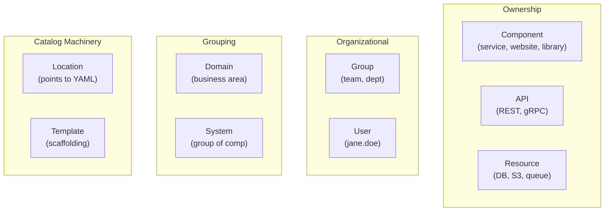
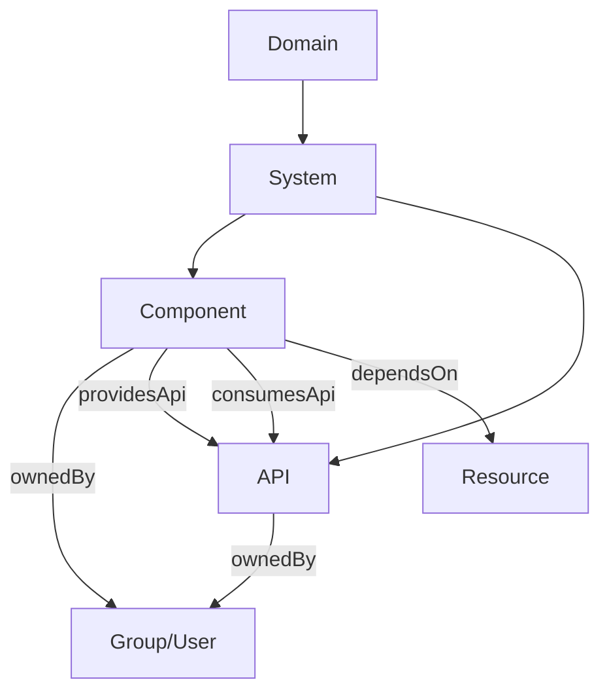
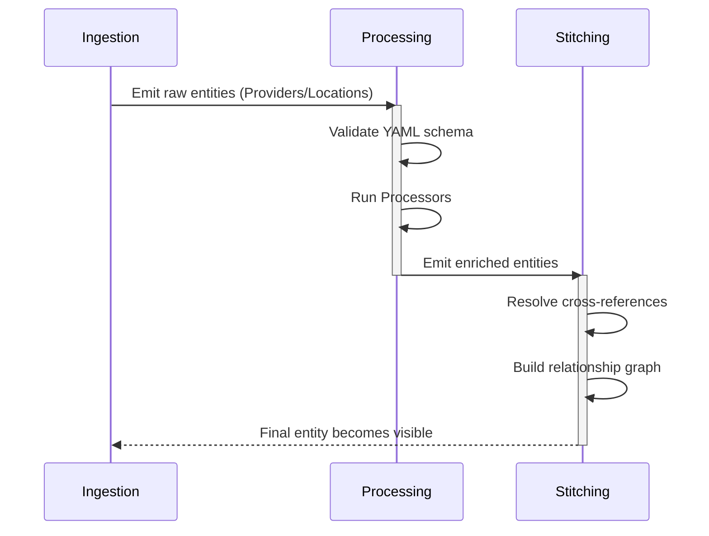
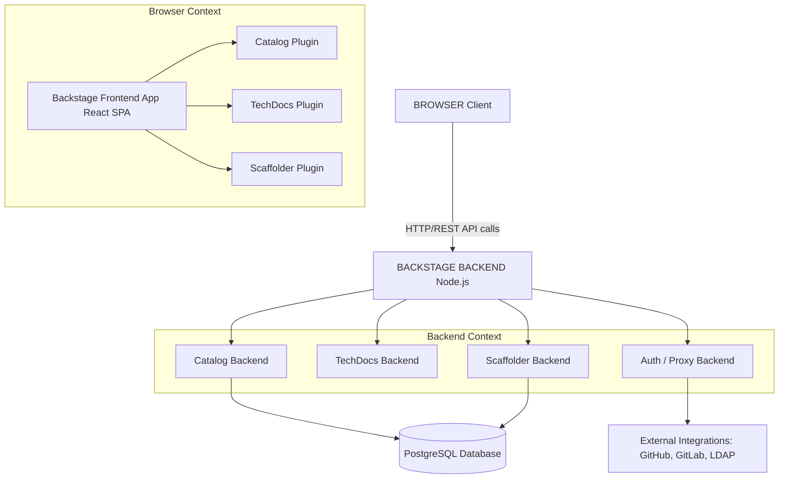
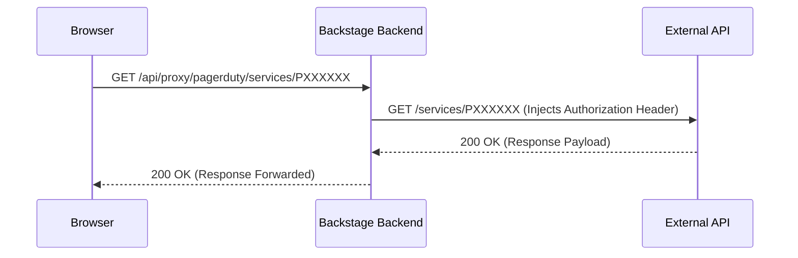
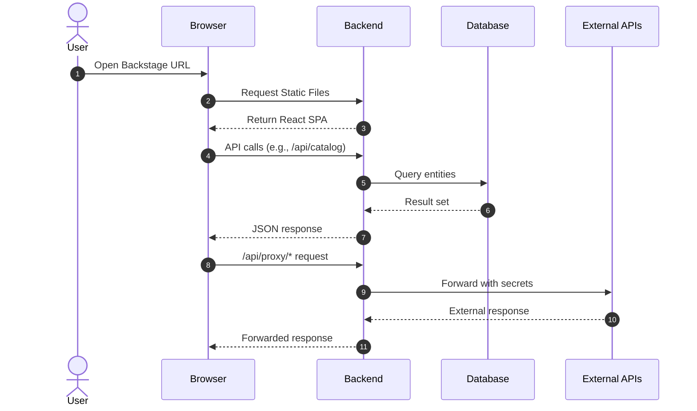

> **Complexity**: `[COMPLEX]` - Covers two exam domains (44% of CBA combined)
>
> **Time to Complete**: 60-75 minutes
>
> **Prerequisites**: Module 1 (Backstage Overview), Module 2 (Plugins & Extensibility)

---

## What You'll Be Able to Do

After completing this module, you will be able to:

1. **Implement** catalog entities (Components, APIs, Systems, Domains) with proper metadata, relationships, and lifecycle annotations.
2. **Configure** entity providers and processors that auto-discover services from GitHub, Kubernetes, or LDAP into the catalog.
3. **Deploy** Backstage to Kubernetes with PostgreSQL persistence, Ingress, and environment-specific configuration, ensuring compatibility with Kubernetes version 1.35 and above.
4. **Design** a catalog taxonomy that models your organization's ownership, dependencies, and API contracts.
5. **Diagnose** catalog ingestion errors, including orphaned entities and synchronization failures.

---

## Why This Module Matters

The software catalog is the beating heart of Backstage. Without it, Backstage is just a plugin framework with a pretty UI. With it, you have a single pane of glass over every service, API, team, and piece of infrastructure your organization owns. The Certified Backstage Associate (CBA) exam is a 90-minute, proctored, multiple-choice exam costing $250 with one free retake, offered by the Linux Foundation / CNCF. This exam dedicates **22% to the catalog** (Domain 3) and another **22% to infrastructure** (Domain 2)—together, that is 44% of your score. 

Consider a real-world incident at a major European airline in early 2024. During a critical database migration, an undocumented legacy API dependency caused a cascading failure across their ticketing systems. Because their service directory was a scattered collection of wiki pages, incident responders spent 45 agonizing minutes just figuring out which team owned the failing API. The outage cost the airline an estimated $2.4 million in lost bookings and SLA penalties. If they had a fully populated Backstage catalog with accurate ownership and dependency tracking, the root cause and the responsible on-call engineers could have been identified in seconds.

Get these two domains right and you are nearly halfway to passing before you even touch plugins or TechDocs.

> **The Library Analogy**
>
> Think of the Backstage catalog as a library's card catalog system. Every book (Component) has a card describing it—author, genre, location. Some books reference other books (API relationships). The librarian (entity processor) receives new books, catalogs them, and shelves them. The building itself—shelves, lighting, HVAC—is the infrastructure. You need both: a great catalog system is useless if the building has no electricity, and a beautiful building with empty shelves helps nobody.

---

## Did You Know?

1. Backstage was open sourced by Spotify on March 16, 2020. It later entered the CNCF Sandbox on September 8, 2020, and was promoted to CNCF Incubating maturity level on March 15, 2022. As of April 2026, Backstage remains at CNCF Incubating level and has not yet graduated.
2. Adoption figures vary across sources; some marketing content suggests Backstage has been adopted by more than 3,000 companies / 3,400 organizations and used by over 2 million developers, though a single authoritative primary source with a verifiable methodology and date was not retrieved. Similarly, some secondary blog summaries claim Backstage captures 89% of the Internal Developer Portal (IDP) market compared to SaaS competitors, but this could not be traced to an authoritative primary source.
3. **The Backstage proxy** (`/api/proxy`) lets the frontend call external APIs without exposing credentials to the browser—a pattern so useful that many teams use Backstage as their universal API gateway during development.
4. **You can run Backstage without a single plugin installed.** The catalog alone provides enough value that some organizations deploy it purely as a service directory with ownership tracking.

---

## Topic One: The Software Catalog Entity Kinds

Everything in the Backstage catalog is an **entity**. Each entity has a specific `kind`, an `apiVersion`, `metadata`, and a `spec`. 

The eight core built-in entity kinds in the Backstage Software Catalog are: Component, API, Resource, System, Domain, User, Group, and Location. Additionally, Backstage Software Templates (Scaffolder) use a Template entity kind and are defined in YAML stored in a Git repository. 

```text
┌─────────────────────────────────────────────────────────────────┐
│                    BACKSTAGE ENTITY KINDS                        │
├─────────────────────────────────────────────────────────────────┤
│                                                                  │
│  OWNERSHIP          ORGANIZATIONAL        CATALOG MACHINERY      │
│  ┌───────────┐      ┌──────────┐          ┌──────────┐          │
│  │ Component │      │  Group   │          │ Location │          │
│  │ (service, │      │  (team,  │          │ (points  │          │
│  │  library) │      │  dept)   │          │  to YAML)│          │
│  └───────────┘      └──────────┘          └──────────┘          │
│  ┌───────────┐      ┌──────────┐          ┌──────────┐          │
│  │    API    │      │   User   │          │ Template │          │
│  │ (REST,   │      │  (person)│          │ (scaffol-│          │
│  │  gRPC)   │      └──────────┘          │  ding)   │          │
│  └───────────┘                            └──────────┘          │
│  ┌───────────┐      GROUPING                                    │
│  │ Resource  │      ┌──────────┐                                │
│  │ (DB, S3, │      │  System  │                                │
│  │  queue)  │      │  (group  │                                │
│  └───────────┘      │  of comp)│                                │
│                     └──────────┘                                │
│                     ┌──────────┐                                │
│                     │  Domain  │                                │
│                     │ (business│                                │
│                     │  area)   │                                │
│                     └──────────┘                                │
└─────────────────────────────────────────────────────────────────┘
```

When mapped to a dynamic flowchart for modern rendering, the architectural breakdown of entity kinds looks like this:



A Resource entity describes infrastructure a Component needs to operate at runtime (e.g., databases, storage buckets, CDNs). Understanding the relationships between these elements is critical for mapping out a comprehensive architecture.

| Kind | Purpose | Example |
|------|---------|---------|
| **Component** | A piece of software (service, website, library) | `payments-service`, `react-ui-library` |
| **API** | A boundary between components (REST, gRPC, GraphQL, AsyncAPI) | `payments-api` (OpenAPI spec) |
| **Resource** | Physical or virtual infrastructure a component depends on | `orders-db` (PostgreSQL), `events-queue` (Kafka topic) |
| **System** | A collection of components and APIs that form a product | `payments-system` (groups payments service + API + DB) |
| **Domain** | A business area grouping related systems | `finance` (groups payments, billing, invoicing systems) |
| **Group** | A team or organizational unit | `platform-team`, `backend-guild` |
| **User** | An individual person | `jane.doe` |
| **Location** | A pointer to other entity definition files | A URL referencing a `catalog-info.yaml` in a repo |
| **Template** | A software template for scaffolding new projects | `springboot-service-template` |

**Key relationships between entity kinds:**

```text
Domain
  └── System
        ├── Component ──ownedBy──► Group/User
        │     ├── providesApi ──► API
        │     ├── consumesApi ──► API
        │     └── dependsOn ──► Resource
        └── API ──ownedBy──► Group/User
```

Here is the structured sequence represented in a modern relational graph:



> **Stop and think**: If a team builds an internal Kafka cluster that three different microservices publish messages to, should the Kafka cluster be modeled as a Component, a System, or a Resource?

---

## Topic Two: The Descriptor File

Every entity is described by a YAML descriptor. The recommended filename for a Backstage catalog descriptor file is `catalog-info.yaml` and it typically lives at the root of a repository.

```yaml
# catalog-info.yaml
apiVersion: backstage.io/v1alpha1
kind: Component
metadata:
  name: payments-service
  description: Handles all payment processing
  annotations:
    github.com/project-slug: myorg/payments-service
    backstage.io/techdocs-ref: dir:.
  tags:
    - java
    - payments
  links:
    - url: https://payments.internal.myorg.com
      title: Production
      icon: dashboard
spec:
  type: service
  lifecycle: production
  owner: team-payments
  system: payments-system
  providesApis:
    - payments-api
  dependsOn:
    - resource:payments-db
```

**Required fields for every entity:**
- `apiVersion` — always `backstage.io/v1alpha1` for built-in kinds. The current catalog entity descriptor `apiVersion` is `backstage.io/v1alpha1`; the schema has not been promoted to a stable (non-alpha) version.
- `kind` — one of the nine kinds above.
- `metadata.name` — unique within its kind+namespace; lowercase, hyphens, max 63 chars.
- `spec` — varies by kind. 

The well-known `spec.lifecycle` values for Component and API entities are: `experimental`, `production`, and `deprecated`. The well-known `spec.type` values for a Component entity include `service`, `website`, and `library`.

Entity references in Backstage use the format `[kind]:[namespace]/[name]`, where kind and namespace are optional depending on context.

### Annotations and Entity Discovery

Annotations are the glue between catalog entities and Backstage plugins. They tell plugins where to find data about a component. This is a critical exam topic. Plugins read annotations to find the data they need.

| Annotation | What It Does |
|------------|-------------|
| `github.com/project-slug` | Links entity to a GitHub repo (`org/repo`) |
| `backstage.io/techdocs-ref` | Tells TechDocs where to find docs (`dir:.` = same repo) |
| `backstage.io/source-location` | Source code URL for the entity |
| `jenkins.io/job-full-name` | Links to a Jenkins job |
| `pagerduty.com/service-id` | Links to PagerDuty for on-call info |
| `backstage.io/managed-by-location` | Which Location entity registered this entity |
| `backstage.io/managed-by-origin-location` | Original Location that first introduced the entity |

---

## Topic Three: Ingestion, Providers, and Processors

Backstage catalog entity ingestion relies on two mechanisms: Entity Providers (read raw definitions from sources) and Processors (analyze/transform entity data). 

### Manual Registration: Location Entities
The simplest way to get entities into the catalog is manual registration using Location entities. You can register via the UI, or statically in your configuration file.

```yaml
# app-config.yaml
catalog:
  locations:
    - type: url
      target: https://github.com/myorg/payments-service/blob/main/catalog-info.yaml
      rules:
        - allow: [Component, API]

    - type: file
      target: ../../examples/all-components.yaml
      rules:
        - allow: [Component, System, Domain]
```

**Location entity YAML** (can also be its own file):

```yaml
apiVersion: backstage.io/v1alpha1
kind: Location
metadata:
  name: myorg-payments
  description: Payments team components
spec:
  type: url
  targets:
    - https://github.com/myorg/payments-service/blob/main/catalog-info.yaml
    - https://github.com/myorg/payments-api/blob/main/catalog-info.yaml
```

### Automated Ingestion
Manual registration does not scale. For organizations with hundreds or thousands of repos, Backstage supports **discovery providers** that automatically find and register entities. Backstage ships built-in discovery integrations for GitHub, GitLab, and Bitbucket Server.

**GitHub Discovery:**

```yaml
# app-config.yaml
catalog:
  providers:
    githubDiscovery:
      myOrgProvider:
        organization: 'myorg'
        catalogPath: '/catalog-info.yaml'   # where to look in each repo
        schedule:
          frequency: { minutes: 30 }
          timeout: { minutes: 3 }
```

This scans every repo in the `myorg` GitHub organization, checks if `/catalog-info.yaml` exists, and automatically registers any entities found.

**GitLab Discovery:**

```yaml
catalog:
  providers:
    gitlab:
      myGitLab:
        host: gitlab.mycompany.com
        branch: main
        fallbackBranch: master
        catalogFile: catalog-info.yaml
        group: 'mygroup'                    # optional: limit to a group
        schedule:
          frequency: { minutes: 30 }
          timeout: { minutes: 3 }
```

**GitHub Org Data Provider** (for users and teams):

```yaml
catalog:
  providers:
    githubOrg:
      myOrgProvider:
        id: production
        orgUrl: https://github.com/myorg
        schedule:
          frequency: { hours: 1 }
          timeout: { minutes: 10 }
```

This imports GitHub teams as `Group` entities and GitHub org members as `User` entities automatically—no need to maintain user YAML files by hand.

### Entity Processors and Custom Providers

The catalog has a processing pipeline that runs continuously:

```text
┌──────────────┐     ┌─────────────────┐     ┌──────────────────┐
│   Ingestion  │────►│   Processing    │────►│   Stitching      │
│              │     │                 │     │                  │
│ - Locations  │     │ - Validate YAML │     │ - Resolve refs   │
│ - Discovery  │     │ - Run processors│     │ - Build relation │
│ - Providers  │     │ - Emit entities │     │   graph          │
│              │     │ - Emit errors   │     │ - Final entity   │
└──────────────┘     └─────────────────┘     └──────────────────┘
       │                     │                        │
       ▼                     ▼                        ▼
  Entity enters        Entity validated          Entity visible
  the pipeline         and enriched              in the catalog
```

Converted to a dynamic processing pipeline sequence:



**Custom entity providers** let you ingest entities from any source. They implement the `EntityProvider` interface:

```typescript
import { EntityProvider, EntityProviderConnection } from '@backstage/plugin-catalog-node';

class MyCustomProvider implements EntityProvider {
  getProviderName(): string {
    return 'my-custom-provider';
  }

  async connect(connection: EntityProviderConnection): Promise<void> {
    // Fetch entities from your custom source
    const entities = await fetchFromMySource();

    await connection.applyMutation({
      type: 'full',
      entities: entities.map(entity => ({
        entity,
        locationKey: 'my-custom-provider',
      })),
    });
  }
}
```

---

## Topic Four: Troubleshooting the Catalog

When entities fail to synchronize or display correctly, rely on this structured debugging matrix:

| Symptom | Likely Cause | Fix |
|---------|-------------|-----|
| Entity never shows up | Invalid YAML or schema violation | Check the catalog import page for errors |
| Entity appears then disappears | `rules` in app-config block the entity kind | Add the kind to `rules: allow` |
| Stale data after repo update | Refresh cycle has not run yet | Manually refresh via catalog API or wait ~100-200s |
| Entity shows as orphaned | The Location that registered it was deleted | Re-register or remove the orphan |
| Relationships broken | Referenced entity name does not match | Check exact `name` fields; they are case-sensitive |

**Orphaned entities** occur when the Location that originally registered an entity is removed, but the entity itself remains. Backstage marks these as orphans. You can clean them up in the catalog UI or via the API:

```bash
# List orphaned entities via the Backstage catalog API
curl http://localhost:7007/api/catalog/entities?filter=metadata.annotations.backstage.io/orphan=true

# Delete a specific orphaned entity
curl -X DELETE http://localhost:7007/api/catalog/entities/by-uid/<entity-uid>
```

**Forcing a refresh:**

```bash
# Refresh a specific entity
curl -X POST http://localhost:7007/api/catalog/refresh \
  -H 'Content-Type: application/json' \
  -d '{"entityRef": "component:default/payments-service"}'
```

> **Pause and predict**: If your discovery provider finds a repository containing a `catalog-info.yaml`, but the `app-config.yaml` restricts the provider to only `allow: [Component]`, what happens if the file contains a `kind: System`?

---

## Topic Five: Framework Architecture

Backstage is a Node.js application with a clear client-server split. In version 1.49.0, newly created Backstage apps use the New Frontend System by default; the `--legacy` flag is used for apps that want the old system. version 1.49.0 also marked the release candidate for version 1.0 of the New Frontend System. As of early 2026, version 1.49.0 was confirmed as the most recent version, though releases happen frequently.

```text
┌─────────────────────────────────────────────────────────────────┐
│                        BROWSER (Client)                          │
│  ┌───────────────────────────────────────────────────────────┐  │
│  │              Backstage Frontend App (React SPA)            │  │
│  │  ┌──────────┐ ┌──────────┐ ┌──────────┐ ┌─────────────┐  │  │
│  │  │ Catalog  │ │ TechDocs │ │ Scaffolder│ │ Search      │  │  │
│  │  │ Plugin   │ │ Plugin   │ │ Plugin   │ │ Plugin      │  │  │
│  │  │ (front)  │ │ (front)  │ │ (front)  │ │ (front)     │  │  │
│  │  └──────────┘ └──────────┘ └──────────┘ └─────────────┘  │  │
│  └───────────────────────────────────────────────────────────┘  │
└──────────────────────────────┬──────────────────────────────────┘
                               │ HTTP/REST API calls
                               ▼
┌─────────────────────────────────────────────────────────────────┐
│                    BACKSTAGE BACKEND (Node.js)                   │
│  ┌──────────┐ ┌──────────┐ ┌──────────┐ ┌───────────────────┐  │
│  │ Catalog  │ │ TechDocs │ │ Scaffolder│ │ Auth / Proxy /    │  │
│  │ Backend  │ │ Backend  │ │ Backend  │ │ Search Backend    │  │
│  └─────┬────┘ └──────────┘ └──────────┘ └───────────────────┘  │
│        │                                                        │
│        ▼                                                        │
│  ┌──────────┐    ┌──────────────────────────────────────────┐   │
│  │ Database │    │         Integrations                      │   │
│  │(Postgres)│    │  GitHub, GitLab, Azure DevOps, LDAP ...  │   │
│  └──────────┘    └──────────────────────────────────────────┘   │
└─────────────────────────────────────────────────────────────────┘
```



### Key Technical Characteristics

1. **Databases**: Backstage supports PostgreSQL (recommended for production) and SQLite (used for development/testing) as catalog backend databases. 
2. **Kubernetes Integration**: The Backstage Kubernetes feature consists of two packages: `@backstage/plugin-kubernetes` (frontend) and `@backstage/plugin-kubernetes-backend`.
3. **Documentation**: TechDocs uses MkDocs under the hood to convert Markdown files into a static HTML documentation site. TechDocs recommends generating docs on CI/CD and storing output to an external storage provider (e.g., AWS S3 or Google Cloud Storage) rather than generating on the Backstage server.
4. **API Endpoints**: The Backstage Catalog REST API exposes a `GET /entities/by-query` endpoint with cursor-based pagination, superseding the older paginated `GET /entities` endpoint.

### Configuration

The `app-config.yaml` file is the central configuration for a Backstage instance. 

```yaml
# app-config.yaml — Top-level structure
app:
  title: My Company Backstage
  baseUrl: http://localhost:3000          # Frontend URL

backend:
  baseUrl: http://localhost:7007          # Backend URL
  listen:
    port: 7007
  database:
    client: better-sqlite3                # dev default
    connection: ':memory:'
  cors:
    origin: http://localhost:3000

organization:
  name: MyOrg

integrations:
  github:
    - host: github.com
      token: ${GITHUB_TOKEN}              # environment variable substitution

auth:
  providers:
    github:
      development:
        clientId: ${AUTH_GITHUB_CLIENT_ID}
        clientSecret: ${AUTH_GITHUB_CLIENT_SECRET}

proxy:
  endpoints:
    '/pagerduty':
      target: https://api.pagerduty.com
      headers:
        Authorization: Token token=${PAGERDUTY_TOKEN}

catalog:
  locations: []
  providers: {}
  rules:
    - allow: [Component, System, API, Resource, Location, Domain, Group, User, Template]
```

**Configuration layering (config includes):**

```bash
# You can pass multiple config files — later files override earlier ones
node packages/backend --config app-config.yaml --config app-config.production.yaml
```

A common pattern is having a base `app-config.yaml`, followed by an `app-config.production.yaml` for production overrides, and a localized `app-config.local.yaml` for private developer settings that is intentionally ignored by source control.

### The Backstage Proxy

The proxy plugin lets the backend forward requests to external APIs on behalf of the frontend, keeping API credentials safely on the server side.

```yaml
# app-config.yaml
proxy:
  endpoints:
    '/pagerduty':
      target: https://api.pagerduty.com
      headers:
        Authorization: Token token=${PAGERDUTY_TOKEN}
    '/grafana':
      target: https://grafana.internal.myorg.com
      headers:
        Authorization: Bearer ${GRAFANA_TOKEN}
      allowedHeaders: ['Content-Type']
```

```text
Browser                    Backstage Backend              External API
  │                              │                             │
  │  GET /api/proxy/pagerduty/   │                             │
  │  services/PXXXXXX            │                             │
  │─────────────────────────────►│                             │
  │                              │  GET /services/PXXXXXX      │
  │                              │  Authorization: Token ...   │
  │                              │────────────────────────────►│
  │                              │                             │
  │                              │◄────────────────────────────│
  │◄─────────────────────────────│   (response forwarded)      │
  │                              │                             │
```



### Production Deployment

Moving to production requires robust persistence:

```yaml
# app-config.production.yaml
backend:
  database:
    client: pg
    connection:
      host: ${POSTGRES_HOST}
      port: ${POSTGRES_PORT}
      user: ${POSTGRES_USER}
      password: ${POSTGRES_PASSWORD}
```

```yaml
app:
  baseUrl: https://backstage.mycompany.com

backend:
  baseUrl: https://backstage.mycompany.com
  cors:
    origin: https://backstage.mycompany.com
```

Authentication is strictly enforced for real-world setups to prevent unauthorized access:

```yaml
auth:
  environment: production
  providers:
    github:
      production:
        clientId: ${AUTH_GITHUB_CLIENT_ID}
        clientSecret: ${AUTH_GITHUB_CLIENT_SECRET}
```

**Client-Server Request Flow:**

```text
1. User opens browser → loads React SPA from backend (static files)
2. SPA boots → calls backend APIs: /api/catalog, /api/techdocs, etc.
3. Backend plugins handle API calls → query database, call integrations
4. Backend returns JSON → SPA renders UI
5. For external data → SPA calls /api/proxy/* → backend forwards to external APIs
```



---

## War Story: The Case of the 10,000 Orphaned Entities

A platform team at a mid-size fintech company set up GitHub discovery to auto-register every repo in their organization. Within a week, the catalog had 10,000 entities—but morale was not what they expected. Developers were complaining that search was useless. The catalog was full of archived repos, forks, test projects, and abandoned experiments.

Worse, when they tried to clean up by deleting the discovery provider config, the entities did not disappear. They became orphaned entities—still visible in the catalog but no longer refreshed. The team spent two days writing scripts to bulk-delete orphans via the catalog API.

**Lessons learned:**
1. Always scope discovery providers with filters (topic tags, path patterns, team ownership).
2. Understand the orphan lifecycle before removing discovery providers.
3. Start with manual registration for your most important services, then gradually expand automated discovery.
4. Use `catalog.rules` to restrict which entity kinds can be registered from which sources.

---

## Common Mistakes

| Mistake | Why It Happens | What To Do Instead |
|---------|---------------|-------------------|
| Using SQLite in production | It is the default and "works" in dev | Always configure PostgreSQL for production |
| Not scoping discovery providers | GitHub discovery imports *every* repo | Use topic filters, path patterns, or allowlists |
| Expecting instant catalog updates | Developers register YAML and refresh the page immediately | Explain the ~100-200s refresh cycle; use manual refresh API for urgent updates |
| Hardcoding secrets in app-config.yaml | Copy-pasting tokens during setup | Use `${ENV_VAR}` substitution; never commit secrets |
| Forgetting `rules: allow` for entity kinds | Register a Template but it never appears | Each Location source needs explicit `rules` for allowed kinds |
| Running TLS termination in Node.js | Seems simpler than a reverse proxy | Use an ingress controller or load balancer for TLS; Node.js TLS is not needed |
| Not configuring auth for production | Dev mode works without it | Every production instance must have authentication enabled |
| Ignoring orphaned entities | They accumulate silently | Monitor orphan count; establish a cleanup process |

---

## Quiz

Test your understanding of Backstage catalog and infrastructure to ensure you are ready for the examination concepts.

**Q1: Scenario: You are designing a new microservices architecture and need to formally document the REST endpoints that allow your frontend to communicate with your backend. Which entity kind represents a boundary between components?**

<details>
<summary>Answer</summary>

**API**. The API kind represents a contract/boundary between components. A Component `providesApi` and another Component `consumesApi`. API entities can describe REST (OpenAPI), gRPC (protobuf), GraphQL, or AsyncAPI interfaces.

</details>

**Q2: Scenario: A developer pushes a change to their repository's descriptor file but complains that the Backstage UI hasn't updated yet. What is the default refresh interval for catalog entity processing?**

<details>
<summary>Answer</summary>

Approximately **100-200 seconds**. The catalog processing loop continuously cycles through entities, but there is no guarantee of instant updates. You can trigger a manual refresh via `POST /api/catalog/refresh` with the `entityRef`.

</details>

**Q3: Scenario: Your Backstage instance needs to authenticate with an external third-party API using a sensitive token. How do you inject secrets into the configuration file safely?**

<details>
<summary>Answer</summary>

Use **environment variable substitution** with `${VARIABLE_NAME}` syntax. For example: `token: ${GITHUB_TOKEN}`. Backstage resolves these at startup from the process environment. Never hardcode secrets in config files.

</details>

**Q4: What is the primary purpose of the proxy plugin in Backstage?**

<details>
<summary>Answer</summary>

The proxy plugin (`/api/proxy`) forwards requests from the frontend through the backend to external APIs. This solves CORS issues and keeps API credentials server-side. The browser never sees the external service tokens—only the backend injects them before forwarding.

</details>

**Q5: Name two ways entities can be registered in the catalog.**

<details>
<summary>Answer</summary>

1. **Manual registration** — via the UI ("Register Existing Component" button) or by adding static Location entries in `app-config.yaml` under `catalog.locations`.
2. **Automated discovery** — using providers like `githubDiscovery`, `gitlab`, or `githubOrg` configured under `catalog.providers` in `app-config.yaml`.

Other valid answers include: custom entity providers (programmatic) or direct API calls.

</details>

**Q6: Scenario: Your team is deploying Backstage for 500 developers in a high-availability cluster. What database should be used for this production Backstage deployment?**

<details>
<summary>Answer</summary>

**PostgreSQL**. SQLite (or better-sqlite3) is only suitable for local development. PostgreSQL supports concurrent connections, is durable, and handles the catalog processing workload in production. Configure it via `backend.database.client: pg` in `app-config.production.yaml`.

</details>

**Q7: Scenario: A repository was completely deleted from your organization's version control system, removing the Location entity that previously mapped to it. What happens to the related entities when their source Location is deleted?**

<details>
<summary>Answer</summary>

They become **orphaned entities**. They remain in the catalog but are no longer refreshed from their source. Orphans are flagged with the annotation `backstage.io/orphan: 'true'`. They should be cleaned up either through the UI or via the catalog API (`DELETE /api/catalog/entities/by-uid/<uid>`).

</details>

**Q8: Scenario: You need distinct configuration values for local development and your staging deployment. How does configuration layering work in Backstage?**

<details>
<summary>Answer</summary>

You pass multiple `--config` flags when starting the backend: `node packages/backend --config app-config.yaml --config app-config.production.yaml`. Later files override values from earlier files (deep merge). Common pattern: base config, production overrides, and a gitignored local config for personal development settings.

</details>

**Q9: Which annotation links a Backstage entity directly to its GitHub repository?**

<details>
<summary>Answer</summary>

`github.com/project-slug` with the value `org/repo-name`. For example: `github.com/project-slug: myorg/payments-service`. This annotation is read by GitHub-related plugins to display pull requests, CI status, code owners, and other repo-level information.

</details>

**Q10: Scenario: In a production Kubernetes deployment running on version 1.35, you have scaled the Backstage backend to three replicas. Why should catalog processing strictly run on a single replica?**

<details>
<summary>Answer</summary>

To avoid **duplicate processing work** and potential conflicts. If multiple replicas all run the processing loop simultaneously, they may redundantly fetch the same sources, create duplicate refresh cycles, and potentially conflict on database writes. The `@backstage/plugin-catalog-backend` supports leader election to ensure only one replica performs catalog processing while others handle API requests.

</details>

---

## Hands-On Exercise: Build a Multi-Entity Catalog

**Objective:** Create a complete catalog structure with multiple entity kinds, register them, and verify the relationships.

**What you'll need:** A running Backstage instance.

### Step 1: Create the Entity Descriptors

Create a file called `catalog-entities.yaml` in your Backstage project root. We utilize a single file encompassing multiple entities using the document separator pattern.

```text title="catalog-entities.yaml"
---
apiVersion: backstage.io/v1alpha1
kind: Domain
metadata:
  name: commerce
  description: All commerce-related systems
spec:
  owner: group:platform-team

---
apiVersion: backstage.io/v1alpha1
kind: System
metadata:
  name: orders-system
  description: Handles order lifecycle
spec:
  owner: group:backend-team
  domain: commerce

---
apiVersion: backstage.io/v1alpha1
kind: Component
metadata:
  name: orders-service
  description: REST API for order management
  annotations:
    backstage.io/techdocs-ref: dir:.
  tags:
    - java
    - springboot
spec:
  type: service
  lifecycle: production
  owner: group:backend-team
  system: orders-system
  providesApis:
    - orders-api
  dependsOn:
    - resource:orders-db

---
apiVersion: backstage.io/v1alpha1
kind: API
metadata:
  name: orders-api
  description: Orders REST API
spec:
  type: openapi
  lifecycle: production
  owner: group:backend-team
  system: orders-system
  definition: |
    openapi: "3.0.0"
    info:
      title: Orders API
      version: 1.0.0
    paths:
      /orders:
        get:
          summary: List orders
          responses:
            '200':
              description: OK

---
apiVersion: backstage.io/v1alpha1
kind: Resource
metadata:
  name: orders-db
  description: PostgreSQL database for orders
spec:
  type: database
  owner: group:backend-team
  system: orders-system

---
apiVersion: backstage.io/v1alpha1
kind: Group
metadata:
  name: backend-team
  description: Backend engineering team
spec:
  type: team
  children: []

---
apiVersion: backstage.io/v1alpha1
kind: Group
metadata:
  name: platform-team
  description: Platform engineering team
spec:
  type: team
  children: []
```

### Step 2: Register via Configuration

Add the necessary location pointer to your `app-config.yaml` file:

```yaml
catalog:
  rules:
    - allow: [Component, System, API, Resource, Location, Domain, Group, User, Template]
  locations:
    - type: file
      target: ./catalog-entities.yaml
      rules:
        - allow: [Domain, System, Component, API, Resource, Group]
```

### Step 3: Start Backstage and Verify

```bash
# Start Backstage in development mode
yarn dev
```

Open `` `http://localhost:3000` `` and meticulously verify the hierarchical associations:

1. Navigate to the **Catalog** — you should see `orders-service` listed as a Component
2. Click on `orders-service` — verify the **System** is `orders-system`
3. Check the **API** tab — `orders-api` should appear under "Provided APIs"
4. Check the **Dependencies** tab — `orders-db` should appear
5. Navigate to `orders-system` — verify it groups the component, API, and resource
6. Navigate to the `commerce` Domain — verify it contains `orders-system`

### Step 4: Test the Proxy (Optional)

Add an external proxy endpoint mapping to your configuration file:

```yaml
proxy:
  endpoints:
    '/jsonplaceholder':
      target: https://jsonplaceholder.typicode.com
```

Restart the backend node process and execute the following network validation:

```bash
# This request goes through the Backstage proxy
curl http://localhost:7007/api/proxy/jsonplaceholder/todos/1
```

You should receive a structured JSON payload response, properly forwarded through the internal routing mechanism without directly exposing the target URI to the frontend interface.

### Success Criteria

- [ ] All seven entities appear in the catalog without throwing parsing errors.
- [ ] `orders-service` displays the correct owner (`backend-team`), its parent system, corresponding API, and upstream dependency.
- [ ] The Domain > System > Component architectural hierarchy correctly renders visually in the graphical interface.
- [ ] You fully understand the background refresh cycle (observing the deliberate delay before state reconciliations sync).
- [ ] The Proxy endpoint validation step returns verifiable data from the designated external API service context.

---

## Key Takeaways

| Topic | Remember This |
|-------|--------------|
| Entity kinds | 9 built-in: Component, API, Resource, System, Domain, Group, User, Location, Template |
| catalog-info.yaml | Lives in repo root; `apiVersion`, `kind`, `metadata`, `spec` are required |
| Annotations | Connect entities to plugins; key discovery mechanism |
| Registration | Manual (UI or static locations) vs. automated (discovery providers) |
| Processing | Continuous loop with ~100-200s cycle; ingestion → processing → stitching |
| Architecture | React SPA frontend + Node.js backend + PostgreSQL database |
| app-config.yaml | Layered config; `${ENV_VAR}` for secrets; `--config` flag for overrides |
| Proxy | `/api/proxy/*` forwards frontend requests through backend to external APIs |
| Production | PostgreSQL, HTTPS (via ingress), authentication required, single processing replica |

---

## Next Module

**[CBA Track Overview]()** — Domain 4: Templates, documentation-as-code, and the golden path for new services.