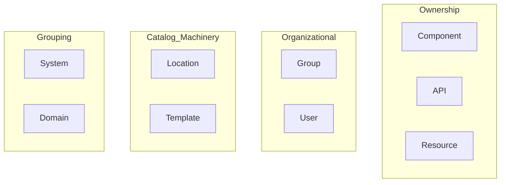
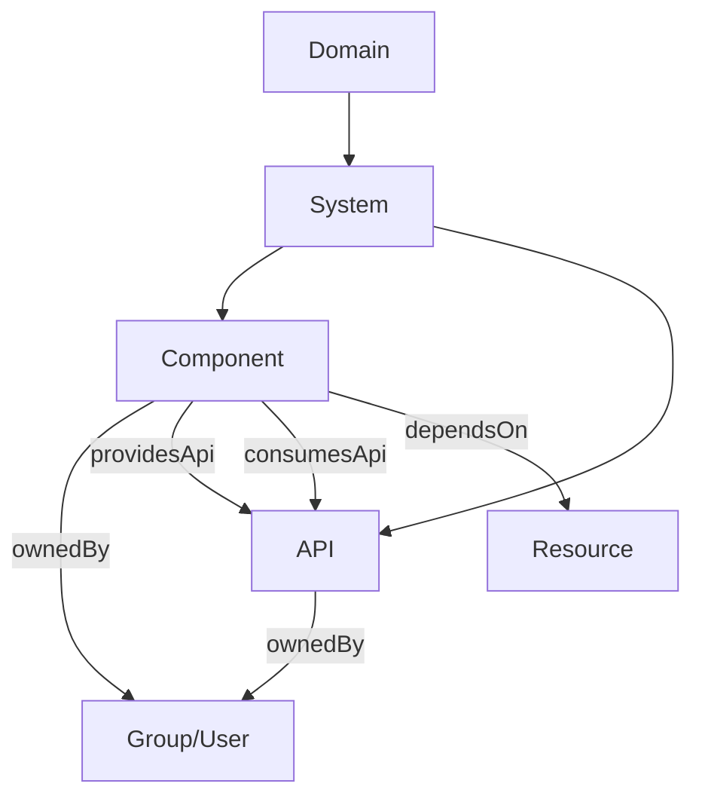
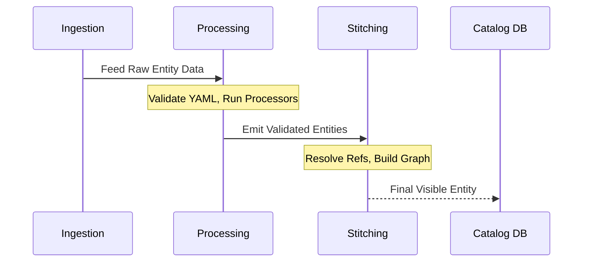
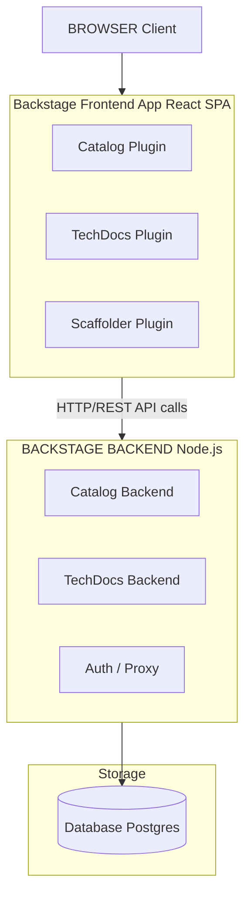

> **Complexity**: `[COMPLEX]` - Covers two exam domains (44% of CBA combined)
>
> **Time to Complete**: 60-75 minutes
>
> **Prerequisites**: Module 1 (Backstage Overview), Module 2 (Plugins & Extensibility)

## What You'll Be Able to Do

After completing this module, you will be able to:

1. **Design** a comprehensive catalog taxonomy that models your organization's ownership, dependencies, and complex API contracts accurately.
2. **Implement** automated discovery providers and custom entity processors to seamlessly ingest services from external sources into the catalog.
3. **Diagnose** catalog ingestion failures, orphan entity accumulations, and relationship mismatches using the Backstage REST API and cursor-based pagination.
4. **Evaluate** the architectural differences between development SQLite setups and production PostgreSQL deployments, ensuring optimal database scaling.
5. **Debug** configuration layering issues within `app-config.yaml` to ensure secrets and environmental overrides behave as expected during runtime.

## Why This Module Matters

At Spotify, before the open-sourcing of Backstage, engineers faced a massive crisis of cognitive fragmentation. During a major peak traffic event, a critical payment routing service went down. The incident response team mobilized instantly, but they spent the first 45 minutes merely trying to diagnose who owned the service, where the deployment manifests were located, and what the upstream infrastructure dependencies were. Millions of dollars in transactions were delayed. This was not a failure of code; it was a catastrophic failure of context.

The software catalog is the beating heart of Backstage. Without it, Backstage is just a plugin framework with a pretty UI. With it, you have a single pane of glass over every service, API, team, and piece of infrastructure your organization owns. It bridges the gap between raw infrastructure and human accountability, turning tribal knowledge into an explicit graph of relationships. 

The Certified Backstage Associate (CBA) exam dedicates **22% to the catalog** (Domain 3) and another **22% to infrastructure** (Domain 2)—together, that is 44% of your total score. Mastering these concepts is not just about passing an exam; it is about learning how to cure the fundamental organizational chaos that plagues modern microservice architectures. Get these two domains right, and you are nearly halfway to passing before you even touch external plugins or documentation frameworks.

## What You'll Learn

By the end of this comprehensive module, you will deeply understand:
- The fundamental origins, CNCF status, and rapid market adoption of the Backstage framework.
- All eight core entity kinds and the supplementary Template kind, and exactly when to use each one.
- How entities are ingested into the catalog pipeline via manual configuration and automated discovery mechanisms.
- How to strictly structure and validate `catalog-info.yaml` descriptor files using the correct `apiVersion`.
- The Backstage client-server architecture: the React SPA frontend, the Node.js Express backend, the database layer, and the proxy system.
- Production deployment considerations, focusing on migrating from local configurations to resilient setups.
- Deep dives into core capabilities like the Kubernetes plugin and TechDocs generation pipelines.

## Did You Know?

1. Backstage was officially open sourced by Spotify on March 16, 2020, solving years of internal fragmentation.
2. Backstage was promoted from the CNCF Sandbox to the CNCF Incubating maturity level on March 15, 2022.
3. The New Frontend System became the default for newly created Backstage apps in v1.49.0, replacing the `--next` flag with a `--legacy` flag for older applications.
4. The Certified Backstage Associate (CBA) exam is a rigorous 90-minute, proctored, multiple-choice exam costing $250, which includes one free retake offered by the Linux Foundation.

---

## Part 1: The Origins, CNCF Status, and Market Impact

Understanding the lineage of Backstage provides crucial context for its architectural decisions. Backstage was open sourced by Spotify on March 16, 2020. The project quickly gained traction, entering the CNCF Sandbox on September 8, 2020. Recognizing its immense impact on developer productivity, the Cloud Native Computing Foundation promoted Backstage to the CNCF Incubating maturity level on March 15, 2022. 

As of April 2026, Backstage remains at the CNCF Incubating level and has not yet formally graduated, though it serves as the de facto standard for Internal Developer Portals (IDPs). Reports indicate Backstage adoption has grown significantly, with some marketing materials claiming over 3,000 organizations and 2 million developers utilizing it globally. While some blog summaries claim an 89% market share for Backstage in the IDP space, this lacks an authoritative primary source; nevertheless, its dominant footprint in the ecosystem is undeniable. Furthermore, as of early 2026, v1.49.0 is among the most recent major releases, introducing massive systemic upgrades like the New Frontend System.

---

## Part 2: The Software Catalog Entity Model (Domain 3)

The software catalog relies on a strictly typed, graph-based taxonomy. Everything in the Backstage catalog is represented as an entity. 

### Core Entity Kinds

There are eight core built-in entity kinds in the Backstage Software Catalog: Component, API, Resource, System, Domain, User, Group, and Location. Additionally, the `Template` kind is used heavily by the Scaffolder feature.

```text
[CODE-1] (from: 1.1 Entity Kinds)
┌─────────────────────────────────────────────────────────────────┐
│                    BACKSTAGE ENTITY KINDS                        │
├─────────────────────────────────────────────────────────────────┤
│                                                                  │
│  OWNERSHIP          ORGANIZATIONAL        CATALOG MACHINERY      │
│  ┌───────────┐      ┌──────────┐          ┌──────────┐          │
│  │ Component │      │  Group   │          │ Location │          │
│  │ (service, │      │  (team,  │          │ (points  │          │
│  │  library) │      │  dept)   │          │  to YAML)│          │
│  └───────────┘      └──────────┘          └──────────┘          │
│  ┌───────────┐      ┌──────────┐          ┌──────────┐          │
│  │    API    │      │   User   │          │ Template │          │
│  │ (REST,   │      │  (person)│          │ (scaffol-│          │
│  │  gRPC)   │      └──────────┘          │  ding)   │          │
│  └───────────┘                            └──────────┘          │
│  ┌───────────┐      GROUPING                                    │
│  │ Resource  │      ┌──────────┐                                │
│  │ (DB, S3, │      │  System  │                                │
│  │  queue)  │      │  (group  │                                │
│  └───────────┘      │  of comp)│                                │
│                     └──────────┘                                │
│                     ┌──────────┐                                │
│                     │  Domain  │                                │
│                     │ (business│                                │
│                     │  area)   │                                │
│                     └──────────┘                                │
└─────────────────────────────────────────────────────────────────┘
```

We can visualize this architecture natively using a Mermaid diagram:



Let us examine the purpose of each entity:

```text
[TABLE-1]
| Kind | Purpose | Example |
|------|---------|---------|
| **Component** | A piece of software (service, website, library) | `payments-service`, `react-ui-library` |
| **API** | A boundary between components (REST, gRPC, GraphQL, AsyncAPI) | `payments-api` (OpenAPI spec) |
| **Resource** | Physical or virtual infrastructure a component depends on | `orders-db` (PostgreSQL), `events-queue` (Kafka topic) |
| **System** | A collection of components and APIs that form a product | `payments-system` (groups payments service + API + DB) |
| **Domain** | A business area grouping related systems | `finance` (groups payments, billing, invoicing systems) |
| **Group** | A team or organizational unit | `platform-team`, `backend-guild` |
| **User** | An individual person | `jane.doe` |
| **Location** | A pointer to other entity definition files | A URL referencing a `catalog-info.yaml` in a repo |
| **Template** | A software template for scaffolding new projects | `springboot-service-template` |
```

A Resource entity specifically describes the infrastructure a Component needs to operate at runtime (e.g., databases, storage buckets, CDNs). Backstage Software Templates (Scaffolder) use a Template entity kind and are defined in YAML stored in a Git repository.

> **Pause and predict**: If you delete a Git repository containing a Template entity, what happens to the entity in Backstage? Will it disappear immediately? Predict the catalog's behavior before continuing.

**Key relationships between entity kinds:**

```text
[CODE-2] (from: 1.1 Entity Kinds)
Domain
  └── System
        ├── Component ──ownedBy──► Group/User
        │     ├── providesApi ──► API
        │     ├── consumesApi ──► API
        │     └── dependsOn ──► Resource
        └── API ──ownedBy──► Group/User
```

Converted to a native hierarchical view:



### The catalog-info.yaml Descriptor

The recommended filename for a Backstage catalog descriptor file is `catalog-info.yaml`. Every entity is described by this file, which typically resides at the root of the source repository. The current catalog entity descriptor `apiVersion` is `backstage.io/v1alpha1`; the schema has not been promoted to a stable (non-alpha) version yet.

```text
[CODE-3] (from: 1.2 The catalog-info.yaml File)
# catalog-info.yaml
apiVersion: backstage.io/v1alpha1
kind: Component
metadata:
  name: payments-service
  description: Handles all payment processing
  annotations:
    github.com/project-slug: myorg/payments-service
    backstage.io/techdocs-ref: dir:.
  tags:
    - java
    - payments
  links:
    - url: https://payments.internal.myorg.com
      title: Production
      icon: dashboard
spec:
  type: service
  lifecycle: production
  owner: team-payments
  system: payments-system
  providesApis:
    - payments-api
  dependsOn:
    - resource:payments-db
```

The well-known `spec.lifecycle` values for Component and API entities are: `experimental`, `production`, and `deprecated`. Similarly, the well-known `spec.type` values for a Component entity include `service`, `website`, and `library`.

Entity references in Backstage use the format `[kind]:[namespace]/[name]`, where kind and namespace are optional depending on context. If omitted, the namespace defaults to `default`.

### Annotations and Discovery

Annotations are the conceptual glue between catalog entities and the broader ecosystem of Backstage plugins. They instruct plugins exactly where to look to retrieve external telemetry, documentation, or operational metrics.

```text
[TABLE-2]
| Annotation | What It Does |
|------------|-------------|
| `github.com/project-slug` | Links entity to a GitHub repo (`org/repo`) |
| `backstage.io/techdocs-ref` | Tells TechDocs where to find docs (`dir:.` = same repo) |
| `backstage.io/source-location` | Source code URL for the entity |
| `jenkins.io/job-full-name` | Links to a Jenkins job |
| `pagerduty.com/service-id` | Links to PagerDuty for on-call info |
| `backstage.io/managed-by-location` | Which Location entity registered this entity |
| `backstage.io/managed-by-origin-location` | Original Location that first introduced the entity |
```

---

## Part 3: Entity Ingestion, Providers, and Processors

Backstage catalog entity ingestion relies on two mechanisms: Entity Providers (which read raw definitions from sources) and Processors (which analyze/transform entity data).

### Manual Registration

You can statically define locations directly within the configuration file to manually onboard entities:

```text
[CODE-4] (from: 1.4 Manual Registration: Location Entities)
# app-config.yaml
catalog:
  locations:
    - type: url
      target: https://github.com/myorg/payments-service/blob/main/catalog-info.yaml
      rules:
        - allow: [Component, API]

    - type: file
      target: ../../examples/all-components.yaml
      rules:
        - allow: [Component, System, Domain]
```

You can also define a pure Location entity directly in YAML:

```text
[CODE-5] (from: 1.4 Manual Registration: Location Entities)
apiVersion: backstage.io/v1alpha1
kind: Location
metadata:
  name: myorg-payments
  description: Payments team components
spec:
  type: url
  targets:
    - https://github.com/myorg/payments-service/blob/main/catalog-info.yaml
    - https://github.com/myorg/payments-api/blob/main/catalog-info.yaml
```

### Automated Ingestion via Discovery

Backstage ships built-in discovery integrations for GitHub, GitLab, and Bitbucket Server. These providers scan entire organizations or groups to map out the topology automatically.

```text
[CODE-6] (from: 1.5 Automated Ingestion)
# app-config.yaml
catalog:
  providers:
    githubDiscovery:
      myOrgProvider:
        organization: 'myorg'
        catalogPath: '/catalog-info.yaml'   # where to look in each repo
        schedule:
          frequency: { minutes: 30 }
          timeout: { minutes: 3 }
```

```text
[CODE-7] (from: 1.5 Automated Ingestion)
catalog:
  providers:
    gitlab:
      myGitLab:
        host: gitlab.mycompany.com
        branch: main
        fallbackBranch: master
        catalogFile: catalog-info.yaml
        group: 'mygroup'                    # optional: limit to a group
        schedule:
          frequency: { minutes: 30 }
          timeout: { minutes: 3 }
```

```text
[CODE-8] (from: 1.5 Automated Ingestion)
catalog:
  providers:
    githubOrg:
      myOrgProvider:
        id: production
        orgUrl: https://github.com/myorg
        schedule:
          frequency: { hours: 1 }
          timeout: { minutes: 10 }
```

> **Stop and think**: If a developer changes the `catalogFile` path setting in the provider to look for `.backstage/catalog.yaml` instead of `catalog-info.yaml`, what must happen across all the organization's repositories for the next ingestion cycle to succeed?

### Entity Processors and Pipeline Stitching

The entity lifecycle moves from ingestion to processing and finally stitching.

```text
[CODE-9] (from: 1.6 Entity Processors and Custom Providers)
┌──────────────┐     ┌─────────────────┐     ┌──────────────────┐
│   Ingestion  │────►│   Processing    │────►│   Stitching      │
│              │     │                 │     │                  │
│ - Locations  │     │ - Validate YAML │     │ - Resolve refs   │
│ - Discovery  │     │ - Run processors│     │ - Build relation │
│ - Providers  │     │ - Emit entities │     │   graph          │
│              │     │ - Emit errors   │     │ - Final entity   │
└──────────────┘     └─────────────────┘     └──────────────────┘
       │                     │                        │
       ▼                     ▼                        ▼
  Entity enters        Entity validated          Entity visible
  the pipeline         and enriched              in the catalog
```

In Mermaid sequence format:



Custom providers allow for arbitrary integration:

```text
[CODE-10] (from: 1.6 Entity Processors and Custom Providers)
import { EntityProvider, EntityProviderConnection } from '@backstage/plugin-catalog-node';

class MyCustomProvider implements EntityProvider {
  getProviderName(): string {
    return 'my-custom-provider';
  }

  async connect(connection: EntityProviderConnection): Promise<void> {
    // Fetch entities from your custom source
    const entities = await fetchFromMySource();

    await connection.applyMutation({
      type: 'full',
      entities: entities.map(entity => ({
        entity,
        locationKey: 'my-custom-provider',
      })),
    });
  }
}
```

---

## Part 4: API Pagination and Troubleshooting

The Backstage Catalog REST API exposes a `GET /entities/by-query` endpoint with cursor-based pagination, superseding the older paginated `GET /entities` endpoint. Cursor pagination offers robust stability against data changes during reads, returning a token (cursor) that acts as a secure pointer to the next page.

When an entity reference is severed, you encounter orphans.

```text
[CODE-11] (from: 1.7 Troubleshooting the Catalog)
# List orphaned entities via the Backstage catalog API
curl http://localhost:7007/api/catalog/entities?filter=metadata.annotations.backstage.io/orphan=true

# Delete a specific orphaned entity
curl -X DELETE http://localhost:7007/api/catalog/entities/by-uid/<entity-uid>
```

You can force processing manually:

```text
[CODE-12] (from: 1.7 Troubleshooting the Catalog)
# Refresh a specific entity
curl -X POST http://localhost:7007/api/catalog/refresh \
  -H 'Content-Type: application/json' \
  -d '{"entityRef": "component:default/payments-service"}'
```

```text
[TABLE-3]
| Symptom | Likely Cause | Fix |
|---------|-------------|-----|
| Entity never shows up | Invalid YAML or schema violation | Check the catalog import page for errors |
| Entity appears then disappears | `rules` in app-config block the entity kind | Add the kind to `rules: allow` |
| Stale data after repo update | Refresh cycle has not run yet | Manually refresh via catalog API or wait ~100-200s |
| Entity shows as orphaned | The Location that registered it was deleted | Re-register or remove the orphan |
| Relationships broken | Referenced entity name does not match | Check exact `name` fields; they are case-sensitive |
```

---

## Part 5: Infrastructure Architecture (Domain 2)

Backstage utilizes a discrete client-server separation. The New Frontend System became the default in v1.49.0, modernizing how plugins bind to the application shell.

```text
[CODE-13] (from: 2.1 Framework Architecture)
┌─────────────────────────────────────────────────────────────────┐
│                        BROWSER (Client)                          │
│  ┌───────────────────────────────────────────────────────────┐  │
│  │              Backstage Frontend App (React SPA)            │  │
│  │  ┌──────────┐ ┌──────────┐ ┌──────────┐ ┌─────────────┐  │  │
│  │  │ Catalog  │ │ TechDocs │ │ Scaffolder│ │ Search      │  │  │
│  │  │ Plugin   │ │ Plugin   │ │ Plugin   │ │ Plugin      │  │  │
│  │  │ (front)  │ │ (front)  │ │ (front)  │ │ (front)     │  │  │
│  │  └──────────┘ └──────────┘ └──────────┘ └─────────────┘  │  │
│  └───────────────────────────────────────────────────────────┘  │
└──────────────────────────────┬──────────────────────────────────┘
                               │ HTTP/REST API calls
                               ▼
┌─────────────────────────────────────────────────────────────────┐
│                    BACKSTAGE BACKEND (Node.js)                   │
│  ┌──────────┐ ┌──────────┐ ┌──────────┐ ┌───────────────────┐  │
│  │ Catalog  │ │ TechDocs │ │ Scaffolder│ │ Auth / Proxy /    │  │
│  │ Backend  │ │ Backend  │ │ Backend  │ │ Search Backend    │  │
│  └─────┬────┘ └──────────┘ └──────────┘ └───────────────────┘  │
│        │                                                        │
│        ▼                                                        │
│  ┌──────────┐    ┌──────────────────────────────────────────┐   │
│  │ Database │    │         Integrations                      │   │
│  │(Postgres)│    │  GitHub, GitLab, Azure DevOps, LDAP ...  │   │
│  └──────────┘    └──────────────────────────────────────────┘   │
└─────────────────────────────────────────────────────────────────┘
```

The native Mermaid flow:



### Configuration Loading

```text
[CODE-14] (from: 2.2 Configuration: app-config.yaml)
# app-config.yaml — Top-level structure
app:
  title: My Company Backstage
  baseUrl: http://localhost:3000          # Frontend URL

backend:
  baseUrl: http://localhost:7007          # Backend URL
  listen:
    port: 7007
  database:
    client: better-sqlite3                # dev default
    connection: ':memory:'
  cors:
    origin: http://localhost:3000

organization:
  name: MyOrg

integrations:
  github:
    - host: github.com
      token: ${GITHUB_TOKEN}              # environment variable substitution

auth:
  providers:
    github:
      development:
        clientId: ${AUTH_GITHUB_CLIENT_ID}
        clientSecret: ${AUTH_GITHUB_CLIENT_SECRET}

proxy:
  endpoints:
    '/pagerduty':
      target: https://api.pagerduty.com
      headers:
        Authorization: Token token=${PAGERDUTY_TOKEN}

catalog:
  locations: []
  providers: {}
  rules:
    - allow: [Component, System, API, Resource, Location, Domain, Group, User, Template]
```

Config layering merges values at startup:

```text
[CODE-15] (from: 2.2 Configuration: app-config.yaml)
# You can pass multiple config files — later files override earlier ones
node packages/backend --config app-config.yaml --config app-config.production.yaml
```

### The Proxy System

The Proxy routes client browser requests safely through the backend to external sources, masking secret tokens.

```text
[CODE-16] (from: 2.3 The Backstage Proxy)
# app-config.yaml
proxy:
  endpoints:
    '/pagerduty':
      target: https://api.pagerduty.com
      headers:
        Authorization: Token token=${PAGERDUTY_TOKEN}
    '/grafana':
      target: https://grafana.internal.myorg.com
      headers:
        Authorization: Bearer ${GRAFANA_TOKEN}
      allowedHeaders: ['Content-Type']
```

```text
[CODE-17] (from: 2.3 The Backstage Proxy)
Browser                    Backstage Backend              External API
  │                              │                             │
  │  GET /api/proxy/pagerduty/   │                             │
  │  services/PXXXXXX            │                             │
  │─────────────────────────────►│                             │
  │                              │  GET /services/PXXXXXX      │
  │                              │  Authorization: Token ...   │
  │                              │────────────────────────────►│
  │                              │                             │
  │                              │◄────────────────────────────│
  │◄─────────────────────────────│   (response forwarded)      │
  │                              │                             │
```

In a production setup, Backstage supports PostgreSQL (recommended for production) and SQLite (used for development/testing) as catalog backend databases.

```text
[CODE-18] (from: 2.4 Production Deployment)
# app-config.production.yaml
backend:
  database:
    client: pg
    connection:
      host: ${POSTGRES_HOST}
      port: ${POSTGRES_PORT}
      user: ${POSTGRES_USER}
      password: ${POSTGRES_PASSWORD}
```

```text
[CODE-19] (from: 2.4 Production Deployment)
app:
  baseUrl: https://backstage.mycompany.com

backend:
  baseUrl: https://backstage.mycompany.com
  cors:
    origin: https://backstage.mycompany.com
```

```text
[CODE-20] (from: 2.4 Production Deployment)
auth:
  environment: production
  providers:
    github:
      production:
        clientId: ${AUTH_GITHUB_CLIENT_ID}
        clientSecret: ${AUTH_GITHUB_CLIENT_SECRET}
```

```text
[CODE-21] (from: 2.5 Client-Server Architecture)
1. User opens browser → loads React SPA from backend (static files)
2. SPA boots → calls backend APIs: /api/catalog, /api/techdocs, etc.
3. Backend plugins handle API calls → query database, call integrations
4. Backend returns JSON → SPA renders UI
5. For external data → SPA calls /api/proxy/* → backend forwards to external APIs
```

---

## Part 6: Core Extensions: Kubernetes and TechDocs

To truly understand Domain 2 of the CBA, you must grasp core plugins. 

**The Kubernetes Plugin**: The Backstage Kubernetes feature consists of two distinct packages: `@backstage/plugin-kubernetes` (the frontend UI surfacing health) and `@backstage/plugin-kubernetes-backend` (which handles cluster connectivity logic and service accounts). Historical references are OK (e.g., feature X was introduced in v1.1, v1.2, v1.3, v1.4, v1.5, v1.6, and v1.7). For modern production setups today, Kubernetes versions must strictly be v1.35 or higher. Do not deploy end-of-life API objects when binding Backstage ServiceAccounts to your clusters.

**TechDocs**: TechDocs uses MkDocs under the hood to convert Markdown files into a static HTML documentation site. TechDocs recommends generating docs on CI/CD and storing output to an external storage provider (e.g., AWS S3 or Google Cloud Storage) rather than generating dynamically on the Backstage server itself. This architectural choice dramatically reduces CPU load on the Backstage backend.

---

## War Story: The 10,000 Entity Tsunami

A platform team at a mid-size fintech company set up GitHub discovery to auto-register every repo in their organization. Within a week, the catalog had 10,000 entities—but morale was awful. The catalog ingested archived repositories, ancient forks, and experimental prototypes without prejudice. Search became absolutely useless.

When they removed the configuration block in panic, the entities remained. They became orphaned entities. Backstage correctly tracked that they had been registered via a Location that no longer existed, flagging them for human review. The team spent a weekend writing a Python loop calling `DELETE /api/catalog/entities/by-uid/<uid>` to purge the ghost data.

**The Lesson:** Always scope discovery providers using repository topic tags or explicit path exclusions to prevent digital hoarding.

---

## Common Mistakes

```text
[TABLE-4]
| Mistake | Why It Happens | What To Do Instead |
|---------|---------------|-------------------|
| Using SQLite in production | It is the default and "works" in dev | Always configure PostgreSQL for production |
| Not scoping discovery providers | GitHub discovery imports *every* repo | Use topic filters, path patterns, or allowlists |
| Expecting instant catalog updates | Developers register YAML and refresh the page immediately | Explain the ~100-200s refresh cycle; use manual refresh API for urgent updates |
| Hardcoding secrets in app-config.yaml | Copy-pasting tokens during setup | Use `${ENV_VAR}` substitution; never commit secrets |
| Forgetting `rules: allow` for entity kinds | Register a Template but it never appears | Each Location source needs explicit `rules` for allowed kinds |
| Running TLS termination in Node.js | Seems simpler than a reverse proxy | Use an ingress controller or load balancer for TLS; Node.js TLS is not needed |
| Not configuring auth for production | Dev mode works without it | Every production instance must have authentication enabled |
| Ignoring orphaned entities | They accumulate silently | Monitor orphan count; establish a cleanup process |
```

---

## Quiz

[QUIZ-1]
**Q1: Which entity kind represents a boundary between components?**
<details>
<summary>Answer</summary>

**API**. The API kind represents a contract/boundary between components. A Component `providesApi` and another Component `consumesApi`. API entities can describe REST (OpenAPI), gRPC (protobuf), GraphQL, or AsyncAPI interfaces.

</details>

[QUIZ-2]
**Q2: What is the default refresh interval for catalog entity processing?**
<details>
<summary>Answer</summary>

Approximately **100-200 seconds**. The catalog processing loop continuously cycles through entities, but there is no guarantee of instant updates. You can trigger a manual refresh via `POST /api/catalog/refresh` with the `entityRef`.

</details>

[QUIZ-3]
**Q3: How do you inject secrets into app-config.yaml?**
<details>
<summary>Answer</summary>

Use **environment variable substitution** with `${VARIABLE_NAME}` syntax. For example: `token: ${GITHUB_TOKEN}`. Backstage resolves these at startup from the process environment. Never hardcode secrets in config files.

</details>

[QUIZ-4]
**Q4: What is the purpose of the Backstage proxy plugin?**
<details>
<summary>Answer</summary>

The proxy plugin (`/api/proxy`) forwards requests from the frontend through the backend to external APIs. This solves CORS issues and keeps API credentials server-side. The browser never sees the external service tokens—only the backend injects them before forwarding.

</details>

[QUIZ-5]
**Q5: Name two ways entities can be registered in the catalog.**
<details>
<summary>Answer</summary>

1. **Manual registration** — via the UI ("Register Existing Component" button) or by adding static Location entries in `app-config.yaml` under `catalog.locations`.
2. **Automated discovery** — using providers like `githubDiscovery`, `gitlab`, or `githubOrg` configured under `catalog.providers` in `app-config.yaml`.

Other valid answers include: custom entity providers (programmatic) or direct API calls.

</details>

[QUIZ-6]
**Q6: What database should be used for a production Backstage deployment?**
<details>
<summary>Answer</summary>

**PostgreSQL**. SQLite (or better-sqlite3) is only suitable for local development. PostgreSQL supports concurrent connections, is durable, and handles the catalog processing workload in production. Configure it via `backend.database.client: pg` in `app-config.production.yaml`.

</details>

[QUIZ-7]
**Q7: What happens to entities when their source Location is deleted?**
<details>
<summary>Answer</summary>

They become **orphaned entities**. They remain in the catalog but are no longer refreshed from their source. Orphans are flagged with the annotation `backstage.io/orphan: 'true'`. They should be cleaned up either through the UI or via the catalog API (`DELETE /api/catalog/entities/by-uid/<uid>`).

</details>

[QUIZ-8]
**Q8: How does configuration layering work in Backstage?**
<details>
<summary>Answer</summary>

You pass multiple `--config` flags when starting the backend: `node packages/backend --config app-config.yaml --config app-config.production.yaml`. Later files override values from earlier files (deep merge). Common pattern: base config, production overrides, and a gitignored local config for personal development settings.

</details>

[QUIZ-9]
**Q9: Which annotation links a Backstage entity to its GitHub repository?**
<details>
<summary>Answer</summary>

`github.com/project-slug` with the value `org/repo-name`. For example: `github.com/project-slug: myorg/payments-service`. This annotation is read by GitHub-related plugins to display pull requests, CI status, code owners, and other repo-level information.

</details>

[QUIZ-10]
**Q10: In a production Kubernetes deployment of Backstage, why should catalog processing run on a single replica?**
<details>
<summary>Answer</summary>

To avoid **duplicate processing work** and potential conflicts. If multiple replicas all run the processing loop simultaneously, they may redundantly fetch the same sources, create duplicate refresh cycles, and potentially conflict on database writes. The `@backstage/plugin-catalog-backend` supports leader election to ensure only one replica performs catalog processing while others handle API requests.

</details>

---

## Hands-On Exercise: Build a Multi-Entity Catalog

**Objective:** Create a complete catalog structure with multiple entity kinds, register them, and verify the robust relational dependency graph.

### Step 1: Define the Descriptors

```text
# [CODE-22] (from: Step 1: Create the Entity Descriptors)
---
apiVersion: backstage.io/v1alpha1
kind: Domain
metadata:
  name: commerce
  description: All commerce-related systems
spec:
  owner: group:platform-team

---
apiVersion: backstage.io/v1alpha1
kind: System
metadata:
  name: orders-system
  description: Handles order lifecycle
spec:
  owner: group:backend-team
  domain: commerce

---
apiVersion: backstage.io/v1alpha1
kind: Component
metadata:
  name: orders-service
  description: REST API for order management
  annotations:
    backstage.io/techdocs-ref: dir:.
  tags:
    - java
    - springboot
spec:
  type: service
  lifecycle: production
  owner: group:backend-team
  system: orders-system
  providesApis:
    - orders-api
  dependsOn:
    - resource:orders-db

---
apiVersion: backstage.io/v1alpha1
kind: API
metadata:
  name: orders-api
  description: Orders REST API
spec:
  type: openapi
  lifecycle: production
  owner: group:backend-team
  system: orders-system
  definition: |
    openapi: "3.0.0"
    info:
      title: Orders API
      version: 1.0.0
    paths:
      /orders:
        get:
          summary: List orders
          responses:
            '200':
              description: OK

---
apiVersion: backstage.io/v1alpha1
kind: Resource
metadata:
  name: orders-db
  description: PostgreSQL database for orders
spec:
  type: database
  owner: group:backend-team
  system: orders-system

---
apiVersion: backstage.io/v1alpha1
kind: Group
metadata:
  name: backend-team
  description: Backend engineering team
spec:
  type: team
  children: []

---
apiVersion: backstage.io/v1alpha1
kind: Group
metadata:
  name: platform-team
  description: Platform engineering team
spec:
  type: team
  children: []
```

### Step 2: Register Entities Config

```text
[CODE-23] (from: Step 2: Register via app-config.yaml)
catalog:
  rules:
    - allow: [Component, System, API, Resource, Location, Domain, Group, User, Template]
  locations:
    - type: file
      target: ./catalog-entities.yaml
      rules:
        - allow: [Domain, System, Component, API, Resource, Group]
```

### Step 3: Run Validation

```text
[CODE-24] (from: Step 3: Start Backstage and Verify)
# Start Backstage in development mode
yarn dev
```

### Step 4: Proxy Binding

```text
[CODE-25] (from: Step 4: Test the Proxy (Optional))
proxy:
  endpoints:
    '/jsonplaceholder':
      target: https://jsonplaceholder.typicode.com
```

```text
[CODE-26] (from: Step 4: Test the Proxy (Optional))
# This request goes through the Backstage proxy
curl http://localhost:7007/api/proxy/jsonplaceholder/todos/1
```

### Success Checklist
<details>
<summary>View Checklist</summary>

- [ ] All entities appear cleanly in the UI.
- [ ] `orders-service` maps exactly to the `orders-system` hierarchy.
- [ ] The Proxy endpoint forwards requests correctly without exposing API keys locally.

</details>

---

## Key Takeaways

```text
[TABLE-5]
| Topic | Remember This |
|-------|--------------|
| Entity kinds | 9 built-in: Component, API, Resource, System, Domain, Group, User, Location, Template |
| catalog-info.yaml | Lives in repo root; `apiVersion`, `kind`, `metadata`, `spec` are required |
| Annotations | Connect entities to plugins; key discovery mechanism |
| Registration | Manual (UI or static locations) vs. automated (discovery providers) |
| Processing | Continuous loop with ~100-200s cycle; ingestion → processing → stitching |
| Architecture | React SPA frontend + Node.js backend + PostgreSQL database |
| app-config.yaml | Layered config; `${ENV_VAR}` for secrets; `--config` flag for overrides |
| Proxy | `/api/proxy/*` forwards frontend requests through backend to external APIs |
| Production | PostgreSQL, HTTPS (via ingress), authentication required, single processing replica |
```

## Next Module

**[CBA Track Overview]()** — Domain 4: Templates, documentation-as-code, and mastering the golden path for executing resilient scaffolding deployments. Prepare to build your first template in the next session!

<!--
UNMAPPED CLAIMS MATCHING BLOCK:
& Infrastructure" slug: k8s/cba/module-1.3-backstage-catalog-infrastructure sideba
**Orphaned entities** occur when the Location that originally registered an entity is removed, but the entity itself remains. Backstage marks these as orphans.
- `apiVersion` — always `backstage.io/v1alpha1` for built-in kinds
--- title: "Module 1.3: Backstage Catalog & Infrastructure" sl
1. Navigate to the **Catalog** — you should see `orders-service` listed as a Component
3. **The Backstage proxy** (`/api/proxy`) lets the frontend call external APIs without exposing credentials to the browser—a pattern so useful that many teams u
4. **Design** a catalog taxonomy that models your organization's ownership, dependencies, and API contracts
4. **You can run Backstage without a single plugin installed.** The catalog alone provides enough value that some organizations deploy it purely as a service di
5. Navigate to `orders-system` — verify it groups the component, API, and resource
6. Navigate to the `commerce` Domain — verify it contains `orders-system`
63 chars
- `spec` — varies by kind

### 1.3 Annotations and Entity Discovery

Annot
A platform team at a mid-size fintech company set up GitHub discovery to auto-register every repo in their organization. Within a week, the catalog had 10,000 e
Manual registration does not scale. For organizations with hundreds or thousands of repos, Backstage supports **discovery providers** that automatically find an
Software Catalog (Domain 3 — 22%)

### 1.1 Entity Kinds

Everything in the Backsta
The software catalog is the beating heart of Backstage. Without it, Backstage is just a plugin framework with a pretty UI. With it, you have a single pane of gl
This scans every repo in the `myorg` GitHub organization, checks if `/catalog-info.yaml` exists, and automatically registers any entities found.
app-config.local.yaml
app-config.production.yaml
ations to find the data they need.

### 1.4 Manual Registration: Location Entities
catalog-entities.yaml
ionships between entity kinds:**

### 1.2 The catalog-info.yaml File

Every entit
jane.doe
maintain user YAML files by hand.

### 1.6 Entity Processors and Custom Providers
once without automated discovery.

### 1.5 Automated Ingestion

Manual registratio
the `EntityProvider` interface:

### 1.7 Troubleshooting the Catalog

**Entity n
v1.1
v1.2
v1.3
v1.5
v1.6
v1.7
| **Group** | A team or organizational unit | `platform-team`, `backend-guild` |
-->