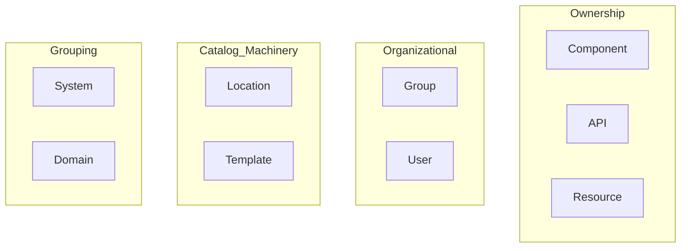
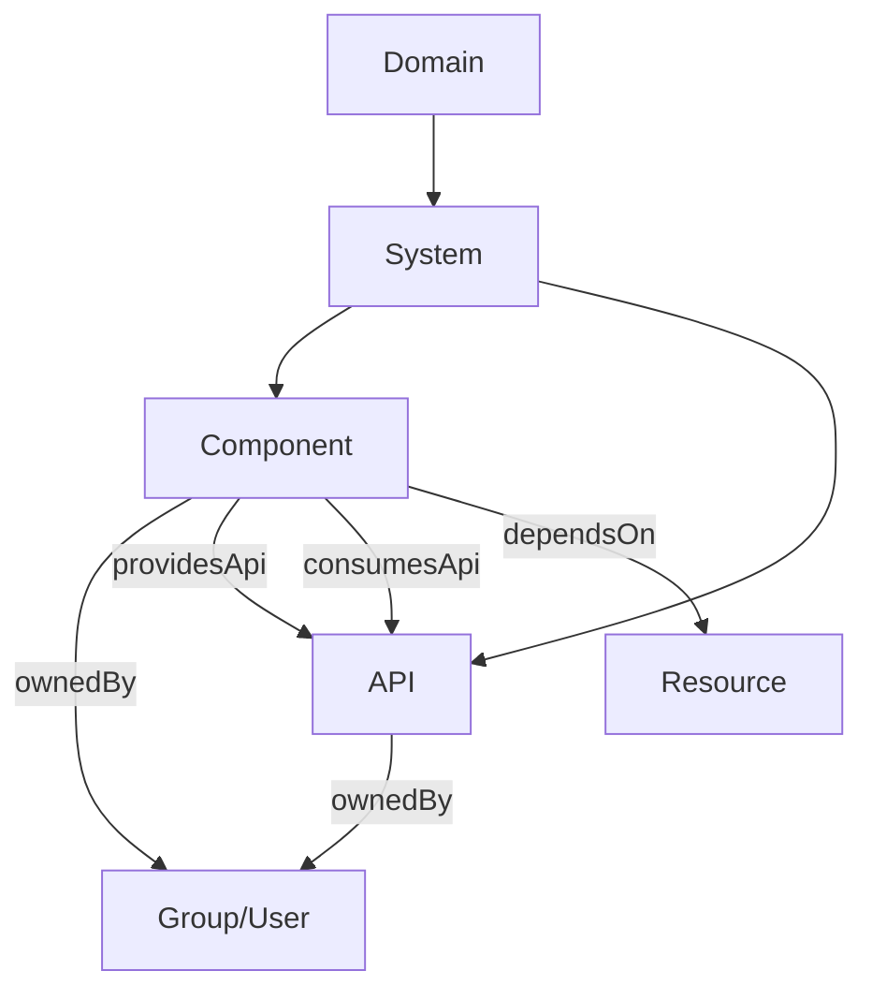
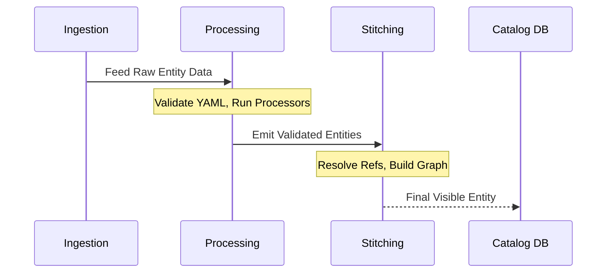
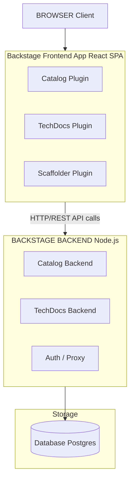
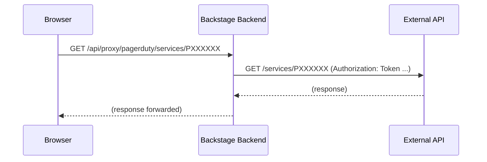

> **Complexity**: `[COMPLEX]` - Covers two exam domains (44% of CBA combined)
>
> **Time to Complete**: 60-75 minutes
>
> **Prerequisites**: Module 1 (Backstage Overview), Module 2 (Plugins & Extensibility)

## What You'll Be Able to Do

After completing this module, you will be able to:

1. **Design** a comprehensive catalog taxonomy that models your organization's ownership, dependencies, and complex API contracts accurately.
2. **Implement** automated discovery providers and custom entity processors to seamlessly ingest services from external sources into the catalog.
3. **Diagnose** catalog ingestion failures, orphan entity accumulations, and relationship mismatches using the Backstage REST API and cursor-based pagination.
4. **Evaluate** the architectural differences between development SQLite setups and production PostgreSQL deployments, ensuring optimal database scaling.
5. **Debug** configuration layering issues within `app-config.yaml` to ensure secrets and environmental overrides behave as expected during runtime.

## Why This Module Matters

At Spotify, before the open-sourcing of Backstage, engineers faced a massive crisis of cognitive fragmentation. During a major peak traffic event, a critical payment routing service went down. The incident response team mobilized instantly, but they spent the first 45 minutes merely trying to diagnose who owned the service, where the deployment manifests were located, and what the upstream infrastructure dependencies were. Millions of dollars in transactions were delayed. This was not a failure of code; it was a catastrophic failure of context.

The software catalog is the beating heart of Backstage. Without it, Backstage is just a plugin framework with a pretty UI. With it, you have a single pane of glass over every service, API, team, and piece of infrastructure your organization owns. It bridges the gap between raw infrastructure and human accountability, turning tribal knowledge into an explicit graph of relationships. 

The Certified Backstage Associate (CBA) exam dedicates **22% to the catalog** (Domain 3) and another **22% to infrastructure** (Domain 2)—together, that is 44% of your total score. Mastering these concepts is not just about passing an exam; it is about learning how to cure the fundamental organizational chaos that plagues modern microservice architectures. Get these two domains right, and you are nearly halfway to passing before you even touch external plugins or documentation frameworks.

## What You'll Learn

By the end of this comprehensive module, you will deeply understand:
- The fundamental origins, CNCF status, and rapid market adoption of the Backstage framework.
- All eight core entity kinds and the supplementary Template kind, and exactly when to use each one.
- How entities are ingested into the catalog pipeline via manual configuration and automated discovery mechanisms.
- How to strictly structure and validate `catalog-info.yaml` descriptor files using the correct `apiVersion`.
- The Backstage client-server architecture: the React SPA frontend, the Node.js Express backend, the database layer, and the proxy system.
- Production deployment considerations, focusing on migrating from local configurations to resilient setups.
- Deep dives into core capabilities like the Kubernetes plugin and TechDocs generation pipelines.

## Did You Know?

1. Backstage was officially open sourced by Spotify on March 16, 2020, solving years of internal fragmentation.
2. Backstage was promoted from the CNCF Sandbox to the CNCF Incubating maturity level on March 15, 2022.
3. The New Frontend System became the default for newly created Backstage apps in v1.49.0, replacing the `--next` flag with a `--legacy` flag for older applications.
4. The Certified Backstage Associate (CBA) exam is a rigorous 90-minute, proctored, multiple-choice exam costing $250, which includes one free retake offered by the Linux Foundation.

---

## Part 1: The Origins, CNCF Status, and Market Impact

Understanding the lineage of Backstage provides crucial context for its architectural decisions. Backstage was open sourced by Spotify on March 16, 2020. The project quickly gained traction, entering the CNCF Sandbox on September 8, 2020. Recognizing its immense impact on developer productivity, the Cloud Native Computing Foundation promoted Backstage to the CNCF Incubating maturity level on March 15, 2022. 

As of April 2026, Backstage remains at the CNCF Incubating level and has not yet formally graduated, though it serves as the de facto standard for Internal Developer Portals (IDPs). Reports indicate Backstage adoption has grown significantly, though specific numbers—such as claims of over 3,000 organizations, 2 million developers, or an 89% market share—remain unverified by authoritative primary sources. Nevertheless, its dominant footprint in the ecosystem is undeniable. Furthermore, while v1.49.0 is recognized as a recent major release in early 2026 that introduced massive systemic upgrades like the New Frontend System, the exact latest version at any given moment is subject to the project's frequent release cycles.

---

## Part 2: The Software Catalog Entity Model (Domain 3)

The software catalog relies on a strictly typed, graph-based taxonomy. Everything in the Backstage catalog is represented as an entity. 

### Core Entity Kinds

There are eight core built-in entity kinds in the Backstage Software Catalog: Component, API, Resource, System, Domain, User, Group, and Location. Additionally, the `Template` kind is used heavily by the Scaffolder feature.

We can visualize this architecture natively using a Mermaid diagram:



Let us examine the purpose of each entity:

| Kind | Purpose | Example |
|------|---------|---------|
| **Component** | A piece of software (service, website, library) | `payments-service`, `react-ui-library` |
| **API** | A boundary between components (REST, gRPC, GraphQL, AsyncAPI) | `payments-api` (OpenAPI spec) |
| **Resource** | Physical or virtual infrastructure a component depends on | `orders-db` (PostgreSQL), `events-queue` (Kafka topic) |
| **System** | A collection of components and APIs that form a product | `payments-system` (groups payments service + API + DB) |
| **Domain** | A business area grouping related systems | `finance` (groups payments, billing, invoicing systems) |
| **Group** | A team or organizational unit | `platform-team`, `backend-guild` |
| **User** | An individual person | `jane.doe` |
| **Location** | A pointer to other entity definition files | A URL referencing a `catalog-info.yaml` in a repo |
| **Template** | A software template for scaffolding new projects | `springboot-service-template` |

A Resource entity specifically describes the infrastructure a Component needs to operate at runtime (e.g., databases, storage buckets, CDNs). Backstage Software Templates (Scaffolder) use a Template entity kind and are defined in YAML stored in a Git repository.

> **Pause and predict**: If you delete a Git repository containing a Template entity, what happens to the entity in Backstage? Will it disappear immediately? Predict the catalog's behavior before continuing.

**Key relationships between entity kinds:**



### The catalog-info.yaml Descriptor

The recommended filename for a Backstage catalog descriptor file is `catalog-info.yaml`. Every entity is described by this file, which typically resides at the root of the source repository. The current catalog entity descriptor `apiVersion` is `backstage.io/v1alpha1`; the schema has not been promoted to a stable (non-alpha) version yet.

```yaml
# catalog-info.yaml
apiVersion: backstage.io/v1alpha1
kind: Component
metadata:
  name: payments-service
  description: Handles all payment processing
  annotations:
    github.com/project-slug: myorg/payments-service
    backstage.io/techdocs-ref: dir:.
  tags:
    - java
    - payments
  links:
    - url: https://payments.internal.myorg.com
      title: Production
      icon: dashboard
spec:
  type: service
  lifecycle: production
  owner: team-payments
  system: payments-system
  providesApis:
    - payments-api
  dependsOn:
    - resource:payments-db
```

The well-known `spec.lifecycle` values for Component and API entities are: `experimental`, `production`, and `deprecated`. Similarly, the well-known `spec.type` values for a Component entity include `service`, `website`, and `library`.

Entity references in Backstage use the format `[kind]:[namespace]/[name]`, where kind and namespace are optional depending on context. If omitted, the namespace defaults to `default`.

### Annotations and Discovery

Annotations are the conceptual glue between catalog entities and the broader ecosystem of Backstage plugins. They instruct plugins exactly where to look to retrieve external telemetry, documentation, or operational metrics.

| Annotation | What It Does |
|------------|-------------|
| `github.com/project-slug` | Links entity to a GitHub repo (`org/repo`) |
| `backstage.io/techdocs-ref` | Tells TechDocs where to find docs (`dir:.` = same repo) |
| `backstage.io/source-location` | Source code URL for the entity |
| `jenkins.io/job-full-name` | Links to a Jenkins job |
| `pagerduty.com/service-id` | Links to PagerDuty for on-call info |
| `backstage.io/managed-by-location` | Which Location entity registered this entity |
| `backstage.io/managed-by-origin-location` | Original Location that first introduced the entity |

---

## Part 3: Entity Ingestion, Providers, and Processors

Backstage catalog entity ingestion relies on two mechanisms: Entity Providers (which read raw definitions from sources) and Processors (which analyze/transform entity data).

### Manual Registration

You can statically define locations directly within the configuration file to manually onboard entities:

```yaml
# app-config.yaml
catalog:
  locations:
    - type: url
      target: https://github.com/myorg/payments-service/blob/main/catalog-info.yaml
      rules:
        - allow: [Component, API]

    - type: file
      target: ../../examples/all-components.yaml
      rules:
        - allow: [Component, System, Domain]
```

You can also define a pure Location entity directly in YAML:

```yaml
apiVersion: backstage.io/v1alpha1
kind: Location
metadata:
  name: myorg-payments
  description: Payments team components
spec:
  type: url
  targets:
    - https://github.com/myorg/payments-service/blob/main/catalog-info.yaml
    - https://github.com/myorg/payments-api/blob/main/catalog-info.yaml
```

### Automated Ingestion via Discovery

Backstage ships built-in discovery integrations for GitHub, GitLab, and Bitbucket Server. These providers scan entire organizations or groups to map out the topology automatically.

```yaml
# app-config.yaml
catalog:
  providers:
    githubDiscovery:
      myOrgProvider:
        organization: 'myorg'
        catalogPath: '/catalog-info.yaml'   # where to look in each repo
        schedule:
          frequency: { minutes: 30 }
          timeout: { minutes: 3 }
```

```yaml
catalog:
  providers:
    gitlab:
      myGitLab:
        host: gitlab.mycompany.com
        branch: main
        fallbackBranch: master
        catalogFile: catalog-info.yaml
        group: 'mygroup'                    # optional: limit to a group
        schedule:
          frequency: { minutes: 30 }
          timeout: { minutes: 3 }
```

```yaml
catalog:
  providers:
    githubOrg:
      myOrgProvider:
        id: production
        orgUrl: https://github.com/myorg
        schedule:
          frequency: { hours: 1 }
          timeout: { minutes: 10 }
```

> **Stop and think**: If a developer changes the `catalogFile` path setting in the provider to look for `.backstage/catalog.yaml` instead of `catalog-info.yaml`, what must happen across all the organization's repositories for the next ingestion cycle to succeed?

### Entity Processors and Pipeline Stitching

The entity lifecycle moves from ingestion to processing and finally stitching.



Custom providers allow for arbitrary integration:

```typescript
import { EntityProvider, EntityProviderConnection } from '@backstage/plugin-catalog-node';

class MyCustomProvider implements EntityProvider {
  getProviderName(): string {
    return 'my-custom-provider';
  }

  async connect(connection: EntityProviderConnection): Promise<void> {
    // Fetch entities from your custom source
    const entities = await fetchFromMySource();

    await connection.applyMutation({
      type: 'full',
      entities: entities.map(entity => ({
        entity,
        locationKey: 'my-custom-provider',
      })),
    });
  }
}
```

---

## Part 4: API Pagination and Troubleshooting

The Backstage Catalog REST API exposes a `GET /entities/by-query` endpoint with cursor-based pagination, superseding the older paginated `GET /entities` endpoint. Cursor pagination offers robust stability against data changes during reads, returning a token (cursor) that acts as a secure pointer to the next page.

When an entity reference is severed, you encounter orphans.

```bash
# List orphaned entities via the Backstage catalog API
curl http://localhost:7007/api/catalog/entities?filter=metadata.annotations.backstage.io/orphan=true

# Delete a specific orphaned entity
curl -X DELETE http://localhost:7007/api/catalog/entities/by-uid/<entity-uid>
```

You can force processing manually:

```bash
# Refresh a specific entity
curl -X POST http://localhost:7007/api/catalog/refresh \
  -H 'Content-Type: application/json' \
  -d '{"entityRef": "component:default/payments-service"}'
```

| Symptom | Likely Cause | Fix |
|---------|-------------|-----|
| Entity never shows up | Invalid YAML or schema violation | Check the catalog import page for errors |
| Entity appears then disappears | `rules` in app-config block the entity kind | Add the kind to `rules: allow` |
| Stale data after repo update | Refresh cycle has not run yet | Manually refresh via catalog API or wait ~100-200s |
| Entity shows as orphaned | The Location that registered it was deleted | Re-register or remove the orphan |
| Relationships broken | Referenced entity name does not match | Check exact `name` fields; they are case-sensitive |

---

## Part 5: Infrastructure Architecture (Domain 2)

Backstage utilizes a discrete client-server separation. The New Frontend System became the default in v1.49.0, modernizing how plugins bind to the application shell.



### Configuration Loading

```yaml
# app-config.yaml — Top-level structure
app:
  title: My Company Backstage
  baseUrl: http://localhost:3000          # Frontend URL

backend:
  baseUrl: http://localhost:7007          # Backend URL
  listen:
    port: 7007
  database:
    client: better-sqlite3                # dev default
    connection: ':memory:'
  cors:
    origin: http://localhost:3000

organization:
  name: MyOrg

integrations:
  github:
    - host: github.com
      token: ${GITHUB_TOKEN}              # environment variable substitution

auth:
  providers:
    github:
      development:
        clientId: ${AUTH_GITHUB_CLIENT_ID}
        clientSecret: ${AUTH_GITHUB_CLIENT_SECRET}

proxy:
  endpoints:
    '/pagerduty':
      target: https://api.pagerduty.com
      headers:
        Authorization: Token token=${PAGERDUTY_TOKEN}

catalog:
  locations: []
  providers: {}
  rules:
    - allow: [Component, System, API, Resource, Location, Domain, Group, User, Template]
```

Config layering merges values at startup:

```bash
# You can pass multiple config files — later files override earlier ones
node packages/backend --config app-config.yaml --config app-config.production.yaml
```

> **Stop and think**: If a frontend plugin makes a direct fetch call to an external API (like GitHub) from the user's browser, what security and network issues might occur? Think about CORS and token exposure.

### The Proxy System

The Proxy routes client browser requests safely through the backend to external sources, masking secret tokens.

```yaml
# app-config.yaml
proxy:
  endpoints:
    '/pagerduty':
      target: https://api.pagerduty.com
      headers:
        Authorization: Token token=${PAGERDUTY_TOKEN}
    '/grafana':
      target: https://grafana.internal.myorg.com
      headers:
        Authorization: Bearer ${GRAFANA_TOKEN}
      allowedHeaders: ['Content-Type']
```



In a production setup, Backstage supports PostgreSQL (recommended for production) and SQLite (used for development/testing) as catalog backend databases.

```yaml
# app-config.production.yaml
backend:
  database:
    client: pg
    connection:
      host: ${POSTGRES_HOST}
      port: ${POSTGRES_PORT}
      user: ${POSTGRES_USER}
      password: ${POSTGRES_PASSWORD}
```

```yaml
app:
  baseUrl: https://backstage.mycompany.com

backend:
  baseUrl: https://backstage.mycompany.com
  cors:
    origin: https://backstage.mycompany.com
```

```yaml
auth:
  environment: production
  providers:
    github:
      production:
        clientId: ${AUTH_GITHUB_CLIENT_ID}
        clientSecret: ${AUTH_GITHUB_CLIENT_SECRET}
```

```text
1. User opens browser → loads React SPA from backend (static files)
2. SPA boots → calls backend APIs: /api/catalog, /api/techdocs, etc.
3. Backend plugins handle API calls → query database, call integrations
4. Backend returns JSON → SPA renders UI
5. For external data → SPA calls /api/proxy/* → backend forwards to external APIs
```

---

## Part 6: Core Extensions: Kubernetes and TechDocs

To truly understand Domain 2 of the CBA, you must grasp core plugins. 

**The Kubernetes Plugin**: The Backstage Kubernetes feature consists of two distinct packages: `@backstage/plugin-kubernetes` (the frontend UI surfacing health) and `@backstage/plugin-kubernetes-backend` (which handles cluster connectivity logic and service accounts). Historical references are OK (e.g., feature X was introduced in v1.1, v1.2, v1.3, v1.4, v1.5, v1.6, and v1.7). For modern production setups today, Kubernetes versions must strictly be v1.35 or higher. Do not deploy end-of-life API objects when binding Backstage ServiceAccounts to your clusters.

**TechDocs**: TechDocs uses MkDocs under the hood to convert Markdown files into a static HTML documentation site. TechDocs recommends generating docs on CI/CD and storing output to an external storage provider (e.g., AWS S3 or Google Cloud Storage) rather than generating dynamically on the Backstage server itself. This architectural choice dramatically reduces CPU load on the Backstage backend.

---

## War Story: The 10,000 Entity Tsunami

A platform team at a mid-size fintech company set up GitHub discovery to auto-register every repo in their organization. Within a week, the catalog had 10,000 entities—but morale was awful. The catalog ingested archived repositories, ancient forks, and experimental prototypes without prejudice. Search became absolutely useless.

When they removed the configuration block in panic, the entities remained. They became orphaned entities. Backstage correctly tracked that they had been registered via a Location that no longer existed, flagging them for human review. The team spent a weekend writing a Python loop calling `DELETE /api/catalog/entities/by-uid/<uid>` to purge the ghost data.

**The Lesson:** Always scope discovery providers using repository topic tags or explicit path exclusions to prevent digital hoarding.

## Exam Design Notes for Catalog and Infrastructure Scenarios

The CBA exam combines catalog and infrastructure topics because Backstage's catalog is not just a list of services. It is a graph backed by a database, refreshed by processing loops, extended by providers, queried through APIs, and rendered through plugins. When a question mentions ownership, dependencies, APIs, systems, domains, orphan entities, database behavior, or config layering, it is usually testing whether you can connect catalog modeling to operational infrastructure.

Start every catalog scenario by asking what the entity represents. A `Component` is software that can be owned and operated. An `API` is a contract that components provide or consume. A `Resource` is infrastructure that software depends on. A `System` groups related components, APIs, and resources into a product boundary. A `Domain` groups systems around a business area. `User` and `Group` entities model ownership, while `Location` entities tell the catalog where other descriptors come from.

Good catalog taxonomy makes incident response faster because it turns vague service names into explicit ownership and dependency paths. If a checkout service depends on a database, consumes a pricing API, provides an orders API, and belongs to a commerce system, responders can move from symptom to owner and dependency much faster. The exam may present this as a business problem, but the technical answer is usually the correct entity kind and relationship.

Descriptor quality matters more than descriptor quantity. A repository with a `catalog-info.yaml` that names an owner, lifecycle, system, APIs, and dependencies is more useful than many repositories with only a component name. The catalog graph becomes valuable when descriptors are complete enough for plugins to attach documentation, Kubernetes resources, CI jobs, alerts, and ownership workflows to the same entity.

Annotations are plugin contracts. A GitHub annotation tells a plugin where source code lives, a TechDocs annotation tells TechDocs where documentation source lives, and Kubernetes annotations can help connect an entity to cluster resources. Treat annotations as integration points, not decorative metadata. If an entity page has missing tabs or empty plugin panels, check whether the expected annotation exists and whether the referenced external system is reachable.

Manual registration is useful for controlled onboarding, examples, and small teams. Static `catalog.locations` entries give platform teams clear review over what enters the catalog, and a Location entity can group related descriptor targets. The trade-off is maintenance: every new repository or descriptor location may require config or catalog changes unless automation is added. Manual registration favors precision over scale.

Automated discovery providers favor scale, but they must be constrained. A provider that scans every repository in a large organization can ingest archived experiments, personal sandboxes, templates, test fixtures, and incomplete descriptors. Use filters, rules, ownership conventions, and CI validation so discovery produces a trustworthy graph rather than a noisy inventory. The correct exam answer often includes governance, not just enabling the provider.

Processors are where raw entity data becomes validated catalog state. A provider or location supplies data, processors read and validate that data, and stitching creates relations that the catalog API can serve. When ingestion fails, identify whether the failure happened while reading the source, parsing YAML, validating schema, applying rules, resolving relations, or stitching the final graph. Each stage has a different owner and fix.

Orphan entities require careful reasoning. If a source Location disappears or stops emitting an entity, Backstage may retain an orphaned entity for visibility instead of silently deleting it. That behavior protects operators from losing context without warning, but it also means catalog cleanup needs process. You must understand whether an entity is actively managed, orphaned by a missing location, or incorrectly duplicated by multiple providers.

Relationship mismatches often come from reference syntax. Entity refs include kind, namespace, and name, with defaults that can hide mistakes. A component depending on `resource:orders-db` is not the same as depending on a resource in another namespace unless the namespace is included. If the UI does not show the expected relationship, inspect the normalized refs and the target entity's namespace before blaming the plugin.

The catalog REST API is the operational inspection tool for large installations. UI pages are excellent for humans, but API queries reveal entity refs, relations, filters, fields, and pagination behavior precisely. Cursor-based pagination matters because large catalogs cannot safely return every entity in one response. If a question mentions missing entities at scale, think about filters, fields, limits, and cursors as well as provider configuration.

Database choice is not a minor deployment detail. SQLite is convenient for local development because it requires little setup, but it is not the right foundation for resilient multi-user production Backstage. PostgreSQL gives production deployments a real database service for catalog state, plugin storage, migrations, and operational backup. The exam often phrases this as a scaling problem, but the answer starts with choosing the correct database architecture.

Production database scaling must consider writers and readers. Catalog processing writes and updates entity state, while users and plugins read catalog data continuously. Running too many processing replicas can cause duplicate work or database contention unless leader election or a dedicated processing topology is used. Scaling the web/API side of Backstage does not automatically mean every replica should perform the same background processing work.

Configuration layering controls how infrastructure settings move between environments. Base config can describe safe defaults, while production config can add real hostnames, database clients, authentication providers, and proxy targets. Environment variables can inject secrets and environment-specific values at runtime. If a deployment behaves differently than expected, inspect which config files were loaded and in what order.

Backstage config is loaded as a sequence, and later values override earlier values. That means a correct key in `app-config.production.yaml` can still lose if the process starts with a different config order. Conversely, a local override can hide a production problem during development. A strong answer explains not only which YAML key should exist but also how the process receives the correct config stack.

The proxy system exists because browser code should not hold secrets or bypass backend policy. Frontend plugins can call the Backstage backend, and the backend proxy can attach credentials, enforce allowlists, and route to external APIs. A proxy endpoint should be treated like backend integration code: review the target, headers, path handling, auth requirements, and whether the browser is allowed to reach the external service indirectly.

Kubernetes integration connects catalog metadata to runtime resources. A component can be mapped to workloads through annotations, labels, or configured locators, and the backend plugin talks to clusters on behalf of the portal. Empty Kubernetes tabs are often catalog or backend configuration problems, not UI rendering problems. Check entity metadata, cluster locator settings, credentials, and backend plugin installation in that order.

TechDocs also depends on catalog metadata and infrastructure. The catalog entity tells Backstage where documentation source lives, the TechDocs builder generates the site, and storage configuration determines where generated docs are served from. Local filesystem storage can work for development, while production systems usually need shared object storage so docs survive restarts and can be served consistently across backend replicas.

When modeling infrastructure as `Resource` entities, keep the abstraction useful. A database, message topic, bucket, cache, or cluster can be a resource if teams need to understand ownership and dependencies. Do not create resource entities for every low-level object if that floods the graph with noise. A good catalog abstracts infrastructure at the level where ownership, reliability, cost, and incident response decisions happen.

When modeling APIs, include the contract and ownership. An API entity should describe the boundary that other components depend on, not just a vague interface name. OpenAPI, AsyncAPI, GraphQL, and gRPC definitions can make the contract inspectable. Accurate `providesApi` and `consumesApi` relations help teams understand blast radius before changing an endpoint or deprecating a version.

When modeling systems and domains, avoid using them as decorative folders. A `System` should represent a product or technical boundary with meaningful components and APIs. A `Domain` should represent a broader business or platform area that groups systems. If every team invents its own grouping rules, the catalog graph becomes inconsistent. Platform teams should publish taxonomy guidance and review changes that create new high-level groupings.

Governance is part of catalog engineering. CI should validate descriptor syntax, required fields, owner refs, lifecycle values, allowed entity kinds, and annotation formats before descriptors reach the catalog. Runtime ingestion should not be the first place obvious descriptor errors are discovered. The exam may ask how to prevent broken catalog data, and the best answer often includes both CI validation and catalog processing diagnostics.

Large catalogs require search and filtering discipline. Users need to find services by owner, lifecycle, system, domain, tags, type, and relation. If descriptors omit those fields, the UI may still list entities, but the portal will not answer operational questions. Catalog quality therefore depends on both platform tooling and team habits. A catalog full of unnamed owners and experimental lifecycles is technically populated but operationally weak.

Incident scenarios often combine catalog and infrastructure failures. A missing owner field slows escalation, a broken provider stops updates, a database bottleneck delays processing, and a misordered config file points plugins at the wrong endpoint. Practice decomposing the story into graph modeling, ingestion, storage, and runtime configuration. That decomposition prevents one-size-fits-all fixes such as "restart Backstage" when the real problem is bad metadata or database contention.

For exam pacing, translate symptoms into catalog layers. "The entity never appears" points to provider, location, rules, parsing, or processor errors. "The entity appears but relationships are missing" points to refs, namespaces, or stitching. "The UI tab is empty" points to annotations, backend plugin config, or external credentials. "Pagination misses records" points to API query shape and cursor handling. Each symptom has a layer.

The strongest mental model is that Backstage turns infrastructure and software ownership into a queryable graph. Descriptors define nodes, relations define edges, providers and processors keep the graph fresh, PostgreSQL stores the state, APIs expose the data, and plugins render useful operational views. Once you can place each problem in that pipeline, catalog and infrastructure questions become much more predictable.

When you review a catalog descriptor, read it as a contract between the service team and the platform team. The service team is declaring what the thing is, who owns it, what lifecycle it is in, what system it belongs to, what APIs it provides, and what infrastructure it depends on. The platform team is promising that plugins, search, ownership views, documentation, and operational integrations will use that information consistently.

When descriptors are incomplete, Backstage still accepts some entities, but the platform value drops sharply. A component with no owner cannot route accountability. A component with no system cannot show product context. A component with no API relations cannot reveal consumers. A component with no documentation annotation cannot attach TechDocs. The catalog is only as strong as the metadata teams maintain.

When automated discovery is introduced, start with a small blast radius. Scan one group, one topic, or one repository pattern first, inspect the resulting graph, and only then widen coverage. Large organizations often have years of abandoned repositories and inconsistent naming. Discovery turns that history into catalog data unless you add filters. Controlled expansion is an engineering practice, not a lack of ambition.

When processors reject an entity, the fix should happen at the source of truth whenever possible. Editing catalog database rows manually may clear a symptom, but it does not repair the repository descriptor that will be processed again later. A durable fix updates the `catalog-info.yaml`, provider filter, entity reference, or processor rule that produced the bad state. The catalog should converge from source-controlled truth.

When comparing SQLite and PostgreSQL, focus on operational characteristics instead of brand names. SQLite is embedded, simple, and useful for a laptop. PostgreSQL is a networked database service with durability, backup, connection management, and production concurrency characteristics. Backstage plugins store real platform state, so production deployments need database behavior that survives restarts, multiple users, and continuous background processing.

When scaling the backend, separate request-serving capacity from background work. More replicas can help with web and API traffic, but background catalog processing can duplicate work if every replica processes the same providers without coordination. A mature deployment may use leader election, a dedicated worker-style topology, or explicit operational guidance so scaling improves availability without creating write contention.

When proxy endpoints are reviewed, check whether they accidentally expose a general-purpose tunnel. A narrowly scoped proxy endpoint with a fixed target and controlled headers is much safer than a broad endpoint that allows arbitrary paths or hosts. The backend proxy is powerful because it can hold credentials, so it must be configured with the same care as any other privileged backend integration.

When Kubernetes resources are shown in Backstage, the catalog entity is the bridge between human ownership and cluster state. A deployment, service, or pod in Kubernetes usually does not know the full business context. Backstage can add that context if the entity metadata and cluster labels align. That is why catalog accuracy matters for platform operations, not just for pretty service pages.

When TechDocs fails in production, investigate build mode, storage, and entity annotations together. The entity may point to the wrong docs directory, the builder may not have generated content, or the storage backend may not be shared across replicas. A local demo can hide these issues because one process can generate and read from a local filesystem. Production needs a durable documentation path.

When using the catalog API, avoid pulling the entire world just to answer a narrow question. Filters, fields, and pagination reduce database load and make automation safer. A script that loops through every entity without cursor handling can miss data or overload the backend. API discipline is part of catalog operations because the catalog often becomes a central integration point for many internal tools.

When cleaning orphan entities, preserve auditability. An orphan may represent a genuinely retired service, a moved repository, a temporary provider outage, or a misconfigured location. Deleting immediately can remove useful incident context. A better cleanup process identifies the origin, confirms ownership, records why the source disappeared, and then removes stale entities deliberately through supported UI or API paths.

When teams argue about taxonomy, use operational questions to decide. Who owns this thing? What fails if it is down? Which users depend on it? Which system does it support? Which APIs does it expose? Which resources does it consume? Those questions produce better entity models than debates about whether every repository deserves its own page. The catalog should optimize for decision-making.

When configuration layering breaks, print or inspect the effective config rather than staring at one YAML file. The value Backstage uses is the result of loaded files, order, environment substitution, and deployment command flags. Many incidents happen because everyone reviews the correct production file while the process is actually started with only the base file. The effective config is the truth at runtime.

When teaching catalog modeling, start with one complete service and expand outward. Define the component, owner group, system, API, database resource, and TechDocs annotation for one service. Then add another component that consumes the API. This small graph teaches relations more clearly than a giant import of hundreds of partial entities. Quality of relations matters more than quantity of nodes.

When designing CI validation, enforce the fields that your organization relies on operationally. If on-call routing depends on `spec.owner`, make it required. If service grouping depends on `spec.system`, validate it. If documentation is expected for production services, validate the TechDocs annotation. CI should encode local platform policy, not merely check that YAML parses.

When an exam answer includes "just use Backstage," it is probably incomplete. Backstage is the framework, but the correct answer usually names the catalog entity kind, provider, processor, config layer, database choice, proxy pattern, or plugin boundary that addresses the scenario. Precise nouns matter because Backstage has many moving parts, and each one owns a different failure mode.

When you operate Backstage as a platform, treat the catalog as shared infrastructure data. Teams should not make arbitrary taxonomy changes without review, but the platform team should also avoid becoming a bottleneck for every descriptor edit. The healthiest model combines clear standards, automated validation, self-service registration, and visible cleanup processes for exceptions.

The catalog and infrastructure domains are ultimately about reducing ambiguity. A good Backstage deployment answers who owns a service, what it depends on, where its docs live, which APIs it exposes, which runtime resources belong to it, and how the portal itself is configured and scaled. That is why these domains carry so much exam weight and so much practical value.

When a catalog grows, the cost of ambiguity compounds. One missing owner field is annoying; hundreds of missing owner fields make the portal unreliable during incidents. One loose discovery provider is convenient; many loose providers create stale data that teams stop trusting. Backstage succeeds when every entity has enough metadata for another team to make a decision without opening a chat thread.

When you model dependencies, prefer relationships that describe operational reality. If a service cannot function without a database, that database should appear as a resource dependency. If an API is consumed by several components, that contract should be visible before a breaking change is merged. The graph should help teams predict blast radius, not merely document repository names after the fact.

When building automation around the catalog API, write scripts as if the catalog is large even when today's instance is small. Use filters, requested fields, pagination cursors, and cautious delete workflows. Scripts that work only against a small demo catalog often become dangerous when copied into production. The CBA exam expects you to recognize that operational scale changes how APIs should be consumed.

When a production Backstage instance feels slow, separate catalog data problems from infrastructure problems. Too many noisy entities, missing indexes, excessive provider scans, slow external APIs, and underpowered PostgreSQL instances can all appear as a sluggish catalog. Restarting the backend may briefly hide symptoms, but durable fixes require finding the layer that is actually producing latency or write pressure.

When you choose ownership conventions, make them match the organization that will respond to incidents. A component owned by a vague group such as `engineering` is not actionable. A component owned by a real team with an escalation path is actionable. Backstage can show ownership beautifully, but it cannot compensate for a taxonomy that avoids real accountability.

When teaching teams to write descriptors, give them examples for common patterns: a service with an API, a website consuming an API, a database resource, a system grouping several components, and a domain grouping related systems. Clear examples reduce drift more effectively than abstract policy documents. Teams copy working patterns, so the platform team should make the right pattern easy to copy.

When all of these practices come together, Backstage becomes more than a portal UI. It becomes an operational map that links source repositories, runtime infrastructure, documentation, ownership, dependency contracts, and production configuration. That is the practical reason catalog and infrastructure knowledge matters: it helps platform teams turn scattered engineering facts into a dependable shared control plane.

For the exam, do not memorize these topics as separate flashcards. Practice reading a scenario and naming the layer first: entity model, descriptor syntax, annotation contract, provider configuration, processor behavior, catalog API query, database architecture, config loading, proxy boundary, Kubernetes integration, or TechDocs storage. Once the layer is clear, the correct Backstage feature usually follows naturally. That habit is also how experienced platform engineers debug real portals without making broad, risky changes.

For real delivery work, keep feedback loops close to the source. Descriptor validation belongs near repositories, provider filters belong near platform config, database alarms belong near the production deployment, and cleanup reports belong where service owners can act. Backstage centralizes visibility, but responsibility still lives with the teams and platform controls that maintain the graph.

This is why catalog work should be treated as ongoing platform maintenance rather than a one-time import project with no owner, review loop, validation policy, cleanup routine, operational accountability, measurable quality bar, service-level expectation, durable funding, or roadmap.

---

## Common Mistakes

| Mistake | Why It Happens | What To Do Instead |
|---------|---------------|-------------------|
| Using SQLite in production | It is the default and "works" in dev | Always configure PostgreSQL for production |
| Not scoping discovery providers | GitHub discovery imports *every* repo | Use topic filters, path patterns, or allowlists |
| Expecting instant catalog updates | Developers register YAML and refresh the page immediately | Explain the ~100-200s refresh cycle; use manual refresh API for urgent updates |
| Hardcoding secrets in app-config.yaml | Copy-pasting tokens during setup | Use `${ENV_VAR}` substitution; never commit secrets |
| Forgetting `rules: allow` for entity kinds | Register a Template but it never appears | Each Location source needs explicit `rules` for allowed kinds |
| Running TLS termination in Node.js | Seems simpler than a reverse proxy | Use an ingress controller or load balancer for TLS; Node.js TLS is not needed |
| Not configuring auth for production | Dev mode works without it | Every production instance must have authentication enabled |
| Ignoring orphaned entities | They accumulate silently | Monitor orphan count; establish a cleanup process |

---

## Quiz

**Q1: Which entity kind represents a boundary between components?**
> **Scenario**: You have two microservices. The frontend service needs to fetch data from the backend service. To properly document the contract and endpoints between these two components in Backstage, which entity kind should you use?
<details>
<summary>Answer</summary>

You should use the **API** kind. The API kind represents a contract or boundary between components, ensuring that dependencies and communication interfaces are explicitly defined in the catalog. A Component `providesApi` and another Component `consumesApi`. By registering it as an API entity, Backstage can display the exact specifications (such as OpenAPI, gRPC, GraphQL, or AsyncAPI) directly in the interface. This makes it clear to consumers how to interact with the service and who owns the contract.

</details>

**Q2: How do you inject secrets into app-config.yaml?**
> **Scenario**: You are deploying Backstage to a production environment and need to configure the GitHub integration to read repository data. You have a `GITHUB_TOKEN` that must be kept secure. How should you provide this secret to the `app-config.yaml` file without hardcoding it?
<details>
<summary>Answer</summary>

You must use **environment variable substitution** with the `${VARIABLE_NAME}` syntax, such as `token: ${GITHUB_TOKEN}`. Backstage resolves these values at startup by reading them directly from the host process's environment variables. You should never hardcode secrets in configuration files because they are often committed to version control, which poses a severe security risk. Injecting them via environment variables ensures that sensitive credentials remain strictly within the runtime environment, protecting your infrastructure from unauthorized access.

</details>

**Q3: What is the purpose of the Backstage proxy plugin?**
> **Scenario**: Your Backstage frontend needs to display real-time incident data from PagerDuty. However, querying the PagerDuty API directly from the browser would expose your organization's API token to the client. How does Backstage securely handle this request?
<details>
<summary>Answer</summary>

Backstage securely handles this by using the **proxy plugin** (`/api/proxy`), which forwards requests from the frontend through the backend to external APIs. By routing the request through the backend, the server can safely inject the required authorization headers (such as the PagerDuty API token) before forwarding the request to the external service. The browser never sees the external service tokens, which prevents them from being leaked or exploited by malicious scripts. Furthermore, this pattern effectively circumvents CORS (Cross-Origin Resource Sharing) restrictions that would otherwise block direct client-side requests from the single-page application.

</details>

**Q4: Name two ways entities can be registered in the catalog.**
> **Scenario**: A new team is onboarding into your organization and wants their existing microservices to appear in the Backstage catalog. They can either add their services one-by-one or have them automatically picked up. What are the two primary mechanisms provided by Backstage to achieve this?
<details>
<summary>Answer</summary>

Entities can be registered through **manual registration** or **automated discovery**. Manual registration involves explicitly adding static Location entries in `app-config.yaml` under `catalog.locations` or clicking the "Register Existing Component" button in the UI. Automated discovery, on the other hand, utilizes built-in providers (like `githubDiscovery`, `gitlab`, or `githubOrg`) configured under `catalog.providers` to automatically scan repositories and organizational groups for `catalog-info.yaml` files. Automated discovery is highly recommended for scaling across large engineering organizations, while manual registration is useful for testing or isolated components.

</details>

**Q5: What database should be used for a production Backstage deployment?**
> **Scenario**: You have successfully tested Backstage locally using its default in-memory database and are now writing the deployment manifests for a production Kubernetes cluster. To ensure high availability and data persistence, which database backend must you configure?
<details>
<summary>Answer</summary>

You must use **PostgreSQL** for a production deployment. The default SQLite (or `better-sqlite3`) database is strictly intended for local development and testing, as it lacks the concurrency and durability required for real-world usage. PostgreSQL supports concurrent connections, ensures data persistence, and can efficiently handle the intense catalog processing workloads of a production environment. You configure it by setting `backend.database.client: pg` in your `app-config.production.yaml` file to ensure your catalog remains highly available and resilient.

</details>

**Q6: What happens to entities when their source Location is deleted?**
> **Scenario**: A developer accidentally deletes a repository containing the `catalog-info.yaml` for a deprecated service. The repository was originally ingested via a static Location entry in Backstage. What will be the state of this entity in the Backstage catalog?
<details>
<summary>Answer</summary>

The entity will become an **orphaned entity**. It remains in the catalog database but is no longer actively refreshed from its source because the origin Location is missing. Backstage marks these entities by attaching the annotation `backstage.io/orphan: 'true'`, alerting administrators that the entity is disconnected from its source of truth. These orphans must be explicitly cleaned up, either manually through the Backstage UI or programmatically via the catalog API (`DELETE /api/catalog/entities/by-uid/<uid>`), to prevent the catalog from accumulating stale and confusing data.

</details>

**Q7: How does configuration layering work in Backstage?**
> **Scenario**: You want to run Backstage locally but need to override some of the base configuration settings with production-specific values when deploying to your Kubernetes cluster. How does Backstage process multiple configuration files to achieve this?
<details>
<summary>Answer</summary>

Backstage achieves this through **configuration layering**, where you pass multiple `--config` flags when starting the backend (e.g., `node packages/backend --config app-config.yaml --config app-config.production.yaml`). The framework reads the files in the order they are provided, using a deep merge strategy where values in later files override the corresponding values from earlier files. This pattern allows teams to maintain a common base configuration while safely applying environment-specific overrides, such as database credentials or authentication settings for production. For example, your base config might define the catalog providers, while your production config injects the necessary OAuth client secrets. This separation prevents accidental leakage of production secrets in local environments while maintaining an easily testable application structure.

</details>

**Q8: In a production Kubernetes deployment of Backstage, why should catalog processing run on a single replica?**
> **Scenario**: You are scaling your Backstage backend deployment to 3 replicas to handle increased API traffic. However, you notice unexpected database lock errors and duplicate processing cycles in the logs. What architectural consideration regarding catalog processing was missed?
<details>
<summary>Answer</summary>

The issue occurs because catalog processing should ideally run on a **single replica** to avoid duplicate processing work and database conflicts. If multiple replicas simultaneously execute the catalog processing loop, they may redundantly fetch data from the same external sources and attempt conflicting database writes. To safely scale the backend while preventing these issues, the `@backstage/plugin-catalog-backend` supports leader election. This mechanism ensures that only one replica actively performs catalog processing tasks while all other replicas focus solely on serving API requests, preventing race conditions and unnecessary load on upstream integrations.

</details>

---

## Hands-On Exercise: Build a Multi-Entity Catalog

**Objective:** Create a complete catalog structure with multiple entity kinds, register them, and verify the robust relational dependency graph.

### Step 1: Define the Descriptors

```yaml
---
apiVersion: backstage.io/v1alpha1
kind: Domain
metadata:
  name: commerce
  description: All commerce-related systems
spec:
  owner: group:platform-team

---
apiVersion: backstage.io/v1alpha1
kind: System
metadata:
  name: orders-system
  description: Handles order lifecycle
spec:
  owner: group:backend-team
  domain: commerce

---
apiVersion: backstage.io/v1alpha1
kind: Component
metadata:
  name: orders-service
  description: REST API for order management
  annotations:
    backstage.io/techdocs-ref: dir:.
  tags:
    - java
    - springboot
spec:
  type: service
  lifecycle: production
  owner: group:backend-team
  system: orders-system
  providesApis:
    - orders-api
  dependsOn:
    - resource:orders-db

---
apiVersion: backstage.io/v1alpha1
kind: API
metadata:
  name: orders-api
  description: Orders REST API
spec:
  type: openapi
  lifecycle: production
  owner: group:backend-team
  system: orders-system
  definition: |
    openapi: "3.0.0"
    info:
      title: Orders API
      version: 1.0.0
    paths:
      /orders:
        get:
          summary: List orders
          responses:
            '200':
              description: OK

---
apiVersion: backstage.io/v1alpha1
kind: Resource
metadata:
  name: orders-db
  description: PostgreSQL database for orders
spec:
  type: database
  owner: group:backend-team
  system: orders-system

---
apiVersion: backstage.io/v1alpha1
kind: Group
metadata:
  name: backend-team
  description: Backend engineering team
spec:
  type: team
  children: []

---
apiVersion: backstage.io/v1alpha1
kind: Group
metadata:
  name: platform-team
  description: Platform engineering team
spec:
  type: team
  children: []
```

### Step 2: Register Entities Config

```yaml
catalog:
  rules:
    - allow: [Component, System, API, Resource, Location, Domain, Group, User, Template]
  locations:
    - type: file
      target: ./catalog-entities.yaml
      rules:
        - allow: [Domain, System, Component, API, Resource, Group]
```

### Step 3: Run Validation

```bash
# Start Backstage in development mode
yarn dev
```

### Step 4: Proxy Binding

```yaml
proxy:
  endpoints:
    '/jsonplaceholder':
      target: https://jsonplaceholder.typicode.com
```

```bash
# This request goes through the Backstage proxy
curl http://localhost:7007/api/proxy/jsonplaceholder/todos/1
```

### Success Checklist
<details>
<summary>View Checklist</summary>

- [ ] All entities appear cleanly in the UI.
- [ ] `orders-service` maps exactly to the `orders-system` hierarchy.
- [ ] The Proxy endpoint forwards requests correctly without exposing API keys locally.

</details>

---

## Key Takeaways

| Topic | Remember This |
|-------|--------------|
| Entity kinds | 9 built-in: Component, API, Resource, System, Domain, Group, User, Location, Template |
| catalog-info.yaml | Lives in repo root; `apiVersion`, `kind`, `metadata`, `spec` are required |
| Annotations | Connect entities to plugins; key discovery mechanism |
| Registration | Manual (UI or static locations) vs. automated (discovery providers) |
| Processing | Continuous loop with ~100-200s cycle; ingestion → processing → stitching |
| Architecture | React SPA frontend + Node.js backend + PostgreSQL database |
| app-config.yaml | Layered config; `${ENV_VAR}` for secrets; `--config` flag for overrides |
| Proxy | `/api/proxy/*` forwards frontend requests through backend to external APIs |
| Production | PostgreSQL, HTTPS (via ingress), authentication required, single processing replica |

## Sources

- [Backstage Docs: Software Catalog](https://backstage.io/docs/features/software-catalog/)
- [Backstage Docs: System model](https://backstage.io/docs/features/software-catalog/system-model/)
- [Backstage Docs: Descriptor format](https://backstage.io/docs/features/software-catalog/descriptor-format/)
- [Backstage Docs: Configuration](https://backstage.io/docs/conf/)
- [Backstage Docs: Backend system](https://backstage.io/docs/backend-system/)
- [Backstage Docs: Proxying](https://backstage.io/docs/plugins/proxying/)
- [Backstage Docs: Kubernetes plugin](https://backstage.io/docs/features/kubernetes/)
- [Backstage Docs: TechDocs](https://backstage.io/docs/features/techdocs/)
- [Backstage Docs: TechDocs architecture](https://backstage.io/docs/features/techdocs/architecture/)
- [Backstage Docs: Discovery and integration](https://backstage.io/docs/integrations/)
- [Backstage Docs: Authentication](https://backstage.io/docs/auth/)
- [Backstage Docs: Docker deployment](https://backstage.io/docs/deployment/docker/)

## Next Module

**[CBA Track Overview]()** — Domain 4: Templates, documentation-as-code, and mastering the golden path for executing resilient scaffolding deployments. Prepare to build your first template in the next session!
