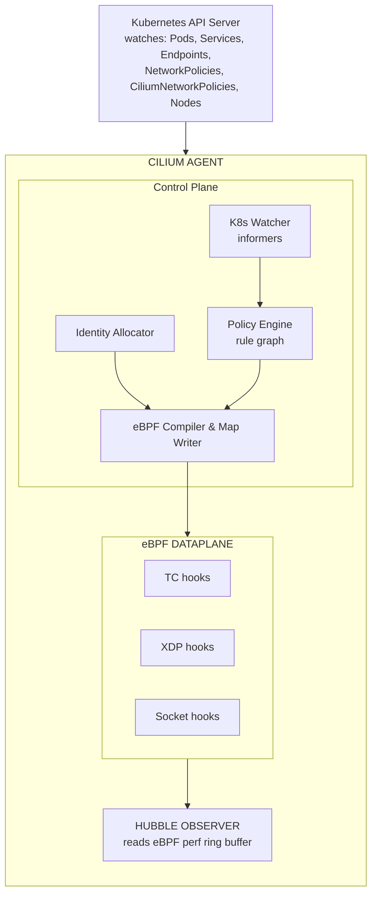
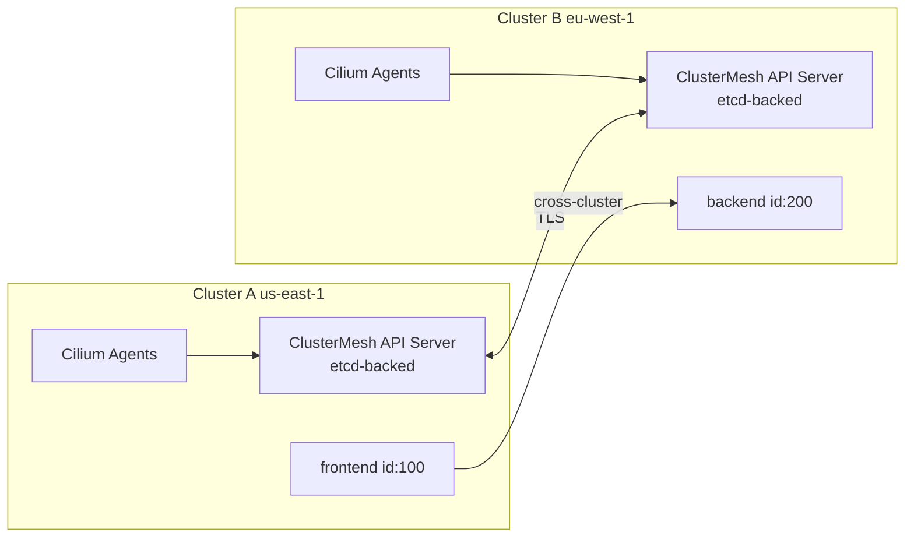
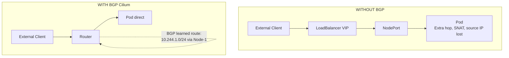
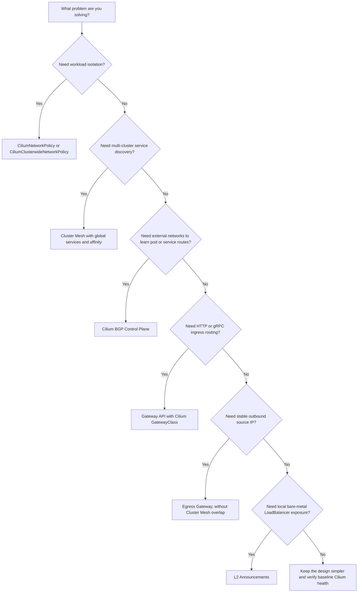

# Module 1.1: Advanced Cilium for CCA

> **CCA Track** | Complexity: `[COMPLEX]` | Time: 75-90 minutes

## Prerequisites

- [Cilium Toolkit Module](/platform/toolkits/infrastructure-networking/networking/module-5.1-cilium/) -- eBPF fundamentals, basic Cilium architecture, identity-based security
- [Hubble Toolkit Module](/platform/toolkits/observability-intelligence/observability/module-1.7-hubble/) -- Hubble CLI, flow observation
- Kubernetes networking basics (Services, Pods, DNS)
- Comfort with `kubectl` and YAML targeting Kubernetes v1.35

---

## Learning Outcomes

After completing this module, you will be able to:

1. **Evaluate** Cilium's eBPF datapath architecture, analyzing how endpoint programs, maps, and identity-based policy enforcement operate at the kernel layer.
2. **Design** complex `CiliumNetworkPolicy` and `CiliumClusterwideNetworkPolicy` manifests utilizing L3, L4, and L7 rules, including DNS-aware and FQDN filtering.
3. **Implement** Cluster Mesh for global service discovery and cross-cluster failover, diagnosing connectivity issues using Hubble Relay.
4. **Deploy** advanced routing and connectivity features, including BGP peering with GoBGP, Gateway API configurations, and Egress Gateways with stable IP masquerading.
5. **Diagnose** multi-cluster and policy enforcement failures using the Cilium CLI, Hubble observability maps, and eBPF state inspection.

---

## Why This Module Matters

Hypothetical scenario: your platform team is moving a production API from one Kubernetes v1.35 cluster to another while keeping both clusters live for a controlled migration. The service name resolves, the pods are ready, and the application logs look clean, yet only the workloads in the new cluster fail when they call a database endpoint exposed from the older environment. A standard `kubectl describe service` review shows healthy endpoints, and a basic Kubernetes NetworkPolicy check does not explain the drops, because the decisive enforcement point is Cilium's identity-aware eBPF datapath rather than kube-proxy.

The operational risk is that advanced Cilium failures often look like ordinary application outages until you inspect the right layer. Cluster Mesh can make a service appear local while packets are actually crossing a trust boundary, L7 policy can allow a TCP connection while denying an HTTP method, and BGP can advertise a route that the rest of the network is not prepared to use. The CCA skill is not memorizing feature names; it is tracing how labels become identities, how identities become map lookups, and how those map lookups produce forwarding, redirect, NAT, or drop decisions.

In this module you will work from the kernel-facing datapath outward. You will evaluate how the agent, operator, identities, maps, and Hubble events fit together, then design policies that combine L3, L4, L7, DNS, and entity rules without accidentally blocking the control plane. After that you will connect the same mental model to Cluster Mesh, transparent encryption, BGP, Gateway API, Egress Gateway, L2 announcements, and practical troubleshooting. The goal is to leave you able to diagnose a failed flow by asking where the decision was made, what identity or route informed it, and which command can prove that hypothesis.

---

## Part 1: Cilium Architecture in Depth

The Toolkit module introduced the big picture. Now, we open the components and examine the internal mechanics. Cilium supports both overlay (VXLAN, Geneve) and native routing networking modes, but the underlying enforcement engine remains identical.

The useful way to reason about Cilium is to separate the control plane from the datapath without pretending they are independent products. The control plane watches Kubernetes, allocates identities, compiles policy, and writes map entries. The datapath is already attached to Linux hooks, so it can make packet decisions without waiting for a userspace process on every packet. When a flow fails, the first diagnostic question is therefore not "which controller is down" but "which state did the agent last publish into the kernel, and which hook evaluated the packet."

This is also why advanced Cilium behavior can feel different from iptables-based networking. An iptables rule chain is often inspected as a long ordered list, while Cilium tries to reduce repeated work into numeric identities and keyed map lookups. A pod label change is expensive at the control-plane edge because identity and policy state must converge, but the steady-state packet decision is fast because the datapath does not parse Kubernetes labels for every connection. That design is the foundation for policy scale, service load balancing, observability, and multi-cluster enforcement.

### The Cilium Agent (DaemonSet)

The Cilium Agent is the core worker, deployed as a DaemonSet on every node in the cluster. It communicates with the Kubernetes API, translates state into eBPF programs, and writes them into the Linux kernel.



**What each sub-component does:**

| Component | Role | Why It Matters |
|-----------|------|----------------|
| K8s Watcher | Receives events from API server via informers | Detects pod creation, policy changes, service updates |
| Identity Allocator | Maps label sets to numeric identities | Enables O(1) policy lookups instead of label matching |
| Policy Engine | Builds a rule graph from all applicable policies | Determines allowed (src identity, dst identity, port, L7) tuples |
| eBPF Compiler | Generates per-endpoint eBPF programs | Tailored programs = faster enforcement, no generic rule walk |
| eBPF Maps | Shared kernel data structures (hash maps, LPM tries) | Policy decisions, connection tracking, NAT, service lookup |
| Hubble Observer | Reads the perf event ring buffer from eBPF programs | Every forwarded/dropped packet becomes a flow event |

Cilium fully utilizes eBPF as the highly efficient in-kernel data plane for all L3/L4 network processing (IP, TCP, UDP). When handling NodePort, LoadBalancer services, and externalIPs, Cilium can fully replace kube-proxy using eBPF hooks.

> **Pause and predict**: If the K8s Watcher component of the Cilium Agent loses connection to the Kubernetes API Server, what happens to existing network connections for pods already running on that node? 
> *Think about where the policies actually live before reading on.*

Existing flows do not disappear just because the watcher temporarily loses API connectivity. The node still has loaded eBPF programs, service maps, policy maps, and connection-tracking state, so packets can continue to be forwarded or dropped according to the most recent datapath state. The risk is convergence: new pods, new services, policy edits, endpoint deletions, and identity changes may not be reflected until the watcher recovers and the agent reconciles state again. In an incident, that distinction keeps you from confusing a control-plane watch problem with a total datapath outage.

Endpoint programs are the practical unit of enforcement. Cilium attaches programs at relevant Linux hooks, but policy is evaluated as close to the workload as possible so the decision can include the endpoint identity, direction, port, and higher-layer redirect requirements. If the policy includes only L3 and L4 criteria, the kernel datapath can usually make the decision directly. If the policy includes L7 HTTP, Kafka, DNS, or related application rules, the datapath redirects the selected traffic to Envoy, and Envoy becomes part of the policy enforcement path.

### The Cilium Operator (Deployment)

While the agent runs per-node, the Cilium Operator handles cluster-wide coordination tasks. There is typically one active operator replica running (with others on standby for high availability).

```text
CILIUM OPERATOR RESPONSIBILITIES
================================================================

1. IPAM (IP Address Management)
   - Allocates pod CIDR ranges to nodes
   - In "cluster-pool" mode: carves /24 blocks from a larger pool
   - In AWS ENI mode: manages ENI attachment and IP allocation

2. CRD Management
   - Ensures CiliumIdentity, CiliumEndpoint, CiliumNode CRDs exist
   - Garbage-collects stale CiliumIdentity objects

3. Cluster Mesh
   - Manages the clustermesh-apiserver deployment
   - Synchronizes identities across clusters

4. Resource Cleanup
   - Removes orphaned CiliumEndpoints when pods are deleted
   - Cleans up leaked IPs from terminated nodes
```

**Key exam point**: The operator does NOT enforce policies or program eBPF. If the operator goes down, existing networking continues to work seamlessly because the eBPF datapath is autonomous. However, new pod CIDR allocations will fail, and identity garbage collection pauses (stale identities accumulate) until the operator recovers.

That separation is a common exam trap because both the agent and operator are Cilium components, but they own different failure domains. The agent is node-local and directly responsible for translating cluster state into datapath state on that node. The operator owns cluster-scoped coordination that would be wasteful or unsafe to perform independently on every node. If you see pods on existing nodes communicating but newly added nodes failing to receive pod CIDRs, the operator and IPAM path deserve attention before you start deleting working Cilium agents.

The same separation helps during upgrades. Restarting one agent causes a local reconciliation event and may briefly affect endpoints on that node, while restarting the operator should not flush policy maps on every node. A mature rollout plan checks both dimensions: node datapath health through `cilium status` and endpoint readiness, then cluster-scoped health through operator logs, CiliumNode status, identity garbage collection, and Cluster Mesh control-plane readiness if multi-cluster features are enabled.

### IPAM Modes

Cilium supports multiple IPAM strategies. Knowing when to use which is heavily tested.

| IPAM Mode | How It Works | When to Use |
|-----------|-------------|-------------|
| `cluster-pool` (default) | Operator allocates /24 CIDRs from a configurable pool to each node. Agent assigns IPs from its node's pool. | Most clusters. Simple, works everywhere. |
| `kubernetes` | Delegates to the Kubernetes `--pod-cidr` allocation (node.spec.podCIDR). | When you want K8s to control CIDR allocation. |
| `multi-pool` | Multiple named pools with different CIDRs. Pods select pool via annotation. | Multi-tenant clusters needing separate IP ranges. |
| `eni` (AWS) | Allocates IPs directly from AWS ENI secondary addresses. Pods get VPC-routable IPs. | AWS EKS. No overlay needed. Native VPC routing. |
| `azure` | Allocates from Azure VNET. Similar to ENI mode for Azure. | AKS clusters. |
| `crd` | External IPAM controller manages CiliumNode CRDs. | Custom IPAM integrations. |

Choose IPAM mode before you choose a routing story, because the allocated pod address is the thing the rest of the network must understand. In `cluster-pool` mode, Cilium can keep pod addressing portable across infrastructure providers, but external networks still need either encapsulation, native routing, load balancing, or BGP route distribution to reach those pod CIDRs directly. In cloud-native ENI or Azure modes, pods can receive provider-routable addresses, which simplifies some paths and complicates others because cloud quotas, subnet sizing, and provider-specific limits become part of pod scheduling capacity.

Pause and predict: before running the next command, what would you expect to see on a two-node `cluster-pool` cluster if each node received its own pod CIDR? If the output shows an empty `podCIDRs` field for a node that should be scheduling pods, the failure is not an application problem; it points toward IPAM allocation, node registration, or operator reconciliation. That prediction habit matters because Cilium troubleshooting is faster when every command is tied to a specific hypothesis.

```bash
# Check which IPAM mode your cluster uses
cilium config view | grep ipam

# In cluster-pool mode, see the allocated ranges
kubectl get ciliumnodes -o jsonpath='{range .items[*]}{.metadata.name}: {.spec.ipam.podCIDRs}{"\n"}{end}'
```

---

## Part 2: CiliumNetworkPolicy vs Kubernetes NetworkPolicy

Cilium enforces network policy at L3, L4, and L7, including DNS/FQDN-based egress policies. To leverage this, it ships two Cilium-specific policy CRDs: `CiliumNetworkPolicy` (namespace-scoped) and `CiliumClusterwideNetworkPolicy` (cluster-scoped).

Kubernetes NetworkPolicy remains useful as a portable baseline, but it intentionally stops at pod and namespace selectors, IP blocks, ports, and allow-list semantics. Cilium keeps compatibility with that model while adding primitives that match how real production traffic is described: HTTP paths, Kafka topics, DNS names, generated security identities, well-known cluster entities, and explicit deny rules. The tradeoff is that the policy language becomes more powerful and therefore easier to misuse if a team treats every policy as an isolated YAML file instead of part of a shared enforcement model.

The most important behavioral detail is default-deny activation. In default enforcement mode, an endpoint that is not selected by any policy remains open; once a policy selects that endpoint, only explicitly allowed traffic is admitted for the selected direction. That means a single narrow ingress policy can accidentally remove previously allowed DNS, health, or peer traffic if the team forgets the rest of the dependency graph. Advanced policy design starts by identifying required control-plane and data-plane flows, then narrowing application flows after those baseline paths are protected.

### Feature Comparison

| Feature | K8s NetworkPolicy | CiliumNetworkPolicy |
|---------|-------------------|---------------------|
| L3/L4 filtering (IP + port) | Yes | Yes |
| Label-based pod selection | Yes | Yes (+ identity-based) |
| Namespace selection | Yes | Yes |
| **L7 HTTP filtering** (method, path, headers) | No | Yes |
| **L7 Kafka filtering** (topic, role) | No | Yes |
| **L7 DNS filtering** (FQDN) | No | Yes |
| **Entity-based rules** (host, world, dns, kube-apiserver) | No | Yes |
| **Cluster-wide scope** | No | Yes (CiliumClusterwideNetworkPolicy) |
| **CIDR-based egress with FQDN** | No | Yes (toFQDNs) |
| **Policy enforcement mode control** | No | Yes (default/always/never) |
| **Identity-aware enforcement** | No | Yes (eBPF identity lookup) |
| **Deny rules** | No (allow-only model) | Yes (explicit deny) |

### L7 HTTP-Aware Policies

While eBPF handles L3/L4 processing in the kernel, Application-layer protocols like HTTP, Kafka, and gRPC utilize an Envoy proxy. Cilium's service mesh is sidecarless: Envoy runs as a per-node proxy in the host network namespace, not as a per-pod sidecar. Cilium redirects outbound pod traffic to Envoy securely using eBPF hooks.

This split is worth remembering because it explains the symptoms learners often misread. An HTTP policy does not necessarily prevent the TCP handshake itself; the connection may be accepted and then redirected through Envoy for request inspection. The denied event can therefore appear as an L7 policy verdict rather than a simple SYN drop. When you troubleshoot, compare Hubble's protocol, verdict, source identity, destination identity, and L7 metadata before assuming that the application returned the error on its own.

```yaml
# L7 HTTP policy: allow only specific API calls
apiVersion: cilium.io/v2
kind: CiliumNetworkPolicy
metadata:
  name: api-l7-policy
  namespace: production
spec:
  endpointSelector:
    matchLabels:
      app: api-server
  ingress:
  - fromEndpoints:
    - matchLabels:
        app: frontend
    toPorts:
    - ports:
      - port: "8080"
        protocol: TCP
      rules:
        http:
        # Allow reading products
        - method: "GET"
          path: "/api/v1/products"
        # Allow reading a specific product by ID
        - method: "GET"
          path: "/api/v1/products/[0-9]+"
        # Allow creating orders with JSON
        - method: "POST"
          path: "/api/v1/orders"
          headers:
          - 'Content-Type: application/json'
        # Everything else: DENIED
```

Even if an attacker gains shell execution inside the `frontend` pod, the infrastructure layer drops any attempt to execute a `DELETE` request against `api/v1` or target unauthorized paths.

The security value here is not that YAML can replace application authorization. The value is that infrastructure can enforce coarse application contracts even when application code is imperfect, a credential is over-scoped, or a compromised pod tries to use a path the service team never intended. The policy should still align with application semantics, and path patterns should be reviewed like code because an overly broad regex can reopen the same surface the policy was meant to close.

### Policy Enforcement Modes

Cilium's policy enforcement dictates the default posture of the cluster.

```text
POLICY ENFORCEMENT MODES
================================================================

MODE: "default" (the default)
─────────────────────────────
- If NO policies select an endpoint: all traffic allowed
- If ANY policy selects an endpoint: only explicitly allowed traffic passes
- This is how standard K8s NetworkPolicy works
- Think: "policies are opt-in"

MODE: "always"
─────────────────────────────
- ALL traffic is denied unless explicitly allowed by policy
- Even endpoints with no policies get default-deny
- Think: "zero-trust by default"
- Use this in production for maximum security

MODE: "never"
─────────────────────────────
- Policy enforcement is completely disabled
- All traffic flows freely regardless of policies
- Think: "debugging mode"
- NEVER use in production. Useful for ruling out policy
  issues during troubleshooting.
```

```bash
# Check the current enforcement mode
cilium config view | grep policy-enforcement

# Change enforcement mode (requires Helm upgrade or config change)
# Via Helm:
cilium upgrade --set policyEnforcementMode=always

# Via cilium config (runtime, non-persistent):
cilium config PolicyEnforcement=always
```

> **Stop and think**: If you switch a running cluster from `default` to `always` enforcement mode without applying baseline policies first, what will happen to pods attempting to resolve the `api.stripe.com` domain name? 
> *Answer: CoreDNS requests will be immediately dropped because there is no baseline policy allowing egress to DNS entities.*

### Entity-Based Rules

Cilium uses predefined semantic entities that eliminate the need to hardcode dynamic IP addresses for critical cluster services.

```yaml
# Allow pods to reach essential infrastructure
apiVersion: cilium.io/v2
kind: CiliumClusterwideNetworkPolicy
metadata:
  name: allow-infrastructure
spec:
  endpointSelector: {}
  egress:
  - toEntities:
    - dns             # CoreDNS / kube-dns
    - kube-apiserver  # Kubernetes API server
  ingress:
  - fromEntities:
    - health          # Kubelet health probes
```

| Entity | Meaning |
|--------|---------|
| `host` | The node the pod runs on |
| `remote-node` | Other cluster nodes |
| `kube-apiserver` | The Kubernetes API server (regardless of IP) |
| `health` | Cilium health check probes |
| `dns` | DNS servers (kube-dns/CoreDNS) |
| `world` | Anything outside the cluster |
| `all` | Everything (use with caution) |

Entity rules are often the cleanest way to express infrastructure dependencies, but they are not a shortcut around design. `kube-apiserver` is useful because the API server address can move, especially in managed environments, and `dns` is useful because CoreDNS endpoints can scale or reschedule. `world` and `all` deserve much more caution because they expand the policy from a named dependency to a broad trust category. If you need internet egress, prefer combining DNS-aware rules, CIDR rules, and workload selectors so the policy states both who can leave and where they can go.

---

## Part 3: Cluster Mesh -- Multi-Cluster Connectivity

Cilium Cluster Mesh enables multi-cluster networking with global service discovery, cross-cluster failover, and identity-based policy enforcement across multiple Kubernetes boundaries. 

Cluster Mesh is not just a service-discovery convenience. It extends the identity and service model so workloads in different clusters can communicate as if they share a larger network, while still preserving cluster identity, endpoint identity, and policy enforcement. That means a remote backend can be discovered through familiar Kubernetes service names, but the packet still carries enough context for Cilium to decide whether the source identity is allowed. This is powerful because it lets teams migrate, fail over, or split workloads by region without dropping back to coarse IP allowlists.

The cost of that power is that Cluster Mesh makes old assumptions visible. Overlapping pod CIDRs that were harmless in isolated clusters become ambiguous when both clusters are joined. A policy that matched a local label set may behave differently when the same application exists in another cluster with a distinct cluster identity. A service annotation can make traffic remote without changing the client code, which is convenient during migration and dangerous if latency, compliance, or data residency requirements were not included in the design.

### Architecture



### Requirements

| Requirement | Why |
|-------------|-----|
| Shared CA certificate | Agents authenticate to remote ClusterMesh API servers via mTLS |
| Non-overlapping pod CIDRs | Packets must be routable; overlapping CIDRs cause ambiguity |
| Network connectivity | Agents must reach remote ClusterMesh API server (port 2379 by default) |
| Unique cluster names | Each cluster needs a distinct name and numeric ID (1-255) |
| Compatible Cilium versions | Minor version skew is tolerated; major version must match |

Treat these requirements as preflight checks rather than post-failure trivia. Shared trust through certificates determines whether agents can authenticate remote state. Non-overlapping CIDRs determine whether a destination address has one clear owner. Unique numeric cluster IDs determine whether identities can be distinguished after synchronization. Version compatibility determines whether both sides interpret CRDs, service annotations, and datapath capabilities the same way. When a mesh connection fails, walking these requirements in order usually beats chasing random pod logs.

To configure Cluster Mesh across environments:

```bash
# Step 1: Enable Cluster Mesh on each cluster
# On Cluster A:
cilium clustermesh enable --context kind-cluster-a --service-type LoadBalancer

# On Cluster B:
cilium clustermesh enable --context kind-cluster-b --service-type LoadBalancer

# Step 2: Connect the clusters
cilium clustermesh connect \
  --context kind-cluster-a \
  --destination-context kind-cluster-b

# Step 3: Wait for readiness
cilium clustermesh status --context kind-cluster-a --wait

# Step 4: Verify connectivity
cilium connectivity test --context kind-cluster-a --multi-cluster
```

### Global Services and Service Affinity

Once connected, you expose services globally using an annotation. 

```yaml
# A service in Cluster A that is discoverable from Cluster B
apiVersion: v1
kind: Service
metadata:
  name: payment-service
  namespace: production
  annotations:
    # This annotation makes the service global
    service.cilium.io/global: "true"
spec:
  selector:
    app: payment
  ports:
  - port: 443
```

By resolving `payment-service.production.svc.cluster.local`, workloads are naturally balanced across backends in all meshed clusters. However, crossing data center boundaries introduces latency. We control this using Service Affinity.

```yaml
apiVersion: v1
kind: Service
metadata:
  name: payment-service
  annotations:
    service.cilium.io/global: "true"
    # Prefer local cluster, fall back to remote
    service.cilium.io/affinity: "local"
spec:
  selector:
    app: payment
  ports:
  - port: 443
```

| Affinity | Behavior |
|----------|----------|
| `local` | Prefer local cluster endpoints. Use remote only if local has none. |
| `remote` | Prefer remote cluster endpoints. Use local only if remote has none. |
| `none` (default) | Load-balance equally across all clusters. |

Service affinity is a routing preference, not a policy exception. A client in Cluster A with `local` affinity should use Cluster A endpoints while they exist, but Cilium can still fail over to remote endpoints when local readiness disappears. That behavior is excellent for planned maintenance, but it means a failure test must verify both the happy path and the failover path. If a remote endpoint is reachable but unauthorized by policy, the service may resolve correctly while traffic still drops at the identity enforcement layer.

Exercise scenario: suppose a platform team annotates a service as global and sees successful requests from Cluster A to Cluster B, but Hubble reports drops when Cluster B tries the reverse direction. Do not assume Cluster Mesh is half-connected. Check whether namespace labels, endpoint labels, and cluster labels used in the selected policies are symmetric. Then inspect Hubble from both clusters, because each side may make a different policy decision based on the local destination endpoint and the remote source identity it receives through the mesh.

---

## Part 4: Transparent Encryption

When operating across untrusted networks, securing pod-to-pod traffic is mandatory. Cilium supports two methods:

1. **WireGuard**: Cilium supports WireGuard transparent encryption. Each node auto-generates a key-pair and distributes its public key via the `network.cilium.io/wg-pub-key` CiliumNode annotation.
2. **IPsec**: Cilium's IPsec pod-to-pod encryption is highly stable. However, IPsec node-to-node encryption (host traffic) remains a beta feature. 

Critically, IPsec transparent encryption is not supported when Cilium is chained on top of another CNI plugin (e.g., using AWS VPC CNI for routing and Cilium exclusively for enforcement).

Transparent encryption is attractive because application teams do not need to add TLS to every internal hop before the network starts protecting pod traffic. The platform tradeoff is that encryption becomes part of node networking, key distribution, and datapath compatibility. WireGuard is generally easier to operate because key management is built into the node-to-node workflow, while IPsec may fit organizations that already standardize on IPsec controls or hardware expectations. In both cases, you still need application-layer security for authentication, authorization, and end-to-end semantics; network encryption protects the path, not the business meaning of the request.

The chaining limitation matters during migrations because many teams try to add Cilium policy first and replace the primary CNI later. That can be a practical transition strategy for visibility and enforcement, but it is not the same as owning the datapath. If another CNI controls routing and Cilium is chained for policy, transparent encryption features that require datapath ownership may not be available. The exam angle is simple: read the installation mode before promising a feature, because Cilium capabilities depend on the way it is integrated into the node.

---

## Part 5: BGP with Cilium

By default, pod IPs are only routable within the cluster. BGP (Border Gateway Protocol) changes this. Cilium can advertise pod CIDRs and service IPs to external routers, making them directly routable. Cilium BGP Control Plane uses GoBGP as the underlying routing library (Cilium previously supported BGP via MetalLB integration, but that mode is now deprecated).

BGP is where Kubernetes networking stops being only a cluster concern and becomes part of the physical or virtual network. Advertising a pod CIDR tells routers that a node can reach a block of pod addresses; advertising a service VIP tells routers where to send traffic for a load-balanced service. This can remove extra hops and preserve source addresses, but it also means route policy, router configuration, firewall rules, and failure behavior must be designed with the network team. A Cilium BGP session in `established` state is necessary, but it is not proof that the wider network will forward client traffic correctly.

The mental model is similar to giving directions in a large building. Kubernetes knows which room a pod occupies, but an external router only knows corridors and signs. BGP lets Cilium publish signs that say "send this prefix to this node." If the router accepts the sign but an upstream firewall blocks the corridor, clients still fail. If two nodes publish contradictory signs, traffic may take an unexpected path. That is why BGP troubleshooting must include both Cilium status and the router's route table.



### CiliumBGPPeeringPolicy

The `CiliumBGPPeeringPolicy` CRD was introduced to construct these topologies dynamically. 

```yaml
# Configure BGP peering with a ToR (Top-of-Rack) router
apiVersion: cilium.io/v2alpha1
kind: CiliumBGPPeeringPolicy
metadata:
  name: rack-1-bgp
spec:
  # Which nodes this policy applies to
  nodeSelector:
    matchLabels:
      rack: rack-1
  virtualRouters:
  - localASN: 65001          # Your cluster's ASN
    exportPodCIDR: true       # Advertise pod CIDRs to peers
    neighbors:
    - peerAddress: "10.0.0.1/32"  # ToR router IP
      peerASN: 65000               # Router's ASN
      # Optional: authentication
      # authSecretRef: bgp-auth-secret
    serviceSelector:
      # Advertise LoadBalancer service VIPs
      matchExpressions:
      - key: service.cilium.io/bgp-announce
        operator: In
        values: ["true"]
```

| Concept | Meaning |
|---------|---------|
| ASN (Autonomous System Number) | A unique identifier for a BGP-speaking network. Private range: 64512-65534. |
| Peering | Two BGP speakers establishing a session to exchange routes. |
| Route Advertisement | Announcing "I can reach this IP range" to peers. |
| eBGP | External BGP -- peering between different ASNs (cluster to external router). |
| iBGP | Internal BGP -- peering within the same ASN (less common in Cilium). |
| `exportPodCIDR` | Tell peers how to reach pods on this node. |

> **Pause and predict**: If you advertise the pod CIDR via BGP, what additional external networking equipment configuration is required for a client on the internet to reach those pods?
> *Consider whether internal pod IPs are typically routable across the public internet.*

The answer is that route advertisement is only one side of reachability. A client outside the private network needs upstream routing that carries the prefix to your edge, firewall policy that permits the traffic, and usually address planning that avoids exposing raw pod IPs directly to the public internet. Many production designs advertise pod or service routes only inside a private network, then use controlled ingress, Gateway API, or load-balancer entry points for public traffic. Cilium can publish routes, but it does not turn private addresses into globally accepted internet destinations.

```bash
# Check BGP peering status
cilium bgp peers

# Expected output:
# Node       Local AS   Peer AS   Peer Address   State        Since
# worker-1   65001      65000     10.0.0.1       established  2h15m
# worker-2   65001      65000     10.0.0.1       established  2h15m

# Check advertised routes
cilium bgp routes advertised ipv4 unicast
```

---

## Part 6: Gateway API, Bandwidth Manager, Egress Gateway, and L2 Announcements

### Cilium Gateway API

Cilium natively implements the Kubernetes Gateway API, replacing the need for a separate ingress controller. Why this matters: Gateway API is the successor to Ingress. Cilium's implementation means no separate NGINX or Envoy Gateway deployment -- the same agent that manages eBPF also integrates Gateway functionality.

Gateway API shifts ingress from a single overloaded resource into a set of role-oriented resources. A platform team can own GatewayClass and Gateway infrastructure, while application teams own HTTPRoute or GRPCRoute objects that attach to permitted listeners. Cilium's implementation is especially interesting because the same networking stack can combine service load balancing, policy, and Envoy-based traffic management. The operational tradeoff is that a broken route may involve Gateway API attachment rules, Envoy configuration, service backends, and Cilium policy at the same time.

```yaml
# Gateway: the listener that accepts traffic
apiVersion: gateway.networking.k8s.io/v1
kind: Gateway
metadata:
  name: cilium-gw
  namespace: production
spec:
  gatewayClassName: cilium    # Cilium's built-in GatewayClass
  listeners:
  - name: http
    protocol: HTTP
    port: 80
    allowedRoutes:
      namespaces:
        from: Same
```

```yaml
# HTTPRoute: route HTTP traffic to backends
apiVersion: gateway.networking.k8s.io/v1
kind: HTTPRoute
metadata:
  name: app-routes
  namespace: production
spec:
  parentRefs:
  - name: cilium-gw
  rules:
  - matches:
    - path:
        type: PathPrefix
        value: /api
    backendRefs:
    - name: api-service
      port: 8080
  - matches:
    - path:
        type: PathPrefix
        value: /
    backendRefs:
    - name: frontend-service
      port: 3000
```

```yaml
# GRPCRoute: route gRPC traffic to backends
apiVersion: gateway.networking.k8s.io/v1
kind: GRPCRoute
metadata:
  name: grpc-routes
  namespace: production
spec:
  parentRefs:
  - name: cilium-gw
  rules:
  - matches:
    - method:
        service: payments.PaymentService
    backendRefs:
    - name: payment-grpc
      port: 9090
```

### Bandwidth Manager

Bandwidth Manager is a fairness and blast-radius feature rather than a security boundary. It helps keep selected workloads from consuming more egress bandwidth than the platform intends, which is useful for batch jobs, replication tasks, or noisy tenants. The policy should be aligned with workload labels that are stable and meaningful, because a label drift can remove the cap from the workload that needed it or accidentally constrain a latency-sensitive service. As with network policy, the label taxonomy is part of the control surface.

```yaml
apiVersion: cilium.io/v2
kind: CiliumBandwidthPolicy
metadata:
  name: rate-limit-batch-jobs
spec:
  endpointSelector:
    matchLabels:
      workload-type: batch
  egress:
    rate: "50M"     # 50 Mbit/s egress cap
    burst: "10M"    # Allow short bursts up to 10 Mbit above rate
```

### Egress Gateway

CiliumEgressGatewayPolicy routes outbound traffic from selected pods through dedicated gateway nodes. External services see a predictable source IP (the gateway node's IP). 

Why you need this: Many external firewalls, databases, and SaaS APIs allowlist traffic by source IP. Without an egress gateway, pod traffic exits from whatever node the pod resides on, resulting in shifting source IPs.

Cilium Egress Gateway is GA (not beta) in Cilium version 1.19.x; it requires BPF masquerading and kube-proxy replacement to be enabled. **Crucially, Egress Gateway is incompatible with Cluster Mesh.** 

> **Stop and think**: Why is Cilium Egress Gateway incompatible with Cluster Mesh?
> *Answer: Egress gateways rely on strict SNAT and localized routing logic that conflicts with the cross-cluster identity synchronization and datapath behavior inherent to Cluster Mesh.*

The design question behind Egress Gateway is not only "which IP should the outside world see." It is also "which node becomes responsible for a selected class of traffic, and how do we keep that responsibility observable." If a backend pod can leave through any node, an external firewall allowlist has to include many node addresses or accept random failures after rescheduling. If traffic is redirected through dedicated gateway nodes, allowlisting becomes cleaner, but those gateway nodes become capacity and failure-planning objects. You should monitor them like ingress infrastructure, not like ordinary workers.

```yaml
apiVersion: cilium.io/v2
kind: CiliumEgressGatewayPolicy
metadata:
  name: db-egress-via-gateway
spec:
  selectors:
  - podSelector:
      matchLabels:
        app: backend
        needs-stable-ip: "true"
  destinationCIDRs:
  - "10.200.0.0/16"       # External database subnet
  egressGateway:
    nodeSelector:
      matchLabels:
        role: egress-gateway   # Dedicated gateway nodes
    egressIP: "192.168.1.50"   # Stable SNAT IP
```

### CiliumL2AnnouncementPolicy

L2 announcements solve a different exposure problem from BGP. Instead of exchanging routes with a router, selected nodes answer for service IPs on the local layer-two network, which is useful in bare-metal environments where a cloud LoadBalancer does not exist. This can be simpler than BGP for small networks, but it is intentionally local in scope. If the traffic must cross routed domains, BGP or another routed load-balancing design is usually the more appropriate tool.

```yaml
apiVersion: cilium.io/v2alpha1
kind: CiliumL2AnnouncementPolicy
metadata:
  name: l2-services
spec:
  serviceSelector:
    matchLabels:
      l2-announce: "true"
  nodeSelector:
    matchLabels:
      node.kubernetes.io/role: worker
  interfaces:
  - eth0
  externalIPs: true
  loadBalancerIPs: true
```

```yaml
# A service that uses L2 announcement
apiVersion: v1
kind: Service
metadata:
  name: web
  labels:
    l2-announce: "true"
spec:
  type: LoadBalancer
  selector:
    app: web
  ports:
  - port: 80
    targetPort: 8080
```

---

## Part 7: CLI, Observability, and Troubleshooting

Hubble is Cilium's integrated network observability platform, providing real-time service maps and L3-L7 flow visibility. Hubble provides a Relay component that aggregates flow data from all nodes for cluster-wide observability. Note that while Hubble Relay is stable, the Hubble UI is technically in Beta status as of Cilium 1.19.x stable.

Good Cilium troubleshooting is a disciplined narrowing process. Start by asking whether the packet entered the Cilium-managed datapath, whether it matched the expected source and destination identities, whether it was forwarded, redirected, translated, or dropped, and whether the drop was L3/L4 or L7. Hubble is valuable because it turns those hidden datapath decisions into timestamped flow records. The CLI and agent commands are valuable because they let you compare those records against endpoint state, identity state, service maps, connection tracking, and current configuration.

Before running this, what output do you expect if Hubble Relay is enabled but the UI is disabled? The cluster can still provide aggregated flow observation through Relay and the CLI, while the web interface simply will not be available. Making that prediction prevents a cosmetic UI status from distracting you from the more important question: whether flow data is being captured and whether the observer covers all nodes involved in the failing path.

### Installation and Status

*Although some unverified sources suggest the minimum supported Kubernetes version for Cilium 1.19.x is Kubernetes version 1.21, you must always consult the official compatibility matrix directly prior to installation.*

```bash
# Install Cilium (most common invocation)
cilium install \
  --set kubeProxyReplacement=true \
  --set hubble.enabled=true \
  --set hubble.relay.enabled=true \
  --set hubble.ui.enabled=true

# Check status (the first command you run after install)
cilium status
# Shows: agent, operator, relay status + features enabled

# Wait for all components to be ready
cilium status --wait

# View full Cilium configuration
cilium config view

# View specific config value
cilium config view | grep policy-enforcement
```

### Connectivity Testing

The connectivity test is more than a smoke test. It deploys known clients and servers, exercises a broad set of datapath paths, and cleans up after itself, which gives you a controlled baseline before you inspect the application. When the suite fails, read the failed test name carefully because `pod-to-pod`, `pod-to-service`, `pod-to-external`, DNS, policy, and Hubble visibility failures point toward different subsystems. In a live incident, a targeted test can confirm whether the platform is generally healthy before you spend time on a single application's custom policy.

```bash
# Run the full connectivity test suite
cilium connectivity test

# What it does:
# - Deploys test client and server pods
# - Tests pod-to-pod (same node and cross-node)
# - Tests pod-to-Service (ClusterIP and NodePort)
# - Tests pod-to-external
# - Tests NetworkPolicy enforcement
# - Tests DNS resolution
# - Tests Hubble flow visibility
# - Cleans up test resources when done

# Run specific tests only
cilium connectivity test --test pod-to-pod
cilium connectivity test --test pod-to-service

# Run with extra logging for debugging
cilium connectivity test --debug
```

### Endpoint and Identity Management

Endpoint and identity commands connect Kubernetes objects to Cilium's enforcement model. A pod name is convenient for humans, but the datapath evaluates numeric identities and endpoint IDs. When Hubble reports a source identity you do not recognize, `cilium identity get` tells you which labels produced that identity. When a pod is selected by a policy but still allowed, `cilium endpoint get` can show whether policy enforcement is enabled for that endpoint and which policy revisions were realized on the node.

```bash
# List all Cilium-managed endpoints on this node
kubectl exec -n kube-system ds/cilium -- cilium endpoint list

# Get details on a specific endpoint
kubectl exec -n kube-system ds/cilium -- cilium endpoint get <endpoint-id>

# List all identities
cilium identity list

# Get labels for a specific identity
cilium identity get <identity-number>
```

### Troubleshooting

The practical troubleshooting sequence is to move from broad health to specific evidence. Check `cilium status` first because it summarizes agent, operator, Hubble, and feature status. Then inspect logs for reconciliation failures, endpoint readiness for workload-specific issues, map state for datapath evidence, and Hubble or `cilium monitor` for packet verdicts. Avoid deleting pods or restarting Cilium before collecting the flow evidence, because the restart may clear useful state and turn a reproducible policy issue into a vague intermittent report.

```bash
# Check if Cilium agent is healthy
cilium status

# View Cilium agent logs
kubectl -n kube-system logs ds/cilium -c cilium-agent --tail=100

# Check eBPF map status
kubectl exec -n kube-system ds/cilium -- cilium bpf ct list global | head

# Monitor policy verdicts in real-time
kubectl exec -n kube-system ds/cilium -- cilium monitor --type policy-verdict

# Debug a specific pod's connectivity
kubectl exec -n kube-system ds/cilium -- cilium endpoint list | grep <pod-name>
```

---

## Worked Example: Diagnosing a Cluster Mesh Policy Drop

Exercise scenario: return to the migration introduced at the start of the module, where one Kubernetes v1.35 cluster is joined to another cluster through Cluster Mesh and a database flow fails only from the new environment. The goal is not to tell a real incident story; it is to practice the diagnostic order you should use when a cross-cluster path appears healthy at the service layer but fails at the policy layer. The first move is to observe dropped flows from the affected source, then compare the reported identities with the policy selectors on the destination side.

**Stage 1**: Cluster Mesh connected. Global services worked perfectly in staging.

**Stage 2**: Production migration started. Cluster Mesh connected. Global service annotation applied. Traffic began flowing to both clusters. Monitoring showed healthy request ratios.

**Stage 3**: Alerts fired. Payment failures were visible only from workloads in the new cluster.

An engineer bypassed basic `kubectl logs` and used the Hubble CLI to evaluate the network layer:

```bash
hubble observe --from-pod new-cluster/payment-api --verdict DROPPED --protocol tcp
```

The output revealed immediate drops on port 5432. The payment API inside the new cluster fundamentally could not establish communication with the PostgreSQL deployment lingering in the older cluster. 

**Root cause**: A legacy `CiliumClusterwideNetworkPolicy` on the older environment permitted ingress *only* from endpoints bearing specific, hardcoded cluster labels.

```yaml
# The offending policy (old cluster)
spec:
  endpointSelector:
    matchLabels:
      app: postgres
  ingress:
  - fromEndpoints:
    - matchLabels:
        cluster: old-cluster  # Oops -- blocks new cluster pods
```

**Fix**: They quickly updated the policy to match broader application identity groups devoid of strict cluster topology labels. 

Hash map lookup is O(1) regardless of how many policies or endpoints exist, meaning this configuration oversight was evaluated and dropped instantly by the eBPF datapath. Without Hubble's immediate flow metadata, pinpointing a silent drop across a dual-cluster mesh would have consumed hours instead of minutes.

The worked lesson is that Cluster Mesh does not erase identity boundaries. If a policy selector encodes topology too tightly, adding a new cluster changes the identity landscape even when the application labels look familiar. A robust policy usually selects on application role, namespace purpose, service account, or another durable workload attribute, then uses cluster identity only when the intent is truly topology-specific. Hubble proves the symptom, identity inspection proves the selector mismatch, and a policy diff proves the fix before any application deployment changes.

Notice also what the team did not need to inspect first. kube-proxy rules would not explain a Cilium eBPF policy drop, and generic pod logs might show connection timeouts without revealing the enforcement point. The better path is to identify the packet, observe the verdict, map identities back to labels, and then read the policy that selected the destination. That sequence is repeatable across Cluster Mesh, L7 policy, Egress Gateway, and BGP-adjacent troubleshooting because it keeps the investigation tied to the layer that made the decision.

## Patterns & Anti-Patterns

Advanced Cilium deployments become easier to operate when teams make a few design choices explicit. The patterns below are not rules for every cluster; they are defaults that reduce ambiguity. Use them when the organization has multiple namespaces, multiple teams, external dependencies, or more than one cluster. If your environment is a small learning cluster, the same ideas still help because they teach you to connect labels, identities, policies, and routes before the configuration grows.

| Pattern | When to Use | Why It Works | Scaling Considerations |
|---------|-------------|--------------|------------------------|
| Baseline infrastructure allow policies | Before enabling strict or always-on enforcement | DNS, API server, health, and required node flows stay available while application policy narrows | Keep baseline policies small, reviewed, and owned by the platform team |
| Identity-first application segmentation | When services are owned by different teams or namespaces | Policy follows durable labels instead of fragile pod IPs or node placement | Standardize labels and service accounts before writing many policies |
| Mesh preflight checklist | Before connecting clusters with Cluster Mesh | CIDRs, cluster IDs, certificates, versions, and reachability are verified before traffic shifts | Automate the checklist and store results with migration evidence |
| Route ownership review for BGP | Before advertising pod CIDRs or service VIPs | Network teams confirm that accepted routes are also forwarded and permitted | Include router route tables, firewall rules, and rollback steps in change plans |

The strongest pattern is to treat observability as part of the design, not a tool you add after failure. If a policy introduces L7 enforcement, decide how Hubble will confirm the allowed and denied methods. If a service becomes global, decide which command proves local affinity and which command proves remote failover. If BGP advertises a prefix, decide which router output confirms the route was accepted. This approach turns every risky change into a set of expected observations.

| Anti-Pattern | What Goes Wrong | Why Teams Fall Into It | Better Alternative |
|--------------|-----------------|------------------------|--------------------|
| Copying namespace policies into Cluster Mesh unchanged | Remote identities fail because local-only selectors were never revisited | The service name still works, so the policy layer is forgotten | Revalidate selectors against remote identities before enabling global services |
| Treating `world` as a harmless shortcut | Egress becomes broader than the dependency actually requires | It is faster than modeling DNS names, CIDRs, and destinations | Use DNS-aware, CIDR, and entity rules that express the real dependency |
| Advertising routes before network approval | Cilium shows BGP sessions while clients still cannot connect | The cluster team controls Cilium but not upstream routers | Pair Cilium policy with router configuration and firewall validation |
| Restarting Cilium before collecting flow evidence | Temporary state disappears and the root cause becomes harder to prove | Restarting feels decisive during an outage | Capture Hubble flows, endpoint state, identities, and logs before disruptive actions |

The anti-patterns share one theme: Cilium is often treated as magic because it hides a lot of work inside the kernel. That hidden work is exactly why the CCA exam emphasizes architecture and diagnostics. You do not need to memorize every internal map name, but you do need to know whether you are debugging identity, policy, route advertisement, service translation, Envoy redirection, or control-plane convergence. Once you name the layer, the next command becomes obvious.

## Decision Framework

Use this framework when you must choose between advanced Cilium features for a production design. Start by naming the traffic path, then decide whether the requirement is enforcement, discovery, route advertisement, ingress, egress source stability, local load-balancer exposure, or encryption. Many failed designs come from using a feature that solves a neighboring problem. Egress Gateway solves stable outbound source IP, not multi-cluster failover. Cluster Mesh solves cross-cluster service discovery and identity-aware connectivity, not internet edge routing. BGP solves route distribution, not application-layer authorization.



| Requirement | Prefer | Avoid | Validation Command or Evidence |
|-------------|--------|-------|--------------------------------|
| Restrict pod-to-pod or pod-to-world traffic | CiliumNetworkPolicy with identities, entities, ports, and optional L7 rules | Broad `world` or `all` access without destination modeling | Hubble verdicts plus `cilium endpoint get` policy state |
| Share services across clusters | Cluster Mesh global services with explicit affinity | Overlapping CIDRs or local-only selectors | `cilium clustermesh status --wait` and multi-cluster connectivity tests |
| Expose pod CIDRs or service VIPs to routers | BGP Control Plane | Assuming `established` means end-to-end reachability | Cilium BGP peer state plus router route table confirmation |
| Provide HTTP or gRPC edge routing | Gateway API | Mixing several ingress controllers for the same hostname | Gateway and route status plus backend service checks |
| Keep outbound source IP stable | Egress Gateway | Combining it with Cluster Mesh in the same design | Hubble flow source, gateway node selection, and external allowlist logs |
| Offer local bare-metal LoadBalancer IPs | L2 Announcements | Expecting layer-two announcements to cross routed networks | Neighbor table evidence and service reachability on the local segment |

Which approach would you choose here and why? A regulated internal service needs remote-cluster failover, stable outbound source IP to a third-party database, and strict HTTP method filtering. The right answer is not a single feature. You would likely separate concerns: use Cluster Mesh for the internal service path, use CiliumNetworkPolicy with L7 rules for method control where supported, and avoid placing the Egress Gateway requirement on the meshed path because the features are incompatible. If the third-party database requires stable egress, dedicate a non-meshed egress design or route that dependency through a separate controlled boundary.

## Did You Know?

- **Cilium graduated from the CNCF on October 11, 2023**, after being accepted as an Incubating project on October 13, 2021. The CCA certification exam rigorously tests 8 domains, with Architecture (20%), Network Policy (18%), and Service Mesh (16%) making up the vast majority of the weight.
- **Cilium's current latest stable release is version 1.19.3 as of May 6, 2026.** Active stable branches also include the supported v1.18 and v1.17 lines, while the v1.20 pre-release line is where upcoming Kubernetes Cluster Network Policy (BANP/ANP) support is being developed.
- **Cilium passes all Gateway API version 1.4.1 Core conformance tests** across the `GATEWAY-HTTP`, `GATEWAY-TLS`, and `GATEWAY-GRPC` profiles. However, its GAMMA (Gateway API for Mesh) support remains partial, as it does not yet support consumer HTTPRoutes.
- **Cilium's kube-proxy replacement requires a Linux kernel of at least 4.19.57, 5.1.16, or 5.2.0**, though kernel 5.3+ is strongly recommended. For maximum performance, XDP acceleration for kube-proxy replacement has been available since Cilium version 1.8, requiring a native XDP-supported NIC driver to bypass the kernel network stack entirely.

---

## Common Mistakes

| Mistake | Why It Happens | How to Fix It |
|---------|----------------|---------------|
| **Overlapping pod CIDRs with Cluster Mesh** | Clusters were planned independently, so each cluster worked until the mesh made addresses shared | Allocate non-overlapping pod and service ranges before cluster creation, then verify them before connecting the mesh |
| **Forgetting `service.cilium.io/global: "true"`** | The Kubernetes Service exists and resolves locally, so the missing cross-cluster annotation is easy to overlook | Annotate every service that needs cross-cluster discovery and test from both clusters with local endpoints present and absent |
| **Using `policyEnforcementMode: always` without baseline policies** | Teams enable zero-trust posture before modeling DNS, API server, health, and required infrastructure flows | Deploy and validate baseline allow policies first, then switch enforcement mode during a controlled maintenance window |
| **BGP with wrong ASN** | Router and cluster configuration are owned by different teams, and one side copies an example value | Confirm local ASN, peer ASN, peer address, and route policy with the network team before applying the peering policy |
| **Assuming operator downtime equals datapath outage** | The operator is a Cilium component, so engineers assume it enforces packet policy | Separate operator-owned IPAM and cleanup symptoms from agent-owned datapath symptoms during triage |
| **Mixing K8s NetworkPolicy and CiliumNetworkPolicy without ownership** | Different teams add policies through different APIs, and both enforcement models apply to the same endpoints | Define which policy API owns each namespace, then review effective traffic with Hubble and endpoint policy state |
| **Skipping multi-cluster connectivity tests** | Global service DNS works, so teams assume failover and identity enforcement also work | Run `cilium connectivity test --multi-cluster`, then manually test service affinity, failover, and expected policy drops |

---

## Quiz

<details markdown="1">
<summary>Question 1: You are tasked with migrating out of an AWS VPC CNI setup to a purely Cilium-based architecture. However, during the transition, you are forced to run Cilium chained on top of the existing CNI plugin. You have a hard requirement for transparent encryption. Which strategy should you employ?</summary>

You cannot implement transparent encryption in this scenario. The official documentation explicitly states that IPsec transparent encryption is strictly not supported when Cilium is chained on top of another CNI plugin. This limitation exists because the datapath complexities of managing IPsec tunnels conflict with the routing rules and encapsulation mechanisms enforced by the underlying primary CNI. You must complete the migration to a fully native Cilium installation, removing the AWS VPC CNI entirely, before enabling transparent IPsec or WireGuard encryption.

</details>

<details markdown="1">
<summary>Question 2: You configure an Egress Gateway using `CiliumEgressGatewayPolicy` to guarantee that external databases see a stable source IP address from your pods. To ensure high availability, you simultaneously attempt to stretch this service across two geographical regions using Cilium Cluster Mesh. However, traffic routing begins failing sporadically. Why?</summary>

Cilium Egress Gateway is functionally incompatible with Cluster Mesh. While both are powerful features, Egress Gateway relies on strict BPF masquerading and specific node redirection logic that inherently conflicts with the cross-cluster identity synchronization and datapath routing requirements of Cluster Mesh. The official documentation explicitly states that these two features cannot be active simultaneously in the same cluster. You must redesign the architecture to avoid overlapping these components, perhaps by dedicating specific standalone clusters purely to egress handling.

</details>

<details markdown="1">
<summary>Question 3: A developer deploys a `CiliumNetworkPolicy` to restrict traffic for their web application, allowing only `GET /api/v1/products` via an L7 HTTP rule. An automated script later attempts a `POST /api/v1/products` request to the same pod. At what layer is the connection severed, and how?</summary>

The L3/L4 TCP connection to the pod is actually successfully established. However, because an L7 HTTP policy is present, Cilium securely redirects the inbound traffic through its node-level Envoy proxy before it reaches the pod. Envoy parses the HTTP request, identifies the unapproved POST method, and immediately returns an HTTP 403 Forbidden response. Hubble then logs this specific flow as a dropped L7 policy verdict, accurately reflecting that the application layer was blocked.

</details>

<details markdown="1">
<summary>Question 4: You have configured a global service across two clusters connected via Cluster Mesh. The service in Cluster A is annotated with `service.cilium.io/affinity: "local"`. A client pod in Cluster A sends a request to this service. Under what specific conditions will the request be routed to Cluster B?</summary>

The request will only be routed to Cluster B if there are absolutely zero healthy, active endpoints for the service available in Cluster A. The `local` affinity setting prioritizes minimizing cross-cluster latency by keeping traffic internal whenever possible. It utilizes the remote cluster strictly as a failover mechanism for when the local deployment is exhausted, scaled to zero, or entirely unhealthy. As long as at least one pod is ready and passing health checks in Cluster A, the Cilium datapath will continuously prefer that local destination over forwarding the packets across the cluster mesh.

</details>

<details markdown="1">
<summary>Question 5: You are configuring a `CiliumBGPPeeringPolicy` to communicate with a top-of-rack router. You want to ensure that the individual IPs of pods scheduled on the worker nodes are directly routable from external corporate networks without relying on NodePort or LoadBalancer translation. Which specific configuration parameter must you include?</summary>

You must include the `exportPodCIDR: true` directive within your `virtualRouters` specification in the policy. This parameter instructs the Cilium agent on each node to automatically advertise its designated pod CIDR range to the configured BGP peer. By doing this, external routers learn exactly which physical node to forward traffic to for a specific pod IP block, eliminating the need for intermediary LoadBalancers or NodePorts. Without this setting, the BGP session may establish successfully, but the external network will remain completely unaware of how to route packets directly to the internal pod IP addresses.

</details>

<details markdown="1">
<summary>Question 6: While upgrading your cluster infrastructure, you identify that your bare-metal servers utilize native XDP-supported NIC drivers. You want to accelerate your kube-proxy replacement. Does Cilium support this, and what constraints exist?</summary>

Yes, Cilium natively supports this, as XDP-based load balancing acceleration has been available since Cilium version 1.8. It operates at the network driver layer to bypass the host's kernel network stack entirely, which drastically improves load balancing performance for edge services like NodePorts. However, you must ensure your kernel is sufficiently modern (kernel 5.3+ is recommended, with 4.19.57 as the absolute minimum) to support the required eBPF hooks. Additionally, you must acknowledge that this acceleration mode relies on specific datapath prerequisites, and is supported primarily when Cilium is configured to use native routing mode rather than overlay networking.

</details>

---

## Hands-On Exercise: Cluster Mesh and BGP Fundamentals

### Objective

Set up a two-cluster environment with Cilium Cluster Mesh, deploy a global service, verify cross-cluster connectivity, and construct a simulated `CiliumBGPPeeringPolicy`.

This lab is intentionally split between runnable cluster work and a conceptual BGP validation step. `kind` can give you two Kubernetes control planes with separate pod CIDRs, which is enough to practice Cluster Mesh, global service annotations, local affinity, failover behavior, and Hubble-friendly connectivity tests. It cannot provide a real top-of-rack router by itself, so the BGP section focuses on CRD shape and expected status rather than pretending a peer exists. That separation keeps the exercise honest while still building the operational muscle you need for a real environment.

As you work, keep a short evidence log rather than only chasing successful commands. Record the cluster names, cluster IDs, pod CIDRs, service annotations, and the exact command that proves local traffic fails over to the remote cluster. For the BGP policy, record that the CRD is accepted and that the session remains active without a real peer. Those notes turn the lab from a sequence of commands into a diagnostic checklist you can reuse during a production change review.

### Part 1: Create Two Clusters

```bash
# Cluster A configuration
cat > cluster-a.yaml << 'EOF'
kind: Cluster
apiVersion: kind.x-k8s.io/v1alpha4
name: cluster-a
networking:
  disableDefaultCNI: true
  podSubnet: "10.244.0.0/16"
  serviceSubnet: "10.96.0.0/16"
nodes:
- role: control-plane
- role: worker
EOF
```

```bash
# Cluster B configuration (different pod CIDR!)
cat > cluster-b.yaml << 'EOF'
kind: Cluster
apiVersion: kind.x-k8s.io/v1alpha4
name: cluster-b
networking:
  disableDefaultCNI: true
  podSubnet: "10.245.0.0/16"
  serviceSubnet: "10.97.0.0/16"
nodes:
- role: control-plane
- role: worker
EOF
```

```bash
# Create both clusters
kind create cluster --config cluster-a.yaml
kind create cluster --config cluster-b.yaml
```

### Part 2: Install Cilium on Both Clusters

```bash
# Install on Cluster A (cluster ID = 1)
cilium install \
  --context kind-cluster-a \
  --set cluster.name=cluster-a \
  --set cluster.id=1 \
  --set hubble.enabled=true \
  --set hubble.relay.enabled=true

# Install on Cluster B (cluster ID = 2)
cilium install \
  --context kind-cluster-b \
  --set cluster.name=cluster-b \
  --set cluster.id=2 \
  --set hubble.enabled=true \
  --set hubble.relay.enabled=true

# Wait for both to be ready
cilium status --context kind-cluster-a --wait
cilium status --context kind-cluster-b --wait
```

### Part 3: Enable and Connect Cluster Mesh

```bash
# Enable Cluster Mesh on both clusters
cilium clustermesh enable --context kind-cluster-a --service-type NodePort
cilium clustermesh enable --context kind-cluster-b --service-type NodePort

# Wait for Cluster Mesh to be ready
cilium clustermesh status --context kind-cluster-a --wait
cilium clustermesh status --context kind-cluster-b --wait

# Connect the clusters
cilium clustermesh connect \
  --context kind-cluster-a \
  --destination-context kind-cluster-b

# Verify the connection
cilium clustermesh status --context kind-cluster-a --wait
```

### Part 4: Deploy a Global Service

```bash
# Deploy a backend service in Cluster A
kubectl --context kind-cluster-a create namespace demo
kubectl --context kind-cluster-a -n demo apply -f - << 'EOF'
apiVersion: apps/v1
kind: Deployment
metadata:
  name: echo
spec:
  replicas: 2
  selector:
    matchLabels:
      app: echo
  template:
    metadata:
      labels:
        app: echo
    spec:
      containers:
      - name: echo
        image: cilium/json-mock:1.3.8
        ports:
        - containerPort: 8080
EOF
```

```bash
# Deploy the global service definition for Cluster A
kubectl --context kind-cluster-a -n demo apply -f - << 'EOF'
apiVersion: v1
kind: Service
metadata:
  name: echo
  annotations:
    service.cilium.io/global: "true"
    service.cilium.io/affinity: "local"
spec:
  selector:
    app: echo
  ports:
  - port: 8080
EOF
```

```bash
# Deploy a backend service in Cluster B
kubectl --context kind-cluster-b create namespace demo
kubectl --context kind-cluster-b -n demo apply -f - << 'EOF'
apiVersion: apps/v1
kind: Deployment
metadata:
  name: echo
spec:
  replicas: 2
  selector:
    matchLabels:
      app: echo
  template:
    metadata:
      labels:
        app: echo
    spec:
      containers:
      - name: echo
        image: cilium/json-mock:1.3.8
        ports:
        - containerPort: 8080
EOF
```

```bash
# Deploy the global service definition for Cluster B
kubectl --context kind-cluster-b -n demo apply -f - << 'EOF'
apiVersion: v1
kind: Service
metadata:
  name: echo
  annotations:
    service.cilium.io/global: "true"
    service.cilium.io/affinity: "local"
spec:
  selector:
    app: echo
  ports:
  - port: 8080
EOF
```

### Part 5: Test Cross-Cluster Connectivity

```bash
# Deploy a test client in Cluster A
kubectl --context kind-cluster-a -n demo run client \
  --image=curlimages/curl --restart=Never --command -- sleep 3600

# Wait for client pod to be ready
kubectl --context kind-cluster-a -n demo wait --for=condition=ready pod/client --timeout=60s

# Test: traffic should go to local (Cluster A) endpoints due to affinity
kubectl --context kind-cluster-a -n demo exec client -- \
  curl -s echo:8080

# Now scale down Cluster A's echo to 0 replicas
kubectl --context kind-cluster-a -n demo scale deployment echo --replicas=0

# Wait for endpoints to drain (15-30 seconds)
sleep 15

# Test again: traffic should now fail over to Cluster B
kubectl --context kind-cluster-a -n demo exec client -- \
  curl -s echo:8080

# Restore Cluster A replicas
kubectl --context kind-cluster-a -n demo scale deployment echo --replicas=2
```

### Part 6: Explore BGP Configuration (Conceptual)

BGP requires external router infrastructure that `kind` clusters cannot intrinsically simulate without additional peering containers. However, we can assert and validate the CRD structures.

```bash
# Apply a BGP peering policy (it won't establish a session
# without a real router, but you can verify the CRD is accepted)
kubectl --context kind-cluster-a apply -f - << 'EOF'
apiVersion: cilium.io/v2alpha1
kind: CiliumBGPPeeringPolicy
metadata:
  name: lab-bgp
spec:
  nodeSelector:
    matchLabels:
      kubernetes.io/os: linux
  virtualRouters:
  - localASN: 65001
    exportPodCIDR: true
    neighbors:
    - peerAddress: "172.18.0.100/32"
      peerASN: 65000
EOF

# Verify the policy was accepted
kubectl --context kind-cluster-a get ciliumbgppeeringpolicy

# Check BGP status (will show "active" since no real peer exists)
cilium bgp peers --context kind-cluster-a
```

### Success Criteria

- [ ] Both clusters have Cilium installed with unique cluster names and IDs.
- [ ] Cluster Mesh status shows "connected" between clusters.
- [ ] Global service annotation (`service.cilium.io/global: "true"`) is successfully applied.
- [ ] Service with `local` affinity routes to local cluster endpoints initially.
- [ ] When local endpoints are scaled to 0, traffic instantly and smoothly fails over to the remote cluster.
- [ ] `CiliumBGPPeeringPolicy` CRD is strictly validated and accepted by the cluster API.
- [ ] `cilium clustermesh status` executes cleanly and outputs a verified connection schema.

### Cleanup

```bash
kind delete cluster --name cluster-a
kind delete cluster --name cluster-b
rm cluster-a.yaml cluster-b.yaml
```

---

## Sources

- https://docs.cilium.io/en/stable/overview/intro/
- https://docs.cilium.io/en/stable/network/ebpf/
- https://docs.cilium.io/en/stable/security/policy/
- https://docs.cilium.io/en/stable/security/policy/language/
- https://docs.cilium.io/en/stable/network/clustermesh/
- https://docs.cilium.io/en/stable/network/servicemesh/gateway-api/gateway-api/
- https://docs.cilium.io/en/stable/network/bgp-control-plane/bgp-control-plane-operation/
- https://docs.cilium.io/en/stable/network/egress-gateway/egress-gateway/
- https://docs.cilium.io/en/stable/network/l2-announcements/
- https://docs.cilium.io/en/stable/observability/hubble/
- https://github.com/cilium/cilium/releases
- https://gateway-api.sigs.k8s.io/

## Next Module

Multi-cluster networking requires precision, but managing identities across thousands of mutating pods requires strategy. Head to [Module 1.2: Identity Allocation Strategies](/platform/toolkits/infrastructure-networking/networking/module-1.2-identity) to explore how kvstore and CRD-backed identity engines differ in massive scale environments.
