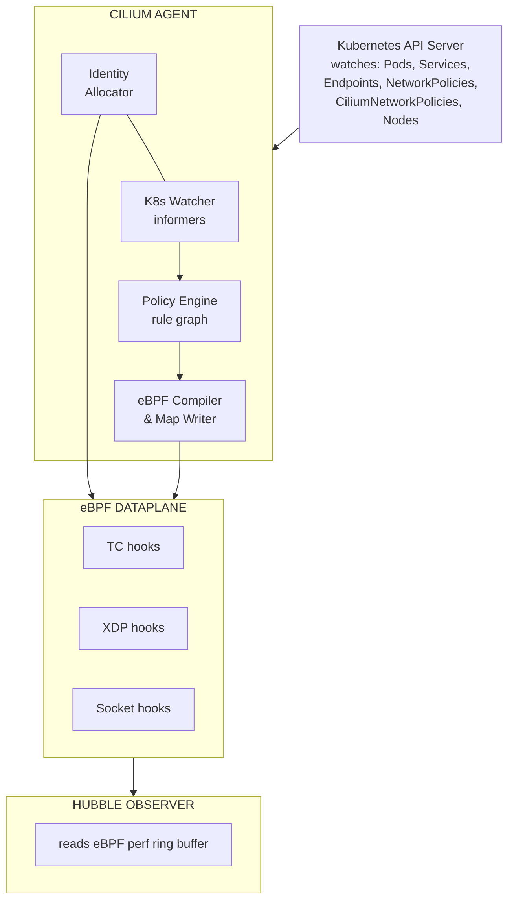

> **CCA Track** | Complexity: `[COMPLEX]` | Time: 75-90 minutes

## Prerequisites

- [Cilium Toolkit Module](/platform/toolkits/infrastructure-networking/networking/module-5.1-cilium/)
- [Hubble Toolkit Module](/platform/toolkits/observability-intelligence/observability/module-1.7-hubble/) -- Hubble CLI, flow observation
- Kubernetes networking basics (Services, Pods, DNS)
- Comfort with `kubectl` and YAML
- A running Kubernetes environment, ideally version v1.35 or higher (current stable releases recommended).

---

## What You'll Be Able to Do

After completing this module, you will be able to:

1. **Analyze** Cilium's eBPF datapath architecture, evaluating how endpoint programs and BPF maps enforce identity-based policies.
2. **Implement** advanced network policies including L7 HTTP filtering, DNS-aware egress, and Gateway API rules for robust traffic management.
3. **Design** a multi-cluster service mesh architecture using Cluster Mesh and BGP peering to optimize cross-cluster failover and external routing.
4. **Diagnose** connectivity issues and misconfigured policies using Hubble observability and the Cilium CLI.

---

## Why This Module Matters

A global e-commerce giant lost millions during a major holiday sale when a misconfigured ingress controller caused cascading network timeouts across their primary payment gateway. They were migrating from an aging Kubernetes cluster (v1.33) to a new one (v1.35). They couldn't afford downtime -- the payment API processed immense transaction volume every minute. When the cluster operator component temporarily restarted during an upgrade, junior engineers panicked, incorrectly assuming the entire network data plane had failed, leading to hasty and destructive manual interventions.

Understanding the stark difference between control plane coordination and data plane execution could have prevented the incident. A CCA-certified engineer knows that the Cilium agent on each node compiles endpoint-specific eBPF programs, and uses eBPF maps shared across programs to enforce identity-aware policy decisions without relying on constant operator availability.

That depth is what separates passing from failing. This module fills every gap between our existing content and what the CCA demands: architecture internals, policy enforcement modes, Cluster Mesh, BGP peering, and the Cilium CLI workflows you need to know cold. You will understand precisely how packets move and how to debug them when they don't.

---

## Did You Know?

- **Cilium is a CNCF Graduated project.** It was officially accepted as an Incubating project on 2021-10-13 and graduated on 2023-10-11, recognizing its robust adoption and maturity in cloud-native environments.
- **XDP acceleration bypasses the kernel network stack.** Available since Cilium 1.8, XDP load balancing accelerates NodePort and LoadBalancer services by processing packets directly at the NIC driver layer. This requires a native XDP-supported NIC driver.
- **Cilium 1.19.2 is the current stable release.** While v1.20.0-pre.0 introduces experimental features like Kubernetes Cluster Network Policy (BANP/ANP), 1.19.2 provides rock-solid stability. Note that the official compatibility matrix must be consulted to determine the exact unverified minimum supported Kubernetes version for Cilium 1.19.x, though v1.35 is strongly recommended.
- **The CCA exam structure is heavily weighted.** The exam has 8 domains: Architecture (20%), Network Policy (18%), Service Mesh (16%), Network Observability (10%), Installation and Configuration (10%), Cluster Mesh (10%), eBPF (10%), and BGP and External Networking (6%).

---

## Part 1: Cilium Architecture in Depth

The Toolkit module showed you the big picture. Now let's open each box. Cilium uses eBPF as the in-kernel data plane for L3/L4 processing (IP, TCP, UDP). It supports both overlay (VXLAN, Geneve) and native routing networking modes.

### The Cilium Agent (DaemonSet)

The agent is the workhorse. One runs on every node.



**What each sub-component does:**

| Component | Role | Why It Matters |
|-----------|------|----------------|
| K8s Watcher | Receives events from API server via informers | Detects pod creation, policy changes, service updates |
| Identity Allocator | Maps label sets to numeric identities | Enables O(1) policy lookups instead of label matching |
| Policy Engine | Builds a rule graph from all applicable policies | Determines allowed (src identity, dst identity, port, L7) tuples |
| eBPF Compiler | Generates per-endpoint eBPF programs | Tailored programs = faster enforcement, no generic rule walk |
| eBPF Maps | Shared kernel data structures (hash maps, LPM tries) | Policy decisions, connection tracking, NAT, service lookup |
| Hubble Observer | Reads the perf event ring buffer from eBPF programs | Every forwarded/dropped packet becomes a flow event |

Cilium assigns a security identity to each workload derived from Kubernetes labels; this identity drives policy decisions. 

> **Pause and predict**: If a node goes offline, what happens to the identities associated with the pods that were running on it? Think about how the operator might handle garbage collection.

### The Cilium Operator (Deployment)

The operator handles cluster-wide coordination. There is one active instance per cluster.

```text
CILIUM OPERATOR RESPONSIBILITIES
================================================================

1. IPAM (IP Address Management)
   - Allocates pod CIDR ranges to nodes
   - In "cluster-pool" mode: carves /24 blocks from a larger pool
   - In AWS ENI mode: manages ENI attachment and IP allocation

2. CRD Management
   - Ensures CiliumIdentity, CiliumEndpoint, CiliumNode CRDs exist
   - CRD management and garbage collection of stale CiliumIdentity objects

3. Cluster Mesh
   - Manages the clustermesh-apiserver deployment
   - Synchronizes identities across clusters

4. Resource Cleanup
   - Removes orphaned CiliumEndpoints when pods are deleted
   - Cleans up leaked IPs from terminated nodes
```

**Key exam point**: The operator does NOT enforce policies or program eBPF. If the operator goes down, existing networking continues to work. New pod CIDR allocations will fail, and identity garbage collection pauses (stale identities accumulate), but traffic keeps flowing. This is a common exam question.

### IPAM Modes

Cilium supports multiple IPAM strategies. The CCA expects you to know when to use each.

| IPAM Mode | How It Works | When to Use |
|-----------|-------------|-------------|
| `cluster-pool` (default) | Operator allocates /24 CIDRs from a configurable pool to each node. Agent assigns IPs from its node's pool. | Most clusters. Simple, works everywhere. |
| `kubernetes` | Delegates to the Kubernetes `--pod-cidr` allocation (node.spec.podCIDR). | When you want K8s to control CIDR allocation. |
| `multi-pool` | Multiple named pools with different CIDRs. Pods select pool via annotation. | Multi-tenant clusters needing separate IP ranges. |
| `eni` (AWS) | Allocates IPs directly from AWS ENI secondary addresses. Pods get VPC-routable IPs. | AWS EKS. No overlay needed. Native VPC routing. |
| `azure` | Allocates from Azure VNET. Similar to ENI mode for Azure. | AKS clusters. |
| `crd` | External IPAM controller manages CiliumNode CRDs. | Custom IPAM integrations. |

```bash
# Check which IPAM mode your cluster uses
cilium config view | grep ipam

# In cluster-pool mode, see the allocated ranges
kubectl get ciliumnodes -o jsonpath='{range .items[*]}{.metadata.name}: {.spec.ipam.podCIDRs}{"\n"}{end}'
```

Cilium's kube-proxy replacement requires Linux kernel >= 4.19.57, >= 5.1.16, or >= 5.2.0; kernel >= 5.3 is recommended. It can fully replace kube-proxy using eBPF, handling NodePort, LoadBalancer, and externalIPs services natively.

---

## Part 2: CiliumNetworkPolicy vs Kubernetes NetworkPolicy

Cilium ships two Cilium-specific policy CRDs: CiliumNetworkPolicy (namespace-scoped) and CiliumClusterwideNetworkPolicy (cluster-scoped).

### Feature Comparison

| Feature | K8s NetworkPolicy | CiliumNetworkPolicy |
|---------|-------------------|---------------------|
| L3/L4 filtering (IP + port) | Yes | Yes |
| Label-based pod selection | Yes | Yes (+ identity-based) |
| Namespace selection | Yes | Yes |
| **L7 HTTP filtering** (method, path, headers) | No | Yes |
| **L7 Kafka filtering** (topic, role) | No | Yes |
| **L7 DNS filtering** (FQDN) | No | Yes |
| **Entity-based rules** (host, world, dns, kube-apiserver) | No | Yes |
| **Cluster-wide scope** | No | Yes (CiliumClusterwideNetworkPolicy) |
| **CIDR-based egress with FQDN** | No | Yes (toFQDNs) |
| **Policy enforcement mode control** | No | Yes (default/always/never) |
| **Identity-aware enforcement** | No | Yes (eBPF identity lookup) |
| **Deny rules** | No (allow-only model) | Yes (explicit deny) |

Cilium enforces network policy at L3, L4, and L7, including DNS/FQDN-based egress policies (for example, allowing outbound connections only to specific domains like `api.stripe.com`). Note that 6. Hash map lookup is O(1) regardless of how many policies or endpoints exist, which makes the implementation extremely fast.

### L7 HTTP-Aware Policies

```yaml
# L7 HTTP policy: allow only specific API calls
apiVersion: cilium.io/v2
kind: CiliumNetworkPolicy
metadata:
  name: api-l7-policy
  namespace: production
spec:
  endpointSelector:
    matchLabels:
      app: api-server
  ingress:
  - fromEndpoints:
    - matchLabels:
        app: frontend
    toPorts:
    - ports:
      - port: "8080"
        protocol: TCP
      rules:
        http:
        # Allow reading products
        - method: "GET"
          path: "/api/v1/products"
        # Allow reading a specific product by ID
        - method: "GET"
          path: "/api/v1/products/[0-9]+"
        # Allow creating orders with JSON
        - method: "POST"
          path: "/api/v1/orders"
          headers:
          - 'Content-Type: application/json'
        # Everything else: DENIED
```

### Policy Enforcement Modes

```text
POLICY ENFORCEMENT MODES
================