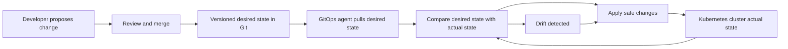
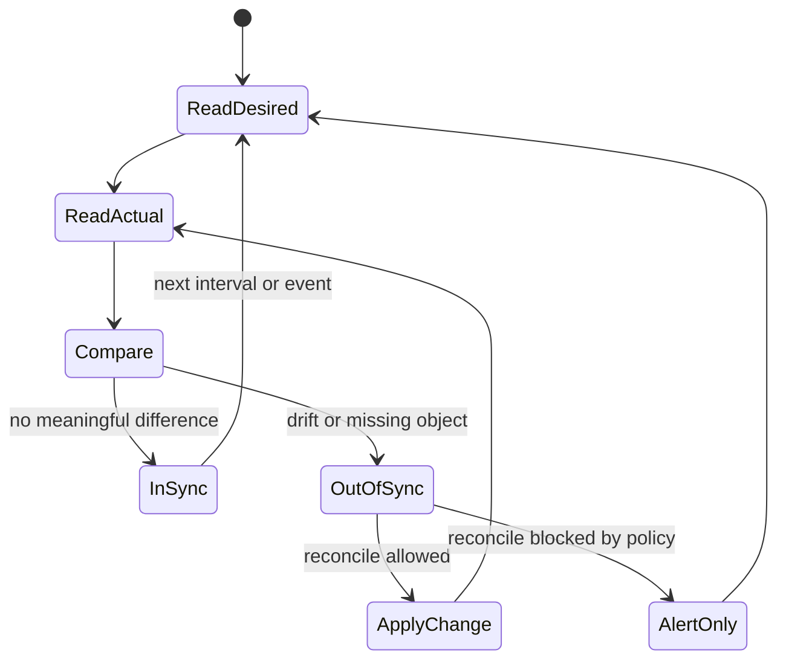

# CGOA GitOps Principles Review

> **Complexity**: `[MEDIUM]`
>
> **Time to Complete**: 45-60 minutes
>
> **Prerequisites**: Basic Git workflow, Kubernetes object concepts, and the idea of controllers reconciling desired state.

## Learning Outcomes

By the end of this module, you will be able to:

1. **Compare** GitOps with push-based CI/CD, configuration-as-code, and infrastructure-as-code in realistic delivery scenarios.
2. **Analyze** a deployment workflow and determine whether it satisfies the four OpenGitOps principles or only resembles GitOps.
3. **Debug** drift by tracing desired state, actual state, reconciliation behavior, and source-of-truth ownership.
4. **Evaluate** rollback and audit strategies using versioned, immutable desired state rather than manual cluster changes.
5. **Design** a minimal GitOps control loop for a Kubernetes application, including repository structure, agent behavior, and success checks.

## Why This Module Matters

A platform team inherited a Kubernetes cluster after a busy product launch. The application was running, but nobody could explain why production differed from staging. A release engineer had hotfixed one Deployment with `kubectl edit`, a security engineer had changed an annotation directly in the cluster, and an automated pipeline had pushed a newer manifest from a build job. Each person thought they had helped. Together, they created a system where the live environment could not be trusted, the repository could not be trusted, and rollback meant guessing which change mattered.

GitOps exists to prevent that kind of operational fog. It does not merely say "put YAML in Git." It says the desired state must be declared, stored in a versioned and immutable system, pulled automatically by software agents, and continuously reconciled against the running environment. Those four ideas form a control loop, and the control loop is the difference between a delivery habit and an operating model.

The CGOA exam tests whether you can recognize that operating model under pressure. Many answer choices sound plausible because they mention Git, Kubernetes, pipelines, or automation. Your task is to identify which scenario actually has a source of truth, which actor initiates change, whether drift is handled, and whether history supports audit and recovery. This module teaches those distinctions as decisions, not vocabulary flashcards.

## The GitOps Mental Model

GitOps starts with a simple ownership question: where is the intended state of the system defined? If the answer is "whatever is currently running," then the platform has no durable source of truth. If the answer is "whatever the last pipeline pushed," the platform may be automated, but it is not necessarily reconciling. If the answer is "a versioned declaration that an agent continuously compares with reality," then the platform is moving toward GitOps.

The best mental model is a thermostat, but with an audit trail. A thermostat does not merely send one command to heat a room once. It stores a desired temperature, observes the actual temperature, and repeatedly acts when the two differ. GitOps applies that control-loop idea to systems such as Kubernetes clusters, where desired state might be Deployments, Services, ConfigMaps, policies, or infrastructure resources managed through controllers.

The loop matters because distributed systems drift. People make emergency changes, controllers add default fields, autoscalers adjust replicas, cloud services mutate status fields, and failed deployments leave partial state behind. GitOps does not pretend change stops after a merge. It assumes change is continuous and makes reconciliation the normal path back to the declared target.



Read the diagram from left to right until the cluster exists, then notice the loop. The developer and review process create desired state. The agent pulls that state rather than receiving a push from a deployment system. The comparison step is what makes the system operationally interesting, because it can detect mismatch after the initial deployment has finished.

**Stop and think:** A pipeline builds an image, updates a Deployment manifest in Git, and exits successfully. Five minutes later, someone changes the live Deployment image with `kubectl set image`. In a GitOps system, what should eventually happen, and which part of the loop makes that outcome possible?

The answer is not "the pipeline runs again." The answer is that the GitOps agent observes the live Deployment no longer matches the desired image recorded in Git, then reconciles the object back to the declared image unless policy says otherwise. This is why GitOps is usually described as continuous reconciliation, not just automated deployment.

## Principle 1: Declarative Desired State

The first OpenGitOps principle says the system must be managed through declarative descriptions. Declarative configuration describes the intended end state, while imperative commands describe steps to perform. In Kubernetes, a Deployment manifest declares that a certain workload should exist with a certain template, selector, and replica target. Kubernetes controllers decide how to create, replace, or remove Pods to make the actual state match that declaration.

Declarative does not mean "written in YAML" by itself. YAML can contain procedural instructions, and a non-YAML format can be declarative. The exam often tests this distinction indirectly by describing a repository full of scripts. A script that says "run these commands in this order" may be valuable automation, but it is not the same as a durable declaration of system state that a controller can compare against reality.

A useful test is whether the declaration can be applied repeatedly without changing the meaning of the desired outcome. If the same manifest is reconciled again, the system should still know what state it is trying to achieve. Imperative commands often depend on timing, previous side effects, and hidden assumptions. Declarative state gives the control loop something stable to compare.

```yaml
apiVersion: apps/v1
kind: Deployment
metadata:
  name: checkout
  namespace: shop
  labels:
    app.kubernetes.io/name: checkout
spec:
  replicas: 3
  selector:
    matchLabels:
      app.kubernetes.io/name: checkout
  template:
    metadata:
      labels:
        app.kubernetes.io/name: checkout
    spec:
      containers:
        - name: checkout
          image: ghcr.io/example/checkout:1.8.2
          ports:
            - containerPort: 8080
```

This manifest does not say "create three Pods, then wait, then replace failed Pods." It says the intended workload is a Deployment named `checkout` with a replica target of three and a specific container image. Kubernetes and the GitOps agent can compare that intent with the running cluster. That comparison is what enables drift detection, health assessment, and repeatable recovery.

A senior-level nuance is that not every field in the live object should be treated as desired state. Kubernetes adds status fields, managed fields, default values, resource versions, and observed generation data. GitOps tools must compare the parts of actual state that matter while ignoring fields owned by the API server or other controllers. Otherwise, reconciliation becomes noisy and may fight the platform.

## Principle 2: Versioned And Immutable Source Of Truth

The second principle says desired state must be stored in a versioned and immutable source of truth. Git is the common implementation because commits provide history, authorship, review context, diffs, and rollback points. The important property is not the brand name. The important property is that changes are recorded as durable versions that can be reviewed, compared, and restored.

Immutable does not mean the repository never changes. It means prior versions are preserved rather than overwritten casually. A force-pushed branch with no protected history weakens the model because the organization loses the ability to reconstruct what was intended at a particular time. A protected main branch, signed commits, required reviews, and tagged releases strengthen the source-of-truth claim because they make the path from intent to production auditable.

Rollback is where this principle becomes practical. In a push-based system, rollback may depend on remembering which script ran, which artifact was deployed, and which manual fixes happened afterward. In a GitOps system, rollback should usually mean reverting or selecting a previous known-good desired state and letting the agent reconcile toward it. That does not remove the need for application-level rollback safety, but it gives the infrastructure workflow a reliable anchor.

```bash
mkdir -p /tmp/gitops-review/shop
cd /tmp/gitops-review
git init
cat > shop/deployment.yaml <<'YAML'
apiVersion: apps/v1
kind: Deployment
metadata:
  name: checkout
  namespace: shop
spec:
  replicas: 3
  selector:
    matchLabels:
      app: checkout
  template:
    metadata:
      labels:
        app: checkout
    spec:
      containers:
        - name: checkout
          image: ghcr.io/example/checkout:1.8.2
YAML
git add shop/deployment.yaml
git commit -m "Declare checkout deployment"
git log --oneline
```

This command block creates a tiny local source of truth. It is intentionally small because the concept is easier to inspect when there is only one object. The commit is now a recoverable version of desired state. A GitOps agent could be configured to watch this repository path and reconcile the cluster toward the manifest.

**Stop and think:** If a team stores manifests in Git but allows production fixes through direct cluster edits, what is the real source of truth during an incident? How would the answer change if every emergency fix had to be converted into a reviewed commit before it became durable?

This distinction is operationally serious. Emergency cluster access may still exist for break-glass situations, but GitOps teams treat it as an exception that must be reconciled back into declared state or intentionally overwritten by declared state. If manual changes silently become the new normal, Git stops being the source of truth and becomes historical decoration.

## Principle 3: Pulled Automatically By Software Agents

The third principle says software agents automatically pull desired state. This is one of the clearest differences between GitOps and many traditional deployment pipelines. In a push model, an external system reaches into the target environment and applies changes. In a pull model, an agent already trusted by the environment fetches the desired state and performs reconciliation from inside the security boundary.

The security implication is important. A push pipeline often needs credentials powerful enough to modify production from outside production. A pull-based GitOps agent can be granted narrowly scoped permissions inside the cluster and read-only access to the repository. That design reduces the number of systems that can directly mutate production, which simplifies credential management and blast-radius analysis.

Automatic pull also changes failure behavior. If the pipeline is unavailable after a commit merges, a pull agent can still notice the repository changed when it polls or receives a notification. If the cluster temporarily loses network access to the repository, the agent can retry without a human rerunning a deployment job. The delivery system becomes a controller that keeps trying to converge, not a one-shot command runner.

| Model | Change initiator | Typical credentials | Drift behavior | Exam interpretation |
|---|---|---|---|---|
| Push-based CD | External pipeline pushes into cluster | Pipeline needs write access to target | Often ignored after job finishes | Automated delivery, not necessarily GitOps |
| Pull-based GitOps | In-cluster or environment agent pulls from source | Agent has scoped write access, repo access can be read-only | Detected during reconciliation | Matches OpenGitOps pull principle |
| Manual operations | Human runs commands directly | Human has live environment access | Depends on manual follow-up | Not GitOps by itself |
| Scripted deployment | Script applies ordered steps | Script runner needs target access | Usually not continuous | Automation, but not full control loop |

The exam may describe a tool such as Argo CD or Flux, but tool names are less important than behavior. A badly configured tool can violate the spirit of GitOps, and a custom controller can satisfy the principles if it genuinely pulls, compares, and reconciles declared state from a versioned source. Train yourself to inspect the workflow instead of recognizing product names.

## Principle 4: Continuously Reconciled Actual State

The fourth principle says software agents continuously reconcile actual state toward desired state. This principle completes the loop. Without it, GitOps collapses into "deployment from Git," which may still be useful but does not provide the same drift correction or self-healing behavior. Continuous reconciliation means the system keeps observing after the initial apply.

Actual state is the current condition of the target environment. In Kubernetes, actual state includes resources returned by the API server and the status reported by controllers. Desired state is the intended configuration stored in the source of truth. Drift is the meaningful difference between those two. Reconciliation is the process of acting to reduce or eliminate that difference.

Not all differences are drift. A HorizontalPodAutoscaler may change replica count because dynamic scaling is intended behavior. A controller may add status fields that should never be committed to Git. A mutating admission webhook may inject a sidecar by policy. A mature GitOps setup defines which fields are owned by Git, which fields are owned by other controllers, and which differences should trigger alerts instead of automatic overwrite.



This state diagram shows why GitOps is more than a deployment event. The system keeps returning to `ReadDesired` and `ReadActual`. It can become `InSync`, but it does not stop observing. If reconciliation is blocked by policy, the correct behavior may be to alert rather than force a change. That is still GitOps thinking because the system made a decision based on desired state, actual state, and ownership rules.

A senior operator also asks how reconciliation handles failures. If applying a change fails because a namespace is missing, a policy denies the object, or an image cannot be pulled, the agent should expose status. GitOps does not mean every commit magically succeeds. It means the failure is attached to a declared target and can be investigated through a consistent loop.

## Worked Example: Is This Workflow GitOps?

Consider a team that manages a `checkout` service. Developers open pull requests against a repository containing Kubernetes manifests. A CI job validates YAML, builds a container image, and updates the image tag in a manifest. After merge, an in-cluster agent pulls the repository every minute, compares the manifests with live objects, applies changes, and reports whether the application is synced and healthy.

This workflow satisfies the core GitOps model. Desired state is declarative because the Deployment manifest describes the target workload. The source of truth is versioned because every change lands as a commit. The agent pulls automatically because the cluster-side controller fetches the repository. Reconciliation is continuous because the agent keeps comparing and applying after the merge.

Now change one detail. Suppose the CI job uses a production kubeconfig and runs `kubectl apply -f manifests/` from the build runner after every merge. The repository still contains declarative YAML, and the workflow still uses Git, but the target environment is modified by an external push. If nothing keeps comparing desired and actual state afterward, manual drift can remain forever. That is automated deployment from Git, not full GitOps.

Now change a different detail. Suppose an in-cluster agent pulls from Git but the team regularly patches production with `kubectl edit` and never commits those changes back. The loop may overwrite the manual changes, or the team may configure the agent to ignore them. Either way, the team must decide who owns the field. GitOps works only when ownership is explicit enough that operators can predict whether drift will be corrected, accepted, or escalated.

| Scenario | Declarative | Versioned and immutable | Pulled automatically | Continuously reconciled | Verdict |
|---|---|---|---|---|---|
| Manifests in Git, pipeline pushes `kubectl apply`, no drift checks | Yes | Usually | No | No | CI/CD from Git, not full GitOps |
| Agent pulls reviewed manifests and reports sync status | Yes | Yes | Yes | Yes | GitOps |
| Terraform state in object storage, manual console changes allowed permanently | Partly | Depends | No | Maybe | IaC with weak GitOps alignment |
| Scripts in Git run ordered shell commands on production | No | Yes | No | No | Versioned automation |
| Agent pulls desired state, but direct edits are break-glass and reverted or committed | Yes | Yes | Yes | Yes | GitOps with operational exception handling |

The point of this worked example is that GitOps is evaluated as a system. One good property does not compensate for missing reconciliation. One familiar tool does not compensate for unclear ownership. When you see an exam scenario, mark the four principles mentally and ask which one is absent.

## GitOps Compared With Adjacent Practices

GitOps overlaps with infrastructure-as-code, configuration-as-code, DevOps, DevSecOps, and CI/CD. The overlap is real, so memorizing a rigid boundary will not help. A stronger approach is to identify the primary promise of each practice and then decide whether the GitOps control loop is present.

Infrastructure-as-code focuses on defining infrastructure through machine-readable files rather than manual console operations. Configuration-as-code focuses on managing application or system configuration as versioned files. CI/CD focuses on building, testing, packaging, and delivering changes through automated stages. DevOps focuses on collaboration and fast feedback between development and operations. DevSecOps integrates security controls into that delivery lifecycle.

GitOps can use all of those practices, but it adds a specific operating constraint: the desired state in a versioned store is pulled and reconciled by agents. A CI pipeline may produce an image and update a manifest, but the GitOps agent should own convergence in the target environment. A security scanner may block a pull request, but the GitOps loop still decides whether the live state matches approved intent.

| Practice | Primary question it answers | GitOps relationship | Common exam trap |
|---|---|---|---|
| Infrastructure-as-code | How is infrastructure described and provisioned? | Often provides declarative inputs for GitOps | Assuming any IaC repository is GitOps |
| Configuration-as-code | How is configuration stored and reviewed? | Can supply desired application state | Assuming versioned config alone is enough |
| CI/CD | How are changes built, tested, and released? | CI can update desired state; GitOps reconciles it | Treating push deployment as pull reconciliation |
| DevOps | How do teams collaborate to deliver reliably? | GitOps can implement DevOps practices | Treating culture and control loop as identical |
| DevSecOps | How are security checks integrated into delivery? | GitOps can enforce approved desired state | Assuming security scanning creates reconciliation |

There is also a subtle difference between deployment and operations. A deployment asks, "How does this version get released?" Operations asks, "How does the environment remain correct afterward?" GitOps answers both, but its distinctive strength is the second question. The reconciliation loop keeps operating after the deployment event has passed.

## Reading Drift Like An Operator

Drift is not just "something changed." Drift is a meaningful mismatch between desired state and actual state for a field or object that Git is supposed to own. That qualification matters because Kubernetes clusters are full of expected change. Pods are rescheduled, status conditions update, controllers add defaults, and autoscalers adjust counts. Treating every difference as drift creates noise and weakens trust in the tool.

When debugging drift, start with ownership before action. Ask whether Git owns the object, whether another controller owns the field, and whether a human made a direct change. Then inspect whether the GitOps agent is detecting the difference, whether it has permission to fix it, and whether policy prevents automatic reconciliation. This sequence keeps you from treating every out-of-sync status as a simple apply failure.

A compact operator workflow looks like this. First, identify the desired source path and commit. Second, inspect the live object and compare fields that should be owned by Git. Third, check the agent status for sync, health, permission, and policy errors. Fourth, decide whether the fix belongs in Git, in cluster permissions, in admission policy, or in the application itself. Senior practitioners avoid "just click sync" until they know which layer is wrong.

```bash
mkdir -p /tmp/gitops-drift-demo
cd /tmp/gitops-drift-demo
cat > desired.yaml <<'YAML'
apiVersion: apps/v1
kind: Deployment
metadata:
  name: checkout
  namespace: shop
spec:
  replicas: 3
  template:
    spec:
      containers:
        - name: checkout
          image: ghcr.io/example/checkout:1.8.2
YAML
cat > actual.yaml <<'YAML'
apiVersion: apps/v1
kind: Deployment
metadata:
  name: checkout
  namespace: shop
spec:
  replicas: 1
  template:
    spec:
      containers:
        - name: checkout
          image: ghcr.io/example/checkout:debug
YAML
diff -u desired.yaml actual.yaml || true
```

This local demonstration uses `diff` instead of a cluster so you can focus on reasoning. The actual state differs in both replica count and image. If Git owns both fields, a GitOps agent should attempt to restore three replicas and image `1.8.2`. If an HPA owns replicas but Git owns image, then only the image difference is drift from the GitOps perspective.

**Stop and think:** Your team sees an application marked `OutOfSync` because live replicas are five while Git says three. The service is under heavy load, and an HPA is configured. Before changing Git or forcing sync, what ownership question should you answer?

The ownership question is whether Git or the HPA owns `spec.replicas`. If the HPA intentionally controls replica count, the GitOps configuration may need to ignore that field or omit it from the desired manifest depending on the tool and pattern. If no autoscaler owns it, then the difference may be real drift caused by a manual edit or an unapproved process.

## Designing A Minimal GitOps Control Loop

A minimal GitOps design has five parts: a source of truth, a declaration format, an agent, target permissions, and feedback. The source of truth stores desired state. The declaration format makes intent comparable. The agent pulls and reconciles. The permissions allow only the changes the agent should make. The feedback tells humans whether the system is synced, healthy, blocked, or drifting.

Start small when designing the loop. Use one repository path, one namespace, and one application. Protect the main branch, require review, and make the agent read that branch. Grant the agent permissions only in the namespace it manages. Add validation before merge so broken manifests do not become desired state. Then expand to multiple environments after the team can explain how a single commit reaches a single cluster.

A common repository structure separates application source from environment desired state. The application repository builds images and runs tests. The environment repository records which image and configuration should run in each environment. Some teams use one repository with separate directories; others use multiple repositories for clearer ownership. The exam will usually care less about the exact layout and more about whether the source of truth is versioned and reconciled.

```text
gitops-repo/
├── apps/
│   └── checkout/
│       ├── base/
│       │   ├── deployment.yaml
│       │   └── service.yaml
│       └── overlays/
│           ├── staging/
│           │   └── kustomization.yaml
│           └── production/
│               └── kustomization.yaml
└── policies/
    └── namespace-rules.yaml
```

This directory tree shows a typical desired-state repository. The `base` directory carries shared application declarations. The overlays represent environment-specific choices such as replica counts, resource limits, or image tags. The policies directory reminds you that GitOps can manage more than workloads, but ownership must remain clear.

In Kubernetes examples, many learners use `kubectl` often enough to create an alias. In your own shell, you may run `alias k=kubectl` after you understand that `k` is only a shortcut for the full `kubectl` command. In written production runbooks, prefer clarity unless the team has standardized the alias. In exam preparation, aliases save time, but the underlying operation matters more than the abbreviation.

## Exam Reasoning Patterns

For CGOA multiple-choice questions, read the scenario as a control-loop audit. Do not start by asking whether the tool is popular or whether Git appears somewhere. Ask what is declared, where it is versioned, who pulls it, and whether reconciliation continues. If one of those answers is missing, the scenario is probably testing a near miss.

The fastest way to eliminate wrong choices is to find push language. Phrases such as "the CI server connects to production and applies the manifest" usually indicate push-based delivery. That may be secure in some organizations, but it does not satisfy the pull principle by itself. Phrases such as "the controller detects that the cluster differs from Git and applies the approved manifest" point toward GitOps.

Also watch for answers that reduce GitOps to rollback or audit alone. Version history is necessary, but history without an agent is not the control loop. Similarly, automation is necessary in practice, but automation without declared desired state is just a faster way to run commands. The exam expects you to combine the principles rather than celebrate any single one.

A strong answer usually connects mechanism and outcome. For example, "The agent pulls the desired state from a versioned repository and continuously reconciles drift" is stronger than "The team uses Git." The first answer explains why the workflow behaves like GitOps. The second only names a tool that might appear in many non-GitOps workflows.

## Did You Know?

- **OpenGitOps separates principle from product**: The principles describe properties of a system, so an exam scenario can be GitOps-aligned even when it does not name Argo CD, Flux, or any specific vendor tool.

- **Pull-based does not mean passive**: A pull agent can still respond quickly through webhooks, polling, or event notifications, but the trusted environment-side agent remains responsible for fetching and reconciling desired state.

- **Rollback is a reconciliation event**: In a mature GitOps workflow, rollback usually changes desired state to a previous known-good version, then lets the control loop converge the environment instead of relying on manual repair commands.

- **Drift can be intentional or accidental**: The hard practitioner skill is deciding whether a difference belongs to Git, another controller, a policy exception, or a human incident response that must be committed or reverted.

## Common Mistakes

| Mistake | Why it causes trouble | Better approach |
|---|---|---|
| Treating "YAML in Git" as the full definition of GitOps | It ignores pull behavior and continuous reconciliation, which are central to the model | Test every scenario against all four principles before calling it GitOps |
| Letting CI push directly into production while calling the workflow pull-based | The deployment system becomes the actor with production write access, so the pull principle is absent | Let CI update desired state, then let the GitOps agent reconcile the target |
| Assuming every live difference is harmful drift | Kubernetes controllers and autoscalers intentionally change fields that Git may not own | Define field ownership and ignore expected controller-managed differences |
| Making manual hotfixes permanent without committing them | The live cluster becomes the real source of truth, and Git history stops explaining production | Convert emergency changes into reviewed commits or allow the agent to revert them |
| Relying on rollback scripts instead of versioned desired state | Scripts may not represent the exact previous production intent and can hide side effects | Revert or select a known-good commit, then observe reconciliation and health |
| Giving the GitOps agent broad cluster-admin permissions by default | Excessive permissions increase blast radius if the agent or repository is compromised | Scope permissions to managed namespaces and required resource types |
| Ignoring failed reconciliation status after merge | A merged commit is not the same as a healthy applied state in the cluster | Monitor sync status, health status, events, and policy errors after changes |
| Memorizing tool names instead of analyzing workflow behavior | Exam questions can describe GitOps properties without naming tools, or name tools in weak designs | Identify desired state, source of truth, pull actor, and reconciliation loop |

## Quiz

1. **Your team stores Kubernetes manifests in Git, and a Jenkins job runs `kubectl apply` against production after every merge. The cluster is never checked again unless a human opens the dashboard. Which GitOps principle is missing, and why does that matter during drift?**

   <details>
   <summary>Answer</summary>

   The workflow is missing pull-based automatic reconciliation and continuous drift handling. The manifests may be declarative and versioned, but the external pipeline pushes changes into production and then stops. If someone changes a live object later, no environment-side agent keeps comparing actual state with the Git source of truth, so drift can remain invisible or unresolved.
   </details>

2. **A GitOps agent reports that a Deployment is out of sync because Git declares three replicas but the live object has six. The application uses an HPA during traffic spikes. What should you check before forcing the agent to sync, and what decision might follow?**

   <details>
   <summary>Answer</summary>

   Check whether the HPA intentionally owns the replica count. If the autoscaler owns that field, the difference may be expected dynamic behavior rather than harmful drift. The better fix may be to configure the GitOps tool or manifest pattern so it does not fight the HPA over replicas, while still reconciling fields Git should own, such as image, labels, or resource requests.
   </details>

3. **A platform team says rollback is easy because they can rerun an old deployment script from a shared folder. The script is not tied to a reviewed commit, and several manual fixes were made after it last ran. How would you evaluate this rollback approach from a GitOps perspective?**

   <details>
   <summary>Answer</summary>

   The approach is weak because it does not reliably restore a versioned desired state. GitOps rollback should be anchored in immutable history, such as reverting to or selecting a known-good commit that represents intended configuration. A script may be useful automation, but without a durable source-of-truth version it is hard to audit, compare, or reconcile safely.
   </details>

4. **A security team wants to reduce production credentials in CI. Two designs are proposed: give the CI system cluster-admin access so it can deploy faster, or let CI publish image tags to Git while an in-cluster agent applies approved desired state. Which design better supports GitOps, and why?**

   <details>
   <summary>Answer</summary>

   The second design better supports GitOps. CI can still build and test artifacts, but the desired runtime state is recorded in Git and pulled by an agent inside the target environment. This reduces external production write credentials and keeps reconciliation attached to a versioned source of truth.
   </details>

5. **A developer commits a manifest with an invalid namespace name. The GitOps agent pulls the commit but cannot apply the object. Is the system still following GitOps principles, and what should the team inspect next?**

   <details>
   <summary>Answer</summary>

   The system can still be following GitOps principles even though reconciliation failed. GitOps does not guarantee every desired state is valid; it provides a loop that reports convergence or failure. The team should inspect agent sync status, error messages, validation gates, admission policy responses, and the commit that introduced the invalid declaration.
   </details>

6. **During an incident, an operator patches a live ConfigMap to restore service. Ten minutes later, the GitOps agent reverts the patch and the outage returns. What process failure does this reveal, and how should the team handle future break-glass changes?**

   <details>
   <summary>Answer</summary>

   The process failure is unclear handling of emergency changes versus Git-owned desired state. The agent behaved according to the source of truth, but the team needed either to commit the emergency fix promptly or pause reconciliation through an explicit incident procedure. Future break-glass changes should be time-bounded, documented, and converted into reviewed desired state or intentionally reverted.
   </details>

7. **An exam scenario says a company uses Git, pull requests, automated tests, and artifact builds, but production is updated by a release manager clicking a button in a deployment portal. The portal does not detect later manual changes. Which answer best classifies the workflow?**

   <details>
   <summary>Answer</summary>

   It is a strong CI/CD workflow with version control and review, but it is not full GitOps. The missing pieces are automatic pull by a software agent and continuous reconciliation of actual state against desired state. The release manager's button may start a controlled deployment, but the system does not operate as a GitOps control loop afterward.
   </details>

## Hands-On Exercise

**Task**: Analyze and repair a miniature GitOps workflow on your local machine. You will create a desired-state repository, simulate drift, classify the workflow against the four principles, and write the change that would restore Git as the source of truth. This exercise does not require a Kubernetes cluster, because the learning goal is to practice GitOps reasoning before adding tool-specific commands.

**Step 1: Create a local desired-state repository.**

```bash
rm -rf /tmp/cgoa-gitops-review
mkdir -p /tmp/cgoa-gitops-review/environments/prod
cd /tmp/cgoa-gitops-review
git init
cat > environments/prod/deployment.yaml <<'YAML'
apiVersion: apps/v1
kind: Deployment
metadata:
  name: checkout
  namespace: shop
  labels:
    app.kubernetes.io/name: checkout
spec:
  replicas: 3
  selector:
    matchLabels:
      app.kubernetes.io/name: checkout
  template:
    metadata:
      labels:
        app.kubernetes.io/name: checkout
    spec:
      containers:
        - name: checkout
          image: ghcr.io/example/checkout:1.8.2
          ports:
            - containerPort: 8080
YAML
git add environments/prod/deployment.yaml
git commit -m "Declare production checkout state"
```

**Step 2: Simulate actual cluster state that has drifted from Git.**

```bash
cp environments/prod/deployment.yaml actual-live.yaml
sed -i.bak 's/replicas: 3/replicas: 1/' actual-live.yaml
sed -i.bak 's/checkout:1.8.2/checkout:debug/' actual-live.yaml
rm -f actual-live.yaml.bak
diff -u environments/prod/deployment.yaml actual-live.yaml || true
```

**Step 3: Classify the drift.**

Write a short note in `analysis.md` that answers these questions in full sentences:

- Which fields differ between desired state and actual state?
- Which differences should Git own in this scenario?
- Would a GitOps agent reconcile this automatically, alert only, or ignore it?
- Which of the four OpenGitOps principles are visible in this miniature workflow?
- What additional component would be required to make this more than a repository exercise?

```bash
cat > analysis.md <<'EOF'
Desired state and actual state differ in replica count and container image.
In this scenario, Git owns both fields because no autoscaler or separate image automation controller has been defined.
A GitOps agent should reconcile the live object back to three replicas and image ghcr.io/example/checkout:1.8.2, or report an error if policy blocks the change.
The repository demonstrates declarative desired state and versioned history, but it does not yet demonstrate automatic pull or continuous reconciliation.
A real GitOps agent with target permissions and status reporting would be required to complete the control loop.
EOF
```

**Step 4: Repair the workflow through desired state rather than live edits.**

Assume the debug image was an emergency fix that should become the approved production state, but the replica reduction was accidental. Update Git so the desired image is now the debug image while keeping three replicas. This models converting a break-glass change into reviewed desired state instead of letting the live cluster remain the hidden source of truth.

```bash
sed -i.bak 's/checkout:1.8.2/checkout:debug/' environments/prod/deployment.yaml
rm -f environments/prod/deployment.yaml.bak
git diff
git add environments/prod/deployment.yaml analysis.md
git commit -m "Record approved emergency checkout image"
```

**Step 5: Verify that your reasoning matches the control loop.**

```bash
git log --oneline --decorate -n 3
grep -n "image:" environments/prod/deployment.yaml
grep -n "replicas:" environments/prod/deployment.yaml
grep -n "GitOps agent" analysis.md
```

**Success Criteria**:

- [ ] The repository contains a committed declarative Deployment manifest under `environments/prod/`.
- [ ] `actual-live.yaml` shows simulated drift from the original desired state.
- [ ] `analysis.md` identifies desired state, actual state, drift, reconciliation behavior, and the missing agent.
- [ ] The final desired manifest keeps `replicas: 3` while changing the image only through Git history.
- [ ] `git log --oneline` shows at least two commits, proving rollback and audit have a versioned anchor.
- [ ] You can explain why this exercise demonstrates only two principles until an automatic pull reconciler is added.

## Next Module

Continue with [CGOA Patterns and Tooling Review](./module-1.3-patterns-and-tooling-review/).
