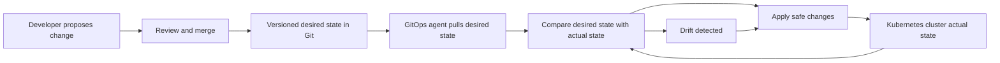
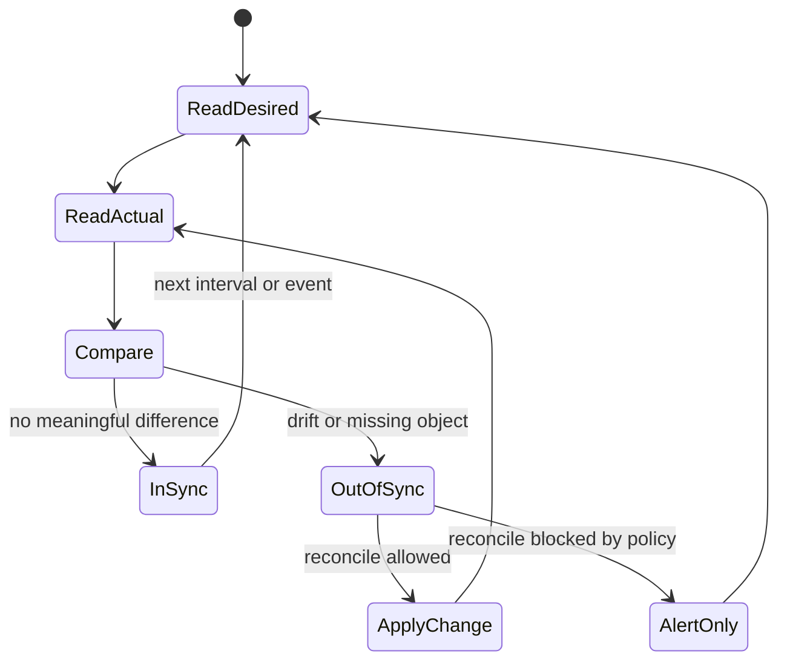

# CGOA GitOps Principles Review

> **Complexity**: `[MEDIUM]`
>
> **Time to Complete**: 45-60 minutes
>
> **Prerequisites**: Basic Git workflow, Kubernetes object concepts, and the idea of controllers reconciling desired state.

## Learning Outcomes

By the end of this module, you will be able to:

1. **Compare** GitOps with push-based CI/CD, configuration-as-code, and infrastructure-as-code in realistic delivery scenarios.
2. **Analyze** a deployment workflow and determine whether it satisfies the four OpenGitOps principles or only resembles GitOps.
3. **Debug** drift by tracing desired state, actual state, reconciliation behavior, and source-of-truth ownership.
4. **Evaluate** rollback and audit strategies using versioned, immutable desired state rather than manual cluster changes.
5. **Design** a minimal GitOps control loop for a Kubernetes application, including repository structure, agent behavior, and success checks.

## Why This Module Matters

A platform team inherited a Kubernetes cluster after a crowded product launch, and the first serious incident exposed a delivery system that nobody could explain. The application was running, but production differed from staging in several small ways: a release engineer had hotfixed one Deployment with `kubectl edit`, a security engineer had changed an annotation directly in the cluster, and an automated pipeline had pushed a newer manifest from a build job after the hotfix. Each person thought they had reduced risk in the moment. Together, they created a system where the live environment could not be trusted, the repository could not be trusted, and rollback meant guessing which change mattered while customers watched checkout errors climb.

GitOps exists to prevent that operational fog. It does not merely say "put YAML in Git" or "trigger deployments from pull requests." It says the desired state must be declared, stored in a versioned and immutable system, pulled automatically by software agents, and continuously reconciled against the running environment. Those four ideas form a control loop, and the control loop is the difference between a delivery habit and an operating model. When the loop is healthy, the team can explain what should exist, who approved it, which actor is allowed to apply it, and what happens when the cluster stops matching the approved intent.

The CGOA exam tests whether you can recognize that operating model under pressure. Many answer choices sound plausible because they mention Git, Kubernetes, pipelines, automation, infrastructure-as-code, or security scans. Your task is to identify which scenario actually has a source of truth, which actor initiates change, whether drift is handled after the first deployment, and whether history supports audit and recovery. This module treats those distinctions as operational decisions rather than vocabulary flashcards, because a real production incident does not ask you to recite a definition before it asks you to choose the next action.

## The GitOps Mental Model

GitOps starts with a simple ownership question: where is the intended state of the system defined? If the answer is "whatever is currently running," then the platform has no durable source of truth because live state changes every time a person, controller, or emergency script touches it. If the answer is "whatever the last pipeline pushed," the platform may be automated, but it is not necessarily reconciling after that pipeline exits. If the answer is "a versioned declaration that an agent continuously compares with reality," then the platform is moving toward GitOps because the delivery system has a stable target and a repeatable way to correct drift.

The best mental model is a thermostat with an audit trail. A thermostat does not merely send one command to heat a room once; it stores a desired temperature, observes the actual temperature, and repeatedly acts when the two differ. GitOps applies that control-loop idea to systems such as Kubernetes clusters, where desired state might include Deployments, Services, ConfigMaps, NetworkPolicies, admission policies, or infrastructure resources managed through Kubernetes-native controllers. The repository is the place where the target is written down, and the agent is the mechanism that keeps looking at both the target and the room.

The loop matters because distributed systems drift even when every team member is careful. People make emergency changes, Kubernetes controllers add default fields, autoscalers adjust replicas, cloud services mutate status fields, admission webhooks inject configuration, and failed deployments can leave partial state behind. GitOps does not pretend that change stops after a merge. It assumes change is continuous, then makes reconciliation the normal path back to the declared target while still giving operators enough status to notice when reconciliation should be blocked or investigated.



Read the diagram from left to right until the cluster exists, then notice the loop. The developer and review process create desired state, but they do not directly become the long-running control mechanism. The agent pulls that state rather than receiving a privileged push from an external deployment system. The comparison step is what makes the system operationally interesting, because it can detect mismatch after the initial deployment has finished and can keep reporting whether the target environment is synced, healthy, blocked, or drifting.

Pause and predict: a pipeline builds an image, updates a Deployment manifest in Git, and exits successfully. Five minutes later, someone changes the live Deployment image with `kubectl set image`. In a GitOps system, what should eventually happen, and which part of the loop makes that outcome possible? The answer is not "the pipeline runs again." The answer is that the GitOps agent observes the live Deployment no longer matches the desired image recorded in Git, then reconciles the object back to the declared image unless policy says otherwise. This is why GitOps is usually described as continuous reconciliation, not just automated deployment.

For CGOA questions, treat every scenario as a control-loop audit. Identify desired state, actual state, the source of truth, the actor that pulls or pushes changes, and the behavior after drift appears. If you cannot locate one of those pieces, you have found the weak point in the scenario. Tool names are useful clues, but they are never enough by themselves because a familiar tool can be configured in a way that weakens the model.

For command examples, this module uses `k` as the standard Kubernetes shorthand after introducing the shell alias `alias k=kubectl`. The alias is only a typing shortcut for the full `kubectl` command. It does not change the GitOps model, and it should not make a human shell session the normal deployment path.

## Principle 1: Declarative Desired State

The first OpenGitOps principle says the system must be managed through declarative descriptions. Declarative configuration describes the intended end state, while imperative commands describe steps to perform. In Kubernetes 1.35 and later, a Deployment manifest declares that a certain workload should exist with a certain template, selector, and replica target. Kubernetes controllers decide how to create, replace, or remove Pods to make the actual state match that declaration, which is why the same manifest remains meaningful across repeated reconciliations.

Declarative does not mean "written in YAML" by itself. YAML can contain procedural instructions, and a non-YAML format can be declarative if it describes desired outcome rather than ordered steps. The exam often tests this distinction indirectly by describing a repository full of scripts that run `k apply`, `k patch`, and `k rollout restart` in sequence. Those scripts may be valuable automation, but they are not the same as a durable declaration of system state that a controller can compare against reality without replaying a hidden story of previous side effects.

A useful test is whether the declaration can be applied repeatedly without changing the meaning of the desired outcome. If the same manifest is reconciled again, the system should still know what state it is trying to achieve. Imperative commands often depend on timing, previous side effects, environment variables, and hidden assumptions about what already exists. Declarative state gives the control loop something stable to compare, which is why Kubernetes resources, policy objects, and infrastructure custom resources fit naturally into GitOps workflows.

```yaml
apiVersion: apps/v1
kind: Deployment
metadata:
  name: checkout
  namespace: shop
  labels:
    app.kubernetes.io/name: checkout
spec:
  replicas: 3
  selector:
    matchLabels:
      app.kubernetes.io/name: checkout
  template:
    metadata:
      labels:
        app.kubernetes.io/name: checkout
    spec:
      containers:
        - name: checkout
          image: ghcr.io/example/checkout:1.8.2
          ports:
            - containerPort: 8080
```

This manifest does not say "create three Pods, then wait, then replace failed Pods." It says the intended workload is a Deployment named `checkout` with a replica target of three and a specific container image. Kubernetes and the GitOps agent can compare that intent with the running cluster. That comparison enables drift detection, health assessment, and repeatable recovery because the desired state remains visible even when the cluster has temporarily moved away from it.

A senior-level nuance is that not every field in the live object should be treated as desired state. Kubernetes adds status fields, managed fields, default values, resource versions, and observed generation data. Other controllers may own fields that Git should not fight, such as replica counts controlled by a HorizontalPodAutoscaler or sidecars inserted by policy. GitOps tools must compare the parts of actual state that matter while ignoring fields owned by the API server or other controllers; otherwise, reconciliation becomes noisy and operators stop trusting the signal.

Before running this mentally, what output do you expect if a live Deployment has the right image but a different status condition? A healthy GitOps comparison should usually ignore status because status reports observed reality, not desired intent. If the tool treats every status update as drift, the team will see constant false alarms, and the practical lesson is that declarative ownership is about meaningful fields, not raw text equality between two YAML documents.

## Principle 2: Versioned And Immutable Source Of Truth

The second principle says desired state must be stored in a versioned and immutable source of truth. Git is the common implementation because commits provide history, authorship, review context, diffs, and rollback points. The important property is not the brand name. The important property is that changes are recorded as durable versions that can be reviewed, compared, signed, protected, and restored without relying on memory or a dashboard screenshot.

Immutable does not mean the repository never changes. It means prior versions are preserved rather than overwritten casually. A force-pushed branch with no protected history weakens the model because the organization loses the ability to reconstruct what was intended at a particular time. A protected main branch, required reviews, signed commits, release tags, and clear environment promotion rules strengthen the source-of-truth claim because they make the path from intent to production auditable.

Rollback is where this principle becomes practical. In a push-based system, rollback may depend on remembering which script ran, which artifact was deployed, and which manual fixes happened afterward. In a GitOps system, rollback should usually mean reverting or selecting a previous known-good desired state and letting the agent reconcile toward it. That does not remove the need for application-level rollback safety, database migration planning, or careful traffic management, but it gives the infrastructure workflow a reliable anchor.

```bash
mkdir -p /tmp/gitops-review/shop
cd /tmp/gitops-review
git init
cat > shop/deployment.yaml <<'YAML'
apiVersion: apps/v1
kind: Deployment
metadata:
  name: checkout
  namespace: shop
spec:
  replicas: 3
  selector:
    matchLabels:
      app: checkout
  template:
    metadata:
      labels:
        app: checkout
    spec:
      containers:
        - name: checkout
          image: ghcr.io/example/checkout:1.8.2
YAML
git add shop/deployment.yaml
git commit -m "Declare checkout deployment"
git log --oneline
```

This command block creates a tiny local source of truth. It is intentionally small because the concept is easier to inspect when there is only one object. The commit is now a recoverable version of desired state, and a GitOps agent could be configured to watch this repository path and reconcile the cluster toward the manifest. In a real team, the same idea scales through branch protection, pull requests, policy checks, and release promotion rather than through a single local commit.

Pause and predict: if a team stores manifests in Git but allows production fixes through direct cluster edits, what is the real source of truth during an incident? How would the answer change if every emergency fix had to be converted into a reviewed commit before it became durable? This distinction is operationally serious because emergency cluster access may still exist for break-glass situations, but GitOps teams treat it as an exception that must be reconciled back into declared state or intentionally overwritten by declared state. If manual changes silently become the new normal, Git stops being the source of truth and becomes historical decoration.

Audit strategy follows the same logic. A useful audit trail can answer who proposed a change, who reviewed it, which exact desired state was active, which agent attempted reconciliation, and what status the target environment reported. A weak audit trail says only that a job ran or a person clicked a deploy button. For CGOA reasoning, versioned desired state is the difference between a recoverable operating record and a loose collection of delivery events.

## Principle 3: Pulled Automatically By Software Agents

The third principle says software agents automatically pull desired state. This is one of the clearest differences between GitOps and many traditional deployment pipelines. In a push model, an external system reaches into the target environment and applies changes. In a pull model, an agent already trusted by the environment fetches the desired state and performs reconciliation from inside the security boundary, which changes both the credential story and the failure behavior.

The security implication is important. A push pipeline often needs credentials powerful enough to modify production from outside production, so compromise of the pipeline can become compromise of the cluster. A pull-based GitOps agent can be granted narrowly scoped permissions inside the cluster and read-only access to the repository. That design reduces the number of systems that can directly mutate production, which simplifies credential management, network policy, incident response, and blast-radius analysis.

Automatic pull also changes how teams reason about outages in the delivery path. If the pipeline is unavailable after a commit merges, a pull agent can still notice the repository changed when it polls or receives a notification. If the cluster temporarily loses network access to the repository, the agent can retry without a human rerunning a deployment job. The delivery system becomes a controller that keeps trying to converge, not a one-shot command runner whose success log might be the last observation anyone has.

| Model | Change initiator | Typical credentials | Drift behavior | Exam interpretation |
|---|---|---|---|---|
| Push-based CD | External pipeline pushes into cluster | Pipeline needs write access to target | Often ignored after job finishes | Automated delivery, not necessarily GitOps |
| Pull-based GitOps | In-cluster or environment agent pulls from source | Agent has scoped write access, repo access can be read-only | Detected during reconciliation | Matches OpenGitOps pull principle |
| Manual operations | Human runs commands directly | Human has live environment access | Depends on manual follow-up | Not GitOps by itself |
| Scripted deployment | Script applies ordered steps | Script runner needs target access | Usually not continuous | Automation, but not full control loop |

The exam may describe a tool such as Argo CD or Flux, but tool names are less important than behavior. A badly configured tool can violate the spirit of GitOps, and a custom controller can satisfy the principles if it genuinely pulls, compares, and reconciles declared state from a versioned source. Train yourself to inspect the workflow instead of recognizing product names, especially when answer choices try to reward brand familiarity rather than operational reasoning.

The `kubectl` command appears throughout Kubernetes learning, and many practitioners create `alias k=kubectl` to save time. In this module, `k` means exactly that alias and nothing more. A GitOps design should not depend on a human repeatedly typing `k apply` into production, but you still need to understand those operations because troubleshooting often requires reading live objects, events, and controller status while the agent owns convergence.

Which approach would you choose here and why: a CI runner with cluster-admin credentials that pushes every merge, or an in-cluster agent with namespace-scoped permissions that pulls reviewed desired state? The second approach aligns more closely with GitOps because the environment-side agent owns reconciliation and the external pipeline does not need broad production write access. The first approach may be familiar and fast, but it leaves drift handling and credential exposure as separate problems.

## Principle 4: Continuously Reconciled Actual State

The fourth principle says software agents continuously reconcile actual state toward desired state. This principle completes the loop. Without it, GitOps collapses into "deployment from Git," which may still be useful but does not provide the same drift correction, self-healing behavior, or operational status. Continuous reconciliation means the system keeps observing after the initial apply, and the status of that observation becomes part of how the team runs production.

Actual state is the current condition of the target environment. In Kubernetes, actual state includes resources returned by the API server and the status reported by controllers. Desired state is the intended configuration stored in the source of truth. Drift is the meaningful difference between those two for fields or objects that Git is supposed to own. Reconciliation is the process of acting to reduce or eliminate that difference, or reporting that the difference cannot be corrected automatically because policy, permissions, or health checks block it.

Not all differences are drift. A HorizontalPodAutoscaler may change replica count because dynamic scaling is intended behavior. A controller may add status fields that should never be committed to Git. A mutating admission webhook may inject a sidecar by policy. A mature GitOps setup defines which fields are owned by Git, which fields are owned by other controllers, and which differences should trigger alerts instead of automatic overwrite. That ownership model prevents the GitOps agent from fighting the rest of the platform.



This state diagram shows why GitOps is more than a deployment event. The system keeps returning to `ReadDesired` and `ReadActual`. It can become `InSync`, but it does not stop observing. If reconciliation is blocked by policy, the correct behavior may be to alert rather than force a change. That is still GitOps thinking because the system made a decision based on desired state, actual state, and ownership rules rather than relying on a person to rediscover the mismatch later.

A senior operator also asks how reconciliation handles failures. If applying a change fails because a namespace is missing, a policy denies the object, an image cannot be pulled, or a field is managed by another controller, the agent should expose status that points back to the declared target. GitOps does not mean every commit magically succeeds. It means the failure is attached to a visible desired state and can be investigated through a consistent loop that includes source revision, sync status, health status, events, permissions, and admission decisions.

## Worked Example: Is This Workflow GitOps?

Consider a team that manages a `checkout` service. Developers open pull requests against a repository containing Kubernetes manifests. A CI job validates YAML, builds a container image, and updates the image tag in a manifest. After merge, an in-cluster agent pulls the repository every minute, compares the manifests with live objects, applies changes, and reports whether the application is synced and healthy. This workflow satisfies the core GitOps model because it combines declarative desired state, versioned history, automatic pull, and continuous reconciliation.

Now change one detail. Suppose the CI job uses a production kubeconfig and runs `k apply -f manifests/` from the build runner after every merge. The repository still contains declarative YAML, and the workflow still uses Git, but the target environment is modified by an external push. If nothing keeps comparing desired and actual state afterward, manual drift can remain forever. That is automated deployment from Git, not full GitOps, even if the build logs look clean and the repository has excellent pull request hygiene.

Now change a different detail. Suppose an in-cluster agent pulls from Git but the team regularly patches production with `k edit` and never commits those changes back. The loop may overwrite the manual changes, or the team may configure the agent to ignore them. Either way, the team must decide who owns the field. GitOps works only when ownership is explicit enough that operators can predict whether drift will be corrected, accepted, or escalated during a real incident.

| Scenario | Declarative | Versioned and immutable | Pulled automatically | Continuously reconciled | Verdict |
|---|---|---|---|---|---|
| Manifests in Git, pipeline pushes `kubectl apply`, no drift checks | Yes | Usually | No | No | CI/CD from Git, not full GitOps |
| Agent pulls reviewed manifests and reports sync status | Yes | Yes | Yes | Yes | GitOps |
| Terraform state in object storage, manual console changes allowed permanently | Partly | Depends | No | Maybe | IaC with weak GitOps alignment |
| Scripts in Git run ordered shell commands on production | No | Yes | No | No | Versioned automation |
| Agent pulls desired state, but direct edits are break-glass and reverted or committed | Yes | Yes | Yes | Yes | GitOps with operational exception handling |

The point of this worked example is that GitOps is evaluated as a system. One good property does not compensate for missing reconciliation. One familiar tool does not compensate for unclear ownership. When you see an exam scenario, mark the four principles mentally and ask which one is absent. If all four are present, then ask whether the workflow also reports health and handles exceptions in a way operators can use.

## GitOps Compared With Adjacent Practices

GitOps overlaps with infrastructure-as-code, configuration-as-code, DevOps, DevSecOps, and CI/CD. The overlap is real, so memorizing a rigid boundary will not help. A stronger approach is to identify the primary promise of each practice and then decide whether the GitOps control loop is present. This is also how you avoid exam traps where an answer choice sounds modern but lacks the mechanism that makes GitOps distinctive.

Infrastructure-as-code focuses on defining infrastructure through machine-readable files rather than manual console operations. Configuration-as-code focuses on managing application or system configuration as versioned files. CI/CD focuses on building, testing, packaging, and delivering changes through automated stages. DevOps focuses on collaboration and fast feedback between development and operations. DevSecOps integrates security controls into that delivery lifecycle. GitOps can use all of those practices, but it adds a specific operating constraint: the desired state in a versioned store is pulled and reconciled by agents.

A CI pipeline may produce an image and update a manifest, but the GitOps agent should own convergence in the target environment. A security scanner may block a pull request, but the GitOps loop still decides whether the live state matches approved intent. A Terraform workflow may provision infrastructure declaratively, but it is not automatically GitOps unless the desired state is versioned, pulled by an agent, and reconciled continuously. The comparison matters because many teams have excellent automation without having the GitOps operating model.

| Practice | Primary question it answers | GitOps relationship | Common exam trap |
|---|---|---|---|
| Infrastructure-as-code | How is infrastructure described and provisioned? | Often provides declarative inputs for GitOps | Assuming any IaC repository is GitOps |
| Configuration-as-code | How is configuration stored and reviewed? | Can supply desired application state | Assuming versioned config alone is enough |
| CI/CD | How are changes built, tested, and released? | CI can update desired state; GitOps reconciles it | Treating push deployment as pull reconciliation |
| DevOps | How do teams collaborate to deliver reliably? | GitOps can implement DevOps practices | Treating culture and control loop as identical |
| DevSecOps | How are security checks integrated into delivery? | GitOps can enforce approved desired state | Assuming security scanning creates reconciliation |

There is also a subtle difference between deployment and operations. A deployment asks, "How does this version get released?" Operations asks, "How does the environment remain correct afterward?" GitOps answers both, but its distinctive strength is the second question. The reconciliation loop keeps operating after the deployment event has passed, which is why drift, rollback, and audit questions on the exam often reveal whether a scenario is actually GitOps or merely adjacent to it.

## Reading Drift Like An Operator

Drift is not just "something changed." Drift is a meaningful mismatch between desired state and actual state for a field or object that Git is supposed to own. That qualification matters because Kubernetes clusters are full of expected change. Pods are rescheduled, status conditions update, controllers add defaults, and autoscalers adjust counts. Treating every difference as drift creates noise, weakens trust in the tool, and can cause the GitOps agent to fight controllers that are behaving correctly.

When debugging drift, start with ownership before action. Ask whether Git owns the object, whether another controller owns the field, and whether a human made a direct change. Then inspect whether the GitOps agent is detecting the difference, whether it has permission to fix it, and whether policy prevents automatic reconciliation. This sequence keeps you from treating every out-of-sync status as a simple apply failure, and it helps you decide whether the right fix belongs in Git, RBAC, admission policy, image automation, or the application itself.

A compact operator workflow has four moves. First, identify the desired source path and commit. Second, inspect the live object and compare fields that should be owned by Git. Third, check the agent status for sync, health, permission, and policy errors. Fourth, decide whether the fix belongs in Git, in cluster permissions, in admission policy, or in the application itself. Senior practitioners avoid "just click sync" until they know which layer is wrong because a forced sync can hide the real ownership problem.

```bash
mkdir -p /tmp/gitops-drift-demo
cd /tmp/gitops-drift-demo
cat > desired.yaml <<'YAML'
apiVersion: apps/v1
kind: Deployment
metadata:
  name: checkout
  namespace: shop
spec:
  replicas: 3
  template:
    spec:
      containers:
        - name: checkout
          image: ghcr.io/example/checkout:1.8.2
YAML
cat > actual.yaml <<'YAML'
apiVersion: apps/v1
kind: Deployment
metadata:
  name: checkout
  namespace: shop
spec:
  replicas: 1
  template:
    spec:
      containers:
        - name: checkout
          image: ghcr.io/example/checkout:debug
YAML
diff -u desired.yaml actual.yaml || true
```

This local demonstration uses `diff` instead of a cluster so you can focus on reasoning. The actual state differs in both replica count and image. If Git owns both fields, a GitOps agent should attempt to restore three replicas and image `1.8.2`. If an HPA owns replicas but Git owns image, then only the image difference is drift from the GitOps perspective. The same visible difference can lead to different actions depending on ownership, which is exactly why GitOps troubleshooting is more than comparing two files.

Pause and predict: your team sees an application marked `OutOfSync` because live replicas are five while Git says three. The service is under heavy load, and an HPA is configured. Before changing Git or forcing sync, what ownership question should you answer? The question is whether Git or the HPA owns `spec.replicas`. If the HPA intentionally controls replica count, the GitOps configuration may need to ignore that field or omit it from the desired manifest depending on the tool and pattern. If no autoscaler owns it, then the difference may be real drift caused by a manual edit or an unapproved process.

War story: one payments team treated every out-of-sync object as something to overwrite, and their GitOps agent repeatedly reset a scaled workload during a traffic surge. The manifest said three replicas, the HPA needed more, and the agent was configured to treat the replica field as Git-owned. The fix was not to abandon GitOps. The fix was to make field ownership explicit, keep autoscaling under the autoscaler's control, and keep image, labels, ports, and resource requests under Git review.

## Designing A Minimal GitOps Control Loop

A minimal GitOps design has five parts: a source of truth, a declaration format, an agent, target permissions, and feedback. The source of truth stores desired state. The declaration format makes intent comparable. The agent pulls and reconciles. The permissions allow only the changes the agent should make. The feedback tells humans whether the system is synced, healthy, blocked, or drifting. If any one of those parts is missing, the design may still be useful, but it is weaker than the GitOps model described by the OpenGitOps principles.

Start small when designing the loop. Use one repository path, one namespace, and one application. Protect the main branch, require review, and make the agent read that branch. Grant the agent permissions only in the namespace it manages. Add validation before merge so broken manifests do not become desired state. Then expand to multiple environments after the team can explain how a single commit reaches a single cluster and how the agent reports success or failure.

A common repository structure separates application source from environment desired state. The application repository builds images and runs tests. The environment repository records which image and configuration should run in each environment. Some teams use one repository with separate directories; others use multiple repositories for clearer ownership. The exam will usually care less about the exact layout and more about whether the source of truth is versioned and reconciled by an agent with appropriate permissions.

```text
gitops-repo/
├── apps/
│   └── checkout/
│       ├── base/
│       │   ├── deployment.yaml
│       │   └── service.yaml
│       └── overlays/
│           ├── staging/
│           │   └── kustomization.yaml
│           └── production/
│               └── kustomization.yaml
└── policies/
    └── namespace-rules.yaml
```

This directory tree shows a typical desired-state repository. The `base` directory carries shared application declarations. The overlays represent environment-specific choices such as replica counts, resource limits, image tags, or policy bindings. The policies directory reminds you that GitOps can manage more than workloads, but ownership must remain clear. A repository that mixes application source, generated output, environment overlays, and emergency patches without boundaries becomes hard to review even if it technically satisfies the versioned-source requirement.

Feedback is the part many beginner designs forget. A GitOps agent that silently applies changes is less useful than one that reports sync status, health status, last reconciled revision, failed resources, and policy errors. Operators need to know whether the desired state was applied, whether the application became healthy, whether the agent is blocked by permissions, and whether drift keeps returning. In CGOA scenarios, a design that includes status reporting is usually more mature than one that only says "the agent deploys from Git."

## Patterns & Anti-Patterns

Patterns are useful because GitOps principles are intentionally tool-neutral. The principles tell you what must be true, but they do not dictate how to arrange repositories, promotions, secrets, or emergency access. A good pattern makes the control loop easier to reason about under pressure. A weak pattern can still contain Git, manifests, and automation while leaving operators unsure which change is approved or which actor owns production.

| Pattern | When to use it | Why it works | Scaling consideration |
|---|---|---|---|
| Environment repository | Teams need clear separation between application code and runtime intent | CI can update desired state while the GitOps agent owns cluster convergence | Define ownership rules so app teams and platform teams do not overwrite each other |
| Pull agent per trust boundary | Clusters, namespaces, or accounts require distinct credentials | Each agent receives scoped access and pulls only the paths it owns | Standardize labels, status reporting, and alert routing before adding many agents |
| Break-glass with reconciliation policy | Operators need emergency access without losing auditability | Manual fixes are time-bounded, then either committed to Git or reverted by the agent | Document who may pause sync, for how long, and how the post-incident commit is reviewed |

The environment repository pattern is common because it keeps build output separate from runtime approval. A CI job can build an image, run tests, scan it, and then propose a manifest change or image tag update. The GitOps agent does not need build credentials, and the CI system does not need broad production write credentials. This separation is especially useful when multiple services share a cluster, because platform teams can protect environment-level policy while application teams still own their service versions.

Anti-patterns usually appear when teams adopt the vocabulary faster than the operating model. A repository of YAML without reconciliation is not enough. A deployment portal that reads Git but pushes from outside the cluster is not enough. A powerful agent that can mutate everything in the cluster may work at first, but it weakens the blast-radius story that pull-based GitOps can provide. These failures are common because each shortcut solves a local problem while quietly removing one of the properties that made the model valuable.

| Anti-pattern | What goes wrong | Why teams fall into it | Better alternative |
|---|---|---|---|
| Git as a suggestion box | Live state becomes authoritative during incidents | Direct edits feel faster than pull requests | Convert emergency fixes into reviewed commits or let the agent revert them |
| Pipeline-owned production | CI needs powerful target credentials and drift is not checked later | Existing CD systems already know how to push | Let CI update desired state and let an environment-side agent reconcile |
| Cluster-admin GitOps agent | A compromised path can mutate unrelated workloads | Broad permissions are easier during initial setup | Scope RBAC to managed namespaces, resources, and reconciliation responsibilities |

Use patterns as exam evidence, not as slogans. If a scenario describes an environment repository, branch protection, a pull agent, scoped RBAC, and status reporting, it is probably describing a strong GitOps design. If it describes direct manual changes, push credentials, or scripts that run once and disappear, it is probably describing automation around Git rather than GitOps. The strongest answers explain the mechanism and the consequence together.

## Decision Framework

Use this framework when a scenario asks whether a workflow is GitOps, CI/CD, configuration-as-code, infrastructure-as-code, or a mixed design. Start by asking whether the desired state is declarative, then whether it is versioned and protected, then who initiates changes in the target environment, then whether reconciliation continues after the first apply. Do not skip to the tool name. The tool may be present, absent, or misleadingly configured.

| Decision question | If the answer is yes | If the answer is no | Likely classification |
|---|---|---|---|
| Is the runtime intent declared as desired state? | Continue to source-of-truth checks | Automation may be imperative only | Scripted delivery or manual operations |
| Is desired state versioned with reviewable history? | Continue to pull and reconciliation checks | Rollback and audit are weak | Configuration files without GitOps guarantees |
| Does a software agent pull from the source? | Continue to drift behavior | Target may be push-deployed | CI/CD from Git or push-based CD |
| Does the agent continuously reconcile actual state? | GitOps model is present | Deployment may stop after apply | Automated deployment, not full GitOps |
| Are ownership and exceptions explicit? | Design is operationally mature | Drift handling may be surprising | GitOps principles present but implementation risk remains |

When comparing alternatives, prefer GitOps for Kubernetes environments where declared resources, reviewable history, scoped agents, and drift correction are valuable. Prefer conventional CI/CD for build, test, packaging, and artifact promotion stages; GitOps does not replace those stages. Prefer infrastructure-as-code tooling when provisioning resources outside Kubernetes requires provider planning, dependency ordering, or state management that a Kubernetes reconciler does not own. In mature platforms, these approaches often work together rather than competing.

The practical decision is about ownership. CI should usually own artifact creation and validation. Git should own approved desired state. The GitOps agent should own convergence in the target environment. Kubernetes controllers should own status, defaults, and dynamic behavior such as autoscaling. Humans should own review, exception handling, and incident judgment. When those ownership boundaries are explicit, both exam reasoning and real operations become simpler.

## Did You Know?

- **OpenGitOps separates principle from product**: The principles describe properties of a system, so an exam scenario can be GitOps-aligned even when it does not name Argo CD, Flux, or any specific vendor tool.

- **Pull-based does not mean passive**: A pull agent can still respond quickly through webhooks, polling, or event notifications, but the trusted environment-side agent remains responsible for fetching and reconciling desired state.

- **Rollback is a reconciliation event**: In a mature GitOps workflow, rollback usually changes desired state to a previous known-good version, then lets the control loop converge the environment instead of relying on manual repair commands.

- **Kubernetes keeps changing around your manifests**: As of Kubernetes 1.35, controllers, admission plugins, status updates, and autoscalers still mutate live objects, so GitOps drift analysis must separate expected controller-owned change from Git-owned configuration drift.

## Common Mistakes

| Mistake | Why It Happens | How to Fix It |
|---|---|---|
| Treating "YAML in Git" as the full definition of GitOps | The repository looks official, so teams overlook pull behavior and continuous reconciliation | Test every scenario against all four principles before calling it GitOps |
| Letting CI push directly into production while calling the workflow pull-based | Existing deployment systems already have target credentials, and changing that model takes effort | Let CI update desired state, then let the GitOps agent reconcile the target |
| Assuming every live difference is harmful drift | Kubernetes controllers and autoscalers intentionally change fields that Git may not own | Define field ownership and ignore expected controller-managed differences |
| Making manual hotfixes permanent without committing them | Incident pressure rewards the fastest visible fix, even when it hides the real source of truth | Convert emergency changes into reviewed commits or allow the agent to revert them |
| Relying on rollback scripts instead of versioned desired state | Scripts feel concrete, but they may not represent the exact previous production intent | Revert or select a known-good commit, then observe reconciliation and health |
| Giving the GitOps agent broad cluster-admin permissions by default | Broad permissions make early demos easier and hide missing RBAC design | Scope permissions to managed namespaces and required resource types |
| Ignoring failed reconciliation status after merge | A merge feels like completion, especially for teams used to pipeline success as the final signal | Monitor sync status, health status, events, and policy errors after changes |
| Memorizing tool names instead of analyzing workflow behavior | Exam questions can name tools in weak designs or describe GitOps without naming products | Identify desired state, source of truth, pull actor, and reconciliation loop |

## Quiz

<details>
<summary>1. Your team compares three workflows: manifests in Git pushed by Jenkins, Terraform plans stored in object storage, and an in-cluster agent pulling reviewed Kubernetes manifests. Which workflow is closest to GitOps, and how do you compare the others fairly?</summary>

The in-cluster agent pulling reviewed Kubernetes manifests is closest to GitOps because it combines declarative desired state, versioned review, pull behavior, and continuous reconciliation. The Jenkins workflow may be strong CI/CD from Git, but push deployment and missing drift handling prevent it from satisfying the full model. The Terraform workflow may be infrastructure-as-code, but it is not automatically GitOps unless a software agent pulls versioned desired state and continuously reconciles actual state.
</details>

<details>
<summary>2. Your team stores Kubernetes manifests in Git, and a Jenkins job runs `kubectl apply` against production after every merge. The cluster is never checked again unless a human opens the dashboard. Which GitOps principle is missing, and why does that matter during drift?</summary>

The workflow is missing pull-based automatic reconciliation and continuous drift handling. The manifests may be declarative and versioned, but the external pipeline pushes changes into production and then stops. If someone changes a live object later, no environment-side agent keeps comparing actual state with the Git source of truth, so drift can remain invisible or unresolved until a person notices the mismatch.
</details>

<details>
<summary>3. A GitOps agent reports that a Deployment is out of sync because Git declares three replicas but the live object has six. The application uses an HPA during traffic spikes. What should you check before forcing the agent to sync, and what decision might follow?</summary>

Check whether the HPA intentionally owns the replica count. If the autoscaler owns that field, the difference may be expected dynamic behavior rather than harmful drift. The better fix may be to configure the GitOps tool or manifest pattern so it does not fight the HPA over replicas, while still reconciling fields Git should own, such as image, labels, ports, or resource requests.
</details>

<details>
<summary>4. A platform team says rollback is easy because they can rerun an old deployment script from a shared folder. The script is not tied to a reviewed commit, and several manual fixes were made after it last ran. How would you evaluate this rollback approach from a GitOps perspective?</summary>

The approach is weak because it does not reliably restore a versioned desired state. GitOps rollback should be anchored in immutable history, such as reverting to or selecting a known-good commit that represents intended configuration. A script may be useful automation, but without a durable source-of-truth version it is hard to audit, compare, or reconcile safely after later manual changes.
</details>

<details>
<summary>5. A security team wants to reduce production credentials in CI. Two designs are proposed: give the CI system cluster-admin access so it can deploy faster, or let CI publish image tags to Git while an in-cluster agent applies approved desired state. Which design better supports GitOps, and why?</summary>

The second design better supports GitOps. CI can still build and test artifacts, but the desired runtime state is recorded in Git and pulled by an agent inside the target environment. This reduces external production write credentials, keeps convergence attached to a versioned source of truth, and lets the agent report whether the target environment actually reached the approved state.
</details>

<details>
<summary>6. A developer commits a manifest with an invalid namespace name. The GitOps agent pulls the commit but cannot apply the object. Is the system still following GitOps principles, and what should the team inspect next?</summary>

The system can still be following GitOps principles even though reconciliation failed. GitOps does not guarantee every desired state is valid; it provides a loop that reports convergence or failure. The team should inspect agent sync status, error messages, validation gates, admission policy responses, and the commit that introduced the invalid declaration so the fix can be made through the source of truth.
</details>

<details>
<summary>7. During an incident, an operator patches a live ConfigMap to restore service. Ten minutes later, the GitOps agent reverts the patch and the outage returns. What process failure does this reveal, and how should the team handle future break-glass changes?</summary>

The process failure is unclear handling of emergency changes versus Git-owned desired state. The agent behaved according to the source of truth, but the team needed either to commit the emergency fix promptly or pause reconciliation through an explicit incident procedure. Future break-glass changes should be time-bounded, documented, and converted into reviewed desired state or intentionally reverted after the incident.
</details>

<details>
<summary>8. An exam scenario says a company uses Git, pull requests, automated tests, and artifact builds, but production is updated by a release manager clicking a button in a deployment portal. The portal does not detect later manual changes. Which answer best classifies the workflow?</summary>

It is a strong CI/CD workflow with version control and review, but it is not full GitOps. The missing pieces are automatic pull by a software agent and continuous reconciliation of actual state against desired state. The release manager's button may start a controlled deployment, but the system does not operate as a GitOps control loop afterward.
</details>

## Hands-On Exercise

**Task**: Analyze and repair a miniature GitOps workflow on your local machine. You will create a desired-state repository, simulate drift, classify the workflow against the four principles, and write the change that would restore Git as the source of truth. This exercise does not require a Kubernetes cluster, because the learning goal is to practice GitOps reasoning before adding tool-specific commands.

**Step 1: Create a local desired-state repository.** This step builds the smallest useful versioned source of truth: one repository, one environment directory, one Kubernetes Deployment, and one commit. The object is intentionally simple, but it is still declarative because it states the desired workload rather than a sequence of imperative repair actions.

```bash
rm -rf /tmp/cgoa-gitops-review
mkdir -p /tmp/cgoa-gitops-review/environments/prod
cd /tmp/cgoa-gitops-review
git init
cat > environments/prod/deployment.yaml <<'YAML'
apiVersion: apps/v1
kind: Deployment
metadata:
  name: checkout
  namespace: shop
  labels:
    app.kubernetes.io/name: checkout
spec:
  replicas: 3
  selector:
    matchLabels:
      app.kubernetes.io/name: checkout
  template:
    metadata:
      labels:
        app.kubernetes.io/name: checkout
    spec:
      containers:
        - name: checkout
          image: ghcr.io/example/checkout:1.8.2
          ports:
            - containerPort: 8080
YAML
git add environments/prod/deployment.yaml
git commit -m "Declare production checkout state"
```

<details>
<summary>Solution notes for Step 1</summary>

You should have a Git repository with a committed Deployment manifest under `environments/prod/`. This proves the first two principles in miniature: declarative desired state and versioned history. It does not yet prove automatic pull or continuous reconciliation because no software agent is watching the repository.
</details>

**Step 2: Simulate actual cluster state that has drifted from Git.** The copied file represents what the API server might return if a human or another process changed the live object. The `diff` output is your stand-in for a GitOps agent comparison, and your job is to decide which differences are meaningful instead of assuming every line is equally important.

```bash
cp environments/prod/deployment.yaml actual-live.yaml
sed -i.bak 's/replicas: 3/replicas: 1/' actual-live.yaml
sed -i.bak 's/checkout:1.8.2/checkout:debug/' actual-live.yaml
rm -f actual-live.yaml.bak
diff -u environments/prod/deployment.yaml actual-live.yaml || true
```

<details>
<summary>Solution notes for Step 2</summary>

The diff should show that `replicas` changed from three to one and the image changed from `checkout:1.8.2` to `checkout:debug`. In this exercise, no autoscaler or image automation controller has been declared, so both differences should be treated as Git-owned drift. In a real cluster, you would confirm ownership before forcing reconciliation.
</details>

**Step 3: Classify the drift.** Write a short note in `analysis.md` that connects the visible file difference to the four GitOps principles. This is the most important part of the exercise because CGOA questions often ask you to classify a workflow, not merely to produce a command.

```bash
cat > analysis.md <<'EOF'
Desired state and actual state differ in replica count and container image.
In this scenario, Git owns both fields because no autoscaler or separate image automation controller has been defined.
A GitOps agent should reconcile the live object back to three replicas and image ghcr.io/example/checkout:1.8.2, or report an error if policy blocks the change.
The repository demonstrates declarative desired state and versioned history, but it does not yet demonstrate automatic pull or continuous reconciliation.
A real GitOps agent with target permissions and status reporting would be required to complete the control loop.
EOF
```

<details>
<summary>Solution notes for Step 3</summary>

Your note should name desired state, actual state, drift, ownership, and the missing agent. If your answer says only "the files differ," revise it until it explains who owns the field and what the reconciler should do. That reasoning is what separates GitOps troubleshooting from ordinary text comparison.
</details>

**Step 4: Repair the workflow through desired state rather than live edits.** Assume the debug image was an emergency fix that should become the approved production state, but the replica reduction was accidental. Update Git so the desired image is now the debug image while keeping three replicas. This models converting a break-glass change into reviewed desired state instead of letting the live cluster remain the hidden source of truth.

```bash
sed -i.bak 's/checkout:1.8.2/checkout:debug/' environments/prod/deployment.yaml
rm -f environments/prod/deployment.yaml.bak
git diff
git add environments/prod/deployment.yaml analysis.md
git commit -m "Record approved emergency checkout image"
```

<details>
<summary>Solution notes for Step 4</summary>

The desired manifest should now use the debug image while keeping `replicas: 3`. That result matters because only the approved emergency image moved into Git; the accidental replica reduction did not become durable desired state. This is the core GitOps incident pattern: either commit the intentional fix or allow the agent to revert the live change.
</details>

**Step 5: Verify that your reasoning matches the control loop.** These checks show that history exists, the image changed through Git, the replica count stayed under desired-state control, and your analysis names the missing reconciler. In a real cluster you would also inspect agent status, resource health, and Kubernetes events with `k get`, `k describe`, and tool-specific commands.

```bash
git log --oneline --decorate -n 3
grep -n "image:" environments/prod/deployment.yaml
grep -n "replicas:" environments/prod/deployment.yaml
grep -n "GitOps agent" analysis.md
```

<details>
<summary>Solution notes for Step 5</summary>

The log should show at least two commits, the manifest should show the debug image, and the replica count should remain three. Your analysis should explicitly say that a GitOps agent is required to complete automatic pull and continuous reconciliation. Without that agent, the repository exercise demonstrates only part of the model.
</details>

**Success Criteria**:

- [ ] The repository contains a committed declarative Deployment manifest under `environments/prod/`.
- [ ] `actual-live.yaml` shows simulated drift from the original desired state.
- [ ] `analysis.md` identifies desired state, actual state, drift, reconciliation behavior, and the missing agent.
- [ ] The final desired manifest keeps `replicas: 3` while changing the image only through Git history.
- [ ] `git log --oneline` shows at least two commits, proving rollback and audit have a versioned anchor.
- [ ] You can explain why this exercise demonstrates only two principles until an automatic pull reconciler is added.

## Sources

- https://opengitops.dev/
- https://opengitops.dev/#principles
- https://argo-cd.readthedocs.io/en/stable/core_concepts/
- https://argo-cd.readthedocs.io/en/stable/user-guide/sync-options/
- https://argo-cd.readthedocs.io/en/stable/operator-manual/rbac/
- https://fluxcd.io/flux/concepts/
- https://fluxcd.io/flux/components/source/gitrepositories/
- https://fluxcd.io/flux/components/kustomize/kustomizations/
- https://kubernetes.io/docs/concepts/overview/working-with-objects/declarative-config/
- https://kubernetes.io/docs/concepts/overview/working-with-objects/object-management/
- https://kubernetes.io/docs/tasks/run-application/horizontal-pod-autoscale/
- https://kubernetes.io/docs/reference/kubectl/

## Next Module

Continue with [CGOA Patterns and Tooling Review](./module-1.3-patterns-and-tooling-review/).
