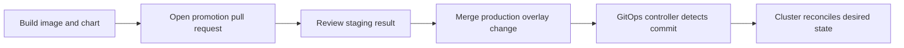
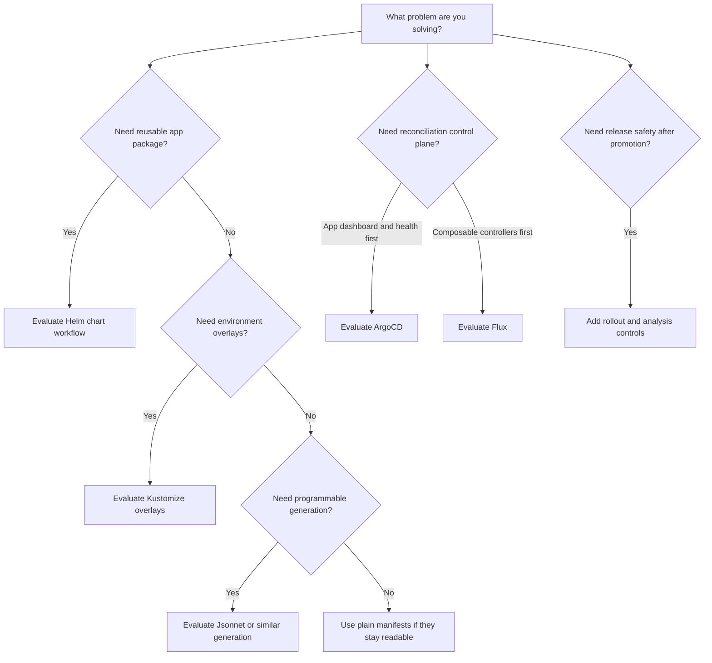

# CGOA Patterns and Tooling Review

> **CGOA Track** | Complexity: **MEDIUM** | Time: **75 minutes** | Prerequisites: GitOps principles, Kubernetes objects, basic CI/CD vocabulary | Kubernetes target: **1.35+**

## Learning Outcomes

After this module, you will be able to:

- Compare ArgoCD and Flux operational models when selecting GitOps tooling for Kubernetes 1.35+ clusters.
- Design repository promotion layouts that separate source of truth, environment overlays, and multi-cluster targets.
- Diagnose promotion, rollout, and secrets mistakes by separating rendering, reconciliation, and release safety responsibilities.
- Implement a local review workflow that uses `kubectl`, Helm, Kustomize, and diff commands to inspect generated manifests before reconciliation.

## Why This Module Matters

When teams treat GitOps tooling as a naming exercise during an urgent platform migration, a production outage can easily last for hours if a chart change, an environment overlay, and an automatic sync policy all move at once. The deeper damage is operational: nobody can answer whether the cluster was wrong, the repository was wrong, the rendered manifests were wrong, or the promotion process had skipped a control.

That incident is the shape of many GitOps failures. Teams adopt a controller, put manifests in Git, and assume the architecture is solved because the word GitOps appears in a dashboard. The exam will not ask you to memorize every flag in every tool, but it will ask whether you can recognize the operating pattern behind the tool: what is the source of truth, where rendering happens, how promotion is controlled, which component reconciles state, and where humans should inspect risk before the controller applies it.

This module turns tool names into architecture decisions. ArgoCD, Flux, Helm, Kustomize, Jsonnet, rollout controllers, repository layouts, and multi-cluster patterns each solve a different part of the delivery problem. When you can place each tool on the path from intent to running workload, the multiple-choice answers become easier because wrong answers usually blur boundaries that real systems must keep separate.

## Source of Truth, Rendering, and Reconciliation

GitOps begins with a simple promise: the desired state of the system lives in a versioned source of truth, and an automated control loop moves the live system toward that desired state. That promise sounds small, but it changes the operational model because a cluster should no longer depend on a person running a one-off command from a laptop. The controller should be able to recover after drift, prove what changed, and make the deployed state traceable to a reviewable commit.

The easiest way to reason about GitOps tooling is to separate three responsibilities that teams often mix together. The repository stores intent, the renderer turns intent into concrete Kubernetes objects, and the reconciler compares those objects with cluster state. Helm, Kustomize, and Jsonnet usually live in the rendering space, while ArgoCD and Flux live in the reconciliation space, even though they can invoke renderers as part of their workflow.

```text
+---------------------+       ++---------------------+       ++---------------------+
| Git source of truth | ----> | Manifest rendering   | ----> | Cluster reconcile    |
| commits and reviews |       | Helm/Kustomize/etc.  |       | ArgoCD or Flux       |
+---------------------+       ++---------------------+       ++---------------------+
          |                              |                              |
          v                              v                              v
   Audit trail and                 Concrete YAML                 Live objects and
   promotion history               for Kubernetes                drift correction
```

The diagram matters because it gives you a clean way to reject vague exam answers. If an answer says Helm "does GitOps" by itself, it skips the ongoing control loop. If an answer says CI should push rendered YAML directly into every cluster, it may still be automation, but it is not the pull-based reconciliation model that GitOps normally prefers. If an answer says Git should hold only application source code while cluster configuration lives in ticket comments, it has lost the source-of-truth property.

Before running commands, use explicit commands so examples stay clear and repeatable. A CGOA-style question may show either direct `kubectl` invocations or shorthand; what matters is that the action inspects Kubernetes state and does not secretly bypass the GitOps workflow.

```bash
kubectl version --client
kubectl get namespaces
```

Shorthand commands do not make a system GitOps-compliant. They only give you a concise way to inspect what the controller has already done, which is a different responsibility from changing the desired state. A disciplined operator uses `kubectl` to observe, diagnose, and confirm, then changes Git when the desired state must change, because direct cluster mutation creates drift that the controller may undo or hide.

Pause and predict: if a teammate runs `kubectl edit deployment checkout-api` in production while ArgoCD or Flux is reconciling from Git, what state should win after the next reconciliation cycle, and why? The correct reasoning is not "the fastest command wins"; the desired state in Git should win unless the controller is paused, misconfigured, or pointed at the wrong source. This is why GitOps is an operating model, not just a deployment shortcut.

There are legitimate places for CI/CD in a GitOps system, but CI/CD normally prepares inputs rather than becoming the final authority over cluster state. CI builds images, runs tests, signs artifacts, and may open a pull request that changes an image tag or chart value. The GitOps controller then notices the approved repository change and reconciles the cluster, which keeps deployment history tied to Git review instead of hiding it inside a pipeline log.

Infrastructure as Code also overlaps with GitOps, but the overlap is not identity. IaC tools such as Terraform or Pulumi commonly provision cloud resources, networks, clusters, databases, and identity bindings. GitOps tools commonly reconcile Kubernetes objects and application delivery state after the platform exists. Some teams GitOps-manage infrastructure controllers inside Kubernetes, but the exam usually wants you to recognize the difference between provisioning infrastructure and continuously reconciling desired state.

The most useful mental model is a restaurant kitchen. The recipe book is Git, the prep station is rendering, and the expeditor is reconciliation. Helm can turn a reusable recipe into a meal plan, Kustomize can adjust that plan for a local branch, and ArgoCD or Flux keeps comparing the orders to what leaves the kitchen. If the expeditor, the recipe, and the prep station are all treated as one thing, nobody can tell where the mistake entered the process.

## Repository and Promotion Patterns

Repository layout is not a fashion choice; it is how a team encodes ownership, review boundaries, and promotion flow. A monorepo can make cross-application changes visible in one review, while a polyrepo model can keep ownership clean for independent teams. Neither pattern is automatically correct, so the exam tends to ask which layout fits a scenario rather than which layout is universally best.

The core test is whether the layout preserves one source of truth, explicit promotion, repeatable rendering, and controlled reconciliation. If the same production value is copied manually into three repositories, you have a drift problem waiting to happen. If staging and production point at floating branches with no review boundary, you have weakened promotion. If every cluster has a separate folder but nobody can tell which commit reached which cluster, the layout is visible but not operable.

```text
repo/
  apps/
    checkout/
      base/
      overlays/
        dev/
        staging/
        prod/
  clusters/
    us-east/
      checkout.yaml
    eu-west/
      checkout.yaml
```

This simple structure illustrates a common split between application configuration and cluster binding. The application folder holds a base and environment overlays, while the cluster folder tells the GitOps controller what to apply to a specific target. A smaller team might collapse these folders, and a larger platform group might split them across repositories, but the same questions remain: who approves base changes, who approves production overlays, and which controller watches each path?

Promotion means moving a known version of configuration or an artifact from one stage to another under control. Deployment is the act of applying desired state to a target. Those words are related, but confusing them causes bad designs because a deployment can happen automatically after promotion, while promotion should usually contain a reviewable decision. A team that "promotes" by rebuilding an image with the same tag has not promoted the same artifact; it has created a new artifact that merely shares a name.



The sequence above is intentionally boring, which is a feature. It gives humans a review point before production state changes, gives automation a deterministic commit to reconcile, and gives incident responders a clear path backward through Git history. When an exam question offers a pattern that bypasses review by letting CI push directly into production clusters, look for whether the scenario is asking about GitOps principles or about generic automation speed.

Environment overlays are a common way to express differences without duplicating everything. Development might use fewer replicas, staging might enable extra diagnostics, and production might require stricter resource requests, PodDisruptionBudgets, and availability controls. Kustomize handles this style naturally because it composes a base with patches, while Helm can express environment differences through values files. Either can work, but the important point is repeatable rendering from reviewed inputs.

```yaml
apiVersion: kustomize.config.k8s.io/v1beta1
kind: Kustomization
resources:
  - ../../base
patches:
  - target:
      kind: Deployment
      name: checkout-api
    patch: |-
      - op: replace
        path: /spec/replicas
        value: 3
```

Before running this, what output do you expect from a render command if the base deployment is missing or the patch target name is wrong? A strong answer predicts failure or an unchanged render before touching the cluster, because render-time validation should catch many mistakes earlier than reconciliation. That habit matters during exams and real incidents because it separates "the manifest was not generated correctly" from "the controller failed to apply a correct manifest."

Multi-cluster layout adds another dimension because each cluster can have its own trust boundary, region, compliance requirement, and failure domain. Some teams use one repository with a `clusters/` directory for every target, while others use a platform repository that defines shared components and separate tenant repositories that define applications. The safer pattern is the one that lets an operator answer which commit controls which cluster without opening a spreadsheet.

Secrets complicate repository design because Git is an excellent audit log and a terrible place for plaintext credentials. GitOps teams commonly use encrypted secrets, external secret operators, sealed secrets, or cloud secret managers so the repository contains references or encrypted material rather than usable secret values. The exam may not require tool-specific detail, but it does expect you to avoid the anti-pattern of committing plaintext Kubernetes Secrets and calling the repository secure because it is private.

```yaml
apiVersion: external-secrets.io/v1beta1
kind: ExternalSecret
metadata:
  name: checkout-db
  namespace: checkout
spec:
  refreshInterval: 1h
  secretStoreRef:
    name: platform-secrets
    kind: ClusterSecretStore
  target:
    name: checkout-db
  data:
    - secretKey: password
      remoteRef:
        key: checkout/prod/db-password
```

This example keeps the desired Kubernetes object in Git while leaving the sensitive value in a secret backend. The controller model is still declarative, because the cluster should eventually contain a Secret named `checkout-db`, but Git does not contain the database password. In a real review, you would also check RBAC, namespace boundaries, audit logs, and rotation behavior, because secret delivery is only safe when the surrounding permissions match the intended blast radius.

The original module highlighted several study anchors, and they remain useful because this CGOA review module is a hub rather than a complete replacement for the deeper lessons. Use these links when you want the long-form treatment of a specific tool or pattern:

- [ArgoCD](../../../platform/toolkits/cicd-delivery/gitops-deployments/module-2.1-argocd/)
- [Argo Rollouts](../../../platform/toolkits/cicd-delivery/gitops-deployments/module-2.2-argo-rollouts/)
- [Flux](../../../platform/toolkits/cicd-delivery/gitops-deployments/module-2.3-flux/)
- [Helm & Kustomize](../../../platform/toolkits/cicd-delivery/gitops-deployments/module-2.4-helm-kustomize/)
- [Repository Strategies](../../../platform/disciplines/delivery-automation/gitops/module-3.2-repository-strategies/)
- [Environment Promotion](../../../platform/disciplines/delivery-automation/gitops/module-3.3-environment-promotion/)
- [Multi-cluster GitOps](../../../platform/disciplines/delivery-automation/gitops/module-3.6-multi-cluster/)
- [CI/CD Security](../../../platform/disciplines/reliability-security/devsecops/module-4.3-security-cicd/)

One practical way to review a repository layout is to narrate the path of a single change. Imagine that the checkout service needs a new image version in production. The change should begin as an artifact built by CI, appear as a reviewed change to a tag, digest, chart value, or overlay field, and then become visible to the GitOps controller after merge. If you cannot narrate that path without saying "someone also clicks this job" or "someone remembers to update that other folder," the layout is relying on memory rather than architecture.

The same narration exposes ownership mistakes. Application teams usually know whether version `1.35.0` is ready for production, but they may not own the namespace quota, ingress class, external secret store, or cluster bootstrap resources that make the workload safe to run. Platform teams usually own those shared controls, but they should not need to approve every application image bump. A mature repository strategy lets both groups review their own layer without giving either group accidental control over the whole estate.

Promotion design also has a timing dimension. Some organizations promote by merging a pull request from `staging` overlay values to `prod` overlay values, while others promote by moving an environment pointer to a release tag. Both can be valid when they preserve a known artifact and an auditable decision. The dangerous version is a pipeline that rebuilds an image during "promotion," because now staging and production did not run the same thing even if the version label looks similar.

In multi-cluster systems, the safest designs make cluster targeting boring. A reviewer should be able to see whether a change affects one cluster, one region, one environment, or every cluster watched by a bootstrap controller. That is why broad parent applications, shared Helm values, and global Kustomize bases require stricter review than a single tenant overlay. The more clusters a path controls, the more carefully access and promotion should be guarded.

There is also a recovery benefit to explicit promotion. During an incident, responders can ask which commit introduced the production desired state, which artifact it referenced, and which controller reconciled it. If the answer is available in Git and controller status, rollback becomes a controlled change rather than a detective exercise. If the answer lives in pipeline logs, chat messages, and manual commands, the team may spend its most expensive minutes reconstructing history.

## Compare ArgoCD and Flux Tooling Models

ArgoCD is often the easiest GitOps tool to explain because it presents an application-centric model. You define an Application that points to a source, a path or chart, and a destination cluster or namespace. ArgoCD then renders the desired manifests, compares them with live state, reports sync status and health, and optionally applies changes automatically. Its user interface and CLI make the reconciliation loop visible, which is valuable for teams that need a shared operational control plane.

Flux approaches the same GitOps problem as a set of specialized controllers. The source controller fetches sources, the kustomize controller applies Kustomizations, the helm controller manages Helm releases, and notification and image automation controllers handle adjacent workflows. This modularity can feel less like a single product dashboard and more like Kubernetes-native controller composition. That is powerful when a platform team wants small, composable building blocks, but it requires operators to understand how the controllers interact.

```text
+---------------------------+     ++---------------------------+
| ArgoCD application view    |     | Flux controller toolkit    |
| Application owns source,   |     | Source, Kustomization,     |
| render, destination, sync  |     | HelmRelease, notification  |
+---------------------------+     ++---------------------------+
| Strong visual operations   |     | Strong composable objects  |
| App-level health model     |     | Kubernetes-native pieces   |
+---------------------------+     ++---------------------------+
```

Neither model is inherently more GitOps than the other. ArgoCD can be declarative and pull-based, and Flux can be declarative and pull-based. The practical difference is how teams operate the system: ArgoCD tends to make applications first-class operational objects, while Flux tends to make controller resources first-class building blocks. A good exam answer compares those models without pretending that one tool owns the GitOps concept.

The preserved comparison table from the original module captures the core distinctions that remain exam-relevant:

| Comparison | What to remember |
|---|---|
| GitOps vs CI/CD | GitOps manages desired state; CI/CD builds and ships artifacts |
| GitOps vs IaC | IaC is about provisioning infrastructure; GitOps is about the control loop and reconciliation model |
| ArgoCD vs Flux | ArgoCD is application-centric; Flux is controller-centric and more modular |
| Helm vs Kustomize | Helm templates, Kustomize patches |
| Push vs pull | GitOps prefers pull-based reconciliation from inside the target environment |

Operationally, ArgoCD shines when a team benefits from a visible app inventory, sync buttons, health checks, and an application-oriented review vocabulary. A support engineer can inspect an Application, see whether it is synced, and compare the live state with the target state. That visibility can reduce incident time because the control plane gives a common language to developers, platform engineers, and release managers.

Flux shines when a team wants GitOps resources to feel like normal Kubernetes API objects that can be composed, delegated, and observed with the same patterns used elsewhere in the cluster. A platform team can define sources, Kustomizations, HelmReleases, and notifications as separate pieces with different ownership boundaries. That makes Flux attractive in multi-tenant or highly automated environments where controller composition is more important than a central application dashboard.

ArgoCD and Flux both support Helm and Kustomize workflows, but the integration details differ. ArgoCD can render Helm charts and Kustomize overlays as part of an Application, while Flux provides a helm controller and kustomize controller with dedicated custom resources. When a question asks which tool "uses Helm," the better answer may be that both can, and the deciding factor is whether the scenario emphasizes application control-plane experience or modular controller resources.

The exam may also mention notifications, observability, and image automation. These are not decorative extras; they decide whether a GitOps system is operable after the first successful sync. A controller that silently fails to fetch a repository or repeatedly applies a broken manifest is still automated, but it is not friendly to humans. Good GitOps design makes reconciliation status, drift, health, and promotion history observable.

A common failure mode occurs when teams adopt a GitOps controller successfully for one cluster, then copy the pattern into regional clusters without deciding who owns notifications. Manifests may be technically correct, but failed reconciliations reach only a chat channel that nobody monitors after business hours. The remedy is not a new deployment tool; it is assigning ownership, wiring alerts to the right team, and treating failed reconciliation as an operational event rather than a dashboard curiosity.

Which approach would you choose here and why: a small product team wants a visible app dashboard for ten services, while a platform team wants tenant teams to own separate Kubernetes resources across many clusters? The first scenario often leans ArgoCD because application visibility matters, and the second often leans Flux because composable controller resources fit delegation. The answer is not a brand preference; it is a match between operational shape and tool model.

When comparing these tools under exam pressure, watch for answers that describe user experience as if it were architecture. A user interface can make ArgoCD easier to operate for many teams, but the UI is not the GitOps principle. Likewise, Flux's controller decomposition can make it feel more Kubernetes-native, but controller decomposition is not automatically better if the team cannot debug the relationships. The architectural question is how desired state is fetched, rendered, applied, observed, and governed.

You should also separate install topology from operating model. ArgoCD can manage multiple clusters from one control plane, and Flux can be installed per cluster or in patterns that support fleet management. Those choices affect credentials, network paths, and blast radius. A centralized control plane can simplify visibility but concentrates trust, while per-cluster controllers reduce shared blast radius but require consistent bootstrapping and alerting across many targets.

Another comparison point is how each tool expresses dependencies. ArgoCD teams often model ordering with sync waves, hooks, and app-of-apps structures, while Flux teams may model dependencies between Kustomizations or HelmReleases. Both approaches can work, and both can be abused. If a database operator, namespace policy, and application deployment all reconcile in the wrong order, the issue is dependency design, not the mere presence of GitOps.

Finally, consider how each tool handles drift in human workflows. ArgoCD's visual diff can make drift obvious to a responder, while Flux's Kubernetes resources can make drift visible through familiar object conditions and events. In either model, the team still needs a rule for manual changes: observe with cluster commands, repair desired state in Git, and reserve direct mutation for documented emergencies. Without that rule, the tool only automates a conflict between humans and controllers.

## Helm, Kustomize, Jsonnet, and Rollout Boundaries

Helm, Kustomize, and Jsonnet are best understood as ways to produce Kubernetes manifests, not as replacements for reconciliation. Helm packages and templates applications, Kustomize patches and overlays raw YAML without templates, and Jsonnet generates configuration through a programming language. Each tool can reduce repetition, but each tool also adds a failure mode before the controller ever talks to the Kubernetes API.

Helm is useful when an application needs reusable packaging, parameters, chart dependencies, and a familiar distribution format. Many third-party applications publish Helm charts because a chart can bundle templates, default values, and install-time options in one artifact. The tradeoff is that templating can become opaque when values files, helper templates, and conditionals interact. A GitOps review should inspect the rendered output, not just the chart inputs.

```bash
helm template checkout ./charts/checkout \
  --namespace checkout \
  --values environments/prod/values.yaml > /tmp/checkout-prod.yaml
```

The command above is not a deployment by itself. It renders a chart so you can inspect the Kubernetes objects that a GitOps controller would later reconcile. That distinction is exam gold because it separates packaging from control-loop behavior. If the rendered Deployment contains a wrong image tag, the problem is in chart values or templates; if the rendered Deployment is correct but live state differs, the investigation moves toward reconciliation, permissions, or drift.

Kustomize is useful when the base manifests are already close to what you need and environment differences can be expressed as patches, generated ConfigMaps, image overrides, or resource composition. It avoids a separate template language, which keeps simple overlays readable. The tradeoff is that complex conditional logic does not belong naturally in Kustomize, so teams sometimes stretch patches until the structure becomes harder to understand than a chart would have been.

```bash
kustomize build apps/checkout/overlays/prod > /tmp/checkout-kustomize-prod.yaml
kubectl diff -f /tmp/checkout-kustomize-prod.yaml
```

The `kubectl diff` step is a valuable review habit because it compares rendered desired state with live cluster state before an apply. In a GitOps workflow, you may not apply from your terminal, but you can still use diff-style thinking during a review or incident. If the diff shows unexpected deletion of a ServiceAccount, the right response is to fix Git before reconciliation, not to wait for the controller to surprise production.

Jsonnet fits when configuration generation needs stronger abstraction than Kustomize patches or Helm templates provide. It can model reusable libraries, computed objects, and shared conventions across large estates. The cost is that it introduces a programming language into the manifest path, so reviewers need enough skill to reason about generated output. For CGOA, the key is to know why teams use Jsonnet, not to memorize its syntax.

Rollout tooling sits on a different boundary. Argo Rollouts, progressive delivery controllers, service mesh traffic shifting, and canary analysis tools help decide how a new version reaches users after desired state changes. They do not replace Git as source of truth or a GitOps controller as reconciler. They add release safety inside the cluster by controlling steps such as canary weights, analysis checks, pauses, and rollback behavior.

```yaml
apiVersion: argoproj.io/v1alpha1
kind: Rollout
metadata:
  name: checkout-api
  namespace: checkout
spec:
  replicas: 3
  strategy:
    canary:
      steps:
        - setWeight: 20
        - pause:
            duration: 10m
        - setWeight: 50
        - pause:
            duration: 10m
  selector:
    matchLabels:
      app: checkout-api
  template:
    metadata:
      labels:
        app: checkout-api
    spec:
      containers:
        - name: checkout-api
          image: ghcr.io/example/checkout-api:1.35.0
          ports:
            - containerPort: 8080
```

This Rollout manifest belongs in Git like any other desired state, but it changes what happens during reconciliation. Instead of replacing all pods at once, the rollout controller follows a canary plan and can pause for analysis or human approval. That is why promotion and rollout are related but separate concepts: promotion approves a desired version for a stage, while rollout controls exposure inside the target environment.

The same distinction helps with secrets. A Helm values file that contains a database password, a Kustomize secret generator that commits plaintext literals, or a Jsonnet library that embeds credentials creates a security problem before the GitOps controller is involved. The safer architecture keeps secret references, encrypted values, or external secret declarations in Git, then lets a cluster-side component materialize the runtime Secret under controlled permissions.

Tool boundaries also affect troubleshooting. If a GitOps Application is out of sync because a Kustomize patch fails, changing the controller will not fix the patch. If a Helm chart renders fine but the cluster rejects the object, you investigate Kubernetes API validation, admission policies, RBAC, or version compatibility. If a rollout pauses because metrics fail, the desired state may be correct while release safety is doing its job.

In Kubernetes 1.35+ environments, this boundary awareness becomes more important because platform policies, admission controls, and controller ecosystems are usually mature. A platform may have policy engines that reject unsafe pods, network policies that affect probes, or namespace quotas that prevent scaling. GitOps does not remove these controls; it gives you a traceable way to see which desired state collided with them.

Rendering tools deserve tests for the same reason application code deserves tests: reviewers should not have to mentally execute every template, patch, or generated object. A lightweight review command that renders the production path and runs schema, policy, or diff checks can catch mistakes before a controller tries to reconcile them. The controller remains the actor that applies desired state, but the review process becomes smarter because it sees the final YAML rather than only the inputs.

Helm chart values require special discipline because a small value can trigger a large template branch. One boolean may create an ingress, disable a security context, change a Service type, or remove a volume mount. That flexibility is why charts are useful, but it is also why a GitOps reviewer should ask for rendered output when the chart is nontrivial. The question is not whether Helm is trusted; the question is whether the specific rendered state is safe.

Kustomize patches have the opposite failure mode. They are often transparent at first, then become hard to reason about when overlays stack patches across bases, components, image transforms, and generated resources. A production overlay that needs many JSON patches may be telling you that the base no longer represents a good shared abstraction. The practical fix can be splitting the base, simplifying ownership, or moving to a packaging approach that better fits the variation.

Jsonnet and similar generation systems raise the review bar because the repository now contains code that writes configuration. That can be the right choice for a large platform with repeated patterns, but it should come with generated-output review, library ownership, and style rules. Otherwise, the team trades duplicated YAML for a custom programming environment that only a few people understand. GitOps still works, but the source of truth has become more abstract.

Rollout controllers should be evaluated with the same boundary discipline. A canary strategy is useful only if the metrics, pause behavior, routing layer, and rollback expectations are owned and observed. If nobody knows who responds to a failed analysis run, the rollout controller can turn a bad release into a long ambiguous pause. Good progressive delivery makes the release safer and the failure mode clearer.

## Patterns & Anti-Patterns

A good GitOps pattern makes the important decision reviewable before the controller acts. That does not mean every tiny change needs a meeting; it means production intent, promotion, secret handling, and cluster targeting should be visible in version control. The strongest patterns also create a narrow incident question: if the system is wrong, do we fix source, rendering, reconciliation, rollout policy, or cluster permissions?

| Pattern | When to Use It | Why It Works | Scaling Consideration |
|---|---|---|---|
| Environment overlays | Development, staging, and production share a base but need controlled differences | Reviewers can see exactly what differs by stage | Keep patches small enough that rendered output remains understandable |
| App-of-apps or cluster bootstrap | Many applications must be registered consistently | A parent object can declare child applications or reconciliations | Protect parent repositories because they control broad blast radius |
| Pull-based reconciliation | Clusters should not trust external CI runners with direct deploy access | The controller acts from inside the target environment with scoped permissions | Design network access, credentials, and alerting per cluster |
| Progressive delivery | User exposure must increase gradually after a version is promoted | Rollout controllers add canary, pause, and analysis behavior | Make metric ownership explicit or pauses become confusing |

Patterns fail when teams copy the visible shape but not the control boundary. A repository with many folders is not a promotion strategy if production watches the same mutable branch as development. A dashboard is not observability if failed reconciliations do not alert anyone. A chart is not reusable if every environment forks the template and changes it by hand.

| Anti-Pattern | What Goes Wrong | Why Teams Fall Into It | Better Alternative |
|---|---|---|---|
| CI pushes directly to clusters | Deployment history hides in pipeline runs and cluster credentials spread | It feels faster than teaching teams GitOps promotion | CI opens reviewed changes; controllers pull from Git |
| Floating image tags in production | The same Git commit can produce different running code over time | Teams want automatic updates without promotion work | Promote immutable tags or digests through reviewed commits |
| Plaintext secrets in Git | Private repositories still expose credentials to clones, logs, and forks | Kubernetes Secret YAML looks harmless because values are encoded | Use external or encrypted secret workflows with scoped access |
| Tool sprawl without boundaries | Incidents become arguments about which tool owns state | Each team adds a tool for one pain point | Document source, render, reconcile, and rollout ownership |

The original module also called out common traps that still deserve to be preserved because they map directly to exam distractors:

| Mistake | Why it hurts | Better answer |
|---|---|---|
| Treating ArgoCD and Flux as the same product | They overlap, but their architectures differ | Explain the different operational models |
| Thinking Helm equals GitOps | Helm is packaging, not the control loop | Separate render-time from reconciliation-time |
| Confusing promotion with deployment | Promotion is the controlled movement of a known artifact/configuration | Use the vocabulary carefully |
| Forgetting notifications and observability | The official CGOA domain includes interoperability with these tools | Mention them as part of the operating model |

There is a subtle anti-pattern hidden in many exam scenarios: the team uses GitOps vocabulary but still relies on manual cluster mutation during incidents. Emergency access is sometimes necessary, especially when a controller itself is broken, but it should be followed by reconciliation back into Git. Otherwise, the live cluster becomes a second source of truth, and the next automated sync may erase the emergency fix without context.

Another pattern worth recognizing is layered ownership. Application teams might own image tags and service-specific configuration, while platform teams own namespace policy, ingress standards, secret stores, and cluster bootstrap. GitOps works well when those ownership layers are reflected in repository permissions and review rules. It works poorly when every team can change every cluster object because the repository is easier to open than the production cluster.

Finally, do not confuse a clean repository tree with a clean operating model. A beautiful directory layout can still fail if nobody validates rendered manifests, if alerts are ignored, or if production promotion is just a merge from a personal branch. GitOps architecture is proven during boring reviews and stressful incidents, not during architecture diagrams alone.

The most resilient teams treat GitOps patterns as contracts between people and automation. The repository contract says where desired state lives and who may change it. The rendering contract says how final manifests are produced and validated. The reconciliation contract says which controller applies state and how failures surface. The rollout contract says how users are exposed to change. When those contracts are written down, tool migrations and incident handoffs become less personal and more mechanical.

Anti-patterns usually appear when one of those contracts is implicit. A senior engineer may know that production overlays require an extra review, but a new teammate may only see a folder and a merge button. A platform owner may know that direct cluster edits are overwritten, but an incident responder may treat `kubectl edit` as a normal fix. GitOps reduces hidden state only when teams also reduce hidden process.

Scaling adds another source of pressure. The layout that works for three services can become risky for thirty teams if every promotion touches the same shared file or requires the same platform approver. Conversely, a heavily split repository model can become slow if small changes require synchronized pull requests across too many locations. The best pattern is the smallest structure that preserves ownership, reviewability, and traceability at the current scale.

## Decision Framework

When choosing a GitOps pattern or tool, start by locating the decision on the delivery path. If you are choosing how manifests are generated, compare Helm, Kustomize, Jsonnet, or plain YAML. If you are choosing how clusters converge on desired state, compare ArgoCD and Flux. If you are choosing how a version reaches users gradually, evaluate rollout tooling. Mixing these questions usually produces answers that sound confident but solve the wrong problem.



Use the framework as a reasoning tool, not as a rigid procurement checklist. A team can use Helm with ArgoCD, Kustomize with Flux, HelmRelease resources in Flux, or Kustomize overlays rendered by ArgoCD. The valid combinations are less important than the boundaries: one part renders, another reconciles, and rollout controls release exposure after the desired state is accepted.

| Scenario | Prefer | Reasoning |
|---|---|---|
| Team wants a visible app inventory and manual sync controls | ArgoCD | Application status, health, diff, and sync concepts are first-class |
| Platform wants composable Kubernetes-native GitOps resources | Flux | Source, Kustomization, HelmRelease, notification, and automation controllers can be delegated |
| Third-party app ships a mature package | Helm | Chart packaging and values give a reusable install surface |
| Same app needs small per-environment changes | Kustomize | Base plus overlays keeps differences explicit without template logic |
| Production exposure must ramp gradually | Rollout controller | Canary steps and analysis manage user exposure after promotion |

For exam questions, read the scenario for ownership and failure mode before reading the answers. If the problem is that production and staging differ in only three fields, an answer about replacing the GitOps controller is probably too broad. If the problem is that operators cannot see sync health, an answer about rewriting every chart may miss the operational pain. If the problem is that a rollout sent all traffic to a bad version instantly, the missing piece may be progressive delivery rather than repository layout.

The strongest answer often mentions tradeoffs. ArgoCD's visible control plane can be easier for mixed teams to operate, but it introduces a central application view that must be governed. Flux's modularity can fit advanced platform designs, but the team must understand several controllers and custom resources. Helm can package complex software, but template indirection can hide risky output. Kustomize keeps overlays simple, but it can become awkward for highly conditional generation.

When in doubt, ask four questions in order. First, where is the desired state stored and reviewed? Second, how is the final Kubernetes YAML produced? Third, which controller reconciles that YAML into each cluster? Fourth, how are risk, secrets, rollout safety, and observability handled after reconciliation begins? A proposed architecture that cannot answer those questions is not ready, even if it uses a popular tool name.

For a quick exam pass, underline the verb in the scenario. If the team needs to package an app, think Helm. If the team needs to customize a base per environment, think Kustomize. If the team needs continuous correction from Git, think ArgoCD or Flux. If the team needs safer exposure after a version is accepted, think rollout patterns. The answer choices often try to lure you into solving a different verb than the one the scenario actually used.

For a real design review, add a fifth question: what happens when this goes wrong at 03:00? The best architecture gives an on-call engineer a short trail from alert to controller status, from controller status to rendered object, from rendered object to Git commit, and from Git commit to human review. If the trail crosses too many tools without ownership, the system may be elegant during demos and painful during incidents.

It is also worth asking how the design handles intentional drift. Some cluster objects may be created by operators, admission controllers, service meshes, or cloud integrations after the GitOps controller applies the base object. A mature GitOps setup distinguishes harmless managed-field differences from dangerous drift in desired fields. Without that distinction, teams either ignore real drift or fight controllers that are only reporting expected mutations.

The final decision is rarely permanent. Teams often begin with one repository, Kustomize overlays, and a visible ArgoCD control plane because that combination is easy to teach. Later they may introduce Flux-style controller composition, HelmRelease ownership, external secret operators, or more formal promotion repositories. The important part is to evolve the model deliberately, preserving the source-render-reconcile boundaries as complexity grows.

## Did You Know?

- ArgoCD began as an open source project at Intuit in 2018, and it later became part of the Cloud Native Computing Foundation ecosystem through the Argo project.
- Flux reached CNCF Graduated status in 2022, which reflects broad adoption and project maturity rather than a change in the basic GitOps control-loop idea.
- Kustomize has been available through `kubectl kustomize` for years, so teams can render overlays with Kubernetes-native tooling even when they do not run a GitOps controller locally.
- Kubernetes Secrets are only base64-encoded by default, not encrypted for every reader of the repository, which is why GitOps designs need deliberate secret-management patterns.

## Common Mistakes

| Mistake | Why It Happens | How to Fix It |
|---|---|---|
| Choosing ArgoCD or Flux by popularity instead of operating model | Tool names are easier to compare than ownership, visibility, and controller composition | Compare whether the scenario needs an application-centric control plane or modular Kubernetes-native controllers |
| Treating Helm rendering as reconciliation | Helm commands can install resources, so learners blur packaging with the continuous control loop | Separate chart rendering from the GitOps controller that watches Git and corrects drift |
| Promoting mutable image tags between environments | Teams want automatic updates and choose tags such as `latest` or `main` for convenience | Promote immutable tags or digests through reviewed commits so each environment points at a known artifact |
| Copying plaintext Secret manifests into a private repository | Base64 output looks encoded, and the repository feels protected by access control | Use encrypted secrets, external secret operators, or managed secret stores with scoped cluster permissions |
| Designing overlays that hide production differences | Small patches grow over time until reviewers cannot predict rendered output | Regularly render and review final YAML, then refactor bases or split overlays when the diff becomes unclear |
| Letting CI push directly into every cluster | Pipeline deploys feel familiar, especially before teams trust pull-based reconciliation | Let CI build and propose changes, then let ArgoCD or Flux reconcile approved desired state from Git |
| Ignoring reconciliation alerts after the first successful sync | Teams celebrate the initial deployment and forget that controllers fail too | Route sync, health, source-fetch, and drift alerts to owners who can change the repository or controller configuration |

## Quiz

<details><summary>Your team uses Helm charts in Git and a CI job runs `helm upgrade` against production after every merge. Which GitOps boundary is missing?</summary>

The missing boundary is continuous pull-based reconciliation from a declared source of truth into the cluster. Helm is packaging and rendering, and `helm upgrade` can deploy resources, but the CI job is acting as the direct deployment authority. A GitOps answer would usually have CI build or propose a reviewed change, then ArgoCD or Flux would reconcile the approved state from Git. This maps to the outcome about diagnosing rendering versus reconciliation responsibilities.

</details>

<details><summary>A platform team wants tenant teams to own separate GitOps objects across many clusters, and they prefer small Kubernetes-native controllers over a central app dashboard. Which tool model fits best, and what tradeoff should they accept?</summary>

Flux often fits this scenario because its source, kustomize, helm, notification, and automation controllers can be composed as Kubernetes resources. The tradeoff is that operators need to understand several controller types instead of relying on one application-centric view. ArgoCD could still work, but the scenario emphasizes modular delegation rather than shared dashboard operations. This tests the outcome about comparing ArgoCD and Flux operational models.

</details>

<details><summary>A production overlay changes the replica count, resource requests, and database endpoint, but reviewers cannot tell what final YAML will reach the cluster. What should the team inspect before reconciliation?</summary>

The team should render the final manifests and review the diff before the controller applies them. With Kustomize that may mean `kustomize build`, and with Helm that may mean `helm template` with the production values file. The goal is to catch render-time mistakes before they become reconciliation problems. This tests the outcome about designing repository promotion layouts and implementing local review workflows.

</details>

<details><summary>An incident responder runs `kubectl edit deployment checkout-api` to hotfix production while ArgoCD automated sync is enabled. The change disappears a few minutes later. What happened?</summary>

The direct cluster edit created drift from the desired state stored in Git, and the GitOps controller reconciled the live Deployment back to the repository version. That is expected behavior unless the controller is paused or the desired state is changed in Git. The durable fix is to commit the intended state or record the emergency change back into the GitOps source after stabilizing the service. This tests diagnosis of reconciliation behavior.

</details>

<details><summary>A team stores base64-encoded Kubernetes Secret YAML in the same repository as its deployment manifests and says the values are safe because the repository is private. What is the better GitOps pattern?</summary>

The better pattern is to avoid committing usable plaintext secret material, even if it is base64-encoded and the repository is private. GitOps designs commonly use encrypted secrets, external secret operators, sealed secret workflows, or cloud secret managers so Git contains references or encrypted data. The cluster-side controller can materialize the runtime Secret under scoped permissions. This tests the outcome about diagnosing secrets mistakes.

</details>

<details><summary>Staging and production both watch the same branch, and production updates whenever staging changes. The team calls this promotion. What is wrong with that claim?</summary>

Promotion should be the controlled movement of a known version or configuration from one stage to another, usually through a reviewable decision. If both environments watch the same branch, production does not have a separate promotion boundary; it simply follows staging changes. The safer layout gives production an explicit commit, tag, path, or pull request that records the decision to move forward. This tests repository promotion design.

</details>

<details><summary>A canary rollout pauses because error-rate analysis fails, but Git, rendering, and cluster permissions all look correct. Should the team replace the GitOps controller?</summary>

Replacing the GitOps controller is probably solving the wrong problem. A paused canary can mean the rollout controller is enforcing release safety exactly as designed because live metrics failed the analysis step. The team should inspect rollout status, analysis runs, service routing, and the new version's behavior before changing GitOps reconciliation. This tests diagnosis of rollout boundaries and release safety responsibilities.

</details>

## Hands-On Exercise

In this exercise, you will perform a review workflow without applying a surprise change to a cluster. You can use a local Kubernetes 1.35+ lab cluster if you have one, but the important learning goal is the sequence: render first, diff second, reason about reconciliation third, and only then decide what belongs in Git. The examples use a small checkout service so you can focus on boundaries rather than application complexity.

Start by creating a temporary workspace outside the repository you are editing. This keeps the module source clean while giving you a place to experiment with Helm, Kustomize, and Kubernetes diff commands. Confirm your shell points `kubectl` at the same kubeconfig context you intend to inspect.

```bash
mkdir -p /tmp/cgoa-gitops-review/apps/checkout/base
mkdir -p /tmp/cgoa-gitops-review/apps/checkout/overlays/prod
cd /tmp/cgoa-gitops-review
```

- [ ] Task 1: Create a base Deployment and Service for `checkout-api`, then explain which fields should be shared across environments and which fields should move into overlays.
- [ ] Task 2: Create a production Kustomize overlay that changes replicas to 3 and sets an explicit image tag, then render it before thinking about reconciliation.
- [ ] Task 3: Run a diff-style inspection with `kubectl diff -f` against the rendered manifest, or describe the expected diff if you do not have a live cluster.
- [ ] Task 4: Decide whether this layout should be watched by ArgoCD as an Application or by Flux as a Kustomization, and justify the choice using operational needs.
- [ ] Task 5: Add a short promotion note that states which commit, tag, or overlay change would be reviewed before production reconciliation.

<details><summary>Solution outline for Tasks 1 and 2</summary>

Create a base that contains the stable identity of the application: labels, selector, container port, and Service. Put environment-specific scale and image decisions in the overlay so production changes are reviewable without rewriting the base. A minimal base and overlay might look like this:

```yaml
apiVersion: apps/v1
kind: Deployment
metadata:
  name: checkout-api
  labels:
    app: checkout-api
spec:
  replicas: 1
  selector:
    matchLabels:
      app: checkout-api
  template:
    metadata:
      labels:
        app: checkout-api
    spec:
      containers:
        - name: checkout-api
          image: ghcr.io/example/checkout-api:dev
          ports:
            - containerPort: 8080
---
apiVersion: v1
kind: Service
metadata:
  name: checkout-api
spec:
  selector:
    app: checkout-api
  ports:
    - port: 80
      targetPort: 8080
```

```yaml
apiVersion: kustomize.config.k8s.io/v1beta1
kind: Kustomization
resources:
  - ../../base
images:
  - name: ghcr.io/example/checkout-api
    newTag: "1.35.0"
patches:
  - target:
      kind: Deployment
      name: checkout-api
    patch: |-
      - op: replace
        path: /spec/replicas
        value: 3
```

</details>

<details><summary>Solution outline for Tasks 3 through 5</summary>

Render the overlay first with `kustomize build apps/checkout/overlays/prod > /tmp/checkout-prod.yaml`, then inspect it as a reviewer. If you have a cluster, run `k diff -f /tmp/checkout-prod.yaml`; if you do not, explain which objects would be created or changed and why. Choose ArgoCD when the team needs an application-centric view, visible sync health, and shared dashboard operations; choose Flux when the team needs modular Kubernetes-native resources and delegated controller composition. The promotion note should name the reviewed production overlay change and the immutable image tag or digest being moved forward.

</details>

Success criteria:

- [ ] You can point to the source-of-truth files that define production desired state.
- [ ] You can show rendered Kubernetes YAML before a controller reconciles it.
- [ ] You can explain whether a problem belongs to rendering, reconciliation, rollout safety, or cluster policy.
- [ ] You can justify ArgoCD or Flux based on operating model rather than popularity.
- [ ] You can state how production promotion is reviewed and traced.

## Sources

- [ArgoCD documentation](https://argo-cd.readthedocs.io/en/stable/)
- [ArgoCD declarative setup](https://argo-cd.readthedocs.io/en/stable/operator-manual/declarative-setup/)
- [ArgoCD Helm user guide](https://argo-cd.readthedocs.io/en/stable/user-guide/helm/)
- [ArgoCD Kustomize user guide](https://argo-cd.readthedocs.io/en/stable/user-guide/kustomize/)
- [Flux documentation](https://fluxcd.io/flux/)
- [Flux components](https://fluxcd.io/flux/components/)
- [Flux GitRepository source](https://fluxcd.io/flux/components/source/gitrepositories/)
- [Flux Kustomizations](https://fluxcd.io/flux/components/kustomize/kustomizations/)
- [Helm documentation](https://helm.sh/docs/)
- [Kustomize reference](https://kubectl.docs.kubernetes.io/references/kustomize/)
- [Kubernetes objects](https://kubernetes.io/docs/concepts/overview/working-with-objects/kubernetes-objects/)
- [Kubernetes Secrets](https://kubernetes.io/docs/concepts/configuration/secret/)

## Next Module

Continue with [CGOA Practice Questions Set 1](./module-1.4-practice-questions-set-1/) to turn these patterns into exam-style reasoning under time pressure.
