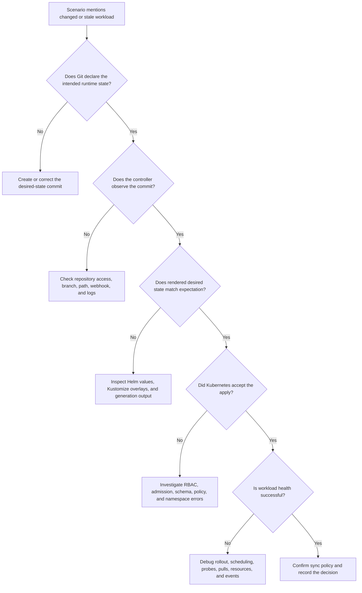

# CGOA Practice Questions Set 1

> **CGOA Track** | Practice questions | Set 1  
> **Complexity:** Beginner to intermediate  
> **Estimated time:** 45-60 minutes  
> **Prerequisites:** Basic Kubernetes objects, Git pull requests, YAML manifests, and the CGOA introduction modules

## Learning Outcomes

By the end of this module, you will be able to:

1. **Apply** the GitOps reconciliation model to decide whether a cluster change should be made through Git, CI, or a controller.
2. **Analyze** drift scenarios by comparing desired state in Git with actual state in a Kubernetes cluster.
3. **Compare** Helm, Kustomize, Argo CD, Flux, and CI/CD responsibilities when designing a delivery workflow.
4. **Evaluate** whether a pull-based or push-based deployment pattern is safer for a given environment.
5. **Debug** common GitOps practice-question traps by explaining why plausible answers are incomplete or misleading.

## Why This Module Matters

A payments platform at a mid-size retailer once treated its first GitOps incident as a controller outage because the visible symptom looked absurd: an emergency hotfix worked, traffic recovered, and then the cluster quietly reverted to the broken image. The operations channel filled with guesses about cache timing, Helm release history, and a supposedly stuck deployment job, but the actual cause was simpler and more expensive. The incident commander had changed the live Deployment during the outage, Git still declared the old image, and the controller later restored the declared desired state during the next reconciliation cycle. The customer-facing degradation lasted long enough to trigger service credits and a painful executive review, not because Kubernetes was mysterious, but because the team had not agreed where durable production intent lived.

That story is the reason this practice set is not a trivia checkpoint. GitOps questions in CGOA usually hide the important concept inside ordinary operational wording: a pull request merged, a workload drifted, a controller reported out of sync, or a CI job succeeded while the cluster stayed unchanged. A learner who memorizes "GitOps stores YAML in Git" may still choose a wrong answer because the phrase omits the reconciliation loop, the ownership boundary, and the difference between temporary runtime action and durable desired state. The exam is testing whether you can reason through those differences under pressure.

This module turns the first practice-question set into a guided diagnostic lesson. You will connect desired state, actual state, drift, CI/CD handoff, pull-based security boundaries, and tool responsibilities into one operating model for Kubernetes 1.35+ environments. The goal is not to make you recite product names. The goal is to help you read a scenario, identify which system owns each decision, and choose a response that preserves auditability while still respecting real incident work.

## Core Content

### 1. GitOps Is an Operating Model, Not a Folder of YAML

The shortest weak definition of GitOps is "Kubernetes YAML stored in Git." That description is not completely false, but it is incomplete in the way a warehouse inventory list is incomplete if nobody checks the shelves. Git storage helps with history, review, and comparison, yet GitOps starts to matter when a controller continuously compares what Git says should exist with what the cluster actually has. The reconciliation loop is the part that changes Git from a file cabinet into an operating model.

A useful CGOA-level definition is that GitOps is a pull-oriented operating model where desired state is declared in Git, reviewed through normal Git workflows, and continuously reconciled into the target environment by an automated controller. Each phrase matters because each phrase excludes a common wrong answer. "Desired state" says Git contains the intended runtime result, not merely a backup copy of manifests. "Reviewed through Git workflows" says changes enter through commits, pull requests, branch rules, and audit history. "Continuously reconciled" says the system keeps checking for mismatch instead of treating deployment as a one-time command.

The important consequence is that Git becomes the place where operators explain durable intent. If someone changes a Deployment replica count directly in the cluster, that action may be useful during an emergency, but it is not yet the desired state according to Git. A GitOps controller should notice the mismatch and either report it or correct it, depending on policy and configuration. That behavior is not a surprise feature; it is the core design.

```ascii
+------------------------+        +------------------------+
| Git repository         |        | Kubernetes cluster     |
|                        |        |                        |
| desired Deployment     |        | live Deployment        |
| replicas: 3            |        | replicas: 2            |
| image: app:v1.8        |        | image: app:v1.8        |
+-----------+------------+        +------------+-----------+
            |                                  ^
            | controller compares desired      |
            | state with live state            |
            v                                  |
+------------------------+                     |
| GitOps controller      |---------------------+
| detects drift          |
| plans reconciliation   |
+------------------------+
```

The diagram shows a small drift problem with large operational implications. Git says the Deployment should have three replicas, while the cluster currently has two. That mismatch may have been caused by a manual edit, a failed rollout, a temporary experiment, or a partial restore after an outage. The GitOps controller does not need to know the human story before it can detect the technical mismatch, but the team must understand the human story before deciding whether the controller should sync immediately, wait for approval, or be paused during a break-glass process.

**Active learning prompt:** Pause and predict what should happen if the live cluster has `replicas: 2` but Git still has `replicas: 3`. Should the controller leave the cluster alone because the workload is currently running, or should it restore the Git-declared value? A strong answer separates emergency response from durable desired-state management, because a temporary manual action can be valid during an incident while still being drift from the GitOps system's point of view.

This distinction is why practice questions that mention "a pull request was merged, but the cluster did not change" are testing more than Git knowledge. They are asking you to reason about a chain: commit, controller observation, manifest rendering, authorization, application to the cluster, health assessment, and status reporting. Missing any link can make delivery fail while the repository still looks correct, and an answer that says only "check Git" is usually too shallow.

### 2. Desired State, Actual State, and Drift

Desired state is the configuration the organization says should exist, while actual state is what the cluster is currently running. In GitOps, desired state usually lives as Kubernetes manifests, Helm values, Kustomize overlays, policy files, or application definitions inside a Git repository. Actual state comes from the Kubernetes API server, workload controllers, admission decisions, runtime status, and sometimes human emergency action. Drift is the gap between those two states, but the meaning of that gap depends on field ownership.

Drift can be harmless, intentional, dangerous, or simply misunderstood. A HorizontalPodAutoscaler changing the number of Pods is not the same kind of difference as a person manually changing a container image. A controller updating a status field is not the same kind of difference as an unreviewed change to a Service type. Good GitOps practice depends on knowing which fields are owned by Git, which fields are owned by Kubernetes controllers, and which differences should trigger synchronization, investigation, or an explicit ignore rule.

```yaml
apiVersion: apps/v1
kind: Deployment
metadata:
  name: checkout
  namespace: shop
spec:
  replicas: 3
  selector:
    matchLabels:
      app: checkout
  template:
    metadata:
      labels:
        app: checkout
    spec:
      containers:
        - name: checkout
          image: registry.example.com/checkout:v1.8
          ports:
            - containerPort: 8080
```

Imagine this Deployment is the version stored in Git. If a teammate runs `kubectl scale deployment/checkout --replicas=2 -n shop`, the live `spec.replicas` field changes while Git remains unchanged. A GitOps controller that manages this Deployment can detect the difference because `spec.replicas` is part of the declared configuration. Depending on configuration, it may mark the application as out of sync, automatically restore three replicas, or wait for a human to approve synchronization.

Now imagine that the Deployment creates Pods and Kubernetes later writes status information such as available replicas, observed generation, and conditions. Those fields are not usually declared in Git because they are runtime observations. Treating every status difference as drift would create noise and confusion, especially in a busy cluster where controllers constantly update health and progress fields. GitOps is powerful because it is precise about ownership; it is not a blind text comparison between a YAML file and a live object dump.

A practical drift investigation starts by asking three questions. First, which object and field differ between Git and the cluster? Second, who is supposed to own that field: Git, a Kubernetes controller, an autoscaler, or a human operator during a break-glass event? Third, what should the reconciliation system do now: report, sync, pause, or escalate? These questions turn a vague "GitOps is broken" complaint into a concrete diagnosis.

```bash
kubectl -n shop get deployment checkout -o yaml
```

In KubeDojo modules, the `kubectl` command is shortened to `k` after this first explanation. The alias is common in real exam and operations environments, but the full command is shown first so the intent is clear. If you use the alias locally, the same inspection command becomes:

```bash
k -n shop get deployment checkout -o yaml
```

A worked example makes the distinction clearer. Suppose Git contains `registry.example.com/checkout:v1.8`, but the live Deployment uses `registry.example.com/checkout:v1.9-hotfix`. The team needs to know whether that hotfix was applied directly during an incident, rendered by a newer Helm chart, or produced by an image automation controller that updates manifests through commits. The correct next step is not automatically "roll back" or "force sync"; the correct next step is to identify the owner and origin of the change.

If the hotfix was applied directly and should become permanent, the team should create a Git commit that declares the hotfix image and records the reason. If the hotfix was unsafe or unapproved, the team can sync back to the Git version after confirming the operational impact. If the image was changed by an automation controller, the team should inspect that controller's configuration, commit behavior, and policy boundaries. In all cases, the GitOps mental model gives the team a disciplined way to reason about state instead of treating the cluster as the only truth.

**Active learning prompt:** Your cluster is running image `checkout:v1.9-hotfix`, but Git still declares `checkout:v1.8`. Name two safe responses and one unsafe response. The safe responses should preserve auditability, while the unsafe response should explain how the team could make future drift harder to understand.

### 3. GitOps and CI/CD Solve Different Problems

CI/CD and GitOps are often used together, which is why practice questions try to blur them. CI/CD usually answers how teams build, test, package, scan, sign, and publish software changes. GitOps answers how teams declare the desired runtime state and keep an environment reconciled to it. A healthy platform can use both, but replacing one term with the other causes design mistakes and pushes credentials into the wrong place.

A CI pipeline may compile code, run tests, build a container image, scan it for vulnerabilities, and publish it to a registry. It may then open a pull request that updates a Kubernetes manifest, Helm values file, or Kustomize image tag with the new artifact. At that point, GitOps takes over: a controller notices the merged change, renders the desired manifests if needed, compares them with the cluster, and applies changes according to policy.

```ascii
+-------------------+      +-------------------+      +-------------------+
| Source commit     |      | CI pipeline       |      | GitOps repo       |
| app code changes  |----->| test, build, scan |----->| desired runtime   |
|                   |      | publish image     |      | state changes     |
+-------------------+      +-------------------+      +---------+---------+
                                                                  |
                                                                  v
                                                        +-------------------+
                                                        | GitOps controller |
                                                        | reconcile cluster |
                                                        +---------+---------+
                                                                  |
                                                                  v
                                                        +-------------------+
                                                        | Kubernetes        |
                                                        | actual runtime    |
                                                        +-------------------+
```

The separation matters because credentials and responsibility differ. A CI system often needs access to source code, test services, artifact registries, signing tools, and scanning systems. A GitOps controller needs permission to read the desired-state repository and apply a scoped set of Kubernetes changes inside a target cluster. Giving the CI system direct production cluster-admin access because "it deploys things" collapses those boundaries and increases blast radius when an external runner, token, or plugin is compromised.

| Concern | CI/CD pipeline | GitOps controller |
|---|---|---|
| Primary job | Build, test, package, scan, and promote artifacts | Reconcile declared runtime state into the environment |
| Typical trigger | Source commit, tag, pull request, or release event | Git change, polling interval, webhook, or manual sync |
| Credential shape | Access to code, build secrets, registries, and test systems | Scoped access to target cluster resources and Git repository |
| Failure signal | Failed test, failed build, failed scan, failed publish | Out-of-sync app, failed apply, health degradation, drift |
| Audit focus | How the artifact was produced and promoted | Who changed desired state and what the cluster reconciled |

There are legitimate push-based deployment systems where CI applies manifests directly to a cluster. Those systems can work, and many organizations used them before adopting GitOps. The CGOA distinction is not that push-based CI is impossible or always reckless. The distinction is that GitOps emphasizes declared desired state and a reconciliation loop, commonly with a controller running in or near the target environment.

A common exam trap says that GitOps is "a replacement for CI/CD." That answer is too broad. GitOps can replace the deployment step of a push-based pipeline, but it does not replace compiling code, running tests, signing artifacts, or scanning images. In a mature platform, CI/CD and GitOps cooperate: CI produces trusted artifacts and proposes desired-state changes, while GitOps reconciles those changes into Kubernetes.

The practical design question is where the handoff should happen. If CI updates a manifest in Git and stops, the GitOps controller becomes responsible for applying that declared change. If CI both updates Git and directly applies to the cluster, the team has two writers for the same runtime state, which can create race conditions and confusing audit trails. The cleaner design gives one system ownership of each responsibility, then makes the handoff observable through commits, controller status, events, and health checks.

This handoff also explains why image tags and manifest repositories deserve careful design. Some teams update a deployment repository with immutable image digests, while others update semantic tags that point to signed artifacts. Either approach can work, but the operational question is whether the manifest change is reviewable, reproducible, and connected to the artifact that CI produced. If the cluster is running an image that nobody can trace back to a build, scan, and commit, the team has lost part of the audit chain that GitOps is meant to protect.

Another useful habit is to separate "promotion" from "application." Promotion means the organization has decided that a build is allowed to move toward an environment, often by updating a Git path or values file. Application means the target environment actually receives the rendered Kubernetes objects and reaches the expected health state. Practice questions often compress both ideas into a single sentence, but real incidents become easier when you keep them distinct. A promoted change can fail to apply, and an applied change can fail health, so the right investigation follows evidence rather than assuming a successful CI job proves a successful deployment.

### 4. Pull-Based Reconciliation and Security Boundaries

Pull-based GitOps means the target environment, or a controller trusted by that environment, fetches desired state and reconciles it. This pattern is popular because it avoids giving an external CI runner broad inbound access to the cluster. Instead of pushing commands into the cluster from the outside, the controller pulls approved configuration from Git and applies it from inside a controlled boundary. That direction of control changes the security conversation, especially for production clusters that sit behind private network controls.

The security benefit is not magic. A pull-based model still needs credentials, repository access, Kubernetes RBAC, network connectivity, artifact access, and careful secret handling. The improvement is about reducing where powerful credentials live and limiting which systems can directly mutate production. If a CI service is compromised, the attacker should not automatically gain direct production cluster access simply because the service can build application images.

```ascii
Push-oriented deployment
------------------------

+-------------------+        cluster credentials        +-------------------+
| External CI       |----------------------------------->| Kubernetes API    |
| runner            |        apply manifests            | production        |
+-------------------+                                   +-------------------+


Pull-oriented GitOps
--------------------

+-------------------+        reads desired state         +-------------------+
| GitOps controller |----------------------------------->| Git repository    |
| in target env     |                                   | reviewed changes  |
+---------+---------+                                   +-------------------+
          |
          | scoped Kubernetes RBAC
          v
+-------------------+
| Kubernetes API    |
| production        |
+-------------------+
```

A senior practitioner evaluates this pattern by threat model, not slogan. If the cluster cannot reach the Git repository, a pull model needs network design. If the GitOps controller has excessive RBAC, it can still cause serious damage. If secrets are stored unencrypted in Git, the model has failed an essential security requirement. Pull-based GitOps is safer when it is paired with least privilege, protected branches, signed commits or tags where appropriate, admission controls, and secret-management controls that keep sensitive values out of plain manifests.

The operational benefit is also significant because a controller can keep reconciling when nobody is actively running a deployment job. It can report that an application is out of sync, retry transient failures, and expose health status. It gives operators a stable place to ask, "What does this environment think it should be running?" That question is harder to answer when several external systems can push changes independently and leave partial history across logs, build pages, shell sessions, and cluster events.

Consider a production cluster behind a private network boundary. With a push model, the team must let a CI runner reach the API server or create a tunnel that effectively does the same thing. With a pull model, the cluster-side controller only needs to reach the repository and any required artifact sources, while Kubernetes credentials remain scoped inside the environment. The exact network design varies by organization, but the direction of trust changes the risk discussion in a way CGOA expects you to recognize.

**Active learning prompt:** Which approach would you choose for a regulated production cluster where external CI runners are shared across many teams, and why? Do not answer with only "pull is safer." Include where credentials live, what RBAC should allow, how Git review protects desired state, and what remaining risks still need controls.

The remaining risks are not footnotes, because a poor pull-based implementation can still be fragile. A controller with cluster-admin permissions, a repository that accepts unreviewed commits, and plaintext secrets in manifests can create a dangerous system even though the architecture is technically pull-based. The safer pattern narrows the controller to the namespaces and resource kinds it owns, protects the branch that defines production, and uses a secret-management design that keeps sensitive values out of ordinary Git history. In practice, the controller becomes one part of a larger control system rather than a substitute for security engineering.

This is also why a break-glass process belongs in the design before the outage. A team may need to pause synchronization, make a direct emergency change, or temporarily override a value while investigating customer impact. Those actions can be legitimate if they are time-bounded, logged, approved according to incident policy, and followed by a Git commit or a sync back to the previous desired state. They become unsafe when the team treats the exception as invisible or permanent, because the next reconciliation cycle will expose the mismatch at the worst possible time.

### 5. Tool Responsibilities: Helm, Kustomize, Argo CD, and Flux

Tool questions become easier when you separate rendering tools from reconciliation controllers. Helm packages and templates Kubernetes resources, usually through charts and values. Kustomize customizes plain YAML through bases, overlays, patches, labels, name transformations, and image substitutions without requiring a template language. Argo CD and Flux are GitOps controllers that can watch repositories, render manifests through supported tools, compare desired and live state, and reconcile changes into clusters.

The tools can be combined without becoming interchangeable. A repository might contain a Helm chart for a shared service, Kustomize overlays for environment-specific patches, and an Argo CD Application that points at the production path. Another platform might use Flux with HelmRelease resources to manage chart releases. The important exam skill is not memorizing every feature; it is identifying which layer a tool primarily occupies in a delivery design and refusing answers that assign one tool every responsibility.

```ascii
+--------------------------+
| Desired-state repository |
|                          |
| charts/                  |
| overlays/                |
| apps/                    |
+------------+-------------+
             |
             v
+--------------------------+
| Render or customize      |
| Helm templates           |
| Kustomize overlays       |
+------------+-------------+
             |
             v
+--------------------------+
| GitOps reconciliation    |
| Argo CD or Flux          |
+------------+-------------+
             |
             v
+--------------------------+
| Kubernetes cluster       |
| live resources           |
+--------------------------+
```

Helm is often chosen when an application needs reusable packaging, configurable values, dependency management, and release conventions. A chart can define a Deployment, Service, ConfigMap, and other resources with values that differ by environment. The risk is that complex templates can hide what Kubernetes objects will actually be produced, so teams need rendering checks, chart tests, review discipline, and clear ownership of values files. In a GitOps workflow, Helm may be the renderer while the GitOps controller remains the reconciler.

Kustomize is often chosen when a team wants to start with readable base YAML and apply environment-specific changes as overlays. For example, a base Deployment might be shared across environments, while production adds a higher replica count, stricter resource requests, and a different image tag. The benefit is that the final output remains close to Kubernetes YAML, but large overlay stacks can still become difficult to reason about if patches are scattered. In practice questions, choose answers that describe Kustomize as customization, not as the entire GitOps operating model.

Argo CD and Flux are both used for GitOps reconciliation, but their user experience and resource models differ. At the CGOA level, you do not need to turn every comparison into a product debate. You should be able to say that both can reconcile desired state from Git into Kubernetes, both can work with common manifest-generation tools, and both are part of the controller layer rather than simply being YAML templating tools. The controller layer is where desired and live state are compared, not merely where YAML is formatted.

A common wrong answer says "Helm reconciles drift." Helm can install or upgrade a release, and Helm has release history, but plain Helm by itself is not the same as a continuously running GitOps reconciliation controller. A GitOps controller may use Helm to render manifests, then perform comparison and synchronization. The distinction is subtle enough to appear in practice questions and important enough to matter in platform design.

Another common wrong answer says "Kustomize manages secrets." Kustomize can generate Secret manifests from local inputs, but secret management in production usually needs a stronger pattern, such as sealed secrets, external secret operators, cloud secret stores, or another approved mechanism. The exam-level trap is over-assigning tool responsibility because a tool can touch a resource type. Being able to render a Secret object is not the same as being a complete secret-management system.

When you compare tools, ask what evidence each one can produce during a failure. Helm can show rendered output and release-related context when it is used as the packaging layer. Kustomize can show how bases and overlays combine into final YAML. Argo CD and Flux can show synchronization status, comparison results, reconciliation errors, and health signals depending on configuration. CI/CD can show build logs, test results, scans, signatures, and the commit or pull request that promoted an artifact. The correct diagnosis often comes from lining up those evidence sources in order.

For exam purposes, that evidence-first habit prevents a common trap: choosing the most familiar tool name instead of the most accurate responsibility. If a scenario says the image was built successfully but the controller cannot apply the manifest, the answer is probably not "fix CI" unless the artifact itself violates policy. If a scenario says a Helm values file rendered the wrong tag, the answer is not "restart Argo CD" until you have checked the value source and rendered output. The tool name matters less than the stage where the evidence shows the chain broke.

### 6. Worked Example: Diagnosing a GitOps Practice Scenario

The following scenario combines the main ideas from this module. A team merges a pull request that changes the image tag for the `checkout` service from `v1.8` to `v1.9`. The CI pipeline has already built and scanned the image. Ten minutes later, the team sees that the cluster is still running `v1.8`, and the GitOps dashboard marks the application as out of sync. The weak response is to say, "Run `kubectl set image` and fix it," because that updates the symptom while bypassing the operating model.

A stronger response starts with the reconciliation chain. Did the desired-state repository receive the correct image tag? Did the controller observe the new commit? Did the manifest render correctly? Did Kubernetes reject the apply because of RBAC, admission policy, missing image pull secret, invalid YAML, or a namespace mismatch? Did the workload apply but fail health checks? The evidence determines whether the failure sits in Git observation, rendering, Kubernetes admission, rollout health, or runtime scheduling.

```bash
k -n argocd get applications
k -n shop get deployment checkout -o wide
k -n shop describe deployment checkout
k -n shop get events --sort-by=.lastTimestamp
```

These commands are examples of the kind of evidence an operator would collect. The exact namespace for the GitOps controller may differ, and Flux uses different custom resources from Argo CD, so the commands are not a universal script. The teaching point is the sequence: inspect controller status, inspect the workload, inspect events, and compare live state with declared state. Jumping directly to manual mutation skips diagnosis and can make the next reconciliation cycle harder to interpret.

Suppose the Application status says the rendered manifest contains `v1.9`, but Kubernetes events show an admission controller denied the update because the image lacks a required signature. The GitOps controller is not failing because it forgot the commit. It is failing because the cluster policy rejected the desired state. The correct fix is to satisfy the policy, update the artifact or signature process, and let reconciliation proceed. Manually forcing the image would violate the control the organization intentionally installed.

Now suppose the controller status says it never observed the new commit. The likely investigation moves toward repository access, branch configuration, path configuration, webhook delivery, polling interval, or controller logs. In that case, the Deployment itself may be healthy but stale, and restarting the workload will not address the actual cause. The fix is different because the failure happened before Kubernetes admission or workload rollout.

The worked example illustrates why scenario-based questions are better than recall questions. Real GitOps operations involve deciding where the failure sits in a chain. The correct answer depends on evidence, ownership, and the difference between desired and actual state. When you practice, explain why every wrong option is wrong, because that trains comparison rather than recognition and prepares you for distractors that are partly true.

**Active learning prompt:** Before moving on, create a two-column note with "evidence points to repository/controller" on one side and "evidence points to Kubernetes/workload" on the other. Put at least three observations in each column. This forces you to separate synchronization failure from runtime failure, which is the skill behind several CGOA practice scenarios.

### 7. Reading CGOA Practice Questions Without Falling for Traps

Practice questions for this topic usually contain one correct answer and several answers that are partly true. The partly true options are the dangerous ones. "GitOps stores YAML in Git" is partly true. "A pull request is involved" is partly true. "Helm helps deploy applications" is partly true. The exam asks for the most accurate answer, so you need to choose the option that includes the mechanism, boundary conditions, and consequence.

A reliable method is to underline the operating verb in the question. If the question asks what GitOps "is," look for desired state and reconciliation. If it asks what drift "means," look for mismatch between desired and actual state. If it asks why pull-based operation is preferred, look for credential boundaries and controller-initiated reconciliation. If it asks how GitOps differs from CI/CD, look for runtime-state reconciliation rather than build and test automation.

You should also reject answers that use absolute claims without support. "GitOps eliminates all networking concerns" is wrong because the controller still needs network access to Git, registries, and the Kubernetes API. "GitOps does not use CI/CD" is wrong because the two patterns commonly cooperate. "Argo CD renders JSON only" is wrong because it invents an artificial limitation. Most low-quality distractors either exaggerate, swap tool responsibilities, or remove the reconciliation loop.

When you review your own wrong answers, do not stop at the correct option. Explain why every wrong option is wrong, then connect the reason back to one of the learning outcomes. This is one of the fastest ways to build exam readiness because it trains comparison rather than recognition. In real operations, the ability to reject a plausible but wrong diagnosis is often more valuable than remembering a slogan, and the same habit helps you avoid unsafe fixes during production pressure.

A practical review pattern is to label each answer choice as complete, incomplete, wrong layer, or unsafe. A complete answer names the mechanism and respects the boundary in the scenario. An incomplete answer says something true but omits desired state, reconciliation, ownership, or evidence. A wrong-layer answer assigns build work to a controller, reconciliation work to a renderer, or incident decision-making to an automation tool. An unsafe answer bypasses review, widens credentials, or hides drift without explaining how the team returns to a durable state.

Use the same labels when you prepare your own explanations. If you say "GitOps uses pull requests," add the missing mechanism: reviewed Git state is reconciled by a controller into the environment. If you say "the cluster drifted," add the evidence: the live object differs from the Git-owned spec field. If you say "use pull-based deployment," add the boundary: the controller holds scoped cluster permissions while external CI does not directly mutate production. This extra sentence is often the difference between a shallow answer and a passing scenario answer.

## Patterns & Anti-Patterns

The patterns below work because they make ownership explicit before incidents happen. GitOps is not safer merely because Git is involved; it is safer when every system has a clear responsibility, every durable change has an auditable path, and every emergency exception has a return path back to declared state. Use these patterns as a checklist when reading scenarios and as a design guide when building a platform.

| Pattern | When to Use It | Why It Works | Scaling Consideration |
|---|---|---|---|
| Git as durable desired-state authority | Use when Kubernetes runtime configuration needs review, history, rollback, and repeatability across environments. | Operators can compare live state against a reviewed declaration instead of treating the current cluster as the only truth. | Repositories need ownership rules, branch protection, clear environment paths, and review expectations as teams grow. |
| CI-to-GitOps handoff | Use when CI builds artifacts but a controller should own runtime reconciliation. | CI can update manifests or values through a pull request, while the controller applies the merged desired state. | Artifact promotion, image signing, and manifest updates must be observable so teams know where the chain failed. |
| Scoped pull-based controller permissions | Use for production or regulated environments where external deployment credentials increase risk. | The controller runs inside or near the environment and uses narrowly scoped RBAC instead of giving broad cluster access to shared CI. | Multiple clusters may need separate credentials, repository paths, and reconciliation policies to avoid accidental cross-environment writes. |

Anti-patterns usually come from trying to make GitOps feel like a faster version of manual deployment. Teams bypass Git during pressure, give every tool broad credentials, or assume a successful build means the cluster must be correct. Those shortcuts can work once and still damage the operating model, because the next person sees a confusing state with no reliable record of why it exists.

| Anti-Pattern | Why Teams Fall Into It | Better Alternative | Operational Risk |
|---|---|---|---|
| Manual cluster fixes as the final state | The fix is fast, visible, and emotionally satisfying during an outage. | Use break-glass procedures, then commit or revert the durable desired state in Git. | The controller may overwrite the fix or future responders may trust stale Git. |
| Two writers for one runtime object | CI already has deployment scripts, so teams keep them while adding a GitOps controller. | Let CI produce artifacts and desired-state changes, while the controller owns reconciliation. | Race conditions and unclear drift ownership make incidents harder to diagnose. |
| Tool-name answers instead of responsibility answers | Learners memorize Helm, Kustomize, Argo CD, and Flux as isolated facts. | Ask which tool renders, which tool reconciles, which system stores intent, and which process owns decisions. | Exam answers become guesswork and platform designs become over-permissioned. |

## Decision Framework

Use this framework when a practice question describes a changed cluster, a successful pipeline, or an out-of-sync controller. The first decision is not which command to run; it is where the evidence places the problem. Once you identify the owner of the changed field and the failed step in the chain, the safe response usually becomes much clearer.



The framework also helps compare push-based and pull-based approaches without slogans. Use push-based CI when the environment is low risk, the organization accepts external deployment credentials, and the process has strong audit and rollback controls. Use pull-based GitOps when production mutation should be initiated from inside the environment, desired state needs continuous comparison, and direct cluster credentials should not live broadly in external automation. In either case, Kubernetes 1.35+ still requires normal operational hygiene: RBAC, admission policies, secret controls, image provenance, and clear incident procedures.

| Scenario Signal | Likely Focus | Safer First Question | Typical Durable Response |
|---|---|---|---|
| Live object differs from Git | Drift and ownership | Which field changed, and who owns it? | Commit intended change, sync back to Git, or document a temporary pause. |
| CI succeeded but cluster stayed stale | Handoff and reconciliation | Did the controller observe and render the merged desired state? | Fix repo access, path configuration, rendering, or controller policy. |
| Controller rendered correctly but apply failed | Kubernetes API or policy | What did events, admission, RBAC, or validation reject? | Fix the desired state or artifact compliance, then reconcile again. |
| Workload applied but is unhealthy | Runtime health | Are Pods scheduled, pulling images, passing probes, and receiving traffic? | Debug workload health while keeping desired state auditable. |

## Did You Know?

1. OpenGitOps principles emphasize a declarative desired state, versioned and immutable storage, automatic application, and continuous reconciliation.
2. A GitOps controller can report drift without automatically fixing it if the platform is configured for manual synchronization or approval gates.
3. Helm and Kustomize can both produce Kubernetes manifests, and GitOps controllers can use either one as part of the rendering step.
4. Pull-based GitOps reduces the need for external systems to hold direct cluster credentials, but it still requires careful RBAC and secret-management design.

## Common Mistakes

| Mistake | Why It Happens | How to Fix It |
|---|---|---|
| Defining GitOps as "YAML in Git" only | This answer sounds close because Git does store reviewed manifests, but it misses the reconciliation loop that keeps the cluster aligned with declared intent. | Include desired state, Git review, and continuous reconciliation whenever you define the model or choose an exam answer. |
| Treating CI/CD and GitOps as the same thing | Both appear in delivery workflows, so teams blur artifact production with runtime reconciliation. | Design an explicit handoff where CI builds and proposes desired-state changes while the GitOps controller reconciles the environment. |
| Manually fixing drift without updating Git | Direct mutation feels faster during incidents, especially when the app is unhealthy and the team wants immediate evidence of progress. | Make durable changes through Git, or intentionally pause reconciliation during break-glass work and record the return path. |
| Giving CI broad production cluster credentials | Existing deployment jobs often already have access, and teams may keep those permissions after adding GitOps. | Prefer scoped controller credentials and pull-based reconciliation for production when the threat model supports it. |
| Assuming every live difference is bad drift | Kubernetes controllers, autoscalers, and status updates legitimately own some fields that should not be treated like Git-owned spec changes. | Identify field ownership before deciding whether to sync, ignore, pause, or investigate the difference. |
| Saying Helm or Kustomize is the GitOps controller | Rendering tools are visible in the repository, so learners may assign them the whole delivery job. | Pair rendering tools with a controller such as Argo CD or Flux when the requirement is continuous reconciliation. |
| Ignoring failed health or admission signals | A repository change can be correct while the cluster rejects or fails to run the resulting workload. | Trace the chain from Git commit to render, apply, admission, rollout, events, and health before choosing a fix. |

## Quiz

<details>
<summary>1. A developer changes a Deployment image directly with `kubectl set image` during an incident. The GitOps controller later changes it back to the older image from Git. What is the best explanation?</summary>

The controller reconciled the cluster back to the desired state declared in Git. The direct cluster change created drift because Git still declared the older image, so the controller followed its configured policy. If the hotfix should become durable, the team needs to update Git or intentionally pause reconciliation during the emergency process. The important lesson is that a successful manual fix is not automatically the new GitOps source of truth.
</details>

<details>
<summary>2. Your CI pipeline successfully builds and scans an image, then opens a pull request that updates a Helm values file. After the pull request merges, the cluster does not change. Which investigation sequence best matches a GitOps mental model?</summary>

Check whether the controller observed the commit, rendered the desired manifests, and encountered apply or health errors. The failure happened after artifact creation, so rerunning unit tests is unlikely to prove the missing runtime change. A GitOps investigation follows the reconciliation path from repository state to rendered output to Kubernetes apply and workload health. Manual bypasses may hide the actual failure and create more drift.
</details>

<details>
<summary>3. A platform team is deciding between a push-based CI deployment and a pull-based GitOps controller for production. Their main concern is reducing direct production credentials in external systems. Which recommendation is strongest?</summary>

Use pull-based GitOps so a cluster-side or environment-trusted controller reconciles reviewed desired state with scoped Kubernetes permissions. This does not remove all risk, because the controller still needs RBAC and repository access. It does reduce the need for shared external CI runners to hold direct production mutation credentials. The recommendation is strongest when paired with branch protection, least privilege, and a documented emergency process.
</details>

<details>
<summary>4. Your team sees that a GitOps dashboard marks an application as out of sync, but the workload is healthy. Git declares `replicas: 3`, while the live Deployment has `replicas: 2` because someone scaled it during a traffic drop. What should the team do first?</summary>

Decide who owns the replica field and whether the temporary live change should be committed, reverted, or handled through an autoscaler. A healthy workload can still be drifted if the live spec differs from Git-owned desired state. If Git owns `spec.replicas`, the durable response is a Git commit, a sync back to Git, or an explicit ownership change such as HPA management. Deleting the Deployment or ignoring the warning would skip the ownership question.
</details>

<details>
<summary>5. A practice question asks which pairing is most accurate for common Kubernetes delivery tools. Which option should you choose?</summary>

Choose the pairing that says Helm templates charts and values, while Kustomize applies overlays and patches to YAML. Those tools commonly produce or customize manifests before reconciliation. Argo CD and Flux are examples of controllers that can watch Git, compare desired and live state, and apply changes. The wrong options usually exaggerate one tool, invent a limitation, or confuse rendering with continuous reconciliation.
</details>

<details>
<summary>6. A GitOps controller reports that the desired manifest uses image `payments:v2.3`, but Kubernetes events show the update was denied by an admission policy requiring signed images. What is the best next action?</summary>

Fix the artifact signing or policy compliance issue, then let reconciliation apply the desired state. The repository and render step may be correct, but the cluster rejected the change for a policy reason. Bypassing the controller with a direct command would violate the control that the organization intentionally installed. GitOps and admission control can work together when the delivery chain produces compliant artifacts.
</details>

<details>
<summary>7. A team uses CI to build images, update a manifest repository, and then directly apply the same manifests to the cluster while Argo CD also watches the repository. What is the main design risk?</summary>

There are two systems writing the same runtime state, which can create unclear ownership and confusing drift behavior. CI may apply a change before the controller observes it, while the controller may later overwrite or reinterpret live state from Git. The cleaner design lets CI produce artifacts and desired-state changes, while the GitOps controller owns reconciliation into the cluster. That separation makes audit trails and incident diagnosis much easier.
</details>

<details>
<summary>8. You are debugging a practice question where one option says "GitOps is pull requests," another says "GitOps is Helm charts," and a third says "GitOps is desired state in Git continuously reconciled to the cluster." How should you evaluate the distractors?</summary>

Choose the third option because it includes the mechanism and the operating boundary. Pull requests are often part of the workflow, but they do not by themselves reconcile anything into Kubernetes. Helm charts can help render manifests, but Helm is not automatically a continuous GitOps controller by itself. The debugging move is to reject answers that are partly true but incomplete, then prefer the option that connects desired state, Git history, and reconciliation.
</details>

## Hands-On Exercise

In this exercise, you will practice diagnosing a GitOps scenario without needing a real cluster. The goal is to reason from evidence, identify drift, and choose a response that preserves the operating model. You can complete it in a text editor, but the commands shown earlier are runnable in a Kubernetes environment if you want to adapt the scenario later.

### Scenario

The `checkout` service is managed by a GitOps controller. The desired state in Git declares three replicas and image `registry.example.com/checkout:v1.8`. During a traffic incident, an operator manually changed the live Deployment to two replicas and image `registry.example.com/checkout:v1.9-hotfix`. The application is currently responding to traffic, but the GitOps dashboard reports the app as out of sync.

### Step 1: Write the Desired and Actual State

Create a short comparison using the following structure. The point is not to produce perfect YAML; the point is to identify the fields that matter and classify the mismatch.

```yaml
desired_state:
  source: Git
  deployment: checkout
  namespace: shop
  replicas: 3
  image: registry.example.com/checkout:v1.8

actual_state:
  source: Kubernetes API
  deployment: checkout
  namespace: shop
  replicas: 2
  image: registry.example.com/checkout:v1.9-hotfix
```

- [ ] You identified at least two fields that differ between desired and actual state.
- [ ] You marked Git as the source of desired state.
- [ ] You marked the Kubernetes API as the source of actual state.
- [ ] You avoided calling the live state "correct" just because the app is currently responding.

<details>
<summary>Solution guidance for Step 1</summary>

The important mismatches are `replicas` and `image`, because both appear in the Deployment spec that Git normally owns in this scenario. The application responding to traffic is useful health evidence, but it does not prove desired-state agreement. Your comparison should preserve the distinction between the Git repository as the desired-state source and the Kubernetes API as the actual-state source.
</details>

### Step 2: Classify the Drift

Write three sentences explaining whether each changed field should be considered drift. Your answer should mention field ownership. For example, a manually changed image is usually drift if Git owns the Deployment spec. A manually changed replica count is also drift if Git owns `spec.replicas`, unless the team has intentionally delegated replica ownership to an autoscaler or another approved process.

- [ ] You explained why the image difference is operationally important.
- [ ] You explained why the replica difference may need a different response if an autoscaler owns replica count.
- [ ] You separated runtime health from desired-state agreement.

<details>
<summary>Solution guidance for Step 2</summary>

The image difference is high impact because it changes executable code, and a direct change without a Git commit makes audit and rollback harder. The replica difference is also drift if Git owns the field, but the answer should acknowledge that an HPA or another approved controller may legitimately own scaling decisions. A strong response says the workload can be healthy and still be out of sync.
</details>

### Step 3: Choose a Safe Response

Choose one of the following response paths and justify it in four to six sentences.

1. Commit `v1.9-hotfix` and the replica decision to Git after expedited review.
2. Sync the cluster back to Git because the manual change was not approved and should not persist.
3. Pause reconciliation briefly, investigate the incident, then either commit the desired change or revert to Git.

A strong answer explains why the chosen path preserves auditability. It also explains what could go wrong if the team silently keeps manual cluster changes without updating Git. If you choose to pause reconciliation, include the condition that tells the team when to unpause it.

- [ ] Your response includes a Git-based durable action or a clear rollback to Git.
- [ ] Your response avoids direct mutation as the final long-term fix.
- [ ] Your response names the operational risk of leaving Git stale.
- [ ] Your response includes how the team communicates or records the decision.

<details>
<summary>Solution guidance for Step 3</summary>

Any of the three paths can be defensible if the explanation respects evidence and ownership. Committing the hotfix is appropriate when the incident fix is valid and should persist, while syncing back is appropriate when the manual change was unsafe or unnecessary. Pausing reconciliation is a temporary incident-control action, not a permanent deployment strategy, and the team should unpause after Git records the durable decision or the cluster returns to the declared state.
</details>

### Step 4: Map the Tool Responsibilities

For the same scenario, assign each responsibility to CI/CD, Helm or Kustomize, and the GitOps controller. If a responsibility does not belong to a tool, say so directly.

| Responsibility | Best owner |
|---|---|
| Build and scan the container image | CI/CD pipeline |
| Store reviewed desired runtime state | Git repository |
| Render chart templates or overlays | Helm or Kustomize |
| Compare desired state with live state | GitOps controller |
| Apply approved desired state to the cluster | GitOps controller |
| Own emergency human decision-making | Incident process, not a tool |

- [ ] You did not assign image building to the GitOps controller.
- [ ] You did not describe Helm or Kustomize as full reconciliation controllers by themselves.
- [ ] You described Git as the reviewed desired-state store.
- [ ] You described the controller as the system that compares and reconciles.

<details>
<summary>Solution guidance for Step 4</summary>

The mapping is intentionally boring because boring ownership is operationally useful. CI/CD builds and validates artifacts, Git stores reviewed desired state, Helm or Kustomize renders or customizes manifests, and the GitOps controller compares and reconciles. Human incident decisions do not belong to a tool, even when the tool records or enforces the final state.
</details>

### Step 5: Turn the Scenario Into an Exam-Ready Explanation

Write a final answer as if you were explaining the scenario to a teammate preparing for CGOA. Your explanation should define GitOps, define drift, distinguish GitOps from CI/CD, and explain why pull-based reconciliation helps with security boundaries. Keep the explanation practical rather than slogan-based.

- [ ] Your explanation includes desired state and continuous reconciliation.
- [ ] Your explanation defines drift as mismatch between desired and actual state.
- [ ] Your explanation distinguishes CI artifact work from GitOps runtime reconciliation.
- [ ] Your explanation explains pull-based security benefits without claiming it removes all risk.
- [ ] Your explanation uses the scenario evidence rather than generic definitions only.

<details>
<summary>Solution guidance for Step 5</summary>

A strong final explanation says GitOps uses Git as the reviewed desired-state source and a controller to continuously reconcile the cluster toward that state. It defines drift as the mismatch between Git-declared state and live cluster state, then explains that CI/CD may build and scan the hotfix image while GitOps owns runtime reconciliation. It also notes that pull-based reconciliation can reduce direct production credentials in external systems, but it still requires RBAC, repository access, and secret controls.
</details>

## Sources

- https://opengitops.dev/
- https://argo-cd.readthedocs.io/en/stable/
- https://fluxcd.io/flux/concepts/
- https://helm.sh/docs/
- https://kubectl.docs.kubernetes.io/references/kustomize/
- https://kubernetes.io/docs/concepts/workloads/controllers/deployment/
- https://kubernetes.io/docs/tasks/run-application/horizontal-pod-autoscale/
- https://kubernetes.io/docs/reference/access-authn-authz/rbac/
- https://kubernetes.io/docs/reference/access-authn-authz/admission-controllers/
- https://kubernetes.io/docs/concepts/configuration/secret/
- https://kubernetes.io/docs/reference/kubectl/

## Next Module

Continue with [CGOA Practice Questions Set 2](./module-1.5-practice-questions-set-2/), where you will apply the same GitOps reasoning to a second set of scenario-driven questions.
