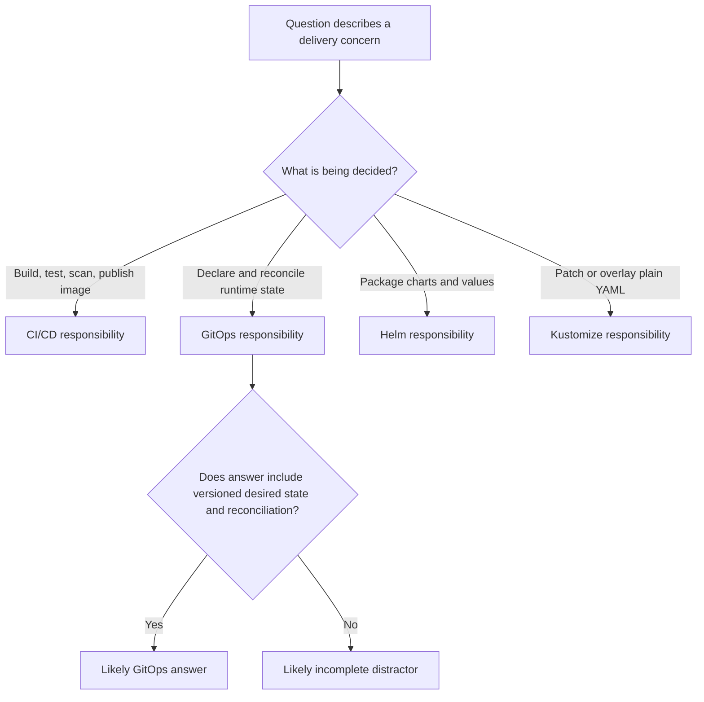

# CGOA Practice Questions Set 2

> **CGOA Track** | Practice questions | Set 2
> **Complexity:** Beginner to intermediate
> **Estimated time:** 60-75 minutes
> **Prerequisites:** CGOA modules 1.1 through 1.4, basic Kubernetes objects, Git pull requests, YAML manifests, and the idea that controllers reconcile desired state

## Learning Outcomes

By the end of this module, you will be able to:

1. **Compare** GitOps principles with adjacent practices such as IaC, CI/CD, and manual deployment by identifying the role of declarative desired state and pull-based reconciliation.
2. **Diagnose** GitOps drift scenarios by tracing whether the failure belongs to Git, rendering, controller reconciliation, Kubernetes admission, or workload health.
3. **Evaluate** when Flux, Argo CD, Helm, and Kustomize are responsible for a delivery concern without confusing renderers, package managers, and reconciliation controllers.
4. **Design** an exam-ready response strategy for scenario questions by eliminating plausible distractors that omit versioned desired state, automatic reconciliation, or source-of-truth boundaries.
5. **Implement** a lightweight practice workflow that uses repository evidence, cluster evidence, and tool responsibility mapping to answer CGOA-style questions under time pressure.

## Why This Module Matters

A payments team at a mid-sized marketplace once treated GitOps as a prettier way to organize manifests. They had a repository, a pull-request rule, and a dashboard that showed applications as green. During a holiday sale, a production Deployment began failing readiness checks after a rushed image update, so an operator changed the image directly in the cluster while the incident call watched latency fall back toward normal. Fifteen minutes later, the GitOps controller reconciled the old image from Git, error rates rose again, and the incident report estimated more than two hundred thousand dollars in lost orders and refunds.

The team did not fail because it lacked a YAML repository. It failed because the humans and the automation disagreed about where truth lived. The operator saw the live cluster as the current truth because the hotfix had improved traffic. The controller saw Git as the declared desired state because that was the operating contract it had been given. Both views were understandable under pressure, but only one was durable in a GitOps system, and the durable fix needed to be reviewed, committed, reconciled, and observed through the same path as any other production change.

CGOA practice questions use this kind of tension constantly. The exam rarely asks whether you can repeat a slogan such as "Git is the source of truth." It asks whether you can distinguish GitOps from IaC, CI/CD, manual deployment, Helm templating, Kustomize overlays, Flux controllers, and Argo CD applications when several of those ideas appear in the same answer. This module keeps the original Set 2 coverage, but it turns those short comparison questions into a deeper reasoning workout that prepares you to reject answers that are partly true yet operationally incomplete.

## Core Content

### GitOps Principles Are a Control Loop, Not a File Format

The original Set 2 question about GitOps principles had one safe answer: the principles describe a pull-based control loop around declarative desired state. That answer matters because it includes the mechanism, not merely the storage location. GitOps can use YAML, JSON, Helm values, Kustomize overlays, or custom resources, but none of those formats make the practice work by themselves. The practice works when a versioned declaration is compared with the real environment and an automated controller moves the environment toward the declaration.

OpenGitOps describes four ideas that are useful for exam reasoning. The system must be declarative, so the repository describes what should exist rather than only listing imperative steps. The desired state must be versioned and immutable, so the history of intent can be reviewed, rolled back, and audited. Software agents must automatically pull and apply the approved state, which is why a controller is central to the model. The agents must continuously reconcile, so the system notices drift after the first deployment instead of treating deployment as a one-time copy operation.

Those ideas also explain why GitOps and IaC are related but not synonyms. Infrastructure as Code is a broad practice for managing infrastructure through machine-readable definitions, and it can be implemented with many workflows. GitOps is a narrower operating model that adds a Git-centered source of truth and a reconciliation loop for runtime environments. You can store Terraform, Kubernetes manifests, or policy definitions in Git without having a GitOps loop. You can also use GitOps to reconcile Kubernetes resources that were generated from IaC-adjacent tooling, but the controller behavior is the decisive part.

Think of GitOps like a thermostat rather than a clipboard. A clipboard can record the desired temperature, but it does not check the room or turn on the heater. A thermostat compares the target with the measured state and acts when they diverge. Git is the durable record of the target, and the controller is the device that keeps comparing and correcting. Without the controller, the repository is documentation. Without the repository, the controller has no reviewed desired state to enforce.

```ascii
+---------------------------+       pull desired state       +---------------------------+
| Git repository            |<------------------------------| GitOps controller         |
| versioned desired state   |                               | watches and reconciles    |
+------------+--------------+                               +-------------+-------------+
             |                                                            |
             | reviewed change becomes desired state                       | apply or report drift
             v                                                            v
+---------------------------+                               +---------------------------+
| Pull request history      |                               | Kubernetes 1.35+ cluster  |
| audit, review, rollback   |                               | actual runtime state      |
+---------------------------+                               +---------------------------+
```

The diagram deliberately places review history beside runtime reconciliation because both are part of the reasoning chain. A merged pull request explains why the desired state changed, but it does not prove the cluster accepted the change. A healthy workload proves the cluster is serving traffic, but it does not prove the live state still matches Git. Strong GitOps reasoning keeps those facts separate until evidence connects them.

Pause and predict: a teammate says, "GitOps is just IaC with Kubernetes YAML in a repository." Which part of that sentence is useful, and which part would lose points on a CGOA scenario question? A strong answer keeps the useful observation that GitOps often stores declarative Kubernetes configuration in Git, then rejects the incomplete conclusion because it omits automatic pull-based reconciliation and continuous drift detection.

This distinction is also why the original answer choice saying "GitOps only applies to application code" was wrong. GitOps can manage application manifests, platform add-ons, policy resources, namespace configuration, and other cluster-facing desired state. The limit is not whether something is called application code. The limit is whether the desired state can be declared, versioned, authorized, rendered if necessary, and safely reconciled by an agent with appropriate permissions.

### Versioned Desired State Shapes Every Safe Answer

The second original question asked which scenario best fits GitOps, and the correct scenario was a cluster pulling desired state from a versioned repository and reconciling drift automatically. That wording is dense because it names three separate pieces of the model. The repository is versioned, so intent has history. The cluster or controller pulls the state, so the trust boundary is different from a remote runner pushing commands. Drift is reconciled automatically or reported according to policy, so the system keeps working after initial deployment.

Versioning is not only a convenience for rollback. It is the audit trail that lets a team explain why production changed at a specific time. When desired state moves through commits and pull requests, reviewers can inspect the change before it becomes the target state, and operators can later connect an incident to the exact declaration that introduced it. If a team manually edits production and records the decision in a wiki afterward, the wiki may be helpful evidence, but it is not the desired state that the controller will reconcile.

Desired state also has scope. A GitOps repository should not pretend to own every live field that appears when you dump an object from the Kubernetes API. Kubernetes controllers own status fields, defaulted fields, generated names, timestamps, and other runtime observations. Autoscalers may own replica counts when the platform delegates that decision. Admission controllers may mutate or reject objects according to policy. Good GitOps design says which fields belong to Git, which fields belong to other controllers, and how conflicts should be handled.

```yaml
apiVersion: apps/v1
kind: Deployment
metadata:
  name: checkout
  namespace: shop
spec:
  replicas: 3
  selector:
    matchLabels:
      app: checkout
  template:
    metadata:
      labels:
        app: checkout
    spec:
      containers:
        - name: checkout
          image: registry.example.com/checkout:v1.8
          ports:
            - containerPort: 8080
```

This manifest is useful for practice because it contains fields that often appear in drift scenarios. If Git declares `replicas: 3` and a human scales the Deployment to two replicas, the live cluster now differs from desired state unless an autoscaler or explicit process owns that field. If Git declares `checkout:v1.8` and a human changes the image to `checkout:v1.9-hotfix`, the mismatch is more serious because the running software no longer matches the reviewed declaration. The application might be healthier for the moment, but the system is no longer aligned with its operating contract.

The practical command sequence starts with inspection, not mutation. In this module, `k` is the standard shorthand for `kubectl`; if your shell does not already define it, use the following alias before trying the commands. The alias is common in Kubernetes study environments, but the important habit is the evidence sequence: inspect the declared target, inspect the live object, inspect controller status, and only then decide whether to commit, sync, pause, or escalate.

```bash
alias k=kubectl
k -n shop get deployment checkout -o yaml
k -n shop describe deployment checkout
k -n shop get events --sort-by=.lastTimestamp
```

Before running this in a real cluster, what output would you expect if the GitOps controller already tried to apply a new image but Kubernetes rejected it? You would expect the live Deployment to remain on the old image, the events or controller status to mention an apply or admission failure, and the desired repository to contain the newer image. That evidence points to a reconciliation or policy problem, not a missing CI build.

A useful mental model is to treat every GitOps incident as a comparison between desired state, rendered state, applied state, and healthy state. Desired state is what the repository says. Rendered state is what tools such as Helm or Kustomize produce from that repository. Applied state is what the Kubernetes API accepts. Healthy state is what the workload reports after the apply. Many exam distractors collapse those stages, which is why a question can sound simple while testing several boundaries at once.

### CI/CD, IaC, and GitOps Overlap Without Becoming the Same Practice

CGOA comparison questions often include adjacent practices because real platforms use them together. CI/CD builds and validates artifacts, IaC declares infrastructure through code, and GitOps reconciles approved desired state into an environment. A platform may use all three in one delivery path. The exam skill is not to choose one buzzword as universally better, but to assign each responsibility to the correct part of the system.

A CI pipeline usually begins with application source code. It runs tests, builds a container image, scans dependencies, signs or attests artifacts if the organization requires that, and publishes the image to a registry. The pipeline may then update a manifest repository by changing a Helm values file, a Kustomize image tag, or an Application definition. Once that desired-state change is reviewed and merged, the GitOps controller observes the repository and reconciles the environment. CI produced the artifact and proposed the target; GitOps moved the runtime toward that target.

Infrastructure as Code sits slightly differently. Terraform, Pulumi, Crossplane, Cluster API, and cloud-specific tools can all manage infrastructure declarations. Some run as push-oriented pipelines, some run as controllers, and some can be integrated with GitOps workflows. The label IaC does not tell you whether reconciliation is continuous, whether Git is the source of truth, or whether the target environment pulls state. For CGOA, if an answer says "GitOps and IaC are synonyms," reject it because it erases the control-loop details that make GitOps distinct.

```ascii
+----------------------+      +----------------------+      +----------------------+
| Application source   |      | CI/CD pipeline       |      | Desired-state repo   |
| code, tests, commits |----->| build, scan, publish |----->| manifests or values  |
+----------------------+      +----------------------+      +----------+-----------+
                                                                  |
                                                                  | pull and render
                                                                  v
                                                       +----------------------+
                                                       | GitOps controller    |
                                                       | compare and apply    |
                                                       +----------+-----------+
                                                                  |
                                                                  v
                                                       +----------------------+
                                                       | Kubernetes runtime   |
                                                       | workloads and policy |
                                                       +----------------------+
```

The clean handoff in that flow prevents two systems from writing the same runtime state. If CI updates Git and then also directly applies the manifests to production, while Argo CD or Flux watches the same path, the team now has two writers. The direct apply might succeed before the controller sees the commit, or it might apply a slightly different rendered result than the controller later computes. Either way, the audit story becomes harder because the team must ask whether the live change came from CI push behavior or controller reconciliation.

There are environments where a push-based pipeline is a deliberate choice. Small teams, isolated clusters, or temporary systems may decide that CI applying manifests is acceptable for their risk profile. GitOps is not a moral judgment against every push deployment. It is a design that favors reviewed desired state, scoped controller permissions, and continuous reconciliation. The exam usually rewards the answer that names those mechanisms instead of the answer that treats any repository-driven deployment as GitOps.

This is also why manual production hotfixes require discipline. During an incident, a direct command may be the fastest way to restore service, but it should be understood as a break-glass exception. The durable state must either be committed to Git or the cluster must be reconciled back to Git after the emergency. If the team leaves Git stale, the next sync can undo the fix, and the next incident review will struggle to reconstruct intent.

### Flux and Argo CD Are Controllers With Different Shapes

The original Set 2 comparison asked for the best description of Flux, and the correct answer was that Flux is a toolkit of specialized controllers for GitOps workflows. That matters because Flux is not just a dashboard, not merely a Helm replacement, and not a CI system for image builds. Flux is composed of controllers that reconcile sources, Kustomizations, Helm releases, notifications, and image automation workflows. The controller architecture is part of its identity.

Flux's source-controller fetches artifacts from Git repositories, Helm repositories, OCI sources, and other supported sources. The kustomize-controller reconciles Kustomization resources, the helm-controller reconciles HelmRelease resources, and the notification-controller handles event routing. Image automation controllers can update Git based on image policies when a team chooses that pattern. This modular design can feel less like a single application dashboard and more like a set of Kubernetes-native building blocks.

Argo CD is commonly described as application-centric because its Application custom resource, web UI, CLI, sync status, health view, and project model organize the operator experience around applications. Argo CD also uses controllers and Kubernetes custom resources, but the exam contrast is usually about emphasis. Flux often appears as a toolkit of specialized controllers, while Argo CD often appears as an application delivery controller with a strong UI and CLI experience. Both can implement GitOps; neither is defined by Helm or Kustomize alone.

| Tool | Primary role in GitOps reasoning | Common exam trap | Better mental shortcut |
|---|---|---|---|
| Flux | Modular GitOps controllers for sources, Kustomizations, Helm releases, notifications, and image automation | Calling it only a CI system or only a Helm renderer | Flux reconciles desired state through specialized controllers |
| Argo CD | Application-centric GitOps controller with UI, CLI, projects, sync, and health concepts | Calling it a Kubernetes distribution or admission policy engine | Argo CD manages app sync and health against declared desired state |
| Helm | Package manager and templating system for charts and values | Calling it the reconciliation loop by itself | Helm renders installable Kubernetes resources |
| Kustomize | Overlay and patch system for customizing Kubernetes YAML | Calling it a Helm-only testing tool | Kustomize transforms plain manifests without a template language |

These distinctions are enough for most CGOA questions, but real operations add nuance. Argo CD can render Helm charts and Kustomize overlays. Flux can reconcile HelmRelease resources and Kustomizations. Both tools can detect drift and apply desired state, but their configuration styles, multi-tenancy patterns, notification models, and operator workflows differ. A strong exam answer does not need to declare one universally superior; it needs to avoid assigning the wrong responsibility to the wrong tool.

Consider a team that wants a central dashboard where application owners can see sync status, compare live and desired manifests, and trigger manual syncs within project boundaries. Argo CD may fit that mental model well. Consider a platform team that wants Kubernetes-native resources composed across clusters with separate controllers for sources, Kustomize, Helm, notifications, and image policies. Flux may fit that architecture well. Both designs remain GitOps when they preserve declarative desired state, versioned history, pull-oriented reconciliation, and continuous drift handling.

Which approach would you choose here and why: a regulated platform team wants every production change to be traceable to a pull request, every application to show health in a central UI, and manual sync permissions to be delegated by project? The strongest answer may lean toward Argo CD for its application-centric UI and project controls, but it should still mention that Flux could also meet the GitOps principles with different operational ergonomics. Tool choice is rarely a principle by itself.

### Helm and Kustomize Render State; They Do Not Replace Reconciliation

The original Helm and Kustomize question captured one of the most common distractor pairs: Helm is templating and packaging, while Kustomize is patching and overlaying. That answer is intentionally plain because the exam often checks whether you can keep these tools in their lane. Helm charts combine templates, values, chart metadata, dependencies, and release behavior. Kustomize starts from plain manifests and applies overlays, patches, name transformations, image substitutions, and generators without a separate template language.

Both tools can be used inside GitOps repositories. An Argo CD Application can point at a Helm chart or a Kustomize directory. Flux can reconcile HelmRelease resources and Kustomization resources. The rendering tool turns repository inputs into Kubernetes manifests; the GitOps controller compares those rendered manifests with the cluster and applies changes. If an answer says Helm "manages the reconciliation loop" while Kustomize "manages controllers," it has swapped roles and should be eliminated.

```yaml
apiVersion: kustomize.config.k8s.io/v1beta1
kind: Kustomization
resources:
  - deployment.yaml
images:
  - name: registry.example.com/checkout
    newTag: v1.9
patches:
  - path: production-replicas.yaml
```

This Kustomize example changes the image tag and applies a production patch, but it does not continuously watch the cluster by itself. Something must run Kustomize, compare the result with the live state, and apply it. A GitOps controller can do that, a CI pipeline can do that, or an operator can do it manually. Only the first option matches the GitOps reconciliation model when the controller keeps observing and correcting over time.

Helm has a different shape because charts can package default values, templates, helpers, dependencies, and release metadata. That makes Helm useful for distributing configurable applications, especially when a platform team wants one chart to support several environments. The tradeoff is that template logic can become hard to read if teams overuse conditionals or hide important Kubernetes fields behind values. GitOps does not remove that complexity; it makes the rendered result and reconciliation status visible if the controller integrates with Helm well.

Kustomize usually feels closer to Kubernetes YAML because the base resources remain visible and overlays describe changes. That can make reviews easier for simple environment differences, but it can become awkward when teams need complex parameterization or reusable packaging across many consumers. Again, GitOps does not decide the tradeoff automatically. It requires the chosen rendering approach to produce a clear desired state that can be reviewed, rendered consistently, and reconciled safely.

| Decision point | Prefer Helm when... | Prefer Kustomize when... |
|---|---|---|
| Packaging | You need chart metadata, dependencies, and values for reusable distribution | You already have plain manifests and need environment overlays |
| Review style | Reviewers understand the chart and values that produce final resources | Reviewers want patches that stay close to Kubernetes object structure |
| Variation | Many installations need configurable templates | A small set of environments need targeted overlays |
| GitOps integration | The controller supports Helm rendering or HelmRelease reconciliation | The controller supports Kustomize rendering or Kustomization reconciliation |

The exam trap is to confuse "can be part of delivery" with "is the delivery controller." Helm and Kustomize can be essential parts of a GitOps repository, but they do not automatically provide source watching, drift detection, health assessment, or continuous reconciliation. If a question asks for the tool that reconciles cluster state from Git, look for Flux or Argo CD. If it asks for templating charts, look for Helm. If it asks for overlays and patches over YAML, look for Kustomize.

### Reading Practice Questions as Operational Scenarios

The fastest way to improve on this practice set is to stop treating each question as a vocabulary flashcard. Most wrong answers contain a true word in the wrong place. A distractor may mention Git but omit reconciliation. It may mention pull requests but omit desired state. It may mention Helm but ask about controllers. It may mention manual hotfixes but ignore the fact that Git remains the declared source of truth. Your job is to identify which answer preserves the whole operating model.

Start by finding the object of control. Is the question asking about the repository, the controller, the rendered manifests, the live Kubernetes object, or the human approval process? Then find the direction of change. Is something being pulled by a controller, pushed by CI, manually applied by an operator, or mutated by another Kubernetes controller? Finally, find the ownership boundary. Who is allowed to declare the desired state, and who is allowed to change the live state?

For example, a scenario says a release is triggered by an email approval chain and an operator copies manifests into each cluster with a shell script. That scenario may include approval and automation, but it does not describe GitOps because the cluster is not pulling versioned desired state through a reconciliation controller. Another scenario says the cluster pulls desired state from a repository and reconciles drift automatically. That scenario is much closer because it includes the key signals the original Set 2 question wanted you to remember.

The same method handles tool questions. If the question asks for the best description of Flux, eliminate answers that call it only a dashboard, only a Helm replacement, or a CI system. If the question asks for the best description of Argo CD, eliminate answers that call it a policy engine, Kubernetes distribution, or database tool. If the question asks about Helm versus Kustomize, eliminate answers that put reconciliation loops inside Helm or controllers inside Kustomize. The correct choice usually keeps the tool's main responsibility intact.

War story: a platform team once spent several hours debugging "Flux not deploying" after an image update. The image had been built and pushed correctly, Flux had pulled the repository correctly, and the Kustomization had rendered correctly. The apply failed because a namespace quota prevented the Deployment from creating an additional ReplicaSet during rollout. The fix was not a Git credential change or a Helm values change. It was a Kubernetes capacity and policy issue that surfaced during reconciliation.

That story is useful for exams because it shows why GitOps reasoning is a chain. A controller can be configured correctly and still fail to apply desired state. CI can produce a good artifact and still leave the cluster unchanged. Helm can render valid manifests that admission later rejects. A dashboard can say "out of sync" while the workload is serving traffic. The answer is strongest when it explains where the failure sits and what evidence would confirm it.

## Patterns & Anti-Patterns

The safest GitOps pattern is to keep a single writer for each piece of runtime desired state. CI can build images, update repository declarations, and request review, while the GitOps controller owns reconciliation into the cluster. This pattern scales because incidents, audits, and rollbacks all point back to a repository commit and controller status. It also makes permission design cleaner because external build systems do not need broad production mutation rights.

Another useful pattern is to define ownership boundaries for fields that other controllers may change. Kubernetes itself owns status fields, defaulting, generated metadata, and some managed fields. Autoscalers may own replica counts. Secret-management controllers may own generated Secret contents. GitOps becomes noisy when every live difference is treated as a human-caused violation, so platform teams should document which differences are expected and which differences represent actionable drift.

A third pattern is to teach teams the render-then-reconcile chain. Repository inputs become rendered manifests through Helm, Kustomize, Jsonnet, or another supported mechanism. The controller compares that rendered desired state to live Kubernetes objects. Kubernetes admission and policy decide whether the apply is accepted. Workload health then determines whether the running system is usable. When teams diagnose in that order, they avoid random fixes that only move the problem to another stage.

| Pattern | When to use it | Why it works | Scaling consideration |
|---|---|---|---|
| CI proposes, controller reconciles | Production and shared clusters where auditability matters | Separates artifact work from runtime mutation | Requires clear repository conventions and controller permissions |
| Field ownership map | Clusters with autoscalers, admission controllers, and generated resources | Prevents false drift alarms and missed real drift | Needs maintenance as controllers and policies change |
| Render evidence before live mutation | Any incident involving Helm, Kustomize, Flux, or Argo CD | Locates the failure stage before changing production | Operators need access to controller status and rendered output |
| Break-glass with Git follow-up | Incidents where direct intervention may be necessary | Restores service while preserving long-term source-of-truth discipline | Requires a time-box, owner, and post-incident commit or sync |

The most damaging anti-pattern is treating Git as documentation after manual changes. Teams fall into this because direct cluster edits feel concrete during an incident, while a pull request can feel slower. The better alternative is not to forbid emergency action blindly. The better alternative is to define a break-glass process that pauses or expects reconciliation, records the reason, and converts the final decision into Git as soon as the emergency allows.

A second anti-pattern is giving every delivery tool every permission. A CI runner with production cluster-admin, a GitOps controller with unrestricted cluster scope, and human operators with permanent broad access create overlapping mutation paths. The better alternative is least privilege with clear ownership. CI should not need to mutate production if the controller owns reconciliation. The controller should only manage the resources and namespaces within its responsibility. Human break-glass access should be exceptional, logged, and reviewed.

A third anti-pattern is choosing tools by dashboard preference alone. A polished UI is useful, and Argo CD's application view can be valuable, but the platform still needs repository structure, RBAC, secret handling, health checks, sync policies, and drift response. Flux's modular controllers can be elegant, but they still need operational conventions that humans can understand. Tool selection should begin with the workflow and risk model, then choose the tool whose architecture supports that model.

## Decision Framework

When a CGOA question mixes GitOps, CI/CD, Flux, Argo CD, Helm, and Kustomize, use a structured decision framework instead of searching your memory for a phrase. First, classify the concern. If the concern is building, testing, scanning, or publishing an artifact, the answer probably belongs to CI/CD. If the concern is declaring target runtime state in Git and reconciling the cluster, the answer probably belongs to GitOps. If the concern is chart packaging and values, look for Helm. If the concern is overlays and patches over YAML, look for Kustomize.

Second, test whether the answer includes the GitOps mechanism. A GitOps answer should include declarative desired state, versioned storage, automatic pull or agent-driven application, and continuous reconciliation or drift detection. It does not need to use those exact words every time, but it must not reduce the model to "YAML in Git" or "deployment by pull request." If an option leaves out the controller loop, it is usually incomplete.

Third, ask what evidence would prove the answer in a real cluster. If someone claims the controller failed, you would check controller status, repository access, rendered manifests, events, and health conditions. If someone claims CI failed, you would check build logs, image registry state, scan results, and manifest update commits. If someone claims Helm or Kustomize is responsible, you would inspect the rendered output and repository inputs. Evidence-based reasoning is the bridge between exam questions and actual operations.



The framework also handles security questions. If the question emphasizes reducing direct production credentials in external systems, a pull-based GitOps controller is usually the stronger answer because the cluster-side agent can reconcile with scoped Kubernetes permissions. That does not remove all risk. The repository, controller, registry, network path, secret store, and RBAC still need protection. The exam-level answer should say "reduces direct external mutation paths," not "eliminates security concerns."

Finally, use elimination aggressively. Answers that say GitOps only applies to application code are too narrow. Answers that say GitOps and IaC are synonyms are too broad. Answers that make Helm or Kustomize responsible for continuous reconciliation are assigning the wrong layer. Answers that recommend manual cluster changes as the durable source of truth contradict the operating model. When two answers look close, choose the one that preserves the full loop from reviewed desired state to reconciled runtime.

A compact example shows how the framework changes your answer under pressure. Imagine a question says a pull request changed the image tag, the controller saw the commit, the rendered manifest contains the expected tag, but the live Deployment remains unchanged. A weak test taker may choose an answer about rerunning CI because the word "image" appears in the scenario. A stronger test taker notices that the artifact and desired-state update have already happened, so the next evidence should come from controller apply status, Kubernetes events, RBAC, admission policy, quotas, or workload rollout conditions.

Now change one fact in the same scenario: the controller never observes the merged commit. The correct investigation moves earlier in the chain. You would inspect repository URL configuration, branch selection, path selection, credentials, webhooks, polling interval, network reachability, and controller logs. Kubernetes events for the workload may be quiet because the controller never reached the stage where it tried to apply anything. This is why memorizing one "cluster did not update" answer is weaker than tracing the stage where evidence stops.

Change another fact: the controller observes the commit, renders the manifest, applies it successfully, and the Deployment creates a new ReplicaSet, but health stays degraded because readiness probes fail. That is no longer primarily a GitOps source-of-truth problem. The desired state has reached the cluster, and the live workload is reporting that the new version cannot serve safely. The next answer should discuss rollout health, application logs, probes, dependencies, and rollback through Git or controller sync policy, not Git credentials or Helm chart discovery.

This staged reasoning also protects you from overcorrecting during real incidents. If a controller cannot reach the repository, changing a Deployment image directly might restore service, but it does not fix repository access. If admission rejects an unsigned image, forcing a direct update may violate the policy that protects production. If health fails after a successful apply, repeatedly syncing the same desired state is unlikely to help. Each case needs a response that matches the failed stage, and the best CGOA answers usually describe that matching.

When you review missed questions, write the stage name beside the miss. Use labels such as source, render, reconcile, admission, rollout, health, tool role, or security boundary. The label keeps the review short while making the pattern visible across questions. If most misses say "tool role," return to the Flux, Argo CD, Helm, and Kustomize comparison. If most misses say "reconcile" or "drift," return to the principle section and practice explaining why Git remains desired state even when the live cluster is temporarily different. That habit turns mistakes into precise next actions.

## Did You Know?

1. The OpenGitOps project describes four principles: declarative desired state, versioned and immutable storage, automatically applied agents, and continuous reconciliation.
2. Flux graduated from the Cloud Native Computing Foundation in 2022, and its architecture is intentionally split across specialized controllers rather than presented only as one central dashboard.
3. Argo CD graduated from the Cloud Native Computing Foundation in 2022, and its Application custom resource is a central concept for grouping sync, health, and source configuration.
4. Kustomize has been available through `kubectl kustomize` since Kubernetes 1.14, which is why many Kubernetes users encounter overlays before they install any separate templating tool.

## Common Mistakes

| Mistake | Why It Happens | How to Fix It |
|---|---|---|
| Defining GitOps as "YAML in Git" | The repository is visible, while the reconciliation loop is easy to overlook in short explanations. | Include declarative desired state, versioned history, agent-driven application, and continuous reconciliation in the definition. |
| Treating GitOps and IaC as synonyms | Both use code or files to describe infrastructure, so the practices look similar from far away. | Explain that IaC is broader, while GitOps adds a Git-centered source of truth and reconciliation model. |
| Letting CI and the GitOps controller both apply production manifests | Teams try to make delivery faster by keeping an old push step after adding a controller. | Let CI build artifacts and propose desired-state changes, then let the controller own runtime reconciliation. |
| Calling Helm or Kustomize the GitOps controller | Rendering tools appear in the same repository as GitOps configuration, so their roles get blended. | Describe Helm as chart templating and packaging, Kustomize as overlays and patches, and Flux or Argo CD as reconciliation controllers. |
| Assuming every live difference is bad drift | Kubernetes status fields, autoscalers, and admission controllers legitimately change some fields. | Identify field ownership before deciding whether to sync, ignore, commit, or investigate. |
| Keeping a manual incident fix only in the live cluster | The live fix feels successful because traffic improves, but Git remains stale. | Commit the durable fix to Git or reconcile back to Git after the break-glass period ends. |
| Choosing a tool because of one feature instead of the operating model | A dashboard, CLI, or controller name can distract from the workflow and risk model. | Start with desired state, ownership, permissions, rendering, sync policy, and audit requirements, then choose the tool. |

## Quiz

<details>
<summary>1. Your team is reviewing an exam answer that says GitOps is primarily about using YAML instead of JSON. Why should you reject it?</summary>

The answer focuses on file format while missing the operating model. GitOps can use YAML because Kubernetes resources are commonly expressed that way, but the important parts are declarative desired state, versioned storage, automatic agent-driven application, and continuous reconciliation. A better answer would describe a pull-based control loop around desired state rather than treating serialization syntax as the principle.
</details>

<details>
<summary>2. A cluster pulls desired state from a versioned repository and reconciles drift automatically after a human changes a Deployment directly. Which GitOps principle does this scenario demonstrate most clearly?</summary>

It demonstrates that Git is the reviewed desired-state source and that a controller continuously reconciles the live environment toward that state. The direct change created a mismatch between desired and actual state, so the controller either corrected it or reported it according to policy. The key signals are versioned desired state, pull-oriented controller behavior, and drift handling.
</details>

<details>
<summary>3. A practice question describes Flux as a CI system for building container images. What is the best correction?</summary>

Flux is better described as a toolkit of specialized Kubernetes controllers for GitOps workflows. It can participate in image automation by updating desired-state repositories based on image policies, but it is not primarily the system that compiles source code and builds images. The CI system owns build, test, scan, and publish work; Flux reconciles declared state through controllers such as source-controller, kustomize-controller, and helm-controller.
</details>

<details>
<summary>4. A platform team wants an application-centric GitOps controller with UI and CLI support for sync and health status. Which tool description should they associate with that requirement?</summary>

They should associate that description with Argo CD. Argo CD organizes delivery around Application resources, sync status, health assessment, projects, a web UI, and a CLI. That does not mean Flux cannot implement GitOps, but the specific application-centric description is the one CGOA questions commonly use for Argo CD.
</details>

<details>
<summary>5. Your repository contains a Helm chart for a service and Kustomize overlays for each environment. A teammate says Helm and Kustomize now replace the GitOps controller. What should you explain?</summary>

Helm and Kustomize can produce or customize manifests, but they do not by themselves provide continuous source watching, drift detection, health assessment, and reconciliation. A GitOps controller such as Flux or Argo CD can use Helm or Kustomize as a rendering step, then compare the result with the live cluster and apply changes. The clean distinction is that rendering prepares desired state, while reconciliation keeps the environment aligned with it.
</details>

<details>
<summary>6. A merged pull request updates an image tag, but the cluster still runs the old image. Controller status says the desired manifest rendered correctly, and Kubernetes events show an admission policy denied unsigned images. What is the best next action?</summary>

The next action is to fix the signing or policy compliance problem and let reconciliation proceed after the desired state is valid for the cluster. The repository and render steps already appear to be working, so re-running CI blindly or changing Git credentials would not address the evidence. A direct manual image change would bypass the same control that intentionally blocked the update.
</details>

<details>
<summary>7. A team uses CI to build images, update the desired-state repository, and directly apply the manifests while Argo CD watches the same path. What design risk should you identify?</summary>

The team has two systems writing the same runtime state, which creates unclear ownership and confusing audit behavior. CI may apply one rendered result while Argo CD later computes and applies another, or the controller may report drift after CI has already changed the cluster. A cleaner design lets CI build and propose desired-state changes while the GitOps controller owns reconciliation into Kubernetes.
</details>

## Hands-On Exercise

This exercise is a paper lab you can complete with a text editor, a local repository, or a real Kubernetes 1.35+ practice cluster. The goal is to turn Set 2 comparison questions into a repeatable diagnostic workflow. You will classify a scenario, assign tool responsibilities, and write exam-ready explanations that preserve the GitOps operating model.

### Scenario

The `checkout` service is managed through a desired-state repository. CI builds and scans `registry.example.com/checkout:v1.9`, then updates a Kustomize overlay and opens a pull request. After the pull request merges, the GitOps controller reports the application as out of sync. The live Deployment still runs `registry.example.com/checkout:v1.8`, and an operator is tempted to run a direct image update because the release is time sensitive.

### Task 1: Classify the Evidence

Write a short note that separates repository evidence, render evidence, controller evidence, Kubernetes admission evidence, and workload health evidence. Use the categories even if the scenario has not provided every detail yet. The purpose is to train yourself to ask for the next missing fact instead of jumping to a manual mutation.

- [ ] You identified the desired image tag in Git.
- [ ] You identified the live image tag in Kubernetes.
- [ ] You stated whether the controller observed the merged commit.
- [ ] You named at least one Kubernetes-level reason the apply might fail.

<details>
<summary>Solution guide</summary>

A strong answer says Git declares `checkout:v1.9`, while the live Deployment still runs `checkout:v1.8`. It asks whether the controller observed the commit, whether Kustomize rendered the expected manifest, and whether Kubernetes rejected the apply through admission, RBAC, quota, or invalid object configuration. It does not recommend a direct image mutation as the durable first response because that would bypass the desired-state path.
</details>

### Task 2: Map Tool Responsibilities

Create a table that assigns each responsibility to CI/CD, Kustomize, Flux or Argo CD, Git, or Kubernetes. Include at least these responsibilities: build image, scan image, store desired state, apply overlays, detect drift, apply desired state, enforce admission policy, and report workload health.

- [ ] You assigned build and scan work to CI/CD.
- [ ] You assigned desired-state history to Git.
- [ ] You assigned overlay rendering to Kustomize.
- [ ] You assigned drift detection and reconciliation to Flux or Argo CD.
- [ ] You assigned admission decisions and workload health signals to Kubernetes components.

<details>
<summary>Solution guide</summary>

The expected mapping is CI/CD for build and scan, Git for reviewed desired-state history, Kustomize for overlay rendering, Flux or Argo CD for reconciliation, and Kubernetes admission or workload controllers for policy and health signals. Helm would be the rendering answer if the repository used charts and values instead of Kustomize overlays. The important exam skill is not the brand name; it is keeping renderers, controllers, and build systems separate.
</details>

### Task 3: Choose a Safe Response

Pick one response path and justify it in four to six sentences: wait for the controller after confirming it observed the commit, fix the render or admission problem and let reconciliation continue, pause reconciliation briefly under a break-glass process, or sync back to Git because the manual change was unapproved. Explain why your chosen response preserves auditability.

- [ ] Your response includes a Git-based durable action or a controller-based sync.
- [ ] Your response avoids treating a direct cluster edit as the final source of truth.
- [ ] Your response explains what evidence would make you pause reconciliation.
- [ ] Your response names the risk of leaving Git stale after an incident.

<details>
<summary>Solution guide</summary>

A strong answer is evidence dependent. If the controller has not observed the commit, investigate repository access, path configuration, branch selection, webhook delivery, or polling. If the controller rendered the desired manifest but admission denied it, fix the signing, RBAC, quota, or policy problem. If a direct emergency change is necessary, pause or account for reconciliation, then commit the durable decision to Git or sync back once the incident ends.
</details>

### Task 4: Rewrite the Original Short Answers

Take the five original Set 2 topics and write one exam-ready sentence for each: GitOps principles, best-fit GitOps scenario, Flux description, Argo CD description, and Helm versus Kustomize. Each sentence should include the reason the correct answer is stronger than the common distractor.

- [ ] Your GitOps principles sentence includes pull-based reconciliation around declarative desired state.
- [ ] Your scenario sentence includes versioned repository state and automatic drift handling.
- [ ] Your Flux sentence describes specialized controllers rather than a CI build system.
- [ ] Your Argo CD sentence describes an application-centric controller with UI and CLI support.
- [ ] Your Helm and Kustomize sentence distinguishes chart templating from overlays and patches.

<details>
<summary>Solution guide</summary>

The strongest version says GitOps is a pull-based reconciliation model around declarative desired state, not a file-format preference. The best-fit scenario is a cluster or controller pulling versioned state and reconciling drift, not manual hotfix documentation or email approval. Flux is a modular controller toolkit, Argo CD is application-centric with UI and CLI workflows, and Helm templates charts while Kustomize overlays and patches YAML.
</details>

### Task 5: Time-Box the Exam Method

Set a timer for twelve minutes and answer seven scenario questions from this module without looking back at the explanations. For every missed answer, write the missing mechanism in one phrase: desired state, versioned history, controller pull, drift, renderer, admission, health, or tool responsibility. The phrase is more useful than rewriting the whole question because it shows the exact concept that failed.

- [ ] You answered the quiz without using the module text.
- [ ] You wrote one missing mechanism for every missed question.
- [ ] You reviewed any missed tool question by naming the tool's responsibility.
- [ ] You reviewed any missed scenario question by tracing the evidence chain.

<details>
<summary>Solution guide</summary>

The goal is to produce a compact error log. If you missed the Flux question, the missing phrase might be "specialized controllers." If you missed the Helm and Kustomize question, it might be "renderer, not reconciler." If you missed the incident question, it might be "Git remains desired state." Reviewing by mechanism trains transfer to new questions better than memorizing the exact wording.
</details>

## Sources

- https://opengitops.dev/
- https://opengitops.dev/#principles
- https://fluxcd.io/flux/concepts/
- https://fluxcd.io/flux/components/
- https://argo-cd.readthedocs.io/en/stable/core_concepts/
- https://argo-cd.readthedocs.io/en/stable/user-guide/sync-options/
- https://helm.sh/docs/topics/charts/
- https://helm.sh/docs/chart_template_guide/values_files/
- https://kubernetes.io/docs/tasks/manage-kubernetes-objects/kustomization/
- https://kubectl.docs.kubernetes.io/references/kustomize/
- https://kubernetes.io/docs/concepts/overview/working-with-objects/
- https://kubernetes.io/docs/concepts/architecture/controller/

## Next Module

Return to the [CGOA track overview](./) to choose the next review topic or repeat the practice sets under exam conditions.
