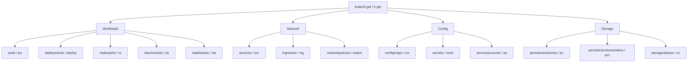
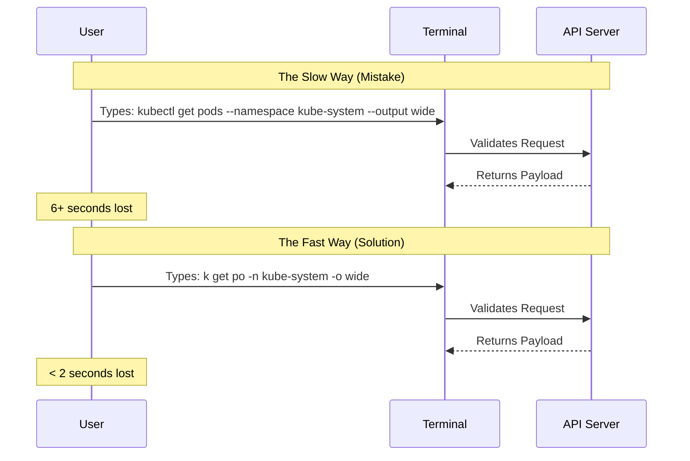

> **Complexity**: `[QUICK]` - Setup once, benefit forever
>
> **Time to Complete**: 15-20 minutes
>
> **Prerequisites**: Module 0.1 (working cluster running Kubernetes v1.35 or higher)

## What You'll Be Able to Do

After completing this extensive module, you will be well-equipped to perform the following high-level technical operations:
- **Design** a highly optimized, cross-compatible shell environment utilizing advanced bash configuration and aliases to drastically reduce operational latency during high-stakes scenarios.
- **Implement** rapid automated completion and declarative YAML templating workflows by leveraging imperative Kubernetes commands, custom environment variables, and process substitution techniques.
- **Diagnose** common execution failures and unexpected shell behaviors related to POSIX compliance, shell dialects, and environment variable inheritance during complex troubleshooting tasks.
- **Evaluate** the efficacy of various terminal multiplexers, cross-shell prompts, and historical shell architectures to maintain strict situational awareness across multiple disparate Kubernetes clusters.

## Why This Module Matters

Like the *Infrastructure as Code* module’s Knight Capital 2012 <!-- incident-xref: knight-capital-2012 --> lesson, the practical issue is this: operator speed and situational awareness collapse when state is split across many terminals, and shell workflows must make multi-host triage instantaneous under pressure.

A 2017 GitLab operational failure (see *What is a Terminal*) <!-- incident-xref: gitlab-2017-db1 --> shows why terminal naming discipline and environment validation are mandatory in production workflows, especially during high-risk database or config operations.

In the Certified Kubernetes Administrator (CKA) exam, and in real-world production environments running Kubernetes v1.35+, you have roughly seven minutes to diagnose, resolve, and verify a solution for any given failure scenario. Every single keystroke represents a fraction of a second you cannot get back. The difference between meticulously typing `kubectl get pods --all-namespaces --output wide` and simply executing `k get po -A -o wide` may seem trivial in isolation, but when multiplied across fifty or more distinct troubleshooting operations, the compounded time savings amount to five or ten full minutes. That is enough time to solve an entire additional exam question or prevent a cascading failure from bringing down a secondary production cluster. This module is strictly designed to transform your shell environment from a passive text entry prompt into a highly tuned, context-aware command center.

## What You'll Configure

The optimizations we implement in this module will yield immediate, highly visible transformations to your daily workflow. Observe the following before-and-after scenarios:

```
Before: kubectl get pods --namespace kube-system --output wide
After:  k get po -n kube-system -o wide

Before: kubectl describe pod nginx-deployment-abc123
After:  k describe po nginx<TAB>  → auto-completes full name

Before: kubectl config use-context production-cluster
After:  kx production<TAB>  → switches context with autocomplete
```

> **The Race Car Pit Crew Analogy**
>
> In Formula 1, pit stops are won or lost by fractions of a second. The crew doesn't wing it—every movement is rehearsed, every tool is positioned perfectly, every action is muscle memory. Your shell setup is your pit crew. Aliases are your pre-positioned tools. Autocomplete is your practiced muscle memory. Without preparation, you fumble. With it, you're changing tires in 2 seconds flat while others are still looking for the wrench.

## Deep Architecture: Shells, POSIX, and Your Execution Environment

Before blindly copying configurations into your terminal, it is critical to understand the underlying execution environment processing these commands. The default shell environment provided in the CKA exam is typically based on a modern Ubuntu distribution. However, the ecosystem of command-line interpreters is vast, fragmented, and heavily influenced by historical licensing and standardization battles.

The POSIX (Portable Operating System Interface) standard defines the baseline behavior expected from any compliant UNIX shell. The current standard, POSIX.1-2024 (IEEE Std 1003.1-2024, Issue 8), was officially published on June 14, 2024. It represents the first major revision with new interfaces since the previous standard, POSIX.1-2017 (Issue 7). On Ubuntu systems, the system shell located at `/bin/sh` is entirely POSIX-compliant, but it is actually the `dash` shell, not `bash`. Ubuntu has used `dash` for system scripts since version 6.10 to drastically improve boot times. 

For interactive login sessions, however, GNU Bash remains the undisputed king. As of July 3, 2025, GNU Bash 5.3 is the current stable release. This release introduced highly advanced in-process command substitutions, such as `${ cmd; }`, which captures standard output without the severe performance penalty of forking a subshell.

When you manage Kubernetes clusters across different operating systems, you will encounter significant dialect differences. For example, Apple completely transitioned the default interactive shell for new user accounts from Bash to Zsh starting with macOS 10.15 Catalina. This was not a purely technical decision; it was driven by licensing. Modern Bash (version 4.0 and higher) utilizes the restrictive GPL v3 license, which Apple refuses to distribute. Consequently, macOS still ships with the ancient Bash 3.2.x series (licensed under GPL v2). While Apple strictly avoids bundling GPL v3 software, meaning modern macOS releases ship with the outdated Bash 3.2.x series (though the precise patch-level version bundled with the latest macOS Sequoia 15 remains officially undocumented by Apple, community consensus historically points to 3.2.57). This severely limits out-of-the-box compatibility for advanced scripts relying on features like associative arrays (`declare -A`), which were first introduced in Bash 4.0.

Furthermore, while the official SourceForge repository documents Zsh 5.9 (released May 14, 2022) as the latest stable build, the community surrounding the project is highly active, with secondary mailing list sources actively debating test builds and potential 5.10 releases. Frameworks like Oh My Zsh provide massive extensibility, though it is currently unverified whether they maintain strict numbered semantic release tags or rely purely on a rolling-update model.

Understanding these boundaries allows you to design Kubernetes automation scripts that are portable, reliable, and compliant.

## Part 1: kubectl Autocomplete and Process Substitution

The most vital optimization you can implement is shell autocompletion for the Kubernetes CLI. 

> **Pause and predict**: You need to describe a specific pod named `payment-processor-deployment-7f89c5b4d-9xt2z`. Without autocomplete, what happens if you misspell a single character in the pod name while rushing during the exam?
>
> You will get a "NotFound" error, forcing you to run `kubectl get pods` again, find the exact name, and retype or carefully copy-paste it. This small mistake just cost you 30-60 seconds. Autocomplete eliminates this risk entirely, allowing you to hit `<TAB>` and let the shell do the exact matching.

### 1.1 Enable Bash Completion

The following sequence uses a highly specific Bash feature known as process substitution.

```bash
# Install bash-completion if not present
sudo apt-get install -y bash-completion

# Enable kubectl completion
echo 'source <(kubectl completion bash)' >> ~/.bashrc

# Apply now
source ~/.bashrc
```

It is vital to recognize that process substitution—the `<(cmd)` syntax seen above—is a Bash and KornShell (ksh) extension. It is absolutely not part of the POSIX `sh` specification. If you attempt to execute a script containing process substitution using `/bin/sh` on Ubuntu (which we established is the `dash` shell), it will immediately fail with a syntax error.

### 1.2 Test Autocomplete

Verify that your system correctly parses the dynamically generated completion rules:

```bash
kubectl get <TAB><TAB>
```

You should see a massive, categorized list of all accessible API resources managed by your Kubernetes v1.35 cluster.

```bash
kubectl get pods -n kube<TAB>
```

This should immediately autocomplete to the exact namespace string `kube-system`.

```bash
kubectl describe pod cal<TAB>
```

If you are running Calico as your Container Network Interface (CNI) plugin, this will autocomplete to the full hash-appended pod name dynamically assigned by the DaemonSet.

## Part 2: Essential Aliases and Shell Mechanics

Typing out the seven-letter word `kubectl` hundreds of times is a completely unnecessary expenditure of physical effort. We must alias it. However, a naive alias breaks autocompletion because the completion engine binds specifically to the literal word `kubectl`. We must explicitly instruct the completion engine to map its rules to our new alias.

### 2.1 The Core Alias

```bash
# The most important alias
echo 'alias k=kubectl' >> ~/.bashrc

# Enable completion for the alias too
echo 'complete -o default -F __start_kubectl k' >> ~/.bashrc

source ~/.bashrc
```

By adding these declarations to your `~/.bashrc` file, they are executed every time an interactive non-login shell is spawned. By definition, a Bash login shell attempts to read `~/.bash_profile` (falling back to `~/.bash_login`, then `~/.profile`), whereas standard interactive non-login shells directly read `~/.bashrc`.

### 2.2 Resource Type Shortcuts

The Kubernetes API server itself defines strict "short names" for resources. These are entirely native to Kubernetes and require no local shell configuration.

| Full Name | Short | Example |
|-----------|-------|---------|
| pods | po | `k get po` |
| deployments | deploy | `k get deploy` |
| services | svc | `k get svc` |
| namespaces | ns | `k get ns` |
| nodes | no | `k get no` |
| configmaps | cm | `k get cm` |
| secrets | (none) | `k get secrets` |
| persistentvolumes | pv | `k get pv` |
| persistentvolumeclaims | pvc | `k get pvc` |
| serviceaccounts | sa | `k get sa` |
| replicasets | rs | `k get rs` |
| daemonsets | ds | `k get ds` |
| statefulsets | sts | `k get sts` |
| ingresses | ing | `k get ing` |
| networkpolicies | netpol | `k get netpol` |
| storageclasses | sc | `k get sc` |

Below is a visual representation of how the `kubectl get` command internally resolves these resource hierarchies:



### 2.3 Recommended Additional Aliases

To further compound your speed advantage, configure specific combinatory aliases for your most heavily utilized imperative commands:

```bash
# Faster common operations
alias kgp='kubectl get pods'
alias kgpa='kubectl get pods -A'
alias kgs='kubectl get svc'
alias kgn='kubectl get nodes'
alias kgd='kubectl get deploy'

# Describe shortcuts
alias kdp='kubectl describe pod'
alias kds='kubectl describe svc'
alias kdn='kubectl describe node'

# Logs
alias kl='kubectl logs'
alias klf='kubectl logs -f'

# Apply/Delete
alias ka='kubectl apply -f'
alias kd='kubectl delete -f'

# Context and namespace
alias kx='kubectl config use-context'
alias kn='kubectl config set-context --current --namespace'

# Quick debug pod
alias krun='kubectl run debug --image=busybox --rm -it --restart=Never --'
```

### 2.4 Apply All Aliases

```bash
source ~/.bashrc
```

## Part 3: Context and Namespace Switching

The CKA exam architecture enforces a multi-cluster environment. You are guaranteed to interact with completely distinct control planes.

> **War Story: The $15,000 Mistake**
>
> A Senior DevOps engineer meant to gracefully terminate a degraded test namespace located within a staging cluster. They typed `kubectl delete ns payment-service` and forcefully struck the enter key. A moment later, their stomach dropped—they were still authenticated to the production context. Exactly 48 pods serving live, paying customers vanished from the scheduling queues. Recovery of the heavily stateful application took over three hours. The remediation? They now have their `PS1` variable configured to inject the active Kubernetes context directly into the shell prompt, highlighted in aggressive red text whenever connected to production. Context awareness is not an optional luxury—it is pure operational survival.

> **Stop and think**: You just finished a complex troubleshooting task on `cluster-a` and the next exam question asks you to fix a deployment on `cluster-b`. If you forget to switch contexts and accidentally apply your fix to `cluster-a`, what is the double penalty you incur?
>
> First, you fail to earn the points for the current question because the fix was applied to the wrong cluster. Second, you might have just broken the working state of the previous question, potentially losing points you had already earned. Always verify your context before typing any mutating command.

### 3.1 Understand Contexts

Use these foundational commands to interrogate your `kubeconfig` architecture:

```bash
# List all contexts
kubectl config get-contexts

# See current context
kubectl config current-context

# Switch context
kubectl config use-context <context-name>
```

### 3.2 Quick Context Switching

With the highly efficient `kx` alias we established earlier:

```bash
kx prod<TAB>     # Autocompletes to production-context
kx staging<TAB>  # Autocompletes to staging-context
```

### 3.3 Namespace Switching

Instead of redundantly passing the `-n namespace` flag on every subsequent command invocation, dynamically alter your local `kubeconfig` default context state:

```bash
# Set default namespace for current context
kn kube-system

# Now all commands default to kube-system
k get po  # Shows kube-system pods

# Switch back to default
kn default
```

> **Gotcha: Wrong Cluster**
>
> The #1 exam mistake is solving problems on the wrong cluster. Each question specifies a context. **Always switch context first.** Make it muscle memory:
> 1. Read question
> 2. Switch context
> 3. Then solve

## Part 4: Environment Variables and Imperative Templating

### 4.1 Dry-Run Shortcut

In modern Kubernetes v1.35 clusters, generating pristine, API-validated YAML templates is always preferred over attempting to manually author configuration files from scratch.

```bash
export do='--dry-run=client -o yaml'

# Usage
k run nginx --image=nginx $do > pod.yaml
k create deploy nginx --image=nginx $do > deploy.yaml
k expose deploy nginx --port=80 $do > svc.yaml
```

### 4.2 Force Delete (Use Carefully)

When workloads become hopelessly deadlocked in the `Terminating` state due to node disconnections or finalizer deadlocks, you must aggressively evict them from the API server memory.

```bash
export now='--force --grace-period=0'

# Usage (when you need instant deletion)
k delete po nginx $now
```

### 4.3 Add to .bashrc

```bash
echo "export do='--dry-run=client -o yaml'" >> ~/.bashrc
echo "export now='--force --grace-period=0'" >> ~/.bashrc
source ~/.bashrc
```

## Part 4.4: Shell Native Shortcuts and Terminal Multiplexers

Beyond custom aliases, mastering the internal GNU Readline bindings heavily bundled with Bash will drastically accelerate your command manipulation. GNU Readline 8.3 (released July 3, 2025) provides immensely powerful line editing capabilities and defaults to standard Emacs key bindings globally.

- **`Ctrl+R`**: Reverse incremental history search. By default, your shell retains commands based on the `HISTSIZE` variable (which securely defaults to 500 in Bash). Press `Ctrl+R` and type a fragment to instantly retrieve a massive command.
- **`!!`**: Execute the immediately preceding command, commonly utilized alongside `sudo` when permissions fail (`sudo !!`).
- **`Ctrl+A` / `Ctrl+E`**: Jump your cursor strictly to the beginning or end of the current operational line.
- **`Ctrl+W`**: Delete the entire word positioned directly before the cursor.

For operators requiring continuous presence across multiple nodes, terminal multiplexers are absolutely vital. tmux 3.6a (the current stable release as of December 5, 2025) provides robust pane splitting and persistent session detachment, vastly outperforming the older architectural design of GNU Screen 5.0.1 (released May 12, 2025). Furthermore, rendering cross-shell contextual awareness is best handled by unified engines like Starship. Starship v1.24.2 (released December 30, 2025) seamlessly integrates with Bash, Zsh, and Fish to inject real-time Kubernetes cluster states directly into your prompt.

Modernizing the shell architecture itself is an active engineering frontier. Fish shell 4.6.0, the current stable release, finalized a monumental architectural milestone initiated in version 4.0, fundamentally rewriting the entire C++ codebase into memory-safe Rust. These tools elevate your operational awareness far beyond raw Bash defaults.

## Part 5: Complete .bashrc Setup

Consolidate all proven mechanisms into a unified standard:

```bash
# ============================================
# Kubernetes CKA Exam Shell Configuration
# ============================================

# kubectl completion
source <(kubectl completion bash)

# Core alias
alias k=kubectl
complete -o default -F __start_kubectl k

# Get shortcuts
alias kgp='kubectl get pods'
alias kgpa='kubectl get pods -A'
alias kgs='kubectl get svc'
alias kgn='kubectl get nodes'
alias kgd='kubectl get deploy'
alias kgpv='kubectl get pv'
alias kgpvc='kubectl get pvc'

# Describe shortcuts
alias kdp='kubectl describe pod'
alias kds='kubectl describe svc'
alias kdn='kubectl describe node'
alias kdd='kubectl describe deploy'

# Logs
alias kl='kubectl logs'
alias klf='kubectl logs -f'

# Apply/Delete
alias ka='kubectl apply -f'
alias kd='kubectl delete -f'

# Context and namespace
alias kx='kubectl config use-context'
alias kn='kubectl config set-context --current --namespace'

# Quick debug
alias krun='kubectl run debug --image=busybox --rm -it --restart=Never --'

# Environment variables
export do='--dry-run=client -o yaml'
export now='--force --grace-period=0'

# ============================================
```

## Part 6: Speed Test

To quantify the return on your time investment, observe the execution variance:

### Without Optimization
```bash
kubectl get pods --all-namespaces --output wide      # (5+ seconds typing)
kubectl describe pod <pod-name>                       # (3+ seconds + finding name)
kubectl config use-context production                 # (3+ seconds)
```

### With Optimization
```bash
k get po -A -o wide                                   # (<2 seconds)
kdp <TAB>                                             # (<1 second with autocomplete)
kx prod<TAB>                                          # (<1 second)
```

### Generate YAML Template
```bash
# Without
kubectl run nginx --image=nginx --dry-run=client -o yaml > nginx.yaml  # (6+ seconds)

# With
k run nginx --image=nginx $do > nginx.yaml                              # (<2 seconds)
```

## Essential Pro-Tips

- **The exam terminal has kubectl completion pre-installed**, but your aliases won't be there. Some candidates memorize a quick alias setup script to type at the start of the exam. It takes 30 seconds and saves much more. But if you practice without it, you'll build bad habits (memorizing full resource names, typing everything manually). Always practice with autocomplete enabled.
- **`kubectl explain`** is your undisputed offline reference tool. When you are disconnected from external documentation:
  ```bash
  k explain pod.spec.containers
  k explain deploy.spec.strategy
  ```
- **You can strictly run `kubectl` with `--help` on any structural subcommand**:
  ```bash
  k create --help
  k run --help
  k expose --help
  ```
  The examples in `--help` output are often exactly what you need.

## Common Mistakes

| Mistake | Problem | Solution |
|---------|---------|----------|
| Not using autocomplete | Slow, typos | Always `<TAB>` |
| Forgetting `-A` for all namespaces | Miss resources | Default to `-A` when searching |
| Typing full resource names | Slow | Use short names: `po`, `svc`, `deploy` |
| Wrong context | Work on wrong cluster | Always `kx` first |
| Not using `$do` | Manually typing dry-run | Export the variable |

The sequence of a costly manual workflow versus an optimized workflow is rendered below:



## Did You Know?

1. GNU Bash 5.3 was released on July 3, 2025, introducing highly advanced in-process command substitution syntaxes like `${ cmd; }` to drastically optimize performance by avoiding subshell forks entirely.
2. The current POSIX standard, POSIX.1-2024 (IEEE Std 1003.1-2024, Issue 8), was officially published on June 14, 2024, representing the first major structural revision to the interface standard since 2008.
3. Apple systematically switched the default interactive shell on macOS from Bash to Zsh starting with macOS 10.15 Catalina in 2019, primarily because newer Bash versions transitioned to the restrictive GPL v3 license.
4. Fish shell completed a massive architectural shift when version 4.0 was released in early 2024, successfully porting approximately 75,000 lines of code from legacy C++ to Rust for unparalleled memory safety.

## Quiz

1. **Scenario**: You are in the middle of the CKA exam and need to find the IP address of a pod running in the `kube-system` namespace, but you can't remember its exact name. You only have a few seconds to spare. **Which command combination is the most efficient way to find this information?**
   <details>
   <summary>Answer</summary>
   The most efficient command is `k get po -n kube-system -o wide` (or `k get po -A -o wide` to search everywhere). Using the `k` alias combined with the `po` short name drastically reduces typing overhead compared to typing out the full `kubectl get pods`. The `-o wide` flag is crucial because the standard output does not display pod IP addresses or the nodes they are scheduled on. Finally, scoping with `-n kube-system` or using `-A` ensures you are looking in the right place without needing to switch your default namespace first.
   </details>

2. **Scenario**: The exam asks you to create a new deployment named `web-app` using the `nginx:1.19` image, but it also requires you to add specific resource limits and a node selector before it starts running. **How should you approach creating this deployment efficiently without manually writing the entire YAML from scratch?**
   <details>
   <summary>Answer</summary>
   You should use the imperative command with the dry-run flag to generate a base template: `k create deploy web-app --image=nginx:1.19 $do > deploy.yaml`. By utilizing the `$do` variable (which expands to `--dry-run=client -o yaml`), you instruct the API server to format the output as YAML without actually persisting the object to the cluster. This provides you with a perfectly formatted, schema-valid skeleton file. You can then quickly open `deploy.yaml` in Vim, append the required resource limits and node selector, and finally apply it using `k apply -f deploy.yaml`.
   </details>

3. **Scenario**: You read question 4 of the exam, which asks you to troubleshoot a failing CoreDNS deployment. You immediately type `k get po -n kube-system` and see that CoreDNS is running perfectly fine, leaving you confused. **What critical step did you likely forget to perform before starting to troubleshoot?**
   <details>
   <summary>Answer</summary>
   You almost certainly forgot to switch to the correct Kubernetes context for the new question. The CKA exam environment consists of multiple distinct clusters, and each question specifies which context you must use at the very top of the prompt. If you don't run `kubectl config use-context <name>` (or your `kx` alias) before starting, you will be interacting with the cluster from the previous question. This is a common pitfall that leads candidates to waste precious time troubleshooting healthy systems or applying fixes to the wrong cluster.
   </details>

4. **Scenario**: You need to delete a pod named `stuck-pod` that is stuck in the `Terminating` state, and standard deletion is hanging indefinitely. You want to force its removal immediately to proceed with the exam. **How do you execute this deletion safely and quickly using your shell optimizations?**
   <details>
   <summary>Answer</summary>
   You should execute the command `k delete po stuck-pod $now` to instantly remove the resource. The `$now` variable is an export for `--force --grace-period=0`, which instructs the kubelet to immediately terminate the processes without waiting for the standard graceful shutdown sequence. While this is dangerous in production as it can lead to data corruption or orphaned resources, it is a necessary technique in the time-constrained exam environment when dealing with unresponsive pods. Always ensure you are deleting the correct pod in the correct context before using force deletion.
   </details>

5. **Scenario**: A junior engineer writes a shell script to automate scaling deployments that relies heavily on process substitution, utilizing syntax like `<(kubectl get po)`. It runs perfectly on their local terminal but instantly fails with a syntax error when deployed as a system-level cron job on a standard Ubuntu server. **Diagnose the root cause of this execution failure.**
   <details>
   <summary>Answer</summary>
   The root cause is a fundamental misunderstanding of POSIX compliance and default system shells. Process substitution using the `<()` operator is exclusively a Bash and ksh extension; it is not a feature defined by the POSIX standard. Ubuntu heavily optimizes system operations by defaulting the `/bin/sh` symlink to `dash`, a strictly POSIX-compliant, minimalist shell. Because the cron job executes the script via `/bin/sh` rather than an interactive `/bin/bash` session, the `dash` interpreter encounters the proprietary syntax and fatally crashes.
   </details>

6. **Scenario**: You are managing six distinct Kubernetes clusters during a major production incident response, and you notice your terminal environment is completely disorganized, leading to dangerous typos across isolated server environments. **How do you evaluate and implement the most efficient multiplexing tool to securely manage these concurrent sessions?**
   <details>
   <summary>Answer</summary>
   You should evaluate modern terminal multiplexers based on their ability to split panes, persist deeply nested sessions, and handle rapid detachment during network drops. Utilizing tmux 3.6a provides substantial architectural advantages over legacy options like GNU Screen 5.0.1, offering far superior configuration modularity and native pane broadcasting capabilities. By launching a dedicated tmux session, you can actively broadcast a single read-only diagnostic command securely across all six cluster environments simultaneously, eliminating the risk of disjointed context windows.
   </details>

7. **Scenario**: A teammate complains that their highly customized shell script—which uses Bash associative arrays (`declare -A`) to rapidly cache and retrieve Kubernetes namespace metadata—works flawlessly on their Linux CI pipeline but throws execution errors when run locally on their macOS workstation. **Diagnose the specific environmental constraint causing this issue.**
   <details>
   <summary>Answer</summary>
   The execution failure is caused by an insurmountable version gap driven by historical licensing conflicts. Associative arrays were definitively introduced in Bash 4.0. However, because GNU transitioned Bash 4.0 to the restrictive GPL v3 license, Apple refuses to bundle it. Consequently, their modern macOS workstation is actively executing the script using the heavily outdated Bash 3.2.x series. To remediate this, the teammate must either install a modern Bash version via Homebrew or rewrite the script to use standard, POSIX-compliant indexed arrays.
   </details>

8. **Scenario**: Your platform engineering team wants to implement a custom, visually distinct command prompt to prominently display the active Kubernetes context, preventing cross-cluster destruction. However, the team uses a highly fragmented mix of Bash, Zsh, and Fish shells across their workstations. **Design a standardized technical approach to deploy this capability universally.**
   <details>
   <summary>Answer</summary>
   Rather than attempting to write three divergent prompt manipulation scripts using disjointed shell-specific logic, the most resilient design relies on a universally compatible, compiled prompt binary. Implementing Starship v1.24.2, which is architecturally written in Rust, provides a single source of truth. The team can distribute a unified `~/.config/starship.toml` configuration file that natively queries the `kubeconfig` state. This guarantees that regardless of whether an engineer utilizes Bash, Zsh, or Fish 4.6.0, the cluster context is rendered identically and safely.
   </details>

## Hands-On Exercise

**Task**: Configure your shell and verify speed improvement.

**Setup**:
```bash
# Add all configurations to ~/.bashrc (use the complete setup from Part 5)
source ~/.bashrc
```

**Speed Test**:
1. Time yourself listing all pods across namespaces
2. Time yourself describing a pod (use autocomplete)
3. Time yourself generating a deployment YAML
4. Time yourself switching contexts

**Success Criteria**:
- [ ] `k get po -A` works
- [ ] Tab completion works for pod names
- [ ] `$do` variable is set
- [ ] Can switch context in <2 seconds

**Verification**:
```bash
# Test alias
k get no

# Test completion (should show options)
k get <TAB><TAB>

# Test variable
echo $do  # Should output: --dry-run=client -o yaml

# Test YAML generation
k run test --image=nginx $do
```

## Practice Drills

### Drill 1: Speed Test - Basic Commands (Target: 30 seconds each)

Time yourself on these fundamental operations. If any iteration exceeds 30 seconds, ruthlessly practice until it becomes sheer muscle memory.

```bash
# 1. List all pods in all namespaces with wide output
# Target command: k get po -A -o wide

# 2. Get all nodes
# Target command: k get no

# 3. Describe a pod (use autocomplete for name)
# Target command: kdp <TAB>

# 4. Switch to kube-system namespace
# Target command: kn kube-system

# 5. Generate deployment YAML without creating
# Target command: k create deploy nginx --image=nginx $do
```

### Drill 2: Context Switching Race (Target: 1 minute total)

```bash
# Setup: Create multiple contexts to practice
kubectl config set-context practice-1 --cluster=kubernetes --user=kubernetes-admin
kubectl config set-context practice-2 --cluster=kubernetes --user=kubernetes-admin
kubectl config set-context practice-3 --cluster=kubernetes --user=kubernetes-admin

# TIMED DRILL: Switch between contexts as fast as possible
# Start timer now!

kx practice-1
kubectl config current-context  # Verify

kx practice-2
kubectl config current-context  # Verify

kx practice-3
kubectl config current-context  # Verify

kx default  # Back to default context, safely exiting the drill
kubectl config current-context  # Verify

# Stop timer. Target: <1 minute for all 4 switches + verifications
```

### Drill 3: YAML Generation Sprint (Target: 3 minutes)

Generate all these structural YAML files using the `$do` variable. Do not persist the resources to the cluster; merely serialize the valid schemas to disk.

```bash
# 1. Pod
k run nginx --image=nginx $do > pod.yaml

# 2. Deployment
k create deploy web --image=nginx --replicas=3 $do > deploy.yaml

# 3. Service (ClusterIP)
k create svc clusterip my-svc --tcp=80:80 $do > svc-clusterip.yaml

# 4. Service (NodePort)
k create svc nodeport my-np --tcp=80:80 $do > svc-nodeport.yaml

# 5. ConfigMap
k create cm my-config --from-literal=key=value $do > cm.yaml

# 6. Secret
k create secret generic my-secret --from-literal=password=secret123 $do > secret.yaml

# Verify all files exist and are valid
ls -la *.yaml
kubectl apply -f . --dry-run=client

# Cleanup
rm -f *.yaml
```

### Drill 4: Troubleshooting - Aliases Not Working

**Scenario**: Your mission-critical aliases stopped working in the middle of a diagnostic procedure. Diagnose the environment drop and rapidly implement a fix.

```bash
# Setup: Break the aliases
unalias k 2>/dev/null
unset do

# Test: These should fail
k get nodes  # Command not found
echo $do     # Empty

# YOUR TASK: Fix without looking at the solution

# Verify fix worked:
k get nodes
echo $do
```

<details>
<summary>Solution</summary>

```bash
# Option 1: Re-source bashrc
source ~/.bashrc

# Option 2: Manually set (if bashrc is broken)
alias k=kubectl
complete -o default -F __start_kubectl k
export do='--dry-run=client -o yaml'

# Verify
k get nodes
echo $do
```

</details>

### Drill 5: Resource Short Names Memory Test

Without referring back to the reference table, instantiate the following search queries utilizing pure Kubernetes short names:

```bash
# 1. Get all deployments → k get ____
# 2. Get all daemonsets → k get ____
# 3. Get all statefulsets → k get ____
# 4. Get all persistentvolumes → k get ____
# 5. Get all persistentvolumeclaims → k get ____
# 6. Get all configmaps → k get ____
# 7. Get all serviceaccounts → k get ____
# 8. Get all ingresses → k get ____
# 9. Get all networkpolicies → k get ____
# 10. Get all storageclasses → k get ____
```

<details>
<summary>Answers</summary>

```bash
k get deploy
k get ds
k get sts
k get pv
k get pvc
k get cm
k get sa
k get ing
k get netpol
k get sc
```

</details>

### Drill 6: Challenge - Custom Alias Set

Expand your personal operational toolkit by creating custom aliases strictly dedicated to these advanced scenarios:

1. Display execution pod logs with highly precise timestamps
2. Watch pods actively mutating in the current namespace
3. Gather cluster events meticulously sorted by temporal progression
4. Exec instantly into a pod running a bash shell
5. Form a persistent port-forwarding tunnel to port 8080

```bash
# Add to ~/.bashrc:
alias klt='kubectl logs --timestamps'
alias kw='kubectl get pods -w'
alias kev='kubectl get events --sort-by=.lastTimestamp'
alias kex='kubectl exec -it'
alias kpf='kubectl port-forward'

source ~/.bashrc

# Test each one
```

### Drill 7: Exam Simulation - First 2 Minutes

Execute the exact sequence you must perform upon initialization of the CKA exam terminal environment:

```bash
# Timer starts NOW

# Step 1: Set up aliases (type from memory)
alias k=kubectl
complete -o default -F __start_kubectl k
export do='--dry-run=client -o yaml'
export now='--force --grace-period=0'

# Step 2: Verify setup
k get nodes
echo $do

# Step 3: Check available contexts
kubectl config get-contexts

# Timer stop. Target: <2 minutes
```

## Next Module

[Module 0.3: Vim for YAML](../module-0.3-vim-yaml/) - Deep-dive into Vim configurations specifically tuned for manipulating and debugging massive YAML manifest arrays under extreme time constraints.
