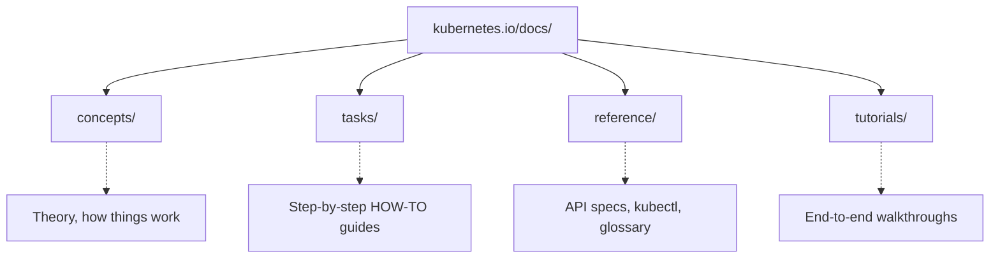
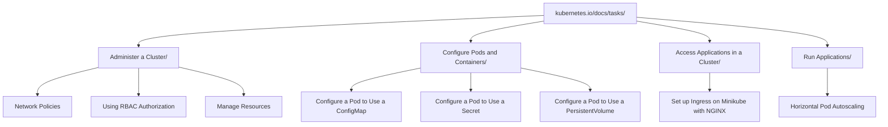
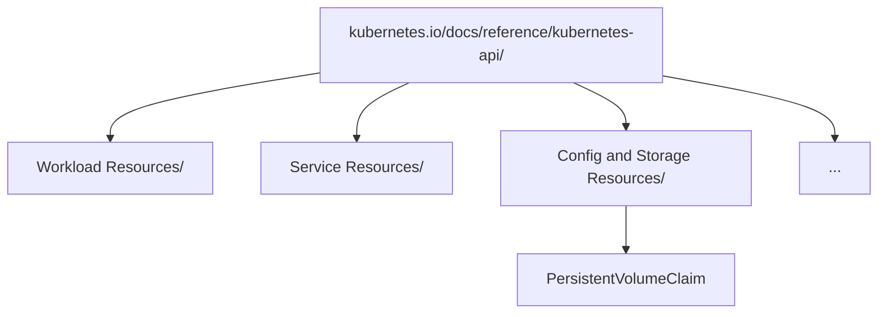

> **Complexity**: `[QUICK]` - Know where things are, find them fast
>
> **Time to Complete**: 20-30 minutes
>
> **Prerequisites**: None

## What You'll Be Able to Do

After completing this comprehensive module, you will be able to:
- **Diagnose** documentation drift by comparing requested API versions against the current official Kubernetes releases and documentation subdomains.
- **Implement** complex cluster resources by rapidly navigating the kubernetes.io Tasks section to locate working, copy-pasteable YAML templates.
- **Evaluate** the fastest path to resource definitions by strategically choosing between `kubectl explain` and web-based API references during time-constrained scenarios.
- **Compare** the structural differences between Concepts, Tasks, and Reference sections to avoid wasting precious minutes reading theory when practical execution is required.
- **Design** an efficient open-book exam strategy that utilizes the exact allowed domains without relying on external search engines or unauthorized resources.

---

## Why This Module Matters

In late 2025, GlobalTrade Corp, a massive logistics and shipping enterprise, experienced a catastrophic production outage during their peak holiday deployment window. Their core transaction routing pod failed due to an outdated API specification in their automated deployment pipeline. The on-call engineer needed to rapidly implement a `ReadWriteMany` PersistentVolumeClaim and an updated NetworkPolicy to route traffic to a secondary failover database. 

The engineer panicked. Instead of navigating directly to the authoritative `kubernetes.io` Tasks section, they spent twenty-two minutes frantically searching external search engines and reading outdated third-party blog posts. They eventually applied a deprecated resource definition, which the modern production cluster instantly rejected. By the time they diagnosed the correct API syntax, the delay had caused an estimated $850,000 in dropped transactions and severe reputational damage.

During the Certified Kubernetes Administrator (CKA) exam, you are operating in a simulated emergency environment. You have open-book access to specific domains:
- **kubernetes.io/docs**
- **kubernetes.io/blog**
- **helm.sh/docs** (for Helm)
- **github.com/kubernetes** (for reference)

Wasting twenty-two minutes on documentation navigation guarantees a failing score. This module is not just about memorizing facts; it is about evaluating the fastest path to authoritative information, diagnosing documentation drift, and implementing complex resources with absolute precision. Mastering the documentation architecture is the defining difference between a successful engineer and a costly operational liability.

> **War Story: The Search That Cost 8 Points**
>
> A candidate needed a NetworkPolicy example during their CKA. They typed "network policy" in the search bar and got dozens of results. They clicked through Concepts first (wrong—theory, no examples), then a blog post (interesting but not what they needed), then finally found the Tasks page. Total time: 4 minutes. They ran out of time on the last question. Later they learned: Tasks → Administer Cluster → Declare Network Policy. That's a 15-second lookup if you know the path.

---

## Part 1: The Kubernetes Ecosystem Foundation

Before navigating the documentation, you must understand the scale and definition of the ecosystem you are working within.

The Kubernetes official definition states that it is "a portable, extensible, open source platform for managing containerized workloads and services that facilitate both declarative configuration and automation". Google open-sourced the Kubernetes project in 2014, fundamentally altering modern infrastructure. The abbreviation K8s is a numeronym where 8 represents the eight letters between K and s in 'Kubernetes'.

The official Kubernetes documentation website is `kubernetes.io`. This is the canonical source for all official guidelines, API specifications, and architectural overviews. Reflecting its massive global adoption, the `kubernetes.io` website supports documentation in 15 languages, including Bengali, Chinese, French, German, Hindi, Indonesian, Italian, Japanese, Korean, Polish, Portuguese, Russian, Spanish, Ukrainian, and Vietnamese.

When you land on the site, the `kubernetes.io` top-level navigation bar has six main items: Documentation, Kubernetes Blog, Training, Careers, Partners, Community. This navigation structure is deliberately designed to separate technical documentation from community engagement and professional development.

Under the hood, the `kubernetes.io` website source code is hosted publicly at `github.com/kubernetes/website`. The site is built with Hugo Extended (a highly performant static site generator), allowing thousands of contributors to manage the massive markdown repository efficiently.

---

## Part 2: Documentation Architecture

The documentation is vast but highly structured. Wandering aimlessly will cost you your exam. The `kubernetes.io` documentation is organized into six main sections: Getting Started, Concepts, Tasks, Tutorials, Reference, Contribute.

> **The Library Analogy**
>
> Imagine you need a specific recipe from a library. You could wander the aisles hoping to stumble upon it. Or you could know that cookbooks are in section 641.5, third shelf from the top. The kubernetes.io docs are your library. Wandering wastes time. Knowing the sections—Tasks for how-to, Reference for specs, Concepts for theory—is your Dewey Decimal System. This module gives you the map.

Furthermore, there are exactly four official documentation page content types: Concept, Task, Tutorial, Reference. 



### What You'll Use in the Exam

| Section | Use For | Example |
|---------|---------|---------|
| **Tasks** | How to DO something | "Configure a Pod to Use a ConfigMap" |
| **Reference** | YAML fields, kubectl flags | "kubectl Cheat Sheet" |
| **Concepts** | Understanding (rarely during exam) | "What is a Service?" |

**Tasks** is your primary destination during the exam. The Concepts section covers core topic areas including: Cluster Architecture, Workloads, Services/Networking, Storage, Configuration, Security, Scheduling, and Extending Kubernetes. The Tasks section contains how-to guides organized by operational area (install tools, administer cluster, configure pods, monitoring/debugging, manage objects, secrets, etc.).

> **Stop and think**: You're configuring a complex Pod with multiple volume mounts and specific security contexts. You've found a basic Pod example in the Tasks section, but it's missing the security fields. What is the most time-efficient strategy to complete your YAML without getting lost in the documentation?

---

## Part 3: Versioning and Release Lifecycles

Kubernetes moves fast. You must ensure the documentation matches your cluster version. As of April 12, 2026, the current stable Kubernetes version is v1.35. 

The Kubernetes project officially patch-supports the three most recent minor versions (v1.35, v1.34, and v1.33). However, `kubernetes.io` maintains documentation for five versions: v1.35 (current), v1.34, v1.33, v1.32, v1.31. 

If you are operating an older environment, older documentation versions are accessible via subdomain URLs of the pattern `v{major}-{minor}.docs.kubernetes.io` (for example, `v1-34.docs.kubernetes.io`). Failing to check the version can lead to implementing deprecated APIs.

---

## Part 4: Search Strategies and Mechanics

The site search endpoint is `kubernetes.io/search/`. While it is widely believed that the site search is powered by Algolia DocSearch, this specific backend implementation is unverified in the canonical public documentation guidelines. Regardless of the backend, your search strategy must be precise.

### Strategy 1: Use the Search Bar
1. Press `/` or click the search icon.
2. Type specific keywords: "networkpolicy example".
3. Look for **Tasks** results first.

### Strategy 2: Go Directly to Tasks

Most exam answers are physically located in the Tasks hierarchy.



### Strategy 3: kubectl explain

Faster than any website, `kubectl explain` uses your cluster's OpenAPI schema directly.

```bash
# See available fields for a resource
k explain pod.spec.containers

# Go deeper
k explain pod.spec.containers.resources
k explain pod.spec.containers.volumeMounts

# See all fields at once
k explain pod --recursive | grep -A5 "containers"
```

> **Pause and predict**: You search for "ingress" on kubernetes.io and the first result is a Concepts page explaining how Ingress controllers work. If you click it and scroll to the bottom, what type of content are you most likely to find, and how should that influence your next click?

### Pattern: Every Task Has Examples

When you find a task page, scroll down. There's almost always a copyable YAML example.

Example: "Configure a Pod to Use a ConfigMap"
- Scroll to "Define container environment variables using ConfigMap data"
- Copy the YAML
- Modify for your needs

### Pattern: Look for "What's next" Section

At the bottom of pages, "What's next" links to related tasks. If you're close but not quite right, check these links.

### Pattern: API Reference for Field Details

When you need exhaustive structural data, the Reference section includes the full kubectl command reference, kubeadm reference, Kubernetes API reference, and component (kubelet, kube-apiserver, etc.) documentation.



Or execute it instantly via CLI:
```bash
k explain pvc.spec.accessModes
```

---

## Part 5: Beyond Docs: Community, Blog, and Training

Understanding the broader ecosystem is vital for long-term operational success.

### The Kubernetes Blog
The Kubernetes blog is at `kubernetes.io/blog/` and uses a date-based URL pattern: `/blog/YYYY/MM/DD/post-slug/`. The blog is organized chronologically by year (not by topic/tag). For automated reading, an RSS feed is available for the Kubernetes blog at `kubernetes.io/feed.xml`.

### Training and Certifications
The Linux Foundation administers Kubernetes certifications and offers training courses. There are five official Kubernetes/CNCF certifications: KCNA, KCSA, CKAD, CKA, CKS. Free Kubernetes introductory courses are available on edX via the Linux Foundation. For elite engineers, the Kubestronaut program recognizes individuals who have passed all five CNCF Kubernetes certifications.

### Community and Networking
The community is massive. The Kubernetes community Slack workspace is at `kubernetes.slack.com` and has over 150 channels. The official Kubernetes discussion forum is at `discuss.kubernetes.io`. The Community page links to over 150 global Kubernetes meetups via meetup.com. The `kubernetes.io` site has a dedicated contributor portal at `k8s.dev`. For real-time updates, the `kubernetes.io` Bluesky handle is `@kubernetes.io`, and the `kubernetes.io` X (Twitter) handle is `@kubernetesio`.

---

## Part 6: Quick Reference Locations

Bookmark these critical pages.

| Topic | URL |
|-------|-----|
| **kubectl Cheat Sheet** | https://kubernetes.io/docs/reference/kubectl/cheatsheet/ |
| **Tasks (main page)** | https://kubernetes.io/docs/tasks/ |
| **Workloads** | https://kubernetes.io/docs/concepts/workloads/ |
| **Networking** | https://kubernetes.io/docs/concepts/services-networking/ |
| **Storage** | https://kubernetes.io/docs/concepts/storage/ |
| **Configuration** | https://kubernetes.io/docs/concepts/configuration/ |

### High-Value Task Pages

| Need | Go To |
|------|-------|
| Create ConfigMap | Tasks → Configure Pods → Configure ConfigMaps |
| Create Secret | Tasks → Configure Pods → Secrets |
| Create PVC | Tasks → Configure Pods → Configure PersistentVolumeClaim |
| NetworkPolicy | Tasks → Administer Cluster → Network Policies |
| RBAC | Tasks → Administer Cluster → Using RBAC Authorization |
| Ingress | Tasks → Access Applications → Set Up Ingress |
| HPA | Tasks → Run Applications → Horizontal Pod Autoscale |

### New in 2025 - Know These

Gateway API is new to CKA 2025. Find these in the docs:

| Topic | URL |
|-------|-----|
| **Gateway API** | https://kubernetes.io/docs/concepts/services-networking/gateway/ |
| **Helm** | https://helm.sh/docs/ |
| **Kustomize** | https://kubernetes.io/docs/tasks/manage-kubernetes-objects/kustomization/ |

### Essential YAML Snippets

#### NetworkPolicy
**Location**: Tasks → Administer a Cluster → Declare Network Policy
```yaml
apiVersion: networking.k8s.io/v1
kind: NetworkPolicy
metadata:
  name: test-network-policy
  namespace: default
spec:
  podSelector:
    matchLabels:
      role: db
  policyTypes:
  - Ingress
  - Egress
  ingress:
  - from:
    - podSelector:
        matchLabels:
          role: frontend
    ports:
    - protocol: TCP
      port: 6379
```

#### PersistentVolumeClaim
**Location**: Tasks → Configure Pods → Configure a Pod to Use a PersistentVolumeClaim
```yaml
apiVersion: v1
kind: PersistentVolumeClaim
metadata:
  name: my-pvc
spec:
  accessModes:
    - ReadWriteOnce
  resources:
    requests:
      storage: 1Gi
```

#### RBAC (Role + RoleBinding)
**Location**: Tasks → Administer a Cluster → Using RBAC Authorization

```yaml
apiVersion: rbac.authorization.k8s.io/v1
kind: Role
metadata:
  namespace: default
  name: pod-reader
rules:
- apiGroups: [""]
  resources: ["pods"]
  verbs: ["get", "watch", "list"]
```
```yaml
apiVersion: rbac.authorization.k8s.io/v1
kind: RoleBinding
metadata:
  name: read-pods
  namespace: default
subjects:
- kind: User
  name: jane
  apiGroup: rbac.authorization.k8s.io
roleRef:
  kind: Role
  name: pod-reader
  apiGroup: rbac.authorization.k8s.io
```

#### Ingress
**Location**: Concepts → Services, Load Balancing → Ingress
```yaml
apiVersion: networking.k8s.io/v1
kind: Ingress
metadata:
  name: minimal-ingress
spec:
  rules:
  - host: example.com
    http:
      paths:
      - path: /
        pathType: Prefix
        backend:
          service:
            name: my-service
            port:
              number: 80
```

#### Gateway API (New in 2025)
**Location**: Concepts → Services, Load Balancing → Gateway API
```yaml
apiVersion: gateway.networking.k8s.io/v1
kind: HTTPRoute
metadata:
  name: http-route
spec:
  parentRefs:
  - name: my-gateway
  rules:
  - matches:
    - path:
        type: PathPrefix
        value: /app
    backendRefs:
    - name: my-service
      port: 80
```

---

## Part 7: Speed Drills

### Drill 1: Find NetworkPolicy Example (Target: <30 seconds)
1. Go to kubernetes.io
2. Search "network policy"
3. Click first Tasks result
4. Scroll to YAML example

### Drill 2: Find PVC Access Modes (Target: <20 seconds)
```bash
k explain pvc.spec.accessModes
```

### Drill 3: Find RBAC Role Example (Target: <30 seconds)
1. Search "RBAC"
2. Click "Using RBAC Authorization"
3. Find "Role example"

### Drill 4: Find Helm Install Syntax (Target: <30 seconds)
1. Go to helm.sh/docs
2. Search "install"
3. Find `helm install` command reference

---

## Did You Know?

1. **Massive Multilingual Support:** The official `kubernetes.io` website supports documentation in exactly 15 languages, making it one of the most accessible technical repositories globally.
2. **Current Stability:** As of April 12, 2026, the current stable Kubernetes version is exactly v1.35, representing years of iterative platform maturity.
3. **The Ultimate Certification:** The elite Kubestronaut program exclusively recognizes individuals who have successfully passed all five CNCF Kubernetes certifications.
4. **Historical Origins:** Kubernetes was open-sourced by Google in 2014, fundamentally shifting the paradigm of infrastructure management worldwide.

---

## Common Mistakes

| Mistake | Problem | Solution |
|---------|---------|----------|
| Searching too broadly | Too many results | Use specific terms: "networkpolicy ingress example" |
| Reading concepts during exam | Wastes time | Go straight to Tasks |
| Memorizing YAML | Unnecessary | Know WHERE to find examples |
| Not using kubectl explain | Slow | `k explain` is instant |
| Opening too many tabs | Browser slows down | Close tabs you're done with |
| Ignoring API versions | Fails deployments | Check current API version in docs |
| Relying on outdated blogs | Deprecated syntax | Always use official Tasks |
| Forgetting to check subdomains | Looking at wrong version docs | Use v1-35.docs pattern |

---

## Quiz

1. **Scenario**: You are 15 minutes into the exam and need to configure a Pod to use a PersistentVolumeClaim. You remember seeing a page about this, but you can't remember the exact YAML structure for the `volumes` array. You open the kubernetes.io search bar. How do you quickly locate the exact YAML snippet you need without reading through conceptual explanations?
   <details>
   <summary>Answer</summary>
   You should search for "Configure a Pod to Use a PersistentVolumeClaim" and specifically look for a result under the **Tasks** section, bypassing any **Concepts** or **Reference** results. The Tasks section is designed as a collection of how-to guides that almost always include copy-pasteable YAML examples. By prioritizing Tasks, you avoid wasting time reading architectural theory and immediately get a working template that you can adapt for your specific exam question.
   </details>

2. **Scenario**: You are tasked with creating a NetworkPolicy that denies all ingress traffic except from a specific namespace. You found a YAML example in the docs, but it uses `podSelector` instead of `namespaceSelector`. You need to know the exact syntax for `namespaceSelector`. What is the fastest method to discover this specific field's syntax without returning to the web browser?
   <details>
   <summary>Answer</summary>
   The fastest method is to use the command line tool directly by running `kubectl explain networkpolicy.spec.ingress.from.namespaceSelector`. During the exam, switching context back to the browser and searching through API reference pages can be slow and distracting. The `kubectl explain` command queries the cluster's OpenAPI schema directly, providing you with instant, offline documentation for the exact structure and fields available. This approach keeps your hands on the keyboard and your focus on the terminal, saving you precious minutes.
   </details>

3. **Scenario**: You are answering a question that requires deploying a Gateway API `HTTPRoute`. You type "HTTPRoute" into the kubernetes.io search bar, but the results are overwhelming and mostly point to blog posts from 2022. Knowing the structure of the documentation, where should you manually navigate to find the authoritative example?
   <details>
   <summary>Answer</summary>
   You should navigate to the **Concepts → Services, Load Balancing → Gateway API** section of the documentation. While the Tasks section is generally best for examples, newer APIs or heavily architectural features sometimes have their primary examples embedded in the Concepts pages where they are introduced. Knowing the documentation tree allows you to bypass a failing search function and go directly to the networking section where the Gateway API is housed. This ensures you find up-to-date, exam-valid YAML without relying on unpredictable keyword matching.
   </details>

4. **Scenario**: While troubleshooting a failing Deployment, you realize you need to add an `initContainer` to delay startup. You have the main Deployment YAML ready but need the `initContainers` array structure. You run `kubectl explain deployment.spec.template.spec.initContainers`, but the output scrolls off your terminal screen, making it hard to read. How do you efficiently extract just the fields you need?
   <details>
   <summary>Answer</summary>
   You should pipe the output of the explain command to a pager like `less` or use `grep`, for example: `kubectl explain pod.spec.initContainers | grep -A 5 volumeMounts`. The exam terminal can be restrictive, and scrolling back through hundreds of lines of API documentation is inefficient and prone to user error. Using standard Linux text manipulation tools with `kubectl explain` allows you to control the output and read the definitions at your own pace. This technique helps you quickly identify the required fields without getting overwhelmed by the sheer volume of API information.
   </details>

5. **Scenario**: You are tasked with implementing a custom Gateway API HTTPRoute but you are working on an older cluster running version 1.33. How do you ensure the documentation you are reading matches your cluster's capabilities?
   <details>
   <summary>Answer</summary>
   You should access the older documentation version using the specific subdomain pattern, such as v1-33.docs.kubernetes.io. The kubernetes.io site maintains documentation for exactly five versions, but they are segmented. Reading the v1.35 docs for a v1.33 cluster could lead to using unsupported fields or APIs.
   </details>

6. **Scenario**: During a complex debugging session, you suspect a core component like the kube-scheduler is misconfigured. You need to verify the exact startup flags available for the kube-scheduler daemon. Where is the most authoritative place to find this?
   <details>
   <summary>Answer</summary>
   You should navigate directly to the Reference section, specifically looking for the Component documentation. The Reference section contains auto-generated, exhaustive lists of all CLI flags, API endpoints, and configuration options for core components like kubelet, kube-apiserver, and kube-scheduler. This avoids the noise of the Tasks or Concepts sections.
   </details>

7. **Scenario**: Your organization requires you to stay updated with the latest security patches. You notice the current documentation highlights v1.35, but your production clusters are running v1.32. How does the official Kubernetes patch support policy impact your environment?
   <details>
   <summary>Answer</summary>
   Your v1.32 clusters are end-of-life and no longer receive official patch support. The Kubernetes project officially patch-supports only the three most recent minor versions (currently v1.35, v1.34, and v1.33). You must evaluate and plan a critical upgrade path immediately to restore a supported security posture.
   </details>


---

## Hands-On Exercise

**Task**: Practice finding documentation quickly and deploying resources based on your findings.

**Timed Challenges** (use a stopwatch):

1. **Find ConfigMap example** (Target: <30 sec)
   - Navigate to the Tasks section and locate a complete ConfigMap YAML.
2. **Find Secret from file example** (Target: <45 sec)
   - Discover the specific command or YAML structure to create a Secret from an external file.
3. **Find all PVC accessModes** (Target: <15 sec)
   - Utilize `kubectl explain` directly in your terminal to output the valid enumerations.
4. **Find HPA example** (Target: <45 sec)
   - Locate a robust HorizontalPodAutoscaler YAML template.
5. **Find Helm upgrade command** (Target: <30 sec)
   - Access helm.sh/docs and find the precise `helm upgrade` syntax.
6. **Deploy and Validate** (Target: <2 minutes)
   - Deploy the found ConfigMap and Secret templates to a local cluster and validate their existence.

**Success Criteria**:
- [ ] Can find ConfigMap task page in <30 seconds
- [ ] Can find any YAML example in <1 minute
- [ ] Know how to use kubectl explain
- [ ] Know the difference between Tasks and Concepts
- [ ] Successfully deployed a resource purely sourced from the official documentation

---

## Practice Drills

### Drill 1: Documentation Race (Target times provided)

Open kubernetes.io and race to find these. Use a stopwatch.

| Task | Target Time |
|------|-------------|
| Find NetworkPolicy YAML example | < 30 sec |
| Find PVC with ReadWriteMany example | < 45 sec |
| Find RBAC RoleBinding example | < 30 sec |
| Find Ingress with TLS example | < 45 sec |
| Find HorizontalPodAutoscaler example | < 45 sec |
| Find Job with backoffLimit example | < 30 sec |

Record your times. Repeat until you beat all targets.

### Drill 2: kubectl explain Mastery (Target: 2 minutes total)

Without using the web, find these using only `kubectl explain`:

```bash
# 1. What fields does a Pod spec have?
kubectl explain pod.spec | head -30

# 2. What are valid values for PVC accessModes?
kubectl explain pvc.spec.accessModes

# 3. What fields does a container have for health checks?
kubectl explain pod.spec.containers.livenessProbe

# 4. What's the structure of a NetworkPolicy spec?
kubectl explain networkpolicy.spec

# 5. How do you specify resource limits?
kubectl explain pod.spec.containers.resources
```

### Drill 3: Find and Apply (Target: 5 minutes)

Using ONLY kubernetes.io docs, find examples and create:

```bash
# 1. Find a ConfigMap example and create one
# kubernetes.io → Tasks → Configure Pods → ConfigMaps

# 2. Find a Secret example and create one
# kubernetes.io → Tasks → Configure Pods → Secrets

# 3. Find a NetworkPolicy example and create one
# kubernetes.io → Tasks → Administer Cluster → Network Policies

# Verify all three exist
kubectl get cm,secret,netpol

# Cleanup
kubectl delete cm --all
kubectl delete secret --all  # careful: leaves default secrets
kubectl delete netpol --all
```

### Drill 4: Helm Documentation Hunt (Target: 3 minutes)

Find these on helm.sh/docs:

```bash
# 1. How do you install a chart from a repo?
# Answer: helm install [RELEASE] [CHART]

# 2. How do you see values available for a chart?
# Answer: helm show values [CHART]

# 3. How do you rollback to a previous release?
# Answer: helm rollback [RELEASE] [REVISION]

# 4. How do you list all releases?
# Answer: helm list

# 5. How do you upgrade with new values?
# Answer: helm upgrade [RELEASE] [CHART] -f values.yaml
```

### Drill 5: Gateway API Deep Dive (Target: 5 minutes)

Gateway API is new to CKA 2025. Find these in the docs:

```bash
# 1. Find the HTTPRoute example
# kubernetes.io → Concepts → Services → Gateway API

# 2. Find what parentRefs means in HTTPRoute
kubectl explain httproute.spec.parentRefs  # If Gateway API CRDs installed

# 3. Find the difference between Gateway and HTTPRoute
# Gateway = infrastructure (like LoadBalancer)
# HTTPRoute = routing rules (like Ingress rules)
```

### Drill 6: Troubleshooting - Wrong Documentation

**Scenario**: You found what looks like the right YAML but it doesn't work.

```bash
# You found this "Ingress" example but it fails
cat << 'EOF' > wrong-ingress.yaml
apiVersion: extensions/v1beta1
kind: Ingress
metadata:
  name: test-ingress
spec:
  backend:
    serviceName: testsvc
    servicePort: 80
EOF

kubectl apply -f wrong-ingress.yaml
# ERROR: no matches for kind "Ingress" in version "extensions/v1beta1"

# YOUR TASK: Find the CORRECT API version in current docs
# Hint: The docs example is outdated. Find current version.
```

<details>
<summary>Solution</summary>

The old `extensions/v1beta1` API was deprecated. Current version:

```yaml
apiVersion: networking.k8s.io/v1
kind: Ingress
metadata:
  name: test-ingress
spec:
  defaultBackend:
    service:
      name: testsvc
      port:
        number: 80
```

**Lesson**: Always check the apiVersion in docs matches your cluster version. Use `kubectl api-resources | grep ingress` to see available versions.

</details>

### Drill 7: Speed Documentation Challenge

Set a 10-minute timer. Complete as many as possible:

1. [ ] Create a Pod with resource limits (find in docs)
2. [ ] Create a Deployment with 3 replicas (find in docs)
3. [ ] Create a Service type LoadBalancer (find in docs)
4. [ ] Create a ConfigMap from a file (find in docs)
5. [ ] Create a PVC with 1Gi storage (find in docs)
6. [ ] Create a Job that runs once (find in docs)
7. [ ] Create a CronJob running every minute (find in docs)
8. [ ] Create a NetworkPolicy allowing only port 80 (find in docs)

```bash
# Validate each one works
kubectl apply -f <file> --dry-run=client
```

Score: How many did you complete in 10 minutes?
- 8: Excellent - exam ready
- 6-7: Good - keep practicing
- 4-5: Needs work - repeat drill daily
- <4: Review documentation structure again

**Important Notes for the Exam:**
- **Navigate** kubernetes.io docs to find any resource specification in under 30 seconds.
- **The exam browser has limited tabs**. You can't open 20 tabs like normal browsing. Learn to navigate efficiently with fewer tabs.
- **kubernetes.io search is decent but not great**. Sometimes Google would be better, but you can't use it in the exam. Practice using the native search.
- **`kubectl explain` doesn't need internet**. It reads from your cluster's API server. This is often faster than searching documentation.
- **Blog posts are allowed** (kubernetes.io/blog). Some complex topics have excellent blog explanations. But Tasks is usually faster for "how do I do X."

---

## Next Module

[Module 0.5: Exam Strategy - Three-Pass Method](../module-0.5-exam-strategy/) - The strategy that maximizes your score by balancing speed, precision, and the triage of complex questions.