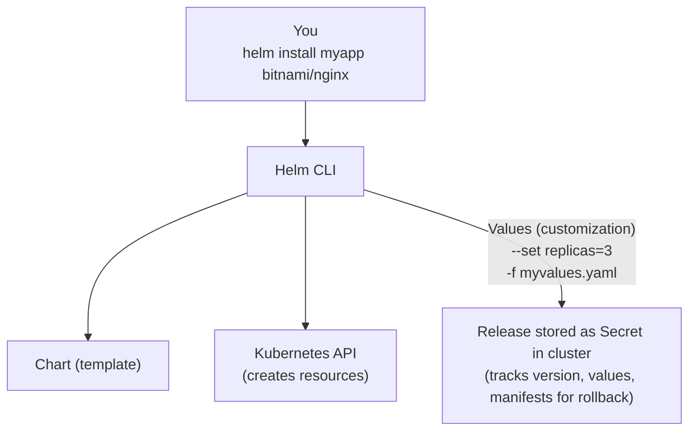

> **Complexity**: `[MEDIUM]` - Essential exam skill for 2025
>
> **Time to Complete**: 40-50 minutes
>
> **Prerequisites**: Module 0.1 (working cluster), basic YAML knowledge

---

## What You'll Be Able to Do

After completing this module, you will be able to:
- **Diagnose** failed Helm deployments by analyzing release secrets and history logs.
- **Implement** custom infrastructure configurations using complex Helm values overrides and values files.
- **Evaluate** the state of a cluster by tracking down orphaned releases and performing safe, immediate rollbacks.
- **Design** robust deployment workflows using the `helm upgrade --install` pattern for idempotent CI/CD integration.

---

## Why This Module Matters

Like the canonical Knight Capital 2012 <!-- incident-xref: knight-capital-2012 --> example in *Infrastructure as Code*, this module focuses on preventing mixed-version rollout states by managing multi-component applications as a versioned Kubernetes release artifact.

The core problem—managing complex, multi-component deployments consistently—is exactly why Helm was created. When managing microservices on Kubernetes, a single application might require Deployments, Services, Ingress rules, ConfigMaps, Secrets, and RBAC bindings. Manually applying dozens of individual YAML files invites human error, configuration drift, and exactly the kind of operational outages that become expensive at scale.

Helm prevents this chaos by packaging all necessary Kubernetes resources into a single, versioned artifact called a "chart." This ensures repeatable, idempotent deployments across development, staging, and production environments. The CKA 2025 curriculum strictly tests your ability to leverage Helm for these scenarios. You must prove you can orchestrate complex applications securely, override configurations deterministically, and roll back instantly when disaster strikes. 

---

## Part 1: Helm Concepts

Helm operates heavily on a specific set of terminologies that map directly to standard package management concepts you are likely already familiar with (like `apt` or `brew`). 

### 1.1 Core Terminology

| Term | Definition |
|------|------------|
| **Chart** | A package of Kubernetes resources (like a .deb or .rpm) |
| **Release** | An instance of a chart running in your cluster |
| **Repository** | A collection of charts (like apt repository) |
| **Values** | Configuration options to customize a chart |

### 1.2 How Helm Works

Helm takes the generic templates provided by a chart, merges them with your specific values, and sends the resulting raw YAML manifests to the Kubernetes API server. It also stores a record of this action inside the cluster itself.



### 1.3 Helm 3 vs Helm 2

If you are reading older tutorials, you might see references to "Tiller." Helm 3 (current) removed Tiller—a server component that ran in the cluster. Now Helm talks directly to the Kubernetes API using your kubeconfig. This is simpler and vastly improves security by leveraging your existing RBAC permissions instead of requiring a highly privileged cluster-wide service account.

```bash
# Helm 3 (current) - no Tiller needed
helm install myapp ./mychart

# Helm 2 (deprecated) - required Tiller
# Don't use this anymore
```

---

## Part 2: Installing Helm

Helm is a single statically compiled Go binary. It requires no server-side installation on the cluster itself. 

### 2.1 Install Helm CLI

```bash
# macOS
brew install helm

# Linux (script)
curl https://raw.githubusercontent.com/helm/helm/main/scripts/get-helm-3 | bash

# Linux (package manager)
# Debian/Ubuntu
curl https://packages.cloud.google.com/apt/doc/apt-key.gpg | gpg --dearmor | sudo tee /usr/share/keyrings/helm.gpg > /dev/null
echo "deb [arch=$(dpkg --print-architecture) signed-by=/usr/share/keyrings/helm.gpg] https://apt.kubernetes.io/ kubernetes-xenial main" | sudo tee /etc/apt/sources.list.d/helm-stable-debian.list
sudo apt-get update
sudo apt-get install helm

# Verify installation
helm version
```

### 2.2 Add a Repository

A repository is simply an HTTP server that houses an `index.yaml` file and packaged charts. **ChartMuseum** is an open-source Helm repository server. Organizations use it to host private charts securely behind their firewalls.

```bash
# Add the Bitnami repository (popular, well-maintained charts)
helm repo add bitnami https://github.com/bitnami/charts

# Add other common repositories
helm repo add ingress-nginx https://kubernetes.github.io/ingress-nginx
helm repo add prometheus-community https://prometheus-community.github.io/helm-charts

# Update repository index
helm repo update

# List configured repositories
helm repo list
```

---

## Part 3: Working with Charts

Helm allows you to search for software much like you would use a search engine, retrieving the artifacts and reading their documentation directly from the command line.

### 3.1 Searching for Charts

```bash
# Search in Artifact Hub (online registry)
helm search hub nginx

# Search in your added repositories
helm search repo nginx

# Show all versions of a chart
helm search repo bitnami/nginx --versions

# Get info about a specific chart
helm show chart bitnami/nginx
helm show readme bitnami/nginx
helm show values bitnami/nginx  # See all configurable values
```

### 3.2 Installing a Chart

When you run `helm install`, Helm renders the chart templates, generates standard Kubernetes YAML, and applies it to your cluster.

```bash
# Basic install
helm install my-nginx bitnami/nginx
#           ^^^^^^^^  ^^^^^^^^^^^^^
#           release   chart name
#           name

# Install in specific namespace
helm install my-nginx bitnami/nginx -n web --create-namespace

# Install with custom values
helm install my-nginx bitnami/nginx --set replicaCount=3

# Install with values file
helm install my-nginx bitnami/nginx -f myvalues.yaml

# Install specific version
helm install my-nginx bitnami/nginx --version 15.0.0

# Dry-run (see what would be created)
helm install my-nginx bitnami/nginx --dry-run

# Generate manifests only (don't install)
helm template my-nginx bitnami/nginx > manifests.yaml
```

### 3.3 Listing and Inspecting Releases

Helm uses Kubernetes Secrets to store the state of your releases. These secrets are typically named `sh.helm.release.v1.<release-name>.v1`. 

```bash
# List all releases
helm list

# List in all namespaces
helm list -A

# List including failed releases
helm list --all

# Get status of a release
helm status my-nginx

# Get values used for a release
helm get values my-nginx

# Get all values (including defaults)
helm get values my-nginx --all

# Get the manifests that were installed
helm get manifest my-nginx
```

---

## Part 4: Customizing with Values

Values are how you inject custom parameters (like replica counts, image tags, or storage sizes) into the generic chart templates.

> **Pause and predict**: You run `helm install my-app bitnami/nginx --set replicaCount=3 -f values.yaml` where `values.yaml` contains `replicaCount: 5`. How many replicas will you get? Think about which source of values takes priority.

### 4.1 Values Hierarchy

Values can be set in multiple ways. Priority (highest to lowest):
1. `--set` flags on command line
2. `-f` values files (later files override earlier)
3. Default values in chart's `values.yaml`

```bash
# Example: Multiple ways to set replicas
helm install my-nginx bitnami/nginx \
  -f base-values.yaml \
  -f production-values.yaml \
  --set replicaCount=5  # This wins
```

### 4.2 Using --set

For quick overrides, `--set` is incredibly useful, but it can become unwieldy for complex, nested configurations.

```bash
# Simple value
helm install my-nginx bitnami/nginx --set replicaCount=3

# Nested value
helm install my-nginx bitnami/nginx --set service.type=NodePort

# Multiple values
helm install my-nginx bitnami/nginx \
  --set replicaCount=3 \
  --set service.type=NodePort \
  --set service.nodePorts.http=30080

# Array values
helm install my-app ./mychart --set 'ingress.hosts[0]=example.com'

# String that looks like number (use quotes)
helm install my-app ./mychart --set 'version="1.35"'
```

### 4.3 Using Values Files

For production deployments, you should always declare your state using a values file tracked in version control.

```yaml
# myvalues.yaml
replicaCount: 3

service:
  type: NodePort
  nodePorts:
    http: 30080

resources:
  requests:
    memory: "128Mi"
    cpu: "100m"
  limits:
    memory: "256Mi"
    cpu: "200m"

ingress:
  enabled: true
  hostname: myapp.example.com
```

```bash
# Use the values file
helm install my-nginx bitnami/nginx -f myvalues.yaml
```

### 4.4 Viewing Default Values

```bash
# See all configurable options
helm show values bitnami/nginx

# Save to file for reference
helm show values bitnami/nginx > nginx-defaults.yaml
```

---

## Part 5: Upgrading and Rolling Back

One of Helm's strongest features is lifecycle management. It tracks every change you make to a release.

> **Stop and think**: You run `helm upgrade my-app bitnami/nginx` without `--reuse-values` and without specifying any values. What happens to all the custom values you set during the original install? Where does Helm get the values for this upgrade?

### 5.1 Upgrading a Release

```bash
# Upgrade with new values
helm upgrade my-nginx bitnami/nginx --set replicaCount=5

# Upgrade with values file
helm upgrade my-nginx bitnami/nginx -f newvalues.yaml

# Upgrade to new chart version
helm upgrade my-nginx bitnami/nginx --version 16.0.0

# Upgrade or install if not exists
helm upgrade --install my-nginx bitnami/nginx

# Reuse values from previous release + new values
helm upgrade my-nginx bitnami/nginx --reuse-values --set replicaCount=5
```

### 5.2 Release History

Every time you install, upgrade, or rollback, Helm creates a new revision secret.

```bash
# View upgrade history
helm history my-nginx

# Output:
# REVISION  STATUS      CHART           DESCRIPTION
# 1         superseded  nginx-15.0.0    Install complete
# 2         superseded  nginx-15.0.0    Upgrade complete
# 3         deployed    nginx-15.0.1    Upgrade complete
```

### 5.3 Rolling Back

```bash
# Rollback to previous revision
helm rollback my-nginx

# Rollback to specific revision
helm rollback my-nginx 1

# Dry-run rollback
helm rollback my-nginx 1 --dry-run
```

---

## Part 6: Uninstalling

Uninstalling removes all Kubernetes resources associated with the release, but you can opt to retain the history secrets.

```bash
# Uninstall a release
helm uninstall my-nginx

# Uninstall but keep history (allows rollback)
helm uninstall my-nginx --keep-history

# Uninstall in specific namespace
helm uninstall my-nginx -n web
```

---

## Part 7: Chart Structure (For Understanding)

While you will not be required to write complex charts from scratch during the exam, you must understand their internal anatomy to effectively debug broken configurations.

```text
mychart/
├── Chart.yaml          # Metadata (name, version, description)
├── values.yaml         # Default configuration
├── charts/             # Dependencies (subcharts)
├── templates/          # Kubernetes manifest templates
│   ├── deployment.yaml
│   ├── service.yaml
│   ├── ingress.yaml
│   ├── _helpers.tpl    # Template helpers
│   └── NOTES.txt       # Post-install message
└── README.md           # Documentation
```

> **Stop and think**: You delete the Kubernetes Secret that stores a Helm release's metadata (the ones labeled `owner=helm`). Can you still run `helm upgrade` or `helm rollback` on that release?

### 7.1 How Templates Work

Helm utilizes the Go template engine. It injects the merged values into specific placeholders within the YAML framework.

```yaml
# templates/deployment.yaml (simplified)
apiVersion: apps/v1
kind: Deployment
metadata:
  name: "{{ .Release.Name }}-nginx"
spec:
  replicas: {{ .Values.replicaCount }}
  template:
    spec:
      containers:
      - name: nginx
        image: "{{ .Values.image.repository }}:{{ .Values.image.tag }}"
```

### 7.2 Debugging Templates

If a chart fails to install, rendering the templates locally is your first debugging step.

```bash
# See what YAML would be generated
helm template my-nginx bitnami/nginx -f myvalues.yaml

# Install with debug info
helm install my-nginx bitnami/nginx --debug --dry-run
```

---

## Part 8: Common Exam Scenarios

These are the exact patterns you will likely encounter in a high-pressure exam or production incident environment.

### 8.1 Install an Application

```bash
# Task: Install nginx with 3 replicas exposed on NodePort 30080

# Solution:
helm repo add bitnami https://github.com/bitnami/charts
helm repo update

helm install web bitnami/nginx \
  --set replicaCount=3 \
  --set service.type=NodePort \
  --set service.nodePorts.http=30080
```

### 8.2 Upgrade with New Configuration

```bash
# Task: Upgrade the existing nginx release to use 5 replicas

# Solution:
helm upgrade web bitnami/nginx --reuse-values --set replicaCount=5

# Verify:
kubectl get deployment
```

### 8.3 Rollback After Failed Upgrade

```bash
# Task: Rollback to the previous working version

# Solution:
helm history web
helm rollback web

# Verify:
helm status web
```

---

## Did You Know?

- Helm was originally created by Deis in 2015 and was donated to the CNCF in 2018, eventually graduating as a top-level project in April 2020.
- By default, Helm retains up to 10 revision secrets per release to prevent etcd database bloat, though you can adjust this limit globally via the `--history-max` flag.
- Helm templates are powered by the Go template engine, which allows complex logic, conditionals, and loops, handling over 150 built-in template functions inherited from the Sprig library.
- The transition from Helm 2 to Helm 3 in November 2019 eliminated the in-cluster Tiller component entirely, migrating to a client-only architecture that dramatically reduced cluster attack surfaces.

---

## Common Mistakes

| Mistake | Why | Fix |
|---------|-----|-----|
| Forgetting `-n namespace` | Release not found | Always specify namespace |
| Not using `--reuse-values` | Values reset on upgrade | Use `--reuse-values` or specify all values |
| Wrong repo URL | Chart not found | Check `helm repo list`, `helm repo update` |
| Ignoring dry-run | Unexpected resources created | Always `--dry-run` first for complex changes |
| Not checking helm status | Don't know if install succeeded | Run `helm status <release>` after install |
| Manually deleting Helm secrets | Helm loses track of the release state | Never manually delete `sh.helm.release` secrets; use `helm uninstall` |
| Hardcoding passwords in values | Exposes credentials in git | Use external secret stores or pass via `--set` during CI/CD execution |
| Applying templates manually | Loses lifecycle tracking and rollback capabilities | Always use `helm install` or `helm upgrade --install` instead of raw template pipes |

---

## Quiz

<details>
<summary>1. During the CKA exam, you need to install a chart but you don't know the exact parameter name for setting the Service type to NodePort. The exam environment has no internet access. How do you find the correct parameter name, and what command do you use?</summary>

Run `helm show values <chart-name>` to display all configurable values with their defaults and structure. You can pipe it through grep to narrow down: `helm show values bitnami/nginx | grep -i service` to find service-related parameters. This works entirely offline since the chart is already in your local repository cache. For the actual install, you'd use something like `helm install my-app bitnami/nginx --set service.type=NodePort`. The key exam skill is knowing that `helm show values` is your documentation when you can't access the internet.
</details>

<details>
<summary>2. A teammate installed a Helm release last week, but now `helm list` shows nothing and `helm status my-app` returns "release not found." However, `kubectl get deploy my-app` shows the deployment still running. What are two possible explanations?</summary>

First, the release may have been installed in a different namespace — Helm releases are namespaced, so you need `helm list -n <namespace>` or `helm list -A` to find it. Second, someone may have run `helm uninstall my-app` without `--keep-history`, which removes the Helm release metadata (stored as Secrets labeled `owner=helm`) but doesn't delete the Kubernetes resources if they were modified outside Helm or if the uninstall partially failed. You can verify by checking `kubectl get secrets -l owner=helm -A` to see if any release secrets exist. The running deployment is now "orphaned" from Helm's perspective and must be managed directly with kubectl.
</details>

<details>
<summary>3. You upgraded a production Helm release, and now the application is returning 500 errors. You need to revert immediately. The release has 4 revisions in its history. What commands do you run, and how do you verify the rollback succeeded?</summary>

First, check the history: `helm history my-app -n production` to see which revision was the last working one. Then roll
