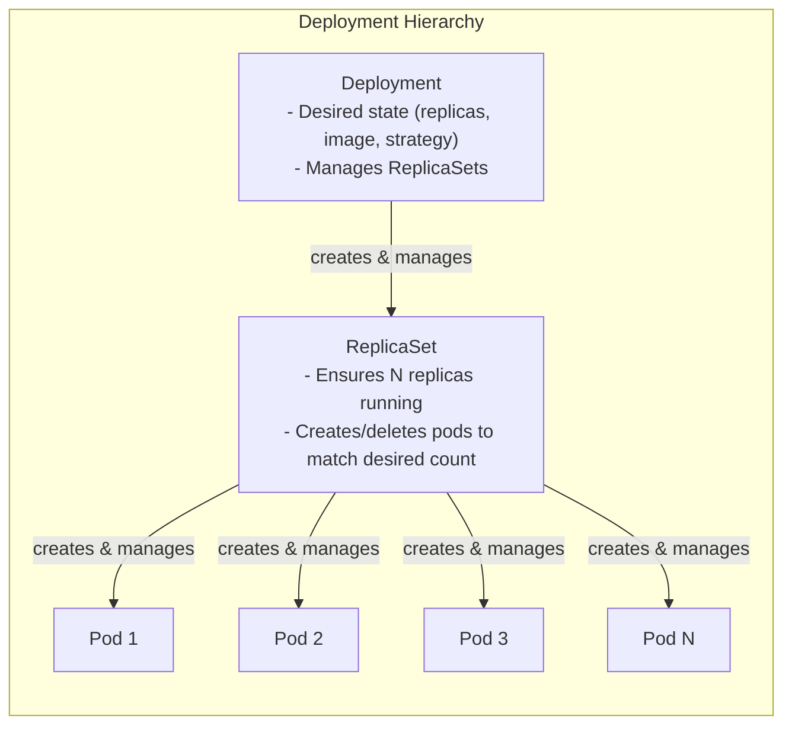
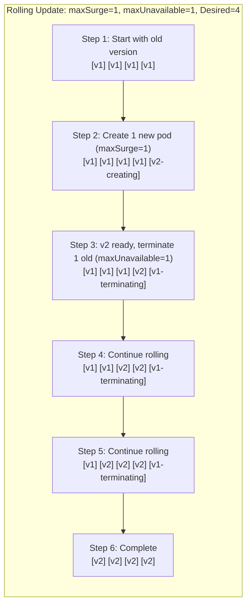
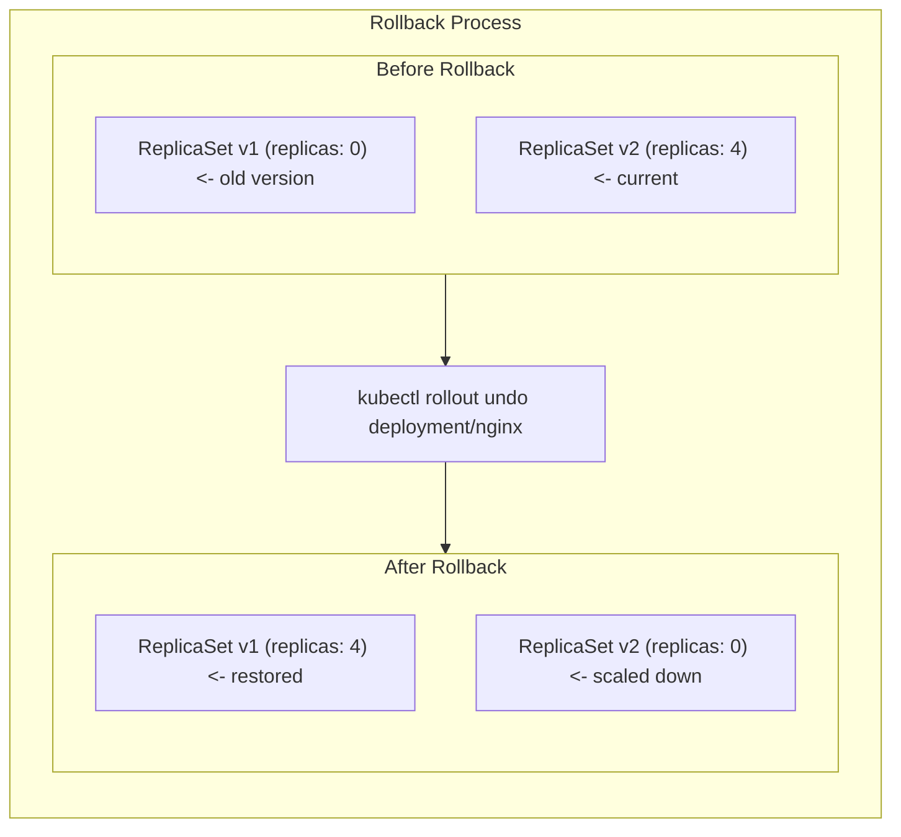

> **Complexity**: `[MEDIUM]` - Core exam topic
>
> **Time to Complete**: 45-55 minutes
>
> **Prerequisites**: Module 2.1 (Pods)

---

## What You'll Be Able to Do

After this module, you will be able to:
- **Create** Deployments with rolling update strategy and configure maxSurge/maxUnavailable
- **Perform** rollouts, rollbacks, and history inspection under CKA time pressure
- **Diagnose** a stuck rollout by checking ReplicaSet status, pod events, and resource availability
- **Explain** the Deployment → ReplicaSet → Pod ownership chain and why old ReplicaSets are retained

---

## Why This Module Matters

In most production application scenarios, you use higher-level controllers such as **Deployments** rather than standalone pods.

Deployments are the most common workload resource. They handle:
- Running multiple replicas of your app
- [Rolling updates with zero downtime](https://kubernetes.io/docs/concepts/workloads/controllers/deployment/)
- Rollback to a previous revision when you intentionally run `kubectl rollout undo`
- Scaling up and down

The CKA exam tests creating deployments, performing rolling updates, scaling, and rollbacks. These are fundamental skills you'll use daily.

> **The Fleet Manager Analogy**
>
> Think of a Deployment like a fleet manager for a taxi company. The manager doesn't drive taxis directly—they manage drivers (pods). If a driver calls in sick (pod crashes), the manager assigns a replacement. If demand increases (scale up), the manager hires more drivers. During a vehicle upgrade (rolling update), the manager swaps old cars for new ones gradually, so customers usually still have rides available.

---

## What You'll Learn

By the end of this module, you'll be able to:
- Create and manage Deployments
- Understand how ReplicaSets work
- Perform rolling updates and rollbacks
- Scale applications horizontally
- Pause and resume deployments

---

## Part 1: Deployment Fundamentals

### 1.1 The Deployment Hierarchy



### 1.2 Why Not Just ReplicaSets?

| Feature | ReplicaSet | Deployment |
|---------|------------|------------|
| Maintain replica count | ✅ | ✅ |
| Rolling updates | ❌ | ✅ |
| Rollback | ❌ | ✅ |
| Update history | ❌ | ✅ |
| Pause/Resume | ❌ | ✅ |

**Rule**: Prefer Deployments for most application workloads. Create ReplicaSets directly only in uncommon cases where you do not need Deployment features.

### 1.3 Deployment Spec

```yaml
apiVersion: apps/v1
kind: Deployment
metadata:
  name: nginx-deployment
  labels:
    app: nginx
spec:
  replicas: 3                    # Desired pod count
  selector:                      # How to find pods to manage
    matchLabels:
      app: nginx
  template:                      # Pod template
    metadata:
      labels:
        app: nginx               # Must match selector
    spec:
      containers:
      - name: nginx
        image: nginx:1.25
        ports:
        - containerPort: 80
```

> **Critical**: [The `spec.selector.matchLabels` must match `spec.template.metadata.labels`](https://kubernetes.io/docs/concepts/workloads/controllers/deployment/). If they don't match, the Deployment won't manage the pods.

---

## Part 2: Creating Deployments

### 2.1 Imperative Commands (Fast for Exam)

```bash
# Create deployment
kubectl create deployment nginx --image=nginx

# Create with specific replicas
kubectl create deployment nginx --image=nginx --replicas=3

# Create with port
kubectl create deployment nginx --image=nginx --port=80

# Generate YAML (essential for exam!)
kubectl create deployment nginx --image=nginx --replicas=3 --dry-run=client -o yaml > deploy.yaml
```

### 2.2 From YAML

```yaml
# nginx-deployment.yaml
apiVersion: apps/v1
kind: Deployment
metadata:
  name: nginx
spec:
  replicas: 3
  selector:
    matchLabels:
      app: nginx
  template:
    metadata:
      labels:
        app: nginx
    spec:
      containers:
      - name: nginx
        image: nginx:1.25
        ports:
        - containerPort: 80
        resources:
          requests:
            cpu: 100m
            memory: 128Mi
          limits:
            cpu: 200m
            memory: 256Mi
```

```bash
kubectl apply -f nginx-deployment.yaml
```

### 2.3 Viewing Deployments

```bash
# List deployments
kubectl get deployments
kubectl get deploy          # Short form

# Detailed view
kubectl get deploy -o wide

# Describe deployment
kubectl describe deployment nginx

# Get deployment YAML
kubectl get deployment nginx -o yaml

# Check rollout status
kubectl rollout status deployment/nginx
```

> **Did You Know?**
>
> [The `kubectl rollout status` command blocks until the rollout completes.](https://kubernetes.io/docs/reference/kubectl/generated/kubectl_rollout/kubectl_rollout_status/) It's perfect for CI/CD pipelines—if the rollout fails, the command exits with a non-zero status.

---

## Part 3: ReplicaSets Under the Hood

### 3.1 How ReplicaSets Work

When you create a Deployment:
1. Deployment controller creates a ReplicaSet
2. ReplicaSet controller creates pods
3. ReplicaSet ensures desired replicas match actual

```bash
# Create a deployment
kubectl create deployment nginx --image=nginx --replicas=3

# See the ReplicaSet created
kubectl get replicasets
# NAME               DESIRED   CURRENT   READY   AGE
# nginx-5d5dd5d5fb   3         3         3       30s

# See pods with owner reference
kubectl get pods --show-labels
```

> **Pause and predict**: After updating a Deployment's image twice (v1 -> v2 -> v3), how many ReplicaSets will exist? What are their replica counts? Why does Kubernetes keep the old ones?

### 3.2 ReplicaSet Naming

```
nginx-5d5dd5d5fb
^     ^
|     |
|     └── Hash of pod template
|
└── Deployment name
```

When you update the deployment, [a new ReplicaSet is created with a different hash](https://kubernetes.io/docs/concepts/workloads/controllers/deployment/).

### 3.3 Don't Manage ReplicaSets Directly

```bash
# Don't do this - let Deployment manage ReplicaSets
kubectl scale replicaset nginx-5d5dd5d5fb --replicas=5  # BAD

# Do this instead
kubectl scale deployment nginx --replicas=5             # GOOD
```

---

## Part 4: Scaling

### 4.1 Manual Scaling

```bash
# Scale to specific replicas
kubectl scale deployment nginx --replicas=5

# Scale to zero (stop all pods)
kubectl scale deployment nginx --replicas=0

# Scale multiple deployments
kubectl scale deployment nginx webapp --replicas=3
```

### 4.2 Editing Deployment

```bash
# Edit deployment directly (interactive, commonly used in exam)
# kubectl edit deployment nginx
# Change spec.replicas and save

# Or patch (non-interactive, used for this lab)
kubectl patch deployment nginx -p '{"spec":{"replicas":5}}'
```

### 4.3 Verifying Scale

```bash
# View pods scale (use -w in exam to watch continuously)
kubectl get pods

# Check deployment status
kubectl get deployment nginx
# NAME    READY   UP-TO-DATE   AVAILABLE   AGE
# nginx   5/5     5            5           10m

# Detailed status
kubectl rollout status deployment/nginx
```

---

## Part 5: Rolling Updates

> **Pause and predict**: You have a Deployment with 4 replicas, `maxSurge: 1`, and `maxUnavailable: 0`. During a rolling update, what is the maximum number of pods running at any point? What happens if the new version fails its readiness probe?

### 5.1 Update Strategy

```yaml
apiVersion: apps/v1
kind: Deployment
metadata:
  name: nginx
spec:
  replicas: 4
  strategy:
    type: RollingUpdate           # Default strategy
    rollingUpdate:
      maxSurge: 1                 # Max pods over desired during update
      maxUnavailable: 1           # Max pods unavailable during update
  selector:
    matchLabels:
      app: nginx
  template:
    metadata:
      labels:
        app: nginx
    spec:
      containers:
      - name: nginx
        image: nginx:1.25
```

### 5.2 Rolling Update Visualization



### 5.3 Triggering Updates

```bash
# Update image (triggers rolling update)
kubectl set image deployment/nginx nginx=nginx:1.26

# Update with record (saves command in history)
kubectl set image deployment/nginx nginx=nginx:1.26 --record

# Update environment variable
kubectl set env deployment/nginx ENV=production

# Update resources
kubectl set resources deployment/nginx -c nginx --limits=cpu=200m,memory=512Mi

# Edit deployment (any change to pod template triggers update)
# kubectl edit deployment nginx
# For automation, we patch an annotation:
kubectl patch deployment nginx -p '{"spec":{"template":{"metadata":{"annotations":{"update":"now"}}}}}'
```

### 5.4 Watching Updates

```bash
# Watch rollout progress
kubectl rollout status deployment/nginx

# View pods during update (in exam, use -w to watch continuously)
kubectl get pods

# View ReplicaSets (in exam, use -w to watch continuously)
kubectl get rs
```

> **Exam Tip**
>
> During the exam, use `kubectl set image` for quick updates. It's faster than editing YAML. Add `--record` to save the command in rollout history.

---

## Part 6: Rollbacks

### 6.1 View Rollout History

```bash
# View history
kubectl rollout history deployment/nginx

# View specific revision
kubectl rollout history deployment/nginx --revision=2
```

### 6.2 Performing Rollback

```bash
# Rollback to previous version
kubectl rollout undo deployment/nginx

# Rollback to specific revision
kubectl rollout undo deployment/nginx --to-revision=2

# Verify rollback
kubectl rollout status deployment/nginx
kubectl get deployment nginx -o wide
```

### 6.3 How Rollback Works



### 6.4 Controlling History

```yaml
apiVersion: apps/v1
kind: Deployment
metadata:
  name: nginx
spec:
  revisionHistoryLimit: 10    # Keep 10 old ReplicaSets (default)
  # Set to 0 to disable rollback capability
```

> **War Story: The Accidental Production Outage**
>
> A broken image can make a rollout fail quickly, and knowing `kubectl rollout undo` lets you restore the previous revision faster than manually reconstructing the last known-good image.

---

## Part 7: Pause and Resume

### 7.1 Why Pause?

Pause a deployment to:
- [Make multiple changes without triggering multiple rollouts](https://kubernetes.io/docs/concepts/workloads/controllers/deployment/)
- Batch updates together
- Inspect a partial rollout without triggering another rollout from additional template changes

### 7.2 Using Pause/Resume

```bash
# Pause deployment
kubectl rollout pause deployment/nginx

# Make multiple changes (no rollout triggered)
kubectl set image deployment/nginx nginx=nginx:1.26
kubectl set resources deployment/nginx -c nginx --limits=cpu=200m
kubectl set env deployment/nginx ENV=production

# Resume - triggers single rollout with all changes
kubectl rollout resume deployment/nginx

# Watch the rollout
kubectl rollout status deployment/nginx
```

---

## Part 8: Recreate Strategy

> **Stop and think**: You need to update a legacy application that writes to a shared file on a PersistentVolume. Running two versions simultaneously would corrupt the file. Would a RollingUpdate strategy work here? What strategy should you use instead, and what is the trade-off?

### 8.1 When to Use Recreate

Use `Recreate` when:
- Application can't run multiple versions simultaneously
- Database schema incompatibility between versions
- Limited resources (can't run extra pods)

```yaml
apiVersion: apps/v1
kind: Deployment
metadata:
  name: database
spec:
  replicas: 1
  strategy:
    type: Recreate          # All pods deleted, then new pods created
  selector:
    matchLabels:
      app: database
  template:
    metadata:
      labels:
        app: database
    spec:
      containers:
      - name: db
        image: postgres:15
```

### 8.2 Recreate vs RollingUpdate

| Aspect | RollingUpdate | Recreate |
|--------|---------------|----------|
| Downtime | Zero (if configured correctly) | Yes |
| Resource usage | Higher during update | Same |
| Complexity | Higher | Simple |
| Use case | Stateless apps | Stateful, incompatible versions |

---

## Part 9: Deployment Conditions

### 9.1 Checking Conditions

```bash
# View conditions
kubectl get deployment nginx -o jsonpath='{.status.conditions[*].type}'

# Detailed conditions
kubectl describe deployment nginx | grep -A10 Conditions
```

### 9.2 Common Conditions

| Condition | Meaning |
|-----------|---------|
| `Available` | Minimum replicas available |
| `Progressing` | Rollout in progress |
| `ReplicaFailure` | Failed to create pods |

### 9.3 Diagnosing Stuck Rollouts

> **Stop and think**: If a Deployment is stuck in a `Progressing` state but never becomes `Available`, where is the first place you should look to understand why the new pods aren't starting?

When a rollout gets stuck, it's usually because [the new pods are failing to start or become ready](https://kubernetes.io/docs/concepts/configuration/liveness-readiness-startup-probes/). The RollingUpdate strategy pauses to prevent a full outage. Here is a concrete workflow to diagnose and recover from a stuck rollout.

**Step 1: Deploy a broken update**
```bash
# Update to an image tag that doesn't exist
kubectl set image deployment/nginx nginx=nginx:broken-tag

# The rollout will hang without a timeout
kubectl rollout status deployment/nginx --timeout=10s || true
# Output: error: timed out waiting for the condition
```

**Step 2: Inspect the Deployment**
Start at the top level to see the status and conditions.
```bash
kubectl describe deployment nginx
```
Look at the `Conditions` and `Events` at the bottom of the output. You will likely see that the deployment is `Progressing` but lacking minimum availability.

**Step 3: Check the ReplicaSets**
The Deployment creates a new ReplicaSet for the update. Let's find it.
```bash
kubectl get replicasets -l app=nginx
```
You will see the old ReplicaSet with desired/current pods matching your previous state, and a new ReplicaSet with `DESIRED` 1, `CURRENT` 1, but `READY` 0. 

**Step 4: Inspect the Pod Events**
Find the specific pod that is failing to start.
```bash
kubectl get pods -l app=nginx
# Look for the pod in ImagePullBackOff or CrashLoopBackOff status
```

Describe the failing pod or check cluster events to identify the exact error.
```bash
# Describe the failing pods using label selector
kubectl describe pod -l app=nginx

# Or check recent events in the namespace
kubectl get events --sort-by='.metadata.creationTimestamp' | tail -n 10
```
In this scenario, you will see a `Failed to pull image "nginx:broken-tag"` event revealing the root cause.

**Step 5: Safely Rollback**
Now that you have identified the root cause (a bad image tag), cancel the stuck rollout and restore the previous state.
```bash
kubectl rollout undo deployment/nginx
kubectl rollout status deployment/nginx
```

---

## Did You Know?

- **Deployments are declarative**: You specify desired state, Kubernetes figures out how to get there.

- When you update a Deployment's Pod template, Kubernetes creates a new ReplicaSet and retains older ReplicaSets for rollout history and rollback.

- [**Default strategy is RollingUpdate** with `maxSurge: 25%` and `maxUnavailable: 25%`](https://kubernetes.io/docs/concepts/workloads/controllers/deployment/).

- **`--record` is deprecated**. If you want meaningful rollout history, set `kubernetes.io/change-cause` explicitly or use tooling that writes it.

---

## Common Mistakes

| Mistake | Problem | Solution |
|---------|---------|----------|
| Labels don't match selector | Deployment doesn't manage pods | Ensure `selector.matchLabels` matches `template.metadata.labels` |
| Missing resource limits | Pods can starve other workloads | Always set requests and limits |
| Rolling back without checking | May restore broken version | Check `rollout history --revision=N` first |
| Using `latest` tag | Rollout may not trigger | Use specific version tags |
| Not verifying rollout | Assuming success | Always run `rollout status` |

---

## Quiz

1. **Your team pushed image `api:v2.1` to a Deployment running `api:v2.0` with 4 replicas. Five minutes later, users report 500 errors from about half their requests. You check and see 2 pods running v2.0 and 2 running v2.1 (one of which is in CrashLoopBackOff). What happened during the rolling update, and what should you do right now?**
   <details>
   <summary>Answer</summary>
   The rolling update is stuck because the v2.1 pods are crashing and failing readiness probes, so the rollout cannot proceed -- the Deployment controller waits for new pods to become Ready before terminating more old pods. This is actually the RollingUpdate strategy protecting you from a full outage. You should immediately run `kubectl rollout undo deployment/api` to roll back to v2.0, which restores all 4 replicas to the working version. Then investigate the v2.1 crash using `kubectl logs` and `kubectl describe pod` before attempting the update again.
   </details>

2. **An engineer on your team wants to rollback a Deployment but isn't sure which revision to target. When they run `kubectl rollout history`, they see revisions 1, 2, 4, and 5 (revision 3 is missing). Explain why revision 3 is gone and how to safely rollback to the version that was running two releases ago.**
   <details>
   <summary>Answer</summary>
   Revision 3 is "missing" because when you roll back to a previous revision, that revision gets renumbered to the latest revision number. For example, if you rolled back from revision 3 to revision 2, the old revision 2 became the new revision 4 (and original revision 3 was consumed). To find the right target, use `kubectl rollout history deployment/nginx --revision=2` to inspect each revision's pod template (image, env vars, resources). Once you identify the correct revision, run `kubectl rollout undo deployment/nginx --to-revision=N`. Always inspect before rolling back to avoid restoring a known-bad version.
   </details>

3. **Your application writes to a shared database. During a RollingUpdate, both the old and new versions run simultaneously. A colleague suggests using Recreate strategy instead to avoid running two versions at once. What are the trade-offs, and is there a better approach that avoids downtime AND version conflicts?**
   <details>
   <summary>Answer</summary>
   The Recreate strategy terminates all old pods before creating new ones, which avoids running two versions simultaneously but causes complete downtime during the transition. For database-backed applications, a better approach is to make your application backward-compatible: design database migrations to work with both old and new code (e.g., add new columns but don't remove old ones until the next release). This lets you safely use RollingUpdate with zero downtime. If backward compatibility is truly impossible, Recreate is the right choice, but you should accept the downtime window and communicate it to users.
   </details>

4. **During an on-call shift, you need to update a production Deployment's image, resource limits, and environment variables. You're worried about triggering three separate rollouts, which would churn pods unnecessarily. How do you batch all changes into a single rollout? Write the exact commands.**
   <details>
   <summary>Answer</summary>
   Use the pause/resume pattern to batch all changes into one atomic rollout. By pausing the rollout first, you instruct the Deployment controller to stop acting on template changes. While paused, the Deployment records all subsequent modifications to its pod template but does not create or terminate any pods. When you finally execute the resume command, a single rolling update applies all your accumulated changes at once. This approach is highly recommended in production to minimize unnecessary pod churn and keep your revision history clean.

   ```bash
   kubectl rollout pause deployment/nginx
   kubectl set image deployment/nginx nginx=nginx:1.26
   kubectl set resources deployment/nginx -c nginx --limits=cpu=200m
   kubectl set env deployment/nginx ENV=production
   kubectl rollout resume deployment/nginx
   ```
   </details>

---

## Hands-On Exercise

**Task**: Complete deployment lifecycle—create, scale, update, rollback.

**Steps**:

1. **Create a deployment**:
```bash
kubectl create deployment webapp --image=nginx:1.24 --replicas=3
kubectl rollout status deployment/webapp
```

2. **Verify deployment and ReplicaSet**:
```bash
kubectl get deployment webapp
kubectl get replicaset
kubectl get pods -l app=webapp
```

3. **Scale the deployment**:
```bash
kubectl scale deployment webapp --replicas=5
kubectl get pods  # View pods scale up (use -w in exam)
```

4. **Update image (rolling update)**:
```bash
kubectl set image deployment/webapp nginx=nginx:1.25 --record
kubectl rollout status deployment/webapp
```

5. **Check rollout history**:
```bash
kubectl rollout history deployment/webapp
kubectl get replicaset  # Notice two ReplicaSets now
```

6. **Deploy a "bad" version**:
```bash
kubectl set image deployment/webapp nginx=nginx:broken --record
kubectl rollout status deployment/webapp --timeout=10s || true  # Timeout prevents hanging
kubectl get pods  # Some in ImagePullBackOff
```

7. **Rollback to previous version**:
```bash
kubectl rollout undo deployment/webapp
kubectl rollout status deployment/webapp
kubectl get pods  # Back to healthy state
```

8. **Check history and rollback to specific revision**:
```bash
kubectl rollout history deployment/webapp
kubectl rollout undo deployment/webapp --to-revision=1
kubectl rollout status deployment/webapp
```

9. **Cleanup**:
```bash
kubectl delete deployment webapp
```

**Success Criteria**:
- [ ] Can create deployments imperatively and declaratively
- [ ] Understand Deployment → ReplicaSet → Pod hierarchy
- [ ] Can scale deployments
- [ ] Can perform rolling updates
- [ ] Can rollback to previous versions
- [ ] Understand rollout history

---

## Practice Drills

### Drill 1: Deployment Creation Speed Test (Target: 2 minutes)

```bash
# Create deployment
kubectl create deployment nginx --image=nginx:1.25 --replicas=3

# Verify
kubectl rollout status deployment/nginx
kubectl get deploy nginx
kubectl get rs
kubectl get pods -l app=nginx

# Cleanup
kubectl delete deployment nginx
```

### Drill 2: Rolling Update (Target: 3 minutes)

```bash
# Create deployment
kubectl create deployment web --image=nginx:1.24 --replicas=4

# Wait for ready
kubectl rollout status deployment/web

# Update image
kubectl set image deployment/web nginx=nginx:1.25

# Watch the rollout
kubectl rollout status deployment/web

# Verify new image
kubectl get deployment web -o jsonpath='{.spec.template.spec.containers[0].image}'

# Cleanup
kubectl delete deployment web
```

### Drill 3: Rollback (Target: 3 minutes)

```bash
# Create deployment
kubectl create deployment app --image=nginx:1.24 --replicas=3
kubectl rollout status deployment/app

# Update 1
kubectl set image deployment/app nginx=nginx:1.25 --record
kubectl rollout status deployment/app

# Update 2 (bad version)
kubectl set image deployment/app nginx=nginx:bad --record
# Don't wait - it will fail

# Check history
kubectl rollout history deployment/app

# Rollback
kubectl rollout undo deployment/app
kubectl rollout status deployment/app

# Verify rolled back
kubectl get deployment app -o jsonpath='{.spec.template.spec.containers[0].image}'
# Should be nginx:1.25

# Cleanup
kubectl delete deployment app
```

### Drill 4: Scaling (Target: 2 minutes)

```bash
# Create deployment
kubectl create deployment scale-test --image=nginx --replicas=2

# Scale up
kubectl scale deployment scale-test --replicas=5
kubectl get pods -l app=scale-test

# Scale down
kubectl scale deployment scale-test --replicas=1
kubectl get pods -l app=scale-test

# Scale to zero
kubectl scale deployment scale-test --replicas=0
kubectl get pods -l app=scale-test  # No pods

# Scale back up
kubectl scale deployment scale-test --replicas=3

# Cleanup
kubectl delete deployment scale-test
```

### Drill 5: Pause and Resume (Target: 3 minutes)

```bash
# Create deployment
kubectl create deployment paused --image=nginx:1.24 --replicas=2
kubectl rollout status deployment/paused

# Pause
kubectl rollout pause deployment/paused

# Make multiple changes (no rollout triggered)
kubectl set image deployment/paused nginx=nginx:1.25
kubectl set env deployment/paused ENV=production
kubectl set resources deployment/paused -c nginx --requests=cpu=100m

# Check - still old image
kubectl get deployment paused -o jsonpath='{.spec.template.spec.containers[0].image}'

# Resume - single rollout
kubectl rollout resume deployment/paused
kubectl rollout status deployment/paused

# Verify all changes applied
kubectl get deployment paused -o yaml | grep -E "image:|ENV|cpu"

# Cleanup
kubectl delete deployment paused
```

### Drill 6: Recreate Strategy (Target: 3 minutes)

```bash
# Create deployment with Recreate strategy
cat << 'EOF' | kubectl apply -f -
apiVersion: apps/v1
kind: Deployment
metadata:
  name: recreate-demo
spec:
  replicas: 3
  strategy:
    type: Recreate
  selector:
    matchLabels:
      app: recreate-demo
  template:
    metadata:
      labels:
        app: recreate-demo
    spec:
      containers:
      - name: nginx
        image: nginx:1.24
EOF

kubectl rollout status deployment/recreate-demo

# Update - watch all pods terminate then new ones create
kubectl set image deployment/recreate-demo nginx=nginx:1.25

# View pods (all old terminate, then all new create). In exam, add -w to watch.
kubectl get pods -l app=recreate-demo

# Cleanup
kubectl delete deployment recreate-demo
```

### Drill 7: YAML Generation and Modification (Target: 5 minutes)

```bash
# Generate YAML
kubectl create deployment myapp --image=nginx:1.25 --replicas=3 --dry-run=client -o yaml > myapp.yaml

# View generated YAML
cat myapp.yaml

# Modify the YAML file (e.g., change replicas to 4 before applying)
sed 's/replicas: 3/replicas: 4/' myapp.yaml > tmp.yaml && mv tmp.yaml myapp.yaml

# Apply the deployment
kubectl apply -f myapp.yaml

# Update via patch (replacing interactive edit `kubectl edit deployment myapp`)
kubectl patch deployment myapp -p '{"spec":{"replicas":5}}'

# Verify
kubectl get deployment myapp

# Cleanup
kubectl delete -f myapp.yaml
rm myapp.yaml
```

### Drill 8: Challenge - Complete Lifecycle

Without looking at solutions, complete this workflow in under 5 minutes:

1. Create deployment `lifecycle-test` with nginx:1.24, 3 replicas
2. Scale to 5 replicas
3. Update to nginx:1.25
4. Check rollout history
5. Update to nginx:1.26
6. Rollback to nginx:1.24 (revision 1)
7. Delete deployment

```bash
# YOUR TASK: Complete the workflow
```

<details>
<summary>Solution</summary>

```bash
# 1. Create
kubectl create deployment lifecycle-test --image=nginx:1.24 --replicas=3
kubectl rollout status deployment/lifecycle-test

# 2. Scale
kubectl scale deployment lifecycle-test --replicas=5

# 3. Update to 1.25
kubectl set image deployment/lifecycle-test nginx=nginx:1.25 --record
kubectl rollout status deployment/lifecycle-test

# 4. Check history
kubectl rollout history deployment/lifecycle-test

# 5. Update to 1.26
kubectl set image deployment/lifecycle-test nginx=nginx:1.26 --record
kubectl rollout status deployment/lifecycle-test

# 6. Rollback to revision 1
kubectl rollout undo deployment/lifecycle-test --to-revision=1
kubectl rollout status deployment/lifecycle-test

# Verify it's 1.24
kubectl get deployment lifecycle-test -o jsonpath='{.spec.template.spec.containers[0].image}'

# 7. Delete
kubectl delete deployment lifecycle-test
```

</details>

---

## Next Module

[Module 2.3: DaemonSets & StatefulSets](../module-2.3-daemonsets-statefulsets/) - Specialized workload controllers.

## Sources

- [Deployments](https://kubernetes.io/docs/concepts/workloads/controllers/deployment/) — Backs Deployment behavior, Deployment-to-ReplicaSet-to-Pod ownership, rollout strategy, rolling updates, maxSurge/maxUnavailable behavior, rollout history, pause/resume, and rollback concepts.
- [kubernetes.io: kubectl rollout status](https://kubernetes.io/docs/reference/kubectl/generated/kubectl_rollout/kubectl_rollout_status/) — The kubectl command reference documents the default watch-until-done behavior for `rollout status`.
- [Liveness, Readiness, and Startup Probes](https://kubernetes.io/docs/concepts/configuration/liveness-readiness-startup-probes/) — Backs probe semantics, differences between liveness/readiness/startup probes, and how kubelet reacts to failing probes or holds readiness during startup.
- [Update a Deployment Without Downtime](https://kubernetes.io/docs/tasks/run-application/update-deployment-rolling/) — Best walkthrough for rolling updates, stalled rollouts, pause/resume, and undo in practice.
- [ReplicaSet](https://kubernetes.io/docs/concepts/workloads/controllers/replicaset/) — Clarifies why Deployments manage ReplicaSets and how selectors and ownership behave under the hood.
