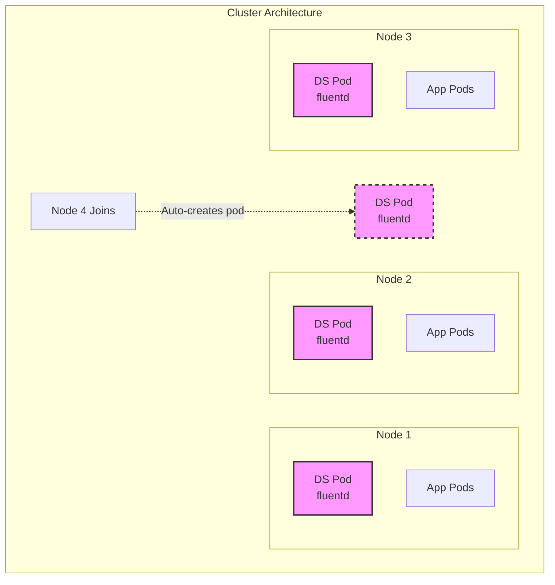
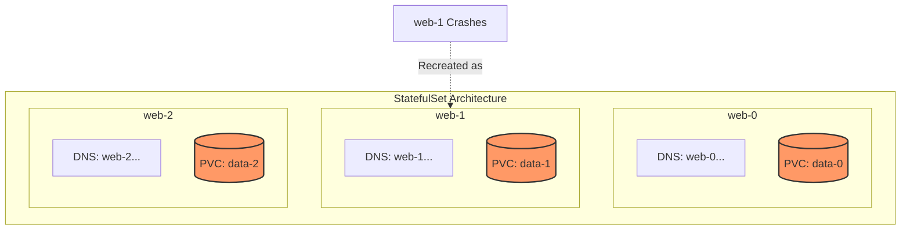
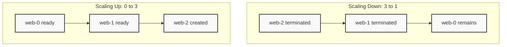
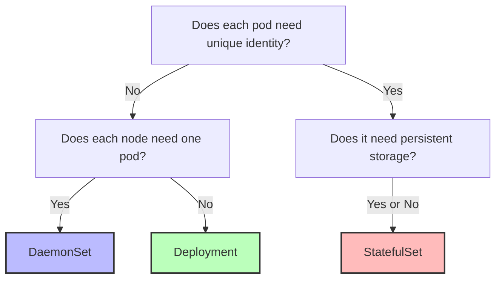

> **Complexity**: `[MEDIUM]` - Specialized workload patterns
>
> **Time to Complete**: 40-50 minutes
>
> **Prerequisites**: Module 2.1 (Pods), Module 2.2 (Deployments)

---

## What You'll Be Able to Do

After completing this comprehensive module, you will be able to:
- **Deploy** DaemonSets for node-level services and StatefulSets for stateful applications across diverse architectures.
- **Explain** how StatefulSet pod naming, PVC binding, and ordered deployment differ from standard Deployments.
- **Configure** DaemonSet tolerations and node selectors to run workloads on specific node pools or control plane nodes when needed.
- **Troubleshoot** StatefulSet issues, including stuck PVC binding, ordered rollout failures, and headless service DNS resolution.
- **Design** highly available systems that correctly leverage DaemonSets for log collection and monitoring agents.
- **Evaluate** application state requirements to choose appropriately between Deployments and StatefulSets for critical production workloads.

---

## Why This Module Matters

Deployments work exceptionally well for stateless applications like web servers, frontend applications, and lightweight microservices. However, not everything in a modern enterprise architecture is stateless. Some workloads have very specific, specialized requirements:

- **DaemonSets**: When you need exactly one pod per node (logging, monitoring, network plugins).
- **StatefulSets**: When pods need stable identities and persistent storage (databases, distributed systems).

Using a Deployment for systems such as Kafka can be dangerous because replacement Pods do not keep the stable identities and ordered startup behavior that many clustered stateful systems expect, so a disruption can turn into membership or recovery problems.

Misapplying workload controllers to a stateful system can turn a routine disruption into an expensive, labor-intensive recovery effort. It perfectly illustrates why understanding specialized workload controllers is not just an exam requirement for the CKA, but a critical survival skill for production Kubernetes. Deployments work great for stateless applications, but when state, identity, or node-locality matter, you must reach for the right tools.

> **The Specialist Teams Analogy**
>
> Think of your cluster as a hospital. **Deployments** are like general practitioners—you can have any number, they're interchangeable, and patients don't care which one they see. **DaemonSets** are like security guards—you need exactly one per entrance (node), no more, no less. **StatefulSets** are like surgeons—each has a unique identity, their own dedicated tools (storage), and patients specifically request "Dr. Smith" (stable network identity).

---

## What You'll Learn

By the end of this module, you'll deeply understand and be able to:
- Create and manage DaemonSets to maintain node-level infrastructure.
- Understand when to use DaemonSets vs Deployments for edge cases.
- Create and manage StatefulSets to run robust databases inside Kubernetes.
- Understand stable network identity and storage mechanisms.
- Troubleshoot DaemonSet and StatefulSet issues effectively in production environments.

---

## Part 1: DaemonSets

### 1.1 What Is a DaemonSet?

A DaemonSet ensures that [**all (or some) nodes run a copy of a pod**](https://kubernetes.io/docs/concepts/workloads/controllers/daemonset/). As nodes are added to the cluster, pods are automatically added to them. As nodes are removed from the cluster, those pods are garbage collected. Deleting a DaemonSet will clean up the pods it created.

This behavior is fundamentally different from a Deployment, which simply ensures a specific *number* of pods are running somewhere in the cluster, completely regardless of which nodes they land on.

Here is the architectural representation:



### 1.2 Common DaemonSet Use Cases

DaemonSets are the backbone of Kubernetes cluster administration. You typically use them to run cluster-level infrastructure daemons rather than user-facing applications.

| Use Case | Example |
|----------|---------|
| Log collection | Fluentd, Filebeat |
| Node monitoring | Node Exporter, Datadog agent |
| Network plugins | Calico, Cilium, Weave |
| Storage daemons | GlusterFS, Ceph |
| Security agents | Falco, Sysdig |

### 1.3 Creating a DaemonSet

Creating a DaemonSet looks remarkably similar to creating a Deployment. The primary difference is the `kind: DaemonSet` declaration and the lack of a `replicas` field (since the number of replicas is strictly determined by the number of matching nodes).

```yaml
# fluentd-daemonset.yaml
apiVersion: apps/v1
kind: DaemonSet
metadata:
  name: fluentd
  labels:
    app: fluentd
spec:
  selector:
    matchLabels:
      app: fluentd
  template:
    metadata:
      labels:
        app: fluentd
    spec:
      containers:
      - name: fluentd
        image: fluentd:v1.35
        resources:
          limits:
            memory: 200Mi
          requests:
            cpu: 100m
            memory: 200Mi
        volumeMounts:
        - name: varlog
          mountPath: /var/log
      volumes:
      - name: varlog
        hostPath:
          path: /var/log
```

Apply it to your cluster:

```bash
kubectl apply -f fluentd-daemonset.yaml
```

> **Pause and predict**: You have a 5-node cluster and create a DaemonSet. Then a 6th node joins the cluster. What happens automatically? Now imagine you do the same with a Deployment set to 5 replicas -- what happens when the 6th node joins?

### 1.4 DaemonSet vs Deployment

It is critical to distinguish between these two controllers, as picking the wrong one leads to resource starvation or incomplete coverage.

| Aspect | DaemonSet | Deployment |
|--------|-----------|------------|
| Pod count | One per node (automatic) | Specified replicas |
| Scheduling | Targets eligible nodes and then uses the scheduler to bind Pods | Uses scheduler |
| Node addition | Auto-creates pod | No automatic action |
| Use case | Node-level services | Application workloads |

### 1.5 DaemonSet Commands

Managing DaemonSets via the command line is straightforward and mirrors Deployment management commands.

```bash
# List DaemonSets
kubectl get daemonsets
kubectl get ds           # Short form

# Describe DaemonSet
kubectl describe ds fluentd

# Check pods created by DaemonSet
kubectl get pods -l app=fluentd -o wide

# Delete DaemonSet
kubectl delete ds fluentd
```

> **Did You Know?**
>
> DaemonSets automatically get several built-in tolerations for node conditions, but normal taints and placement rules still apply; control plane nodes usually need explicit tolerations if they are tainted. Use `nodeSelector` or `tolerations` to control placement.

---

## Part 2: DaemonSet Scheduling

### 2.1 Running on Specific Nodes

You don't always want a DaemonSet to run on *every single node*. For example, you might have a DaemonSet that manages specialized GPU hardware. It makes no sense to run this on standard CPU compute nodes. You can use a `nodeSelector` to restrict the DaemonSet.

```yaml
apiVersion: apps/v1
kind: DaemonSet
metadata:
  name: ssd-monitor
spec:
  selector:
    matchLabels:
      app: ssd-monitor
  template:
    metadata:
      labels:
        app: ssd-monitor
    spec:
      nodeSelector:
        disk: ssd            # Only nodes with this label
      containers:
      - name: monitor
        image: busybox
        command: ["sleep", "infinity"]
```

Applying the label to dictate scheduling:

```bash
# Label a node
kubectl label node worker-1 disk=ssd

# DaemonSet only runs on labeled nodes
kubectl get pods -l app=ssd-monitor -o wide
```

### 2.2 Tolerating Taints

Nodes often have taints applied to repel normal workloads (e.g., control plane nodes are usually tainted). DaemonSets often need to run on tainted nodes to provide full cluster monitoring or network coverage.

```yaml
apiVersion: apps/v1
kind: DaemonSet
metadata:
  name: node-monitor
spec:
  selector:
    matchLabels:
      app: node-monitor
  template:
    metadata:
      labels:
        app: node-monitor
    spec:
      tolerations:
      # Tolerate control-plane taint
      - key: node-role.kubernetes.io/control-plane
        operator: Exists
        effect: NoSchedule
      # Tolerate all taints (run everywhere)
      - operator: Exists
      containers:
      - name: monitor
        image: prom/node-exporter
```

### 2.3 Update Strategy

DaemonSets handle updates carefully to ensure node-level services aren't all taken down simultaneously.

```yaml
apiVersion: apps/v1
kind: DaemonSet
metadata:
  name: fluentd
spec:
  updateStrategy:
    type: RollingUpdate        # Default
    rollingUpdate:
      maxUnavailable: 1        # Update one node at a time
  selector:
    matchLabels:
      app: fluentd
  template:
    # ...
```

| Strategy | Behavior |
|----------|----------|
| [`RollingUpdate`](https://kubernetes.io/docs/tasks/manage-daemon/update-daemon-set/) | Gradually update pods, one node at a time |
| `OnDelete` | Only update when pod is manually deleted |

---

## Part 3: StatefulSets

### 3.1 What Is a StatefulSet?

[StatefulSets manage stateful applications](https://kubernetes.io/docs/concepts/workloads/controllers/statefulset/) with precise, guaranteed behaviors that Deployments lack:
- **Stable, unique network identifiers**
- **Stable, persistent storage**
- **Ordered, graceful deployment and scaling**



### 3.2 StatefulSet Use Cases

- **StatefulSets**: When pods need stable identities and persistent storage (databases, distributed systems).

| Use Case | Example |
|----------|---------|
| Databases | PostgreSQL, MySQL, MongoDB |
| Distributed systems | Kafka, Zookeeper, etcd |
| Search engines | Elasticsearch |
| Message queues | RabbitMQ |

> **Pause and predict**: If you delete pod `web-1` from a StatefulSet, what name will the replacement pod get -- `web-1` or `web-3`? What happens to the PVC that was bound to `web-1`?

### 3.3 StatefulSet Requirements

[StatefulSets require a **Headless Service** to establish their network identity.](https://kubernetes.io/docs/concepts/workloads/controllers/statefulset/) 

First, we define the Headless Service:

```yaml
# Headless Service (required)
apiVersion: v1
kind: Service
metadata:
  name: nginx
  labels:
    app: nginx
spec:
  ports:
  - port: 80
    name: web
  clusterIP: None          # This makes it headless
  selector:
    app: nginx
```

Then, we define the StatefulSet, linking it to the Headless Service via `serviceName`:

```yaml
# StatefulSet
apiVersion: apps/v1
kind: StatefulSet
metadata:
  name: web
spec:
  serviceName: nginx       # Must reference the headless service
  replicas: 3
  selector:
    matchLabels:
      app: nginx
  template:
    metadata:
      labels:
        app: nginx
    spec:
      containers:
      - name: nginx
        image: nginx
        ports:
        - containerPort: 80
        volumeMounts:
        - name: data
          mountPath: /usr/share/nginx/html
  volumeClaimTemplates:    # Creates PVC for each pod
  - metadata:
      name: data
    spec:
      accessModes: ["ReadWriteOnce"]
      resources:
        requests:
          storage: 1Gi
```

### 3.4 Stable Network Identity

The combination of the StatefulSet controller and the Headless Service yields [highly predictable DNS records for every individual pod](https://kubernetes.io/docs/concepts/workloads/controllers/statefulset/).

```bash
# Pod DNS names follow pattern:
# <pod-name>.<service-name>.<namespace>.svc.cluster.local

# For StatefulSet "web" with headless service "nginx":
web-0.nginx.default.svc.cluster.local
web-1.nginx.default.svc.cluster.local
web-2.nginx.default.svc.cluster.local

# Other pods can reach specific instances:
curl web-0.nginx
curl web-1.nginx
```

### 3.5 Stable Storage

Through the [`volumeClaimTemplates` field](https://kubernetes.io/docs/concepts/workloads/controllers/statefulset/), the StatefulSet dynamically provisions unique storage for each pod ordinal.

```bash
# Each pod gets its own PVC named:
# <volumeClaimTemplates.name>-<pod-name>
data-web-0
data-web-1
data-web-2

# When pod restarts, it reattaches to its specific PVC
# Data persists across pod restarts
```

> **Did You Know?**
>
> By default, StatefulSet PVCs are retained when the StatefulSet is deleted, but newer Kubernetes versions also support configurable PVC retention policies. Clean up retained PVCs only when you are sure the data is no longer needed.

---

## Part 4: StatefulSet Operations

### 4.1 Ordered Creation and Deletion

StatefulSets enforce strict ordering to prevent race conditions during distributed cluster formation. [Each pod must wait for the previous pod in the sequence to be Running and Ready](https://kubernetes.io/docs/concepts/workloads/controllers/statefulset/).



### 4.2 Pod Management Policy

You can override the strict ordering if your application doesn't require it (e.g., a massive array of independent processing nodes that still need stable storage).

```yaml
apiVersion: apps/v1
kind: StatefulSet
metadata:
  name: web
spec:
  podManagementPolicy: OrderedReady   # Default - sequential
  # podManagementPolicy: Parallel     # All at once (like Deployment)
```

| Policy | Behavior |
|--------|----------|
| `OrderedReady` | Sequential creation/deletion (default) |
| `Parallel` | All pods created/deleted simultaneously |

> **Stop and think**: You're running a 3-replica StatefulSet for a database cluster. You want to test a new version on just one replica before rolling it out to all. How would you use the `partition` field to achieve a canary deployment? Which pod gets updated first -- web-0 or web-2?

### 4.3 Update Strategy

```yaml
apiVersion: apps/v1
kind: StatefulSet
metadata:
  name: web
spec:
  updateStrategy:
    type: RollingUpdate
    rollingUpdate:
      partition: 2          # Only update pods >= 2
```

**Partition** enables canary deployments:
- [With `partition: 2`, only web-2 gets updated](https://kubernetes.io/docs/concepts/workloads/controllers/statefulset/)
- web-0 and web-1 keep the old version
- Useful for testing updates on subset of pods

### 4.4 StatefulSet Commands

```bash
# List StatefulSets
kubectl get statefulsets
kubectl get sts           # Short form

# Describe
kubectl describe sts web

# Scale
kubectl scale sts web --replicas=5

# Check pods (notice ordered names)
kubectl get pods -l app=nginx

# Check PVCs (one per pod)
kubectl get pvc

# Delete StatefulSet (PVCs remain!)
kubectl delete sts web

# Delete PVCs manually
kubectl delete pvc data-web-0 data-web-1 data-web-2
```

---

## Part 5: Deployment vs StatefulSet

### 5.1 Comparison

| Aspect | Deployment | StatefulSet |
|--------|------------|-------------|
| Pod names | Random suffix (nginx-5d5dd5d5fb-xyz) | Ordinal index (web-0, web-1) |
| Network identity | None (use Service) | Stable DNS per pod |
| Storage | Shared or none | Dedicated PVC per pod |
| Scaling order | Any order | Sequential (ordered) |
| Rolling update | No stable ordinal update order guarantee | Reverse ordinal order (N-1 first) |
| Use case | Stateless apps | Stateful apps |

### 5.2 When to Use What



> **War Story: The Database Disaster**
>
> Using a Deployment for a database that depends on per-replica identity can cause reconnection or replication problems after rescheduling; a StatefulSet is the safer default when the application needs stable network identity.

---

## Part 6: Headless Services Deep Dive

### 6.1 What Is a Headless Service?

[A Service with `clusterIP: None` is referred to as a "Headless" Service. Instead of load balancing traffic across endpoints via a single Virtual IP, the DNS server directly returns the individual pod IPs.](https://kubernetes.io/docs/concepts/services-networking/service/)

Here is a regular service:
```yaml
# Regular Service
apiVersion: v1
kind: Service
metadata:
  name: nginx-regular
spec:
  selector:
    app: nginx
  ports:
  - port: 80
# DNS: nginx-regular → ClusterIP (load balanced)
```

And here is its headless counterpart:
```yaml
# Headless Service
apiVersion: v1
kind: Service
metadata:
  name: nginx-headless
spec:
  clusterIP: None           # Headless!
  selector:
    app: nginx
  ports:
  - port: 80
# DNS: nginx-headless → Returns all pod IPs
# DNS: web-0.nginx-headless → Specific pod IP
```

### 6.2 DNS Resolution Comparison

When querying CoreDNS inside the cluster, the structural difference is obvious:

```bash
# Regular service - returns ClusterIP
nslookup nginx-regular
# Server: 10.96.0.10
# Address: 10.96.0.10#53
# Name: nginx-regular.default.svc.cluster.local
# Address: 10.96.100.50  (ClusterIP)

# Headless service - returns pod IPs
nslookup nginx-headless
# Server: 10.96.0.10
# Address: 10.96.0.10#53
# Name: nginx-headless.default.svc.cluster.local
# Address: 10.244.1.5  (Pod IP)
# Address: 10.244.2.6  (Pod IP)
# Address: 10.244.3.7  (Pod IP)
```

> **Did You Know?**
>
> For a headless Service, cluster DNS returns the set of backing Pod IPs rather than a single virtual IP, so clients can connect directly to individual replicas or apply their own selection logic.

> **Did You Know?**
>
> By default, StatefulSet pod ordinals start at 0 and strictly go up to N-1. If you scale a StatefulSet to 100 replicas, the highest pod name will be `app-99`. By default, StatefulSet ordinals start at 0, and newer Kubernetes versions also let you set a custom start ordinal with `.spec.ordinals.start`; ordinals still remain sequential.

---

## Common Mistakes

| Mistake | Problem | Solution |
|---------|---------|----------|
| StatefulSet without headless Service | Pods don't get stable DNS names | Create headless Service with matching selector |
| Deleting StatefulSet expecting PVC cleanup | Data remains, storage quota consumed | Manually delete PVCs if data not needed |
| Using Deployment for databases | No stable identity, storage issues | Use StatefulSet for stateful workloads |
| DaemonSet on all nodes unexpectedly | Runs on control plane too | Add appropriate tolerations/nodeSelector |
| Wrong serviceName in StatefulSet | DNS resolution fails | Ensure serviceName matches headless Service name |
| Scaling StatefulSet too quickly during crash | Ordered rollout gets stuck waiting for failing pod | Fix the failing pod or use `Parallel` podManagementPolicy |
| Updating StatefulSet with `OnDelete` strategy | Pods don't update automatically | Delete pods manually or change to `RollingUpdate` |
| Forgetting to match labels in DaemonSet | The API rejects the DaemonSet because the selector must match the pod template labels | Ensure `spec.selector.matchLabels` matches `template.metadata.labels` |

---

## Quiz

1. **Your monitoring team needs exactly one log collector pod on every node, including nodes added later. A colleague suggests using a Deployment with `replicas` set to the node count and pod anti-affinity. Why would a DaemonSet be a better choice, and what happens when a new node joins the cluster?**
   <details>
   <summary>Answer</summary>
   A DaemonSet is better because it automatically creates a pod on every new node that joins the cluster and removes pods from nodes that leave. With a Deployment and anti-affinity, you'd need to manually increase the replica count each time a node is added, and the anti-affinity only *prefers* spreading -- it doesn't guarantee one-per-node. Additionally, DaemonSets often ship with or are configured with the tolerations needed for node-level agents, but Deployments can also tolerate taints when you explicitly add matching tolerations. This ensures that no node is ever left unmonitored or unprotected, regardless of how dynamic the cluster scaling behavior might be.
   </details>

2. **You're deploying a 3-node PostgreSQL cluster with primary-standby replication. The standby nodes need to connect to the primary by a stable DNS name, and each node needs its own persistent volume that survives pod restarts. Which controller do you use, and what additional resource is required? What happens if `web-1` (a standby) crashes?**
   <details>
   <summary>Answer</summary>
   Use a StatefulSet with a headless Service (`clusterIP: None`). The headless Service is required because it provides stable DNS names like `web-0.postgres.default.svc.cluster.local` for each pod, allowing the standby nodes to reliably locate the primary. The `volumeClaimTemplates` field ensures each pod gets its own dedicated PVC (e.g., `data-web-0`, `data-web-1`) that persists independently of the pod lifecycle. When `web-1` crashes, the StatefulSet controller recreates it with the exact same name `web-1` (not `web-3`), and it safely reattaches to its original PVC `data-web-1`, preserving all replicated data. The standby configuration pointing to `web-0.postgres` continues to work flawlessly because the DNS name remains completely stable throughout the outage.
   </details>

3. **You deleted a StatefulSet with `kubectl delete sts web`, but your storage costs haven't decreased. A colleague says the data should have been cleaned up automatically. What actually happened, and what must you do to reclaim the storage?**
   <details>
   <summary>Answer</summary>
   PVCs created by a StatefulSet's `volumeClaimTemplates` are NOT automatically deleted when the StatefulSet is deleted. This is an intentional, critical safety feature designed by Kubernetes to prevent catastrophic accidental data loss -- because database state is often the most precious asset in a cluster. The PVCs (e.g., `data-web-0`, `data-web-1`, `data-web-2`) still exist and remain bound to their underlying PersistentVolumes, which continues to consume storage backend capacity. To fully reclaim the storage, you must explicitly and manually delete them using a command like `kubectl delete pvc data-web-0 data-web-1 data-web-2`. You should always meticulously audit your orphaned PVCs after decommissioning StatefulSets to avoid accumulating phantom storage costs.
   </details>

4. **Your e-commerce site is expecting heavy traffic, so you need to scale a distributed database StatefulSet from 3 replicas to 5. In what specific order are the new pods created? Once the traffic spike subsides, you scale back down to 2. In what precise order are pods terminated, and why does this rigid ordering matter so much for distributed databases?**
   <details>
   <summary>Answer</summary>
   During the scale-up phase, `web-3` is created first and must achieve a Running and Ready state before `web-4` is even scheduled. When scaling down, `web-4` is terminated first, followed by `web-3`, and finally `web-2`. This strict reverse-ordinal ordering matters for distributed systems because higher-numbered replicas are typically the newest, least-authoritative members of the cluster. Removing the newest members first ensures the most established pods—which often hold critical leadership roles, primary shards, or the most complete data sets—are the last to be disrupted. For example, in a database cluster, `web-0` is frequently the elected primary, and ensuring it is removed last prevents chaotic, unnecessary leader elections during routine scale-down operations.
   </details>

5. **You need to test a risky new configuration on just a single instance of your 5-replica StatefulSet without affecting the rest of the production cluster. How can you accomplish this gracefully using native StatefulSet features?**
   <details>
   <summary>Answer</summary>
   You can utilize the `partition` field within the StatefulSet's `rollingUpdate` update strategy. By setting `partition: 4`, only the pod with ordinal 4 (the highest ordinal, `web-4`) will be updated to the new configuration or image version. The existing pods `web-0` through `web-3` will completely ignore the update and remain running the old configuration. Once you have verified the new configuration behaves correctly on `web-4` under real traffic, you can gradually lower the partition number to slowly roll the update out to the remaining pods. This native mechanism provides a built-in, highly controlled canary deployment strategy specifically tailored for stateful workloads.
   </details>

6. **You have deployed a DaemonSet intended to run a security scanner on every node, but during an audit you notice it is completely absent from all three of your control plane nodes. What is the most likely architectural cause, and how do you resolve it to ensure full coverage?**
   <details>
   <summary>Answer</summary>
   The control plane nodes are almost certainly tainted with `node-role.kubernetes.io/control-plane:NoSchedule` to aggressively prevent standard user workloads from running on them and competing for critical resources. Even though DaemonSets are designed to run everywhere, the DaemonSet controller still respects these node taints by default. To force the DaemonSet to schedule its pods on these specific nodes, you must add a matching `toleration` to the DaemonSet's pod template spec. This toleration explicitly declares that the DaemonSet is authorized to ignore the control plane taint, allowing the scheduler to place the security scanner pod there and achieve 100% cluster coverage.
   </details>

7. **A developer is confused why running `nslookup my-database` on a StatefulSet's headless service returns a list of individual pod IPs instead of a single, load-balanced Virtual IP. What is happening fundamentally under the hood with CoreDNS, and why is this necessary for stateful applications?**
   <details>
   <summary>Answer</summary>
   Because the service is defined with `clusterIP: None` (making it explicitly headless), Kubernetes does not allocate a virtual IP or configure kube-proxy iptables rules to load-balance traffic for it. Instead, CoreDNS directly monitors the Endpoints associated with the service's selector and bypasses the proxy layer entirely. It creates multiple standard DNS A records—one for each underlying pod IP—and returns the full list of IPs directly to the client. This behavior is essential for stateful systems, as it allows the client application to handle its own connection pooling, discover peer nodes, or connect directly to a specific primary node rather than being arbitrarily load-balanced across replicas.
   </details>

---

## Hands-On Exercise

**Task**: Create a DaemonSet and StatefulSet, understand their behaviors, and observe network identity.

**Steps**:

### Part A: DaemonSet

1. **Create a DaemonSet**:
```bash
cat > node-monitor-ds.yaml << 'EOF'
apiVersion: apps/v1
kind: DaemonSet
metadata:
  name: node-monitor
spec:
  selector:
    matchLabels:
      app: node-monitor
  template:
    metadata:
      labels:
        app: node-monitor
    spec:
      containers:
      - name: monitor
        image: busybox
        command: ["sh", "-c", "while true; do echo $(hostname); sleep 60; done"]
        resources:
          limits:
            memory: 50Mi
            cpu: 50m
EOF

kubectl apply -f node-monitor-ds.yaml
```

2. **Verify one pod per node**:
```bash
kubectl get pods -l app=node-monitor -o wide
kubectl get ds node-monitor
# DESIRED = CURRENT = READY = number of nodes
```

3. **Check logs from a specific node's pod**:
```bash
kubectl logs -l app=node-monitor --all-containers
```

4. **Cleanup DaemonSet**:
```bash
kubectl delete ds node-monitor
rm node-monitor-ds.yaml
```

### Part B: StatefulSet

1. **Create headless Service and StatefulSet**:
```bash
cat > statefulset-demo.yaml << 'EOF'
apiVersion: v1
kind: Service
metadata:
  name: nginx
spec:
  clusterIP: None
  selector:
    app: nginx
  ports:
  - port: 80
---
apiVersion: apps/v1
kind: StatefulSet
metadata:
  name: web
spec:
  serviceName: nginx
  replicas: 3
  selector:
    matchLabels:
      app: nginx
  template:
    metadata:
      labels:
        app: nginx
    spec:
      containers:
      - name: nginx
        image: nginx
        ports:
        - containerPort: 80
EOF

kubectl apply -f statefulset-demo.yaml
```

2. **Watch ordered creation**:
```bash
kubectl get pods -l app=nginx -w
# web-0 Running, then web-1, then web-2
```

3. **Verify stable network identity**:
```bash
# Create a test pod
kubectl run dns-test --image=busybox --rm -it --restart=Never -- nslookup web-0.nginx
kubectl run dns-test --image=busybox --rm -it --restart=Never -- nslookup web-1.nginx
```

4. **Scale down and observe order**:
```bash
kubectl scale sts web --replicas=1
kubectl get pods -l app=nginx -w
# web-2 terminates, then web-1
```

5. **Scale back up**:
```bash
kubectl scale sts web --replicas=3
kubectl get pods -l app=nginx -w
# web-1 created, then web-2
```

6. **Cleanup**:
```bash
kubectl delete -f statefulset-demo.yaml
rm statefulset-demo.yaml
```

**Success Criteria**:
- [ ] Can create DaemonSets across diverse node topologies.
- [ ] Understand one pod per node behavior natively.
- [ ] Can create StatefulSets with properly linked headless Services.
- [ ] Understand ordered scaling and the guarantees it provides.
- [ ] Know when to use each controller to prevent production disasters.
- [ ] Understand stable network identity and storage.

---

## Practice Drills

### Drill 1: DaemonSet Creation (Target: 3 minutes)

```bash
# Create DaemonSet
cat << 'EOF' | kubectl apply -f -
apiVersion: apps/v1
kind: DaemonSet
metadata:
  name: log-collector
spec:
  selector:
    matchLabels:
      app: log-collector
  template:
    metadata:
      labels:
        app: log-collector
    spec:
      containers:
      - name: collector
        image: busybox
        command: ["sleep", "infinity"]
EOF

# Verify
kubectl get ds log-collector
kubectl get pods -l app=log-collector -o wide

# Cleanup
kubectl delete ds log-collector
```

### Drill 2: DaemonSet with nodeSelector (Target: 5 minutes)

```bash
# Label one node
NODE=$(kubectl get nodes -o jsonpath='{.items[0].metadata.name}')
kubectl label node $NODE disk=ssd

# Create DaemonSet with nodeSelector
cat << 'EOF' | kubectl apply -f -
apiVersion: apps/v1
kind: DaemonSet
metadata:
  name: ssd-only
spec:
  selector:
    matchLabels:
      app: ssd-only
  template:
    metadata:
      labels:
        app: ssd-only
    spec:
      nodeSelector:
        disk: ssd
      containers:
      - name: app
        image: busybox
        command: ["sleep", "infinity"]
EOF

# Verify - should only run on labeled node
kubectl get pods -l app=ssd-only -o wide

# Cleanup
kubectl delete ds ssd-only
kubectl label node $NODE disk-
```

### Drill 3: StatefulSet Basic (Target: 5 minutes)

```bash
# Create headless service and StatefulSet
cat << 'EOF' | kubectl apply -f -
apiVersion: v1
kind: Service
metadata:
  name: db
spec:
  clusterIP: None
  selector:
    app: db
  ports:
  - port: 5432
---
apiVersion: apps/v1
kind: StatefulSet
metadata:
  name: db
spec:
  serviceName: db
  replicas: 3
  selector:
    matchLabels:
      app: db
  template:
    metadata:
      labels:
        app: db
    spec:
      containers:
      - name: postgres
        image: busybox
        command: ["sleep", "infinity"]
EOF

# Watch ordered creation
kubectl get pods -l app=db -w &
sleep 30
kill %1

# Verify names
kubectl get pods -l app=db

# Cleanup
kubectl delete sts db
kubectl delete svc db
```

### Drill 4: StatefulSet DNS Test (Target: 5 minutes)

```bash
# Create StatefulSet with headless service
cat << 'EOF' | kubectl apply -f -
apiVersion: v1
kind: Service
metadata:
  name: nginx
spec:
  clusterIP: None
  selector:
    app: nginx
  ports:
  - port: 80
---
apiVersion: apps/v1
kind: StatefulSet
metadata:
  name: web
spec:
  serviceName: nginx
  replicas: 2
  selector:
    matchLabels:
      app: nginx
  template:
    metadata:
      labels:
        app: nginx
    spec:
      containers:
      - name: nginx
        image: nginx
EOF

# Wait for ready
kubectl wait --for=condition=ready pod/web-0 pod/web-1 --timeout=60s

# Test DNS resolution
kubectl run dns-test --image=busybox --rm -it --restart=Never -- nslookup nginx
kubectl run dns-test --image=busybox --rm -it --restart=Never -- nslookup web-0.nginx
kubectl run dns-test --image=busybox --rm -it --restart=Never -- nslookup web-1.nginx

# Cleanup
kubectl delete sts web
kubectl delete svc nginx
```

### Drill 5: StatefulSet Scaling Order (Target: 3 minutes)

```bash
# Create StatefulSet
cat << 'EOF' | kubectl apply -f -
apiVersion: v1
kind: Service
metadata:
  name: order-test
spec:
  clusterIP: None
  selector:
    app: order-test
  ports:
  - port: 80
---
apiVersion: apps/v1
kind: StatefulSet
metadata:
  name: order
spec:
  serviceName: order-test
  replicas: 1
  selector:
    matchLabels:
      app: order-test
  template:
    metadata:
      labels:
        app: order-test
    spec:
      containers:
      - name: nginx
        image: nginx
EOF

# Scale up and watch order
kubectl scale sts order --replicas=3
kubectl get pods -l app=order-test -w &
sleep 30
kill %1

# Scale down and watch reverse order
kubectl scale sts order --replicas=1
kubectl get pods -l app=order-test -w &
sleep 30
kill %1

# Cleanup
kubectl delete sts order
kubectl delete svc order-test
```

### Drill 6: Troubleshooting - DaemonSet Not Running on Node

```bash
# Taint a node
NODE=$(kubectl get nodes -o jsonpath='{.items[0].metadata.name}')
kubectl taint node $NODE special=true:NoSchedule

# Create DaemonSet without toleration
cat << 'EOF' | kubectl apply -f -
apiVersion: apps/v1
kind: DaemonSet
metadata:
  name: no-toleration
spec:
  selector:
    matchLabels:
      app: no-toleration
  template:
    metadata:
      labels:
        app: no-toleration
    spec:
      containers:
      - name: app
        image: busybox
        command: ["sleep", "infinity"]
EOF

# Check - won't run on tainted node
kubectl get pods -l app=no-toleration -o wide
kubectl get ds no-toleration

# YOUR TASK: Fix by adding toleration
# (Delete and recreate with toleration)

# Cleanup
kubectl delete ds no-toleration
kubectl taint node $NODE special-
```

<details>
<summary>Solution</summary>

```bash
cat << 'EOF' | kubectl apply -f -
apiVersion: apps/v1
kind: DaemonSet
metadata:
  name: with-toleration
spec:
  selector:
    matchLabels:
      app: with-toleration
  template:
    metadata:
      labels:
        app: with-toleration
    spec:
      tolerations:
      - key: special
        operator: Equal
        value: "true"
        effect: NoSchedule
      containers:
      - name: app
        image: busybox
        command: ["sleep", "infinity"]
EOF

kubectl get pods -l app=with-toleration -o wide
kubectl delete ds with-toleration
```

</details>

### Drill 7: Challenge - Identify the Right Controller

For each scenario, identify whether to use Deployment, DaemonSet, or StatefulSet:

1. Web application with 5 replicas
2. Log collector on every node
3. PostgreSQL database cluster
4. REST API service
5. Prometheus node exporter
6. Kafka cluster
7. nginx reverse proxy

<details>
<summary>Answers</summary>

1. **Deployment** - Stateless web app
2. **DaemonSet** - Need one per node
3. **StatefulSet** - Needs stable identity and storage
4. **Deployment** - Stateless REST API
5. **DaemonSet** - Monitoring agent per node
6. **StatefulSet** - Distributed system with stable identity
7. **Deployment** - Stateless proxy (unless specific instance needed)

</details>

---

## Next Module

[Module 2.4: Jobs & CronJobs](../module-2.4-jobs-cronjobs/) - Dive into batch workloads and scheduled tasks to round out your knowledge of specialized workload controllers.

## Sources

- [DaemonSet](https://kubernetes.io/docs/concepts/workloads/controllers/daemonset/) — Primary upstream reference for DaemonSet guarantees, node coverage, and controller behavior.
- [Perform a Rolling Update on a DaemonSet](https://kubernetes.io/docs/tasks/manage-daemon/update-daemon-set/) — Explains DaemonSet update strategies including `RollingUpdate` and `OnDelete` behavior.
- [StatefulSets](https://kubernetes.io/docs/concepts/workloads/controllers/statefulset/) — Primary upstream reference for StatefulSet identity, storage, ordering, and partitioned rolling updates.
- [Service](https://kubernetes.io/docs/concepts/services-networking/service/) — Defines headless Services and how `clusterIP: None` exposes endpoint IPs without a virtual IP.
- [DNS for Services and Pods](https://kubernetes.io/docs/concepts/services-networking/dns-pod-service/) — Explains cluster DNS records for Services and Pods, including per-Pod records used with StatefulSets.
