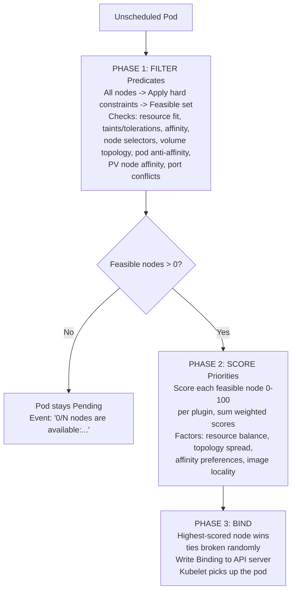
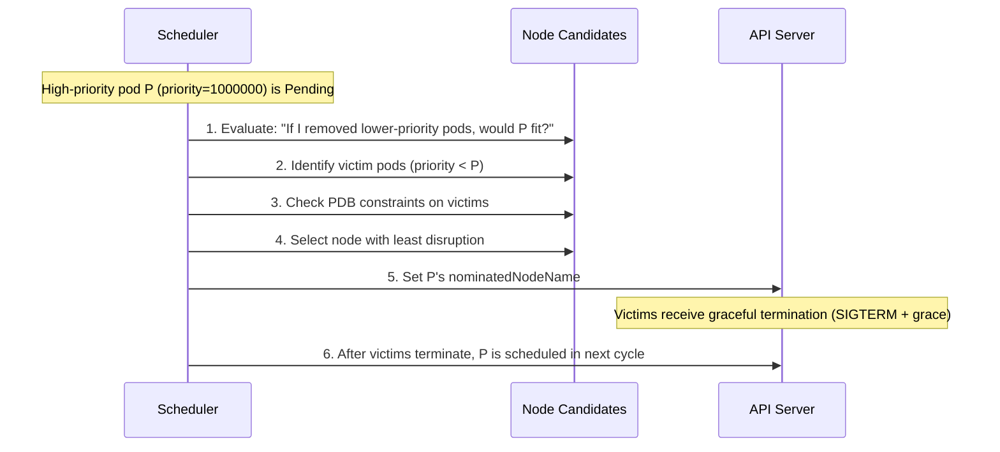
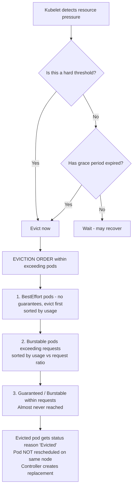
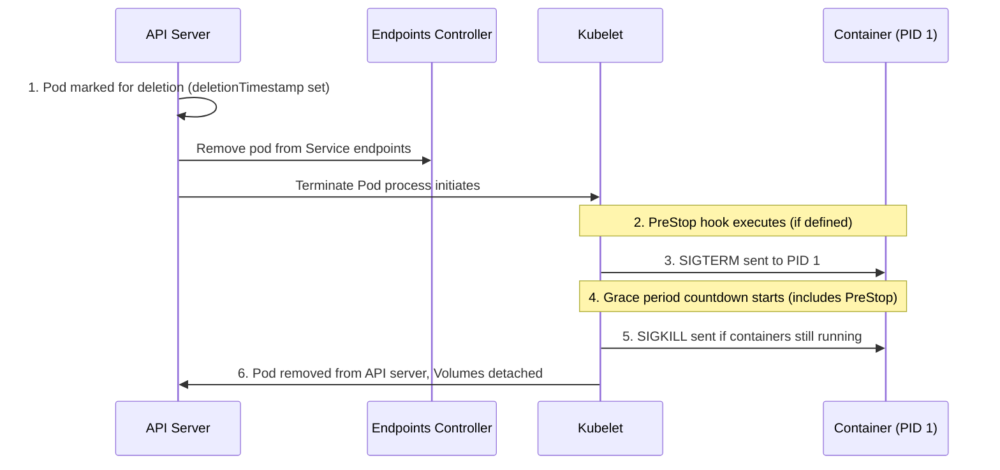

> **Complexity**: `[COMPLEX]` - Advanced scheduling internals, high exam yield
>
> **Time to Complete**: 35-45 minutes
>
> **Prerequisites**: Module 2.5 (Resource Management), Module 2.6 (Scheduling)

> **Historical Note**: Features discussed here evolved significantly from early Kubernetes versions. Historically, APIs evolved through v1.1, v1.2, v1.3, v1.4, and v1.5. Later versions like v1.27 introduced further refinements. Today, we explicitly target Kubernetes 1.35 (the current stable release). References to numeric values like 1.5 in CPU amounts do not denote Kubernetes versions.

---

## Why This Module Matters

In late 2024, a leading global payment processor experienced a catastrophic 53-minute outage during a Black Friday event, costing the business an estimated $2.4 million in dropped transactions. A payments team deployed a new fraud-detection service with `requests.cpu: 4` and `requests.memory: 8Gi` but forgot to set a PriorityClass. During a routine node upgrade, the cluster autoscaler drained two massive nodes. Every remaining node was instantly packed tight with lower-priority batch jobs generating daily reports. 

The critical fraud service's pods sat Pending for 53 minutes because no single node had enough allocatable resources. Without a PriorityClass, the scheduler had no authority to preempt the batch workloads. During those 53 minutes, the payment pipeline processed transactions blindly without fraud checks, leading to massive chargebacks and regulatory scrutiny. The post-incident review revealed three fundamental gaps in their architecture: no PriorityClass hierarchy, no PodDisruptionBudget on the fraud service, and QoS class BestEffort on the batch jobs that should have been evicted first.

This module matters because Kubernetes scheduling and eviction are not abstract background processes—they are the direct arbiters of your application's reliability under stress. You will learn to design resilience through PriorityClasses, configure guaranteed QoS for critical components, and evaluate eviction signals before they trigger outages. These concepts determine whether your critical pods run or sit Pending, whether evictions hit the right targets, and whether your stateful services shut down gracefully.

> **CKA Exam Relevance**: Scheduling troubleshooting, PriorityClasses, QoS classification, PDB behavior, and graceful termination are all tested. Understanding the scheduler pipeline lets you diagnose Pending pods in seconds instead of minutes.

---

## What You'll Learn

By the end of this module, you'll be able to:
- **Diagnose** pending pods by tracing the scheduler's Filter, Score, and Bind phases.
- **Design** PriorityClasses and predict preemption behavior for critical workloads.
- **Evaluate** a pod's QoS class from its resource spec and determine eviction likelihood.
- **Compare** kubelet eviction signals, analyzing soft versus hard threshold types.
- **Implement** graceful termination flows using PreStop hooks and PodDisruptionBudgets.
- **Debug** unexpected pod terminations and resource pressure on the CKA exam.

---

## Part 1: The Scheduler Pipeline

### 1.1 Overview

When you create a pod, the kube-scheduler watches for unscheduled pods (those with `spec.nodeName` unset) and runs a three-phase pipeline to assign each pod to a node. This process is continuous and deeply integrated into the Kubernetes control plane. The scheduler evaluates every node against the requirements of the pod, ensuring that workloads are distributed efficiently and safely across the cluster.



<details>
<summary>Legacy ASCII View of Pipeline</summary>

```text
┌──────────────────────────────────────────────────────────────────────┐
│                     SCHEDULER PIPELINE                               │
│                                                                      │
│  Unscheduled Pod                                                     │
│       │                                                              │
│       ▼                                                              │
│  ┌─────────────────────────────────────────────────────────┐        │
│  │  PHASE 1: FILTER (Predicates)                           │        │
│  │                                                         │        │
│  │  All nodes ──► Apply hard constraints ──► Feasible set  │        │
│  │                                                         │        │
│  │  Checks: resource fit, taints/tolerations, affinity,    │        │
│  │  node selectors, volume topology, pod anti-affinity,    │        │
│  │  PV node affinity, port conflicts                       │        │
│  └────────────────────────┬────────────────────────────────┘        │
│                           │                                          │
│              ┌────────────┴──────────────┐                          │
│              │ Feasible nodes > 0?       │                          │
│              └────────────┬──────────────┘                          │
│               No ▼                Yes ▼                              │
│         Pod stays Pending    ┌──────────────────────────────────┐   │
│         Event: "0/N nodes    │  PHASE 2: SCORE (Priorities)    │   │
│         are available:..."   │                                  │   │
│                              │  Score each feasible node 0-100  │   │
│                              │  per plugin, sum weighted scores  │   │
│                              │                                  │   │
│                              │  Factors: resource balance,      │   │
│                              │  topology spread, affinity       │   │
│                              │  preferences, image locality     │   │
│                              └──────────────┬───────────────────┘   │
│                                             │                        │
│                                             ▼                        │
│                              ┌──────────────────────────────────┐   │
│                              │  PHASE 3: BIND                  │   │
│                              │                                  │   │
│                              │  Highest-scored node wins        │   │
│                              │  (ties broken randomly)          │   │
│                              │  Write Binding to API server     │   │
│                              │  Kubelet picks up the pod        │   │
│                              └──────────────────────────────────┘   │
│                                                                      │
└──────────────────────────────────────────────────────────────────────┘
```
</details>

### 1.2 Phase 1: Filter (Predicates)

The filter phase eliminates nodes that cannot run the pod. Each filter plugin is a hard constraint -- if any single filter rejects a node, that node is removed from consideration. These predicates are the absolute non-negotiables for workload placement.

| Filter Plugin | What It Checks |
|---|---|
| `NodeResourcesFit` | Does the node have enough allocatable CPU, memory, ephemeral storage? |
| `NodeAffinity` | Does the node match `requiredDuringSchedulingIgnoredDuringExecution`? |
| `TaintToleration` | Does the pod tolerate all NoSchedule taints on the node? |
| `NodePorts` | Are the requested host ports available? |
| `VolumeBinding` | Can the required PVs be bound to this node's topology? |
| `PodTopologySpread` | Does placing here violate `maxSkew` with `whenUnsatisfiable: DoNotSchedule`? |
| `InterPodAffinity` | Does placement violate required pod anti-affinity rules? |

For example, `NodeResourcesFit` physically compares the sum of the pod's container requests against the node's allocatable capacity. If a node lacks sufficient CPU, it's filtered out immediately.

**What happens when no node passes filtering?** The pod remains in Pending state. The scheduler records an event on the pod explaining which constraints failed on each node. You see messages like:

```text
0/5 nodes are available: 2 insufficient cpu, 2 node(s) had taint
{node-role.kubernetes.io/control-plane: }, 1 node(s) didn't match
Pod topology spread constraints.
```

The scheduler retries on its next scheduling cycle (triggered by cluster state changes such as a new node joining, a pod being deleted, or resource becoming available).

### 1.3 Phase 2: Score (Priorities)

For nodes that pass all filters, the scheduler scores each one. Every scoring plugin assigns a value from 0 to 100, and scores are multiplied by plugin weights and summed. This phase transforms the "can it run?" question into "where should it run optimally?"

| Score Plugin | What It Favors |
|---|---|
| `NodeResourcesBalancedAllocation` | Nodes where CPU and memory usage ratios are similar (balanced utilization) |
| `NodeResourcesLeastAllocated` | Nodes with the most available resources (spread workloads) |
| `ImageLocality` | Nodes that already have the container image cached |
| `InterPodAffinity` | Nodes matching `preferredDuringSchedulingIgnoredDuringExecution` |
| `TaintToleration` | Nodes with fewer tolerations needed (prefer "cleaner" nodes) |
| `PodTopologySpread` | Nodes that improve topology balance |

These plugins operate cooperatively. `ImageLocality` provides a slight boost to nodes that already have large container images cached, saving pull time. `NodeResourcesLeastAllocated` actively combats hotspots by naturally dispersing new workloads across underutilized machines. 

**What if two nodes score equally?** The scheduler breaks ties randomly. This prevents hot-spotting a single node when the cluster is uniformly loaded. You should not depend on deterministic placement -- if you need a pod on a specific node, use `nodeSelector` or `nodeName`.

### 1.4 Phase 3: Bind

The scheduler creates a `Binding` object that sets `spec.nodeName` on the pod. The kubelet on that node detects the assignment, pulls images, mounts volumes, and starts containers. The bind phase also runs permit and reserve plugins (for features like volume binding confirmation and gang scheduling), finalizing the transaction with the API Server.

> **Exam Tip**: When troubleshooting a Pending pod, always start with `kubectl describe pod <name>`. The Events section tells you exactly which filter phase failed. If there are no events at all, the scheduler may not be running.

---

## Part 2: Priority and Preemption

> **Pause and predict**: A high-priority pod (priority 1000000) is Pending because no node has enough resources. The cluster has nodes full of low-priority batch jobs (priority 100). Will Kubernetes automatically make room for the high-priority pod, or does it just wait? What determines which pods get evicted?

### 2.1 PriorityClasses

A PriorityClass assigns a numeric priority value to pods. Higher values mean higher priority. The scheduler uses this value during preemption decisions. A well-designed priority schema prevents critical daemons and revenue-generating services from starving due to aggressive background jobs.

```yaml
apiVersion: scheduling.k8s.io/v1
kind: PriorityClass
metadata:
  name: critical-service
value: 1000000
globalDefault: false
preemptionPolicy: PreemptLowerPriority
description: "For services that must not be displaced by batch workloads"
```

```yaml
apiVersion: scheduling.k8s.io/v1
kind: PriorityClass
metadata:
  name: batch-processing
value: 100
globalDefault: false
preemptionPolicy: PreemptLowerPriority
description: "For batch jobs that can be preempted"
```

```yaml
apiVersion: scheduling.k8s.io/v1
kind: PriorityClass
metadata:
  name: best-effort-batch
value: 10
globalDefault: false
preemptionPolicy: Never
description: "Batch jobs that should never preempt others"
```

**Built-in PriorityClasses** (do not modify these):

| Name | Value | Used By |
|---|---|---|
| `system-cluster-critical` | 2000000000 | Cluster-essential components (CoreDNS, kube-proxy) |
| `system-node-critical` | 2000001000 | Node-essential components (kubelet static pods) |

Assign a PriorityClass to a pod directly in its specification:

```yaml
apiVersion: v1
kind: Pod
metadata:
  name: fraud-detector
spec:
  priorityClassName: critical-service
  containers:
  - name: detector
    image: fraud-detector:v3.2
    resources:
      requests:
        cpu: "2"
        memory: 4Gi
      limits:
        cpu: "2"
        memory: 4Gi
```

### 2.2 How Preemption Works

When a high-priority pod cannot be scheduled (all nodes fail the filter phase), the scheduler enters the preemption cycle:



<details>
<summary>Legacy ASCII View of Preemption Sequence</summary>

```text
┌──────────────────────────────────────────────────────────────────┐
│                  PREEMPTION SEQUENCE                              │
│                                                                  │
│  High-priority pod P (priority=1000000) is Pending               │
│       │                                                          │
│       ▼                                                          │
│  1. Scheduler re-evaluates each node:                            │
│     "If I removed lower-priority pods, would P fit?"             │
│       │                                                          │
│       ▼                                                          │
│  2. For each candidate node, identify victim pods:               │
│     - Only pods with priority < P's priority                     │
│     - Remove minimum set needed to free resources                │
│       │                                                          │
│       ▼                                                          │
│  3. Check PDB constraints:                                       │
│     - Would evicting victims violate any PDB?                    │
│     - If yes, try a different victim set or skip node            │
│       │                                                          │
│       ▼                                                          │
│  4. Select the node with the least disruption:                   │
│     - Prefer nodes where fewest pods must be evicted             │
│     - Prefer nodes where lowest-priority pods are victims        │
│       │                                                          │
│       ▼                                                          │
│  5. Set P's nominatedNodeName to the chosen node                 │
│     Victims receive graceful termination (SIGTERM + grace)       │
│       │                                                          │
│       ▼                                                          │
│  6. After victims terminate, P is scheduled in the next cycle    │
│                                                                  │
└──────────────────────────────────────────────────────────────────┘
```
</details>

### 2.3 Worked Example

Consider a 3-node cluster, each with 4 CPU allocatable:

| Node | Running Pods | CPU Used | Available |
|---|---|---|---|
| node-1 | batch-a (priority 100, 2 CPU), batch-b (priority 100, 1 CPU) | 3 CPU | 1 CPU |
| node-2 | web-api (priority 500, 3 CPU) | 3 CPU | 1 CPU |
| node-3 | monitoring (priority 800, 2 CPU), logger (priority 50, 1.5 CPU) | 3.5 CPU | 0.5 CPU |

A new pod `fraud-detector` (priority 1000000, needs 2 CPU) is created.

**Filter phase**: No node has 2 CPU free. All fail. Pod is Pending.

**Preemption analysis**:
- **node-1**: Evict batch-a (priority 100, 2 CPU) -- frees 2 CPU. Victim priority 100. One victim.
- **node-2**: Evict web-api (priority 500, 3 CPU) -- frees 3 CPU. Victim priority 500. One victim, but higher priority.
- **node-3**: Evict logger (priority 50, 1.5 CPU) -- frees 1.5 CPU. Not enough. Must also evict monitoring (priority 800, 2 CPU) -- frees 3.5 CPU. Two victims, one at priority 800.

**Decision**: node-1 wins. It requires only one victim, and that victim has the lowest priority (100). The scheduler sets `nominatedNodeName: node-1` on fraud-detector, terminates batch-a gracefully, and schedules fraud-detector in the next cycle.

### 2.4 PDB Interaction with Preemption

PodDisruptionBudgets limit voluntary disruptions. During preemption, the scheduler respects PDBs as a preference, not a hard constraint. In Kubernetes 1.35+: - The scheduler **tries** to avoid PDB violations when selecting victims.

If every candidate node requires a PDB violation, preemption still proceeds -- the high-priority pod takes precedence. This prevents a scenario where misconfigured or overly restrictive PDBs lock up the cluster and prevent critical security or system daemonsets from being placed. PDBs are a **hard constraint** for `kubectl drain` and voluntary eviction API calls, but a **soft constraint** for scheduler preemption.

This distinction is critical: PDBs protect against planned maintenance but do not fully block priority-based preemption.

---

## Part 3: QoS Classes

### 3.1 How QoS Class Is Determined

Kubernetes automatically assigns a QoS class to every pod based on the resource requests and limits of its containers. You do not set QoS class directly -- it is derived. Understanding this derivation is key to protecting workloads from random eviction.

| QoS Class | Condition | Eviction Priority |
|---|---|---|
| **Guaranteed** | Every container has `requests == limits` for both CPU and memory | Last evicted |
| **Burstable** | At least one container has a request or limit set, but not Guaranteed | Middle |
| **BestEffort** | No container has any request or limit | First evicted |

### 3.2 YAML Examples for Each QoS Class

**Guaranteed** -- requests equal limits for all resources in all containers. This represents workloads that have strict reservations and cannot tolerate CPU throttling or sudden memory starvation.

```yaml
apiVersion: v1
kind: Pod
metadata:
  name: qos-guaranteed
spec:
  containers:
  - name: app
    image: nginx:1.35
    resources:
      requests:
        cpu: 500m
        memory: 256Mi
      limits:
        cpu: 500m
        memory: 256Mi
```

Verify:

```bash
k get pod qos-guaranteed -o jsonpath='{.status.qosClass}'
# Output: Guaranteed
```

**Burstable** -- requests set but not equal to limits (or limits missing for one resource):

```yaml
apiVersion: v1
kind: Pod
metadata:
  name: qos-burstable
spec:
  containers:
  - name: app
    image: nginx:1.35
    resources:
      requests:
        cpu: 250m
        memory: 128Mi
      limits:
        cpu: 500m
        memory: 512Mi
```

Verify:

```bash
k get pod qos-burstable -o jsonpath='{.status.qosClass}'
# Output: Burstable
```

**BestEffort** -- no requests, no limits on any container:

```yaml
apiVersion: v1
kind: Pod
metadata:
  name: qos-besteffort
spec:
  containers:
  - name: app
    image: nginx:1.35
```

Verify:

```bash
k get pod qos-besteffort -o jsonpath='{.status.qosClass}'
# Output: BestEffort
```

### 3.3 Edge Cases

- If you set only `limits` (no `requests`), Kubernetes auto-sets `requests = limits`, making the pod Guaranteed (if done for all containers and all resources).
- A pod with two containers where one is Guaranteed and the other has no resources is classified as **Burstable**, not Guaranteed.
- `cpu` and `memory` both matter. If requests equal limits for CPU but not memory, the pod is Burstable.
- Ephemeral storage requests/limits do not affect QoS classification.

### 3.4 QoS and Scheduling

QoS class does **not** affect scheduling. The scheduler only looks at `requests` to determine if a pod fits on a node. `limits` are enforced at runtime by the kubelet and container runtime (CPU throttling, OOM kill for memory). This means:

- A Guaranteed pod with `requests: 2 CPU` and a Burstable pod with `requests: 2 CPU` are scheduled identically
- QoS class only matters during **eviction** (next section)

---

## Part 4: Eviction and Node Pressure

### 4.1 Kubelet Eviction Manager

The kubelet monitors resource signals on the node and evicts pods when thresholds are crossed. This is separate from the scheduler -- eviction is a kubelet decision on a specific node. It acts as a last line of defense to prevent a single pod from crashing the entire underlying host operating system.

**Eviction signals**:

| Signal | Description | Typical Soft Threshold | Typical Hard Threshold |
|---|---|---|---|
| `memory.available` | Free memory on the node | < 500Mi (grace 90s) | < 100Mi |
| `nodefs.available` | Free disk on root partition | < 15% (grace 120s) | < 10% |
| `imagefs.available` | Free disk on image filesystem | < 15% (grace 120s) | < 10% |
| `pid.available` | Free PIDs | < 1000 (grace 60s) | < 500 |

### 4.2 Soft vs Hard Thresholds

- **Soft thresholds** include a grace period. The kubelet waits for the grace period to expire before evicting. If resource usage drops below the threshold during the grace period, no eviction occurs. Configure with `--eviction-soft` and `--eviction-soft-grace-period`.

- **Hard thresholds** are immediate. When crossed, the kubelet evicts pods without waiting. Configure with `--eviction-hard`.

### 4.3 Eviction Decision Flow



<details>
<summary>Legacy ASCII View of Eviction Flow</summary>

```text
┌──────────────────────────────────────────────────────────────────┐
│                   EVICTION DECISION FLOW                         │
│                                                                  │
│  Kubelet detects resource pressure                               │
│       │                                                          │
│       ▼                                                          │
│  Is this a hard threshold?                                       │
│       │                                                          │
│   Yes ▼              No ▼                                        │
│   Evict now     Has grace period expired?                        │
│       │              │                                           │
│       │          No ▼          Yes ▼                             │
│       │      Wait (may recover)   Proceed to eviction            │
│       │                                │                         │
│       ▼                                ▼                         │
│  ┌──────────────────────────────────────────────────────┐       │
│  │  EVICTION ORDER (within pods exceeding requests):    │       │
│  │                                                      │       │
│  │  1. BestEffort pods -- no guarantees, evict first    │       │
│  │     (sorted by resource usage, highest first)        │       │
│  │                                                      │       │
│  │  2. Burstable pods exceeding their requests          │       │
│  │     (sorted by usage relative to requests)           │       │
│  │                                                      │       │
│  │  3. Guaranteed / Burstable within their requests     │       │
│  │     (only if still under pressure after 1+2)         │       │
│  │     Almost never reached in practice                 │       │
│  └──────────────────────────────────────────────────────┘       │
│       │                                                          │
│       ▼                                                          │
│  Evicted pod gets status reason "Evicted"                        │
│  Pod is NOT rescheduled on the same node                         │
│  Controller (Deployment, Job, etc.) creates replacement          │
│  elsewhere. Standalone pods are gone permanently.                │
│                                                                  │
└──────────────────────────────────────────────────────────────────┘
```
</details>

### 4.4 What Happens to Evicted Pods?

When a pod is evicted:
1. The pod's status becomes `Failed` with reason `Evicted`
2. The pod remains visible in `k get pods` until garbage collected
3. If the pod is owned by a controller (Deployment, ReplicaSet, StatefulSet, Job), the controller creates a replacement pod. The replacement is scheduled by the scheduler and may land on any eligible node.
4. Standalone pods (no controller) are **permanently lost**. This is why you should always use controllers.
5. The evicted pod's node has a taint applied temporarily (`node.kubernetes.io/memory-pressure`, etc.) to prevent new pods from being scheduled there while it recovers.

### 4.5 Node Conditions Under Pressure

| Condition | Triggered By | Effect |
|---|---|---|
| `MemoryPressure` | `memory.available` below threshold | Taint applied, no new BestEffort pods |
| `DiskPressure` | `nodefs.available` or `imagefs.available` below threshold | Taint applied, no new pods |
| `PIDPressure` | `pid.available` below threshold | Taint applied, no new pods |

> **Exam Tip**: If pods keep getting evicted and rescheduled to the same node, check whether the node's pressure taints are being cleared prematurely. Use `k describe node <name>` and look at the Conditions and Taints sections.

---

## Part 5: Pod Lifecycle Signals

### 5.1 Termination Sequence

When a pod is terminated (whether by deletion, preemption, eviction, or scale-down), Kubernetes follows a specific sequence to prevent dropped connections and data corruption.



<details>
<summary>Legacy ASCII View of Termination Sequence</summary>

```text
┌──────────────────────────────────────────────────────────────────┐
│                 POD TERMINATION SEQUENCE                          │
│                                                                  │
│  1. Pod marked for deletion (deletionTimestamp set)              │
│     Endpoints controller removes pod from Service endpoints      │
│     ── Traffic stops being routed to this pod ──                 │
│       │                                                          │
│       ▼                                                          │
│  2. PreStop hook executes (if defined)                           │
│     Runs in parallel with endpoint removal                       │
│     Examples: drain connections, deregister from service mesh    │
│       │                                                          │
│       ▼                                                          │
│  3. SIGTERM sent to PID 1 in each container                     │
│     Application should begin graceful shutdown                   │
│       │                                                          │
│       ▼                                                          │
│  4. Grace period countdown (terminationGracePeriodSeconds)       │
│     Default: 30 seconds                                          │
│     Includes time spent in PreStop hook                          │
│       │                                                          │
│       ▼                                                          │
│  5. SIGKILL sent if containers still running                     │
│     Forced termination -- no cleanup possible                    │
│       │                                                          │
│       ▼                                                          │
│  6. Pod removed from API server                                  │
│     Volumes detached and unmounted                               │
│                                                                  │
└──────────────────────────────────────────────────────────────────┘
```
</details>

> **Stop and think**: You set `terminationGracePeriodSeconds: 30` and a PreStop hook that runs `sleep 20`. After the PreStop completes, your app receives SIGTERM. How many seconds does it have before SIGKILL? What if your PreStop hook takes 35 seconds -- longer than the grace period?

### 5.2 Configuring Graceful Shutdown

```yaml
apiVersion: v1
kind: Pod
metadata:
  name: graceful-app
spec:
  terminationGracePeriodSeconds: 60
  containers:
  - name: app
    image: myapp:v2
    lifecycle:
      preStop:
        exec:
          command: ["/bin/sh", "-c", "sleep 5 && /app/drain-connections.sh"]
    ports:
    - containerPort: 8080
```

**Key points**:
- The grace period timer starts when the pod is marked for deletion, **not** when SIGTERM is sent.
- PreStop hook time counts against the grace period. If your PreStop takes 20s and grace period is 30s, the app has only 10s after SIGTERM before SIGKILL.
- Set grace period long enough for: PreStop execution + application drain time + safety margin.
- For databases or stateful services, 60-120s is common. For simple web servers, 15-30s usually suffices.

### 5.3 When to Set Longer Grace Periods

| Workload Type | Recommended Grace Period | Why |
|---|---|---|
| Stateless web server | 15-30s | Quick drain, few in-flight requests |
| API gateway / load balancer | 30-60s | Long-lived connections, must drain gracefully |
| Database | 60-120s | Must flush WAL, checkpoint, close connections |
| Batch processor | 60-300s | May need to checkpoint partial work |
| Message queue consumer | 30-60s | Must finish processing current message |

> **Pause and predict**: A 3-replica Deployment has a PDB with `minAvailable: 3`. A cluster administrator runs `kubectl drain` on a node hosting one of those replicas. What happens -- does the drain succeed, block, or partially proceed? Now consider: what if the node crashes instead of being drained?

### 5.4 PodDisruptionBudgets (PDBs)

PDBs protect applications from voluntary disruptions -- planned operations like `kubectl drain`, cluster upgrades, or autoscaler scale-down. They ensure that administrators performing routine maintenance do not inadvertently take down critical user-facing services.

```yaml
apiVersion: policy/v1
kind: PodDisruptionBudget
metadata:
  name: web-api-pdb
spec:
  minAvailable: 2
  selector:
    matchLabels:
      app: web-api
```

Alternative -- specify maximum unavailable:

```yaml
apiVersion: policy/v1
kind: PodDisruptionBudget
metadata:
  name: web-api-pdb
spec:
  maxUnavailable: 1
  selector:
    matchLabels:
      app: web-api
```

**PDB rules**:
- `minAvailable` and `maxUnavailable` are mutually exclusive -- use one or the other.
- Can be an integer (2) or percentage ("25%").
- PDBs only limit **voluntary** disruptions (drain, preemption, eviction API). They do **not** prevent involuntary disruptions (node crash, OOM kill, kubelet eviction under hard pressure).
- A drain operation will block indefinitely if a PDB cannot be satisfied. Always set `--timeout` with `kubectl drain`.

```bash
# Drain with timeout to avoid hanging forever
k drain node-2 --ignore-daemonsets --delete-emptydir-data --timeout=300s
```

### 5.5 Voluntary vs Involuntary Disruptions

| Type | Examples | Honors PDB? |
|---|---|---|
| **Voluntary** | `kubectl drain`, cluster upgrade, autoscaler scale-down, preemption | Yes |
| **Involuntary** | Node crash, OOM kill, kubelet hard eviction, hardware failure | No |

Understanding this distinction is essential. A PDB with `minAvailable: 3` on a 3-replica Deployment means `kubectl drain` will refuse to evict any of those pods (it would drop below 3). But if the node crashes, those pods are gone regardless of the PDB.

---

## Did You Know?

1. **Scheduling throughput**: In large clusters, the kube-scheduler can make over 10,000 scheduling decisions per second. It achieves this by evaluating only a percentage of nodes (controlled by `percentageOfNodesToScore`) rather than all nodes in clusters with hundreds of nodes.
2. **nominatedNodeName**: When a pod triggers preemption, the scheduler sets `nominatedNodeName` on the pending pod. However, this is not a guarantee -- another higher-priority pod might claim that node first. The pod must still pass filter and score phases in the next cycle.
3. **Eviction vs OOM Kill**: Kubelet eviction and Linux OOM Kill are different mechanisms. Kubelet eviction is proactive (happens before memory is fully exhausted) and respects QoS ordering. OOM Kill is reactive (kernel kills a process when memory is truly exhausted) and uses `oom_score_adj` -- which Kubernetes sets based on QoS class: BestEffort gets 1000 (most likely killed), Guaranteed gets -997 (least likely).
4. **PDB with zero budget**: Setting `maxUnavailable: 0` creates a PDB that blocks all voluntary disruptions. This is sometimes used for singleton services during critical business periods, but it will also block node drains and cluster upgrades. Use with caution.

---

## Common Mistakes

| Mistake | Why It Fails | What to Do Instead |
|---|---|---|
| Not setting any PriorityClass | Critical services compete equally with batch jobs; no preemption possible | Define at least 3 priority tiers: critical, default, batch |
| Setting limits without requests | Pod gets Burstable QoS but may be scheduled on overcommitted nodes | Always set requests; set limits equal to requests for Guaranteed QoS on critical pods |
| Forgetting PDB during cluster upgrades | Drain evicts all replicas simultaneously, causing downtime | Create PDBs for every production Deployment before upgrading |
| Setting `terminationGracePeriodSeconds: 0` | No graceful shutdown; in-flight requests dropped, data corruption risk | Use at least 15s; longer for stateful workloads |
| Assuming PDBs protect against all disruptions | Node crash, OOM, and kubelet hard eviction ignore PDBs | Design for involuntary disruption: replicas across zones, persistent storage, idempotent operations |
| Setting `maxUnavailable: 0` on PDB | Blocks all voluntary disruptions including node drains and upgrades | Use `maxUnavailable: 1` or `minAvailable: N-1` to allow rolling operations |
| Using `preemptionPolicy: Never` on critical pods | Pod will sit Pending forever if no node has capacity -- it cannot preempt | Only use `preemptionPolicy: Never` for batch/background work that should wait |
| Ignoring QoS class on batch jobs | Batch jobs with Guaranteed QoS are evicted last, blocking eviction of pods you care more about | Set batch jobs to BestEffort or Burstable with low requests |

---

## Quiz

Test your understanding of scheduler internals, priority, QoS, and lifecycle.

<details>
<summary>1. A pod is stuck Pending. <code>k describe pod</code> shows: "0/3 nodes are available: 2 insufficient cpu, 1 node(s) had taint {gpu=true: NoSchedule}." What do you check?</summary>

Two nodes lack sufficient CPU for this pod's requests, and one node has a `gpu=true:NoSchedule` taint that the pod does not tolerate. You should first check the pod's CPU requests with `k get pod -o yaml` and compare against node allocatable resources with `k describe node`. If requests are correct, either scale down other workloads, add nodes with more CPU, or add a toleration for the GPU taint if the pod should run on GPU nodes. The key insight is that all three nodes failed the filter phase for different reasons.
</details>

<details>
<summary>2. You have a pod with <code>requests.cpu: 500m, limits.cpu: 1000m, requests.memory: 256Mi, limits.memory: 256Mi</code>. What is its QoS class and why?</summary>

The QoS class is **Burstable**. For a pod to be Guaranteed, requests must equal limits for both CPU and memory across all containers. Here, memory requests equal limits (256Mi), but CPU requests (500m) do not equal CPU limits (1000m). Since at least one resource has requests set but not equal to limits, the pod is classified as Burstable. To make it Guaranteed, set `requests.cpu` equal to `limits.cpu`.
</details>

<details>
<summary>3. Pod X has priority 1000 and needs 2 CPU. Node A has Pod Y (priority 100, 1.5 CPU) and Pod Z (priority 500, 1 CPU) running, with 0.5 CPU free. Which pod(s) will the scheduler preempt?</summary>

The scheduler will preempt Pod Y (priority 100, 1.5 CPU) because it is the lowest-priority pod and freeing it provides 2 CPU total (1.5 CPU from Y + 0.5 CPU already free), which is exactly enough for Pod X. The scheduler always preempts the minimum set of lowest-priority pods needed to satisfy the incoming pod's resource requests. Pod Z (priority 500) is spared because evicting Pod Y alone frees sufficient resources.
</details>

<details>
<summary>4. During a <code>kubectl drain</code>, the operation hangs indefinitely. The node has 3 pods from a Deployment with a PDB of <code>minAvailable: 3</code> and the Deployment has 3 replicas. What is wrong?</summary>

The PDB requires at least 3 pods to be available at all times, but the Deployment only has 3 replicas. Draining would require evicting at least one pod from this node, which would drop the available count below 3, violating the PDB. The drain operation blocks because it respects PDBs. Fix by either scaling the Deployment to 4+ replicas (so one can be evicted while 3 remain), changing the PDB to `minAvailable: 2`, or using `--timeout` on the drain command and addressing the PDB separately.
</details>

<details>
<summary>5. A node enters MemoryPressure condition. There are 3 pods: a Guaranteed pod using 1Gi, a Burstable pod using 1.5x its memory request, and a BestEffort pod using 500Mi. In what order does the kubelet evict them?</summary>

The kubelet evicts in QoS order: BestEffort first, then Burstable pods exceeding their requests, then Guaranteed pods. So the BestEffort pod (500Mi, no requests) is evicted first. If pressure persists, the Burstable pod is evicted next because it is using 1.5x its memory request (exceeding its reservation). The Guaranteed pod is evicted last, and only if the node is still under pressure after evicting the first two -- which is rare in practice because Guaranteed pods use exactly what they requested.
</details>

<details>
<summary>6. You set <code>terminationGracePeriodSeconds: 30</code> and a PreStop hook that runs <code>sleep 25</code>. How much time does your application have to handle SIGTERM before SIGKILL?</summary>

Your application has approximately 5 seconds. The grace period countdown begins when the pod is marked for deletion, and the PreStop hook runs first. The PreStop hook consumes 25 seconds of the 30-second grace period. After the PreStop hook completes, SIGTERM is sent, and only 5 seconds remain before SIGKILL. If your application needs more shutdown time, increase `terminationGracePeriodSeconds` to account for both the PreStop hook duration and the application's drain time.
</details>

<details>
<summary>7. A pod has <code>preemptionPolicy: Never</code> and priority 1000000. Node capacity is full with priority-100 pods. What happens?</summary>

The pod remains Pending indefinitely. Despite having a high priority value (1000000), the `preemptionPolicy: Never` setting means the scheduler will never evict lower-priority pods to make room for it. The pod must wait until resources become available through other means: pods completing, nodes scaling up, or manual intervention. The `preemptionPolicy: Never` is designed for workloads that are important enough to run before other pending pods in the queue but should not displace running workloads.
</details>

<details>
<summary>8. You create a PDB with <code>maxUnavailable: 1</code> for a 3-replica Deployment. A node crashes, taking one pod with it. Can <code>kubectl drain</code> a second node that hosts another replica?</summary>

Yes, but it depends on timing. When the node crashes, one pod becomes unavailable (involuntary disruption -- PDB does not prevent this). The PDB allows `maxUnavailable: 1`, and one pod is already unavailable. If the Deployment controller has not yet created a replacement pod on a healthy node, `kubectl drain` will block because draining would make 2 pods unavailable, violating the PDB. Once the replacement pod is running and healthy, the PDB is satisfied again (1 unavailable is within budget), and the drain can proceed. This is why it is important to ensure your cluster has enough capacity for replacement pods.
</details>

---

## Hands-On Exercise

This exercise walks you through QoS classification, preemption, simulated eviction behavior, and PDB-protected drains. Run these on a kind or minikube cluster to verify the concepts locally.

<details>
<summary>Step 1: Create Pods with Different QoS Classes</summary>

```bash
# Create a namespace for this exercise
k create namespace scheduler-lab

# Guaranteed QoS pod
cat <<'EOF' | k apply -f -
apiVersion: v1
kind: Pod
metadata:
  name: qos-guaranteed
  namespace: scheduler-lab
spec:
  containers:
  - name: app
    image: nginx:1.35
    resources:
      requests:
        cpu: 200m
        memory: 128Mi
      limits:
        cpu: 200m
        memory: 128Mi
EOF

# Burstable QoS pod
cat <<'EOF' | k apply -f -
apiVersion: v1
kind: Pod
metadata:
  name: qos-burstable
  namespace: scheduler-lab
spec:
  containers:
  - name: app
    image: nginx:1.35
    resources:
      requests:
        cpu: 100m
        memory: 64Mi
      limits:
        cpu: 500m
        memory: 256Mi
EOF

# BestEffort QoS pod
cat <<'EOF' | k apply -f -
apiVersion: v1
kind: Pod
metadata:
  name: qos-besteffort
  namespace: scheduler-lab
spec:
  containers:
  - name: app
    image: nginx:1.35
EOF
```

Verify QoS classification:

```bash
k get pods -n scheduler-lab -o custom-columns=\
NAME:.metadata.name,\
QOS:.status.qosClass,\
STATUS:.status.phase
```

Expected output:

```text
NAME              QOS          STATUS
qos-besteffort    BestEffort   Running
qos-burstable     Burstable    Running
qos-guaranteed    Guaranteed   Running
```
</details>

<details>
<summary>Step 2: Set Up PriorityClasses and Observe Preemption</summary>

```bash
# Create PriorityClasses
cat <<'EOF' | k apply -f -
apiVersion: scheduling.k8s.io/v1
kind: PriorityClass
metadata:
  name: high-priority
value: 10000
globalDefault: false
description: "High priority for critical workloads"
---
apiVersion: scheduling.k8s.io/v1
kind: PriorityClass
metadata:
  name: low-priority
value: 100
globalDefault: false
description: "Low priority for batch workloads"
EOF

# Fill the node with low-priority pods
# Adjust CPU requests based on your cluster's allocatable CPU
k create deployment low-batch \
  --image=nginx:1.35 \
  --replicas=10 \
  -n scheduler-lab

# Patch to add priority and resource requests
k patch deployment low-batch -n scheduler-lab --type=json -p='[
  {"op": "add", "path": "/spec/template/spec/priorityClassName", "value": "low-priority"},
  {"op": "add", "path": "/spec/template/spec/containers/0/resources", "value": {"requests": {"cpu": "100m", "memory": "64Mi"}}}
]'

# Wait for pods to be running
k rollout status deployment/low-batch -n scheduler-lab --timeout=60s

# Now create a high-priority pod that requests significant resources
cat <<'EOF' | k apply -f -
apiVersion: v1
kind: Pod
metadata:
  name: critical-service
  namespace: scheduler-lab
spec:
  priorityClassName: high-priority
  containers:
  - name: app
    image: nginx:1.35
    resources:
      requests:
        cpu: 500m
        memory: 256Mi
EOF

# Check events -- look for preemption messages
k get events -n scheduler-lab --sort-by='.lastTimestamp' | tail -20

# Verify the critical pod is running
k get pod critical-service -n scheduler-lab

# Check if any low-priority pods were preempted
k get pods -n scheduler-lab -o wide
```
</details>

<details>
<summary>Step 3: Observe Eviction Ordering with Memory Stress</summary>

```bash
# Check current node conditions
k describe nodes | grep -A 5 "Conditions:"

# View the oom_score_adj values set by kubelet for each QoS class
# (requires exec access to the node -- works in kind)
k get pods -n scheduler-lab -o jsonpath='{range .items[*]}{.metadata.name}{"\t"}{.status.qosClass}{"\n"}{end}'

# To see oom_score_adj for a specific pod's container:
k exec qos-besteffort -n scheduler-lab -- cat /proc/1/oom_score_adj
# Expected: 1000 (most likely to be OOM killed)

k exec qos-guaranteed -n scheduler-lab -- cat /proc/1/oom_score_adj
# Expected: -997 (least likely to be OOM killed)

k exec qos-burstable -n scheduler-lab -- cat /proc/1/oom_score_adj
# Expected: value between -997 and 1000 (calculated based on requests ratio)
```
</details>

<details>
<summary>Step 4: PDB-Protected Drain</summary>

```bash
# Create a Deployment with multiple replicas
k create deployment web-app \
  --image=nginx:1.35 \
  --replicas=3 \
  -n scheduler-lab

k rollout status deployment/web-app -n scheduler-lab --timeout=60s

# Create a PDB
cat <<'EOF' | k apply -f -
apiVersion: policy/v1
kind: PodDisruptionBudget
metadata:
  name: web-app-pdb
  namespace: scheduler-lab
spec:
  minAvailable: 2
  selector:
    matchLabels:
      app: web-app
EOF

# Verify PDB status
k get pdb -n scheduler-lab
# ALLOWED DISRUPTIONS should be 1 (3 replicas - 2 minAvailable)

# Find which node has web-app pods
k get pods -n scheduler-lab -l app=web-app -o wide

# Try draining a node that has a web-app pod (use --dry-run first)
NODE=$(k get pods -n scheduler-lab -l app=web-app -o jsonpath='{.items[0].spec.nodeName}')
k drain $NODE --ignore-daemonsets --delete-emptydir-data --dry-run=client

# Perform actual drain with timeout
k drain $NODE --ignore-daemonsets --delete-emptydir-data --timeout=120s

# Observe: PDB allows draining one pod at a time
k get pods -n scheduler-lab -l app=web-app -o wide
k get pdb -n scheduler-lab

# Uncordon the node when done
k uncordon $NODE
```
</details>

<details>
<summary>Cleanup</summary>

```bash
k delete namespace scheduler-lab
k delete priorityclass high-priority low-priority
```
</details>

### Success Checklist
- [ ] You correctly identified the QoS class for a Guarantee, Burstable, and BestEffort pod.
- [ ] You forced a preemption event and validated via `k get events`.
- [ ] You viewed the OS-level `oom_score_adj` matching the QoS classes.
- [ ] You successfully paused a `kubectl drain` by utilizing a strict PDB constraints layout.

---

## Practice Drills

Timed drills for CKA exam preparation. Practice until you can complete each within the target time.

| # | Drill | Target Time |
|---|---|---|
| 1 | Create three pods (Guaranteed, Burstable, BestEffort) and verify their QoS class using jsonpath | 3 min |
| 2 | Create two PriorityClasses (high=10000, low=100) and a pod using each. Verify with `k get pod -o yaml | grep priority` | 2 min |
| 3 | Create a 3-replica Deployment with a PDB (`maxUnavailable: 1`). Drain a node and verify only one pod is evicted at a time | 5 min |
| 4 | A pod is Pending. Use `k describe pod` and `k describe node` to identify whether the issue is insufficient resources, taints, or affinity | 3 min |
| 5 | Create a pod with a PreStop hook that writes to a log file, delete it with `--grace-period=60`, and verify the hook ran by checking the log | 4 min |
| 6 | Given a cluster with resource fragmentation (no single node has 2 CPU free, but total cluster has 6 CPU free), explain why a pod requesting 2 CPU is Pending and propose two fixes | 2 min |

---

## Next Module

Continue to [Module 2.9: Autoscaling (HPA, VPA, Cluster)](/k8s/cka/part2-workloads-scheduling/module-2.9-autoscaling/) to learn how Kubernetes automatically adjusts resources based on demand and gracefully evicts workloads during downsizing.