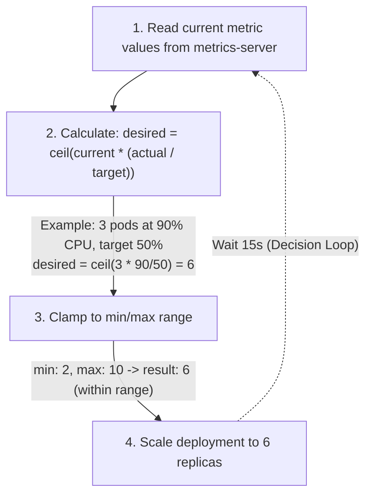

> **Complexity**: `[MEDIUM]` - CKA exam topic
>
> **Time to Complete**: 40-50 minutes
>
> **Prerequisites**: Module 2.2 (Deployments), Module 2.5 (Resource Management)

---

## What You'll Be Able to Do

After this module, you will be able to:
- **Configure** Horizontal Pod Autoscaler (HPA) with CPU and custom metrics
- **Explain** the HPA decision algorithm (target utilization, scaling velocity, cooldown)
- **Debug** HPA not scaling by checking metrics-server, current vs target utilization, and events
- **Compare** HPA, VPA, and cluster autoscaler and explain when to use each

---

## Why This Module Matters

Static replica counts waste money or cause outages. Too many replicas = wasted resources. Too few = users get errors during traffic spikes. Autoscaling dynamically adjusts capacity based on actual demand.

The CKA exam tests your ability to [create and configure HorizontalPodAutoscalers](https://training.linuxfoundation.org/certification/certified-kubernetes-administrator-cka/). You'll need to do this quickly under pressure.

> **The Thermostat Analogy**
>
> A Horizontal Pod Autoscaler is like a smart thermostat. You set the desired "temperature" (target CPU utilization), and the system automatically turns on more "heaters" (pods) when it's cold (high load) and turns them off when it's warm (low load). You don't manually adjust the heating — the thermostat does it based on the current reading.

---

## Did You Know?

- **[HPA checks metrics every 15 seconds](https://v1-35.docs.kubernetes.io/docs/tasks/run-application/horizontal-pod-autoscale/)** by default (configurable via `--horizontal-pod-autoscaler-sync-period`). Scaling decisions are based on the average metric value across all pods.

- **HPA has a cooldown period**: After scaling up, [HPA waits 5 minutes (300 seconds) before considering scale-down](https://v1-35.docs.kubernetes.io/docs/tasks/run-application/horizontal-pod-autoscale/) (configurable). This prevents "flapping" — rapidly scaling up and down.

- **metrics-server is required**: CPU- and memory-based HPA relies on the resource metrics pipeline, typically provided by metrics-server. Custom or external metric scaling also requires the corresponding adapter API. This is a common gotcha in practice environments.

- **VPA + In-Place Pod Resize (K8s 1.35)**: [The Vertical Pod Autoscaler can now leverage in-place pod resize to adjust CPU/memory without restarting pods](https://kubernetes.io/docs/concepts/workloads/autoscaling/vertical-pod-autoscale/) — a game changer for stateful workloads.

---

## Part 1: Horizontal Pod Autoscaler (HPA)

### 1.1 Prerequisites: metrics-server

HPA needs [metrics-server to read CPU/memory usage](https://v1-35.docs.kubernetes.io/docs/tasks/run-application/horizontal-pod-autoscale/):

```bash
# Check if metrics-server is installed
k top nodes
# If "error: Metrics API not available", install it:

# Install metrics-server
kubectl apply -f https://github.com/kubernetes-sigs/metrics-server/releases/latest/download/components.yaml

# For local clusters (kind/minikube), you may need to add --kubelet-insecure-tls
kubectl patch deployment metrics-server -n kube-system --type=json \
  -p '[{"op":"add","path":"/spec/template/spec/containers/0/args/-","value":"--kubelet-insecure-tls"}]'

# Wait for metrics-server to be ready
kubectl rollout status deployment metrics-server -n kube-system
sleep 15 # wait for first metric scrape

# Verify it works
k top nodes
k top pods
```

### 1.2 Creating an HPA

**Imperative (exam-fast):**

```bash
# Create a dummy deployment first
k create deployment web --image=nginx --replicas=2

# Create HPA: scale between 2-10 replicas, target 80% CPU
k autoscale deployment web --min=2 --max=10 --cpu-percent=80

# Verify
k get hpa
# NAME   REFERENCE        TARGETS         MINPODS   MAXPODS   REPLICAS   AGE
# web    Deployment/web   <unknown>/80%   2         10        2          30s
```

**Declarative:**

```yaml
apiVersion: autoscaling/v2
kind: HorizontalPodAutoscaler
metadata:
  name: web-hpa
spec:
  scaleTargetRef:
    apiVersion: apps/v1
    kind: Deployment
    name: web
  minReplicas: 2
  maxReplicas: 10
  metrics:
  - type: Resource
    resource:
      name: cpu
      target:
        type: Utilization
        averageUtilization: 80
  - type: Resource
    resource:
      name: memory
      target:
        type: Utilization
        averageUtilization: 85
  - type: Pods
    pods:
      metric:
        name: packets-per-second
      target:
        type: AverageValue
        averageValue: 1k
```

> **Pause and predict**: You create an HPA with `targetCPUUtilization: 50%` and `min: 2, max: 10`. Your 3 pods are currently at 90% CPU utilization. How many replicas will the HPA calculate as needed? (Hint: the formula is [`ceil(currentReplicas * (currentMetric / targetMetric))`](https://v1-35.docs.kubernetes.io/docs/tasks/run-application/horizontal-pod-autoscale/))

### 1.3 How HPA Decides



**Scaling Velocity:** [By default, HPA limits how quickly it scales to prevent instability (e.g., adding a maximum of 4 pods or 100% of current replicas per 15s). You can customize this velocity using the `behavior` field in the `autoscaling/v2` API.](https://v1-35.docs.kubernetes.io/docs/tasks/run-application/horizontal-pod-autoscale/)

**Custom Metrics:** [To scale on custom metrics (like `packets-per-second`), your cluster must have a custom metrics adapter (such as `prometheus-adapter`) installed and configured to serve the `custom.metrics.k8s.io` API. HPA queries this API instead of metrics-server.](https://v1-35.docs.kubernetes.io/docs/tasks/run-application/horizontal-pod-autoscale/)

### 1.4 Monitoring HPA

```bash
# Check HPA status
k get hpa web
k describe hpa web

# Watch scaling events
k get hpa -w

# Check events for scaling decisions
k get events --field-selector reason=SuccessfulRescale
```

---

## Part 2: Load Testing Your HPA

```bash
# Deploy a test app with resource requests
# Clean up previous dummy resources
k delete hpa web --ignore-not-found
k delete deployment web --ignore-not-found

k create deployment web --image=nginx --replicas=1
k set resources deployment web --requests=cpu=100m,memory=128Mi --limits=cpu=200m,memory=256Mi
# Expose it so the load generator can reach it
k expose deployment web --port=80

# Verify deployment is ready (checkpoint)
k rollout status deployment web

# Create HPA
k autoscale deployment web --min=1 --max=5 --cpu-percent=50

# Generate load (in another terminal)
k run load-generator --image=busybox --restart=Never -- \
  /bin/sh -c "while true; do wget -q -O- http://web; done"

# Watch HPA respond
k get hpa web -w
# You should see CPU% increase and replicas scale up (Press Ctrl+C to stop watching)

# Stop load
k delete pod load-generator

# Watch HPA scale back down (after cooldown)
k get hpa web -w
```

---

## Part 3: Vertical Pod Autoscaler (VPA)

[VPA automatically adjusts CPU and memory requests/limits based on observed usage. Unlike HPA (more pods), VPA adjusts the *size* of each pod.](https://kubernetes.io/docs/concepts/workloads/autoscaling/vertical-pod-autoscale/)

> **Stop and think**: Your team runs a PostgreSQL database as a StatefulSet with a single replica. During peak hours, the database needs more CPU and memory, but you can't just add more replicas (that's not how databases work). What autoscaling approach would you use here -- HPA or VPA? What mode would you start with if you're cautious?

### 3.1 When to Use HPA, VPA, and Cluster Autoscaler

| Scenario | Use |
|----------|-----|
| Stateless web apps | HPA (add more pods) |
| Databases, caches | VPA (bigger pods — can't easily add replicas) |
| Unknown resource needs | VPA in recommend mode first |
| Batch jobs | VPA (right-size the job pods) |
| Nodes out of capacity | Cluster Autoscaler (adds more nodes) |
| Combine both | HPA on custom metrics + VPA on resources |

### 3.2 VPA Modes

```yaml
apiVersion: autoscaling.k8s.io/v1
kind: VerticalPodAutoscaler
metadata:
  name: web-vpa
spec:
  targetRef:
    apiVersion: apps/v1
    kind: Deployment
    name: web
  updatePolicy:
    updateMode: "Auto"  # Options: Off, Initial, Recreate, Auto
```

| Mode | Behavior |
|------|----------|
| `Off` | VPA only recommends — doesn't change anything (safe for auditing) |
| `Initial` | Sets resources only when pods are created (not running ones) |
| `Recreate` | Evicts and recreates pods with new resources |
| `InPlaceOrRecreate` | Attempts in-place resource updates when possible, and falls back to recreate when needed |

> **K8s 1.35 + VPA**: With in-place pod resize available in Kubernetes 1.35, VPA can use `InPlaceOrRecreate` to try in-place CPU and memory updates and fall back to recreation when needed.

---

> **Pause and predict**: You set up HPA on a Deployment but `kubectl get hpa` shows `TARGETS: <unknown>/80%`. The HPA never scales. What is likely missing from your cluster, and what else might be missing from your pod spec?

## Common Mistakes

| Mistake | Problem | Solution |
|---------|---------|----------|
| No metrics-server | HPA shows `<unknown>` for targets | Install metrics-server first |
| No resource requests on pods | HPA can't calculate utilization | Always set `requests` |
| Min = Max replicas | HPA can't scale | Set different min and max |
| CPU target too low (e.g., 10%) | Scales too aggressively, wastes resources | Start at 50-80% |
| Using HPA + VPA on same metric | Conflict — both try to adjust | Use HPA for scaling, VPA for right-sizing (different metrics) |
| Forgetting cooldown | Wonder why HPA doesn't scale down immediately | Default 5m stabilization window |

---

## Quiz

1. **You deployed an HPA for your web application, but `kubectl get hpa` shows `TARGETS: <unknown>/80%` and the replica count never changes. The application is clearly under heavy load. Walk through your troubleshooting steps to get the HPA working.**
   <details>
   <summary>Answer</summary>
   The `<unknown>` target means the HPA cannot read metrics. First, check if metrics-server is installed: run `kubectl top nodes` -- if it returns an error ("Metrics API not available"), install metrics-server. Second, even with metrics-server running, the HPA needs the Deployment's pods to have `resources.requests.cpu` set. Without CPU requests, HPA cannot calculate utilization percentage (utilization = current usage / request). Fix by running `kubectl set resources deployment/web --requests=cpu=100m`. After both fixes, the HPA should begin reporting utilization once fresh metrics have been collected and the control loop has run, typically within a short interval.
   </details>

2. **Your e-commerce API has an HPA with `min: 2, max: 20, targetCPU: 50%`. During Black Friday, traffic spikes and all 20 replicas are running at 95% CPU. The HPA can't scale beyond 20, and users are getting timeouts. What are three approaches to handle this situation, both for the immediate crisis and for next year?**
   <details>
   <summary>Answer</summary>
   For the immediate crisis: (1) Increase the HPA's `maxReplicas` with `kubectl patch hpa web --patch '{"spec":{"maxReplicas":40}}'` to allow more pods. (2) If nodes are full, the cluster autoscaler needs to add more nodes to handle the scheduling demand -- verify it's enabled and has headroom in the node group's max size. For next year: (3) Pre-scale before the event by manually setting a higher `minReplicas` before traffic hits (e.g., `kubectl patch hpa web --patch '{"spec":{"minReplicas":15}}'`). This avoids the latency of reactive scaling. Also consider using HPA with custom metrics (like the `packets-per-second` metric shown earlier) when CPU utilization is not the best early signal for incoming demand.
   </details>

3. **Your team runs a single-replica Redis cache as a StatefulSet. During peak hours, it needs more CPU and memory but adding replicas isn't an option since the app uses a single Redis instance. A colleague suggests HPA. Why won't HPA work here, what should you use instead, and what mode would you start with?**
   <details>
   <summary>Answer</summary>
   HPA won't work because Redis is a single-instance stateful workload -- adding replicas doesn't create a clustered cache, it creates independent caches that the application doesn't know about. Use VPA (Vertical Pod Autoscaler) instead, which adjusts the CPU and memory requests/limits on the existing pod rather than adding replicas. Start with `updateMode: "Off"` (recommendation-only mode) to observe what VPA suggests without making changes. Once you trust the recommendations, switch to `updateMode: "InPlaceOrRecreate"` if you want VPA to attempt in-place resource updates and fall back to recreation when needed.
   </details>

4. **An engineer configured both HPA (targeting CPU at 50%) and VPA on the same Deployment. During a load test, they notice erratic behavior: the pod count oscillates between 3 and 8 replicas while resource requests keep changing. Explain why this happens and how to properly use both autoscalers together.**
   <details>
   <summary>Answer</summary>
   HPA and VPA conflict when targeting the same metric (CPU). Here's the oscillation cycle: VPA increases the CPU request on each pod (making pods "bigger"). HPA sees that per-pod CPU utilization dropped (because the request denominator increased) and scales down replicas. With fewer replicas, per-pod CPU usage rises again, HPA scales back up, and VPA sees high utilization and increases requests further. To use both together correctly, configure HPA to scale on custom metrics (like requests-per-second or queue depth) rather than CPU, and let VPA handle CPU/memory right-sizing. This way they operate on orthogonal dimensions: HPA adjusts replica count based on traffic, while VPA adjusts pod size based on resource consumption patterns. Never let both autoscalers compete over the same metric.
   </details>

---

## Hands-On Exercise

**Challenge: Auto-Scale a Web Application**

Set up a deployment, configure HPA, generate load, and verify scaling.

```bash
# 1. Create deployment with resource requests
k create deployment challenge-web --image=nginx --replicas=1
k set resources deployment challenge-web \
  --requests=cpu=50m,memory=64Mi --limits=cpu=100m,memory=128Mi

# 2. Expose it
k expose deployment challenge-web --port=80

# Verify deployment is ready (checkpoint)
k rollout status deployment challenge-web

# 3. Create HPA: 2-8 replicas, 50% CPU target
k autoscale deployment challenge-web --min=2 --max=8 --cpu-percent=50

# 4. Verify HPA is working
k get hpa challenge-web
# Should show TARGETS and current replica count

# 5. Generate load
k run load --image=busybox --restart=Never -- \
  /bin/sh -c "while true; do wget -q -O- http://challenge-web; done"

# 6. Watch scaling happen
k get hpa challenge-web -w
# Wait until you see replicas increase (Press Ctrl+C to stop watching)

# 7. Stop load and watch scale-down
k delete pod load
k get hpa challenge-web -w
# Replicas should decrease after cooldown (5 min)

# 8. Cleanup
k delete deployment challenge-web
k delete svc challenge-web
k delete hpa challenge-web
```

**Success Criteria:**
- [ ] HPA created with correct min/max/target
- [ ] Replicas scale up during load
- [ ] Replicas scale down after load stops
- [ ] No `<unknown>` in HPA targets

---

## Next Module

Return to [Part 2 Overview](/k8s/cka/part2-workloads-scheduling/).

## Sources

- [training.linuxfoundation.org: certified kubernetes administrator cka](https://training.linuxfoundation.org/certification/certified-kubernetes-administrator-cka/) — The Linux Foundation CKA page explicitly lists workload autoscaling in the exam scope.
- [Horizontal Pod Autoscaling](https://v1-35.docs.kubernetes.io/docs/tasks/run-application/horizontal-pod-autoscale/) — Primary source for HPA behavior in Kubernetes 1.35: purpose, control-loop cadence, scaling formula, min/max bounds, multiple metrics, custom/external metrics support, stabilization behavior, and autoscaling/v2 examples.
- [Vertical Pod Autoscaling](https://kubernetes.io/docs/concepts/workloads/autoscaling/vertical-pod-autoscale/) — Primary source for comparing HPA and VPA, including VPA purpose, components, dependency on metrics, and update modes such as InPlaceOrRecreate.
- [Resize CPU and Memory Resources assigned to Containers](https://v1-35.docs.kubernetes.io/docs/tasks/configure-pod-container/resize-container-resources/) — Primary source for Kubernetes 1.35 in-place container resource resize capability, useful when verifying claims that newer VPA modes can leverage in-place resize instead of always recreating Pods.
- [Kubernetes Metrics Server](https://github.com/kubernetes-sigs/metrics-server) — Primary source for metrics-server installation manifest URL, requirements, role in the built-in autoscaling pipeline, kubectl top support, 15-second collection interval, and common local-cluster TLS caveats.
- [Tools for Monitoring Resources](https://v1-35.docs.kubernetes.io/docs/tasks/debug-application-cluster/resource-usage-monitoring/) — Primary source for the resource metrics pipeline and for explaining how HPA/VPA consume metrics.k8s.io, and how custom/external metrics require a fuller metrics pipeline with adapters.
- [Prometheus Adapter for Kubernetes Metrics APIs](https://github.com/kubernetes-sigs/prometheus-adapter) — Primary source for a concrete custom.metrics.k8s.io and external.metrics.k8s.io adapter example that can back claims about custom-metric-based HPA setups.
- [Resource Management for Pods and Containers](https://v1-35.docs.kubernetes.io/docs/concepts/configuration/manage-resources-containers/) — Primary source for CPU and memory requests and limits, resource units, scheduler use of requests, allocatable-fit behavior, OOMKilled examples, and in-place Pod resize as stable in Kubernetes 1.35.
- [Node Autoscaling](https://v1-35.docs.kubernetes.io/docs/concepts/cluster-administration/node-autoscaling/) — Primary source for comparing workload autoscaling with node autoscaling and for explaining how Cluster Autoscaler-style node provisioning complements HPA-created Pods.
