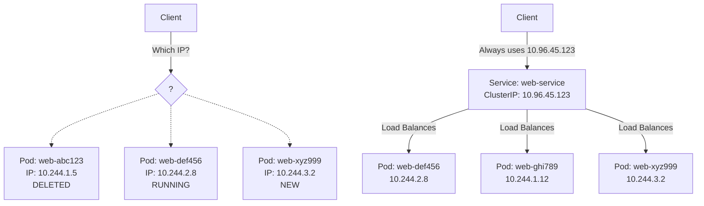
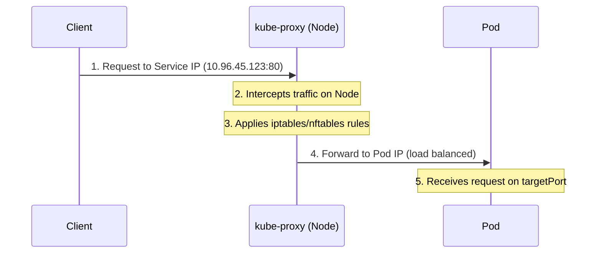
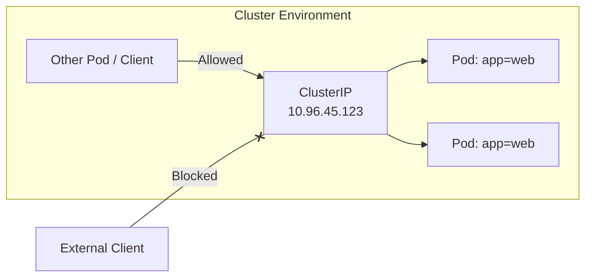
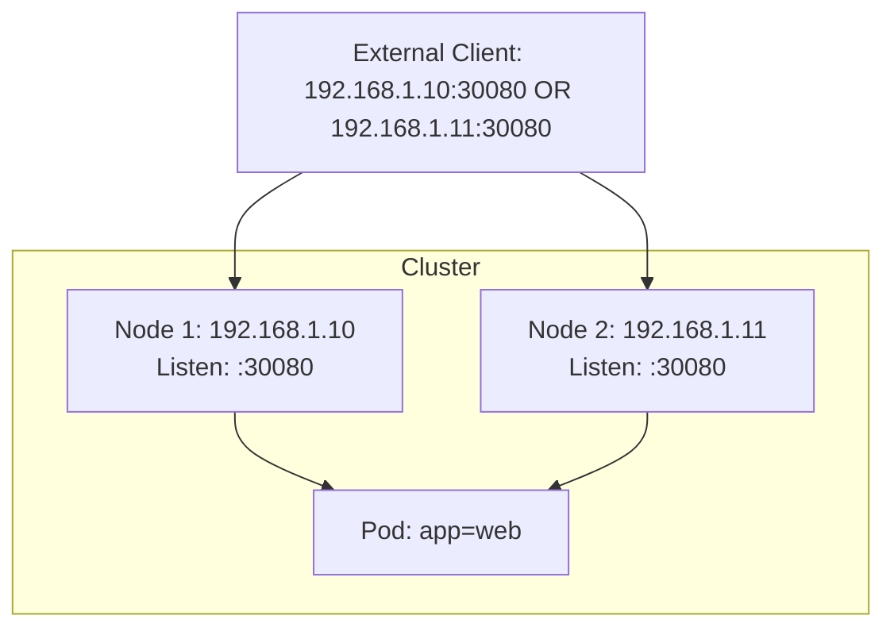
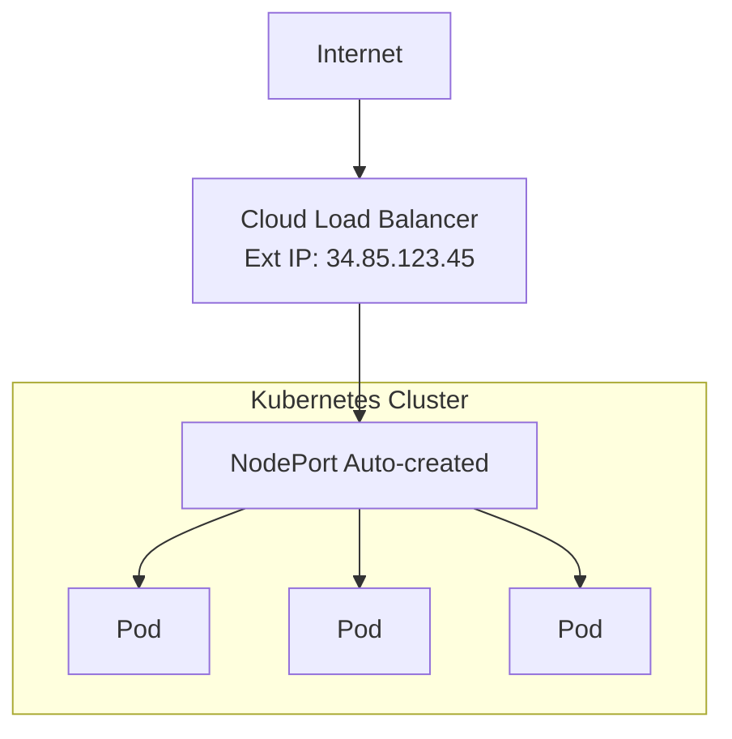
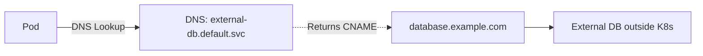
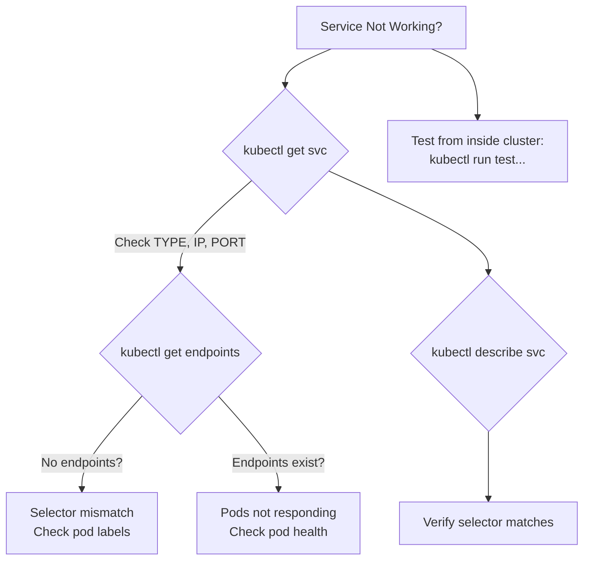

> **Complexity**: `[MEDIUM]` - Core networking concept
>
> **Time to Complete**: 45-55 minutes
>
> **Prerequisites**: Module 2.1 (Pods), Module 2.2 (Deployments)

---

## Why This Module Matters

Before service abstractions became commonplace, many production systems were vulnerable to outages when static load-balancing layers could not adapt quickly to backend failures or traffic spikes. This is the exact architectural crisis that Kubernetes Services are designed to prevent.

Pods are inherently ephemeral. They are constantly created, destroyed, and replaced, meaning their IP addresses are in a state of perpetual churn. If you attempt to hardcode Pod IPs into your application configurations, your architecture will shatter the moment a node fails or a deployment scales. Services provide an unbreakable, stable networking abstraction over these shifting Pod IPs. They give your applications a permanent, reliable endpoint to communicate with, regardless of the underlying volatility. 

For the Certified Kubernetes Administrator (CKA) exam, mastering Services is non-negotiable. You will be rigorously tested on your ability to rapidly expose deployments, correctly map target ports, debug complex connectivity failures, and differentiate the exact traffic routing mechanisms of ClusterIP, NodePort, and LoadBalancer configurations.

---

> **The Restaurant Analogy**
>
> Imagine a restaurant (your application). Pods are individual chefs—they might change shifts, get sick, or be replaced. The restaurant's phone number (Service) stays the same regardless of which chefs are working. Customers (clients) call the same number, and the call gets routed to an available chef. That's exactly what Services do in Kubernetes.

---

## What You'll Be Able to Do

After completing this extensive module, you will be able to:
- **Design** highly available architectures by selecting the appropriate Kubernetes Service type (ClusterIP, NodePort, LoadBalancer) based on strict internal and external access requirements.
- **Implement** declarative multi-port Service definitions, correctly mapping internal container target ports to exposed service network ports.
- **Diagnose** complex traffic routing failures by meticulously inspecting Endpoints, EndpointSlices, and selector label configurations to resolve network partitions.
- **Evaluate** advanced traffic distribution policies, directly contrasting `PreferSameNode` and `PreferSameZone` behaviors introduced in Kubernetes v1.35.
- **Debug** kube-proxy implementations natively, differentiating between iptables, IPVS, and nftables proxy modes when resolving cluster-wide networking anomalies.

---

## Did You Know?

1. **Stable endpoints are a foundational Service design goal**: Kubernetes Services exist to give clients a durable network identity even though backend Pods are ephemeral.
2. **Port Allocation Ranges**: The default NodePort allocation range is safely partitioned into two distinct segments: a static band (`30000-30085`) reserved for manually requested ports, and a dynamic band (`30086-32767`) used for automatic assignments, structurally preventing port collision issues.
3. **The Shift to Nftables**: The legacy `ipvs` kube-proxy mode was officially deprecated in Kubernetes v1.35, firmly establishing `nftables` as the modern, high-performance Linux kernel replacement for cluster traffic routing.
4. **Mathematical IP Banding**: The Kubernetes Service ClusterIP allocator does not randomly assign IPs; it automatically divides the virtual IP range into structured bands using the exact mathematical formula `min(max(16, cidrSize/16), 256)` to ensure highly efficient address management.
5. **The Endpoints Bottleneck**: The legacy `Endpoints` API is deprecated as of Kubernetes v1.33, while `EndpointSlices` became stable in v1.21 and are the scalable API Kubernetes uses for modern Service features.
6. **Virtual IPs are magic**: ClusterIP addresses don't exist on any network interface. They're "virtual" IPs that kube-proxy intercepts and routes at the kernel level.

---

## Part 1: Service Fundamentals

### 1.1 Why Services?

Before diving into the code, let's conceptualize the fundamental problem Kubernetes Services solve. When a client needs to reach a web application running in a cluster, it faces an immediate identity crisis. Pods are mortal. If a node crashes, the Pod is terminated, and a replacement Pod is spun up on a different node with a completely new IP address. 



<details>
<summary>View Legacy ASCII Diagram</summary>

```text
┌────────────────────────────────────────────────────────────────┐
│                     The Problem                                │
│                                                                │
│   Client wants to reach "web app"                              │
│                                                                │
│   ┌─────────────────────────────────────────────────────┐      │
│   │  Pod: web-abc123   IP: 10.244.1.5   ← Created       │      │
│   │  Pod: web-def456   IP: 10.244.2.8   ← Running       │      │
│   │  Pod: web-ghi789   IP: 10.244.1.12  ← Created       │      │
│   │  Pod: web-abc123   IP: 10.244.1.5   ← Deleted!      │      │
│   │  Pod: web-xyz999   IP: 10.244.3.2   ← New pod       │      │
│   └─────────────────────────────────────────────────────┘      │
│                                                                │
│   Which IP should the client use? They keep changing!          │
│                                                                │
└────────────────────────────────────────────────────────────────┘

┌────────────────────────────────────────────────────────────────┐
│                     The Solution: Services                     │
│                                                                │
│   ┌───────────────────────────────────────────────────────┐    │
│   │            Service: web-service                       │    │
│   │            ClusterIP: 10.96.45.123                    │    │
│   │            (Never changes!)                           │    │
│   │                                                       │    │
│   │     Selector: app=web                                 │    │
│   │         │                                             │    │
│   │         ├──► Pod: web-def456 (10.244.2.8)             │    │
│   │         ├──► Pod: web-ghi789 (10.244.1.12)            │    │
│   │         └──► Pod: web-xyz999 (10.244.3.2)             │    │
│   └───────────────────────────────────────────────────────┘    │
│                                                                │
│   Client always uses 10.96.45.123 - Kubernetes handles rest    │
│                                                                │
└────────────────────────────────────────────────────────────────┘
```

</details>

The solution is the Service resource. A Service acts as a static, immovable anchor in your cluster's network. It is assigned a stable `ClusterIP` that will usually remain the same for the lifecycle of the Service. The client simply directs its request to this static IP, and Kubernetes dynamically handles the complexity of discovering which Pods are currently alive and routing the traffic to them.

### 1.2 Service Components

To effectively design network routes, you must understand the atomic components of a Service definition.

| Component | Description |
|-----------|-------------|
| **ClusterIP** | Stable internal IP address for the service |
| **Selector** | Labels that identify which pods to route to |
| **Port** | The port the service listens on |
| **TargetPort** | The port on the pods to forward traffic to |
| **Endpoints** | Actual pod IPs backing the service |

**Critical Fact**: For a Service port, if `targetPort` is omitted from the specification, Kubernetes intelligently defaults it to the exact same value as `port`. While convenient, explicitly defining both is considered a robust engineering best practice.

### 1.3 How Services Work

Behind the scenes, the magic of Services is commonly orchestrated by an agent called `kube-proxy`, a network proxy that runs on each node unless the cluster uses an alternative implementation. 



<details>
<summary>View Legacy ASCII Diagram</summary>

```text
┌────────────────────────────────────────────────────────────────┐
│                   Service Request Flow                         │
│                                                                │
│   1. Client sends request to Service IP (10.96.45.123:80)      │
│                         │                                      │
│                         ▼                                      │
│   2. kube-proxy (on each node) intercepts                      │
│                         │                                      │
│                         ▼                                      │
│   3. kube-proxy uses iptables/nftables rules                   │
│                         │                                      │
│                         ▼                                      │
│   4. Request forwarded to one of the pod IPs                   │
│      (load balanced - round robin by default)                  │
│                         │                                      │
│                         ▼                                      │
│   5. Pod receives request on targetPort                        │
│                                                                │
└────────────────────────────────────────────────────────────────┘
```

</details>

Kube-proxy supports multiple network routing modes. Historically, it relied on `iptables`, `ipvs`, and `nftables` on Linux, and `kernelspace` on Windows. As of Kubernetes v1.35, `ipvs` is strictly deprecated. If a proxy mode is left completely unspecified in the cluster configuration, Kubernetes natively defaults to `iptables` on Linux architectures and `kernelspace` on Windows architectures. 

> **Pause and predict**: You have a frontend deployment and a backend deployment. The frontend needs to call the backend, and external users need to reach the frontend. What service type would you choose for each, and why?

---

## Part 2: Service Types

Understanding exactly how to expose your applications requires mastery of the four canonical Service types.

| Type | Scope | Use Case | Exam Frequency |
|------|-------|----------|----------------|
| **ClusterIP** | Internal only | Pod-to-pod communication | [High] |
| **NodePort** | External via node IP | Development, testing | [Medium-High] |
| **LoadBalancer** | External via cloud LB | Production in cloud | [Medium] |
| **ExternalName** | DNS alias | External services | [Low] |

### 2.1 ClusterIP (The Default)

If the `spec.type` field is intentionally omitted from your YAML definition, a Kubernetes Service safely defaults to type `ClusterIP`. This highly secure default restricts the service exposure entirely to inside the cluster. External agents cannot route to a ClusterIP.

```yaml
# Internal-only access - most common type
apiVersion: v1
kind: Service
metadata:
  name: web-service
spec:
  type: ClusterIP           # Default, can be omitted
  selector:
    app: web                # Match pods with label app=web
  ports:
  - port: 80                # Service listens on port 80
    targetPort: 8080        # Forward to pod port 8080
```



<details>
<summary>View Legacy ASCII Diagram</summary>

```text
┌────────────────────────────────────────────────────────────────┐
│                     ClusterIP Service                          │
│                                                                │
│   Only accessible from within the cluster                      │
│                                                                │
│   ┌────────────────┐        ┌────────────────┐                 │
│   │  Other Pod     │───────►│  ClusterIP     │                 │
│   │  (client)      │        │  10.96.45.123  │                 │
│   └────────────────┘        │                │                 │
│                             │  ┌──────────┐  │                 │
│                             │  │ Pod      │  │                 │
│                             │  │ app=web  │  │                 │
│   ┌────────────────┐        │  └──────────┘  │                 │
│   │  External      │───X───►│                │                 │
│   │  (blocked)     │        │  ┌──────────┐  │                 │
│   └────────────────┘        │  │ Pod      │  │                 │
│                             │  │ app=web  │  │                 │
│                             │  └──────────┘  │                 │
│                             └────────────────┘                 │
│                                                                │
└────────────────────────────────────────────────────────────────┘
```

</details>

**Headless Services**: An advanced pattern involves setting `.spec.clusterIP: None`. This explicitly creates a "headless" Service. In a headless configuration, absolutely no virtual IP is allocated, and kube-proxy performs zero load balancing. Instead, the cluster's internal DNS directly returns the raw A/AAAA records of the individual backend Pods, passing the load balancing responsibility directly to the client application.

### 2.2 NodePort

For external access without a dedicated cloud load balancer, `NodePort` is heavily utilized. When you declare `type: NodePort`, Kubernetes allocates a specific port from the predefined `--service-node-port-range` (default `30000-32767`). The critical behavioral mechanic here is that, in the common case, every node in the cluster listens on that exact same NodePort and proxies traffic to the Service.

```yaml
# Exposes service on each node's IP at a static port
apiVersion: v1
kind: Service
metadata:
  name: web-nodeport
spec:
  type: NodePort
  selector:
    app: web
  ports:
  - port: 80              # ClusterIP port (internal)
    targetPort: 8080      # Pod port
    nodePort: 30080       # External port (30000-32767)
```



<details>
<summary>View Legacy ASCII Diagram</summary>

```text
┌────────────────────────────────────────────────────────────────┐
│                     NodePort Service                           │
│                                                                │
│   External access via <NodeIP>:<NodePort>                      │
│                                                                │
│   ┌─────────────────────────────────────────────────────────┐  │
│   │                    Cluster                              │  │
│   │                                                         │  │
│   │  Node 1 (192.168.1.10)     Node 2 (192.168.1.11)        │  │
│   │  ┌──────────────────┐      ┌──────────────────┐         │  │
│   │  │ :30080 ──────────┼──────┼─► Pod (app=web)  │         │  │
│   │  └──────────────────┘      └──────────────────┘         │  │
│   │                                                         │  │
│   └─────────────────────────────────────────────────────────┘  │
│                 ▲                          ▲                   │
│                 │                          │                   │
│   External: 192.168.1.10:30080  OR  192.168.1.11:30080         │
│             (Both work!)                                       │
│                                                                │
└────────────────────────────────────────────────────────────────┘
```

</details>

### 2.3 LoadBalancer

The `LoadBalancer` type natively integrates with underlying cloud providers (AWS, GCP, Azure) to provision an external, robust load balancer that automatically routes internet traffic into your cluster's NodePorts.

```yaml
# Creates external load balancer (cloud provider)
apiVersion: v1
kind: Service
metadata:
  name: web-lb
spec:
  type: LoadBalancer
  selector:
    app: web
  ports:
  - port: 80
    targetPort: 8080
```



<details>
<summary>View Legacy ASCII Diagram</summary>

```text
┌────────────────────────────────────────────────────────────────┐
│                   LoadBalancer Service                         │
│                                                                │
│   Cloud provider creates an external load balancer             │
│                                                                │
│   ┌──────────────────┐                                         │
│   │   Internet       │                                         │
│   └────────┬─────────┘                                         │
│            │                                                   │
│            ▼                                                   │
│   ┌──────────────────┐     External IP: 34.85.123.45           │
│   │   Cloud LB       │                                         │
│   │   (AWS/GCP/Azure)│                                         │
│   └────────┬─────────┘                                         │
│            │                                                   │
│            ▼                                                   │
│   ┌──────────────────────────────────────────────────┐         │
│   │             NodePort (auto-created)              │         │
│   │                      │                           │         │
│   │        ┌─────────────┼─────────────┐             │         │
│   │        ▼             ▼             ▼             │         │
│   │    ┌──────┐     ┌──────┐     ┌──────┐            │         │
│   │    │ Pod  │     │ Pod  │     │ Pod  │            │         │
│   │    └──────┘     └──────┘     └──────┘            │         │
│   └──────────────────────────────────────────────────┘         │
│                                                                │
└────────────────────────────────────────────────────────────────┘
```

</details>

**Advanced LoadBalancer Settings**: The `loadBalancerClass` field is entirely optional; when left unset, the cluster confidently falls back to its default load-balancer implementation. Furthermore, the `allocateLoadBalancerNodePorts` directive defaults to `true`. Disabling it disables the automatic underlying NodePort allocation semantics for that specific service, saving port space if your cloud provider supports direct Pod routing.

For multi-port definitions, `LoadBalancer` services stringently require the exact same protocol across all defined ports by default. To safely circumvent this limitation, the cluster must leverage the `MixedProtocolLBService` feature, which matured to stable General Availability (GA) in Kubernetes v1.26.

### 2.4 ExternalName

The `ExternalName` service type acts purely as a DNS alias. It operates using standard CNAME semantics and performs absolutely no proxying or virtual IP allocation.

```yaml
# DNS alias to external service (no proxying)
apiVersion: v1
kind: Service
metadata:
  name: external-db
spec:
  type: ExternalName
  externalName: database.example.com   # Returns CNAME record
  # No selector - points to external DNS name
```



<details>
<summary>View Legacy ASCII Diagram</summary>

```text
┌────────────────────────────────────────────────────────────────┐
│                   ExternalName Service                         │
│                                                                │
│   DNS alias - no ClusterIP, no proxying                        │
│                                                                │
│   ┌────────────────┐                                           │
│   │  Pod           │                                           │
│   │                │──► DNS: external-db.default.svc           │
│   │                │          │                                │
│   └────────────────┘          │ Returns CNAME                  │
│                               ▼                                │
│                     database.example.com                       │
│                               │                                │
│                               ▼                                │
│                     ┌──────────────────┐                       │
│                     │  External DB     │                       │
│                     │  (outside K8s)   │                       │
│                     └──────────────────┘                       │
│                                                                │
└────────────────────────────────────────────────────────────────┘
```

</details>

**Warning**: If you provide an `externalName` value that structurally looks like a raw IPv4 address (e.g., `192.168.1.50`), the DNS system will still maliciously interpret it as a literal string DNS name. It will almost certainly fail to resolve as an external internet host. Never use raw IPs in `ExternalName`.

---

## Part 3: Creating and Managing Services

### 3.1 Imperative Commands (Fast for Exam)

Imperative commands are your sharpest weapon in a time-constrained environment like the CKA exam.

```bash
# Expose a deployment (most common exam task)
k expose deployment nginx --port=80 --target-port=8080 --name=nginx-svc

# Expose with NodePort
k expose deployment nginx --port=80 --type=NodePort --name=nginx-np

# Expose a pod
k expose pod nginx --port=80 --name=nginx-pod-svc

# Generate YAML without creating
k expose deployment nginx --port=80 --dry-run=client -o yaml > svc.yaml

# Create service for existing pods by selector
k create service clusterip my-svc --tcp=80:8080
```

### 3.2 Expose Command Options

```bash
# Full syntax
k expose deployment <name> \
  --port=<service-port> \
  --target-port=<pod-port> \
  --type=<ClusterIP|NodePort|LoadBalancer> \
  --name=<service-name> \
  --protocol=<TCP|UDP>

# Examples
k expose deployment web --port=80 --target-port=8080
k expose deployment web --port=80 --type=NodePort
k expose deployment web --port=80 --type=LoadBalancer
```

### 3.3 Declarative YAML & Multi-Port Routing

```yaml
# Complete service example
apiVersion: v1
kind: Service
metadata:
  name: web-service
  labels:
    app: web
spec:
  type: ClusterIP
  selector:
    app: web              # MUST match pod labels
    tier: frontend
  ports:
  - name: http            # Named port (good practice)
    port: 80              # Service port
    targetPort: 8080      # Pod port (can be name or number)
    protocol: TCP         # TCP (default) or UDP
```

```yaml
# Service with multiple ports
apiVersion: v1
kind: Service
metadata:
  name: multi-port-svc
spec:
  selector:
    app: web
  ports:
  - name: http            # Required when multiple ports
    port: 80
    targetPort: 8080
  - name: https
    port: 443
    targetPort: 8443
  - name: metrics
    port: 9090
    targetPort: 9090
```

---

## Part 4: Service Discovery and Advanced Traffic Control

### 4.1 DNS-Based Discovery

The cluster's integrated DNS architecture rigorously standardizes domain names. Service and Pod DNS records strictly adhere to the nomenclature `<service>.<namespace>.svc.<cluster-domain>`. Furthermore, default Pod `resolv.conf` search lists intentionally include the pod's namespace alongside the global cluster domain to enable rapid short-name resolution.

```bash
# From a pod in the same namespace
curl web-service

# From a pod in different namespace
curl web-service.production

# Fully qualified (always works)
curl web-service.production.svc.cluster.local
```

### 4.2 Environment Variables

```bash
# Environment variables for service "web-service"
WEB_SERVICE_SERVICE_HOST=10.96.45.123
WEB_SERVICE_SERVICE_PORT=80

# Note: Only works for services created BEFORE the pod
```

### 4.3 Advanced Traffic Polices

For finely tuned production deployments, you must comprehend Kubernetes traffic policies:
- **externalTrafficPolicy**: Defaults seamlessly to `Cluster`. When overridden to `Local`, it forces the preservation of the client's original source IP address while restricting routing exclusively to node-local endpoints. If zero local endpoints exist on the receiving node, the traffic is aggressively dropped.
- **internalTrafficPolicy**: Defaults entirely to `Cluster`. When specifically set to `Local`, internal cluster routing obeys node-locality strictly, deliberately dropping intra-cluster traffic if no node-local backends are available to service the request.

```yaml
# Sticky sessions - route same client to same pod
apiVersion: v1
kind: Service
metadata:
  name: sticky-service
spec:
  selector:
    app: web
  sessionAffinity: ClientIP      # None (default) or ClientIP
  sessionAffinityConfig:
    clientIP:
      timeoutSeconds: 10800      # 3 hours (default)
  ports:
  - port: 80
```

The `sessionAffinity` parameter exclusively supports `ClientIP` and `None` (which operates as the default). When `ClientIP` is invoked, developers can finely tune the stickiness duration. The maximum allowable timeout ceiling is rigidly capped at `86400` seconds (24 hours), defaulting natively to `10800` (3 hours).

| Scenario | Use Affinity? |
|----------|---------------|
| Stateless API | No (default) |
| Shopping cart in pod memory | Yes (but better: use Redis) |
| WebSocket connections | Yes |
| Authentication sessions in memory | Yes (but better: external store) |

> **What would happen if**: You create a Service with `sessionAffinity: ClientIP` and then scale your deployment from 3 replicas to 1 replica. What happens to clients that were pinned to the deleted pods?

### 4.4 Traffic Distribution (Kubernetes 1.35+)

Kubernetes v1.35 drastically improved latency management through the `trafficDistribution` directive:

```yaml
apiVersion: v1
kind: Service
metadata:
  name: latency-sensitive
spec:
  selector:
    app: cache
  ports:
  - port: 6379
  trafficDistribution: PreferSameNode  # Route to local node first
```

| Value | Behavior |
|-------|----------|
| `PreferSameNode` | Strictly prefer endpoints on the same node, fall back to remote (GA in 1.35) |
| `PreferSameZone` | Prefer endpoints topologically close — same zone when using topology-aware routing |

*Architectural Note*: The canonical set of `trafficDistribution` string values is currently internally inconsistent across official documentation and raw API references. While API references occasionally showcase `PreferClose` as a legacy alias, definitive concept documentation and the official v1.35 release notes designate `PreferSameZone` and `PreferSameNode` as the correct, modernized nomenclature. 

---

## Part 5: Endpoints and Selectors

### 5.1 How Selectors Work

```yaml
# Service selector MUST match pod labels exactly
# Service:
spec:
  selector:
    app: web
    tier: frontend

# Pod (will be selected):
metadata:
  labels:
    app: web
    tier: frontend
    version: v2          # Extra labels OK

# Pod (will NOT be selected - missing tier):
metadata:
  labels:
    app: web
    version: v2
```

### 5.2 Finding Services and Endpoints

```bash
# List services
k get services
k get svc                    # Short form

# Get service details
k describe svc web-service

# Get service endpoints
k get endpoints web-service

# Get service YAML
k get svc web-service -o yaml

# Find service ClusterIP
k get svc web-service -o jsonpath='{.spec.clusterIP}'
```

```bash
# View endpoints (pod IPs backing the service)
k get endpoints web-service
# NAME          ENDPOINTS                         AGE
# web-service   10.244.1.5:8080,10.244.2.8:8080   5m

# Detailed endpoint info
k describe endpoints web-service
```

### 5.2.1 EndpointSlices

While `Endpoints` are useful, modern clusters use `EndpointSlices` to overcome scaling bottlenecks. You should inspect these during advanced troubleshooting:

```bash
# View EndpointSlices (modern scalable API)
k get endpointslices -l kubernetes.io/service-name=web-service
# NAME                ADDRESSTYPE   PORTS   ENDPOINTS                     AGE
# web-service-x8z9w   IPv4          8080    10.244.1.5,10.244.2.8         5m

# Detailed EndpointSlice info
k describe endpointslices -l kubernetes.io/service-name=web-service
```

### 5.3 Services Without Selectors

If you define a Service completely devoid of a selector block, Kubernetes intentionally halts automatic endpoint discovery. This permits developers to manually construct `Endpoints` or `EndpointSlices` to seamlessly route traffic toward external, legacy architectural targets.

```text
# Service without selector
apiVersion: v1
kind: Service
metadata:
  name: external-service
spec:
  ports:
  - port: 80
    targetPort: 80
---
# Manual endpoints
apiVersion: v1
kind: Endpoints
metadata:
  name: external-service    # Must match service name
subsets:
- addresses:
  - ip: 192.168.1.100      # External IP
  - ip: 192.168.1.101
  ports:
  - port: 80
```

**Crucial Exception**: While Services operating without selectors remain totally valid for routing to external databases, the Kubernetes API server deliberately and proactively refuses to execute `kubectl port-forward` commands against them, as there is no programmatic link establishing which pods are targeted.

Furthermore, entries defined within a Service's `.spec.externalIPs` array are entirely user-managed. Kubernetes does not allocate, provision, or orchestrate external IPs on your behalf—it merely updates its routing fabric to accept traffic destined for those manually specified addresses.

---

> **Stop and think**: A developer tells you "my service isn't working." Before you touch the keyboard, what three things would you check first, and in what order? Think about the chain from Service to Endpoints to Pods.

## Part 6: Systematic Debugging

### 6.1 Debugging Workflow



<details>
<summary>View Legacy ASCII Diagram</summary>

```text
Service Not Working?
    │
    ├── kubectl get svc (check service exists)
    │       │
    │       └── Check TYPE, CLUSTER-IP, EXTERNAL-IP, PORT
    │
    ├── kubectl get endpoints <svc> (check endpoints)
    │       │
    │       ├── No endpoints? → Selector doesn't match pods
    │       │                   Check pod labels
    │       │
    │       └── Endpoints exist? → Pods aren't responding
    │                              Check pod health
    │
    ├── kubectl describe svc <svc> (check selector)
    │       │
    │       └── Verify selector matches pod labels
    │
    └── Test from inside cluster:
        kubectl run test --rm -it --image=busybox -- wget -qO- <svc>
```

</details>

| Symptom | Cause | Solution |
|---------|-------|----------|
| No endpoints | Selector doesn't match pods | Fix selector or pod labels |
| Connection refused | Pod not listening on targetPort | Check pod port configuration |
| Timeout | Pod not running or crashlooping | Debug pod issues first |
| NodePort not accessible | Firewall blocking port | Check node firewall rules |
| Wrong service type | Using ClusterIP for external access | Change to NodePort/LoadBalancer |

### 6.2 Debugging Commands

```bash
# Check service and endpoints
k get svc,endpoints

# Inspect modern EndpointSlices to diagnose backend routing
k get endpointslices -l kubernetes.io/service-name=web-service

# Verify selector matches pods
k get pods --selector=app=web

# Test connectivity from within cluster
k run test --rm -it --image=busybox:1.36 --restart=Never -- \
  wget -qO- http://web-service

# Test with curl
k run test --rm -it --image=curlimages/curl --restart=Never -- \
  curl -s http://web-service

# Check DNS resolution
k run test --rm -it --image=busybox:1.36 --restart=Never -- \
  nslookup web-service

# Check port on pod directly
k exec <pod> -- netstat -tlnp
```

### 6.3 Advanced Debugging: Tracing kube-proxy Rules

While not strictly required for everyday administration, comprehending exactly how `kube-proxy` orchestrates traffic is a massive advantage for complex debugging scenarios.

```bash
# 1. Get the Service ClusterIP
kubectl get svc web-service
# Example IP: 10.96.45.123

# 2. SSH into a Kubernetes Node
ssh user@node-01

# 3. Search iptables rules for the Service IP
sudo iptables-save | grep 10.96.45.123
# You will see a rule redirecting traffic to a KUBE-SVC-* chain:
# -A KUBE-SERVICES -d 10.96.45.123/32 -p tcp -m tcp --dport 80 -j KUBE-SVC-XXXXXXXXXXXXXXXX

# 4. Inspect the KUBE-SVC chain to find the load balancing logic
sudo iptables-save | grep KUBE-SVC-XXXXXXXXXXXXXXXX
# You will see rules distributing traffic to KUBE-SEP-* chains (one for each Pod endpoint) using probabilities.

# 5. Inspect a KUBE-SEP (Service Endpoint) chain to find the actual Pod IP
sudo iptables-save | grep KUBE-SEP-YYYYYYYYYYYYYYYY
# You will see the DNAT rule translating the destination to the Pod IP:
# -A KUBE-SEP-YYYYYYYYYYYYYYYY -p tcp -m tcp -j DNAT --to-destination 10.244.1.5:8080
```

For modern clusters executing Kubernetes v1.35 or higher and running the high-performance `nftables` mode, you would instead execute `nft list ruleset | grep 10.96.45.123` to trace corresponding Network Address Translation (NAT) table structures. 

---

If you are debugging a legacy cluster using the deprecated `ipvs` mode, you would use `ipvsadm -ln -t 10.96.45.123:80` to view the IPVS virtual server routing table.

> **War Story: The Selector Mismatch**
>
> A developer spent hours debugging why their service had no endpoints. The deployment used `app: web-app` but the service selector was `app: webapp` (no hyphen). One character difference = zero connectivity. Always copy-paste selectors!

---

## Common Mistakes

| Mistake | Problem | Solution |
|---------|---------|----------|
| Selector mismatch | Service has no endpoints | Ensure selector matches pod labels exactly |
| Port vs TargetPort confusion | Connection refused | Port = service, TargetPort = pod |
| Missing service type | Can't access externally | Specify NodePort or LoadBalancer |
| Using ClusterIP externally | Connection timeout | ClusterIP is internal only |
| Forgetting namespace | Service not found | Use FQDN for cross-namespace |

---

## Knowledge Check

<details>
<summary>1. A developer has a Service with `port: 80` and `targetPort: 8080`, but their app container listens on port 80. Users report "connection refused" when hitting the Service. What went wrong and how would you fix it?</summary>
The `targetPort` (8080) does not match the port the container is actually listening on (80). When kube-proxy forwards traffic to the pod, it sends it to port 8080, but nothing is listening there. The fix is to either change `targetPort` to 80 in the Service spec, or change the container to listen on 8080. The key distinction: `port` is what clients use to reach the Service, `targetPort` is where the pod actually receives the traffic.
</details>

<details>
<summary>2. You deploy a new microservice and create a Service for it, but `kubectl get endpoints` shows `<none>`. The pods are running and show `1/1 READY`. Walk through your debugging process.</summary>
Since pods are running and ready, the most likely cause is a selector mismatch. First, check the Service selector with `k get svc <name> -o yaml | grep -A5 selector`. Then compare with pod labels using `k get pods --show-labels`. Even a single character difference (e.g., `app: web-app` vs `app: webapp`) will cause zero endpoints. Also check that the Service and pods are in the same namespace -- Services only select pods within their own namespace.
</details>

<details>
<summary>3. A developer created a ClusterIP Service for their frontend app but external users can't reach it. They ask you to fix it. What's wrong, what are the options, and what trade-offs should you consider?</summary>
ClusterIP is internal-only and cannot be reached from outside the cluster. The options are: (1) Change to NodePort -- free, but uses high ports (30000-32767) and exposes on every node; (2) Change to LoadBalancer -- clean external IP, but costs money per LB in cloud environments; (3) Put an Ingress or Gateway in front -- single entry point for many services with path/host routing, but requires an Ingress controller. For production, Ingress/Gateway is usually the right choice because it consolidates external access through one load balancer.
</details>

<details>
<summary>4. During a CKA exam, you need to expose a deployment called `payment-api` as a NodePort service on port 80, targeting container port 3000, with a specific NodePort of 30100. Write the command and explain what happens if you omit the `--target-port` flag.</summary>
The imperative approach requires YAML since `kubectl expose` cannot set a specific nodePort. Use: `k expose deployment payment-api --port=80 --target-port=3000 --type=NodePort --dry-run=client -o yaml > svc.yaml`, then edit the YAML to add `nodePort: 30100` and apply it. If you omit `--target-port`, it defaults to the same value as `--port` (80), so traffic would be forwarded to port 80 on the pod instead of 3000, resulting in connection refused if the app listens on 3000.
</details>

<details>
<summary>5. Your team runs services in namespaces `frontend`, `backend`, and `database`. A pod in `frontend` needs to call service `api` in `backend`. It works with `curl api.backend` but fails with just `curl api`. Explain why and when you'd use the full FQDN instead.</summary>
The short name `api` only works within the same namespace because the search domain in `/etc/resolv.conf` appends the pod's own namespace first (`api.frontend.svc.cluster.local`), which does not exist. Using `api.backend` works because the search domain appends `.svc.cluster.local` to make `api.backend.svc.cluster.local`. You would use the full FQDN (`api.backend.svc.cluster.local`) in application configuration files for clarity and to avoid ambiguity, especially in production where misconfigured search domains could silently route to the wrong service.
</details>

<details>
<summary>6. Your team dynamically provisions dozens of NodePort services daily without specifying a port, while the platform team manually assigns static NodePorts in the 30050-30060 range for legacy ingress. Why won't the dynamic allocations ever conflict with the platform team's manual assignments?</summary>
Kubernetes intrinsically partitions its default `--service-node-port-range` architecture. It strictly utilizes a static allocation band (`30000-30085`) specifically to house user-defined, manually hardcoded ports. Simultaneously, it leverages an autonomous dynamic allocation band (`30086-32767`) to assign ports transparently when the user leaves the request ambiguous, fully insulating automated assignments from explicit manual overrides.
</details>

---

## Hands-On Exercise

**Task**: Create and debug services for a multi-tier application.

**Steps**:

1. **Create a backend deployment**:
```bash
k create deployment backend --image=nginx --replicas=2
k set env deployment/backend APP=backend
```

2. **Label the pods properly**:
```bash
k label deployment backend tier=backend
```

3. **Expose backend as ClusterIP**:
```bash
k expose deployment backend --port=80 --name=backend-svc
```

4. **Verify the service**:
```bash
k get svc backend-svc
k get endpoints backend-svc
```

5. **Create a frontend deployment**:
```bash
k create deployment frontend --image=nginx --replicas=2
```

6. **Expose frontend as NodePort**:
```bash
k expose deployment frontend --port=80 --type=NodePort --name=frontend-svc
```

7. **Test internal connectivity**:
```bash
# From a test pod, reach the backend service
k run test --rm -it --image=busybox:1.36 --restart=Never -- \
  wget -qO- http://backend-svc
```

8. **Test cross-namespace**:
```bash
# Create another namespace and test
k create namespace other
k run test -n other --rm -it --image=busybox:1.36 --restart=Never -- \
  wget -qO- http://backend-svc.default
```

9. **Debug a broken service**:
```bash
# Create a service with wrong selector
k create service clusterip broken-svc --tcp=80:80
# Check endpoints (should be empty)
k get endpoints broken-svc
# Fix by creating proper service
k delete svc broken-svc
k expose deployment backend --port=80 --name=broken-svc --selector=app=backend
k get endpoints broken-svc
```

10. **Cleanup**:
```bash
k delete deployment frontend backend
k delete svc backend-svc frontend-svc broken-svc
k delete namespace other
```

**Success Criteria**:
- [ ] Can successfully create dynamic ClusterIP and strictly mapped NodePort services.
- [ ] Understands exactly how to align port specifications versus targetPort routing paths.
- [ ] Can confidently debug broken services registering zero Endpoints via label manipulation.
- [ ] Can successfully query isolated namespaces employing fully qualified FQDNs.

---

## Practice Drills

### Drill 1: Service Creation Speed (Target: 2 minutes)

```bash
# Setup
k create deployment drill-app --image=nginx --replicas=2

# Create ClusterIP service
k expose deployment drill-app --port=80 --name=drill-clusterip

# Create NodePort service
k expose deployment drill-app --port=80 --type=NodePort --name=drill-nodeport

# Verify both
k get svc drill-clusterip drill-nodeport

# Generate YAML
k expose deployment drill-app --port=80 --dry-run=client -o yaml > svc.yaml

# Cleanup
k delete deployment drill-app
k delete svc drill-clusterip drill-nodeport
rm svc.yaml
```

### Drill 2: Multi-Port Service (Target: 3 minutes)

```bash
# Create deployment
k create deployment multi-port --image=nginx

# Create multi-port service from YAML
cat << 'EOF' | k apply -f -
apiVersion: v1
kind: Service
metadata:
  name: multi-port-svc
spec:
  selector:
    app: multi-port
  ports:
  - name: http
    port: 80
    targetPort: 80
  - name: https
    port: 443
    targetPort: 443
EOF

# Verify
k describe svc multi-port-svc

# Cleanup
k delete deployment multi-port
k delete svc multi-port-svc
```

### Drill 3: Service Discovery (Target: 3 minutes)

```bash
# Create service
k create deployment web --image=nginx
k expose deployment web --port=80

# Test DNS resolution
k run dns-test --rm -it --image=busybox:1.36 --restart=Never -- \
  nslookup web

# Test full FQDN
k run dns-test --rm -it --image=busybox:1.36 --restart=Never -- \
  nslookup web.default.svc.cluster.local

# Test connectivity
k run curl-test --rm -it --image=curlimages/curl --restart=Never -- \
  curl -s http://web

# Cleanup
k delete deployment web
k delete svc web
```

### Drill 4: Endpoint Debugging (Target: 4 minutes)

```bash
# Create deployment with specific labels
k create deployment endpoint-test --image=nginx
k label deployment endpoint-test tier=web --overwrite

# Create service with WRONG selector (intentionally broken)
cat << 'EOF' | k apply -f -
apiVersion: v1
kind: Service
metadata:
  name: broken-endpoints
spec:
  selector:
    app: wrong-label    # This won't match!
  ports:
  - port: 80
EOF

# Observe: no endpoints
k get endpoints broken-endpoints
# ENDPOINTS: <none>

# Debug: check what selector should be
k get pods --show-labels

# Fix: delete and recreate with correct selector
k delete svc broken-endpoints
k expose deployment endpoint-test --port=80 --name=fixed-endpoints

# Verify: endpoints exist now
k get endpoints fixed-endpoints

# Cleanup
k delete deployment endpoint-test
k delete svc fixed-endpoints
```

### Drill 5: Cross-Namespace Access (Target: 3 minutes)

```bash
# Create service in default namespace
k create deployment app --image=nginx
k expose deployment app --port=80

# Create other namespace
k create namespace testing

# Access from other namespace - short form
k run test -n testing --rm -it --image=busybox:1.36 --restart=Never -- \
  wget -qO- http://app.default

# Access with FQDN
k run test -n testing --rm -it --image=busybox:1.36 --restart=Never -- \
  wget -qO- http://app.default.svc.cluster.local

# Cleanup
k delete deployment app
k delete svc app
k delete namespace testing
```

### Drill 6: NodePort Specific Port (Target: 3 minutes)

```bash
# Create deployment
k create deployment nodeport-test --image=nginx

# Create NodePort with specific port
cat << 'EOF' | k apply -f -
apiVersion: v1
kind: Service
metadata:
  name: specific-nodeport
spec:
  type: NodePort
  selector:
    app: nodeport-test
  ports:
  - port: 80
    targetPort: 80
    nodePort: 30080    # Specific port
EOF

# Verify port
k get svc specific-nodeport
# Should show 80:30080/TCP

# Cleanup
k delete deployment nodeport-test
k delete svc specific-nodeport
```

### Drill 7: ExternalName Service (Target: 2 minutes)

```bash
# Create ExternalName service
cat << 'EOF' | k apply -f -
apiVersion: v1
kind: Service
metadata:
  name: external-api
spec:
  type: ExternalName
  externalName: api.example.com
EOF

# Check the service (no ClusterIP!)
k get svc external-api
# Note: CLUSTER-IP shows as <none>

# Test DNS resolution
k run test --rm -it --image=busybox:1.36 --restart=Never -- \
  nslookup external-api
# Shows CNAME to api.example.com

# Cleanup
k delete svc external-api
```

### Drill 8: Challenge - Complete Service Workflow

Without looking at solutions:

1. Create deployment `challenge-app` with nginx, 3 replicas
2. Expose as ClusterIP service on port 80
3. Verify endpoints show 3 pod IPs
4. Scale deployment to 5 replicas
5. Verify endpoints now show 5 pod IPs
6. Change service to NodePort type
7. Get the NodePort number
8. Cleanup everything

```bash
# YOUR TASK: Complete in under 5 minutes
```

<details>
<summary>Solution</summary>

```bash
# 1. Create deployment
k create deployment challenge-app --image=nginx --replicas=3

# 2. Expose as ClusterIP
k expose deployment challenge-app --port=80

# 3. Verify 3 endpoints
k get endpoints challenge-app

# 4. Scale to 5
k scale deployment challenge-app --replicas=5

# 5. Verify 5 endpoints
k get endpoints challenge-app

# 6. Change to NodePort (delete and recreate)
k delete svc challenge-app
k expose deployment challenge-app --port=80 --type=NodePort

# 7. Get NodePort
k get svc challenge-app -o jsonpath='{.spec.ports[0].nodePort}'

# 8. Cleanup
k delete deployment challenge-app
k delete svc challenge-app
```

</details>

---

## Next Module

[Module 3.2: Endpoints & EndpointSlices](../module-3.2-endpoints/) - Plunge deeper into the architectural transition from legacy Endpoints to highly scalable EndpointSlices, exploring exactly how Kubernetes tracks vast quantities of Pods at enterprise scale.
