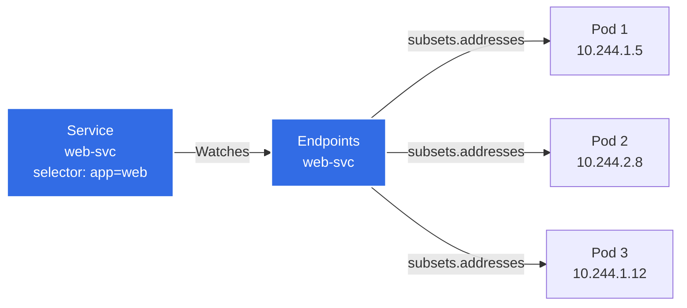
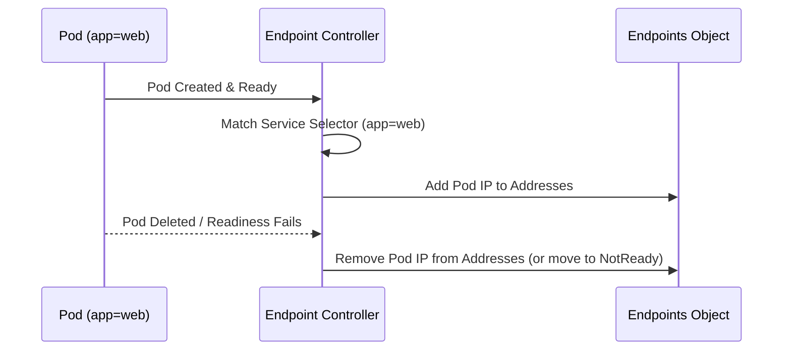
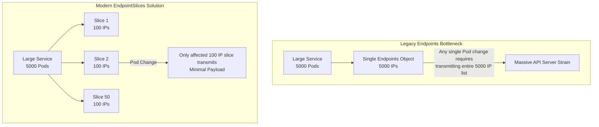
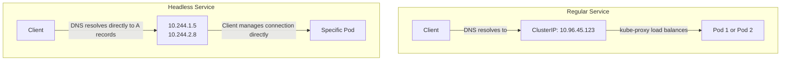

> **Complexity**: `[MEDIUM]` - Understanding service mechanics
>
> **Time to Complete**: 30-40 minutes
>
> **Prerequisites**: Module 3.1 (Services)

---

## What You'll Be Able to Do

After this module, you will be able to:
- **Diagnose** traffic routing failures by evaluating EndpointSlice conditions and pod readiness.
- **Design** manual endpoint configurations to integrate external databases into your Kubernetes service mesh.
- **Compare** the performance characteristics and limitations of legacy Endpoints versus modern EndpointSlices.
- **Implement** headless services for stateful workloads requiring direct pod addressing.
- **Evaluate** cluster topology to configure zone-aware routing using EndpointSlice hints.

---

## Why This Module Matters

In 2020, a global e-commerce giant faced a catastrophic 45-minute checkout outage during Cyber Monday. The root cause was not a network failure, an application bug, or a crashed database, but a silent architectural limitation in Kubernetes traffic routing. To handle the massive influx of shoppers, their primary payment microservice aggressively auto-scaled past 1,000 pods.

Unbeknownst to the engineering team on call, the legacy Kubernetes `Endpoints` API strictly and silently truncated the list of available pods at exactly 1,000 items. Thousands of transactions were forced through a stagnant subset of increasingly overloaded pods. Meanwhile, hundreds of newly scaled replicas sat completely idle, receiving zero traffic. The company lost an estimated $3.2 million in revenue before a senior engineer identified the obscure `endpoints.kubernetes.io/over-capacity: truncated` annotation and migrated the service to the newer API. 

Understanding how Services map to underlying pods is non-negotiable for platform engineers. If a Service is a phone number (stable), Endpoints are the phone book entries that map that number to actual people (pods). When you call the number, the phone system looks up who's available in the book and connects you. Kubernetes does the same. This module will equip you with the necessary architectural knowledge to debug service connectivity, bypass legacy bottlenecks, and leverage `EndpointSlice` resources for massive scale.

---

## Did You Know?

- **Controllers watch endpoints**: Many controllers (like Ingress controllers) watch Endpoints to know where to route traffic. When endpoints change, routing tables update automatically.
- **The legacy API is officially retiring:** As of Kubernetes v1.33+, reading or writing `Endpoints` objects will emit deprecation warnings in the API server logs, heavily encouraging migration to EndpointSlices.
- **Massive scaling has a hard limit:** Legacy Endpoints objects strictly truncate at 1,000 items. When this happens, an `endpoints.kubernetes.io/over-capacity: truncated` annotation is added to the object.
- **EndpointSlices default at 100:** By default, Kubernetes intelligently creates an additional EndpointSlice when existing ones for a service reach 100 endpoints and an extra endpoint is needed.
- **The control plane proxy has a new favorite:** Kubernetes internal routing (`kube-proxy`) treats EndpointSlices as its absolute source of truth, bypassing legacy Endpoints entirely in modern clusters.

---

## Part 1: Endpoints Fundamentals

### 1.1 What Are Endpoints?

Endpoints are the glue between Services and Pods. While a Service provides a stable virtual IP, Endpoints track the actual, ephemeral IP addresses of the pods backing that Service. 

> **Legacy Visualization Reference:**
<details>
<summary>View original ASCII architecture diagram</summary>

```text
┌────────────────────────────────────────────────────────────────┐
│                   Service → Endpoints → Pods                    │
│                                                                 │
│   ┌──────────────────┐    ┌──────────────────┐                │
│   │    Service       │    │    Endpoints     │                │
│   │    web-svc       │    │    web-svc       │                │
│   │                  │    │                  │                │
│   │  selector:       │───►│  subsets:        │                │
│   │    app: web      │    │  - addresses:    │                │
│   │                  │    │    - 10.244.1.5  │───► Pod 1      │
│   │  ports:          │    │    - 10.244.2.8  │───► Pod 2      │
│   │  - port: 80      │    │    - 10.244.1.12 │───► Pod 3      │
│   │                  │    │    ports:        │                │
│   │                  │    │    - port: 8080  │                │
│   └──────────────────┘    └──────────────────┘                │
│                                                                 │
│   Endpoints auto-created and updated by endpoint controller    │
│                                                                 │
└────────────────────────────────────────────────────────────────┘
```
</details>

Here is the modern routing flow visualized:



### 1.2 Endpoint Lifecycle

The Endpoint Controller operates in the Kubernetes control plane, constantly reconciling the state of the cluster to ensure Endpoints stay accurate.

<details>
<summary>View original ASCII lifecycle diagram</summary>

```text
┌────────────────────────────────────────────────────────────────┐
│                   Endpoint Controller                           │
│                                                                 │
│   Watches: Pods and Services                                   │
│   Updates: Endpoints objects                                   │
│                                                                 │
│   Pod Created (label: app=web)                                 │
│       │                                                         │
│       ▼                                                         │
│   Controller finds Service with selector app=web               │
│       │                                                         │
│       ▼                                                         │
│   Adds Pod IP to Service's Endpoints                           │
│                                                                 │
│   Pod Deleted or Fails Readiness                               │
│       │                                                         │
│       ▼                                                         │
│   Removes Pod IP from Endpoints                                │
│                                                                 │
└────────────────────────────────────────────────────────────────┘
```
</details>



### 1.3 Viewing Endpoints

You can inspect the legacy Endpoints API using standard `kubectl` commands:

```bash
# List all endpoints
k get endpoints
k get ep                    # Short form

# Get specific endpoint
k get endpoints web-svc

# Detailed view
k describe endpoints web-svc

# Get endpoints as YAML
k get endpoints web-svc -o yaml

# Wide output with pod IPs
k get endpoints -o wide
```

### 1.4 Endpoint Structure

```yaml
# What an Endpoints object looks like
apiVersion: v1
kind: Endpoints
metadata:
  name: web-svc           # Must match Service name
  namespace: default
subsets:
- addresses:              # Ready pod IPs
  - ip: 10.244.1.5
    nodeName: worker-1
    targetRef:
      kind: Pod
      name: web-abc123
      namespace: default
  - ip: 10.244.2.8
    nodeName: worker-2
    targetRef:
      kind: Pod
      name: web-def456
      namespace: default
  notReadyAddresses:      # Pods not passing readiness probe
  - ip: 10.244.1.12
    nodeName: worker-1
    targetRef:
      kind: Pod
      name: web-ghi789
      namespace: default
  ports:
  - port: 8080
    protocol: TCP
```

> **Pause and predict**: You have a Service with 3 endpoints. You add a readiness probe to the deployment that checks `/healthz`, but the endpoint on your app returns 500 for that path. What happens to the Service's endpoints, and can clients still reach the app?

---

## Part 2: The Shift to EndpointSlices

As clusters grew, the legacy `Endpoints` API became a severe bottleneck. The legacy `Endpoints` API lacks dual-stack support and `trafficDistribution`-related feature coverage, and forcibly truncates endpoint lists at 1,000 items. To solve this, Kubernetes introduced **EndpointSlices** (stable since v1.21).

### 4.1 Why EndpointSlices?

<details>
<summary>View original ASCII EndpointSlices diagram</summary>

```text
┌────────────────────────────────────────────────────────────────┐
│                   Endpoints Problem                             │
│                                                                 │
│   Large Service with 5000 pods                                 │
│                                                                 │
│   Single Endpoints object:                                     │
│   - Contains all 5000 IPs                                      │
│   - Any pod change = entire object update                      │
│   - Large payload sent to all watchers                         │
│   - API server and etcd strain                                 │
│                                                                 │
└────────────────────────────────────────────────────────────────┘

┌────────────────────────────────────────────────────────────────┐
│                   EndpointSlices Solution                       │
│                                                                 │
│   Same 5000 pods split across 50 slices                        │
│                                                                 │
│   ┌─────────┐ ┌─────────┐ ┌─────────┐      ┌─────────┐        │
│   │ Slice 1 │ │ Slice 2 │ │ Slice 3 │ ...  │Slice 50 │        │
│   │ 100 IPs │ │ 100 IPs │ │ 100 IPs │      │ 100 IPs │        │
│   └─────────┘ └─────────┘ └─────────┘      └─────────┘        │
│                                                                 │
│   Pod change = update only affected slice                      │
│   Small payload, minimal API server load                       │
│                                                                 │
└────────────────────────────────────────────────────────────────┘
```
</details>



EndpointSlices group network endpoints by service and by unique network tuple details (including IP family, protocol, and port combinations). Most EndpointSlices are created autonomously by the EndpointSlice controller to represent pods selected by Service objects. 

The controller's `--max-endpoints-per-slice` limit can be configured up to 1,000 endpoints per slice, though each EndpointSlice may also list up to 100 ports. EndpointSlice `addressType` supports `IPv4`, `IPv6`, and `FQDN` (though FQDN currently has no defined semantics and only IPv4/IPv6 are processed by `kube-proxy`). 

> **Stop and think**: Imagine a Service backed by 5,000 pods. Every time a single pod is added or removed, the entire Endpoints object (containing all 5,000 IPs) must be sent to every node watching it. What problem does this create, and how would you design a better solution?

### 4.2 EndpointSlice Structure

An EndpointSlice is a dedicated Kubernetes API resource under `discovery.k8s.io/v1`. A single Service may be associated with multiple EndpointSlice objects, dynamically tied via the `kubernetes.io/service-name` label.

```yaml
# What an EndpointSlice looks like
apiVersion: discovery.k8s.io/v1
kind: EndpointSlice
metadata:
  name: web-svc-abc12      # Auto-generated name
  labels:
    kubernetes.io/service-name: web-svc
addressType: IPv4
ports:
- name: ""
  port: 8080
  protocol: TCP
endpoints:
- addresses:
  - 10.244.1.5
  conditions:
    ready: true
    serving: true
    terminating: false
  nodeName: worker-1
  targetRef:
    kind: Pod
    name: web-abc123
    namespace: default
- addresses:
  - 10.244.2.8
  conditions:
    ready: true
  nodeName: worker-2
```

Note that transiently, endpoints can appear in multiple slices at once due to control-plane update and watch timing differences across nodes.

### 4.3 Viewing EndpointSlices

```bash
# List all EndpointSlices
k get endpointslices
k get eps                   # Short form (might conflict with endpoints)

# Get EndpointSlices for a service
k get endpointslices -l kubernetes.io/service-name=web-svc

# Detailed view
k describe endpointslice web-svc-abc12

# Get as YAML
k get endpointslice web-svc-abc12 -o yaml
```

### 4.4 Endpoints vs EndpointSlices Comparison

| Aspect | Endpoints | EndpointSlices |
|--------|-----------|----------------|
| Max entries | Unlimited (but problematic) | 100 per slice |
| Update scope | Entire object | Single slice |
| API version | v1 | discovery.k8s.io/v1 |
| Default since | Always | Kubernetes 1.21 |
| Dual-stack support | Limited | Full IPv4/IPv6 |
| Topology hints | No | Yes |

---

## Part 3: Debugging Routing and Conditions

### 2.1 No Endpoints = No Traffic

When traffic drops, your first stop is always verifying endpoint generation:

```bash
# Service exists but has no endpoints
k get svc web-svc
# NAME      TYPE        CLUSTER-IP     PORT(S)
# web-svc   ClusterIP   10.96.45.123   80/TCP

k get endpoints web-svc
# NAME      ENDPOINTS   AGE
# web-svc   <none>      5m     ← Problem!
```

### 2.2 Common Causes of Missing Endpoints

| Symptom | Cause | Debug Command | Solution |
|---------|-------|---------------|----------|
| `<none>` endpoints | No pods match selector | `k get pods --show-labels` | Fix selector or pod labels |
| `<none>` endpoints | Pods not running | `k get pods` | Fix pod issues |
| `<none>` endpoints | Pods in wrong namespace | `k get pods -A` | Check namespace |
| Partial endpoints | Some pods not ready | `k describe endpoints` | Check readiness probes |

### 2.3 Debugging Workflow

```bash
# Step 1: Check if endpoints exist
k get endpoints web-svc
# If <none>, proceed to step 2

# Step 2: Check service selector
k get svc web-svc -o yaml | grep -A5 selector
# selector:
#   app: web

# Step 3: Find pods with matching labels
k get pods --selector=app=web
# Should list pods backing the service

# Step 4: If no pods found, check what labels pods have
k get pods --show-labels
# Compare with service selector

# Step 5: If pods exist but not in endpoints, check pod status
k get pods
# Look for pods that aren't Running

# Step 6: Check for readiness probe failures
k describe pod <pod-name> | grep -A10 Readiness
```

### 2.4 Endpoints with NotReady Pods & EndpointSlice Conditions

```bash
# Describe shows both ready and not-ready addresses
k describe endpoints web-svc

# Output:
# Name:         web-svc
# Subsets:
#   Addresses:          10.244.1.5,10.244.2.8
#   NotReadyAddresses:  10.244.1.12
#   Ports:
#     Name     Port  Protocol
#     ----     ----  --------
#     <unset>  8080  TCP
```

Pods listed in `NotReadyAddresses` are actively shielded from receiving traffic. In the modern `EndpointSlice` API, routing is driven by endpoint conditions: `ready`, `serving`, and `terminating`. 

- **`serving`**: Maps directly to pod readiness for pod-backed endpoints.
- **`terminating`**: Indicates the endpoint is currently shutting down.

For pod-backed endpoints, `nil` values in `ready` or `serving` are safely interpreted as `true`, while `nil` in `terminating` is interpreted as `false`. While service proxies normally ignore terminating endpoints entirely, they may route to endpoints marked as both `serving` and `terminating` if *all* available endpoints are terminating (a fallback mechanism during aggressive rolling updates).

---

## Part 4: Manual Endpoints and External Services

### 3.1 When to Use Manual Endpoints

Services without a label selector do not get EndpointSlice objects created automatically; their EndpointSlices (or legacy Endpoints) must be created manually. Use manual endpoints when pointing to:
- External databases outside the Kubernetes cluster.
- Services residing in completely different clusters.
- Static IP-based resources that aren't containerized pods.

EndpointSlices managed outside the control plane should explicitly use the `endpointslice.kubernetes.io/managed-by` label, and each namespace-endpoint slice must have a unique name.

### 3.2 Creating Manual Endpoints

```kubernetes
# Step 1: Create service WITHOUT selector
apiVersion: v1
kind: Service
metadata:
  name: external-db
spec:
  ports:
  - port: 5432
    targetPort: 5432
  # No selector! This is intentional.
---
# Step 2: Create Endpoints with same name
apiVersion: v1
kind: Endpoints
metadata:
  name: external-db     # Must match service name exactly
subsets:
- addresses:
  - ip: 192.168.1.100   # External database IP
  - ip: 192.168.1.101   # Backup database IP
  ports:
  - port: 5432
```

```bash
# Apply both
k apply -f external-db.yaml

# Verify
k get svc,endpoints external-db

# Now pods can reach external DB via:
# external-db.default.svc.cluster.local:5432
```

### 3.3 Manual Endpoints Use Cases

```kubernetes
# Example: External API endpoint
apiVersion: v1
kind: Service
metadata:
  name: external-api
spec:
  ports:
  - port: 443
---
apiVersion: v1
kind: Endpoints
metadata:
  name: external-api
subsets:
- addresses:
  - ip: 52.84.123.45     # External API server
  ports:
  - port: 443
```

---

## Part 5: Headless Services

### 5.1 What Is a Headless Service?

A headless service explicitly has no `ClusterIP`. Instead of returning a single virtual IP, CoreDNS intercepts the query and returns the pod IPs directly to the client.

```yaml
apiVersion: v1
kind: Service
metadata:
  name: headless-svc
spec:
  clusterIP: None          # This makes it headless
  selector:
    app: web
  ports:
  - port: 80
```

> **What would happen if**: You set `clusterIP: None` on a Service. A pod does `nslookup` on that service name. Instead of getting one IP, it gets three. Why is this useful, and when would you NOT want this behavior?

### 5.2 Headless Service Behavior

For headless services, selector-based services create EndpointSlices natively in the control plane, while selectorless headless services do not generate them automatically.

<details>
<summary>View original ASCII headless flow</summary>

```text
┌────────────────────────────────────────────────────────────────┐
│                   Regular vs Headless Service                   │
│                                                                 │
│   Regular Service (ClusterIP: 10.96.45.123)                    │
│   ┌─────────────────────────────────────────────────────────┐  │
│   │  DNS: web-svc.default.svc → 10.96.45.123 (Service IP)   │  │
│   │  Client → Service IP → kube-proxy → random Pod          │  │
│   └─────────────────────────────────────────────────────────┘  │
│                                                                 │
│   Headless Service (clusterIP: None)                           │
│   ┌─────────────────────────────────────────────────────────┐  │
│   │  DNS: web-svc.default.svc →                             │  │
│   │       10.244.1.5 (Pod 1)                                │  │
│   │       10.244.2.8 (Pod 2)                                │  │
│   │       10.244.1.12 (Pod 3)                               │  │
│   │  Client gets ALL pod IPs, chooses one itself            │  │
│   └─────────────────────────────────────────────────────────┘  │
│                                                                 │
└────────────────────────────────────────────────────────────────┘
```
</details>



### 5.3 Headless Service Use Cases

| Use Case | Why Headless? |
|----------|---------------|
| StatefulSets | Need to address specific pods (pod-0, pod-1) |
| Client-side load balancing | Client needs all IPs to implement custom balancing |
| Service discovery | Discover all backend instances |
| Database clusters | Need direct connection to specific node |

### 5.4 Headless Service Endpoints

```bash
# Endpoints still track pods
k get endpoints headless-svc
# NAME           ENDPOINTS
# headless-svc   10.244.1.5,10.244.2.8,10.244.1.12

# DNS returns multiple A records
k run test --rm -i --image=busybox:1.36 --restart=Never -- \
  nslookup headless-svc

# Output:
# Name:    headless-svc.default.svc.cluster.local
# Address: 10.244.1.5
# Address: 10.244.2.8
# Address: 10.244.1.12
```

---

## Part 6: Service Topology and Topology Hints

### 6.1 Topology-Aware Routing

EndpointSlices natively support topology hints. This permits zone-aware routing, ensuring traffic stays within the same availability zone to reduce latency and egress costs.

```yaml
# EndpointSlice with hints
apiVersion: discovery.k8s.io/v1
kind: EndpointSlice
metadata:
  name: web-svc-abc12
endpoints:
- addresses:
  - 10.244.1.5
  zone: us-east-1a          # Pod is in this zone
  hints:
    forZones:
    - name: us-east-1a      # Prefer traffic from same zone
```

### 6.2 Enabling Topology-Aware Hints

```yaml
# Service with topology hints
apiVersion: v1
kind: Service
metadata:
  name: web-svc
  annotations:
    service.kubernetes.io/topology-mode: Auto   # Enable hints
spec:
  selector:
    app: web
  ports:
  - port: 80
```

---

## Common Mistakes

| Mistake | Problem | Solution |
|---------|---------|----------|
| **Wrong endpoint name** | Endpoints drop entirely and are not associated with the target service. | The manual Endpoint or EndpointSlice name must exactly match the Service name. |
| **Selector typo** | The service yields `<none>` endpoints because no pods are matched. | Double-check label selectors using `kubectl get pods --show-labels`. |
| **Missing `targetRef`** | You cannot dynamically trace an endpoint back to the pod that generated it. | Always include `targetRef` mapping when building manual endpoints pointing to inner-cluster resources. |
| **Ignoring `NotReadyAddresses`** | Engineers falsely assume pods are healthy because they show as "Running", but they are failing readiness. | Always check `describe` output for `NotReadyAddresses` or missing `serving` conditions. |
| **Confusing Endpoints / EndpointSlices** | Getting truncated, incomplete data when querying large clusters. | Use both commands for debugging, but treat `EndpointSlices` as the modern source of truth. |
| **Missing `managed-by` label** | The control plane might aggressively overwrite or ignore manual EndpointSlices. | Ensure manually created EndpointSlices utilize the `endpointslice.kubernetes.io/managed-by` label. |
| **Using Endpoints for IPv6** | Legacy `Endpoints` entirely lack modern dual-stack support. | Migrate immediately to `EndpointSlices` for any IPv6 or dual-stack network topologies. |
| **Forgetting headless rules** | Selectorless headless services fail to route traffic because they lack slices. | Remember that selectorless headless services do NOT auto-create EndpointSlices; create them manually. |

---

## Quiz

1. **You deploy a new version of your app and `kubectl get endpoints my-svc` suddenly shows `<none>`, even though `kubectl get pods` shows 3 pods in Running state. The previous version worked fine. What is your debugging process?**
   <details>
   <summary>Answer</summary>
   First, check if the pods are actually READY (not just Running) with `k get pods` -- look at the READY column. If they show `0/1`, the new version likely has a failing readiness probe. Second, verify the pod labels still match the Service selector: the new deployment might have changed labels. Run `k get svc my-svc -o yaml | grep -A5 selector` and compare with `k get pods --show-labels`. A common cause during version updates is changing the label (e.g., adding `version: v2`) while the Service selector still expects the old labels.
   </details>

2. **Your company has a PostgreSQL database running on a VM at 192.168.1.50, outside the Kubernetes cluster. You want pods to reach it as `external-db.default.svc.cluster.local:5432`. How do you set this up, and what happens if the database IP changes?**
   <details>
   <summary>Answer</summary>
   Create a Service without a selector and a matching Endpoints object. The Service defines `port: 5432` with no selector, and the Endpoints object (with the exact same name `external-db`) lists `192.168.1.50` in its addresses. If the database IP changes, you must manually update the Endpoints object -- there is no automatic tracking since there is no selector. For a more maintainable approach, consider using an ExternalName Service that points to a DNS name instead of a raw IP.
   </details>

3. **You run `kubectl describe endpoints my-svc` and see 2 IPs under `Addresses` and 1 IP under `NotReadyAddresses`. A colleague says "just delete the not-ready pod to fix it." Is this the right approach? What should you investigate first?**
   <details>
   <summary>Answer</summary>
   Deleting the pod is a band-aid, not a fix. The pod is in NotReadyAddresses because its readiness probe is failing, which means the pod is alive but not healthy enough to serve traffic. First investigate WHY the readiness probe fails: check `k describe pod <pod>` for probe failure events, check the pod logs for errors, and verify the readiness endpoint is correct. The pod might be overloaded, have a configuration error, or be waiting for a dependency. Kubernetes is correctly protecting users from receiving traffic on an unhealthy pod -- that is exactly what readiness probes are for.
   </details>

4. **Your cluster has a Service backed by 3,000 pods. An SRE reports that every time a rolling update occurs, the API server's memory spikes and kube-proxy takes 10+ seconds to update rules. What is causing this, and what Kubernetes feature addresses it?**
   <details>
   <summary>Answer</summary>
   With 3,000 pods, the single Endpoints object is enormous. Every pod change during a rolling update requires the entire object to be rewritten and sent to every node's kube-proxy. EndpointSlices solve this by splitting endpoints into chunks of 100 (so ~30 slices). When a pod changes, only the affected slice (~100 entries) is updated and transmitted, reducing API server load and kube-proxy processing time by roughly 30x. EndpointSlices have been the default since Kubernetes 1.21.
   </details>

5. **You are deploying a StatefulSet for a Kafka cluster where each broker needs to be individually addressable. A regular ClusterIP Service gives you a single virtual IP. How do you configure DNS so that producers can connect to `kafka-0`, `kafka-1`, and `kafka-2` individually?**
   <details>
   <summary>Answer</summary>
   Create a headless Service (with `clusterIP: None`) and set it as the StatefulSet's `serviceName`. With a headless Service, DNS returns individual A records for each pod rather than a single ClusterIP. Each StatefulSet pod gets a stable DNS name in the format `<pod-name>.<service-name>.<namespace>.svc.cluster.local`, so `kafka-0.kafka-headless.default.svc.cluster.local` always resolves to the specific pod. This is essential for stateful workloads where clients need to connect to specific instances, unlike stateless apps where any backend works.
   </details>

6. **You are reviewing the YAML of an EndpointSlice for a legacy application. Under one of the endpoints, the `ready` and `serving` conditions are missing entirely (`nil`). A junior engineer worries that kube-proxy will drop traffic to this endpoint because it is not explicitly marked ready. Are they correct, and why?**
   <details>
   <summary>Answer</summary>
   According to the EndpointSlice API, if `ready` or `serving` is evaluated as `nil` for a pod-backed endpoint, the system defaults to interpreting it as `true`. Conversely, a `nil` value for `terminating` is strictly evaluated as `false`. This default interpretation ensures backward compatibility and optimistic routing for older workloads transitioning to the newer API structure.
   </details>

7. **During a massive traffic spike, your application auto-scales to 1,200 pods. However, metrics show that 200 of the newest pods are receiving zero traffic, while the older 1,000 pods are severely overloaded. You inspect the `Endpoints` object and notice an `endpoints.kubernetes.io/over-capacity: truncated` annotation. What is the architectural root cause, and how do you route traffic to the stranded pods?**
   <details>
   <summary>Answer</summary>
   This strictly indicates that the Service is backed by more than 1,000 active pods. The legacy Endpoints API rigidly truncates the list at exactly 1,000 items to prevent cascading object size failures. In this state, traffic will only route to those 1,000 pods, stranding the rest. To resolve this and successfully route traffic, you must query and utilize `EndpointSlices` instead.
   </details>

8. **During an aggressive rolling update of a critical microservice, you observe a brief window where all available pods are in a terminating state. To your surprise, `kube-proxy` is still routing active traffic to these pods instead of dropping it immediately. The endpoints show both `serving: true` and `terminating: true`. Is this a bug in the proxy or intended behavior?**
   <details>
   <summary>Answer</summary>
   Normally, service proxies ignore terminating endpoints entirely to prevent blackholing traffic. However, as an intentional fallback mechanism during aggressive rolling updates, if *all* available endpoints for a service happen to be terminating, the proxy may temporarily continue to route traffic to endpoints marked as both serving and terminating. This prevents an immediate, total drop in traffic during edge-case scale downs.
   </details>

---

## Hands-On Exercise

**Task**: Debug a service with endpoint issues.

**Steps**:

1. **Create a deployment**:
```bash
k create deployment web --image=nginx --replicas=3
k rollout status deployment web --timeout=60s
```

2. **Create a service with wrong selector**:
```bash
cat << 'EOF' | k apply -f -
apiVersion: v1
kind: Service
metadata:
  name: broken-service
spec:
  selector:
    app: webapp          # Wrong! Should be "web"
  ports:
  - port: 80
EOF
```

3. **Observe the problem**:
```bash
k get endpoints broken-service
# Shows: <none>
```

4. **Debug the issue**:
```bash
# Check what selector the service has
k get svc broken-service -o yaml | grep -A2 selector

# Check what labels the pods have
k get pods --show-labels

# Find the mismatch!
```

5. **Fix the service**:
```bash
k delete svc broken-service
k expose deployment web --port=80 --name=broken-service
```

6. **Verify endpoints exist**:
```bash
k get endpoints broken-service
# Should show 3 pod IPs
```

7. **Check EndpointSlices too**:
```bash
k get endpointslices -l kubernetes.io/service-name=broken-service
```

8. **Test with a headless service**:
```bash
cat << 'EOF' | k apply -f -
apiVersion: v1
kind: Service
metadata:
  name: headless-web
spec:
  clusterIP: None
  selector:
    app: web
  ports:
  - port: 80
EOF

# Check DNS returns multiple IPs
k run test --rm -i --image=busybox:1.36 --restart=Never -- \
  nslookup headless-web
```

9. **Cleanup**:
```bash
k delete deployment web
k delete svc broken-service headless-web
```

**Success Criteria**:
- [ ] Can identify missing endpoints.
- [ ] Can debug selector mismatches confidently.
- [ ] Understand endpoints vs endpointslices outputs.
- [ ] Can manually create headless services.
- [ ] Understand DNS behavior differences for `clusterIP: None`.

---

## Practice Drills

### Drill 1: Endpoint Inspection (Target: 2 minutes)

```bash
# Setup
k create deployment drill --image=nginx --replicas=2
k rollout status deployment drill --timeout=60s
k expose deployment drill --port=80

# Check endpoints
k get endpoints drill

# Get detailed endpoint info
k describe endpoints drill

# Get as YAML (see pod IPs)
k get endpoints drill -o yaml

# Check EndpointSlices
k get endpointslices -l kubernetes.io/service-name=drill

# Cleanup
k delete deployment drill
k delete svc drill
```

### Drill 2: Debug Missing Endpoints (Target: 3 minutes)

```bash
# Create deployment
k create deployment debug-app --image=nginx
k rollout status deployment debug-app --timeout=60s

# Create service with typo in selector
cat << 'EOF' | k apply -f -
apiVersion: v1
kind: Service
metadata:
  name: debug-svc
spec:
  selector:
    app: debug-apps    # Typo: extra 's'
  ports:
  - port: 80
EOF

# Observe problem
k get endpoints debug-svc
# <none>

# Debug
k get pods --show-labels
k get svc debug-svc -o jsonpath='{.spec.selector}'

# Fix
k delete svc debug-svc
k expose deployment debug-app --port=80 --name=debug-svc

# Verify
k get endpoints debug-svc

# Cleanup
k delete deployment debug-app
k delete svc debug-svc
```

### Drill 3: Manual Endpoints (Target: 4 minutes)

```bash
# Create service without selector
cat << 'EOF' | k apply -f -
apiVersion: v1
kind: Service
metadata:
  name: external-svc
spec:
  ports:
  - port: 80
EOF

# Check - no endpoints yet
k get endpoints external-svc

# Create manual endpoints
cat << 'EOF' | k apply -f -
apiVersion: v1
kind: Endpoints
metadata:
  name: external-svc
subsets:
- addresses:
  - ip: 1.2.3.4
  - ip: 5.6.7.8
  ports:
  - port: 80
EOF

# Verify endpoints
k get endpoints external-svc
k describe endpoints external-svc

# Cleanup
k delete svc external-svc
k delete endpoints external-svc
```

### Drill 4: Headless Service (Target: 3 minutes)

```bash
# Create deployment
k create deployment headless-test --image=nginx --replicas=3
k rollout status deployment headless-test --timeout=60s

# Create headless service
cat << 'EOF' | k apply -f -
apiVersion: v1
kind: Service
metadata:
  name: headless
spec:
  clusterIP: None
  selector:
    app: headless-test
  ports:
  - port: 80
EOF

# Verify no ClusterIP
k get svc headless
# CLUSTER-IP should be "None"

# Check endpoints (still exist!)
k get endpoints headless

# Test DNS - should return multiple IPs
k run test --rm -i --image=busybox:1.36 --restart=Never -- \
  nslookup headless

# Cleanup
k delete deployment headless-test
k delete svc headless
```

### Drill 5: EndpointSlice Analysis (Target: 3 minutes)

```bash
# Create deployment
k create deployment slice-test --image=nginx --replicas=3
k rollout status deployment slice-test --timeout=60s
k expose deployment slice-test --port=80

# Get EndpointSlice name
k get endpointslices -l kubernetes.io/service-name=slice-test

# Describe it
SLICE_NAME=$(k get endpointslices -l kubernetes.io/service-name=slice-test -o jsonpath='{.items[0].metadata.name}')
k describe endpointslice $SLICE_NAME

# Get YAML
k get endpointslice $SLICE_NAME -o yaml

# Note the endpoints array with conditions

# Cleanup
k delete deployment slice-test
k delete svc slice-test
```

### Drill 6: Readiness and Endpoints (Target: 4 minutes)

```bash
# Create pod with failing readiness probe
cat << 'EOF' | k apply -f -
apiVersion: v1
kind: Pod
metadata:
  name: unready-pod
  labels:
    app: unready
spec:
  containers:
  - name: nginx
    image: nginx
    readinessProbe:
      httpGet:
        path: /nonexistent
        port: 80
      initialDelaySeconds: 1
      periodSeconds: 2
EOF

# Create service
k expose pod unready-pod --port=80 --name=unready-svc

# Wait for the pod to be scheduled and probe to fail
kubectl wait --for=condition=ready pod/unready-pod --timeout=10s || true
k get endpoints unready-svc
# Should be <none> or empty!

# Check why
k describe endpoints unready-svc
# Look for notReadyAddresses

# Check pod status
k get pod unready-pod
# Not ready due to probe

# Cleanup
k delete pod unready-pod
k delete svc unready-svc
```

### Drill 7: Scale and Watch Endpoints (Target: 3 minutes)

```bash
# Create deployment
k create deployment watch-test --image=nginx --replicas=1
k rollout status deployment watch-test --timeout=60s
k expose deployment watch-test --port=80

# Watch endpoints in terminal 1 (or background)
k get endpoints watch-test -w &

# Scale up and observe endpoints change
k scale deployment watch-test --replicas=5
k rollout status deployment watch-test --timeout=60s

# Scale down
k scale deployment watch-test --replicas=2
k rollout status deployment watch-test --timeout=60s

# Stop the background watch process
kill $!

# Cleanup
k delete deployment watch-test
k delete svc watch-test
```

### Drill 8: Challenge - Complete Endpoint Workflow

Without looking at solutions:

1. Create deployment `ep-challenge` with 3 replicas of nginx
2. Create a service that intentionally has wrong selector
3. Diagnose why endpoints are empty
4. Fix the service
5. Create a headless service for same deployment
6. Verify DNS returns 3 IPs for headless service
7. Create manual endpoints for IP 10.0.0.1
8. Cleanup everything

```bash
# YOUR TASK: Complete in under 6 minutes
```

<details>
<summary>Solution</summary>

```bash
# 1. Create deployment
k create deployment ep-challenge --image=nginx --replicas=3
k rollout status deployment ep-challenge --timeout=60s

# 2. Create service with wrong selector
cat << 'EOF' | k apply -f -
apiVersion: v1
kind: Service
metadata:
  name: wrong-svc
spec:
  selector:
    app: wrong
  ports:
  - port: 80
EOF

# 3. Diagnose
k get endpoints wrong-svc
# <none>
k get pods --show-labels
# Labels show app=ep-challenge, not app=wrong

# 4. Fix
k delete svc wrong-svc
k expose deployment ep-challenge --port=80 --name=fixed-svc
k get endpoints fixed-svc
# Shows 3 IPs

# 5. Create headless service
cat << 'EOF' | k apply -f -
apiVersion: v1
kind: Service
metadata:
  name: headless-challenge
spec:
  clusterIP: None
  selector:
    app: ep-challenge
  ports:
  - port: 80
EOF

# 6. Verify DNS
k run test --rm -i --image=busybox:1.36 --restart=Never -- \
  nslookup headless-challenge
# Should show 3 IPs

# 7. Manual endpoints
cat << 'EOF' | k apply -f -
apiVersion: v1
kind: Service
metadata:
  name: manual-svc
spec:
  ports:
  - port: 80
---
apiVersion: v1
kind: Endpoints
metadata:
  name: manual-svc
subsets:
- addresses:
  - ip: 10.0.0.1
  ports:
  - port: 80
EOF
k get endpoints manual-svc

# 8. Cleanup
k delete deployment ep-challenge
k delete svc fixed-svc headless-challenge manual-svc
k delete endpoints manual-svc
```

</details>

---

## Next Module

[Module 3.3: DNS & CoreDNS](../module-3.3-dns/) - Deep-dive into Kubernetes DNS, service discovery, and resolving complex naming constraints.