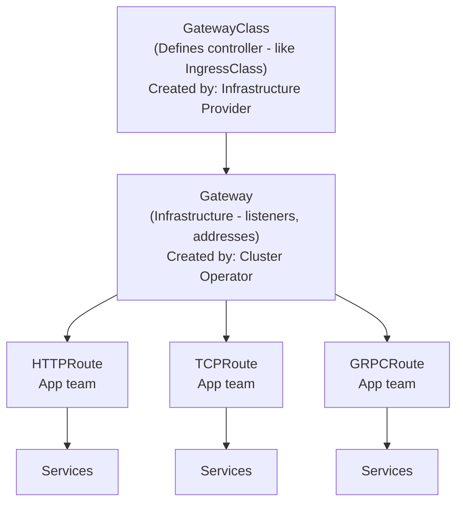
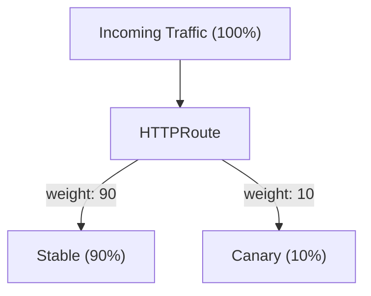
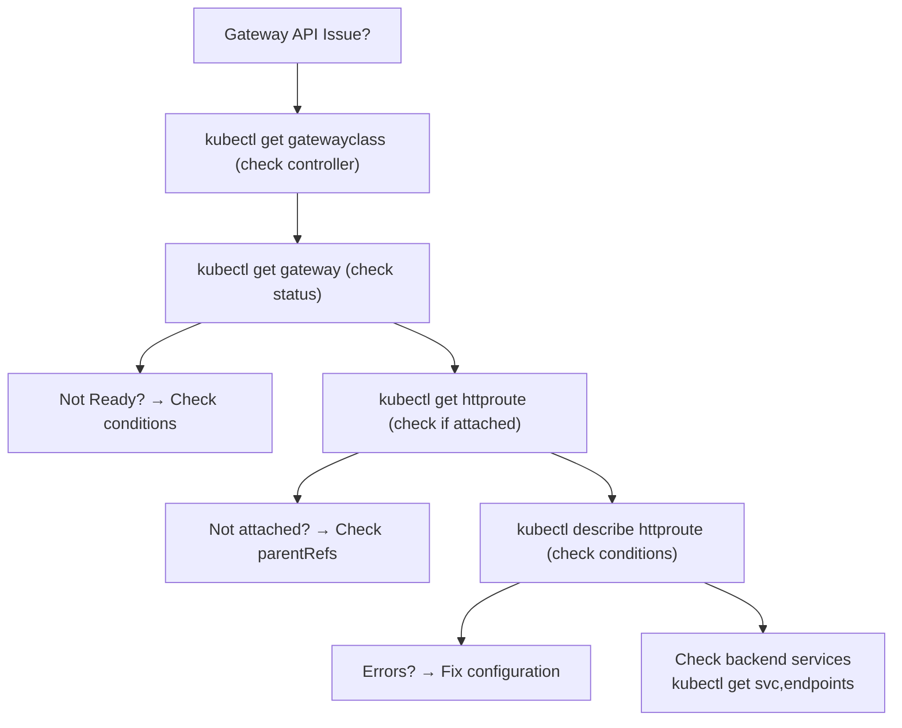

> **Complexity**: `[MEDIUM]` - CKA exam topic
>
> **Time to Complete**: 45-55 minutes
>
> **Prerequisites**: Module 3.4 (Ingress)

---

## What You'll Be Able to Do

After completing this module, you will be able to:
- **Design** a multi-tenant traffic management strategy using Gateway API's role-oriented model.
- **Implement** advanced traffic splitting, header manipulation, and request mirroring using HTTPRoute.
- **Diagnose** routing failures and namespace boundary issues using Gateway and HTTPRoute status conditions.
- **Evaluate** the architectural tradeoffs between the legacy Ingress API and the Gateway API.
- **Compare** the capabilities of standard HTTPRoutes against experimental TCP/UDP routes.

---

## Why This Module Matters

Shared Ingress resources can create a large blast radius in multi-team clusters when controller-specific annotations and overlapping rules interact in unexpected ways. Gateway API is designed to reduce that risk by separating infrastructure resources from route resources and by giving different teams clearer ownership boundaries.

Gateway API is the modern standard designed specifically to prevent these operational disasters. By separating the infrastructure definition (Gateways) from the routing rules (HTTPRoutes), it establishes clear security boundaries. If a developer makes a syntax mistake in their HTTPRoute, it only impacts their specific application, leaving the rest of the cluster untouched. 

As Kubernetes clusters scale to support hundreds of microservices, mastering Gateway API is no longer optional—it is a strict requirement for cluster stability and security. It is the definitive evolution of Kubernetes networking and a critical competency for the CKA exam.

> **The Airport Analogy**
>
> If Ingress is like a single airport terminal with one check-in desk, Gateway API is like a modern airport with separate entities: infrastructure operators manage the runways (Gateway), airlines manage their check-in counters (HTTPRoute), and security handles policies (policies). Each role has clear responsibilities.

---

## Did You Know?

- **Gateway API is purely an API project**: Like Ingress, it requires a separate controller implementation to process traffic. Gateway API does not define a default controller.
- **Version 1.5.1 is the latest supported v1 API**: Released in March 2026 following Gateway API's target 4-month standard cadence, it was a patch release; the `safe-upgrades.gateway.networking.k8s.io` ValidatingAdmissionPolicy was introduced in Gateway API 1.5.0.
- **No plans to deprecate Ingress**: Despite Gateway API's clear architectural superiority, the [official FAQ explicitly states that Ingress (GA since Kubernetes 1.19) will be supported indefinitely](https://gateway-api.sigs.k8s.io/faq/) for simple, legacy use cases.
- **Built-in Conformance Testing**: To be deemed officially conformant, Gateway implementations must pass all core tests plus claimed extended features for at least one route profile across the two most recent releases, providing a stronger portability baseline across implementations.
- **ingress2gateway**: This SIG-Network migration tool can convert Ingress resources to Gateway API resources, but provider-specific feature coverage varies by release. See the [official migration guide](https://gateway-api.sigs.k8s.io/guides/getting-started/migrating-from-ingress/).

---

## Part 1: Gateway API vs Ingress

### 1.1 Key Differences

The legacy Ingress API was designed strictly for HTTP/HTTPS traffic. Gateway API radically expands this scope.

| Aspect | Ingress | Gateway API |
|--------|---------|-------------|
| Resources | 1 (Ingress) | Multiple (Gateway, HTTPRoute, etc.) |
| Protocols | HTTP/HTTPS | HTTP, HTTPS, TCP, UDP, TLS, gRPC |
| Role model | Single resource | Separated by role |
| Extensibility | Annotations (non-portable) | Typed extensions (portable) |
| Header routing | Controller-specific | Native support |
| Traffic splitting | Controller-specific | Native support |
| Status | Stable | GA since v1.0 (Oct 2023) |

### 1.1b Route Capabilities: Standard vs Experimental

The API includes both stable and experimental route types. `HTTPRoute` is a Layer 7 route type with features such as path matching, header matching, and traffic splitting. `TCPRoute` and `UDPRoute` are Experimental Layer 4 route types for forwarding TCP or UDP traffic without HTTP-level inspection, while `TLSRoute` handles SNI-based routing.

### 1.2 Resource Hierarchy

The resource hierarchy of Gateway API separates concerns. As of `v1.5.1`, key resources span different maturity levels and API versions; check the API reference for the exact channel and support level of each resource.



> **Pause and predict**: In a large organization, the platform team manages infrastructure and the app teams manage their own routing. With Ingress, both teams edit the same resource type. What problems does this cause, and how does Gateway API's resource model solve them?

### 1.3 Role-Oriented Design

Gateway API enforces isolation through distinct resources mapped to distinct organizational roles. 

| Role | Resources | Responsibilities |
|------|-----------|-----------------|
| **Infrastructure Provider** | GatewayClass | Defines how gateways are implemented |
| **Cluster Operator** | Gateway, ReferenceGrant | Configures infrastructure, network policies |
| **Application Developer** | HTTPRoute, TCPRoute | Defines routing rules for applications |

---

## Part 2: Installing Gateway API

The Gateway API release process is channel-based. Standard channel releases follow a 4-month cadence and contain stable elements. Experimental channel releases are tagged monthly and add alpha fields with no backward-compatibility guarantees. TCPRoute and UDPRoute currently reside in the Experimental channel, while HTTPRoute, GRPCRoute, and TLSRoute are Standard (GA).

### 2.1 Installing the CRDs

*Note on Installation: You may encounter conflicting instructions across official documentation pages—some guides reference `v1.4.1` install tags while others reference `v1.5.0`. Always verify the latest release on GitHub. The snippet below demonstrates standard CRD installation.*

```bash
# Install Gateway API CRDs (required first)
kubectl apply -f https://github.com/kubernetes-sigs/gateway-api/releases/download/v1.0.0/standard-install.yaml

# Verify CRDs are installed
kubectl get crd | grep gateway
# gatewayclasses.gateway.networking.k8s.io
# gateways.gateway.networking.k8s.io
# httproutes.gateway.networking.k8s.io
```

### 2.2 Gateway Controller Options

[Gateway API is strictly an API. You must install a controller to process traffic.](https://gateway-api.sigs.k8s.io/faq/)

| Controller | Type | Best For |
|------------|------|----------|
| **Istio** | Service mesh | Full-featured, service mesh users |
| **Contour** | Standalone | Simple, fast |
| **nginx** | Standalone | Familiar to nginx users |
| **Cilium** | CNI-integrated | eBPF performance |
| **Traefik** | Standalone | Dynamic configuration |

### 2.3 Installing Istio Gateway Controller (Example)

```bash
# Install Istio with Gateway API support
istioctl install --set profile=minimal

# Or for quick testing with kind/minikube, use Contour:
kubectl apply -f https://projectcontour.io/quickstart/contour-gateway.yaml
```

---

## Part 3: GatewayClass and Gateway

[Both `Gateway` and `GatewayClass` have been GA and in the Standard channel since v0.5.0.](https://gateway-api.sigs.k8s.io/concepts/api-overview/)

### 3.1 GatewayClass

```yaml
# GatewayClass - created by infrastructure provider
apiVersion: gateway.networking.k8s.io/v1
kind: GatewayClass
metadata:
  name: example-gateway-class
spec:
  controllerName: example.io/gateway-controller
  description: "Example Gateway controller"
```

```bash
# List GatewayClasses
k get gatewayclass
k get gc               # Short form
```

### 3.2 Gateway

```yaml
# Gateway - created by cluster operator
apiVersion: gateway.networking.k8s.io/v1
kind: Gateway
metadata:
  name: example-gateway
  namespace: default
spec:
  gatewayClassName: example-gateway-class
  listeners:
  - name: http
    protocol: HTTP
    port: 80
    allowedRoutes:
      namespaces:
        from: All        # Allow routes from all namespaces
```

### 3.3 Gateway with Multiple Listeners

```yaml
apiVersion: gateway.networking.k8s.io/v1
kind: Gateway
metadata:
  name: multi-listener-gateway
spec:
  gatewayClassName: example-gateway-class
  listeners:
  - name: http
    protocol: HTTP
    port: 80
    hostname: "*.example.com"
    allowedRoutes:
      namespaces:
        from: All
  - name: https
    protocol: HTTPS
    port: 443
    hostname: "*.example.com"
    tls:
      mode: Terminate
      certificateRefs:
      - name: example-tls
        kind: Secret
    allowedRoutes:
      namespaces:
        from: Same       # Only routes from same namespace
```

### 3.4 Checking Gateway Status

```bash
# Get gateway
k get gateway
k get gtw              # Short form

# Describe gateway (check conditions)
k describe gateway example-gateway

# Check if gateway is ready
k get gateway example-gateway -o jsonpath='{.status.conditions[?(@.type=="Ready")].status}'
```

---

## Part 4: HTTPRoute

### 4.1 Simple HTTPRoute

```yaml
apiVersion: gateway.networking.k8s.io/v1
kind: HTTPRoute
metadata:
  name: simple-route
spec:
  parentRefs:
  - name: example-gateway       # Attach to this Gateway
  rules:
  - backendRefs:
    - name: web-service         # Target service
      port: 80
```

### 4.2 Path-Based Routing

```yaml
apiVersion: gateway.networking.k8s.io/v1
kind: HTTPRoute
metadata:
  name: path-route
spec:
  parentRefs:
  - name: example-gateway
  rules:
  - matches:
    - path:
        type: PathPrefix
        value: /api
    backendRefs:
    - name: api-service
      port: 80
  - matches:
    - path:
        type: PathPrefix
        value: /
    backendRefs:
    - name: web-service
      port: 80
```

### 4.3 Host-Based Routing

```yaml
apiVersion: gateway.networking.k8s.io/v1
kind: HTTPRoute
metadata:
  name: host-route
spec:
  parentRefs:
  - name: example-gateway
  hostnames:
  - "api.example.com"
  - "api.example.org"
  rules:
  - backendRefs:
    - name: api-service
      port: 80
```

### 4.4 Header-Based Routing

```yaml
apiVersion: gateway.networking.k8s.io/v1
kind: HTTPRoute
metadata:
  name: header-route
spec:
  parentRefs:
  - name: example-gateway
  rules:
  - matches:
    - headers:
      - name: X-Version
        value: v2
    backendRefs:
    - name: api-v2
      port: 80
  - matches:
    - headers:
      - name: X-Version
        value: v1
    backendRefs:
    - name: api-v1
      port: 80
```

> **Stop and think**: You want to roll out a new version of your API to 10% of users. With a standard Kubernetes Deployment, you could adjust replica counts (9 old, 1 new), but that couples scaling with routing. How does Gateway API's traffic splitting decouple these concerns?

### 4.5 Traffic Splitting (Canary/Blue-Green)

```yaml
apiVersion: gateway.networking.k8s.io/v1
kind: HTTPRoute
metadata:
  name: canary-route
spec:
  parentRefs:
  - name: example-gateway
  rules:
  - backendRefs:
    - name: api-stable
      port: 80
      weight: 90           # 90% to stable
    - name: api-canary
      port: 80
      weight: 10           # 10% to canary
```



---

## Part 5: HTTPRoute Filters

[Gateway API incorporates traffic transformations directly via filters, bypassing the need for unwieldy annotations.](https://gateway-api.sigs.k8s.io/guides/getting-started/migrating-from-ingress/)

### 5.1 Request Header Modification

```yaml
apiVersion: gateway.networking.k8s.io/v1
kind: HTTPRoute
metadata:
  name: header-filter-route
spec:
  parentRefs:
  - name: example-gateway
  rules:
  - filters:
    - type: RequestHeaderModifier
      requestHeaderModifier:
        add:
        - name: X-Custom-Header
          value: "added-by-gateway"
        remove:
        - X-Unwanted-Header
    backendRefs:
    - name: web-service
      port: 80
```

### 5.2 URL Rewrite

```yaml
apiVersion: gateway.networking.k8s.io/v1
kind: HTTPRoute
metadata:
  name: rewrite-route
spec:
  parentRefs:
  - name: example-gateway
  rules:
  - matches:
    - path:
        type: PathPrefix
        value: /old-api
    filters:
    - type: URLRewrite
      urlRewrite:
        path:
          type: ReplacePrefixMatch
          replacePrefixMatch: /new-api
    backendRefs:
    - name: api-service
      port: 80
```

### 5.3 Request Redirect

```yaml
apiVersion: gateway.networking.k8s.io/v1
kind: HTTPRoute
metadata:
  name: redirect-route
spec:
  parentRefs:
  - name: example-gateway
  rules:
  - matches:
    - path:
        type: PathPrefix
        value: /old-path
    filters:
    - type: RequestRedirect
      requestRedirect:
        scheme: https
        hostname: new.example.com
        statusCode: 301
```

### 5.4 Request Mirroring

Request mirroring allows you to duplicate traffic and send a copy to another backend without affecting the primary response. This is useful for safely testing new versions with live production traffic.

```yaml
apiVersion: gateway.networking.k8s.io/v1
kind: HTTPRoute
metadata:
  name: mirror-route
spec:
  parentRefs:
  - name: example-gateway
  rules:
  - filters:
    - type: RequestMirror
      requestMirror:
        backendRef:
          name: api-canary
          port: 80
    backendRefs:
    - name: api-stable
      port: 80
```

---

## Part 6: GRPCRoute

Gateway API provides native support for gRPC traffic through the `GRPCRoute` resource, allowing you to route requests based on gRPC services and methods rather than HTTP paths.

### 6.1 Simple GRPCRoute

```yaml
apiVersion: gateway.networking.k8s.io/v1
kind: GRPCRoute
metadata:
  name: grpc-route
spec:
  parentRefs:
  - name: example-gateway
  rules:
  - matches:
    - method:
        service: myapp.v1.MyService
        method: MyMethod
    backendRefs:
    - name: grpc-backend
      port: 50051
```

> **Stop and think**: Why would you use a dedicated `GRPCRoute` instead of just an `HTTPRoute`, given that gRPC uses HTTP/2? A dedicated resource allows the gateway to parse the specific protobuf service and method structures natively, making configuration much less error-prone than manual HTTP path matching.

---

## Part 7: Cross-Namespace Routing

> **Pause and predict**: An HTTPRoute in namespace `team-a` tries to reference a Service in namespace `team-b`, but no ReferenceGrant exists in `team-b`? Does the route silently fail, return an error, or route somewhere unexpected?

### 7.1 ReferenceGrant

Allows routes in one namespace to reference services in another namespace. In Gateway API v1.5.0, `ReferenceGrant` moved to the `v1` API version. 

```yaml
# In the target namespace (where the service lives)
apiVersion: gateway.networking.k8s.io/v1beta1
kind: ReferenceGrant
metadata:
  name: allow-routes-from-default
  namespace: backend-ns
spec:
  from:
  - group: gateway.networking.k8s.io
    kind: HTTPRoute
    namespace: default        # Allow routes from default namespace
  to:
  - group: ""
    kind: Service             # Allow referencing services
```

```yaml
# HTTPRoute in default namespace can now reference backend-ns service
apiVersion: gateway.networking.k8s.io/v1
kind: HTTPRoute
metadata:
  name: cross-ns-route
  namespace: default
spec:
  parentRefs:
  - name: example-gateway
  rules:
  - backendRefs:
    - name: backend-service
      namespace: backend-ns    # Cross-namespace reference
      port: 80
```

---

## Part 8: TLS Configuration

In Gateway API v1.5.0, several capabilities achieved Standard status including Gateway client cert validation, certificate selection for TLS origination, `ListenerSet` support, and `TLSRoute` `v1` (though `TLSRoute v1alpha2` remained strictly experimental). Notably, [`TLSRoute` CEL validation requires a cluster running Kubernetes 1.31 or higher.](https://github.com/kubernetes-sigs/gateway-api/releases/tag/v1.5.0)

### 8.1 Gateway with TLS Termination

```yaml
apiVersion: gateway.networking.k8s.io/v1
kind: Gateway
metadata:
  name: tls-gateway
spec:
  gatewayClassName: example-gateway-class
  listeners:
  - name: https
    protocol: HTTPS
    port: 443
    hostname: secure.example.com
    tls:
      mode: Terminate
      certificateRefs:
      - name: secure-tls        # TLS secret
        kind: Secret
    allowedRoutes:
      namespaces:
        from: All
```

### 8.2 TLS Modes

| Mode | Behavior |
|------|----------|
| `Terminate` | Gateway terminates TLS, sends HTTP to backends |
| `Passthrough` | Gateway passes TLS through, backend handles termination |

---

## Part 9: Debugging Gateway API

### 9.1 Debugging Workflow



### 9.2 Common Commands

```bash
# List all Gateway API resources
k get gatewayclass,gateway,httproute

# Check Gateway status
k describe gateway example-gateway

# Check HTTPRoute status
k describe httproute my-route

# Get HTTPRoute conditions
k get httproute my-route -o jsonpath='{.status.parents[0].conditions}'
```

### 9.3 Common Issues

| Symptom | Cause | Solution |
|---------|-------|----------|
| Gateway not Ready | No controller | Install Gateway controller |
| HTTPRoute not attached | Wrong parentRefs | Check Gateway name/namespace |
| 404 errors | No matching rule | Check path/host configuration |
| Cross-namespace fails | Missing ReferenceGrant | Create ReferenceGrant |

---

## Common Mistakes

| Mistake | Why | Fix |
|---------|-----|-----|
| Missing CRDs | Resources not recognized | Install Gateway API CRDs first |
| Wrong gatewayClassName | Gateway not processed | Match GatewayClass name exactly |
| Missing parentRefs | Route not attached | Add parentRefs to HTTPRoute |
| Namespace mismatch | Cross-ns routing fails | Create ReferenceGrant |
| Wrong path type | Routes don't match | Use PathPrefix, Exact, or RegularExpression |
| Mixing Experimental and Standard CRDs | Triggers `safe-upgrades.gateway.networking.k8s.io` VAP rule | Use consistent channel CRDs |
| Testing routing without a controller | Gateway API is an API only, no default controller | Install Contour, Envoy, or Istio controller |
| Using `TLSRoute` CEL validation on K8s < 1.31 | Kubernetes version too old for the validation feature | Upgrade K8s to v1.31+ or v1.35 |

---

## Quiz

1. **Your team is migrating from ingress-nginx (now retired) to Gateway API. A colleague asks why you can't just keep using Ingress resources with a different controller. What limitations of Ingress does Gateway API solve that would justify the migration effort?**
   <details>
   <summary>Answer</summary>
   Ingress relies on controller-specific annotations for advanced features (rewrite rules, rate limiting, header routing), making configurations non-portable between controllers. Gateway API provides these features natively: traffic splitting with `weight`, header-based routing with `matches.headers`, URL rewriting with `URLRewrite` filters, and cross-namespace routing with `ReferenceGrant`. It also supports TCP, UDP, gRPC, and TLS natively (not just HTTP). The role-oriented model (GatewayClass/Gateway/HTTPRoute) lets platform teams manage infrastructure separately from app teams managing routes, improving security and separation of concerns.
   </details>

2. **You are a cluster operator. The security team requires that only the `payments` namespace can create HTTPRoutes that attach to the production Gateway, while all other namespaces can use the staging Gateway. How do you configure this?**
   <details>
   <summary>Answer</summary>
   On the production Gateway, set the listener's `allowedRoutes.namespaces.from: Selector` with a `namespaceSelector` matching a label like `gateway-access: production`, then label only the `payments` namespace with that label. On the staging Gateway, set `allowedRoutes.namespaces.from: All`. This way, only HTTPRoutes in the `payments` namespace can attach to the production Gateway. If a team in another namespace tries to reference the production Gateway in their HTTPRoute's `parentRefs`, the route will not be accepted and the status conditions will show it was rejected.
   </details>

3. **You are deploying a canary release. The stable version handles 95% of traffic and the canary handles 5%. After monitoring for an hour, you want to shift to 50/50. With a Deployment-based approach, you would need to scale replicas. How does Gateway API handle this differently, and what is the advantage?**
   <details>
   <summary>Answer</summary>
   With Gateway API, you change the `weight` values in the HTTPRoute's `backendRefs` from `95/5` to `50/50`. The key advantage is that traffic splitting is decoupled from scaling. You can have 10 stable pods and 2 canary pods but still send 50% of traffic to each -- the gateway handles the distribution. With Deployment-based canary (adjusting replica counts), you would need 5 stable and 5 canary pods to achieve 50/50, forcing you to over-provision the canary. Gateway API lets you scale each version independently based on actual load, not traffic percentage.
   </details>

4. **An app team creates an HTTPRoute that references a backend Service in a different namespace, but traffic returns 404. The HTTPRoute status shows "ResolvedRefs: False". What is missing and how do you fix it?**
   <details>
   <summary>Answer</summary>
   A `ReferenceGrant` is missing in the target namespace. Gateway API requires explicit permission for cross-namespace references as a robust security measure. Create a ReferenceGrant in the backend Service's namespace that explicitly allows HTTPRoutes from the app team's namespace to reference its local Services. Without it, the gateway controller refuses to resolve the backend reference, dropping the traffic. This is a deliberate zero-trust feature—unlike legacy Ingress where any namespace could easily reference any Service, Gateway API enforces strict boundaries between isolated namespaces.
   </details>

5. **You need to route requests to API v2 only when the header `X-API-Version: 2` is present, otherwise default to v1. With Ingress, this required a controller-specific annotation. Write the Gateway API HTTPRoute rules and explain why this is more portable.**
   <details>
   <summary>Answer</summary>
   Create an HTTPRoute with two rules: the first matches `headers: [{name: X-API-Version, value: "2"}]` and routes to the v2 backend; the second has no header match (default) and routes to v1. The more specific match (with header) takes priority. This is more portable because `matches.headers` is part of the Gateway API spec, not an annotation. Any conformant Gateway API implementation (Envoy Gateway, Cilium, Traefik, Kong) will handle it identically. With Ingress, you would use something like `nginx.ingress.kubernetes.io/canary-header: X-API-Version` which only works with nginx and has completely different syntax on other controllers.
   </details>

6. **You have created a TCPRoute using the Gateway API CRDs you downloaded from the standard channel. The resource fails to apply to the cluster. What is the likely cause?**
   <details>
   <summary>Answer</summary>
   TCPRoute and UDPRoute are considered alpha and only exist in the Experimental channel of the Gateway API. You must install the experimental CRDs instead of the standard CRDs to utilize these Layer 4 resource kinds. Mixing and matching channels incorrectly can also trigger `safe-upgrades.gateway.networking.k8s.io` VAP rule rejections. This explicit separation prevents cluster operators from accidentally relying on unstable APIs for critical production workloads. Always verify your target environment's channel before defining non-HTTP routing rules.
   </details>

7. **A developer reports that their `TLSRoute` containing Common Expression Language (CEL) validation is being rejected by the cluster API server, throwing an error about unsupported fields. They are running Kubernetes v1.30. How do you resolve this?**
   <details>
   <summary>Answer</summary>
   You must upgrade the Kubernetes cluster to a modern supported version like v1.34 or v1.35. The Gateway API v1.5.0 specification leverages Common Expression Language (CEL) validation for `TLSRoute` resources, which introduces a hard dependency on Kubernetes v1.31 or higher. Older Kubernetes API servers lack the requisite native CEL parsing capabilities embedded in the updated Custom Resource Definitions. Consequently, the API server immediately rejects the manifest because it encounters unknown validation fields. Keeping your cluster aligned with the latest stable releases guarantees full compatibility with advanced Gateway API security policies.
   </details>

---

## Hands-On Exercise

*Note: The following exercises extensively use the `k` alias for `kubectl`. Before starting, ensure you have configured this in your terminal:*
```bash
alias k=kubectl
```

### Phase 1: Syntax and Structure Validation (Dry Run)

This phase verifies the syntax of your configurations using a mock/dummy `GatewayClass`. 

**Task**: Create a complete Gateway API setup with routing.

**Steps**:

1. **Install Gateway API CRDs** (if not installed):
```bash
kubectl apply -f https://github.com/kubernetes-sigs/gateway-api/releases/download/v1.0.0/standard-install.yaml
```

2. **Create backend services**:
```bash
k create deployment api --image=nginx
k create deployment web --image=nginx
k expose deployment api --port=80
k expose deployment web --port=80
```

3. **Create GatewayClass** (simulated - in real cluster, controller provides this):
```bash
cat << 'EOF' | k apply -f -
apiVersion: gateway.networking.k8s.io/v1
kind: GatewayClass
metadata:
  name: example-class
spec:
  controllerName: example.io/gateway-controller
EOF
```

4. **Create Gateway**:
```bash
cat << 'EOF' | k apply -f -
apiVersion: gateway.networking.k8s.io/v1
kind: Gateway
metadata:
  name: example-gateway
spec:
  gatewayClassName: example-class
  listeners:
  - name: http
    protocol: HTTP
    port: 80
    allowedRoutes:
      namespaces:
        from: All
EOF

k get gateway
k describe gateway example-gateway
```

5. **Create HTTPRoute with path routing**:
```bash
cat << 'EOF' | k apply -f -
apiVersion: gateway.networking.k8s.io/v1
kind: HTTPRoute
metadata:
  name: app-routes
spec:
  parentRefs:
  - name: example-gateway
  rules:
  - matches:
    - path:
        type: PathPrefix
        value: /api
    backendRefs:
    - name: api
      port: 80
  - matches:
    - path:
        type: PathPrefix
        value: /
    backendRefs:
    - name: web
      port: 80
EOF

k get httproute
k describe httproute app-routes
```

6. **Create HTTPRoute with traffic splitting**:
```bash
# Create canary deployment
k create deployment api-canary --image=nginx

k expose deployment api-canary --port=80

cat << 'EOF' | k apply -f -
apiVersion: gateway.networking.k8s.io/v1
kind: HTTPRoute
metadata:
  name: canary-route
spec:
  parentRefs:
  - name: example-gateway
  hostnames:
  - "canary.example.com"
  rules:
  - backendRefs:
    - name: api
      port: 80
      weight: 90
    - name: api-canary
      port: 80
      weight: 10
EOF
```

7. **View all resources**:
```bash
k get gatewayclass,gateway,httproute
```

8. **Cleanup**:
```bash
k delete httproute app-routes canary-route
k delete gateway example-gateway
k delete gatewayclass example-class
k delete deployment api web api-canary
k delete svc api web api-canary
```

### Phase 2: Live Traffic Validation with Contour and Curl

Because `example.io/gateway-controller` and `drill.io/controller` are non-functional dummy controllers, the Gateways generated above will sit in a pending state. To test genuine routing logic, we install Contour.

```bash
# 1. Install Contour Gateway Controller
kubectl apply -f https://projectcontour.io/quickstart/contour-gateway.yaml

# 2. Wait for the Contour GatewayClass to be accepted
kubectl wait --for=condition=Accepted gatewayclass/contour --timeout=60s

# 3. Create a real Gateway using Contour
cat << 'EOF' | kubectl apply -f -
apiVersion: gateway.networking.k8s.io/v1
kind: Gateway
metadata:
  name: real-gateway
  namespace: projectcontour
spec:
  gatewayClassName: contour
  listeners:
  - name: http
    protocol: HTTP
    port: 80
    allowedRoutes:
      namespaces:
        from: All
EOF

# 4. Wait for Gateway to be programmed and extract the active IP address
kubectl wait --for=condition=Programmed gateway/real-gateway -n projectcontour --timeout=120s
export GW_IP=$(kubectl get gateway real-gateway -n projectcontour -o jsonpath='{.status.addresses[0].value}')
echo "Gateway IP: $GW_IP"

# 4b. Recreate backend service (cleaned up in Phase 1)
kubectl create deployment api --image=nginx
kubectl expose deployment api --port=80

# 5. Route traffic to the real-gateway
cat << 'EOF' | kubectl apply -f -
apiVersion: gateway.networking.k8s.io/v1
kind: HTTPRoute
metadata:
  name: live-route
spec:
  parentRefs:
  - name: real-gateway
    namespace: projectcontour
  rules:
  - matches:
    - path:
        type: PathPrefix
        value: /
    backendRefs:
    - name: api
      port: 80
EOF

# 6. Send a live request
curl -i http://$GW_IP/
```

**Success Criteria**:
- [ ] Understand Gateway API resource hierarchy
- [ ] Can create Gateway and HTTPRoute
- [ ] Can configure path-based routing
- [ ] Can configure traffic splitting
- [ ] Understand role-oriented model
- [ ] Validate active traffic rules using a functional controller like Contour

---

## Practice Drills

*The following drills test your syntax speed utilizing mock controllers. For a complete simulation, repeat these replacing the dummy controller with Contour and test with `curl`.*

### Drill 1: Check Gateway API Installation (Target: 2 minutes)

```bash
# Check CRDs
k get crd | grep gateway

# List GatewayClasses
k get gatewayclass

# List Gateways
k get gateway -A

# List HTTPRoutes
k get httproute -A
```

### Drill 2: Create Basic Gateway (Target: 3 minutes)

```bash
# Create GatewayClass
cat << 'EOF' | k apply -f -
apiVersion: gateway.networking.k8s.io/v1
kind: GatewayClass
metadata:
  name: drill-class
spec:
  controllerName: drill.io/controller
EOF

# Create Gateway
cat << 'EOF' | k apply -f -
apiVersion: gateway.networking.k8s.io/v1
kind: Gateway
metadata:
  name: drill-gateway
spec:
  gatewayClassName: drill-class
  listeners:
  - name: http
    protocol: HTTP
    port: 80
    allowedRoutes:
      namespaces:
        from: All
EOF

# Verify
k get gateway drill-gateway
k describe gateway drill-gateway

# Cleanup
k delete gateway drill-gateway
k delete gatewayclass drill-class
```

### Drill 3: Path-Based HTTPRoute (Target: 4 minutes)

```bash
# Create services
k create deployment svc1 --image=nginx
k create deployment svc2 --image=nginx
k expose deployment svc1 --port=80
k expose deployment svc2 --port=80

# Create Gateway and GatewayClass
cat << 'EOF' | k apply -f -
apiVersion: gateway.networking.k8s.io/v1
kind: GatewayClass
metadata:
  name: path-class
spec:
  controllerName: path.io/controller
---
apiVersion: gateway.networking.k8s.io/v1
kind: Gateway
metadata:
  name: path-gateway
spec:
  gatewayClassName: path-class
  listeners:
  - name: http
    protocol: HTTP
    port: 80
    allowedRoutes:
      namespaces:
        from: All
EOF

# Create path-based HTTPRoute
cat << 'EOF' | k apply -f -
apiVersion: gateway.networking.k8s.io/v1
kind: HTTPRoute
metadata:
  name: path-route
spec:
  parentRefs:
  - name: path-gateway
  rules:
  - matches:
    - path:
        type: PathPrefix
        value: /service1
    backendRefs:
    - name: svc1
      port: 80
  - matches:
    - path:
        type: PathPrefix
        value: /service2
    backendRefs:
    - name: svc2
      port: 80
EOF

# Verify
k describe httproute path-route

# Cleanup
k delete httproute path-route
k delete gateway path-gateway
k delete gatewayclass path-class
k delete deployment svc1 svc2
k delete svc svc1 svc2
```

### Drill 4: Traffic Splitting (Target: 4 minutes)

```bash
# Create stable and canary
k create deployment stable --image=nginx
k create deployment canary --image=nginx
k expose deployment stable --port=80
k expose deployment canary --port=80

# Create Gateway resources
cat << 'EOF' | k apply -f -
apiVersion: gateway.networking.k8s.io/v1
kind: GatewayClass
metadata:
  name: split-class
spec:
  controllerName: split.io/controller
---
apiVersion: gateway.networking.k8s.io/v1
kind: Gateway
metadata:
  name: split-gateway
spec:
  gatewayClassName: split-class
  listeners:
  - name: http
    protocol: HTTP
    port: 80
    allowedRoutes:
      namespaces:
        from: All
---
apiVersion: gateway.networking.k8s.io/v1
kind: HTTPRoute
metadata:
  name: split-route
spec:
  parentRefs:
  - name: split-gateway
  rules:
  - backendRefs:
    - name: stable
      port: 80
      weight: 80
    - name: canary
      port: 80
      weight: 20
EOF

# Verify
k describe httproute split-route

# Cleanup
k delete httproute split-route
k delete gateway split-gateway
k delete gatewayclass split-class
k delete deployment stable canary
k delete svc stable canary
```

### Drill 5: Header-Based Routing (Target: 4 minutes)

```bash
# Create versioned services
k create deployment v1 --image=nginx
k create deployment v2 --image=nginx
k expose deployment v1 --port=80
k expose deployment v2 --port=80

# Create Gateway resources with header routing
cat << 'EOF' | k apply -f -
apiVersion: gateway.networking.k8s.io/v1
kind: GatewayClass
metadata:
  name: header-class
spec:
  controllerName: header.io/controller
---
apiVersion: gateway.networking.k8s.io/v1
kind: Gateway
metadata:
  name: header-gateway
spec:
  gatewayClassName: header-class
  listeners:
  - name: http
    protocol: HTTP
    port: 80
    allowedRoutes:
      namespaces:
        from: All
---
apiVersion: gateway.networking.k8s.io/v1
kind: HTTPRoute
metadata:
  name: header-route
spec:
  parentRefs:
  - name: header-gateway
  rules:
  - matches:
    - headers:
      - name: X-Version
        value: v2
    backendRefs:
    - name: v2
      port: 80
  - matches:
    - headers:
      - name: X-Version
        value: v1
    backendRefs:
    - name: v1
      port: 80
EOF

# Verify
k describe httproute header-route

# Cleanup
k delete httproute header-route
k delete gateway header-gateway
k delete gatewayclass header-class
k delete deployment v1 v2
k delete svc v1 v2
```

### Drill 6: Host-Based Routing (Target: 4 minutes)

```bash
# Create services
k create deployment api --image=nginx
k create deployment web --image=nginx
k expose deployment api --port=80
k expose deployment web --port=80

# Create Gateway with host routing
cat << 'EOF' | k apply -f -
apiVersion: gateway.networking.k8s.io/v1
kind: GatewayClass
metadata:
  name: host-class
spec:
  controllerName: host.io/controller
---
apiVersion: gateway.networking.k8s.io/v1
kind: Gateway
metadata:
  name: host-gateway
spec:
  gatewayClassName: host-class
  listeners:
  - name: http
    protocol: HTTP
    port: 80
    allowedRoutes:
      namespaces:
        from: All
---
apiVersion: gateway.networking.k8s.io/v1
kind: HTTPRoute
metadata:
  name: api-route
spec:
  parentRefs:
  - name: host-gateway
  hostnames:
  - "api.example.com"
  rules:
  - backendRefs:
    - name: api
      port: 80
---
apiVersion: gateway.networking.k8s.io/v1
kind: HTTPRoute
metadata:
  name: web-route
spec:
  parentRefs:
  - name: host-gateway
  hostnames:
  - "www.example.com"
  rules:
  - backendRefs:
    - name: web
      port: 80
EOF

# Verify
k get httproute

# Cleanup
k delete httproute api-route web-route
k delete gateway host-gateway
k delete gatewayclass host-class
k delete deployment api web
k delete svc api web
```

### Drill 7: Challenge - Complete Gateway API Setup

Without looking at solutions:

1. Install Gateway API CRDs (if needed)
2. Create a GatewayClass named `challenge-class`
3. Create a Gateway named `challenge-gateway` on port 80
4. Create deployments: `frontend`, `backend`, `admin`
5. Create HTTPRoutes:
   - `/admin` → admin service
   - `/api` → backend service
   - `/` → frontend service
6. Verify all resources are created
7. Cleanup everything

```bash
# YOUR TASK: Complete in under 8 minutes
```

<details>
<summary>Solution</summary>

```bash
# 1. CRDs (if needed)
kubectl apply -f https://github.com/kubernetes-sigs/gateway-api/releases/download/v1.0.0/standard-install.yaml

# 2-3. GatewayClass and Gateway
cat << 'EOF' | k apply -f -
apiVersion: gateway.networking.k8s.io/v1
kind: GatewayClass
metadata:
  name: challenge-class
spec:
  controllerName: challenge.io/controller
---
apiVersion: gateway.networking.k8s.io/v1
kind: Gateway
metadata:
  name: challenge-gateway
spec:
  gatewayClassName: challenge-class
  listeners:
  - name: http
    protocol: HTTP
    port: 80
    allowedRoutes:
      namespaces:
        from: All
EOF

# 4. Create deployments and services
k create deployment frontend --image=nginx
k create deployment backend --image=nginx
k create deployment admin --image=nginx
k expose deployment frontend --port=80
k expose deployment backend --port=80
k expose deployment admin --port=80

# 5. Create HTTPRoutes
cat << 'EOF' | k apply -f -
apiVersion: gateway.networking.k8s.io/v1
kind: HTTPRoute
metadata:
  name: challenge-routes
spec:
  parentRefs:
  - name: challenge-gateway
  rules:
  - matches:
    - path:
        type: PathPrefix
        value: /admin
    backendRefs:
    - name: admin
      port: 80
  - matches:
    - path:
        type: PathPrefix
        value: /api
    backendRefs:
    - name: backend
      port: 80
  - matches:
    - path:
        type: PathPrefix
        value: /
    backendRefs:
    - name: frontend
      port: 80
EOF

# 6. Verify
k get gatewayclass,gateway,httproute

# 7. Cleanup
k delete httproute challenge-routes
k delete gateway challenge-gateway
k delete gatewayclass challenge-class
k delete deployment frontend backend admin
k delete svc frontend backend admin
```

</details>

---

## Next Module

[Module 3.6: Network Policies](../module-3.6-network-policies/) - Controlling pod-to-pod communication.

## Sources

- [Gateway API FAQ](https://gateway-api.sigs.k8s.io/faq/) — Backs high-level positioning claims, including that Gateway API does not replace or deprecate Ingress and that there is no default controller implementation.
- [Ingress | Kubernetes](https://kubernetes.io/docs/concepts/services-networking/ingress/) — Backs Ingress resource behavior: HTTP/HTTPS routing, host/path rules, TLS termination with Secrets, IngressClass, requirement for an Ingress controller, and the fact that the Ingress API is stable but frozen while Kubernetes recommends Gateway for new feature work.
- [Gateway API Overview](https://gateway-api.sigs.k8s.io/concepts/api-overview/) — Backs the role-oriented Gateway API model, GatewayClass/Gateway/Route relationships, HTTPRoute capabilities such as header-based routing and request modification, experimental TCPRoute/UDPRoute status, and cross-namespace attachment behavior.
- [Migrating from Ingress - Kubernetes Gateway API](https://gateway-api.sigs.k8s.io/guides/getting-started/migrating-from-ingress/) — Backs Gateway API as the successor path for Ingress-era deployments, explains key differences and migration rationale, and mentions ingress2gateway as an official migration tool.
- [github.com: v1.5.0](https://github.com/kubernetes-sigs/gateway-api/releases/tag/v1.5.0) — The official v1.5.0 release notes explicitly state the Kubernetes version requirement for TLSRoute CEL validation.
- [Gateway API Versioning](https://gateway-api.sigs.k8s.io/concepts/versioning/) — Explains Standard versus Experimental channels, release cadence, and supported-version policy.
