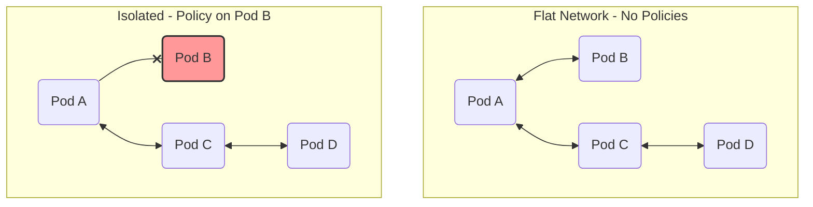
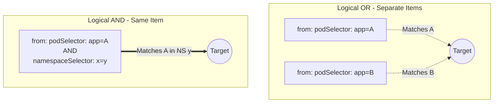
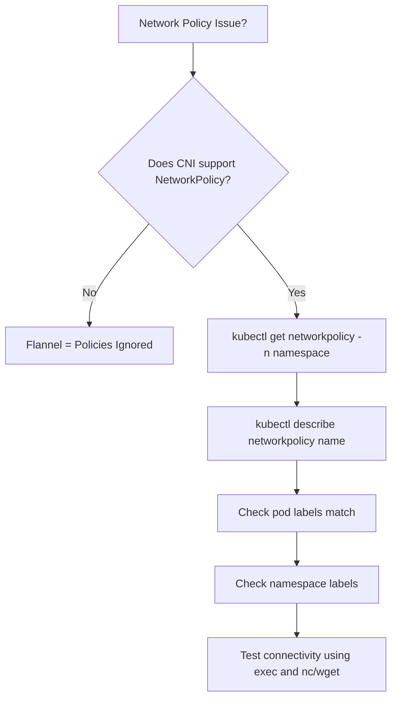

> **Complexity**: `[MEDIUM]` - Pod-level firewalling
>
> **Time to Complete**: 45-55 minutes
>
> **Prerequisites**: Module 3.1 (Services), Module 2.1 (Pods)

---

## Why This Module Matters

In 2019, a major financial institution suffered a catastrophic data breach exposing over 100 million customer records. The initial point of compromise was a simple, easily exploitable misconfiguration in a peripheral web application firewall. However, the true failure that allowed the devastating data exfiltration was the completely flat internal network architecture. The compromised external-facing workload was able to communicate freely with the cloud provider's highly sensitive internal metadata service, allowing the attacker to seamlessly extract privileged backend credentials. A robust default-deny network segmentation strategy can limit lateral movement and reduce the blast radius of a compromise.

In a default Kubernetes cluster, [every pod can communicate with every other pod without any restrictions](https://kubernetes.io/docs/concepts/services-networking/network-policies/). This flat network paradigm means that a vulnerability in an insignificant frontend deployment instantly compromises the security perimeter of your most critical backend databases. Network Policies serve as the critical internal firewalls for your cluster, allowing you to implement microsegmentation and dramatically reduce the potential blast radius of any security incident.

> **The Apartment Building Analogy**
>
> Imagine a Kubernetes cluster as an apartment building where every apartment door is unlocked. Any tenant can walk into any other apartment. Network Policies are like installing locks on doors and giving keys only to specific people. You decide who can enter (ingress) and where tenants can go (egress).

Because network isolation is an important Kubernetes administration skill, you should be able to rapidly author, evaluate, and troubleshoot NetworkPolicies under pressure.

---

## What You'll Be Able to Do

After completing this module, you will be able to:
- **Design** a comprehensive network segmentation strategy for multi-tier microservice architectures using declarative manifests.
- **Implement** rigorous default-deny policies that explicitly authorize only required ingress and egress communication paths.
- **Evaluate** the logical intersections (AND vs. OR) of pod and namespace selectors to ensure policies perfectly match intended traffic without exposing unintended paths.
- **Diagnose** blocked cluster connectivity by systematically analyzing CNI capabilities, namespace label structures, and hidden DNS egress requirements.
- **Compare** the asynchronous enforcement behavior of Kubernetes NetworkPolicies against the synchronous blocking of traditional perimeter firewalls.

---

## Did You Know?

- [Kubernetes version 1.35 will reach End-of-Life (EOL) on February 28, 2027](https://kubernetes.io/releases/), making it absolutely critical to memorize and utilize stable API groups like [`networking.k8s.io/v1` (stable since release 1.8), which fully replaced the deprecated `extensions/v1beta1` back in release 1.16](https://kubernetes.io/docs/reference/using-api/deprecation-guide/). Simply modifying the `apiVersion` field is usually sufficient for migration as the fundamental schema structure remained largely compatible.
- [The `endPort` field, a feature allowing administrators to specify a contiguous range of ports in a single policy rule, reached stable General Availability in Kubernetes release 1.25](https://kubernetes.io/docs/concepts/services-networking/network-policies/).
- A common NetworkPolicy debugging issue is forgetting DNS egress on port 53, which breaks service discovery when default-deny egress is deployed.
- [NetworkPolicies operate exclusively at OSI layers 3 and 4, meaning they filter strictly based on IP addresses and TCP/UDP/SCTP ports—they cannot perform layer 7 packet inspection to block specific HTTP paths or TLS Server Name Indications (SNI)](https://kubernetes.io/docs/concepts/services-networking/network-policies/).

---

## Part 1: Network Policy Fundamentals

NetworkPolicy is an application-centric layer 3 and layer 4 filtering mechanism that operates over pod, namespace, and IP-based peers. Rather than writing firewall rules based on ephemeral IP addresses that constantly shift as pods are rescheduled, you declare intent using robust Kubernetes labels. 



### 1.1 Core Terminology

Before analyzing YAML syntax, you must thoroughly understand the vocabulary the Kubernetes scheduler uses to evaluate network streams:

| Concept | Description |
|---------|-------------|
| **Ingress** | Traffic coming INTO the pod from another endpoint |
| **Egress** | Traffic going OUT from the pod to another endpoint |
| **podSelector** | The criteria defining which pods the policy applies to |
| **Isolated pods** | Pods actively selected by any NetworkPolicy |
| **Additive rules** | Multiple policies = union of all rules; there is no explicit deny |

### 1.2 Isolation Dimensions

Pods possess two entirely independent isolation dimensions: ingress and egress. By default, both dimensions are non-isolated, permitting unrestricted traffic. 

A pod becomes isolated for a specific direction only if it is explicitly selected by at least one policy that actively includes that direction in its `policyTypes` array. If a pod is ingress-isolated, the API server drops all inbound traffic unless a rule explicitly permits it. However, the pod's egress traffic remains completely unrestricted unless an egress policy also selects it.

```yaml
# This policy makes pods with app=web isolated for INGRESS
# (they can still make outbound connections)
apiVersion: networking.k8s.io/v1
kind: NetworkPolicy
metadata:
  name: isolate-ingress
spec:
  podSelector:
    matchLabels:
      app: web         # Selects these pods
  policyTypes:
  - Ingress            # Only ingress is affected
```

> **Pause and predict**: You create a NetworkPolicy that selects pods with label `app: web` but the policy has empty ingress rules (`ingress: []`). Can anything reach those pods? What if you had written `ingress: [{}]` instead -- how does that single pair of curly braces change everything?

---

## Part 2: The Default Behaviors and Deny Patterns

If a namespace currently has zero NetworkPolicy objects applied to it, all ingress and egress traffic is allowed to and from the pods residing within that namespace. To build a secure, zero-trust cluster, engineers often adopt a "default-deny" architectural pattern. 

[An empty podSelector (`{}`) inside the root of a NetworkPolicy effectively selects all pods within the namespace where the policy is deployed](https://kubernetes.io/docs/concepts/services-networking/network-policies/). Combining a namespace-wide empty podSelector with `policyTypes: [Ingress]` or `[Egress]` establishes a comprehensive default-deny baseline for that specific traffic direction.

Conversely, [if you define an empty array element `{}` directly inside the `ingress` or `egress` rules section, the API server interprets this as an explicit wildcard allowing all traffic for that direction](https://kubernetes.io/docs/concepts/services-networking/network-policies/). 

[If the `policyTypes` array is entirely omitted from your manifest, the API server automatically implies `Ingress`. `Egress` is only implied by the API server if an `egress` rules block is explicitly present in the YAML specification.](https://kubernetes.io/docs/concepts/services-networking/network-policies/)

### 2.1 Default Deny Patterns

To lock down incoming traffic across an entire namespace:
```yaml
# Deny all incoming traffic to pods in namespace
apiVersion: networking.k8s.io/v1
kind: NetworkPolicy
metadata:
  name: deny-all-ingress
  namespace: production
spec:
  podSelector: {}        # Empty = select ALL pods
  policyTypes:
  - Ingress              # No ingress rules = deny all ingress
```

To prevent any pod in the namespace from initiating outbound network connections:
```yaml
# Deny all outgoing traffic from pods in namespace
apiVersion: networking.k8s.io/v1
kind: NetworkPolicy
metadata:
  name: deny-all-egress
  namespace: production
spec:
  podSelector: {}        # All pods
  policyTypes:
  - Egress               # No egress rules = deny all egress
```

To establish a total zero-trust lockdown in both directions simultaneously:
```yaml
# Complete lockdown
apiVersion: networking.k8s.io/v1
kind: NetworkPolicy
metadata:
  name: deny-all
spec:
  podSelector: {}
  policyTypes:
  - Ingress
  - Egress
```

### 2.2 Explicit Allow All Patterns

Sometimes you need to quickly override a default-deny policy for debugging or temporary operational necessity. Placing `{}` inside the rule blocks accomplishes this:

```yaml
# Explicitly allow all ingress (useful to override deny policies)
apiVersion: networking.k8s.io/v1
kind: NetworkPolicy
metadata:
  name: allow-all-ingress
spec:
  podSelector: {}
  policyTypes:
  - Ingress
  ingress:
  - {}                   # Empty rule = allow all
```

```yaml
# Explicitly allow all egress
apiVersion: networking.k8s.io/v1
kind: NetworkPolicy
metadata:
  name: allow-all-egress
spec:
  podSelector: {}
  policyTypes:
  - Egress
  egress:
  - {}                   # Empty rule = allow all
```

---

## Part 3: Selective Policies and Rules

[NetworkPolicies strictly follow an additive evaluation model. This means the order in which policies are applied or evaluated does not change the resulting allow decision for a network connection.](https://kubernetes.io/docs/concepts/services-networking/network-policies/) In rule evaluation, the properties inside a `from`/`to` array and `ports` are processed using a logical AND within a single rule, and a logical OR across distinct entries. Empty `from`, `to`, or `ports` fields act as unrestricted wildcards.

NetworkPolicy filters are officially designated for TCP, UDP, and optionally SCTP. The behavior for other protocols, such as ICMP ping traffic, is entirely plugin-dependent and undefined by the Kubernetes standard.

### 3.1 Allowing Traffic From Specific Pods

You can narrowly target traffic sources using `podSelector`:

```yaml
# Allow traffic from pods with label app=frontend
apiVersion: networking.k8s.io/v1
kind: NetworkPolicy
metadata:
  name: allow-frontend
spec:
  podSelector:
    matchLabels:
      app: backend         # This policy applies to backend pods
  policyTypes:
  - Ingress
  ingress:
  - from:
    - podSelector:
        matchLabels:
          app: frontend    # Allow traffic from frontend pods
```

```mermaid
graph LR
    subgraph Allowed
        P1(Pod app: frontend) --✓--> P2(Pod app: backend)
    end
    subgraph Blocked
        P3(Pod app: other) --x--> P4(Pod app: backend)
    end
```

### 3.2 Namespace Selectors

You can authorize traffic originating from any pod residing within an entirely different namespace, provided that namespace carries the correct matching label.

```yaml
# Allow traffic from all pods in namespace "monitoring"
apiVersion: networking.k8s.io/v1
kind: NetworkPolicy
metadata:
  name: allow-monitoring
spec:
  podSelector:
    matchLabels:
      app: backend
  policyTypes:
  - Ingress
  ingress:
  - from:
    - namespaceSelector:
        matchLabels:
          name: monitoring    # Namespace must have this label
```

> **Important**: Namespaces need labels! Add them manually using:
> ```bash
> k label namespace monitoring name=monitoring
> ```

### 3.3 IP Block Constraints

The `ipBlock` selector utilizes exact CIDR ranges to authorize traffic external to the cluster or specific subnet ranges. It uniquely supports an `except` array to carve out restricted zones from a broader CIDR allowance. The Kubernetes API aggressively validates that any CIDR ranges listed in the `except` array must be strict subnets completely contained within the parent `cidr` range.

```yaml
# Allow traffic from specific IP ranges
apiVersion: networking.k8s.io/v1
kind: NetworkPolicy
metadata:
  name: allow-external
spec:
  podSelector:
    matchLabels:
      app: web
  policyTypes:
  - Ingress
  ingress:
  - from:
    - ipBlock:
        cidr: 192.168.1.0/24      # Allow this range
        except:
        - 192.168.1.100/32        # Except this IP
```

### 3.4 Port Specification

By combining an empty `podSelector` within an ingress rule alongside specific `ports`, you effectively authorize designated layer 4 traffic from anywhere in the cluster:

```yaml
# Allow HTTP and HTTPS only
apiVersion: networking.k8s.io/v1
kind: NetworkPolicy
metadata:
  name: allow-web-ports
spec:
  podSelector:
    matchLabels:
      app: web
  policyTypes:
  - Ingress
  ingress:
  - from:
    - podSelector: {}            # From any pod
    ports:
    - protocol: TCP
      port: 80
    - protocol: TCP
      port: 443
```

---

## Part 4: Advanced Scenarios and Caveats

> **Stop and think**: Look at the two YAML snippets below in section 4.1. One allows traffic from frontend pods OR from the monitoring namespace. The other allows traffic only from frontend pods that are IN the monitoring namespace. The only difference is indentation. Can you spot which is which before reading the explanation?

### 4.1 Logical AND vs Logical OR

One of the most dangerous syntactical mistakes a cluster administrator can make involves the indentation of selectors within the `from` array. [A single `from`/`to` entry that combines both a `namespaceSelector` and a `podSelector` acts as an intersection (AND). However, separate entries act as a disjunction (OR).](https://kubernetes.io/docs/concepts/services-networking/network-policies/)

```yaml
# OR logic: from frontend pods OR from monitoring namespace
ingress:
- from:
  - podSelector:
      matchLabels:
        app: frontend
- from:
  - namespaceSelector:
      matchLabels:
        name: monitoring
```

```yaml
# AND logic: from frontend pods IN monitoring namespace
ingress:
- from:
  - podSelector:
      matchLabels:
        app: frontend
    namespaceSelector:
      matchLabels:
        name: monitoring
```



### 4.2 Comprehensive Multi-Rule Evaluation

Examine this advanced policy that applies both logical combinations simultaneously alongside explicit egress tracking:

```yaml
apiVersion: networking.k8s.io/v1
kind: NetworkPolicy
metadata:
  name: complex-policy
spec:
  podSelector:
    matchLabels:
      app: api
  policyTypes:
  - Ingress
  - Egress
  ingress:
  # Rule 1: Allow from frontend in same namespace
  - from:
    - podSelector:
        matchLabels:
          app: frontend
    ports:
    - port: 8080
  # Rule 2: Allow from any pod in monitoring namespace
  - from:
    - namespaceSelector:
        matchLabels:
          name: monitoring
    ports:
    - port: 9090
  egress:
  # Rule 1: Allow to database pods
  - to:
    - podSelector:
        matchLabels:
          app: database
    ports:
    - port: 5432
  # Rule 2: Allow DNS
  - to:
    - namespaceSelector: {}
    ports:
    - port: 53
      protocol: UDP
    - port: 53
      protocol: TCP
```

A connection is mathematically permitted by the cluster only if both the source's egress policy and the destination's ingress policy strictly authorize the flow. If the API pod in the snippet above attempts to query the database, the connection will succeed only if the database pod has a reciprocal ingress policy accepting connections from the API tier.

### 4.3 Essential Egress Configurations

When constructing egress policies, failure to account for cluster infrastructure can quickly disrupt service operation.

```yaml
# Backend can only talk to database
apiVersion: networking.k8s.io/v1
kind: NetworkPolicy
metadata:
  name: backend-egress
spec:
  podSelector:
    matchLabels:
      app: backend
  policyTypes:
  - Egress
  egress:
  - to:
    - podSelector:
        matchLabels:
          app: database
    ports:
    - port: 5432
```

[A default-deny egress policy fundamentally breaks DNS lookups. Therefore, explicit DNS exceptions routing UDP and TCP traffic on port 53 to the `kube-system` namespace are mandatory for service discovery to remain operational.](https://kubernetes.io/docs/concepts/services-networking/network-policies/)

```yaml
# Allow DNS to kube-system
apiVersion: networking.k8s.io/v1
kind: NetworkPolicy
metadata:
  name: allow-dns
spec:
  podSelector: {}
  policyTypes:
  - Egress
  egress:
  - to:
    - namespaceSelector:
        matchLabels:
          kubernetes.io/metadata.name: kube-system
    ports:
    - port: 53
      protocol: UDP
    - port: 53
      protocol: TCP
```

> **What would happen if**: You apply a deny-all egress policy to your backend pods but forget to add a DNS exception. The pods can still reach the database pod by IP, but `curl db-service` fails. Why does direct IP access work but service name resolution does not?

To authorize traffic to endpoints outside the cluster entirely, [an `ipBlock` egress is utilized. Note that cluster IP rewriting (such as Source NAT transformations implemented by services) can make it unclear whether policy matching is evaluating the original packet IP versus rewritten IPs.](https://kubernetes.io/docs/concepts/services-networking/network-policies/)

```yaml
# Allow egress to external IPs
apiVersion: networking.k8s.io/v1
kind: NetworkPolicy
metadata:
  name: allow-external
spec:
  podSelector:
    matchLabels:
      app: web
  policyTypes:
  - Egress
  egress:
  - to:
    - ipBlock:
        cidr: 0.0.0.0/0        # All IPs
        except:
        - 10.0.0.0/8           # Except private ranges
        - 172.16.0.0/12
        - 192.168.0.0/16
```

---

## Part 5: Edge Cases and Limitations

NetworkPolicy resources are purely declarative configurations. [They are only actually effective if a cluster networking solution (CNI) actively implements NetworkPolicy enforcement](https://kubernetes.io/docs/concepts/services-networking/network-policies/). [If your cluster operates on a rudimentary CNI like basic Flannel, policies are silently accepted by the API but have zero enforcement effect](https://github.com/flannel-io/flannel).

Furthermore, [network policy handling is technically asynchronous. Policy creation or deletion may temporarily leave rapidly scaling or newly spawned pods unprotected for fractional seconds as rules propagate. The behavioral impact on long-running, established TCP connections when policies are suddenly modified mid-stream is entirely implementation-defined and varies across CNIs.](https://kubernetes.io/docs/concepts/services-networking/network-policies/)

Namespaces cannot be selected by plain names inside NetworkPolicy selectors. You must meticulously utilize namespace labels. Fortunately, modern clusters automatically tag namespaces with the immutable `kubernetes.io/metadata.name` label specifically to assist with targeting.

Using `endPort` in ingress or egress rules is stable since Kubernetes release 1.25 and enables matching against contiguous port ranges. However, [if an older or lightweight CNI plugin does not natively support `endPort`, the policy may fall back and evaluate strictly against the single start port provided.](https://kubernetes.io/docs/concepts/services-networking/network-policies/)

[NetworkPolicy behavior for pods executed with `hostNetwork: true` is highly implementation-defined. Most standard CNIs treat such workloads as node-level traffic, causing them to completely bypass pod-centric isolation constraints.](https://kubernetes.io/docs/concepts/services-networking/network-policies/) [As of version 1.35, the native NetworkPolicy specification still cannot express explicit deny actions, Service-name targeting, precise Node identity restrictions, TLS enforcement controls, or granular loopback blocking.](https://kubernetes.io/docs/concepts/services-networking/network-policies/) The Kubernetes maintainers track three active release branches (1.35, 1.34, 1.33); ensure you do not deploy unsupported beta manifests that face the February 2027 end-of-life deprecation cycles.

---

## Common Mistakes

| Mistake | Why | Fix |
|---------|-------|----------|
| Using unsupported CNI | Policies ignored by runtime | Deploy capable CNIs like Calico, Cilium, or Weave |
| Forgetting DNS egress | Pods can't resolve service names | Explicitly append port 53 UDP/TCP egress rules pointing to kube-system |
| Unlabeled namespaces | namespaceSelector quietly fails | Ensure namespace is labeled or rely on `kubernetes.io/metadata.name` |
| Wrong selector logic | Unintended permissive/restrictive posture | Meticulously verify indentation for AND vs OR (same array item vs separate items) |
| Empty ingress array | Completely blocks all ingress traffic | Utilize `ingress: [{}]` to define an explicit wildcard allowance |
| Missing policyTypes | Unpredictable isolation dimensions | Explicitly declare the relevant `policyTypes` and corresponding rule arrays within the specification |
| Targeting hostNetwork | Policy evasion by container | Avert reliance on NetworkPolicy isolation for pods heavily integrating with the host namespace |

---

## Debugging Workflow



When evaluating broken cluster connectivity, leverage the standard toolchain:

```bash
# List network policies
k get networkpolicy
k get netpol                 # Short form

# Describe policy
k describe networkpolicy <name>

# Check pod labels
k get pods --show-labels

# Check namespace labels
k get namespaces --show-labels

# Test connectivity
k exec <pod> -- nc -zv target-service 80
k exec <pod> -- wget --spider --timeout=1 http://target-service
k exec <pod> -- curl -s --max-time 1 http://target-service
```

| Symptom | Cause | Solution |
|---------|-------|----------|
| Policy not enforced | CNI doesn't support | Use Calico, Cilium, or Weave |
| Can't resolve DNS | DNS egress blocked | Add egress rule for port 53 |
| Cross-namespace blocked | namespaceSelector wrong | Label namespaces, check selector |
| All traffic blocked | Empty podSelector in deny | Create allow rules for needed traffic |
| Pods can still communicate | Labels don't match | Verify podSelector matches pod labels |

---

## Common Patterns Reference

### Database Protection Architecture
```yaml
# Only allow backend pods to access database
apiVersion: networking.k8s.io/v1
kind: NetworkPolicy
metadata:
  name: db-protection
  namespace: production
spec:
  podSelector:
    matchLabels:
      app: database
  policyTypes:
  - Ingress
  ingress:
  - from:
    - podSelector:
        matchLabels:
          app: backend
    ports:
    - port: 5432
```

### Three-Tier Application Segregation

```yaml
# Web tier - only from ingress controller
apiVersion: networking.k8s.io/v1
kind: NetworkPolicy
metadata:
  name: web-policy
spec:
  podSelector:
    matchLabels:
      tier: web
  ingress:
  - from:
    - namespaceSelector:
        matchLabels:
          name: ingress-nginx
  policyTypes:
  - Ingress
```
```yaml
# App tier - only from web tier
apiVersion: networking.k8s.io/v1
kind: NetworkPolicy
metadata:
  name: app-policy
spec:
  podSelector:
    matchLabels:
      tier: app
  ingress:
  - from:
    - podSelector:
        matchLabels:
          tier: web
  policyTypes:
  - Ingress
```
```yaml
# DB tier - only from app tier
apiVersion: networking.k8s.io/v1
kind: NetworkPolicy
metadata:
  name: db-policy
spec:
  podSelector:
    matchLabels:
      tier: db
  ingress:
  - from:
    - podSelector:
        matchLabels:
          tier: app
    ports:
    - port: 5432
  policyTypes:
  - Ingress
```

### Comprehensive Namespace Isolation
```yaml
# Default deny all, then allow within namespace only
apiVersion: networking.k8s.io/v1
kind: NetworkPolicy
metadata:
  name: namespace-isolation
spec:
  podSelector: {}
  policyTypes:
  - Ingress
  - Egress
  ingress:
  - from:
    - podSelector: {}      # Same namespace only
  egress:
  - to:
    - podSelector: {}      # Same namespace only
  - to:                    # Plus DNS
    - namespaceSelector: {}
    ports:
    - port: 53
      protocol: UDP
```

---

## Quiz

1. **Your security team wants to lock down a production namespace so that no pod can receive traffic unless explicitly allowed. You apply a deny-all ingress policy, but the monitoring team reports their Prometheus scraper can still reach pods. What could explain this?**
   <details>
   <summary>Answer</summary>
   The most likely cause is that the CNI plugin does not support NetworkPolicy enforcement. If the cluster uses Flannel (which does not implement NetworkPolicy), the policy is accepted by the API server but never enforced -- traffic flows freely regardless. Verify with `k get pods -n kube-system | grep -E "calico|cilium|weave"`. If using an unsupported CNI, you must switch to Calico, Cilium, or Weave for policy enforcement. Another possibility: the Prometheus scraper runs with `hostNetwork: true`, and some CNI implementations do not enforce policies on host-networked pods.
   </details>

2. **You write a NetworkPolicy to allow your backend pods to talk only to the database. It works, but now the backend pods cannot resolve DNS names -- `curl db-service` fails while `curl 10.244.2.5` (the DB pod IP) works fine. What did you forget, and how do you fix it without opening up all egress?**
   <details>
   <summary>Answer</summary>
   The egress policy blocked DNS traffic (UDP/TCP port 53) to CoreDNS. Service name resolution requires the pod to send a DNS query to CoreDNS in kube-system, which the egress policy blocks. Add a DNS egress rule: allow egress to port 53 (both UDP and TCP) targeting the kube-system namespace with `namespaceSelector: {matchLabels: {kubernetes.io/metadata.name: kube-system}}`. This is the most common NetworkPolicy mistake -- any time you restrict egress, you must explicitly allow DNS or service discovery breaks.
   </details>

3. **A colleague writes this NetworkPolicy and claims it allows traffic from frontend pods in the monitoring namespace only. But in testing, ALL pods in the monitoring namespace can reach the backend. Find the bug.**
   ```yaml
   ingress:
   - from:
     - podSelector:
         matchLabels:
           app: frontend
     - namespaceSelector:
         matchLabels:
           name: monitoring
   ```
   <details>
   <summary>Answer</summary>
   The bug is the OR vs AND logic. The two selectors are separate list items (note the two dashes under `from:`), which means OR: allow from pods with `app=frontend` (in any namespace) OR from any pod in the `monitoring` namespace. To make it AND (only frontend pods IN monitoring), combine them in a single list item by removing the second dash: `- podSelector: {matchLabels: {app: frontend}} \n   namespaceSelector: {matchLabels: {name: monitoring}}`. This single-character indentation difference is one of the most common and dangerous NetworkPolicy mistakes.
   </details>

4. **You are designing network policies for a three-tier app: web (receives external traffic), app (receives from web only), and database (receives from app only on port 5432). The web tier also needs to call an external payment API. Describe the policies you would create and in what order.**
   <details>
   <summary>Answer</summary>
   First, create a default-deny ingress policy for the namespace (`podSelector: {}`, no ingress rules). Then create three allow policies: (1) Web tier: allow ingress from the ingress controller's namespace using a `namespaceSelector`. (2) App tier: allow ingress from pods with `tier: web` on the app port using `podSelector`. (3) Database tier: allow ingress only from pods with `tier: app` on port 5432. For the web tier's external API access, add an egress policy allowing egress to the payment API's IP block using `ipBlock.cidr`, plus mandatory DNS egress to kube-system. Order matters: apply the deny-all first, then the allow policies, to prevent temporary unauthenticated exposure.
   </details>

5. **After applying NetworkPolicies, a developer reports that inter-pod communication works in the `staging` namespace but the same policies fail in `production`. The policies use `namespaceSelector` with `matchLabels: {env: production}`. What is the likely issue?**
   <details>
   <summary>Answer</summary>
   The `production` namespace likely does not possess the custom label `env: production`. Unlike pods, which inherit templates directly from their parent Deployments, namespaces must be manually labeled by administrators upon creation. Kubernetes does not retroactively tag legacy namespaces with arbitrary custom identifiers. Run `k get namespace production --show-labels` to verify. You can easily fix the configuration by executing `k label namespace production env=production`.
   </details>

6. **Scenario: You are migrating a legacy deployment from Kubernetes release 1.16 to Kubernetes 1.35. The developers applied a NetworkPolicy manifest containing `apiVersion: extensions/v1beta1`, but the API server rejects it entirely. How do you resolve this, and what is the underlying issue?**
   <details>
   <summary>Answer</summary>
   The `extensions/v1beta1` API version for NetworkPolicy was fully deprecated and removed from the API server long before Kubernetes release 1.35. You must update the manifest to use `apiVersion: networking.k8s.io/v1`. This standard API group has been available and stable since release 1.8. Simply modifying the `apiVersion` field is usually sufficient as the fundamental schema structure for basic policies remained largely compatible across the transition.
   </details>

7. **Scenario: You have a policy with an `ipBlock` allowing `192.168.0.0/16` but an `except` array containing `10.0.0.0/24`. When you attempt to apply the policy, the API server throws a validation error. Why is this configuration invalid?**
   <details>
   <summary>Answer</summary>
   The Kubernetes API aggressively validates that any CIDR ranges listed in the `except` array must be strict subnets completely contained within the parent `cidr` range. Because `10.0.0.0/24` falls entirely outside the `192.168.0.0/16` block, the policy violates this fundamental mathematical ipBlock constraint. To fix this, you must either remove the invalid exception or create separate rule blocks for the distinct IP ranges.
   </details>

---

## Hands-On Exercise

**Task**: Implement resilient network policies for a three-tier application to prevent unauthorized lateral movement.

**Steps**:

1. **Create test pods**:
```bash
# Create pods with different roles
k run frontend --image=nginx --labels="tier=frontend"
k run backend --image=nginx --labels="tier=backend"
k run database --image=nginx --labels="tier=database"

# Wait for pods to be ready
k wait --for=condition=ready pod/frontend pod/backend pod/database --timeout=60s
```

2. **Verify default connectivity** (everything should currently function in the flat network):
```bash
BACKEND_IP=$(k get pod backend -o jsonpath='{.status.podIP}')
k exec frontend -- wget --spider --timeout=1 http://$BACKEND_IP
# Should succeed
```

3. **Create an immediate deny-all policy**:
```bash
cat << 'EOF' | k apply -f -
apiVersion: networking.k8s.io/v1
kind: NetworkPolicy
metadata:
  name: deny-all
spec:
  podSelector: {}
  policyTypes:
  - Ingress
EOF
```

4. **Test connectivity** (should instantly fail if your CNI supports policy enforcement):
```bash
k exec frontend -- wget --spider --timeout=1 http://$BACKEND_IP
# Should timeout (if CNI supports NetworkPolicy)
```

5. **Allow the frontend tier to securely connect to the backend tier**:
```bash
cat << 'EOF' | k apply -f -
apiVersion: networking.k8s.io/v1
kind: NetworkPolicy
metadata:
  name: allow-frontend-to-backend
spec:
  podSelector:
    matchLabels:
      tier: backend
  policyTypes:
  - Ingress
  ingress:
  - from:
    - podSelector:
        matchLabels:
          tier: frontend
    ports:
    - port: 80
EOF
```

6. **Test the newly allowed connection**:
```bash
k exec frontend -- wget --spider --timeout=1 http://$BACKEND_IP
# Should succeed now

# But database to backend should still fail
DATABASE_IP=$(k get pod database -o jsonpath='{.status.podIP}')
k exec database -- wget --spider --timeout=1 http://$BACKEND_IP
# Should fail
```

7. **Allow the backend tier to securely authenticate with the database tier**:
```bash
cat << 'EOF' | k apply -f -
apiVersion: networking.k8s.io/v1
kind: NetworkPolicy
metadata:
  name: allow-backend-to-database
spec:
  podSelector:
    matchLabels:
      tier: database
  policyTypes:
  - Ingress
  ingress:
  - from:
    - podSelector:
        matchLabels:
          tier: backend
    ports:
    - port: 80
EOF
```

8. **Review active enforcement policies**:
```bash
k get networkpolicy
k describe networkpolicy
```

9. **Teardown and cluster sanitation**:
```bash
k delete networkpolicy deny-all allow-frontend-to-backend allow-backend-to-database
k delete pod frontend backend database --force
```

**Success Criteria**:
- [ ] Understand default-allow behavior without policies present
- [ ] Can efficiently author and implement deny-all architecture policies
- [ ] Can explicitly construct selective, surgical allow policies for tier-to-tier isolation
- [ ] Demonstrate mastery of strict pod selector matching algorithms
- [ ] Possess the ability to actively debug and diagnose overlapping policy constraints

---

## Practice Drills

### Drill 1: Deny All Ingress (Target: 2 minutes)

```bash
# Create pod
k run test-pod --image=nginx --labels="app=test"

# Create deny-all ingress
cat << 'EOF' | k apply -f -
apiVersion: networking.k8s.io/v1
kind: NetworkPolicy
metadata:
  name: deny-ingress
spec:
  podSelector:
    matchLabels:
      app: test
  policyTypes:
  - Ingress
EOF

# Verify
k describe networkpolicy deny-ingress

# Cleanup
k delete networkpolicy deny-ingress
k delete pod test-pod --force
```

### Drill 2: Allow from Specific Pod (Target: 3 minutes)

```bash
# Create pods
k run server --image=nginx --labels="role=server"
k run client --image=nginx --labels="role=client"
k run other --image=nginx --labels="role=other"

# Create policy allowing only client
cat << 'EOF' | k apply -f -
apiVersion: networking.k8s.io/v1
kind: NetworkPolicy
metadata:
  name: allow-client
spec:
  podSelector:
    matchLabels:
      role: server
  policyTypes:
  - Ingress
  ingress:
  - from:
    - podSelector:
        matchLabels:
          role: client
    ports:
    - port: 80
EOF

# Verify policy
k describe networkpolicy allow-client

# Cleanup
k delete networkpolicy allow-client
k delete pod server client other --force
```

### Drill 3: Allow from Namespace (Target: 4 minutes)

```bash
# Create namespace with label
k create namespace allowed
k label namespace allowed name=allowed

# Create pods
k run target --image=nginx --labels="app=target"
k run source --image=nginx -n allowed

# Create policy
cat << 'EOF' | k apply -f -
apiVersion: networking.k8s.io/v1
kind: NetworkPolicy
metadata:
  name: allow-namespace
spec:
  podSelector:
    matchLabels:
      app: target
  policyTypes:
  - Ingress
  ingress:
  - from:
    - namespaceSelector:
        matchLabels:
          name: allowed
EOF

# Verify
k describe networkpolicy allow-namespace

# Cleanup
k delete networkpolicy allow-namespace
k delete pod target --force
k delete namespace allowed
```

### Drill 4: Egress with DNS (Target: 4 minutes)

```bash
# Create pod
k run egress-test --image=nginx --labels="app=egress"

# Create egress policy with DNS
cat << 'EOF' | k apply -f -
apiVersion: networking.k8s.io/v1
kind: NetworkPolicy
metadata:
  name: egress-dns
spec:
  podSelector:
    matchLabels:
      app: egress
  policyTypes:
  - Egress
  egress:
  # Allow DNS
  - to:
    - namespaceSelector: {}
    ports:
    - port: 53
      protocol: UDP
    - port: 53
      protocol: TCP
  # Allow HTTPS
  - to: []
    ports:
    - port: 443
EOF

# Verify
k describe networkpolicy egress-dns

# Cleanup
k delete networkpolicy egress-dns
k delete pod egress-test --force
```

### Drill 5: Port-Specific Ingress (Target: 3 minutes)

```bash
# Create pod
k run web --image=nginx --labels="app=web"

# Allow only ports 80 and 443
cat << 'EOF' | k apply -f -
apiVersion: networking.k8s.io/v1
kind: NetworkPolicy
metadata:
  name: web-ports
spec:
  podSelector:
    matchLabels:
      app: web
  policyTypes:
  - Ingress
  ingress:
  - ports:
    - port: 80
      protocol: TCP
    - port: 443
      protocol: TCP
EOF

# Verify
k describe networkpolicy web-ports

# Cleanup
k delete networkpolicy web-ports
k delete pod web --force
```

### Drill 6: IP Block Policy (Target: 3 minutes)

```bash
# Create pod
k run ip-test --image=nginx --labels="app=ip-test"

# Create policy with IP block
cat << 'EOF' | k apply -f -
apiVersion: networking.k8s.io/v1
kind: NetworkPolicy
metadata:
  name: ip-block
spec:
  podSelector:
    matchLabels:
      app: ip-test
  policyTypes:
  - Ingress
  ingress:
  - from:
    - ipBlock:
        cidr: 10.0.0.0/8
        except:
        - 10.0.1.0/24
EOF

# Verify
k describe networkpolicy ip-block

# Cleanup
k delete networkpolicy ip-block
k delete pod ip-test --force
```

### Drill 7: Combined AND Selector (Target: 4 minutes)

```bash
# Create namespace
k create namespace restricted
k label namespace restricted name=restricted

# Create pod
k run secure --image=nginx --labels="app=secure"

# Create policy with AND logic
cat << 'EOF' | k apply -f -
apiVersion: networking.k8s.io/v1
kind: NetworkPolicy
metadata:
  name: and-policy
spec:
  podSelector:
    matchLabels:
      app: secure
  policyTypes:
  - Ingress
  ingress:
  - from:
    # AND: must be frontend pod IN restricted namespace
    - podSelector:
        matchLabels:
          role: frontend
      namespaceSelector:
        matchLabels:
          name: restricted
EOF

# Verify
k describe networkpolicy and-policy

# Cleanup
k delete networkpolicy and-policy
k delete pod secure --force
k delete namespace restricted
```

### Drill 8: Challenge - Complete Network Isolation

Without looking at the provided solutions:

1. Create a specialized target namespace `secure` labeled exclusively with `zone=secure`.
2. Construct two operational application pods: `app` (label: tier=app), `db` (label: tier=db).
3. Architect and deploy a robust deny-all ingress isolation policy for the environment.
4. Surgically authorize the `app` instance to securely receive external traffic from any pod actively running within the cluster.
5. Authorize the `db` instance to explicitly accept connection requests solely originating from internal `app` instances on port 5432.
6. Verify and audit policy logic extensively with `kubectl describe`.
7. Conclude the scenario via comprehensive resource cleanup.

```bash
# YOUR TASK: Complete in under 7 minutes
```

<details>
<summary>Solution</summary>

```bash
# 1. Create namespace
k create namespace secure
k label namespace secure zone=secure

# 2. Create pods
k run app -n secure --image=nginx --labels="tier=app"
k run db -n secure --image=nginx --labels="tier=db"

# 3. Deny all ingress
cat << 'EOF' | k apply -f -
apiVersion: networking.k8s.io/v1
kind: NetworkPolicy
metadata:
  name: deny-all
  namespace: secure
spec:
  podSelector: {}
  policyTypes:
  - Ingress
EOF

# 4. Allow app from anywhere
cat << 'EOF' | k apply -f -
apiVersion: networking.k8s.io/v1
kind: NetworkPolicy
metadata:
  name: allow-app
  namespace: secure
spec:
  podSelector:
    matchLabels:
      tier: app
  policyTypes:
  - Ingress
  ingress:
  - from:
    - namespaceSelector: {}
EOF

# 5. Allow db from app only
cat << 'EOF' | k apply -f -
apiVersion: networking.k8s.io/v1
kind: NetworkPolicy
metadata:
  name: allow-db
  namespace: secure
spec:
  podSelector:
    matchLabels:
      tier: db
  policyTypes:
  - Ingress
  ingress:
  - from:
    - podSelector:
        matchLabels:
          tier: app
    ports:
    - port: 5432
EOF

# 6. Verify
k get networkpolicy -n secure
k describe networkpolicy -n secure

# 7. Cleanup
k delete namespace secure
```

</details>

---

## Next Module

[Module 3.7: CNI & Cluster Networking](../module-3.7-cni/) - Take your knowledge of Network Policies to the next tier by tearing down the abstraction layer and discovering how different Container Network Interfaces physically manipulate IP tables and eBPF filters to implement these logical configurations under the hood.

## Sources

- [Kubernetes Releases](https://kubernetes.io/releases/) — Official branch and support schedule for current Kubernetes releases.
- [Deprecated API Migration Guide](https://kubernetes.io/docs/reference/using-api/deprecation-guide/) — Official migration guidance for removed and replacement API versions, including NetworkPolicy.
- [Network Policies](https://kubernetes.io/docs/concepts/services-networking/network-policies/) — Canonical reference for isolation defaults, selector semantics, DNS caveats, endPort behavior, and key limitations.
- [Flannel](https://github.com/flannel-io/flannel) — Project documentation describing Flannel's networking scope and how policy enforcement is commonly paired with other components.
- [Declare Network Policy](https://kubernetes.io/docs/tasks/administer-cluster/declare-network-policy/) — Worked examples for default-deny and selective allow manifests.
- [DNS for Services and Pods](https://kubernetes.io/docs/concepts/services-networking/dns-pod-service/) — Explains cluster DNS behavior that breaks when egress rules omit DNS.
