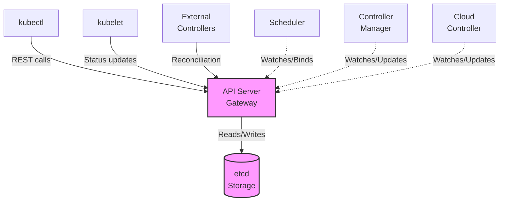
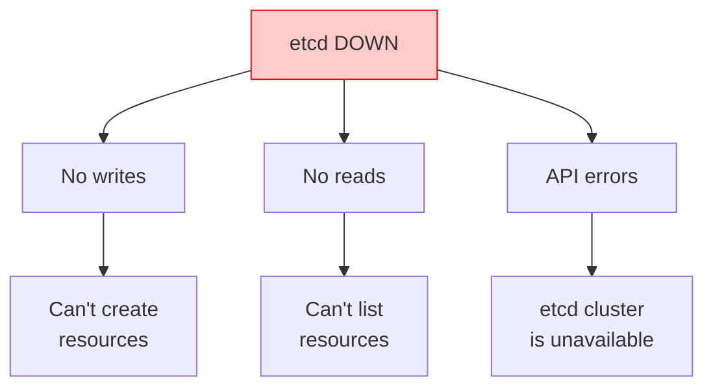
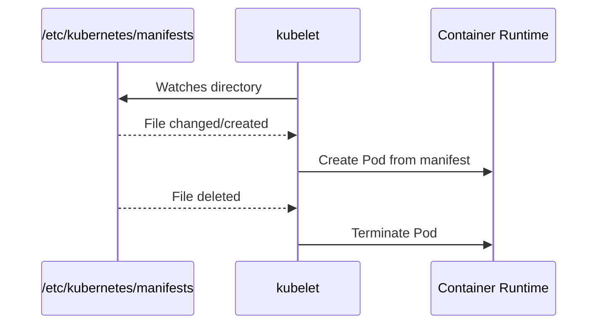

> **Complexity**: `[COMPLEX]` - Critical infrastructure troubleshooting
>
> **Time to Complete**: 50-60 minutes
>
> **Prerequisites**: Module 5.1 (Methodology), Module 1.1 (Control Plane Deep-Dive)

---

## What You'll Be Able to Do

After completing this extensive module, you will transition from basic application-layer debugging to advanced cluster rescue operations. By mastering the internals of the Kubernetes management architecture, you will be able to:

- **Diagnose** complex control plane failures by methodically cross-referencing static pod manifests, container runtime events, and low-level kubelet logs.
- **Implement** rapid and safe restorative actions for critical core components, including mitigating etcd quorum loss, recovering from API server certificate expiration, and resolving scheduler crashes.
- **Evaluate** the systemic impact of specific component failures to rapidly isolate the root cause of cluster-wide freezes and network partitions.
- **Design** robust, safe troubleshooting workflows that preserve crucial forensic evidence while systematically returning the broken cluster to a healthy state.

---

## Why This Module Matters

When the control plane fails, your entire platform teeters on the edge of catastrophe. The Kubernetes control plane is the central nervous system of your infrastructure. The API server going down means you have zero visibility and zero control over the cluster. The scheduler failing means auto-scaling is dead in the water, stranding new workloads indefinitely. The controller manager crashing means automated self-healing mechanisms simply cease to exist. These are the most critical, high-pressure incidents an infrastructure engineer will face, and the mean time to recovery directly impacts business survival.

Consider the highly publicized outage of Ericsson in December 2018. During a critical operational window, their primary infrastructure nodes went entirely dark, causing millions of cellular network users across multiple countries to lose service simultaneously. The core scheduling and routing mechanisms failed to deploy necessary workloads, and the engineering teams lost critical diagnostic access. The root cause? A fundamental control plane certificate had quietly expired. This single failure caused immense reputational damage and resulted in hundreds of millions of dollars in SLA penalties over the course of a massive day-long recovery window.

If the infrastructure engineers had maintained rigorous observability over their static pod manifests and had known how to rapidly bypass the defunct API gateway to manually verify static pod logs using `crictl`, the initial downtime could have been restricted to fifteen minutes. Furthermore, understanding how to immediately renew internal certificates via `kubeadm` would have mitigated the cascading failure entirely. Mastery of control plane troubleshooting separates novice operators from true Kubernetes experts who can confidently navigate a total system blackout.

> **The Air Traffic Control Analogy**
>
> The control plane is exactly like air traffic control for your cluster. The API server is the central radio tower; if it goes down, absolutely no communication occurs between pilots and ground crew. The scheduler is the flight planner; without it, new flights (pods) cannot be assigned a runway and remain stranded at the gate forever. The controller manager is the automated monitoring system; it ensures all planes follow their assigned routes and handles emergencies. Finally, etcd is the authoritative flight record database; if it corrupts, the entire airport forgets what planes even exist. When any of these systems fail, you must act decisively and accurately.

---

## Did You Know?

- **Kubernetes Version Strategy:** The current stable Kubernetes version is 1.35, with an EOL scheduled for February 2027. Troubleshooting commands must strictly align with modern APIs.
- **Certificate Default Lifespans:** Control plane client certificates generated by `kubeadm` (non-CA) strictly expire after exactly 1 year by default, while the Root CA certificates expire after 10 years.
- **Port Allocations:** The `kube-apiserver` listens on TCP port 6443 by default, while `etcd` strictly utilizes TCP port 2379 for client API traffic and TCP port 2380 for internal peer-to-peer cluster communication.
- **API Deprecations:** The `v1 ComponentStatus` API, often checked via the legacy `kubectl get cs` command, was formally deprecated in Kubernetes v1.19. Relying on it for health checks in v1.35 clusters will yield deprecation warnings.
- **Data Capacity Limits:** A single etcd database cluster defaults to a maximum storage space quota of 2 gigabytes; if this limit is breached without compaction, the entire cluster enters a read-only state.

---

## Part 1: Control Plane Architecture Review

To effectively troubleshoot a broken cluster, you must first deeply understand the architectural flow, component relationships, and rigid dependencies that make up the Kubernetes control plane.

### 1.1 Component Dependencies

The control plane is not a monolith; it is a collection of highly interdependent microservices that work together to maintain cluster state. The `kube-apiserver` acts as the sole gateway for the entire system. No other component, user, or service speaks directly to the database layer (`etcd`). This deliberate bottleneck ensures strict authorization, validation, and admission control.

In modern cloud-integrated clusters, you will also encounter the `cloud-controller-manager`. This component was separated from the `kube-controller-manager` to allow cloud providers to release integration features independently from the core Kubernetes release cycle. It runs cloud-specific reconciliation loops for Node and LoadBalancer resources.

Here is the dynamic architectural flow:



For reference when viewing legacy terminal documentation or examining text-based logs, this relationship is often mapped conceptually as follows:

```text
┌──────────────────────────────────────────────────────────────┐
│                 CONTROL PLANE DEPENDENCIES                    │
│                                                               │
│                      ┌─────────────┐                         │
│                      │    etcd     │                         │
│                      │  (storage)  │                         │
│                      └──────┬──────┘                         │
│                             │                                │
│                             ▼                                │
│                      ┌─────────────┐                         │
│                      │ API Server  │◄──── kubectl            │
│                      │  (gateway)  │◄──── kubelet            │
│                      └──────┬──────┘◄──── controllers        │
│                             │                                │
│              ┌──────────────┼──────────────┐                 │
│              │              │              │                 │
│              ▼              ▼              ▼                 │
│       ┌───────────┐  ┌───────────┐  ┌───────────┐           │
│       │ Scheduler │  │ Controller│  │   Cloud   │           │
│       │           │  │  Manager  │  │ Controller│           │
│       └───────────┘  └───────────┘  └───────────┘           │
│                                                               │
│   If etcd fails     → Everything fails                       │
│   If API server     → Nothing can communicate                │
│   If scheduler      → New pods won't be scheduled            │
│   If controller-mgr → Resources won't reconcile              │
│                                                               │
└──────────────────────────────────────────────────────────────┘
```

### 1.2 Static Pods Overview

In standard `kubeadm` deployments, the core control plane components are not deployed as standard Kubernetes Deployments or DaemonSets. Instead, they are deployed as static pods. The local `kubelet` daemon on the control plane node constantly monitors a specific directory on the host machine. If a manifest file is placed in this directory, the `kubelet` bypasses the API server and instructs the local container runtime to launch the pod immediately.

```bash
# Static pod manifest location
/etc/kubernetes/manifests/
├── etcd.yaml
├── kube-apiserver.yaml
├── kube-controller-manager.yaml
└── kube-scheduler.yaml

# kubelet watches this directory
# Changes to these files = automatic restart of component
```

### 1.3 Baseline Health Verification

Before diving blindly into dense log files, always check the high-level status of the control plane to establish a baseline. Note that while the `componentstatuses` endpoint is deprecated, it is still occasionally used in older tutorials for rapid triage.

```bash
# Quick health check (deprecated but useful)
k get componentstatuses

# Check control plane pods
k -n kube-system get pods | grep -E 'etcd|api|controller|scheduler'

# Verify all components are running
k -n kube-system get pods -o wide | grep -E 'kube-'
```

---

## Part 2: API Server Troubleshooting

The API server is the beating heart of the cluster. It validates and configures data for the API objects, which include pods, services, and replication controllers. If it fails, the `kubectl` CLI utility becomes entirely useless, and you must rely on fundamental node-level tools like `crictl` and `journalctl`.

### 2.1 Failure Symptoms

When the API server experiences degradation or complete failure, the symptoms are immediate, severe, and cluster-wide.

```text
┌──────────────────────────────────────────────────────────────┐
│                API SERVER FAILURE SYMPTOMS                    │
│                                                               │
│   Symptom                        Indicates                    │
│   ─────────────────────────────────────────────────────────  │
│   kubectl hangs/times out        API server unreachable       │
│   "connection refused"           API server not listening     │
│   "unable to connect to server"  Network/firewall issue       │
│   "Unauthorized"                 Auth/cert issue              │
│   "etcd cluster is unavailable"  API can't reach etcd         │
│   Very slow responses            Overloaded or etcd slow      │
│                                                               │
└──────────────────────────────────────────────────────────────┘
```

> **Stop and think**: If your API server is down, how will you find out *why* it is down if you cannot run `kubectl logs`? You must SSH into the control plane node and use the container runtime interface.

### 2.2 Diagnosing Issues at the Node Level

Because standard API queries will fail when the gateway is down, you must shift your diagnostic strategy to the underlying infrastructure.

**Step 1: Check if the API server container is running**
Using `crictl` allows you to communicate directly with the local container runtime (like containerd or CRI-O).
```bash
# From a control plane node
crictl ps | grep kube-apiserver

# Or check static pod status
ls -la /etc/kubernetes/manifests/kube-apiserver.yaml
```

If it is not present in the active list, check if it recently crashed:
```bash
crictl ps -a | grep kube-apiserver  # See if it exists but stopped
journalctl -u kubelet | grep apiserver  # Check kubelet logs
```

**Step 2: Inspecting the logs natively**
```bash
# If running as pod
k -n kube-system logs kube-apiserver-<node>

# If pod is down, use crictl
crictl logs $(crictl ps -a | grep apiserver | awk '{print $1}')

# Or check kubelet logs for why it's not starting
journalctl -u kubelet | grep apiserver
```

Sometimes, `crictl` will show you multiple stopped containers due to a crash loop. Just grab the latest one:
```bash
crictl ps | grep kube-apiserver
```

**Step 3: Validating Cryptographic Health**
Cryptographic health is the foundation of control plane trust. Because every component communicates over mutually authenticated TLS, a single expired certificate immediately severs communication. Control plane certificates managed by `kubeadm` do NOT auto-renew automatically unless you perform a cluster upgrade. You must learn to manually inspect these X.509 certificates.
```bash
# Verify certificates
openssl x509 -in /etc/kubernetes/pki/apiserver.crt -text -noout | grep -A 2 "Validity"

# Check if certs are expired
kubeadm certs check-expiration
```

### 2.3 Remediation Workflows

Here is a mapping of common API server issues and their respective fixes. Understanding these mappings allows for rapid intervention during an active incident.

| Issue | Symptom | Fix |
|-------|---------|-----|
| Certificate expired | "x509: certificate has expired" | `kubeadm certs renew all` |
| etcd unreachable | "etcd cluster is unavailable" | Check etcd health, fix etcd |
| Wrong etcd endpoints | Startup failure | Check `--etcd-servers` in manifest |
| Port conflict | "bind: address already in use" | Find and kill conflicting process |
| Out of memory | OOMKilled, slow responses | Increase node resources |
| Incorrect flags | Won't start | Check manifest YAML syntax |

If certificates have expired (a frequent issue exactly one year after bootstrapping), the remediation is straightforward:
```bash
# Check certificate status
kubeadm certs check-expiration

# Renew all certificates
kubeadm certs renew all

# Restart control plane pods
# kubelet automatically restarts static pods when manifests change
```

If the manifest configuration is damaged due to human error, you must edit it directly. The local `kubelet` will instantly notice the file hash change and restart the container seamlessly.
```bash
# Edit static pod manifest
sudo vim /etc/kubernetes/manifests/kube-apiserver.yaml

# Common fixes:
# - Fix typos in flags
# - Correct certificate paths
# - Fix etcd endpoints

# kubelet automatically detects changes and restarts the pod
```

---

## Part 3: Scheduler Troubleshooting

The `kube-scheduler` operates on a continuous loop, watching for newly created Pods that have no `nodeName` assigned. Its only job is finding a suitable home for these incoming workloads through a two-phase process: Filtering (finding capable nodes) and Scoring (ranking the best capable node). When the scheduler breaks, your existing infrastructure hums along perfectly, but scaling up or deploying new applications becomes completely impossible.

### 3.1 Failure Symptoms

```text
┌──────────────────────────────────────────────────────────────┐
│               SCHEDULER FAILURE SYMPTOMS                      │
│                                                               │
│   Symptom                           Check                     │
│   ─────────────────────────────────────────────────────────  │
│   All new pods stuck Pending        Scheduler not running     │
│   "no nodes available to schedule"  All nodes unschedulable   │
│   Pods not being distributed        Scheduler misconfigured   │
│   Very slow scheduling              Scheduler overloaded      │
│                                                               │
│   Remember: Existing pods keep running when scheduler fails!  │
│   Only NEW pods are affected.                                 │
│                                                               │
└──────────────────────────────────────────────────────────────┘
```

### 3.2 Diagnosing Placement Issues

You can often trace scheduling logic and discover the root cause by closely examining cluster events. The scheduler is highly verbose when it fails to find a suitable node.
```bash
# Check scheduler pod status
k -n kube-system get pod -l component=kube-scheduler

# Check scheduler logs
k -n kube-system logs kube-scheduler-<node>

# Check for scheduling events
k get events -A --field-selector reason=FailedScheduling

# Describe pending pod for scheduling failure reason
k describe pod <pending-pod> | grep -A 10 Events
```

| Issue | Symptom | Fix |
|-------|---------|-----|
| Scheduler not running | All new pods Pending | Check static pod manifest |
| Can't connect to API | "connection refused" | Check kubeconfig, certs |
| Leader election failed | Scheduler not active | Check `--leader-elect` flag |
| No nodes available | Scheduling failures | Check node taints, resources |

### 3.3 Fixing the Scheduler

Usually, scheduler failures stem from a corrupted `kubeconfig` path, invalid YAML indentation in the manifest file, or issues with Kubernetes Lease objects. The `kube-scheduler` utilizes Lease objects in the `kube-system` namespace to manage leader election in Highly Available (HA) control planes. If the leader cannot renew its lease, operations stall.
```bash
# Check manifest exists
cat /etc/kubernetes/manifests/kube-scheduler.yaml

# Check for YAML errors
cat /etc/kubernetes/manifests/kube-scheduler.yaml | python3 -c "import yaml,sys; yaml.safe_load(sys.stdin)"

# Common fixes in manifest:
# --kubeconfig=/etc/kubernetes/scheduler.conf
# --leader-elect=true

# Verify kubeconfig exists
ls -la /etc/kubernetes/scheduler.conf
```

**War Story Incident:** During a severe compute outage, the scheduler pod might be trapped in a crash loop while critical systemic pods are desperately needed online. If you cannot wait for the scheduler pod to recover, you can perform manual scheduling by directly mutating the `nodeName` field via a patch operation. This entirely bypasses the broken scheduler.
```bash
# If scheduler is down, you can manually schedule pods
k patch pod <pod> -p '{"spec":{"nodeName":"worker-1"}}'
```

---

## Part 4: Controller Manager Troubleshooting

The `kube-controller-manager` is the great reconciler. It contains dozens of individual control loops (such as the ReplicaSet controller, Node controller, and Endpoints controller) that constantly compare the desired state of the cluster with the actual state. If this component dies, the cluster permanently loses its ability to self-heal.

### 4.1 Failure Symptoms

```text
┌──────────────────────────────────────────────────────────────┐
│            CONTROLLER MANAGER FAILURE SYMPTOMS                │
│                                                               │
│   Symptom                           Affected Controller       │
│   ─────────────────────────────────────────────────────────  │
│   Pods not created from Deployment  ReplicaSet controller     │
│   Deleted pods not replaced         ReplicaSet controller     │
│   PVCs stay Pending                 PV controller             │
│   Services have no endpoints        Endpoints controller      │
│   Nodes stay NotReady forever       Node controller           │
│   Jobs don't complete               Job controller            │
│   No automatic cleanup              GC controller             │
│                                                               │
│   The cluster "freezes" in current state - no reconciliation │
│                                                               │
└──────────────────────────────────────────────────────────────┘
```

### 4.2 Diagnostic Workflow

First, verify if the pod is crash-looping or throwing fatal TLS authentication errors. Because it bundles many controllers, a failure here is catastrophic for automated operations.
```bash
# Check controller manager pod
k -n kube-system get pod -l component=kube-controller-manager

# Check logs
k -n kube-system logs kube-controller-manager-<node>

# Check for specific controller issues
k -n kube-system logs kube-controller-manager-<node> | grep -i error

# Verify controllers are working
# Create a deployment and verify ReplicaSet is created
k create deployment test --image=nginx
k get rs | grep test
```

| Issue | Symptom | Fix |
|-------|---------|-----|
| Not running | No reconciliation | Check static pod manifest |
| Service account missing | Can't create pods | Check service-account-private-key-file |
| Can't connect to API | All controllers fail | Check kubeconfig path |
| Cluster-signing-cert missing | CSR not approved | Check cert paths in manifest |

### 4.3 Correcting Configurations

The controller manager requires access to multiple certificates to sign service account tokens and securely communicate with the API server. A simple typo in the static manifest's volume mounts can cause permanent failure, preventing the creation of any new infrastructure.
```bash
# Check manifest
cat /etc/kubernetes/manifests/kube-controller-manager.yaml

# Key flags to verify:
# --kubeconfig=/etc/kubernetes/controller-manager.conf
# --service-account-private-key-file=/etc/kubernetes/pki/sa.key
# --cluster-signing-cert-file=/etc/kubernetes/pki/ca.crt
# --root-ca-file=/etc/kubernetes/pki/ca.crt

# Verify files exist
ls -la /etc/kubernetes/pki/
```

---

## Part 5: etcd Troubleshooting

The `etcd` key-value store is the absolute source of truth. If `etcd` is corrupted or loses quorum, you effectively have no cluster. All states, secrets, configurations, and topology metadata live exclusively within this distributed database.

### 5.1 Systemic Impact

When `etcd` fails, the cascading impact is swift. The API server loses its backend, preventing any reads or writes.



*Legacy Terminal View:*
```text
┌──────────────────────────────────────────────────────────────┐
│                   ETCD FAILURE IMPACT                         │
│                                                               │
│   ┌─────────────────────────────────────────────────────┐    │
│   │                    etcd DOWN                         │    │
│   └────────────────────────┬────────────────────────────┘    │
│                            │                                  │
│              ┌─────────────┼─────────────┐                   │
│              ▼             ▼             ▼                   │
│         No writes      No reads     API errors               │
│              │             │             │                   │
│              ▼             ▼             ▼                   │
│         Can't create   Can't list  "etcd cluster            │
│         resources      resources    is unavailable"          │
│                                                               │
│   Note: Existing pods keep running (kubelet is independent)  │
│   But no new changes can be made to the cluster              │
│                                                               │
└──────────────────────────────────────────────────────────────┘
```

### 5.2 Diagnosing Quorum Health

`etcd` relies on the Raft consensus algorithm, meaning it requires a strict mathematical quorum `(N/2 + 1)` of healthy nodes to function. Because `etcd` is highly secure by default, you must pass full cryptographic credentials to use its native command-line tool, `etcdctl`. The default database files reside in `/var/lib/etcd`.

```bash
# Check etcd pod status
k -n kube-system get pod -l component=etcd

# Check etcd logs
k -n kube-system logs etcd-<node>

# Check etcd health with etcdctl
ETCDCTL_API=3 etcdctl \
  --endpoints=https://127.0.0.1:2379 \
  --cacert=/etc/kubernetes/pki/etcd/ca.crt \
  --cert=/etc/kubernetes/pki/etcd/server.crt \
  --key=/etc/kubernetes/pki/etcd/server.key \
  endpoint health

# Check etcd member list
ETCDCTL_API=3 etcdctl \
  --endpoints=https://127.0.0.1:2379 \
  --cacert=/etc/kubernetes/pki/etcd/ca.crt \
  --cert=/etc/kubernetes/pki/etcd/server.crt \
  --key=/etc/kubernetes/pki/etcd/server.key \
  member list
```

Here is a duplicate of the critical endpoint health command. You should drill this exact syntax into your memory, as it is a mandatory skill for cluster administration. Note that as of `etcd` v3.6, the database also natively supports `/livez` and `/readyz` HTTP health endpoints to seamlessly align with Kubernetes architectural probe conventions.
```bash
ETCDCTL_API=3 etcdctl endpoint health \
  --endpoints=https://127.0.0.1:2379 \
  --cacert=/etc/kubernetes/pki/etcd/ca.crt \
  --cert=/etc/kubernetes/pki/etcd/server.crt \
  --key=/etc/kubernetes/pki/etcd/server.key
```

If you have environment variables set up previously in your shell profile to handle the TLS context, you can simplify this drastically:
```bash
etcdctl endpoint health
```

| Issue | Symptom | Fix |
|-------|---------|-----|
| Data directory corrupt | Won't start | Restore from backup |
| Certificate expired | TLS errors | Renew certificates |
| Disk full | Write failures | Free disk space |
| Member not reachable | Cluster unhealthy | Check network, restart member |
| Clock skew | Raft failures | Sync NTP |

### 5.3 Backup and Restore Procedures

Taking consistent snapshots prevents total data loss in the event of catastrophic disk corruption. A snapshot is a consistent point-in-time representation of the database.

```bash
ETCDCTL_API=3 etcdctl snapshot save /tmp/etcd-backup.db \
  --endpoints=https://127.0.0.1:2379 \
  --cacert=/etc/kubernetes/pki/etcd/ca.crt \
  --cert=/etc/kubernetes/pki/etcd/server.crt \
  --key=/etc/kubernetes/pki/etcd/server.key

# Verify backup
ETCDCTL_API=3 etcdctl snapshot status /tmp/etcd-backup.db
```

**War Story: The Deprecated Restore Command**
When recovering a destroyed cluster, engineers frequently rely on muscle memory. For years, the standard recovery command was `etcdctl snapshot restore`. However, in etcd v3.6.0 (standard in Kubernetes v1.35 clusters), this command was completely removed. You must now use the `etcdutl snapshot restore` command. The crucial architectural difference is that `etcdutl` operates directly on the raw database files on disk without attempting to initialize any network connections. To restore from a snapshot safely, regardless of the utility used, you must first prevent the API server from writing new conflicting data during the process. The snippet below demonstrates the modern workflow using the correct utility.

```bash
# Stop API server first
mv /etc/kubernetes/manifests/kube-apiserver.yaml /tmp/

# Restore snapshot
etcdutl snapshot restore /tmp/etcd-backup.db \
  --data-dir=/var/lib/etcd-restored

# Update etcd manifest to use new data dir
# Move API server manifest back
```

---

## Part 6: Static Pod Troubleshooting Deep Dive

To truly master control plane restoration, you must intimately understand the static pod lifecycle and the role of the local `kubelet` engine.

### 6.1 How Static Pods Work

When a YAML file is placed in `/etc/kubernetes/manifests`, the `kubelet` bypasses all higher-level orchestration logic and commands the local container runtime to build the pod immediately.



*Legacy Terminal View:*
```text
┌──────────────────────────────────────────────────────────────┐
│                    STATIC POD LIFECYCLE                       │
│                                                               │
│   /etc/kubernetes/manifests/           kubelet               │
│   ┌───────────────────────┐           ┌──────────────────┐  │
│   │ kube-apiserver.yaml   │◄─ watch ──│                  │  │
│   │ kube-scheduler.yaml   │           │  Creates pods    │  │
│   │ controller-manager... │──────────▶│  from manifests  │  │
│   │ etcd.yaml             │           │                  │  │
│   └───────────────────────┘           └──────────────────┘  │
│                                              │               │
│   File changed/created ─────────────────────▶│               │
│   File deleted ─────────────────────────────▶│               │
│                                              ▼               │
│                                     Pod created/deleted      │
│                                                               │
│   Naming: <name>-<node-name> (e.g., kube-apiserver-master)  │
│                                                               │
└──────────────────────────────────────────────────────────────┘
```

> **Pause and predict**: If you edit a live pod via `kubectl edit pod kube-apiserver-master -n kube-system`, what will happen when the node reboots? The changes will be destroyed because the source of truth is the manifest file on disk, not the API database.

### 6.2 Validating the Kubelet Engine

If you place a manifest in the watch directory and nothing happens, the `kubelet` configuration might be pointing to a different directory path entirely, or the YAML syntax is fundamentally broken.
```bash
# Check kubelet is configured to watch manifests dir
cat /var/lib/kubelet/config.yaml | grep staticPodPath

# Check manifest syntax
cat /etc/kubernetes/manifests/kube-apiserver.yaml | head -20

# Common issues:
# - YAML syntax errors (tabs instead of spaces)
# - Wrong file extension (must be .yaml or .yml)
# - Wrong file permissions (must be readable)
# - Missing required fields
```

### 6.3 Lower-Level Debugging

When `kubectl` fails entirely, `journalctl` is your best friend. The Linux system journal captures the raw standard error streams of the `kubelet` daemon.
```bash
# If static pod won't start, check kubelet logs
journalctl -u kubelet -f

# Look for errors about specific manifest
journalctl -u kubelet | grep -i "kube-apiserver\|error\|failed"

# Check if container exists but unhealthy
crictl ps -a | grep kube-

# Get container logs directly
crictl logs <container-id>
```

---

## Common Mistakes

When stress levels are extraordinarily high during an incident, engineers frequently make these critical methodology errors:

| Mistake | Problem | Solution |
|---------|---------|----------|
| Editing pods instead of manifests | Changes lost on restart | Edit `/etc/kubernetes/manifests/` files |
| Using kubectl when API is down | Commands fail | Use crictl for container management |
| Not checking kubelet logs | Miss root cause | Always check `journalctl -u kubelet` |
| Forgetting cert dependencies | Components can't communicate | Verify all cert paths exist |
| Not checking etcd first | Miss storage-level issues | etcd problems affect everything |
| Restarting before diagnosing | Lose evidence | Gather logs first, then restart |
| Assuming API server holds state | Wasting time backing up API pods | Always target etcd for backups; API is stateless |

---

## Quiz

Evaluate your deep architectural understanding of control plane mechanisms with these practical, scenario-based challenges.

### Q1: API Silence Scenario
Scenario: You are paged at 2:00 AM. `kubectl get nodes` returns a severe "connection refused" error. You SSH directly into the master node. What is your very first diagnostic action to isolate the failure layer?

<details>
<summary>[QUIZ-1] Answer</summary>
You must verify if the API server container is actively running using the local container runtime interface. Run `crictl ps | grep kube-apiserver`. If it is missing from the active list, you immediately know the pod has crashed and should proceed to check `journalctl -u kubelet` to find out why the kubelet cannot start the static manifest.
</details>

### Q2: The Phantom Replicas
Scenario: A developer complains that they deleted several crashing pods in their namespace, but no new pods are spinning up to replace them. The Deployment resource shows 5 desired replicas, but only 2 currently exist. The API server is fully responsive. Diagnose the failing component.

<details>
<summary>[QUIZ-2] Answer</summary>
The Controller Manager is failing or dead. The API server is responsive (hence you can query the Deployment), but the reconciliation loop responsible for noticing the discrepancy between desired state (5) and actual state (2) is broken. The ReplicaSet controller lives inside the `kube-controller-manager` pod, which needs immediate inspection.
</details>

### Q3: Permanent Pending State
Scenario: You successfully deploy a new DaemonSet. You can see the pods created via `kubectl get pods`, but they are all stuck in a `Pending` state indefinitely. The cluster has plenty of CPU and memory available. Which control plane component requires investigation?

<details>
<summary>[QUIZ-3] Answer</summary>
The Scheduler is failing or crashed. When a pod is created via the API, it enters the `Pending` state by default. It is the sole responsibility of the `kube-scheduler` to evaluate node resources, assign a `nodeName` to the pod specification, and update the API. If the scheduler is dead, pods remain pending forever, even if resources are abundant.
</details>

### Q4: Storage Layer Validation
Scenario: After a severe network partition event on your control plane nodes, the API server logs rapidly populate with "etcd cluster is unavailable" errors. A junior engineer suggests restarting the API server pod to force a reconnection. Evaluate this proposed solution. Why is this the wrong approach, and what must you do instead to directly interrogate the storage layer's quorum status?

<details>
<summary>[QUIZ-4] Answer</summary>
Restarting the API server is ineffective because it is a stateless component; the error indicates the storage layer (`etcd`) itself is failing, so restarting the gateway will only destroy valuable container log evidence without fixing the root cause. Instead, you must invoke the etcdctl tool while passing the correct PKI paths for authentication. The command is:
```bash
ETCDCTL_API=3 etcdctl endpoint health \
  --endpoints=https://127.0.0.1:2379 \
  --cacert=/etc/kubernetes/pki/etcd/ca.crt \
  --cert=/etc/kubernetes/pki/etcd/server.crt \
  --key=/etc/kubernetes/pki/etcd/server.key
```
This bypasses the API server entirely and queries the storage layer directly.
</details>

### Q5: Anniversary Outage
Scenario: Exactly one year after bootstrapping a new production cluster, the entire control plane drops offline simultaneously. No configuration changes were made, and disk space is plentiful. Diagnose the root cause and identify the remediation command.

<details>
<summary>[QUIZ-5] Answer</summary>
The internal TLS certificates generated by kubeadm have hit their default 365-day expiration limit. All components instantly lose the ability to mutually authenticate, causing systemic collapse. You must run `kubeadm certs renew all` on the control plane nodes, then wait for the kubelet to restart the static pods with the fresh certificates.
</details>

### Q6: The Restart Fallacy
Scenario: A junior engineer notices the scheduler pod is failing to elect a leader. They immediately run `kubectl delete pod -n kube-system kube-scheduler-master` hoping it will restart and fix itself. Evaluate why this action is entirely ineffective and detail what will actually happen under the hood.

<details>
<summary>[QUIZ-6] Answer</summary>
Deleting a static pod via the API server is an illusion. The API server will mark it for deletion, but the local kubelet is the ultimate source of truth because it is watching the physical YAML file in `/etc/kubernetes/manifests/`. The kubelet will instantly notice the pod is gone and recreate it using the exact same broken configuration from the disk, solving nothing while erasing the old container logs.
</details>

---

## Hands-On Exercise: Control Plane Troubleshooting

### Scenario
You have been granted high-level access to a sandbox environment. Your objective is to practice diagnosing and intentionally manipulating control plane components to observe their specific failure modes firsthand.

### Prerequisites
This exhaustive exercise requires a kubeadm-based sandbox cluster with root SSH access to the primary control plane nodes.

### Setup
Log in to the primary management node to begin your forensics.

<details>
<summary>View Setup Instructions</summary>

```bash
# Verify you have control plane access
ssh <control-plane-node>
sudo ls /etc/kubernetes/manifests/
```
</details>

### Task 1: Explore Control Plane Components
Examine the physical files on disk that dictate the control plane's existence and configuration.

<details>
<summary>View Solution</summary>

```bash
# List all static pod manifests
ls -la /etc/kubernetes/manifests/

# Check current control plane pod status
k -n kube-system get pods | grep -E 'etcd|api|scheduler|controller'

# View API server configuration
cat /etc/kubernetes/manifests/kube-apiserver.yaml | grep -A 5 "command:"
```
</details>

### Task 2: Validate Cryptographic Health
Check the internal expiration dates of the core certificates to ensure the cluster isn't a ticking time bomb.

<details>
<summary>View Solution</summary>

```bash
# Use kubeadm to check all certificates
sudo kubeadm certs check-expiration

# Manually check a specific certificate
sudo openssl x509 -in /etc/kubernetes/pki/apiserver.crt -text -noout | grep -A 2 Validity
```
</details>

### Task 3: Check etcd Health
Configure a shell alias to make interacting with the secure database easier, then rigorously interrogate its status.

<details>
<summary>View Solution</summary>

```bash
# Use etcdctl to check health
# First, set up an alias for convenience
alias etcdctl='ETCDCTL_API=3 etcdctl --endpoints=https://127.0.0.1:2379 --cacert=/etc/kubernetes/pki/etcd/ca.crt --cert=/etc/kubernetes/pki/etcd/server.crt --key=/etc/kubernetes/pki/etcd/server.key'

# Check health
etcdctl endpoint health

# Check member list
etcdctl member list

# Check cluster status
etcdctl endpoint status --write-out=table
```
</details>

### Task 4: Simulate Scheduler Failure (Careful!)
We will intentionally break the scheduler to observe the exact symptoms when attempting to deploy workloads to the cluster.

<details>
<summary>View Solution</summary>

```bash
# First, note a pending pod's behavior
k run test-scheduler --image=nginx
k get pods test-scheduler

# Temporarily rename scheduler manifest (this stops it)
sudo mv /etc/kubernetes/manifests/kube-scheduler.yaml /tmp/

# Wait 30 seconds, try to create another pod
sleep 30
k run test-scheduler-2 --image=nginx

# Check status - should be Pending
k get pods test-scheduler-2
k describe pod test-scheduler-2 | grep -A 5 Events

# Restore scheduler
sudo mv /tmp/kube-scheduler.yaml /etc/kubernetes/manifests/

# Wait for scheduler to restart
sleep 30
k get pods test-scheduler-2
```
</details>

### Cleanup
Remove the test artifacts to return the environment to a pristine state.

<details>
<summary>View Solution</summary>

```bash
k delete pod test-scheduler test-scheduler-2
```
</details>

### Success Criteria
- [ ] Listed all static pod manifests physically residing on disk.
- [ ] Verified etcd health using strict PKI authentication flags.
- [ ] Successfully simulated and observed a scheduler outage.
- [ ] Verified certificate expiration horizons using the kubeadm utility.

---

## Practice Drills: Rapid Incident Response

When the pager goes off, muscle memory saves crucial recovery time. Use these rapid-fire operational drills to memorize the exact commands needed to diagnose different layers of the control plane stack.

<details>
<summary>Drill 1: Control Plane Pod Status (30 sec)</summary>
Objective: Quickly isolate which major component is crashing from a high level.

```bash
# Task: Show all control plane pods status
k -n kube-system get pods | grep -E 'etcd|api|scheduler|controller'
```
</details>

<details>
<summary>Drill 2: Check Component Logs (1 min)</summary>
Objective: Extract the immediate failure reason from a looping container.

```bash
# Task: View last 50 lines of API server logs
k -n kube-system logs kube-apiserver-<node> --tail=50
```
</details>

<details>
<summary>Drill 3: Static Pod Manifest Check (30 sec)</summary>
Objective: Inspect the configuration source-of-truth for typos or bad flags.

```bash
# Task: View scheduler configuration
cat /etc/kubernetes/manifests/kube-scheduler.yaml
```
</details>

<details>
<summary>Drill 4: Deep etcd Health Verification (1 min)</summary>
Objective: Bypass the API completely and ensure the storage quorum is intact.

```bash
# Task: Check etcd endpoint health
ETCDCTL_API=3 etcdctl endpoint health \
  --endpoints=https://127.0.0.1:2379 \
  --cacert=/etc/kubernetes/pki/etcd/ca.crt \
  --cert=/etc/kubernetes/pki/etcd/server.crt \
  --key=/etc/kubernetes/pki/etcd/server.key
```
</details>

<details>
<summary>Drill 5: Preventative Certificate Maintenance (30 sec)</summary>
Objective: Audit the cluster for impending cryptographic doom.

```bash
# Task: Check all certificate expiration dates
kubeadm certs check-expiration
```
</details>

<details>
<summary>Drill 6: The Kubelet Engine Logs (1 min)</summary>
Objective: Discover why a static pod manifest is being rejected by the local node daemon.

```bash
# Task: Check kubelet logs for control plane errors
journalctl -u kubelet --since "10 minutes ago" | grep -i "error\|failed"
```
</details>

<details>
<summary>Drill 7: Container Runtime Forensics (30 sec)</summary>
Objective: Check the actual running processes when `kubectl` is completely unresponsive.

```bash
# Task: List all control plane containers
crictl ps | grep kube
```
</details>

<details>
<summary>Drill 8: API Server Network Test (30 sec)</summary>
Objective: Verify if the API server is rejecting traffic at the network level. Note: In modern clusters, you should use the `/livez` endpoint.

```bash
# Task: Test API server endpoint
curl -k https://localhost:6443/livez
```
</details>

---

## Next Module

Now that you possess the skills to resurrect a completely dead control plane, it is time to look at the other half of the Kubernetes architecture. Continue to [Module 5.4: Worker Node Failures](../module-5.4-worker-nodes/) to learn how to expertly diagnose and resolve massive node evictions, container runtime crashes, and kubelet communication blackouts.