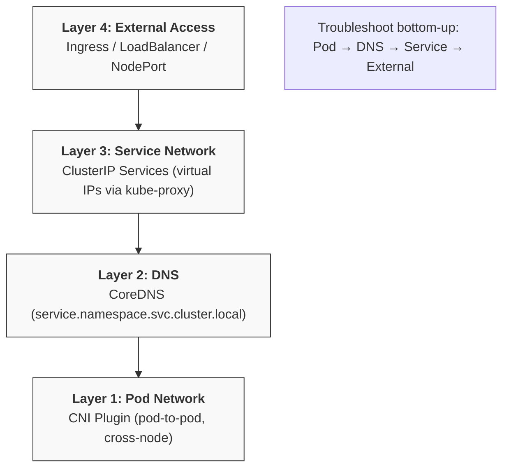
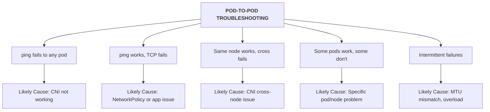
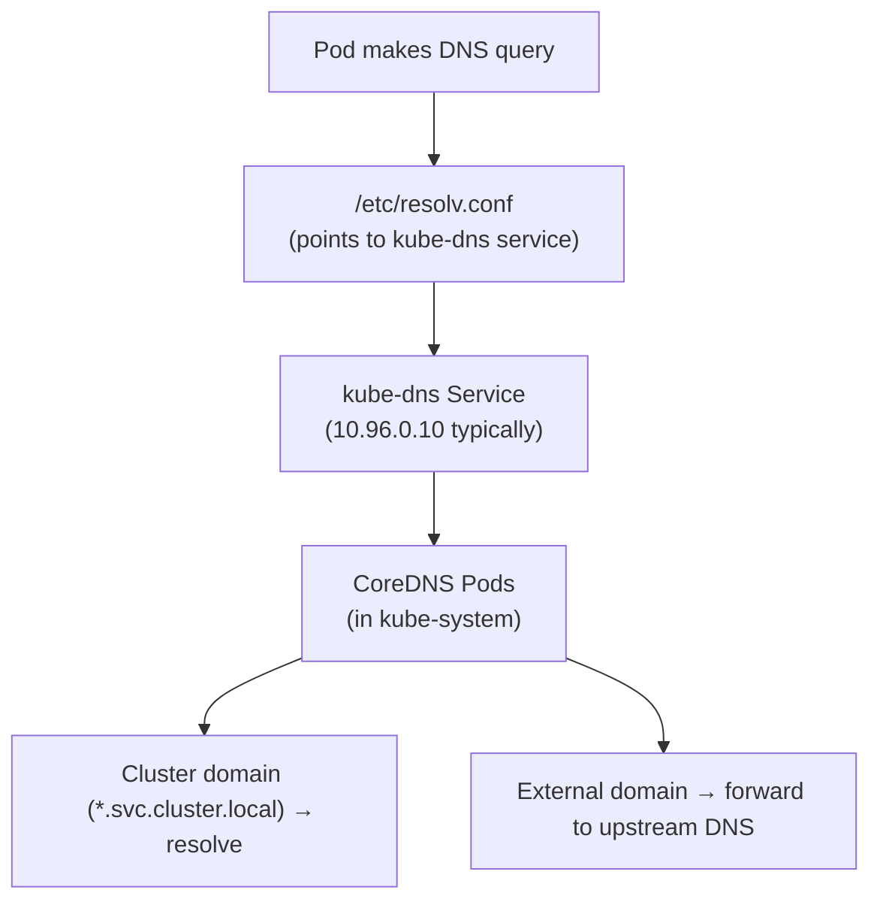
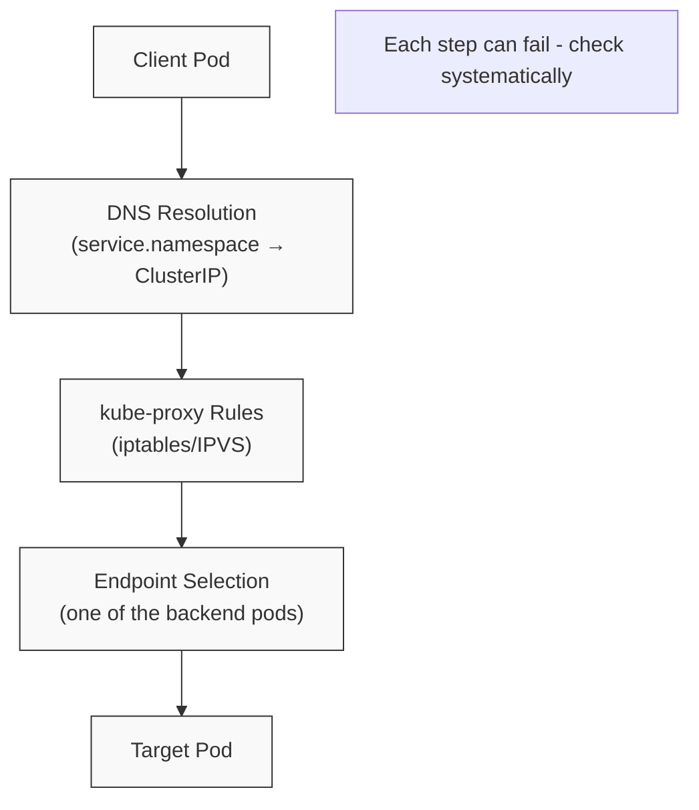
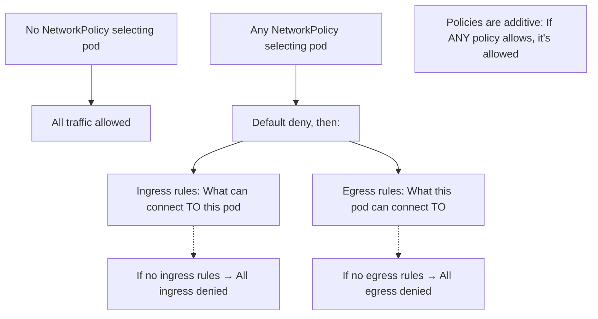

> **Complexity**: `[COMPLEX]` - Multiple layers to debug
>
> **Time to Complete**: 50-60 minutes
>
> **Prerequisites**: Module 5.1 (Methodology), Module 3.1-3.7 (Services & Networking)

---

## What You'll Be Able to Do

After this module, you will be able to:
- **Diagnose** pod-to-pod, pod-to-service, and external-to-service connectivity failures
- **Trace** network issues layer by layer: pod IP → service → endpoint → kube-proxy → CNI
- **Fix** common network issues: missing NetworkPolicy allow rules, DNS resolution failures, port mismatches
- **Use** network debugging tools (curl, nslookup, tcpdump, ss) from within pods and nodes

---

## Why This Module Matters

Networking issues are among the most challenging to troubleshoot because they can occur at multiple layers - pod network, service network, DNS, CNI, or external connectivity. A systematic approach is essential. On the CKA exam, network troubleshooting questions are common and often worth high points.

> **The Highway System Analogy**
>
> Think of cluster networking as a highway system. Pods are like cars with unique addresses (IPs). Services are like well-known exits that redirect traffic to multiple destinations. DNS is the GPS that translates names to addresses. NetworkPolicies are toll gates that control who can enter. When traffic isn't flowing, you need to check each checkpoint.

---

## What You'll Learn

By the end of this module, you'll be able to:
- Diagnose pod-to-pod connectivity issues
- Troubleshoot DNS problems
- Fix service connectivity issues
- Identify NetworkPolicy blocks
- Debug CNI problems

---

## Did You Know?

- **Every pod gets an IP**: Unlike Docker, Kubernetes pods have their own IP addresses - no port mapping needed
- **DNS queries go to CoreDNS**: All cluster DNS resolution goes through CoreDNS pods in kube-system
- **NetworkPolicies are additive**: If any policy allows traffic, it's allowed - but having ANY policy creates default deny
- **Services use kube-proxy**: Service IPs are virtual - kube-proxy programs iptables/IPVS rules to route traffic

---

## Part 1: Kubernetes Networking Model

### 1.1 The Network Layers



### 1.2 Quick Connectivity Test

```bash
# Create a debug pod for testing
k run netshoot --image=nicolaka/netshoot --rm -it --restart=Never -- bash

# Or simpler with busybox
k run debug --image=busybox:1.36 --rm -it --restart=Never -- sh
```

---

## Part 2: Pod-to-Pod Connectivity

> **Pause and predict**: When checking pod-to-pod connectivity, if ICMP (ping) traffic works but TCP traffic (curl) fails on a specific port, what layer is most likely intercepting the traffic?

### 2.1 Testing Pod Connectivity

```bash
# Get pod IPs
k get pods -o wide

# Test from one pod to another
k exec <source-pod> -- ping -c 3 <target-pod-ip>
k exec <source-pod> -- wget -qO- --timeout=2 http://<target-pod-ip>:<port>
k exec <source-pod> -- nc -zv <target-pod-ip> <port>
```

### 2.2 Pod-to-Pod Failure Symptoms



### 2.3 Diagnosing CNI Issues

```bash
# Check CNI pods are running
k -n kube-system get pods | grep -E "calico|flannel|weave|cilium"

# Check CNI pod logs
k -n kube-system logs <cni-pod>

# Check CNI configuration on node
ls -la /etc/cni/net.d/
cat /etc/cni/net.d/*.conf

# Check if CNI binaries exist
ls -la /opt/cni/bin/
```

### 2.4 Common CNI Issues

| Issue | Symptom | Fix |
|-------|---------|-----|
| CNI pods not running | All pods stuck ContainerCreating | Deploy/fix CNI plugin |
| CNI config missing | Pods can't get IPs | Check /etc/cni/net.d/ |
| CNI binary missing | Runtime errors | Install CNI binaries |
| CIDR overlap | IP conflicts | Reconfigure pod CIDR |
| MTU mismatch | Intermittent drops | Align MTU settings |

---

## Part 3: DNS Troubleshooting

### 3.1 Kubernetes DNS Overview



### 3.2 Testing DNS

```bash
# Check pod's DNS config
k exec <pod> -- cat /etc/resolv.conf

# Test cluster DNS
k exec <pod> -- nslookup kubernetes
k exec <pod> -- nslookup kubernetes.default
k exec <pod> -- nslookup kubernetes.default.svc.cluster.local

# Test service DNS
k exec <pod> -- nslookup <service-name>
k exec <pod> -- nslookup <service-name>.<namespace>
k exec <pod> -- nslookup <service-name>.<namespace>.svc.cluster.local

# Test external DNS
k exec <pod> -- nslookup google.com
```

### 3.3 Diagnosing DNS Issues

```bash
# Check CoreDNS pods
k -n kube-system get pods -l k8s-app=kube-dns
k -n kube-system logs -l k8s-app=kube-dns

# Check kube-dns service
k -n kube-system get svc kube-dns

# Check CoreDNS configmap
k -n kube-system get configmap coredns -o yaml

# Verify endpoints
k -n kube-system get endpoints kube-dns
```

### 3.4 Common DNS Issues

| Issue | Symptom | Diagnosis | Fix |
|-------|---------|-----------|-----|
| CoreDNS not running | All DNS fails | Check CoreDNS pods | Fix/restart CoreDNS |
| Wrong nameserver | DNS timeout | Check /etc/resolv.conf | Fix kubelet DNS config |
| CoreDNS crashloop | Intermittent DNS | Check CoreDNS logs | Fix loop detection |
| Network policy blocks | DNS blocked | Check policies | Allow DNS (port 53) |
| ndots issue | Slow external DNS | Check ndots in resolv.conf | Adjust dnsConfig |

### 3.5 Fixing DNS Issues

**CoreDNS not running**:
```bash
# Check deployment
k -n kube-system get deployment coredns

# Scale up if needed
k -n kube-system scale deployment coredns --replicas=2

# Check for pod issues
k -n kube-system describe pod -l k8s-app=kube-dns
```

**CoreDNS loop detection crash**:
```bash
# Check logs for "Loop" message
k -n kube-system logs -l k8s-app=kube-dns | grep -i loop

# Fix: Edit CoreDNS configmap
k -n kube-system edit configmap coredns
# Remove or comment out the 'loop' plugin
```

**Wrong resolv.conf**:
```bash
# Check kubelet config for cluster DNS
cat /var/lib/kubelet/config.yaml | grep -A 5 "clusterDNS"

# Should point to kube-dns service IP
# clusterDNS:
# - 10.96.0.10
```

---

## Part 4: Service Troubleshooting

> **Stop and think**: You verified that DNS successfully resolves a service name to its ClusterIP, but `curl` still returns "Connection refused". What is the next logical component to inspect?

### 4.1 Service Connectivity Flow



### 4.2 Testing Service Connectivity

```bash
# Test by ClusterIP
k exec <pod> -- wget -qO- --timeout=2 http://<service-cluster-ip>:<port>

# Test by DNS name
k exec <pod> -- wget -qO- --timeout=2 http://<service-name>:<port>

# Test with curl if available
k exec <pod> -- curl -s --connect-timeout 2 http://<service-name>:<port>
```

### 4.3 Diagnosing Service Issues

```bash
# Check service exists and has correct type/ports
k get svc <service-name>
k describe svc <service-name>

# CRITICAL: Check endpoints
k get endpoints <service-name>
# Empty endpoints = service can't find pods!

# Check selector matches pods
k get svc <service-name> -o jsonpath='{.spec.selector}'
k get pods -l <selector>

# Check pods are Ready
k get pods -l <selector> -o wide
```

### 4.4 Common Service Issues

| Issue | Symptom | Diagnosis | Fix |
|-------|---------|-----------|-----|
| No endpoints | Connection refused | `k get endpoints` empty | Fix selector or create pods |
| Wrong selector | Endpoints empty | Compare labels | Fix selector in service |
| Wrong port | Connection refused | Check port vs targetPort | Fix port mapping |
| Pods not Ready | Some endpoints | Check pod readiness | Fix readiness probe |
| kube-proxy down | All services fail | Check kube-proxy pods | Restart kube-proxy |

### 4.5 Fixing Service Issues

**No endpoints - selector mismatch**:
```bash
# Get service selector
k get svc my-service -o jsonpath='{.spec.selector}'
# Output: {"app":"myapp"}

# Get pod labels
k get pods --show-labels

# If they don't match, fix either:
k patch svc my-service -p '{"spec":{"selector":{"app":"correct-label"}}}'
# Or fix pod labels
```

**Wrong port configuration**:
```bash
# Check service ports
k get svc my-service -o yaml | grep -A 10 "ports:"

# Verify pod is listening on targetPort
k exec <pod> -- netstat -tlnp
# Or
k exec <pod> -- ss -tlnp

# Fix service
k patch svc my-service -p '{"spec":{"ports":[{"port":80,"targetPort":8080}]}}'
```

---

## Part 5: NetworkPolicy Troubleshooting

### 5.1 NetworkPolicy Behavior



### 5.2 Diagnosing NetworkPolicy Issues

```bash
# List all NetworkPolicies
k get networkpolicy -A

# Check policies in specific namespace
k get networkpolicy -n <namespace>

# Examine policy details
k describe networkpolicy <name> -n <namespace>

# Check which pods are selected
k get networkpolicy <name> -o jsonpath='{.spec.podSelector}'
```

### 5.3 Common NetworkPolicy Issues

| Issue | Symptom | Fix |
|-------|---------|-----|
| Egress blocks DNS | DNS fails | Allow egress to kube-dns (port 53) |
| Ingress too restrictive | Connection refused | Check ingress rules, add source |
| Forgot namespace | Cross-NS blocked | Add namespaceSelector |
| Wrong pod selector | Policy not applied | Fix podSelector labels |

### 5.4 Fixing NetworkPolicy Issues

**Allow DNS egress**:
```yaml
apiVersion: networking.k8s.io/v1
kind: NetworkPolicy
metadata:
  name: allow-dns
spec:
  podSelector: {}  # All pods
  policyTypes:
  - Egress
  egress:
  - to:
    - namespaceSelector:
        matchLabels:
          kubernetes.io/metadata.name: kube-system
    ports:
    - protocol: UDP
      port: 53
    - protocol: TCP
      port: 53
```

**Debug by removing policy temporarily**:
```bash
# Save the policy
k get networkpolicy <name> -o yaml > policy-backup.yaml

# Delete to test
k delete networkpolicy <name>

# Test connectivity
k exec <pod> -- wget -qO- http://<service>

# Restore
k apply -f policy-backup.yaml
```

---

## Part 6: External Connectivity

### 6.1 Outbound Connectivity (Pod to Internet)

```bash
# Test outbound
k exec <pod> -- wget -qO- --timeout=5 http://example.com

# If failing, check:
# 1. DNS resolution
k exec <pod> -- nslookup example.com

# 2. Network path
k exec <pod> -- ping -c 2 8.8.8.8

# 3. Node-level connectivity (from node)
curl -I http://example.com
```

### 6.2 Inbound Connectivity (External to Cluster)

```bash
# For NodePort service
curl http://<node-ip>:<node-port>

# For LoadBalancer (if available)
k get svc <service> -o jsonpath='{.status.loadBalancer.ingress[0].ip}'
curl http://<lb-ip>

# For Ingress
curl -H "Host: <hostname>" http://<ingress-ip>
```

### 6.3 External Connectivity Issues

| Issue | Check | Fix |
|-------|-------|-----|
| NAT not working | Node iptables | Check CNI, kube-proxy |
| Firewall blocking | Cloud firewall rules | Open required ports |
| No route to internet | Node routing | Fix node network config |
| LoadBalancer pending | Cloud controller | Check cloud integration |

---

## Common Mistakes

| Mistake | Problem | Solution |
|---------|---------|----------|
| Not checking endpoints | Miss selector mismatch | Always check `k get endpoints` |
| Forgetting DNS in NetPol | DNS breaks with egress policy | Allow UDP/TCP 53 to kube-system |
| Testing from wrong pod | Different network policies apply | Test from actual source pod |
| Ignoring pod readiness | Endpoints missing | Check pod is Ready |
| Wrong port vs targetPort | Connection fails | Service port ≠ container port |
| Not testing step by step | Can't isolate problem | Pod → DNS → Service → External |

---

## Quiz

### Q1: Empty Endpoints
You have deployed a new backend application and exposed it via a ClusterIP service. However, when frontend pods try to connect, they receive connection refused errors. You check the service with `k get endpoints <svc>` and it returns an empty list. What is the most likely cause for this behavior and how do you investigate it?

<details>
<summary>Answer</summary>

The most likely cause is that the service **selector doesn't match any pod labels**, or the matching pods aren't in a **Ready** state. When a service cannot find any pods that match its selector labels, it has no target IPs to route traffic to, resulting in an empty endpoints list. Additionally, if pods match but are failing their readiness probes, they are automatically removed from the endpoints list to prevent traffic from being sent to unhealthy instances. You must verify both the label alignment and the health of the underlying pods.

Debug steps:
```bash
# Get service selector
k get svc <svc> -o jsonpath='{.spec.selector}'
# Find pods with matching labels
k get pods -l <selector>
# Check if pods are Ready
k get pods -l <selector> -o wide
```

</details>

### Q2: DNS Failure
A developer reports that their application pods can no longer resolve any internal Kubernetes services (like `db-service.backend.svc.cluster.local`) or external domains. However, when you exec into the pod and run `ping 8.8.8.8`, you receive successful responses, indicating external IP connectivity is working. What should you check to restore DNS resolution?

<details>
<summary>Answer</summary>

Since external IP routing is working but DNS resolution is completely failing, the issue is isolated to the cluster's DNS provider, which is typically CoreDNS. You should start by checking if the **CoreDNS pods** in the `kube-system` namespace are actually running, healthy, and not crash-looping. If the pods are running, you must also verify that the `kube-dns` service exists and that its endpoints are properly populated with the CoreDNS pod IPs. Finally, check the client pod's `/etc/resolv.conf` to ensure it is correctly pointing to the `kube-dns` service IP.

Check **CoreDNS pods** in kube-system:
```bash
k -n kube-system get pods -l k8s-app=kube-dns
k -n kube-system logs -l k8s-app=kube-dns
k -n kube-system get endpoints kube-dns
```

</details>

### Q3: NetworkPolicy Default Behavior
You are tasked with securing a namespace and apply a NetworkPolicy with `podSelector: {}` to target all pods. In the specification, you define several `ingress` rules to allow specific incoming traffic, but you do not define any `egress` rules or include `Egress` in the `policyTypes` array. How does this policy affect the outbound traffic originating from the pods in this namespace?

<details>
<summary>Answer</summary>

**Egress remains completely unrestricted.** A NetworkPolicy only affects the specific types of traffic that are explicitly listed in the `policyTypes` field of the specification. Because you only specified ingress rules and the implicit or explicit `policyTypes` list only covers `Ingress`, outbound traffic is not evaluated by this policy at all. However, if you were to add `Egress` to the `policyTypes` array but still provide no egress rules, the default deny behavior would activate, and all outbound traffic would be immediately blocked.

</details>

### Q4: Cross-Node Pod Communication
During a routine cluster test, you discover that pods running on `worker-node-1` can successfully ping each other. However, when a pod on `worker-node-1` attempts to ping a pod on `worker-node-2`, the connection times out. What component is likely responsible for this cross-node communication failure?

<details>
<summary>Answer</summary>

The **CNI plugin's cross-node networking** overlay or routing is not functioning correctly. While same-node pod communication often relies on simple local bridge routing, cross-node communication requires the CNI (like Calico or Flannel) to encapsulate traffic (via VXLAN or IP-in-IP) or configure routing tables across the cluster infrastructure. This failure could be caused by CNI pods crashing on specific nodes, firewalls blocking the overlay network ports (like UDP 8472 for Flannel) between the nodes, or an MTU mismatch causing packet drops over the network path.

Check:
```bash
k -n kube-system get pods -o wide | grep <cni-name>
# Verify CNI pods on each node
```

</details>

### Q5: Service Port Mapping
You are troubleshooting an issue where a web application is inaccessible through its Kubernetes service. Upon inspecting the YAML manifests, you see the service is configured with `port: 80` and `targetPort: 8080`, while the deployment's container is configured to bind and listen on port 80. Will clients be able to reach the application through the service?

<details>
<summary>Answer</summary>

**No, the connection will fail.** The service is explicitly instructed to accept incoming client traffic on port 80 and then route that traffic to port 8080 on the backend pods. However, because the actual application container is only listening on port 80, any traffic arriving at the pod's port 8080 will be rejected with a connection refused error. To resolve this mismatch, you must align the ports: either update the service's `targetPort` to 80 to match the container, or reconfigure the application to listen on 8080.

</details>

### Q6: CoreDNS Loop
Cluster users report intermittent DNS resolution failures. When you investigate the CoreDNS pods in the `kube-system` namespace, you notice they are frequently crashing and restarting. Checking the logs reveals a recurring "Loop detected" error message. What is causing this condition and how can you permanently fix it?

<details>
<summary>Answer</summary>

This error occurs when CoreDNS detects a routing loop where it is essentially forwarding DNS queries back to itself. This often happens in specific environments (like local clusters or certain cloud VMs) where the host node's `/etc/resolv.conf` points to a local loopback address (like `127.0.0.53`), confusing the CoreDNS forwarder plugin. To fix this, you need to modify the CoreDNS configuration to break the loop. You can do this by editing the ConfigMap to either remove the `loop` plugin entirely, or by explicitly setting upstream DNS servers (like `8.8.8.8`) instead of relying on the host's `/etc/resolv.conf`.

Fix by editing the CoreDNS ConfigMap:
```bash
k -n kube-system edit configmap coredns
```

Either:
1. Remove the `loop` plugin line
2. Configure explicit upstream DNS servers instead of using /etc/resolv.conf

</details>

---

## Hands-On Exercise: Network Troubleshooting

### Scenario

Practice diagnosing various network issues.

### Setup

```bash
# Create test namespace
k create ns network-lab

# Create a test deployment
k -n network-lab create deployment web --image=nginx:1.25 --replicas=2

# Expose as service
k -n network-lab expose deployment web --port=80

# Create a client pod
k -n network-lab run client --image=busybox:1.36 --command -- sleep 3600
```

### Task 1: Verify Basic Connectivity

```bash
# Wait for pods to be ready
k -n network-lab get pods -w

# Get service and pod IPs
k -n network-lab get svc,pods -o wide

# Test from client to service
k -n network-lab exec client -- wget -qO- --timeout=2 http://web

# Test DNS resolution
k -n network-lab exec client -- nslookup web
k -n network-lab exec client -- nslookup web.network-lab.svc.cluster.local
```

### Task 2: Check Endpoints

```bash
# Verify endpoints exist
k -n network-lab get endpoints web

# Should show IPs of web pods
# If empty, check:
k -n network-lab get svc web -o jsonpath='{.spec.selector}'
k -n network-lab get pods --show-labels
```

### Task 3: Simulate Selector Mismatch

```bash
# Break the service by changing selector
k -n network-lab patch svc web -p '{"spec":{"selector":{"app":"wrong"}}}'

# Try to connect (will fail)
k -n network-lab exec client -- wget -qO- --timeout=2 http://web

# Check endpoints (should be empty)
k -n network-lab get endpoints web

# Fix it
k -n network-lab patch svc web -p '{"spec":{"selector":{"app":"web"}}}'

# Verify fixed
k -n network-lab get endpoints web
k -n network-lab exec client -- wget -qO- --timeout=2 http://web
```

### Task 4: Test NetworkPolicy

```bash
# Apply a restrictive policy
cat <<EOF | k apply -f -
apiVersion: networking.k8s.io/v1
kind: NetworkPolicy
metadata:
  name: deny-all
  namespace: network-lab
spec:
  podSelector: {}
  policyTypes:
  - Ingress
  - Egress
EOF

# Test connectivity (should fail now)
k -n network-lab exec client -- wget -qO- --timeout=2 http://web

# Check what policies exist
k -n network-lab get networkpolicy

# Remove policy to restore connectivity
k -n network-lab delete networkpolicy deny-all

# Verify restored
k -n network-lab exec client -- wget -qO- --timeout=2 http://web
```

### Success Criteria

- [ ] Verified pod-to-service connectivity
- [ ] Confirmed DNS resolution works
- [ ] Understood endpoint relationship
- [ ] Simulated and fixed selector mismatch
- [ ] Observed NetworkPolicy blocking traffic

### Cleanup

```bash
k delete ns network-lab
```

---

## Practice Drills

### Drill 1: Check DNS Resolution (30 sec)
```bash
# Task: Test DNS from a pod
k exec <pod> -- nslookup kubernetes
```

### Drill 2: Check Endpoints (30 sec)
```bash
# Task: View service endpoints
k get endpoints <service>
```

### Drill 3: Test Service Connectivity (1 min)
```bash
# Task: Test HTTP to service from a pod
k exec <pod> -- wget -qO- --timeout=2 http://<service>
```

### Drill 4: Check CoreDNS (1 min)
```bash
# Task: Verify CoreDNS is healthy
k -n kube-system get pods -l k8s-app=kube-dns
k -n kube-system logs -l k8s-app=kube-dns --tail=20
```

### Drill 5: Check Pod DNS Config (30 sec)
```bash
# Task: View pod's DNS configuration
k exec <pod> -- cat /etc/resolv.conf
```

### Drill 6: List NetworkPolicies (30 sec)
```bash
# Task: Find all NetworkPolicies in a namespace
k get networkpolicy -n <namespace>
```

### Drill 7: Check CNI Pods (1 min)
```bash
# Task: Verify CNI pods are running
k -n kube-system get pods | grep -E "calico|flannel|weave|cilium"
```

### Drill 8: Debug Network Connection (2 min)
```bash
# Task: Full connectivity debug
k exec <pod> -- nslookup <service>     # DNS
k exec <pod> -- nc -zv <service> 80    # TCP
k get endpoints <service>              # Endpoints
```

---

## Next Module

Continue to [Module 5.6: Service Troubleshooting](../module-5.6-services/) for a deeper dive into Service, Ingress, and LoadBalancer troubleshooting.