```mermaid
flowchart TD
    subgraph MultiContainerPatterns [Multi-Container Patterns]
        direction TB
        
        subgraph Init [Init Container Pattern]
            direction LR
            I1[Init Container] -->|Completes & Exits| M1[Main Container]
        end
        
        subgraph Sidecar [Sidecar Pattern]
            direction LR
            M2[Main Container] <-->|Enhances/Logs| S1[Sidecar Container]
        end
        
        subgraph Ambassador [Ambassador Pattern]
            direction LR
            M3[Main Container] -->|Local request| A1[Ambassador Proxy] -->|External connection| EXT[External Service]
        end

        subgraph Adapter [Adapter Pattern]
            direction LR
            M4[Main Container] -->|Raw/Legacy Data| AD1[Adapter Container] -->|Standard Format| MON[External Monitor]
        end
    end
```

> **Complexity**: `[MEDIUM]` - Essential CKAD skill requiring pattern recognition
>
> **Time to Complete**: 50-60 minutes
>
> **Prerequisites**: Module 1.1 (Container Images), Module 1.2 (Jobs and CronJobs)

---

## Learning Outcomes

After completing this module, you will be able to:
- **Design** multi-container pod architectures utilizing sidecar, init, ambassador, and adapter patterns to decouple application concerns.
- **Diagnose** pod lifecycle failures, including init container crash loops and shared-volume communication bottlenecks.
- **Implement** a sidecar logging pattern that reliably ships logs from a main application container.
- **Evaluate** the trade-offs between localhost network sharing and shared volumes for inter-container communication.

---

## Why This Module Matters

In October 2021, Roblox suffered a 73-hour global outage that wiped out an estimated $1.5 billion in market capitalization. The root cause involved a subtle bug in their backend services where service discovery and proxy routing became overwhelmed under massive load. If they had isolated their proxy logic into strictly resource-limited sidecar containers with explicit lifecycle controls, the blast radius could have been drastically contained, preventing a localized bottleneck from taking down the entire platform.

While Roblox's specific outage involved a different orchestrator, the architectural lesson applies directly to Kubernetes. A Pod is a group of one or more containers, with shared storage and network resources, and a specification for how to run the containers. The one-container-per-Pod model is the most common Kubernetes use case, but when systems reach real-world scale, you must distribute responsibilities. Placing all functionality into a single monolithic container leads to cascading failures, resource starvation, and deployment bottlenecks. 

This module covers the four essential multi-container patterns: Init, Sidecar, Ambassador, and Adapter. Mastering these patterns is critical for the CKAD exam and for preventing catastrophic failures in production by decoupling initialization, logging, proxying, and data translation from your core business logic.

> **The Food Truck Analogy**
>
> A pod is like a food truck. The main container is the chef—they cook the food. But a successful food truck needs more: someone to prep the kitchen before opening (init), someone to take orders (sidecar), a cashier window facing customers differently (ambassador), and someone translating foreign currency to local currency (adapter). They all share the same truck (pod), share the counter space (filesystem), and work together—but each has a distinct, isolated role.

---

## The Four Patterns You Must Know

To properly design distributed systems in Kubernetes, you must understand the four primary patterns for multi-container pods. These patterns dictate how auxiliary containers interact with the main application logic.



> **Pause and predict**: You have a pod that needs to (a) wait for a database to be ready, (b) run a web server, and (c) continuously ship logs to Elasticsearch. Which of the three patterns -- init, sidecar, or ambassador -- would you use for each task? Decide before reading the details below.

---

## Init Containers

Init containers run **before** application containers start. They are specifically designed for setup scripts and initialization logic that you do not want to bundle inside your main application image.

Init containers run sequentially to completion, and each must succeed before the next begins. If a Pod's `restartPolicy` is not `Never` and an init container fails, the kubelet repeatedly restarts that init container until it succeeds. Because of their sequential, blocking nature, regular init containers (non-sidecar) do not support the `lifecycle`, `livenessProbe`, `readinessProbe`, or `startupProbe` fields.

### Use Cases

- Wait for a backend service or database to be ready.
- Clone a git repository or download remote assets.
- Generate dynamic configuration files.
- Run database migrations prior to application startup.
- Modify file permissions on shared volumes.

### Init Container YAML

```yaml
apiVersion: v1
kind: Pod
metadata:
  name: init-demo
spec:
  initContainers:
  - name: init-wait
    image: busybox
    command: ['sh', '-c', 'until nslookup myservice; do echo waiting; sleep 2; done']
  - name: init-setup
    image: busybox
    command: ['sh', '-c', 'echo "Setup complete" > /data/ready']
    volumeMounts:
    - name: shared
      mountPath: /data
  containers:
  - name: main
    image: nginx
    volumeMounts:
    - name: shared
      mountPath: /usr/share/nginx/html
  volumes:
  - name: shared
    emptyDir: {}
```

### Key Properties

| Property | Behavior |
|----------|----------|
| Run order | Sequential (init1, then init2, then main) |
| Failure | Pod restarts if any init container fails |
| Restart policy | Always rerun from first init on pod restart |
| Resources | Can have different resource limits than app containers |
| Probes | No liveness/readiness probes (they just need to exit 0) |

### Init Container Status

```bash
# Check init container status
k get pod init-demo

# Detailed status
k describe pod init-demo | grep -A10 "Init Containers"

# Init container logs
k logs init-demo -c init-wait
```

---

## Sidecar Containers

The sidecar pattern describes a secondary container that extends or enhances a primary container's functionality without modifying its code (e.g., logging, monitoring, security). Sidecars run **alongside** the main container for the pod's lifetime.

Historically, sidecars were just regular containers running next to the main application. However, this caused severe lifecycle race conditions during startup and shutdown. To fix this, the SidecarContainers feature was introduced as alpha in Kubernetes v1.28, graduated to beta (and enabled by default) in Kubernetes v1.29, and officially graduated to stable (GA) in Kubernetes v1.33.

Native sidecar containers are defined under `spec.initContainers` with `restartPolicy: Always` — not under `spec.containers`. Sidecar containers start before app containers and remain running throughout the Pod's lifetime. Sidecar containers (unlike regular init containers) support `livenessProbe`, `readinessProbe`, and `startupProbe` fields. Upon Pod termination, the kubelet postpones terminating sidecar containers until the main application containers have fully stopped. Finally, sidecar containers are shut down in the reverse order of their appearance in the Pod spec.

### Use Cases

- Log aggregation (shipping local files to an external system).
- Monitoring and telemetry collection agents.
- Real-time configuration synchronization.
- Cache population and invalidation.

### Sidecar YAML

```yaml
apiVersion: v1
kind: Pod
metadata:
  name: sidecar-demo
spec:
  containers:
  - name: main
    image: nginx
    volumeMounts:
    - name: logs
      mountPath: /var/log/nginx
  - name: log-shipper
    image: busybox
    command: ['sh', '-c', 'tail -F /var/log/nginx/access.log']
    volumeMounts:
    - name: logs
      mountPath: /var/log/nginx
  volumes:
  - name: logs
    emptyDir: {}
```

> **Stop and think**: Two containers in the same pod need to communicate. One approach is shared volumes; another is localhost networking. When would you choose one over the other? What kind of data flows better through files vs network calls?

---

## Inter-Container Communication

All containers in a Pod share the same network namespace, including the same IP address and network port space. Containers in the same Pod communicate with each other via localhost. Additionally, containers in a Pod can share storage via Volumes, with each container mounting the volume at its own distinct path.

**Design Rationale**: Choose Volumes for persistent data streams, state files, or static assets (e.g., a log file written by the main app and read by a sidecar shipper). Choose localhost Networking for real-time request/response proxying (e.g., an app sending database queries through an ambassador). 

Containers in a pod can share:

1. **Volumes** (most common for state and logging)
```yaml
volumes:
- name: shared
  emptyDir: {}
```

2. **Network** (same localhost namespace)
```yaml
# Main container exposes :8080
# Sidecar can access localhost:8080
```

3. **Process namespace** (allows containers to see and signal each other's processes)
```yaml
spec:
  shareProcessNamespace: true
```
Setting `shareProcessNamespace: true` allows containers in a Pod to view the process table of other containers, which is critical for specialized debugging or signaling tools.

---

## Ambassador Pattern

The ambassador pattern describes a container that acts as a proxy between the application container and external services, handling concerns like service discovery, TLS, and circuit breaking. It shields the main application from the complexity of the outside network.

### Use Cases

- Database connection pooling (e.g., PgBouncer).
- TLS termination or outbound encryption (mTLS).
- Transparent service discovery and routing.
- Rate limiting and retry logic abstraction.

### Ambassador YAML

```yaml
apiVersion: v1
kind: Pod
metadata:
  name: ambassador-demo
spec:
  containers:
  - name: main
    image: myapp
    env:
    - name: DB_HOST
      value: "localhost"    # Ambassador handles actual connection
    - name: DB_PORT
      value: "5432"
  - name: db-proxy
    image: ambassador-proxy
    env:
    - name: REAL_DB_HOST
      value: "db.production.svc"
    - name: REAL_DB_PORT
      value: "5432"
    ports:
    - containerPort: 5432   # Listens on localhost:5432 for main
```

---

## Adapter Pattern

The adapter pattern describes a container that translates data formats, protocols, or APIs between the main application container and external services. It acts as an impedance matcher, standardizing disparate outputs into a unified format.

### Use Cases

- Translating legacy application log files into structured JSON for modern aggregators.
- Reading JMX metrics from a Java application and exposing them as a Prometheus endpoint.
- Normalizing custom API responses to match an organizational standard.

The adapter pattern ensures that the main container can continue operating with its native or legacy outputs without requiring expensive code rewrites, while still integrating perfectly into modern cloud-native observability stacks.

---

## Ephemeral Containers

When you need to debug a running Pod—especially one deployed with minimal base images that lack tools like `curl` or `sh`—you can use Ephemeral Containers. Ephemeral containers became stable (GA) in Kubernetes v1.25. 

They are designed purely for interactive troubleshooting. As such, ephemeral containers do not support the `ports`, `livenessProbe`, `readinessProbe`, or `resources` fields. They are added to a running Pod via a special `ephemeralcontainers` API subresource, not via a standard Pod spec update using `kubectl edit`. Once an ephemeral container is added to a Pod, it cannot be changed or removed. Furthermore, ephemeral containers are not supported in static Pods.

---

## Pod Lifecycle, Restart Policies, and Boundaries

Understanding the overall lifecycle of a Pod is critical when orchestrating multiple containers. Container restart policy has three possible values: `Always`, `OnFailure`, and `Never`. Pod phases are exactly: `Pending`, `Running`, `Succeeded`, `Failed`, and `Unknown`.

When designing resource allocations for multi-container pods, be mindful of unverified boundaries. While it is generally understood that the effective Pod-level resource request when init containers are present is the maximum of the highest single init container's request and the sum of all app container requests, official documentation on the exact calculation formula is currently sparse. Additionally, while the network namespace is shared by default, it is unverified if the IPC namespace is shared by default between all containers in a Pod without explicit configuration. Finally, there is no documented hard maximum on the number of containers per Pod in the Kubernetes API, though practical node resource limits and etcd object size limits apply.

---

## Pattern Recognition

When do you use each pattern? 

| Scenario | Pattern | Why |
|----------|---------|-----|
| Wait for database before starting | Init | One-time dependency check |
| Ship logs to Elasticsearch | Sidecar | Continuous operation |
| Download config before app starts | Init | Setup task |
| Watch config file for changes | Sidecar | Continuous operation |
| Proxy database connections | Ambassador | Abstraction layer |
| Run database migrations | Init | One-time operation |
| Add TLS to non-TLS app | Ambassador | Protocol handling |
| Collect Prometheus metrics | Sidecar | Continuous operation |
| Translate legacy logs to JSON | Adapter | Data format translation |
| Expose JMX as Prometheus metrics | Adapter | API protocol translation |

---

> **What would happen if**: An init container has a bug and runs `sleep 3600` instead of completing. What state would the pod be stuck in, and how would you diagnose it?

---

## Creating Multi-Container Pods Quickly

You cannot create multi-container pods purely imperatively using one-liners. Instead, rely on the generate-and-edit pattern for speed during the CKAD exam:

### Step 1: Generate Base

```bash
k run multi --image=nginx --dry-run=client -o yaml > multi.yaml
```

### Step 2: Add Containers

Edit `multi.yaml`:

```yaml
apiVersion: v1
kind: Pod
metadata:
  name: multi
spec:
  containers:
  - name: nginx
    image: nginx
  - name: sidecar           # ADD THIS
    image: busybox          # ADD THIS
    command: ["sleep", "3600"]  # ADD THIS
```

### Step 3: Add Init Containers (if needed)

```yaml
apiVersion: v1
kind: Pod
metadata:
  name: multi
spec:
  initContainers:           # ADD THIS SECTION
  - name: init
    image: busybox
    command: ["sh", "-c", "echo init done"]
  containers:
  - name: nginx
    image: nginx
  - name: sidecar
    image: busybox
    command: ["sleep", "3600"]
```

---

## Debugging Multi-Container Pods

When working with multiple containers, standard commands require extra specificity to target the correct container boundary.

### Specify Container

```bash
# Logs from specific container
k logs multi -c sidecar

# Exec into specific container
k exec -it multi -c sidecar -- sh

# Describe shows all containers
k describe pod multi
```

### Check Container Status

```bash
# All container statuses
k get pod multi -o jsonpath='{.status.containerStatuses[*].name}'

# Check if ready
k get pod multi -o jsonpath='{range .status.containerStatuses[*]}{.name}{"\t"}{.ready}{"\n"}{end}'
```

### Common Issues

| Symptom | Cause | Solution |
|---------|-------|----------|
| Pod stuck in `Init:0/1` | Init container not completing | Check init container logs |
| One container `CrashLoopBackOff` | Container command exits | Fix command or add `sleep` |
| Containers can't share data | No shared volume | Add `emptyDir` volume |
| Main can't reach sidecar | Network misconfiguration | Use `localhost:port` |

---

## Did You Know?

- **Init containers can have different images than app containers.** Use specialized tools (like `git`, database clients) in init containers without bloating your app image.
- **The ambassador pattern predates service meshes.** Before Istio and Linkerd, developers used ambassador containers to handle cross-cutting concerns. Now service meshes automate sidecar injection.
- The SidecarContainers feature was introduced as alpha in Kubernetes v1.28 on August 25, 2023, and officially graduated to stable (GA) in v1.33 on April 23, 2025.
- Ephemeral containers, heavily relied upon for debugging stripped-down multi-container pods, became a stable (GA) feature in Kubernetes v1.25.
- In *Infrastructure as Code*, the canonical Knight Capital 2012 <!-- incident-xref: knight-capital-2012 --> cross-reference shows why lifecycle controls are essential when partial rollout and execution ordering become coupled to operational speed and reliability.
- Kubernetes v1.29 enabled native sidecar containers by default, definitively solving the infamous race condition where a proxy sidecar would shut down before the main application had finished processing its final in-flight requests.

---

## Common Mistakes

| Mistake | Why It Hurts | Solution |
|---------|--------------|----------|
| Forgetting `-c container` | Wrong container logs | Always specify `-c container-name` in multi-container pods |
| Init container with `sleep` | Pod never starts | Ensure init commands exit 0; do not use long sleeps |
| No shared volume | Containers can't communicate via files | Add an `emptyDir` volume mounted in both containers |
| Sidecar exits immediately | Pod keeps restarting | Add `sleep infinity` or run an actual foreground service |
| Wrong port in localhost | Connection refused | Verify port mappings match the ambassador/main container |
| Modifying Ephemeral container | API Rejection | Ephemeral containers cannot be changed or removed once added |
| Missing `shareProcessNamespace` | Can't signal processes | Set `shareProcessNamespace: true` to allow inter-container signaling |
| Using livenessProbe on regular init | Validation Error | Regular init containers do not support liveness probes |

---

## Quiz

1. **Your pod has two init containers: `init-db` (waits for database) and `init-config` (downloads configuration). The pod is stuck showing `Init:1/2`. Which init container succeeded and which is still running? How do you find out what's wrong?**
   <details>
   <summary>Answer</summary>
   `Init:1/2` means the first init container (`init-db`) completed successfully, but the second (`init-config`) is still running or failing. Init containers run sequentially -- `init-config` can't start until `init-db` exits 0. Diagnose with `kubectl logs <pod> -c init-config` to see its output, and `kubectl describe pod <pod>` to check Events for errors like image pull failures or command errors. If `init-config` is stuck in a retry loop (e.g., downloading from an unreachable URL), fix the URL or the network issue.
   </details>

2. **A microservice team deploys their API with a sidecar that ships logs to Elasticsearch. After deployment, `kubectl get pod api-pod` shows `1/2 Ready`. The main container is fine but the sidecar keeps crashing. What are the most likely causes, and does this affect the main application?**
   <details>
   <summary>Answer</summary>
   The sidecar is likely crashing because its process is exiting prematurely, which can happen if the command isn't a long-running daemon (like `tail -F`), if the Elasticsearch endpoint is unreachable, or if there is no shared volume preventing log access. You can diagnose the exact root cause by running `kubectl logs api-pod -c log-shipper` to view the crash output. Although the main application container continues to run perfectly fine, the overall pod Ready status will remain `1/2`. Because the pod is not fully ready, Kubernetes will stop routing Service traffic to it, essentially taking the pod out of rotation until the sidecar stabilizes.
   </details>

3. **You're building an application that needs to: (1) clone a git repository before starting, (2) serve the repo content via nginx, and (3) have a background process that pulls git updates every 60 seconds. Which multi-container pattern(s) do you use, and how do the containers share the git data?**
   <details>
   <summary>Answer</summary>
   Use an init container for the initial git clone (one-time setup task), nginx as the main container to serve content, and a sidecar for the periodic git pull (continuous background operation). All three share an `emptyDir` volume mounted at the same path. The init container clones into `/data`, nginx serves from `/data`, and the sidecar runs `git pull` in `/data` every 60 seconds. This is a classic combination of init + sidecar patterns working together through shared volumes.
   </details>

4. **During the CKAD exam, you need to add a sidecar container to an existing pod. You run `kubectl logs mypod` and get an error asking you to specify a container name. Why does this happen, and what's the fastest way to find the container names?**
   <details>
   <summary>Answer</summary>
   When a pod has multiple containers, `kubectl logs` doesn't know which container's logs you want and requires the `-c` flag. The fastest way to find container names is `kubectl get pod mypod -o jsonpath='{.spec.containers[*].name}'`, which prints all container names on one line. Alternatively, `kubectl describe pod mypod` shows containers under the "Containers:" section. Once you have the name, use `kubectl logs mypod -c container-name`. In the exam, always use `-c` for multi-container pods to avoid wasting time on this error.
   </details>

5. **You need to integrate an older legacy application that outputs proprietary telemetry data into a modern Prometheus monitoring stack. You cannot modify the legacy application's source code. Which multi-container pattern is best suited for this, and why?**
   <details>
   <summary>Answer</summary>
   The Adapter pattern is the correct choice for this scenario. This pattern is explicitly designed to translate disparate data formats, protocols, or APIs between a main application container and external monitoring services. By deploying an adapter container alongside the legacy application, it can ingest the proprietary telemetry locally. It then exposes a standard `/metrics` endpoint in the Prometheus format, entirely avoiding any risky modifications to the legacy source code.
   </details>

6. **Your application requires a sidecar container to securely proxy requests to an external API (the Ambassador pattern). However, during pod termination, the sidecar shuts down before the main container finishes processing in-flight requests, causing errors. How does Kubernetes v1.33+ solve this?**
   <details>
   <summary>Answer</summary>
   Starting with Kubernetes v1.29 (beta) and fully stable in v1.33, the native SidecarContainers feature solves this race condition natively. By defining the sidecar under the `spec.initContainers` array with `restartPolicy: Always`, Kubernetes treats it as a true sidecar rather than a standard init container. When the pod receives a termination signal, the kubelet deliberately postpones terminating these native sidecar containers until the main application containers have completely shut down. This guaranteed shutdown order ensures the proxy remains fully available to handle and route all remaining in-flight requests during the pod's graceful termination phase.
   </details>

7. **You added an ephemeral container to a running Pod to capture network packets, but you made a typo in the command. The ephemeral container immediately exits. You try to use `kubectl edit pod` to fix the typo in the ephemeral container's spec. What happens, and how do you resolve the situation?**
   <details>
   <summary>Answer</summary>
   The API will reject the edit. Ephemeral containers cannot be changed or removed once they are added to a Pod. They are inserted via the `ephemeralcontainers` subresource, not standard pod spec updates. To resolve this, you must add a brand new ephemeral container with a different name and the corrected command, leaving the failed one in a terminated state.
   </details>

8. **A pod's `restartPolicy` is set to `OnFailure`. An init container fails to download a required configuration file and exits with a non-zero status. What will the kubelet do in response to this failure?**
   <details>
   <summary>Answer</summary>
   Because the pod's overall `restartPolicy` is set to `OnFailure` (or `Always`), the kubelet will repeatedly restart the failed init container until it eventually succeeds. Kubernetes enforces a strict execution order where init containers must run sequentially and exit successfully before progressing. Therefore, the main application containers will remain blocked and will not start until this failing init container completes with a zero exit code. You would need to inspect the logs and fix the underlying issue (such as correcting the URL or fixing network permissions) so the container can break out of its crash loop.
   </details>

---

## Hands-On Exercise

**Task**: Build a pod with init, sidecar, and main containers.

**Scenario**: Create an app that:
1. Init: Downloads config from a URL (simulated)
2. Main: Runs nginx serving the config
3. Sidecar: Monitors and logs changes

```yaml
apiVersion: v1
kind: Pod
metadata:
  name: full-pattern
spec:
  initContainers:
  - name: config-init
    image: busybox
    command: ['sh', '-c', 'echo "Welcome to CKAD!" > /data/index.html']
    volumeMounts:
    - name: html
      mountPath: /data
  containers:
  - name: nginx
    image: nginx
    volumeMounts:
    - name: html
      mountPath: /usr/share/nginx/html
    ports:
    - containerPort: 80
  - name: monitor
    image: busybox
    command: ['sh', '-c', 'while true; do echo "Checking..."; cat /data/index.html; sleep 10; done']
    volumeMounts:
    - name: html
      mountPath: /data
  volumes:
  - name: html
    emptyDir: {}
```

**Verification:**
```bash
# Apply
k apply -f full-pattern.yaml

# View current state
k get pod full-pattern

# Wait for ready
k wait --for=condition=Ready pod/full-pattern --timeout=60s

# Check init completed
k describe pod full-pattern | grep -A5 "Init Containers"

# Check nginx serves content
k exec full-pattern -c nginx -- curl localhost

# Check monitor logs
k logs full-pattern -c monitor

# Cleanup
k delete pod full-pattern
```

**Success Checklist:**
- [ ] Pod reaches the `Running` state successfully.
- [ ] Init container logs show the configuration was written.
- [ ] Nginx container successfully serves the content on localhost.
- [ ] Monitor sidecar continuously logs the configuration content.
- [ ] Pod initialization transitions were clearly observed using `kubectl get pod -w`.

---

## Practice Drills

### Drill 1: Basic Init Container (Target: 3 minutes)

```bash
# Create pod with init container
cat << 'EOF' | k apply -f -
apiVersion: v1
kind: Pod
metadata:
  name: init-pod
spec:
  initContainers:
  - name: init
    image: busybox
    command: ["sh", "-c", "echo 'Init complete' && sleep 3"]
  containers:
  - name: main
    image: nginx
EOF

# View current state
k get pod init-pod

# Watch pod start
k wait --for=condition=Ready pod/init-pod --timeout=60s

# Check init logs
k logs init-pod -c init

# Cleanup
k delete pod init-pod
```

### Drill 2: Basic Sidecar (Target: 3 minutes)

```bash
# Create pod with sidecar
cat << 'EOF' | k apply -f -
apiVersion: v1
kind: Pod
metadata:
  name: sidecar-pod
spec:
  containers:
  - name: main
    image: nginx
  - name: sidecar
    image: busybox
    command: ["sh", "-c", "while true; do echo 'Sidecar running'; sleep 5; done"]
EOF

# Verify both containers
k get pod sidecar-pod -o jsonpath='{.spec.containers[*].name}'

# Wait for pod to be ready
k wait --for=condition=Ready pod/sidecar-pod --timeout=60s

# Check sidecar logs
k logs sidecar-pod -c sidecar

# Cleanup
k delete pod sidecar-pod
```

### Drill 3: Shared Volume (Target: 4 minutes)

```bash
# Create pod with shared volume
cat << 'EOF' | k apply -f -
apiVersion: v1
kind: Pod
metadata:
  name: shared-vol
spec:
  containers:
  - name: writer
    image: busybox
    command: ["sh", "-c", "while true; do date >> /shared/log.txt; sleep 5; done"]
    volumeMounts:
    - name: shared
      mountPath: /shared
  - name: reader
    image: busybox
    command: ["sh", "-c", "tail -F /shared/log.txt"]
    volumeMounts:
    - name: shared
      mountPath: /shared
  volumes:
  - name: shared
    emptyDir: {}
EOF

# Wait for pod to be ready
k wait --for=condition=Ready pod/shared-vol --timeout=60s

# Check reader sees writer's data
k logs shared-vol -c reader

# Cleanup
k delete pod shared-vol
```

### Drill 4: Init Waiting for Service (Target: 5 minutes)

```bash
# Create a service first
k create svc clusterip wait-svc --tcp=80:80

# Create pod that waits for service
cat << 'EOF' | k apply -f -
apiVersion: v1
kind: Pod
metadata:
  name: wait-pod
spec:
  initContainers:
  - name: wait
    image: busybox
    command: ['sh', '-c', 'until nslookup wait-svc; do echo waiting; sleep 2; done']
  containers:
  - name: main
    image: nginx
EOF

# Check init status
k describe pod wait-pod | grep -A3 "Init Containers"

# Cleanup
k delete pod wait-pod
k delete svc wait-svc
```

### Drill 5: Ambassador Pattern (Target: 5 minutes)

```bash
# Create pod with ambassador proxy
cat << 'EOF' | k apply -f -
apiVersion: v1
kind: Pod
metadata:
  name: ambassador-pod
spec:
  containers:
  - name: main
    image: busybox
    command: ["sh", "-c", "while true; do wget -qO- localhost:80; sleep 10; done"]
  - name: proxy
    image: nginx
    ports:
    - containerPort: 80
EOF

# Wait for pod to be ready
k wait --for=condition=Ready pod/ambassador-pod --timeout=60s

# Main accesses proxy via localhost
k logs ambassador-pod -c main

# Cleanup
k delete pod ambassador-pod
```

### Drill 6: Complete Multi-Container Challenge (Target: 8 minutes)

**No hints—build from memory:**

Create a pod named `app-complete` with:
1. Init container: Creates `/data/config.txt` with "Config loaded"
2. Main container (nginx): Serves `/data` directory
3. Sidecar: Monitors `/data/config.txt` every 5 seconds

After creating, verify:
- Pod is Running
- Init completed successfully
- Sidecar shows config content

<details>
<summary>Solution</summary>

```yaml
apiVersion: v1
kind: Pod
metadata:
  name: app-complete
spec:
  initContainers:
  - name: init
    image: busybox
    command: ["sh", "-c", "echo 'Config loaded' > /data/config.txt"]
    volumeMounts:
    - name: data
      mountPath: /data
  containers:
  - name: nginx
    image: nginx
    volumeMounts:
    - name: data
      mountPath: /usr/share/nginx/html
  - name: monitor
    image: busybox
    command: ["sh", "-c", "while true; do cat /data/config.txt; sleep 5; done"]
    volumeMounts:
    - name: data
      mountPath: /data
  volumes:
  - name: data
    emptyDir: {}
```

```bash
k apply -f app-complete.yaml
k get pod app-complete
k wait --for=condition=Ready pod/app-complete --timeout=60s
k logs app-complete -c init
k logs app-complete -c monitor
k delete pod app-complete
```

</details>

---

## Next Module

[Module 1.4: Volumes for Developers](../module-1.4-volumes/) - Persistent and ephemeral storage patterns.
