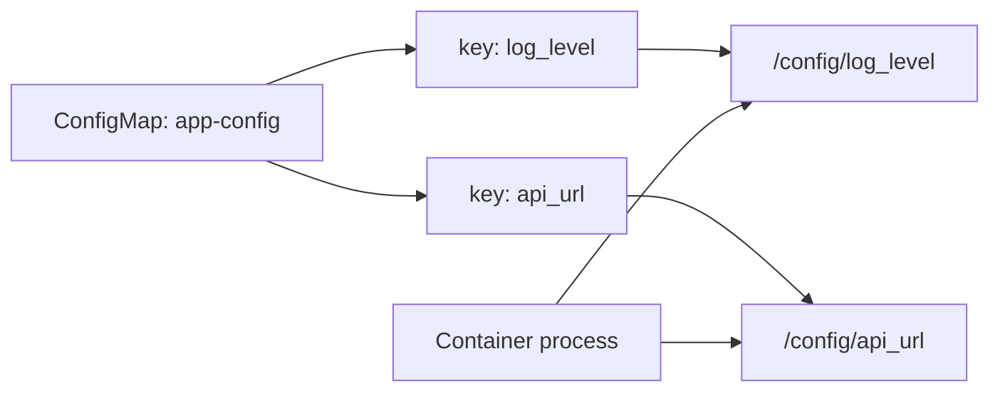

> **Complexity**: `[MEDIUM]` - Essential for stateful and multi-container application design
>
> **Time to Complete**: 50-60 minutes
>
> **Prerequisites**: Module 1.3 (Multi-Container Pods), basic Pod manifests, ConfigMaps, and Secrets

---

## Learning Outcomes

After completing this module, you will be able to:

- **Design** Pod storage layouts that correctly separate ephemeral scratch data, mounted configuration, sensitive files, and persistent application data.
- **Configure** `emptyDir`, ConfigMap, Secret, projected, `hostPath`, and PersistentVolumeClaim volumes in runnable Kubernetes v1.35+ manifests.
- **Debug** volume-related Pod failures by interpreting events, PVC status, mount paths, file permissions, and container-level symptoms.
- **Compare** `subPath`, full-directory mounts, and projected volumes, then justify which pattern fits a given application constraint.
- **Evaluate** whether a workload should keep data in the container filesystem, an `emptyDir`, or a PersistentVolumeClaim based on lifecycle and failure behavior.

---

## Why This Module Matters

A developer ships an image that works perfectly in local testing, then the same application loses uploaded files after every restart in Kubernetes. The container logs look normal, the Deployment is healthy, and the team spends hours investigating application code that was never the real problem. The missing design decision was storage lifecycle: the team wrote important data into a place Kubernetes was allowed to throw away.

Volumes are where Pod design becomes operationally real. Containers are intentionally disposable, but applications still need files for configuration, credentials, temporary processing, shared handoff, and durable state. A CKAD candidate does not need to administer the storage backend, yet they must know how to request storage, mount it safely, and diagnose why a Pod cannot see the files it expects.

The exam also rewards precision under time pressure. A single wrong `mountPath`, a missing `volumeMounts` entry, or an accidental ConfigMap directory overlay can turn a valid-looking manifest into a broken workload. This module teaches the design reasoning first, then the YAML patterns, then the debugging workflow you can apply when the scheduler, kubelet, or container process reports that storage is not behaving as intended.

> **The Workspace Analogy**
>
> A container filesystem is like writing notes on a borrowed whiteboard; it is useful while the session lasts, but nobody promises the writing survives when the room is reset. An `emptyDir` is like a shared table assigned to one meeting; everyone in that meeting can use it, but it is cleared when the meeting ends. A PersistentVolumeClaim is like a reserved storage locker; the application can come back later and find the stored files even after the original Pod is gone.

---

## Core Content

### 1. Build the Storage Mental Model Before Writing YAML

Kubernetes separates the volume source from the place where a container sees that source. The `spec.volumes` list says what storage exists for the Pod, while each container's `volumeMounts` list says where that storage appears inside that particular container. This two-part model is the root of most volume bugs: defining a volume does nothing for a container until that container mounts it.

A Pod can have several volumes, and each container can mount different subsets of those volumes at different paths. This is powerful because a sidecar can share a scratch directory with the main container, while a Secret can be mounted only into the container that needs credentials. It also means you must reason at container scope, not just Pod scope, when debugging file visibility.

```text
+--------------------------------------------------------------------------------+
| Pod: report-runner                                                             |
|                                                                                |
|  +------------------------------+        +----------------------------------+  |
|  | Container: generator          |        | Container: web                   |  |
|  |                              |        |                                  |  |
|  | /work  -> volume: scratch    |        | /usr/share/nginx/html -> scratch |  |
|  | /conf  -> volume: app-config |        |                                  |  |
|  +------------------------------+        +----------------------------------+  |
|                                                                                |
|  Pod volume sources:                                                           |
|  - scratch: emptyDir, exists only for this Pod's lifetime                      |
|  - app-config: ConfigMap, files generated from ConfigMap keys                  |
+--------------------------------------------------------------------------------+
```

The first design question is not "Which YAML field do I need?" but "What lifecycle should this data have?" Data that can be recomputed after a Pod replacement usually belongs in `emptyDir` or the container filesystem. Data that must survive Pod replacement belongs behind a PersistentVolumeClaim. Configuration and credentials are not application state, so they normally come from ConfigMap, Secret, or projected volumes.

| Design Question | If the Answer Is Yes | Likely Volume Pattern | Why This Choice Fits |
|---|---|---|---|
| Should the data disappear when the Pod is deleted? | Yes | `emptyDir` | The lifecycle matches one Pod, which keeps cleanup simple and predictable. |
| Should two containers in the same Pod exchange files? | Yes | `emptyDir` | The shared volume gives both containers a common filesystem location. |
| Should the file content come from Kubernetes API objects? | Yes | ConfigMap, Secret, or projected volume | The content is managed separately from the image and can be mounted as files. |
| Should the data survive Pod deletion or rescheduling? | Yes | PersistentVolumeClaim | The claim decouples application data from the Pod's lifecycle. |
| Should the Pod inspect files on the node itself? | Rarely | `hostPath` | This couples the Pod to a node and is mainly useful for node-level tooling or labs. |

> **Active learning prompt:** Before reading further, classify three application paths from a real service you know: logs, uploaded files, and runtime cache. Decide whether each path should be container-local, `emptyDir`, ConfigMap or Secret backed, or PVC backed, then explain what failure would prove your choice wrong.

The second design question is "Who needs to see this data?" A volume mounted into one container is invisible to the other containers unless they also mount it. That behavior is intentional. You can grant the sidecar access to a shared directory without exposing database credentials to it, or you can mount a read-only ConfigMap into the application while leaving a writable scratch volume at a different path.

The third design question is "What existing files are at the mount path?" Mounting a volume at a directory path hides the image's original files at that path for the lifetime of the container. That is not a merge operation. If the image has useful defaults under `/etc/app` and you mount a ConfigMap at `/etc/app`, the ConfigMap view replaces the directory contents visible to the process.

### 2. Use `emptyDir` for Pod-Lifetime Scratch and Sharing

An `emptyDir` volume is created when the Pod is assigned to a node and exists as long as that Pod object exists on that node. If a container crashes and restarts inside the same Pod, the `emptyDir` contents remain. If the Pod is deleted, replaced by a Deployment rollout, evicted, or scheduled elsewhere, the contents are gone.

That lifecycle makes `emptyDir` ideal for temporary files, intermediate processing, and handoff between containers. It is not a durable storage solution, but it is often the right answer for multi-container Pods because both containers can mount the same volume. In CKAD tasks, `emptyDir` commonly appears with init containers, sidecars, and adapters that prepare or transform files before the main container reads them.

```yaml
apiVersion: v1
kind: Pod
metadata:
  name: emptydir-demo
spec:
  containers:
  - name: writer
    image: busybox:1.36
    command: ["sh", "-c", "date > /data/message && sleep 3600"]
    volumeMounts:
    - name: shared
      mountPath: /data
  - name: reader
    image: busybox:1.36
    command: ["sh", "-c", "while true; do cat /data/message; sleep 30; done"]
    volumeMounts:
    - name: shared
      mountPath: /data
  volumes:
  - name: shared
    emptyDir: {}
```

Run the manifest with `kubectl apply -f emptydir-demo.yaml`. In the remaining examples, `k` is used as the common shell alias for `kubectl`; create it with `alias k=kubectl` if your environment does not already provide it.

```bash
k apply -f emptydir-demo.yaml
k get pod emptydir-demo
k logs emptydir-demo -c reader
```

The important observation is that the `reader` container can see the file created by the `writer` container because both mount the same volume name. If you removed the `volumeMounts` entry from `reader`, the volume would still exist at Pod scope, but the reader process would not see `/data/message`. This is why volume bugs often look like ordinary application file-not-found errors.

You can also request a memory-backed `emptyDir` for high-speed scratch data. This is useful for small temporary files that benefit from RAM performance, but it is not free: memory-backed volume usage counts against memory pressure on the node and can contribute to eviction or OOM behavior. Use a `sizeLimit` so the scratch directory cannot grow without bound.

```yaml
apiVersion: v1
kind: Pod
metadata:
  name: memory-cache-demo
spec:
  containers:
  - name: worker
    image: busybox:1.36
    command: ["sh", "-c", "dd if=/dev/zero of=/cache/blob bs=1M count=10 && sleep 3600"]
    volumeMounts:
    - name: cache
      mountPath: /cache
  volumes:
  - name: cache
    emptyDir:
      medium: Memory
      sizeLimit: 128Mi
```

`emptyDir` is also a clean fit for init-container preparation. An init container can populate a directory, exit successfully, and leave the files for the main container. This avoids building runtime-generated files into the image while still keeping the final container simple.

```yaml
apiVersion: v1
kind: Pod
metadata:
  name: init-volume-demo
spec:
  initContainers:
  - name: prepare-site
    image: busybox:1.36
    command: ["sh", "-c", "echo '<h1>ready</h1>' > /site/index.html"]
    volumeMounts:
    - name: site
      mountPath: /site
  containers:
  - name: nginx
    image: nginx:1.27-alpine
    ports:
    - containerPort: 80
    volumeMounts:
    - name: site
      mountPath: /usr/share/nginx/html
  volumes:
  - name: site
    emptyDir: {}
```

> **Active learning prompt:** Predict what happens if the `nginx` container crashes and restarts in the same Pod after the init container wrote `index.html`. Then predict what happens if you delete the Pod and create a new one from the same manifest.

A subtle but important exam detail is that a container restart is not the same thing as Pod replacement. The `emptyDir` survives container restarts within the same Pod, so it can hide bugs during testing. A rollout, eviction, or manual Pod deletion creates a new `emptyDir`, and any files from the old Pod are lost.

### 3. Mount ConfigMaps and Secrets as Files Without Hiding Needed Directories

ConfigMap and Secret volumes turn Kubernetes API object data into files inside a container. Each key becomes a file by default, and the file content is the value stored under that key. This lets you keep environment-specific configuration and sensitive material out of the image while still presenting ordinary files to applications that expect file-based input.

```bash
k create configmap app-config \
  --from-literal=log_level=debug \
  --from-literal=api_url=http://api.default.svc.cluster.local
```

```yaml
apiVersion: v1
kind: Pod
metadata:
  name: config-demo
spec:
  containers:
  - name: app
    image: busybox:1.36
    command: ["sh", "-c", "cat /config/log_level; cat /config/api_url; sleep 3600"]
    volumeMounts:
    - name: config
      mountPath: /config
      readOnly: true
  volumes:
  - name: config
    configMap:
      name: app-config
```



The diagram shows why ConfigMap volume mounts are convenient: the application reads files, while Kubernetes supplies the file content. The application does not need to call the Kubernetes API. The trade-off is that a full directory mount changes what the process sees at that mount path.

If the image already contains files under `/etc/app`, mounting a ConfigMap at `/etc/app` hides those image files. This surprises developers who expect Kubernetes to add one file into the directory. Kubernetes mounts a filesystem at the target path, so the mounted volume view replaces the image directory view for that container.

```yaml
apiVersion: v1
kind: Pod
metadata:
  name: config-directory-overlay
spec:
  containers:
  - name: app
    image: busybox:1.36
    command: ["sh", "-c", "ls -la /etc/app && sleep 3600"]
    volumeMounts:
    - name: config
      mountPath: /etc/app
      readOnly: true
  volumes:
  - name: config
    configMap:
      name: app-config
```

When you need only one file, use `items` to choose the key and `subPath` to mount that single file at a precise location. This avoids replacing the whole directory, but it introduces another trade-off: `subPath` mounts do not receive live ConfigMap or Secret updates in the same way as ordinary projected directory mounts.

```bash
k create configmap single-file-config \
  --from-literal=config.yaml='mode: safe'
```

```yaml
apiVersion: v1
kind: Pod
metadata:
  name: config-subpath-demo
spec:
  containers:
  - name: app
    image: busybox:1.36
    command: ["sh", "-c", "cat /etc/app/config.yaml && sleep 3600"]
    volumeMounts:
    - name: config
      mountPath: /etc/app/config.yaml
      subPath: config.yaml
      readOnly: true
  volumes:
  - name: config
    configMap:
      name: single-file-config
      items:
      - key: config.yaml
        path: config.yaml
```

Secrets use the same volume pattern, but they are intended for sensitive values such as passwords, tokens, and private keys. Mount Secret volumes read-only unless the application has a very specific reason to write into the mount path. The files are made available from memory-backed storage on the node, but Kubernetes Secrets are still not a complete secrets-management system by themselves.

```bash
k create secret generic db-creds \
  --from-literal=username=admin \
  --from-literal=password=secret123
```

```yaml
apiVersion: v1
kind: Pod
metadata:
  name: secret-demo
spec:
  containers:
  - name: app
    image: busybox:1.36
    command: ["sh", "-c", "ls -l /secrets && cat /secrets/username && sleep 3600"]
    volumeMounts:
    - name: db-secrets
      mountPath: /secrets
      readOnly: true
  volumes:
  - name: db-secrets
    secret:
      secretName: db-creds
      defaultMode: 0400
```

File modes matter when applications run as non-root users. If a process cannot read a Secret file, check the file owner, mode, `runAsUser`, and `fsGroup` before assuming the Secret data is missing. A permission problem often presents as an application startup failure rather than a Kubernetes scheduling failure.

### 4. Combine Multiple Sources with Projected Volumes

A projected volume combines several sources into one directory. This is useful when an application expects all runtime inputs under one path but the data comes from different Kubernetes objects. You can project ConfigMaps, Secrets, Downward API fields, and service account tokens into a single volume with explicit paths.

```bash
k create configmap projected-config \
  --from-literal=app.properties='feature=true'
k create secret generic projected-secret \
  --from-literal=token=abc123
```

```yaml
apiVersion: v1
kind: Pod
metadata:
  name: projected-demo
  labels:
    app: projected-demo
    tier: lesson
spec:
  containers:
  - name: app
    image: busybox:1.36
    command: ["sh", "-c", "find /projected -type f -maxdepth 2 -print -exec cat {} \\; && sleep 3600"]
    volumeMounts:
    - name: all-runtime-inputs
      mountPath: /projected
      readOnly: true
  volumes:
  - name: all-runtime-inputs
    projected:
      sources:
      - configMap:
          name: projected-config
          items:
          - key: app.properties
            path: config/app.properties
      - secret:
          name: projected-secret
          items:
          - key: token
            path: secret/token
      - downwardAPI:
          items:
          - path: pod/labels
            fieldRef:
              fieldPath: metadata.labels
```

Projected volumes reduce mount clutter inside the container, but they can make ownership of each file less obvious to a future maintainer. Use explicit `items` and meaningful paths so the volume contents explain themselves. In an exam setting, projected volumes are usually worthwhile when the task explicitly asks to combine multiple inputs in one directory.

```text
+------------------------------------------------------------+
| /projected                                                 |
|                                                            |
|  config/app.properties   <- ConfigMap key                  |
|  secret/token            <- Secret key                     |
|  pod/labels              <- Downward API field             |
|                                                            |
| One container mount, several Kubernetes-backed file sources |
+------------------------------------------------------------+
```

Do not use projected volumes just because they look tidy. Separate mounts are clearer when an application has distinct directories such as `/etc/app`, `/var/run/secrets`, and `/tmp/work`. Use the pattern that makes the runtime contract easiest to inspect and debug.

### 5. Request Durable Storage with PersistentVolumeClaims

A PersistentVolumeClaim is a developer-facing request for durable storage. The cluster administrator or storage provisioner handles the backing PersistentVolume, while the workload references the claim by name. In CKAD work, you normally create or use the PVC and mount it into a Pod; you are not expected to design the storage backend.

```yaml
apiVersion: v1
kind: PersistentVolumeClaim
metadata:
  name: data-pvc
spec:
  accessModes:
  - ReadWriteOnce
  resources:
    requests:
      storage: 1Gi
```

The PVC lifecycle is separate from the Pod lifecycle. If the Pod is deleted, the claim remains unless you delete it. The underlying storage behavior after PVC deletion depends on the PersistentVolume reclaim policy and storage class, which is more of an administration concern, but a developer still needs to understand that the PVC is the durable contract the Pod consumes.

```yaml
apiVersion: v1
kind: Pod
metadata:
  name: pvc-demo
spec:
  containers:
  - name: app
    image: nginx:1.27-alpine
    volumeMounts:
    - name: data
      mountPath: /usr/share/nginx/html
  volumes:
  - name: data
    persistentVolumeClaim:
      claimName: data-pvc
```

PVC access modes describe how the volume may be mounted by nodes, not how many processes can open files inside one container. `ReadWriteOnce` means the volume can be mounted read-write by one node at a time. For many developer workloads, especially a single-replica Pod, that is enough. Multi-replica workloads that write shared files need a storage class and access mode that actually support the intended sharing pattern.

| Access Mode | Short Name | What It Allows | Common Developer Interpretation |
|---|---|---|---|
| `ReadWriteOnce` | RWO | One node can mount the volume read-write. | Good for one writable Pod replica or workloads pinned by controller behavior. |
| `ReadOnlyMany` | ROX | Many nodes can mount the volume read-only. | Useful for shared reference data that many Pods read but do not modify. |
| `ReadWriteMany` | RWX | Many nodes can mount the volume read-write. | Required for true multi-node shared writes, if the cluster storage supports it. |
| `ReadWriteOncePod` | RWOP | One Pod can mount the volume read-write. | Useful when the storage contract must be exclusive to a single Pod. |

A PVC can stay `Pending` when no matching PersistentVolume exists or dynamic provisioning cannot satisfy the request. The Pod that references it will also remain blocked because kubelet cannot mount storage that has not been bound. This is one of the most common volume troubleshooting paths in labs and exams.

```bash
k get pvc
k describe pvc data-pvc
k describe pod pvc-demo
```

When you see a Pod stuck in `Pending`, check the PVC before changing the container command. A missing or unbound claim is not an application bug. Kubernetes events usually tell you whether the scheduler is waiting for a claim to bind, whether the claim name is wrong, or whether the storage class cannot provision the requested volume.

### 6. Use `hostPath` Sparingly and Understand the Coupling

A `hostPath` volume mounts a path from the node filesystem into the Pod. It can be useful for local development, node-level agents, or exam tasks that explicitly ask for it, but it couples the Pod to whatever files exist on the chosen node. If the Pod is rescheduled to a different node, the same path may not exist or may contain different data.

```yaml
apiVersion: v1
kind: Pod
metadata:
  name: hostpath-demo
spec:
  containers:
  - name: inspector
    image: busybox:1.36
    command: ["sh", "-c", "ls -la /host-tmp && sleep 3600"]
    volumeMounts:
    - name: host-tmp
      mountPath: /host-tmp
      readOnly: true
  volumes:
  - name: host-tmp
    hostPath:
      path: /tmp
      type: Directory
```

The `type` field gives Kubernetes a simple expectation about what should exist at the node path. For example, `Directory` requires an existing directory, while `DirectoryOrCreate` creates one if missing. That convenience can hide portability problems, so use it deliberately and avoid treating `hostPath` as a replacement for persistent storage.

For CKAD-style development work, `hostPath` is rarely the best default. If the application needs durable data, prefer a PVC. If it needs scratch space, prefer `emptyDir`. If it needs node diagnostics or access to a specific node file path, then `hostPath` may be appropriate because the coupling is the point of the design.

### 7. Mount Paths, `subPath`, and File Visibility

Volume mounts operate at filesystem paths, and path choice determines what the application can see. A directory mount at `/data` makes the volume appear as the directory `/data`. A single-file `subPath` mount at `/etc/app/config.yaml` makes one file appear at that exact path. Both patterns are valid, but they solve different problems.

| Pattern | Example Mount | Strength | Risk |
|---|---|---|---|
| Full directory mount | `/config` | Simple, updates are easier to reason about for ConfigMap and Secret volumes. | Hides any image files already present at that directory path. |
| Specific keys with `items` | `/config` with selected files | Keeps only the files the application should read. | Still replaces the mounted directory view. |
| Single file with `subPath` | `/etc/app/config.yaml` | Preserves other files in the image directory. | Does not receive live ConfigMap or Secret updates like normal directory projection. |
| Separate mounts | `/config`, `/secrets`, `/work` | Clear ownership and security boundaries. | More verbose manifest, especially for many small inputs. |

> **Active learning prompt:** An image has default files at `/etc/nginx/conf.d`, and the task asks you to add one custom server block without hiding the others. Which mount pattern would you choose, and what update behavior trade-off would you accept?

The safest debugging habit is to inspect from inside the container after the Pod starts. Kubernetes can successfully mount a volume while your application still fails because it reads a different path than you mounted. Running `ls`, `cat`, and `id` inside the container often finds the mismatch faster than reading the YAML repeatedly.

```bash
k exec config-subpath-demo -- ls -la /etc/app
k exec config-subpath-demo -- cat /etc/app/config.yaml
k exec secret-demo -- id
k exec secret-demo -- ls -l /secrets
```

`subPath` is not bad, but it is often overused. Choose it when you need to place one file into a directory that must keep image-provided files. Avoid it when your main goal is live configuration updates from ConfigMaps or Secrets. In that case, mount the ConfigMap or Secret as a directory and design the application to read from that mounted directory.

### 8. Debug Volume Problems in a Predictable Order

Volume troubleshooting is easier when you separate Kubernetes object state from container runtime symptoms. First, confirm the referenced objects exist. Second, confirm the Pod events show successful scheduling and mounting. Third, inspect the container filesystem. Fourth, evaluate permissions and user IDs.

```bash
k get pod
k describe pod myapp
k get pvc
k describe pvc data-pvc
k get configmap app-config
k get secret db-creds
```

The Pod event stream is usually the fastest source of truth for mount failures. A typo in a ConfigMap name, a missing Secret, or an unbound PVC appears before the application process even has a chance to run. If events are clean but the application fails, move inside the container and inspect the actual path.

| Symptom | Most Likely Cause | What to Check First | Practical Fix |
|---|---|---|---|
| Pod stays `Pending` and references storage in events. | PVC is missing, unbound, or waiting for provisioning. | `k get pvc` and `k describe pvc <name>`. | Create the correct claim, fix the claim name, or adjust requested storage. |
| Pod fails with ConfigMap or Secret not found. | The volume source name does not match an existing object in the namespace. | `k get configmap` or `k get secret` in the same namespace. | Create the object or correct the `name` or `secretName` field. |
| Application reports file not found. | The container did not mount the volume at the path the app reads. | `k exec <pod> -- ls -la <path>`. | Align `mountPath`, app config, and file names. |
| Application reports permission denied. | File mode, owner, `runAsUser`, or group access is wrong. | `k exec <pod> -- id` and `ls -l` on the mounted files. | Set `defaultMode`, `runAsUser`, or `fsGroup` to match the process. |
| ConfigMap update does not appear in the container. | The file was mounted with `subPath`, or the app cached the old value. | Inspect the volume mount pattern and application reload behavior. | Restart the Pod or avoid `subPath` for live-updated config. |
| Files disappear after rollout or manual Pod deletion. | Data was stored in container filesystem or `emptyDir`. | Check whether a PVC backs the path. | Move durable data to a PersistentVolumeClaim. |

A common permission fix is to run the process with a known user and grant group ownership to mounted volume files through Pod security context. This is especially useful for writable persistent volumes where the application process should not run as root. Always check the image's expected user model before changing security context fields.

```yaml
apiVersion: v1
kind: Pod
metadata:
  name: pvc-permission-demo
spec:
  securityContext:
    fsGroup: 1000
  containers:
  - name: app
    image: busybox:1.36
    command: ["sh", "-c", "id && echo ok > /data/result.txt && sleep 3600"]
    securityContext:
      runAsUser: 1000
      runAsGroup: 1000
    volumeMounts:
    - name: data
      mountPath: /data
  volumes:
  - name: data
    persistentVolumeClaim:
      claimName: data-pvc
```

Do not blindly add `fsGroup` to every Pod. It can change ownership behavior for supported volume types and may add startup overhead for large volumes. Use it when the symptom points to group access or when the application image is intentionally non-root and needs write access to a mounted filesystem.

### 9. Worked Example: Share Generated Content Between Containers

**Problem:** A team wants one container to generate a static report and another container to serve it with NGINX. Their first attempt writes the report into the generator container's local filesystem, so the web container returns the default NGINX page instead of the generated report.

**Step 1: Identify the lifecycle and sharing requirement.** The report only needs to exist for the lifetime of the Pod, and both containers are in the same Pod. That points to `emptyDir`, not a PVC. The data is shared but not durable, so persistent storage would add unnecessary complexity.

**Step 2: Mount the same volume into both containers.** The generator writes to `/work`, while NGINX serves from `/usr/share/nginx/html`. The paths differ, but the volume name is the same, so both paths point to the same Pod-level storage.

```yaml
apiVersion: v1
kind: Pod
metadata:
  name: report-pod
  labels:
    app: report-pod
spec:
  containers:
  - name: generator
    image: busybox:1.36
    command:
    - sh
    - -c
    - |
      while true; do
        date > /work/index.html
        echo "report generated by sidecar" >> /work/index.html
        sleep 60
      done
    volumeMounts:
    - name: report
      mountPath: /work
  - name: web
    image: nginx:1.27-alpine
    ports:
    - containerPort: 80
    volumeMounts:
    - name: report
      mountPath: /usr/share/nginx/html
  volumes:
  - name: report
    emptyDir: {}
```

**Step 3: Apply and verify from both containers.** The generator should create `index.html`, and the web container should see the same file at its own mount path. This proves that the volume source is shared even though each container uses a different internal directory.

```bash
k apply -f report-pod.yaml
k wait --for=condition=Ready pod/report-pod --timeout=90s
k exec report-pod -c generator -- cat /work/index.html
k exec report-pod -c web -- cat /usr/share/nginx/html/index.html
```

**Step 4: Interpret the result.** If the generator can read `/work/index.html` but the web container cannot read `/usr/share/nginx/html/index.html`, the problem is not `emptyDir` itself. The likely mistake is a missing `volumeMounts` entry, mismatched volume name, or a different mount path than the one being inspected.

**Step 5: Connect the pattern to the exam.** When a task says that two containers in one Pod must exchange files, reach for `emptyDir` first unless the task explicitly requires data to survive Pod deletion. The key implementation detail is mounting the same volume name into every container that needs access.

### 10. Worked Example: Diagnose a Pod Blocked by a PVC

**Problem:** A Pod named `uploads-api` stays in `Pending` after deployment. The application image is valid, and the command is simple, but the Pod never starts. The manifest references a volume named `uploads` using `persistentVolumeClaim.claimName: uploads-pvc`.

**Step 1: Check Pod events before changing the image.** A storage dependency can block Pod startup before the container process ever runs. The first command should inspect scheduling and mount-related events.

```bash
k describe pod uploads-api
```

**Step 2: Inspect PVC state.** If the event mentions a claim, check whether the claim exists and whether it is bound. A missing claim and a pending claim require different fixes.

```bash
k get pvc
k describe pvc uploads-pvc
```

**Step 3: Fix the right failure.** If the PVC is missing, create it or correct the Pod's `claimName`. If the PVC exists but is `Pending`, check requested storage, access mode, and storage class behavior. In a CKAD environment with dynamic provisioning, a simple claim may bind automatically after it is created.

```yaml
apiVersion: v1
kind: PersistentVolumeClaim
metadata:
  name: uploads-pvc
spec:
  accessModes:
  - ReadWriteOnce
  resources:
    requests:
      storage: 1Gi
```

**Step 4: Re-check the Pod after the claim binds.** Kubernetes may start the Pod automatically once the claim becomes usable. If the Pod still fails after binding, move to container logs and filesystem inspection because the failure has moved from scheduling dependency to runtime behavior.

```bash
k apply -f uploads-pvc.yaml
k get pvc uploads-pvc
k describe pod uploads-api
```

**Step 5: Explain the lesson.** A `Pending` Pod with an unbound PVC is not fixed by changing `command`, `args`, or container ports. The Pod is waiting for a storage contract to become valid. CKAD troubleshooting is faster when you follow the dependency chain instead of guessing from the application name.

### 11. Worked Example: Preserve Image Defaults While Adding One Config File

**Problem:** A container image ships default files under `/etc/app`, but the team needs to provide `/etc/app/config.yaml` from a ConfigMap. Their first manifest mounts the ConfigMap at `/etc/app`, and the application fails because the other default files are hidden.

**Step 1: Recognize the overlay behavior.** A directory volume mount replaces the visible contents of the target directory from the container's point of view. Kubernetes did not delete the image files, but the mounted volume hides them at that path.

**Step 2: Create a ConfigMap with the one file the app needs.** The key should match the file name you plan to mount through `subPath`, because `subPath` selects a single entry from the volume.

```bash
k create configmap app-file-config \
  --from-literal=config.yaml='mode: production'
```

**Step 3: Mount the key as a single file.** The `mountPath` is the final file path inside the container, and `subPath` names the file from the volume. This keeps the rest of `/etc/app` visible from the image.

```yaml
apiVersion: v1
kind: Pod
metadata:
  name: single-config-file
spec:
  containers:
  - name: app
    image: busybox:1.36
    command: ["sh", "-c", "cat /etc/app/config.yaml && sleep 3600"]
    volumeMounts:
    - name: app-file-config
      mountPath: /etc/app/config.yaml
      subPath: config.yaml
      readOnly: true
  volumes:
  - name: app-file-config
    configMap:
      name: app-file-config
```

**Step 4: Record the trade-off.** This pattern solves the directory overlay problem, but the mounted file behaves like a snapshot for update purposes. If the team requires live config refresh, they should mount the ConfigMap as a directory and configure the application to read from that directory instead.

**Step 5: Verify the file from inside the container.** The fastest confidence check is to read the exact path the app uses. If that path works but the app still fails, the remaining issue is likely application-level parsing, not Kubernetes volume wiring.

```bash
k apply -f single-config-file.yaml
k wait --for=condition=Ready pod/single-config-file --timeout=90s
k exec single-config-file -- cat /etc/app/config.yaml
```

### 12. Decision Checklist for CKAD Volume Tasks

When a CKAD task mentions files, pause long enough to classify the file before writing YAML. The storage choice is usually clear once you identify lifecycle, visibility, mutability, and security. This short design pass prevents most false starts.

| File Need | Strong Default | Reasoning Shortcut | Red Flag |
|---|---|---|---|
| Temporary scratch data for one Pod | `emptyDir` | Data can disappear with the Pod. | Requirement says data must survive replacement. |
| Handoff between init and app container | `emptyDir` | Both containers share a Pod-scoped directory. | Handoff must remain after Pod deletion. |
| Application config file | ConfigMap volume | Kubernetes owns non-sensitive configuration separately from the image. | Mounting over a directory with required image files. |
| Password or token file | Secret volume | Sensitive data should not be baked into the image or plain ConfigMap. | Mounted writable or exposed to containers that do not need it. |
| Durable uploaded data | PVC | Data lifecycle must outlive the Pod. | Multiple replicas write concurrently without RWX support. |
| Node filesystem inspection | `hostPath` | The node path itself is the target. | Used as a shortcut for normal application persistence. |

This checklist also keeps assessment aligned with real work. A senior developer does not memorize volume types in isolation; they map failure modes to lifecycle contracts. If the consequence of losing the file is harmless, do not over-engineer. If the consequence is data loss, do not hide behind a restartable Pod abstraction.

---

## Did You Know?

- **ConfigMap and Secret volume updates are eventually reflected for ordinary directory mounts, but `subPath` mounts behave like snapshots.** If your application must receive live configuration changes, avoid single-file `subPath` unless you also plan a Pod restart or a separate reload mechanism.

- **An `emptyDir` survives container restarts but not Pod replacement.** This distinction matters because a crash loop inside one Pod may preserve temporary files, while a Deployment rollout creates a new Pod with a fresh empty directory.

- **Secret volume file modes can break non-root applications even when the Secret exists.** When a process runs with `runAsUser`, verify file mode, group access, and `fsGroup` before assuming Kubernetes failed to mount the Secret.

- **PVC access modes describe node-level mount capability, not application-level locking.** A volume that supports `ReadWriteMany` still needs application-safe concurrency if several Pods write to the same files.

---

## Common Mistakes

| Mistake | Why It Hurts | How to Fix It |
|---|---|---|
| Defining `spec.volumes` but forgetting the container `volumeMounts` entry. | The Pod has a volume source, but the container filesystem never receives a mount at the expected path. | Add a matching `volumeMounts` entry to every container that needs the volume. |
| Mounting a ConfigMap over a directory that contains required image files. | The mounted volume hides the original directory contents, so the application loses defaults it expected to read. | Mount to a dedicated directory or use `subPath` for one file while accepting the update trade-off. |
| Using `emptyDir` for user uploads or database files that must survive Pod deletion. | Data disappears during rollout, eviction, or manual replacement, causing real application data loss. | Use a PersistentVolumeClaim for durable state and verify the claim binds before relying on it. |
| Assuming a PVC problem is an image or command problem. | A Pod can stay `Pending` because storage is unavailable before the container ever starts. | Inspect `k describe pod`, `k get pvc`, and `k describe pvc` before changing runtime fields. |
| Mounting Secrets without checking file permissions for a non-root process. | The Secret exists, but the application receives permission denied and may crash during startup. | Set appropriate `defaultMode`, `runAsUser`, `runAsGroup`, or Pod-level `fsGroup`. |
| Expecting `subPath` ConfigMap updates to appear automatically in a running container. | The file remains at the old content, which makes configuration changes look ignored. | Restart the Pod after updates or avoid `subPath` when live updates are required. |
| Choosing `hostPath` as a shortcut for persistence. | The Pod becomes tied to node-local files and behaves differently after rescheduling. | Use a PVC for application data unless the task explicitly requires node filesystem access. |
| Reusing the same mount path for unrelated volumes in one container. | Later mounts can hide earlier content, and the manifest becomes difficult to reason about. | Use separate, purposeful directories such as `/config`, `/secrets`, `/work`, and `/data`. |

---

## Quiz

1. **Your team runs a Pod with two containers: one downloads a generated report, and the other serves files through NGINX. The report does not need to survive Pod deletion, but both containers must see it while the Pod is running. What volume pattern should you implement, and what would you verify after applying the manifest?**

   <details>
   <summary>Answer</summary>

   Use an `emptyDir` volume mounted into both containers. The downloader can mount it at a working path such as `/work`, while NGINX can mount the same volume name at `/usr/share/nginx/html`. After applying the manifest, verify that the file exists from both containers with `k exec <pod> -c <container> -- cat <path>`. This checks the important design point: the volume source is shared at Pod scope, but each container only sees it where that container mounts it.

   </details>

2. **A Pod remains `Pending` after you add `persistentVolumeClaim.claimName: uploads-pvc` to its manifest. The image is known to work, and there are no application logs. What should you check first, and why is changing the command unlikely to help?**

   <details>
   <summary>Answer</summary>

   Check `k describe pod <pod>`, `k get pvc`, and `k describe pvc uploads-pvc`. A Pod that references a missing or unbound PVC can be blocked before any container starts, which means the application command has not run yet. Changing `command` or `args` does not solve an unsatisfied storage dependency. The correct fix is to create the claim, correct the claim name, or adjust the PVC request so it can bind.

   </details>

3. **An application image contains defaults under `/etc/app`, but the team mounts a ConfigMap at `/etc/app` and the app starts failing because default files are missing. How would you preserve the defaults while still providing `/etc/app/config.yaml` from Kubernetes?**

   <details>
   <summary>Answer</summary>

   Mount the ConfigMap key as a single file using `subPath`, with `mountPath: /etc/app/config.yaml` and `subPath: config.yaml`. A full directory mount at `/etc/app` hides the image-provided directory contents, while a single-file `subPath` mount places one file at the desired path. The trade-off is that `subPath` does not behave like a live-updating ConfigMap directory mount, so the Pod should be restarted or otherwise reloaded after config changes.

   </details>

4. **A non-root container mounts a Secret at `/secrets`, but the application reports permission denied while reading `/secrets/password`. The Secret exists and the Pod is running. What debugging commands and manifest fields would you use to resolve the issue?**

   <details>
   <summary>Answer</summary>

   Inspect the runtime user and file permissions with commands such as `k exec <pod> -- id` and `k exec <pod> -- ls -l /secrets`. Then compare the output with the Secret volume's `defaultMode` and the container or Pod `securityContext`. Depending on the mismatch, set a readable `defaultMode`, align `runAsUser` and `runAsGroup`, or use Pod-level `fsGroup` so the process can read the mounted files without running as root.

   </details>

5. **A Deployment writes thumbnail cache files to an `emptyDir`. After each rollout, the service spends several minutes regenerating thumbnails, but no user data is lost. Should you change the volume to a PVC? Justify the decision instead of naming a volume type only.**

   <details>
   <summary>Answer</summary>

   The right choice depends on whether the warmup cost is acceptable. `emptyDir` is correct if the cache is disposable and regeneration time is tolerable, because it keeps storage simple and automatically clears stale files with each Pod. A PVC is justified if the warmup cost harms availability or creates expensive repeated work. The key reasoning is lifecycle and business impact: caches can be ephemeral, but a cache with unacceptable rebuild cost may deserve durable storage.

   </details>

6. **A team wants three replicas of an upload service to write to the same shared directory. They create one PVC with `ReadWriteOnce`, mount it in all replicas, and see inconsistent scheduling behavior. What design issue should you raise?**

   <details>
   <summary>Answer</summary>

   `ReadWriteOnce` allows read-write mounting by one node, so it is not a general solution for multi-node shared writes across replicas. The team should evaluate whether the application really needs shared filesystem writes, whether a storage class supports `ReadWriteMany`, and whether the application is safe when several Pods write concurrently. If shared writes are not required, each replica should use its own storage pattern or write uploads to an external service designed for concurrency.

   </details>

7. **A ConfigMap is mounted as a directory at `/config`, and the application reads `/config/log_level`. After updating the ConfigMap, the file eventually changes in the container, but the application still behaves as if the old value is active. What Kubernetes behavior and application behavior do you need to separate?**

   <details>
   <summary>Answer</summary>

   Separate file projection from application reload behavior. Kubernetes may update the mounted file for an ordinary ConfigMap directory mount, but the application might read the file only at startup or cache the value internally. Verify the file content with `k exec <pod> -- cat /config/log_level`. If the file changed but behavior did not, restart or signal the application according to its reload mechanism. If the file did not change and `subPath` is used, restart the Pod or remove the `subPath` pattern.

   </details>

---

## Hands-On Exercise

**Task:** Build and debug a Pod storage layout that uses `emptyDir` for shared generated content, a ConfigMap for application settings, a Secret for sensitive input, and a PVC for durable output. The goal is not only to make the manifests apply, but to prove that each mounted path has the lifecycle and visibility the application expects.

**Scenario:** A small reporting workload generates an HTML report, serves it through NGINX, reads its display mode from a ConfigMap, reads a token from a Secret, and writes an audit marker to durable storage. The generated HTML can disappear with the Pod, but the audit marker should remain on the PVC after the Pod is replaced.

**Step 1: Prepare an isolated namespace and command alias.**

```bash
alias k=kubectl
k create namespace volumes-lab
k config set-context --current --namespace=volumes-lab
```

**Step 2: Create the configuration and secret inputs.**

```bash
k create configmap report-config \
  --from-literal=mode=training \
  --from-literal=refresh_seconds=60

k create secret generic report-token \
  --from-literal=token=lab-token-123
```

**Step 3: Create a PVC for durable audit output.**

```yaml
apiVersion: v1
kind: PersistentVolumeClaim
metadata:
  name: report-audit-pvc
spec:
  accessModes:
  - ReadWriteOnce
  resources:
    requests:
      storage: 1Gi
```

```bash
k apply -f report-audit-pvc.yaml
k get pvc report-audit-pvc
```

**Step 4: Create the reporting Pod with four distinct storage responsibilities.**

```yaml
apiVersion: v1
kind: Pod
metadata:
  name: report-stack
  labels:
    app: report-stack
spec:
  securityContext:
    fsGroup: 1000
  initContainers:
  - name: write-report
    image: busybox:1.36
    command:
    - sh
    - -c
    - |
      echo "<h1>KubeDojo Volume Lab</h1>" > /site/index.html
      echo "<p>Mode: $(cat /config/mode)</p>" >> /site/index.html
      echo "<p>Token length: $(wc -c < /secret/token)</p>" >> /site/index.html
      date > /audit/created-at.txt
    volumeMounts:
    - name: generated-site
      mountPath: /site
    - name: report-config
      mountPath: /config
      readOnly: true
    - name: report-token
      mountPath: /secret
      readOnly: true
    - name: audit
      mountPath: /audit
  containers:
  - name: web
    image: nginx:1.27-alpine
    ports:
    - containerPort: 80
    volumeMounts:
    - name: generated-site
      mountPath: /usr/share/nginx/html
    - name: audit
      mountPath: /audit
  volumes:
  - name: generated-site
    emptyDir: {}
  - name: report-config
    configMap:
      name: report-config
  - name: report-token
    secret:
      secretName: report-token
      defaultMode: 0400
  - name: audit
    persistentVolumeClaim:
      claimName: report-audit-pvc
```

```bash
k apply -f report-stack.yaml
k wait --for=condition=Ready pod/report-stack --timeout=120s
```

**Step 5: Verify the visible files from the running container.**

```bash
k exec report-stack -c web -- cat /usr/share/nginx/html/index.html
k exec report-stack -c web -- cat /audit/created-at.txt
k describe pod report-stack
```

**Step 6: Prove the difference between `emptyDir` and PVC lifecycle.**

```bash
k delete pod report-stack
k apply -f report-stack.yaml
k wait --for=condition=Ready pod/report-stack --timeout=120s
k exec report-stack -c web -- cat /usr/share/nginx/html/index.html
k exec report-stack -c web -- cat /audit/created-at.txt
```

**Step 7: Introduce and fix one debugging failure.** Edit the Pod manifest so the ConfigMap volume references `report-config-missing`, apply it after deleting the Pod, and inspect the failure with `k describe pod report-stack`. Then restore the correct name and verify the Pod becomes ready again.

```bash
k delete pod report-stack
k apply -f report-stack-broken.yaml
k describe pod report-stack
k delete pod report-stack
k apply -f report-stack.yaml
k wait --for=condition=Ready pod/report-stack --timeout=120s
```

**Success Criteria:**

- [ ] You can explain which mounted path is backed by `emptyDir`, ConfigMap, Secret, and PVC, and why each lifecycle matches the scenario.
- [ ] `k get pvc report-audit-pvc` shows the claim is bound or otherwise valid in your lab environment before the Pod depends on it.
- [ ] `k exec report-stack -c web -- cat /usr/share/nginx/html/index.html` shows content generated by the init container through the shared `emptyDir`.
- [ ] `k exec report-stack -c web -- cat /audit/created-at.txt` shows the audit file written through the PVC-backed mount.
- [ ] After deleting and recreating the Pod, you can distinguish regenerated `emptyDir` content from PVC-backed audit content.
- [ ] When the ConfigMap name is intentionally broken, `k describe pod report-stack` leads you to the missing object rather than an image or command change.
- [ ] You can state when `subPath` would be useful for this workload and what update behavior trade-off it would introduce.

**Cleanup:**

```bash
k delete pod report-stack --ignore-not-found
k delete pvc report-audit-pvc --ignore-not-found
k delete configmap report-config --ignore-not-found
k delete secret report-token --ignore-not-found
k config set-context --current --namespace=default
k delete namespace volumes-lab --ignore-not-found
```

---

## Next Module

Continue to the [Part 1 Cumulative Quiz](./part1-cumulative-quiz/) to practice designing and debugging Pods, Jobs, multi-container patterns, and volume-backed workloads together.
