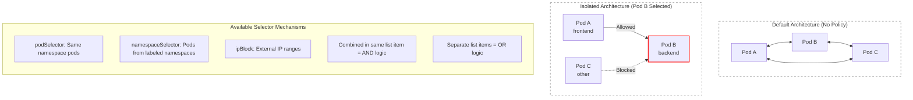

> **Complexity**: `[MEDIUM]` - Critical for cluster security; requires deep understanding of label selectors and YAML indentation rules.
>
> **Time to Complete**: 55-65 minutes
>
> **Prerequisites**: Module 5.1 (Services), understanding of Kubernetes labels, annotations, and basic networking concepts.

## Why This Module Matters

The 2018 Tesla cryptojacking incident (see *GUI Security*) <!-- incident-xref: tesla-2018-cryptojacking --> shows that flat pod networking without boundaries converts one workload compromise into a full-cluster privilege explosion.

By default, Kubernetes implements a flat network model. Every pod can communicate with every other pod across all namespaces without any restrictions. While this model simplifies initial development and service discovery, it is a massive security vulnerability in production environments. An attacker who breaches your frontend web server immediately has unrestricted network access to your backend APIs, your databases, and your external network interfaces. 

NetworkPolicies are the Kubernetes native solution to this problem. They allow you to design and enforce a Zero-Trust architecture within your cluster. By implementing NetworkPolicies, you define explicit, granular rules specifying exactly which pods are permitted to communicate with each other. This implements the principle of least privilege at the network layer, ensuring that even if a frontend pod is compromised, the attacker's blast radius is strictly contained. Mastering NetworkPolicies is not just a requirement for the CKAD exam; it is a fundamental survival skill for operating secure platforms in the modern cloud landscape.

## Learning Outcomes

After completing this exhaustive module, you will be able to:
- **Design** a default-deny zero-trust network posture with granular, explicit allow rules for required communication paths.
- **Implement** NetworkPolicies that precisely restrict ingress and egress traffic using complex combinations of pod, namespace, and IP block selectors.
- **Diagnose** and troubleshoot blocked inter-pod communication by analyzing NetworkPolicy rule evaluations and label intersections.
- **Compare** and contrast the behavioral differences between logical AND and logical OR selector combinations within policy definitions.
- **Evaluate** the compatibility of various Container Network Interfaces (CNI) regarding their support and enforcement of native network policies.

## The Zero-Trust Architecture in Kubernetes

### The Default Behavior: A Flat Network

When you provision a standard Kubernetes cluster (using version v1.35 or otherwise), the default network configuration is entirely permissive. The rules are simple and dangerous:
- All pods can communicate with all other pods, regardless of the namespace they reside in.
- All pods can initiate outbound connections to external endpoints (the internet).
- There are absolutely no internal firewalls or access control lists evaluated at the pod level.

Think of this architecture like an office building with no internal security. The front door might be locked (representing your external load balancer or Ingress controller), but once someone is inside the lobby, every single office, server room, and filing cabinet is wide open. 

### Enter NetworkPolicies: Granular Control

NetworkPolicies act as individual, intelligent keycard readers placed on the door of every single pod. They do not intercept traffic at a centralized firewall; instead, they distribute the security enforcement down to the node level (typically managed by your CNI via iptables or eBPF).

When you introduce NetworkPolicies, the rules of the cluster change:
1. **Policies are additive**: NetworkPolicies can only explicitly *allow* traffic. You cannot write a rule that says "deny traffic from Pod X." 
2. **Isolation by selection**: If a pod is targeted by a NetworkPolicy (via a `podSelector`), that pod becomes "isolated." Once a pod is isolated, it will reject all traffic *except* the traffic explicitly allowed by the policies targeting it.
3. **Default permissiveness**: If NO policy selects a pod, that pod remains in the default, fully permissive state. 
4. **CNI Dependency**: The Kubernetes API server merely stores these policy definitions. To actually enforce them, you must operate a Container Network Interface (CNI) plugin that supports NetworkPolicies (such as Calico, Cilium, or Weave).

### Visualizing Network Isolation

The following diagram illustrates the conceptual shift from a default flat network to an isolated network using policies.



## Anatomy of a NetworkPolicy

NetworkPolicies are standard Kubernetes objects defined via YAML. They live within a specific namespace and only target pods within that same namespace. Let us examine the fundamental structure.

```yaml
apiVersion: networking.k8s.io/v1
kind: NetworkPolicy
metadata:
  name: my-policy
  namespace: default
spec:
  podSelector:           # Which pods this policy applies to
    matchLabels:
      app: my-app
  policyTypes:           # What traffic types to control
  - Ingress              # Incoming traffic
  - Egress               # Outgoing traffic
  ingress:               # Rules for incoming traffic
  - from:
    - podSelector:
        matchLabels:
          role: frontend
  egress:                # Rules for outgoing traffic
  - to:
    - podSelector:
        matchLabels:
          role: database
```

### Breaking Down the Spec

- `podSelector`: This is the critical targeting mechanism. It defines which pods the policy applies to. If this is empty (`{}`), it selects *all* pods in the namespace.
- `policyTypes`: This array explicitly declares whether the policy intends to govern `Ingress`, `Egress`, or both. If you omit this field, Kubernetes will attempt to infer it based on the presence of `ingress` or `egress` rules, but explicitly defining it is a mandatory best practice.
- `ingress`: An array of allowed incoming traffic rules. Each rule can specify a source (`from`) and a port combination.
- `egress`: An array of allowed outgoing traffic rules. Each rule can specify a destination (`to`) and a port combination.

## Controlling Ingress (Incoming Traffic)

Ingress rules dictate who is allowed to initiate a connection TO the pods selected by the main `podSelector`. In the example below, the policy isolates any pod with the label `app: backend`. It then explicitly grants permission for pods labeled `app: frontend` to connect to it, provided they communicate over TCP on port 8080.

```yaml
spec:
  podSelector:
    matchLabels:
      app: backend
  policyTypes:
  - Ingress
  ingress:
  - from:
    - podSelector:
        matchLabels:
          app: frontend
    ports:
    - protocol: TCP
      port: 8080
```

Any pod attempting to reach the backend pod that does not carry the `app: frontend` label will experience a connection timeout. The traffic is silently dropped by the CNI at the network layer.

## Controlling Egress (Outgoing Traffic)

Egress rules govern where your isolated pods are permitted to initiate connections TO. This is vital for preventing data exfiltration or stopping a compromised pod from downloading malicious payloads from the internet.

```yaml
spec:
  podSelector:
    matchLabels:
      app: frontend
  policyTypes:
  - Egress
  egress:
  - to:
    - podSelector:
        matchLabels:
          app: backend
    ports:
    - protocol: TCP
      port: 8080
```

In this block, the `frontend` pod is isolated for outbound traffic. It is strictly limited to initiating connections to pods labeled `app: backend` on TCP port 8080. All other outbound attempts will fail.

> **Stop and think**: You apply a default-deny egress policy to a namespace. Suddenly, all your pods can't resolve DNS names and Service connections fail. What did you forget to allow, and why is DNS so critical for Kubernetes networking?

When you isolate a pod for Egress, you block *all* outgoing packets. This includes the UDP packets destined for `kube-dns` or `coredns` on port 53. Without DNS, your application cannot resolve `http://my-service.svc.cluster.local` to a cluster IP, breaking almost all internal communication. We will explore the solution for this shortly.

## Selector Types and Logical Operations

The true complexity of NetworkPolicies lies in how you define the sources (`from`) and destinations (`to`). 

### Targeting Pods Locally

The `podSelector` within an ingress or egress rule looks for matching labels on pods *within the same namespace* as the NetworkPolicy itself.

```yaml
ingress:
- from:
  - podSelector:
      matchLabels:
        role: frontend
```

### Targeting Entire Namespaces

To allow traffic crossing namespace boundaries, you use the `namespaceSelector`. This evaluates the labels attached to the Namespace objects themselves. 

```yaml
ingress:
- from:
  - namespaceSelector:
      matchLabels:
        env: production
```

Note: For this to work, the source namespace must physically have the label `env: production` applied to it.

> **Pause and predict**: Look at the two YAML examples below — "Combined (AND Logic)" and "Separate Items (OR Logic)." The only difference is indentation. Can you explain what each one allows before reading the descriptions?

### The Indentation Trap: AND vs. OR Logic

This is the most frequent source of failed CKAD scenarios and production outages. How you indent your selectors fundamentally changes the boolean logic of the policy.

**Combined (AND Logic)**
If you place a `podSelector` and a `namespaceSelector` under the *same* array item (the same `-`), they are combined with a logical AND.

```yaml
ingress:
- from:
  - namespaceSelector:
      matchLabels:
        env: production
    podSelector:           # Same list item = AND
      matchLabels:
        role: frontend
```
*Meaning:* Traffic is ONLY allowed if the source pod has the label `role: frontend` AND that pod lives in a namespace labeled `env: production`. 

**Separate Items (OR Logic)**
If you place them as separate items in the array (each with its own `-`), they are evaluated with a logical OR.

```yaml
ingress:
- from:
  - namespaceSelector:     # First item
      matchLabels:
        env: production
  - podSelector:           # Second item = OR
      matchLabels:
        role: frontend
```
*Meaning:* Traffic is allowed from ANY pod residing inside a namespace labeled `env: production`, OR it is allowed from ANY pod in the *local* namespace labeled `role: frontend`.

### IP Block Restrictions

Sometimes you need to control traffic heading to or coming from external entities outside the cluster. The `ipBlock` selector allows you to use CIDR notation to define these boundaries.

```yaml
ingress:
- from:
  - ipBlock:
      cidr: 10.0.0.0/8
      except:
      - 10.0.1.0/24
```
This rule allows traffic from the massive `10.0.0.0/8` private subnet, but explicitly excludes traffic originating from the smaller `10.0.1.0/24` block within it.

## Foundational Security Patterns

Every secure cluster utilizes a set of foundational, repeatable NetworkPolicy patterns. 

### Default Deny All Ingress

By targeting all pods in a namespace and providing no allow rules, you instantly lock down all incoming traffic.

```yaml
apiVersion: networking.k8s.io/v1
kind: NetworkPolicy
metadata:
  name: default-deny-ingress
spec:
  podSelector: {}          # Empty = select all pods
  policyTypes:
  - Ingress
  # No ingress rules = deny all
```

### Default Deny All Egress

Similarly, you can lock down all outbound traffic.

```yaml
apiVersion: networking.k8s.io/v1
kind: NetworkPolicy
metadata:
  name: default-deny-egress
spec:
  podSelector: {}
  policyTypes:
  - Egress
  # No egress rules = deny all
```

### Default Deny All (Complete Isolation)

Combine the two policy types for total lockdown.

```yaml
apiVersion: networking.k8s.io/v1
kind: NetworkPolicy
metadata:
  name: default-deny-all
spec:
  podSelector: {}
  policyTypes:
  - Ingress
  - Egress
```

### Allow All Ingress

Occasionally, you need to explicitly open a namespace up completely, perhaps for a temporary debugging session or a public-facing sandbox.

```yaml
apiVersion: networking.k8s.io/v1
kind: NetworkPolicy
metadata:
  name: allow-all-ingress
spec:
  podSelector: {}
  policyTypes:
  - Ingress
  ingress:
  - {}                     # Empty rule = allow all
```

### The Critical DNS Exemption

If you implement a Default Deny Egress policy, you will completely break your applications unless you explicitly carve out an exception for cluster DNS resolution.

```yaml
apiVersion: networking.k8s.io/v1
kind: NetworkPolicy
metadata:
  name: allow-dns
spec:
  podSelector: {}
  policyTypes:
  - Egress
  egress:
  - to:
    - namespaceSelector: {}
      podSelector:
        matchLabels:
          k8s-app: kube-dns
    ports:
    - protocol: UDP
      port: 53
```
This specific policy targets all pods in the local namespace and allows them to send UDP traffic on port 53 to any pod across the cluster labeled `k8s-app: kube-dns`.

## The Complete Architecture: Three-Tier App

To see how these concepts interlock, examine the policies required to secure a standard three-tier architecture (Frontend, Backend, Database). The frontend accepts all traffic but can only speak to the backend. The backend accepts traffic only from the frontend and speaks only to the database. The database accepts traffic only from the backend.

**The Frontend Policy:**
```yaml
# Frontend: can receive from anywhere, can reach backend
apiVersion: networking.k8s.io/v1
kind: NetworkPolicy
metadata:
  name: frontend-policy
spec:
  podSelector:
    matchLabels:
      tier: frontend
  policyTypes:
  - Ingress
  - Egress
  ingress:
  - {}                     # Allow all ingress
  egress:
  - to:
    - podSelector:
        matchLabels:
          tier: backend
    ports:
    - port: 8080
```

**The Backend Policy:**
```yaml
# Backend: only from frontend, can reach database
apiVersion: networking.k8s.io/v1
kind: NetworkPolicy
metadata:
  name: backend-policy
spec:
  podSelector:
    matchLabels:
      tier: backend
  policyTypes:
  - Ingress
  - Egress
  ingress:
  - from:
    - podSelector:
        matchLabels:
          tier: frontend
    ports:
    - port: 8080
  egress:
  - to:
    - podSelector:
        matchLabels:
          tier: database
    ports:
    - port: 5432
```

**The Database Policy:**
```yaml
# Database: only from backend
apiVersion: networking.k8s.io/v1
kind: NetworkPolicy
metadata:
  name: database-policy
spec:
  podSelector:
    matchLabels:
      tier: database
  policyTypes:
  - Ingress
  ingress:
  - from:
    - podSelector:
        matchLabels:
          tier: backend
    ports:
    - port: 5432
```

## Quick CLI Reference

Testing and managing policies from the command line is an essential administrative capability.

```bash
# Create NetworkPolicy (must use YAML)
k apply -f policy.yaml

# View NetworkPolicies
k get networkpolicy
k get netpol

# Describe policy to see translated rules
k describe netpol NAME

# Test connectivity aggressively using netshoot or wget
k exec pod1 -- wget -qO- --timeout=2 pod2-svc:80

# Check if CNI supports NetworkPolicies (look for calico, cilium)
k get pods -n kube-system | grep -E 'calico|cilium|weave'
```

## Did You Know?

1. **December 10, 2019:** Kubernetes v1.17 officially graduated the NetworkPolicy API to stable (General Availability), cementing its role as the undisputed standard for declarative network security in modern orchestrators.
2. **The CNI Illusion:** NetworkPolicies are entirely useless without a compatible Container Network Interface. A 2023 community survey revealed that over 35% of novice cluster administrators mistakenly believed native Kubernetes enforced these policies without installing solutions like Calico or Cilium.
3. **Blast Radius Reduction:** Security researchers note that implementing a strict default-deny policy can reduce the internal blast radius of a compromised workload by over 90%, neutralizing the lateral movement techniques utilized by ransomware.
4. **eBPF Revolution:** The introduction of eBPF (Extended Berkeley Packet Filter) in CNIs like Cilium (first released in 2017) allowed NetworkPolicy evaluation to bypass traditional iptables completely, resulting in throughput increases of up to 40% in high-traffic environments.

## Common Mistakes

| Mistake | Why It Hurts | Solution |
|---------|--------------|----------|
| CNI doesn't support NetworkPolicies | Policies are successfully created in the API but completely ignored by the network layer. | Verify you are using Calico, Cilium, or Weave, not just basic Flannel. |
| Forgot DNS in egress deny | Pods lose all capability to resolve internal service names, breaking microservice communication. | Add a specific egress rule allowing UDP port 53 to your kube-dns pods. |
| AND vs OR logic confusion | The wrong set of pods is selected due to a subtle YAML indentation error. | Remember: same item list (same dash) = AND logic. Different list items = OR logic. |
| Empty podSelector confusion | You accidentally targeted the entire namespace instead of a specific pod. | Remember that `{}` means "all pods in the targeted namespace." |
| Forgot policyTypes array | The policy does not enforce the direction you intended, leading to unexpected open paths. | Always explicitly specify `- Ingress` and/or `- Egress` under `spec.policyTypes`. |
| Mixing up port and targetPort | NetworkPolicy definitions will be rejected or fail to match traffic at the packet level. | NetworkPolicies filter traffic at the network level; you must specify the actual `port` the container listens on, not the Service abstraction. |
| Assuming policies encrypt data | Traffic is intercepted and dropped if unauthorized, but authorized traffic traverses the network in plaintext. | NetworkPolicies provide isolation, not encryption. Use a Service Mesh (like Istio) with mTLS for data-in-transit encryption. |
| Forgetting Ingress Controllers | External traffic reaching your frontend pods is inexplicably dropped. | You must explicitly allow ingress from the namespace where your Ingress Controller (e.g., ingress-nginx) resides. |

## Knowledge Assessment

<details>
<summary>1. After applying a default-deny ingress NetworkPolicy to the `production` namespace, the backend pods can no longer receive traffic from the frontend pods in the same namespace. Both frontend and backend pods are correctly labeled. What do you need to create to restore communication while keeping the default deny in place?</summary>

**Answer:** 
Create an additional NetworkPolicy that explicitly allows ingress to the backend pods from the frontend pods. The default-deny policy selects all pods and provides no ingress rules, blocking everything. Since NetworkPolicies are additive, you add a new policy that selects the backend pods (`podSelector: matchLabels: tier: backend`) and allows ingress from frontend pods (`from: - podSelector: matchLabels: tier: frontend`). Both policies apply simultaneously — the deny policy blocks all traffic by default, and the allow policy opens the specific path needed. You never need to modify or delete the underlying deny policy to restore targeted access.
</details>

<details>
<summary>2. A developer creates a NetworkPolicy with this `from` rule and is confused about what it allows. The policy has one `from` item containing both `namespaceSelector: matchLabels: env: staging` and `podSelector: matchLabels: role: api`. Does this allow traffic from ALL pods in staging namespaces OR only `role: api` pods in staging namespaces?</summary>

**Answer:** 
When `namespaceSelector` and `podSelector` are in the SAME `from` list item (same YAML block, same indentation level under a single dash), they combine with AND logic. This allows traffic only from pods labeled `role: api` that are simultaneously in namespaces labeled `env: staging`. If they were formatted as separate list items (each under its own dash), it would implement OR logic, allowing traffic from any pod in staging namespaces OR any `role: api` pod in the local namespace. This AND vs OR distinction is one of the most common sources of NetworkPolicy bugs, and it hinges entirely on YAML indentation. Always double-check your list items when combining selectors to ensure you are not accidentally opening up access to an entire namespace.
</details>

<details>
<summary>3. You apply a default-deny egress NetworkPolicy to a namespace. Immediately, all pods lose the ability to connect to any Service by name, even Services within the same namespace. Connections by IP address still work. What is happening and how do you fix it?</summary>

**Answer:** 
Cluster DNS resolution has been completely blocked by the new default policy. When pods attempt to connect to a Service by name (e.g., `http://my-service.svc.cluster.local`), they must first make a DNS query to CoreDNS on UDP port 53. The default-deny egress policy drops all outgoing network packets indiscriminately, including these critical DNS queries. Because connections by IP address bypass DNS lookups, they continue to function normally. You must fix this by deploying an explicit egress NetworkPolicy that allows UDP port 53 to the `kube-system` CoreDNS pods. This issue is so ubiquitous that administrators should universally pair any default-deny egress policy with a corresponding DNS allow policy.
</details>

<details>
<summary>4. Your cluster uses Flannel as the CNI plugin. You create a NetworkPolicy to isolate your database pods, but when you test, any pod can still connect to the database. The NetworkPolicy YAML is syntactically correct and `kubectl get netpol` shows it successfully created. What is wrong?</summary>

**Answer:** 
The Flannel CNI plugin does not natively support the enforcement of Kubernetes NetworkPolicies. NetworkPolicies are purely a declarative Kubernetes API concept; the actual firewalling and packet dropping must be handled entirely by the underlying CNI plugin. Because Flannel lacks this capability, the policies are successfully stored in the API server (making them visible via `kubectl`) but are completely ignored at the network data plane. To enforce these rules, you must migrate to a CNI that explicitly supports NetworkPolicies, such as Calico, Cilium, or Weave. In some environments, administrators run Calico alongside Flannel specifically to provide this missing policy enforcement layer.
</details>

<details>
<summary>5. You create a NetworkPolicy that includes an empty `podSelector: {}` and an empty `ingress: []` block, but you completely forget to include the `policyTypes` array. What happens to the traffic in this namespace?</summary>

**Answer:** 
The Kubernetes API server will automatically attempt to infer the `policyTypes` based on the populated fields. Because you included an `ingress` array in the specification (even an empty one), Kubernetes assumes this is an Ingress policy and silently injects `- Ingress` into the `policyTypes` list. The end result is a default-deny ingress posture applied to all pods in the namespace. However, because `egress` was not mentioned and `policyTypes` did not explicitly list `- Egress`, egress traffic remains fully permitted. Relying on this implicit behavior is a dangerous operational practice; always define your `policyTypes` explicitly to guarantee intent.
</details>

<details>
<summary>6. Security mandates that your frontend pods must not communicate with a specific malicious IP block (e.g., `203.0.113.0/24`). You attempt to write a NetworkPolicy to explicitly deny this block, but you cannot find the syntax. How do you implement this?</summary>

**Answer:** 
You cannot write an explicit "deny" rule in Kubernetes NetworkPolicies because the API is strictly additive (allow-only). To achieve the desired outcome, you must shift your mental model to a default-deny architecture. First, you must apply a default-deny egress policy to the targeted frontend pods to sever all outbound connections. Next, you write an explicit allow egress rule using the `ipBlock` selector, setting the main `cidr` to `0.0.0.0/0` (allowing all destinations) and adding the malicious IP block under the `except` array. Traffic destined for the excepted CIDR will be evaluated against the default-deny policy and subsequently dropped, effectively blocking the malicious subnet while allowing all other external egress.
</details>

<details>
<summary>7. You are debugging a timeout between a web pod in namespace `alpha` and an API pod in namespace `beta`. You check the NetworkPolicy in `beta`, which explicitly allows traffic from `podSelector: matchLabels: app: web`. Yet, the traffic still drops. Why?</summary>

**Answer:** 
A `podSelector` utilized by itself inside an ingress rule only evaluates the labels of pods residing in the *same* namespace as the NetworkPolicy itself. Because the web pod is located in namespace `alpha` and the NetworkPolicy is defined in namespace `beta`, the policy completely ignores the web pod during evaluation. To fix this cross-namespace communication block, you must modify the ingress rule to explicitly select the remote namespace. This is accomplished by adding a `namespaceSelector` pointing to namespace `alpha`, potentially combined with the `podSelector` using AND logic. Without the namespace selector, the policy acts as if the external source pod does not even exist.
</details>

## Comprehensive Hands-On Exercise

**Task**: Implement a staged network isolation boundary for a simple application, verifying the connection states at each progressive step.

### Step 1: Environment Setup
Deploy the raw assets.
```bash
# Create namespace
k create ns netpol-demo

# Create pods
k run frontend --image=nginx -n netpol-demo -l tier=frontend
k run backend --image=nginx -n netpol-demo -l tier=backend
k run database --image=nginx -n netpol-demo -l tier=database

# Wait for pods
k wait --for=condition=Ready pod --all -n netpol-demo --timeout=60s

# Create services
k expose pod frontend --port=80 -n netpol-demo
k expose pod backend --port=80 -n netpol-demo
k expose pod database --port=80 -n netpol-demo
```

### Step 2: Validate the Default Flat Network
Verify that the default permissive state is active.
```bash
# All pods can reach all pods
k exec -n netpol-demo frontend -- wget -qO- --timeout=2 backend:80
k exec -n netpol-demo backend -- wget -qO- --timeout=2 database:80
k exec -n netpol-demo database -- wget -qO- --timeout=2 frontend:80
# All should succeed
```

### Step 3: Implement the Zero-Trust Boundary
Apply a default-deny ingress policy to lock the namespace down.
```bash
cat << 'EOF' | k apply -f -
apiVersion: networking.k8s.io/v1
kind: NetworkPolicy
metadata:
  name: default-deny
  namespace: netpol-demo
spec:
  podSelector: {}
  policyTypes:
  - Ingress
EOF

# Now test - all should fail (if CNI supports NetworkPolicies)
k exec -n netpol-demo frontend -- wget -qO- --timeout=2 backend:80
# Should timeout
```

### Step 4: Carve the Allow Path
Explicitly grant the frontend pod access to the backend pod.
```bash
cat << 'EOF' | k apply -f -
apiVersion: networking.k8s.io/v1
kind: NetworkPolicy
metadata:
  name: backend-allow-frontend
  namespace: netpol-demo
spec:
  podSelector:
    matchLabels:
      tier: backend
  policyTypes:
  - Ingress
  ingress:
  - from:
    - podSelector:
        matchLabels:
          tier: frontend
    ports:
    - port: 80
EOF

# Test
k exec -n netpol-demo frontend -- wget -qO- --timeout=2 backend:80
# Should succeed

k exec -n netpol-demo database -- wget -qO- --timeout=2 backend:80
# Should fail
```

### Step 5: Clean Up
```bash
k delete ns netpol-demo
```

### Success Checklist
- [ ] You observed the initial permissive connections succeeding.
- [ ] You experienced the immediate timeout behavior after applying the default deny.
- [ ] You successfully restored granular connectivity utilizing label matching.

## Timed Practice Drills

The CKAD exam requires speed. Practice these scenarios until you can complete them from memory within the target time limits.

### Drill 1: Default Deny Ingress (Target: 2 minutes)

```bash
k create ns drill1
k run web --image=nginx -n drill1

cat << 'EOF' | k apply -f -
apiVersion: networking.k8s.io/v1
kind: NetworkPolicy
metadata:
  name: deny-ingress
  namespace: drill1
spec:
  podSelector: {}
  policyTypes:
  - Ingress
EOF

k get netpol -n drill1
k delete ns drill1
```

### Drill 2: Allow Specific Pod (Target: 3 minutes)

```bash
k create ns drill2
k run server --image=nginx -n drill2 -l role=server
k run client --image=nginx -n drill2 -l role=client
k expose pod server --port=80 -n drill2

cat << 'EOF' | k apply -f -
apiVersion: networking.k8s.io/v1
kind: NetworkPolicy
metadata:
  name: allow-client
  namespace: drill2
spec:
  podSelector:
    matchLabels:
      role: server
  policyTypes:
  - Ingress
  ingress:
  - from:
    - podSelector:
        matchLabels:
          role: client
    ports:
    - port: 80
EOF

k describe netpol allow-client -n drill2
k delete ns drill2
```

### Drill 3: Egress Policy (Target: 3 minutes)

```bash
k create ns drill3
k run app --image=nginx -n drill3 -l app=web
k run db --image=nginx -n drill3 -l app=db
k expose pod db --port=80 -n drill3

cat << 'EOF' | k apply -f -
apiVersion: networking.k8s.io/v1
kind: NetworkPolicy
metadata:
  name: app-egress
  namespace: drill3
spec:
  podSelector:
    matchLabels:
      app: web
  policyTypes:
  - Egress
  egress:
  - to:
    - podSelector:
        matchLabels:
          app: db
    ports:
    - port: 80
EOF

k get netpol -n drill3
k delete ns drill3
```

### Drill 4: Namespace Selector (Target: 3 minutes)

```bash
k create ns drill4-source
k create ns drill4-target
k label ns drill4-source env=trusted

k run target --image=nginx -n drill4-target -l app=target
k expose pod target --port=80 -n drill4-target

cat << 'EOF' | k apply -f -
apiVersion: networking.k8s.io/v1
kind: NetworkPolicy
metadata:
  name: from-trusted
  namespace: drill4-target
spec:
  podSelector:
    matchLabels:
      app: target
  policyTypes:
  - Ingress
  ingress:
  - from:
    - namespaceSelector:
        matchLabels:
          env: trusted
EOF

k describe netpol from-trusted -n drill4-target
k delete ns drill4-source drill4-target
```

### Drill 5: Combined Selectors (AND) (Target: 3 minutes)

```bash
k create ns drill5
k label ns drill5 env=prod

k run backend --image=nginx -n drill5 -l tier=backend
k run frontend --image=nginx -n drill5 -l tier=frontend

cat << 'EOF' | k apply -f -
apiVersion: networking.k8s.io/v1
kind: NetworkPolicy
metadata:
  name: combined-and
  namespace: drill5
spec:
  podSelector:
    matchLabels:
      tier: backend
  policyTypes:
  - Ingress
  ingress:
  - from:
    - namespaceSelector:
        matchLabels:
          env: prod
      podSelector:
        matchLabels:
          tier: frontend
EOF

k describe netpol combined-and -n drill5
k delete ns drill5
```

### Drill 6: IP Block (Target: 3 minutes)

```bash
k create ns drill6
k run web --image=nginx -n drill6

cat << 'EOF' | k apply -f -
apiVersion: networking.k8s.io/v1
kind: NetworkPolicy
metadata:
  name: ip-block
  namespace: drill6
spec:
  podSelector: {}
  policyTypes:
  - Ingress
  ingress:
  - from:
    - ipBlock:
        cidr: 10.0.0.0/8
        except:
        - 10.0.1.0/24
EOF

k describe netpol ip-block -n drill6
k delete ns drill6
```

---

## Next Module

Ready to put all these networking concepts to the test? Advance to the [Part 5 Cumulative Quiz](../part5-cumulative-quiz/) to challenge your mastery of Services, Ingress objects, and declarative NetworkPolicies.
