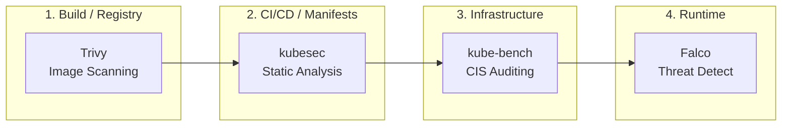
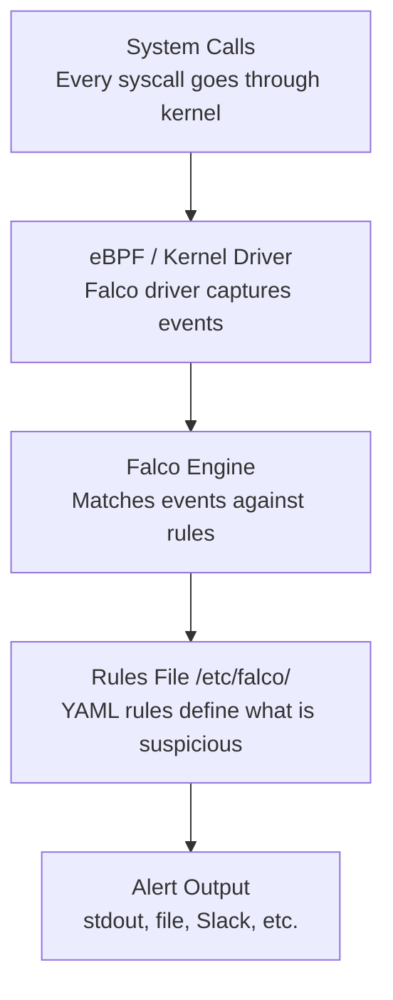

> **Complexity**: `[MEDIUM]` - Essential exam tools
>
> **Time to Complete**: 40-45 minutes
>
> **Prerequisites**: Module 0.2 (Security Lab Setup)

---

## What You'll Be Able to Do

After completing this module, you will be able to:

1. **Configure** Trivy to scan container images and interpret vulnerability severity levels
2. **Write** Falco rules to detect suspicious runtime behavior in containers
3. **Audit** cluster configurations using kube-bench against CIS benchmarks
4. **Diagnose** security tool output to identify actionable remediation steps

---

## Why This Module Matters

Three tools dominate CKS: **Trivy**, **Falco**, and **kube-bench**. The exam expects you to use them fluently—not just run basic commands, but interpret output, modify configurations, and troubleshoot issues.

This module builds that fluency.

---

## The Security Lifecycle

Before diving into individual CLI commands, it is crucial to understand *where* each tool fits in a defense-in-depth strategy. Security in Kubernetes is not a single checkpoint; it is a continuous process applied across multiple stages of the container lifecycle.



- **Trivy (Build/Registry):** Scans container images for known CVEs before they ever reach the cluster.
- **kubesec (CI/CD Manifests):** Analyzes Kubernetes YAML manifests statically to prevent risky configurations (like `privileged: true`) from being deployed.
- **kube-bench (Cluster Infrastructure):** Audits the underlying Kubernetes components (API server, kubelet, etcd) against CIS Benchmarks to ensure the cluster itself is locked down.
- **Falco (Runtime):** Monitors active containers via system calls to detect real-time anomalies (e.g., someone opening a shell or reading `/etc/shadow`).

---

## Trivy: Image Vulnerability Scanning

### Basic Scanning

```bash
# Scan an image
trivy image nginx:latest

# Scan with severity filter
trivy image --severity HIGH,CRITICAL nginx:latest

# Output as JSON (for automation)
trivy image -f json nginx:latest > scan-results.json

# Scan and fail if vulnerabilities found
trivy image --exit-code 1 --severity CRITICAL nginx:latest
```

### Understanding Trivy Output

```text
┌─────────────────────────────────────────────────────────────┐
│              TRIVY SCAN OUTPUT EXPLAINED                    │
├─────────────────────────────────────────────────────────────┤
│                                                             │
│  nginx:latest (debian 12.4)                                │
│  ═══════════════════════════════════════════════════════   │
│                                                             │
│  Total: 142 (UNKNOWN: 0, LOW: 89, MEDIUM: 42,              │
│              HIGH: 10, CRITICAL: 1)                        │
│                                                             │
│  ┌────────────┬──────────┬──────────┬─────────────────┐    │
│  │ Library    │ Vuln ID  │ Severity │ Fixed Version   │    │
│  ├────────────┼──────────┼──────────┼─────────────────┤    │
│  │ openssl    │ CVE-2024-│ CRITICAL │ 3.0.13-1        │    │
│  │            │ XXXX     │          │                 │    │
│  │ libcurl    │ CVE-2024-│ HIGH     │ 7.88.1-10+d12u6│    │
│  │            │ YYYY     │          │                 │    │
│  └────────────┴──────────┴──────────┴─────────────────┘    │
│                                                             │
│  Key columns:                                              │
│  - Library: Affected package                               │
│  - Vuln ID: CVE identifier (searchable)                   │
│  - Severity: CRITICAL > HIGH > MEDIUM > LOW               │
│  - Fixed Version: Update to this version to fix           │
│                                                             │
└─────────────────────────────────────────────────────────────┘
```

### Scan Types

```bash
# Image scan (most common for CKS)
trivy image nginx:1.25

# Filesystem scan (scan local directory)
trivy fs /path/to/project

# Config scan (find misconfigurations in K8s YAML)
trivy config ./manifests/

# Kubernetes scan (scan running cluster)
trivy k8s --report summary cluster
```

> **Pause and predict**: Trivy reports 142 vulnerabilities in `nginx:latest` -- 89 LOW, 42 MEDIUM, 10 HIGH, 1 CRITICAL. Which would you fix first, and would you fix all 142? What's the practical threshold for a CI/CD gate?

### Practical Exam Scenarios

```bash
# Scenario 1: Find images with CRITICAL vulnerabilities
trivy image --severity CRITICAL myregistry/myapp:v1.0

# Scenario 2: Scan all images in a namespace
for img in $(kubectl get pods -n production -o jsonpath='{.items[*].spec.containers[*].image}' | tr ' ' '\n' | sort -u); do
  echo "Scanning: $img"
  trivy image --severity HIGH,CRITICAL "$img"
done

# Scenario 3: CI/CD gate - fail build if vulnerabilities
trivy image --exit-code 1 --severity HIGH,CRITICAL myapp:latest

# Scenario 4: Generate report for compliance
trivy image -f json -o report.json nginx:latest
```

---

## Falco: Runtime Threat Detection

### How Falco Works



### Viewing Falco Alerts

```bash
# Check Falco logs
kubectl logs -n falco -l app.kubernetes.io/name=falco --tail=50

# Example alert:
# 14:23:45.123456789: Warning Shell spawned in container
#   (user=root container_id=abc123 container_name=nginx
#   shell=bash parent=entrypoint.sh cmdline=bash)
```

### Understanding Falco Rules

```yaml
# Falco rule structure
- rule: Terminal shell in container
  desc: A shell was spawned in a container
  condition: >
    spawned_process and
    container and
    shell_procs
  output: >
    Shell spawned in container
    (user=%user.name container=%container.name shell=%proc.name)
  priority: WARNING
  tags: [container, shell, mitre_execution]

# Key components:
# - rule: Name of the rule
# - desc: Human-readable description
# - condition: When to trigger (Falco filter syntax)
# - output: What to log when triggered
# - priority: EMERGENCY, ALERT, CRITICAL, ERROR, WARNING, NOTICE, INFORMATIONAL (often aliased as INFO), DEBUG
# - tags: Categories for filtering
```

> **Stop and think**: Falco monitors system calls in real-time. If an attacker opens a reverse shell inside a container, which Falco condition elements would detect it? Think about what system calls a shell spawn triggers versus what a network connection triggers.

### Common Falco Conditions

```yaml
# Detect shell in container
condition: spawned_process and container and shell_procs

# Detect sensitive file access
condition: >
  open_read and
  container and
  (fd.name startswith /etc/shadow or fd.name startswith /etc/passwd)

# Detect network connection
condition: >
  (evt.type in (connect, accept)) and
  container and
  fd.net != ""

# Detect privilege escalation
condition: >
  spawned_process and
  container and
  proc.name = sudo
```

### Modifying Falco Rules

```bash
# Falco rules are in /etc/falco/
# - falco_rules.yaml: Default rules (don't edit)
# - falco_rules.local.yaml: Your custom rules

# Method 1: Helm values (RECOMMENDED — keeps all Falco configuration managed in a single Helm release)
# Create a values file with custom rules
cat <<EOF > falco-custom-rules.yaml
customRules:
  custom-rules.yaml: |-
    - rule: Detect cat of sensitive files
      desc: Someone is reading sensitive files
      condition: >
        spawned_process and
        container and
        proc.name = cat and
        (proc.args contains "/etc/shadow" or proc.args contains "/etc/passwd")
      output: "Sensitive file read (user=%user.name file=%proc.args container=%container.name)"
      priority: WARNING
EOF

# Upgrade Falco with custom rules (using --reuse-values to preserve existing configuration)
helm upgrade falco falcosecurity/falco \
  --namespace falco \
  --reuse-values \
  -f falco-custom-rules.yaml \
  --wait

# Method 2: ConfigMap (alternative — also persists)
kubectl create configmap falco-custom-rules \
  --namespace falco \
  --from-literal=custom-rules.yaml='
- rule: Detect cat of sensitive files
  desc: Someone is reading sensitive files
  condition: >
    spawned_process and
    container and
    proc.name = cat and
    (proc.args contains "/etc/shadow" or proc.args contains "/etc/passwd")
  output: "Sensitive file read (user=%user.name file=%proc.args container=%container.name)"
  priority: WARNING
'

# Then reference the ConfigMap in Helm values or mount it manually
# Restart Falco pods to pick up changes
kubectl rollout restart daemonset/falco -n falco
kubectl rollout status daemonset/falco -n falco --timeout=120s
```

> **Important**: Never modify rules by exec-ing into Falco pods — those changes are lost when pods restart. Always use Helm values or ConfigMaps so custom rules survive upgrades and restarts.

### Testing Falco Detection

```bash
# Trigger shell detection
kubectl run test --image=nginx --restart=Never
kubectl wait --for=condition=Ready pod/test --timeout=60s
kubectl exec test -- /bin/bash -c "exit"

# Check Falco logs for alert
kubectl logs -n falco -l app.kubernetes.io/name=falco | grep "shell"

# Cleanup
kubectl delete pod test --force
```

---

## kube-bench: CIS Benchmark Auditing

### Running kube-bench

```bash
# Run as Kubernetes Job
kubectl apply -f https://raw.githubusercontent.com/aquasecurity/kube-bench/main/job.yaml
kubectl wait --for=condition=complete job/kube-bench --timeout=120s
kubectl logs job/kube-bench

# Run specific checks
./kube-bench run --targets=master  # Control plane only
./kube-bench run --targets=node    # Worker nodes only
./kube-bench run --targets=etcd    # etcd only

# Run specific benchmark (e.g., CIS 1.12 benchmark for newer K8s versions)
./kube-bench run --benchmark cis-1.12
```

### Understanding kube-bench Output

```text
┌─────────────────────────────────────────────────────────────┐
│              KUBE-BENCH OUTPUT EXPLAINED                    │
├─────────────────────────────────────────────────────────────┤
│                                                             │
│  [INFO] 1 Control Plane Security Configuration             │
│  [INFO] 1.1 Control Plane Node Configuration Files         │
│                                                             │
│  [PASS] 1.1.1 Ensure API server pod file permissions       │
│  [PASS] 1.1.2 Ensure API server pod file ownership         │
│  [FAIL] 1.1.3 Ensure controller manager file permissions   │
│  [WARN] 1.1.4 Ensure scheduler pod file permissions        │
│                                                             │
│  Status meanings:                                           │
│  [PASS] - Check passed                                     │
│  [FAIL] - Security issue found, must fix                   │
│  [WARN] - Manual review needed                             │
│  [INFO] - Informational only                               │
│                                                             │
│  Remediation for 1.1.3:                                    │
│  Run: chmod 600 /etc/kubernetes/manifests/controller.yaml  │
│                                                             │
└─────────────────────────────────────────────────────────────┘
```

### Common CIS Failures and Fixes

| Check | Issue | Remediation |
|-------|-------|-------------|
| 1.2.1 | Anonymous auth enabled | `--anonymous-auth=false` on API server |
| 1.2.6 | No audit logging | Configure audit policy and log path |
| 1.2.16 | No admission plugins | Enable PodSecurity admission |
| 4.2.1 | kubelet anonymous auth | `--anonymous-auth=false` on kubelet |
| 4.2.6 | TLS not enforced | Configure kubelet TLS certs |

```bash
# Fix API server anonymous auth
# Edit /etc/kubernetes/manifests/kube-apiserver.yaml
# Add: --anonymous-auth=false

# Fix kubelet anonymous auth
# Edit /var/lib/kubelet/config.yaml
# Set: authentication.anonymous.enabled: false

# Restart kubelet after config changes
sudo systemctl restart kubelet
```

---

## kubesec: Static Manifest Analysis

### Scanning Manifests

```bash
# Scan a YAML file
kubesec scan deployment.yaml

# Scan from stdin
cat pod.yaml | kubesec scan /dev/stdin

# Example output:
# [
#   {
#     "score": -30,
#     "scoring": {
#       "passed": [...],
#       "critical": ["containers[] .securityContext .privileged == true"],
#       "advise": [...]
#     }
#   }
# ]
```

> **Stop and think**: You run `kube-bench` and get 15 [FAIL] results. You fix all 15 and re-run -- but now you get 3 new [FAIL] results that weren't there before. How is that possible?

### Understanding kubesec Scores

```text
┌─────────────────────────────────────────────────────────────┐
│              KUBESEC SCORING                                │
├─────────────────────────────────────────────────────────────┤
│                                                             │
│  Score ranges (Informal Community Convention):             │
│  ─────────────────────────────────────────────────────────  │
│  10+   : Good security posture                             │
│  0-10  : Acceptable, room for improvement                   │
│  < 0   : Security concerns, review required                 │
│  -30   : Critical issues (e.g., privileged container)       │
│                                                             │
│  Score modifiers:                                          │
│  +1 : runAsNonRoot: true                                   │
│  +1 : readOnlyRootFilesystem: true                         │
│  +1 : resources.limits defined                             │
│  -30: privileged: true (critical)                          │
│  -1 : no securityContext                                   │
│                                                             │
└─────────────────────────────────────────────────────────────┘
```

---

## Did You Know?

- **Trivy was created by Aqua Security** and is now the most popular open-source vulnerability scanner. It's faster than Clair and more user-friendly.

- **Falco uses eBPF or a kernel driver** to capture system calls with high performance. While often cited for low overhead, actual throughput and overhead depend heavily on your specific workload and configuration. It was originally created by Sysdig and has graduated as a CNCF project.

- **CIS Benchmarks** are developed by the Center for Internet Security with input from security experts worldwide. They're the de facto standard for Kubernetes security auditing.

- **kubesec was created by Control Plane (controlplaneio)**, a company known for Kubernetes security training, though the CKS certification itself is officially administered by the CNCF and Linux Foundation.

---

## Common Mistakes

| Mistake | Why It Hurts | Solution |
|---------|--------------|----------|
| Only memorizing commands | Need to interpret output | Practice analyzing results |
| Ignoring "MEDIUM" severity | They add up to risk | Review all findings |
| Not customizing Falco rules | Default rules may miss threats | Add environment-specific rules |
| Skipping remediation practice | Exam asks you to FIX issues | Practice applying fixes |
| Running tools once | Need muscle memory | Integrate into daily practice |

---

## Quiz

1. **Your CI/CD pipeline uses Trivy to scan images before deployment. A developer complains that their build keeps failing even though "the app works fine." The Trivy output shows 3 CRITICAL CVEs in the base image. What flags would you configure in the pipeline, and how should the developer fix their build?**
   <details>
   <summary>Answer</summary>
   The pipeline likely uses `--exit-code 1 --severity CRITICAL` which returns non-zero when CRITICAL vulnerabilities are found, causing the build to fail. The developer should update their base image to a version with the CVEs fixed (check the "Fixed Version" column in Trivy output), or switch to a minimal base image like distroless. "The app works fine" is irrelevant -- a working app with critical CVEs is a security liability. To prevent this, the developer should integrate local scanning by running `trivy image --severity HIGH,CRITICAL` before pushing their code.
   </details>

2. **A security incident occurs: someone exec'd into a production container and read `/etc/shadow`. Your Falco installation didn't alert. You check and find the rule exists in `falco_rules.yaml`. What's the most likely cause, and where should custom rules actually live?**
   <details>
   <summary>Answer</summary>
   Custom rules belong in `/etc/falco/falco_rules.local.yaml`, not the default `falco_rules.yaml`. The default file may have been overwritten during a Falco upgrade, or the rule may have been disabled by a later rule in the processing chain. For production deployments, custom rules should be deployed via Helm values (`customRules` in values.yaml) or ConfigMaps so they persist across pod restarts and upgrades. You must never edit rules by directly exec-ing into Falco pods, as those temporary changes are permanently lost when the daemonset restarts the pods.
   </details>

3. **You run kube-bench and see: `[FAIL] 1.2.6 Ensure --authorization-mode argument is not set to AlwaysAllow`. The remediation says to edit the API server manifest. You make the change, but `kubectl` stops responding for 2 minutes. What happened and how do you avoid panic?**
   <details>
   <summary>Answer</summary>
   When you edit `/etc/kubernetes/manifests/kube-apiserver.yaml`, the kubelet detects the change and automatically restarts the API server as a static pod. During this restart process, `kubectl` is temporarily unavailable because it connects through the API server to manage the cluster. This is entirely normal behavior -- you should wait 1-2 minutes for the API server to come back online. If it doesn't recover, you likely introduced a YAML syntax error or invalid flag. Always verify your changes are syntactically correct before saving. You can troubleshoot by checking with `crictl ps` and `crictl logs` directly on the control plane node.
   </details>

4. **You scan a pod manifest with kubesec and get a score of -30. Your colleague scans a different manifest and gets a score of +3. Without seeing the manifests, what can you infer about the security posture of each?**
   <details>
   <summary>Answer</summary>
   A score of -30 indicates critical security issues -- almost certainly the presence of `privileged: true` (which alone penalizes by -30) or similar dangerous configurations like `hostNetwork`, `hostPID`, or running as root. A score of +3 indicates a reasonable security posture with some positive controls configured (like `runAsNonRoot: true`, `readOnlyRootFilesystem: true`, or defined resource limits -- each worth +1). The first manifest needs immediate remediation and should not be deployed; the second could still be improved but passes basic security baseline checks. Note that these score bands are informal community conventions, but they provide a helpful threshold for CI/CD gating.
   </details>

---

## Hands-On Exercise

**Task**: Use all four security tools.

```bash
# 1. Scan an image with Trivy
echo "=== Trivy Scan ==="
trivy image --severity HIGH,CRITICAL nginx:1.25

# 2. Check Falco is detecting events
echo "=== Falco Test ==="
kubectl run falco-test --image=nginx --restart=Never
kubectl wait --for=condition=Ready pod/falco-test --timeout=60s
kubectl exec falco-test -- cat /etc/passwd
kubectl logs -n falco -l app.kubernetes.io/name=falco --tail=5
kubectl delete pod falco-test --force

# 3. Run kube-bench
echo "=== kube-bench ==="
kubectl apply -f https://raw.githubusercontent.com/aquasecurity/kube-bench/main/job.yaml
kubectl wait --for=condition=complete job/kube-bench --timeout=120s
kubectl logs job/kube-bench | grep -E "^\[FAIL\]" | head -10
kubectl delete job kube-bench

# 4. Scan a manifest with kubesec
echo "=== kubesec Scan ==="
cat <<EOF | kubesec scan /dev/stdin
apiVersion: v1
kind: Pod
metadata:
  name: insecure
spec:
  containers:
  - name: app
    image: nginx
    securityContext:
      privileged: true
EOF
```

**Success criteria**: Run all tools, interpret output, identify security issues.

---

## Summary

**Trivy** (Image Scanning):
- `trivy image <image>` - Basic scan
- `--severity HIGH,CRITICAL` - Filter by severity
- `--exit-code 1` - Fail on findings

**Falco** (Runtime Detection):
- Monitors system calls in real-time
- Rules define suspicious behavior
- Custom rules in `falco_rules.local.yaml`

**kube-bench** (CIS Benchmarks):
- Audits cluster against CIS standards
- [FAIL] = fix required
- Provides remediation steps

**kubesec** (Static Analysis):
- Scores YAML manifests
- Negative score = security concerns
- Quick pre-deployment check

---

## Next Module

[Module 0.4: CKS Exam Strategy](../module-0.4-exam-strategy/) - Security-focused exam approach.