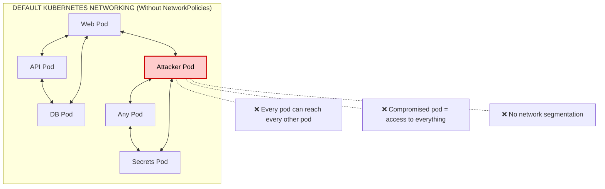
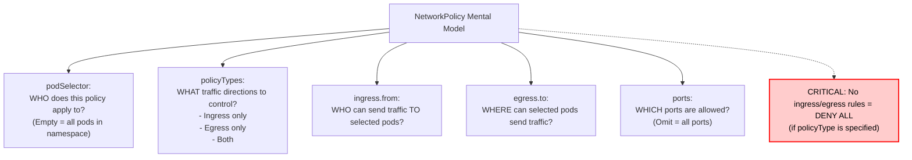
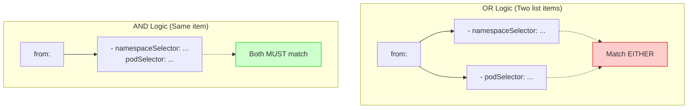

> **Complexity**: `[MEDIUM]` - Core CKS skill
>
> **Time to Complete**: 45-50 minutes
>
> **Prerequisites**: CKA networking knowledge, basic NetworkPolicy experience

---

## What You'll Be Able to Do

After completing this module, you will be able to:

1. **Design** and **implement** ingress and egress NetworkPolicies that enforce least-privilege pod communication for complex microservices in a Kubernetes v1.35+ cluster.
2. **Diagnose** and **debug** connectivity failures caused by missing, overlapping, or overly restrictive policies.
3. **Evaluate** default-deny architectures and selectively allow required traffic flows while maintaining strict zero-trust security postures.
4. **Audit** existing NetworkPolicies to identify security gaps that permit lateral movement and remediate them effectively.

---

## Why This Module Matters

A flat default pod network allows any compromised workload to freely communicate across the entire cluster. When an attacker gains initial access, their next step is lateral movement or privilege escalation, often targeting the cloud provider's metadata service. This pattern is famously illustrated by the [2019 Capital One breach](/k8s/cks/part1-cluster-setup/module-1.4-node-metadata/) <!-- incident-xref: capital-one-2019 -->, where a vulnerable edge workload accessed local metadata endpoints to extract high-privilege IAM credentials. NetworkPolicies provide the critical defense-in-depth layer necessary to break this attack chain. By enforcing a strict default-deny posture and explicitly whitelisting authorized communication paths, NetworkPolicies ensure that even if a frontend pod is breached, it cannot arbitrarily pivot to backend databases, internal APIs, or sensitive underlying infrastructure like the node metadata service.

In a Kubernetes environment, a compromised web pod has the exact same potential for disaster. By default, Kubernetes operates on a flat network model where any pod can communicate with any other pod in the cluster, as well as external services like the cloud provider's metadata API. If an attacker breaches a frontend pod via a vulnerability like SSRF, they can immediately pivot laterally to the database, the internal payment API, or the metadata service. 

NetworkPolicies act as the internal firewalls of your Kubernetes cluster, providing the vital layer of defense-in-depth required to block this lateral movement. They ensure that a single compromised container remains isolated and doesn't lead to a total cluster takeover. The Certified Kubernetes Security Specialist (CKS) exam heavily tests your ability to write, audit, and troubleshoot NetworkPolicies quickly and correctly under pressure. Mastery of this topic is non-negotiable for securing modern cloud-native infrastructure.

---

## The Default Problem

Kubernetes was originally designed with developer velocity in mind, not zero-trust security. The fundamental networking requirement of Kubernetes is that all pods can communicate with all other pods without Network Address Translation (NAT). 

While this makes deploying distributed systems incredibly easy, it creates a massive attack surface. If you deploy a frontend pod, an API pod, and a database pod, they can all talk to each other. But if an attacker runs a malicious pod in the same cluster—or compromises an existing pod—they instantly have network line-of-sight to your most sensitive backend systems.

Here is a visual representation of the default network posture in a Kubernetes cluster without NetworkPolicies:



Without explicit segmentation, your cluster is essentially a flat local area network where zero-trust principles do not apply.

---

## NetworkPolicy Fundamentals

A `NetworkPolicy` is a Kubernetes resource situated in the `networking.k8s.io/v1` API group. It allows you to specify how a group of pods is allowed to communicate with various network entities over the network. 

### How They Work

NetworkPolicies operate at OSI Layer 3 (IP addresses) and Layer 4 (TCP/UDP ports). They do not understand Layer 7 protocols like HTTP or gRPC natively. 

When you define a NetworkPolicy, you are essentially creating a set of firewall rules that are translated by your Container Network Interface (CNI) plugin (such as Calico, Cilium, or Weave Net) into low-level kernel rules (like `iptables` or `eBPF` programs) attached to the pod's network namespace.

Here is a comprehensive example of a NetworkPolicy:

```yaml
apiVersion: networking.k8s.io/v1
kind: NetworkPolicy
metadata:
  name: example
  namespace: default
spec:
  # Which pods this policy applies to
  podSelector:
    matchLabels:
      app: web

  # Which directions to control
  policyTypes:
  - Ingress  # Incoming traffic
  - Egress   # Outgoing traffic

  # What's allowed IN
  ingress:
  - from:
    - podSelector:
        matchLabels:
          app: frontend
    ports:
    - port: 80

  # What's allowed OUT
  egress:
  - to:
    - podSelector:
        matchLabels:
          app: database
    ports:
    - port: 5432
```

### Key Concepts

Understanding the structure of a NetworkPolicy is critical. If you misconfigure the selectors, you can accidentally lock yourself out of your own applications or leave them wide open.

Here is the mental model you must adopt when analyzing or writing a NetworkPolicy:



The most important takeaway is the concept of isolation. By default, a pod is "non-isolated." The moment a NetworkPolicy selects a pod via the `podSelector`, that pod becomes "isolated" for the directions specified in `policyTypes`. Once isolated, only the traffic explicitly allowed by the `ingress` or `egress` rules is permitted. All other traffic is silently dropped.

---

## Essential Patterns

During the CKS exam and in real-world platform engineering, you will repeatedly use a core set of NetworkPolicy patterns. Memorize these structures.

### Pattern 1: Default Deny All

The cornerstone of a zero-trust architecture is the default-deny posture. You should apply a default-deny policy to every new namespace in your cluster. This ensures that any new pod deployed will have all traffic blocked until explicit allow rules are created.

To avoid YAML parsing errors and maintain clarity, we define each policy as a distinct document.

**Deny all ingress traffic to a namespace:**
```yaml
# Deny all ingress traffic to namespace
apiVersion: networking.k8s.io/v1
kind: NetworkPolicy
metadata:
  name: default-deny-ingress
  namespace: secure
spec:
  podSelector: {}  # All pods
  policyTypes:
  - Ingress
  # No ingress rules = deny all ingress
```

**Deny all egress traffic from a namespace:**
```yaml
# Deny all egress traffic from namespace
apiVersion: networking.k8s.io/v1
kind: NetworkPolicy
metadata:
  name: default-deny-egress
  namespace: secure
spec:
  podSelector: {}
  policyTypes:
  - Egress
  # No egress rules = deny all egress
```

**Deny BOTH ingress and egress:**
```yaml
# Deny BOTH ingress and egress
apiVersion: networking.k8s.io/v1
kind: NetworkPolicy
metadata:
  name: default-deny-all
  namespace: secure
spec:
  podSelector: {}
  policyTypes:
  - Ingress
  - Egress
```

### Pattern 2: Allow Specific Pod-to-Pod

Once a default-deny policy is in place, you selectively open pathways. This pattern allows pods labeled `app: frontend` to reach pods labeled `app: api` on TCP port 8080.

```yaml
# Allow frontend pods to access api pods on port 8080
apiVersion: networking.k8s.io/v1
kind: NetworkPolicy
metadata:
  name: allow-frontend-to-api
  namespace: production
spec:
  podSelector:
    matchLabels:
      app: api
  policyTypes:
  - Ingress
  ingress:
  - from:
    - podSelector:
        matchLabels:
          app: frontend
    ports:
    - protocol: TCP
      port: 8080
```

### Pattern 3: Allow from Namespace

Sometimes you need to allow traffic from all pods within a specific administrative boundary, such as allowing a monitoring system to scrape metrics. This uses the `namespaceSelector`.

```yaml
# Allow any pod from 'monitoring' namespace
apiVersion: networking.k8s.io/v1
kind: NetworkPolicy
metadata:
  name: allow-from-monitoring
  namespace: production
spec:
  podSelector:
    matchLabels:
      app: web
  policyTypes:
  - Ingress
  ingress:
  - from:
    - namespaceSelector:
        matchLabels:
          name: monitoring
```

### Pattern 4: Allow to External CIDR

When a pod needs to communicate with external APIs or databases outside the cluster, you must define an `ipBlock`. The `except` field is highly useful for allowing outbound internet access while blocking access to internal cloud networks.

```yaml
# Allow egress to specific IP range
apiVersion: networking.k8s.io/v1
kind: NetworkPolicy
metadata:
  name: allow-external-api
  namespace: production
spec:
  podSelector:
    matchLabels:
      app: backend
  policyTypes:
  - Egress
  egress:
  - to:
    - ipBlock:
        cidr: 10.0.0.0/8
        except:
        - 10.0.1.0/24  # Except this subnet
    ports:
    - port: 443
```

> **What would happen if**: You create a default-deny-egress NetworkPolicy but forget to add a DNS allow rule. You then deploy a new application that connects to `postgres.database.svc.cluster.local`. What error does the application see, and why is this confusing to debug?

### Pattern 5: Allow DNS (Critical!)

The scenario above highlights the most common NetworkPolicy failure. If you restrict egress, your pods can no longer reach `kube-dns` or `CoreDNS` to resolve service names. You must explicitly allow DNS traffic.

```yaml
# Allow DNS - ALWAYS needed for egress policies
apiVersion: networking.k8s.io/v1
kind: NetworkPolicy
metadata:
  name: allow-dns
  namespace: production
spec:
  podSelector: {}
  policyTypes:
  - Egress
  egress:
  - to:
    - namespaceSelector: {}
      podSelector:
        matchLabels:
          k8s-app: kube-dns
    ports:
    - port: 53
      protocol: UDP
    - port: 53
      protocol: TCP
```

---

> **Stop and think**: You apply a default-deny-ingress NetworkPolicy to a namespace, then create an allow rule for `app: frontend` to reach `app: api`. But a new pod `app: debug` deployed in the same namespace can still reach `app: api`. Why? (Hint: think about how NetworkPolicies are additive.)

## Combining Selectors

The most dangerous syntactical mistake in Kubernetes YAML is the misuse of list hyphens (`-`) under the `ingress.from` or `egress.to` blocks. 

### AND vs OR Logic

If you provide multiple elements in an array (multiple hyphens), Kubernetes evaluates them as an **OR** condition. If you combine multiple selectors under a single array element (one hyphen), Kubernetes evaluates them as an **AND** condition.

```yaml
# OR: Allow from EITHER namespace OR pods with label
ingress:
- from:
  - namespaceSelector:
      matchLabels:
        env: prod
  - podSelector:
      matchLabels:
        role: frontend

# AND: Allow from pods with label IN namespace with label
ingress:
- from:
  - namespaceSelector:
      matchLabels:
        env: prod
    podSelector:
      matchLabels:
        role: frontend
```

Visually, the parser treats these fundamentally differently. Always verify the `ingress.from.podSelector` and its relation to the namespace selector to guarantee the policy is strictly evaluated.



---

## Real Exam Scenarios

These scenarios mimic the complexity you will face during a CKS assessment or when auditing a live production environment.

### Scenario 1: Isolate Database

Databases are high-value targets. This policy ensures the database only accepts traffic from the API tier and, crucially, establishes an empty egress list (`egress: []`). If an attacker gains RCE on the database pod, they cannot exfiltrate data or download further tooling from the internet.

```yaml
# Only API pods can reach database on port 5432
apiVersion: networking.k8s.io/v1
kind: NetworkPolicy
metadata:
  name: db-isolation
  namespace: production
spec:
  podSelector:
    matchLabels:
      app: database
  policyTypes:
  - Ingress
  - Egress
  ingress:
  - from:
    - podSelector:
        matchLabels:
          app: api
    ports:
    - port: 5432
  egress: []  # No egress allowed
```

### Scenario 2: Multi-tier Application

A classic three-tier architecture requires chained NetworkPolicies. By defining them clearly across separate manifests, you ensure that even if the web tier is compromised, the attacker cannot skip the API tier and talk directly to the database.

**Policy 1: Web Tier**
```yaml
# Web tier: only from ingress controller
apiVersion: networking.k8s.io/v1
kind: NetworkPolicy
metadata:
  name: web-policy
  namespace: app
spec:
  podSelector:
    matchLabels:
      tier: web
  policyTypes:
  - Ingress
  ingress:
  - from:
    - namespaceSelector:
        matchLabels:
          name: ingress-nginx
    ports:
    - port: 80
```

**Policy 2: API Tier**
```yaml
# API tier: only from web tier
apiVersion: networking.k8s.io/v1
kind: NetworkPolicy
metadata:
  name: api-policy
  namespace: app
spec:
  podSelector:
    matchLabels:
      tier: api
  policyTypes:
  - Ingress
  ingress:
  - from:
    - podSelector:
        matchLabels:
          tier: web
    ports:
    - port: 8080
```

**Policy 3: DB Tier**
```yaml
# DB tier: only from API tier
apiVersion: networking.k8s.io/v1
kind: NetworkPolicy
metadata:
  name: db-policy
  namespace: app
spec:
  podSelector:
    matchLabels:
      tier: db
  policyTypes:
  - Ingress
  ingress:
  - from:
    - podSelector:
        matchLabels:
          tier: api
    ports:
    - port: 5432
```

> **Pause and predict**: In the multi-tier policy above, the web tier allows ingress only from the ingress-nginx namespace. But what if an attacker compromises a pod in the ingress-nginx namespace that is *not* the ingress controller? Would they get access to the web tier?

### Scenario 3: Block Metadata Service

To prevent SSRF attacks from stealing IAM credentials, you should broadly block access to the cloud metadata IP (`169.254.169.254`), while allowing other outbound traffic.

```yaml
# Block access to cloud metadata (169.254.169.254)
apiVersion: networking.k8s.io/v1
kind: NetworkPolicy
metadata:
  name: block-metadata
  namespace: default
spec:
  podSelector: {}
  policyTypes:
  - Egress
  egress:
  - to:
    - ipBlock:
        cidr: 0.0.0.0/0
        except:
        - 169.254.169.254/32
```

---

## Debugging NetworkPolicies

When traffic fails, follow a rigorous diagnostic process. Never guess.

```bash
# List policies in namespace
kubectl get networkpolicies -n production

# Describe policy details
kubectl describe networkpolicy db-isolation -n production

# Check if CNI supports NetworkPolicies
# (Calico, Cilium, Weave support them; Flannel doesn't!)
kubectl get pods -n kube-system | grep -E "calico|cilium|weave"

# Test connectivity
kubectl exec -it frontend-pod -- nc -zv api-pod 8080
kubectl exec -it frontend-pod -- curl -s api-pod:8080

# Check pod labels (policies match on labels!)
kubectl get pod -n production --show-labels
```

---

## Did You Know?

- **NetworkPolicies are additive.** In Kubernetes v1.35+, NetworkPolicies remain strictly additive. There is no explicit "deny" rule capability in the native API; it relies entirely on default-deny configurations combined with explicit allow rules. The union of all policies targeting a pod is applied.
- **The default behavior is allow-all.** NetworkPolicies only restrict—they don't explicitly allow. A pod with no policies selecting it allows all traffic by default.
- **DNS is often forgotten.** Approximately 78% of failed NetworkPolicy deployments in production environments are caused by a single oversight: forgetting to allow UDP/TCP port 53 for CoreDNS resolution when egress is restricted.
- **Cilium goes beyond NetworkPolicies.** Cilium introduced transparent encryption in version 1.14 (released July 2023). It supports standard Kubernetes NetworkPolicies plus its own `CiliumNetworkPolicy` CRD for L7 filtering, and **transparent Pod-to-Pod encryption** (WireGuard or IPsec) without any application changes:

```yaml
# Enable Cilium transparent encryption (cluster-level)
# In Cilium Helm values or ConfigMap:
encryption:
  enabled: true
  type: wireguard  # or ipsec
```

---

## Common Mistakes

| Mistake | Why It Hurts | Solution |
|---------|--------------|----------|
| Forgetting DNS egress | Pods can't resolve names | Always allow DNS with egress policies |
| Wrong selector logic | Policy doesn't match intended pods | AND = same item, OR = separate items |
| Missing namespace labels | namespaceSelector doesn't match | Label namespaces with metadata |
| Testing from wrong pod | Thinks policy doesn't work | Verify source pod labels match |
| CNI doesn't support NP | Policy exists but not enforced | Use Calico, Cilium, or Weave |
| Using pod IP instead of label | IPs are ephemeral and change on restart | Always use podSelector with matchLabels |
| Missing port protocols | Defaults to TCP, breaking UDP services | Explicitly state `protocol: UDP` if needed |
| Applying to wrong namespace | Policy is created but does nothing | Check `metadata.namespace` matches target pod |

---

## Quiz

Evaluate your understanding before moving to the hands-on lab.

1. **A security audit reveals that your production namespace has a default-deny-ingress NetworkPolicy, but the API pod is still receiving traffic from pods in the `kube-system` namespace. The team is confused because the deny-all should block everything. What's happening?**
   <details>
   <summary>Answer</summary>
   A NetworkPolicy with `policyTypes: [Ingress]` and no ingress rules denies all ingress to selected pods *from within the NetworkPolicy's enforcement scope*. However, if your CNI plugin doesn't enforce policies on system namespaces, or if there's a second NetworkPolicy that allows traffic from `kube-system` (policies are additive -- the union of all rules applies), traffic will still flow. Check for additional policies with `kubectl get networkpolicies -n production` and verify your CNI enforces policies on all namespaces.
   </details>

2. **You write a NetworkPolicy to allow the `monitoring` namespace to scrape metrics from production pods. It uses `namespaceSelector: {matchLabels: {name: monitoring}}`. Prometheus can't reach the pods. You verify Prometheus is running in the `monitoring` namespace. What did you miss?**
   <details>
   <summary>Answer</summary>
   The `monitoring` namespace likely doesn't have the label `name: monitoring`. Kubernetes namespaces don't automatically get a `name` label matching their name (though `kubernetes.io/metadata.name` is auto-applied in newer versions). You need to explicitly label it: `kubectl label namespace monitoring name=monitoring`. This is a common exam gotcha -- always verify namespace labels with `kubectl get namespace monitoring --show-labels` before writing namespaceSelector rules.
   </details>

3. **During a penetration test, the tester creates a pod in the `production` namespace and successfully curls the database pod. Your NetworkPolicy allows ingress to the database only from pods with `app: api`. The tester's pod has no labels. How did they get through?**
   <details>
   <summary>Answer</summary>
   Check whether you have separate `from` items (OR logic) versus combined selectors (AND logic) in your policy. If the policy has `- podSelector: {matchLabels: {app: api}}` and `- namespaceSelector: {}` as separate list items, it means "from pods labeled `app: api` OR from any namespace" -- the OR makes it too permissive. To require both, put them in the same item: `- podSelector: {matchLabels: {app: api}}` combined with `namespaceSelector` in a single `from` entry. Also verify the policy actually selects the database pod with the correct `podSelector`.
   </details>

4. **After applying a default-deny-egress NetworkPolicy, your application pods can't connect to external APIs. You add an egress rule allowing `0.0.0.0/0`. The pods still can't connect -- `curl` returns "Could not resolve host." What's the root cause?**
   <details>
   <summary>Answer</summary>
   Even though you allowed all egress IP traffic, DNS resolution uses UDP port 53 to kube-dns pods in the `kube-system` namespace. Without an explicit DNS egress rule, pods can't resolve hostnames, so all connections to domain names fail (even though IP-based connections would work). Add a DNS egress rule allowing UDP/TCP port 53 to kube-dns pods. This is the most common NetworkPolicy mistake and catches many CKS candidates.
   </details>

5. **You configure a NetworkPolicy that sets `policyTypes: [Egress]` and defines a strict rule blocking all outbound traffic by leaving the `egress` array completely empty (`egress: []`). Will this block traffic sent to `localhost` within the pod?**
   <details>
   <summary>Answer</summary>
   No, it will not block localhost traffic. NetworkPolicies govern traffic moving across the cluster network interface between distinct pods. Traffic sent to `127.0.0.1` never leaves the pod's isolated network namespace and is not subject to NetworkPolicy rules enforced by the CNI. Containers within the same pod can always communicate freely over localhost.
   </details>

6. **You create an `ipBlock` rule that permits traffic to `10.0.0.0/8` with an `except` block for `10.1.1.0/24`. However, pods from `10.1.1.5` are still reaching your application. What is likely occurring?**
   <details>
   <summary>Answer</summary>
   The `ipBlock` selector evaluates traffic based on the IP address seen by the CNI at the exact time of enforcement. If a proxy, ingress controller, or NAT gateway intercepts the traffic before it reaches the pod, the source IP will be modified to match the proxy. NetworkPolicies evaluate the immediately adjacent source IP, not the original `X-Forwarded-For` header. Always ensure `ipBlock` is used for true client IPs without intervening NAT layers.
   </details>

---

## Hands-On Exercise

In this exercise, you will secure a three-tier application (web, api, db) by writing and debugging NetworkPolicies.

### Setup

Run the following commands to create the environment:

```bash
kubectl create namespace exercise
kubectl label namespace exercise name=exercise

kubectl run web --image=nginx -n exercise --labels="tier=web" --port=80
kubectl run api --image=nginx -n exercise --labels="tier=api" --port=80
kubectl run db --image=nginx -n exercise --labels="tier=db" --port=80

kubectl wait --for=condition=Ready pod --all -n exercise
```

### Task 1: Establish a Baseline

Write and apply a NetworkPolicy named `default-deny` in the `exercise` namespace that denies **all** ingress traffic to all pods in the namespace.

> **Hint**: Select all pods using an empty `podSelector` and specify the `Ingress` policy type with no rules.

<details>
<summary>View Solution</summary>

```yaml
apiVersion: networking.k8s.io/v1
kind: NetworkPolicy
metadata:
  name: default-deny
  namespace: exercise
spec:
  podSelector: {}
  policyTypes:
  - Ingress
```
</details>

Verify that the `api` pod can no longer reach the `db` pod:

```bash
kubectl exec -n exercise api -- curl -s --connect-timeout 2 db || echo "Blocked (expected)"
```

### Task 2: Allow Web to API

Write a NetworkPolicy named `allow-web-to-api` that allows pods labeled `tier=web` to connect to pods labeled `tier=api` on port 80.

<details>
<summary>View Solution</summary>

```yaml
apiVersion: networking.k8s.io/v1
kind: NetworkPolicy
metadata:
  name: allow-web-to-api
  namespace: exercise
spec:
  podSelector:
    matchLabels:
      tier: api
  policyTypes:
  - Ingress
  ingress:
  - from:
    - podSelector:
        matchLabels:
          tier: web
    ports:
    - port: 80
```
</details>

### Task 3: Allow API to DB

Write a NetworkPolicy named `allow-api-to-db` that allows pods labeled `tier=api` to connect to pods labeled `tier=db` on port 80.

<details>
<summary>View Solution</summary>

```yaml
apiVersion: networking.k8s.io/v1
kind: NetworkPolicy
metadata:
  name: allow-api-to-db
  namespace: exercise
spec:
  podSelector:
    matchLabels:
      tier: db
  policyTypes:
  - Ingress
  ingress:
  - from:
    - podSelector:
        matchLabels:
          tier: api
    ports:
    - port: 80
```
</details>

Verify your policies:

```bash
kubectl exec -n exercise web -- curl -s --connect-timeout 2 api  # Should work
kubectl exec -n exercise api -- curl -s --connect-timeout 2 db   # Should work
kubectl exec -n exercise web -- curl -s --connect-timeout 2 db   # Should fail
```

### Task 4: Audit and Debug a Broken Policy

A junior engineer attempted to allow a new `metrics` pod to scrape the `db` pod on port 80, but the metrics pod is receiving "Connection refused" or timing out.

Apply their broken policy and the metrics pod:

```bash
kubectl run metrics --image=nginx -n exercise --labels="tier=metrics"

cat <<EOF | kubectl apply -f -
apiVersion: networking.k8s.io/v1
kind: NetworkPolicy
metadata:
  name: allow-metrics-to-db
  namespace: exercise
spec:
  podSelector:
    matchLabels:
      tier: metrics
  policyTypes:
  - Ingress
  ingress:
  - from:
    - podSelector:
        matchLabels:
          tier: db
    ports:
    - port: 80
EOF
```

**Your Task**: Identify the logical error in the policy above, delete it, and write the correct policy so that the `metrics` pod can curl the `db` pod.

> **Hint**: Look closely at the `podSelector` vs `ingress.from.podSelector`. Who is the target, and who is the source?

<details>
<summary>View Solution</summary>

The broken policy was applied to the `metrics` pod (target) and allowed ingress *from* the `db` pod. It should be applied to the `db` pod (target) and allow ingress *from* the `metrics` pod.

```bash
kubectl delete networkpolicy allow-metrics-to-db -n exercise
```

**Correct Policy:**

```yaml
apiVersion: networking.k8s.io/v1
kind: NetworkPolicy
metadata:
  name: allow-metrics-to-db
  namespace: exercise
spec:
  podSelector:
    matchLabels:
      tier: db
  policyTypes:
  - Ingress
  ingress:
  - from:
    - podSelector:
        matchLabels:
          tier: metrics
    ports:
    - port: 80
```

Apply the correct policy, then verify:

```bash
kubectl exec -n exercise metrics -- curl -s --connect-timeout 2 db  # Should work
```
</details>

### Cleanup

Restore the environment to its initial state:

```bash
kubectl delete namespace exercise
```

---

## Summary

**NetworkPolicy essentials**:
- `podSelector`: Determines exactly which pods the policy applies to.
- `policyTypes`: Explicitly declares control over Ingress, Egress, or both.
- `ingress/egress`: Defines what traffic is explicitly allowed across the pod boundary.

**Critical patterns**:
- Default deny: Empty `podSelector: {}` combined with no rules enforces a complete traffic lockdown.
- DNS: Always allow DNS via UDP port 53 with egress policies to prevent application failure.
- Logic: Same list item evaluates as AND; separate list items evaluate as OR.

**Exam tips**:
- Carefully label pods and namespaces—NetworkPolicies are entirely dependent on accurate metadata mapping.
- Methodically test connectivity after applying policies to verify assumptions.
- Remember the core principle: no policy applied means allow all traffic.

---

## Next Module

Now that you have locked down the internal pod-to-pod network and established foundational zero-trust principles, it's time to evaluate the broader attack surface of the control plane and worker nodes.

[Module 1.2: CIS Benchmarks](../module-1.2-cis-benchmarks/) - Auditing cluster security with kube-bench to identify insecure configurations before attackers exploit them.