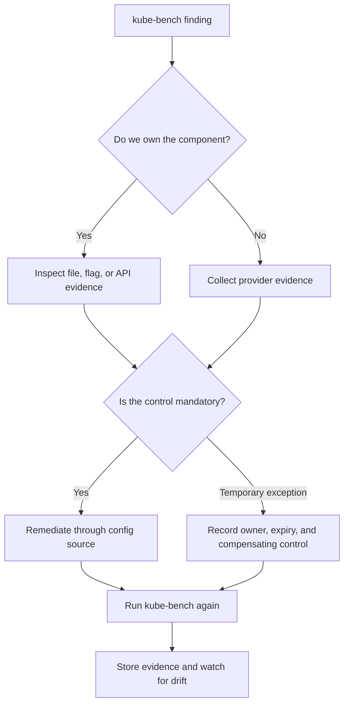

> **Complexity**: `[MEDIUM]` - Core security auditing skill
>
> **Time to Complete**: 40-45 minutes
>
> **Prerequisites**: Module 0.3 (Security Tools), basic Kubernetes v1.35 administration

# Module 1.2: CIS Benchmarks and kube-bench

## Learning Outcomes

After rigorously studying and practicing the concepts in this module, you will be able to:

1. **Audit** a modern Kubernetes v1.35 cluster against industry-standard CIS benchmarks using the `kube-bench` utility.
2. **Diagnose** failing benchmark checks by tracing the console output directly to specific misconfigurations in control plane components.
3. **Implement** precise remediation strategies to harden the API server, etcd datastore, and kubelet settings according to strict security guidelines.
4. **Evaluate** which CIS recommendations are absolute requirements for your environment versus those that might conflict with legitimate operational needs.
5. **Design** an automated security scanning pipeline that continuously monitors the cluster's posture against configuration drift.

## Why This Module Matters

In 2018, Tesla discovered that attackers had used an exposed Kubernetes management surface to run cryptocurrency mining workloads inside its cloud environment. The public reporting focused on the mining, but the more useful lesson for platform engineers is quieter: the attacker did not need an exotic kernel escape when an administrative interface was reachable without the right controls. The [2018 Tesla cryptojacking incident](/k8s/cks/part1-cluster-setup/module-1.5-gui-security/) <!-- incident-xref: tesla-2018-cryptojacking --> remains a durable warning because the breach pattern maps directly to baseline configuration failures that a disciplined cluster audit should catch early.

Kubernetes defaults are tuned for successful bring-up across many environments, not for the strictest possible security posture in your environment. A new control plane has to serve bootstrap clients, run admission plugins, expose health checks, manage certificates, and communicate with kubelets before your organization has expressed its risk appetite. That flexibility is useful, but it also means that every production team inherits a long list of decisions about authentication, authorization, file permissions, component flags, kubelet behavior, audit logging, and data store protection. The CIS Kubernetes Benchmark turns that sprawling decision set into a reviewable baseline that security engineers, auditors, and platform teams can discuss using shared language.

This module teaches you to use `kube-bench` as an audit instrument rather than as a scoreboard. A failing check is not automatically a crisis, and a passing report is not proof that the cluster is secure. The real skill is to trace each result back to the Kubernetes component that owns the behavior, decide whether the recommendation applies to your cluster type, implement a precise remediation without disrupting availability, and then automate the check so configuration drift is visible before it becomes an incident.

## The Philosophy of CIS: Baselines Before Opinions

The Center for Internet Security exists because every security program needs a defensible starting point. Without a baseline, two experienced engineers can argue endlessly about whether a permissive kubelet flag, a writable manifest file, or an unauthenticated health endpoint is acceptable. The CIS benchmark gives that debate a structure: each recommendation names a control, explains the intent, describes an audit procedure, and offers remediation guidance. You still need engineering judgment, but you are no longer starting from memory or preference.

The benchmark is intentionally conservative. It assumes that the operator would rather investigate a possible exception than leave a silent exposure in place. That posture is especially useful for CKS work because the exam rewards the ability to inspect real component configuration, connect symptoms to control-plane behavior, and make a targeted fix under time pressure. In production, the same posture helps you avoid a common trap where teams harden only application workloads while the cluster machinery remains loosely configured.

Here is the traditional CLI output representing the CIS organization's structure:

```text
┌─────────────────────────────────────────────────────────────┐
│              CENTER FOR INTERNET SECURITY                   │
├─────────────────────────────────────────────────────────────┤
│  Consensus benchmarks                                       │
│  Component-specific recommendations                         │
│  Audit procedures and remediation guidance                   │
│  Repeatable evidence for operators and reviewers             │
└─────────────────────────────────────────────────────────────┘
```

The diagram matters because it shows why `kube-bench` output should be read as evidence, not as magic. The tool does not invent a security model for your cluster. It packages a benchmark, runs local inspections, compares observed configuration to expected controls, and prints results that a human can validate. That last step is important because managed clusters, distribution defaults, and legitimate operational exceptions can change what "correct" means for a particular recommendation.

CIS also separates the idea of a benchmark from the idea of a product. A benchmark is a published standard that many organizations can review and apply. `kube-bench` is one implementation that checks Kubernetes deployments against that standard. When you treat the benchmark as the source of truth and the tool as a repeatable assistant, your remediation work becomes easier to defend during an internal audit, a customer security review, or a post-incident investigation.

Pause and predict: if a kube-bench report says the API server does not set an expected authorization flag, which file would you inspect first on a kubeadm-built control plane, and why would checking only Kubernetes objects with the API be insufficient?

The answer is that kubeadm commonly runs control-plane components as static pods, so their flags live in manifests under `/etc/kubernetes/manifests` on the control-plane node. The Kubernetes API can show you pods, logs, and some configuration objects, but it is not the canonical source for every host-level file permission, process flag, or kubelet configuration item. CIS auditing deliberately crosses that boundary, which is why a serious cluster audit requires both API-level access and node-level inspection.

## How kube-bench Reads a Cluster

`kube-bench` is most useful when you understand its model of the world. It checks a Kubernetes cluster by running benchmark tests against the places where security configuration actually lives: static pod manifests, kubelet config files, systemd unit arguments, certificate locations, and sometimes Kubernetes API responses. The tool then maps each observed value to a CIS recommendation, such as an API server flag that should be set, a kubelet read-only port that should be disabled, or an etcd data directory that should not be readable by ordinary users.

That means the same command can produce different results depending on where it runs. A job running inside the cluster can inspect Kubernetes objects and mounted host paths if you grant the right access, but it cannot see arbitrary files unless those paths are mounted. A binary running directly on a control-plane node can inspect local manifests and file modes, but it may not reflect every worker node. A managed service might hide control-plane hosts entirely, so some checks become provider-owned evidence rather than operator-owned remediation.

The practical workflow is to run the tool, group failures by component, and then investigate the highest-risk deviations first. API server authentication and authorization problems usually outrank cosmetic file ownership warnings because they affect who can reach the control plane. etcd transport and data-at-rest controls are similarly sensitive because etcd contains cluster state, Secret objects, service account data, and many other values that attackers can weaponize. Kubelet checks matter because kubelets bridge workload execution and node control, and a weak kubelet can become a path from pod compromise to node compromise.

```text
+----------------------+       +----------------------+       +----------------------+
| kube-bench runner    |       | Kubernetes host      |       | CIS result          |
| inside pod or node   | ----> | files and API state  | ----> | PASS, FAIL, WARN    |
+----------------------+       +----------------------+       +----------------------+
          |                              |                              |
          |                              |                              |
          v                              v                              v
   benchmark profile              component evidence             remediation queue
```

Before you run commands, set the command-line convention used throughout this module. Kubernetes administrators often create a short alias because repeated cluster inspection is easier when the command is compact. The full command remains `kubectl`, but every shorthand invocation below assumes that you have created the alias in your current shell session.

```bash
alias k=kubectl
k version
k get nodes -o wide
k get pods -n kube-system
```

Running `kube-bench` as a Kubernetes Job is convenient in lab clusters because the result is captured in pod logs and can be repeated without installing a host binary. The tradeoff is that the pod must mount host paths that contain sensitive configuration, so the job itself must be treated as privileged audit tooling. Do not leave it running forever, do not grant broader access than the audit needs, and do not copy the pattern into tenant namespaces where untrusted users can modify it.

```yaml
apiVersion: batch/v1
kind: Job
metadata:
  name: kube-bench
  namespace: kube-system
spec:
  template:
    spec:
      hostPID: true
      restartPolicy: Never
      containers:
      - name: kube-bench
        image: aquasec/kube-bench:latest
        command:
        - kube-bench
        - --benchmark
        - cis-1.10
        volumeMounts:
        - name: var-lib-etcd
          mountPath: /var/lib/etcd
          readOnly: true
        - name: etc-kubernetes
          mountPath: /etc/kubernetes
          readOnly: true
        - name: var-lib-kubelet
          mountPath: /var/lib/kubelet
          readOnly: true
      volumes:
      - name: var-lib-etcd
        hostPath:
          path: /var/lib/etcd
      - name: etc-kubernetes
        hostPath:
          path: /etc/kubernetes
      - name: var-lib-kubelet
        hostPath:
          path: /var/lib/kubelet
```

After the job completes, collect the logs and immediately think in terms of ownership. A finding about `/etc/kubernetes/manifests/kube-apiserver.yaml` belongs to the control-plane configuration owner. A finding about `/var/lib/kubelet/config.yaml` belongs to node bootstrap and node configuration management. A finding about RBAC or admission behavior may require a cluster policy change rather than a host edit. The output is useful only when each line lands in the right operational queue.

```bash
k apply -f kube-bench-job.yaml
k wait --for=condition=complete job/kube-bench -n kube-system --timeout=180s
k logs job/kube-bench -n kube-system
k delete job kube-bench -n kube-system
```

Before running this in a shared cluster, what output do you expect from the `k wait` command if the job cannot mount a host path because the node policy blocks it? A timeout is more likely than a clean benchmark report, and that difference tells you the failure happened before the benchmark could inspect configuration. That is a useful diagnostic clue because it separates audit-runner permissions from benchmark findings.

The console output usually contains checks grouped by master node, etcd, control plane, worker node, and policy categories. Treat the grouping as the first layer of triage. Do not jump from a failed line directly to a command copied from a blog post. Read the check description, identify the component, inspect the actual file or flag, and only then decide whether the recommended remediation fits your cluster.

## Reading kube-bench Output Like Evidence

A kube-bench report is easiest to read when you separate verdict, evidence, and decision. The verdict is the visible label, such as PASS, FAIL, WARN, or INFO. The evidence is the command, file path, flag, or API value that caused the verdict. The decision is what your team will do next: remediate, accept temporarily, document as provider-owned, or investigate because the tool could not see enough context. Many weak audit programs stop at the verdict, which is why they produce dashboards without durable security improvement.

The first pass through a report should be mechanical. Mark every failure with the component it belongs to, then mark whether the configuration is customer-owned or provider-owned. This prevents a subtle but expensive mistake: treating every finding as if the same engineer can fix it from the same shell. API server flags, kubelet configuration, etcd certificates, RBAC policy, and managed-provider control-plane settings all live in different operational systems, so they need different remediation paths.

```text
[FAIL] 1.2.1 Ensure that the --anonymous-auth argument is set to false
[PASS] 1.2.6 Ensure that the --authorization-mode argument is not set to AlwaysAllow
[WARN] 1.2.20 Ensure that the audit log path is set
```

This small sample already contains three different kinds of work. The anonymous-auth failure is a direct hardening task if you own the API server manifest. The authorization check passing is evidence worth preserving, because it proves a critical control was present at the time of audit. The audit-log warning may be a required fix in a self-managed cluster, a provider-owned setting in a managed cluster, or a design discussion if logs are exported through a different mechanism.

The second pass should look for clusters of related findings. If several API server checks fail together, the control-plane build template may be old or inconsistently rendered. If file permission checks fail across multiple certificate paths, host provisioning may be applying a permissive umask or copying files with the wrong ownership. If worker node checks differ between nodes, you may have mixed node images or a failed rollout rather than one isolated misconfiguration.

Grouping related findings also reduces operational risk during remediation. Instead of making ten unrelated edits, you can prepare one change to the API server manifest template, one change to kubelet bootstrap configuration, and one change to certificate file installation. Each change has a clear owner, test plan, and rollback path. That discipline matters because security fixes that restart control-plane components or rotate nodes must be treated like production changes, not like formatting cleanup.

The third pass should look for false confidence. A passing check only proves that kube-bench observed the expected value through its current execution mode. It does not prove that the value is managed durably, that every node shares the same state, or that an external network path cannot reach a supposedly local endpoint. This is why raw evidence and repeat runs are important. They let you compare posture over time instead of trusting a single successful scan.

For a worked example, imagine that kube-bench reports anonymous API access disabled, RBAC enabled, and audit logging missing. A beginner might call that mostly secure because two of three checks passed. A stronger operator asks whether audit logs are required by policy, where they should be stored, who reviews them, and whether the provider or self-managed control plane owns the setting. The missing log path is not just a benchmark item; it affects incident reconstruction when suspicious API calls appear.

Now imagine the same report on a managed cluster where the provider exports API audit events through a cloud logging service. In that context, the local static pod flag may be invisible, but the control objective can still be satisfied. The right evidence might be a provider setting, a log sink configuration, and a sample query showing Kubernetes audit events arriving in the security account. A benchmark-driven process can handle this case cleanly if it asks for evidence instead of demanding one exact file path.

The most valuable habit is to quote the check identifier in every remediation note. Check identifiers survive better than prose summaries because they let future reviewers trace the decision back to the benchmark version. When the benchmark profile changes, you can search for affected identifiers, re-evaluate old exceptions, and update pipeline policy. Without identifiers, you end up comparing vague statements like "harden kubelet" against a new report that may use different language.

Kube-bench also prints warnings for items that may require manual review. Do not treat those as optional simply because they are not labeled FAIL. A warning often means the tool cannot prove the state from the evidence available to it. That uncertainty may be acceptable for a provider-owned control with documentation, but it is not acceptable when the file is local and the team simply has not inspected it. Manual review is still review, and it should leave an auditable note.

Finally, distinguish remediation verification from operational monitoring. Rerunning kube-bench after a fix confirms that the benchmark can now observe the expected configuration. Monitoring confirms that the configuration remains true as nodes rotate, clusters upgrade, and humans change templates. A mature platform uses both. The immediate rerun closes the change, while scheduled drift detection catches the day when a bootstrap script, add-on upgrade, or emergency patch quietly reintroduces the old value.

## Diagnosing Control Plane Findings

Control-plane findings are high value because the API server is the front door to cluster authority. A weak authentication setting, permissive authorization mode, or missing admission control can change what every user and workload can do. Kube-bench can tell you that a flag appears absent or misconfigured, but it cannot know whether your cluster generator will overwrite manual edits, whether a managed provider owns the component, or whether the change requires a maintenance window. Your job is to turn the finding into a safe operational change.

On kubeadm-style clusters, the API server, controller manager, and scheduler usually run as static pods. The kubelet watches manifest files under `/etc/kubernetes/manifests` and restarts the pods when those files change. That mechanism makes remediation direct, but it also means a bad edit can break the control plane. Always inspect and back up the manifest before changing it, and prefer configuration management or kubeadm-supported workflows when available.

```bash
sudo ls -l /etc/kubernetes/manifests
sudo grep -nE -- '--authorization-mode|--anonymous-auth|--enable-admission-plugins|--audit-log-path' \
  /etc/kubernetes/manifests/kube-apiserver.yaml
sudo stat -c '%a %U:%G %n' /etc/kubernetes/manifests/kube-apiserver.yaml
```

A common failed check concerns anonymous access. The API server has historically supported anonymous requests for specific unauthenticated paths, and clusters sometimes keep that behavior wider than intended. In a hardened environment, you want anonymous access disabled unless a specific design requires it and compensating controls are documented. This is not simply a checkbox; anonymous access changes how failed credentials, missing credentials, and probing traffic appear to the authorization layer and audit logs.

```yaml
apiVersion: v1
kind: Pod
metadata:
  name: kube-apiserver
  namespace: kube-system
spec:
  containers:
  - command:
    - kube-apiserver
    - --anonymous-auth=false
    - --authorization-mode=Node,RBAC
    - --enable-admission-plugins=NodeRestriction
    - --audit-log-path=/var/log/kubernetes/audit/audit.log
    name: kube-apiserver
```

The authorization mode check is another place where the benchmark teaches a security principle. `RBAC` gives you policy objects that can be reviewed, versioned, and constrained. `Node` authorization limits kubelet access to the objects related to the node it serves. A permissive mode might feel easier during bootstrap, but it becomes dangerous once workloads, service accounts, and automation start to depend on the cluster API.

Controller manager and scheduler checks often look less dramatic, but they protect important edges. Insecure bind addresses can expose metrics or health endpoints beyond the local host. Weak profiling settings can reveal runtime details to clients that do not need them. File permission findings can indicate that sensitive kubeconfigs or certificate material are readable by users that should not participate in control-plane administration.

```bash
sudo grep -nE -- '--bind-address|--profiling|--use-service-account-credentials' \
  /etc/kubernetes/manifests/kube-controller-manager.yaml
sudo grep -nE -- '--bind-address|--profiling' \
  /etc/kubernetes/manifests/kube-scheduler.yaml
sudo stat -c '%a %U:%G %n' /etc/kubernetes/controller-manager.conf
sudo stat -c '%a %U:%G %n' /etc/kubernetes/scheduler.conf
```

The safest diagnostic habit is to write a short evidence note for each failing control-plane item before editing. Include the kube-bench check identifier, the observed file or flag, the recommended value, the cluster-specific exception if one exists, and the rollback path. That note may feel slow during practice, but it prevents a common production failure where several hardening edits are made at once and nobody can tell which edit caused the control plane to restart badly.

A real platform team once chased a recurring kube-bench failure for weeks because the engineer fixed the static pod manifest by hand, verified a passing result, and moved on. Their node image bootstrap process later replaced the file with the old template, so the same finding returned after every control-plane replacement. The durable fix was not a different sed command; it was changing the source template and adding a pipeline check that compared rendered manifests before node rollout.

## Hardening etcd and kubelet Findings

etcd findings deserve special attention because etcd is the cluster memory. If an attacker can read etcd data, they may obtain Kubernetes Secret objects, service account tokens, workload definitions, and operational metadata. If an attacker can write to etcd, they can alter cluster state beneath the API server. CIS controls around etcd therefore focus on client certificate authentication, peer TLS, file ownership, data directory permissions, and minimizing unauthenticated or unencrypted access.

In a kubeadm control plane, the etcd static pod manifest is usually next to the API server manifest. You should inspect the manifest for certificate flags and then verify the referenced files. A check that says peer TLS is missing should lead you to the exact flags that configure `--peer-cert-file`, `--peer-key-file`, and `--peer-client-cert-auth`. A check about client authentication should lead you to `--client-cert-auth`, trusted CA configuration, and whether the API server talks to etcd over the expected secure endpoint.

```bash
sudo grep -nE -- '--cert-file|--key-file|--client-cert-auth|--trusted-ca-file|--peer-' \
  /etc/kubernetes/manifests/etcd.yaml
sudo stat -c '%a %U:%G %n' /var/lib/etcd
sudo find /etc/kubernetes/pki/etcd -maxdepth 1 -type f -exec stat -c '%a %U:%G %n' {} \;
```

File modes are easy to dismiss because they look old-fashioned compared with admission control and runtime security. That dismissal is a mistake. Kubernetes certificates and kubeconfigs are often the practical boundary between a local system user and cluster administrative power. A world-readable private key can turn a minor host account exposure into a full control-plane compromise, so CIS checks for ownership and permissions are part of the same threat model as API authorization.

Kubelet findings live at the boundary between workload scheduling and node execution. The kubelet starts containers, mounts volumes, reports node status, and exposes APIs for logs and exec operations. A weak kubelet configuration can let an attacker query node data, bypass expected authorization, or rely on defaults that conflict with your hardening standard. In Kubernetes v1.35+ clusters, you should expect kubelet configuration to be explicit and managed rather than scattered across ad hoc flags.

```bash
sudo grep -nE 'authentication|authorization|readOnlyPort|protectKernelDefaults|rotateCertificates' \
  /var/lib/kubelet/config.yaml
sudo systemctl cat kubelet
sudo stat -c '%a %U:%G %n' /var/lib/kubelet/config.yaml
```

A hardened kubelet configuration should make authentication and authorization explicit. Webhook authentication lets the kubelet ask the API server to validate bearer tokens. Webhook authorization lets the API server decide whether the caller can perform the kubelet action. Disabling the read-only port removes an older unauthenticated endpoint that can leak node and pod details. Enabling certificate rotation reduces long-lived credential exposure when supported by your bootstrap process.

```yaml
apiVersion: kubelet.config.k8s.io/v1beta1
kind: KubeletConfiguration
authentication:
  anonymous:
    enabled: false
  webhook:
    enabled: true
authorization:
  mode: Webhook
readOnlyPort: 0
protectKernelDefaults: true
rotateCertificates: true
```

The tradeoff is that kubelet changes can affect every workload on a node. For example, enabling stricter kernel default protection can expose nodes whose sysctl settings were never aligned with Kubernetes expectations. That does not mean you should ignore the finding. It means you should test the remediation on a small node pool, document the required host baseline, and roll the change through the same path you use for other node image updates.

Which approach would you choose here and why: editing one node by hand to clear a kubelet failure quickly, or changing the node bootstrap configuration and waiting for a controlled rotation? The hand edit can be useful in an exam lab or emergency containment, but the bootstrap change is the durable production answer because every new node will inherit the same posture. Kube-bench should confirm reality after the rollout, not become a substitute for configuration management.

## Evaluating Exceptions Without Weakening the Baseline

Not every kube-bench failure means the operator is wrong. Some managed Kubernetes services intentionally hide control-plane files, replace upstream flags with provider-managed equivalents, or document different evidence for the same security intent. Some recommendations also collide with specific operational needs, such as temporary profiling during an incident or a compatibility requirement while migrating older node pools. The skill is to evaluate exceptions rigorously without turning every inconvenience into a permanent waiver.

A good exception starts with the benchmark intent. Ask what the recommendation is trying to prevent, which attacker capability it limits, and what evidence proves that the risk is handled another way. If the finding concerns API server authorization, an acceptable exception is rare because authorization is central to cluster security. If the finding concerns a metrics bind address in a private control-plane network, the answer might depend on network reachability, authentication in front of the endpoint, and provider documentation.

Use a simple evidence structure for every exception. Record the check identifier, the recommendation, the observed state, the reason the recommendation cannot be applied exactly, the compensating control, the owner, the expiration date, and the review trigger. The expiration date matters because many security exceptions are born during migration and then survive because nobody is assigned to remove them. A benchmark without exception discipline becomes either performative or ignored.

| Evidence item | Strong example | Weak example |
| --- | --- | --- |
| Observed state | Managed control plane does not expose static pod manifests to customers | We cannot check it |
| Risk decision | Provider documents API server authorization and audit controls for the service | It is probably fine |
| Compensating control | Private endpoint, RBAC review, audit export, provider compliance report | Network is internal |
| Review trigger | Recheck after provider version upgrade or cluster recreation | Review someday |

The danger of exceptions is that they can normalize drift. If five teams each accept one finding without a shared register, the platform can quietly move from hardened to fragile. This is why `kube-bench` output should feed a backlog or risk register rather than disappear into a terminal scrollback. Passing checks become evidence, failed checks become work, and accepted exceptions become explicit risk decisions with names attached.

You should also separate benchmark compliance from complete security. CIS checks do not replace threat modeling, workload isolation, image scanning, runtime detection, secrets management, or incident response. They are a baseline for cluster configuration, which is necessary but not sufficient. The discipline you build here transfers to those other domains because the workflow is the same: define expected state, collect evidence, identify drift, remediate deliberately, and automate regression detection.

## Automating kube-bench Without Creating Noise

Automation turns kube-bench from a periodic audit event into an early warning system. The simplest pattern is to run the tool in a controlled job after cluster creation, after version upgrades, and on a regular cadence for long-lived clusters. The more advanced pattern is to store results as artifacts, compare them with the previous run, and alert only when new failures appear or accepted exceptions expire. That difference matters because noisy security checks get ignored.

In a pipeline, avoid treating every warning as an immediate build failure. First establish a known baseline for the cluster type. Then classify checks as required, accepted exception, provider-owned, or informational. Required checks should fail the pipeline when they regress. Accepted exceptions should fail when their expiration date passes. Provider-owned checks should link to external evidence. Informational checks should be visible without blocking every deployment.

```yaml
name: kube-bench-audit
on:
  workflow_dispatch:
  schedule:
  - cron: '15 3 * * 1'
jobs:
  audit:
    runs-on: ubuntu-latest
    steps:
    - uses: actions/checkout@v4
    - name: Configure cluster access
      run: ./scripts/ci/configure-kubeconfig.sh
    - name: Run kube-bench job
      run: |
        alias k=kubectl
        k apply -f security/kube-bench-job.yaml
        k wait --for=condition=complete job/kube-bench -n kube-system --timeout=180s
        k logs job/kube-bench -n kube-system > kube-bench.txt
        k delete job kube-bench -n kube-system
    - name: Store audit result
      uses: actions/upload-artifact@v4
      with:
        name: kube-bench-result
        path: kube-bench.txt
```

The pipeline should preserve raw output because raw evidence is easier to review than a summarized badge. At the same time, humans need a concise diff. A practical implementation parses check identifiers, compares them with the previous successful run, and prints new failures separately from known exceptions. The goal is to make a new insecure API server flag feel as urgent as a failing unit test while keeping historical provider-owned warnings from blocking unrelated work.

```bash
awk '/\\[FAIL\\]/ { print }' kube-bench.txt > kube-bench-failures.txt
awk '/\\[WARN\\]/ { print }' kube-bench.txt > kube-bench-warnings.txt
test ! -s kube-bench-failures.txt
```

Be careful with the final `test` command in real environments. It is intentionally strict, which is useful once the baseline is clean and exceptions are modeled elsewhere. During adoption, you may need a parser that subtracts approved exceptions before failing the job. Do not solve that by hiding the output or ignoring all warnings; solve it by making the policy explicit and reviewing the exception list as carefully as you review firewall changes.

Automation also needs access boundaries. The kube-bench job mounts sensitive host paths, so only trusted cluster automation should be able to create or modify it. Store the manifest in a protected repository path, restrict who can trigger the workflow against production clusters, and clean up the job after each run. Security scanners are still workloads, and poorly controlled security workloads can become a privileged path for attackers.

Rollout timing is part of the automation design. A benchmark run before a cluster upgrade tells you which failures already existed, while a run after the upgrade tells you what changed. Without the before run, teams often blame the upgrade for old findings and lose time in the wrong investigation. Without the after run, they may miss new defaults, changed component flags, or node bootstrap drift introduced by the upgrade process.

Cluster creation is another useful checkpoint. If your organization builds clusters from templates, the first kube-bench run should happen before application teams deploy production workloads. That timing gives platform engineers room to fix foundational configuration while the cluster is still empty. It also prevents an awkward situation where a baseline hardening change requires control-plane restarts or node rotation after critical workloads are already depending on the environment.

For long-lived clusters, schedule scans often enough to catch drift but not so often that the output becomes background noise. Weekly runs are common for stable environments, while upgrade windows and node image releases should trigger additional scans. The exact cadence is less important than the review behavior. A scan that nobody reviews is just log volume, while a scan connected to ownership and escalation can prevent small configuration changes from becoming permanent exposure.

Security teams also need to decide what evidence should be retained. Keeping the raw kube-bench output, the parsed failure summary, and the exception file gives reviewers a useful audit trail. Storing only a pass or fail badge makes later investigation harder because it hides which checks were evaluated, which benchmark profile was used, and which warnings were accepted. Evidence retention should be boring, searchable, and tied to the same cluster identity you use for incident response.

When a new failure appears, the first automation response should be notification and context, not a blind remediation script. Some fixes are safe to automate, such as opening a ticket with the component owner or blocking a cluster promotion. Other fixes, especially control-plane manifest changes and node bootstrap changes, need rollout planning. The pipeline should make drift impossible to ignore, but it should not mutate production infrastructure without the same change controls you expect for any other high-impact configuration.

Finally, remember that the benchmark profile itself can change as Kubernetes and CIS guidance evolve. Pin the profile used by your job, record it in the output, and review profile updates deliberately. A new profile may add checks that reveal real risk, but it may also require new exception mapping for managed services or distributions. Treat benchmark updates like dependency updates: useful, necessary, and worth testing before they become a surprise in production.

## Patterns & Anti-Patterns

Patterns and anti-patterns help you decide how to operationalize benchmark checks after the first successful lab run. The key distinction is whether kube-bench results become part of a durable security process or remain a one-time artifact. A strong pattern creates repeatable evidence, assigns ownership, and reduces surprise during upgrades. A weak pattern makes the report look good once while leaving the underlying configuration source unchanged.

Use these patterns when building a production workflow around CIS checks.

| Pattern | When to Use | Why It Works | Scaling Consideration |
| --- | --- | --- | --- |
| Component-owned remediation queue | Any cluster with separate platform, security, and infrastructure owners | API server, etcd, and kubelet findings land with the team that can actually fix them | Requires check identifiers and component labels in tickets |
| Baseline plus exception register | Managed clusters or mixed distributions | Provider-owned and business-justified deviations stay visible without weakening all checks | Exceptions need owners, expiry dates, and review triggers |
| Post-upgrade benchmark run | Every Kubernetes v1.35+ control-plane or node upgrade | Version changes can alter flags, defaults, and benchmark profiles | Run before and after upgrade to distinguish old debt from new drift |
| Immutable node remediation | Clusters with autoscaled or frequently replaced nodes | Fixing bootstrap config prevents repaired nodes from reverting on replacement | Needs image, kubeadm, or configuration-management ownership |

Avoid these anti-patterns because they turn benchmark work into theater.

| Anti-pattern | What Goes Wrong | Better Alternative |
| --- | --- | --- |
| Fixing static pod manifests by hand only | The next node rebuild or kubeadm render restores the insecure value | Patch the source template and verify the rendered manifest |
| Treating all failures as equal | Low-risk warnings distract from API, etcd, and kubelet exposure | Triage by component, attacker impact, and exploit path |
| Running privileged audit jobs in tenant namespaces | Users who can change the job can mount sensitive host files | Keep audit jobs in controlled namespaces with restricted write access |
| Accepting permanent exceptions | Temporary migration risk becomes normal cluster posture | Require expiration dates and documented compensating controls |

The deeper pattern is to make CIS auditing part of cluster lifecycle management. You audit before production use, after upgrades, after node image changes, and after control-plane configuration changes. You remediate through the system that owns configuration, not through isolated terminal edits. You preserve evidence because future reviewers need to know whether a risk was fixed, accepted, or transferred to a provider control.

## Decision Framework

When kube-bench reports a finding, start by deciding whether you own the configuration. If you operate the control plane, inspect the local file or flag and remediate through your cluster build process. If a managed provider owns the control plane, collect provider evidence and focus your direct remediation on worker nodes, RBAC, admission policy, network exposure, and workload controls. This first decision prevents wasted effort and avoids unsafe attempts to change components that your platform does not expose.

Next, decide whether the recommendation is mandatory for your environment. Authentication, authorization, encrypted etcd communication, sensitive file permissions, and kubelet webhook controls should almost always be treated as required. A diagnostic endpoint or profiling flag may allow a time-bound exception during an incident, but it still needs evidence and expiry. If a recommendation conflicts with an application need, challenge the application design before accepting weaker cluster security.



Use the following matrix when translating findings into action.

| Finding type | Default priority | First evidence to inspect | Typical action |
| --- | --- | --- | --- |
| API server authentication or authorization | Critical | Static pod manifest, audit logs, RBAC posture | Fix flag through control-plane config source |
| etcd TLS or data directory permissions | Critical | etcd manifest, certificate paths, file modes | Enforce TLS and restrict file access |
| kubelet anonymous access or read-only port | High | kubelet config file and systemd unit | Update node bootstrap configuration |
| Scheduler or controller metrics exposure | Medium | bind address, network reachability, auth layer | Restrict bind address or protect endpoint |
| Provider-hidden control-plane check | Contextual | Provider security documentation and cluster settings | Record provider-owned evidence |

The framework is deliberately simple because complicated decision trees fail during incidents. You identify ownership, assess risk, remediate through the durable source, verify with the tool, and store evidence. If you cannot complete one of those steps, you have found a process gap that is just as important as the original benchmark failure.

## Did You Know?

- CIS published its first Kubernetes Benchmark in 2017, shortly after Kubernetes became the default orchestration choice for many cloud-native teams, which is why the benchmark still emphasizes low-level component flags and host files.
- The kubelet read-only port historically used TCP port 10255, and disabling it removes an unauthenticated source of node and pod information that attackers often value during reconnaissance.
- etcd commonly listens on client port 2379 and peer port 2380, so certificate and firewall mistakes around those ports can expose either API server communication or member-to-member replication.
- kube-bench can run as a host binary, container, Kubernetes Job, or managed scan component, but each mode sees different evidence depending on host path access and provider visibility.

## Common Mistakes

| Mistake | Why It Happens | How to Fix It |
| --- | --- | --- |
| Treating kube-bench as proof of complete security | The report feels authoritative, so teams forget that CIS covers baseline configuration rather than every workload and threat model | Use kube-bench as one control in a broader program that includes RBAC review, admission policy, network isolation, image assurance, and runtime detection |
| Editing static pod manifests without changing the source template | The local file is easy to patch during a lab, but bootstrap or upgrade tooling later regenerates it | Find the kubeadm, image, or configuration-management source and make the hardening change there |
| Ignoring managed-provider differences | Operators expect every CIS control to be directly inspectable even when the provider owns the control plane | Separate provider-owned evidence from customer-owned remediation and document the boundary clearly |
| Leaving the audit job in the cluster | The job is useful, but its host mounts and privileges make it sensitive | Run it only from controlled automation, collect logs, and delete it after completion |
| Accepting vague exceptions | Teams need to ship quickly, so they mark a failed check as not applicable without evidence | Require owner, rationale, compensating control, expiry date, and review trigger for every exception |
| Fixing worker nodes one at a time | Manual node edits clear the immediate result but disappear when nodes are replaced | Update node bootstrap configuration and roll through a controlled node replacement plan |
| Failing the pipeline on historical warnings without context | Early automation produces too much noise, so engineers stop paying attention | Classify known exceptions and fail only on new required failures or expired exceptions |

## Quiz

<details><summary>Your kube-bench report flags `--anonymous-auth` on the API server, but `k get pods -n kube-system` shows the API server pod as healthy. What should you inspect next?</summary>

Inspect the static pod manifest or other control-plane configuration source that defines the API server command. Pod health only proves the process is running; it does not prove the authentication posture is correct. On kubeadm-style clusters, `/etc/kubernetes/manifests/kube-apiserver.yaml` is the first evidence source because the kubelet creates the static pod from that file. After remediation, rerun kube-bench and review audit logs for unexpected anonymous requests.

</details>

<details><summary>A managed Kubernetes provider hides control-plane host files, and kube-bench reports several checks as not inspectable. How should you evaluate those results?</summary>

First separate provider-owned controls from customer-owned controls. You should not invent local fixes for files you cannot and should not manage, but you still need evidence that the provider implements equivalent authentication, authorization, audit, and encryption controls. Record the provider documentation or compliance evidence, then focus direct remediation on worker nodes, RBAC, admission policy, and workload isolation. Treat the result as a shared-responsibility mapping exercise, not as a reason to ignore the benchmark.

</details>

<details><summary>Your team manually fixes a kubelet `readOnlyPort` finding on one node, but the failure returns after autoscaling replaces the node. What went wrong?</summary>

The remediation targeted the symptom on a single host rather than the source of node configuration. Autoscaling created a new node from the old bootstrap template, so the insecure kubelet setting returned. The durable fix is to update the node image, kubeadm configuration, or configuration-management source that writes `/var/lib/kubelet/config.yaml`. Kube-bench should then confirm that newly created nodes inherit the corrected setting.

</details>

<details><summary>kube-bench reports weak etcd certificate settings, and an engineer proposes postponing the fix because workloads are still running. How do you reason about priority?</summary>

etcd stores the cluster state that the API server depends on, including sensitive objects and workload definitions. A weak etcd transport or authentication posture can turn network access into a cluster-wide compromise, so the finding should be treated as high priority even if applications appear healthy. The right response is a planned remediation with backup, certificate validation, and rollback steps, not indefinite postponement. Availability matters, but it does not erase the impact of exposed control-plane data.

</details>

<details><summary>A pipeline fails on every kube-bench warning, including provider-owned findings that have been reviewed. What design change would reduce noise without hiding risk?</summary>

Create a baseline policy that classifies checks as required, accepted exception, provider-owned, or informational. Required failures should break the pipeline, while accepted exceptions should carry owner and expiry metadata so they can still fail when stale. Provider-owned findings should link to external evidence rather than disappearing from the report. This keeps new drift visible while preventing reviewed historical findings from training engineers to ignore the job.

</details>

<details><summary>You need to harden API server authorization for Kubernetes v1.35+, but a legacy automation script depends on broad access. What should happen before weakening the CIS recommendation?</summary>

You should evaluate whether the automation can use a narrower RBAC role, a dedicated service account, or a redesigned workflow before accepting weaker cluster authorization. CIS recommendations around authorization protect the entire control plane, so broad exceptions require strong evidence and senior ownership. If a temporary exception is unavoidable, document the risk, compensating controls, expiry date, and migration plan. The benchmark should pressure the legacy design, not silently adapt to it.

</details>

<details><summary>A security engineer wants to run kube-bench as a privileged job in a namespace where application teams can edit workloads. Why is that dangerous?</summary>

The job mounts sensitive host paths such as Kubernetes manifests, kubelet configuration, and sometimes etcd data directories. If untrusted users can alter the job, they may turn audit permissions into a path for reading host files. Run the job from a controlled namespace and a protected repository workflow, then delete it after collecting logs. Security tooling must have access controls that match the sensitivity of the evidence it reads.

</details>

## Hands-On Exercise

In this exercise, you will run a realistic CIS audit workflow against a Kubernetes v1.35+ lab cluster, diagnose representative findings, and design a remediation plan that distinguishes direct fixes from documented exceptions. Use a disposable cluster or training environment, because some commands inspect control-plane and node host paths that production teams usually protect with strict access controls.

Start by creating a workspace for the audit evidence. The commands below assume that you have cluster-admin access in a lab and shell access to at least one control-plane node when host inspection is required. If your environment is managed and does not expose control-plane hosts, complete the provider-evidence tasks instead of forcing unsupported access.

```bash
mkdir -p cis-audit/module-1.2
cd cis-audit/module-1.2
alias k=kubectl
k get nodes -o wide > nodes.txt
k get pods -n kube-system > kube-system-pods.txt
```

- [ ] Audit a Kubernetes v1.35 cluster with kube-bench and save the raw benchmark output as evidence.
- [ ] Diagnose failing benchmark checks by mapping each failure to API server, etcd, kubelet, scheduler, controller manager, or provider-owned evidence.
- [ ] Implement one safe remediation plan for an API server, etcd, or kubelet finding in a lab or written change plan.
- [ ] Evaluate which CIS recommendations require direct remediation and which require a documented, time-bound exception.
- [ ] Design an automated security scanning pipeline that reruns kube-bench and detects new drift.

### Task 1: Run kube-bench and collect evidence

Create the audit job manifest from the earlier example, apply it in `kube-system`, wait for completion, and save the logs. Keep the raw output because later tasks depend on check identifiers and component grouping.

```bash
k apply -f kube-bench-job.yaml
k wait --for=condition=complete job/kube-bench -n kube-system --timeout=180s
k logs job/kube-bench -n kube-system | tee kube-bench.txt
k delete job kube-bench -n kube-system
```

<details><summary>Solution guidance</summary>

The success condition is not a perfect report; it is a complete report that you can reason about. If the job fails before producing output, inspect pod events with `k describe pod -n kube-system -l job-name=kube-bench` and look for host path, image pull, or permission problems. If the job succeeds, preserve the raw output and record the benchmark profile printed near the top of the logs.

</details>

### Task 2: Group findings by owner

Parse the report into failures and warnings, then classify each item by the component that owns the evidence. Use a simple text file if you do not have a formal risk register in the lab.

```bash
awk '/\\[FAIL\\]/ { print }' kube-bench.txt | tee failures.txt
awk '/\\[WARN\\]/ { print }' kube-bench.txt | tee warnings.txt
cat > finding-register.md <<'EOF'
| Check | Component | Evidence | Decision | Owner |
| --- | --- | --- | --- | --- |
EOF
```

<details><summary>Solution guidance</summary>

Good classifications name the operational owner, not only the Kubernetes component. An API server static pod flag belongs to the control-plane build process. A kubelet config value belongs to node bootstrap. A provider-hidden control belongs to shared-responsibility evidence. This grouping prevents you from trying to fix everything with the same command.

</details>

### Task 3: Inspect one control-plane or node finding

Choose one failed check and inspect the underlying evidence. If you have a kubeadm control plane, inspect the relevant manifest or kubelet configuration file. If you use a managed service, collect provider evidence for the equivalent control instead.

```bash
sudo grep -nE -- '--anonymous-auth|--authorization-mode|--enable-admission-plugins' \
  /etc/kubernetes/manifests/kube-apiserver.yaml || true
sudo grep -nE 'anonymous|authorization|readOnlyPort|rotateCertificates' \
  /var/lib/kubelet/config.yaml || true
```

<details><summary>Solution guidance</summary>

The expected output depends on the finding you chose. For an API server authorization finding, you should see the command flags in the static pod manifest. For a kubelet read-only port finding, you should see a value in the kubelet config file or discover that the setting is absent and inherited from a default. Managed clusters may require provider documentation instead of local file output.

</details>

### Task 4: Write a remediation or exception record

For the finding you inspected, write a record that explains the risk, the target state, and the implementation path. Do not edit production control-plane files during this exercise unless you are in a disposable lab.

```bash
cat >> finding-register.md <<'EOF'
| example-check | kubelet | /var/lib/kubelet/config.yaml | Remediate through node bootstrap; set readOnlyPort: 0 and webhook authorization | platform |
EOF
```

<details><summary>Solution guidance</summary>

A strong remediation record names the durable configuration source. If you are writing an exception instead, it must include a compensating control and an expiry date in your real register. The exercise record can be brief, but it should still show that you understand why the recommendation exists and who can change the relevant configuration.

</details>

### Task 5: Design the drift check

Sketch a pipeline step that reruns kube-bench after cluster build or upgrade, stores the raw output, and fails only on unapproved required failures. Use the earlier GitHub Actions example or adapt it to your CI system.

```bash
awk '/\\[FAIL\\]/ { print }' kube-bench.txt > current-failures.txt
comm -23 <(sort current-failures.txt) <(sort approved-exceptions.txt 2>/dev/null) > new-failures.txt
test ! -s new-failures.txt
```

<details><summary>Solution guidance</summary>

The process substitution compares current failures with approved exceptions and leaves only new failures. In a real pipeline, the exception file should be reviewed, protected, and include expiry metadata rather than being a loose text file. The success criterion is a workflow that makes new drift visible without burying engineers under known provider-owned findings.

</details>

### Success Criteria

- [ ] You saved raw kube-bench output and separated failures from warnings.
- [ ] You mapped each selected finding to the component and operational owner that can fix it.
- [ ] You inspected at least one real evidence source, such as a static pod manifest, kubelet config file, or provider control document.
- [ ] You wrote a remediation or exception record that explains risk, target state, owner, and review trigger.
- [ ] You designed a repeatable drift check that can run after cluster creation or upgrade.

## Sources

- [CIS Kubernetes Benchmark](https://www.cisecurity.org/benchmark/kubernetes)
- [kube-bench project](https://github.com/aquasecurity/kube-bench)
- [Kubernetes kube-apiserver reference](https://kubernetes.io/docs/reference/command-line-tools-reference/kube-apiserver/)
- [Kubernetes kube-controller-manager reference](https://kubernetes.io/docs/reference/command-line-tools-reference/kube-controller-manager/)
- [Kubernetes kube-scheduler reference](https://kubernetes.io/docs/reference/command-line-tools-reference/kube-scheduler/)
- [Kubernetes kubelet reference](https://kubernetes.io/docs/reference/command-line-tools-reference/kubelet/)
- [Kubernetes certificate management with kubeadm](https://kubernetes.io/docs/tasks/administer-cluster/kubeadm/kubeadm-certs/)
- [Kubernetes RBAC documentation](https://kubernetes.io/docs/reference/access-authn-authz/rbac/)
- [Kubernetes admission controllers](https://kubernetes.io/docs/reference/access-authn-authz/admission-controllers/)
- [Kubernetes Pod Security Standards](https://kubernetes.io/docs/concepts/security/pod-security-standards/)
- [etcd transport security model](https://etcd.io/docs/v3.6/op-guide/security/)
- [Kubernetes auditing documentation](https://kubernetes.io/docs/tasks/debug/debug-cluster/audit/)

## Next Module

[Module 1.3: Ingress Security](../module-1.3-ingress-security/) - Next you will harden the exposed edge of the cluster by securing Ingress traffic, TLS behavior, controller settings, and backend isolation.
