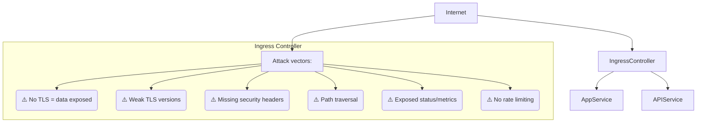
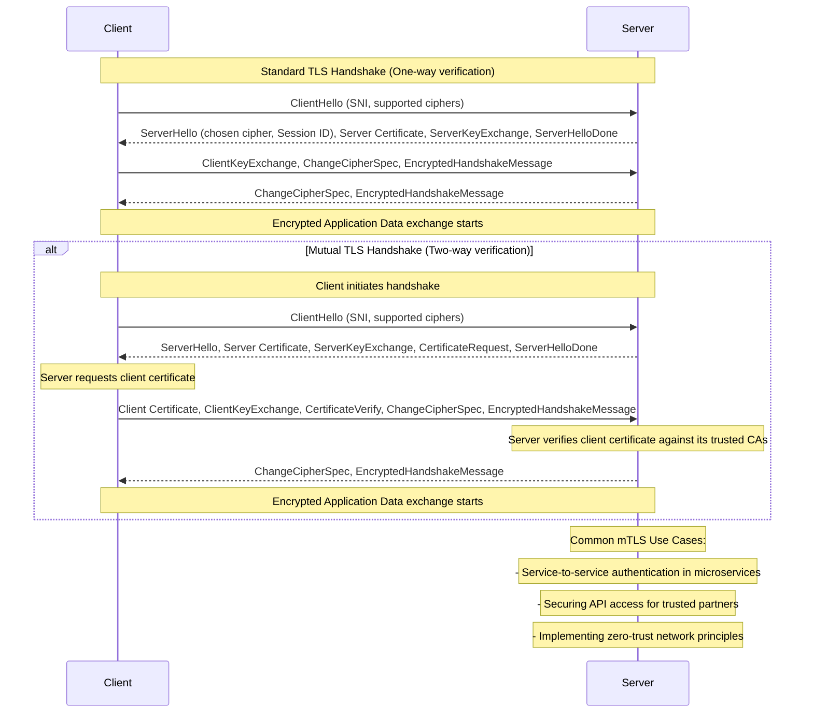
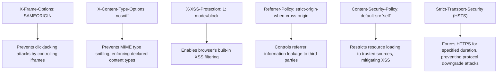

## Why This Module Matters

The Ingress controller is typically the most exposed component of a Kubernetes cluster. Because it sits at the network edge, terminating TLS and evaluating external routing requests, it serves as the primary attack surface for internet-facing infrastructure. Furthermore, because it often runs with elevated network privileges or host network access, a compromised Ingress pod is uniquely positioned to extract sensitive environment details. The [2019 Capital One metadata extraction attack](/k8s/cks/part1-cluster-setup/module-1.4-node-metadata/) <!-- incident-xref: capital-one-2019 --> demonstrates the severe consequences of edge proxy exploitation, where an over-privileged edge firewall accessed the cloud provider's metadata service to siphon highly privileged IAM credentials. A poorly secured Ingress controller can be weaponized using this exact same pattern, turning a straightforward traffic router into a powerful launchpad for lateral movement and complete environment compromise.

In a Kubernetes context, a poorly secured Ingress controller can be similarly weaponized. If compromised or misconfigured, it can be manipulated to access the cloud provider metadata endpoint, read internal service accounts, exfiltrate sensitive ConfigMaps, or route traffic to internal administration dashboards that were never meant to see the public internet. The edge proxy is not just a simple network router; it is the absolute most critical chokepoint in your defense-in-depth architecture.

Your Certified Kubernetes Security Specialist (CKS) certification demands far more than just deploying a functional Ingress; it requires the elite ability to anticipate, model, and aggressively neutralize these advanced edge threats. This module will arm you with the deep technical knowledge required to transform your Kubernetes Ingress from a potential vulnerability into a formidable, hardened defensive perimeter. We will explore how to systematically eliminate common attack vectors, enforce stringent communication policies like Mutual TLS (mTLS), deeply inject robust security headers, and integrate your Ingress controller into a comprehensive, layered network security strategy. Mastering these techniques is not merely about passing a rigorous exam; it is about protecting real-world production systems from devastating, headline-making breaches.

## Learning Outcomes

Upon completing this comprehensive module, you will be able to:

1.  **Diagnose** critical Ingress security vulnerabilities such as misconfigured TLS termination, missing defense-in-depth security headers, and dangerously exposed administrative metric endpoints.
2.  **Implement** robust, cryptographically sound TLS configurations, including HTTP Strict Transport Security (HSTS), Mutual TLS (mTLS), and strictly ordered strong cipher suites, to secure data in transit.
3.  **Design** and meticulously apply comprehensive HTTP security headers and advanced rate-limiting policies to mitigate common web application attacks, such as clickjacking and denial-of-service (DoS).
4.  **Evaluate** and harden Ingress controller Pod deployments using precise SecurityContext constraints, and leverage Kubernetes NetworkPolicies to ensure zero-trust backend isolation.
5.  **Debug** complex Ingress security failures by analyzing raw manifest files, deciphering verbose controller logs, and anticipating network topology bypasses.

## The Ingress Attack Surface: Your Cluster's Exposed Edge

The Ingress controller is the ultimate gateway between your internal Kubernetes microservices and the inherently untrusted, hostile internet. It functions as the first line of defense, but simultaneously represents the most exposed and targeted component in your infrastructure. Understanding the full breadth of its potential attack vectors is the foundational step toward adequately securing it.

Unlike lower-level network load balancers that operate at Layer 4 (Transport), the Ingress controller typically operates at Layer 7 (Application). This means it actively inspects HTTP headers, parses URL paths, terminates TLS connections, and evaluates Server Name Indication (SNI) data. While this deep inspection allows for powerful routing rules, it also exposes the controller to a vast array of application-level attacks. Attackers can attempt HTTP desync attacks (request smuggling), slowloris denial-of-service, or complex path traversal exploits.



An attacker's primary objective is frequently to exploit minor misconfigurations at this edge boundary to either gain unauthorized access to internal services, stealthily exfiltrate data, or disrupt business operations through resource exhaustion. This architecture visually maps the critical role your Ingress plays in securing your downstream applications and explicitly highlights the most common points of failure that we will aggressively remediate throughout this module.

## Comprehensive TLS Configuration for Ingress

Transport Layer Security (TLS) is absolutely non-negotiable for any internet-facing application in a modern Kubernetes cluster. It strictly encrypts communication between external clients and your internal services, definitively preventing eavesdropping, man-in-the-middle (MitM) attacks, and data tampering. 

### Creating TLS Secrets

Before you can actively secure your Ingress resource, you must provision cryptographic TLS certificates. For production environments, you must obtain these from a universally trusted Certificate Authority (CA) such as Let's Encrypt, a process that is almost always automated using cluster add-ons like `cert-manager`. However, for testing, isolated development, or localized lab environments, self-signed certificates are functionally sufficient to validate configuration syntax. These certificates, alongside their highly sensitive private keys, are stored securely within Kubernetes Secret objects.

```bash
# Generate self-signed certificate (for testing purposes only)
# This creates a private key (tls.key) and a self-signed certificate (tls.crt)
openssl req -x509 -nodes -days 365 -newkey rsa:2048 \
  -keyout tls.key -out tls.crt \
  -subj "/CN=myapp.example.com"

# Create a Kubernetes TLS Secret named 'myapp-tls' in the 'production' namespace
# This secret will hold the certificate and key, allowing Ingress to use them.
kubectl create secret tls myapp-tls \
  --cert=tls.crt \
  --key=tls.key \
  -n production

# Verify the contents and type of the created secret
# The 'kubernetes.io/tls' type indicates it's a TLS secret.
kubectl get secret myapp-tls -n production -o yaml
```

When the Ingress controller reads this Secret, it loads the certificate and private key into memory, allowing it to mathematically prove its identity to connecting clients and establish the encrypted TLS tunnel.

### Ingress with TLS and Forced HTTPS Redirect

Once your cryptographic material is securely stored, you must configure your Ingress resource to actively utilize it. Merely serving HTTPS is insufficient; it is imperative to forcibly redirect all inbound plain-text HTTP traffic to the secure HTTPS port. This prevents users from accidentally transmitting sensitive data over an unencrypted connection, and stops attackers from intentionally downgrading the protocol.

```yaml
apiVersion: networking.k8s.io/v1
kind: Ingress
metadata:
  name: secure-ingress
  namespace: production
  annotations:
    # Force all HTTP traffic to redirect to HTTPS. This prevents clients from
    # accidentally or maliciously using unencrypted connections.
    nginx.ingress.kubernetes.io/ssl-redirect: "true"
    # Enable HTTP Strict Transport Security (HSTS). This tells browsers to ONLY
    # communicate with this domain over HTTPS for a specified duration.
    nginx.ingress.kubernetes.io/hsts: "true"
    # The max-age for HSTS, in seconds (1 year = 31536000).
    nginx.ingress.kubernetes.io/hsts-max-age: "31536000"
    # Include subdomains in the HSTS policy.
    nginx.ingress.kubernetes.io/hsts-include-subdomains: "true"
spec:
  ingressClassName: nginx # Specify the Ingress Controller to use (e.g., nginx, traefik)
  tls:
  - hosts:
    - myapp.example.com # The domain name for which this TLS certificate is valid
    secretName: myapp-tls # Reference to the Kubernetes TLS Secret created above
  rules:
  - host: myapp.example.com
    http:
      paths:
      - path: /
        pathType: Prefix
        backend:
          service:
            name: myapp
            port:
              number: 80 # Backend service is typically HTTP, Ingress handles TLS termination
```

> **Stop and think**: You've configured TLS on your Ingress with `ssl-redirect: "true"` and HSTS. But a penetration tester shows they can still access your app over HTTP by sending requests directly to the backend Service's ClusterIP, bypassing the Ingress entirely. What additional protection is needed to ensure the backend service _only_ receives traffic from the Ingress controller?

## Enforcing Strong TLS Versions and Cipher Suites

Beyond simply enabling TLS on an endpoint, you must strictly enforce modern TLS protocol versions and mathematically strong cipher suites. Legacy protocol versions (such as TLS 1.0 and TLS 1.1) and mathematically weak or outdated ciphers are deeply vulnerable to well-documented cryptographic attacks (e.g., POODLE, BEAST, SWEET32).

### Global TLS Configuration in Ingress Controller ConfigMap

For the widely deployed `ingress-nginx` controller, global TLS cryptographic settings are typically defined centrally within a `ConfigMap` that the controller deployment continuously monitors. This centralized approach guarantees consistent, baseline security compliance across every single Ingress resource managed by that specific controller instance, eliminating configuration drift.

```yaml
# ConfigMap for nginx-ingress-controller
# This configuration applies globally to all Ingress resources managed by this controller.
apiVersion: v1
kind: ConfigMap
metadata:
  name: nginx-ingress-controller
  namespace: ingress-nginx # The namespace where your ingress-nginx controller is deployed
data:
  # Minimum TLS version: Restrict to TLSv1.2 and TLSv1.3.
  # TLSv1.0 and TLSv1.1 are known to be vulnerable and should be disabled.
  ssl-protocols: "TLSv1.2 TLSv1.3"

  # Strong cipher suites only: Prioritize modern, secure ciphers.
  # This list excludes weak or compromised ciphers.
  ssl-ciphers: "ECDHE-ECDSA-AES128-GCM-SHA256:ECDHE-RSA-AES128-GCM-SHA256:ECDHE-ECDSA-AES256-GCM-SHA384:ECDHE-RSA-AES256-GCM-SHA384"

  # Enable HSTS globally: For all domains managed by this controller.
  hsts: "true"
  hsts-max-age: "31536000" # One year max-age for robustness
  hsts-include-subdomains: "true" # Apply HSTS to all subdomains
  hsts-preload: "true" # Request inclusion in browser HSTS preload lists
```

By dictating `ssl-ciphers`, you explicitly define the cryptographic algorithms the server is permitted to use. A modern cipher suite like `ECDHE-RSA-AES256-GCM-SHA384` dictates the key exchange mechanism (ECDHE for vital Forward Secrecy), the authentication method (RSA), the bulk encryption algorithm (AES256 in GCM mode), and the hashing algorithm (SHA384). Forward Secrecy ensures that even if the server's private key is compromised years in the future, past recorded traffic cannot be decrypted.

### Per-Ingress TLS Settings

While globally enforced settings are operationally ideal, highly specific microservices or legacy API endpoints might require exceptionally stricter, or occasionally divergent, TLS configurations. Ingress annotations allow you to override global defaults, offering granular, per-route cryptographic control.

```yaml
apiVersion: networking.k8s.io/v1
kind: Ingress
metadata:
  name: strict-tls-ingress
  annotations:
    # Require client certificate (mTLS) for this specific Ingress.
    # This is a powerful mechanism for service-to-service authentication.
    nginx.ingress.kubernetes.io/auth-tls-verify-client: "on"
    # Specify the Kubernetes Secret containing the CA certificate to verify client certificates.
    nginx.ingress.kubernetes.io/auth-tls-secret: "production/ca-secret"

    # Prefer the server's cipher order over the client's.
    # This ensures that stronger server-side ciphers are always used if supported by the client.
    nginx.ingress.kubernetes.io/ssl-prefer-server-ciphers: "true"
spec:
  tls:
  - hosts:
    - api.example.com
    secretName: api-tls
```

## Mutual TLS (mTLS): Two-Way Authentication

Standard TLS architecture provides strictly one-way authentication: the client uses the public certificate to verify the server's identity. Mutual TLS (mTLS) fundamentally alters this paradigm by introducing a second, mandatory layer of cryptographic verification, where the server also actively demands and verifies the client's identity using client-side certificates. This is an invaluable, indispensable pattern for securing internal APIs, locking down service-to-service communication, and implementing strict zero-trust network architectures.



The Mutual TLS handshake process introduces significant operational overhead but provides unparalleled access control. Because the cryptographic verification occurs at the network edge during the handshake phase, unauthorized or unauthenticated traffic is instantly terminated by the Ingress controller before it ever consumes resources on your backend application pods.

### Configuring mTLS

To successfully enable mTLS, you must first deploy a Certificate Authority (CA) public certificate that previously signed all of your distributed client certificates. This CA certificate is stored safely in a Kubernetes Secret, and your specific Ingress resource is annotated to utilize it as the definitive source of truth for incoming client verification.

```bash
# Assume 'ca.crt' is the public CA certificate that signed your client certificates.
# This secret tells the Ingress controller which CA to trust for client authentication.
kubectl create secret generic ca-secret \
  --from-file=ca.crt=ca.crt \
  -n production
```

Once the CA trust anchor is established in the cluster, you apply specific NGINX annotations to enforce the mutual verification process on a per-ingress basis.

```yaml
apiVersion: networking.k8s.io/v1
kind: Ingress
metadata:
  name: mtls-ingress
  namespace: production
  annotations:
    # Enable client certificate verification. This is the core mTLS setting.
    nginx.ingress.kubernetes.io/auth-tls-verify-client: "on"
    # Specify the Secret (namespace/name) containing the CA certificate for client verification.
    nginx.ingress.kubernetes.io/auth-tls-secret: "production/ca-secret"
    # Set the maximum verification depth in the client certificate chain.
    nginx.ingress.kubernetes.io/auth-tls-verify-depth: "1" # Typically 1 for direct CA-signed certs
    # Pass the client certificate to the upstream (backend) service.
    # This allows the backend application to perform further authorization based on client cert details.
    nginx.ingress.kubernetes.io/auth-tls-pass-certificate-to-upstream: "true"
spec:
  tls:
  - hosts:
    - secure-api.example.com
    secretName: api-tls # The server's TLS certificate for secure-api.example.com
  rules:
  - host: secure-api.example.com
    http:
      paths:
      - path: /
        pathType: Prefix
        backend:
          service:
            name: secure-api
            port:
              number: 443 # Backend service expects TLS if mTLS is being terminated there
```

> **What would happen if**: You configure mTLS on your Ingress, requiring client certificates. A legitimate user's client certificate expires over the weekend. What happens to their requests, and how should you design your certificate lifecycle management to prevent service interruptions due to expired credentials?

## Implementing Security Headers

HTTP Security headers are directive response headers that provide a critical additional layer of defense against a wide spectrum of common web vulnerabilities, including Cross-Site Scripting (XSS), clickjacking, and dangerous MIME-type sniffing. By instructing the client's web browser on how to securely handle the application's content, you mitigate risks that cannot be blocked purely by network-level firewalls.

### Essential Security Headers via Ingress Annotations

For the NGINX Ingress controller, administrators can rapidly inject arbitrary, custom HTTP headers using the highly flexible `configuration-snippet` annotation. This allows you to append NGINX configuration directives directly into the generated server block.

```yaml
apiVersion: networking.k8s.io/v1
kind: Ingress
metadata:
  name: hardened-ingress
  annotations:
    # The configuration-snippet allows injecting arbitrary NGINX configuration.
    # Here, we add several crucial security headers.
    nginx.ingress.kubernetes.io/configuration-snippet: |
      add_header X-Frame-Options "SAMEORIGIN" always; # Prevents clickjacking by controlling iframe usage
      add_header X-Content-Type-Options "nosniff" always; # Prevents MIME-type sniffing, enforcing declared content types
      add_header X-XSS-Protection "1; mode=block" always; # Enables browser's built-in XSS filter
      add_header Referrer-Policy "strict-origin-when-cross-origin" always; # Controls how much referrer information is sent
      add_header Content-Security-Policy "default-src 'self'" always; # Restricts resource loading to trusted sources (e.g., same origin)
spec:
  # ... rest of Ingress specification ...
```

Understanding the exact mechanical purpose of each header is crucial for effective defense-in-depth engineering. For example, `X-Content-Type-Options: nosniff` prevents a browser from trying to dynamically guess a file's MIME type. If an attacker manages to upload a malicious Javascript file disguised as a `.jpg` image, a browser without this header might "sniff" the file, realize it contains executable code, and run it. The `nosniff` directive forces the browser to strictly honor the server's declared `Content-Type`, neutralizing the attack entirely.



> **Pause and predict**: Your Ingress uses TLS 1.2 minimum for all traffic. A compliance audit now dictates that you must enforce TLS 1.3 *only* for a specific, highly sensitive API endpoint. What percentage of your legitimate clients might this break, and what would be your phased migration plan to implement such a strict requirement without causing a widespread outage? Consider browser support and existing client integrations.

## Rate Limiting: Defending Against DoS Attacks

Rate limiting is an essential operational requirement to aggressively protect your backend services from widespread abuse, volumetric Denial-of-Service (DoS) attacks, and targeted brute-force password guessing attempts. By strictly mathematically limiting the absolute number of requests or concurrent TCP connections originating from a single client IP address, you can preserve overall service availability and prevent catastrophic backend resource exhaustion.

The NGINX Ingress controller utilizes the classic "leaky bucket" algorithm for rate limiting. When you specify a limit of 10 requests per second, NGINX does not simply allow 10 requests to instantly flood the backend in the first millisecond and block the rest. Instead, it spaces the requests out strictly, processing exactly one request every 100 milliseconds. The burst parameter allows you to define a queue for requests that exceed the strict rate, acting as a temporary shock absorber for legitimate traffic spikes.

```yaml
apiVersion: networking.k8s.io/v1
kind: Ingress
metadata:
  name: rate-limited-ingress
  annotations:
    # Limit the number of requests per second from a single IP address.
    nginx.ingress.kubernetes.io/limit-rps: "10" # 10 requests per second

    # Limit the number of concurrent connections from a single IP address.
    nginx.ingress.kubernetes.io/limit-connections: "5" # 5 concurrent connections

    # Allows for short bursts of requests above the 'limit-rps' before throttling.
    # A multiplier of 5 means a burst of up to 50 requests can be handled briefly.
    nginx.ingress.kubernetes.io/limit-burst-multiplier: "5"

    # Customize the HTTP status code returned when a client is rate-limited.
    nginx.ingress.kubernetes.io/server-snippet: |
      limit_req_status 429; # Return HTTP 429 Too Many Requests
spec:
  rules:
  - host: api.example.com
    http:
      paths:
      - path: /
        pathType: Prefix
        backend:
          service:
            name: api
            port:
              number: 80
```

## Protecting Sensitive Paths and Backend Services

Beyond holistic Ingress hardening, specific application paths—such as administrative dashboards or infrastructure metrics—frequently require extreme protection. Furthermore, you must aggressively restrict direct, lateral access to backend services from within the cluster itself.

### Blocking or Authenticating Sensitive Paths

Administrative interfaces, health probes, and Prometheus `/metrics` endpoints inherently expose highly sensitive operational information. They must be strictly blocked from external internet access or protected via robust external authentication mechanisms. When writing block rules, administrators must be wary of URL path obfuscation bypasses (e.g., requesting `//admin` or `/%61dmin`). Properly constrained regular expressions within NGINX snippets ensure these locations cannot be accessed remotely.

```yaml
apiVersion: networking.k8s.io/v1
kind: Ingress
metadata:
  name: protected-paths
  annotations:
    # Inject an NGINX location block to deny access to specific paths.
    # This regex matches '/admin', '/metrics', '/health', or '/debug'.
    nginx.ingress.kubernetes.io/server-snippet: |
      location ~ ^/(admin|metrics|health|debug) {
        deny all; # Block access from all IP addresses
        return 403; # Return Forbidden status
      }

    # Alternatively, require external authentication for a path or service.
    # This redirects requests to an external authentication service.
    nginx.ingress.kubernetes.io/auth-url: "https://auth.example.com/verify"
spec:
  rules:
  - host: app.example.com
    http:
      paths:
      - path: /
        pathType: Prefix
        backend:
          service:
            name: app
            port:
              number: 80
```

### Defense-in-Depth with NetworkPolicies

Even with a perfectly secured Ingress controller, a critical defense-in-depth layer is ensuring that your backend application services can *only* be accessed by the Ingress controller pods. If an attacker successfully compromises an adjacent pod in the cluster, they could attempt to laterally access your backend service directly via its internal ClusterIP, completely bypassing all Ingress security rules (like mTLS, rate limiting, and headers). Kubernetes NetworkPolicies are the native solution to this problem, enforcing micro-segmentation down to the pod level.

```yaml
# This NetworkPolicy ensures that only the ingress-nginx controller
# can send traffic to pods labeled 'app: myapp' in the 'production' namespace.
apiVersion: networking.k8s.io/v1
kind: NetworkPolicy
metadata:
  name: allow-from-ingress-only
  namespace: production # The namespace where your backend application is
spec:
  podSelector:
    matchLabels:
      app: myapp # Selects the pods of your application
  policyTypes:
  - Ingress # This policy applies to incoming traffic
  ingress:
  - from:
    - namespaceSelector:
        matchLabels:
          name: ingress-nginx # Selects the namespace where the ingress controller runs
      podSelector:
        matchLabels:
          app.kubernetes.io/name: ingress-nginx # Selects the ingress controller pods
    ports:
    - port: 80 # Allow traffic on port 80 (where the backend service listens)
```

## Hardening the Ingress Controller Itself

The Ingress controller is an inherently privileged, highly exposed infrastructure component. Actively hardening its specific Pod deployment significantly reduces the potential blast radius if the controller software is compromised via a zero-day vulnerability. You must rigorously apply fundamental Kubernetes security best practices to the controller's container specifications.

### Secure Ingress Controller Deployment Manifest

A hardened controller must never run as the root user. It must utilize a read-only root filesystem to prevent the installation of persistent rootkits, and it must meticulously drop all unnecessary Linux kernel capabilities, retaining only those strictly required to bind to privileged network ports (like port 80 and 443 via `NET_BIND_SERVICE`).

```yaml
apiVersion: apps/v1
kind: Deployment
metadata:
  name: ingress-nginx-controller
  namespace: ingress-nginx
spec:
  template:
    spec:
      containers:
      - name: controller
        image: registry.k8s.sio/ingress-nginx/controller:v1.9.0 # Use a specific, well-vetted image version
        securityContext:
          runAsNonRoot: true # Ensure the container does not run as root
          runAsUser: 101 # Run as an arbitrary non-root user (e.g., 101, common for nginx)
          readOnlyRootFilesystem: true # Prevent writing to the container's root filesystem
          allowPrivilegeEscalation: false # Prevent processes from gaining more privileges
          capabilities:
            drop:
            - ALL # Drop all Linux capabilities by default
            add:
            - NET_BIND_SERVICE # Only add necessary capabilities, like binding to low ports
        resources:
          limits:
            cpu: "1" # Limit CPU usage to prevent DoS attacks on the controller itself
            memory: 512Mi # Limit memory usage
          requests:
            cpu: 100m # Request minimum resources for scheduling
            memory: 256Mi
```

## Debugging Ingress Security Issues

When rigid security policies inadvertently block legitimate user traffic or fail to apply correctly during a deployment, you must rapidly debug the Ingress controller architecture. Key methodological steps include:

1.  **Analyze Manifest Files:** Execute `kubectl describe ingress <name>` to rigorously check for syntactically misconfigured NGINX annotations or missing TLS secret bindings (which frequently manifest as unexpected `default backend - 404` errors or stark browser certificate warnings).
2.  **Inspect Controller Logs:** The Ingress controller logs provide the definitive, verbose rejection reasons for failed traffic. Run `kubectl logs -n ingress-nginx -l app.kubernetes.io/name=ingress-nginx` to quickly spot complex errors, such as cryptographically rejected client certificates during mTLS handshakes or rapidly triggering rate-limiting thresholds resulting in HTTP 429 status codes.
3.  **Use External Scanning Tools:** You must periodically scan your exposed internet endpoints using external validation tools like `nmap` (specifically for exhaustive cipher suite enumeration) or `sslyze` to empirically verify that deprecated, older TLS versions are successfully blocked and that all required security headers are actually present from a remote client's perspective.

## Did You Know?

*   In 2022, a comprehensive industry study by the Cloud Native Computing Foundation (CNCF) revealed that over 68% of surveyed organizations running Kubernetes in production experienced a security incident specifically related to misconfigured edge routing or accidental Ingress exposure.
*   The Payment Card Industry Data Security Standard (PCI-DSS) officially deprecated TLS 1.0 and 1.1 on June 30, 2018. Any Kubernetes Ingress controller still accepting these obsolete protocols automatically fails mandatory compliance audits and exposes the organization to severe fines.
*   Enabling HTTP Strict Transport Security (HSTS) with a `max-age` of 31536000 seconds (exactly 1 year) and the `preload` directive is a strict, non-negotiable requirement for inclusion in the Chrome browser's global HSTS preload list, neutralizing initial HTTP connections globally.
*   The NGINX Ingress controller's default rate-limiting implementation strictly utilizes the "leaky bucket" algorithm. If you explicitly set `limit-rps: "10"`, NGINX processes requests at a rigid