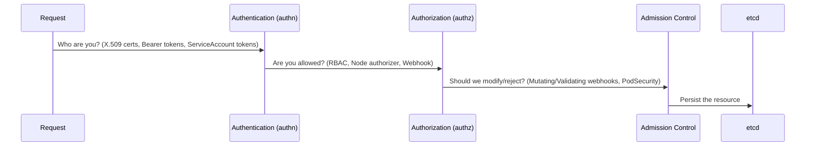
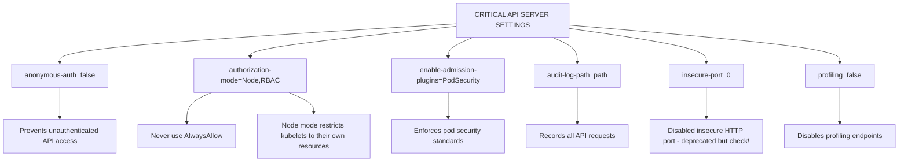
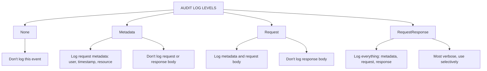

> **Complexity**: `[COMPLEX]` - Critical infrastructure component
>
> **Time to Complete**: 45-50 minutes
>
> **Prerequisi`tes**: CKA API server knowledge, Module 1.2 (CIS Benchmarks) --- ## What You'll B`e learning in this module requires deep understanding of control plane architectures.

---

## What You'll Be Able to Do

After completing this module, you will be able to:

1. **Design** a hardened API server configuration that completely mitigates unauthenticated access and enforces strict authorization boundaries.
2. **Audit** API server configuration against security best practices and CIS benchmarks.
3. **Implement** robust audit logging policies to capture security-relevant events without overwhelming storage systems.
4. **Diagnose** complex cluster authentication and authorization failures by analyzing API server behavior and container runtime logs.
5. **Evaluate** existing cluster deployments and upgrade paths, ensuring that deprecated flags from older versions are safely transitioned to modern Kubernetes v1.35 standards.

---

## Why This Module Matters

The API server is the control plane's front door. Every `kubectl` command, every automated controller, every worker node—they all talk to the API server. Compromising it means compromising the entire cluster. CKS tests your ability to harden API server configuration and understand its security boundaries thoroughly. 

Real-world control plane compromises overwhelmingly trace back to basic configuration oversights on default-open pathways, rather than sophisticated zero-day exploits. Attackers continuously scan the public internet for exposed endpoints, immediately capitalizing on unrestricted access to administrative interfaces. The [2018 Tesla cluster compromise](/k8s/cks/part1-cluster-setup/module-1.5-gui-security/) <!-- incident-xref: tesla-2018-cryptojacking --> serves as a prime example of this attack pattern, where an unauthenticated, publicly accessible interface provided adversaries with direct command execution capabilities within the environment. When the API server is exposed without stringent safeguards, the platform's powerful orchestration capabilities are weaponized by the attacker, allowing them to rapidly extract sensitive secrets, manipulate existing workloads, and provision unauthorized compute resources across the underlying infrastructure.

Securing this critical component requires a rigorous, defense-in-depth approach that assumes hostile network conditions. A single misconfiguration can reduce the time between initial discovery and complete cluster takeover to mere minutes. Robust API server security mandates that anonymous authentication is explicitly disabled, every request is validated through strict Role-Based Access Control (RBAC), and network access is tightly restricted to known, trusted IP ranges. By implementing these overlapping security controls, administrators ensure that even if one defensive layer fails or is bypassed, the control plane remains resilient against unauthorized administrative access and systemic exploitation.

---

## Section 1: The API Server Authentication Flow

When a request arrives at the API server, it must pass through a strict sequence of security gates. Think of the API server as a highly secure bank vault entrance. Authentication is the ID check, Authorization is the VIP guest list, Admission Control is the metal detector and bag search, and etcd is the vault itself. If a request fails at any stage, it is immediately rejected with a corresponding HTTP error code. 

The main API group is located at `api/v1`, while other resources exist under specific API groups like `apps/v1` or `rbac.authorization.k8s.io/v1`. Regardless of the endpoint, the flow remains the same.

Below is the legacy architectural view of this flow:

```text
┌─────────────────────────────────────────────────────────────┐
│              API SERVER REQUEST FLOW                        │
├─────────────────────────────────────────────────────────────┤
│                                                             │
│  Request ──────────────────────────────────────────────►   │
│           │                                                 │
│           ▼                                                 │
│  ┌─────────────────┐                                       │
│  │ Authentication  │  Who are you?                         │
│  │ (authn)         │  - X.509 certs                        │
│  │                 │  - Bearer tokens                       │
│  │                 │  - ServiceAccount tokens              │
│  └────────┬────────┘                                       │
│           │                                                 │
│           ▼                                                 │
│  ┌─────────────────┐                                       │
│  │ Authorization   │  Are you allowed?                     │
│  │ (authz)         │  - RBAC                               │
│  │                 │  - Node authorizer                    │
│  │                 │  - Webhook                            │
│  └────────┬────────┘                                       │
│           │                                                 │
│           ▼                                                 │
│  ┌─────────────────┐                                       │
│  │ Admission       │  Should we modify/reject?             │
│  │ Control         │  - Mutating webhooks                  │
│  │                 │  - Validating webhooks                │
│  │                 │  - PodSecurity                        │
│  └────────┬────────┘                                       │
│           │                                                 │
│           ▼                                                 │
│  ┌─────────────────┐                                       │
│  │    etcd         │  Persist the resource                 │
│  └─────────────────┘                                       │
│                                                             │
└─────────────────────────────────────────────────────────────┘
```

### Modernized Flowchart Representation



Understanding this sequence is critical because a misconfiguration in one layer cannot always be caught by the next. For instance, if anonymous authentication is enabled, the request skips standard identity validation and proceeds directly to Authorization as the `system:anonymous` user. 

---

## Section 2: Critical API Server Flags & Security Settings

The API server is a static pod managed by the kubelet on the control plane nodes. Its behavior is entirely driven by command-line flags defined in its manifest file. 

### Authentication Flags

The first line of defense is ensuring that only verified identities can even ask for access.

```yaml
# /etc/kubernetes/manifests/kube-apiserver.yaml
spec:
  containers:
  - command:
    - kube-apiserver
    # Disable anonymous authentication
    - --anonymous-auth=false

    # Client certificate authentication
    - --client-ca-file=/etc/kubernetes/pki/ca.crt

    # Bootstrap token authentication (for node join)
    - --enable-bootstrap-token-auth=true

    # ServiceAccount token authentication
    - --service-account-key-file=/etc/kubernetes/pki/sa.pub
    - --service-account-issuer=https://kubernetes.default.svc
```

### Authorization Flags

Once authenticated, the API server must determine if the identity has the necessary permissions. The order of authorization modes matters significantly. 

```yaml
    # Authorization modes (order matters!)
    - --authorization-mode=Node,RBAC
    # Node: kubelet authorization
    # RBAC: role-based access control
    # Don't use: AlwaysAllow (dangerous!)
```

### Admission Controller Flags

Admission controllers can mutate or validate requests before they are persisted. They represent the final security check.

```yaml
    # Enable essential admission controllers
    - --enable-admission-plugins=NodeRestriction,PodSecurity,EventRateLimit

    # Disable risky admission controllers
    - --disable-admission-plugins=AlwaysAdmit
```

> **Stop and think**: The API server manifest lives at `/etc/kubernetes/manifests/kube-apiserver.yaml`. When you edit this file, the kubelet detects the change and restarts the API server. What happens to your cluster if you introduce a typo in a flag? How would you recover if `kubectl` stops working?

### Security-Critical Settings Overview

The following ASCII diagram maps out the most critical settings to monitor. 

```text
┌─────────────────────────────────────────────────────────────┐
│              CRITICAL API SERVER SETTINGS                   │
├─────────────────────────────────────────────────────────────┤
│                                                             │
│  anonymous-auth=false                                      │
│  └── Prevents unauthenticated API access                   │
│                                                             │
│  authorization-mode=Node,RBAC                              │
│  └── Never use AlwaysAllow                                 │
│  └── Node mode restricts kubelets to their own resources   │
│                                                             │
│  enable-admission-plugins=PodSecurity                      │
│  └── Enforces pod security standards                       │
│                                                             │
│  audit-log-path=<path>                                     │
│  └── Records all API requests                              │
│                                                             │
│  insecure-port=0 (deprecated but check!)                   │
│  └── Disabled insecure HTTP port                           │
│                                                             │
│  profiling=false                                           │
│  └── Disables profiling endpoints                          │
│                                                             │
└─────────────────────────────────────────────────────────────┘
```



In historical cluster deployments, such as Kubernetes `v1.2`, security defaults were significantly looser, often relying heavily on implicit trust within the network. Today, explicitly defining these parameters is required for CIS compliance.

---

## Section 3: Audit Logging Deep Dive

Without visibility, you cannot defend your cluster. Audit logging provides a chronological record of every request made to the API server.

### Enable Audit Logging

To enable audit logging, you must define the log location, rotation policies, and the policy file itself.

```yaml
# API server flags
- --audit-policy-file=/etc/kubernetes/audit-policy.yaml
- --audit-log-path=/var/log/kubernetes/audit.log
- --audit-log-maxage=30
- --audit-log-maxbackup=10
- --audit-log-maxsize=100
```

### Audit Policy

The policy file dictates *what* is logged. You must strike a balance between visibility and storage overhead. Logging every single request payload will rapidly exhaust your node's disk space.

```yaml
# /etc/kubernetes/audit-policy.yaml
apiVersion: audit.k8s.io/v1
kind: Policy
rules:
  # Log authentication failures
  - level: Metadata
    omitStages:
    - RequestReceived

  # Log secret access
  - level: RequestResponse
    resources:
    - group: ""
      resources: ["secrets"]

  # Log all pod operations
  - level: Request
    resources:
    - group: ""
      resources: ["pods"]
    verbs: ["create", "update", "patch", "delete"]

  # Log RBAC changes
  - level: RequestResponse
    resources:
    - group: "rbac.authorization.k8s.io"

  # Skip noisy events
  - level: None
    users: ["system:kube-proxy"]
    verbs: ["watch"]
    resources:
    - group: ""
      resources: ["endpoints", "services"]
```

### Audit Log Levels

The API server supports four distinct verbosity levels for auditing:

```text
┌─────────────────────────────────────────────────────────────┐
│              AUDIT LOG LEVELS                               │
├─────────────────────────────────────────────────────────────┤
│                                                             │
│  None                                                      │
│  └── Don't log this event                                  │
│                                                             │
│  Metadata                                                  │
│  └── Log request metadata (user, timestamp, resource)      │
│  └── Don't log request or response body                    │
│                                                             │
│  Request                                                   │
│  └── Log metadata and request body                         │
│  └── Don't log response body                               │
│                                                             │
│  RequestResponse                                           │
│  └── Log everything: metadata, request, response           │
│  └── Most verbose, use selectively                         │
│                                                             │
└─────────────────────────────────────────────────────────────┘
```



Choosing the right level is paramount. Applying `RequestResponse` to all resources is a classic mistake that can crash the control plane due to extreme I/O exhaustion.

---

## Section 4: API Server Access Control & Network Boundaries

Beyond authentication, you must restrict network access. If an attacker cannot reach the API server port, they cannot exploit it.

### Restrict API Server Network Access

By default, the API server binds to all interfaces (`0.0.0.0`). It is strongly recommended to restrict this in production environments using explicit bind addresses and network firewalls.

```yaml
# API server flags to bind to specific address
- --advertise-address=10.0.0.10
- --bind-address=0.0.0.0  # Or specific IP

# In production, use firewall rules to restrict access
# iptables -A INPUT -p tcp --dport 6443 -s 10.0.0.0/8 -j ACCEPT
# iptables -A INPUT -p tcp --dport 6443 -j DROP
```

### NodeRestriction Admission

The `NodeRestriction` plugin is a critical layer of defense that limits what a compromised worker node can do. Without it, a rogue kubelet could modify pods or labels on entirely different nodes.

```yaml
# Enable NodeRestriction (limits what kubelets can modify)
- --enable-admission-plugins=NodeRestriction

# What it prevents:
# - Kubelets can only modify pods scheduled to them
# - Kubelets can only modify their own Node object
# - Kubelets cannot modify other nodes' labels
```

> **What would happen if**: You set `--authorization-mode=RBAC` without including `Node` in the mode list. The cluster seems to work fine for users. But what subtle security risk have you introduced for kubelet communication?

---

## Section 5: Encryption at Rest (etcd)

The API server is entirely stateless. All cluster state, including sensitive Secrets, is persisted in etcd. By default, etcd stores data in plain text. If an attacker gains access to the etcd volume or a backup file, they possess every secret in the cluster.

### Enable etcd Encryption

You must provide an `EncryptionConfiguration` file to define how the API server encrypts data before sending it to etcd.

```yaml
# Create encryption configuration
# /etc/kubernetes/enc/encryption-config.yaml
apiVersion: apiserver.config.k8s.io/v1
kind: EncryptionConfiguration
resources:
  - resources:
    - secrets
    providers:
    - aescbc:
        keys:
        - name: key1
          secret: <base64-encoded-32-byte-key>
    - identity: {}  # Fallback for reading old unencrypted data
```

To activate this, you pass the configuration to the API server via a flag and ensure the file is mounted into the static pod container. 

```yaml
spec:
  containers:
  - command:
    - kube-apiserver
    # API server flag
    - --encryption-provider-config=/etc/kubernetes/enc/encryption-config.yaml

    # Mount the config
    volumeMounts:
    - name: enc
      mountPath: /etc/kubernetes/enc
      readOnly: true
  volumes:
  - name: enc
    hostPath:
      path: /etc/kubernetes/enc
```

### Verify Encryption

After configuration, you must verify that new secrets are actually being encrypted at the storage layer.

```bash
# Create a secret
kubectl create secret generic test-secret --from-literal=key=value

# Check etcd directly (should be encrypted)
ETCDCTL_API=3 etcdctl \
  --endpoints=https://127.0.0.1:2379 \
  --cacert=/etc/kubernetes/pki/etcd/ca.crt \
  --cert=/etc/kubernetes/pki/etcd/server.crt \
  --key=/etc/kubernetes/pki/etcd/server.key \
  get /registry/secrets/default/test-secret | hexdump -C | head

# Should see encrypted data, not plain text
```

> **Pause and predict**: You enable encryption at rest for secrets using `aescbc` provider. Existing secrets were created before encryption was enabled. Are they now encrypted, or do you need to take additional action?

---

## Section 6: Secure Kubelet Communication

When the API server initiates a connection to a kubelet (for example, when you run `kubectl logs` or `kubectl exec`), it must verify the kubelet's identity and encrypt the channel.

```yaml
spec:
  containers:
  - command:
    - kube-apiserver
    # API server flags for secure kubelet communication
    - --kubelet-certificate-authority=/etc/kubernetes/pki/ca.crt
    - --kubelet-client-certificate=/etc/kubernetes/pki/apiserver-kubelet-client.crt
    - --kubelet-client-key=/etc/kubernetes/pki/apiserver-kubelet-client.key
---
# Enable HTTPS for kubelet (on kubelet side)
# /var/lib/kubelet/config.yaml
serverTLSBootstrap: true
```

If these flags are missing, the API server might connect to a spoofed kubelet, potentially leaking sensitive command payloads or allowing a man-in-the-middle attack.

---

## Section 7: Real Exam Scenarios & Troubleshooting

In the CKS exam, you will frequently need to audit and repair broken clusters.

### Scenario 1: Disable Anonymous Auth

```bash
# Check current setting
cat /etc/kubernetes/manifests/kube-apiserver.yaml | grep anonymous

# Edit API server manifest
sudo vi /etc/kubernetes/manifests/kube-apiserver.yaml

# Add to command section:
# - --anonymous-auth=false

# Wait for API server to restart
kubectl get pods -n kube-system -w
```

### Scenario 2: Enable Audit Logging

```bash
# Create audit policy
sudo tee /etc/kubernetes/audit-policy.yaml <<EOF
apiVersion: audit.k8s.io/v1
kind: Policy
rules:
- level: Metadata
  resources:
  - group: ""
    resources: ["secrets", "configmaps"]
- level: RequestResponse
  resources:
  - group: "rbac.authorization.k8s.io"
EOF

# Create log directory
sudo mkdir -p /var/log/kubernetes

# Edit API server manifest
sudo vi /etc/kubernetes/manifests/kube-apiserver.yaml

# Add flags:
# - --audit-policy-file=/etc/kubernetes/audit-policy.yaml
# - --audit-log-path=/var/log/kubernetes/audit.log
# - --audit-log-maxage=30
# - --audit-log-maxbackup=3
# - --audit-log-maxsize=100

# Add volume mounts for policy and logs
```

### Scenario 3: Check Authorization Mode

```bash
# Verify authorization mode
kubectl get pods -n kube-system kube-apiserver-* -o yaml | grep authorization-mode

# Should see: --authorization-mode=Node,RBAC
# Should NOT see: AlwaysAllow
```

### API Server Hardening Checklist

Use this script to quickly gather intelligence on a target cluster.

```bash
#!/bin/bash
# api-server-audit.sh

echo "=== API Server Security Audit ==="

# Get API server pod
POD=$(kubectl get pods -n kube-system -l component=kube-apiserver -o name | head -1)

# Check anonymous auth
echo "Anonymous auth:"
kubectl get $POD -n kube-system -o yaml | grep -E "anonymous-auth" || echo "  Not explicitly set (check default)"

# Check authorization mode
echo "Authorization mode:"
kubectl get $POD -n kube-system -o yaml | grep -E "authorization-mode"

# Check admission plugins
echo "Admission plugins:"
kubectl get $POD -n kube-system -o yaml | grep -E "enable-admission-plugins"

# Check audit logging
echo "Audit logging:"
kubectl get $POD -n kube-system -o yaml | grep -E "audit-log-path" || echo "  Not configured"

# Check encryption
echo "Encryption at rest:"
kubectl get $POD -n kube-system -o yaml | grep -E "encryption-provider-config" || echo "  Not configured"

# Check profiling
echo "Profiling:"
kubectl get $POD -n kube-system -o yaml | grep -E "profiling=false" || echo "  May be enabled"
```

---

## Did You Know?

- **The insecure port (--insecure-port)** was completely removed in Kubernetes 1.24. Before that, it exposed an unauthenticated API on localhost. Furthermore, the underlying code path `** was completely removed in Kubernetes 1.24. Before that, it exposed an unauthentic`ated connection directly to the core runtime handlers.
- **Audit logs can be sent to webhooks** for real-time security monitoring. Many organizations use this for SIEM integration, a feature that reached general stability in December 2018.
- **Node authorization mode** was specifically engineered for kubelets in June 2017. It algorithmically restricts them to only access resources related to pods scheduled directly on their assigned node.
- **The API server is entirely stateless**—all data is persisted in etcd. Since Kubernetes v1.0 (July 2015), you can run multiple API servers behind a load balancer for high availability without worrying about state synchronization between them.

---

## Common Mistakes

| Mistake | Why It Hurts | Solution |
|---------|--------------|----------|
| Anonymous auth enabled | Unauthenticated access | `--anonymous-auth=false` |
| AlwaysAllow authorization | No access control | Use `Node,RBAC` |
| | No audit logging | Can't investigate incidents | Configure audit policy |
| Unencrypted etcd | Secrets in plain text | Enable encryption at rest |
| Missing NodeRestriction | Kubelets can modify any pod | Enable admission plugin |
| Missing volume mounts | Audit logs fail to write | Mount hostPath to pod |
| Incorrect CA files | Kubelet TLS bootstrap fails | Verify `--kubelet-certificate-authority` |
| Leaving profiling on | Exposes debug metrics | `--profiling=false` |

---

## Quiz

1. **A security scanner reports that your API server accepts anonymous requests and returns namespace listings to unauthenticated clients. You check the API server manifest and don't see `--anonymous-auth` at all. Why is anonymous access working, and what change fixes it?**
   <details>
   <summary>Answer</summary>
   When `--anonymous-auth` is not explicitly set, it defaults to `true` -- anonymous authentication is enabled by default in Kubernetes. This means any unauthenticated request is assigned the `system:anonymous` user and `system:unauthenticated` group. If any ClusterRoleBinding grants permissions to these identities, anonymous users get access. Fix by explicitly adding `--anonymous-auth=false` to the API server manifest at `/etc/kubernetes/manifests/kube-apiserver.yaml`. The API server will restart automatically. Verify with `curl -k https://<api-server>:6443/api/v1/namespaces` -- it should return 401 Unauthorized.
   </details>

2. **After enabling audit logging on the API server, you notice the API server pod is in CrashLoopBackOff. The `crictl logs` output shows "open /var/log/kubernetes/audit.log: no such file or directory." You added `--audit-log-path` and `--audit-policy-file` flags. What did you miss?**
   <details>
   <summary>Answer</summary>
   The API server container needs both the directory to exist AND volume mounts configured. Three things are required: (1) Create the log directory on the host: `mkdir -p /var/log/kubernetes`. (2) Add a `hostPath` volume in the API server manifest pointing to both the audit policy file and the log directory. (3) Add corresponding `volumeMounts` in the container spec. You also need the `--audit-policy-file` pointing to a valid audit policy YAML -- without a valid policy, the API server also fails. Always use `crictl logs` to diagnose static pod failures when `kubectl` is unavailable.
   </details>

3. **During a compliance audit, the auditor asks you to prove that secrets stored in etcd are encrypted at rest. You show them the EncryptionConfiguration with `aescbc` provider. They say "prove it's actually encrypting, not just configured." How do you demonstrate this?**
   <details>
   <summary>Answer</summary>
   Read a secret directly from etcd using etcdctl: `ETCDCTL_API=3 etcdctl get /registry/secrets/default/<secret-name> --endpoints=https://127.0.0.1:2379 --cacert=... --cert=... --key=... | hexdump -C | head`. If encryption is working, the output shows binary/encrypted data with the encryption provider prefix (e.g., `k8s:enc:aescbc:v1:key1`), not the plain-text secret value. If you see the actual secret data in readable form, encryption is not working despite being configured. Also important: existing secrets created before encryption was enabled remain unencrypted until you re-create them or run `kubectl get secrets -A -o json | kubectl replace -f -`.
   </details>

4. **A compromised kubelet on worker node `node-3` is making API calls to modify pods on `node-1` and `node-2`. Your API server uses `--authorization-mode=RBAC` (without Node). Why doesn't RBAC prevent this cross-node manipulation, and what authorization mode is missing?**
   <details>
   <summary>Answer</summary>
   RBAC alone grants permissions based on identity and role, not on node affinity. If the kubelet's credentials have a ClusterRoleBinding to `system:node` (which grants broad pod access), RBAC allows it to modify pods on any node. The missing mode is `Node` -- the Node authorizer restricts kubelets to only accessing resources related to pods scheduled on their own node. With `--authorization-mode=Node,RBAC`, a kubelet on `node-3` can only read/modify pods assigned to `node-3`. The NodeRestriction admission plugin adds further limits, preventing kubelets from modifying labels on other Node objects. Always use both: `Node,RBAC`.
   </details>

5. **Scenario: You configure an audit policy setting the level to `RequestResponse` for all core resources. Two days later, the control plane nodes crash due to disk pressure. How do you resolve this while maintaining security compliance?**
   <details>
   <summary>Answer</summary>
   Logging full `RequestResponse` payloads for high-volume resources like Endpoints and Leases causes exponential disk writes. You must edit the audit policy to set `level: None` for noisy, non-security-critical resources like `endpoints` and `services`. Furthermore, ensure you are utilizing log rotation flags (`--audit-log-maxsize`, `--audit-log-maxbackup`) to prevent unbounded log growth. Finally, reserve `RequestResponse` strictly for highly sensitive resources like `secrets` or `configmaps`.
   </details>

6. **Scenario: A junior admin accidentally deletes the encryption-config file from the master node. The API server continues to run, but what happens when a new Secret is created?**
   <details>
   <summary>Answer</summary>
   If the API server process is already running, it maintains the configuration in memory and will successfully encrypt new Secrets. However, if the API server pod restarts (e.g., due to a node reboot), the container will fail to start because the `hostPath` volume mount for the missing file will fail. You must immediately recreate the file with the exact original AES key before a restart occurs, or risk permanent data loss for all encrypted secrets.
   </details>

7. **Scenario: You are tasked with upgrading an older cluster currently running Kubernetes 1.24. The API server manifest includes `--insecure-port=8080`. Will the upgrade to v1.35 succeed?**
   <details>
   <summary>Answer</summary>
   No, the upgrade will fail violently. The `--insecure-port` flag was completely removed in Kubernetes 1.24 and is not recognized by modern API servers. The static pod will crash immediately with an `unknown flag` error. You must manually remove deprecated flags from the manifest prior to executing the control plane upgrade to ensure continuous availability.
   </details>

8. **Scenario: You execute `kubectl exec -it my-pod -- bash` and receive an x509 certificate error originating from the kubelet. Your client certificates are perfectly valid. What API server configuration is likely missing?**
   <details>
   <summary>Answer</summary>
   The API server must establish a trusted TLS connection *to* the kubelet to proxy commands like `exec` and `logs`. If the API server's `--kubelet-certificate-authority` flag is missing or points to the wrong CA, it cannot verify the kubelet's serving certificate. You must configure the API server with the correct kubelet client certificates and CA to enable secure bidirectional communication.
   </details>

---

## Practice Scenario: Securing the Control Plane

Before diving into the exercise, let's look at how to troubleshoot an API server that fails to start after a configuration change.

### Worked Example: Diagnosing a CrashLooping API Server

**The Situation**: You added audit logging flags to `/etc/kubernetes/manifests/kube-apiserver.yaml`, but now `kubectl` commands immediately fail with `The connection to the server <ip>:6443 was refused`. 

**The Thought Process**:
1. **Identify the failure**: Since the API server is a static pod managed by the kubelet, `kubectl` won't work if the API server is down. I need to check the container runtime directly on the control plane node.
2. **Check the logs**: I run `crictl ps -a | grep kube-apiserver` to find the recently exited container ID, then inspect it with `crictl logs <container-id>`.
3. **Spot the error**: The logs clearly show `Error: unknown flag: --audit-log-pathh`.
4. **Fix and verify**: I edit the manifest to correct the typo to `--audit-log-path`, wait 30 seconds for the kubelet to detect the change and restart the pod, and run `kubectl get nodes` to confirm recovery.

### Your Turn: Fix the Misconfigured API Server

**Task**: You have inherited a cluster with a dangerously misconfigured API server. Your job is to secure it without breaking existing cluster operations.

1. **Verify the Vulnerability**:
   Test if the API server currently accepts anonymous requests by running:
   ```bash
   curl -k https://localhost:6443/api/v1/namespaces
   ```
   *(If it returns a JSON list of namespaces instead of an "Unauthorized" message, your cluster is vulnerable).*

2. **Harden the Configuration**:
   Edit the API server manifest at `/etc/kubernetes/manifests/kube-apiserver.yaml` to enforce the following security boundaries:
   * Disable anonymous authentication completely.
   * Ensure kubelets are restricted by adding the `Node` authorization mode (ensure `RBAC` remains in the list).
   * Enable the `NodeRestriction` admission plugin.

3. **Validate the Fix**:
   Monitor the API server restart using the container runtime:
   ```bash
   watch crictl ps
   ```
   Once the `kube-apiserver` container is up and running again for more than 30 seconds, re-run the `curl` command. You should now receive a `401 Unauthorized` err.
   
   Finally, verify that legitimate authenticated traffic still works:
   ```bash
   kubectl get nodes
   ```

**Success criteria**: Anonymous access is explicitly denied, kubelets are restricted to their own nodes, and `kubectl` continues to function normally.

---

## Summary

**Critical API Server Settings**:
- `--anonymous-auth=false`
- `--authorization-mode=Node,RBAC`
- `--enable-admission-plugins=NodeRestriction,PodSecurity`
- `--audit-log-path=<path>`

**Security Layers**:
1. Authentication (who are you)
2. Authorization (what can you do)
3. Admission Control (should we allow/modify)

**Audit Logging**:
- Four levels: None, Metadata, Request, RequestResponse
- Log sensitive operations (secrets, RBAC)
- Store logs securely

**Exam Tips**:
- Know where API server manifest is located
- Understand flag syntax and volume mounting requirements
- Practice reading audit policies quickly

---

## Next Module

[Module 2.4: Kubernetes Upgrades](../module-2.4-kubernetes-upgrades/) - Master the intricate security considerations and operational procedures required for seamless cluster upgrades.