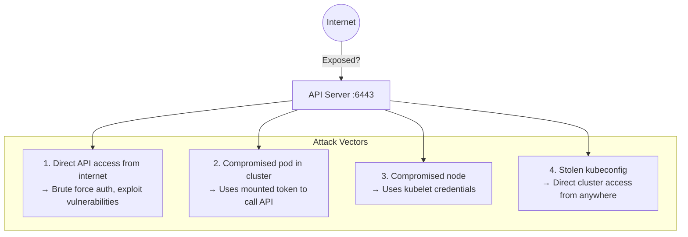
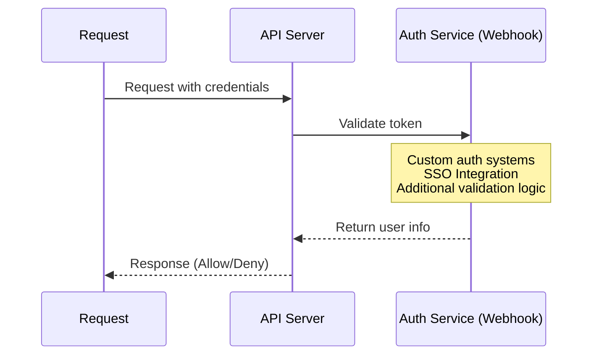
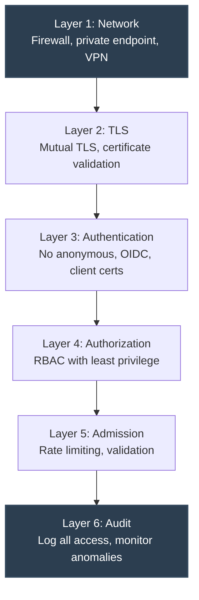

> **Complexity**: `[MEDIUM]` - Essential for cluster security
>
> **Time to Complete**: 35-40 minutes
>
> **Prerequisites**: Module 2.3 (API Server Security), networking basics

---

## What You'll Be Able to Do

After completing this module, you will be able to:

1. **Design** multi-layer API access controls combining network boundaries, identity verification, and strict RBAC authorization policies.
2. **Implement** authentication webhooks and OpenID Connect (OIDC) integrations for centralized, identity-aware API access control.
3. **Diagnose** misconfigured API server endpoints, anomalous authentication attempts, and unauthenticated network exposure vectors.
4. **Evaluate** flow control mechanisms, including API Priority and Fairness (APF) and admission controllers, to protect against denial-of-service conditions.
5. **Compare** cloud-native private endpoint architectures against bare-metal firewall implementations for API server isolation.

---

## Why This Module Matters

The Kubernetes API Server (`kube-apiserver`) is the central nervous system of your cluster. It is the only component that communicates directly with the etcd datastore, making it the ultimate source of truth and control. While Role-Based Access Control (RBAC) meticulously governs what authenticated users and service accounts can execute, restricting who can establish a network connection to the API in the first place is the most critical foundational layer of defense. 

Once an attacker discovers a reachable API server endpoint, the cluster's security relies entirely on the strength of its authentication and authorization mechanisms. However, relying solely on identity controls is insufficient; implementing rigorous network-level lockdown is the foundational defense required to protect the control plane. The vast majority of reported cluster compromises do not involve complex zero-day vulnerabilities. Instead, adversaries routinely scan the public internet to locate exposed administrative endpoints. The [2018 Tesla cloud incident](/k8s/cks/part1-cluster-setup/module-1.5-gui-security/) <!-- incident-xref: tesla-2018-cryptojacking --> exemplifies the severe consequences of operating without network boundaries, where an exposed administrative interface allowed attackers to freely extract credentials and hijack compute resources. Restricting API access strictly to trusted networks and authorized IP ranges neutralizes these automated scanning threats before they ever interact with the authentication layer.

Once the control plane is compromised, the attacker owns the cluster and gains a foothold into the underlying cloud environment. This module provides a comprehensive deep dive into network-level isolation, rigorous authentication verification, and robust rate-limiting strategies required to secure the API server against direct exposure, credential theft, and denial-of-service attacks in production environments running Kubernetes v1.35 and beyond.

---

## Section 1: The API Access Attack Surface

The Kubernetes API Server exposes a RESTful interface over HTTPS (typically on port 6443). Because it orchestrates every moving piece of the cluster infrastructure, leaving this endpoint accessible to untrusted networks invites continuous automated scanning and targeted attacks. 

Understanding the attack surface requires mapping out all potential ingress paths an adversary might take to reach the API server. This includes external vectors from the public internet, as well as internal vectors originating from compromised workloads or nodes.



When an attacker discovers an exposed API server, their methodology typically follows a predictable chain: initial discovery via mass-scanning tools (like Shodan or Masscan), followed by unauthenticated endpoint probing (e.g., checking `/version` or `/healthz`), and finally progressing to credential brute-forcing or exploiting known vulnerabilities in the API server's request parsing logic.

> **Stop and think**: Your API server is accessible at a public IP on port 6443. It requires client certificates for authentication. An attacker can't authenticate, but they can reach the endpoint. What attacks are still possible even without valid credentials?

Even without credentials, an attacker can launch asymmetric resource exhaustion attacks (Denial of Service) by opening thousands of TLS handshakes, forcing the API server to consume CPU cycles verifying nonexistent or invalid certificates. Furthermore, if a zero-day vulnerability exists in the unauthenticated request handling path of the API server, network exposure guarantees the cluster will be compromised.

---

## Section 2: Network-Level Boundaries (Layer 1)

The most effective way to secure a service is to make it unreachable to unauthorized parties. Network-level restrictions ensure that even if a valid credential is stolen, it cannot be utilized outside of a trusted perimeter.

### Firewall Rules (External)

In self-managed or bare-metal clusters, network isolation is typically enforced via host-based firewalls (like `iptables` or `firewalld`) and perimeter network appliances.

```bash
# Only allow API access from specific IPs
# On cloud: Security Groups, Firewall Rules, NSGs

# AWS Security Group example:
# Inbound rule: TCP 6443 from 10.0.0.0/8 (internal only)

# iptables on API server node
sudo iptables -A INPUT -p tcp --dport 6443 -s 10.0.0.0/8 -j ACCEPT
sudo iptables -A INPUT -p tcp --dport 6443 -s 192.168.1.0/24 -j ACCEPT  # Admin VPN
sudo iptables -A INPUT -p tcp --dport 6443 -j DROP
```

### Private API Endpoints in Cloud Environments

Managed Kubernetes services (EKS, GKE, AKS) provide native mechanisms to completely remove the API server from the public internet. By utilizing Private Endpoints, the API server is injected directly into your Virtual Private Cloud (VPC), making it accessible exclusively via internal routing, VPNs, or bastion hosts.

```bash
# EKS: Enable private endpoint, disable public
aws eks update-cluster-config \
  --name my-cluster \
  --resources-vpc-config endpointPrivateAccess=true,endpointPublicAccess=false

# GKE: Private cluster
gcloud container clusters create private-cluster \
  --enable-private-endpoint \
  --master-ipv4-cidr 172.16.0.0/28

# AKS: Private cluster
az aks create \
  --name myAKSCluster \
  --enable-private-cluster
```

### Internal Isolation: API Server NetworkPolicy

Network policies traditionally govern pod-to-pod communication, but they can also be weaponized defensively to prevent compromised workloads from reaching the API server from within the cluster. By default, Kubernetes injects the `kubernetes.default.svc` endpoint into every pod, mapping to a ClusterIP (e.g., `10.96.0.1`).

```yaml
# Note: NetworkPolicy doesn't directly apply to API server
# But you can restrict which pods can reach it

# Block pods from directly accessing API server IP
apiVersion: networking.k8s.io/v1
kind: NetworkPolicy
metadata:
  name: deny-api-direct
  namespace: production
spec:
  podSelector: {}
  policyTypes:
  - Egress
  egress:
  # Allow DNS
  - to:
    - namespaceSelector: {}
    ports:
    - port: 53
      protocol: UDP
  # Allow everything except API server
  - to:
    - ipBlock:
        cidr: 0.0.0.0/0
        except:
        - 10.96.0.1/32  # Kubernetes service IP
```

> **Pause and predict**: You create a NetworkPolicy that blocks pods in the `production` namespace from reaching the API server's ClusterIP (10.96.0.1). But pods can still use `kubectl` from inside the container. What did you miss? (Hint: how does `kubectl` resolve `kubernetes.default.svc`?)

### API Server Bind Address

By default, the API server often binds to `0.0.0.0`, listening on all available network interfaces. Restricting the bind address to a specific internal IP ensures that traffic arriving via external interfaces is ignored entirely by the service.

```yaml
# /etc/kubernetes/manifests/kube-apiserver.yaml
spec:
  containers:
  - command:
    - kube-apiserver
    # Bind only to specific interface
    - --bind-address=10.0.0.10  # Internal IP only
    # Or bind to all (less secure)
    - --bind-address=0.0.0.0
```

---

## Section 3: Authentication and Identity Controls (Layer 2 & 3)

Once a request traverses the network boundary and establishes a TLS connection, the API server must verify the identity of the requester. This phase is handled by authentication modules.

### Disable Anonymous Authentication

Anonymous requests are those that provide no credentials. In modern Kubernetes deployments (especially v1.35+), leaving this enabled is a critical security violation. If anonymous authentication is enabled, requests map to the `system:anonymous` user and the `system:unauthenticated` group, which might inadvertently inherit permissions via misconfigured ClusterRoleBindings.

```bash
# API server flag inside /etc/kubernetes/manifests/kube-apiserver.yaml
# - --anonymous-auth=false

# Verification
curl -k "https://api-server.local:6443/api/v1/namespaces"
# Should return 401 Unauthorized
```

### Client Certificate Requirements

Mutual TLS (mTLS) is the default authentication mechanism for internal cluster components (like the kubelet and controller-manager). The API server verifies that the client's certificate is cryptographically signed by the trusted Certificate Authority (CA).

```bash
# Require client certificates (mutual TLS) flag:
# - --client-ca-file=/etc/kubernetes/pki/ca.crt

# Clients must present valid certificate signed by CA
# This is default in kubeadm clusters
```

### Token Validation and OIDC Integration

Service Accounts rely on JSON Web Tokens (JWTs) cryptographically signed by the API server. For human users, integrating an external OpenID Connect (OIDC) Identity Provider (IdP) is the enterprise standard, allowing centralized revocation, MFA enforcement, and identity lifecycle management.

```bash
# Configure token authentication flags:
# - --service-account-key-file=/etc/kubernetes/pki/sa.pub
# - --service-account-issuer=https://kubernetes.default.svc.cluster.local

# Optional: External OIDC provider flags:
# - --oidc-issuer-url=https://accounts.example.com
# - --oidc-client-id=kubernetes
# - --oidc-username-claim=email
# - --oidc-groups-claim=groups
```

### Webhook Authentication

When standard x509 certificates or OIDC integrations are insufficient, Webhook Authentication allows the API server to delegate identity verification to a remote service. The API server sends a `TokenReview` object to the webhook, which independently validates the payload and returns the identity context.



The configuration requires mapping the API server flag to a dedicated kubeconfig-style configuration file that defines how to reach the webhook endpoint securely.

```yaml
# API server flags in manifest
# - --authentication-token-webhook-config-file=/etc/kubernetes/webhook-config.yaml
# - --authentication-token-webhook-cache-ttl=2m

---
# /etc/kubernetes/webhook-config.yaml
apiVersion: v1
kind: Config
clusters:
- name: auth-service
  cluster:
    certificate-authority: /etc/kubernetes/pki/webhook-ca.crt
    server: https://auth.example.com/authenticate
users:
- name: api-server
  user:
    client-certificate: /etc/kubernetes/pki/webhook-client.crt
    client-key: /etc/kubernetes/pki/webhook-client.key
contexts:
- context:
    cluster: auth-service
    user: api-server
  name: webhook
current-context: webhook
```

---

## Section 4: API Rate Limiting and Fairness (Layer 5)

Authentication alone cannot protect against volumetric attacks or poorly designed operators that accidentally spam the API server with redundant requests, exhausting etcd resources and inducing a denial-of-service state.

### EventRateLimit Admission Controller

The `EventRateLimit` admission controller is specifically designed to throttle `Event` objects, preventing runaway controllers or misbehaving pods from flooding the cluster datastore with state transitions.

```yaml
# Enable admission controller flags:
# - --enable-admission-plugins=EventRateLimit
# - --admission-control-config-file=/etc/kubernetes/admission-config.yaml

---
# /etc/kubernetes/admission-config.yaml
apiVersion: apiserver.config.k8s.io/v1
kind: AdmissionConfiguration
plugins:
- name: EventRateLimit
  path: /etc/kubernetes/event-rate-limit.yaml

---
# /etc/kubernetes/event-rate-limit.yaml
apiVersion: eventratelimit.admission.k8s.io/v1alpha1
kind: Configuration
limits:
- type: Namespace
  qps: 50
  burst: 100
- type: User
  qps: 10
  burst: 20
```

### API Priority and Fairness (APF)

Older max-in-flight limits in Kubernetes 1.20 were rudimentary and susceptible to starvation. Introduced in Kubernetes 1.20 and fully stable in modern releases (v1.35), API Priority and Fairness (APF) provides fairer queuing during overload conditions. It categorizes incoming requests into `FlowSchemas` and assigns them to `PriorityLevelConfigurations`, utilizing a "shuffle sharding" algorithm to ensure high-priority system traffic is never starved by low-priority batch processing or user queries.

```yaml
# Kubernetes 1.20+: API Priority and Fairness
# Controls API request queuing and priority

# Check current flow schemas
# kubectl get flowschemas

# Check priority levels
# kubectl get prioritylevelconfigurations

---
# Example: Lower priority for batch workloads
apiVersion: flowcontrol.apiserver.k8s.io/v1beta3
kind: FlowSchema
metadata:
  name: batch-jobs-low-priority
spec:
  priorityLevelConfiguration:
    name: low-priority
  matchingPrecedence: 1000
  rules:
  - subjects:
    - kind: ServiceAccount
      serviceAccount:
        name: batch-runner
        namespace: batch
    resourceRules:
    - apiGroups: ["batch"]
      resources: ["jobs"]
      verbs: ["*"]
```

---

## Section 5: Audit, Monitoring, and Defense in Depth (Layer 6)

Visibility is the final required layer. Without rigorous auditing, prolonged intrusion attempts remain invisible until the breach impacts business logic. Some organizations use API gateways in front of the Kubernetes API for additional security, logging, and rate limiting before the traffic even reaches the internal network.

### API Access Logging

Audit policies dictate what the API server records. Capturing `RequestResponse` for the authentication group provides rich forensic data, but filtering out the `RequestReceived` stage prevents the logs from doubling in size unnecessarily.

```yaml
# Audit policy to log all API access attempts
apiVersion: audit.k8s.io/v1
kind: Policy
rules:
# Log all authentication attempts
- level: RequestResponse
  omitStages:
  - RequestReceived
  resources:
  - group: "authentication.k8s.io"

# Log failed requests
- level: Metadata
  omitStages:
  - RequestReceived
```

### Monitoring API Metrics

The API server natively exposes Prometheus-compatible metrics. Administrators should set rigorous alerting thresholds on authentication failure spikes and flow control rejections.

```bash
# Check API server metrics
kubectl get --raw /metrics | grep apiserver_request

# Authentication failures
kubectl get --raw /metrics | grep authentication_attempts

# Rate limiting metrics
kubectl get --raw /metrics | grep apiserver_flowcontrol
```

---

## Real Exam Scenarios

The CKS exam frequently tests your ability to apply these concepts in constrained, break-fix scenarios.

### Scenario 1: Restrict API to Internal Network

```bash
# Check current API server bind address
kubectl get pods -n kube-system -l component=kube-apiserver -o yaml | grep bind-address

# Edit to bind to internal interface only
sudo vi /etc/kubernetes/manifests/kube-apiserver.yaml

# Change:
# --bind-address=0.0.0.0
# To:
# --bind-address=10.0.0.10  # Internal IP

# API server will restart automatically
```

### Scenario 2: Verify Anonymous Access Disabled

```bash
# Test anonymous access
curl -k "https://api-server.local:6443/api/v1/namespaces"

# If anonymous is disabled, should get:
# {"kind":"Status","apiVersion":"v1","status":"Failure","message":"Unauthorized",...}

# If anonymous is enabled, may get namespace list or partial data
# Fix by adding --anonymous-auth=false to API server
```

### Scenario 3: Configure API Access for Specific Users

```bash
# Create kubeconfig for specific user with limited network access
kubectl config set-cluster restricted \
  --server=https://internal-api.example.com:6443 \
  --certificate-authority=/path/to/ca.crt

kubectl config set-credentials limited-user \
  --client-certificate=/path/to/user.crt \
  --client-key=/path/to/user.key

kubectl config set-context limited \
  --cluster=restricted \
  --user=limited-user
```

> **What would happen if**: A developer's laptop with a valid kubeconfig file is stolen. The kubeconfig has cluster-admin credentials and the API server is publicly accessible. What's the blast radius, and what controls would have limited the damage?

## Defense in Depth for API

The cornerstone of modern infrastructure security is assuming that individual controls will eventually fail. A layered approach ensures that a breach in one domain does not result in total system compromise.


*All layers must be active simultaneously to provide robust defense.*

---

## Did You Know?

- **The Kubernetes API server by default binds to 0.0.0.0**, making it inherently accessible from all network interfaces on the host node unless explicitly restricted.
- **Cloud providers offer managed private clusters** where the API server control plane operates without any public IP address mapping, requiring VPC peering or Bastion hosts for administrative access.
- **API Priority and Fairness** (APF) replaced older max-in-flight limits natively in Kubernetes 1.20, utilizing shuffle sharding to provide fairer queuing during overload.
- **Some organizations use API gateways** in front of the Kubernetes API to proxy requests, applying enterprise-grade WAF rules, additional security heuristics, and centralized logging before traffic hits the cluster.

---

## Common Mistakes

| Mistake | Why It Hurts | Solution |
|---------|--------------|----------|
| Public API endpoint | Anyone globally can attempt authentication | Implement Private endpoints + VPN |
| No firewall rules | Direct network-level exposure to all IPs | Restrict ingress to known administrative CIDRs |
| Anonymous auth enabled | Allows unauthenticated access to specific routes | Enforce `--anonymous-auth=false` |
| No rate limiting | Leaves cluster vulnerable to DoS attacks | Implement `EventRateLimit` admission |
| Not monitoring access | Cannot detect persistent brute force attacks | Enable comprehensive audit logging |
| Long-lived client certs | Cannot be easily revoked if compromised | Use OIDC with short-lived tokens |
| Ignoring 401/403 logs | Blind to ongoing reconnaissance attempts | Route audit logs to a SIEM and set alerts |
| Flat NetworkPolicies | Compromised pods can easily reach the API | Deny egress to `kubernetes.default.svc` IP |

---

## Quiz

1. **Your SOC team detects thousands of failed authentication attempts against the API server from an external IP address. The API server is exposed publicly with `--bind-address=0.0.0.0`. No brute-force succeeded yet. What immediate and long-term actions do you take?**
   <details>
   <summary>Answer</summary>
   Immediate: Block the attacking IP with firewall rules (`iptables -A INPUT -s <attacker-ip> -p tcp --dport 6443 -j DROP`). Verify no successful authentications from that IP in audit logs. Long-term: Change `--bind-address` to an internal IP or use a cloud provider private endpoint to remove public API access entirely. Require VPN for external access. Enable the EventRateLimit admission controller to throttle requests. Configure API Priority and Fairness to deprioritize unauthenticated traffic. Enable audit logging if not already configured to detect future attempts. Even though no brute-force succeeded, the public endpoint is an unnecessary attack surface.
   </details>

2. **A developer's laptop is stolen at a conference. Their kubeconfig contains a client certificate for the production cluster, which has a public API endpoint. The certificate doesn't expire for 364 more days. What's the blast radius and how do you revoke access?**
   <details>
   <summary>Answer</summary>
   Blast radius depends on the RBAC permissions bound to the certificate's CN/O fields -- if it's cluster-admin, full cluster compromise is possible. Kubernetes has no built-in certificate revocation. Options: (1) Rotate the cluster CA certificate (drastic -- breaks all existing certificates). (2) Add the stolen certificate's CN to a deny list using a webhook authorizer. (3) If using OIDC, disable the user's account immediately. (4) Restrict the API server to private endpoint/VPN so the stolen cert is useless without network access. This incident highlights why short-lived credentials (OIDC tokens, bound SA tokens) are preferred over long-lived certificates, and why private API endpoints are critical.
   </details>

3. **Your cluster's API server uses `--authorization-mode=AlwaysAllow` because "RBAC was too complicated" for the dev team. A security audit flags this. The team argues that authentication is strong (client certs) so authorization doesn't matter. Explain why they're wrong with a concrete attack scenario.**
   <details>
   <summary>Answer</summary>
   With `AlwaysAllow`, any authenticated user can do anything: read all secrets (database passwords, TLS keys, API tokens), create privileged pods that escape to the host, delete production workloads, modify RBAC to grant others access, and access the cloud metadata service. Concrete scenario: a developer with a valid client cert could `kubectl get secrets -A` to read every secret in every namespace, including admin credentials they shouldn't have. With RBAC (`--authorization-mode=Node,RBAC`), each user gets only the permissions they need. The Node authorizer additionally restricts kubelets to their own node's resources. Authentication proves identity; authorization enforces what that identity can do. Both are essential.
   </details>

4. **You notice a compromised pod is making API calls despite having `automountServiceAccountToken: false`. Investigation shows the pod is using a token from a different source. Where could the token have come from, and how do you prevent this?**
   <details>
   <summary>Answer</summary>
   Possible token sources: (1) A token was injected via environment variable from a Secret or ConfigMap. (2) The attacker obtained a token from another pod via network access. (3) A legacy ServiceAccount token Secret exists and is mounted as a volume. (4) The application was configured with credentials in code or a mounted kubeconfig. Prevention: use NetworkPolicy to block pods from reaching the API server IP, audit all Secrets for tokens and kubeconfigs, remove legacy SA token Secrets, scan environment variables for credentials, and combine `automountServiceAccountToken: false` with RBAC restrictions on the ServiceAccount. Defense in depth means restricting at both the token-mounting level and the network level.
   </details>

5. **A junior engineer accidentally misconfigures a heavily utilized CI/CD pipeline, causing it to rapidly request thousands of pod definitions per second. The entire cluster control plane becomes unresponsive. Which specific API server feature was absent or misconfigured?**
   <details>
   <summary>Answer</summary>
   API Priority and Fairness (APF) was likely missing or misconfigured, combined with an absence of general rate limiting. APF uses FlowSchemas and PriorityLevelConfigurations to assign concurrency limits to specific users or service accounts. If configured correctly, the service account used by the CI/CD pipeline would have been constrained to its own PriorityLevel, ensuring its request queuing did not starve critical system components (like the kubelet or controller-manager) of API server resources.
   </details>

6. **You deploy a robust Webhook Authentication service, but soon the API server starts timing out on all requests, and workloads fail to authenticate. Metrics indicate the webhook service itself is healthy but under severe load. What configuration flag could alleviate this?**
   <details>
   <summary>Answer</summary>
   The `--authentication-token-webhook-cache-ttl` flag controls how long the API server caches successful token validation responses. If this is set too low (or zero), the API server makes a synchronous network call to the webhook for every single API request, overwhelming the auth service and introducing severe latency. Setting an appropriate TTL (e.g., `2m`) allows the API server to serve subsequent requests from memory while still maintaining relatively rapid revocation capabilities.
   </details>

7. **During an audit, you find that the API server is reachable via a public IP, but the cloud provider's firewall rule explicitly blocks port 6443 from all external sources. Is this architecture secure against network-level API exposure?**
   <details>
   <summary>Answer</summary>
   While safer than being fully open, relying solely on perimeter firewall rules is a fragile configuration. If a misconfiguration occurs in the cloud provider's security group logic or an infrastructure-as-code change accidentally removes the rule, the API is instantly exposed to the world. A truly secure architecture employs Private Endpoints, completely removing the public IP address mapping and ensuring routing is physically constrained to the internal VPC, eliminating the risk of accidental public exposure through firewall drift.
   </details>

8. **You are reviewing the API server's audit logs and notice massive amounts of logs generated for the `RequestReceived` stage. Your SIEM ingestion costs have skyrocketed. How do you resolve this without compromising forensic visibility for authentication failures?**
   <details>
   <summary>Answer</summary>
   You should modify the Audit Policy to utilize the `omitStages` directive. By omitting the `RequestReceived` stage, the API server will only log the `ResponseComplete` (or `ResponseStarted`) stages. This halves the log volume because it stops generating an initial log entry before the request is even processed, while still capturing the final status code, user identity, and response details critical for investigating 401 Unauthorized or 403 Forbidden events.
   </details>

---

## Hands-On Exercise

**Task**: Audit and verify API access restrictions on a running cluster. This requires progressing through identity, network, and metric validation.

```bash
# Step 1: Check API server configuration for critical security flags
echo "=== API Server Config ==="
kubectl get pods -n kube-system -l component=kube-apiserver -o yaml | grep -E "bind-address|anonymous-auth|authorization-mode"

# Step 2: Test anonymous access (from within cluster) to verify internal isolation
echo "=== Anonymous Access Test ==="
kubectl run curlpod --image=curlimages/curl --rm -it --restart=Never -- \
  curl -sk "https://kubernetes.default.svc.cluster.local/api/v1/namespaces" 2>&1 | head -5

# Step 3: Check if API is accessible externally (Network Boundary Check)
echo "=== External Access Check ==="
API_IP=$(kubectl get svc kubernetes -o jsonpath='{.spec.clusterIP}')
echo "API Server internal IP: $API_IP"
# In production, also resolve the external DNS/IP and attempt an external nmap or curl

# Step 4: Review authentication methods for multiple identity providers
echo "=== Authentication Config ==="
kubectl get pods -n kube-system -l component=kube-apiserver -o yaml | grep -E "client-ca|oidc|token|webhook"

# Step 5: Check for legacy and custom rate limiting admission controllers
echo "=== Rate Limiting ==="
kubectl get pods -n kube-system -l component=kube-apiserver -o yaml | grep -E "EventRateLimit|admission-control"

# Step 6: Review flow schemas (API Priority and Fairness)
echo "=== Flow Schemas ==="
kubectl get flowschemas --no-headers | head -5

# Success criteria:
# - Identified bind-address and verified it is properly scoped
# - Anonymous access is actively denied (HTTP 401)
# - Multiple robust auth methods (OIDC/x509) configured
# - Rate limiting or APF FlowSchemas are actively routing traffic
```

**Success criteria**: Successfully identify current API access restrictions, extract the active authentication models, and empirically verify that anonymous enumeration is impossible.

---

## Summary

**Network Restrictions**:
- Native cloud Private API endpoints (VPC integration)
- Granular network boundaries and host-level firewalls
- Internal isolation via Egress NetworkPolicies blocking `kubernetes.default.svc`

**Authentication Restrictions**:
- Hard disabling of `anonymous-auth`
- Enforcing x509 client certificates (mTLS)
- Centralized identity verification through OIDC and Webhooks

**Rate Limiting**:
- Hard boundaries using the `EventRateLimit` admission controller
- Intelligent traffic queuing utilizing API Priority and Fairness (APF)

**Defense in Depth**:
- Architecting redundant layers of restrictions
- Continuous extraction and alerting on Audit metrics
- Assuming breach mentalities for internal workloads

**Exam Tips**:
- Know exactly where to find and modify the `kube-apiserver.yaml` manifest.
- Understand the profound implications of `anonymous-auth` and how to test for it using `curl` from a busybox pod.
- Practice diagnosing why an API server failed to start after modifying authentication flags (check `/var/log/pods/kube-system_kube-apiserver...`).

---

## Part 2 Complete!

You've finished **Cluster Hardening** (15% of CKS). You now understand:
- RBAC deep dive and escalation prevention
- ServiceAccount security and token management
- API server security configuration
- Kubernetes upgrade security
- Restricting API access

**Next Part**: [Part 3: System Hardening](/k8s/cks/part3-system-hardening/module-3.1-apparmor/) - Prepare to drop down into the operating system level, exploring AppArmor, seccomp profiles, and Linux kernel security primitives.