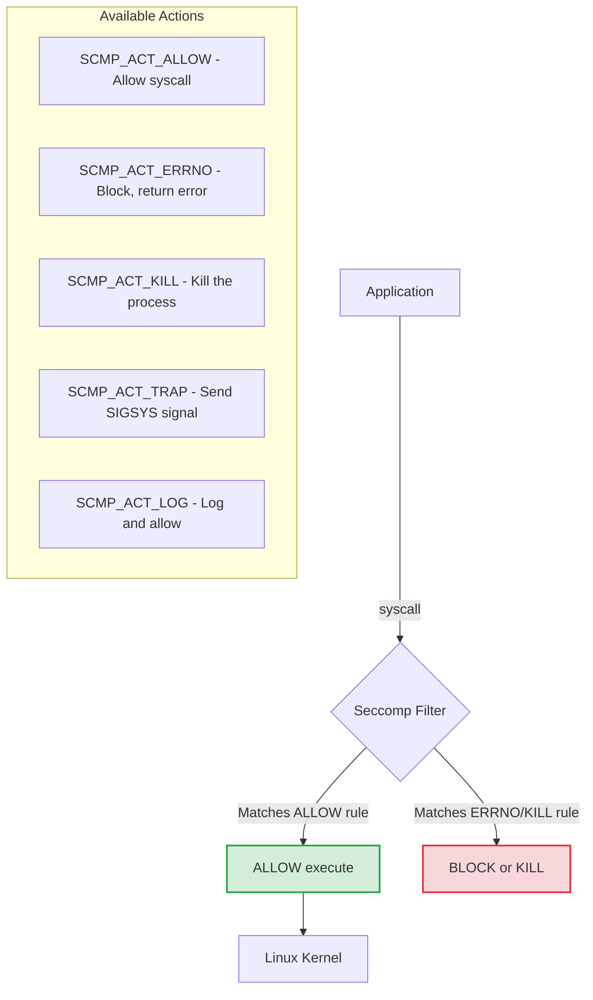
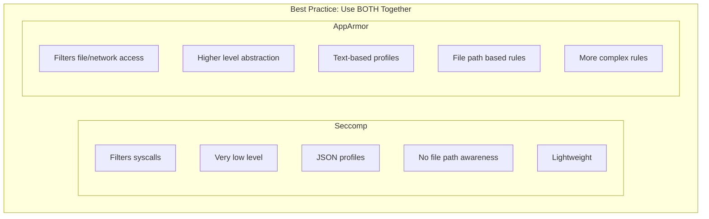
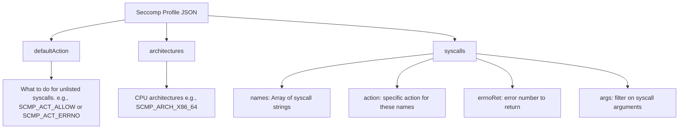

## Why This Module Matters

A container that successfully escapes its runtime sandbox typically does so by invoking a system call the host kernel was never expected to honor in that constrained context. Attackers rely on powerful, low-level system calls — such as `unshare`, `keyctl`, `mount`, or `bpf` — to manipulate kernel structures, bypass isolation boundaries, and gain root access to the underlying worker node. While the modern Linux kernel exposes approximately 330 system calls, a standard containerized application rarely requires more than 60 to function normally. Every additional, unnecessary system call in the allowed execution set represents a highly dangerous attack surface. Secure Computing Mode (seccomp) provides the mechanism to strictly filter these interactions, blocking malicious or anomalous system calls at the kernel level and dramatically reducing the viable pathways for a successful container escape.

Seccomp (Secure Computing Mode) acts as an unbribable bouncer at the door of the Linux kernel. It provides a robust, defense-in-depth mechanism that strictly limits which system calls a containerized application can make. By dropping the available system calls from over 300 to just the 40 or 50 required for normal operation, organizations can effectively neutralize entire classes of zero-day vulnerabilities and post-exploitation techniques. Even if an attacker successfully exploits a remote code execution (RCE) vulnerability, their subsequent attempts to spawn a shell or manipulate kernel structures will be immediately terminated by the kernel, preventing a localized compromise from becoming a headline-making breach.

For platform engineers and security professionals, mastering Seccomp is not just about passing the Certified Kubernetes Security Specialist (CKS) exam; it is a critical skill for building resilient infrastructure. In modern Kubernetes environments (such as v1.34 and v1.35), leveraging Seccomp profiles ensures that workloads operate with the absolute minimum privileges required, drastically reducing the attack surface and protecting the organization's most valuable assets from both external threats and internal misconfigurations.

## What You'll Be Able to Do

After completing this module, you will be able to:

1. **Design** custom Seccomp profiles that strictly allow only the required system calls for a specific containerized workload.
2. **Implement** Pods and containers configured to use both standard and custom Seccomp profiles via the `securityContext` field in Kubernetes.
3. **Diagnose** and troubleshoot application failures caused by Seccomp enforcement using audit logs and system tracing tools.
4. **Evaluate** the security posture of running containers to identify missing or overly permissive Seccomp configurations.
5. **Compare** the operational overhead and security benefits of `RuntimeDefault` versus custom Seccomp profiles in large-scale environments.

## What is Seccomp?

Seccomp stands for Secure Computing Mode. It is a Linux kernel feature that has been available since version 2.6.12. In a containerized environment, all containers on a node share the same host kernel. Without Seccomp, a container process can theoretically make any system call to the kernel, provided it has the necessary capabilities or runs as root. This shared kernel architecture is the primary reason why container isolation is inherently weaker than virtual machine isolation.

When Seccomp is enabled, it filters system calls at the kernel level. Before the kernel executes a requested system call from a user-space process, it evaluates the call against a predefined set of rules (the Seccomp profile). Because this evaluation happens deep within the kernel using highly optimized Berkeley Packet Filter (BPF) rules, the performance overhead is extremely low—making it ideal for high-performance microservices.

Here is the architectural flow of how Seccomp processes system calls:



Seccomp supports different actions when a system call matches a rule. The most common actions are `SCMP_ACT_ALLOW` (let the call pass), `SCMP_ACT_ERRNO` (block the call and return a specific error number to the application, like "Operation not permitted"), and `SCMP_ACT_LOG` (allow the call but record it in the audit logs, which is invaluable for debugging). The `SCMP_ACT_KILL` action is more aggressive and immediately terminates the offending process.

> **Stop and think**: A container application only needs about 40-50 system calls out of 300+ available in the Linux kernel. The rest are potential attack surface. If you set `defaultAction: SCMP_ACT_ERRNO` (deny all by default) and only allow the 50 syscalls your app needs, what percentage of the kernel's syscall attack surface have you eliminated?

## Seccomp vs AppArmor

While both Seccomp and AppArmor provide security for Linux containers, they operate at completely different conceptual levels. It is a common misconception that you only need one or the other. In reality, they are complementary technologies that form a robust defense-in-depth strategy.

Seccomp is exceptionally low-level. It knows absolutely nothing about files, directories, users, or network sockets. It only knows about system calls and their numerical arguments. For example, Seccomp can block the `mount` system call entirely, but it cannot express "allow mounting in `/mnt/data` but block mounting in `/etc`."

AppArmor, on the other hand, is a Mandatory Access Control (MAC) system that understands high-level abstractions like file paths, network interfaces, and Linux capabilities. AppArmor can easily enforce rules like "allow read access to `/etc/nginx/nginx.conf` but deny access to `/etc/shadow`."

Here is a structural comparison of the two technologies:



By combining both, you achieve defense in depth: Seccomp blocks fundamentally dangerous system calls, while AppArmor controls access to specific resources for the system calls that are allowed.

## Default Seccomp Profile

> **War Story: Stopping Dirty COW and Container Escapes**
> In 2016, the "Dirty COW" vulnerability (CVE-2016-5195) allowed privilege escalation via the `ptrace` system call. Attackers who compromised a container could use `ptrace` to manipulate host processes and break out. Simply having a Seccomp profile that blocked `ptrace` stopped this container escape dead in its tracks, long before patches were applied.

Historically, container runtimes ran workloads without Seccomp filtering by default, relying on users to explicitly configure profiles. As security practices evolved, it became clear that running "unconfined" was too risky. 

While older documentation might claim that the `RuntimeDefault` profile became default in Kubernetes 1.22 with Pod Security Admission, you should be aware that in modern Kubernetes environments (v1.30 to v1.35+), the `RuntimeDefault` profile is the enforced baseline for restricted namespaces. The exact implementation behavior varies depending on whether Pod Security Admission is configured to strictly enforce the restricted profile.

You can check if the default Seccomp profile is applied to a Pod using the following commands:

```bash
# Check if default seccomp is applied
kubectl get pod mypod -o jsonpath='{.spec.securityContext.seccompProfile}'

# The RuntimeDefault profile typically blocks:
# - keyctl (kernel keyring)
# - ptrace (process tracing)
# - personality (change execution domain)
# - unshare (namespace manipulation)
# - mount/umount (filesystem mounting)
# - clock_settime (change system time)
# And about 40+ other dangerous syscalls
```

### Operational Overhead: Custom vs. RuntimeDefault

Writing custom Seccomp profiles for every application offers the absolute lowest attack surface, but it comes with immense operational overhead. Every time an application updates a library, changes its framework, or alters its behavior, it might need a new system call (like switching from `select` to `epoll_wait`). If the custom profile does not explicitly allow the new system call, the application will instantly crash in production with an "Operation not permitted" error.

For 95% of workloads, the `RuntimeDefault` profile strikes the perfect balance. Provided by the container runtime (like containerd or CRI-O), this profile automatically blocks the ~40 most dangerous system calls (such as `ptrace`, `mount`, and `kexec_load`, which are frequently used for container escapes) while allowing the standard ~260 syscalls that normal applications require. Organizations should typically reserve custom profiles for highly sensitive, static workloads where the exact system call footprint is known, deeply understood, and rigorously tested in CI/CD pipelines.

## Managing Profiles at Scale

In a large Kubernetes cluster, managing custom Seccomp profiles manually across hundreds of worker nodes is an operational nightmare. If a developer schedules a Pod that references a custom profile, and that profile file does not exist on the underlying node, the Pod will fail to start with a `CreateContainerError`. 

To solve this in modern clusters (v1.35+), platform engineers use automated distribution mechanisms. The most common approaches include:

1. **DaemonSets**: A simple DaemonSet that mounts the host's `/var/lib/kubelet/seccomp/` directory and copies the JSON profile files into place on every node.
2. **Security Profiles Operator (SPO)**: A Kubernetes-native operator that allows you to define Seccomp profiles as Custom Resource Definitions (CRDs). The operator automatically synchronizes the profiles down to the disk of every worker node, ensuring consistent enforcement.

## Seccomp Profile Location and Structure

When you configure a Pod to use a custom Seccomp profile (using the `Localhost` type), the Kubernetes kubelet needs to know where to find the profile on the node's filesystem.

```bash
# Kubernetes looks for profiles in:
/var/lib/kubelet/seccomp/

# Profile path in pod spec is relative to this directory
# Example: profiles/my-profile.json
# Full path: /var/lib/kubelet/seccomp/profiles/my-profile.json

# Create directory if it doesn't exist
sudo mkdir -p /var/lib/kubelet/seccomp/profiles
```

A Seccomp profile is defined as a JSON document. It specifies a default action (what to do if a system call is not explicitly listed), the target architectures, and an array of specific rules.

```json
{
  "defaultAction": "SCMP_ACT_ERRNO",
  "architectures": [
    "SCMP_ARCH_X86_64",
    "SCMP_ARCH_X86",
    "SCMP_ARCH_AARCH64"
  ],
  "syscalls": [
    {
      "names": [
        "accept",
        "access",
        "arch_prctl",
        "bind",
        "brk"
      ],
      "action": "SCMP_ACT_ALLOW"
    },
    {
      "names": [
        "ptrace"
      ],
      "action": "SCMP_ACT_ERRNO",
      "errnoRet": 1
    }
  ]
}
```

Understanding the fields in the JSON profile is crucial for debugging and exam scenarios:



## Applying Seccomp in Kubernetes

In modern Kubernetes versions (v1.35+), the `seccompProfile` field is standard under the `securityContext` block.

### Method 1: Pod Security Context (Recommended)

This is the standard approach for applying the runtime's default profile to all containers within a Pod.

```yaml
apiVersion: v1
kind: Pod
metadata:
  name: seccomp-pod
spec:
  securityContext:
    seccompProfile:
      type: RuntimeDefault  # Use runtime's default profile
  containers:
  - name: app
    image: nginx
```

### Method 2: Localhost Profile

When you have a custom profile deployed to the worker nodes, you reference it using the `Localhost` type. Notice that the `localhostProfile` path is relative to `/var/lib/kubelet/seccomp/`.

```yaml
apiVersion: v1
kind: Pod
metadata:
  name: custom-seccomp-pod
spec:
  securityContext:
    seccompProfile:
      type: Localhost
      localhostProfile: profiles/custom.json  # Relative to /var/lib/kubelet/seccomp/
  containers:
  - name: app
    image: nginx
```

### Method 3: Container-Level Profile

You can apply different Seccomp profiles to different containers within the same Pod. If a profile is specified at both the Pod level and the Container level, the Container-level profile takes precedence for that specific container.

```yaml
apiVersion: v1
kind: Pod
metadata:
  name: multi-container-pod
spec:
  containers:
  - name: app
    image: nginx
    securityContext:
      seccompProfile:
        type: RuntimeDefault
  - name: sidecar
    image: busybox
    securityContext:
      seccompProfile:
        type: Localhost
        localhostProfile: profiles/sidecar.json
```

## Seccomp Profile Types

There are three main types of Seccomp profiles you can specify in Kubernetes:

```yaml
# RuntimeDefault - Container runtime's default profile
seccompProfile:
  type: RuntimeDefault

# Localhost - Custom profile from node filesystem
seccompProfile:
  type: Localhost
  localhostProfile: profiles/my-profile.json

# Unconfined - No seccomp filtering (dangerous!)
seccompProfile:
  type: Unconfined
```

> **What would happen if**: You create a custom seccomp profile and place it in `/etc/seccomp/profiles/custom.json` on the node. Your pod spec references `localhostProfile: profiles/custom.json`. The pod fails to start. The profile JSON is valid. What path mistake did you make?

## Creating Custom Profiles

Understanding how to structure custom profiles is essential for strict security environments. Here are a few common patterns.

### Profile That Blocks ptrace

If your environment defaults to allowing most syscalls, you might want to create a denylist profile that specifically blocks known dangerous system calls like `ptrace`.

```json
// /var/lib/kubelet/seccomp/profiles/deny-ptrace.json
{
  "defaultAction": "SCMP_ACT_ALLOW",
  "syscalls": [
    {
      "names": ["ptrace"],
      "action": "SCMP_ACT_ERRNO",
      "errnoRet": 1
    }
  ]
}
```

### Profile That Only Allows Specific Syscalls

This is a strict allowlist approach. The `defaultAction` is `SCMP_ACT_ERRNO`, meaning anything not explicitly listed in the `syscalls` array will be blocked. This is highly secure but brittle.

```json
// /var/lib/kubelet/seccomp/profiles/minimal.json
{
  "defaultAction": "SCMP_ACT_ERRNO",
  "architectures": ["SCMP_ARCH_X86_64"],
  "syscalls": [
    {
      "names": [
        "read", "write", "open", "close",
        "fstat", "lseek", "mmap", "mprotect",
        "munmap", "brk", "exit_group"
      ],
      "action": "SCMP_ACT_ALLOW"
    }
  ]
}
```

### Profile That Logs Suspicious Calls

This is an excellent pattern for debugging and auditing. Instead of blocking the calls and potentially crashing the application, this profile allows them but triggers an audit log entry. This lets security teams observe behavior before enforcing a block.

```json
// /var/lib/kubelet/seccomp/profiles/audit.json
{
  "defaultAction": "SCMP_ACT_ALLOW",
  "syscalls": [
    {
      "names": ["ptrace", "process_vm_readv", "process_vm_writev"],
      "action": "SCMP_ACT_LOG"
    },
    {
      "names": ["mount", "umount2", "pivot_root"],
      "action": "SCMP_ACT_ERRNO"
    }
  ]
}
```

## Real Exam Scenarios

### Scenario 1: Apply RuntimeDefault

You may be asked to secure a running workload by applying the default Seccomp profile without changing its other configurations.

```yaml
# Create pod with RuntimeDefault seccomp
cat <<EOF | kubectl apply -f -
apiVersion: v1
kind: Pod
metadata:
  name: secure-pod
spec:
  securityContext:
    seccompProfile:
      type: RuntimeDefault
  containers:
  - name: app
    image: nginx
EOF

# Verify
kubectl get pod secure-pod -o jsonpath='{.spec.securityContext.seccompProfile}' | jq .
```

### Scenario 2: Apply Custom Profile

In advanced scenarios, you might need to create a profile on the worker node and ensure the Pod successfully mounts and utilizes it. Note that in a real cluster, you would likely use a DaemonSet rather than SSHing into nodes to create files manually.

```bash
# Create profile on node
sudo mkdir -p /var/lib/kubelet/seccomp/profiles
sudo tee /var/lib/kubelet/seccomp/profiles/block-chmod.json << 'EOF'
{
  "defaultAction": "SCMP_ACT_ALLOW",
  "syscalls": [
    {
      "names": ["chmod", "fchmod", "fchmodat"],
      "action": "SCMP_ACT_ERRNO",
      "errnoRet": 1
    }
  ]
}
EOF

# Apply to pod
cat <<EOF | kubectl apply -f -
apiVersion: v1
kind: Pod
metadata:
  name: no-chmod-pod
spec:
  securityContext:
    seccompProfile:
      type: Localhost
      localhostProfile: profiles/block-chmod.json
  containers:
  - name: app
    image: busybox
    command: ["sleep", "3600"]
EOF

# Test chmod is blocked
kubectl exec no-chmod-pod -- chmod 777 /tmp
# Should fail with "Operation not permitted"
```

### Scenario 3: Debug Seccomp Issues

When a Pod crashes immediately or exhibits strange behavior (like failing to bind to a port), you must be able to verify if Seccomp is the culprit.

```bash
# Check if seccomp is applied
kubectl get pod mypod -o yaml | grep -A5 seccompProfile

# Check node audit logs for seccomp denials
sudo dmesg | grep -i seccomp
sudo journalctl | grep -i seccomp

# Common error messages
# "seccomp: syscall X denied"
# "operation not permitted"
```

> **Pause and predict**: You apply a seccomp profile with `defaultAction: SCMP_ACT_KILL` instead of `SCMP_ACT_ERRNO`. Your application makes an unlisted syscall. What happens to the container process compared to using `SCMP_ACT_ERRNO`?

## Finding Syscalls Used by Application

To build an allowlist profile, you need to know exactly which system calls an application makes. The most direct way to do this is using tracing tools on a test system (never trace directly in production as it significantly impacts performance).

```bash
# Use strace to find syscalls (on a test system, not production)
strace -c -f <command>

# Example output:
# % time     seconds  usecs/call     calls    errors syscall
# ------ ----------- ----------- --------- --------- ----------------
#  25.00    0.000010           0        50           read
#  25.00    0.000010           0        30           write
#  12.50    0.000005           0        20           open
# ...

# Or use sysdig
sysdig -p "%proc.name %syscall.type" container.name=mycontainer
```

## Did You Know?

- **Docker's default seccomp profile** blocks about 44 syscalls out of 300+. It is a good baseline but may need customization depending on strict regulatory requirements.
- **Seccomp-bpf (Berkeley Packet Filter)** is the modern implementation introduced in Linux 3.5 (2012). It allows complex filtering logic based on syscall arguments, entirely replacing the older, rigid "strict mode" from 2005.
- **Breaking a seccomp profile** is extremely difficult. Unlike AppArmor, which operates at the file path level and can sometimes be tricked with hardlinks or symlinks, Seccomp operates at the absolute lowest level—the raw syscall integer.
- **Historically speaking**, the push to enforce `RuntimeDefault` system-wide accelerated with the introduction of Pod Security Admission (PSA). Ensure your modern v1.35+ clusters are configured with the `restricted` PSA profile to automatically enforce this baseline.

## Common Mistakes

| Mistake | Why It Hurts | Solution |
|---------|--------------|----------|
| Profile path wrong | Pod fails to start, throwing `CreateContainerError`. | Verify files are located precisely in `/var/lib/kubelet/seccomp/`. |
| Missing a necessary syscall | The application crashes instantly or behaves erratically. | Audit the application using `strace` or `SCMP_ACT_LOG` first. |
| Setting `type: Unconfined` | Leaves the workload with zero kernel protection. | Switch the `type` to at least `RuntimeDefault`. |
| Profile missing on some worker nodes | Pod scheduling fails on nodes lacking the file. | Deploy custom profiles uniformly using a DaemonSet. |
| Malformed JSON syntax | The kubelet cannot parse the profile and fails the Pod. | Always validate JSON syntax before deploying. |
| Mixed up absolute paths | Using `localhostProfile: /var/lib/...` instead of relative. | Provide paths strictly relative to the kubelet's seccomp directory. |

## Quiz

1. **An application container keeps crashing with "operation not permitted" errors. The pod has a custom seccomp profile applied. The same container runs fine without the profile. How do you identify which syscalls the profile is blocking, and what's the safest debugging approach?**
   <details>
   <summary>Answer</summary>
   Use `SCMP_ACT_LOG` as the default action temporarily -- this allows all syscalls but logs the ones that would have been blocked. Check kernel logs with `dmesg | grep seccomp` or `journalctl | grep seccomp` to see which syscalls are being denied. Alternatively, use `strace -c -f <command>` on a test system to enumerate all syscalls the application uses. Once you know the needed syscalls, add them to the allow list. Never debug in production by switching to `Unconfined` -- use `SCMP_ACT_LOG` to maintain visibility while temporarily allowing traffic. The safest approach is to run `strace` in a staging environment and build the profile from that data.
   </details>

2. **During a CKS exam, you create a seccomp profile at `/var/lib/kubelet/seccomp/profiles/block-mount.json` and reference it as `localhostProfile: block-mount.json` in the pod spec. The pod enters `CreateContainerError`. What's wrong with the path?**
   <details>
   <summary>Answer</summary>
   The `localhostProfile` path is relative to `/var/lib/kubelet/seccomp/`, so the full path Kubernetes looks for is `/var/lib/kubelet/seccomp/block-mount.json` -- but your file is at `/var/lib/kubelet/seccomp/profiles/block-mount.json`. The correct reference is `localhostProfile: profiles/block-mount.json` (include the `profiles/` subdirectory). This is a common exam gotcha because the path is relative, not absolute. Always verify the file exists at the expected full path: `ls /var/lib/kubelet/seccomp/<localhostProfile-value>`.
   </details>

3. **Your security team wants to block the `ptrace` syscall cluster-wide because it enables container escape techniques. You have 50 namespaces with different workloads. What's the most efficient way to enforce this without creating 50 individual seccomp profiles?**
   <details>
   <summary>Answer</summary>
   Use the `RuntimeDefault` seccomp profile which already blocks `ptrace` (along with ~44 other dangerous syscalls). Apply it cluster-wide by configuring Pod Security Admission with the `restricted` profile in `enforce` mode on all workload namespaces -- this requires `RuntimeDefault` or `Localhost` seccomp. Alternatively, create a single custom profile that uses `defaultAction: SCMP_ACT_ALLOW` with only `ptrace` blocked, and deploy it to all nodes via a DaemonSet. Then reference it at the pod level. The `RuntimeDefault` approach is simpler and blocks more than just ptrace, providing broader security.
   </details>

4. **You have a multi-container pod with an nginx reverse proxy and a Python application. The nginx container needs `accept`, `bind`, and `listen` syscalls for networking. The Python container needs `fork` and `execve` for subprocesses. Can you apply different seccomp profiles to each container, and how?**
   <details>
   <summary>Answer</summary>
   Yes, seccomp profiles can be set at the container level, not just the pod level. Set `securityContext.seccompProfile` on each container individually: nginx gets a profile allowing network-related syscalls, Python gets a profile allowing process-related syscalls. Place each profile in `/var/lib/kubelet/seccomp/profiles/` and reference them separately. If set at both pod and container level, the container-level setting takes precedence. This follows least privilege -- each container only gets the syscalls it needs, reducing attack surface. A compromised nginx container can't fork subprocesses, and a compromised Python container can't bind to ports.
   </details>

5. **A developer is frustrated because their container application fails instantly when applying a custom `SCMP_ACT_ERRNO` default profile. They suggest simply using AppArmor instead of Seccomp to save time. How would you evaluate this architectural decision?**
   <details>
   <summary>Answer</summary>
   Replacing Seccomp with AppArmor is a fundamentally flawed architectural decision because they operate at different layers of abstraction. AppArmor controls file and network access at a higher level, while Seccomp filters raw system calls in the kernel. A secure architecture demands defense in depth, utilizing both. To solve the developer's immediate problem, the best approach is to temporarily switch the Seccomp profile's default action to `SCMP_ACT_LOG`, capture the blocked syscalls during staging, and explicitly add them to the allowlist.
   </details>

6. **You have successfully deployed a custom Seccomp profile to your Kubernetes worker nodes and updated the Pod spec to use `type: Localhost`. However, when simulating an attack that invokes a blocked syscall, the container continues running normally instead of crashing. Diagnose the most likely configuration error.**
   <details>
   <summary>Answer</summary>
   The most likely error is that the Seccomp profile was not correctly structured or assigned the wrong action for the targeted syscall. If the profile sets the default action to `SCMP_ACT_ALLOW` but fails to list the specific syscall under an `SCMP_ACT_ERRNO` or `SCMP_ACT_KILL` rule, the system call will pass through unharmed. Additionally, ensure that the `securityContext.seccompProfile` is properly indented in the YAML file and that the container isn't running with elevated privileges (like `privileged: true`) which bypasses Seccomp restrictions entirely.
   </details>

## Hands-On Exercise

**Task**: Create and apply a seccomp profile that blocks the `ptrace` syscall, verifying its efficacy using standard system tracing tools.

### Steps

```bash
# Step 1: Create profile directory on node
sudo mkdir -p /var/lib/kubelet/seccomp/profiles

# Step 2: Create the profile
sudo tee /var/lib/kubelet/seccomp/profiles/no-ptrace.json << 'EOF'
{
  "defaultAction": "SCMP_ACT_ALLOW",
  "syscalls": [
    {
      "names": ["ptrace"],
      "action": "SCMP_ACT_ERRNO",
      "errnoRet": 1
    }
  ]
}
EOF

# Step 3: Verify file exists
cat /var/lib/kubelet/seccomp/profiles/no-ptrace.json

# Step 4: Create pod with the profile
cat <<EOF | kubectl apply -f -
apiVersion: v1
kind: Pod
metadata:
  name: no-ptrace-pod
spec:
  securityContext:
    seccompProfile:
      type: Localhost
      localhostProfile: profiles/no-ptrace.json
  containers:
  - name: app
    image: busybox
    command: ["sleep", "3600"]
EOF

# Step 5: Wait for pod
kubectl wait --for=condition=Ready pod/no-ptrace-pod --timeout=60s

# Step 6: Verify seccomp is applied
kubectl get pod no-ptrace-pod -o jsonpath='{.spec.securityContext.seccompProfile}' | jq .

# Step 7: Test that ptrace would be blocked
# (strace uses ptrace internally)
kubectl exec no-ptrace-pod -- strace -f echo test 2>&1 || echo "strace blocked (expected)"

# Step 8: Create comparison pod without seccomp restriction
kubectl run allowed-pod --image=busybox --rm -it --restart=Never -- \
  sh -c "ls /proc/self/status && echo 'No seccomp issues'"

# Cleanup
kubectl delete pod no-ptrace-pod
```

### Success Checklist
<details>
<summary>View Checklist</summary>

- [ ] Directory `/var/lib/kubelet/seccomp/profiles/` exists on the node.
- [ ] JSON profile `no-ptrace.json` is syntactically valid and saved to the correct location.
- [ ] The Pod `no-ptrace-pod` is created without a `CreateContainerError`.
- [ ] Running `strace` inside `no-ptrace-pod` results in an "Operation not permitted" error.
- [ ] The comparison `allowed-pod` executes normally, demonstrating the specific impact of the profile.

</details>

## Next Module

[Module 3.3: Linux Kernel Hardening](../module-3.3-kernel-hardening/) - Dive deeper into OS attack surface reduction and learn how to lock down kernel parameters to prevent devastating localized exploits.