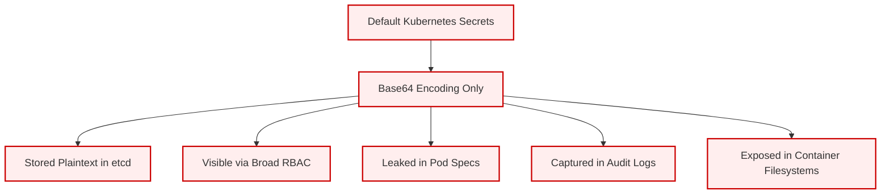
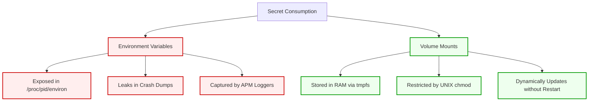
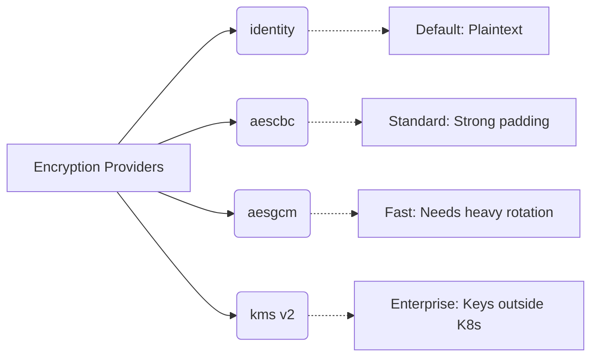
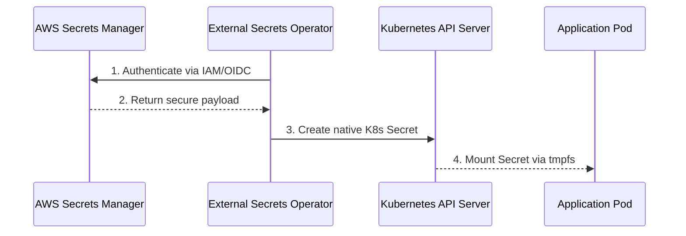

> **Complexity**: `[MEDIUM]` - Critical CKS skill
>
> **Time to Complete**: 45-50 minutes
>
> **Prerequisites**: Module 4.2 (Pod Security Admission), RBAC basics

---

## What You'll Be Able to Do

After completing this module, you will be able to:

1. **Diagnose** the security posture of existing Kubernetes Secrets by auditing etcd storage mechanisms and application consumption patterns.
2. **Implement** encryption at rest for etcd using AES-CBC to secure sensitive data against infrastructure-level theft and unauthorized control-plane reads.
3. **Implement** external secrets management using the External Secrets Operator to synchronize credentials securely from cloud provider secret stores (e.g., AWS Secrets Manager, HashiCorp Vault).
4. **Design** least-privilege RBAC policies utilizing `resourceNames` to strictly govern pod and user access to specific secret payloads.
5. **Evaluate** runtime secret consumption methods, comparing the attack surface of environment variables versus memory-backed volume mounts.

---

## Why This Module Matters

In September 2022, Uber suffered a catastrophic system-wide breach. The attackers didn't use a highly sophisticated zero-day exploit; they found a hardcoded administrator password inside an internal network share. In the Kubernetes ecosystem, an equivalent disaster happens every day when engineering teams mistakenly assume that Kubernetes Secrets are natively secure. When attackers gain initial access to a cluster, or even just compromise a poorly secured backup of the etcd database, unencrypted base64 strings act as an immediate skeleton key to your entire infrastructure. Databases, third-party APIs, and TLS private keys are laid bare.

The illusion of security provided by default Kubernetes Secrets is one of the most dangerous operational anti-patterns in cloud-native engineering. Kubernetes was architected for orchestration, not cryptographic credential management. Out of the box, it stores your most sensitive data in plain text inside its backing store. This makes the data incredibly vulnerable to anyone with direct node access, unencrypted backup access, or broad RBAC permissions that allow them to query the API server.

For the Certified Kubernetes Security Specialist (CKS) exam—and for any production-grade deployment running Kubernetes v1.35 or higher—mastering Secrets management is non-negotiable. You must be able to recognize the operational risks of default secrets, implement robust encryption at rest to protect the etcd data store, and understand how to integrate enterprise-grade external secret managers. Failing to secure secrets effectively turns a minor pod compromise into a catastrophic, unrecoverable total-system breach.

---

## The Reality of Default Kubernetes Secrets

Before we secure our secrets, we must understand how Kubernetes handles them by default. A Kubernetes `Secret` object is simply a specialized `ConfigMap` designed to hold sensitive data. By default, it applies a basic base64 encoding to the payloads to ensure binary data doesn't break JSON/YAML parsers. 

**Base64 encoding provides zero cryptographic security.**

```text
┌─────────────────────────────────────────────────────────────┐
│              DEFAULT SECRETS SECURITY                       │
├─────────────────────────────────────────────────────────────┤
│                                                             │
│  ⚠️  Base64 is NOT encryption!                             │
│  ─────────────────────────────────────────────────────────  │
│  $ echo "mysecretpassword" | base64                        │
│  bXlzZWNyZXRwYXNzd29yZAo=                                  │
│                                                             │
│  $ echo "bXlzZWNyZXRwYXNzd29yZAo=" | base64 -d            │
│  mysecretpassword                                          │
│                                                             │
│  Problems with default secrets:                            │
│  ├── Stored unencrypted in etcd                           │
│  ├── Visible to anyone with get secrets permission         │
│  ├── Appear in pod specs (kubectl describe)               │
│  ├── May be logged in audit logs                          │
│  └── Mounted as plain text files in containers            │
│                                                             │
└─────────────────────────────────────────────────────────────┘
```

For clarity, here is the modern architectural view of these vulnerabilities:



> **Stop and think**: You've perfectly configured RBAC so no unauthorized users can run `kubectl get secrets`. However, considering how Kubernetes natively stores and distributes these base64-encoded values, what underlying operational processes (like disaster recovery backups, centralized logging, or node administration) could still expose your plaintext passwords to an attacker who has zero API access?

---

## Creating and Consuming Secrets

Kubernetes supports multiple types of secrets to handle different authentication patterns natively.

### Generic Secret

You can create generic Opaque secrets from literal strings, files, or environment files.

```bash
# From literal values
kubectl create secret generic db-creds \
  --from-literal=username=admin \
  --from-literal=password=secretpass123

# From files
kubectl create secret generic ssh-key \
  --from-file=id_rsa=/path/to/id_rsa \
  --from-file=id_rsa.pub=/path/to/id_rsa.pub

# From env file
kubectl create secret generic app-config \
  --from-env-file=secrets.env
```

### TLS Secret

TLS secrets specifically expect `tls.crt` and `tls.key` data fields, which ingress controllers and web servers natively look for.

```bash
# Create TLS secret
kubectl create secret tls web-tls \
  --cert=server.crt \
  --key=server.key
```

### Docker Registry Secret

When pulling images from private registries, kubelets require specialized credentials formatted as a Docker config JSON.

```bash
# Create registry credential
kubectl create secret docker-registry regcred \
  --docker-server=registry.example.com \
  --docker-username=user \
  --docker-password=password \
  --docker-email=user@example.com
```

---

## Using Secrets in Pods: Environment Variables vs Volume Mounts

Once a secret exists, applications need to consume it. There are two primary methods: Environment Variables and Volume Mounts. From a security perspective, they are not equal.

### Environment Variables

Injecting secrets as environment variables is the most common, yet most dangerous, pattern.

```yaml
apiVersion: v1
kind: Pod
metadata:
  name: secret-env-pod
spec:
  containers:
  - name: app
    image: nginx
    env:
    - name: DB_USERNAME
      valueFrom:
        secretKeyRef:
          name: db-creds
          key: username
    - name: DB_PASSWORD
      valueFrom:
        secretKeyRef:
          name: db-creds
          key: password
```

### Volume Mounts (Preferred)

Mounting secrets as volumes attaches the secret to the pod as a file system construct. Kubernetes backs these specific mounts with `tmpfs`, meaning they exist only in RAM and are never written to the worker node's physical disk.

```yaml
apiVersion: v1
kind: Pod
metadata:
  name: secret-volume-pod
spec:
  containers:
  - name: app
    image: nginx
    volumeMounts:
    - name: secrets
      mountPath: /etc/secrets
      readOnly: true
  volumes:
  - name: secrets
    secret:
      secretName: db-creds
      # Optional: set specific permissions
      defaultMode: 0400
```

### Why Volume Mounts Are Better

```text
┌─────────────────────────────────────────────────────────────┐
│              ENV VARS vs VOLUME MOUNTS                      │
├─────────────────────────────────────────────────────────────┤
│                                                             │
│  Environment Variables:                                     │
│  ├── Visible in /proc/<pid>/environ                        │
│  ├── May leak to child processes                           │
│  ├── Often logged by applications                          │
│  └── Visible in 'docker inspect'                           │
│                                                             │
│  Volume Mounts:                                             │
│  ├── Files with restricted permissions                     │
│  ├── tmpfs (in-memory, not written to disk)               │
│  ├── Auto-updated when secret changes                      │
│  └── Controlled access via file permissions               │
│                                                             │
│  Best Practice: Always use volume mounts                   │
│                                                             │
└─────────────────────────────────────────────────────────────┘
```

Visualized as a comparative flow:



> **Pause and predict**: You mount a secret as an environment variable (`env.valueFrom.secretKeyRef`) and the application crashes. The crash dump includes environment variables and gets logged to your centralized logging system. Who can now see the secret?

---

## Securing Secrets at Rest (etcd Encryption)

To mitigate the risk of etcd backups or raw disk access exposing secrets, Kubernetes allows you to configure encryption at rest. This ensures that before the API server writes a secret to etcd, it encrypts the payload cryptographically.

### Check Current Encryption Status

First, you must determine if your cluster currently encrypts data.

```bash
# Check API server configuration
ps aux | grep kube-apiserver | grep encryption-provider-config

# Or check the manifest
cat /etc/kubernetes/manifests/kube-apiserver.yaml | grep encryption
```

### Encryption Providers

Kubernetes supports multiple cryptographic providers for at-rest encryption.

```text
┌─────────────────────────────────────────────────────────────┐
│              ENCRYPTION PROVIDERS                           │
├─────────────────────────────────────────────────────────────┤
│                                                             │
│  identity (default)                                        │
│  └── No encryption, plain storage                          │
│                                                             │
│  aescbc (recommended)                                      │
│  └── AES-CBC with PKCS#7 padding                          │
│      Strong, widely supported                              │
│                                                             │
│  aesgcm                                                    │
│  └── AES-GCM authenticated encryption                     │
│      Faster, must rotate keys every 200K writes           │
│                                                             │
│  kms                                                       │
│  └── External KMS provider (AWS KMS, Azure Key Vault)     │
│      Best for production, keys never touch etcd           │
│                                                             │
│  secretbox                                                 │
│  └── XSalsa20 + Poly1305                                  │
│      Strong, fixed nonce size                              │
│                                                             │
│  Order matters: First provider encrypts new secrets        │
│  All listed providers can decrypt                          │
│                                                             │
└─────────────────────────────────────────────────────────────┘
```

A hierarchical breakdown of providers:



### Enable etcd Encryption

We implement encryption by writing an `EncryptionConfiguration` file to the control plane.

```yaml
# /etc/kubernetes/enc/encryption-config.yaml
apiVersion: apiserver.config.k8s.io/v1
kind: EncryptionConfiguration
resources:
  - resources:
      - secrets
    providers:
      # aescbc - recommended for production
      - aescbc:
          keys:
            - name: key1
              secret: <base64-encoded-32-byte-key>
      # identity is the fallback (unencrypted)
      - identity: {}
```

### Generate Encryption Key

You must generate a cryptographically secure key for AES-CBC.

```bash
# Generate random 32-byte key
head -c 32 /dev/urandom | base64

# Example output (use your own!):
# K8sSecretEncryptionKey1234567890ABCDEF==
```

### Configure API Server

Mount the configuration into the static pod manifest. 

```yaml
# /etc/kubernetes/manifests/kube-apiserver.yaml
apiVersion: v1
kind: Pod
metadata:
  name: kube-apiserver
spec:
  containers:
  - command:
    - kube-apiserver
    # Add this flag
    - --encryption-provider-config=/etc/kubernetes/enc/encryption-config.yaml
    volumeMounts:
    # Mount the encryption config
    - mountPath: /etc/kubernetes/enc
      name: enc
      readOnly: true
  volumes:
  - hostPath:
      path: /etc/kubernetes/enc
      type: DirectoryOrCreate
    name: enc
```

### Verify Encryption Works

We can query etcd directly to prove the bytes on disk are no longer readable.

```bash
# Create a test secret
kubectl create secret generic test-encryption --from-literal=mykey=myvalue

# Read directly from etcd (on control plane)
ETCDCTL_API=3 etcdctl get /registry/secrets/default/test-encryption \
  --endpoints=https://127.0.0.1:2379 \
  --cacert=/etc/kubernetes/pki/etcd/ca.crt \
  --cert=/etc/kubernetes/pki/etcd/server.crt \
  --key=/etc/kubernetes/pki/etcd/server.key | hexdump -C

# If encrypted: You'll see random bytes, not readable text
# If NOT encrypted: You'll see "mykey" and "myvalue" in plain text
```

### Re-encrypt Existing Secrets

Because the API server only encrypts data *upon write*, old secrets remain exposed until forcefully rewritten.

```bash
# After enabling encryption, re-encrypt all existing secrets
kubectl get secrets -A -o json | kubectl replace -f -
```

> **Pause and predict**: You enable encryption at rest for secrets using `aescbc`. You then use `etcdctl get` to read a secret directly from etcd. Will you see the plain text or encrypted data? What about secrets that were created *before* you enabled encryption?

---

## Implementing External Secrets Management

While etcd encryption protects data at rest, managing secret lifecycle, rotation, and cross-cluster synchronization natively in Kubernetes is difficult. The industry standard is to delegate secret storage to external Key Management Systems (KMS) and inject them dynamically.

```text
┌─────────────────────────────────────────────────────────────┐
│              EXTERNAL SECRETS SOLUTIONS                     │
├─────────────────────────────────────────────────────────────┤
│                                                             │
│  HashiCorp Vault                                           │
│  └── Industry standard, rich features                      │
│      Vault Agent Injector for Kubernetes                   │
│                                                             │
│  AWS Secrets Manager + External Secrets Operator           │
│  └── Native AWS integration                                │
│      Syncs AWS secrets to Kubernetes                       │
│                                                             │
│  Azure Key Vault                                           │
│  └── Azure-native solution                                 │
│      CSI driver available                                  │
│                                                             │
│  Sealed Secrets (Bitnami)                                  │
│  └── Encrypt secrets for Git storage                       │
│      Only cluster can decrypt                              │
│                                                             │
│  Note: External solutions are NOT on CKS exam              │
│  but understanding them shows security maturity            │
│                                                             │
└─────────────────────────────────────────────────────────────┘
```

The architectural pattern relies on Kubernetes Operators acting as a bridge:



### Implementing External Secrets Operator (ESO)

To implement external secrets securely, we must define two Custom Resources: a `SecretStore` (which holds authentication details to talk to the cloud provider) and an `ExternalSecret` (which dictates what specific secret to fetch).

**Step 1: Define the SecretStore (Connecting to AWS)**
```yaml
apiVersion: external-secrets.io/v1beta1
kind: SecretStore
metadata:
  name: aws-backend
  namespace: production
spec:
  provider:
    aws:
      service: SecretsManager
      region: us-east-1
      auth:
        jwt:
          # Uses IAM Roles for Service Accounts (IRSA)
          serviceAccountRef:
            name: eso-auth-sa
```

**Step 2: Define the ExternalSecret (Fetching the Payload)**
```yaml
apiVersion: external-secrets.io/v1beta1
kind: ExternalSecret
metadata:
  name: db-credentials-sync
  namespace: production
spec:
  refreshInterval: "1h" # Auto-rotate every hour
  secretStoreRef:
    name: aws-backend
    kind: SecretStore
  target:
    name: native-db-creds # The name of the resulting K8s Secret
    creationPolicy: Owner
  data:
  - secretKey: password
    remoteRef:
      key: rds/production/master
      property: password
```

By using ESO, your source code repositories never touch the secrets, and developers cannot `kubectl get` the master keys unless granted explicit permission to the AWS backend.

---

## Access Control and RBAC for Secrets

Even with etcd encryption and external managers, if your RBAC allows a compromised frontend pod to read the backend database secret, you lose.

### Restrict Secret Access

Always lock down access to exact `resourceNames`.

```yaml
# Only allow access to specific secrets
apiVersion: rbac.authorization.k8s.io/v1
kind: Role
metadata:
  name: secret-reader
  namespace: production
rules:
- apiGroups: [""]
  resources: ["secrets"]
  resourceNames: ["app-config", "db-creds"]  # Specific secrets only
  verbs: ["get"]
```

### Dangerous RBAC Patterns

```yaml
# DON'T DO THIS - grants access to ALL secrets
apiVersion: rbac.authorization.k8s.io/v1
kind: ClusterRole
metadata:
  name: dangerous-role
rules:
- apiGroups: [""]
  resources: ["secrets"]
  verbs: ["get", "list", "watch"]  # Can read ALL secrets cluster-wide!
```

### Audit Secret Access

Use `can-i` to verify restrictions programmatically.

```bash
# Find who can access secrets
kubectl auth can-i get secrets --as=system:serviceaccount:default:default
kubectl auth can-i list secrets --as=system:serviceaccount:kube-system:default

# List all roles that can access secrets
kubectl get clusterroles -o json | jq '.items[] | select(.rules[]?.resources[]? == "secrets") | .metadata.name'
```

---

## Preventing Secret Exposure

Finally, minimize the attack surface of the pod itself.

### Disable Secret Auto-mount

Every pod automatically mounts a ServiceAccount token containing API credentials. If the pod doesn't talk to the Kubernetes API, disable it.

```yaml
apiVersion: v1
kind: Pod
metadata:
  name: no-automount-pod
spec:
  automountServiceAccountToken: false  # Don't mount SA token
  containers:
  - name: app
    image: nginx
```

### Use Read-Only Mounts

When mounting files, enforce `readOnly` flags and restrictive `defaultMode` permissions to prevent file tampering.

```yaml
apiVersion: v1
kind: Pod
metadata:
  name: readonly-secrets
spec:
  containers:
  - name: app
    image: nginx
    volumeMounts:
    - name: secrets
      mountPath: /etc/secrets
      readOnly: true  # Prevent modification
  volumes:
  - name: secrets
    secret:
      secretName: app-secrets
      defaultMode: 0400  # Read-only for owner
```

---

## Real Exam Scenarios

### Scenario 1: Enable etcd Encryption (Conceptual vs Automated)

Many guides show how to edit the API server manually. While educational, **this will fail automated laboratory checks and is dangerous in CI/CD environments.** 

Here is the conceptual flow:

```bash
# Step 1: Create encryption config directory
sudo mkdir -p /etc/kubernetes/enc

# Step 2: Generate encryption key
ENCRYPTION_KEY=$(head -c 32 /dev/urandom | base64)

# Step 3: Create encryption config
sudo tee /etc/kubernetes/enc/encryption-config.yaml << EOF
apiVersion: apiserver.config.k8s.io/v1
kind: EncryptionConfiguration
resources:
  - resources:
      - secrets
    providers:
      - aescbc:
          keys:
            - name: key1
              secret: ${ENCRYPTION_KEY}
      - identity: {}
EOF

# Step 4: Edit API server manifest
sudo vi /etc/kubernetes/manifests/kube-apiserver.yaml

# Add to command:
# - --encryption-provider-config=/etc/kubernetes/enc/encryption-config.yaml

# Add volume mount:
# volumeMounts:
# - mountPath: /etc/kubernetes/enc
#   name: enc
#   readOnly: true

# Add volume:
# volumes:
# - hostPath:
#     path: /etc/kubernetes/enc
#     type: DirectoryOrCreate
#   name: enc

# Step 5: Wait for API server to restart
kubectl get nodes  # Wait until this works

# Step 6: Re-encrypt existing secrets
kubectl get secrets -A -o json | kubectl replace -f -
```

**The Modern Automated Approach (Non-Interactive)**

To safely update `kube-apiserver.yaml` without breaking automation scripts, utilize stream editors (`sed`) or robust YAML parsers (`yq`).

```bash
# 1. Safely backup first
sudo cp /etc/kubernetes/manifests/kube-apiserver.yaml /tmp/kube-apiserver.yaml.bak

# 2. Inject the flag into the container command
sudo sed -i '/- kube-apiserver/a\    - --encryption-provider-config=/etc/kubernetes/enc/encryption-config.yaml' /etc/kubernetes/manifests/kube-apiserver.yaml

# 3. Inject the volumeMount safely
sudo sed -i '/volumeMounts:/a\    - mountPath: /etc/kubernetes/enc\n      name: enc\n      readOnly: true' /etc/kubernetes/manifests/kube-apiserver.yaml

# 4. Inject the hostPath volume
sudo sed -i '/volumes:/a\  - hostPath:\n      path: /etc/kubernetes/enc\n      type: DirectoryOrCreate\n    name: enc' /etc/kubernetes/manifests/kube-apiserver.yaml
```

### Scenario 2: Fix Secret RBAC

```bash
# Find ServiceAccount with too much secret access
kubectl get rolebindings,clusterrolebindings -A -o json | \
  jq -r '.items[] | select(.roleRef.name | contains("secret")) |
         "\(.metadata.namespace // "cluster")/\(.metadata.name) -> \(.roleRef.name)"'

# Create restrictive role
cat <<EOF | kubectl apply -f -
apiVersion: rbac.authorization.k8s.io/v1
kind: Role
metadata:
  name: app-secret-reader
  namespace: default
rules:
- apiGroups: [""]
  resources: ["secrets"]
  resourceNames: ["app-config"]  # Only this secret
  verbs: ["get"]
EOF
```

### Scenario 3: Create Secret from File

```bash
# Create secret containing certificate
kubectl create secret generic tls-cert \
  --from-file=tls.crt=./server.crt \
  --from-file=tls.key=./server.key \
  -n production

# Use in pod with volume mount
cat <<EOF | kubectl apply -f -
apiVersion: v1
kind: Pod
metadata:
  name: secure-app
  namespace: production
spec:
  containers:
  - name: app
    image: nginx
    volumeMounts:
    - name: tls
      mountPath: /etc/tls
      readOnly: true
  volumes:
  - name: tls
    secret:
      secretName: tls-cert
      defaultMode: 0400
EOF
```

---

## Did You Know?

- **In September 2022**, the monumental Uber breach highlighted the dangers of hardcoded credentials. Attackers utilized a plaintext password discovered on a network share to compromise Thycotic (their PAM solution) and subsequently AWS, Duo, and Google Workspace.
- **Kubernetes v1.13 (released December 2018)** graduated etcd encryption at rest to a stable feature, yet an estimated 40% of standard non-managed clusters still operate without it enabled today.
- **AES-GCM requires key rotation every 200,000 writes** to maintain its cryptographic integrity safely. Because this imposes massive operational overhead, `aescbc` remains the recommended provider for local encryption.
- **The External Secrets Operator** was officially accepted as a Cloud Native Computing Foundation (CNCF) Sandbox project in July 2022, rapidly becoming the industry standard over proprietary, vendor-locked sync mechanisms.

---

## Common Mistakes

| Mistake | Why It Hurts | Solution |
|---------|--------------|----------|
| Thinking base64 is secure | Data exposed immediately | Enable encryption at rest in etcd |
| Using env vars for secrets | Leaks to logs and `/proc` | Use tmpfs volume mounts |
| Broad RBAC for secrets | Any pod/user can read all keys | Scope RBAC utilizing `resourceNames` |
| Not re-encrypting after enabling | Old secrets remain unencrypted | Run `kubectl replace -f -` across secrets |
| Secrets stored directly in Git | Permanent, un-erasable exposure | Use External Secrets or Sealed Secrets |
| Default SA automounting | Attackers get free API access tokens | Set `automountServiceAccountToken: false` |
| Storing TLS certs in ConfigMaps | No API-level protection for raw keys | Use `kubernetes.io/tls` Secret types |

---

## Quiz

1. **A junior developer commits a Kubernetes Secret manifest to Git. The manifest contains `data: password: bXlwYXNzd29yZA==`. They say "it's fine, the password is encrypted." Why is this a security incident, and what's the immediate remediation?**
   <details>
   <summary>Answer</summary>
   Base64 is encoding, not encryption -- anyone can decode it (`echo "bXlwYXNzd29yZA==" | base64 -d` reveals "mypassword"). This is a credential leak. Immediate remediation: (1) Rotate the compromised password immediately. (2) Remove the secret from Git history (not just the latest commit -- use `git filter-branch` or BFG Repo Cleaner). (3) Consider the password permanently compromised since Git history persists in forks and caches. Prevention: use SealedSecrets or SOPS to encrypt secrets before committing, or use external secret managers (Vault, AWS Secrets Manager) that store references rather than values.
   </details>

2. **During a security audit, you discover that application pods use `env.valueFrom.secretKeyRef` to inject database passwords. The auditor flags this as a risk. The developer says "environment variables are standard practice." Who is right, and what's the concrete attack scenario?**
   <details>
   <summary>Answer</summary>
   The auditor is right. Environment variables are visible in `/proc/<pid>/environ`, can leak to child processes, appear in crash dumps, and are often captured in logging systems and error reporting tools. Concrete attack: if the application crashes and the error handler logs environment variables (common in frameworks like Django, Rails), the database password ends up in the logging system accessible to anyone with log access. Volume mounts are preferred because they're stored in tmpfs (memory-only), respect file permissions, auto-update when secrets change, and don't leak through `/proc` or crash dumps. Mount secrets as files and read them at runtime.
   </details>

3. **You enable encryption at rest for secrets with the `aescbc` provider. A compliance auditor asks you to prove all secrets are encrypted in etcd. You run `etcdctl get /registry/secrets/default/db-password` and see encrypted data. But when you check `/registry/secrets/kube-system/coredns-token`, you see plain text. What happened?**
   <details>
   <summary>Answer</summary>
   Enabling encryption at rest only affects newly created or updated secrets. Existing secrets created before encryption was enabled remain stored in plain text. The `db-password` was created after encryption, so it's encrypted. The `coredns-token` existed before and was never re-written. Fix: re-encrypt all existing secrets by reading and replacing them: `kubectl get secrets -A -o json | kubectl replace -f -`. This forces each secret to be re-written through the API server, which now encrypts them. Always verify with `etcdctl` after re-encryption. The `identity` provider in the encryption config serves as a fallback to read these old unencrypted secrets.
   </details>

4. **Your cluster stores database credentials, API keys, and TLS certificates as Kubernetes Secrets. An attacker gains `get secrets` RBAC permission in the `production` namespace. What is the blast radius, and what layers of defense should have limited it?**
   <details>
   <summary>Answer</summary>
   Blast radius: the attacker can read every secret in the `production` namespace -- all database passwords, API keys, and TLS private keys. They can decode base64 values instantly. Defense layers that should have limited this: (1) Use `resourceNames` in RBAC to restrict access to specific secrets, not all secrets in the namespace. (2) Enable encryption at rest so secrets are encrypted in etcd backups. (3) Use an external secrets manager (Vault, AWS Secrets Manager) so Kubernetes only stores references, not actual values. (4) Mount secrets as volumes (not env vars) to limit exposure paths. (5) Audit secret access with audit logging to detect unauthorized reads. No single layer is sufficient -- secrets management requires defense in depth.
   </details>

5. **You are implementing the External Secrets Operator. You created a `SecretStore` but the dependent `ExternalSecret` is stuck in `Status: SecretSyncedError`. You check the ESO pod logs and see a "403 Access Denied" error from your cloud provider. What architectural component is missing?**
   <details>
   <summary>Answer</summary>
   The External Secrets Operator pod itself lacks the proper IAM role or cloud provider identity required to read the secret from the remote backend (e.g., AWS Secrets Manager, GCP Secret Manager). ESO needs an authenticated identity, typically configured via IAM Roles for Service Accounts (IRSA) in AWS or Workload Identity in GCP, so it can securely pull the remote payload before constructing the native Kubernetes Secret.
   </details>

6. **An administrator uses a script to inject the `--encryption-provider-config` flag into the `kube-apiserver.yaml` manifest. After the kubelet restarts the static pod, the API server crashes continually with a "no such file or directory" error in `/var/log/pods`. What critical configuration step was omitted?**
   <details>
   <summary>Answer</summary>
   The administrator forgot to configure the necessary `volumeMounts` and `volumes` in the static pod manifest. Even if the encryption configuration file exists perfectly on the control plane host at `/etc/kubernetes/enc/encryption-config.yaml`, the API server container runs in isolation and cannot see host files unless they are explicitly mounted into the container via a `hostPath` volume.
   </details>

---

## Hands-On Exercise

**Task**: Safely enable encryption at rest for an active cluster and verify the cryptographic transformation, utilizing non-interactive automation techniques designed for CI/CD environments.

<details>
<summary>View Legacy Interactive Solution (Reference Only)</summary>

```bash
# Step 1: Check current encryption status
ps aux | grep kube-apiserver | grep encryption-provider-config || echo "Not configured"

# Step 2: Create test secret BEFORE encryption
kubectl create secret generic pre-encryption --from-literal=test=beforeencryption

# Step 3: Create encryption config (on control plane node)
sudo mkdir -p /etc/kubernetes/enc

ENCRYPTION_KEY=$(head -c 32 /dev/urandom | base64)
sudo tee /etc/kubernetes/enc/encryption-config.yaml << EOF
apiVersion: apiserver.config.k8s.io/v1
kind: EncryptionConfiguration
resources:
  - resources:
      - secrets
    providers:
      - aescbc:
          keys:
            - name: key1
              secret: ${ENCRYPTION_KEY}
      - identity: {}
EOF

# Step 4: Backup API server manifest
sudo cp /etc/kubernetes/manifests/kube-apiserver.yaml /tmp/kube-apiserver.yaml.bak

# Step 5: Edit API server manifest (add encryption config)
# Add: --encryption-provider-config=/etc/kubernetes/enc/encryption-config.yaml
# Add volume and volumeMount for /etc/kubernetes/enc

# Step 6: Wait for API server restart
sleep 30
kubectl get nodes

# Step 7: Create test secret AFTER encryption
kubectl create secret generic post-encryption --from-literal=test=afterencryption

# Step 8: Re-encrypt pre-existing secret
kubectl get secret pre-encryption -o json | kubectl replace -f -

# Step 9: Verify in etcd (if you have access)
# Encrypted secrets show random bytes, not plain text

# Cleanup
kubectl delete secret pre-encryption post-encryption
```
</details>

<details open>
<summary>Automated Non-Interactive Solution (Lab Standard)</summary>

**Step 1: Check Status and Create Baseline Secret**
```bash
# Verify no encryption exists currently
ps aux | grep kube-apiserver | grep encryption-provider-config || echo "Encryption disabled."

# Create an unencrypted secret
kubectl create secret generic legacy-secret --from-literal=status=unencrypted
```

**Step 2: Generate Config and Keys Non-Interactively**
```bash
sudo mkdir -p /etc/kubernetes/enc
export ENC_KEY=$(head -c 32 /dev/urandom | base64)

cat <<EOF | sudo tee /etc/kubernetes/enc/encryption-config.yaml
apiVersion: apiserver.config.k8s.io/v1
kind: EncryptionConfiguration
resources:
  - resources:
      - secrets
    providers:
      - aescbc:
          keys:
            - name: primary-key
              secret: ${ENC_KEY}
      - identity: {}
EOF
```

**Step 3: Patch the API Server Manifest using `sed`**
```bash
sudo cp /etc/kubernetes/manifests/kube-apiserver.yaml /tmp/backup.yaml

# Safely inject the provider flag
sudo sed -i '/- kube-apiserver/a\    - --encryption-provider-config=/etc/kubernetes/enc/encryption-config.yaml' /etc/kubernetes/manifests/kube-apiserver.yaml

# Inject VolumeMount
sudo sed -i '/volumeMounts:/a\    - mountPath: /etc/kubernetes/enc\n      name: enc\n      readOnly: true' /etc/kubernetes/manifests/kube-apiserver.yaml

# Inject Volume
sudo sed -i '/volumes:/a\  - hostPath:\n      path: /etc/kubernetes/enc\n      type: DirectoryOrCreate\n    name: enc' /etc/kubernetes/manifests/kube-apiserver.yaml
```

**Step 4: Verify Restart and Re-Encrypt**
```bash
# Wait for the control plane to stabilize
sleep 30
kubectl wait --for=condition=Ready node --all --timeout=60s

# Generate a new secret to prove encryption works immediately
kubectl create secret generic modern-secret --from-literal=status=encrypted

# Re-encrypt the legacy secret via replace
kubectl get secrets legacy-secret -o json | kubectl replace -f -
```

</details>

**Success Checklist**:
- [ ] API server restarts successfully with the `--encryption-provider-config` flag active.
- [ ] New secrets generated after the restart are written securely.
- [ ] `kubectl replace` successfully cycles old plaintext data into AES-CBC ciphertexts.

---

## Summary

**Secret Security Problems**:
- Base64 is NOT encryption; it is simply encoding.
- etcd stores plain text by default, exposing data to node and backup breaches.
- Environment variables leak highly sensitive data into `/proc`, crash dumps, and APM systems.

**Best Practices**:
- Enable encryption at rest utilizing `aescbc`.
- Emphasize tmpfs volume mounts over environment variable injection.
- Restrict RBAC explicitly with `resourceNames`.
- Remember to re-encrypt existing keys after enabling provider encryption.
- Adopt External Secrets Operator (ESO) for production, multi-cloud architectures.

**Encryption Setup**:
- Construct the `EncryptionConfiguration` file carefully.
- Patch the API server flag, volume, and volume mount.
- Execute a cluster-wide `replace` operation.

**Exam Tips**:
- Know the exact encryption config YAML format—you must be able to write it from memory or documentation.
- Understand provider priority order: the first provider encrypts, all listed providers attempt to decrypt.
- Be thoroughly prepared to automate file edits under pressure using `sed` or `yq`.

---

## Next Module

[Module 4.4: Runtime Sandboxing](../module-4.4-runtime-sandboxing/) - Secure your pods beyond RBAC by learning how gVisor and Kata Containers build aggressive, kernel-level isolation layers to trap attackers.